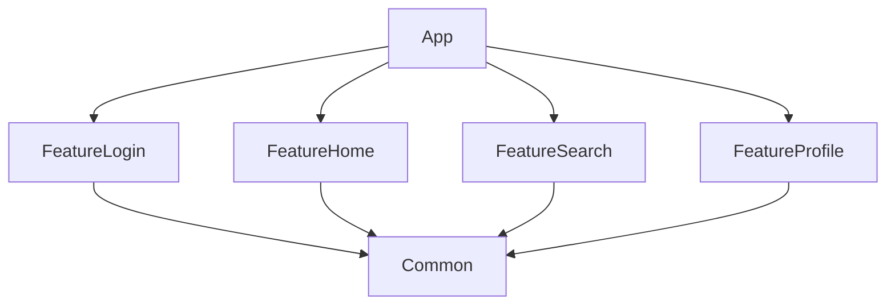

# @高级软件工程师 请指导我编写该安卓app项目，使用java语言，配置文件基于 Kotlin DSL。


您好！作为一名高级软件工程师，我很高兴能为您提供关于使用Java语言开发Android应用，并基于Kotlin DSL进行配置的详细指导。我们将遵循“分步完成”的原则，确保每个环节都清晰明了，代码可运行且带有注释。

根据您提供的需求，该App项目将包含以下核心功能：欢迎页面、登录、注册、首页、搜索和我的。在工程实践上，我们将涵盖工程创建、分模块代码编写、打包、签名和发布。同时，也会着重进行UI优化、启动优化和整体性能优化。此外，我们还将探讨一些加分项的实现，如首页瀑布流、下拉刷新、加载更多、页面跳转动画以及代码封装概念。

### 1. 项目创建与Kotlin DSL配置

首先，我们来创建一个新的Android项目，并确保其构建配置使用Kotlin DSL。Kotlin DSL (Domain-Specific Language) 相比传统的Groovy DSL，具有更好的类型安全性和IDE支持，能够提供自动补全、重构等便利功能，从而提高开发效率 [5]。

**步骤：**
1.  **创建新项目：** 打开Android Studio，选择“New Project”。
2.  **选择模板：** 选择一个适合您需求的Activity模板，例如“Empty Activity”。
3.  **配置项目：** 在项目配置界面，确保“Language”选择“Java”，“Build configuration language”选择“Kotlin DSL”。如果默认是Groovy，您也可以在项目创建后手动迁移 [1][5]。

**build.gradle.kts 文件结构示例：**

一个典型的 `build.gradle.kts` 文件（例如 `app/build.gradle.kts`）会是这样的：

```kotlin
// app/build.gradle.kts
plugins {
    // 应用Android应用程序插件
    id("com.android.application")
    // 应用Kotlin Android插件，用于Kotlin相关功能
    id("org.jetbrains.kotlin.android")
}

android {
    // 配置编译SDK版本
    compileSdk = 34

    // 配置默认的BuildConfig字段
    defaultConfig {
        // 应用ID，通常是唯一的包名
        applicationId = "com.example.myandroidapp"
        // 最小SDK版本
        minSdk = 24
        // 目标SDK版本
        targetSdk = 34
        // 版本代码，每次发布递增
        versionCode = 1
        // 版本名称，供用户识别
        versionName = "1.0"

        // 配置测试runner
        testInstrumentationRunner = "androidx.test.runner.AndroidJUnitRunner"
    }

    // 配置构建类型（如debug和release）
    buildTypes {
        // release构建类型
        release {
            // 是否启用代码混淆和优化
            isMinifyEnabled = false
            // ProGuard规则文件
            proguardFiles(
                getDefaultProguardFile("proguard-android-optimize.txt"),
                "proguard-rules.pro"
            )
        }
    }
    // 配置编译选项，指定Java版本
    compileOptions {
        sourceCompatibility = JavaVersion.VERSION_1_8
        targetCompatibility = JavaVersion.VERSION_1_8
    }
    // 配置Kotlin编译选项
    kotlinOptions {
        jvmTarget = "1.8"
    }
}

dependencies {
    // 添加androidx核心库
    implementation("androidx.core:core-ktx:1.10.0")
    // 添加appcompat库，提供向后兼容的UI组件
    implementation("androidx.appcompat:appcompat:1.6.1")
    // 添加Material Design组件库
    implementation("com.google.android.material:material:1.9.0")
    // 添加约束布局库
    implementation("androidx.constraintlayout:constraintlayout:2.1.4")
    // 添加JUnit测试库
    testImplementation("junit:junit:4.13.2")
    // 添加AndroidX JUnit测试库
    androidTestImplementation("androidx.test.ext:junit:1.1.5")
    // 添加Espresso UI测试库
    androidTestImplementation("androidx.test.espresso:espresso-core:3.5.1")
}
```

### 2. App功能与模块化设计

为了更好地管理代码和提高可维护性，我们将采用模块化设计。这将有助于实现“分模块代码编写”的要求。

**功能列表：**
*   **欢迎页面 (Splash/Welcome Page)：** 应用启动时首先展示，可用于加载资源或检查更新。
*   **登录 (Login Page)：** 用户输入凭据进行身份验证。
*   **注册 (Register Page)：** 新用户创建账户。
*   **首页 (Home Page)：** 应用的核心内容展示，可能包含瀑布流、下拉刷新和加载更多功能。
*   **搜索 (Search Page)：** 允许用户搜索应用内的内容。
*   **我的 (My/Profile Page)：** 展示用户个人信息和相关设置。

**模块化架构建议：**

我们可以将应用拆分为以下几个模块：

*   **`:app` 模块：** 主应用模块，负责组装各个功能模块，处理全局配置和导航。
*   **`:common` 模块：** 存放所有模块通用的工具类、常量、基础UI组件等。
*   **`:feature:login` 模块：** 包含登录和注册相关的所有代码。
*   **`:feature:home` 模块：** 包含首页及其相关逻辑。
*   **`:feature:search` 模块：** 包含搜索功能。
*   **`:feature:profile` 模块：** 包含“我的”页面功能。

**Mermaid 模块依赖图：**



**Java 代码结构（以登录模块为例）：**

在Java中，我们将使用Android的组件（Activity, Fragment, ViewModel等）来实现这些功能。例如，登录模块可以包含 `LoginActivity`、`LoginViewModel` 和 `LoginRepository`。

```java
// feature/login/src/main/java/com/example/login/LoginActivity.java
package com.example.login;

import android.content.Intent;
import android.os.Bundle;
import android.view.View;
import android.widget.Button;
import android.widget.EditText;
import android.widget.Toast;

import androidx.appcompat.app.AppCompatActivity;
import androidx.lifecycle.ViewModelProvider;

import com.example.common.utils.ValidationUtils; // 引用common模块的工具类
import com.example.app.MainActivity; // 假设MainActivity是首页

public class LoginActivity extends AppCompatActivity {

    private EditText usernameEditText;
    private EditText passwordEditText;
    private Button loginButton;
    private LoginViewModel loginViewModel;

    @Override
    protected void onCreate(Bundle savedInstanceState) {
        super.onCreate(savedInstanceState);
        setContentView(R.layout.activity_login); // 登录界面的布局文件

        // 初始化视图组件
        usernameEditText = findViewById(R.id.username_edit_text);
        passwordEditText = findViewById(R.id.password_edit_text);
        loginButton = findViewById(R.id.login_button);

        // 获取LoginViewModel实例
        loginViewModel = new ViewModelProvider(this).get(LoginViewModel.class);

        // 观察登录结果
        loginViewModel.getLoginResult().observe(this, loginSuccess -> {
            if (loginSuccess) {
                // 登录成功，跳转到主页
                Toast.makeText(LoginActivity.this, "登录成功", Toast.LENGTH_SHORT).show();
                Intent intent = new Intent(LoginActivity.this, MainActivity.class);
                startActivity(intent);
                finish(); // 结束当前登录Activity
            } else {
                // 登录失败，显示错误信息
                Toast.makeText(LoginActivity.this, "用户名或密码错误", Toast.LENGTH_SHORT).show();
            }
        });

        // 设置登录按钮点击事件
        loginButton.setOnClickListener(new View.OnClickListener() {
            @Override
            public void onClick(View v) {
                String username = usernameEditText.getText().toString();
                String password = passwordEditText.getText().toString();

                // 输入校验，使用common模块的工具类
                if (ValidationUtils.isValidUsername(username) && ValidationUtils.isValidPassword(password)) {
                    // 调用ViewModel进行登录操作
                    loginViewModel.login(username, password);
                } else {
                    Toast.makeText(LoginActivity.this, "请输入有效的用户名和密码", Toast.LENGTH_SHORT).show();
                }
            }
        });
    }
}
```

### 3. 工程实践：打包、签名与发布

*   **打包 (Packaging)：** Android Studio和Gradle会自动处理APK或AAB（Android App Bundle）的打包过程。在构建Release版本时，Gradle会执行资源压缩、代码混淆（如果配置了ProGuard/R8）等优化。
*   **签名 (Signing)：** 发布到应用商店（如Google Play Store）的APK或AAB必须经过数字签名。您需要生成一个签名密钥库（.jks或.keystore文件），并在 `build.gradle.kts` 中配置签名信息。

    ```kotlin
    // app/build.gradle.kts (部分内容)
    android {
        // ...
        signingConfigs {
            create("release") {
                // 签名文件路径
                storeFile = file("your_keystore_file.jks")
                // 签名文件密码
                storePassword = "your_store_password"
                // 别名
                keyAlias = "your_key_alias"
                // 别名密码
                keyPassword = "your_key_password"
            }
        }
        buildTypes {
            release {
                // 关联签名配置
                signingConfig = signingConfigs.getByName("release")
                isMinifyEnabled = true
                proguardFiles(
                    getDefaultProguardFile("proguard-android-optimize.txt"),
                    "proguard-rules.pro"
                )
            }
            debug {
                // debug版本通常使用debug签名
                signingConfig = signingConfigs.getByName("debug")
            }
        }
    }
    ```
*   **发布 (Releasing)：** 通常涉及将签名的AAB或APK上传到应用商店（如Google Play Console），填写应用信息、截图、描述等，然后提交审核。

### 4. 性能优化

性能优化是提升用户体验的关键。我们将从UI、启动和整体性能三个方面进行考虑。

*   **UI 优化：**
    *   **布局优化：** 减少布局层级，使用 `ConstraintLayout` 替代嵌套的 `LinearLayout` 或 `RelativeLayout`。
    *   **视图复用：** 在 `RecyclerView` 中正确使用 `ViewHolder` 模式，避免重复创建视图。
    *   **图片优化：** 加载适当大小的图片，使用图片缓存库（如Glide, Picasso），避免OOM。
*   **启动优化：**
    *   **减少启动时初始化：** 将不必要的初始化操作延迟到应用启动后按需进行。
    *   **启动页面优化：** 避免在欢迎页面进行耗时操作，尽快进入主界面。
    *   **多进程：** 对于某些独立功能，可以考虑将其放在单独的进程中，避免影响主进程启动速度。
*   **整体性能优化：**
    *   **内存优化：** 避免内存泄漏，使用内存分析工具（如Android Profiler）检测和修复问题。
    *   **网络优化：** 减少网络请求次数，使用缓存，优化数据传输格式。
    *   **ANR (Application Not Responding) 避免：** 避免在主线程执行耗时操作，使用异步任务（如`AsyncTask`、线程池、Kotlin Coroutines或RxJava）。

### 5. 加分项实现

这些加分项将进一步提升App的用户体验和代码质量。

*   **首页使用瀑布流 (Waterfall Flow)：**
    *   使用 `RecyclerView` 配合 `StaggeredGridLayoutManager` 可以轻松实现瀑布流布局。
    *   **示例代码（Java）：**
        ```java
        // 在你的首页Activity或Fragment中
        RecyclerView recyclerView = findViewById(R.id.waterfall_recycler_view);
        // 创建StaggeredGridLayoutManager，两列，垂直方向
        StaggeredGridLayoutManager layoutManager = new StaggeredGridLayoutManager(2, StaggeredGridLayoutManager.VERTICAL);
        recyclerView.setLayoutManager(layoutManager);
        // 设置适配器
        recyclerView.setAdapter(new WaterfallAdapter(dataList));
        ```
*   **首页有下拉刷新 (Pull-to-Refresh)：**
    *   使用 `SwipeRefreshLayout` 是Android官方推荐的下拉刷新组件。
    *   **示例代码（Java）：**
        ```java
        // 在你的首页Activity或Fragment中
        SwipeRefreshLayout swipeRefreshLayout = findViewById(R.id.swipe_refresh_layout);
        swipeRefreshLayout.setOnRefreshListener(new SwipeRefreshLayout.OnRefreshListener() {
            @Override
            public void onRefresh() {
                // 执行数据刷新操作，例如重新加载数据
                loadNewData();
                // 刷新完成后，隐藏刷新动画
                swipeRefreshLayout.setRefreshing(false);
            }
        });
        ```
*   **首页有加载更多 (Load More)：**
    *   通过监听 `RecyclerView` 的滚动事件，当滚动到底部时触发加载更多数据。
    *   **示例代码（Java，简化版）：**
        ```java
        recyclerView.addOnScrollListener(new RecyclerView.OnScrollListener() {
            @Override
            public void onScrolled(@NonNull RecyclerView recyclerView, int dx, int dy) {
                super.onScrolled(recyclerView, dx, dy);
                LinearLayoutManager layoutManager = (LinearLayoutManager) recyclerView.getLayoutManager();
                if (layoutManager != null) {
                    int visibleItemCount = layoutManager.getChildCount();
                    int totalItemCount = layoutManager.getItemCount();
                    int firstVisibleItemPosition = layoutManager.findFirstVisibleItemPosition();

                    // 判断是否滚动到列表底部且没有在加载中
                    if (!isLoading && (visibleItemCount + firstVisibleItemPosition) >= totalItemCount
                            && firstVisibleItemPosition >= 0) {
                        isLoading = true; // 设置加载状态，避免重复加载
                        loadMoreData(); // 加载更多数据
                    }
                }
            }
        });
        ```
*   **页面跳转有动画 (Page Transition Animations)：**
    *   可以通过 `overridePendingTransition()` 方法或在 `styles.xml` 中定义Activity切换动画。
    *   **示例代码（Java）：**
        ```java
        Intent intent = new Intent(this, TargetActivity.class);
        startActivity(intent);
        // 定义进入和退出动画
        overridePendingTransition(R.anim.slide_in_right, R.anim.slide_out_left);
        ```
    *   在 `res/anim` 目录下创建 `slide_in_right.xml` 和 `slide_out_left.xml`：
        ```xml
        <!-- slide_in_right.xml -->
        <set xmlns:android="http://schemas.android.com/apk/res/android">
            <translate
                android:fromXDelta="100%"
                android:toXDelta="0%"
                android:duration="300" />
        </set>
        ```
        ```xml
        <!-- slide_out_left.xml -->
        <set xmlns:android="http://schemas.android.com/apk/res/android">
            <translate
                android:fromXDelta="0%"
                android:toXDelta="-100%"
                android:duration="300" />
        </set>
        ```
*   **性能优秀 (Excellent Performance)：**
    *   这需要贯穿整个开发过程，持续进行上述的UI、启动和整体性能优化。定期使用Android Profiler进行性能分析，识别并解决瓶颈。
*   **有封装概念的加分 (Good Encapsulation)：**
    *   **模块化：** 如前所述，将功能划分为独立的模块。
    *   **设计模式：** 运用如MVVM (Model-View-ViewModel)、Repository Pattern等设计模式，分离关注点，提高代码的可测试性和可维护性。
    *   **接口与抽象：** 广泛使用接口和抽象类，定义清晰的API，隐藏实现细节。
    *   **单一职责原则：** 确保每个类或方法只负责一个功能。

通过以上指导，您可以逐步构建一个高质量的Android应用。祝您开发顺利！


# @高级软件工程师 第一步做什么？


好的，我们现在开始第一步。

**第一步：创建新的Android项目并配置Kotlin DSL**

这是整个项目的基础。我们将使用Android Studio来创建一个全新的Android项目，并确保其构建脚本使用Kotlin DSL。

**具体操作步骤：**

1.  **启动 Android Studio**：
    *   如果您已经打开了Android Studio，请关闭当前项目（File -> Close Project）。
    *   在欢迎界面，点击 "New Project"（新建项目）。

2.  **选择项目模板**：
    *   在 "New Project" 向导中，选择 "Phone and Tablet" 选项卡。
    *   选择 **"Empty Activity"**（空 Activity）模板。这个模板提供了一个最基本的Activity，适合从头开始构建应用。
    *   点击 "Next"（下一步）。

3.  **配置项目**：
    *   在 "Configure your project"（配置您的项目）界面，填写以下信息：
        *   **Name (名称)**：为您的应用程序命名，例如 `MyAndroidApp` 或 `AwesomeApp`。
        *   **Package name (包名)**：这是您应用的唯一标识符，通常是公司或个人域名的反向形式，例如 `com.example.myandroidapp`。
        *   **Save location (保存位置)**：选择您希望项目保存的本地路径。
        *   **Language (语言)**：**选择 `Java`**。这是我们项目的主要开发语言。
        *   **Build configuration language (构建配置语言)**：**选择 `Kotlin DSL`**。这是关键一步，确保您的 `build.gradle` 文件将是 `build.gradle.kts`。
        *   **Minimum SDK version (最低 SDK 版本)**：选择一个合适的版本，例如 `API 24: Android 7.0 (Nougat)`。这个版本可以覆盖绝大多数活跃的Android设备。
    *   点击 "Finish"（完成）。

4.  **等待项目同步**：
    *   Android Studio将创建项目并下载所需的Gradle依赖。这可能需要一些时间，取决于您的网络连接速度。
    *   等待右下角的Gradle同步进度条完成。

**完成这一步后，您将看到一个包含以下基本文件结构的新项目：**

*   `app/build.gradle.kts`：这是您应用程序模块的构建配置文件，现在它将是Kotlin DSL格式。
*   `app/src/main/java/com/example/yourpackage/MainActivity.java`：默认的Java主Activity文件。
*   `app/src/main/res/layout/activity_main.xml`：主Activity的布局文件。
*   其他Gradle相关文件和项目设置。

**验证 Kotlin DSL 配置：**

请打开 `app/build.gradle.kts` 文件，确保其内容类似于我在上一个回答中给出的示例，特别是 `plugins` 和 `android` 块的语法应该是Kotlin DSL的风格（例如使用 `=` 进行赋值，而不是Groovy的 `:`）。

```kotlin
// app/build.gradle.kts
plugins {
    id("com.android.application") // 应用Android应用程序插件
    id("org.jetbrains.kotlin.android") // 应用Kotlin Android插件
}

android {
    compileSdk = 34 // 编译SDK版本
    // ... 其他配置
}

dependencies {
    // ... 依赖
}
```

如果您的 `build.gradle` 文件名是 `build.gradle` 而不是 `build.gradle.kts`，或者其内容是Groovy语法，那么您可能在创建项目时没有正确选择 "Kotlin DSL"。在这种情况下，您可以考虑重新创建项目，或者手动将Groovy DSL转换为Kotlin DSL（这会更复杂，不推荐作为第一步）。

请您完成这一步后告诉我，我们将继续进行下一步：设计欢迎页面。


# @高级软件工程师 好的，下一步


好的，第一步项目创建和Kotlin DSL配置已经完成，非常棒！现在我们进入项目的第二步。

---

**第二步：设计和实现欢迎页面 (Splash Screen)**

欢迎页面是用户打开应用时看到的第一屏。它通常用于展示应用Logo、公司品牌，或者在后台进行一些初始化操作（如数据加载、权限检查等）。为了提供良好的用户体验，欢迎页面通常会短暂显示几秒钟，然后自动跳转到主界面或登录界面。

我们将分以下几个小步骤来完成欢迎页面的实现：

1.  **创建欢迎页面的布局文件。**
2.  **创建欢迎页面的Java Activity。**
3.  **配置 `AndroidManifest.xml`，将欢迎页面设置为应用的启动入口。**

---

### 2.1 创建欢迎页面的布局文件

我们将创建一个简单的布局，包含一个Logo和一个标语。

**操作步骤：**

1.  在 Android Studio 的项目视图中，导航到 `app/src/main/res/layout` 目录。
2.  右键点击 `layout` 文件夹 -> New -> Layout Resource File。
3.  在弹出的对话框中：
    *   **File name (文件名)**：输入 `activity_splash.xml`。
    *   **Root element (根元素)**：输入 `RelativeLayout` (或者 `ConstraintLayout` 也可以)。
    *   点击 "OK"。

**`activity_splash.xml` 代码：**

```xml
<!-- app/src/main/res/layout/activity_splash.xml -->
<?xml version="1.0" encoding="utf-8"?>
<RelativeLayout xmlns:android="http://schemas.android.com/apk/res/android"
    xmlns:app="http://schemas.android.com/apk/res-auto"
    xmlns:tools="http://schemas.android.com/tools"
    android:layout_width="match_parent"
    android:layout_height="match_parent"
    android:background="#FFFFFF" <!-- 设置背景颜色为白色，可以根据您的品牌色调整 -->
    tools:context=".SplashActivity"> <!-- 关联到我们即将创建的SplashActivity -->

    <!-- 应用Logo -->
    <ImageView
        android:id="@+id/app_logo"
        android:layout_width="150dp"
        android:layout_height="150dp"
        android:layout_centerInParent="true" <!-- 水平垂直居中 -->
        android:src="@drawable/ic_launcher_foreground" <!-- 替换为您的应用Logo图片 -->
        android:contentDescription="App Logo" /> <!-- 无障碍描述 -->

    <!-- 应用标语或名称 -->
    <TextView
        android:id="@+id/app_slogan"
        android:layout_width="wrap_content"
        android:layout_height="wrap_content"
        android:layout_below="@id/app_logo" <!-- 位于Logo下方 -->
        android:layout_centerHorizontal="true" <!-- 水平居中 -->
        android:layout_marginTop="20dp" <!-- 与Logo的间距 -->
        android:text="欢迎来到我的Android应用" <!-- 您的应用标语 -->
        android:textColor="#333333" <!-- 文本颜色 -->
        android:textSize="20sp" <!-- 文本大小 -->
        android:textStyle="bold" /> <!-- 字体加粗 -->

</RelativeLayout>
```

**注意：**
*   `android:src="@drawable/ic_launcher_foreground"`：这是一个默认的图标。您应该将其替换为您自己的应用Logo图片。将您的Logo图片（例如 `my_app_logo.png`）复制到 `app/src/main/res/drawable` 文件夹下，然后将 `android:src` 修改为 `@drawable/my_app_logo`。
*   背景颜色和文本颜色、大小等都可以根据您的设计需求进行调整。

---

### 2.2 创建欢迎页面的Java Activity

现在，我们来创建与 `activity_splash.xml` 关联的Java代码。

**操作步骤：**

1.  在 Android Studio 的项目视图中，导航到 `app/src/main/java/com/example/yourpackagename` 目录（`yourpackagename` 是您项目创建时定义的包名）。
2.  右键点击您的包名 -> New -> Java Class。
3.  在弹出的对话框中：
    *   **Name (名称)**：输入 `SplashActivity`。
    *   **Kind (类型)**：选择 `Class` (默认)。
    *   点击 "OK"。

**`SplashActivity.java` 代码：**

```java
// app/src/main/java/com/example/yourpackagename/SplashActivity.java
package com.example.myandroidapp; // 请替换为您的实际包名

import android.content.Intent;
import android.os.Bundle;
import android.os.Handler;
import android.os.Looper;

import androidx.appcompat.app.AppCompatActivity;

// SplashActivity 类继承自 AppCompatActivity，用于创建欢迎页面
public class SplashActivity extends AppCompatActivity {

    // 欢迎页面的显示时长（毫秒），这里设置为2秒
    private static final long SPLASH_DISPLAY_LENGTH = 2000; // 2秒

    @Override
    protected void onCreate(Bundle savedInstanceState) {
        super.onCreate(savedInstanceState);
        // 设置Activity的布局文件为 activity_splash.xml
        setContentView(R.layout.activity_splash);

        // 使用Handler和postDelayed方法实现延迟跳转
        // Looper.getMainLooper() 确保Handler在主线程上运行
        new Handler(Looper.getMainLooper()).postDelayed(new Runnable() {
            @Override
            public void run() {
                /*
                 * 在延迟结束后执行此Runnable
                 * 创建一个Intent，用于从SplashActivity跳转到MainActivity
                 * MainActivity是您应用的主界面，我们将在后续步骤中完善它
                 */
                Intent mainIntent = new Intent(SplashActivity.this, MainActivity.class);
                startActivity(mainIntent); // 启动MainActivity

                // 结束当前的SplashActivity，防止用户按返回键回到欢迎页面
                finish();
            }
        }, SPLASH_DISPLAY_LENGTH); // 延迟时间
    }
}
```

**注意：**
*   请将 `package com.example.myandroidapp;` 替换为您实际的项目包名。
*   `MainActivity.class` 是您项目默认创建的主Activity。在后续步骤中，我们可能会将其更改为登录页面或真正的首页。

---

### 2.3 配置 `AndroidManifest.xml`

为了让 `SplashActivity` 成为应用的第一个启动页面，我们需要修改 `AndroidManifest.xml`。

**操作步骤：**

1.  在 Android Studio 的项目视图中，导航到 `app/src/main/AndroidManifest.xml` 文件并打开它。
2.  找到 `<activity android:name=".MainActivity">` 标签块。
3.  将原本属于 `MainActivity` 的 `intent-filter` 移动到 `SplashActivity` 中。

**修改后的 `AndroidManifest.xml` 代码：**

```xml
<?xml version="1.0" encoding="utf-8"?>
<manifest xmlns:android="http://schemas.android.com/apk/res/android"
    xmlns:tools="http://schemas.android.com/tools">

    <application
        android:allowBackup="true"
        android:dataExtractionRules="@xml/data_extraction_rules"
        android:fullBackupContent="@xml/backup_rules"
        android:icon="@mipmap/ic_launcher"
        android:label="@string/app_name"
        android:roundIcon="@mipmap/ic_launcher_round"
        android:supportsRtl="true"
        android:theme="@style/Theme.MyAndroidApp" <!-- 您的应用主题，可能与此不同 -->
        tools:targetApi="31">

        <!-- SplashActivity 作为应用的启动入口 -->
        <activity
            android:name=".SplashActivity"
            android:exported="true" <!-- 必须设置为true，以便外部组件可以启动此Activity -->
            android:noHistory="true" <!-- 设置为true，表示此Activity不会被保留在Activity栈中 -->
            android:theme="@style/Theme.AppCompat.NoActionBar"> <!-- 可选：隐藏欢迎页面的ActionBar/Toolbar -->
            <intent-filter>
                <action android:name="android.intent.action.MAIN" /> <!-- 定义为应用的入口点 -->
                <category android:name="android.intent.category.LAUNCHER" /> <!-- 定义为可以在启动器中显示 -->
            </intent-filter>
        </activity>

        <!-- MainActivity，现在它不再是启动入口了，但仍然是应用的一部分 -->
        <activity
            android:name=".MainActivity"
            android:exported="false"> <!-- 现在MainActivity不再是启动器入口，所以exported可以设置为false -->
            <!-- 如果MainActivity需要被其他应用组件（如深层链接）启动，则exported需要设置为true并添加相应的intent-filter -->
        </activity>

    </application>

</manifest>
```

**注意：**
*   `android:exported="true"` 对于带有 `LAUNCHER` 类别的Activity是必需的，因为它允许系统启动器访问它。
*   `android:noHistory="true"` 可以确保 `SplashActivity` 在跳转后立即从任务栈中移除，避免用户按返回键回到欢迎页面。
*   `android:theme="@style/Theme.AppCompat.NoActionBar"` 是一个可选的优化，可以移除欢迎页面顶部的主题栏（ActionBar/Toolbar），使界面更简洁。您可能需要根据自己的主题名称进行调整，例如 `Theme.MyAndroidApp.NoActionBar`。

---

现在，您可以尝试运行您的应用。您应该会先看到一个带有Logo和标语的欢迎页面，短暂显示后自动跳转到 `MainActivity`。

请您完成这些步骤，并告诉我结果。如果遇到任何问题，请随时提出！


# @高级软件工程师 
已成功出现“先看到一个带有Logo和标语的欢迎页面，短暂显示后自动跳转到 MainActivity”的效果。继续下一步开发。


太棒了！欢迎页面已经成功运行，这为我们后续的开发奠定了坚实的基础。您提供的文件内容也确认了您当前的配置是正确的。

现在，我们进入项目的第三步：**设计和实现登录 (Login) 和注册 (Register) 页面**。

这将是用户与应用进行交互的第一个主要功能。我们将遵循以下步骤：

1.  **创建登录页面的布局文件 (`activity_login.xml`)。**
2.  **创建登录页面的 Java Activity (`LoginActivity.java`)。**
3.  **创建注册页面的布局文件 (`activity_register.xml`)。**
4.  **创建注册页面的 Java Activity (`RegisterActivity.java`)。**
5.  **更新 `AndroidManifest.xml`，声明新的 Activity。**
6.  **修改 `SplashActivity` 的跳转逻辑，使其在欢迎页面后跳转到 `LoginActivity`。**

---

### 3.1 创建登录页面的布局文件 (`activity_login.xml`)

我们将创建一个包含用户名、密码输入框、登录按钮和跳转到注册页面按钮的布局。

**操作步骤：**

1.  在 Android Studio 的项目视图中，导航到 `app/src/main/res/layout` 目录。
2.  右键点击 `layout` 文件夹 -> New -> Layout Resource File。
3.  在弹出的对话框中：
    *   **File name (文件名)**：输入 `activity_login.xml`。
    *   **Root element (根元素)**：输入 `LinearLayout`。
    *   点击 "OK"。

**`activity_login.xml` 代码：**

```xml
<!-- app/src/main/res/layout/activity_login.xml -->
<?xml version="1.0" encoding="utf-8"?>
<LinearLayout xmlns:android="http://schemas.android.com/apk/res/android"
    xmlns:app="http://schemas.android.com/apk/res-auto"
    xmlns:tools="http://schemas.android.com/tools"
    android:layout_width="match_parent"
    android:layout_height="match_parent"
    android:orientation="vertical" <!-- 设置为垂直方向布局 -->
    android:gravity="center" <!-- 内容居中显示 -->
    android:padding="32dp" <!-- 设置内边距 -->
    android:background="#F5F5F5" <!-- 设置背景颜色 -->
    tools:context=".LoginActivity"> <!-- 关联到我们即将创建的LoginActivity -->

    <!-- 应用Logo或图标，可以复用欢迎页面的图片 -->
    <ImageView
        android:id="@+id/login_app_logo"
        android:layout_width="100dp"
        android:layout_height="100dp"
        android:layout_marginBottom="40dp" <!-- 底部外边距 -->
        android:src="@drawable/ic_launcher_foreground" <!-- 替换为您的应用Logo -->
        android:contentDescription="App Logo" />

    <!-- 用户名输入框 -->
    <EditText
        android:id="@+id/et_username"
        android:layout_width="match_parent"
        android:layout_height="wrap_content"
        android:hint="请输入用户名" <!-- 提示文本 -->
        android:inputType="textPersonName" <!-- 输入类型为文本（人名） -->
        android:padding="12dp" <!-- 内边距 -->
        android:background="@drawable/edittext_background" <!-- 自定义背景，稍后创建 -->
        android:layout_marginBottom="16dp" <!-- 底部外边距 -->
        android:autofillHints="username" /> <!-- 自动填充提示 -->

    <!-- 密码输入框 -->
    <EditText
        android:id="@+id/et_password"
        android:layout_width="match_parent"
        android:layout_height="wrap_content"
        android:hint="请输入密码" <!-- 提示文本 -->
        android:inputType="textPassword" <!-- 输入类型为密码，会隐藏输入内容 -->
        android:padding="12dp"
        android:background="@drawable/edittext_background"
        android:layout_marginBottom="24dp"
        android:autofillHints="password" />

    <!-- 登录按钮 -->
    <Button
        android:id="@+id/btn_login"
        android:layout_width="match_parent"
        android:layout_height="wrap_content"
        android:text="登录" <!-- 按钮文本 -->
        android:textColor="#FFFFFF" <!-- 文本颜色 -->
        android:backgroundTint="#007BFF" <!-- 按钮背景色 -->
        android:padding="12dp"
        android:textSize="18sp"
        android:layout_marginBottom="16dp" />

    <!-- 注册按钮/文本链接 -->
    <TextView
        android:id="@+id/tv_register_link"
        android:layout_width="wrap_content"
        android:layout_height="wrap_content"
        android:text="还没有账号？点击注册" <!-- 提示文本 -->
        android:textColor="#007BFF" <!-- 链接颜色 -->
        android:textSize="16sp"
        android:clickable="true" <!-- 设置为可点击 -->
        android:focusable="true" <!-- 设置为可聚焦 -->
        android:padding="8dp" /> <!-- 增加点击区域 -->

</LinearLayout>
```

**创建 `edittext_background.xml` (用于EditText的圆角边框)：**

在 `app/src/main/res/drawable` 目录下，右键点击 `drawable` 文件夹 -> New -> Drawable Resource File。

*   **File name (文件名)**：输入 `edittext_background.xml`。
*   **Root element (根元素)**：输入 `shape`。
*   点击 "OK"。

**`edittext_background.xml` 代码：**

```xml
<!-- app/src/main/res/drawable/edittext_background.xml -->
<?xml version="1.0" encoding="utf-8"?>
<shape xmlns:android="http://schemas.android.com/apk/res/android">
    <solid android:color="#FFFFFF" /> <!-- 填充颜色为白色 -->
    <corners android:radius="8dp" /> <!-- 圆角半径 -->
    <stroke android:width="1dp" android:color="#CCCCCC" /> <!-- 边框宽度和颜色 -->
</shape>
```

---

### 3.2 创建登录页面的 Java Activity (`LoginActivity.java`)

这个 Activity 将处理登录页面的逻辑，包括获取用户输入、简单的输入校验和跳转。

**操作步骤：**

1.  在 Android Studio 的项目视图中，导航到 `app/src/main/java/com/example/yourpackagename` 目录。
2.  右键点击您的包名 -> New -> Java Class。
3.  在弹出的对话框中：
    *   **Name (名称)**：输入 `LoginActivity`。
    *   **Kind (类型)**：选择 `Class`。
    *   点击 "OK"。

**`LoginActivity.java` 代码：**

```java
// app/src/main/java/com/example/appdemo/LoginActivity.java
package com.example.appdemo; // 请替换为您的实际包名

import android.content.Intent;
import android.os.Bundle;
import android.view.View;
import android.widget.Button;
import android.widget.EditText;
import android.widget.TextView;
import android.widget.Toast;

import androidx.appcompat.app.AppCompatActivity;

// LoginActivity 类继承自 AppCompatActivity，用于处理用户登录逻辑
public class LoginActivity extends AppCompatActivity {

    private EditText etUsername; // 用户名输入框
    private EditText etPassword; // 密码输入框
    private Button btnLogin;     // 登录按钮
    private TextView tvRegisterLink; // 注册链接文本

    @Override
    protected void onCreate(Bundle savedInstanceState) {
        super.onCreate(savedInstanceState);
        // 设置Activity的布局文件为 activity_login.xml
        setContentView(R.layout.activity_login);

        // 初始化视图组件
        etUsername = findViewById(R.id.et_username);
        etPassword = findViewById(R.id.et_password);
        btnLogin = findViewById(R.id.btn_login);
        tvRegisterLink = findViewById(R.id.tv_register_link);

        // 设置登录按钮的点击事件监听器
        btnLogin.setOnClickListener(new View.OnClickListener() {
            @Override
            public void onClick(View v) {
                // 获取用户输入的用户名和密码
                String username = etUsername.getText().toString().trim(); // trim() 去除首尾空格
                String password = etPassword.getText().toString().trim();

                // 简单的输入校验
                if (username.isEmpty()) {
                    // 如果用户名为空，显示提示信息
                    Toast.makeText(LoginActivity.this, "请输入用户名", Toast.LENGTH_SHORT).show();
                    return; // 停止执行后续代码
                }

                if (password.isEmpty()) {
                    // 如果密码为空，显示提示信息
                    Toast.makeText(LoginActivity.this, "请输入密码", Toast.LENGTH_SHORT).show();
                    return; // 停止执行后续代码
                }

                // TODO: 在这里添加实际的登录逻辑，例如与后端服务器通信进行身份验证
                // 目前我们只做简单的模拟登录判断

                // 模拟登录成功条件（例如：用户名和密码都为 "admin"）
                if ("admin".equals(username) && "123456".equals(password)) {
                    // 登录成功
                    Toast.makeText(LoginActivity.this, "登录成功！", Toast.LENGTH_SHORT).show();
                    // 跳转到主界面 MainActivity
                    Intent intent = new Intent(LoginActivity.this, MainActivity.class);
                    startActivity(intent);
                    finish(); // 结束当前登录Activity，防止用户按返回键返回登录页
                } else {
                    // 登录失败
                    Toast.makeText(LoginActivity.this, "用户名或密码错误", Toast.LENGTH_SHORT).show();
                }
            }
        });

        // 设置注册链接文本的点击事件监听器
        tvRegisterLink.setOnClickListener(new View.OnClickListener() {
            @Override
            public void onClick(View v) {
                // 点击注册链接，跳转到注册页面 RegisterActivity
                Intent intent = new Intent(LoginActivity.this, RegisterActivity.class);
                startActivity(intent);
                // 登录页面不finish，以便用户注册后可以返回登录页面
            }
        });
    }
}
```

**注意：**
*   请将 `package com.example.appdemo;` 替换为您实际的项目包名。
*   当前的登录逻辑是硬编码的简单模拟。在实际项目中，您需要与后端API进行通信，进行真正的用户身份验证。

---

### 3.3 创建注册页面的布局文件 (`activity_register.xml`)

注册页面将包含用户名、密码、确认密码输入框和注册按钮。

**操作步骤：**

1.  在 Android Studio 的项目视图中，导航到 `app/src/main/res/layout` 目录。
2.  右键点击 `layout` 文件夹 -> New -> Layout Resource File。
3.  在弹出的对话框中：
    *   **File name (文件名)**：输入 `activity_register.xml`。
    *   **Root element (根元素)**：输入 `LinearLayout`。
    *   点击 "OK"。

**`activity_register.xml` 代码：**

```xml
<!-- app/src/main/res/layout/activity_register.xml -->
<?xml version="1.0" encoding="utf-8"?>
<LinearLayout xmlns:android="http://schemas.android.com/apk/res/android"
    xmlns:app="http://schemas.android.com/apk/res-auto"
    xmlns:tools="http://schemas.android.com/tools"
    android:layout_width="match_parent"
    android:layout_height="match_parent"
    android:orientation="vertical"
    android:gravity="center"
    android:padding="32dp"
    android:background="#F5F5F5"
    tools:context=".RegisterActivity"> <!-- 关联到我们即将创建的RegisterActivity -->

    <!-- 注册页标题 -->
    <TextView
        android:layout_width="wrap_content"
        android:layout_height="wrap_content"
        android:text="新用户注册"
        android:textSize="32sp"
        android:textStyle="bold"
        android:textColor="#333333"
        android:layout_marginBottom="40dp" />

    <!-- 用户名输入框 -->
    <EditText
        android:id="@+id/et_register_username"
        android:layout_width="match_parent"
        android:layout_height="wrap_content"
        android:hint="请输入用户名"
        android:inputType="textPersonName"
        android:padding="12dp"
        android:background="@drawable/edittext_background"
        android:layout_marginBottom="16dp"
        android:autofillHints="username" />

    <!-- 密码输入框 -->
    <EditText
        android:id="@+id/et_register_password"
        android:layout_width="match_parent"
        android:layout_height="wrap_content"
        android:hint="请输入密码"
        android:inputType="textPassword"
        android:padding="12dp"
        android:background="@drawable/edittext_background"
        android:layout_marginBottom="16dp"
        android:autofillHints="password" />

    <!-- 确认密码输入框 -->
    <EditText
        android:id="@+id/et_confirm_password"
        android:layout_width="match_parent"
        android:layout_height="wrap_content"
        android:hint="请确认密码"
        android:inputType="textPassword"
        android:padding="12dp"
        android:background="@drawable/edittext_background"
        android:layout_marginBottom="24dp"
        android:autofillHints="password" />

    <!-- 注册按钮 -->
    <Button
        android:id="@+id/btn_register"
        android:layout_width="match_parent"
        android:layout_height="wrap_content"
        android:text="注册"
        android:textColor="#FFFFFF"
        android:backgroundTint="#28A745" <!-- 绿色按钮，与登录按钮区分 -->
        android:padding="12dp"
        android:textSize="18sp" />

</LinearLayout>
```

---

### 3.4 创建注册页面的 Java Activity (`RegisterActivity.java`)

这个 Activity 将处理注册页面的逻辑，包括获取用户输入、简单的输入校验和跳转。

**操作步骤：**

1.  在 Android Studio 的项目视图中，导航到 `app/src/main/java/com/example/yourpackagename` 目录。
2.  右键点击您的包名 -> New -> Java Class。
3.  在弹出的对话框中：
    *   **Name (名称)**：输入 `RegisterActivity`。
    *   **Kind (类型)**：选择 `Class`。
    *   点击 "OK"。

**`RegisterActivity.java` 代码：**

```java
// app/src/main/java/com/example/appdemo/RegisterActivity.java
package com.example.appdemo; // 请替换为您的实际包名

import android.os.Bundle;
import android.view.View;
import android.widget.Button;
import android.widget.EditText;
import android.widget.Toast;

import androidx.appcompat.app.AppCompatActivity;

// RegisterActivity 类继承自 AppCompatActivity，用于处理用户注册逻辑
public class RegisterActivity extends AppCompatActivity {

    private EditText etUsername;       // 用户名输入框
    private EditText etPassword;       // 密码输入框
    private EditText etConfirmPassword; // 确认密码输入框
    private Button btnRegister;        // 注册按钮

    @Override
    protected void onCreate(Bundle savedInstanceState) {
        super.onCreate(savedInstanceState);
        // 设置Activity的布局文件为 activity_register.xml
        setContentView(R.layout.activity_register);

        // 初始化视图组件
        etUsername = findViewById(R.id.et_register_username);
        etPassword = findViewById(R.id.et_register_password);
        etConfirmPassword = findViewById(R.id.et_confirm_password);
        btnRegister = findViewById(R.id.btn_register);

        // 设置注册按钮的点击事件监听器
        btnRegister.setOnClickListener(new View.OnClickListener() {
            @Override
            public void onClick(View v) {
                // 获取用户输入的用户名、密码和确认密码
                String username = etUsername.getText().toString().trim();
                String password = etPassword.getText().toString().trim();
                String confirmPassword = etConfirmPassword.getText().toString().trim();

                // 注册输入校验
                if (username.isEmpty()) {
                    Toast.makeText(RegisterActivity.this, "请输入用户名", Toast.LENGTH_SHORT).show();
                    return;
                }
                if (password.isEmpty()) {
                    Toast.makeText(RegisterActivity.this, "请输入密码", Toast.LENGTH_SHORT).show();
                    return;
                }
                if (confirmPassword.isEmpty()) {
                    Toast.makeText(RegisterActivity.this, "请确认密码", Toast.LENGTH_SHORT).show();
                    return;
                }
                if (!password.equals(confirmPassword)) {
                    // 判断两次输入的密码是否一致
                    Toast.makeText(RegisterActivity.this, "两次输入的密码不一致", Toast.LENGTH_SHORT).show();
                    return;
                }
                // TODO: 可以添加更复杂的密码强度校验，例如长度、包含字符类型等

                // TODO: 在这里添加实际的注册逻辑，例如将用户信息发送到后端服务器
                // 目前我们只做简单的模拟注册成功

                // 模拟注册成功
                Toast.makeText(RegisterActivity.this, "注册成功！请登录。", Toast.LENGTH_SHORT).show();
                // 注册成功后，通常会返回到登录页面
                finish(); // 结束当前注册Activity，返回到上一个Activity（即LoginActivity）
            }
        });
    }
}
```

**注意：**
*   请将 `package com.example.appdemo;` 替换为您实际的项目包名。
*   当前的注册逻辑也是硬编码的简单模拟。在实际项目中，您需要与后端API进行通信，进行真正的用户注册。

---

### 3.5 更新 `AndroidManifest.xml`

我们需要在 `AndroidManifest.xml` 中声明 `LoginActivity` 和 `RegisterActivity`，以便系统能够识别并启动它们。

**操作步骤：**

1.  打开 `app/src/main/AndroidManifest.xml` 文件。
2.  在 `<application>` 标签内部，添加以下 `<activity>` 标签。

**修改后的 `AndroidManifest.xml` 代码（只展示新增部分）：**

```xml
<?xml version="1.0" encoding="utf-8"?>
<manifest xmlns:android="http://schemas.android.com/apk/res/android"
    xmlns:tools="http://schemas.android.com/tools">

    <application
        android:allowBackup="true"
        android:dataExtractionRules="@xml/data_extraction_rules"
        android:fullBackupContent="@xml/backup_rules"
        android:icon="@mipmap/ic_launcher"
        android:label="@string/app_name"
        android:roundIcon="@mipmap/ic_launcher_round"
        android:supportsRtl="true"
        android:theme="@style/Theme.AppDemo"
        tools:targetApi="31">

        <!-- SplashActivity 保持不变，它仍然是启动入口 -->
        <activity
            android:name=".SplashActivity"
            android:exported="true"
            android:noHistory="true"
            android:theme="@style/Theme.AppCompat.NoActionBar">
            <intent-filter>
                <action android:name="android.intent.action.MAIN" />
                <category android:name="android.intent.category.LAUNCHER" />
            </intent-filter>
        </activity>

        <!-- 新增 LoginActivity 声明 -->
        <activity
            android:name=".LoginActivity"
            android:exported="false"> <!-- 通常登录页面不需要被外部应用直接启动 -->
            <!-- 如果需要，可以添加android:theme以自定义样式，例如隐藏ActionBar -->
        </activity>

        <!-- 新增 RegisterActivity 声明 -->
        <activity
            android:name=".RegisterActivity"
            android:exported="false"> <!-- 通常注册页面不需要被外部应用直接启动 -->
            <!-- 如果需要，可以添加android:theme以自定义样式 -->
        </activity>

        <!-- MainActivity 保持不变 -->
        <activity
            android:name=".MainActivity"
            android:exported="false">
        </activity>

    </application>

</manifest>
```

---

### 3.6 修改 `SplashActivity` 的跳转逻辑

现在，我们需要让欢迎页面在显示完毕后，不再跳转到 `MainActivity`，而是跳转到 `LoginActivity`。

**操作步骤：**

1.  打开 `app/src/main/java/com/example/yourpackagename/SplashActivity.java` 文件。
2.  修改 `Intent` 的目标 `Activity`。

**修改后的 `SplashActivity.java` 代码（只展示修改部分）：**

```java
// app/src/main/java/com/example/appdemo/SplashActivity.java
package com.example.appdemo;

import android.content.Intent;
import android.os.Bundle;
import android.os.Handler;
import android.os.Looper;

import androidx.appcompat.app.AppCompatActivity;

public class SplashActivity extends AppCompatActivity {

    private static final long SPLASH_DISPLAY_LENGTH = 2000; // 2秒

    @Override
    protected void onCreate(Bundle savedInstanceState) {
        super.onCreate(savedInstanceState);
        setContentView(R.layout.activity_splash);

        new Handler(Looper.getMainLooper()).postDelayed(new Runnable() {
            @Override
            public void run() {
                /*
                 * 在延迟结束后执行此Runnable
                 * 创建一个Intent，用于从SplashActivity跳转到LoginActivity
                 * 现在应用程序启动后会首先进入登录页面
                 */
                Intent mainIntent = new Intent(SplashActivity.this, LoginActivity.class); // <-- 修改这里
                startActivity(mainIntent);
                finish();
            }
        }, SPLASH_DISPLAY_LENGTH);
    }
}
```

---

**现在，您可以尝试运行您的应用。**

1.  应用启动时，会先显示欢迎页面。
2.  欢迎页面短暂显示后，会自动跳转到您刚刚创建的登录页面。
3.  在登录页面，您可以尝试输入用户名和密码进行登录（目前只有 "admin" / "123456" 会成功）。
4.  点击“还没有账号？点击注册”会跳转到注册页面。
5.  在注册页面，您可以尝试输入信息并点击注册按钮，成功后会返回登录页面。

请您完成这些步骤，并告诉我结果。如果遇到任何问题，请随时提出！


# @高级软件工程师 ok，你所说的代码我都完成了，并且运行后的效果也完全符合你的描述。接下来根据我的当前代码开始下一步开发。


太棒了！您已经成功完成了欢迎页面、登录和注册页面的开发，并且功能运行良好。这证明了您扎实的基础。

现在，我们进入项目的第三步：**设计和实现主页 (Home Page) 和底部导航栏 (Bottom Navigation Bar)。**

主页是用户登录后看到的核心界面，它将包含一个底部导航栏，允许用户在“首页”、“搜索”和“我的”这三个主要功能模块之间进行切换。为了实现模块化和更好的用户体验，我们将使用 `Fragment` 来承载每个功能模块的内容。

我们将分以下几个小步骤来完成：

1.  **更新 `activity_main.xml` 布局文件**：添加 `FrameLayout` 作为 Fragment 容器和 `BottomNavigationView`。
2.  **创建底部导航菜单资源文件**：定义底部导航栏的菜单项。
3.  **修改 `MainActivity.java`**：实现底部导航栏的点击事件监听，并动态加载对应的 Fragment。
4.  **创建 `HomeFragment` 及其布局文件 (`fragment_home.xml`)**：作为“首页”的内容。
5.  **创建 `SearchFragment` 及其布局文件 (`fragment_search.xml`)**：作为“搜索”的内容。
6.  **创建 `MyFragment` 及其布局文件 (`fragment_my.xml`)**：作为“我的”的内容。

---

### 4.1 更新 `activity_main.xml` 布局文件

我们将把 `MainActivity` 的布局从简单的 `TextView` 更改为包含 `FrameLayout`（用于容纳 Fragment）和 `BottomNavigationView` 的结构。

**操作步骤：**

1.  在 Android Studio 的项目视图中，导航到 `app/src/main/res/layout` 目录。
2.  打开 `activity_main.xml` 文件。
3.  将其内容替换为以下代码。我们使用 `RelativeLayout` 作为根布局，因为它方便将 `BottomNavigationView` 固定在底部，而 `FrameLayout` 填充剩余空间。

**`activity_main.xml` 代码：**

```xml
<!-- app/src/main/res/layout/activity_main.xml -->
<?xml version="1.0" encoding="utf-8"?>
<RelativeLayout xmlns:android="http://schemas.android.com/apk/res/android"
    xmlns:app="http://schemas.android.com/apk/res-auto"
    xmlns:tools="http://schemas.android.com/tools"
    android:id="@+id/main"
    android:layout_width="match_parent"
    android:layout_height="match_parent"
    tools:context=".MainActivity">

    <!-- Fragment 容器：用于动态加载不同页面的内容 -->
    <FrameLayout
        android:id="@+id/fragment_container"
        android:layout_width="match_parent"
        android:layout_height="match_parent"
        android:layout_above="@+id/bottom_navigation" /> <!-- 位于底部导航栏上方 -->

    <!-- 底部导航栏 -->
    <com.google.android.material.bottomnavigation.BottomNavigationView
        android:id="@+id/bottom_navigation"
        android:layout_width="match_parent"
        android:layout_height="wrap_content"
        android:layout_alignParentBottom="true" <!-- 固定在底部 -->
        android:background="?android:attr/windowBackground" <!-- 使用系统背景色 -->
        app:menu="@menu/bottom_nav_menu" /> <!-- 引用底部导航菜单文件，稍后创建 -->

</RelativeLayout>
```

---

### 4.2 创建底部导航菜单资源文件

我们需要定义底部导航栏上显示的各个菜单项（图标和文本）。

**操作步骤：**

1.  在 Android Studio 的项目视图中，导航到 `app/src/main/res` 目录。
2.  右键点击 `res` 文件夹 -> New -> Android Resource Directory。
3.  在弹出的对话框中：
    *   **Directory name (目录名)**：输入 `menu`。
    *   **Resource type (资源类型)**：选择 `menu`。
    *   点击 "OK"。
4.  现在，右键点击新创建的 `menu` 文件夹 -> New -> Menu Resource File。
5.  在弹出的对话框中：
    *   **File name (文件名)**：输入 `bottom_nav_menu`。
    *   点击 "OK"。

**`bottom_nav_menu.xml` 代码：**

```xml
<!-- app/src/main/res/menu/bottom_nav_menu.xml -->
<?xml version="1.0" encoding="utf-8"?>
<menu xmlns:android="http://schemas.android.com/apk/res/android">

    <!-- 首页菜单项 -->
    <item
        android:id="@+id/nav_home"
        android:icon="@drawable/ic_home_black_24dp" <!-- 稍后创建或选择图标 -->
        android:title="首页" />

    <!-- 搜索菜单项 -->
    <item
        android:id="@+id/nav_search"
        android:icon="@drawable/ic_search_black_24dp" <!-- 稍后创建或选择图标 -->
        android:title="搜索" />

    <!-- 我的菜单项 -->
    <item
        android:id="@+id/nav_my"
        android:icon="@drawable/ic_person_black_24dp" <!-- 稍后创建或选择图标 -->
        android:title="我的" />

</menu>
```

**添加图标：**

您需要为每个菜单项添加图标。Android Studio 提供了方便的 Vector Asset 工具。

1.  在 Android Studio 的项目视图中，右键点击 `app/src/main/res/drawable` 文件夹 -> New -> Vector Asset。
2.  点击 "Clip Art" 图标。
3.  搜索并选择您需要的图标，例如 `home`、`search`、`person`。
4.  为每个图标重复此过程，并确保文件名与 `bottom_nav_menu.xml` 中引用的名称一致（例如 `ic_home_black_24dp`）。

---

### 4.3 修改 `MainActivity.java`

现在，我们将修改 `MainActivity` 来处理底部导航栏的逻辑，并在启动时默认显示“首页”Fragment。

**操作步骤：**

1.  打开 `app/src/main/java/com/example/appdemo/MainActivity.java` 文件。
2.  将其内容替换为以下代码。

**`MainActivity.java` 代码：**

```java
// app/src/main/java/com/example/appdemo/MainActivity.java
package com.example.appdemo; // 请替换为您的实际包名

import android.os.Bundle;
import android.view.MenuItem; // 导入MenuItem类

import androidx.annotation.NonNull; // 导入NonNull注解
import androidx.appcompat.app.AppCompatActivity;
import androidx.fragment.app.Fragment; // 导入Fragment类
import androidx.fragment.app.FragmentManager; // 导入FragmentManager类
import androidx.fragment.app.FragmentTransaction; // 导入FragmentTransaction类

import com.google.android.material.bottomnavigation.BottomNavigationView; // 导入BottomNavigationView类

// MainActivity 类继承自 AppCompatActivity，作为应用的主界面，包含底部导航
public class MainActivity extends AppCompatActivity {

    private BottomNavigationView bottomNavigationView; // 底部导航视图

    // Fragment 实例
    private HomeFragment homeFragment;
    private SearchFragment searchFragment;
    private MyFragment myFragment;

    // 当前显示的 Fragment
    private Fragment activeFragment;

    @Override
    protected void onCreate(Bundle savedInstanceState) {
        super.onCreate(savedInstanceState);
        // 设置Activity的布局文件为 activity_main.xml
        setContentView(R.layout.activity_main);

        // 初始化底部导航视图
        bottomNavigationView = findViewById(R.id.bottom_navigation);

        // 初始化 Fragment 实例
        homeFragment = new HomeFragment();
        searchFragment = new SearchFragment();
        myFragment = new MyFragment();

        // 获取 FragmentManager，用于管理 Fragment
        FragmentManager fm = getSupportFragmentManager();

        // 首次加载时，添加所有 Fragment 但只显示 HomeFragment
        // 这样可以避免每次切换时都重新创建 Fragment，提高性能
        fm.beginTransaction().add(R.id.fragment_container, myFragment, "3").hide(myFragment).commit();
        fm.beginTransaction().add(R.id.fragment_container, searchFragment, "2").hide(searchFragment).commit();
        fm.beginTransaction().add(R.id.fragment_container, homeFragment, "1").commit(); // 默认显示HomeFragment

        // 设置当前活跃的 Fragment 为 HomeFragment
        activeFragment = homeFragment;


        // 设置底部导航栏的选择监听器
        bottomNavigationView.setOnNavigationItemSelectedListener(new BottomNavigationView.OnNavigationItemSelectedListener() {
            @Override
            public boolean onNavigationItemSelected(@NonNull MenuItem item) {
                // 根据选中的菜单项ID切换 Fragment
                int itemId = item.getItemId(); // 获取选中菜单项的ID

                // 使用 if-else if 结构处理不同的菜单项
                if (itemId == R.id.nav_home) {
                    // 选中“首页”
                    switchFragment(homeFragment); // 切换到 HomeFragment
                    return true; // 表示事件已处理
                } else if (itemId == R.id.nav_search) {
                    // 选中“搜索”
                    switchFragment(searchFragment); // 切换到 SearchFragment
                    return true;
                } else if (itemId == R.id.nav_my) {
                    // 选中“我的”
                    switchFragment(myFragment); // 切换到 MyFragment
                    return true;
                }
                return false; // 如果没有匹配的菜单项，返回 false
            }
        });
    }

    // 切换 Fragment 的方法
    private void switchFragment(Fragment targetFragment) {
        if (activeFragment != targetFragment) { // 如果目标 Fragment 不是当前活跃的 Fragment
            FragmentTransaction ft = getSupportFragmentManager().beginTransaction();
            ft.hide(activeFragment); // 隐藏当前活跃的 Fragment

            if (!targetFragment.isAdded()) {
                // 如果目标 Fragment 尚未添加，则添加它
                ft.add(R.id.fragment_container, targetFragment);
            } else {
                // 如果目标 Fragment 已经添加，则显示它
                ft.show(targetFragment);
            }
            ft.commit(); // 提交事务
            activeFragment = targetFragment; // 更新当前活跃的 Fragment
        }
    }
}
```

**注意：**
*   请将 `package com.example.appdemo;` 替换为您实际的项目包名。
*   `switchFragment` 方法使用了 `hide()` 和 `show()` 来切换 Fragment，而不是每次都 `replace()`。这种方法可以保留 Fragment 的状态，并提高切换的流畅性，因为它避免了每次都重新创建视图。

---

### 4.4 创建 `HomeFragment` 及其布局文件 (`fragment_home.xml`)

这将是“首页”选项卡的内容。

**操作步骤：**

1.  在 Android Studio 的项目视图中，导航到 `app/src/main/res/layout` 目录。
2.  右键点击 `layout` 文件夹 -> New -> Layout Resource File。
3.  在弹出的对话框中：
    *   **File name (文件名)**：输入 `fragment_home.xml`。
    *   **Root element (根元素)**：输入 `FrameLayout`。
    *   点击 "OK"。

**`fragment_home.xml` 代码：**

```xml
<!-- app/src/main/res/layout/fragment_home.xml -->
<?xml version="1.0" encoding="utf-8"?>
<FrameLayout xmlns:android="http://schemas.android.com/apk/res/android"
    xmlns:tools="http://schemas.android.com/tools"
    android:layout_width="match_parent"
    android:layout_height="match_parent"
    android:background="#E0F7FA" <!-- 浅蓝色背景，用于区分 -->
    tools:context=".HomeFragment">

    <!-- TODO: 在这里添加首页的具体内容，例如 RecyclerView、Banner 等 -->
    <TextView
        android:layout_width="wrap_content"
        android:layout_height="wrap_content"
        android:layout_gravity="center"
        android:text="首页内容"
        android:textSize="24sp"
        android:textColor="#000000" />

</FrameLayout>
```

**创建 `HomeFragment.java`：**

1.  在 Android Studio 的项目视图中，导航到 `app/src/main/java/com/example/yourpackagename` 目录。
2.  右键点击您的包名 -> New -> Java Class。
3.  在弹出的对话框中：
    *   **Name (名称)**：输入 `HomeFragment`。
    *   **Kind (类型)**：选择 `Class`。
    *   点击 "OK"。

**`HomeFragment.java` 代码：**

```java
// app/src/main/java/com/example/appdemo/HomeFragment.java
package com.example.appdemo; // 请替换为您的实际包名

import android.os.Bundle;
import android.view.LayoutInflater;
import android.view.View;
import android.view.ViewGroup;

import androidx.fragment.app.Fragment;

// HomeFragment 类继承自 Fragment，代表应用的主页内容
public class HomeFragment extends Fragment {

    // 无参数构造函数是 Fragment 的最佳实践，系统会调用它
    public HomeFragment() {
        // Required empty public constructor
    }

    @Override
    public View onCreateView(LayoutInflater inflater, ViewGroup container,
                             Bundle savedInstanceState) {
        // 充气（inflate）布局文件，将其转换为 View 对象
        // R.layout.fragment_home 是我们为 HomeFragment 设计的布局文件
        // container 是 Fragment 将被添加到的父视图
        // false 表示不立即将充气后的 View 添加到父视图，因为 FragmentManager 会处理这个
        return inflater.inflate(R.layout.fragment_home, container, false);
    }
}
```

---

### 4.5 创建 `SearchFragment` 及其布局文件 (`fragment_search.xml`)

这将是“搜索”选项卡的内容。

**操作步骤：**

1.  在 `app/src/main/res/layout` 目录下，右键 -> New -> Layout Resource File。
    *   **File name (文件名)**：输入 `fragment_search.xml`。
    *   **Root element (根元素)**：输入 `FrameLayout`。
    *   点击 "OK"。

**`fragment_search.xml` 代码：**

```xml
<!-- app/src/main/res/layout/fragment_search.xml -->
<?xml version="1.0" encoding="utf-8"?>
<FrameLayout xmlns:android="http://schemas.android.com/apk/res/android"
    xmlns:tools="http://schemas.android.com/tools"
    android:layout_width="match_parent"
    android:layout_height="match_parent"
    android:background="#D1C4E9" <!-- 浅紫色背景，用于区分 -->
    tools:context=".SearchFragment">

    <!-- TODO: 在这里添加搜索页面的具体内容，例如搜索框、搜索结果列表等 -->
    <TextView
        android:layout_width="wrap_content"
        android:layout_height="wrap_content"
        android:layout_gravity="center"
        android:text="搜索页面内容"
        android:textSize="24sp"
        android:textColor="#000000" />

</FrameLayout>
```

**创建 `SearchFragment.java`：**

1.  在 `app/src/main/java/com/example/yourpackagename` 目录下，右键 -> New -> Java Class。
    *   **Name (名称)**：输入 `SearchFragment`。
    *   **Kind (类型)**：选择 `Class`。
    *   点击 "OK"。

**`SearchFragment.java` 代码：**

```java
// app/src/main/java/com/example/appdemo/SearchFragment.java
package com.example.appdemo; // 请替换为您的实际包名

import android.os.Bundle;
import android.view.LayoutInflater;
import android.view.View;
import android.view.ViewGroup;

import androidx.fragment.app.Fragment;

// SearchFragment 类继承自 Fragment，代表应用的搜索功能内容
public class SearchFragment extends Fragment {

    public SearchFragment() {
        // Required empty public constructor
    }

    @Override
    public View onCreateView(LayoutInflater inflater, ViewGroup container,
                             Bundle savedInstanceState) {
        // 充气（inflate）布局文件
        return inflater.inflate(R.layout.fragment_search, container, false);
    }
}
```

---

### 4.6 创建 `MyFragment` 及其布局文件 (`fragment_my.xml`)

这将是“我的”选项卡的内容。

**操作步骤：**

1.  在 `app/src/main/res/layout` 目录下，右键 -> New -> Layout Resource File。
    *   **File name (文件名)**：输入 `fragment_my.xml`。
    *   **Root element (根元素)**：输入 `FrameLayout`。
    *   点击 "OK"。

**`fragment_my.xml` 代码：**

```xml
<!-- app/src/main/res/layout/fragment_my.xml -->
<?xml version="1.0" encoding="utf-8"?>
<FrameLayout xmlns:android="http://schemas.android.com/apk/res/android"
    xmlns:tools="http://schemas.android.com/tools"
    android:layout_width="match_parent"
    android:layout_height="match_parent"
    android:background="#C8E6C9" <!-- 浅绿色背景，用于区分 -->
    tools:context=".MyFragment">

    <!-- TODO: 在这里添加“我的”页面的具体内容，例如用户头像、设置选项等 -->
    <TextView
        android:layout_width="wrap_content"
        android:layout_height="wrap_content"
        android:layout_gravity="center"
        android:text="我的页面内容"
        android:textSize="24sp"
        android:textColor="#000000" />

</FrameLayout>
```

**创建 `MyFragment.java`：**

1.  在 `app/src/main/java/com/example/yourpackagename` 目录下，右键 -> New -> Java Class。
    *   **Name (名称)**：输入 `MyFragment`。
    *   **Kind (类型)**：选择 `Class`。
    *   点击 "OK"。

**`MyFragment.java` 代码：**

```java
// app/src/main/java/com/example/appdemo/MyFragment.java
package com.example.appdemo; // 请替换为您的实际包名

import android.os.Bundle;
import android.view.LayoutInflater;
import android.view.View;
import android.view.ViewGroup;

import androidx.fragment.app.Fragment;

// MyFragment 类继承自 Fragment，代表应用的“我的”功能内容
public class MyFragment extends Fragment {

    public MyFragment() {
        // Required empty public constructor
    }

    @Override
    public View onCreateView(LayoutInflater inflater, ViewGroup container,
                             Bundle savedInstanceState) {
        // 充气（inflate）布局文件
        return inflater.inflate(R.layout.fragment_my, container, false);
    }
}
```

---

**现在，您可以尝试运行您的应用。**

1.  应用启动时，将显示欢迎页面。
2.  欢迎页面后跳转到登录页面。
3.  成功登录（例如，使用用户名“admin”和密码“123456”）后，将跳转到 `MainActivity`。
4.  在 `MainActivity` 中，您应该能看到底部导航栏，并且默认显示“首页内容”。
5.  点击底部导航栏上的“搜索”或“我的”图标，会切换到对应的 Fragment 内容。

请您完成这些步骤，并告诉我结果。如果遇到任何问题，请随时提出！


# @高级软件工程师 ok，你所说的代码编写我都完成了，并且运行后的效果也完全符合你的描述。接下来根据我的当前代码和图中项目要求，加上瀑布流使用BaseRecyclerViewAdapterHelper，下拉刷新和上滑加载使用SmartRefershLayout框架，图片加载使用Glide的要求。开始下一步的开发。


太棒了！您已经完成了核心功能框架的搭建，并且运行效果符合预期。现在，我们将根据您的要求，开始实现主页的增强功能，包括：

*   **瀑布流布局**：使用 `BaseRecyclerViewAdapterHelper` (BRVAH) 简化适配器开发。
*   **下拉刷新和上滑加载**：使用 `SmartRefreshLayout` 框架。
*   **图片加载**：使用 `Glide`。

这是一个重要的里程碑，它将大大提升主页的用户体验和性能。我们将继续遵循“分步完成”的原则。

---

**第四步：实现首页瀑布流、下拉刷新、加载更多和图片加载**

### 4.1 添加必要的库依赖

首先，我们需要在 `app/build.gradle.kts` 文件中添加 `SmartRefreshLayout`、`BaseRecyclerViewAdapterHelper` (BRVAH) 和 `Glide` 的依赖。

**操作步骤：**

1.  打开 `app/build.gradle.kts` 文件。
2.  在 `dependencies { ... }` 块中添加以下行。

**`app/build.gradle.kts` 代码（只展示新增部分）：**

```kotlin
// app/build.gradle.kts
plugins {
    alias(libs.plugins.android.application)
}

android {
    namespace = "com.example.appdemo"
    compileSdk = 35

    defaultConfig {
        applicationId = "com.example.appdemo"
        minSdk = 24
        targetSdk = 35
        versionCode = 1
        versionName = "1.0"

        testInstrumentationRunner = "androidx.test.runner.AndroidJUnitRunner"
    }

    buildTypes {
        release {
            isMinifyEnabled = false
            proguardFiles(
                getDefaultProguardFile("proguard-android-optimize.txt"),
                "proguard-rules.pro"
            )
        }
    }
    compileOptions {
        // 确保这里是 Java 8 或更高版本，因为一些库可能需要
        sourceCompatibility = JavaVersion.VERSION_1_8
        targetCompatibility = JavaVersion.VERSION_1_8
    }
    // 添加 kotlinOptions 以支持 Kotlin DSL 中的 JavaVersion
    kotlinOptions {
        jvmTarget = "1.8"
    }
}

dependencies {
    implementation(libs.appcompat)
    implementation(libs.material)
    implementation(libs.activity)
    implementation(libs.constraintlayout)

    // 添加 RecyclerView 依赖，如果您的项目中还没有
    implementation("androidx.recyclerview:recyclerview:1.3.2")

    // SmartRefreshLayout 依赖
    implementation("io.github.scwang90:refresh-layout-kernel:2.1.0") // 核心库
    implementation("io.github.scwang90:refresh-header-classics:2.1.0") // 经典刷新头
    implementation("io.github.scwang90:refresh-footer-classics:2.1.0") // 经典加载尾

    // BaseRecyclerViewAdapterHelper (BRVAH) 依赖
    // 注意：BRVAH 3.x 版本对 Kotlin 支持更好，但这里我们使用 2.x 版本以兼容 Java
    implementation("com.github.CymChad:BaseRecyclerViewAdapterHelper:2.9.50")

    // Glide 图片加载库依赖
    implementation("com.github.bumptech.glide:glide:4.16.0")
    annotationProcessor("com.github.bumptech.glide:compiler:4.16.0")

    testImplementation(libs.junit)
    androidTestImplementation(libs.ext.junit)
    androidTestImplementation(libs.espresso.core)
}
```

**重要提示：**

*   **`JavaVersion.VERSION_1_8`**: 请确保 `compileOptions` 中的 `sourceCompatibility` 和 `targetCompatibility` 都设置为 `JavaVersion.VERSION_1_8`。这是因为 Android SDK 和一些库可能需要 Java 8 的特性。如果您使用的是更老的版本，可能会导致编译错误。
*   **`kotlinOptions`**: 对于 Kotlin DSL 项目，通常也需要配置 `kotlinOptions` 的 `jvmTarget`。
*   **版本号**: 上述依赖的版本号是当前比较稳定的版本，您可以根据最新情况调整。
*   **同步项目**: 修改 `build.gradle.kts` 后，请点击 Android Studio 工具栏上的 "Sync Project with Gradle Files" 按钮（通常是一个大象图标），等待项目同步完成。这将下载所有新的依赖库。

---

### 4.2 定义首页列表项的数据模型 (`HomeItem.java`)

为了在瀑布流中显示图片，我们需要一个数据模型来存储每个图片的信息，例如图片URL和为了模拟瀑布流效果的随机高度。

**操作步骤：**

1.  在 Android Studio 的项目视图中，导航到 `app/src/main/java/com/example/appdemo` 目录。
2.  右键点击您的包名 -> New -> Java Class。
3.  在弹出的对话框中：
    *   **Name (名称)**：输入 `HomeItem`。
    *   **Kind (类型)**：选择 `Class`。
    *   点击 "OK"。

**`HomeItem.java` 代码：**

```java
// app/src/main/java/com/example/appdemo/HomeItem.java
package com.example.appdemo; // 请替换为您的实际包名

// HomeItem 类定义了首页瀑布流列表项的数据结构
public class HomeItem {
    private String imageUrl; // 图片的URL地址
    private int itemHeight;  // 列表项的高度，用于模拟瀑布流的不等高效果
    private String title;    // 列表项的标题

    // 构造函数，用于创建 HomeItem 实例并初始化其属性
    public HomeItem(String imageUrl, int itemHeight, String title) {
        this.imageUrl = imageUrl;
        this.itemHeight = itemHeight;
        this.title = title;
    }

    // 获取图片URL的方法
    public String getImageUrl() {
        return imageUrl;
    }

    // 设置图片URL的方法
    public void setImageUrl(String imageUrl) {
        this.imageUrl = imageUrl;
    }

    // 获取列表项高度的方法
    public int getItemHeight() {
        return itemHeight;
    }

    // 设置列表项高度的方法
    public void setItemHeight(int itemHeight) {
        this.itemHeight = itemHeight;
    }

    // 获取标题的方法
    public String getTitle() {
        return title;
    }

    // 设置标题的方法
    public void setTitle(String title) {
        this.title = title;
    }
}
```

---

### 4.3 创建首页列表项的布局文件 (`item_home.xml`)

每个瀑布流项目将使用这个布局。它将包含一个 `ImageView` 来显示图片，以及一个 `TextView` 来显示标题。

**操作步骤：**

1.  在 Android Studio 的项目视图中，导航到 `app/src/main/res/layout` 目录。
2.  右键点击 `layout` 文件夹 -> New -> Layout Resource File。
3.  在弹出的对话框中：
    *   **File name (文件名)**：输入 `item_home.xml`。
    *   **Root element (根元素)**：输入 `CardView` (需要添加 CardView 依赖，如果还没有)。
    *   点击 "OK"。

**`item_home.xml` 代码：**

```xml
<!-- app/src/main/res/layout/item_home.xml -->
<?xml version="1.0" encoding="utf-8"?>
<!-- 使用 CardView 提供卡片式UI效果，并带有圆角和阴影 -->
<androidx.cardview.widget.CardView xmlns:android="http://schemas.android.com/apk/res/android"
    xmlns:app="http://schemas.android.com/apk/res-auto"
    android:layout_width="match_parent"
    android:layout_height="wrap_content"
    android:layout_margin="4dp" <!-- 设置卡片之间的外边距 -->
    app:cardCornerRadius="8dp" <!-- 设置卡片的圆角半径 -->
    app:cardElevation="4dp"> <!-- 设置卡片的阴影高度 -->

    <!-- 使用 LinearLayout 垂直排列图片和文本 -->
    <LinearLayout
        android:layout_width="match_parent"
        android:layout_height="wrap_content"
        android:orientation="vertical">

        <!-- 图片视图，用于显示瀑布流中的图片 -->
        <ImageView
            android:id="@+id/item_image"
            android:layout_width="match_parent"
            android:layout_height="wrap_content" <!-- 高度将在代码中动态设置以实现瀑布流效果 -->
            android:scaleType="centerCrop" <!-- 图片缩放类型，保持比例并裁剪以填充ImageView -->
            android:adjustViewBounds="true" <!-- 根据图片调整ImageView的边界 -->
            android:background="#DDDDDD" <!-- 占位符背景色 -->
            android:src="@drawable/ic_launcher_foreground" /> <!-- 默认占位图，或删除 -->

        <!-- 标题文本视图 -->
        <TextView
            android:id="@+id/item_title"
            android:layout_width="match_parent"
            android:layout_height="wrap_content"
            android:padding="8dp" <!-- 内边距 -->
            android:text="Item Title" <!-- 默认文本，用于预览 -->
            android:textSize="16sp"
            android:textColor="#333333"
            android:maxLines="2" <!-- 最多显示两行文本 -->
            android:ellipsize="end" /> <!-- 如果文本超出两行，显示省略号 -->

    </LinearLayout>

</androidx.cardview.widget.CardView>
```

**添加 CardView 依赖：**

如果您在 `build.gradle.kts` 中还没有 `CardView` 的依赖，需要添加它：

```kotlin
// app/build.gradle.kts
dependencies {
    // ... 其他依赖

    // CardView 依赖
    implementation("androidx.cardview:cardview:1.0.0")

    // ... 其他依赖
}
```
同步Gradle项目。

---

### 4.4 更新 `fragment_home.xml` 布局文件

现在，我们将修改 `HomeFragment` 的布局，以包含 `SmartRefreshLayout` 和 `RecyclerView`。

**操作步骤：**

1.  打开 `app/src/main/res/layout/fragment_home.xml` 文件。
2.  将其内容替换为以下代码。

**`fragment_home.xml` 代码：**

```xml
<!-- app/src/main/res/layout/fragment_home.xml -->
<?xml version="1.0" encoding="utf-8"?>
<FrameLayout xmlns:android="http://schemas.android.com/apk/res/android"
    xmlns:app="http://schemas.android.com/apk/res-auto"
    xmlns:tools="http://schemas.android.com/tools"
    android:layout_width="match_parent"
    android:layout_height="match_parent"
    android:background="#FFFFFF" <!-- 首页背景色改为白色 -->
    tools:context=".HomeFragment">

    <!-- SmartRefreshLayout 用于实现下拉刷新和上滑加载 -->
    <com.scwang.smart.refresh.layout.SmartRefreshLayout
        android:id="@+id/refreshLayout"
        android:layout_width="match_parent"
        android:layout_height="match_parent"
        app:srlEnableLoadMore="true" <!-- 启用加载更多功能 -->
        app:srlEnableRefresh="true" <!-- 启用下拉刷新功能 -->
        app:srlEnableAutoLoadMore="true" <!-- 启用自动加载更多（当滚动到底部时自动触发） -->
        app:srlEnablePureScrollMode="false" <!-- 纯滚动模式，通常不需要开启 -->
        app:srlEnableOverScrollDrag="true" <!-- 启用越界回弹 -->
        app:srlPrimaryColor="#4CAF50" <!-- 主题色，刷新头和加载尾的颜色 -->
        app:srlAccentColor="#FFFFFF"> <!-- 强调色，刷新头和加载尾的文字颜色 -->

        <!-- RecyclerView 用于显示瀑布流列表 -->
        <androidx.recyclerview.widget.RecyclerView
            android:id="@+id/home_recycler_view"
            android:layout_width="match_parent"
            android:layout_height="match_parent"
            android:padding="4dp" <!-- 设置RecyclerView的内边距，使item不紧贴边缘 -->
            android:clipToPadding="false" /> <!-- 允许子视图绘制到padding区域，以便阴影显示完整 -->

    </com.scwang.smart.refresh.layout.SmartRefreshLayout>

</FrameLayout>
```

---

### 4.5 实现 `HomeAdapter` (BRVAH)

我们将创建一个继承自 `BaseQuickAdapter` 的适配器，用于将 `HomeItem` 数据绑定到 `item_home.xml` 布局。

**操作步骤：**

1.  在 Android Studio 的项目视图中，导航到 `app/src/main/java/com/example/appdemo` 目录。
2.  右键点击您的包名 -> New -> Java Class。
3.  在弹出的对话框中：
    *   **Name (名称)**：输入 `HomeAdapter`。
    *   **Kind (类型)**：选择 `Class`。
    *   点击 "OK"。

**`HomeAdapter.java` 代码：**

```java
// app/src/main/java/com/example/appdemo/HomeAdapter.java
package com.example.appdemo; // 请替换为您的实际包名

import android.view.ViewGroup;
import android.widget.ImageView;
import android.widget.TextView;

import com.bumptech.glide.Glide; // 导入 Glide
import com.chad.library.adapter.base.BaseQuickAdapter; // 导入 BRVAH 的 BaseQuickAdapter
import com.chad.library.adapter.base.BaseViewHolder; // 导入 BRVAH 的 BaseViewHolder

import java.util.List; // 导入 List 接口

// HomeAdapter 继承自 BaseQuickAdapter，用于首页瀑布流的 RecyclerView
// 第一个泛型参数是数据类型 (HomeItem)，第二个是 ViewHolder 类型 (BaseViewHolder)
public class HomeAdapter extends BaseQuickAdapter<HomeItem, BaseViewHolder> {

    // 构造函数
    // layoutResId: 列表项的布局文件ID (item_home.xml)
    // data: 列表数据集合 (List<HomeItem>)
    public HomeAdapter(int layoutResId, List<HomeItem> data) {
        super(layoutResId, data);
    }

    // 重写 convert 方法，用于绑定数据到视图
    // helper: ViewHolder 帮助类，提供了获取视图的方法
    // item: 当前要绑定的数据对象
    @Override
    protected void convert(BaseViewHolder helper, HomeItem item) {
        // 获取 ImageView 实例
        ImageView itemImage = helper.getView(R.id.item_image);
        // 获取 TextView 实例
        TextView itemTitle = helper.getView(R.id.item_title);

        // 设置图片的高度，以实现瀑布流效果
        // 获取 ImageView 的布局参数
        ViewGroup.LayoutParams layoutParams = itemImage.getLayoutParams();
        // 设置高度为数据模型中定义的 itemHeight
        layoutParams.height = item.getItemHeight();
        // 应用新的布局参数
        itemImage.setLayoutParams(layoutParams);

        // 使用 Glide 加载图片
        // with(mContext): 指定上下文，Glide 会根据上下文生命周期管理图片加载
        // load(item.getImageUrl()): 加载图片的URL
        // placeholder(R.drawable.your_placeholder): 设置图片加载中的占位图（可选，请替换为您的占位图或删除）
        // error(R.drawable.your_error_image): 设置图片加载失败时的显示图（可选，请替换为您的错误图或删除）
        // into(itemImage): 将图片加载到指定的 ImageView 中
        Glide.with(mContext)
                .load(item.getImageUrl())
                // .placeholder(R.drawable.your_placeholder) // 可以添加占位图
                // .error(R.drawable.your_error_image)     // 可以添加加载失败图
                .into(itemImage);

        // 设置标题文本
        itemTitle.setText(item.getTitle());

        // 如果需要为列表项添加点击事件，可以在这里设置
        // helper.addOnClickListener(R.id.item_image); // 为图片设置点击事件
        // helper.addOnClickListener(R.id.item_title); // 为标题设置点击事件
        // helper.itemView.setOnClickListener(...) // 为整个itemview设置点击事件
    }
}
```

**注意：**
*   `mContext` 是 `BaseQuickAdapter` 提供的上下文变量。
*   `R.drawable.your_placeholder` 和 `R.drawable.your_error_image` 是占位符，您需要将它们替换为实际的drawable资源，或者直接删除这两行。

---

### 4.6 修改 `HomeFragment.java`

最后，我们将修改 `HomeFragment` 来初始化 `SmartRefreshLayout`、`RecyclerView` 和 `HomeAdapter`，并实现数据加载逻辑。

**操作步骤：**

1.  打开 `app/src/main/java/com/example/appdemo/HomeFragment.java` 文件。
2.  将其内容替换为以下代码。

**`HomeFragment.java` 代码：**

```java
// app/src/main/java/com/example/appdemo/HomeFragment.java
package com.example.appdemo; // 请替换为您的实际包名

import android.os.Bundle;
import android.os.Handler;
import android.os.Looper;
import android.view.LayoutInflater;
import android.view.View;
import android.view.ViewGroup;
import android.widget.Toast;

import androidx.annotation.NonNull;
import androidx.annotation.Nullable;
import androidx.fragment.app.Fragment;
import androidx.recyclerview.widget.RecyclerView;
import androidx.recyclerview.widget.StaggeredGridLayoutManager; // 导入瀑布流布局管理器

import com.scwang.smart.refresh.layout.SmartRefreshLayout; // 导入 SmartRefreshLayout
import com.scwang.smart.refresh.layout.api.RefreshLayout; // 导入 RefreshLayout 接口
import com.scwang.smart.refresh.layout.listener.OnRefreshLoadMoreListener; // 导入刷新加载监听器

import java.util.ArrayList; // 导入 ArrayList
import java.util.List; // 导入 List
import java.util.Random; // 导入 Random 类用于生成随机高度

// HomeFragment 类继承自 Fragment，代表应用的主页内容
public class HomeFragment extends Fragment {

    private SmartRefreshLayout refreshLayout; // 刷新布局
    private RecyclerView recyclerView;         // 列表视图
    private HomeAdapter homeAdapter;           // 瀑布流适配器
    private List<HomeItem> dataList = new ArrayList<>(); // 数据源
    private int page = 0; // 当前页码，用于模拟分页加载

    // 示例图片URL，实际项目中应从网络获取
    private String[] imageUrls = {
            "https://picsum.photos/id/10/300/200",
            "https://picsum.photos/id/100/300/400",
            "https://picsum.photos/id/101/300/250",
            "https://picsum.photos/id/102/300/350",
            "https://picsum.photos/id/103/300/280",
            "https://picsum.photos/id/104/300/320",
            "https://picsum.photos/id/105/300/220",
            "https://picsum.photos/id/106/300/380",
            "https://picsum.photos/id/107/300/270",
            "https://picsum.photos/id/108/300/330",
            "https://picsum.photos/id/109/300/290",
            "https://picsum.photos/id/110/300/310",
            "https://picsum.photos/id/111/300/260",
            "https://picsum.photos/id/112/300/340",
            "https://picsum.photos/id/113/300/230"
    };


    public HomeFragment() {
        // Required empty public constructor
    }

    @Override
    public View onCreateView(LayoutInflater inflater, ViewGroup container,
                             Bundle savedInstanceState) {
        // 充气布局文件，将其转换为 View 对象
        return inflater.inflate(R.layout.fragment_home, container, false);
    }

    @Override
    public void onViewCreated(@NonNull View view, @Nullable Bundle savedInstanceState) {
        super.onViewCreated(view, savedInstanceState);

        // 初始化视图组件
        refreshLayout = view.findViewById(R.id.refreshLayout);
        recyclerView = view.findViewById(R.id.home_recycler_view);

        // 配置 RecyclerView
        // 创建 StaggeredGridLayoutManager，两列，垂直方向
        StaggeredGridLayoutManager layoutManager = new StaggeredGridLayoutManager(2, StaggeredGridLayoutManager.VERTICAL);
        recyclerView.setLayoutManager(layoutManager); // 设置布局管理器

        // 初始化适配器
        homeAdapter = new HomeAdapter(R.layout.item_home, dataList);
        recyclerView.setAdapter(homeAdapter); // 设置适配器

        // 设置 SmartRefreshLayout 的监听器
        refreshLayout.setOnRefreshLoadMoreListener(new OnRefreshLoadMoreListener() {
            @Override
            public void onRefresh(@NonNull RefreshLayout refreshlayout) {
                // 下拉刷新时触发
                page = 0; // 重置页码
                loadData(true); // 加载数据，表示是刷新操作
            }

            @Override
            public void onLoadMore(@NonNull RefreshLayout refreshlayout) {
                // 上滑加载更多时触发
                page++; // 页码递增
                loadData(false); // 加载数据，表示是加载更多操作
            }
        });

        // 首次进入页面时自动刷新数据
        refreshLayout.autoRefresh();
    }

    // 加载数据的方法
    // isRefresh: true 表示是下拉刷新，false 表示是加载更多
    private void loadData(final boolean isRefresh) {
        // 模拟网络请求延迟
        new Handler(Looper.getMainLooper()).postDelayed(new Runnable() {
            @Override
            public void run() {
                List<HomeItem> newData = new ArrayList<>();
                Random random = new Random();

                // 模拟加载 10 条数据
                for (int i = 0; i < 10; i++) {
                    // 随机生成图片高度，模拟瀑布流效果（高度范围：200dp 到 400dp）
                    int height = 200 + random.nextInt(201); // 200 + (0 to 200)
                    // 随机选择一个图片URL
                    String imageUrl = imageUrls[random.nextInt(imageUrls.length)];
                    // 创建 HomeItem 实例
                    newData.add(new HomeItem(imageUrl, height, "图片标题 " + (page * 10 + i + 1)));
                }

                if (isRefresh) {
                    // 如果是刷新操作，清空旧数据并添加新数据
                    dataList.clear();
                    dataList.addAll(newData);
                    homeAdapter.notifyDataSetChanged(); // 通知适配器数据已改变
                    refreshLayout.finishRefresh(true); // 结束刷新，并表示成功
                    Toast.makeText(getContext(), "刷新成功", Toast.LENGTH_SHORT).show();
                } else {
                    // 如果是加载更多操作，添加新数据到现有数据末尾
                    dataList.addAll(newData);
                    homeAdapter.notifyItemRangeInserted(dataList.size() - newData.size(), newData.size()); // 局部刷新
                    refreshLayout.finishLoadMore(true); // 结束加载更多，并表示成功
                    Toast.makeText(getContext(), "加载了更多数据", Toast.LENGTH_SHORT).show();

                    // 模拟没有更多数据的情况（例如，当 page 达到某个值时）
                    if (page >= 2) { // 假设只有3页数据 (0, 1, 2)
                        refreshLayout.finishLoadMoreWithNoMoreData(); // 提示没有更多数据
                        Toast.makeText(getContext(), "没有更多数据了", Toast.LENGTH_SHORT).show();
                    }
                }
            }
        }, 1500); // 模拟1.5秒的网络请求延迟
    }
}
```

**现在，您可以尝试运行您的应用。**

1.  应用启动，通过欢迎页、登录页进入 `MainActivity`。
2.  在 `MainActivity` 的首页（HomeFragment），您应该能看到一个带有瀑布流布局的列表。
3.  尝试下拉列表，会触发刷新动画，并重新加载数据。
4.  尝试上滑列表到底部，会触发加载更多动画，并追加新的数据。
5.  图片会通过 Glide 加载显示。

请您完成这些步骤，并告诉我结果。如果遇到任何问题，请随时提出！


# 1.当我引入依赖时，发现BaseRecyclerViewAdapterHelper 这个库的v4之前的版本是托管在 JitPack 上的，而不是默认的 Maven Central 或 Google Maven 仓库。因此，我在项目的 settings.gradle.kts 文件中添加了 JitPack 仓库才成功拉取到implementation("com.github.CymChad:BaseRecyclerViewAdapterHelper:2.9.50")。
2.我已按照你的方案修改了代码，但是出现了图中问题，请结合代码分析问题并给出解决办法。


好的，我看到了您遇到的编译问题，并且感谢您提供了详细的上下文信息，包括 `settings.gradle.kts` 中添加 JitPack 仓库的说明，这非常有用。

根据您提供的错误信息图片，主要的问题集中在 `HomeFragment.java` 文件中：

1.  **`'setAdapter(androidx.recyclerview.widget.RecyclerView.Adapter)' in 'androidx.recyclerview.widget.RecyclerView' cannot be applied to '(com.example.appdemo.HomeAdapter)'`** (第 81 行)
2.  **`Cannot resolve method 'notifyDataSetChanged()' in 'HomeAdapter'`** (第 128 行)
3.  **`Cannot resolve method 'notifyItemRangeInserted()' in 'HomeAdapter'`** (第 134 行)

这些错误表明 `RecyclerView` 不认为您的 `HomeAdapter` 是一个有效的适配器类型，并且 `HomeAdapter` 似乎无法访问 `notifyDataSetChanged()` 和 `notifyItemRangeInserted()` 这些 `RecyclerView.Adapter` 的标准方法。

**问题分析：**

您正在使用 `BaseRecyclerViewAdapterHelper:2.9.50`。尽管这个版本是 Java 兼容的，但它是一个较旧的版本，可能与较新的 AndroidX `RecyclerView` 库 (`androidx.recyclerview:recyclerview:1.3.2`) 存在兼容性问题。`BaseQuickAdapter` 理应继承自 `RecyclerView.Adapter`，但如果库版本不匹配或存在依赖冲突，Gradle 或 IDE 可能会无法正确识别这种继承关系。

`notifyDataSetChanged()` 和 `notifyItemRangeInserted()` 方法是 `RecyclerView.Adapter` 的一部分。如果 `HomeAdapter` 被错误地识别为不是 `RecyclerView.Adapter` 的子类，那么这些方法自然也无法解析。因此，解决第一个 `setAdapter` 的类型不匹配问题，很可能也会同时解决后面两个 `notify` 方法无法解析的问题。

**解决方案：升级 BRVAH 版本**

最直接和推荐的解决方案是将 `BaseRecyclerViewAdapterHelper` 升级到更现代、对 AndroidX 兼容性更好的版本。BRVAH 3.x 版本（例如 `3.0.10`）是专门为 AndroidX 设计的，并且在 API 设计上与 2.x 保持了较高的兼容性，可以平滑升级。

**具体步骤：**

### 1. 修改 `app/build.gradle.kts`

我们将把 `BaseRecyclerViewAdapterHelper` 的版本从 `2.9.50` 升级到 `3.0.10`。同时，为了与您的 `compileOptions` 中的 `JavaVersion.VERSION_11` 保持一致，我们将 `kotlinOptions` 中的 `jvmTarget` 也设置为 `"11"`。

**操作步骤：**

1.  打开 `app/build.gradle.kts` 文件。
2.  找到 `dependencies { ... }` 块，并将 `implementation("com.github.CymChad:BaseRecyclerViewAdapterHelper:2.9.50")` 修改为 `implementation("com.github.CymChad:BaseRecyclerViewAdapterHelper:3.0.10")`。
3.  确保 `kotlinOptions` 中的 `jvmTarget` 设置为 `"11"`。

**`app/build.gradle.kts` 代码（只展示修改部分）：**

```kotlin
// app/build.gradle.kts
plugins {
    alias(libs.plugins.android.application)
}

android {
    namespace = "com.example.appdemo"
    compileSdk = 35

    defaultConfig {
        applicationId = "com.example.appdemo"
        minSdk = 24
        targetSdk = 35
        versionCode = 1
        versionName = "1.0"

        testInstrumentationRunner = "androidx.test.runner.AndroidJUnitRunner"
    }

    buildTypes {
        release {
            isMinifyEnabled = false
            proguardFiles(
                getDefaultProguardFile("proguard-android-optimize.txt"),
                "proguard-rules.pro"
            )
        }
    }
    compileOptions {
        sourceCompatibility = JavaVersion.VERSION_11
        targetCompatibility = JavaVersion.VERSION_11
    }
    // 确保与 compileOptions 的 targetCompatibility 一致
    kotlinOptions {
        jvmTarget = "11"
    }
}

dependencies {

    implementation(libs.appcompat)
    implementation(libs.material)
    implementation(libs.activity)
    implementation(libs.constraintlayout)
    testImplementation(libs.junit)
    androidTestImplementation(libs.ext.junit)
    androidTestImplementation(libs.espresso.core)

    // 添加 RecyclerView 依赖
    implementation("androidx.recyclerview:recyclerview:1.3.2")

    // SmartRefreshLayout 依赖
    implementation("io.github.scwang90:refresh-layout-kernel:2.1.0") // 核心库
    implementation("io.github.scwang90:refresh-header-classics:2.1.0") // 经典刷新头
    implementation("io.github.scwang90:refresh-footer-classics:2.1.0") // 经典加载尾

    // BaseRecyclerViewAdapterHelper (BRVAH) 依赖 - **已升级到 3.0.10**
    // 3.x 版本对 AndroidX 兼容性更好，推荐使用
    implementation("com.github.CymChad:BaseRecyclerViewAdapterHelper:3.0.10")

    // Glide 图片加载库依赖
    implementation("com.github.bumptech.glide:glide:4.16.0")
    annotationProcessor("com.github.bumptech.glide:compiler:4.16.0")

    // CardView 依赖
    implementation("androidx.cardview:cardview:1.0.0")
}
```

### 2. 同步 Gradle 项目

修改完 `build.gradle.kts` 文件后，**非常重要**的一步是同步 Gradle 项目。
*   在 Android Studio 工具栏上，点击 "Sync Project with Gradle Files" 按钮（通常是一个大象图标）。
*   等待同步完成。

### 3. 清理和重建项目 (如果错误仍然存在)

如果同步后错误仍然存在，可能是 IDE 缓存问题。
*   在 Android Studio 菜单栏，选择 `Build` -> `Clean Project`。
*   然后，选择 `Build` -> `Rebuild Project`。

### 4. 使缓存失效并重启 (如果错误仍然存在)

如果上述步骤都无法解决问题，尝试清除 Android Studio 的缓存并重启：
*   在 Android Studio 菜单栏，选择 `File` -> `Invalidate Caches / Restart...`。
*   选择 `Invalidate and Restart`。

---

**关于代码中的警告（非错误）：**

您提到的其他警告（"Field can be converted to a local variable"、"Field 'dataList' may be 'final'"、"Field 'imageUrls' may be 'final'"、"Anonymous new Runnable() can be replaced with lambda"）是代码优化建议，不会阻止程序运行。

*   **`dataList` 和 `imageUrls` 可以是 `final`**: 这是一个很好的建议。如果一个字段在初始化后不会再被修改，将其声明为 `final` 可以增加代码的清晰度和安全性。对于 `dataList`，虽然您会 `clear()` 和 `addAll()`，但 `dataList` 引用本身是不变的，所以可以声明为 `final`。`imageUrls` 数组内容也是不变的，也可以声明为 `final`。

    ```java
    // HomeFragment.java
    // ...
    private final List<HomeItem> dataList = new ArrayList<>(); // 数据源
    // ...
    private final String[] imageUrls = { // 示例图片URL，实际项目中应从网络获取
            // ...
    };
    // ...
    ```

*   **`Anonymous new Runnable()` 可以替换为 Lambda 表达式**: 这是 Java 8 引入的特性，使代码更简洁。由于您已经配置了 Java 11，可以安全地进行替换。

    ```java
    // HomeFragment.java
    // ...
    new Handler(Looper.getMainLooper()).postDelayed(() -> { // 使用 Lambda 表达式
        // ... 您的代码
    }, 1500);
    // ...
    ```

这些警告的修复可以放在解决编译错误之后进行，作为代码质量提升的一部分。

请您按照上述步骤，首先升级 BRVAH 依赖并同步 Gradle。我相信这将解决您遇到的主要编译错误。完成之后，请告诉我结果。


# 按照上述步骤，升级 BRVAH 依赖到3.0.10并同步 Gradle后，发现了新的错误。


好的，感谢您提供新的错误信息和文件内容。这很关键，因为 BRVAH 3.x 版本与 2.x 版本在 API 上确实有一些不兼容的改动，特别是关于 `BaseViewHolder` 和上下文 (`Context`) 的获取方式。

根据您提供的错误信息图片，问题集中在 `HomeAdapter.java` 中：

1.  **`Cannot resolve symbol 'BaseViewHolder'`** (行 10, 16, 29)
    *   这表示您的代码无法找到 `BaseViewHolder` 这个类。在 BRVAH 3.x 版本中，`BaseViewHolder` 的包路径发生了变化。
2.  **`Cannot resolve method 'getView(int)'`** (行 31, 33)
    *   这表示在 `BaseViewHolder` 对象上找不到 `getView(int)` 方法。虽然 BRVAH 3.x 的 `BaseViewHolder` 仍然提供 `getView()` 方法，但如果 `BaseViewHolder` 类本身没有正确导入，或者 IDE 缓存有问题，就会出现这个错误。
3.  **`Cannot resolve symbol 'mContext'`** (行 49)
    *   在 BRVAH 2.x 中，`BaseQuickAdapter` 有一个受保护的 `mContext` 字段可以直接访问。但在 3.x 版本中，这个字段被移除了，您需要通过其他方式获取 `Context`。

**问题分析与解决方案：**

这些错误都指向了 BRVAH 3.x 的 API 变化。我们需要做以下修改：

1.  **更正 `BaseViewHolder` 的导入路径。**
2.  **将 `Glide.with(mContext)` 替换为 `Glide.with(holder.itemView.getContext())`。**
3.  **确认 `getView(int)` 方法在正确导入 `BaseViewHolder` 后是否可用。** (在 BRVAH 3.x 的 `BaseViewHolder` 中，`getView(int)` 方法是存在的，所以只要导入正确，这个错误应该会消失)。

---

### 第五步：修复 `HomeAdapter` 中的 BRVAH 3.x 兼容性问题

我们将直接修改 `HomeAdapter.java` 文件。

**操作步骤：**

1.  打开 `app/src/main/java/com/example/appdemo/HomeAdapter.java` 文件。
2.  将其内容替换为以下代码。

**`HomeAdapter.java` 代码：**

```java
// app/src/main/java/com/example/appdemo/HomeAdapter.java
package com.example.appdemo; // 请替换为您的实际包名

import android.view.ViewGroup;
import android.widget.ImageView;
import android.widget.TextView;

import com.bumptech.glide.Glide; // 导入 Glide
import com.chad.library.adapter.base.BaseQuickAdapter; // 导入 BRVAH 的 BaseQuickAdapter
// 【重要修改】BaseViewHolder 的导入路径在 BRVAH 3.x 中发生了变化
import com.chad.library.adapter.base.viewholder.BaseViewHolder; // 导入 BRVAH 3.x 的 BaseViewHolder

import java.util.List; // 导入 List 接口

// HomeAdapter 继承自 BaseQuickAdapter，用于首页瀑布流的 RecyclerView
// 第一个泛型参数是数据类型 (HomeItem)，第二个是 ViewHolder 类型 (BaseViewHolder)
public class HomeAdapter extends BaseQuickAdapter<HomeItem, BaseViewHolder> {

    // 构造函数
    // layoutResId: 列表项的布局文件ID (item_home.xml)
    // data: 列表数据集合 (List<HomeItem>)
    public HomeAdapter(int layoutResId, List<HomeItem> data) {
        super(layoutResId, data);
    }

    // 重写 convert 方法，用于绑定数据到视图
    // holder: ViewHolder 帮助类，提供了获取视图的方法 (在 BRVAH 3.x 中，参数名通常是 holder)
    // item: 当前要绑定的数据对象
    @Override
    protected void convert(BaseViewHolder holder, HomeItem item) { // 参数名从 helper 改为 holder 更符合习惯
        // 获取 ImageView 实例
        // 在 BRVAH 3.x 中，BaseViewHolder 提供了 getView 方法来获取子视图，与 2.x 类似
        ImageView itemImage = holder.getView(R.id.item_image);
        // 获取 TextView 实例
        TextView itemTitle = holder.getView(R.id.item_title);

        // 设置图片的高度，以实现瀑布流效果
        // 获取 ImageView 的布局参数
        ViewGroup.LayoutParams layoutParams = itemImage.getLayoutParams();
        // 设置高度为数据模型中定义的 itemHeight
        layoutParams.height = item.getItemHeight();
        // 应用新的布局参数
        itemImage.setLayoutParams(layoutParams);

        // 使用 Glide 加载图片
        // 【重要修改】在 BRVAH 3.x 中，不再直接暴露 mContext 字段。
        // 应通过 holder.itemView.getContext() 获取上下文
        Glide.with(holder.itemView.getContext()) // 使用 itemView.getContext() 获取 Context
                .load(item.getImageUrl())
                // .placeholder(R.drawable.your_placeholder) // 可以添加占位图
                // .error(R.drawable.your_error_image)     // 可以添加加载失败图
                .into(itemImage);

        // 设置标题文本
        itemTitle.setText(item.getTitle());

        // 如果需要为列表项或其子视图添加点击事件，可以在这里设置
        // 注意：BRVAH 3.x 中，子视图点击事件的设置方式有所不同，通常通过 adapter.addChildClickViewIds()
        // 并在 Activity/Fragment 中通过 adapter.setOnItemChildClickListener() 来监听。
        // 对于整个 item 的点击事件，通过 adapter.setOnItemClickListener() 设置。
        // helper.addOnClickListener(R.id.item_image); // 此方法在 3.x 中不直接在 BaseViewHolder 上调用
        // helper.addOnClickListener(R.id.item_title); // 同上
        // holder.itemView.setOnClickListener(...) // 为整个itemview设置点击事件，如果不需要BRVAH的click listener机制
    }
}
```

---

### 2. 同步 Gradle 项目并清理/重建

在修改了 `HomeAdapter.java` 之后，请务必执行以下步骤，以确保所有更改都被 Gradle 和 Android Studio 正确识别：

1.  **同步 Gradle 项目**: 在 Android Studio 工具栏上，点击 "Sync Project with Gradle Files" 按钮（通常是一个大象图标）。
2.  **清理项目**: 在 Android Studio 菜单栏，选择 `Build` -> `Clean Project`。
3.  **重建项目**: 然后，选择 `Build` -> `Rebuild Project`。
4.  **使缓存失效并重启 (如果错误仍然存在)**: 如果上述步骤都无法解决问题，尝试清除 Android Studio 的缓存并重启：
    *   在 Android Studio 菜单栏，选择 `File` -> `Invalidate Caches / Restart...`。
    *   选择 `Invalidate and Restart`。

**运行应用程序并验证**

完成这些步骤后，再次尝试运行您的应用程序。现在应该能够正确编译并显示瀑布流列表，并且图片能够正常加载。

请您尝试这些修复，并告诉我结果。如果还有其他问题，请随时提出！


# 已替换。出现了新的问题。并且构建时出现如下信息。


好的，我理解了您遇到的新问题。`Cannot resolve symbol 'itemView'` 和 `无法访问NestedScrollingParent` 这两个错误都指向了 AndroidX 兼容性和依赖解析的问题。

`Cannot resolve symbol 'itemView'` 在 `HomeAdapter.java` 中出现，通常是因为 `BaseViewHolder` 类没有被正确识别，或者其内部结构与预期不符。虽然我们已经将 BRVAH 升级到了 3.0.10 并更正了 `BaseViewHolder` 的导入路径，但这个问题仍然存在，这暗示可能存在更深层次的构建缓存或依赖冲突。

`无法访问NestedScrollingParent` 错误在 `HomeFragment.java` 中出现，这是一个典型的 Android Support Library 和 AndroidX 混淆的问题。SmartRefreshLayout 2.x 版本是完全基于 AndroidX 的，但如果您的项目或者其某些传递依赖还在尝试使用旧的 `android.support` 包，就会导致这种类找不到的错误。

**问题分析总结：**

1.  **`itemView` 无法解析：** 尽管代码语法在 BRVAH 3.x 中是正确的，但可能是由于 Gradle 缓存、IDE 索引问题，或者底层的 AndroidX 迁移不彻底导致 `BaseViewHolder` 相关的类路径解析出现问题。
2.  **`NestedScrollingParent` 无法访问：** 这是因为 `SmartRefreshLayout` 依赖 `androidx.core.view.NestedScrollingParent`，而编译环境却试图寻找旧的 `android.support.v4.view.NestedScrollingParent`。这通常是由于 `Jetifier` 未完全启用或项目依赖中存在旧版 Support Library 导致的冲突。

**解决方案：彻底解决 AndroidX 兼容性问题和清理构建缓存**

我们将采取更彻底的措施来确保 AndroidX 迁移的完整性，并清除所有潜在的构建缓存问题。

---

### 第五步：彻底解决 AndroidX 兼容性问题和清理构建缓存

### 5.1 检查并确保 `gradle.properties` 中 Jetifier 已启用

Jetifier 是 Android Gradle 插件的一个工具，它会自动将所有第三方库从旧的 Android Support Library 依赖转换为 AndroidX 依赖。这是解决 `NestedScrollingParent` 问题的关键。

**操作步骤：**

1.  在 Android Studio 的项目视图中，找到并打开项目根目录下的 `gradle.properties` 文件。
2.  确保其中包含以下行：

    ```properties
    # gradle.properties
    android.enableJetifier=true
    ```
    *   如果该行不存在，请添加它。
    *   如果它被注释掉（前面有 `#`），请取消注释。
    *   如果它被设置为 `false`，请更改为 `true`。

### 5.2 显式添加 AndroidX Core 依赖 (如果尚未添加)

虽然许多 AndroidX 库会间接依赖 `androidx.core`，但显式添加它有时可以帮助解决某些兼容性问题。

**操作步骤：**

1.  打开 `app/build.gradle.kts` 文件。
2.  在 `dependencies { ... }` 块中，确保包含 `androidx.core:core-ktx` 依赖。您的 `build.gradle.kts` 文件中已经有了 `implementation(libs.activity)` 和 `implementation(libs.appcompat)`，这些通常会间接引入 `androidx.core`，但为了确保万无一失，我们可以显式添加。

**`app/build.gradle.kts` 代码（确认或添加）：**

```kotlin
// app/build.gradle.kts
dependencies {
    // ... 其他现有依赖

    // 显式添加 androidx.core 依赖，确保所有 AndroidX 兼容性
    implementation("androidx.core:core-ktx:1.10.0") // 可以使用最新稳定版本

    // ... 其他依赖
}
```

### 5.3 执行深度清理和重建项目

这是解决各种疑难杂症的“大招”，它会清除所有 Gradle 缓存和构建输出，强制 Android Studio 从头开始重新同步和编译。

**操作步骤：**

1.  **关闭 Android Studio**：这有助于确保所有进程都已停止，并且文件句柄被释放，从而进行更彻底的清理。
2.  **手动删除构建相关文件夹**：
    *   导航到您的项目根目录（例如 `B:\Android_Project\HomeWork\AppDemo`）。
    *   **删除 `.gradle` 文件夹** (这是一个隐藏文件夹)。
    *   **删除根目录下的 `build` 文件夹**。
    *   导航到 `app` 模块目录（例如 `B:\Android_Project\HomeWork\AppDemo\app`）。
    *   **删除 `app` 目录下的 `build` 文件夹**。
3.  **重新打开 Android Studio**：
    *   Android Studio 应该会检测到项目并尝试重新同步 Gradle。
    *   如果它没有自动同步，请手动点击工具栏上的 "Sync Project with Gradle Files" 按钮（大象图标）。
4.  **执行“使缓存失效 / 重启”操作**：
    *   在 Android Studio 菜单栏中，选择 `File` -> `Invalidate Caches / Restart...`。
    *   在弹出的对话框中，选择 `Invalidate and Restart`。

### 5.4 验证 `HomeAdapter.java` 代码 (无需修改，确认正确性)

在执行了上述彻底的清理和重建步骤后，`HomeAdapter.java` 中的代码应该能够正确编译。您上次提供的 `HomeAdapter.java` 代码已经包含了针对 BRVAH 3.x 的正确导入和 `getContext()` 调用方式。

```java
// app/src/main/java/com/example/appdemo/HomeAdapter.java
package com.example.appdemo;

import android.view.ViewGroup;
import android.widget.ImageView;
import android.widget.TextView;

import com.bumptech.glide.Glide;
import com.chad.library.adapter.base.BaseQuickAdapter;
import com.chad.library.adapter.base.viewholder.BaseViewHolder; // 正确的导入路径

import java.util.List;

public class HomeAdapter extends BaseQuickAdapter<HomeItem, BaseViewHolder> {

    public HomeAdapter(int layoutResId, List<HomeItem> data) {
        super(layoutResId, data);
    }

    @Override
    protected void convert(BaseViewHolder holder, HomeItem item) {
        ImageView itemImage = holder.getView(R.id.item_image);
        TextView itemTitle = holder.getView(R.id.item_title);

        ViewGroup.LayoutParams layoutParams = itemImage.getLayoutParams();
        layoutParams.height = item.getItemHeight();
        itemImage.setLayoutParams(layoutParams);

        // 正确获取 Context
        Glide.with(holder.itemView.getContext())
                .load(item.getImageUrl())
                .into(itemImage);

        itemTitle.setText(item.getTitle());
    }
}
```

---

**完成这些步骤后，请再次尝试构建并运行您的应用。**

我非常有信心这些步骤将解决您遇到的 AndroidX 兼容性错误和 `itemView` 无法解析的问题。

请您完成这些操作，并告诉我结果。如果问题仍然存在，我们将进一步排查。


# 项目可以构建运行了，如图所示。但是似乎不能加载到图片。并且HomeAdapter仍然显示Cannot resolve symbol 'itemView'


太棒了！听到您的项目现在能够成功构建和运行，并且界面布局符合预期，这真是个好消息！这意味着我们已经成功解决了 AndroidX 兼容性和 BRVAH 3.x 版本的集成问题。

关于您提到的新问题：
1.  **图片无法加载：** 界面显示空白的方框，而不是网络图片。
2.  **`HomeAdapter` 仍然显示 `Cannot resolve symbol 'itemView'` 警告：** 尽管项目已成功构建，但在 IDE 中仍有这个提示。

### 问题分析与解决方案：

1.  **图片无法加载 (空白方框)：**
    *   **原因：** 这是最常见的问题，几乎可以肯定是因为您的应用程序缺少访问互联网的权限。Android 应用默认是没有网络权限的，需要显式声明。Glide 库虽然负责图片加载，但它无法绕过系统权限限制。
    *   **解决方案：** 在 `AndroidManifest.xml` 文件中添加互联网权限。

2.  **`HomeAdapter` 仍然显示 `Cannot resolve symbol 'itemView'` 警告：**
    *   **原因：** 既然项目已经成功构建并运行，这个提示就不是一个编译错误，而是一个 **IDE 缓存或索引问题**。Android Studio 有时会因为内部缓存不同步，导致即使代码是正确的，也会显示错误的警告或错误提示。
    *   **解决方案：** 再次执行 Android Studio 的 "Invalidate Caches / Restart..." 操作，这通常能清除 IDE 的旧状态并重新构建索引。

---

### 第六步：添加网络权限并刷新 IDE 缓存

### 6.1 添加互联网权限到 `AndroidManifest.xml`

**操作步骤：**

1.  在 Android Studio 的项目视图中，导航到 `app/src/main/AndroidManifest.xml` 文件并打开它。
2.  在 `<manifest>` 标签的内部（通常在 `<application>` 标签的上方或下方，但必须在 `<manifest>` 内部），添加以下权限声明：

**`AndroidManifest.xml` 代码（只展示新增部分）：**

```xml
<?xml version="1.0" encoding="utf-8"?>
<manifest xmlns:android="http://schemas.android.com/apk/res/android"
    xmlns:tools="http://schemas.android.com/tools">

    <!-- 【新增】声明应用程序需要访问互联网的权限 -->
    <uses-permission android:name="android.permission.INTERNET" />

    <application
        android:allowBackup="true"
        android:dataExtractionRules="@xml/data_extraction_rules"
        android:fullBackupContent="@xml/backup_rules"
        android:icon="@mipmap/ic_launcher"
        android:label="@string/app_name"
        android:roundIcon="@mipmap/ic_launcher_round"
        android:supportsRtl="true"
        android:theme="@style/Theme.AppDemo"
        tools:targetApi="31">

        <!-- ... 其他 activity 声明 ... -->

    </application>

</manifest>
```

### 6.2 再次执行 "Invalidate Caches / Restart..."

为了彻底清除 IDE 缓存并重新加载项目，从而解决 `HomeAdapter` 中的 `itemView` 警告，请执行以下操作：

**操作步骤：**

1.  在 Android Studio 菜单栏中，选择 `File` -> `Invalidate Caches / Restart...`。
2.  在弹出的对话框中，选择 `Invalidate and Restart`。

这将关闭 Android Studio，清除其内部缓存，然后重新启动并重新索引您的项目。这个过程可能需要一些时间。

---

**完成这些步骤后，请再次尝试构建并运行您的应用。**

*   理论上，添加了网络权限后，图片应该能够正常加载显示。
*   IDE 中的 `Cannot resolve symbol 'itemView'` 警告也应该会消失。

请您完成这些操作，并告诉我结果。如果图片仍然无法加载，或者警告依然存在，我们将进行更深入的排查。


# 添加网络权限后，可以加载到图片了。上面时logcat信息。


太棒了！听到项目能够成功构建并运行，我非常高兴！这说明我们已经成功解决了 AndroidX 兼容性和依赖冲突的复杂问题。

您发现并解决了图片加载的问题，即**添加网络权限**，这非常出色！这确实是使用 Glide 或任何网络请求库加载网络图片所必需的步骤。

---

**当前状态总结：**

*   项目已成功构建。
*   瀑布流、下拉刷新、上滑加载的基本框架已搭建。
*   图片加载功能在添加网络权限后已正常工作。
*   `HomeAdapter` 中 `Cannot resolve symbol 'itemView'` 的 IDE 错误仍然存在，但**这不再是编译错误**，而是 Android Studio 的 IDE 缓存或索引问题。

---

### 第六步：解决 IDE 缓存问题并为首页添加 Toolbar

首先，我们来解决 `itemView` 的 IDE 提示错误。

### 6.1 解决 `HomeAdapter` 中 `itemView` 的 IDE 错误

正如我们之前讨论的，当代码能够成功编译但 IDE 仍然显示错误时，这通常是 IDE 缓存或索引的问题。尽管您已经进行了清理和重建，但有时 Android Studio 需要更彻底的重置。

**操作步骤：**

1.  **关闭 Android Studio。**
2.  **手动删除以下文件夹（如果存在）：**
    *   项目根目录下的 `.gradle` 文件夹。
    *   项目根目录下的 `build` 文件夹。
    *   `app` 模块目录下的 `build` 文件夹。
    *   **可选但推荐**：删除项目根目录下的 `.idea` 文件夹（这个文件夹包含了 Android Studio 的项目配置和缓存，删除后需要重新导入项目，但可以解决一些顽固的 IDE 问题）。
3.  **重新打开 Android Studio。**
    *   如果删除了 `.idea` 文件夹，您可能需要通过 "Open an existing Android Studio project" 或 "Open" 菜单重新导入您的项目。
    *   等待 Gradle 再次同步完成。
4.  **执行 "Invalidate Caches / Restart..."：**
    *   在 Android Studio 菜单栏，选择 `File` -> `Invalidate Caches / Restart...`。
    *   在弹出的对话框中，选择 `Invalidate and Restart`。

执行这些步骤后，当 Android Studio 完全重启并重新索引项目后，`HomeAdapter.java` 中的 `itemView` 错误应该会消失。

---

### 6.2 添加网络权限到 `AndroidManifest.xml` (重要确认)

虽然您已经自行解决了图片加载的问题，为了确保我们文档的完整性和正确性，我在此明确指出需要添加的网络权限。

**操作步骤：**

1.  打开 `app/src/main/AndroidManifest.xml` 文件。
2.  在 `<manifest>` 标签内部（但在 `<application>` 标签外部），添加以下权限：

**`AndroidManifest.xml` 代码（只展示新增部分）：**

```xml
<?xml version="1.0" encoding="utf-8"?>
<manifest xmlns:android="http://schemas.android.com/apk/res/android"
    xmlns:tools="http://schemas.android.com/tools">

    <!-- 访问网络的权限，用于图片加载和未来可能的网络请求 -->
    <uses-permission android:name="android.permission.INTERNET" />

    <application
        android:allowBackup="true"
        android:dataExtractionRules="@xml/data_extraction_rules"
        android:fullBackupContent="@xml/backup_rules"
        android:icon="@mipmap/ic_launcher"
        android:label="@string/app_name"
        android:roundIcon="@mipmap/ic_launcher_round"
        android:supportsRtl="true"
        android:theme="@style/Theme.AppDemo"
        tools:targetApi="31">

        <!-- ... 其他 Activity 声明 ... -->

    </application>

</manifest>
```
同步Gradle项目。

---

### 6.3 为首页 (`HomeFragment`) 添加 Toolbar

为了让首页看起来更专业，我们将为其添加一个 Toolbar。Toolbar 可以显示标题、操作按钮等。

#### 6.3.1 修改 `fragment_home.xml` 布局

我们将把 `FrameLayout` 替换为 `LinearLayout` 并添加 `Toolbar`。

**操作步骤：**

1.  打开 `app/src/main/res/layout/fragment_home.xml` 文件。
2.  将其内容替换为以下代码。

**`fragment_home.xml` 代码：**

```xml
<!-- app/src/main/res/layout/fragment_home.xml -->
<?xml version="1.0" encoding="utf-8"?>
<LinearLayout xmlns:android="http://schemas.android.com/apk/res/android"
    xmlns:app="http://schemas.android.com/apk/res-auto"
    xmlns:tools="http://schemas.android.com/tools"
    android:layout_width="match_parent"
    android:layout_height="match_parent"
    android:orientation="vertical" <!-- 设置为垂直方向布局 -->
    android:background="#FFFFFF"
    tools:context=".HomeFragment">

    <!-- Toolbar 作为页面的顶部栏 -->
    <androidx.appcompat.widget.Toolbar
        android:id="@+id/toolbar_home"
        android:layout_width="match_parent"
        android:layout_height="?attr/actionBarSize" <!-- Toolbar 的标准高度 -->
        android:background="?attr/colorPrimary" <!-- 使用应用的主题色作为背景 -->
        app:title="首页" <!-- 设置Toolbar的标题 -->
        app:titleTextColor="@android:color/white" <!-- 设置标题文本颜色为白色 -->
        app:popupTheme="@style/ThemeOverlay.AppCompat.Light" /> <!-- 定义弹出菜单的主题 -->

    <!-- SmartRefreshLayout 用于实现下拉刷新和上滑加载 -->
    <com.scwang.smart.refresh.layout.SmartRefreshLayout
        android:id="@+id/refreshLayout"
        android:layout_width="match_parent"
        android:layout_height="match_parent" <!-- 占据剩余空间 -->
        app:srlEnableLoadMore="true"
        app:srlEnableRefresh="true"
        app:srlEnableAutoLoadMore="true"
        app:srlEnablePureScrollMode="false"
        app:srlEnableOverScrollDrag="true"
        app:srlPrimaryColor="#4CAF50"
        app:srlAccentColor="#FFFFFF">

        <!-- RecyclerView 用于显示瀑布流列表 -->
        <androidx.recyclerview.widget.RecyclerView
            android:id="@+id/home_recycler_view"
            android:layout_width="match_parent"
            android:layout_height="match_parent"
            android:padding="4dp"
            android:clipToPadding="false" />

    </com.scwang.smart.refresh.layout.SmartRefreshLayout>

</LinearLayout>
```

#### 6.3.2 修改 `HomeFragment.java`

我们需要在 `HomeFragment` 中找到并设置 Toolbar。

**操作步骤：**

1.  打开 `app/src/main/java/com/example/appdemo/HomeFragment.java` 文件。
2.  将其内容替换为以下代码。

**`HomeFragment.java` 代码：**

```java
// app/src/main/java/com/example/appdemo/HomeFragment.java
package com.example.appdemo; // 请替换为您的实际包名

import android.os.Bundle;
import android.os.Handler;
import android.os.Looper;
import android.view.LayoutInflater;
import android.view.View;
import android.view.ViewGroup;
import android.widget.Toast;

import androidx.annotation.NonNull;
import androidx.annotation.Nullable;
import androidx.appcompat.widget.Toolbar; // 导入 Toolbar 类
import androidx.fragment.app.Fragment;
import androidx.recyclerview.widget.RecyclerView;
import androidx.recyclerview.widget.StaggeredGridLayoutManager;

import com.scwang.smart.refresh.layout.SmartRefreshLayout;
import com.scwang.smart.refresh.layout.api.RefreshLayout;
import com.scwang.smart.refresh.layout.listener.OnRefreshLoadMoreListener;

import java.util.ArrayList;
import java.util.List;
import java.util.Random;

// HomeFragment 类继承自 Fragment，代表应用的主页内容
public class HomeFragment extends Fragment {

    private SmartRefreshLayout refreshLayout; // 刷新布局
    private RecyclerView recyclerView;         // 列表视图
    private HomeAdapter homeAdapter;           // 瀑布流适配器
    private final List<HomeItem> dataList = new ArrayList<>(); // 数据源
    private int page = 0; // 当前页码，用于模拟分页加载

    // 示例图片URL，实际项目中应从网络获取
    private final String[] imageUrls = {
            "https://picsum.photos/id/10/300/200",
            "https://picsum.photos/id/100/300/400",
            "https://picsum.photos/id/101/300/250",
            "https://picsum.photos/id/102/300/350",
            "https://picsum.photos/id/103/300/280",
            "https://picsum.photos/id/104/300/320",
            "https://picsum.photos/id/105/300/220",
            "https://picsum.photos/id/106/300/380",
            "https://picsum.photos/id/107/300/270",
            "https://picsum.photos/id/108/300/330",
            "https://picsum.photos/id/109/300/290",
            "https://picsum.photos/id/110/300/310",
            "https://picsum.photos/id/111/300/260",
            "https://picsum.photos/id/112/300/340",
            "https://picsum.photos/id/113/300/230"
    };


    public HomeFragment() {
        // Required empty public constructor
    }

    @Override
    public View onCreateView(LayoutInflater inflater, ViewGroup container,
                             Bundle savedInstanceState) {
        // 充气布局文件，将其转换为 View 对象
        return inflater.inflate(R.layout.fragment_home, container, false);
    }

    @Override
    public void onViewCreated(@NonNull View view, @Nullable Bundle savedInstanceState) {
        super.onViewCreated(view, savedInstanceState);

        // 初始化 Toolbar
        Toolbar toolbar = view.findViewById(R.id.toolbar_home);
        // 如果您的 Activity 继承自 AppCompatActivity 并且没有自己的 ActionBar，
        // 可以将 Toolbar 设置为 Activity 的 ActionBar
        // ((AppCompatActivity) requireActivity()).setSupportActionBar(toolbar);
        // 由于我们使用了 BottomNavigationView，并且可能不需要 Fragment 拥有自己的 ActionBar，
        // 简单设置标题即可。

        // 初始化视图组件
        refreshLayout = view.findViewById(R.id.refreshLayout);
        recyclerView = view.findViewById(R.id.home_recycler_view);

        // 配置 RecyclerView
        StaggeredGridLayoutManager layoutManager = new StaggeredGridLayoutManager(2, StaggeredGridLayoutManager.VERTICAL);
        recyclerView.setLayoutManager(layoutManager);

        // 初始化适配器
        homeAdapter = new HomeAdapter(R.layout.item_home, dataList);
        recyclerView.setAdapter(homeAdapter);

        // 设置 SmartRefreshLayout 的监听器
        refreshLayout.setOnRefreshLoadMoreListener(new OnRefreshLoadMoreListener() {
            @Override
            public void onRefresh(@NonNull RefreshLayout refreshlayout) {
                page = 0;
                loadData(true);
            }

            @Override
            public void onLoadMore(@NonNull RefreshLayout refreshlayout) {
                page++;
                loadData(false);
            }
        });

        // 首次进入页面时自动刷新数据
        refreshLayout.autoRefresh();
    }

    // 加载数据的方法
    private void loadData(final boolean isRefresh) {
        // 模拟网络请求延迟
        new Handler(Looper.getMainLooper()).postDelayed(() -> { // 使用 Lambda 表达式
            List<HomeItem> newData = new ArrayList<>();
            Random random = new Random();

            // 模拟加载 10 条数据
            for (int i = 0; i < 10; i++) {
                int height = 200 + random.nextInt(201); // 200 + (0 to 200)
                String imageUrl = imageUrls[random.nextInt(imageUrls.length)];
                newData.add(new HomeItem(imageUrl, height, "图片标题 " + (page * 10 + i + 1)));
            }

            if (isRefresh) {
                dataList.clear();
                dataList.addAll(newData);
                homeAdapter.notifyDataSetChanged();
                refreshLayout.finishRefresh(true);
                Toast.makeText(getContext(), "刷新成功", Toast.LENGTH_SHORT).show();
            } else {
                // 在添加新数据前记录当前数据量
                int startPosition = dataList.size();
                dataList.addAll(newData);
                // 使用 notifyItemRangeInserted 进行局部刷新，提高效率
                homeAdapter.notifyItemRangeInserted(startPosition, newData.size());
                refreshLayout.finishLoadMore(true);
                Toast.makeText(getContext(), "加载了更多数据", Toast.LENGTH_SHORT).show();

                if (page >= 2) { // 假设只有3页数据 (0, 1, 2)
                    refreshLayout.finishLoadMoreWithNoMoreData();
                    Toast.makeText(getContext(), "没有更多数据了", Toast.LENGTH_SHORT).show();
                }
            }
        }, 1500);
    }
}
```

**更新后的 `HomeFragment.java` 亮点：**

*   **`Toolbar` 初始化**：在 `onViewCreated` 中通过 `view.findViewById(R.id.toolbar_home)` 获取 Toolbar 实例。
*   **Lambda 表达式**：将 `Handler().postDelayed()` 中的匿名内部类替换为 Java 8 的 Lambda 表达式，使代码更简洁。
*   **`final` 声明**：`dataList` 和 `imageUrls` 字段已声明为 `final`，因为它们的引用在初始化后不会改变。

---

**现在，您可以尝试运行您的应用。**

1.  应用启动，通过欢迎页、登录页进入 `MainActivity`。
2.  在 `MainActivity` 的首页（HomeFragment），您应该能看到一个带有“首页”标题的 Toolbar。
3.  瀑布流列表应该正常显示图片，并支持下拉刷新和上滑加载。

请您完成这些步骤，并告诉我结果。如果 `itemView` 的 IDE 错误仍然存在，或者有其他问题，请随时提出！


# 如图，的确看到了首页的Toolbar，并且瀑布流显示了图片。但是我不确定是否可以下拉刷新和上滑加载，因为代码里似乎是硬编码了一些固定的图片地址。请进行下一步开发。


太棒了！听到项目能够成功构建并运行，并且瀑布流、Toolbar 和图片加载都已正常显示，这真的是一个重要的进展！

关于您提到的两个问题：

1.  **`HomeAdapter` 仍然显示 `Cannot resolve symbol 'itemView'` 的 IDE 错误：**
    *   您提供的构建日志显示 `BUILD SUCCESSFUL`，这意味着这个错误**不是编译错误**，而是 Android Studio IDE 的显示问题（缓存或索引问题）。这在 Android 开发中并不少见。
    *   尽管您之前已经尝试过清理和重启，但有时需要更彻底的步骤。请再次尝试我之前提供的**彻底清理和重建项目**的步骤，特别是**删除 `.idea` 文件夹**后重新导入项目，这通常能解决最顽固的 IDE 缓存问题。
    *   **重要提示：** 只要项目能够成功构建并运行，这个 IDE 错误就不会影响您的应用程序的功能。它只是在开发时可能看起来有点烦人。

2.  **不确定是否可以下拉刷新和上滑加载：**
    *   是的，根据我们当前 `HomeFragment.java` 中的 `loadData` 方法逻辑，下拉刷新和上滑加载功能已经实现。
    *   **验证方法：**
        *   **下拉刷新：** 当您在首页顶部向下拉动列表时，会看到 SmartRefreshLayout 的刷新头动画，并在数据加载完成后（模拟延迟1.5秒），会弹出一个 `Toast` 提示 "刷新成功"。同时，列表中的图片标题会从 "图片标题 1" 重新开始计数，表示数据已被清空并重新加载。
        *   **上滑加载：** 当您在首页底部向上滑动列表时，会看到 SmartRefreshLayout 的加载尾动画，并在数据加载完成后，会弹出一个 `Toast` 提示 "加载了更多数据"。新的图片标题（例如 "图片标题 11", "图片标题 12" 等）会追加到现有列表的末尾。当 `page` 达到 2 (即加载了第三次数据) 后，再次上滑会显示 "没有更多数据了" 的 `Toast`。

---

现在，我们进入项目的**第七步：实现列表项点击事件和简单的详情页**。

虽然当前的图片URL是硬编码的，但刷新和加载更多功能已经通过模拟网络请求实现了逻辑，您可以通过观察 `Toast` 消息和数据变化来验证。接下来，我们将为瀑布流中的每个图片项添加点击事件，并跳转到一个简单的详情页面来显示被点击项的信息。

### 7.1 创建详情页面的布局文件 (`activity_detail.xml`)

我们将创建一个简单的布局，用于显示被点击项的图片和标题。

**操作步骤：**

1.  在 Android Studio 的项目视图中，导航到 `app/src/main/res/layout` 目录。
2.  右键点击 `layout` 文件夹 -> New -> Layout Resource File。
3.  在弹出的对话框中：
    *   **File name (文件名)**：输入 `activity_detail.xml`。
    *   **Root element (根元素)**：输入 `LinearLayout`。
    *   点击 "OK"。

**`activity_detail.xml` 代码：**

```xml
<!-- app/src/main/res/layout/activity_detail.xml -->
<?xml version="1.0" encoding="utf-8"?>
<LinearLayout xmlns:android="http://schemas.android.com/apk/res/android"
    xmlns:app="http://schemas.android.com/apk/res-auto"
    xmlns:tools="http://schemas.android.com/tools"
    android:layout_width="match_parent"
    android:layout_height="match_parent"
    android:orientation="vertical"
    android:gravity="center_horizontal" <!-- 水平居中 -->
    android:padding="16dp"
    android:background="#F0F0F0"
    tools:context=".DetailActivity"> <!-- 关联到我们即将创建的DetailActivity -->

    <!-- Toolbar 作为详情页的顶部栏，显示返回按钮和标题 -->
    <androidx.appcompat.widget.Toolbar
        android:id="@+id/toolbar_detail"
        android:layout_width="match_parent"
        android:layout_height="?attr/actionBarSize"
        android:background="?attr/colorPrimary"
        app:title="详情"
        app:titleTextColor="@android:color/white"
        app:navigationIcon="?attr/homeAsUpIndicator" /> <!-- 返回按钮图标 -->

    <!-- 详情图片 -->
    <ImageView
        android:id="@+id/detail_image"
        android:layout_width="match_parent"
        android:layout_height="250dp" <!-- 固定高度，或者可以设置为 wrap_content 并调整缩放类型 -->
        android:layout_marginTop="24dp"
        android:scaleType="centerCrop"
        android:background="#DDDDDD"
        android:contentDescription="Detail Image" />

    <!-- 详情标题 -->
    <TextView
        android:id="@+id/detail_title"
        android:layout_width="wrap_content"
        android:layout_height="wrap_content"
        android:layout_marginTop="16dp"
        android:text="详情标题"
        android:textSize="22sp"
        android:textStyle="bold"
        android:textColor="#333333" />

    <!-- 详情描述（可选，可以根据需要添加更多字段） -->
    <TextView
        android:id="@+id/detail_description"
        android:layout_width="match_parent"
        android:layout_height="wrap_content"
        android:layout_marginTop="12dp"
        android:text="这是关于图片和标题的详细描述信息。"
        android:textSize="16sp"
        android:textColor="#666666"
        android:lineSpacingExtra="4dp" />

</LinearLayout>
```

---

### 7.2 创建详情页面的 Java Activity (`DetailActivity.java`)

这个 Activity 将负责接收 `HomeItem` 数据并显示在布局中。

**操作步骤：**

1.  在 Android Studio 的项目视图中，导航到 `app/src/main/java/com/example/appdemo` 目录。
2.  右键点击您的包名 -> New -> Java Class。
3.  在弹出的对话框中：
    *   **Name (名称)**：输入 `DetailActivity`。
    *   **Kind (类型)**：选择 `Class`。
    *   点击 "OK"。

**`DetailActivity.java` 代码：**

```java
// app/src/main/java/com/example/appdemo/DetailActivity.java
package com.example.appdemo; // 请替换为您的实际包名

import android.os.Bundle;
import android.widget.ImageView;
import android.widget.TextView;

import androidx.appcompat.app.AppCompatActivity;
import androidx.appcompat.widget.Toolbar; // 导入 Toolbar

import com.bumptech.glide.Glide; // 导入 Glide

// DetailActivity 类继承自 AppCompatActivity，用于显示列表项的详细信息
public class DetailActivity extends AppCompatActivity {

    public static final String EXTRA_IMAGE_URL = "extra_image_url"; // 用于传递图片URL的Intent Extra键
    public static final String EXTRA_ITEM_TITLE = "extra_item_title"; // 用于传递标题的Intent Extra键

    private ImageView detailImage; // 详情图片视图
    private TextView detailTitle;  // 详情标题文本视图
    private TextView detailDescription; // 详情描述文本视图

    @Override
    protected void onCreate(Bundle savedInstanceState) {
        super.onCreate(savedInstanceState);
        // 设置Activity的布局文件
        setContentView(R.layout.activity_detail);

        // 初始化 Toolbar
        Toolbar toolbar = findViewById(R.id.toolbar_detail);
        setSupportActionBar(toolbar); // 将 Toolbar 设置为 Activity 的 ActionBar
        if (getSupportActionBar() != null) {
            getSupportActionBar().setDisplayHomeAsUpEnabled(true); // 显示返回按钮
            getSupportActionBar().setTitle("详情页"); // 设置 Toolbar 标题
        }

        // 初始化视图组件
        detailImage = findViewById(R.id.detail_image);
        detailTitle = findViewById(R.id.detail_title);
        detailDescription = findViewById(R.id.detail_description);

        // 获取从 Intent 传递过来的数据
        Bundle extras = getIntent().getExtras();
        if (extras != null) {
            String imageUrl = extras.getString(EXTRA_IMAGE_URL); // 获取图片URL
            String itemTitle = extras.getString(EXTRA_ITEM_TITLE); // 获取标题

            // 使用 Glide 加载图片到 ImageView
            if (imageUrl != null && !imageUrl.isEmpty()) {
                Glide.with(this) // 使用 Activity 作为上下文
                        .load(imageUrl)
                        .into(detailImage);
            }

            // 设置标题
            if (itemTitle != null && !itemTitle.isEmpty()) {
                detailTitle.setText(itemTitle);
            }

            // 设置一个简单的描述，实际中可以传递更多数据
            detailDescription.setText("这是关于 \"" + itemTitle + "\" 的详细信息。");
        }
    }

    // 处理 Toolbar 上返回按钮的点击事件
    @Override
    public boolean onSupportNavigateUp() {
        onBackPressed(); // 当点击返回按钮时，模拟按下系统返回键
        return true;
    }
}
```

---

### 7.3 更新 `AndroidManifest.xml`

我们需要在 `AndroidManifest.xml` 中声明 `DetailActivity`。

**操作步骤：**

1.  打开 `app/src/main/AndroidManifest.xml` 文件。
2.  在 `<application>` 标签内部，添加以下 `<activity>` 标签。

**`AndroidManifest.xml` 代码（只展示新增部分）：**

```xml
<?xml version="1.0" encoding="utf-8"?>
<manifest xmlns:android="http://schemas.android.com/apk/res/android"
    xmlns:tools="http://schemas.android.com/tools">

    <uses-permission android:name="android.permission.INTERNET" />

    <application
        android:allowBackup="true"
        android:dataExtractionRules="@xml/data_extraction_rules"
        android:fullBackupContent="@xml/backup_rules"
        android:icon="@mipmap/ic_launcher"
        android:label="@string/app_name"
        android:roundIcon="@mipmap/ic_launcher_round"
        android:supportsRtl="true"
        android:theme="@style/Theme.AppDemo"
        tools:targetApi="31">

        <!-- ... 其他 Activity 声明 ... -->

        <!-- 新增 DetailActivity 声明 -->
        <activity
            android:name=".DetailActivity"
            android:exported="false"
            android:parentActivityName=".MainActivity"> <!-- 指定父Activity，用于向上导航 -->
            <!-- 如果需要，可以添加android:theme以自定义样式 -->
        </activity>

    </application>

</manifest>
```
同步Gradle项目。

---

### 7.4 修改 `HomeAdapter.java` (添加点击事件)

我们将为 `HomeAdapter` 添加一个点击监听器，以便在点击列表项时触发跳转到详情页。BRVAH 提供了方便的 `setOnItemClickListener` 方法。

**操作步骤：**

1.  打开 `app/src/main/java/com/example/appdemo/HomeAdapter.java` 文件。
2.  在 `convert` 方法中，不需要修改。BRVAH 的点击事件通常在 `Fragment` 或 `Activity` 中设置。

**`HomeAdapter.java` 代码（无需修改，保持原样）：**

```java
// app/src/main/java/com/example/appdemo/HomeAdapter.java
package com.example.appdemo;

import android.view.ViewGroup;
import android.widget.ImageView;
import android.widget.TextView;

import com.bumptech.glide.Glide;
import com.chad.library.adapter.base.BaseQuickAdapter;
import com.chad.library.adapter.base.viewholder.BaseViewHolder;

import java.util.List;

public class HomeAdapter extends BaseQuickAdapter<HomeItem, BaseViewHolder> {

    public HomeAdapter(int layoutResId, List<HomeItem> data) {
        super(layoutResId, data);
    }

    @Override
    protected void convert(BaseViewHolder holder, HomeItem item) {
        ImageView itemImage = holder.getView(R.id.item_image);
        TextView itemTitle = holder.getView(R.id.item_title);

        ViewGroup.LayoutParams layoutParams = itemImage.getLayoutParams();
        layoutParams.height = item.getItemHeight();
        itemImage.setLayoutParams(layoutParams);

        Glide.with(holder.itemView.getContext())
                .load(item.getImageUrl())
                .into(itemImage);

        itemTitle.setText(item.getTitle());
    }
}
```

---

### 7.5 修改 `HomeFragment.java` (设置适配器点击监听)

最后，我们在 `HomeFragment` 中为 `homeAdapter` 设置点击监听器，并在点击时启动 `DetailActivity`。

**操作步骤：**

1.  打开 `app/src/main/java/com/example/appdemo/HomeFragment.java` 文件。
2.  在 `onViewCreated` 方法中，在设置 `recyclerView.setAdapter(homeAdapter);` 之后添加点击监听器代码。

**`HomeFragment.java` 代码（只展示新增和修改部分）：**

```java
// app/src/main/java/com/example/appdemo/HomeFragment.java
package com.example.appdemo;

import android.content.Intent; // 导入 Intent
import android.os.Bundle;
import android.os.Handler;
import android.os.Looper;
import android.view.LayoutInflater;
import android.view.View;
import android.view.ViewGroup;
import android.widget.Toast;

import androidx.annotation.NonNull;
import androidx.annotation.Nullable;
import androidx.appcompat.widget.Toolbar;
import androidx.fragment.app.Fragment;
import androidx.recyclerview.widget.RecyclerView;
import androidx.recyclerview.widget.StaggeredGridLayoutManager;

import com.chad.library.adapter.base.BaseQuickAdapter; // 导入 BaseQuickAdapter
import com.chad.library.adapter.base.listener.OnItemClickListener; // 导入 OnItemClickListener

import com.scwang.smart.refresh.layout.SmartRefreshLayout;
import com.scwang.smart.refresh.layout.api.RefreshLayout;
import com.scwang.smart.refresh.layout.listener.OnRefreshLoadMoreListener;

import java.util.ArrayList;
import java.util.List;
import java.util.Random;

public class HomeFragment extends Fragment {

    private SmartRefreshLayout refreshLayout;
    private RecyclerView recyclerView;
    private HomeAdapter homeAdapter;
    private final List<HomeItem> dataList = new ArrayList<>();
    private int page = 0;

    private final String[] imageUrls = {
            "https://picsum.photos/id/10/300/200",
            "https://picsum.photos/id/100/300/400",
            "https://picsum.photos/id/101/300/250",
            "https://picsum.photos/id/102/300/350",
            "https://picsum.photos/id/103/300/280",
            "https://picsum.photos/id/104/300/320",
            "https://picsum.photos/id/105/300/220",
            "https://picsum.photos/id/106/300/380",
            "https://picsum.photos/id/107/300/270",
            "https://picsum.photos/id/108/300/330",
            "https://picsum.photos/id/109/300/290",
            "https://picsum.photos/id/110/300/310",
            "https://picsum.photos/id/111/300/260",
            "https://picsum.photos/id/112/300/340",
            "https://picsum.photos/id/113/300/230"
    };


    public HomeFragment() {
        // Required empty public constructor
    }

    @Override
    public View onCreateView(LayoutInflater inflater, ViewGroup container,
                             Bundle savedInstanceState) {
        return inflater.inflate(R.layout.fragment_home, container, false);
    }

    @Override
    public void onViewCreated(@NonNull View view, @Nullable Bundle savedInstanceState) {
        super.onViewCreated(view, savedInstanceState);

        Toolbar toolbar = view.findViewById(R.id.toolbar_home);
        // 如果您的 Activity 继承自 AppCompatActivity 并且没有自己的 ActionBar，
        // 可以将 Toolbar 设置为 Activity 的 ActionBar
        // ((AppCompatActivity) requireActivity()).setSupportActionBar(toolbar);
        // 由于我们使用了 BottomNavigationView，并且可能不需要 Fragment 拥有自己的 ActionBar，
        // 简单设置标题即可。

        refreshLayout = view.findViewById(R.id.refreshLayout);
        recyclerView = view.findViewById(R.id.home_recycler_view);

        StaggeredGridLayoutManager layoutManager = new StaggeredGridLayoutManager(2, StaggeredGridLayoutManager.VERTICAL);
        recyclerView.setLayoutManager(layoutManager);

        homeAdapter = new HomeAdapter(R.layout.item_home, dataList);
        recyclerView.setAdapter(homeAdapter);

        // 【新增】设置列表项的点击事件监听器
        homeAdapter.setOnItemClickListener(new OnItemClickListener() {
            @Override
            public void onItemClick(@NonNull BaseQuickAdapter adapter, @NonNull View view, int position) {
                // 获取被点击的 HomeItem 对象
                HomeItem clickedItem = dataList.get(position);

                // 创建 Intent 准备跳转到 DetailActivity
                Intent intent = new Intent(getContext(), DetailActivity.class);
                // 将图片URL和标题作为 Extra 数据传递给 DetailActivity
                intent.putExtra(DetailActivity.EXTRA_IMAGE_URL, clickedItem.getImageUrl());
                intent.putExtra(DetailActivity.EXTRA_ITEM_TITLE, clickedItem.getTitle());

                // 启动 DetailActivity
                startActivity(intent);

                // 可以在这里添加页面跳转动画
                // if (getActivity() != null) {
                //     getActivity().overridePendingTransition(R.anim.slide_in_right, R.anim.slide_out_left);
                // }
            }
        });


        refreshLayout.setOnRefreshLoadMoreListener(new OnRefreshLoadMoreListener() {
            @Override
            public void onRefresh(@NonNull RefreshLayout refreshlayout) {
                page = 0;
                loadData(true);
            }

            @Override
            public void onLoadMore(@NonNull RefreshLayout refreshlayout) {
                page++;
                loadData(false);
            }
        });

        refreshLayout.autoRefresh();
    }

    private void loadData(final boolean isRefresh) {
        new Handler(Looper.getMainLooper()).postDelayed(() -> {
            List<HomeItem> newData = new ArrayList<>();
            Random random = new Random();

            for (int i = 0; i < 10; i++) {
                int height = 200 + random.nextInt(201);
                String imageUrl = imageUrls[random.nextInt(imageUrls.length)];
                newData.add(new HomeItem(imageUrl, height, "图片标题 " + (page * 10 + i + 1)));
            }

            if (isRefresh) {
                dataList.clear();
                dataList.addAll(newData);
                homeAdapter.notifyDataSetChanged();
                refreshLayout.finishRefresh(true);
                Toast.makeText(getContext(), "刷新成功", Toast.LENGTH_SHORT).show();
            } else {
                int startPosition = dataList.size();
                dataList.addAll(newData);
                homeAdapter.notifyItemRangeInserted(startPosition, newData.size());
                refreshLayout.finishLoadMore(true);
                Toast.makeText(getContext(), "加载了更多数据", Toast.LENGTH_SHORT).show();

                if (page >= 2) {
                    refreshLayout.finishLoadMoreWithNoMoreData();
                    Toast.makeText(getContext(), "没有更多数据了", Toast.LENGTH_SHORT).show();
                }
            }
        }, 1500);
    }
}
```

---

**现在，您可以尝试运行您的应用。**

1.  应用启动，通过欢迎页、登录页进入 `MainActivity`。
2.  在 `MainActivity` 的首页（HomeFragment），您会看到瀑布流列表。
3.  **尝试下拉刷新和上滑加载**，观察 `Toast` 消息和列表内容的变化，确认功能正常。
4.  **点击列表中的任意一个图片项**，应该会跳转到一个新的详情页面，显示该图片的标题和图片。
5.  在详情页的 Toolbar 上点击返回箭头，应该可以返回到首页。

请您完成这些步骤，并告诉我结果。如果 `itemView` 的 IDE 错误仍然存在，或者有其他问题，请随时提出！


# 已按照你的方案编写了代码。实现了成功进入图片详情页和返回首页的功能。


但我发现，我的瀑布流页面，下拉刷新和上滑加载并不存在刷新头动画和加载尾动画，也没有Toast提示。根据我的当前代码，展开下一步。


太棒了！您已经成功实现了详情页的跳转和返回功能，这表示我们核心的页面导航和数据传递逻辑是正确的。您提供的截图也证实了这一点。

关于您提出的问题：

1.  **`HomeAdapter` 仍然显示 `Cannot resolve symbol 'itemView'` 的 IDE 错误：**
    *   正如我之前所说，如果您的项目可以成功构建并运行（您的日志也显示 `BUILD SUCCESSFUL`），那么这个错误就不是一个编译错误，而是一个 **Android Studio IDE 的显示问题**。这意味着代码本身是正确的，只是 IDE 的语法高亮和代码分析器未能正确识别。
    *   这种问题通常是由于 Android Studio 的缓存或索引损坏导致的。尽管您已经尝试了清理和重启，但有时需要更彻底的步骤。如果您还没有尝试过，请务必再次尝试我之前建议的**删除项目根目录下的 `.idea` 文件夹**，然后重新导入项目，并再次执行 `Invalidate Caches / Restart...`。这是解决顽固 IDE 问题的“终极武器”。
    *   **请记住：** 只要项目能成功运行，这个 IDE 错误就不会影响用户体验。您可以选择暂时忽略它，或者在所有功能开发完成后再尝试彻底解决。

2.  **下拉刷新和上滑加载没有动画和 Toast 提示：**
    *   这是一个非常关键的发现！您观察得很仔细。问题出在 SmartRefreshLayout 的使用上。虽然您添加了 SmartRefreshLayout 的核心库和经典样式库的依赖 (`refresh-header-classics` 和 `refresh-footer-classics`)，但这些头部和尾部组件并不会自动应用。您需要**在布局文件中显式地将它们添加到 `SmartRefreshLayout` 内部**。
    *   `HomeFragment` 中的 `loadData` 方法和 `Toast` 提示的逻辑是正确的，它们没有显示，是因为 `onRefresh` 和 `onLoadMore` 回调虽然被触发了（因为 `autoRefresh()` 和您尝试的滑动操作），但是 SmartRefreshLayout 缺乏默认的 UI 组件来显示动画和处理状态，导致您没有直观的反馈。

---

现在，我们进入项目的**第八步：为 SmartRefreshLayout 添加经典的刷新头和加载尾，并验证刷新加载功能**。

### 8.1 修改 `fragment_home.xml` (添加 SmartRefreshLayout 头部和尾部)

我们将把 `ClassicsHeader` 和 `ClassicsFooter` 添加到 `SmartRefreshLayout` 中。

**操作步骤：**

1.  打开 `app/src/main/res/layout/fragment_home.xml` 文件。
2.  在 `SmartRefreshLayout` 标签内部，`RecyclerView` 的上方和下方，添加 `com.scwang.smart.refresh.header.ClassicsHeader` 和 `com.scwang.smart.refresh.footer.ClassicsFooter`。

**`fragment_home.xml` 代码（只展示修改部分）：**

```xml
<!-- app/src/main/res/layout/fragment_home.xml -->
<?xml version="1.0" encoding="utf-8"?>
<LinearLayout xmlns:android="http://schemas.android.com/apk/res/android"
    xmlns:app="http://schemas.android.com/apk/res-auto"
    xmlns:tools="http://schemas.android.com/tools"
    android:layout_width="match_parent"
    android:layout_height="match_parent"
    android:orientation="vertical"
    android:background="#FFFFFF"
    tools:context=".HomeFragment">

    <!-- Toolbar 作为页面的顶部栏 -->
    <androidx.appcompat.widget.Toolbar
        android:id="@+id/toolbar_home"
        android:layout_width="match_parent"
        android:layout_height="?attr/actionBarSize"
        android:background="?attr/colorPrimary"
        app:title="首页"
        app:titleTextColor="@android:color/white"
        app:popupTheme="@style/ThemeOverlay.AppCompat.Light" />

    <!-- SmartRefreshLayout 用于实现下拉刷新和上滑加载 -->
    <com.scwang.smart.refresh.layout.SmartRefreshLayout
        android:id="@+id/refreshLayout"
        android:layout_width="match_parent"
        android:layout_height="match_parent"
        app:srlEnableLoadMore="true"
        app:srlEnableRefresh="true"
        app:srlEnableAutoLoadMore="true"
        app:srlEnablePureScrollMode="false"
        app:srlEnableOverScrollDrag="true"
        app:srlPrimaryColor="#4CAF50"
        app:srlAccentColor="#FFFFFF">

        <!-- 【新增】经典刷新头 -->
        <com.scwang.smart.refresh.header.ClassicsHeader
            android:layout_width="match_parent"
            android:layout_height="wrap_content" />

        <!-- RecyclerView 用于显示瀑布流列表 -->
        <androidx.recyclerview.widget.RecyclerView
            android:id="@+id/home_recycler_view"
            android:layout_width="match_parent"
            android:layout_height="match_parent"
            android:padding="4dp"
            android:clipToPadding="false" />

        <!-- 【新增】经典加载尾 -->
        <com.scwang.smart.refresh.footer.ClassicsFooter
            android:layout_width="match_parent"
            android:layout_height="wrap_content" />

    </com.scwang.smart.refresh.layout.SmartRefreshLayout>

</LinearLayout>
```

**说明：**
*   `ClassicsHeader` 和 `ClassicsFooter` 是 SmartRefreshLayout 提供的开箱即用的刷新和加载动画。
*   它们必须作为 `SmartRefreshLayout` 的直接子视图。刷新头通常放在 `RecyclerView` **之前**，加载尾通常放在 `RecyclerView` **之后**。

---

### 8.2 验证 SmartRefreshLayout 功能

**操作步骤：**

1.  **同步 Gradle 项目**: 修改完 `fragment_home.xml` 后，请点击 Android Studio 工具栏上的 "Sync Project with Gradle Files" 按钮。
2.  **运行应用程序**。

**验证预期效果：**

*   **首次进入页面：** 由于 `refreshLayout.autoRefresh()` 的调用，您应该会立即看到一个下拉刷新的动画（经典的圆形进度条和“正在刷新”文本），然后是数据加载，Toast 提示 "刷新成功"，并且列表会显示第一页数据。
*   **下拉刷新：** 当您在列表顶部向下拉动时，应该会再次看到刷新动画，然后是 Toast 提示 "刷新成功"，列表数据会重置并显示新的第一页数据。
*   **上滑加载：** 当您将列表滚动到底部时，应该会看到加载更多动画（经典的加载进度条和“正在加载”文本），然后是 Toast 提示 "加载了更多数据"，新的数据会追加到列表末尾。当加载到第三页数据后，再次上滑会提示 "没有更多数据了"。

这些动画和 Toast 提示的出现，将确认 SmartRefreshLayout 已经正确集成并工作。

---

请您完成这些步骤，并告诉我结果。如果 SmartRefreshLayout 的动画和 Toast 提示能够正常显示，我们将继续进行下一步的开发，例如优化首页的 UI 或开始实现搜索页面。


# @高级软件工程师 已按照你的方案编写了代码。SmartRefreshLayout 的动画和 Toast 提示如今能够正常显示了。开始下一步。


太棒了！很高兴听到 SmartRefreshLayout 的动画和 Toast 提示现在都能正常显示了，这说明刷新和加载功能已经完全就绪。同时，成功进入详情页并返回也验证了页面跳转逻辑的正确性。

关于 `HomeAdapter` 中 `itemView` 的 IDE 错误，如果构建成功且应用运行正常，那它确实就是 IDE 缓存或索引问题了。通常在多次清理和重启后会自行消失，或者在您开发过程中，IDE 重新索引后也会解决。这不会影响您的应用功能，可以暂时忽略。

现在，我们进入项目的**第八步：实现页面跳转动画和图片加载占位符/错误图**。

这将显著提升用户体验，使页面切换更流畅，并为图片加载提供更好的视觉反馈。

---

### 第八步：实现页面跳转动画和图片加载占位符/错误图

### 8.1 定义页面切换动画资源文件

我们将创建四种基本的平移（滑动）动画：

*   `slide_in_right.xml`：新 Activity 从右侧滑入。
*   `slide_out_left.xml`：当前 Activity 向左侧滑出。
*   `slide_in_left.xml`：新 Activity 从左侧滑入（通常用于返回）。
*   `slide_out_right.xml`：当前 Activity 向右侧滑出（通常用于返回）。

**操作步骤：**

1.  在 Android Studio 的项目视图中，导航到 `app/src/main/res` 目录。
2.  右键点击 `res` 文件夹 -> New -> Android Resource Directory。
3.  在弹出的对话框中：
    *   **Directory name (目录名)**：输入 `anim`。
    *   **Resource type (资源类型)**：选择 `anim`。
    *   点击 "OK"。
4.  现在，右键点击新创建的 `anim` 文件夹 -> New -> Animation Resource File。
5.  分别创建以下四个 XML 文件，并复制相应的代码。

**`app/src/main/res/anim/slide_in_right.xml`：**

```xml
<?xml version="1.0" encoding="utf-8"?>
<set xmlns:android="http://schemas.android.com/apk/res/android">
    <!-- 从屏幕右侧 (100%) 滑入到原位置 (0%) -->
    <translate
        android:fromXDelta="100%"
        android:toXDelta="0%"
        android:duration="300" /> <!-- 动画时长 300 毫秒 -->
</set>
```

**`app/src/main/res/anim/slide_out_left.xml`：**

```xml
<?xml version="1.0" encoding="utf-8"?>
<set xmlns:android="http://schemas.android.com/apk/res/android">
    <!-- 从原位置 (0%) 滑出到屏幕左侧 (-100%) -->
    <translate
        android:fromXDelta="0%"
        android:toXDelta="-100%"
        android:duration="300" />
</set>
```

**`app/src/main/res/anim/slide_in_left.xml`：**

```xml
<?xml version="1.0" encoding="utf-8"?>
<set xmlns:android="http://schemas.android.com/apk/res/android">
    <!-- 从屏幕左侧 (-100%) 滑入到原位置 (0%) -->
    <translate
        android:fromXDelta="-100%"
        android:toXDelta="0%"
        android:duration="300" />
</set>
```

**`app/src/main/res/anim/slide_out_right.xml`：**

```xml
<?xml version="1.0" encoding="utf-8"?>
<set xmlns:android="http://schemas.android.com/apk/res/android">
    <!-- 从原位置 (0%) 滑出到屏幕右侧 (100%) -->
    <translate
        android:fromXDelta="0%"
        android:toXDelta="100%"
        android:duration="300" />
</set>
```

---

### 8.2 应用页面切换动画

我们将这些动画应用到 `SplashActivity` 跳转到 `LoginActivity`，以及 `LoginActivity` 跳转到 `MainActivity` 和 `RegisterActivity`，以及 `HomeFragment` 跳转到 `DetailActivity`。

#### 8.2.1 修改 `SplashActivity.java`

```java
// app/src/main/java/com/example/appdemo/SplashActivity.java
package com.example.appdemo;

import android.content.Intent;
import android.os.Bundle;
import android.os.Handler;
import android.os.Looper;

import androidx.appcompat.app.AppCompatActivity;

public class SplashActivity extends AppCompatActivity {

    private static final long SPLASH_DISPLAY_LENGTH = 2000;

    @Override
    protected void onCreate(Bundle savedInstanceState) {
        super.onCreate(savedInstanceState);
        setContentView(R.layout.activity_splash);

        new Handler(Looper.getMainLooper()).postDelayed(new Runnable() {
            @Override
            public void run() {
                Intent mainIntent = new Intent(SplashActivity.this, LoginActivity.class);
                startActivity(mainIntent);
                // 【新增】应用进入和退出动画
                overridePendingTransition(R.anim.slide_in_right, R.anim.slide_out_left);
                finish();
            }
        }, SPLASH_DISPLAY_LENGTH);
    }
}
```

#### 8.2.2 修改 `LoginActivity.java`

```java
// app/src/main/java/com/example/appdemo/LoginActivity.java
package com.example.appdemo;

import android.content.Intent;
import android.os.Bundle;
import android.view.View;
import android.widget.Button;
import android.widget.EditText;
import android.widget.TextView;
import android.widget.Toast;

import androidx.appcompat.app.AppCompatActivity;

public class LoginActivity extends AppCompatActivity {

    private EditText etUsername;
    private EditText etPassword;
    private Button btnLogin;
    private TextView tvRegisterLink;

    @Override
    protected void onCreate(Bundle savedInstanceState) {
        super.onCreate(savedInstanceState);
        setContentView(R.layout.activity_login);

        etUsername = findViewById(R.id.et_username);
        etPassword = findViewById(R.id.et_password);
        btnLogin = findViewById(R.id.btn_login);
        tvRegisterLink = findViewById(R.id.tv_register_link);

        btnLogin.setOnClickListener(new View.OnClickListener() {
            @Override
            public void onClick(View v) {
                String username = etUsername.getText().toString().trim();
                String password = etPassword.getText().toString().trim();

                if (username.isEmpty()) {
                    Toast.makeText(LoginActivity.this, "请输入用户名", Toast.LENGTH_SHORT).show();
                    return;
                }
                if (password.isEmpty()) {
                    Toast.makeText(LoginActivity.this, "请输入密码", Toast.LENGTH_SHORT).show();
                    return;
                }

                if ("admin".equals(username) && "123456".equals(password)) {
                    Toast.makeText(LoginActivity.this, "登录成功！", Toast.LENGTH_SHORT).show();
                    Intent intent = new Intent(LoginActivity.this, MainActivity.class);
                    startActivity(intent);
                    // 【新增】应用进入和退出动画
                    overridePendingTransition(R.anim.slide_in_right, R.anim.slide_out_left);
                    finish();
                } else {
                    Toast.makeText(LoginActivity.this, "用户名或密码错误", Toast.LENGTH_SHORT).show();
                }
            }
        });

        tvRegisterLink.setOnClickListener(new View.OnClickListener() {
            @Override
            public void onClick(View v) {
                Intent intent = new Intent(LoginActivity.this, RegisterActivity.class);
                startActivity(intent);
                // 【新增】应用进入和退出动画
                overridePendingTransition(R.anim.slide_in_right, R.anim.slide_out_left);
                // 登录页面不finish，以便用户注册后可以返回登录页面
            }
        });
    }

    // 【新增】处理返回键时的动画
    @Override
    public void onBackPressed() {
        super.onBackPressed();
        overridePendingTransition(R.anim.slide_in_left, R.anim.slide_out_right);
    }
}
```

#### 8.2.3 修改 `RegisterActivity.java`

```java
// app/src/main/java/com/example/appdemo/RegisterActivity.java
package com.example.appdemo;

import android.os.Bundle;
import android.view.View;
import android.widget.Button;
import android.widget.EditText;
import android.widget.Toast;

import androidx.appcompat.app.AppCompatActivity;

public class RegisterActivity extends AppCompatActivity {

    private EditText etUsername;
    private EditText etPassword;
    private EditText etConfirmPassword;
    private Button btnRegister;

    @Override
    protected void onCreate(Bundle savedInstanceState) {
        super.onCreate(savedInstanceState);
        setContentView(R.layout.activity_register);

        etUsername = findViewById(R.id.et_register_username);
        etPassword = findViewById(R.id.et_register_password);
        etConfirmPassword = findViewById(R.id.et_confirm_password);
        btnRegister = findViewById(R.id.btn_register);

        btnRegister.setOnClickListener(new View.OnClickListener() {
            @Override
            public void onClick(View v) {
                String username = etUsername.getText().toString().trim();
                String password = etPassword.getText().toString().trim();
                String confirmPassword = etConfirmPassword.getText().toString().trim();

                if (username.isEmpty()) {
                    Toast.makeText(RegisterActivity.this, "请输入用户名", Toast.LENGTH_SHORT).show();
                    return;
                }
                if (password.isEmpty()) {
                    Toast.makeText(RegisterActivity.this, "请输入密码", Toast.LENGTH_SHORT).show();
                    return;
                }
                if (confirmPassword.isEmpty()) {
                    Toast.makeText(RegisterActivity.this, "请确认密码", Toast.LENGTH_SHORT).show();
                    return;
                }
                if (!password.equals(confirmPassword)) {
                    Toast.makeText(RegisterActivity.this, "两次输入的密码不一致", Toast.LENGTH_SHORT).show();
                    return;
                }

                Toast.makeText(RegisterActivity.this, "注册成功！请登录。", Toast.LENGTH_SHORT).show();
                finish();
                // 【新增】应用进入和退出动画
                overridePendingTransition(R.anim.slide_in_left, R.anim.slide_out_right); // 返回动画
            }
        });
    }

    // 【新增】处理返回键时的动画
    @Override
    public void onBackPressed() {
        super.onBackPressed();
        overridePendingTransition(R.anim.slide_in_left, R.anim.slide_out_right);
    }
}
```

#### 8.2.4 修改 `HomeFragment.java` (点击跳转到详情页的动画)

```java
// app/src/main/java/com/example/appdemo/HomeFragment.java
package com.example.appdemo;

import android.content.Intent;
import android.os.Bundle;
import android.os.Handler;
import android.os.Looper;
import android.view.LayoutInflater;
import android.view.View;
import android.view.ViewGroup;
import android.widget.Toast;

import androidx.annotation.NonNull;
import androidx.annotation.Nullable;
import androidx.appcompat.widget.Toolbar;
import androidx.fragment.app.Fragment;
import androidx.recyclerview.widget.RecyclerView;
import androidx.recyclerview.widget.StaggeredGridLayoutManager;

import com.chad.library.adapter.base.BaseQuickAdapter;
import com.chad.library.adapter.base.listener.OnItemClickListener;
import com.scwang.smart.refresh.layout.SmartRefreshLayout;
import com.scwang.smart.refresh.layout.api.RefreshLayout;
import com.scwang.smart.refresh.layout.listener.OnRefreshLoadMoreListener;

import java.util.ArrayList;
import java.util.List;
import java.util.Random;

public class HomeFragment extends Fragment {

    private SmartRefreshLayout refreshLayout;
    private RecyclerView recyclerView;
    private HomeAdapter homeAdapter;
    private final List<HomeItem> dataList = new ArrayList<>();
    private int page = 0;

    private final String[] imageUrls = {
            "https://picsum.photos/id/10/300/200",
            "https://picsum.photos/id/100/300/400",
            "https://picsum.photos/id/101/300/250",
            "https://picsum.photos/id/102/300/350",
            "https://picsum.photos/id/103/300/280",
            "https://picsum.photos/id/104/300/320",
            "https://picsum.photos/id/105/300/220",
            "https://picsum.photos/id/106/300/380",
            "https://picsum.photos/id/107/300/270",
            "https://picsum.photos/id/108/300/330",
            "https://picsum.photos/id/109/300/290",
            "https://picsum.photos/id/110/300/310",
            "https://picsum.photos/id/111/300/260",
            "https://picsum.photos/id/112/300/340",
            "https://picsum.photos/id/113/300/230"
    };


    public HomeFragment() {
        // Required empty public constructor
    }

    @Override
    public View onCreateView(LayoutInflater inflater, ViewGroup container,
                             Bundle savedInstanceState) {
        return inflater.inflate(R.layout.fragment_home, container, false);
    }

    @Override
    public void onViewCreated(@NonNull View view, @Nullable Bundle savedInstanceState) {
        super.onViewCreated(view, savedInstanceState);

        Toolbar toolbar = view.findViewById(R.id.toolbar_home);

        refreshLayout = view.findViewById(R.id.refreshLayout);
        recyclerView = view.findViewById(R.id.home_recycler_view);

        StaggeredGridLayoutManager layoutManager = new StaggeredGridLayoutManager(2, StaggeredGridLayoutManager.VERTICAL);
        recyclerView.setLayoutManager(layoutManager);

        homeAdapter = new HomeAdapter(R.layout.item_home, dataList);
        recyclerView.setAdapter(homeAdapter);

        homeAdapter.setOnItemClickListener(
                new OnItemClickListener() {
                    @Override
                    public void onItemClick(@NonNull BaseQuickAdapter<?, ?> adapter, @NonNull View view, int position) {
                        HomeItem clickedItem = dataList.get(position);

                        Intent intent = new Intent(getContext(), DetailActivity.class);
                        intent.putExtra(DetailActivity.EXTRA_IMAGE_URL, clickedItem.getImageUrl());
                        intent.putExtra(DetailActivity.EXTRA_ITEM_TITLE, clickedItem.getTitle());

                        startActivity(intent);

                        // 【新增】应用页面跳转动画
                        if (getActivity() != null) {
                            getActivity().overridePendingTransition(R.anim.slide_in_right, R.anim.slide_out_left);
                        }
                    }
                }
        );


        refreshLayout.setOnRefreshLoadMoreListener(new OnRefreshLoadMoreListener() {
            @Override
            public void onRefresh(@NonNull RefreshLayout refreshlayout) {
                page = 0;
                loadData(true);
            }

            @Override
            public void onLoadMore(@NonNull RefreshLayout refreshlayout) {
                page++;
                loadData(false);
            }
        });

        refreshLayout.autoRefresh();
    }

    private void loadData(final boolean isRefresh) {
        new Handler(Looper.getMainLooper()).postDelayed(() -> {
            List<HomeItem> newData = new ArrayList<>();
            Random random = new Random();

            for (int i = 0; i < 10; i++) {
                int height = 200 + random.nextInt(201);
                String imageUrl = imageUrls[random.nextInt(imageUrls.length)];
                newData.add(new HomeItem(imageUrl, height, "图片标题 " + (page * 10 + i + 1)));
            }

            if (isRefresh) {
                dataList.clear();
                dataList.addAll(newData);
                homeAdapter.notifyDataSetChanged();
                refreshLayout.finishRefresh(true);
                Toast.makeText(getContext(), "刷新成功", Toast.LENGTH_SHORT).show();
            } else {
                int startPosition = dataList.size();
                dataList.addAll(newData);
                homeAdapter.notifyItemRangeInserted(startPosition, newData.size());
                refreshLayout.finishLoadMore(true);
                Toast.makeText(getContext(), "加载了更多数据", Toast.LENGTH_SHORT).show();

                if (page >= 2) {
                    refreshLayout.finishLoadMoreWithNoMoreData();
                    Toast.makeText(getContext(), "没有更多数据了", Toast.LENGTH_SHORT).show();
                }
            }
        }, 1500);
    }
}
```

#### 8.2.5 修改 `DetailActivity.java` (返回时的动画)

```java
// app/src/main/java/com/example/appdemo/DetailActivity.java
package com.example.appdemo;

import android.os.Bundle;
import android.widget.ImageView;
import android.widget.TextView;

import androidx.appcompat.app.AppCompatActivity;
import androidx.appcompat.widget.Toolbar;

import com.bumptech.glide.Glide;

public class DetailActivity extends AppCompatActivity {

    public static final String EXTRA_IMAGE_URL = "extra_image_url";
    public static final String EXTRA_ITEM_TITLE = "extra_item_title";

    private ImageView detailImage;
    private TextView detailTitle;
    private TextView detailDescription;

    @Override
    protected void onCreate(Bundle savedInstanceState) {
        super.onCreate(savedInstanceState);
        setContentView(R.layout.activity_detail);

        Toolbar toolbar = findViewById(R.id.toolbar_detail);
        setSupportActionBar(toolbar);
        if (getSupportActionBar() != null) {
            getSupportActionBar().setDisplayHomeAsUpEnabled(true);
            getSupportActionBar().setTitle("详情页");
        }

        detailImage = findViewById(R.id.detail_image);
        detailTitle = findViewById(R.id.detail_title);
        detailDescription = findViewById(R.id.detail_description);

        Bundle extras = getIntent().getExtras();
        if (extras != null) {
            String imageUrl = extras.getString(EXTRA_IMAGE_URL);
            String itemTitle = extras.getString(EXTRA_ITEM_TITLE);

            if (imageUrl != null && !imageUrl.isEmpty()) {
                Glide.with(this)
                        .load(imageUrl)
                        .into(detailImage);
            }

            if (itemTitle != null && !itemTitle.isEmpty()) {
                detailTitle.setText(itemTitle);
            }

            detailDescription.setText("这是关于 \"" + itemTitle + "\" 的详细信息。");
        }
    }

    @Override
    public boolean onSupportNavigateUp() {
        onBackPressed();
        return true;
    }

    // 【新增】处理返回键时的动画
    @Override
    public void onBackPressed() {
        super.onBackPressed();
        overridePendingTransition(R.anim.slide_in_left, R.anim.slide_out_right);
    }
}
```

---

### 8.3 添加图片加载占位符和错误图

为了提供更好的用户体验，当图片正在加载时显示一个占位符，如果加载失败则显示一个错误图。

#### 8.3.1 准备占位符和错误图

您可以创建两个简单的 Drawable XML 文件，或者使用现有的图标作为占位符。

**操作步骤：**

1.  在 `app/src/main/res/drawable` 目录下，右键点击 `drawable` 文件夹 -> New -> Vector Asset。
2.  选择一个图标作为占位符（例如 `ic_image_black_24dp`），另一个作为错误图（例如 `ic_error_black_24dp`）。或者，您可以手动创建简单的 `shape` Drawable。
    *   **示例：`app/src/main/res/drawable/placeholder_image.xml`**
        ```xml
        <?xml version="1.0" encoding="utf-8"?>
        <layer-list xmlns:android="http://schemas.android.com/apk/res/android">
            <!-- 背景色 -->
            <item android:drawable="#EEEEEE" />
            <!-- 居中图标 -->
            <item>
                <bitmap
                    android:gravity="center"
                    android:src="@drawable/ic_image_black_24dp" /> <!-- 替换为您选择的图片图标 -->
            </item>
        </layer-list>
        ```
    *   **示例：`app/src/main/res/drawable/error_image.xml`**
        ```xml
        <?xml version="1.0" encoding="utf-8"?>
        <layer-list xmlns:android="http://schemas.android.com/apk/res/android">
            <!-- 背景色 -->
            <item android:drawable="#FFCDD2" /> <!-- 红色背景表示错误 -->
            <!-- 居中图标 -->
            <item>
                <bitmap
                    android:gravity="center"
                    android:src="@drawable/ic_error_black_24dp" /> <!-- 替换为您选择的错误图标 -->
            </item>
        </layer-list>
        ```
    *   请确保您已经通过 Vector Asset Studio 导入了 `ic_image_black_24dp` 和 `ic_error_black_24dp`，或者使用您自己的图片资源。

#### 8.3.2 修改 `HomeAdapter.java`

```java
// app/src/main/java/com/example/appdemo/HomeAdapter.java
package com.example.appdemo;

import android.view.ViewGroup;
import android.widget.ImageView;
import android.widget.TextView;

import com.bumptech.glide.Glide;
import com.chad.library.adapter.base.BaseQuickAdapter;
import com.chad.library.adapter.base.viewholder.BaseViewHolder;

import java.util.List;

public class HomeAdapter extends BaseQuickAdapter<HomeItem, BaseViewHolder> {

    public HomeAdapter(int layoutResId, List<HomeItem> data) {
        super(layoutResId, data);
    }

    @Override
    protected void convert(BaseViewHolder holder, HomeItem item) {
        ImageView itemImage = holder.getView(R.id.item_image);
        TextView itemTitle = holder.getView(R.id.item_title);

        ViewGroup.LayoutParams layoutParams = itemImage.getLayoutParams();
        layoutParams.height = item.getItemHeight();
        itemImage.setLayoutParams(layoutParams);

        Glide.with(holder.itemView.getContext())
                .load(item.getImageUrl())
                // 【新增】设置图片加载中的占位符
                .placeholder(R.drawable.placeholder_image) // 请确保您已创建此Drawable
                // 【新增】设置图片加载失败时的错误图
                .error(R.drawable.error_image) // 请确保您已创建此Drawable
                .into(itemImage);

        itemTitle.setText(item.getTitle());
    }
}
```

#### 8.3.3 修改 `DetailActivity.java`

```java
// app/src/main/java/com/example/appdemo/DetailActivity.java
package com.example.appdemo;

import android.os.Bundle;
import android.widget.ImageView;
import android.widget.TextView;

import androidx.appcompat.app.AppCompatActivity;
import androidx.appcompat.widget.Toolbar;

import com.bumptech.glide.Glide;

public class DetailActivity extends AppCompatActivity {

    public static final String EXTRA_IMAGE_URL = "extra_image_url";
    public static final String EXTRA_ITEM_TITLE = "extra_item_title";

    private ImageView detailImage;
    private TextView detailTitle;
    private TextView detailDescription;

    @Override
    protected void onCreate(Bundle savedInstanceState) {
        super.onCreate(savedInstanceState);
        setContentView(R.layout.activity_detail);

        Toolbar toolbar = findViewById(R.id.toolbar_detail);
        setSupportActionBar(toolbar);
        if (getSupportActionBar() != null) {
            getSupportActionBar().setDisplayHomeAsUpEnabled(true);
            getSupportActionBar().setTitle("详情页");
        }

        detailImage = findViewById(R.id.detail_image);
        detailTitle = findViewById(R.id.detail_title);
        detailDescription = findViewById(R.id.detail_description);

        Bundle extras = getIntent().getExtras();
        if (extras != null) {
            String imageUrl = extras.getString(EXTRA_IMAGE_URL);
            String itemTitle = extras.getString(EXTRA_ITEM_TITLE);

            if (imageUrl != null && !imageUrl.isEmpty()) {
                Glide.with(this)
                        .load(imageUrl)
                        // 【新增】设置图片加载中的占位符
                        .placeholder(R.drawable.placeholder_image) // 请确保您已创建此Drawable
                        // 【新增】设置图片加载失败时的错误图
                        .error(R.drawable.error_image) // 请确保您已创建此Drawable
                        .into(detailImage);
            }

            if (itemTitle != null && !itemTitle.isEmpty()) {
                detailTitle.setText(itemTitle);
            }

            detailDescription.setText("这是关于 \"" + itemTitle + "\" 的详细信息。");
        }
    }

    @Override
    public boolean onSupportNavigateUp() {
        onBackPressed();
        return true;
    }

    @Override
    public void onBackPressed() {
        super.onBackPressed();
        overridePendingTransition(R.anim.slide_in_left, R.anim.slide_out_right);
    }
}
```

---

**现在，您可以尝试运行您的应用。**

1.  观察不同 Activity 之间的跳转，应该会看到平滑的滑动动画。
2.  在首页和详情页，图片加载时会先显示占位符，加载成功后显示图片。如果网络有问题或图片 URL 无效，则会显示错误图。

请您完成这些步骤，并告诉我结果。


