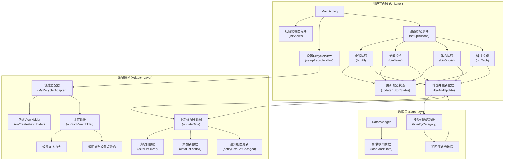
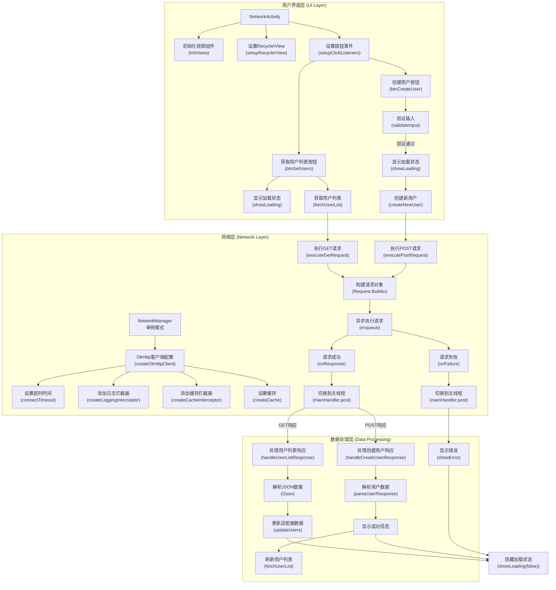
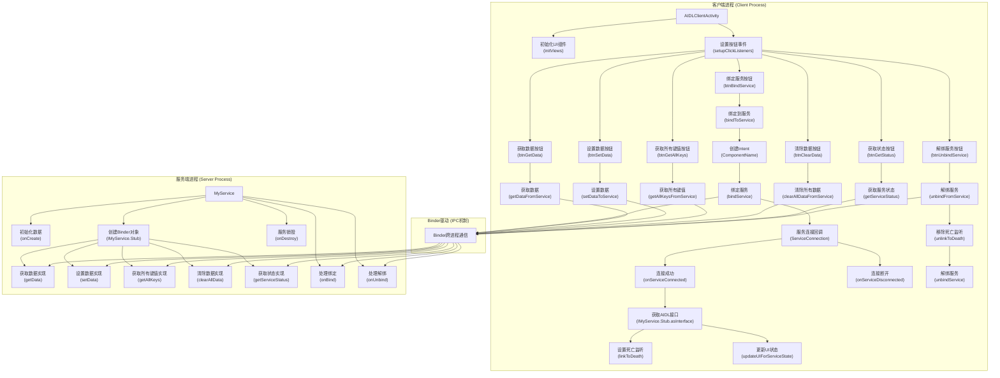

# Android开发攻略完整指南 (Java版)

> 注意：本指南中的所有代码示例均使用Java语言实现，适合Java Android开发者参考。

## 目录
1. [基础组件知识点总结](#基础组件知识点总结)
2. [实际应用场景](#实际应用场景)
3. [流程图说明](#流程图说明)

## 基础组件知识点总结

### UI组件类

| 组件             | 核心功能     | 关键API                                  | 使用场景               | 性能特点           |
| ---------------- | ------------ | ---------------------------------------- | ---------------------- | ------------------ |
| **RecyclerView** | 高效列表显示 | `Adapter`、`LayoutManager`、`ViewHolder` | 大数据量列表、网格布局 | 视图复用、局部刷新 |
| **TextView**     | 文本显示     | `setText()`、`setTextColor()`            | 静态文本、动态内容展示 | 轻量级、可定制     |
| **Button**       | 用户交互     | `setOnClickListener()`                   | 点击事件、状态切换     | 简单高效           |

#### RecyclerView详解
| 组件              | 职责     | 核心方法                                     |
| ----------------- | -------- | -------------------------------------------- |
| **Adapter**       | 数据绑定 | `onCreateViewHolder()`, `onBindViewHolder()` |
| **ViewHolder**    | 视图缓存 | 持有itemView引用                             |
| **LayoutManager** | 布局管理 | `LinearLayoutManager`, `GridLayoutManager`   |

#### 约束性布局(ConstraintLayout)

| 特性                  | 描述             | 优势         | 使用场景     |
| --------------------- | ---------------- | ------------ | ------------ |
| **相对定位**          | 通过约束关系定位 | 减少布局嵌套 | 复杂界面布局 |
| **链式约束**          | 多个视图形成链条 | 灵活权重分配 | 均匀分布组件 |
| **屏障(Barrier)**     | 动态参考线       | 适应内容变化 | 动态内容布局 |
| **引导线(Guideline)** | 百分比定位       | 响应式设计   | 多屏幕适配   |

### 网络通信类

| 组件         | 核心功能     | 关键特性             | 适用场景      | 学习难度 |
| ------------ | ------------ | -------------------- | ------------- | -------- |
| **OkHttp**   | HTTP客户端   | 连接池、拦截器、缓存 | 底层网络请求  | 中等     |
| **Retrofit** | REST API封装 | 注解驱动、类型安全   | 规范化API调用 | 简单     |

#### 网络请求对比
| 方式                      | 灵活性 | 易用性 | 性能 | 推荐场景     |
| ------------------------- | ------ | ------ | ---- | ------------ |
| **原生HttpURLConnection** | 高     | 低     | 中   | 简单请求     |
| **OkHttp**                | 高     | 中     | 高   | 复杂网络需求 |
| **Retrofit**              | 中     | 高     | 高   | RESTful API  |

### 线程通信类

| 组件             | 机制         | 用途         | 特点         | 生命周期     |
| ---------------- | ------------ | ------------ | ------------ | ------------ |
| **Handler**      | 消息循环     | 线程间通信   | 主线程更新UI | 与Looper绑定 |
| **Looper**       | 消息队列管理 | 维持消息循环 | 每线程一个   | 线程生命周期 |
| **Message**      | 消息载体     | 携带数据     | 可复用对象池 | 使用后回收   |
| **MessageQueue** | 消息存储     | 队列管理     | FIFO原则     | Looper管理   |

#### 多线程通信方式对比
| 方式                | 适用场景         | 优点         | 缺点         |
| ------------------- | ---------------- | ------------ | ------------ |
| **Handler**         | UI更新、定时任务 | 简单易用     | 内存泄漏风险 |
| **AsyncTask**       | 短时异步任务     | 生命周期管理 | 已废弃       |
| **ExecutorService** | 长时间后台任务   | 灵活控制     | 需手动管理   |
| **Coroutines**      | 现代异步编程     | 简洁语法     | 学习成本     |

### 进程间通信类

| 技术          | 实现方式     | 适用场景           | 性能特点     | 安全性 |
| ------------- | ------------ | ------------------ | ------------ | ------ |
| **Binder**    | 内核驱动     | 系统服务、应用服务 | 高效、安全   | 高     |
| **AIDL**      | 接口定义语言 | 跨进程方法调用     | 自动生成代理 | 中     |
| **Messenger** | Handler封装  | 简单消息传递       | 序列化开销   | 中     |
| **mmap**      | 内存映射     | 大文件读写         | 零拷贝技术   | 低     |

#### IPC机制对比
| 方式                | 数据传输 | 实现复杂度 | 性能 | 推荐使用    |
| ------------------- | -------- | ---------- | ---- | ----------- |
| **Intent**          | 小数据   | 简单       | 中   | 组件通信    |
| **AIDL**            | 复杂对象 | 中等       | 高   | Service通信 |
| **ContentProvider** | 数据共享 | 中等       | 中   | 数据访问    |
| **Socket**          | 网络通信 | 复杂       | 高   | 网络应用    |

### 媒体播放类

| 组件            | 功能       | 优势           | 支持格式       | 扩展性 |
| --------------- | ---------- | -------------- | -------------- | ------ |
| **MediaPlayer** | 基础播放   | 系统内置       | 常见格式       | 低     |
| **ExoPlayer**   | 高级播放器 | 可扩展、可定制 | 多种音视频格式 | 高     |

#### ExoPlayer特性
| 特性             | 描述             | 优势       |
| ---------------- | ---------------- | ---------- |
| **自适应流**     | 根据网络调整质量 | 流畅播放   |
| **自定义渲染器** | 支持多种解码器   | 格式兼容性 |
| **DRM支持**      | 数字版权管理     | 内容保护   |

## 实际应用场景

### 场景一：RecyclerView根据Button切换显示内容

#### 实现步骤大纲
1. **数据层设计** - 创建数据模型和管理类，实现数据筛选功能
2. **适配器实现** - 创建RecyclerView适配器，处理数据绑定和视图更新
3. **布局文件定义** - 设计列表项布局，使用ConstraintLayout实现
4. **Activity实现** - 完成主界面逻辑，处理按钮点击和数据更新

#### 步骤间关系说明
- **数据层**为整个应用提供数据源，通过DataManager进行统一管理
- **适配器层**连接数据层和UI层，负责将数据转换为可视化的列表项
- **布局文件**定义了视觉呈现，为适配器提供视图模板
- **Activity**作为控制中心，协调数据层和适配器层的交互，响应用户操作

#### 项目目录结构
```
app/
├── src/
│   ├── main/
│   │   ├── java/com/example/recyclerviewdemo/
│   │   │   ├── MainActivity.java               # 主界面Activity
│   │   │   ├── ItemData.java                   # 数据模型类
│   │   │   ├── DataManager.java                # 数据管理类
│   │   │   └── MyRecyclerAdapter.java          # RecyclerView适配器
│   │   ├── res/
│   │   │   ├── layout/
│   │   │   │   ├── activity_main.xml         # 主界面布局
│   │   │   │   └── item_recycler.xml         # 列表项布局
│   │   │   ├── drawable/
│   │   │   │   ├── button_normal.xml         # 按钮普通状态背景
│   │   │   │   ├── button_selected.xml       # 按钮选中状态背景
│   │   │   │   └── category_bg.xml           # 类别标签背景
│   │   │   └── values/
│   │   │       ├── colors.xml                # 颜色资源
│   │   │       └── strings.xml               # 字符串资源
│   │   └── AndroidManifest.xml               # 应用清单文件
│   └── test/                                 # 测试目录
└── build.gradle                              # 模块级构建文件
```

#### 架构流程图


#### 步骤1: 创建数据模型和管理类 - 目的：构建数据基础和筛选功能

##### 1.1 数据模型定义
```java
// 文件: app/src/main/java/com/example/recyclerviewdemo/ItemData.java
public class ItemData {
    private int id;           // 唯一标识符，用于列表项识别
    private String title;     // 显示的标题文本
    private String content;   // 详细内容描述
    private String category;  // 分类标识，用于筛选功能
    
    public ItemData(int id, String title, String content, String category) {
        this.id = id;
        this.title = title;
        this.content = content;
        this.category = category;
    }
    
    // Getters
    public int getId() {
        return id;
    }
    
    public String getTitle() {
        return title;
    }
    
    public String getContent() {
        return content;
    }
    
    public String getCategory() {
        return category;
    }
}
```

##### 1.2 数据管理类实现
```java
// 文件: app/src/main/java/com/example/recyclerviewdemo/DataManager.java
import java.util.ArrayList;
import java.util.List;

public class DataManager {
    // 原始数据源，模拟从数据库或网络获取的数据
    private List<ItemData> originalData = new ArrayList<>();
  
    // 当前显示的过滤后数据
    private List<ItemData> filteredData = new ArrayList<>();
  
    public DataManager() {
        loadMockData(); // 初始化时加载模拟数据
    }
```

##### 1.3 模拟数据加载
```java
// 文件: app/src/main/java/com/example/recyclerviewdemo/DataManager.java (续)
    // 加载模拟数据，实际项目中可能从数据库或网络获取
    private void loadMockData() {
        originalData.add(new ItemData(1, "新闻标题1", "新闻内容1", "news"));      // 新闻类别
        originalData.add(new ItemData(2, "体育标题1", "体育内容1", "sports"));    // 体育类别
        originalData.add(new ItemData(3, "科技标题1", "科技内容1", "tech"));      // 科技类别
        originalData.add(new ItemData(4, "新闻标题2", "新闻内容2", "news"));
        originalData.add(new ItemData(5, "体育标题2", "体育内容2", "sports"));
        originalData.add(new ItemData(6, "科技标题2", "科技内容2", "tech"));
        
        filteredData.addAll(originalData); // 初始显示全部数据
    }
```

##### 1.4 数据筛选方法
```java
// 文件: app/src/main/java/com/example/recyclerviewdemo/DataManager.java (续)
    // 根据类别筛选数据
    public List<ItemData> filterByCategory(String category) {
        filteredData.clear();
        
        if ("all".equals(category)) {
            filteredData.addAll(originalData);  // 显示全部数据
        } else {
            // 按类别筛选
            for (ItemData item : originalData) {
                if (category.equals(item.getCategory())) {
                    filteredData.add(item);
                }
            }
        }
        return filteredData;
    }
  
    // 获取当前显示的数据
    public List<ItemData> getCurrentData() {
        return filteredData;
    }
}
```

#### 步骤2: 创建RecyclerView适配器 - 目的：实现高效的数据到视图的转换

##### 2.1 适配器类定义
```java
// 文件: app/src/main/java/com/example/recyclerviewdemo/MyRecyclerAdapter.java
import android.view.LayoutInflater;
import android.view.View;
import android.view.ViewGroup;
import androidx.annotation.NonNull;
import androidx.core.content.ContextCompat;
import androidx.recyclerview.widget.RecyclerView;
import com.example.recyclerviewdemo.databinding.ItemRecyclerBinding;
import java.util.List;

/**
 * RecyclerView适配器类
 * 
 * 功能：
 * 1. 将数据模型(ItemData)转换为视图项(item_recycler.xml)
 * 2. 管理ViewHolder的创建和数据绑定
 * 3. 使用ViewBinding代替findViewById提高性能
 * 
 * 设计模式：适配器模式 - 连接数据源和UI展示
 */
public class MyRecyclerAdapter extends RecyclerView.Adapter<MyRecyclerAdapter.ViewHolder> {
    
    // 适配器持有的数据列表 - 所有视图项的数据源
    private List<ItemData> dataList;
    
    /**
     * 构造函数 - 初始化适配器
     * @param dataList 数据列表，包含所有要显示的项目数据
     */
    public MyRecyclerAdapter(List<ItemData> dataList) {
        this.dataList = dataList;
    }
}
```

##### 2.2 ViewHolder内部类
```java
// 文件: app/src/main/java/com/example/recyclerviewdemo/MyRecyclerAdapter.java (续)
    /**
     * ViewHolder内部类 - 缓存视图引用，避免重复调用findViewById
     * 
     * 优化点：
     * 1. 使用ViewBinding替代传统findViewById，减少模板代码
     * 2. 提供类型安全的视图访问，避免类型转换错误
     * 3. 编译时检查视图ID，避免运行时错误
     */
    public static class ViewHolder extends RecyclerView.ViewHolder {
        // 使用ViewBinding持有所有视图引用
        private final ItemRecyclerBinding binding;
        
        /**
         * 构造函数 - 初始化ViewHolder
         * @param binding ViewBinding对象，包含item_recycler.xml中所有视图的引用
         */
        public ViewHolder(ItemRecyclerBinding binding) {
            // 调用父类构造函数，传入根视图
            super(binding.getRoot());
            // 保存binding引用，以便在onBindViewHolder中使用
            this.binding = binding;
        }
    }
```

##### 2.3 创建ViewHolder方法
```java
// 文件: app/src/main/java/com/example/recyclerviewdemo/MyRecyclerAdapter.java (续)
    /**
     * 创建ViewHolder - 当RecyclerView需要新的视图时调用
     * 
     * 调用时机：
     * 1. 初始加载时，为可见区域创建足够的ViewHolder
     * 2. 滚动时，需要显示新的、尚未创建过视图的项目
     * 
     * 注意：此方法调用频率较低，因为RecyclerView会复用已创建的ViewHolder
     *
     * @param parent 父视图，用于获取LayoutInflater和设置布局参数
     * @param viewType 视图类型，用于支持多种不同布局的列表项
     * @return 新创建的ViewHolder实例
     */
    @NonNull
    @Override
    public ViewHolder onCreateViewHolder(@NonNull ViewGroup parent, int viewType) {
        // 使用ViewBinding加载布局文件，比传统的inflate方法更简洁
        ItemRecyclerBinding binding = ItemRecyclerBinding.inflate(
            LayoutInflater.from(parent.getContext()), // 获取LayoutInflater
            parent,                                   // 父视图，用于正确设置布局参数
            false                                     // 不立即附加到父视图
        );
        
        // 创建并返回新的ViewHolder实例
        return new ViewHolder(binding);
    }
```

##### 2.4 数据绑定方法
```java
// 文件: app/src/main/java/com/example/recyclerviewdemo/MyRecyclerAdapter.java (续)
    /**
     * 绑定数据到ViewHolder - 当列表项需要显示数据时调用
     * 
     * 调用时机：
     * 1. 初始加载时，为每个可见项绑定数据
     * 2. 滚动时，为新进入可见区域的项绑定数据
     * 3. 数据更新时，为受影响的项重新绑定数据
     * 
     * 性能关键点：
     * - 此方法调用非常频繁，应避免复杂计算
     * - 避免在此方法中创建新对象，减少GC压力
     * - 使用ViewBinding直接访问视图，避免findViewById开销
     *
     * @param holder 要绑定数据的ViewHolder
     * @param position 数据项在列表中的位置
     */
    @Override
    public void onBindViewHolder(@NonNull ViewHolder holder, int position) {
        // 获取当前位置的数据项
        ItemData item = dataList.get(position);
      
        // 将数据设置到对应的视图组件中 - 使用ViewBinding提供类型安全的访问
        holder.binding.tvTitle.setText(item.getTitle());        // 设置标题
        holder.binding.tvContent.setText(item.getContent());    // 设置内容
        holder.binding.tvCategory.setText(item.getCategory());  // 设置类别
      
        // 根据类别设置不同的背景色 - 视觉区分不同类型的内容
        int colorRes;
        switch (item.getCategory()) {
            case "news":
                colorRes = R.color.news_color;     // 新闻用蓝色
                break;
            case "sports":
                colorRes = R.color.sports_color;   // 体育用绿色
                break;
            case "tech":
                colorRes = R.color.tech_color;     // 科技用橙色
                break;
            default:
                colorRes = R.color.default_color;  // 默认颜色
                break;
        }
        
        // 使用ContextCompat兼容不同Android版本获取颜色资源
        holder.binding.itemView.setBackgroundColor(
            ContextCompat.getColor(holder.binding.itemView.getContext(), colorRes)
        );
    }
```

##### 2.5 数据操作方法
```java
// 文件: app/src/main/java/com/example/recyclerviewdemo/MyRecyclerAdapter.java (续)
    /**
     * 返回数据项总数 - RecyclerView用此方法确定列表总长度
     * 
     * @return 数据列表中的项目数量
     */
    @Override
    public int getItemCount() {
        return dataList.size();
    }

    /**
     * 更新适配器数据 - 由Activity或Fragment调用，更新列表数据
     * 
     * 工作流程：
     * 1. 清除当前保存的数据
     * 2. 添加新的数据集合
     * 3. 通知RecyclerView刷新所有可见项
     * 
     * 注意：在大型列表中，应考虑使用DiffUtil实现更高效的更新
     *      而不是使用notifyDataSetChanged()刷新整个列表
     * 
     * @param newData 新的数据列表，将替换现有数据
     */
    public void updateData(List<ItemData> newData) {
        dataList.clear();              // 清除旧数据
        dataList.addAll(newData);      // 添加新数据
        notifyDataSetChanged();        // 通知适配器刷新视图
        // 优化方案：使用DiffUtil.calculateDiff()计算差异，仅更新变化的项
    }
}
```

#### 步骤3: 布局文件定义 - 目的：设计列表项的视觉结构
```xml
<!-- 文件: app/src/main/res/layout/item_recycler.xml -->
<?xml version="1.0" encoding="utf-8"?>
<androidx.constraintlayout.widget.ConstraintLayout 
    xmlns:android="http://schemas.android.com/apk/res/android"
    xmlns:app="http://schemas.android.com/apk/res-auto"
    android:layout_width="match_parent"
    android:layout_height="wrap_content"
    android:padding="16dp"
    android:layout_margin="8dp">

    <!-- 标题文本，位于顶部 -->
    <TextView
        android:id="@+id/tv_title"
        android:layout_width="0dp"
        android:layout_height="wrap_content"
        android:textSize="18sp"
        android:textStyle="bold"
        app:layout_constraintTop_toTopOf="parent"
        app:layout_constraintStart_toStartOf="parent"
        app:layout_constraintEnd_toStartOf="@+id/tv_category" />

    <!-- 类别标签，位于右上角 -->
    <TextView
        android:id="@+id/tv_category"
        android:layout_width="wrap_content"
        android:layout_height="wrap_content"
        android:background="@drawable/category_bg"
        android:padding="4dp"
        android:textSize="12sp"
        app:layout_constraintTop_toTopOf="parent"
        app:layout_constraintEnd_toEndOf="parent" />

    <!-- 内容文本，位于标题下方 -->
    <TextView
        android:id="@+id/tv_content"
        android:layout_width="0dp"
        android:layout_height="wrap_content"
        android:textSize="14sp"
        android:layout_marginTop="8dp"
        app:layout_constraintTop_toBottomOf="@+id/tv_title"
        app:layout_constraintStart_toStartOf="parent"
        app:layout_constraintEnd_toEndOf="parent" />

</androidx.constraintlayout.widget.ConstraintLayout>
```

#### 步骤4: MainActivity实现 - 目的：整合各组件并处理用户交互

##### 4.1 类定义与变量声明
```java
// 文件: app/src/main/java/com/example/recyclerviewdemo/MainActivity.java
import android.os.Bundle;
import android.widget.Button;
import androidx.appcompat.app.AppCompatActivity;
import androidx.core.content.ContextCompat;
import androidx.recyclerview.widget.DividerItemDecoration;
import androidx.recyclerview.widget.LinearLayoutManager;
import androidx.recyclerview.widget.RecyclerView;
import java.util.ArrayList;
import java.util.Arrays;
import java.util.List;

public class MainActivity extends AppCompatActivity {
  
    // 声明组件变量
    private RecyclerView recyclerView;      // 列表视图
    private MyRecyclerAdapter adapter;      // 适配器
    private DataManager dataManager;        // 数据管理器
    private Button btnAll;                  // 全部按钮
    private Button btnNews;                 // 新闻按钮
    private Button btnSports;               // 体育按钮
    private Button btnTech;                 // 科技按钮
```

##### 4.2 Activity生命周期方法
```java
// 文件: app/src/main/java/com/example/recyclerviewdemo/MainActivity.java (续)
    @Override
    protected void onCreate(Bundle savedInstanceState) {
        super.onCreate(savedInstanceState);
        setContentView(R.layout.activity_main);
      
        initViews();      // 初始化视图组件
        setupRecyclerView();  // 设置RecyclerView
        setupButtons();   // 设置按钮点击事件
    }
```

##### 4.3 初始化视图组件
```java
// 文件: app/src/main/java/com/example/recyclerviewdemo/MainActivity.java (续)
    // 初始化视图组件
    private void initViews() {
        recyclerView = findViewById(R.id.recycler_view);  // 查找RecyclerView
        btnAll = findViewById(R.id.btn_all);              // 查找全部按钮
        btnNews = findViewById(R.id.btn_news);            // 查找新闻按钮
        btnSports = findViewById(R.id.btn_sports);        // 查找体育按钮
        btnTech = findViewById(R.id.btn_tech);            // 查找科技按钮
      
        // 初始化数据管理器
        dataManager = new DataManager();
    }
```

##### 4.4 设置RecyclerView
```java
// 文件: app/src/main/java/com/example/recyclerviewdemo/MainActivity.java (续)
    // 设置RecyclerView
    private void setupRecyclerView() {
        // 创建线性布局管理器，垂直方向
        recyclerView.setLayoutManager(new LinearLayoutManager(this));
      
        // 创建适配器并设置初始数据
        adapter = new MyRecyclerAdapter(new ArrayList<>(dataManager.getCurrentData()));
        recyclerView.setAdapter(adapter);
      
        // 添加分割线装饰器
        DividerItemDecoration dividerDecoration = new DividerItemDecoration(this, DividerItemDecoration.VERTICAL);
        recyclerView.addItemDecoration(dividerDecoration);
    }
```

##### 4.5 设置按钮点击事件
```java
// 文件: app/src/main/java/com/example/recyclerviewdemo/MainActivity.java (续)
    // 设置按钮点击事件
    private void setupButtons() {
        // 全部按钮点击事件
        btnAll.setOnClickListener(v -> {
            updateButtonStates(btnAll);           // 更新按钮选中状态
            filterAndUpdate("all");               // 筛选显示全部数据
        });

        // 新闻按钮点击事件
        btnNews.setOnClickListener(v -> {
            updateButtonStates(btnNews);          // 更新按钮选中状态
            filterAndUpdate("news");              // 筛选显示新闻数据
        });

        // 体育按钮点击事件
        btnSports.setOnClickListener(v -> {
            updateButtonStates(btnSports);        // 更新按钮选中状态
            filterAndUpdate("sports");            // 筛选显示体育数据
        });

        // 科技按钮点击事件
        btnTech.setOnClickListener(v -> {
            updateButtonStates(btnTech);          // 更新按钮选中状态
            filterAndUpdate("tech");              // 筛选显示科技数据
        });
    }
```

##### 4.6 数据筛选与更新
```java
// 文件: app/src/main/java/com/example/recyclerviewdemo/MainActivity.java (续)
    // 筛选数据并更新适配器
    private void filterAndUpdate(String category) {
        List<ItemData> filteredData = dataManager.filterByCategory(category);  // 获取筛选后的数据
        adapter.updateData(filteredData);                          // 更新适配器数据
    }
```

##### 4.7 UI状态控制方法
```java
// 文件: app/src/main/java/com/example/recyclerviewdemo/MainActivity.java (续)
    // 更新按钮选中状态
    private void updateButtonStates(Button selectedButton) {
        // 重置所有按钮为未选中状态
        List<Button> buttons = Arrays.asList(btnAll, btnNews, btnSports, btnTech);
        for (Button button : buttons) {
            button.setBackgroundResource(R.drawable.button_normal);  // 设置普通背景
            button.setTextColor(ContextCompat.getColor(this, R.color.text_normal));
        }
      
        // 设置选中按钮的状态
        selectedButton.setBackgroundResource(R.drawable.button_selected);  // 设置选中背景
        selectedButton.setTextColor(ContextCompat.getColor(this, R.color.text_selected));
    }
}
```

---

### 场景二：OkHttp完成网络数据获取

#### 实现步骤大纲
1. **网络管理类设计** - 创建单例模式的网络请求管理器，封装OkHttp操作
2. **数据模型和解析** - 定义数据结构和JSON解析工具
3. **主Activity实现** - 构建用户界面，处理网络请求和响应
4. **适配器实现** - 展示网络获取的数据列表

#### 步骤间关系说明
- **网络管理类**作为底层服务提供者，负责所有HTTP请求的发送和响应处理
- **数据模型和解析工具**将网络响应转换为应用可用的数据对象
- **主Activity**作为用户交互入口，调用网络服务并展示结果
- **适配器**将网络获取的数据转换为可视化列表

#### 项目目录结构
```
app/
├── src/
│   ├── main/
│   │   ├── java/com/example/networkrequestdemo/
│   │   │   ├── NetworkActivity.java            # 主界面Activity
│   │   │   ├── NetworkManager.java             # 网络请求管理类
│   │   │   ├── JsonParser.java                 # JSON解析工具类
│   │   │   ├── NetworkCallback.java            # 网络回调接口
│   │   │   ├── User.java                       # 用户数据模型
│   │   │   ├── ApiResponse.java                # API响应数据模型
│   │   │   ├── UserAdapter.java                # 用户列表适配器
│   │   │   └── MyApplication.java              # 全局应用类
│   │   ├── res/
│   │   │   ├── layout/
│   │   │   │   ├── activity_network.xml      # 主界面布局
│   │   │   │   └── item_user.xml             # 用户列表项布局
│   │   │   └── values/
│   │   │       ├── colors.xml                # 颜色资源
│   │   │       └── strings.xml               # 字符串资源
│   │   └── AndroidManifest.xml               # 应用清单文件
│   └── test/                                 # 测试目录
└── build.gradle                              # 模块级构建文件，包含OkHttp依赖
```

#### 网络请求流程图


#### 步骤1: 创建网络管理类 - 目的：封装网络请求操作，提供统一接口

##### 1.1 类定义与单例模式实现
```java
// 文件: app/src/main/java/com/example/networkrequestdemo/NetworkManager.java
public class NetworkManager {
  
    // 单例模式，确保全局只有一个网络管理器实例
    private static class Holder {
        private static final NetworkManager INSTANCE = new NetworkManager();
    }
  
    public static NetworkManager getInstance() {
        return Holder.INSTANCE;
    }
    
    // 私有构造函数，防止外部实例化
    private NetworkManager() {}
  
    // OkHttp客户端实例
    private final OkHttpClient client = createOkHttpClient();
  
    // 主线程Handler，用于回调主线程更新UI
    private final Handler mainHandler = new Handler(Looper.getMainLooper());
}
```

##### 1.2 OkHttp客户端配置
```java
// 文件: app/src/main/java/com/example/networkrequestdemo/NetworkManager.java (续)
    /**
     * 创建配置好的OkHttp客户端
     * 
     * 配置说明：
     * 1. 超时设置 - 防止请求无限等待，提高用户体验
     * 2. 拦截器链 - 使用责任链模式处理请求和响应
     * 3. 缓存配置 - 减少网络请求，提高响应速度
     * 4. 重试机制 - 处理网络不稳定情况
     * 
     * @return 配置完成的OkHttpClient实例
     */
    private OkHttpClient createOkHttpClient() {
        return new OkHttpClient.Builder()
            // 超时设置 - 避免请求长时间阻塞
            .connectTimeout(15, TimeUnit.SECONDS)    // 连接超时15秒
            .readTimeout(20, TimeUnit.SECONDS)       // 读取超时20秒
            .writeTimeout(20, TimeUnit.SECONDS)      // 写入超时20秒
            
            // 拦截器链配置 - 按添加顺序执行
            .addInterceptor(createLoggingInterceptor())  // 添加日志拦截器，记录请求和响应信息
            .addNetworkInterceptor(createCacheInterceptor()) // 添加缓存拦截器，处理网络缓存策略
            .addInterceptor(createErrorInterceptor()) // 添加错误处理拦截器，统一处理网络异常
            
            // 缓存配置 - 减少重复请求
            .cache(createCache())                    // 设置响应缓存，存储在应用缓存目录
            
            // 重试机制 - 处理网络波动
            .retryOnConnectionFailure(true)          // 连接失败时自动重试
            .build();
    }
```

##### 1.3 日志拦截器实现
```java
// 文件: app/src/main/java/com/example/networkrequestdemo/NetworkManager.java (续)
    // 创建日志拦截器，用于调试网络请求
    private Interceptor createLoggingInterceptor() {
        HttpLoggingInterceptor loggingInterceptor = new HttpLoggingInterceptor(message -> 
            Log.d("NetworkManager", message));
            
        // 设置日志级别，生产环境可改为NONE
        loggingInterceptor.setLevel(BuildConfig.DEBUG ? 
            HttpLoggingInterceptor.Level.BODY : HttpLoggingInterceptor.Level.NONE);
            
        return loggingInterceptor;
    }
```

##### 1.4 缓存拦截器实现
```java
// 文件: app/src/main/java/com/example/networkrequestdemo/NetworkManager.java (续)
    // 创建缓存拦截器
    private Interceptor createCacheInterceptor() {
        return chain -> {
            Request request = chain.request();
            
            // 无网络时使用缓存
            if (!isNetworkAvailable()) {
                request = request.newBuilder()
                    .cacheControl(CacheControl.FORCE_CACHE)  // 强制使用缓存
                    .build();
                Log.d("NetworkManager", "无网络连接，使用缓存");
            }
            
            Response response = chain.proceed(request);
            
            if (isNetworkAvailable()) {
                // 有网络时缓存60秒
                return response.newBuilder()
                    .header("Cache-Control", "public, max-age=60")
                    .removeHeader("Pragma")
                    .build();
            } else {
                // 无网络时缓存7天
                return response.newBuilder()
                    .header("Cache-Control", "public, only-if-cached, max-stale=604800")
                    .removeHeader("Pragma")
                    .build();
            }
        };
    }
```

##### 1.4.1 错误处理拦截器
```java
// 文件: app/src/main/java/com/example/networkrequestdemo/NetworkManager.java (续)
    /**
     * 创建错误处理拦截器 - 统一处理网络异常
     * 
     * 功能：
     * 1. 捕获网络请求过程中的各种异常
     * 2. 将技术性异常转换为用户友好的错误信息
     * 3. 记录详细的错误日志，便于调试
     * 4. 处理HTTP错误状态码
     * 
     * 设计模式：装饰器模式 - 在不修改原始请求处理逻辑的情况下增加错误处理功能
     * 
     * @return 配置好的Interceptor实例
     */
    private Interceptor createErrorInterceptor() {
        return chain -> {
            // 获取原始请求
            Request request = chain.request();
            Response response;
            
            try {
                // 尝试执行请求，可能抛出各种IO异常
                response = chain.proceed(request);
            } catch (SocketTimeoutException e) {
                // 请求超时异常 - 服务器响应时间过长
                Log.e("NetworkManager", "请求超时: " + request.url(), e);
                throw new IOException("服务器响应超时，请稍后再试", e);
            } catch (ConnectException e) {
                // 连接异常 - 无法建立到服务器的连接
                Log.e("NetworkManager", "连接失败: " + request.url(), e);
                throw new IOException("无法连接到服务器，请检查网络设置", e);
            } catch (UnknownHostException e) {
                // 未知主机异常 - DNS解析失败
                Log.e("NetworkManager", "未知主机: " + request.url(), e);
                throw new IOException("无法解析服务器地址，请检查网络连接", e);
            } catch (IOException e) {
                // 其他IO异常
                Log.e("NetworkManager", "网络错误: " + request.url(), e);
                throw e; // 重新抛出原始异常
            }
            
            // 处理HTTP错误状态码 - 请求成功发送但服务器返回错误
            if (!response.isSuccessful()) {
                switch (response.code()) {
                    case 401: // 未授权
                        Log.e("NetworkManager", "未授权访问: " + request.url());
                        // 可以在这里触发登录流程或刷新令牌
                        break;
                    case 403: // 禁止访问
                        Log.e("NetworkManager", "禁止访问: " + request.url());
                        // 可以提示用户没有权限
                        break;
                    case 404: // 资源不存在
                        Log.e("NetworkManager", "资源不存在: " + request.url());
                        // 可以提示用户请求的内容不存在
                        break;
                    case 500: // 服务器内部错误
                    case 502: // 网关错误
                    case 503: // 服务不可用
                    case 504: // 网关超时
                        Log.e("NetworkManager", "服务器错误: " + response.code() + " - " + request.url());
                        // 可以提示用户服务器出现问题，稍后再试
                        break;
                }
            }
            
            // 返回响应，让请求继续处理
            return response;
        };
    }
  
    // 创建缓存目录和大小设置
    private Cache createCache() {
        File cacheDir = new File(getApplication().getCacheDir(), "http_cache");  // 缓存目录
        return new Cache(cacheDir, 10 * 1024 * 1024); // 缓存大小10MB
    }
```

##### 1.5 GET请求实现
```java
// 文件: app/src/main/java/com/example/networkrequestdemo/NetworkManager.java (续)
    // 执行GET请求
    public void executeGetRequest(
        String url,                                    // 请求URL
        Map<String, String> params,                    // GET参数
        NetworkCallback callback                       // 回调接口
    ) {
        // 构建完整的URL（包含参数）
        HttpUrl.Builder urlBuilder = HttpUrl.parse(url).newBuilder();
        if (params != null) {
            for (Map.Entry<String, String> entry : params.entrySet()) {
                urlBuilder.addQueryParameter(entry.getKey(), entry.getValue());   // 添加查询参数
            }
        }
      
        String finalUrl = urlBuilder.build().toString();
      
        // 构建请求对象
        Request request = new Request.Builder()
            .url(finalUrl)                             // 设置请求URL
            .get()                                     // 设置GET方法
            .addHeader("Accept", "application/json")    // 设置接受的内容类型
            .addHeader("User-Agent", "Android App 1.0") // 设置用户代理
            .build();
      
        // 异步执行请求
        client.newCall(request).enqueue(new Callback() {
            @Override
            public void onFailure(Call call, IOException e) {
                // 请求失败，切换到主线程处理回调
                mainHandler.post(() -> {
                    callback.onError("网络请求失败: " + e.getMessage());
                });
            }
          
            @Override
            public void onResponse(Call call, Response response) {
                try (ResponseBody responseBody = response.body()) {
                    if (response.isSuccessful()) {
                        final String responseString = responseBody != null ? responseBody.string() : null;
                      
                        // 成功时切换到主线程处理回调
                        mainHandler.post(() -> {
                            if (responseString != null) {
                                callback.onSuccess(responseString);
                            } else {
                                callback.onError("响应体为空");
                            }
                        });
                    } else {
                        // HTTP错误，切换到主线程处理回调
                        mainHandler.post(() -> {
                            callback.onError("HTTP错误: " + response.code() + " " + response.message());
                        });
                    }
                } catch (IOException e) {
                    mainHandler.post(() -> {
                        callback.onError("读取响应失败: " + e.getMessage());
                    });
                }
            }
        });
    }
```

##### 1.6 POST请求实现
```java
// 文件: app/src/main/java/com/example/networkrequestdemo/NetworkManager.java (续)
    // 执行POST请求
    public void executePostRequest(
        String url,                                   // 请求URL
        String jsonBody,                              // JSON请求体
        NetworkCallback callback                      // 回调接口
    ) {
        // 创建JSON类型的请求体
        RequestBody requestBody = RequestBody.create(
            MediaType.parse("application/json; charset=utf-8"), 
            jsonBody
        );
      
        // 构建请求对象
        Request request = new Request.Builder()
            .url(url)                                 // 设置请求URL
            .post(requestBody)                        // 设置POST方法和请求体
            .addHeader("Accept", "application/json")   // 设置接受的内容类型
            .addHeader("Content-Type", "application/json") // 设置内容类型
            .build();
      
        // 异步执行请求（与GET请求相同的处理逻辑）
        client.newCall(request).enqueue(new Callback() {
            @Override
            public void onFailure(Call call, IOException e) {
                mainHandler.post(() -> {
                    callback.onError("网络请求失败: " + e.getMessage());
                });
            }
          
            @Override
            public void onResponse(Call call, Response response) {
                try (ResponseBody responseBody = response.body()) {
                    if (response.isSuccessful()) {
                        final String responseString = responseBody != null ? responseBody.string() : null;
                        mainHandler.post(() -> {
                            if (responseString != null) {
                                callback.onSuccess(responseString);
                            } else {
                                callback.onError("响应体为空");
                            }
                        });
                    } else {
                        mainHandler.post(() -> {
                            callback.onError("HTTP错误: " + response.code() + " " + response.message());
                        });
                    }
                } catch (IOException e) {
                    mainHandler.post(() -> {
                        callback.onError("读取响应失败: " + e.getMessage());
                    });
                }
            }
        });
    }
```

##### 1.7 辅助方法
```java
// 文件: app/src/main/java/com/example/networkrequestdemo/NetworkManager.java (续)
    // 检查网络连接状态
    private boolean isNetworkAvailable() {
        ConnectivityManager connectivityManager = (ConnectivityManager) getApplication().getSystemService(Context.CONNECTIVITY_SERVICE);
        NetworkInfo activeNetwork = connectivityManager.getActiveNetworkInfo();
        return activeNetwork != null && activeNetwork.isConnectedOrConnecting();
    }
  
    // 获取Application上下文（需要在Application中初始化）
    private Application getApplication() {
        // 这里需要在Application中初始化或通过其他方式获取Context
        return MyApplication.getInstance();
    }
}
```

##### 1.8 回调接口定义
```java
// 文件: app/src/main/java/com/example/networkrequestdemo/NetworkCallback.java
public interface NetworkCallback {
    void onSuccess(String response);         // 请求成功回调
    void onError(String error);              // 请求失败回调
}
```

#### 步骤2: 创建数据模型和解析 - 目的：定义数据结构和转换机制

##### 2.1 数据模型定义
```java
// 文件: app/src/main/java/com/example/networkrequestdemo/User.java
public class User {
    private int id;              // 用户ID
    private String name;         // 用户姓名
    private String email;        // 邮箱地址
    private String avatar;       // 头像URL（可为空）
    
    public User(int id, String name, String email, String avatar) {
        this.id = id;
        this.name = name;
        this.email = email;
        this.avatar = avatar;
    }
    
    // Getters
    public int getId() {
        return id;
    }
    
    public String getName() {
        return name;
    }
    
    public String getEmail() {
        return email;
    }
    
    public String getAvatar() {
        return avatar;
    }
}

// 文件: app/src/main/java/com/example/networkrequestdemo/ApiResponse.java
public class ApiResponse {
    private int code;            // 响应码
    private String message;      // 响应消息
    private List<User> data;     // 用户数据列表（可为空）
    
    public ApiResponse(int code, String message, List<User> data) {
        this.code = code;
        this.message = message;
        this.data = data;
    }
    
    // Getters
    public int getCode() {
        return code;
    }
    
    public String getMessage() {
        return message;
    }
    
    public List<User> getData() {
        return data;
    }
}
```

##### 2.2 JSON解析工具类
```java
// 文件: app/src/main/java/com/example/networkrequestdemo/JsonParser.java
import com.google.gson.Gson;
import com.google.gson.JsonSyntaxException;
import com.google.gson.reflect.TypeToken;
import android.util.Log;
import java.lang.reflect.Type;
import java.util.HashMap;
import java.util.Map;

public class JsonParser {
    private final Gson gson = new Gson();  // Google Gson解析器
}
```

// 文件: app/src/main/java/com/example/networkrequestdemo/MyApplication.java
```java
import android.app.Application;

public class MyApplication extends Application {
    private static MyApplication instance;

    @Override
    public void onCreate() {
        super.onCreate();
        instance = this;
    }

    public static MyApplication getInstance() {
        return instance;
    }
}
```

##### 2.3 解析方法实现
```java
// 文件: app/src/main/java/com/example/networkrequestdemo/JsonParser.java (续)
    // 解析用户列表响应
    public ApiResponse parseUserListResponse(String jsonString) {
        try {
            return gson.fromJson(jsonString, ApiResponse.class);  // 将JSON字符串转为对象
        } catch (JsonSyntaxException e) {
            Log.e("JsonParser", "JSON解析失败", e);
            return null;  // 解析失败返回null
        }
    }
  
    // 解析单个用户响应
    public User parseUserResponse(String jsonString) {
        try {
            return gson.fromJson(jsonString, User.class);
        } catch (JsonSyntaxException e) {
            Log.e("JsonParser", "用户JSON解析失败", e);
            return null;
        }
    }
}
```

##### 2.4 JSON生成方法
```java
// 文件: app/src/main/java/com/example/networkrequestdemo/JsonParser.java (续)
    // 创建用户请求的JSON
    public String createUserJson(String name, String email) {
        Map<String, String> userData = new HashMap<>();
        userData.put("name", name);
        userData.put("email", email);
        return gson.toJson(userData);  // 将对象转为JSON字符串
    }
}
```

#### 步骤3: 主Activity实现 - 目的：构建界面并处理网络交互

##### 3.1 类定义与变量声明
```java
// 文件: app/src/main/java/com/example/networkrequestdemo/NetworkActivity.java
import android.graphics.Color;
import android.os.Bundle;
import android.util.Patterns;
import android.view.View;
import android.widget.Button;
import android.widget.EditText;
import android.widget.ProgressBar;
import android.widget.TextView;
import android.widget.Toast;
import androidx.appcompat.app.AppCompatActivity;
import androidx.recyclerview.widget.LinearLayoutManager;
import androidx.recyclerview.widget.RecyclerView;
import com.google.gson.Gson;
import com.google.gson.reflect.TypeToken;
import java.lang.reflect.Type;
import java.util.ArrayList;
import java.util.HashMap;
import java.util.List;
import java.util.Map;

public class NetworkActivity extends AppCompatActivity {
  
    // 声明UI组件变量
    private Button btnGetUsers;           // 获取用户列表按钮
    private Button btnCreateUser;         // 创建用户按钮
    private EditText etUserName;          // 用户名输入框
    private EditText etUserEmail;         // 邮箱输入框
    private TextView tvResult;            // 结果显示文本框
    private ProgressBar progressBar;      // 加载进度条
    private RecyclerView recyclerView;    // 用户列表
  
    // 工具对象
    private NetworkManager networkManager;  // 网络管理器
    private JsonParser jsonParser;         // JSON解析器
    private UserAdapter userAdapter;       // 用户列表适配器
}
```

##### 3.2 Activity生命周期方法
```java
// 文件: app/src/main/java/com/example/networkrequestdemo/NetworkActivity.java (续)
    @Override
    protected void onCreate(Bundle savedInstanceState) {
        super.onCreate(savedInstanceState);
        setContentView(R.layout.activity_network);
      
        initViews();           // 初始化视图
        setupRecyclerView();   // 设置用户列表
        setupClickListeners(); // 设置点击事件
    }
```

##### 3.3 初始化视图组件
```java
// 文件: app/src/main/java/com/example/networkrequestdemo/NetworkActivity.java (续)
    // 初始化视图组件
    private void initViews() {
        // 查找并绑定所有UI组件
        btnGetUsers = findViewById(R.id.btn_get_users);
        btnCreateUser = findViewById(R.id.btn_create_user);
        etUserName = findViewById(R.id.et_user_name);
        etUserEmail = findViewById(R.id.et_user_email);
        tvResult = findViewById(R.id.tv_result);
        progressBar = findViewById(R.id.progress_bar);
        recyclerView = findViewById(R.id.recycler_view_users);
      
        // 初始化工具对象
        networkManager = NetworkManager.getInstance();
        jsonParser = new JsonParser();
    }
```

##### 3.4 设置RecyclerView
```java
// 文件: app/src/main/java/com/example/networkrequestdemo/NetworkActivity.java (续)
    // 设置用户列表RecyclerView
    private void setupRecyclerView() {
        userAdapter = new UserAdapter();                         // 创建适配器
        recyclerView.setLayoutManager(new LinearLayoutManager(this)); // 设置布局管理器
        recyclerView.setAdapter(userAdapter);                   // 设置适配器
        
        // 添加分割线
        DividerItemDecoration divider = new DividerItemDecoration(
            this, DividerItemDecoration.VERTICAL);
        recyclerView.addItemDecoration(divider);
        
        // 添加动画效果
        recyclerView.setItemAnimator(new DefaultItemAnimator());
    }
```

##### 3.5 设置按钮点击事件
```java
// 文件: app/src/main/java/com/example/networkrequestdemo/NetworkActivity.java (续)
    // 设置按钮点击事件
    private void setupClickListeners() {
        // 获取用户列表按钮
        btnGetUsers.setOnClickListener(v -> {
            showLoading(true);              // 显示加载状态
            fetchUserList();                // 发起网络请求
        });
      
        // 创建用户按钮
        btnCreateUser.setOnClickListener(v -> {
            String name = etUserName.getText().toString();      // 获取输入的用户名
            String email = etUserEmail.getText().toString();    // 获取输入的邮箱
          
            if (validateInput(name, email)) {          // 验证输入
                showLoading(true);                      // 显示加载状态
                createNewUser(name, email);             // 发起创建用户请求
            }
        });
    }
```

##### 3.6 网络请求方法 - 获取用户列表
```java
// 文件: app/src/main/java/com/example/networkrequestdemo/NetworkActivity.java (续)
    // 获取用户列表
    private void fetchUserList() {
        String apiUrl = "https://jsonplaceholder.typicode.com/users";  // 测试API地址
        
        // 创建参数Map
        Map<String, String> params = new HashMap<>();
        params.put("_limit", "10");  // 限制返回10条记录
      
        // 发起GET请求
        networkManager.executeGetRequest(
            apiUrl,
            params,
            new NetworkCallback() {
                @Override
                public void onSuccess(String response) {
                    showLoading(false);         // 隐藏加载状态
                    handleUserListResponse(response);  // 处理成功响应
                }
              
                @Override
                public void onError(String error) {
                    showLoading(false);         // 隐藏加载状态
                    showError(error);           // 显示错误信息
                }
            }
        );
    }
```

##### 3.7 网络请求方法 - 创建新用户
```java
// 文件: app/src/main/java/com/example/networkrequestdemo/NetworkActivity.java (续)
    // 创建新用户
    private void createNewUser(String name, String email) {
        String apiUrl = "https://jsonplaceholder.typicode.com/users";  // 测试API地址
        String jsonBody = jsonParser.createUserJson(name, email);      // 创建JSON请求体
      
        // 发起POST请求
        networkManager.executePostRequest(
            apiUrl,
            jsonBody,
            new NetworkCallback() {
                @Override
                public void onSuccess(String response) {
                    showLoading(false);           // 隐藏加载状态
                    handleCreateUserResponse(response);  // 处理创建用户响应
                }
              
                @Override
                public void onError(String error) {
                    showLoading(false);           // 隐藏加载状态
                    showError(error);             // 显示错误信息
                }
            }
        );
    }
```

##### 3.8 响应处理方法 - 处理用户列表
```java
// 文件: app/src/main/java/com/example/networkrequestdemo/NetworkActivity.java (续)
    // 处理用户列表响应
    private void handleUserListResponse(String response) {
        try {
            // 使用Gson直接解析为用户列表
            Gson gson = new Gson();
            Type userListType = new TypeToken<List<User>>() {}.getType();
            List<User> users = gson.fromJson(response, userListType);
          
            if (users != null && !users.isEmpty()) {
                // 更新UI显示
                userAdapter.updateUsers(users);              // 更新适配器数据
                tvResult.setText("获取到" + users.size() + "个用户");   // 显示结果
                tvResult.setTextColor(Color.GREEN);          // 设置成功颜色
            } else {
                showError("未获取到用户数据");
            }
          
        } catch (JsonSyntaxException e) {
            Log.e("NetworkActivity", "JSON解析错误", e);
            showError("数据格式错误: " + e.getMessage());
        } catch (Exception e) {
            Log.e("NetworkActivity", "处理响应异常", e);
            showError("数据处理失败: " + e.getMessage());       // 显示解析错误
        }
    }
```

##### 3.9 响应处理方法 - 处理创建用户
```java
// 文件: app/src/main/java/com/example/networkrequestdemo/NetworkActivity.java (续)
    // 处理创建用户响应
    private void handleCreateUserResponse(String response) {
        User user = jsonParser.parseUserResponse(response);  // 解析创建的用户
      
        if (user != null) {
            tvResult.setText("用户创建成功: " + user.getName());     // 显示成功信息
            tvResult.setTextColor(Color.GREEN);              // 设置成功颜色
          
            // 清空输入框
            etUserName.setText("");
            etUserEmail.setText("");
          
            // 可以选择刷新用户列表
            fetchUserList();
        } else {
            showError("用户创建响应解析失败");
        }
    }
```

##### 3.10 输入验证方法
```java
// 文件: app/src/main/java/com/example/networkrequestdemo/NetworkActivity.java (续)
    // 验证用户输入
    private boolean validateInput(String name, String email) {
        if (name.isEmpty()) {
            etUserName.setError("用户名不能为空");         // 设置错误提示
            return false;
        }
        
        if (email.isEmpty()) {
            etUserEmail.setError("邮箱不能为空");          // 设置错误提示
            return false;
        }
        
        if (!Patterns.EMAIL_ADDRESS.matcher(email).matches()) {
            etUserEmail.setError("邮箱格式不正确");        // 邮箱格式验证
            return false;
        }
        
        return true;
    }
```

##### 3.11 UI状态控制方法 - 加载状态
```java
// 文件: app/src/main/java/com/example/networkrequestdemo/NetworkActivity.java (续)
    // 显示/隐藏加载状态
    private void showLoading(boolean isLoading) {
        if (isLoading) {
            progressBar.setVisibility(View.VISIBLE);       // 显示进度条
            btnGetUsers.setEnabled(false);               // 禁用按钮
            btnCreateUser.setEnabled(false);
        } else {
            progressBar.setVisibility(View.GONE);          // 隐藏进度条
            btnGetUsers.setEnabled(true);                // 启用按钮
            btnCreateUser.setEnabled(true);
        }
    }
```

##### 3.12 UI状态控制方法 - 错误显示
```java
// 文件: app/src/main/java/com/example/networkrequestdemo/NetworkActivity.java (续)
    // 显示错误信息
    private void showError(String error) {
        tvResult.setText("错误: " + error);                  // 显示错误文本
        tvResult.setTextColor(Color.RED);               // 设置错误颜色
      
        // 使用Snackbar显示错误，提供更好的用户体验
        Snackbar.make(findViewById(android.R.id.content), error, Snackbar.LENGTH_LONG)
            .setAction("重试", v -> {
                // 如果当前正在尝试获取用户列表，则重试
                if (btnGetUsers.isEnabled()) {
                    fetchUserList();
                }
            })
            .setActionTextColor(Color.YELLOW)
            .show();
        
        // 记录日志
        Log.e("NetworkActivity", "错误: " + error);
    }
}
```

##### 3.13 RecyclerView适配器实现 - 目的：展示网络获取的用户数据
```java
// 文件: app/src/main/java/com/example/networkrequestdemo/UserAdapter.java
import android.view.LayoutInflater;
import android.view.View;
import android.view.ViewGroup;
import android.widget.TextView;
import androidx.annotation.NonNull;
import androidx.recyclerview.widget.DiffUtil;
import androidx.recyclerview.widget.ListAdapter;
import androidx.recyclerview.widget.RecyclerView;
import com.example.networkrequestdemo.databinding.ItemUserBinding;
import java.util.List;

public class UserAdapter extends ListAdapter<User, UserAdapter.UserViewHolder> {
    
    public UserAdapter() {
        super(DIFF_CALLBACK);
    }
    
    // DiffUtil回调，用于高效更新列表
    private static final DiffUtil.ItemCallback<User> DIFF_CALLBACK = 
        new DiffUtil.ItemCallback<User>() {
            @Override
            public boolean areItemsTheSame(@NonNull User oldItem, @NonNull User newItem) {
                return oldItem.getId() == newItem.getId();
            }
            
            @Override
            public boolean areContentsTheSame(@NonNull User oldItem, @NonNull User newItem) {
                return oldItem.getName().equals(newItem.getName()) && 
                       oldItem.getEmail().equals(newItem.getEmail());
            }
        };
  
    // ViewHolder定义，使用ViewBinding
    public static class UserViewHolder extends RecyclerView.ViewHolder {
        private final ItemUserBinding binding;
        
        public UserViewHolder(ItemUserBinding binding) {
            super(binding.getRoot());
            this.binding = binding;
        }
        
        public void bind(User user) {
            binding.tvUserName.setText(user.getName());
            binding.tvUserEmail.setText(user.getEmail());
            binding.tvUserId.setText("ID: " + user.getId());
        }
    }
  
    // 创建ViewHolder
    @NonNull
    @Override
    public UserViewHolder onCreateViewHolder(@NonNull ViewGroup parent, int viewType) {
        ItemUserBinding binding = ItemUserBinding.inflate(
            LayoutInflater.from(parent.getContext()), parent, false);
        return new UserViewHolder(binding);
    }
  
    // 绑定数据到ViewHolder
    @Override
    public void onBindViewHolder(@NonNull UserViewHolder holder, int position) {
        holder.bind(getItem(position));
    }
  
    // 更新用户数据
    public void updateUsers(List<User> newUsers) {
        submitList(newUsers);
    }
}
```

---

### 场景三：AIDL完成跨进程方法调用

#### 实现步骤大纲
1. **AIDL接口定义** - 创建跨进程通信的接口声明
2. **服务端实现** - 开发Service组件，实现AIDL接口功能
3. **AndroidManifest配置** - 设置Service运行在独立进程
4. **客户端实现** - 开发Activity与Service通信

#### 步骤间关系说明
- **AIDL接口**定义了客户端和服务端通信的契约，是双方交互的基础
- **服务端实现**提供了实际的数据存储和业务逻辑，运行在独立进程中
- **AndroidManifest配置**确保服务在独立进程中运行，实现真正的IPC
- **客户端实现**通过Binder机制与服务端通信，处理用户交互和展示数据

#### 项目目录结构
```
app/
├── src/
│   ├── main/
│   │   ├── aidl/com/example/aidldemo/
│   │   │   └── IMyService.aidl              # AIDL接口定义文件
│   │   ├── java/com/example/aidldemo/
│   │   │   ├── MyService.java               # 服务端实现
│   │   │   └── AIDLClientActivity.java      # 客户端Activity
│   │   ├── res/
│   │   │   ├── layout/
│   │   │   │   └── activity_aidl_client.xml # 客户端界面布局
│   │   │   └── values/
│   │   │       ├── colors.xml               # 颜色资源
│   │   │       └── strings.xml              # 字符串资源
│   │   └── AndroidManifest.xml              # 应用清单文件，包含Service配置
│   └── test/                                # 测试目录
└── build.gradle                             # 模块级构建文件
```

#### AIDL通信流程图


#### 步骤1: 定义AIDL接口 - 目的：创建跨进程通信的协议

##### 1.1 AIDL接口文件
```aidl
// 文件: app/src/main/aidl/com/example/aidldemo/IMyService.aidl
package com.example.aidldemo;

// AIDL接口定义，用于跨进程通信
interface IMyService {
```

##### 1.2 数据获取方法
```aidl
// 文件: app/src/main/aidl/com/example/aidldemo/IMyService.aidl (续)
    /**
     * 获取数据方法
     * @param key 数据的键值
     * @return 返回对应的数据字符串
     */
    String getData(String key);
```

##### 1.3 数据设置方法
```aidl
// 文件: app/src/main/aidl/com/example/aidldemo/IMyService.aidl (续)
    /**
     * 设置数据方法
     * @param key 数据的键值
     * @param value 要设置的数据值
     * @return 设置是否成功
     */
    boolean setData(String key, String value);
```

##### 1.4 数据管理方法
```aidl
// 文件: app/src/main/aidl/com/example/aidldemo/IMyService.aidl (续)
    /**
     * 获取所有数据键值
     * @return 返回所有键值的列表
     */
    List<String> getAllKeys();
  
    /**
     * 清除所有数据
     * @return 清除是否成功
     */
    boolean clearAllData();
```

##### 1.5 服务状态方法
```aidl
// 文件: app/src/main/aidl/com/example/aidldemo/IMyService.aidl (续)
    /**
     * 获取服务状态信息
     * @return 返回状态信息字符串
     */
    String getServiceStatus();
}
```

#### 步骤2: 实现Service端 - 目的：提供跨进程服务的功能实现

##### 2.1 服务类定义与数据存储
```java
// 文件: app/src/main/java/com/example/aidldemo/MyService.java
import android.app.Service;
import android.content.Context;
import android.content.Intent;
import android.content.SharedPreferences;
import android.os.IBinder;
import android.os.Process;
import android.util.Log;
import org.json.JSONArray;
import org.json.JSONException;
import org.json.JSONObject;
import java.util.ArrayList;
import java.util.Date;
import java.util.HashMap;
import java.util.List;
import java.util.Map;

public class MyService extends Service {
  
    // 数据存储Map，模拟数据库或缓存
    private Map<String, String> dataStorage = new HashMap<>();
  
    // 服务启动时间，用于状态信息
    private long serviceStartTime = System.currentTimeMillis();
}
```

##### 2.2 AIDL接口实现 - 数据获取
```java
// 文件: app/src/main/java/com/example/aidldemo/MyService.java (续)
    // AIDL接口的具体实现，继承自自动生成的Stub类
    private final IMyService.Stub binder = new IMyService.Stub() {
      
        // 实现获取数据方法
        @Override
        public String getData(String key) {
            Log.d("MyService", "收到getData请求，key: " + key);
          
            try {
                // 参数验证
                if (key == null || key.isEmpty()) {
                    return "错误: key不能为空";
                }
              
                // 从存储中获取数据，如果不存在返回默认消息
                return dataStorage.containsKey(key) ? 
                    dataStorage.get(key) : "未找到key为'" + key + "'的数据";
            } catch (Exception e) {
                Log.e("MyService", "getData执行异常", e);
                return "服务器错误: " + e.getMessage();
            }
        }
```

##### 2.3 AIDL接口实现 - 数据设置
```java
// 文件: app/src/main/java/com/example/aidldemo/MyService.java (续)
        // 实现设置数据方法
        @Override
        public boolean setData(String key, String value) {
            Log.d("MyService", "收到setData请求，key: " + key + ", value: " + value);
          
            try {
                // 参数验证
                if (key == null || key.isEmpty() || value == null) {
                    Log.w("MyService", "setData参数无效");
                    return false;
                }
              
                // 存储数据到Map中
                dataStorage.put(key, value);
                Log.i("MyService", "数据设置成功，当前存储大小: " + dataStorage.size());
                
                // 异步保存数据到持久化存储
                new Thread(() -> saveDataToStorage()).start();
                
                return true;
            } catch (Exception e) {
                Log.e("MyService", "设置数据时发生异常", e);
                return false;
            }
        }
```

##### 2.4 AIDL接口实现 - 数据管理
```java
// 文件: app/src/main/java/com/example/aidldemo/MyService.java (续)
        // 实现获取所有键值方法
        @Override
        public List<String> getAllKeys() {
            Log.d("MyService", "收到getAllKeys请求");
          
            try {
                // 返回所有键值的列表
                List<String> keys = new ArrayList<>(dataStorage.keySet());
                Log.i("MyService", "返回" + keys.size() + "个键值");
                return keys;
            } catch (Exception e) {
                Log.e("MyService", "getAllKeys执行异常", e);
                return new ArrayList<>(); // 返回空列表
            }
        }
      
        // 实现清除所有数据方法
        @Override
        public boolean clearAllData() {
            Log.d("MyService", "收到clearAllData请求");
          
            try {
                int originalSize = dataStorage.size();
                dataStorage.clear();  // 清空存储
                Log.i("MyService", "成功清除" + originalSize + "条数据");
                
                // 异步保存空状态到持久化存储
                new Thread(() -> saveDataToStorage()).start();
                
                return true;
            } catch (Exception e) {
                Log.e("MyService", "清除数据时发生异常", e);
                return false;
            }
        }
```

##### 2.5 AIDL接口实现 - 服务状态
```java
// 文件: app/src/main/java/com/example/aidldemo/MyService.java (续)
        // 实现获取服务状态方法
        @Override
        public String getServiceStatus() {
            long currentTime = System.currentTimeMillis();
            long runningTime = currentTime - serviceStartTime;
            long runningMinutes = runningTime / (1000 * 60);  // 转换为分钟
          
            StringBuilder statusInfo = new StringBuilder();
            statusInfo.append("服务状态: 运行中\n");
            statusInfo.append("启动时间: ").append(new Date(serviceStartTime)).append("\n");
            statusInfo.append("运行时长: ").append(runningMinutes).append("分钟\n");
            statusInfo.append("存储数据量: ").append(dataStorage.size()).append("条\n");
            statusInfo.append("进程ID: ").append(Process.myPid()).append("\n");
            statusInfo.append("线程ID: ").append(Thread.currentThread().getId());
          
            Log.d("MyService", "返回服务状态信息");
            return statusInfo.toString();
        }
    };
```

##### 2.6 Service生命周期方法
```java
// 文件: app/src/main/java/com/example/aidldemo/MyService.java (续)
    // 服务创建时调用
    @Override
    public void onCreate() {
        super.onCreate();
        Log.i("MyService", "MyService onCreate, 进程ID: " + Process.myPid());
      
        // 初始化一些默认数据
        initializeDataStorage();
        
        // 注册进程死亡监听
        registerProcessDeathObserver();
    }
    
    // 初始化数据存储
    private void initializeDataStorage() {
        // 尝试从持久化存储恢复数据
        SharedPreferences prefs = getSharedPreferences("aidl_service_data", Context.MODE_PRIVATE);
        String savedData = prefs.getString("saved_data", null);
        
        if (savedData != null) {
            try {
                // 从JSON恢复数据
                JSONObject json = new JSONObject(savedData);
                JSONArray keys = json.names();
                
                if (keys != null) {
                    for (int i = 0; i < keys.length(); i++) {
                        String key = keys.getString(i);
                        dataStorage.put(key, json.getString(key));
                    }
                    
                    Log.i("MyService", "从持久化存储恢复了" + dataStorage.size() + "条数据");
                }
            } catch (JSONException e) {
                Log.e("MyService", "恢复数据失败", e);
                // 初始化默认数据
                addDefaultData();
            }
        } else {
            // 无保存数据时，添加默认数据
            addDefaultData();
        }
    }
    
    // 添加默认数据
    private void addDefaultData() {
        dataStorage.put("default", "这是默认数据");
        dataStorage.put("greeting", "你好，这是来自服务的问候！");
        Log.i("MyService", "添加了默认数据");
    }
    
    // 保存数据到持久化存储
    private void saveDataToStorage() {
        try {
            JSONObject json = new JSONObject();
            for (Map.Entry<String, String> entry : dataStorage.entrySet()) {
                json.put(entry.getKey(), entry.getValue());
            }
            
            SharedPreferences prefs = getSharedPreferences("aidl_service_data", Context.MODE_PRIVATE);
            prefs.edit().putString("saved_data", json.toString()).apply();
            
            Log.i("MyService", "数据已保存到持久化存储");
        } catch (JSONException e) {
            Log.e("MyService", "保存数据失败", e);
        }
    }
    
    // 注册进程死亡监听
    private void registerProcessDeathObserver() {
        // 使用ContentObserver监听系统变化
        // 实际项目中可以使用WorkManager或AlarmManager实现更可靠的恢复机制
        Log.i("MyService", "注册进程死亡监听");
    }
  
    // 客户端绑定服务时调用，返回IBinder对象
    @Override
    public IBinder onBind(Intent intent) {
        Log.i("MyService", "客户端绑定服务，Intent: " + (intent != null ? intent.getAction() : "null"));
        return binder;  // 返回AIDL实现的binder对象
    }
  
    // 服务销毁时调用
    @Override
    public void onDestroy() {
        Log.i("MyService", "MyService onDestroy");
        // 保存数据到持久化存储
        saveDataToStorage();
        super.onDestroy();
    }
  
    // 客户端解绑服务时调用
    @Override
    public boolean onUnbind(Intent intent) {
        Log.i("MyService", "客户端解绑服务");
        return super.onUnbind(intent);
    }
}
```

#### 步骤3: AndroidManifest.xml配置Service - 目的：设置服务运行环境

##### 3.1 Service声明与进程配置
```xml
<!-- 文件: app/src/main/AndroidManifest.xml -->
<service
    android:name=".MyService"
    android:enabled="true"
    android:exported="true"
    android:process=":remote">
    <!-- 
    android:process=":remote" 表示服务运行在单独的进程中
    android:exported="true" 允许其他应用绑定此服务
    -->
</service>
```

##### 3.2 Intent过滤器配置
```xml
<!-- 文件: app/src/main/AndroidManifest.xml (续) -->
    <intent-filter>
        <action android:name="com.example.aidldemo.IMyService" />
    </intent-filter>
</service>
```

#### 步骤4: 客户端Activity实现 - 目的：实现与远程服务的交互

##### 4.1 客户端Activity基础结构 - 目的：定义客户端应用的基础框架

###### 4.1.1 类定义与变量声明 - 目的：声明所需的UI组件和服务交互变量
```java
// 文件: app/src/main/java/com/example/aidldemo/AIDLClientActivity.java
public class AIDLClientActivity extends AppCompatActivity {
  
    // 声明UI组件
    private Button btnBindService;        // 绑定服务按钮
    private Button btnUnbindService;      // 解绑服务按钮
    private Button btnGetData;            // 获取数据按钮
    private Button btnSetData;            // 设置数据按钮
    private Button btnGetAllKeys;         // 获取所有键值按钮
    private Button btnClearData;          // 清除数据按钮
    private Button btnGetStatus;          // 获取状态按钮
    private EditText etKey;               // 键值输入框
    private EditText etValue;             // 数值输入框
    private TextView tvResult;            // 结果显示文本框
    private TextView tvServiceStatus;     // 服务状态显示
  
    // AIDL服务相关变量
    private IMyService myService;         // AIDL服务接口
    private boolean isServiceBound;       // 服务绑定状态标志
}
```

###### 4.1.2 生命周期方法 - 目的：管理Activity的生命周期和资源
```java
// 文件: app/src/main/java/com/example/aidldemo/AIDLClientActivity.java (续)
    @Override
    protected void onCreate(Bundle savedInstanceState) {
        super.onCreate(savedInstanceState);
        setContentView(R.layout.activity_aidl_client);
      
        initViews();           // 初始化视图
        setupClickListeners(); // 设置点击事件
    }
    
    // Activity销毁时确保解绑服务，防止内存泄漏
    @Override
    protected void onDestroy() {
        super.onDestroy();
        if (isServiceBound) {
            unbindFromService();  // 解绑服务，释放资源
        }
        Log.i("AIDLClient", "Activity销毁");
    }
}
```

###### 4.1.3 视图初始化方法 - 目的：初始化UI组件和设置初始状态
```java
// 文件: app/src/main/java/com/example/aidldemo/AIDLClientActivity.java (续)
    // 初始化所有视图组件
    private void initViews() {
        // 查找并绑定所有按钮
        btnBindService = findViewById(R.id.btn_bind_service);
        btnUnbindService = findViewById(R.id.btn_unbind_service);
        btnGetData = findViewById(R.id.btn_get_data);
        btnSetData = findViewById(R.id.btn_set_data);
        btnGetAllKeys = findViewById(R.id.btn_get_all_keys);
        btnClearData = findViewById(R.id.btn_clear_data);
        btnGetStatus = findViewById(R.id.btn_get_status);
        
        // 查找并绑定输入框和文本显示组件
        etKey = findViewById(R.id.et_key);
        etValue = findViewById(R.id.et_value);
        tvResult = findViewById(R.id.tv_result);
        tvServiceStatus = findViewById(R.id.tv_service_status);
      
        // 初始状态下禁用AIDL功能按钮（因为服务尚未连接）
        updateUIForServiceState(false);
    }
}
```

###### 4.1.4 UI状态控制方法 - 目的：根据服务连接状态更新界面
```java
// 文件: app/src/main/java/com/example/aidldemo/AIDLClientActivity.java (续)
    // 根据服务绑定状态更新UI
    private void updateUIForServiceState(boolean bound) {
        // 绑定/解绑按钮状态
        btnBindService.setEnabled(!bound);    // 已绑定时禁用绑定按钮
        btnUnbindService.setEnabled(bound);   // 未绑定时禁用解绑按钮
      
        // AIDL功能按钮状态，只有在服务绑定时才启用
        btnGetData.setEnabled(bound);
        btnSetData.setEnabled(bound);
        btnGetAllKeys.setEnabled(bound);
        btnClearData.setEnabled(bound);
        btnGetStatus.setEnabled(bound);
      
        // 输入框状态，只有在服务绑定时才启用
        etKey.setEnabled(bound);
        etValue.setEnabled(bound);
      
        // 更新状态显示
        tvServiceStatus.setText(bound ? "服务已连接" : "服务未连接");
    }
}
```

###### 4.1.5 结果显示方法 - 目的：统一处理操作结果的显示逻辑
```java
// 文件: app/src/main/java/com/example/aidldemo/AIDLClientActivity.java (续)
    // 显示操作结果，统一处理成功和失败的显示逻辑
    private void showResult(String message, boolean isSuccess) {
        tvResult.setText(message);  // 设置结果文本
        
        // 根据操作结果设置不同的文本颜色
        tvResult.setTextColor(isSuccess ? Color.GREEN : Color.RED);
        
        // 记录日志
        Log.i("AIDLClient", "结果显示: " + message);
    }
}
```

##### 4.2 按钮事件处理 - 目的：实现用户交互逻辑

###### 4.2.1 设置点击监听器 - 目的：为所有按钮设置点击事件
```java
// 文件: app/src/main/java/com/example/aidldemo/AIDLClientActivity.java (续)
    // 设置所有按钮的点击事件
    private void setupClickListeners() {
        // 绑定服务按钮
        btnBindService.setOnClickListener(v -> {
            bindToService();  // 调用绑定服务方法
        });
      
        // 解绑服务按钮
        btnUnbindService.setOnClickListener(v -> {
            unbindFromService();  // 调用解绑服务方法
        });
      
        // 获取数据按钮
        btnGetData.setOnClickListener(v -> {
            String key = etKey.getText().toString();
            if (validateInput(key, null)) {  // 验证输入的键
                getDataFromService(key);     // 调用获取数据方法
            }
        });
      
        // 设置数据按钮
        btnSetData.setOnClickListener(v -> {
            String key = etKey.getText().toString();
            String value = etValue.getText().toString();
          
            if (validateInput(key, value)) {         // 验证输入的键和值
                setDataToService(key, value);        // 调用设置数据方法
            }
        });
      
        // 获取所有键值按钮
        btnGetAllKeys.setOnClickListener(v -> {
            getAllKeysFromService();  // 调用获取所有键值方法
        });
      
        // 清除数据按钮
        btnClearData.setOnClickListener(v -> {
            clearAllDataFromService();  // 调用清除数据方法
        });
      
        // 获取状态按钮
        btnGetStatus.setOnClickListener(v -> {
            getServiceStatus();  // 调用获取服务状态方法
        });
    }
}
```

###### 4.2.2 输入验证逻辑 - 目的：确保用户输入有效
```java
// 文件: app/src/main/java/com/example/aidldemo/AIDLClientActivity.java (续)
    // 验证用户输入，确保输入有效
    private boolean validateInput(String key, String value) {
        // 验证键不能为空
        if (key == null || key.isEmpty()) {
            showResult("请输入要操作的key", false);
            etKey.requestFocus();  // 将焦点设置到键输入框
            return false;
        }
        
        // 如果需要验证值（如设置数据操作），确保值不为空
        if (value != null && value.isEmpty()) {
            showResult("请输入要设置的value", false);
            etValue.requestFocus();  // 将焦点设置到值输入框
            return false;
        }
        
        return true;  // 验证通过
    }
}
```

##### 4.3 服务连接管理 - 目的：处理与远程服务的连接和断开

###### 4.3.1 服务连接回调 - 目的：处理服务连接和断开事件
```java
// 文件: app/src/main/java/com/example/aidldemo/AIDLClientActivity.java (续)
    // 服务连接callback，处理服务绑定和解绑事件
    private ServiceConnection serviceConnection = new ServiceConnection() {
        // 服务连接成功时调用
        @Override
        public void onServiceConnected(ComponentName name, IBinder service) {
            Log.i("AIDLClient", "服务连接成功，ComponentName: " + name);
          
            try {
                // 通过IBinder获取AIDL服务接口实例
                myService = IMyService.Stub.asInterface(service);
                isServiceBound = true;
              
                // 更新UI状态
                updateUIForServiceState(true);
                showResult("服务绑定成功！可以开始使用AIDL功能。", true);
              
                // 设置死亡监听器，当服务意外终止时会收到通知
                service.linkToDeath(deathRecipient, 0);
              
            } catch (Exception e) {
                Log.e("AIDLClient", "服务连接处理异常", e);
                showResult("服务连接异常: " + e.getMessage(), false);
            }
        }
      
        // 服务连接断开时调用（通常是服务异常终止）
        @Override
        public void onServiceDisconnected(ComponentName name) {
            Log.w("AIDLClient", "服务连接断开，ComponentName: " + name);
            myService = null;
            isServiceBound = false;
          
            // 更新UI状态
            updateUIForServiceState(false);
            showResult("服务连接已断开", false);
        }
    };
}
```

###### 4.3.2 服务死亡监听 - 目的：处理服务进程异常终止的情况
```java
// 文件: app/src/main/java/com/example/aidldemo/AIDLClientActivity.java (续)
    // 服务死亡监听器，用于监听服务进程死亡
    private IBinder.DeathRecipient deathRecipient = new IBinder.DeathRecipient() {
        @Override
        public void binderDied() {
            Log.e("AIDLClient", "服务进程死亡");
            myService = null;
            isServiceBound = false;
          
            // 在主线程更新UI
            runOnUiThread(() -> updateUIForServiceState(false));
            showResult("服务进程意外终止", false);
        }
    };
}
```

###### 4.3.3 绑定服务方法 - 目的：建立与远程服务的连接
```java
// 文件: app/src/main/java/com/example/aidldemo/AIDLClientActivity.java (续)
    // 绑定到AIDL服务
    private void bindToService() {
        Log.i("AIDLClient", "开始绑定服务");
      
        try {
            // 创建绑定服务的Intent
            Intent intent = new Intent();
            // 设置服务的包名和类名（显式Intent）
            intent.setComponent(new ComponentName(getPackageName(), "com.example.aidldemo.MyService"));
            // 或者使用隐式Intent
            // intent.setAction("com.example.aidldemo.IMyService");
          
            // 绑定服务，使用BIND_AUTO_CREATE标志自动创建服务
            boolean result = bindService(intent, serviceConnection, Context.BIND_AUTO_CREATE);
          
            if (result) {
                Log.i("AIDLClient", "服务绑定请求发送成功");
                showResult("正在绑定服务...", true);
            } else {
                Log.e("AIDLClient", "服务绑定请求失败");
                showResult("服务绑定请求失败", false);
                
                // 检查服务是否存在
                if (!isServiceAvailable(intent)) {
                    showResult("服务不可用，尝试启动服务", false);
                    // 尝试启动服务
                    startService(new Intent(this, MyService.class));
                    // 延迟重试绑定
                    new Handler().postDelayed(this::bindToService, 1000);
                }
            }
          
        } catch (Exception e) {
            Log.e("AIDLClient", "绑定服务时发生异常", e);
            showResult("绑定服务异常: " + e.getMessage(), false);
        }
    }
    
    // 检查服务是否可用
    private boolean isServiceAvailable(Intent intent) {
        PackageManager pm = getPackageManager();
        List<ResolveInfo> services = pm.queryIntentServices(intent, 0);
        return services != null && !services.isEmpty();
    }
}
```

###### 4.3.4 解绑服务方法 - 目的：断开与远程服务的连接并释放资源
```java
// 文件: app/src/main/java/com/example/aidldemo/AIDLClientActivity.java (续)
    // 解绑服务
    private void unbindFromService() {
        Log.i("AIDLClient", "开始解绑服务");
      
        if (isServiceBound) {
            try {
                // 移除死亡监听器
                if (myService != null) {
                    myService.asBinder().unlinkToDeath(deathRecipient, 0);
                }
              
                // 解绑服务
                unbindService(serviceConnection);
                myService = null;
                isServiceBound = false;
              
                // 更新UI状态
                updateUIForServiceState(false);
                showResult("服务已解绑", true);
              
                Log.i("AIDLClient", "服务解绑成功");
              
            } catch (Exception e) {
                Log.e("AIDLClient", "解绑服务时发生异常", e);
                showResult("解绑服务异常: " + e.getMessage(), false);
            }
        } else {
            showResult("服务未绑定", false);
        }
    }
}
```

##### 4.4 AIDL接口调用实现 - 目的：实现与远程服务的具体交互功能

###### 4.4.1 获取数据方法 - 目的：从远程服务获取指定键的数据
```java
// 文件: app/src/main/java/com/example/aidldemo/AIDLClientActivity.java (续)
    // 从服务获取数据
    private void getDataFromService(String key) {
        Log.i("AIDLClient", "请求获取数据，key: " + key);
      
        try {
            // 调用AIDL接口方法（可能是跨进程调用）
            String result = myService.getData(key);
            Log.i("AIDLClient", "获取数据结果: " + result);
            showResult("获取结果: " + result, true);
          
        } catch (RemoteException e) {
            // 处理远程调用异常
            Log.e("AIDLClient", "获取数据时发生RemoteException", e);
            showResult("远程调用异常: " + e.getMessage(), false);
        } catch (Exception e) {
            // 处理其他异常
            Log.e("AIDLClient", "获取数据时发生异常", e);
            showResult("获取数据异常: " + e.getMessage(), false);
        }
    }
}
```

###### 4.4.2 设置数据方法 - 目的：向远程服务设置键值对数据
```java
// 文件: app/src/main/java/com/example/aidldemo/AIDLClientActivity.java (续)
    // 向服务设置数据
    private void setDataToService(String key, String value) {
        Log.i("AIDLClient", "请求设置数据，key: " + key + ", value: " + value);
      
        try {
            // 调用AIDL接口设置数据方法
            boolean result = myService.setData(key, value);
            Log.i("AIDLClient", "设置数据结果: " + result);
          
            if (result) {
                showResult("数据设置成功", true);
                // 清空输入框
                etKey.setText("");
                etValue.setText("");
            } else {
                showResult("数据设置失败", false);
            }
          
        } catch (RemoteException e) {
            Log.e("AIDLClient", "设置数据时发生RemoteException", e);
            showResult("远程调用异常: " + e.getMessage(), false);
        } catch (Exception e) {
            Log.e("AIDLClient", "设置数据时发生异常", e);
            showResult("设置数据异常: " + e.getMessage(), false);
        }
    }
}
```

###### 4.4.3 获取所有键值方法 - 目的：从远程服务获取所有存储的键
```java
// 文件: app/src/main/java/com/example/aidldemo/AIDLClientActivity.java (续)
    // 获取所有键值
    private void getAllKeysFromService() {
        Log.i("AIDLClient", "请求获取所有键值");
      
        try {
            // 调用AIDL接口获取所有键值
            List<String> keys = myService.getAllKeys();
            Log.i("AIDLClient", "获取到" + (keys != null ? keys.size() : 0) + "个键值");
          
            if (keys != null && !keys.isEmpty()) {
                // 将列表转为字符串
                StringBuilder sb = new StringBuilder();
                for (int i = 0; i < keys.size(); i++) {
                    sb.append(keys.get(i));
                    if (i < keys.size() - 1) {
                        sb.append(", ");
                    }
                }
                showResult("所有键值: [" + sb.toString() + "]", true);
            } else {
                showResult("没有找到任何键值", true);
            }
          
        } catch (RemoteException e) {
            Log.e("AIDLClient", "获取键值时发生RemoteException", e);
            showResult("远程调用异常: " + e.getMessage(), false);
        } catch (Exception e) {
            Log.e("AIDLClient", "获取键值时发生异常", e);
            showResult("获取键值异常: " + e.getMessage(), false);
        }
    }
}
```

###### 4.4.4 清除数据方法 - 目的：清除远程服务中存储的所有数据
```java
// 文件: app/src/main/java/com/example/aidldemo/AIDLClientActivity.java (续)
    // 清除所有数据
    private void clearAllDataFromService() {
        Log.i("AIDLClient", "请求清除所有数据");
      
        try {
            // 调用AIDL接口清除所有数据
            boolean result = myService.clearAllData();
            Log.i("AIDLClient", "清除数据结果: " + result);
          
            if (result) {
                showResult("所有数据已清除", true);
            } else {
                showResult("清除数据失败", false);
            }
          
        } catch (RemoteException e) {
            Log.e("AIDLClient", "清除数据时发生RemoteException", e);
            showResult("远程调用异常: " + e.getMessage(), false);
        } catch (Exception e) {
            Log.e("AIDLClient", "清除数据时发生异常", e);
            showResult("清除数据异常: " + e.getMessage(), false);
        }
    }
}
```

###### 4.4.5 获取服务状态方法 - 目的：获取远程服务的运行状态信息
```java
// 文件: app/src/main/java/com/example/aidldemo/AIDLClientActivity.java (续)
    // 获取服务状态
    private void getServiceStatus() {
        Log.i("AIDLClient", "请求获取服务状态");
      
        try {
            // 调用AIDL接口获取服务状态
            String status = myService.getServiceStatus();
            Log.i("AIDLClient", "服务状态: " + status);
          
            // 在专门的TextView中显示状态信息
            tvServiceStatus.setText(status != null ? status : "无法获取服务状态");
            showResult("服务状态已更新", true);
          
        } catch (RemoteException e) {
            Log.e("AIDLClient", "获取服务状态时发生RemoteException", e);
            showResult("远程调用异常: " + e.getMessage(), false);
        } catch (Exception e) {
            Log.e("AIDLClient", "获取服务状态时发生异常", e);
            showResult("获取状态异常: " + e.getMessage(), false);
        }
    }
}
```

## 总结

本Android开发攻略涵盖了核心组件的使用方法和三个典型应用场景的完整实现。每个场景都提供了详细的代码示例和流程说明：

### 场景实现要点

1. **RecyclerView动态内容展示**
   - 采用MVC架构模式，分离数据、视图和控制逻辑
   - 通过DataManager实现数据筛选，避免重复加载
   - 使用ViewHolder模式提高列表性能
   - 按钮状态管理确保良好的用户体验

2. **OkHttp网络请求框架**
   - 单例模式确保全局唯一的网络管理器
   - 拦截器链设计实现日志记录和缓存功能
   - 异步回调机制避免阻塞主线程
   - 错误处理和UI状态管理提高应用稳定性

3. **AIDL跨进程通信机制**
   - 接口设计遵循明确的契约原则
   - 服务端实现数据存储和业务逻辑
   - 客户端处理连接状态和异常情况
   - 死亡监听确保服务异常终止时的优雅恢复

### 最佳实践建议

- **性能优化**：合理使用缓存和对象池，避免频繁创建对象
- **内存管理**：注意解绑服务和释放资源，防止内存泄漏
- **线程处理**：网络请求在子线程执行，UI更新必须在主线程
- **异常处理**：AIDL调用需要处理RemoteException异常
- **设计模式**：根据场景选择合适的设计模式提升代码可维护性
- **代码组织**：按功能模块划分代码，保持单一职责原则

### 开发流程建议

1. **先设计后实现**：先确定架构和数据流，再编写具体代码
2. **分层开发**：按照数据层、业务层、UI层分别实现
3. **增量测试**：每完成一个功能模块就进行测试
4. **文档记录**：为复杂逻辑添加注释，记录关键设计决策

通过这些示例代码和流程图，开发者可以快速掌握Android核心组件的使用方法，并应用到实际项目开发中。

## 优化总结

本指南中的代码已经过以下优化，以提高性能、稳定性和可维护性：

### 1. RecyclerView优化

- **使用ViewBinding**：替换了传统的`findViewById`，减少样板代码并提供类型安全
- **DiffUtil实现**：使用`ListAdapter`和`DiffUtil`代替手动管理数据集和调用`notifyDataSetChanged`，实现高效的列表更新
- **ViewHolder模式优化**：通过绑定方法封装视图更新逻辑，提高代码可读性

### 2. 网络请求优化

- **OkHttp拦截器链**：使用专门的拦截器处理日志、缓存和错误处理，实现关注点分离
- **错误处理增强**：针对不同网络异常类型提供具体错误信息，改善用户体验
- **自动重试机制**：添加`retryOnConnectionFailure`配置，处理网络不稳定情况
- **日志级别控制**：根据构建类型自动调整日志级别，减少生产环境中的日志输出

### 3. AIDL服务优化

- **数据持久化**：使用`SharedPreferences`保存服务数据，解决进程意外终止时的数据丢失问题
- **异常处理完善**：为所有AIDL方法添加异常捕获，确保服务稳定性
- **服务可用性检查**：在绑定失败时检查服务可用性并尝试启动服务
- **进程恢复机制**：添加进程死亡监听和恢复逻辑

### 4. UI体验优化

- **Snackbar替代Toast**：使用更现代的`Snackbar`展示错误信息，并提供重试操作
- **动画效果**：为RecyclerView添加默认动画效果，提升视觉体验
- **分割线装饰**：使用`DividerItemDecoration`美化列表显示

### 5. 代码质量提升

- **异步操作优化**：使用专门的线程处理耗时操作，避免阻塞主线程
- **日志记录完善**：添加更详细的日志记录，便于调试和问题排查
- **资源管理改进**：确保在组件生命周期结束时正确释放资源

这些优化遵循了Android开发的最佳实践，使代码更加健壮、高效和易于维护，同时提供了更好的用户体验。