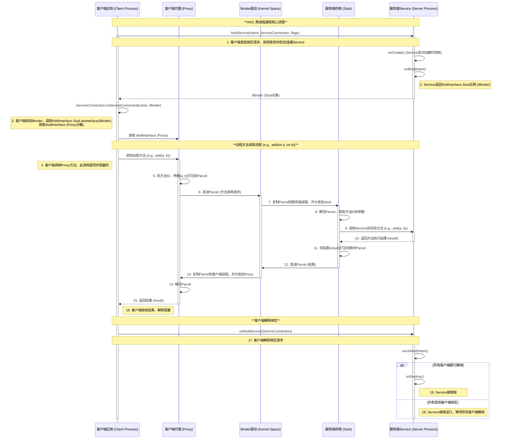

# 四大组件


# 极尽详细地为您讲解 Android 的四大组件及其相关知识

命令：

1.极尽详细地讲解该面试题涉及的所有知识技术。
2.在每部分相关知识技术讲解下，必须给出相关知识技术的具体运用示例或详细的已逐行注释的代码示例。
3.所有代码示例下都必须带有详细文字讲解说明，以便理解学习。
4.教会我回答面试官的详细具体话术。


好的，没问题。根据您提供的图片内容，我们将极尽详细地为您讲解 Android 的四大组件及其相关知识，包括创建、生命周期、使用方法、相互通信以及一些常见的避坑指南。同时，我们会在每个部分提供详细的代码示例、代码讲解以及面试回答话术。

---

**Android 四大组件详解与避坑指南**

Android 应用的核心是由四大组件构建的：Activity、Service、Broadcast Receiver 和 Content Provider。它们是 Android 系统的基石，各自承担着不同的职责，并通过 Intent 等机制相互协作。

**1. 四大组件简介**

*   **目的：** 了解 Android 四大组件各自的基本概念和作用。
*   **相关知识技术：** 应用组件、用户界面、后台任务、系统广播、数据共享。
*   **详细讲解：**
    Android 应用不是一个单一的入口点（像传统的桌面应用那样只有一个 `main` 函数），而是由这些可以独立启动的组件组成的。系统可以根据需要启动或销毁这些组件。
    *   **Activity：** 负责用户界面的展示和用户交互。通常一个 Activity 对应应用中的一个屏幕。
    *   **Service：** 负责在后台执行长时间运行的操作，没有用户界面。例如，播放音乐、下载文件等。
    *   **Broadcast Receiver：** 负责接收和响应系统或应用发送的广播消息。例如，接收到短信、电池电量低、网络状态变化等系统广播。
    *   **Content Provider：** 负责管理结构化的数据，并提供一种标准的方式让其他应用查询、插入、更新或删除这些数据。例如，联系人、短信、媒体库等系统数据通常通过 Content Provider 提供访问。
*   **具体运用示例或详细的已逐行注释的代码示例：**
    这部分是概念介绍，没有具体的代码示例来演示组件本身，代码示例将在后续各组件的详细讲解中给出。
*   **详细文字讲解说明：**
    理解四大组件是理解 Android 应用架构的关键。它们是 Android 系统的核心构建块，系统通过 Intent 等机制来启动和管理这些组件。不同组件承担不同职责，Activity 负责前台用户交互，Service 负责后台任务，Broadcast Receiver 负责事件监听，Content Provider 负责数据共享。
*   **如何回答面试官：**
    “Android 应用的核心是由四大组件构成的：Activity、Service、Broadcast Receiver 和 Content Provider。Activity 主要负责用户界面的展示和交互；Service 用于在后台执行没有界面的任务；Broadcast Receiver 用于接收和响应系统或应用发送的广播消息；而 Content Provider 则用于管理和共享结构化的数据。这些组件是 Android 应用的基石，它们可以独立启动，并通过 Intent 等机制相互通信和协作。”

**2. Activity 创建、生命周期和启动模式详解**

*   **目的：** 掌握 Activity 的创建过程、不同生命周期状态下的回调方法以及不同的启动模式对任务栈的影响。
*   **相关知识技术：** Activity 类、`AndroidManifest.xml`、生命周期回调方法 (`onCreate`, `onStart`, `onResume`, `onPause`, `onStop`, `onDestroy`, `onRestart`)、状态保存 (`onSaveInstanceState`)、启动模式 (`standard`, `singleTop`, `singleTask`, `singleInstance`)、任务栈 (Task Stack)。
*   **详细讲解：**
    Activity 是用户可见的界面组件。它的生命周期是 Android 开发中最重要的概念之一，因为它决定了何时初始化资源、何时释放资源、何时保存状态等。启动模式决定了 Activity 在任务栈中的创建和管理方式。

    **创建 Activity：**
    创建一个 Activity 需要两个步骤：
    1.  创建一个继承自 `AppCompatActivity` (或 `Activity`) 的 Kotlin/Java 类。
    2.  在 `AndroidManifest.xml` 文件中声明这个 Activity。

    **Activity 生命周期：**
    Activity 会在不同状态下调用特定的回调方法：
    *   `onCreate()`: 第一次创建时调用，进行初始化。
    *   `onStart()`: Activity 可见时调用。
    *   `onResume()`: Activity 获得焦点，可交互时调用。
    *   `onPause()`: Activity 失去焦点，部分可见时调用。
    *   `onStop()`: Activity 完全不可见时调用。
    *   `onDestroy()`: Activity 即将被销毁时调用。
    *   `onRestart()`: Activity 从停止状态重新启动时调用。
    *   `onSaveInstanceState(outState: Bundle)`: 在 Activity 可能被系统销毁前调用，保存动态状态。
    *   `onRestoreInstanceState(savedInstanceState: Bundle?)`: 在 `onStart` 后调用，恢复状态（通常在 `onCreate` 中处理）。

    **Activity 启动模式：**
    启动模式决定了每次启动 Activity 时，系统如何处理 Activity 实例和任务栈：
    *   `standard` (标准模式): 默认模式。每次启动都会创建一个新的 Activity 实例，并将其压入启动它的任务栈顶部。
    *   `singleTop` (栈顶复用模式): 如果要启动的 Activity 已经在任务栈的顶部，则不会创建新的实例，而是直接复用栈顶的实例，并调用其 `onNewIntent()` 方法。如果不在栈顶，则创建新实例并压栈。
    *   `singleTask` (栈内单例模式): 如果要启动的 Activity 已经在任务栈中存在，则会将该 Activity 上方的所有 Activity 移除，使该 Activity 成为栈顶，并调用其 `onNewIntent()` 方法。如果不存在，则创建新实例并压入新的任务栈（如果指定了 `taskAffinity`）或当前任务栈。
    *   `singleInstance` (全局单例模式): 每次启动都会创建一个新的任务栈，并将该 Activity 实例放入其中。该任务栈中只有这一个 Activity 实例。后续任何启动该 Activity 的请求都会复用这个唯一的实例，并调用其 `onNewIntent()` 方法。

    **避坑指南：**
    *   **ANR (Application Not Responding):** 不要在主线程（UI 线程）中执行耗时操作（如网络请求、大量计算、文件读写），否则会导致 ANR。耗时操作应放在后台线程、协程、Service 或 WorkManager 中执行。
    *   **资源泄漏：** 在 `onPause`、`onStop` 或 `onDestroy` 中释放不再需要的资源（如注销广播接收器、关闭数据库连接、停止动画），避免内存泄漏。
    *   **状态丢失：** 在 `onSaveInstanceState` 中保存 Activity 的动态状态，以便在 Activity 被系统销毁后重建时恢复。
    *   **启动模式误用：** 错误理解和使用启动模式可能导致任务栈混乱、Activity 实例过多或过少，影响用户体验和应用逻辑。

*   **具体运用示例或详细的已逐行注释的代码示例：**

    **Activity 类 (包含生命周期日志和状态保存):**
    ```kotlin
    package com.yourcompany.myapp

    import androidx.appcompat.app.AppCompatActivity
    import android.os.Bundle
    import android.util.Log // 导入 Log 类
    import android.widget.Button
    import android.widget.TextView
    import android.content.Intent // 导入 Intent 类

    // 定义一个日志标签
    private const val TAG = "MyActivityLifecycle"

    class MainActivity : AppCompatActivity() {

        private lateinit var statusTextView: TextView // 用于显示状态的 TextView
        private var counter = 0 // 用于演示状态保存的计数器

        // onCreate 方法：Activity 第一次创建时调用
        override fun onCreate(savedInstanceState: Bundle?) {
            super.onCreate(savedInstanceState)
            setContentView(R.layout.activity_main) // 加载布局
            Log.d(TAG, "onCreate() called")

            statusTextView = findViewById(R.id.statusTextView) // 找到 TextView
            val nextButton: Button = findViewById(R.id.nextButton) // 找到 Button

            // 恢复之前保存的状态 (如果 savedInstanceState 不为 null)
            if (savedInstanceState != null) {
                counter = savedInstanceState.getInt("my_counter", 0) // 恢复计数器，如果不存在则默认为 0
                Log.d(TAG, "Restored counter: $counter")
            }

            updateStatusText() // 更新 TextView 显示计数器

            // 设置按钮点击监听器，启动 SecondActivity
            nextButton.setOnClickListener {
                val intent = Intent(this, SecondActivity::class.java)
                startActivity(intent)
            }

            // 增加计数器的按钮 (用于演示状态保存)
            val incrementButton: Button = findViewById(R.id.incrementButton)
            incrementButton.setOnClickListener {
                counter++
                updateStatusText()
            }
        }

        // onStart 方法：Activity 变得可见时调用
        override fun onStart() {
            super.onStart()
            Log.d(TAG, "onStart() called")
        }

        // onResume 方法：Activity 获得焦点，可以与用户交互时调用
        override fun onResume() {
            super.onResume()
            Log.d(TAG, "onResume() called")
        }

        // onPause 方法：Activity 失去焦点，但仍然可见时调用
        override fun onPause() {
            super.onPause()
            Log.d(TAG, "onPause() called")
        }

        // onStop 方法：Activity 完全不可见时调用
        override fun onStop() {
            super.onStop()
            Log.d(TAG, "onStop() called")
        }

        // onDestroy 方法：Activity 即将被销毁时调用
        override fun onDestroy() {
            super.onDestroy()
            Log.d(TAG, "onDestroy() called")
        }

        // onRestart 方法：Activity 从停止状态重新启动时调用
        override fun onRestart() {
            super.onRestart()
            Log.d(TAG, "onRestart() called")
        }

        // onSaveInstanceState 方法：在 Activity 可能被系统销毁前调用，用于保存状态
        override fun onSaveInstanceState(outState: Bundle) {
            super.onSaveInstanceState(outState)
            Log.d(TAG, "onSaveInstanceState() called")
            // 将计数器的值保存到 Bundle 中
            outState.putInt("my_counter", counter)
        }

        // 更新 TextView 显示计数器
        private fun updateStatusText() {
            statusTextView.text = "Counter: $counter"
        }
    }
    ```

    **布局文件 (activity_main.xml):**
    ```xml
    <?xml version="1.0" encoding="utf-8"?>
    <LinearLayout xmlns:android="http://schemas.android.com/apk/res/android"
        xmlns:tools="http://schemas.android.com/tools"
        android:layout_width="match_parent"
        android:layout_height="match_parent"
        android:orientation="vertical"
        android:gravity="center"
        tools:context=".MainActivity">

        <TextView
            android:id="@+id/statusTextView"
            android:layout_width="wrap_content"
            android:layout_height="wrap_content"
            android:text="Counter: 0"
            android:textSize="24sp"
            android:layout_marginBottom="16dp"/>

        <Button
            android:id="@+id/incrementButton"
            android:layout_width="wrap_content"
            android:layout_height="wrap_content"
            android:text="Increment Counter"/>

        <Button
            android:id="@+id/nextButton"
            android:layout_width="wrap_content"
            android:layout_height="wrap_content"
            android:text="Go to Second Activity"
            android:layout_marginTop="16dp"/>

    </LinearLayout>
    ```

    **SecondActivity 类 (简单示例):**
    ```kotlin
    package com.yourcompany.myapp

    import androidx.appcompat.app.AppCompatActivity
    import android.os.Bundle
    import android.util.Log

    private const val TAG = "SecondActivityLifecycle"

    class SecondActivity : AppCompatActivity() {
        override fun onCreate(savedInstanceState: Bundle?) {
            super.onCreate(savedInstanceState)
            setContentView(R.layout.activity_second) // 加载布局
            Log.d(TAG, "SecondActivity onCreate() called")
        }

        // ... 其他生命周期方法类似 MainActivity
    }
    ```

    **布局文件 (activity_second.xml):**
    ```xml
    <?xml version="1.0" encoding="utf-8"?>
    <LinearLayout xmlns:android="http://schemas.android.com/apk/res/android"
        xmlns:tools="http://schemas.android.com/tools"
        android:layout_width="match_parent"
        android:layout_height="match_parent"
        android:gravity="center"
        tools:context=".SecondActivity">

        <TextView
            android:layout_width="wrap_content"
            android:layout_height="wrap_content"
            android:text="This is Second Activity"
            android:textSize="24sp"/>

    </LinearLayout>
    ```

    **AndroidManifest.xml (声明 Activity 并设置启动模式):**
    ```xml
    <?xml version="1.0" encoding="utf-8"?>
    <manifest xmlns:android="http://schemas.android.com/apk/res/android"
        xmlns:tools="http://schemas.android.com/tools">

        <application
            android:allowBackup="true"
            android:dataExtractionRules="@xml/data_extraction_rules"
            android:fullBackupContent="@xml/backup_rules"
            android:icon="@mipmap/ic_launcher"
            android:label="@string/app_name"
            android:roundIcon="@mipmap/ic_launcher_round"
            android:supportsRtl="true"
            android:theme="@style/Theme.MyAwesomeApp">

            <!-- MainActivity 声明 -->
            <activity
                android:name=".MainActivity"
                android:exported="true"
                android:launchMode="standard"> <!-- 设置启动模式为 standard -->
                <intent-filter>
                    <action android:name="android.intent.action.MAIN" />
                    <category android:name="android.intent.category.LAUNCHER" />
                </intent-filter>
            </activity>

            <!-- SecondActivity 声明 -->
            <activity
                android:name=".SecondActivity"
                android:launchMode="singleTop"> <!-- 设置启动模式为 singleTop -->
                <!-- 如果 SecondActivity 需要被其他应用启动，需要添加 intent-filter 和 exported="true" -->
            </activity>

            <!-- 声明其他组件 -->

        </application>
    </manifest>
    ```

*   **详细文字讲解说明：**
    *   上面的代码示例展示了 `MainActivity` 和 `SecondActivity` 的基本结构。
    *   在 `MainActivity` 中，我们在每个生命周期回调方法中都添加了 `Log.d()` 语句，以便在 Logcat 中观察它们的调用顺序。
    *   `MainActivity` 中还包含一个计数器 `counter` 和一个 `TextView` 来显示它。在 `onSaveInstanceState` 方法中，我们将 `counter` 的值保存到 `Bundle` 中。在 `onCreate` 方法中，我们检查 `savedInstanceState` 是否不为 `null`，如果不是，则从 Bundle 中恢复 `counter` 的值。这演示了 Activity 状态的保存与恢复。
    *   `MainActivity` 中的按钮点击事件创建了一个显式 Intent 来启动 `SecondActivity`。
    *   `AndroidManifest.xml` 文件中声明了 `MainActivity` 和 `SecondActivity`。通过 `android:launchMode` 属性可以设置 Activity 的启动模式。`MainActivity` 设置为 `standard`，`SecondActivity` 设置为 `singleTop`。您可以尝试修改这些启动模式，并在 Logcat 中观察 Activity 的创建和销毁情况，以及任务栈的变化（可以使用 `adb shell dumpsys activity activities` 命令查看任务栈）。
    *   例如，当 `MainActivity` 是 `standard`，`SecondActivity` 是 `singleTop` 时：
        *   启动 App: `MainActivity` (standard) -> `onCreate` -> `onStart` -> `onResume`
        *   点击按钮去 SecondActivity: `MainActivity` -> `onPause` -> `SecondActivity` -> `onCreate` -> `onStart` -> `onResume` -> `MainActivity` -> `onStop`. 任务栈: [MainActivity, SecondActivity]
        *   在 SecondActivity 点击返回: `SecondActivity` -> `onPause` -> `MainActivity` -> `onRestart` -> `onStart` -> `onResume` -> `SecondActivity` -> `onStop` -> `onDestroy`. 任务栈: [MainActivity]
        *   如果在 SecondActivity 再次启动 SecondActivity: 由于 SecondActivity 已经是栈顶，不会创建新的实例，而是调用 `onNewIntent` (需要在 SecondActivity 中重写)。任务栈: [MainActivity, SecondActivity]

*   **如何回答面试官：**
    “Activity 是 Android 应用中负责用户界面的组件。它的生命周期非常重要，包括 `onCreate`、`onStart`、`onResume`、`onPause`、`onStop`、`onDestroy` 等回调方法。我需要在这些方法中正确地管理资源和保存/恢复 Activity 的状态，比如在 `onCreate` 中初始化，在 `onResume` 中获取焦点，在 `onPause` 或 `onStop` 中释放资源，在 `onSaveInstanceState` 中保存动态数据。Activity 的启动模式（`standard`、`singleTop`、`singleTask`、`singleInstance`）决定了 Activity 实例的创建和在任务栈中的管理方式，不同的模式适用于不同的场景，比如 `singleTop` 适合避免重复创建栈顶 Activity，`singleTask` 适合作为应用的入口或主界面。在使用 Activity 时，需要注意避免在主线程执行耗时操作导致 ANR，以及及时释放资源防止内存泄漏。”

**3. Intent 和 IntentFilter 详解**

*   **目的：** 掌握 Intent 作为消息传递对象的作用、组成部分以及 IntentFilter 如何用于匹配隐式 Intent。
*   **相关知识技术：** Intent 对象、Action、Data (Uri, MIME Type)、Category、Extras (Bundle)、Flags、ComponentName、IntentFilter XML 标签、匹配规则。
*   **详细讲解：**
    Intent 是 Android 组件之间通信的桥梁，它是一个消息传递对象，表达了一个操作的“意图”。Intent 可以用来启动 Activity、Service，或者发送广播。IntentFilter 是在 `AndroidManifest.xml` 中为组件声明的，用于说明该组件能够响应哪些类型的 Intent。

    **Intent 的组成部分：**
    *   `ComponentName`: 目标组件的精确名称（包名 + 类名）。用于显式 Intent。
    *   `Action`: 要执行的通用动作字符串（如 `Intent.ACTION_VIEW`, `Intent.ACTION_SEND`）。
    *   `Data`: 操作所针对的数据的 URI 和 MIME 类型。
    *   `Category`: 描述组件类别的字符串（如 `Intent.CATEGORY_LAUNCHER`, `Intent.CATEGORY_DEFAULT`）。
    *   `Extras`: 包含附加数据的 Bundle。
    *   `Flags`: 控制 Intent 的行为，如 Activity 的启动模式。

    **Intent 的类型：**
    *   **显式 Intent:** 指定了目标组件的 `ComponentName`。通常用于应用内部。
    *   **隐式 Intent:** 不指定 `ComponentName`，而是描述 Action、Data、Category 等。系统会根据这些信息匹配能够处理它的组件。常用于启动其他应用的组件。

    **IntentFilter：**
    在 `AndroidManifest.xml` 中，通过在组件（`<activity>`, `<service>`, `<receiver>`）标签内添加 `<intent-filter>` 标签来声明组件能够响应的 Intent 类型。一个 `<intent-filter>` 可以包含：
    *   `<action android:name="...">`: 声明可以响应的 Action。
    *   `<category android:name="...">`: 声明可以响应的 Category。
    *   `<data android:scheme="..." android:host="..." android:path="..." android:mimeType="...">`: 声明可以处理的数据类型和 URI 格式。

    **Intent 和 IntentFilter 的匹配：**
    系统在处理隐式 Intent 时，会将其与所有组件的 IntentFilter 进行匹配。只有当 Intent 的 Action、Category 和 Data 都与某个 IntentFilter 匹配时，该组件才能响应这个 Intent。
    *   **Action 匹配：** Intent 中的 Action 必须与 IntentFilter 中声明的某个 Action 完全一致。
    *   **Category 匹配：** Intent 中的所有 Category 都必须在 IntentFilter 中找到对应的声明。**注意：** `startActivity()` 方法发送的隐式 Intent 会自动添加 `CATEGORY_DEFAULT`，因此如果您的 Activity 需要响应隐式 Intent 并通过 `startActivity()` 启动，其 IntentFilter 中必须包含 `CATEGORY_DEFAULT`。
    *   **Data 匹配：** Intent 中的 Data 必须与 IntentFilter 中声明的某个 Data 格式匹配（包括 Scheme, Host, Port, Path, MIME Type）。

    **避坑指南：**
    *   **`ActivityNotFoundException`:** 当使用隐式 Intent 启动 Activity 时，如果没有找到任何能够处理该 Intent 的组件，会抛出 `ActivityNotFoundException`。在调用 `startActivity()` 之前，应该使用 `intent.resolveActivity(packageManager) != null` 来检查是否存在匹配的组件。
    *   **隐式 Intent 安全性：** 谨慎处理接收到的隐式 Intent，特别是来自其他应用的数据。验证数据的合法性和来源。发送隐式 Intent 时，如果不需要被其他应用接收，考虑使用显式 Intent 或设置包名。
    *   **Intent Filter 配置错误：** Intent Filter 配置不正确会导致组件无法响应预期的隐式 Intent。特别是 `CATEGORY_DEFAULT` 的遗漏。
    *   **Extras 数据过大：** 通过 Intent 的 Extras 传递大量数据（如大图片、大文件内容）可能导致 TransactionTooLargeException。对于大量数据，应该考虑其他传递方式，如将数据写入文件并通过 URI 传递文件路径，或者使用 ViewModel、单例对象、数据库等共享数据。

*   **具体运用示例或详细的已逐行注释的代码示例：**

    **显式 Intent 示例 (在 MainActivity 中启动 SecondActivity):**
    ```kotlin
    // 在 MainActivity 的某个地方 (例如按钮点击监听器中)
    val explicitIntent = Intent(this, SecondActivity::class.java) // 创建显式 Intent，指定目标 Activity 类
    explicitIntent.putExtra("message", "Hello from MainActivity!") // 添加附加数据
    startActivity(explicitIntent) // 启动 SecondActivity
    ```

    **隐式 Intent 示例 (启动系统浏览器):**
    ```kotlin
    // 在 MainActivity 的某个地方
    val webpageUri = Uri.parse("https://developer.android.com/") // 创建一个 URI 对象
    val implicitIntent = Intent(Intent.ACTION_VIEW, webpageUri) // 创建隐式 Intent，Action 为 ACTION_VIEW，Data 为网页 URI

    // 检查是否有应用可以处理这个 Intent
    if (implicitIntent.resolveActivity(packageManager) != null) {
        startActivity(implicitIntent) // 启动系统浏览器或其他能处理 ACTION_VIEW 和 http/https URI 的应用
    } else {
        // 没有应用可以处理，给用户提示
        Toast.makeText(this, "No browser app found.", Toast.LENGTH_SHORT).show()
    }
    ```

    **在 AndroidManifest.xml 中为 SecondActivity 配置 IntentFilter (使其可以响应隐式 Intent):**
    ```xml
    <activity android:name=".SecondActivity"
              android:exported="true"> <!-- 如果要被其他应用启动，需要设置为 true -->
        <intent-filter>
            <action android:name="com.yourcompany.myapp.ACTION_VIEW_SECOND_DATA" /> <!-- 定义一个自定义 Action -->
            <category android:name="android.intent.category.DEFAULT" /> <!-- 必须包含 DEFAULT Category -->
            <category android:name="android.intent.category.BROWSABLE" /> <!-- 表示可以从浏览器或链接启动 -->
            <data android:scheme="myapp" // 定义自定义 Scheme
                  android:host="second" // 定义 Host
                  android:pathPrefix="/view" // 定义 Path 前缀
                  android:mimeType="text/plain" /> // 定义 MIME Type
        </intent-filter>
        <!-- 可以有多个 intent-filter -->
    </activity>
    ```

    **通过隐式 Intent 启动配置了 IntentFilter 的 SecondActivity:**
    ```kotlin
    // 在其他地方 (例如另一个 Activity 或另一个应用中)
    val customUri = Uri.parse("myapp://second/view/some_id") // 创建匹配 IntentFilter 中 data 的 URI
    val implicitIntentToSecond = Intent("com.yourcompany.myapp.ACTION_VIEW_SECOND_DATA", customUri) // 指定 Action 和 Data
    // 注意：如果通过 startActivity() 启动，系统会自动添加 CATEGORY_DEFAULT，所以 IntentFilter 中必须有 DEFAULT

    // 如果 IntentFilter 中声明了 CATEGORY_BROWSABLE，也可以通过浏览器打开一个链接来启动
    // 例如，在网页中点击一个链接 <a href="myapp://second/view/some_id">Open in App</a>

    if (implicitIntentToSecond.resolveActivity(packageManager) != null) {
        startActivity(implicitIntentToSecond) // 启动 SecondActivity
    } else {
        Toast.makeText(this, "Second Activity cannot handle this Intent.", Toast.LENGTH_SHORT).show()
    }
    ```

    **在 SecondActivity 中获取 Intent 并提取数据:**
    ```kotlin
    // 在 SecondActivity 的 onCreate 方法中
    val receivedIntent = intent // 获取启动当前 Activity 的 Intent

    // 获取附加数据
    val message = receivedIntent.getStringExtra("message") // 获取显式 Intent 传递的数据
    Log.d(TAG, "Received message from explicit Intent: $message") // 输出：Received message from explicit Intent: Hello from MainActivity!

    // 获取 Action, Data, Category (如果通过隐式 Intent 启动)
    val action = receivedIntent.action
    val data = receivedIntent.data
    val categories = receivedIntent.categories
    Log.d(TAG, "Received Action: $action, Data: $data, Categories: $categories")
    // 如果通过上面的隐式 Intent 启动，输出可能类似：
    // Received Action: com.yourcompany.myapp.ACTION_VIEW_SECOND_DATA, Data: myapp://second/view/some_id, Categories: [android.intent.category.DEFAULT, android.intent.category.BROWSABLE]
    ```

*   **详细文字讲解说明：**
    *   显式 Intent 直接指定目标组件的类名，简单直接，常用于应用内部组件跳转。
    *   隐式 Intent 通过 Action、Data、Category 等描述意图，由系统匹配 IntentFilter 来找到合适的组件。这实现了组件间的解耦，常用于启动其他应用的组件或根据不同数据启动不同组件。
    *   `IntentFilter` 在 `AndroidManifest.xml` 中声明，是组件响应隐式 Intent 的“能力声明”。它定义了组件能处理哪些 Action、Data 格式和 Category。
    *   Intent 和 IntentFilter 的匹配规则是：Action 必须匹配，Category 必须包含 Intent 中的所有 Category，Data 必须匹配 IntentFilter 中声明的某个 Data 格式。
    *   `intent.resolveActivity(packageManager)` 是检查隐式 Intent 是否有处理者的方法，避免 `ActivityNotFoundException`。
    *   通过 `putExtra()` 方法可以在 Intent 中附加各种类型的数据，在接收端通过相应的 `get...Extra()` 方法提取。
    *   需要注意隐式 Intent 的安全性问题，以及 Intent Filter 配置的准确性。

*   **如何回答面试官：**
    “Intent 是 Android 中用于组件间通信的消息传递对象，它表达了一个操作的意图，可以用来启动 Activity、Service 或发送广播。Intent 分为显式 Intent 和隐式 Intent。显式 Intent 通过指定目标组件的类名来启动特定组件，常用于应用内部。隐式 Intent 不指定具体组件，而是描述 Action、Data、Category 等，由系统匹配 IntentFilter 来找到处理者，常用于启动其他应用的组件。IntentFilter 是在 `AndroidManifest.xml` 中为组件声明的，用于说明该组件能够响应哪些类型的隐式 Intent。系统会根据 Intent 的 Action、Category 和 Data 与 IntentFilter 进行匹配。在使用隐式 Intent 时，需要注意检查是否有组件可以处理，避免 `ActivityNotFoundException`，同时也要关注安全性问题。”

**4. Service 创建、生命周期和使用详解**

*   **目的：** 掌握 Service 的创建、生命周期以及启动和绑定两种使用方式。
*   **相关知识技术：** Service 类、`AndroidManifest.xml`、生命周期回调方法 (`onCreate`, `onStartCommand`, `onBind`, `onUnbind`, `onDestroy`)、启动 Service (`startService`, `stopService`, `stopSelf`)、绑定 Service (`bindService`, `unbindService`)、IBinder、AIDL、前台 Service (Foreground Service)。
*   **详细讲解：**
    Service 是在后台运行的组件，没有用户界面。它用于执行长时间运行的操作，例如播放音乐、下载文件、同步数据等。Service 运行在主线程中，因此耗时操作需要在 Service 内部创建新的线程或使用协程等方式处理。

    Service 的两种主要使用方式：
    *   **启动 (Started):** 通过 `startService()` 启动。Service 会独立运行，即使启动它的组件被销毁，Service 也会继续运行，直到调用 `stopService()` 或 `stopSelf()` 停止。
    *   **绑定 (Bound):** 通过 `bindService()` 绑定。Service 的生命周期与绑定它的组件（客户端）相关联。当所有客户端都解绑后，Service 会被销毁。绑定 Service 允许客户端与 Service 进行交互（调用 Service 的方法）。

    **Service 生命周期：**
    *   `onCreate()`: Service 第一次创建时调用，进行初始化。
    *   `onStartCommand(intent: Intent?, flags: Int, startId: Int): Int`: 通过 `startService()` 启动 Service 时调用。可以在此方法中处理启动请求，并返回一个整数值，指示系统在 Service 被杀死后如何处理它（如 `START_STICKY`, `START_NOT_STICKY`）。
    *   `onBind(intent: Intent): IBinder?`: 通过 `bindService()` 绑定 Service 时调用。返回一个 `IBinder` 对象，客户端通过这个对象与 Service 交互。如果 Service 不支持绑定，返回 `null`。
    *   `onUnbind(intent: Intent): Boolean`: 所有客户端都解绑后调用。
    *   `onDestroy()`: Service 即将被销毁时调用，进行清理工作。

    **前台 Service (Foreground Service):**
    前台 Service 是用户可以感知到的 Service，例如正在播放音乐的应用会在通知栏显示一个持续的通知。前台 Service 不太可能被系统杀死，适合执行用户明确知道且需要持续进行的任务。启动前台 Service 需要调用 `startForeground(notificationId, notification)`，并需要相应的权限。

    **避坑指南：**
    *   **ANR:** Service 运行在主线程，不要在 `onStartCommand` 或 `onBind` 中执行耗时操作。耗时操作应在单独的线程或协程中执行。
    *   **Service 不停止：** 通过 `startService()` 启动的 Service 必须显式调用 `stopService()` 或 `stopSelf()` 来停止，否则即使启动它的组件被销毁，Service 也会一直运行，可能导致资源浪费甚至内存泄漏。
    *   **后台限制：** Android O (8.0) 及以上版本对后台 Service 进行了限制，应用在后台时启动 Service 会受到限制。对于长时间运行的后台任务，应优先考虑 WorkManager 或前台 Service。
    *   **绑定 Service 的生命周期：** 绑定 Service 的生命周期与客户端绑定状态相关，当所有客户端都解绑后 Service 才会被销毁。如果 Service 同时被启动和绑定，其生命周期会更复杂，只有当所有客户端都解绑且没有通过 `startService` 启动时才会被销毁。
    *   **IPC 复杂性：** 如果 Service 需要与不同进程的客户端进行复杂交互，可能需要使用 AIDL，这会增加开发复杂性。

*   **具体运用示例或详细的已逐行注释的代码示例：**

    **Started Service 示例:**
    ```kotlin
    package com.yourcompany.myapp

    import android.app.Service
    import android.content.Intent
    import android.os.IBinder
    import android.util.Log
    import kotlinx.coroutines.* // 导入协程库

    private const val TAG = "MyStartedService"

    class MyStartedService : Service() {

        // 使用 CoroutineScope 管理协程生命周期
        private val serviceScope = CoroutineScope(Dispatchers.IO + SupervisorJob())

        // onCreate 方法：Service 第一次创建时调用
        override fun onCreate() {
            super.onCreate()
            Log.d(TAG, "onCreate() called")
        }

        // onStartCommand 方法：通过 startService() 启动时调用
        override fun onStartCommand(intent: Intent?, flags: Int, startId: Int): Int {
            Log.d(TAG, "onStartCommand() called, startId: $startId")

            // 从 Intent 中获取数据 (如果启动时传递了数据)
            val data = intent?.getStringExtra("data_to_service")
            Log.d(TAG, "Received data: $data")

            // 在后台线程执行耗时操作 (使用协程)
            serviceScope.launch {
                Log.d(TAG, "Starting background task...")
                // 模拟一个耗时操作
                delay(5000) // 暂停 5 秒
                Log.d(TAG, "Background task finished.")

                // 任务完成后，可以停止 Service
                stopSelf(startId) // 使用 stopSelf(startId) 可以确保只有最新的启动请求完成后才停止 Service
            }

            // 返回 START_STICKY 表示如果 Service 被系统杀死，系统会尝试重建并重新调用 onStartCommand
            return START_STICKY
        }

        // onBind 方法：如果 Service 不支持绑定，返回 null
        override fun onBind(intent: Intent?): IBinder? {
            Log.d(TAG, "onBind() called")
            return null // 这个 Service 不支持绑定
        }

        // onDestroy 方法：Service 即将被销毁时调用
        override fun onDestroy() {
            super.onDestroy()
            Log.d(TAG, "onDestroy() called")
            // 取消所有正在运行的协程，释放资源
            serviceScope.cancel()
        }
    }
    ```

    **在 Activity 中启动和停止 Started Service:**
    ```kotlin
    // 在 Activity 的某个地方
    val startServiceButton: Button = findViewById(R.id.startServiceButton)
    val stopServiceButton: Button = findViewById(R.id.stopServiceButton)

    startServiceButton.setOnClickListener {
        val serviceIntent = Intent(this, MyStartedService::class.java)
        serviceIntent.putExtra("data_to_service", "Hello Service!") // 传递数据
        startService(serviceIntent) // 启动 Service
    }

    stopServiceButton.setOnClickListener {
        val serviceIntent = Intent(this, MyStartedService::class.java)
        stopService(serviceIntent) // 停止 Service
    }
    ```

    **Bound Service 示例 (简单):**
    ```kotlin
    package com.yourcompany.myapp

    import android.app.Service
    import android.content.Intent
    import android.os.Binder // 导入 Binder 类
    import android.os.IBinder
    import android.util.Log

    private const val TAG = "MyBoundService"

    class MyBoundService : Service() {

        // Binder 对象，客户端通过它与 Service 交互
        private val binder = LocalBinder()

        // 定义一个内部类继承 Binder
        inner class LocalBinder : Binder() {
            // 提供一个方法让客户端获取 Service 实例
            fun getService(): MyBoundService = this@MyBoundService
        }

        // onCreate 方法：Service 第一次创建时调用
        override fun onCreate() {
            super.onCreate()
            Log.d(TAG, "onCreate() called")
        }

        // onBind 方法：通过 bindService() 绑定时调用，返回 Binder 对象
        override fun onBind(intent: Intent): IBinder {
            Log.d(TAG, "onBind() called")
            return binder // 返回 LocalBinder 实例
        }

        // onUnbind 方法：所有客户端都解绑后调用
        override fun onUnbind(intent: Intent): Boolean {
            Log.d(TAG, "onUnbind() called")
            // 返回 true 表示 Service 在所有客户端解绑后，如果又有客户端绑定，会调用 onRebind
            return true
        }

        // onRebind 方法：在 onUnbind 返回 true 后，有新的客户端绑定时调用
        override fun onRebind(intent: Intent) {
            super.onRebind(intent)
            Log.d(TAG, "onRebind() called")
        }

        // onDestroy 方法：Service 即将被销毁时调用
        override fun onDestroy() {
            super.onDestroy()
            Log.d(TAG, "onDestroy() called")
        }

        // Service 提供给客户端调用的方法
        fun add(x: Int, y: Int): Int {
            Log.d(TAG, "add() called with $x and $y")
            return x + y
        }
    }
    ```

    **在 Activity 中绑定和使用 Bound Service:**
    ```kotlin
    package com.yourcompany.myapp

    import androidx.appcompat.app.AppCompatActivity
    import android.content.ComponentName // 导入 ComponentName 类
    import android.content.Context // 导入 Context 类
    import android.content.Intent
    import android.content.ServiceConnection // 导入 ServiceConnection 接口
    import android.os.Bundle
    import android.os.IBinder
    import android.util.Log
    import android.widget.Button
    import android.widget.TextView

    private const val TAG = "MainActivityBound"

    class MainActivity : AppCompatActivity() {

        private lateinit var bindServiceButton: Button
        private lateinit var unbindServiceButton: Button
        private lateinit var callServiceButton: Button
        private lateinit var resultTextView: TextView

        private var myBoundService: MyBoundService? = null // Service 实例引用
        private var isBound = false // 标记是否已绑定 Service

        // ServiceConnection 对象，用于监听 Service 的连接状态
        private val connection = object : ServiceConnection {
            // onServiceConnected 方法：当 Service 连接成功时调用
            override fun onServiceConnected(name: ComponentName?, service: IBinder?) {
                Log.d(TAG, "Service Connected")
                // 获取 Service 实例
                val binder = service as MyBoundService.LocalBinder
                myBoundService = binder.getService()
                isBound = true
                callServiceButton.isEnabled = true // 连接成功后启用调用按钮
            }

            // onServiceDisconnected 方法：当 Service 连接意外断开时调用 (例如 Service 崩溃)
            override fun onServiceDisconnected(name: ComponentName?) {
                Log.d(TAG, "Service Disconnected")
                myBoundService = null
                isBound = false
                callServiceButton.isEnabled = false // 连接断开后禁用调用按钮
            }
        }

        override fun onCreate(savedInstanceState: Bundle?) {
            super.onCreate(savedInstanceState)
            setContentView(R.layout.activity_main_bound) // 加载布局

            bindServiceButton = findViewById(R.id.bindServiceButton)
            unbindServiceButton = findViewById(R.id.unbindServiceButton)
            callServiceButton = findViewById(R.id.callServiceButton)
            resultTextView = findViewById(R.id.resultTextView)

            callServiceButton.isEnabled = false // 初始禁用调用按钮

            bindServiceButton.setOnClickListener {
                if (!isBound) { // 如果未绑定，则进行绑定
                    val serviceIntent = Intent(this, MyBoundService::class.java)
                    // 使用 bindService 绑定 Service
                    // Context.BIND_AUTO_CREATE 标志表示如果 Service 未运行则创建它
                    bindService(serviceIntent, connection, Context.BIND_AUTO_CREATE)
                }
            }

            unbindServiceButton.setOnClickListener {
                if (isBound) { // 如果已绑定，则进行解绑
                    unbindService(connection) // 解绑 Service
                    isBound = false
                    myBoundService = null // 清空 Service 引用
                    callServiceButton.isEnabled = false // 解绑后禁用调用按钮
                    Log.d(TAG, "Service Unbound")
                }
            }

            callServiceButton.setOnClickListener {
                // 调用 Service 的方法 (需要先检查 Service 实例是否可用)
                val result = myBoundService?.add(5, 10) // 使用安全调用
                resultTextView.text = "Service Result: $result"
            }
        }

        // 在 Activity 销毁时解绑 Service，避免内存泄漏
        override fun onDestroy() {
            super.onDestroy()
            if (isBound) {
                unbindService(connection)
                isBound = false
                myBoundService = null
            }
        }
    }
    ```

    **AndroidManifest.xml (声明 Service):**
    ```xml
    <service android:name=".MyStartedService"
             android:exported="false"/> <!-- 通常设置为 false，除非需要被其他应用启动 -->

    <service android:name=".MyBoundService"
             android:exported="false"/> <!-- 通常设置为 false，除非需要被其他应用绑定 -->
    ```

*   **详细文字讲解说明：**
    *   `MyStartedService` 演示了 Started Service 的用法。它重写了 `onStartCommand` 方法来处理启动请求，并在后台协程中执行一个模拟的耗时任务。任务完成后调用 `stopSelf(startId)` 来停止 Service。`START_STICKY` 返回值表示 Service 被系统杀死后会尝试重建。
    *   `MyBoundService` 演示了 Bound Service 的用法。它重写了 `onBind` 方法，返回一个自定义的 `Binder` 对象 (`LocalBinder`)。`LocalBinder` 提供了一个 `getService()` 方法，让客户端可以获取 Service 实例，进而调用 Service 的公共方法（如 `add()`）。
    *   在 Activity 中，通过 `bindService()` 方法绑定 Service，需要传入一个 `ServiceConnection` 对象来监听连接状态。在 `onServiceConnected` 中获取 `IBinder` 对象并转换为 Service 实例。通过 `unbindService()` 方法解绑 Service。
    *   **重要：** 无论使用哪种方式启动 Service，都必须在 `AndroidManifest.xml` 中声明 Service。`android:exported` 属性决定了 Service 是否可以被其他应用的组件启动或绑定。通常设置为 `false` 以保证安全。
    *   Started Service 必须显式停止，否则会一直运行。Bound Service 的生命周期与绑定它的客户端相关联，所有客户端解绑后才会被销毁。
    *   前台 Service 需要调用 `startForeground()` 并提供通知，以避免被系统杀死。

*   **如何回答面试官：**
    “Service 是 Android 中用于在后台执行长时间运行任务的组件，它没有用户界面。Service 主要有两种使用方式：启动 (Started) 和绑定 (Bound)。通过 `startService()` 启动的 Service 会独立运行，直到显式调用 `stopService()` 或 `stopSelf()` 停止；通过 `bindService()` 绑定的 Service 的生命周期与客户端相关联，允许客户端与 Service 进行交互。Service 的生命周期回调方法包括 `onCreate`、`onStartCommand` (启动方式)、`onBind` (绑定方式)、`onUnbind` 和 `onDestroy`。需要注意的是，Service 默认运行在主线程，耗时操作必须在单独的线程中执行，否则会导致 ANR。对于需要长时间运行且用户感知的任务，应该使用前台 Service 来避免被系统杀死。同时，要确保正确停止 Started Service，避免资源泄漏。”

**5. IPC 详解**

*   **目的：** 理解 IPC (Inter-Process Communication) 在 Android 中的概念、原因以及常用的实现方式。
*   **相关知识技术：** 进程、线程、Binder 机制、AIDL (Android Interface Definition Language)、Messenger、Content Provider、Bundle。
*   **详细讲解：**
    默认情况下，Android 应用的所有组件都运行在同一个进程中。但是，有时您可能需要让应用的某些组件运行在单独的进程中，或者需要在不同的应用之间进行通信。这就需要 IPC (Inter-Process Communication)，即进程间通信。

    **为什么需要 IPC？**
    *   **内存隔离：** 每个进程有独立的内存空间，一个进程的崩溃不会影响其他进程，提高了应用的稳定性。
    *   **安全隔离：** 进程之间的数据访问受到严格控制。
    *   **提高性能：** 将耗时或资源密集型任务放在单独的进程中，可以避免阻塞主进程，提高 UI 响应速度。
    *   **多进程架构：** 某些应用设计需要多进程，例如，将 Service 运行在单独的进程中，即使 UI 进程崩溃，Service 也能继续运行。

    **Android 中常用的 IPC 实现方式：**
    1.  **通过 Intent 传递 Bundle：** 最简单的方式，通过 Intent 的 Extras 传递基本数据类型或实现了 `Serializable`/`Parcelable` 接口的对象。**限制：** 数据大小有限制，不适合传递大量数据；只适合一次性数据传递，不适合持续通信。
    2.  **使用 Messenger：** 基于 Handler 实现，通过在进程间传递 `Message` 对象进行通信。适合简单的请求/响应场景，消息是串行处理的。
    3.  **使用 AIDL (Android Interface Definition Language)：** Android 提供的接口定义语言，用于定义跨进程调用的接口。系统会根据 AIDL 文件生成相应的 Java/Kotlin 代码，实现跨进程方法的调用和数据的传递。适合需要进行远程方法调用、传递复杂数据类型、处理并发请求的场景。底层基于 Binder 机制。
    4.  **使用 Content Provider：** Content Provider 本身就是一种 IPC 机制，用于在不同应用之间共享结构化数据。通过 `ContentResolver` 调用 Content Provider 的 `query`, `insert`, `update`, `delete` 方法实现跨进程数据访问。
    5.  **使用文件或 Socket：** 标准的 Linux IPC 方式，可以在 Android 中使用，但通常不如 Binder 机制方便和高效。

    **Binder 机制：**
    Binder 是 Android 系统中最重要的 IPC 机制。它是一种客户端-服务器通信模型，允许一个进程（客户端）调用另一个进程（服务器）中的方法。Binder 提供了高效、安全、稳定的跨进程通信能力。AIDL 和 Messenger 的底层都依赖于 Binder。

    **避坑指南：**
    *   **AIDL 复杂性：** AIDL 的实现相对复杂，需要定义接口、实现 Service、处理连接和断开等。
    *   **性能开销：** IPC 调用涉及进程切换和数据序列化/反序列化，相比同进程调用有性能开销。应尽量减少 IPC 调用次数，避免在循环中进行 IPC。
    *   **异常处理：** 跨进程调用时，需要考虑远程进程崩溃或方法执行异常的情况。
    *   **安全问题：** 跨进程共享数据或提供服务时，需要考虑权限控制，防止未经授权的访问。
    *   **数据大小限制：** 通过 Binder 传递的数据大小有限制（通常为 1MB），传递大数据需要其他方式。

*   **具体运用示例或详细的已逐行注释的代码示例：**

    **通过 Intent 传递 Bundle (已在 Intent 部分示例中展示):**
    请参考上面 Intent 部分的示例，使用 `intent.putExtra()` 和 `receivedIntent.get...Extra()`。

    **使用 Messenger (概念示例，完整实现较复杂):**
    *   定义一个 Service 在单独进程中运行 (在 `AndroidManifest.xml` 中为 Service 添加 `android:process=":remote"`)。
    *   在 Service 中创建一个 `Handler` 和 `Messenger`。
    *   在 `onBind` 方法中返回 `Messenger` 的 `IBinder`。
    *   客户端通过 `bindService` 获取 `IBinder`，创建 `Messenger`，然后通过 `messenger.send(message)` 发送 `Message`。
    *   Service 的 `Handler` 接收并处理 `Message`。

    **使用 AIDL (概念示例，完整实现较复杂):**
    *   创建一个 `.aidl` 文件，定义跨进程接口。
    *   构建项目，系统会生成对应的 Java/Kotlin 代码。
    *   创建一个 Service，实现 AIDL 接口中定义的方法。
    *   在 `onBind` 方法中返回 AIDL 接口的实现对象。
    *   客户端通过 `bindService` 获取 `IBinder`，将其转换为 AIDL 接口类型，然后就可以调用远程方法。

    **使用 Content Provider (概念示例，完整实现较复杂):**
    *   创建一个继承自 `ContentProvider` 的类，实现 `query`, `insert`, `update`, `delete` 等方法。
    *   在 `AndroidManifest.xml` 中声明 Content Provider，并指定 `android:authorities` 和权限。
    *   客户端通过 `ContentResolver` 调用对应的方法，传入 Content URI 来访问数据。

*   **详细文字讲解说明：**
    IPC 是 Android 高级开发中的重要概念。理解为什么需要 IPC 以及各种 IPC 方式的优缺点和适用场景非常重要。Binder 机制是 Android IPC 的核心，提供了高效安全的通信能力。Intent+Bundle 适合简单数据传递，Messenger 适合简单的消息传递，AIDL 适合复杂的远程方法调用，Content Provider 适合结构化数据共享。在进行 IPC 开发时，需要特别注意性能、安全和异常处理。

*   **如何回答面试官：**
    “IPC，即进程间通信，在 Android 中用于让不同进程的组件进行通信。这在需要内存隔离、安全隔离、提高稳定性或实现多进程架构时非常有用。Android 提供了多种 IPC 方式，包括通过 Intent 传递 Bundle（适合简单数据）、使用 Messenger（基于 Handler 的消息传递）、使用 AIDL（用于定义跨进程接口，实现远程方法调用）以及使用 Content Provider（用于共享结构化数据）。其中 Binder 机制是 Android IPC 的底层核心。在选择 IPC 方式时，需要根据通信的复杂性、数据量和性能要求来决定。同时，IPC 开发需要注意性能开销、异常处理和安全权限控制。”

**6. Broadcast Receiver 详解和坑点指南**

*   **目的：** 掌握 Broadcast Receiver 的作用、注册方式、生命周期以及使用中的常见问题。
*   **相关知识技术：** Broadcast Receiver 类、`AndroidManifest.xml`、`onReceive()`、静态注册、动态注册 (`registerReceiver`, `unregisterReceiver`)、发送广播 (`sendBroadcast`, `sendOrderedBroadcast`)、IntentFilter、隐式广播限制。
*   **详细讲解：**
    Broadcast Receiver 用于接收和响应系统或应用发送的广播消息。它是一个被动的组件，当有匹配的广播 Intent 发送时，系统会创建 Broadcast Receiver 实例并调用其 `onReceive()` 方法。

    **注册 Broadcast Receiver：**
    *   **静态注册：** 在 `AndroidManifest.xml` 中声明 Broadcast Receiver，并配置 IntentFilter。应用安装后，即使应用未运行，系统也可以在接收到匹配广播时启动该 Receiver。**注意：** Android O (8.0) 及以上版本对静态注册的隐式广播接收器进行了限制，以优化系统性能和电量。
    *   **动态注册：** 在代码中通过 `Context.registerReceiver()` 方法注册。通常在 Activity 或 Service 的生命周期方法中注册（如 `onResume` 或 `onCreate`），并在不再需要时通过 `Context.unregisterReceiver()` 解注册（如在 `onPause` 或 `onDestroy` 中），以避免内存泄漏。动态注册的 Receiver 只在注册它的组件存在期间有效。

    **发送广播：**
    *   `sendBroadcast(intent: Intent)`: 发送一个无序广播，所有匹配的 Receiver 几乎同时接收到。
    *   `sendOrderedBroadcast(intent: Intent, receiverPermission: String?)`: 发送一个有序广播，Receiver 按照优先级顺序接收。优先级高的先接收，可以中断广播或修改结果。
    *   `sendStickyBroadcast(intent: Intent)`: 发送一个粘性广播（已弃用），广播发送后会保留在系统中，后续注册的 Receiver 也能接收到。不推荐使用，应使用其他方式（如 ViewModel 或持久化存储）来保存状态。

    **Broadcast Receiver 生命周期：**
    Broadcast Receiver 的生命周期非常短，只在执行 `onReceive()` 方法期间存在。`onReceive()` 方法执行完毕后，系统就会销毁该 Receiver 实例。

    **避坑指南：**
    *   **ANR:** `onReceive()` 方法运行在主线程中，并且必须在很短的时间内（通常是 10 秒）执行完毕。**绝对不能**在 `onReceive()` 中执行耗时操作。如果需要执行耗时任务，应该在 `onReceive()` 中启动一个 Service 或使用 WorkManager 来处理。
    *   **内存泄漏：** 动态注册的 Receiver 必须在不再需要时调用 `unregisterReceiver()` 解注册，否则会导致注册它的 Context（如 Activity）无法被垃圾回收，造成内存泄漏。确保注册和解注册成对出现，通常在 `onResume`/`onPause` 或 `onCreate`/`onDestroy` 中。
    *   **隐式广播限制：** Android O (8.0) 及以上版本对静态注册的隐式广播接收器进行了严格限制，大多数隐式广播不再能通过静态注册接收。应优先使用动态注册或 WorkManager 来响应系统事件。
    *   **安全问题：** 发送或接收广播时需要注意安全。发送敏感信息时应使用本地广播 (`LocalBroadcastManager` - 已弃用，推荐其他事件总线库) 或指定权限。接收广播时，验证广播的发送者和内容。
    *   **电量消耗：** 频繁发送或接收广播，特别是唤醒设备的广播，会消耗大量电量。

*   **具体运用示例或详细的已逐行注释的代码示例：**

    **Broadcast Receiver 类:**
    ```kotlin
    package com.yourcompany.myapp

    import android.content.BroadcastReceiver // 导入 BroadcastReceiver 类
    import android.content.Context // 导入 Context 类
    import android.content.Intent // 导入 Intent 类
    import android.util.Log
    import android.widget.Toast // 导入 Toast 类

    private const val TAG = "MyBroadcastReceiver"

    class MyBroadcastReceiver : BroadcastReceiver() {

        // onReceive 方法：接收到广播时调用
        override fun onReceive(context: Context?, intent: Intent?) {
            Log.d(TAG, "onReceive() called")

            // 检查 Intent 是否为 null
            if (intent != null) {
                // 获取广播的 Action
                val action = intent.action
                Log.d(TAG, "Received Action: $action")

                // 根据 Action 处理不同的广播
                when (action) {
                    "com.yourcompany.myapp.MY_CUSTOM_BROADCAST" -> {
                        // 处理自定义广播
                        val data = intent.getStringExtra("data")
                        Log.d(TAG, "Received custom broadcast with data: $data")
                        Toast.makeText(context, "Custom Broadcast Received: $data", Toast.LENGTH_SHORT).show()

                        // 注意：不要在这里执行耗时操作！
                        // 如果需要耗时操作，应该启动 Service 或使用 WorkManager
                        // Example:
                        // val serviceIntent = Intent(context, MyStartedService::class.java)
                        // serviceIntent.putExtra("task_data", data)
                        // context?.startService(serviceIntent)
                    }
                    Intent.ACTION_BATTERY_LOW -> {
                        // 处理电池电量低广播
                        Log.d(TAG, "Battery is low!")
                        Toast.makeText(context, "Battery Low!", Toast.LENGTH_SHORT).show()
                    }
                    // 处理其他广播...
                }
            }
        }
    }
    ```

    **在 AndroidManifest.xml 中静态注册 Broadcast Receiver:**
    ```xml
    <receiver android:name=".MyBroadcastReceiver"
              android:exported="false"> <!-- 通常设置为 false，除非需要接收其他应用的广播 -->
        <intent-filter>
            <action android:name="com.yourcompany.myapp.MY_CUSTOM_BROADCAST" /> <!-- 声明可以接收的自定义广播 -->
            <!-- 注意：Android O+ 对静态注册的隐式广播有限制 -->
            <!-- <action android:name="android.intent.action.BATTERY_LOW" /> --> <!-- 静态注册系统广播可能受限 -->
        </intent-filter>
    </receiver>
    ```

    **在 Activity 中动态注册和发送广播:**
    ```kotlin
    package com.yourcompany.myapp

    import androidx.appcompat.app.AppCompatActivity
    import android.content.Intent
    import android.content.IntentFilter // 导入 IntentFilter 类
    import android.os.Bundle
    import android.widget.Button

    class MainActivity : AppCompatActivity() {

        // 创建 Broadcast Receiver 实例
        private lateinit var myReceiver: MyBroadcastReceiver

        override fun onCreate(savedInstanceState: Bundle?) {
            super.onCreate(savedInstanceState)
            setContentView(R.layout.activity_main_broadcast) // 加载布局

            myReceiver = MyBroadcastReceiver() // 实例化 Receiver

            val sendBroadcastButton: Button = findViewById(R.id.sendBroadcastButton)
            sendBroadcastButton.setOnClickListener {
                // 发送自定义广播
                val intent = Intent("com.yourcompany.myapp.MY_CUSTOM_BROADCAST") // 指定 Action
                intent.putExtra("data", "Hello Receiver!") // 添加附加数据
                sendBroadcast(intent) // 发送无序广播
            }

            // 发送有序广播示例
            // val sendOrderedButton: Button = findViewById(R.id.sendOrderedButton)
            // sendOrderedButton.setOnClickListener {
            //     val intent = Intent("com.yourcompany.myapp.MY_ORDERED_BROADCAST")
            //     sendOrderedBroadcast(intent, null) // 发送有序广播，null 表示不需要权限
            // }
        }

        // 在 onResume 中动态注册 Receiver
        override fun onResume() {
            super.onResume()
            val filter = IntentFilter("com.yourcompany.myapp.MY_CUSTOM_BROADCAST") // 创建 IntentFilter
            filter.addAction(Intent.ACTION_BATTERY_LOW) // 添加系统广播 Action
            registerReceiver(myReceiver, filter) // 注册 Receiver
            Log.d(TAG, "Receiver registered dynamically")
        }

        // 在 onPause 中动态解注册 Receiver，避免内存泄漏
        override fun onPause() {
            super.onPause()
            unregisterReceiver(myReceiver) // 解注册 Receiver
            Log.d(TAG, "Receiver unregistered dynamically")
        }

        // 在 onDestroy 中确保解注册 (虽然通常 onPause/onResume 成对就够了，但为了安全可以在 onDestroy 再次检查)
        // override fun onDestroy() {
        //     super.onDestroy()
        //     // 可以在这里添加检查并解注册的逻辑
        // }
    }
    ```

*   **详细文字讲解说明：**
    *   `MyBroadcastReceiver` 类继承自 `BroadcastReceiver` 并重写 `onReceive()` 方法，这是处理广播消息的地方。
    *   静态注册在 `AndroidManifest.xml` 中完成，通过 `<receiver>` 标签和 `<intent-filter>` 声明。`android:exported="false"` 通常用于限制只有应用内部可以接收该广播。
    *   动态注册在代码中通过 `registerReceiver()` 完成，需要提供 Receiver 实例和 `IntentFilter`。动态注册的 Receiver 必须通过 `unregisterReceiver()` 解注册，通常在注册它的组件的生命周期结束时进行（如在 `onPause` 或 `onDestroy` 中），以避免内存泄漏。
    *   通过 `sendBroadcast()` 发送无序广播，通过 `sendOrderedBroadcast()` 发送有序广播。
    *   **核心坑点：** `onReceive()` 运行在主线程且生命周期短，**绝对不能**执行耗时操作。示例中注释掉了直接在 `onReceive` 中执行耗时任务的代码，并提示应该启动 Service 或 WorkManager。
    *   Android O+ 对静态注册隐式广播的限制是重要的变化，需要注意。
    *   动态注册的内存泄漏问题是另一个常见坑点，务必确保注册和解注册成对出现。

*   **如何回答面试官：**
    “Broadcast Receiver 是 Android 中用于接收和响应广播消息的组件。它可以接收系统广播（如电池电量低、网络变化）或应用自定义广播。Broadcast Receiver 可以通过静态注册（在 `AndroidManifest.xml` 中声明）或动态注册（在代码中调用 `registerReceiver`）来启用。静态注册的 Receiver 即使应用未运行也能接收广播（但在 Android O+ 对隐式广播有限制），动态注册的 Receiver 只在注册它的组件存在期间有效，且必须手动解注册以避免内存泄漏。Broadcast Receiver 的生命周期非常短，只在 `onReceive` 方法执行期间存在，因此**绝对不能**在 `onReceive` 中执行耗时操作，否则会导致 ANR。如果需要执行耗时任务，应该在 `onReceive` 中启动 Service 或使用 WorkManager。发送广播可以使用 `sendBroadcast`（无序）或 `sendOrderedBroadcast`（有序）。”

**7. Content Provider 详细讲解和 Uri 详解**

*   **目的：** 掌握 Content Provider 的作用、如何使用 Uri 标识数据以及如何通过 ContentResolver 访问数据。
*   **相关知识技术：** Content Provider 类、`AndroidManifest.xml`、`ContentResolver`、Uri (Scheme, Authority, Path, ID)、`UriMatcher`、数据访问方法 (`query`, `insert`, `update`, `delete`, `getType`)、权限。
*   **详细讲解：**
    Content Provider 是 Android 应用的四大组件之一，它提供了一种标准的方式来管理结构化的数据，并允许其他应用安全地访问这些数据。Content Provider 隐藏了底层数据存储的细节（可以是 SQLite 数据库、文件、网络数据等），提供统一的接口。

    **Content Uri：**
    Content Provider 中的数据通过 Content Uri (Uniform Resource Identifier) 来唯一标识。Content Uri 的基本格式是：
    `content://authority/path/id`
    *   `content://`: Scheme，固定为 `content://`，表示这是一个 Content Uri。
    *   `authority`: Content Provider 的授权机构，通常是包名或开发者定义的唯一字符串。需要在 `AndroidManifest.xml` 中声明。
    *   `path`: 标识 Content Provider 中数据的路径，可以用来区分不同的数据表或数据集。
    *   `id`: 可选，用于标识数据集中的特定记录。

    **Content Provider 的核心方法：**
    继承 `ContentProvider` 类，需要实现以下抽象方法：
    *   `onCreate()`: 在 Content Provider 第一次创建时调用，进行初始化。
    *   `query(uri: Uri, projection: Array<String>?, selection: String?, selectionArgs: Array<String>?, sortOrder: String?): Cursor?`: 查询数据，返回一个 `Cursor` 对象。
    *   `insert(uri: Uri, values: ContentValues?): Uri?`: 插入新数据，返回新数据的 Uri。
    *   `update(uri: Uri, values: ContentValues?, selection: String?, selectionArgs: Array<String>?): Int`: 更新数据，返回受影响的行数。
    *   `delete(uri: Uri, selection: String?, selectionArgs: Array<String>?): Int`: 删除数据，返回删除的行数。
    *   `getType(uri: Uri): String?`: 返回指定 Uri 对应数据的 MIME 类型。

    **UriMatcher：**
    在 Content Provider 内部，通常使用 `UriMatcher` 来解析传入的 Uri，根据 Uri 的结构判断客户端想要访问哪个数据集或哪条记录，以便执行相应的操作。

    **ContentResolver：**
    其他应用或组件通过 `Context.getContentResolver()` 获取 `ContentResolver` 对象，然后调用 `ContentResolver` 的方法（`query`, `insert`, `update`, `delete`）来与 Content Provider 进行交互。`ContentResolver` 会将这些请求发送给对应的 Content Provider。

    **权限：**
    为了控制数据访问，Content Provider 可以设置权限。在 `AndroidManifest.xml` 中声明 Content Provider 时，可以使用 `android:permission`、`android:readPermission`、`android:writePermission` 等属性来限制哪些应用可以访问数据。

    **避坑指南：**
    *   **性能问题：** Content Provider 的方法（特别是 `query`）可能在调用者的线程中执行。如果在这些方法中执行耗时操作（如复杂的数据库查询），会阻塞调用者的线程，可能导致 ANR。耗时操作应在单独的线程中执行，并使用 `CursorLoader` 或协程等方式处理异步查询。
    *   **安全问题：** 未正确设置权限可能导致敏感数据泄露。确保为 Content Provider 设置适当的读写权限。
    *   **Uri 匹配错误：** `UriMatcher` 配置错误或 Uri 解析逻辑问题可能导致无法正确处理客户端请求。
    *   **数据类型：** `getType()` 方法返回正确的 MIME 类型对于客户端理解数据格式很重要。
    *   **跨进程异常：** Content Provider 运行在单独进程时，需要处理跨进程调用可能发生的异常。

*   **具体运用示例或详细的已逐行注释的代码示例：**

    **Content Provider 类 (概念示例，完整实现较复杂):**
    ```kotlin
    package com.yourcompany.myapp

    import android.content.ContentProvider // 导入 ContentProvider 类
    import android.content.ContentValues // 导入 ContentValues 类
    import android.content.UriMatcher // 导入 UriMatcher 类
    import android.database.Cursor // 导入 Cursor 类
    import android.net.Uri // 导入 Uri 类
    import android.util.Log

    private const val TAG = "MyContentProvider"
    private const val AUTHORITY = "com.yourcompany.myapp.provider" // 定义授权机构
    private const val ITEMS_PATH = "items" // 定义数据路径
    private const val ITEM_ID_PATH = "items/#" // 定义带 ID 的数据路径 (# 表示任意数字)

    // 定义 Uri 匹配码
    private const val ITEMS = 1
    private const val ITEM_ID = 2

    class MyContentProvider : ContentProvider() {

        // 创建 UriMatcher 对象
        private val uriMatcher = UriMatcher(UriMatcher.NO_MATCH).apply {
            // 添加匹配规则
            addURI(AUTHORITY, ITEMS_PATH, ITEMS) // 匹配 content://com.yourcompany.myapp.provider/items
            addURI(AUTHORITY, ITEM_ID_PATH, ITEM_ID) // 匹配 content://com.yourcompany.myapp.provider/items/123
        }

        // onCreate 方法：Content Provider 第一次创建时调用
        override fun onCreate(): Boolean {
            Log.d(TAG, "onCreate() called")
            // 进行初始化，例如打开数据库
            // return true 表示 Content Provider 初始化成功
            return true
        }

        // query 方法：查询数据
        override fun query(
            uri: Uri,
            projection: Array<String>?,
            selection: String?,
            selectionArgs: Array<String>?,
            sortOrder: String?
        ): Cursor? {
            Log.d(TAG, "query() called with uri: $uri")
            // 使用 UriMatcher 匹配 Uri
            when (uriMatcher.match(uri)) {
                ITEMS -> {
                    // 处理查询所有 items 的请求
                    Log.d(TAG, "Matching ITEMS")
                    // 执行数据库查询并返回 Cursor
                    // return database.query(...)
                    return null // 示例返回 null
                }
                ITEM_ID -> {
                    // 处理查询单个 item 的请求
                    val id = uri.lastPathSegment // 获取 Uri 中的 ID 部分
                    Log.d(TAG, "Matching ITEM_ID, id: $id")
                    // 执行数据库查询并返回 Cursor
                    // return database.query(..., selection = "_id = ?", selectionArgs = arrayOf(id))
                    return null // 示例返回 null
                }
                UriMatcher.NO_MATCH -> {
                    // Uri 不匹配，抛出异常
                    throw IllegalArgumentException("Unknown URI: $uri")
                }
                else -> throw IllegalArgumentException("Unknown URI: $uri")
            }
        }

        // insert 方法：插入数据
        override fun insert(uri: Uri, values: ContentValues?): Uri? {
            Log.d(TAG, "insert() called with uri: $uri")
            when (uriMatcher.match(uri)) {
                ITEMS -> {
                    // 处理插入 item 的请求
                    Log.d(TAG, "Matching ITEMS for insert")
                    // 执行数据库插入
                    // val newRowId = database.insert(...)
                    // if (newRowId > 0) {
                    //     val newUri = ContentUris.withAppendedId(uri, newRowId) // 构建新数据的 Uri
                    //     context?.contentResolver?.notifyChange(newUri, null) // 通知数据已改变
                    //     return newUri
                    // }
                    // return null
                    return null // 示例返回 null
                }
                else -> throw IllegalArgumentException("Unknown URI for insert: $uri")
            }
        }

        // update 方法：更新数据
        override fun update(
            uri: Uri,
            values: ContentValues?,
            selection: String?,
            selectionArgs: Array<String>?
        ): Int {
            Log.d(TAG, "update() called with uri: $uri")
            when (uriMatcher.match(uri)) {
                ITEMS -> {
                    // 处理更新所有 items 的请求
                    Log.d(TAG, "Matching ITEMS for update")
                    // 执行数据库更新
                    // val rowsAffected = database.update(...)
                    // if (rowsAffected > 0) {
                    //     context?.contentResolver?.notifyChange(uri, null) // 通知数据已改变
                    // }
                    // return rowsAffected
                    return 0 // 示例返回 0
                }
                ITEM_ID -> {
                    // 处理更新单个 item 的请求
                    val id = uri.lastPathSegment
                    Log.d(TAG, "Matching ITEM_ID for update, id: $id")
                    // 执行数据库更新
                    // val rowsAffected = database.update(..., selection = "_id = ?", selectionArgs = arrayOf(id))
                    // if (rowsAffected > 0) {
                    //     context?.contentResolver?.notifyChange(uri, null) // 通知数据已改变
                    // }
                    // return rowsAffected
                    return 0 // 示例返回 0
                }
                else -> throw IllegalArgumentException("Unknown URI for update: $uri")
            }
        }

        // delete 方法：删除数据
        override fun delete(uri: Uri, selection: String?, selectionArgs: Array<String>?): Int {
            Log.d(TAG, "delete() called with uri: $uri")
            when (uriMatcher.match(uri)) {
                ITEMS -> {
                    // 处理删除所有 items 的请求
                    Log.d(TAG, "Matching ITEMS for delete")
                    // 执行数据库删除
                    // val rowsAffected = database.delete(...)
                    // if (rowsAffected > 0) {
                    //     context?.contentResolver?.notifyChange(uri, null) // 通知数据已改变
                    // }
                    // return rowsAffected
                    return 0 // 示例返回 0
                }
                ITEM_ID -> {
                    // 处理删除单个 item 的请求
                    val id = uri.lastPathSegment
                    Log.d(TAG, "Matching ITEM_ID for delete, id: $id")
                    // 执行数据库删除
                    // val rowsAffected = database.delete(..., selection = "_id = ?", selectionArgs = arrayOf(id))
                    // if (rowsAffected > 0) {
                    //     context?.contentResolver?.notifyChange(uri, null) // 通知数据已改变
                    // }
                    // return rowsAffected
                    return 0 // 示例返回 0
                }
                else -> throw IllegalArgumentException("Unknown URI for delete: $uri")
            }
        }

        // getType 方法：返回数据的 MIME 类型
        override fun getType(uri: Uri): String? {
            Log.d(TAG, "getType() called with uri: $uri")
            when (uriMatcher.match(uri)) {
                ITEMS -> {
                    // 返回所有 items 的 MIME 类型 (vnd.android.cursor.dir/ + 自定义类型)
                    return "vnd.android.cursor.dir/vnd.${AUTHORITY}.${ITEMS_PATH}"
                }
                ITEM_ID -> {
                    // 返回单个 item 的 MIME 类型 (vnd.android.cursor.item/ + 自定义类型)
                    return "vnd.android.cursor.item/vnd.${AUTHORITY}.${ITEMS_PATH}"
                }
                else -> throw IllegalArgumentException("Unknown URI for getType: $uri")
            }
        }
    }
    ```

    **在 AndroidManifest.xml 中声明 Content Provider:**
    ```xml
    <provider
        android:name=".MyContentProvider" // Content Provider 类名
        android:authorities="com.yourcompany.myapp.provider" // 授权机构，必须唯一
        android:exported="true" // 是否可以被其他应用访问
        android:permission="com.yourcompany.myapp.READ_WRITE_PERMISSION" // 设置读写权限 (可选)
        android:readPermission="com.yourcompany.myapp.READ_PERMISSION" // 设置读权限 (可选)
        android:writePermission="com.yourcompany.myapp.WRITE_PERMISSION"/> <!-- 设置写权限 (可选) -->

    <!-- 声明自定义权限 (如果使用了 permission 属性) -->
    <permission android:name="com.yourcompany.myapp.READ_WRITE_PERMISSION" android:protectionLevel="normal"/>
    <permission android:name="com.yourcompany.myapp.READ_PERMISSION" android:protectionLevel="normal"/>
    <permission android:name="com.yourcompany.myapp.WRITE_PERMISSION" android:protectionLevel="normal"/>
    ```

    **在其他组件或应用中通过 ContentResolver 访问数据:**
    ```kotlin
    package com.yourcompany.anotherapp // 假设这是另一个应用

    import androidx.appcompat.app.AppCompatActivity
    import android.net.Uri // 导入 Uri 类
    import android.os.Bundle
    import android.util.Log
    import android.widget.Button
    import android.widget.TextView

    private const val TAG = "ContentResolverClient"
    // 定义要访问的 Content Provider 的 Uri
    private val CONTENT_URI_ITEMS = Uri.parse("content://com.yourcompany.myapp.provider/items")

    class ClientActivity : AppCompatActivity() {

        private lateinit var queryButton: Button
        private lateinit var resultTextView: TextView

        override fun onCreate(savedInstanceState: Bundle?) {
            super.onCreate(savedInstanceState)
            setContentView(R.layout.activity_client) // 加载布局

            queryButton = findViewById(R.id.queryButton)
            resultTextView = findViewById(R.id.resultTextView)

            queryButton.setOnClickListener {
                // 通过 ContentResolver 查询数据
                // 注意：查询操作可能耗时，应在后台线程执行！
                // 示例中为简化直接在主线程执行，实际开发中应避免
                queryDataFromProvider()
            }
        }

        private fun queryDataFromProvider() {
            val contentResolver = contentResolver // 获取 ContentResolver 对象
            var cursor: Cursor? = null

            try {
                // 调用 ContentResolver 的 query 方法
                cursor = contentResolver.query(
                    CONTENT_URI_ITEMS, // 要查询的 Uri
                    null, // projection (要查询的列，null 表示所有列)
                    null, // selection (查询条件，例如 "name = ?")
                    null, // selectionArgs (查询条件的参数值，例如 new String[]{"Alice"})
                    null // sortOrder (排序方式，例如 "age DESC")
                )

                if (cursor != null && cursor.moveToFirst()) {
                    // 处理查询结果 (Cursor)
                    val result = StringBuilder("Query Result:\n")
                    do {
                        // 遍历 Cursor 的每一行
                        // 根据列名获取列索引，然后获取对应列的值
                        // val id = cursor.getLong(cursor.getColumnIndexOrThrow("_id"))
                        // val name = cursor.getString(cursor.getColumnIndexOrThrow("name"))
                        // result.append("ID: $id, Name: $name\n")
                         result.append("Row data...\n") // 示例简化
                    } while (cursor.moveToNext())
                    resultTextView.text = result.toString()
                } else {
                    resultTextView.text = "No data found."
                }
            } catch (e: Exception) {
                Log.e(TAG, "Error querying Content Provider", e)
                resultTextView.text = "Error querying data: ${e.message}"
            } finally {
                cursor?.close() // 关闭 Cursor，释放资源
            }
        }
    }
    ```

*   **详细文字讲解说明：**
    *   `MyContentProvider` 类继承自 `ContentProvider`，并实现了 `query`, `insert`, `update`, `delete`, `getType` 等核心方法。
    *   `UriMatcher` 用于在 Content Provider 内部解析传入的 Uri，根据 Uri 的结构匹配到预定义的整数码（如 `ITEMS`, `ITEM_ID`），从而知道客户端想要操作哪个数据集或记录。
    *   Content Uri 的格式 `content://authority/path/id` 是访问 Content Provider 数据的标准方式。`authority` 在 `AndroidManifest.xml` 中声明，必须唯一。
    *   客户端通过 `Context.getContentResolver()` 获取 `ContentResolver` 对象，然后调用其方法（`query`, `insert`, `update`, `delete`）来与 Content Provider 交互。`ContentResolver` 会根据 Uri 找到对应的 Content Provider 并调用其相应的方法。
    *   `query` 方法返回一个 `Cursor` 对象，客户端通过遍历 Cursor 来获取查询结果。使用完毕后必须关闭 Cursor。
    *   `insert` 方法接收 `ContentValues` 对象（类似于 Map，用于存储要插入的数据），返回新数据的 Uri。
    *   `update` 和 `delete` 方法接收查询条件和参数，返回受影响的行数。
    *   `getType` 方法返回指定 Uri 对应数据的 MIME 类型，用于描述数据格式。
    *   在 `AndroidManifest.xml` 中声明 Content Provider 时，`android:authorities` 属性必须与代码中的 `AUTHORITY` 一致。`android:exported="true"` 允许其他应用访问。权限属性用于控制访问。
    *   **核心坑点：** Content Provider 的方法可能在调用者的线程执行，耗时操作必须异步处理。查询结果 `Cursor` 必须在使用完毕后关闭。权限设置不当会导致安全问题。

*   **如何回答面试官：**
    “Content Provider 是 Android 中用于管理结构化数据并提供标准接口供其他应用访问的组件。它隐藏了底层数据存储细节。访问 Content Provider 中的数据需要使用 Content Uri，其格式是 `content://authority/path/id`，其中 `authority` 是 Content Provider 的唯一标识。客户端通过 `Context.getContentResolver()` 获取 `ContentResolver` 对象，然后调用其 `query`、`insert`、`update`、`delete` 等方法，传入相应的 Content Uri 来与 Content Provider 交互。在 Content Provider 内部，通常使用 `UriMatcher` 来解析传入的 Uri。需要注意的是，Content Provider 的方法可能在调用者线程执行，耗时操作应异步处理，并且要正确设置权限以保证数据安全。查询返回的 Cursor 必须在使用完毕后关闭。”

---

**总结面试回答话术：**

当面试官问到 Android 四大组件时，您可以按照以下结构进行回答：

“Android 应用的核心是由四大组件构成的：Activity、Service、Broadcast Receiver 和 Content Provider。

1.  **Activity** 负责用户界面的展示和交互，通常对应应用的一个屏幕。它有明确的生命周期，包括 `onCreate`、`onStart`、`onResume`、`onPause`、`onStop`、`onDestroy` 等回调方法，我需要在这些方法中管理资源和保存/恢复状态。Activity 的启动模式（`standard`、`singleTop`、`singleTask`、`singleInstance`）决定了它在任务栈中的管理方式。使用 Activity 需要注意避免在主线程执行耗时操作导致 ANR，以及及时释放资源。

2.  **Service** 用于在后台执行没有用户界面的长时间运行任务。它主要有两种使用方式：启动 (Started) 和绑定 (Bound)。启动的 Service 通过 `startService` 启动，需要显式停止；绑定的 Service 通过 `bindService` 绑定，生命周期与客户端关联，允许交互。Service 运行在主线程，耗时操作必须在单独线程处理。对于需要长时间运行且用户感知的任务，应使用前台 Service。

3.  **Broadcast Receiver** 用于接收和响应系统或应用发送的广播消息。它可以通过静态注册（在 `AndroidManifest.xml` 中）或动态注册（在代码中）来启用。Broadcast Receiver 的生命周期非常短，只在 `onReceive` 方法执行期间，因此**绝对不能**在 `onReceive` 中执行耗时操作，否则会导致 ANR。如果需要耗时任务，应启动 Service 或 WorkManager。动态注册的 Receiver 必须手动解注册以避免内存泄漏。

4.  **Content Provider** 用于管理结构化数据并提供标准接口供其他应用安全访问。数据通过 Content Uri 标识，客户端通过 `ContentResolver` 调用其 `query`、`insert`、`update`、`delete` 等方法进行交互。Content Provider 的方法可能在调用者线程执行，耗时操作应异步处理。需要正确设置权限以保证数据安全。

这些组件通过 **Intent** 进行通信。Intent 是一个消息传递对象，表达操作意图，可以启动 Activity、Service 或发送广播。Intent 分为显式 Intent（指定目标组件）和隐式 Intent（描述 Action、Data、Category，由系统匹配 IntentFilter）。IntentFilter 在 `AndroidManifest.xml` 中声明，说明组件能响应哪些隐式 Intent。在使用隐式 Intent 时，需要注意检查是否有处理者，并关注安全性。

总的来说，理解四大组件的作用、生命周期、相互通信方式以及使用中的常见问题，是进行健壮、高效 Android 应用开发的基础。”

希望这份极尽详细的讲解对您有所帮助！


# 极尽详细全面具体地为我讲解 Android 中的Service


命令：
1.极尽详细地讲解该面试题涉及的所有知识技术。
2.在每部分相关知识技术讲解下，必须给出相关知识技术的具体运用示例或详细的已逐行注释的代码示例。
3.所有代码示例下都必须带有详细文字讲解说明，以便理解学习。
4.教会我回答面试官的详细具体话术。


好的，作为一名高级软件工程师，我很乐意为您极尽详细、全面、具体地讲解 Android 中的 Service，并帮助您准备面试。

Service 是 Android 四大组件之一（Activity、Service、BroadcastReceiver、ContentProvider），它主要用于在后台执行长时间运行的操作，并且不提供用户界面。

 1. Service 的定义与作用

**定义：** Service 是一个可以在后台运行的应用程序组件，用于执行长时间运行的操作，或者为其他应用程序组件提供功能。它没有用户界面。

**作用：**
*   **执行后台任务：** 例如下载文件、播放音乐、同步数据、处理网络请求等，即使应用切换到后台或用户离开了应用界面，Service 仍然可以继续运行。
*   **提供跨进程通信 (IPC)：** 通过绑定 Service，不同进程的组件可以与 Service 进行交互，调用 Service 提供的方法或发送消息。
*   **作为其他组件的辅助：** 例如，一个音乐播放器应用可以使用 Service 来播放音乐，即使 Activity 被销毁，音乐仍然可以继续播放。通知栏的音乐控制按钮也可以通过 Service 来控制播放。

**面试官话术参考：**
“Service 是 Android 的四大组件之一，它主要用于在后台执行长时间运行的任务，并且与 Activity 不同，它没有用户界面。它的核心作用是让应用能够在没有用户界面的情况下继续工作，比如播放音乐、下载文件或者进行数据同步。Service 也可以用于实现跨进程通信，让不同应用或同一应用不同进程的组件能够相互调用和交互。”

 2. Service 与其他 Android 组件的区别

理解 Service 的作用，最好是将其与其他组件进行对比：

| 特性          | Activity                               | Service                                  | BroadcastReceiver                      | ContentProvider                          |
| :------------ | :------------------------------------- | :--------------------------------------- | :------------------------------------- | :--------------------------------------- |
| **用户界面**  | 有，与用户交互                         | 无                                       | 无                                     | 无                                       |
| **生命周期**  | 复杂，与用户交互状态相关               | 相对简单，由启动/绑定方式决定            | 短暂，响应广播时创建，执行完毕后销毁   | 管理结构化数据，生命周期由系统管理       |
| **启动方式**  | `startActivity()`                      | `startService()`, `bindService()`        | 接收广播 (`sendBroadcast()`)           | 通过 `ContentResolver` 访问              |
| **运行线程**  | 默认在主线程 (UI 线程)                 | 默认在主线程 (UI 线程)                   | 默认在主线程 (UI 线程)，`goAsync()` 可异步 | 默认在主线程，但通常在单独线程池执行查询 |
| **主要用途**  | 用户交互界面                           | 后台任务，跨进程通信                     | 接收和处理系统或应用广播事件           | 共享应用数据                             |
| **是否可被系统杀死** | 优先级较低时可能被杀死以回收内存       | 优先级较低时可能被杀死，前台 Service 优先级高 | 执行完毕后立即销毁，不易被杀死         | 系统管理，通常不会被直接杀死             |

**面试官话术参考：**
“Service 和 Activity 最主要的区别在于 Service 没有用户界面，它专注于后台操作。与 BroadcastReceiver 不同，Service 通常用于执行持续性的任务，而不是仅仅响应一个事件。ContentProvider 则完全不同，它是用来管理和共享数据的。需要注意的是，Service 默认也是运行在主线程的，如果要在 Service 中执行耗时操作，必须自己创建子线程，这一点和 Activity 是一样的。”

 3. Service 的生命周期

Service 的生命周期取决于它的启动方式：**启动 (Started)** 或 **绑定 (Bound)**。一个 Service 可以同时处于启动和绑定状态。

 3.1 Started Service 的生命周期

当其他组件（如 Activity）调用 `startService()` 方法启动 Service 时，Service 进入 Started 状态。它可以无限期运行，直到调用 `stopSelf()` 方法停止自身，或者由其他组件调用 `stopService()` 方法停止它。

**生命周期方法调用顺序：**

1.  `onCreate()`: Service 第一次创建时调用，只调用一次。用于进行 Service 的初始化工作。
2.  `onStartCommand(Intent intent, int flags, int startId)`: 每次其他组件调用 `startService()` 时都会调用此方法。可以在这里执行任务。返回值决定了系统在 Service 被杀死后如何处理它。
3.  `onDestroy()`: Service 被销毁前调用，用于清理资源（如停止线程、注销监听器等）。

**`onStartCommand()` 的返回值：**

*   `START_NOT_STICKY`: 如果系统在 `onStartCommand()` 返回后杀死了 Service，则不会重建 Service，除非有待处理的 Intent 要传递。这是最安全的选项，避免在不必要时重启 Service。
*   `START_STICKY`: 如果系统在 `onStartCommand()` 返回后杀死了 Service，则会重建 Service 并调用 `onCreate()` 和 `onStartCommand()`，但不会传递上次的 Intent。适用于不执行命令、只是无限期运行并等待任务的媒体播放器等。
*   `START_REDELIVER_INTENT`: 如果系统在 `onStartCommand()` 返回后杀死了 Service，则会重建 Service 并调用 `onCreate()` 和 `onStartCommand()`，并传递上次的 Intent。适用于需要立即恢复处理的活动任务，如文件下载。

**Started Service 生命周期图示：**

```
Component calls startService()
       |
       V
   onCreate()
       |
       V
onStartCommand() <--- (Called multiple times if startService() is called again)
       |
       V
   Service Running
       |
       V
Component calls stopService() OR Service calls stopSelf()
       |
       V
   onDestroy()
       |
       V
   Service Terminated
```

 3.2 Bound Service 的生命周期

当其他组件调用 `bindService()` 方法绑定 Service 时，Service 进入 Bound 状态。Service 会一直运行，直到所有与其绑定的组件都调用 `unbindService()` 解除绑定。

**生命周期方法调用顺序：**

1.  `onCreate()`: Service 第一次创建时调用，只调用一次。
2.  `onBind(Intent intent)`: 当有组件调用 `bindService()` 绑定 Service 时调用。您必须在此方法中返回一个 `IBinder` 对象，该对象定义了客户端与 Service 交互的接口。
3.  `onUnbind(Intent intent)`: 当所有绑定的客户端都调用 `unbindService()` 解除绑定时调用。如果返回 `true`，下次客户端再次绑定时会调用 `onRebind()` 而不是 `onBind()`。
4.  `onRebind(Intent intent)`: 在 `onUnbind()` 返回 `true` 后，当有客户端再次绑定 Service 时调用。
5.  `onDestroy()`: Service 被销毁前调用，用于清理资源。

**Bound Service 生命周期图示：**

```
Component calls bindService()
       |
       V
   onCreate()
       |
       V
   onBind() <--- Returns IBinder
       |
       V
   Service Running (Bound)
       |
       V
Component calls unbindService() (Last client unbinds)
       |
       V
   onUnbind()
       |
       V
   onDestroy()
       |
       V
   Service Terminated

(If onUnbind returns true)
Component calls bindService() again
       |
       V
   onRebind()
       |
       V
   Service Running (Bound)
   ...
```

 3.3 同时处于 Started 和 Bound 状态

一个 Service 可以先通过 `startService()` 启动，然后再通过 `bindService()` 绑定。在这种情况下：

*   `onCreate()` -> `onStartCommand()` -> `onBind()` 会依次调用。
*   Service 会一直运行，直到所有客户端都解除绑定 **并且** 有人调用了 `stopService()` 或 `stopSelf()`。
*   如果先调用 `stopService()` 或 `stopSelf()`，Service 不会立即销毁，而是等到所有客户端都解除绑定后才会调用 `onDestroy()`。
*   如果先所有客户端都解除绑定，Service 不会立即销毁，而是等到有人调用了 `stopService()` 或 `stopSelf()` 后才会调用 `onDestroy()`。

**面试官话术参考：**
“Service 的生命周期取决于它的启动方式。如果是通过 `startService` 启动的，它会经历 `onCreate` 和 `onStartCommand`，然后一直运行直到被显式停止（`stopSelf` 或 `stopService`），它的生命周期是独立的。如果是通过 `bindService` 绑定的，它会经历 `onCreate` 和 `onBind`，然后只要有客户端绑定着它，它就会一直运行，直到所有客户端都解绑后，系统才会销毁它。一个 Service 也可以同时处于启动和绑定状态，这时它的生命周期会更长，需要所有客户端解绑并且被显式停止后才会销毁。在 `onStartCommand` 中，返回值比如 `START_STICKY` 可以控制 Service 在被系统杀死后是否以及如何重建。”

 4. Service 的类型

根据启动方式和用途，Service 可以分为几种类型：

*   **Started Service (启动服务):** 通过 `startService()` 启动，执行独立任务，无绑定客户端。
*   **Bound Service (绑定服务):** 通过 `bindService()` 启动，提供客户端接口，生命周期与绑定客户端相关。
*   **Foreground Service (前台服务):** 是一种特殊的 Started Service，通过调用 `startForeground()` 方法并提供一个持续的通知来提升优先级，避免被系统杀死。用于执行用户感知到的任务，如音乐播放、导航等。
*   **IntentService (已弃用):** 这是一个抽象类，继承自 Service。它简化了 Started Service 的使用，会在一个单独的 worker 线程中处理所有的 `startService()` 请求，并在所有请求处理完毕后自动停止。**注意：IntentService 在 Android 8.0 (API 26) 中已弃用，推荐使用 WorkManager 或 JobIntentService。**

**面试官话术参考：**
“Service 主要分为启动服务和绑定服务。启动服务通过 `startService` 启动，执行独立任务；绑定服务通过 `bindService` 启动，提供客户端接口。为了避免 Service 在后台被系统杀死，我们可以将其提升为前台服务，这需要调用 `startForeground` 并提供一个持续的通知。IntentService 是一种特殊的启动服务，它在 worker 线程处理请求并自动停止，但它已经被弃用了，现在推荐使用 WorkManager 或 JobIntentService 来处理后台任务。”

 5. 启动和停止 Service (`startService` / `stopService`)

这是启动独立运行 Service 的方式。

**示例代码：**

**MyStartedService.java**

```java
package com.example.myserviceapp; // 替换为您的包名

import android.app.Service;
import android.content.Intent;
import android.os.IBinder;
import android.util.Log;

public class MyStartedService extends Service {

    private static final String TAG = "MyStartedService"; // 用于日志输出的标签

    // Service 第一次创建时调用
    @Override
    public void onCreate() {
        super.onCreate();
        Log.d(TAG, "onCreate: Service created"); // 打印日志表示 Service 已创建
    }

    // 每次调用 startService() 时都会调用此方法
    @Override
    public int onStartCommand(Intent intent, int flags, int startId) {
        Log.d(TAG, "onStartCommand: Service started with startId " + startId); // 打印日志表示 Service 已启动

        // 在这里执行后台任务，注意：此方法运行在主线程，耗时操作需要另开线程
        // 示例：模拟一个耗时操作
        new Thread(new Runnable() {
            @Override
            public void run() {
                for (int i = 0; i < 10; i++) {
                    Log.d(TAG, "Background task running: " + i); // 打印后台任务进度
                    try {
                        Thread.sleep(1000); // 模拟耗时
                    } catch (InterruptedException e) {
                        e.printStackTrace();
                        Log.e(TAG, "Background task interrupted"); // 打印中断错误
                        return; // 任务中断，退出线程
                    }
                }
                Log.d(TAG, "Background task finished"); // 打印任务完成
                // 任务完成后，可以根据需要停止 Service
                stopSelf(); // Service 停止自身
            }
        }).start(); // 启动新线程执行任务

        // 返回值决定系统如何处理 Service 被杀死的情况
        return START_STICKY; // 如果 Service 被杀死，系统会尝试重建它
    }

    // 当 Service 被绑定时调用，对于 Started Service 通常返回 null
    @Override
    public IBinder onBind(Intent intent) {
        Log.d(TAG, "onBind: Service bound"); // 打印日志表示 Service 被绑定
        return null; // Started Service 通常不提供绑定接口
    }

    // Service 被销毁前调用
    @Override
    public void onDestroy() {
        super.onDestroy();
        Log.d(TAG, "onDestroy: Service destroyed"); // 打印日志表示 Service 已销毁
        // 在这里进行资源清理
    }
}
```

**MainActivity.java (启动和停止 Service)**

```java
package com.example.myserviceapp; // 替换为您的包名

import androidx.appcompat.app.AppCompatActivity;

import android.content.Intent;
import android.os.Bundle;
import android.view.View;
import android.widget.Button;
import android.util.Log;

public class MainActivity extends AppCompatActivity {

    private static final String TAG = "MainActivity"; // 用于日志输出的标签
    private Button startServiceButton; // 启动 Service 按钮
    private Button stopServiceButton; // 停止 Service 按钮

    @Override
    protected void onCreate(Bundle savedInstanceState) {
        super.onCreate(savedInstanceState);
        setContentView(R.layout.activity_main); // 设置布局文件

        startServiceButton = findViewById(R.id.button_start_service); // 获取启动按钮
        stopServiceButton = findViewById(R.id.button_stop_service); // 获取停止按钮

        // 设置启动按钮点击事件监听器
        startServiceButton.setOnClickListener(new View.OnClickListener() {
            @Override
            public void onClick(View v) {
                Log.d(TAG, "onClick: Starting Service"); // 打印日志
                // 创建 Intent，指定要启动的 Service
                Intent serviceIntent = new Intent(MainActivity.this, MyStartedService.class);
                // 启动 Service
                startService(serviceIntent);
            }
        });

        // 设置停止按钮点击事件监听器
        stopServiceButton.setOnClickListener(new View.OnClickListener() {
            @Override
            public void onClick(View v) {
                Log.d(TAG, "onClick: Stopping Service"); // 打印日志
                // 创建 Intent，指定要停止的 Service
                Intent serviceIntent = new Intent(MainActivity.this, MyStartedService.class);
                // 停止 Service
                stopService(serviceIntent);
            }
        });
    }
}
```

**res/layout/activity_main.xml (示例布局)**

```xml
<?xml version="1.0" encoding="utf-8"?>
<LinearLayout xmlns:android="http://schemas.android.com/apk/res/android"
    xmlns:app="http://schemas.android.com/apk/res-auto"
    xmlns:tools="http://schemas.android.com/tools"
    android:layout_width="match_parent"
    android:layout_height="match_parent"
    android:orientation="vertical"
    android:gravity="center"
    tools:context=".MainActivity">

    <Button
        android:id="@+id/button_start_service"
        android:layout_width="wrap_content"
        android:layout_height="wrap_content"
        android:text="Start Service" />

    <Button
        android:id="@+id/button_stop_service"
        android:layout_width="wrap_content"
        android:layout_height="wrap_content"
        android:text="Stop Service"
        android:layout_marginTop="16dp"/>

</LinearLayout>
```

**AndroidManifest.xml (注册 Service)**

```xml
<?xml version="1.0" encoding="utf-8"?>
<manifest xmlns:android="http://schemas.android.com/apk/res/android"
    package="com.example.myserviceapp">

    <application
        android:allowBackup="true"
        android:icon="@mipmap/ic_launcher"
        android:label="@string/app_name"
        android:roundIcon="@mipmap/ic_launcher_round"
        android:supportsRtl="true"
        android:theme="@style/Theme.MyServiceApp">

        <!-- 注册您的 Service -->
        <service android:name=".MyStartedService" />

        <activity
            android:name=".MainActivity"
            android:exported="true">
            <intent-filter>
                <action android:name="android.intent.action.MAIN" />
                <category android:name="android.intent.category.LAUNCHER" />
            </intent-filter>
        </activity>
    </application>
</manifest>
```

**代码讲解：**

*   `MyStartedService` 类继承自 `Service`。
*   `onCreate()` 在 Service 第一次创建时被调用。
*   `onStartCommand()` 在每次调用 `startService()` 时被调用。我们在这里启动了一个新的线程来模拟耗时操作，因为 `onStartCommand()` 运行在主线程。在任务完成后，调用 `stopSelf()` 停止 Service。
*   `onBind()` 对于 Started Service 通常返回 `null`。
*   `onDestroy()` 在 Service 销毁前被调用，用于清理资源。
*   `MainActivity` 中创建了两个按钮，分别用于通过 `startService()` 和 `stopService()` 启动和停止 `MyStartedService`。
*   在 `AndroidManifest.xml` 中，必须使用 `<service>` 标签注册您的 Service。

**面试官话术参考：**
“启动 Service 主要通过 `startService(Intent)` 方法。系统会调用 Service 的 `onCreate` 方法（如果 Service 尚未创建），然后调用 `onStartCommand` 方法。`onStartCommand` 会接收到启动 Service 的 Intent。Service 会一直运行直到它自己调用 `stopSelf()` 或者其他组件调用 `stopService(Intent)`。在 `onStartCommand` 中执行耗时操作时，一定要注意在子线程中进行，因为这个方法是运行在主线程的。”

 6. 绑定和解绑 Service (`bindService` / `unbindService`)

绑定 Service 允许组件（客户端）与 Service 进行交互，调用 Service 提供的方法。

**示例代码：**

**MyBoundService.java**

```java
package com.example.myboundserviceapp; // 替换为您的包名

import android.app.Service;
import android.content.Intent;
import android.os.Binder; // 导入 Binder 类
import android.os.IBinder; // 导入 IBinder 接口
import android.util.Log;

public class MyBoundService extends Service {

    private static final String TAG = "MyBoundService"; // 用于日志输出的标签
    private final IBinder binder = new LocalBinder(); // 创建 Binder 实例

    // Binder 的实现类，客户端通过这个对象与 Service 交互
    public class LocalBinder extends Binder {
        // 提供一个公共方法，让客户端可以调用 Service 的方法
        MyBoundService getService() {
            Log.d(TAG, "LocalBinder: getService()"); // 打印日志
            return MyBoundService.this; // 返回 Service 实例本身
        }
    }

    // Service 第一次创建时调用
    @Override
    public void onCreate() {
        super.onCreate();
        Log.d(TAG, "onCreate: Service created"); // 打印日志
    }

    // 当有组件调用 bindService() 绑定 Service 时调用
    @Override
    public IBinder onBind(Intent intent) {
        Log.d(TAG, "onBind: Service bound"); // 打印日志
        // 返回 Binder 实例，客户端通过它与 Service 交互
        return binder;
    }

    // 当所有绑定的客户端都调用 unbindService() 解除绑定时调用
    @Override
    public boolean onUnbind(Intent intent) {
        Log.d(TAG, "onUnbind: Service unbound"); // 打印日志
        // 返回 true 表示下次客户端再次绑定时会调用 onRebind()
        return true;
    }

    // 在 onUnbind() 返回 true 后，当有客户端再次绑定 Service 时调用
    @Override
    public void onRebind(Intent intent) {
        super.onRebind(intent);
        Log.d(TAG, "onRebind: Service re-bound"); // 打印日志
    }

    // Service 被销毁前调用
    @Override
    public void onDestroy() {
        super.onDestroy();
        Log.d(TAG, "onDestroy: Service destroyed"); // 打印日志
        // 在这里进行资源清理
    }

    // Service 提供给客户端调用的公共方法
    public String getServiceData() {
        Log.d(TAG, "getServiceData: Called by client"); // 打印日志
        return "Data from MyBoundService"; // 返回一些数据
    }
}
```

**MainActivity.java (绑定和解绑 Service)**

```java
package com.example.myboundserviceapp; // 替换为您的包名

import androidx.appcompat.app.AppCompatActivity;

import android.content.ComponentName; // 导入 ComponentName
import android.content.Context; // 导入 Context
import android.content.Intent; // 导入 Intent
import android.content.ServiceConnection; // 导入 ServiceConnection
import android.os.Bundle;
import android.os.IBinder; // 导入 IBinder
import android.view.View;
import android.widget.Button;
import android.widget.TextView;
import android.util.Log;

public class MainActivity extends AppCompatActivity {

    private static final String TAG = "MainActivity"; // 用于日志输出的标签
    private MyBoundService myBoundService; // Service 实例引用
    private boolean isBound = false; // 标记 Service 是否已绑定

    private Button bindServiceButton; // 绑定 Service 按钮
    private Button unbindServiceButton; // 解绑 Service 按钮
    private Button callServiceButton; // 调用 Service 方法按钮
    private TextView serviceDataTextView; // 显示 Service 返回数据的 TextView

    // ServiceConnection 用于监听 Service 的连接状态
    private ServiceConnection serviceConnection = new ServiceConnection() {
        // 当 Service 连接成功时调用
        @Override
        public void onServiceConnected(ComponentName name, IBinder service) {
            Log.d(TAG, "onServiceConnected: Service connected"); // 打印日志
            // 获取 Binder 对象
            MyBoundService.LocalBinder binder = (MyBoundService.LocalBinder) service;
            // 通过 Binder 获取 Service 实例
            myBoundService = binder.getService();
            isBound = true; // 设置绑定状态为 true
            Log.d(TAG, "onServiceConnected: isBound = " + isBound); // 打印绑定状态
            // 连接成功后，可以启用调用 Service 方法的按钮
            callServiceButton.setEnabled(true);
        }

        // 当 Service 连接断开时调用 (Service 崩溃或被系统杀死时调用，客户端主动解绑不会调用)
        @Override
        public void onServiceDisconnected(ComponentName name) {
            Log.d(TAG, "onServiceDisconnected: Service disconnected"); // 打印日志
            myBoundService = null; // 清空 Service 引用
            isBound = false; // 设置绑定状态为 false
            Log.d(TAG, "onServiceDisconnected: isBound = " + isBound); // 打印绑定状态
            // 连接断开后，禁用调用 Service 方法的按钮
            callServiceButton.setEnabled(false);
        }
    };

    @Override
    protected void onCreate(Bundle savedInstanceState) {
        super.onCreate(savedInstanceState);
        setContentView(R.layout.activity_main); // 设置布局文件

        bindServiceButton = findViewById(R.id.button_bind_service); // 获取绑定按钮
        unbindServiceButton = findViewById(R.id.button_unbind_service); // 获取解绑按钮
        callServiceButton = findViewById(R.id.button_call_service); // 获取调用按钮
        serviceDataTextView = findViewById(R.id.text_service_data); // 获取显示数据的 TextView

        // 初始状态下禁用调用 Service 方法的按钮
        callServiceButton.setEnabled(false);

        // 设置绑定按钮点击事件监听器
        bindServiceButton.setOnClickListener(new View.OnClickListener() {
            @Override
            public void onClick(View v) {
                if (!isBound) { // 如果 Service 未绑定
                    Log.d(TAG, "onClick: Binding Service"); // 打印日志
                    // 创建 Intent，指定要绑定的 Service
                    Intent serviceIntent = new Intent(MainActivity.this, MyBoundService.class);
                    // 绑定 Service
                    // Context.BIND_AUTO_CREATE 标志表示如果 Service 尚未创建，则创建它
                    bindService(serviceIntent, serviceConnection, Context.BIND_AUTO_CREATE);
                } else {
                    Log.d(TAG, "onClick: Service already bound"); // 打印日志
                }
            }
        });

        // 设置解绑按钮点击事件监听器
        unbindServiceButton.setOnClickListener(new View.OnClickListener() {
            @Override
            public void onClick(View v) {
                if (isBound) { // 如果 Service 已绑定
                    Log.d(TAG, "onClick: Unbinding Service"); // 打印日志
                    // 解绑 Service
                    unbindService(serviceConnection);
                    isBound = false; // 设置绑定状态为 false
                    Log.d(TAG, "onClick: isBound = " + isBound); // 打印绑定状态
                    // 解绑后禁用调用 Service 方法的按钮
                    callServiceButton.setEnabled(false);
                    serviceDataTextView.setText("Service Unbound"); // 清空显示数据
                } else {
                    Log.d(TAG, "onClick: Service not bound"); // 打印日志
                }
            }
        });

        // 设置调用 Service 方法按钮点击事件监听器
        callServiceButton.setOnClickListener(new View.OnClickListener() {
            @Override
            public void onClick(View v) {
                if (isBound && myBoundService != null) { // 如果 Service 已绑定且引用不为 null
                    Log.d(TAG, "onClick: Calling Service method"); // 打印日志
                    // 调用 Service 的公共方法
                    String data = myBoundService.getServiceData();
                    // 显示 Service 返回的数据
                    serviceDataTextView.setText("Service Data: " + data);
                } else {
                    Log.d(TAG, "onClick: Service not bound or reference is null"); // 打印日志
                    serviceDataTextView.setText("Service not available"); // 显示错误信息
                }
            }
        });
    }

    // 在 Activity 销毁时解绑 Service，避免内存泄漏
    @Override
    protected void onDestroy() {
        super.onDestroy();
        if (isBound) {
            unbindService(serviceConnection); // 解绑 Service
            isBound = false;
            Log.d(TAG, "onDestroy: Service unbound in onDestroy"); // 打印日志
        }
    }
}
```

**res/layout/activity_main.xml (示例布局)**

```xml
<?xml version="1.0" encoding="utf-8"?>
<LinearLayout xmlns:android="http://schemas.android.com/apk/res/android"
    xmlns:app="http://schemas.android.com/apk/res-auto"
    xmlns:tools="http://schemas.android.com/tools"
    android:layout_width="match_parent"
    android:layout_height="match_parent"
    android:orientation="vertical"
    android:gravity="center"
    android:padding="16dp"
    tools:context=".MainActivity">

    <Button
        android:id="@+id/button_bind_service"
        android:layout_width="wrap_content"
        android:layout_height="wrap_content"
        android:text="Bind Service" />

    <Button
        android:id="@+id/button_unbind_service"
        android:layout_width="wrap_content"
        android:layout_height="wrap_content"
        android:text="Unbind Service"
        android:layout_marginTop="16dp"/>

    <Button
        android:id="@+id/button_call_service"
        android:layout_width="wrap_content"
        android:layout_height="wrap_content"
        android:text="Call Service Method"
        android:layout_marginTop="16dp"/>

    <TextView
        android:id="@+id/text_service_data"
        android:layout_width="wrap_content"
        android:layout_height="wrap_content"
        android:layout_marginTop="24dp"
        android:text="Service Data: N/A"
        android:textSize="18sp"/>

</LinearLayout>
```

**AndroidManifest.xml (注册 Service)**

```xml
<?xml version="1.0" encoding="utf-8"?>
<manifest xmlns:android="http://schemas.android.com/apk/res/android"
    package="com.example.myboundserviceapp">

    <application
        android:allowBackup="true"
        android:icon="@mipmap/ic_launcher"
        android:label="@string/app_name"
        android:roundIcon="@mipmap/ic_launcher_round"
        android:supportsRtl="true"
        android:theme="@style/Theme.MyBoundServiceApp">

        <!-- 注册您的 Service -->
        <service android:name=".MyBoundService" />

        <activity
            android:name=".MainActivity"
            android:exported="true">
            <intent-filter>
                <action android:name="android.intent.action.MAIN" />
                <category android:name="android.intent.category.LAUNCHER" />
            </intent-filter>
        </activity>
    </application>
</manifest>
```

**代码讲解：**

*   `MyBoundService` 类继承自 `Service`。
*   创建了一个内部类 `LocalBinder` 继承自 `Binder`。这个 `Binder` 对象是客户端与 Service 交互的桥梁。`LocalBinder` 提供了一个 `getService()` 方法，允许客户端获取 `MyBoundService` 的实例，从而直接调用 Service 的公共方法。
*   `onBind()` 方法返回 `LocalBinder` 的实例。
*   `onUnbind()` 在所有客户端解绑时调用，返回 `true` 表示支持 `onRebind()`。
*   `onRebind()` 在 `onUnbind()` 返回 `true` 后，有客户端再次绑定时调用。
*   `getServiceData()` 是 Service 提供给客户端调用的公共方法。
*   `MainActivity` 中定义了一个 `ServiceConnection` 对象，用于监听 Service 的连接状态。
*   `onServiceConnected()` 在 Service 连接成功时调用，在这里获取 `IBinder` 对象，并将其转换为 `LocalBinder`，然后通过 `getService()` 获取 Service 实例。
*   `onServiceDisconnected()` 在 Service 连接意外断开时调用。
*   通过 `bindService()` 方法绑定 Service，需要传入 Intent、`ServiceConnection` 对象和标志位 (`Context.BIND_AUTO_CREATE` 表示如果 Service 不存在则创建它)。
*   通过 `unbindService()` 方法解绑 Service，传入 `ServiceConnection` 对象。
*   在 Activity 的 `onDestroy()` 中解绑 Service 是非常重要的，可以防止内存泄漏。

**面试官话术参考：**
“绑定 Service 主要通过 `bindService(Intent, ServiceConnection, flags)` 方法。客户端需要实现 `ServiceConnection` 接口来监听 Service 的连接状态。当 Service 连接成功时，`onServiceConnected` 方法会被调用，并返回一个 `IBinder` 对象。客户端通过这个 `IBinder` 对象与 Service 进行交互。通常我们会创建一个继承自 `Binder` 的内部类，并在 `onBind` 方法中返回它的实例，这样客户端就可以通过这个 Binder 调用 Service 的公共方法。当客户端不再需要与 Service 交互时，应该调用 `unbindService(ServiceConnection)` 来解除绑定。Service 会在所有绑定的客户端都解绑后被销毁。在 Activity 的生命周期方法如 `onDestroy` 中解绑 Service 是一个重要的最佳实践，可以避免内存泄漏。”

 7. Service 中的线程处理

**重要概念：** Service 的所有生命周期回调方法 (`onCreate`, `onStartCommand`, `onBind`, `onDestroy` 等) 默认都运行在**主线程 (UI 线程)** 中。

这意味着如果在这些方法中执行耗时操作（如网络请求、数据库操作、大量计算），会阻塞主线程，导致应用无响应 (ANR - Application Not Responding)。

**解决方案：** 在 Service 中执行耗时操作时，必须创建并使用**子线程 (Worker Thread)**。

**常用的线程处理方式：**

*   **直接创建 `Thread` 对象：** 简单直接，但需要手动管理线程的生命周期和与主线程的通信。
*   **使用 `HandlerThread`：** 一个带有 Looper 的线程，可以方便地在子线程中处理消息队列，常用于顺序执行任务。
*   **使用 `AsyncTask` (已弃用):** 简化了在后台执行操作并在主线程更新 UI 的过程，但存在内存泄漏和取消操作复杂等问题，已被弃用。
*   **使用 `ExecutorService` / 线程池：** 更灵活和强大的线程管理方式，适合处理多个并发任务。
*   **使用 Kotlin Coroutines 或 Java CompletableFuture：** 现代的异步编程方式，可以简化并发代码。

**示例代码 (使用 Thread 在 Started Service 中执行耗时任务)：**

这个示例已经在上面的 Started Service 代码中给出，这里再次强调：

```java
// 在 onStartCommand() 方法中
new Thread(new Runnable() {
    @Override
    public void run() {
        // 在这里执行耗时操作
        for (int i = 0; i < 10; i++) {
            Log.d(TAG, "Background task running: " + i);
            try {
                Thread.sleep(1000); // 模拟耗时
            } catch (InterruptedException e) {
                e.printStackTrace();
                return; // 任务中断
            }
        }
        Log.d(TAG, "Background task finished");
        // 任务完成后，如果 Service 的生命周期与此任务相关，可以停止 Service
        stopSelf();
    }
}).start(); // 启动新线程
```

**代码讲解：**

*   在 `onStartCommand()` 方法内部，我们创建了一个新的 `Thread` 对象。
*   在 `Thread` 的 `run()` 方法中，我们放置了模拟耗时的循环和 `Thread.sleep()`。
*   通过调用 `thread.start()` 来启动这个新的子线程。
*   这样，`onStartCommand()` 方法可以快速返回，不会阻塞主线程，而耗时任务在子线程中异步执行。
*   在任务完成后，调用 `stopSelf()` 来停止 Service。

**面试官话术参考：**
“非常重要的一点是，Service 的所有回调方法，包括 `onCreate`、`onStartCommand` 和 `onBind`，都是运行在主线程上的。这意味着如果在这些方法中执行任何耗时操作，都会导致 ANR。因此，在 Service 中执行网络请求、文件读写、大量计算等耗时任务时，必须将这些操作放在单独的子线程中进行。常用的方式包括直接创建 `Thread`、使用 `HandlerThread` 或者更现代的线程池 `ExecutorService`。IntentService 之前就是为了简化这个过程而设计的，它内部就使用了 `HandlerThread`，但现在推荐使用 WorkManager 或 JobIntentService。”

 8. 前台 Service (Foreground Service)

前台 Service 是用户可以感知到的 Service，例如正在播放音乐的应用、正在进行导航的应用。系统会给予前台 Service 更高的优先级，使其不太可能被杀死。

要将 Service 提升为前台 Service，需要调用 `startForeground(int id, Notification notification)` 方法，并提供一个**持续的通知 (Persistent Notification)**。这个通知会显示在状态栏中，告知用户应用正在执行前台任务。

**示例代码 (将 Started Service 提升为前台 Service)：**

在上面的 `MyStartedService.java` 中修改 `onStartCommand()` 方法：

```java
package com.example.myserviceapp; // 替换为您的包名

import android.app.Notification; // 导入 Notification
import android.app.NotificationChannel; // 导入 NotificationChannel
import android.app.NotificationManager; // 导入 NotificationManager
import android.app.PendingIntent; // 导入 PendingIntent
import android.app.Service;
import android.content.Intent;
import android.os.Build; // 导入 Build
import android.os.IBinder;
import android.util.Log;

import androidx.core.app.NotificationCompat; // 导入 NotificationCompat (推荐使用)

public class MyStartedService extends Service {

    private static final String TAG = "MyStartedService";
    private static final String CHANNEL_ID = "ForegroundServiceChannel"; // 通知渠道 ID

    @Override
    public void onCreate() {
        super.onCreate();
        Log.d(TAG, "onCreate: Service created");
        createNotificationChannel(); // 创建通知渠道 (Android O 及以上需要)
    }

    @Override
    public int onStartCommand(Intent intent, int flags, int startId) {
        Log.d(TAG, "onStartCommand: Service started with startId " + startId);

        // 创建一个 Intent，点击通知时会打开 MainActivity
        Intent notificationIntent = new Intent(this, MainActivity.class);
        // 创建 PendingIntent
        PendingIntent pendingIntent = PendingIntent.getActivity(this,
                0, notificationIntent, PendingIntent.FLAG_IMMUTABLE); // 使用 FLAG_IMMUTABLE

        // 构建前台 Service 通知
        Notification notification = new NotificationCompat.Builder(this, CHANNEL_ID)
                .setContentTitle("My Foreground Service") // 通知标题
                .setContentText("Running in the foreground") // 通知内容
                .setSmallIcon(R.drawable.ic_notification) // 通知小图标 (必须提供)
                .setContentIntent(pendingIntent) // 设置点击通知时的 PendingIntent
                .build(); // 构建通知

        // 将 Service 提升为前台 Service
        startForeground(1, notification); // 第一个参数是通知 ID (不能为 0)，第二个参数是 Notification 对象

        // 在这里执行后台任务，注意：此方法运行在主线程，耗时操作需要另开线程
        new Thread(new Runnable() {
            @Override
            public void run() {
                for (int i = 0; i < 10; i++) {
                    Log.d(TAG, "Background task running: " + i);
                    try {
                        Thread.sleep(1000);
                    } catch (InterruptedException e) {
                        e.printStackTrace();
                        Log.e(TAG, "Background task interrupted");
                        return;
                    }
                }
                Log.d(TAG, "Background task finished");
                // 任务完成后，可以根据需要停止 Service
                stopSelf(); // Service 停止自身
            }
        }).start();

        return START_STICKY;
    }

    @Override
    public IBinder onBind(Intent intent) {
        Log.d(TAG, "onBind: Service bound");
        return null;
    }

    @Override
    public void onDestroy() {
        super.onDestroy();
        Log.d(TAG, "onDestroy: Service destroyed");
        // 在 Service 停止时，系统会自动移除前台通知
    }

    // 创建通知渠道 (Android O 及以上版本需要)
    private void createNotificationChannel() {
        if (Build.VERSION.SDK_INT >= Build.VERSION_CODES.O) {
            NotificationChannel serviceChannel = new NotificationChannel(
                    CHANNEL_ID,
                    "Foreground Service Channel",
                    NotificationManager.IMPORTANCE_DEFAULT // 通知重要性
            );
            NotificationManager manager = getSystemService(NotificationManager.class);
            manager.createNotificationChannel(serviceChannel); // 创建通知渠道
        }
    }
}
```

**AndroidManifest.xml (添加前台服务权限)**

```xml
<?xml version="1.0" encoding="utf-8"?>
<manifest xmlns:android="http://schemas.android.com/apk/res/android"
    package="com.example.myserviceapp">

    <!-- 添加前台服务权限 -->
    <uses-permission android:name="android.permission.FOREGROUND_SERVICE"/>

    <application
        android:allowBackup="true"
        android:icon="@mipmap/ic_launcher"
        android:label="@string/app_name"
        android:roundIcon="@mipmap/ic_launcher_round"
        android:supportsRtl="true"
        android:theme="@style/Theme.MyServiceApp">

        <service android:name=".MyStartedService" />

        <activity
            android:name=".MainActivity"
            android:exported="true">
            <intent-filter>
                <action android:name="android.intent.action.MAIN" />
                <category android:name="android.intent.category.LAUNCHER" />
            </intent-filter>
        </activity>
    </application>
</manifest>
```

**代码讲解：**

*   在 `onStartCommand()` 方法中，我们创建了一个 `Notification` 对象。
*   对于 Android 8.0 (API 26) 及以上版本，需要先创建一个 `NotificationChannel`。
*   使用 `NotificationCompat.Builder` (来自 AndroidX 库) 来构建通知，设置标题、内容、小图标和点击通知时的 `PendingIntent`。
*   调用 `startForeground(1, notification)` 将 Service 提升为前台 Service。第一个参数是通知的唯一 ID (不能为 0)，第二个参数是构建好的 `Notification` 对象。
*   在 `AndroidManifest.xml` 中添加 `android.permission.FOREGROUND_SERVICE` 权限。
*   **注意：** 在 Android 9 (API 28) 及以上版本，如果应用在后台启动前台 Service，需要声明 `FOREGROUND_SERVICE` 权限。在 Android 12 (API 31) 及以上版本，启动前台 Service 需要新的权限，并且有更多限制，推荐使用 WorkManager 或 JobScheduler。

**面试官话术参考：**
“前台 Service 是一种特殊的 Service，它通过调用 `startForeground` 方法并提供一个持续的通知来运行。这样做是为了告诉用户应用正在执行一个重要的、用户感知到的后台任务，比如音乐播放或者位置追踪。系统会给前台 Service 更高的优先级，从而降低它被杀死的可能性。使用前台 Service 需要在 Manifest 中声明 `FOREGROUND_SERVICE` 权限，并且必须提供一个有效的通知。需要注意的是，Android 系统对后台 Service 的限制越来越严格，对于不需要用户感知到的后台任务，现在更推荐使用 WorkManager 或 JobScheduler。”

 9. 后台执行限制与现代替代方案

从 Android 8.0 (API 26) 开始，Android 对后台 Service 的行为施加了严格的限制，以改善设备电池续航和系统性能。

**主要限制：**

*   当应用进入后台时，系统会在几分钟后将应用视为处于“空闲”状态。
*   处于空闲状态的应用，其后台 Service 会被停止。
*   应用在后台时，不能直接调用 `startService()` 来启动新的 Service。如果尝试这样做，会抛出 `IllegalStateException`。
*   如果需要在后台启动 Service，应该使用 `Context.startForegroundService()` 方法。调用此方法后，应用有几秒钟的时间来调用 Service 的 `startForeground()` 方法将 Service 提升为前台 Service。如果在规定时间内没有调用 `startForeground()`，系统会停止 Service 并可能导致 ANR。

**现代替代方案：**

鉴于后台 Service 的限制，对于大多数后台任务，Google 推荐使用以下更适合的 API：

*   **WorkManager:** (推荐用于大多数后台任务)
    *   一个强大的、灵活的、可感知生命周期的库，用于调度可延迟的后台工作。
    *   它会根据设备的 API 级别和状态选择合适的底层 API（JobScheduler, Firebase JobDispatcher, AlarmManager）。
    *   保证任务执行，即使设备重启。
    *   支持设置各种约束条件（如网络状态、充电状态、存储空间等）。
    *   适用于不需要立即执行、可以延迟执行的任务。
*   **JobScheduler:** (API 21+)
    *   系统级的 API，用于调度满足特定条件（如网络可用、设备充电等）的任务。
    *   比 Service 更省电。
    *   适用于可以延迟执行的任务。
*   **JobIntentService:** (AndroidX 库提供)
    *   类似于 IntentService，但在 Android 8.0 及以上版本使用 JobScheduler，在旧版本使用 AlarmManager 和 BroadcastReceiver。
    *   可以在 worker 线程处理 Intent 请求，并在所有请求处理完毕后停止。
    *   适用于需要处理一系列 Intent 请求的任务，但不如 WorkManager 灵活。
*   **AlarmManager:**
    *   用于在指定时间触发事件，即使设备处于休眠状态。
    *   通常与 BroadcastReceiver 或 Service 结合使用来执行任务。
    *   适用于需要在特定时间点执行的任务。

**何时仍然使用 Service？**

尽管有新的 API，Service 在某些场景下仍然是合适的：

*   **需要与应用生命周期紧密关联的后台任务：** 例如，当 Activity 可见时才需要运行的任务。
*   **需要持续运行且用户感知到的任务 (前台 Service)：** 例如音乐播放、导航、电话呼叫等。
*   **需要提供跨进程通信 (IPC) 的功能 (绑定 Service)：** 这是 Service 的独特能力。

**面试官话术参考：**
“从 Android 8.0 开始，系统对后台 Service 施加了严格的限制，以优化电池和性能。应用在后台时，后台 Service 可能会被停止，也不能直接通过 `startService` 启动新的 Service。如果需要在后台启动 Service，必须使用 `startForegroundService` 并在几秒内调用 `startForeground` 将其提升为前台 Service。因此，对于大多数不需要用户感知到的后台任务，现在更推荐使用 WorkManager 或 JobScheduler。WorkManager 是一个强大的库，可以处理延迟的、有约束条件的后台工作，并且保证执行。JobScheduler 是系统级的调度服务。Service 现在更多用于需要持续运行且用户感知到的前台任务，或者需要提供跨进程通信的场景。”

 10. Service 的最佳实践

*   **在子线程中执行耗时操作：** 永远不要在 Service 的主线程回调方法中执行耗时任务，否则会导致 ANR。
*   **正确管理 Service 的生命周期：** 根据 Service 的类型（Started 或 Bound），确保在适当的时候停止或解绑 Service，避免不必要的资源占用。
*   **使用前台 Service 处理用户感知到的任务：** 对于需要持续运行且用户感知到的任务，使用 `startForeground` 将 Service 提升为前台 Service，并提供一个有意义的通知。
*   **优先使用 WorkManager 或 JobScheduler 处理后台任务：** 对于不需要立即执行、可以延迟或有条件执行的后台任务，优先考虑使用 WorkManager 或 JobScheduler，它们更省电且更可靠。
*   **在 `onDestroy()` 中清理资源：** 在 Service 被销毁前，确保在 `onDestroy()` 方法中释放所有占用的资源，如线程、注册的监听器、文件句柄等。
*   **避免在 Service 中进行 UI 操作：** Service 没有用户界面，不应该直接进行 UI 操作。如果需要在后台任务完成后更新 UI，可以通过 BroadcastReceiver、Handler、EventBus 或 LiveData 等方式通知 Activity 或其他 UI 组件进行更新。
*   **谨慎处理 Intent：** 在 `onStartCommand` 中处理 Intent 时，要考虑 Service 被系统杀死后重建的情况，特别是 `START_REDELIVER_INTENT` 的使用。
*   **使用 `PendingIntent.FLAG_IMMUTABLE` 或 `FLAG_MUTABLE`：** 在创建 `PendingIntent` 时，根据用途选择合适的标志，以提高安全性。

**面试官话术参考：**
“在使用 Service 时，有几个最佳实践需要遵循。首先，所有耗时操作都必须在子线程中进行。其次，要正确管理 Service 的生命周期，Started Service 需要显式停止，Bound Service 在所有客户端解绑后停止。对于用户感知到的任务，应该使用前台 Service。但对于大多数后台任务，现在更推荐使用 WorkManager 或 JobScheduler，它们更适合处理延迟和有约束的工作。最后，别忘了在 `onDestroy` 中清理所有资源，避免内存泄漏。”

 11. 回答面试官的详细具体话术

当面试官问到“请详细讲解一下 Android 中的 Service”时，您可以按照以下结构和话术进行回答：

“好的，我很乐意详细讲解 Android 中的 Service。

首先，Service 是 Android 的四大组件之一，它主要用于在后台执行长时间运行的任务，并且与 Activity 不同，它没有用户界面。它的核心作用是让应用能够在没有用户界面的情况下继续工作，比如播放音乐、下载文件或者进行数据同步。Service 也可以用于实现跨进程通信，让不同应用或同一应用不同进程的组件能够相互调用和交互。

Service 的生命周期主要取决于它的启动方式：启动服务（Started Service）和绑定服务（Bound Service）。

如果是通过 `startService(Intent)` 启动的，它会经历 `onCreate` 方法（如果 Service 尚未创建），然后调用 `onStartCommand(Intent, flags, startId)` 方法。`onStartCommand` 会接收到启动 Service 的 Intent。Service 会一直运行直到它自己调用 `stopSelf()` 或者其他组件调用 `stopService(Intent)`。在 `onStartCommand` 中，返回值比如 `START_STICKY` 可以控制 Service 在被系统杀死后是否以及如何重建。

如果是通过 `bindService(Intent, ServiceConnection, flags)` 绑定的，它会经历 `onCreate` 方法，然后调用 `onBind(Intent)` 方法。您必须在 `onBind` 方法中返回一个 `IBinder` 对象，客户端通过这个对象与 Service 进行交互。Service 会一直运行，只要有客户端绑定着它，直到所有客户端都调用 `unbindService(ServiceConnection)` 解绑后，系统才会销毁它，调用 `onDestroy` 方法。一个 Service 也可以同时处于启动和绑定状态，这时它的生命周期会更长，需要所有客户端解绑并且被显式停止后才会销毁。

非常重要的一点是，Service 的所有回调方法，包括 `onCreate`、`onStartCommand` 和 `onBind`，都是运行在主线程上的。这意味着如果在这些方法中执行任何耗时操作，都会导致 ANR。因此，在 Service 中执行网络请求、文件读写、大量计算等耗时任务时，必须将这些操作放在单独的子线程中进行。常用的方式包括直接创建 `Thread`、使用 `HandlerThread` 或者更现代的线程池 `ExecutorService`。

为了避免 Service 在后台被系统杀死，我们可以将其提升为前台服务（Foreground Service）。这需要调用 `startForeground(int id, Notification notification)` 方法，并提供一个持续的通知。这样做是为了告诉用户应用正在执行一个重要的、用户感知到的后台任务，比如音乐播放或者位置追踪。系统会给前台 Service 更高的优先级。使用前台 Service 需要在 Manifest 中声明 `FOREGROUND_SERVICE` 权限，并且必须提供一个有效的通知。

最后，需要强调的是，从 Android 8.0 开始，系统对后台 Service 施加了严格的限制。应用在后台时，后台 Service 可能会被停止，也不能直接通过 `startService` 启动新的 Service。如果需要在后台启动 Service，必须使用 `startForegroundService` 并在几秒内调用 `startForeground` 将其提升为前台 Service。因此，对于大多数不需要用户感知到的后台任务，现在更推荐使用 WorkManager 或 JobScheduler。WorkManager 是一个强大的库，可以处理延迟的、有约束条件的后台工作，并且保证执行。JobScheduler 是系统级的调度服务。Service 现在更多用于需要持续运行且用户感知到的前台任务，或者需要提供跨进程通信的场景。

在使用 Service 时，最佳实践包括始终在子线程中执行耗时操作，正确管理生命周期，在 `onDestroy` 中清理资源，以及优先考虑 WorkManager 或 JobScheduler 来处理非前台的后台任务。”

**根据面试官的追问，您可以进一步展开：**

*   **问：** “能详细讲讲 Binder 吗？”
    *   **答：** “Binder 是 Android 中实现 IPC（跨进程通信）的一种机制。在绑定 Service 中，`onBind` 方法返回的 `IBinder` 对象就是客户端与 Service 交互的接口。对于同一应用内的绑定，通常会创建一个继承自 `Binder` 的内部类，并在其中提供公共方法，客户端通过这个 Binder 对象获取 Service 实例来直接调用方法。对于不同应用间的 IPC，就需要使用 AIDL（Android Interface Definition Language）来定义接口，系统会生成相应的代码，Service 实现这个 AIDL 接口，并在 `onBind` 中返回其 Stub 对象，客户端通过 Proxy 对象调用方法。”
*   **问：** “IntentService 为什么被弃用了？它的替代方案有什么优势？”
    *   **答：** “IntentService 简化了后台任务处理，它内部使用了 `HandlerThread`，可以顺序处理 Intent 请求并在处理完后自动停止。它被弃用主要是因为 Android 对后台执行的限制越来越严格，IntentService 在某些情况下（如 Doze 模式）可能无法可靠执行。WorkManager 和 JobScheduler 是更好的替代方案。WorkManager 最大的优势在于它能保证任务的执行，即使设备重启或应用关闭，并且支持设置复杂的约束条件，如网络类型、充电状态等，系统会选择最优的方式来调度任务，更省电。JobScheduler 也是系统级的调度，但 WorkManager 提供了更易用的 API 和向后兼容性。”
*   **问：** “什么时候你会选择 Service 而不是 WorkManager？”
    *   **答：** “我会选择 Service 的场景主要有：1. 需要执行用户感知到的、需要持续运行的任务，比如音乐播放或导航，这时会使用前台 Service。2. 需要实现跨进程通信，让其他应用或进程能够调用我的功能，这时会使用绑定 Service。3. 任务的生命周期与某个 UI 组件（如 Activity）紧密关联，当 UI 组件存在时 Service 才需要运行。对于其他大多数可以延迟、不需要用户感知、或者需要保证执行的后台任务，我都会优先考虑 WorkManager。”

希望这个详细的讲解和话术能帮助您更好地理解 Android Service 并在面试中取得好成绩！祝您好运！


# 在Android Studio的项目的**模块级别 `build.gradle` 文件**中显示启用AIDL


好的，根据您提供的截图，问题分析如下：

**问题分析：**

您的截图显示了 Android Studio 中创建新文件时的菜单，并且您用红框圈出了 `AIDL` 选项。在该选项旁边，有一个非常重要的提示信息：

> **AIDL File (Requires setting the buildFeatures.aidl to true in the Gradle build files)**

这个提示信息本身就指出了您在使用 AIDL 之前需要进行的**关键配置**。它不是一个错误，而是一个**明确的指示**。

**具体含义：**

1.  **`AIDL File`：** 表示您正在尝试创建一个 AIDL 接口定义文件（`.aidl` 扩展名）。
2.  **`Requires setting the buildFeatures.aidl to true`：** 这是核心要求。它告诉您，为了让 Android Gradle Plugin (AGP) 能够正确地处理 `.aidl` 文件（即将其编译成 Java 接口文件，包含 `Stub` 和 `Proxy`），您需要在项目的 Gradle 构建文件（通常是模块级别的 `build.gradle` 文件）中，显式地启用 AIDL 功能。
3.  **`in the Gradle build files`：** 指明了需要修改的文件位置。

**为什么需要这个配置？**

在较新版本的 Android Gradle Plugin (AGP) 中，为了更好地控制构建过程和优化性能，许多构建特性（如 Data Binding, View Binding, AIDL 等）都被统一放到了 `buildFeatures` DSL 块中，需要显式启用。

如果您不进行此配置，即使您创建了 `.aidl` 文件，Gradle 也不会将其识别为需要编译的 AIDL 源文件，从而不会生成对应的 Java 接口代码。这将导致在您的 Service 实现中无法找到 `IAidlCalculator.Stub` 类，或者在客户端无法找到 `IAidlCalculator` 接口，最终导致编译错误。

 解决方案：配置 `buildFeatures.aidl = true`

您需要在您的 Android 项目的**模块级别 `build.gradle` 文件**中（通常是 `app/build.gradle`），在 `android { ... }` 块内添加 `buildFeatures { aidl = true }`。

**具体操作步骤：**

1.  **打开您的模块级 `build.gradle` 文件。**
    *   在 Android Studio 的 Project 视图中，展开您的项目。
    *   导航到 `app` 模块（或其他您正在使用的模块）。
    *   找到 `build.gradle (Module :app)` 文件并双击打开。

2.  **在 `android { ... }` 块中添加 `buildFeatures { aidl = true }`。**

    ```gradle
    // app/build.gradle (Module :app)

    plugins {
        id 'com.android.application' // 或 'com.android.library'
        id 'org.jetbrains.kotlin.android' // 如果是 Kotlin 项目
    }

    android {
        namespace 'com.example.your_app_package' // 您的应用包名
        compileSdk 34 // 您的编译 SDK 版本

        defaultConfig {
            applicationId 'com.example.your_app_package'
            minSdk 21
            targetSdk 34
            versionCode 1
            versionName "1.0"

            testInstrumentationRunner "androidx.test.runner.AndroidJUnitRunner"
        }

        buildTypes {
            release {
                minifyEnabled false
                proguardFiles getDefaultProguardFile('proguard-android-optimize.txt'), 'proguard-rules.pro'
            }
        }
        compileOptions {
            sourceCompatibility JavaVersion.VERSION_1_8
            targetCompatibility JavaVersion.VERSION_1_8
        }
        // 如果是 Kotlin 项目，还需要配置 KotlinOptions
        kotlinOptions {
            jvmTarget = '1.8'
        }

        // ====================================================
        // 重点：在这里添加 buildFeatures 块，并设置 aidl = true
        buildFeatures {
            aidl = true // 启用 AIDL 功能
        }
        // ====================================================
    }

    dependencies {
        // ... 您的依赖项
        implementation 'androidx.appcompat:appcompat:1.6.1'
        implementation 'com.google.android.material:material:1.11.0'
        implementation 'androidx.constraintlayout:constraintlayout:2.1.4'
        testImplementation 'junit:junit:4.13.2'
        androidTestImplementation 'androidx.test.ext:junit:1.1.5'
        androidTestImplementation 'androidx.test.espresso:espresso-core:3.5.1'
    }
    ```

3.  **同步 Gradle 项目。**
    
    *   在您修改 `build.gradle` 文件后，Android Studio 会提示您同步项目。点击右上角的 `Sync Now` 按钮，或者选择 `File > Sync Project with Gradle Files`。

完成这些步骤后，Gradle 就会正确地处理您的 `.aidl` 文件，并生成所需的 Java 接口代码，您就可以在您的 Service 和客户端代码中引用这些生成的接口了。

**总结：**

您截图中的提示信息非常准确地指出了使用 AIDL 的一个必要配置。通过在 `app/build.gradle` 文件中的 `android { ... }` 块内添加 `buildFeatures { aidl = true }`，您就告诉了 Gradle 构建系统，您的项目需要编译 AIDL 文件，从而确保 AIDL 接口的 Java 代码能够被正确生成和使用。

# 极尽详细全面具体地为我讲解 Android 中的AIDL


命令：
1.极尽详细地讲解该面试题涉及的所有知识技术。
2.在每部分相关知识技术讲解下，必须给出相关知识技术的具体运用示例或详细的已逐行注释的代码示例。
3.所有代码示例下都必须带有详细文字讲解说明，以便理解学习。
4.教会我回答面试官的详细具体话术。


好的，作为一名高级软件工程师，我将为您极尽详细、全面、具体地讲解 Android 中的 AIDL (Android Interface Definition Language)，包括其原理、使用场景、实现步骤、代码示例、注意事项以及面试话术。

---

 1. AIDL 的定义与作用

**定义：** AIDL (Android Interface Definition Language) 是一种接口定义语言，用于定义客户端和服务端之间进行**跨进程通信 (IPC - Inter-Process Communication)** 的接口。它允许您定义客户端和服务端都同意的编程接口，以便使用 IPC 进行通信。

**作用：**
在 Android 系统中，每个应用程序都运行在自己的独立进程中，拥有独立的内存空间。这意味着一个进程不能直接访问另一个进程的内存。当您需要在一个进程（例如 Activity）中调用另一个进程（例如 Service）中的方法时，就需要一种机制来实现这种跨进程通信。AIDL 就是为了解决这个问题而设计的。

具体来说，AIDL 的作用是：
*   **实现进程间方法调用：** 允许一个进程中的代码（客户端）调用另一个进程中的 Service（服务端）的方法，就像调用本地方法一样。
*   **传递复杂数据类型：** 除了基本数据类型（如 int, boolean, String），AIDL 还支持传递 `List`, `Map`, `Parcelable` 等复杂数据类型。
*   **定义通信协议：** AIDL 文件本身就是客户端和服务端之间通信的契约或协议。

**面试官话术参考：**
“AIDL，全称 Android Interface Definition Language，是 Android 提供的一种用于实现跨进程通信（IPC）的接口定义语言。在 Android 系统中，每个应用都运行在独立的进程中，拥有独立的内存空间，因此无法直接访问彼此的数据或调用方法。AIDL 的核心作用就是定义客户端和服务端之间通信的接口规范，通过这个规范，系统能够自动生成代码，使得客户端可以像调用本地方法一样调用远程 Service 的方法，从而实现进程间的数据传输和方法调用。它主要用于需要进行结构化数据传输和双向通信的复杂 IPC 场景。”

 2. AIDL 的核心原理：Binder 机制与 Proxy/Stub

AIDL 的实现是基于 Android 底层的 **Binder 机制**。Binder 是 Android 中一种高性能的 IPC 机制。

**核心概念：**

*   **Binder：** Binder 是 Android 系统中实现 IPC 的核心机制。它是一种远程过程调用 (RPC - Remote Procedure Call) 机制，允许一个进程调用另一个进程中的方法。Binder 机制负责数据的序列化、传输、反序列化以及线程管理。
*   **IBinder：** `IBinder` 是 Binder 机制的核心接口，代表了远程对象的能力。当一个 Service 被绑定时，`onBind()` 方法会返回一个 `IBinder` 对象，客户端通过这个对象与 Service 进行交互。
*   **AIDL 工具生成代码：** 当您编写一个 `.aidl` 文件并将其放入 Android 项目中时，Android 构建工具会自动生成一个同名的 `.java` 接口文件。这个生成的接口文件包含了两个重要的内部类：
    *   **Stub (服务端存根)：** 这是一个抽象类，实现了 AIDL 接口和 `IBinder` 接口。它运行在 Service 所在的进程中。Stub 负责接收来自客户端的远程调用请求，解析请求中的数据，然后将这些请求分发给 Service 的实际实现类。
    *   **Proxy (客户端代理)：** 这是一个实现了 AIDL 接口的类。它运行在客户端进程中。Proxy 负责将客户端的方法调用请求打包（序列化），通过 Binder 驱动发送给服务端，然后接收服务端的返回结果并解包（反序列化）。

**通信流程概览：**

1.  **定义 AIDL 接口：** 开发者编写 `.aidl` 文件，定义客户端和服务端之间的方法签名。
2.  **生成 Stub 和 Proxy：** Android 构建工具根据 `.aidl` 文件生成 `IAidlInterface.java` 文件，其中包含 `Stub` 和 `Proxy` 内部类。
3.  **服务端实现：** Service 继承生成的 `IAidlInterface.Stub` 类，并实现 AIDL 接口中定义的方法。在 `onBind()` 方法中返回 `Stub` 实例。
4.  **客户端绑定：** 客户端通过 `bindService()` 方法绑定到 Service。
5.  **获取 Proxy：** 在 `ServiceConnection` 的 `onServiceConnected()` 回调中，客户端会收到一个 `IBinder` 对象。客户端通过 `IAidlInterface.Stub.asInterface(IBinder binder)` 方法将这个 `IBinder` 对象转换为 `IAidlInterface` 类型的 Proxy 对象。
6.  **客户端调用：** 客户端通过 Proxy 对象调用 AIDL 接口中定义的方法。
7.  **数据传输：** Proxy 将方法调用和参数打包（`Parcel`），通过 Binder 驱动发送到服务端。
8.  **服务端处理：** Stub 接收到请求，解包数据，然后调用 Service 实际实现类中的对应方法。
9.  **结果返回：** Service 执行完方法后，将结果返回给 Stub。Stub 将结果打包，通过 Binder 驱动发送回客户端。
10. **客户端接收：** Proxy 接收到结果，解包数据，并将结果返回给客户端。

**面试官话术参考：**
“AIDL 的底层是基于 Android 的 Binder 机制。Binder 是一种高性能的 IPC 机制，它允许不同进程间进行方法调用。当我们定义一个 `.aidl` 文件后，Android 构建工具会自动生成一个同名的 Java 接口文件，这个文件里包含了两个关键的内部类：`Stub` 和 `Proxy`。
`Stub` 是服务端存根，它运行在 Service 所在的进程。它实现了 AIDL 接口和 `IBinder` 接口，负责接收客户端通过 Binder 驱动发送过来的请求，解析数据，然后将这些请求分发给 Service 的实际实现。
`Proxy` 是客户端代理，它运行在客户端进程。它也实现了 AIDL 接口，负责将客户端的方法调用和参数打包（这个过程称为 Marshaling），通过 Binder 驱动发送给服务端。当服务端返回结果时，Proxy 会接收并解包（Unmarshaling）数据，然后将结果返回给客户端。
整个通信过程就是客户端通过 Proxy 调用方法，Proxy 将请求发送给 Binder 驱动，Binder 驱动将请求转发给服务端的 Stub，Stub 再调用 Service 的实际方法，结果再原路返回。这样就实现了跨进程的方法调用。”

 3. AIDL 文件的语法与支持的数据类型

 3.1 AIDL 文件语法

AIDL 文件以 `.aidl` 为扩展名，其语法类似于 Java 接口。

**基本结构：**

```aidl
// 定义包名，必须与实际 Java 包名一致
package com.example.aidlserver;

// 导入需要使用的 Parcelable 类型（如果需要）
import com.example.aidlserver.Book; // 假设 Book 是一个 Parcelable 类

// 定义 AIDL 接口
interface IAidlInterface {
    // 定义方法签名，参数和返回值类型必须是 AIDL 支持的类型
    // 参数方向修饰符：in, out, inout (默认为 in)

    // 示例方法1：基本数据类型
    int add(int a, int b);

    // 示例方法2：String 类型
    String getServiceName();

    // 示例方法3：自定义 Parcelable 类型（需要导入）
    // in 表示 Book 对象从客户端流向服务端
    void addBook(in Book book);

    // 示例方法4：返回自定义 Parcelable 类型
    Book getBookById(int bookId);

    // 示例方法5：List 类型（必须指定泛型，且泛型必须是 AIDL 支持的类型）
    List<String> getStringList();
    List<Book> getBookList(); // List<Parcelable>

    // 示例方法6：Map 类型（必须指定泛型，且泛型必须是 AIDL 支持的类型）
    Map getMap(String key, String value); // Map 的键值对类型必须是 AIDL 支持的类型

    // 示例方法7：回调接口（双向通信）
    void registerCallback(IAidlCallback callback);
    void unregisterCallback(IAidlCallback callback);
}
```

 3.2 支持的数据类型

AIDL 支持以下数据类型：

*   **Java 基本数据类型：** `byte`, `short`, `int`, `long`, `float`, `double`, `boolean`, `char`。
*   **`String`：** 字符串类型。
*   **`CharSequence`：** 字符序列类型。
*   **`List`：** 列表类型。所有元素必须是 AIDL 支持的数据类型。`List` 必须是泛型，例如 `List<String>`, `List<Book>`。
*   **`Map`：** 映射类型。所有键和值都必须是 AIDL 支持的数据类型。`Map` 必须是泛型，例如 `Map<String, Integer>`。
*   **`Parcelable`：** 实现了 `Parcelable` 接口的自定义类。如果要在 AIDL 中使用自定义 `Parcelable` 类，必须在 `.aidl` 文件中通过 `import` 语句导入它。
*   **`IBinder`：** 通用 Binder 接口。
*   **AIDL 生成的接口类型：** 可以在一个 AIDL 接口中引用另一个 AIDL 接口（例如用于回调）。

 3.3 参数方向修饰符 (`in`, `out`, `inout`)

这些修饰符用于指示数据在进程间传递的方向，影响数据的序列化和反序列化效率。

*   **`in` (默认值)：** 数据从客户端流向服务端。服务端接收到数据后，对数据的修改不会反映回客户端。这是最常用的修饰符，也是默认值。
*   **`out`：** 数据从服务端流向客户端。客户端传递给服务端的数据在调用时是空的，服务端在方法执行完毕后将数据写入，并返回给客户端。客户端在调用前会创建一个空对象，服务端填充数据。
*   **`inout`：** 数据双向流动，从客户端流向服务端，再从服务端流回客户端。服务端对数据的修改会反映回客户端。

**注意：**
*   基本数据类型和 `String` 默认是 `in`，且不能使用 `out` 或 `inout`。
*   `Parcelable`、`List`、`Map` 等复杂类型可以使用 `in`, `out`, `inout`。
*   `out` 和 `inout` 会增加 IPC 的开销，因为需要进行两次序列化/反序列化。如果不需要服务端修改数据并返回给客户端，应优先使用 `in`。

**面试官话术参考：**
“AIDL 文件的语法类似于 Java 接口，以 `.aidl` 结尾。它支持 Java 基本数据类型、`String`、`CharSequence`、`List`、`Map`、`Parcelable` 以及其他 AIDL 接口类型。需要注意的是，`List` 和 `Map` 必须指定泛型，并且泛型类型也必须是 AIDL 支持的。
参数方向修饰符有 `in`、`out` 和 `inout`。`in` 是默认值，表示数据从客户端流向服务端，服务端对数据的修改不会影响客户端。`out` 表示数据从服务端流向客户端，客户端传递一个空对象，服务端填充数据并返回。`inout` 表示数据双向流动，服务端对数据的修改会反映回客户端。通常情况下，我们优先使用 `in`，因为它开销最小。只有当确实需要服务端修改数据并返回给客户端时，才考虑使用 `out` 或 `inout`。”

 4. AIDL 的具体运用示例 (Server 和 Client 两个独立项目)

为了演示 AIDL 的完整使用，我们将创建两个独立的 Android 项目：

1.  **AIDLServer：** 提供 AIDL 接口的 Service。
2.  **AIDLClient：** 调用 AIDLServer 提供的 Service。

**项目结构：**

```
MyAidlProject/
├── AIDLServer/
│   ├── app/
│   │   ├── src/main/java/com/example/aidlserver/
│   │   │   ├── CalculatorService.java
│   │   │   ├── Book.java (Parcelable)
│   │   │   └── MainActivity.java (可选，用于启动Service)
│   │   ├── src/main/aidl/com/example/aidlserver/
│   │   │   ├── IAidlCalculator.aidl
│   │   │   └── IBookManager.aidl (如果需要管理Book对象)
│   │   └── AndroidManifest.xml
│   └── build.gradle
└── AIDLClient/
    ├── app/
    │   ├── src/main/java/com/example/aidlclient/
    │   │   └── MainActivity.java
    │   ├── src/main/aidl/com/example/aidlserver/  <-- 注意：包名和AIDL文件路径必须与Server端完全一致
    │   │   └── IAidlCalculator.aidl
    │   │   └── Book.java (Parcelable)
    │   └── AndroidManifest.xml
    └── build.gradle
```

 4.1 AIDLServer 项目

**步骤 1：创建 AIDL 文件**

在 `AIDLServer/app/src/main/aidl/com/example/aidlserver/` 目录下创建 `IAidlCalculator.aidl` 文件。

**IAidlCalculator.aidl**

```aidl
// IAidlCalculator.aidl
package com.example.aidlserver;

// 声明 AIDL 接口
interface IAidlCalculator {
    // 定义两个整数相加的方法
    int add(int a, int b);

    // 定义两个整数相减的方法
    int subtract(int a, int b);
}
```

**代码讲解：**
*   `package com.example.aidlserver;`: 定义 AIDL 接口的包名，这必须与 Service 所在的 Java 包名一致。
*   `interface IAidlCalculator { ... }`: 定义了一个名为 `IAidlCalculator` 的 AIDL 接口。
*   `int add(int a, int b);`: 定义了一个方法 `add`，接收两个 `int` 类型参数，返回一个 `int` 类型结果。
*   `int subtract(int a, int b);`: 定义了一个方法 `subtract`，接收两个 `int` 类型参数，返回一个 `int` 类型结果。
*   **注意：** 在 Android Studio 中创建 `.aidl` 文件时，通常会自动在 `src/main/aidl` 目录下创建与 Java 包名对应的子目录。

**步骤 2：实现 AIDL 接口的 Service**

在 `AIDLServer/app/src/main/java/com/example/aidlserver/` 目录下创建 `CalculatorService.java`。

**CalculatorService.java**

```java
package com.example.aidlserver;

import android.app.Service;
import android.content.Intent;
import android.os.IBinder;
import android.os.RemoteException; // 导入 RemoteException
import android.util.Log;

public class CalculatorService extends Service {

    private static final String TAG = "CalculatorService"; // 日志标签

    // 实现 AIDL 接口的 Stub 内部类
    // 这个 Stub 对象是 Service 提供给客户端的接口实现
    private final IAidlCalculator.Stub binder = new IAidlCalculator.Stub() {
        // 实现 IAidlCalculator.aidl 中定义的 add 方法
        @Override
        public int add(int a, int b) throws RemoteException {
            Log.d(TAG, "add() called with: a = " + a + ", b = " + b); // 打印日志
            return a + b; // 返回相加结果
        }

        // 实现 IAidlCalculator.aidl 中定义的 subtract 方法
        @Override
        public int subtract(int a, int b) throws RemoteException {
            Log.d(TAG, "subtract() called with: a = " + a + ", b = " + b); // 打印日志
            return a - b; // 返回相减结果
        }
    };

    // Service 第一次创建时调用
    @Override
    public void onCreate() {
        super.onCreate();
        Log.d(TAG, "onCreate: Service created"); // 打印日志
    }

    // 当客户端调用 bindService() 绑定 Service 时调用
    @Override
    public IBinder onBind(Intent intent) {
        Log.d(TAG, "onBind: Service bound, returning binder"); // 打印日志
        // 返回我们实现的 Stub 对象
        return binder;
    }

    // 当所有客户端都解除绑定时调用
    @Override
    public boolean onUnbind(Intent intent) {
        Log.d(TAG, "onUnbind: All clients unbound"); // 打印日志
        return super.onUnbind(intent); // 默认返回 false，表示下次绑定会重新调用 onBind()
    }

    // Service 销毁时调用
    @Override
    public void onDestroy() {
        super.onDestroy();
        Log.d(TAG, "onDestroy: Service destroyed"); // 打印日志
    }
}
```

**代码讲解：**
*   `CalculatorService` 继承自 `Service`。
*   核心是 `private final IAidlCalculator.Stub binder = new IAidlCalculator.Stub() { ... };`。这里我们创建了一个匿名内部类，它继承了由 AIDL 工具生成的 `IAidlCalculator.Stub` 抽象类。
*   我们重写了 `IAidlCalculator.aidl` 中定义的 `add()` 和 `subtract()` 方法，并在其中实现了具体的业务逻辑。这些方法会在 Service 进程中执行。
*   `onBind(Intent intent)` 方法是 Service 的关键，它返回了我们实现的 `binder` 对象（即 `IAidlCalculator.Stub` 的实例）。客户端通过这个 `IBinder` 对象与 Service 建立连接。
*   `RemoteException` 是在跨进程通信中可能发生的异常，所有 AIDL 接口方法都必须声明抛出 `RemoteException`。
*   `onCreate()` 和 `onDestroy()` 用于 Service 的生命周期管理。

**步骤 3：在 AndroidManifest.xml 中注册 Service**

在 `AIDLServer/app/src/main/AndroidManifest.xml` 中注册 `CalculatorService`。

**AndroidManifest.xml**

```xml
<?xml version="1.0" encoding="utf-8"?>
<manifest xmlns:android="http://schemas.android.com/apk/res/android"
    package="com.example.aidlserver">

    <application
        android:allowBackup="true"
        android:icon="@mipmap/ic_launcher"
        android:label="@string/app_name"
        android:roundIcon="@mipmap/ic_launcher_round"
        android:supportsRtl="true"
        android:theme="@style/Theme.AIDLServer">

        <!-- 注册 CalculatorService -->
        <service
            android:name=".CalculatorService"
            android:enabled="true"
            android:exported="true"> <!-- 必须设置为 true，允许其他应用绑定 -->
            <intent-filter>
                <!-- 定义一个 Action，客户端可以通过这个 Action 来绑定 Service -->
                <action android:name="com.example.aidlserver.CALCULATOR_SERVICE" />
            </intent-filter>
        </service>

        <activity
            android:name=".MainActivity"
            android:exported="true">
            <intent-filter>
                <action android:name="android.intent.action.MAIN" />
                <category android:name="android.intent.category.LAUNCHER" />
            </intent-filter>
        </activity>
    </application>
</manifest>
```

**代码讲解：**
*   `<service android:name=".CalculatorService" ... />`: 注册 `CalculatorService`。
*   `android:enabled="true"`: 确保 Service 是可用的。
*   `android:exported="true"`: **非常重要！** 必须设置为 `true`，表示该 Service 可以被其他应用程序组件（包括其他进程的组件）访问和绑定。如果为 `false`，则只有本应用内部可以访问。
*   `<intent-filter>`: 定义了一个 `action`，客户端可以通过这个 `action` 来隐式地绑定 Service。这里我们定义了一个自定义的 `action` 字符串 `com.example.aidlserver.CALCULATOR_SERVICE`。客户端在创建 Intent 时会使用这个 `action`。

 4.2 AIDLClient 项目

**步骤 1：复制 AIDL 文件**

在 `AIDLClient/app/src/main/aidl/` 目录下，**创建与 AIDLServer 完全相同的包结构** (`com/example/aidlserver/`)，然后将 `IAidlCalculator.aidl` 文件复制到这个目录下。

**IAidlCalculator.aidl (与 Server 端完全一致)**

```aidl
// IAidlCalculator.aidl
package com.example.aidlserver;

interface IAidlCalculator {
    int add(int a, int b);
    int subtract(int a, int b);
}
```

**代码讲解：**
*   **关键点：** 客户端项目必须拥有与服务端完全相同的 AIDL 文件，并且其包名和文件路径也必须完全一致。这样，Android 构建工具才能在客户端项目生成对应的 `IAidlCalculator.java` 文件，其中包含 `Proxy` 类，供客户端使用。

**步骤 2：在客户端 Activity 中绑定和调用 Service**

在 `AIDLClient/app/src/main/java/com/example/aidlclient/` 目录下创建 `MainActivity.java`。

**MainActivity.java**

```java
package com.example.aidlclient;

import androidx.appcompat.app.AppCompatActivity;

import android.content.ComponentName; // 导入 ComponentName
import android.content.Context; // 导入 Context
import android.content.Intent; // 导入 Intent
import android.content.ServiceConnection; // 导入 ServiceConnection
import android.os.Bundle;
import android.os.IBinder; // 导入 IBinder
import android.os.RemoteException; // 导入 RemoteException
import android.util.Log;
import android.view.View;
import android.widget.Button;
import android.widget.EditText;
import android.widget.TextView;
import android.widget.Toast;

// 导入 AIDL 接口，注意包名是服务端的包名
import com.example.aidlserver.IAidlCalculator;

public class MainActivity extends AppCompatActivity {

    private static final String TAG = "AIDLClient_MainActivity"; // 日志标签

    private IAidlCalculator calculatorService; // AIDL 接口实例，实际是 Proxy 对象
    private boolean isBound = false; // 标记 Service 是否已绑定

    private EditText editTextNum1, editTextNum2; // 输入数字的 EditText
    private Button buttonAdd, buttonSubtract, buttonBind, buttonUnbind; // 操作按钮
    private TextView textViewResult; // 显示结果的 TextView

    // ServiceConnection 用于监听 Service 的连接状态
    private ServiceConnection serviceConnection = new ServiceConnection() {
        // 当 Service 连接成功时调用
        @Override
        public void onServiceConnected(ComponentName name, IBinder service) {
            Log.d(TAG, "onServiceConnected: Service connected"); // 打印日志
            // 将 IBinder 对象转换为 AIDL 接口类型 (Proxy 对象)
            calculatorService = IAidlCalculator.Stub.asInterface(service);
            isBound = true; // 设置绑定状态为 true
            Toast.makeText(MainActivity.this, "Service Connected", Toast.LENGTH_SHORT).show(); // 提示用户
            // 连接成功后，启用计算按钮
            buttonAdd.setEnabled(true);
            buttonSubtract.setEnabled(true);
        }

        // 当 Service 连接断开时调用 (Service 崩溃或被系统杀死时调用，客户端主动解绑不会调用)
        @Override
        public void onServiceDisconnected(ComponentName name) {
            Log.d(TAG, "onServiceDisconnected: Service disconnected"); // 打印日志
            calculatorService = null; // 清空 Service 引用
            isBound = false; // 设置绑定状态为 false
            Toast.makeText(MainActivity.this, "Service Disconnected", Toast.LENGTH_SHORT).show(); // 提示用户
            // 连接断开后，禁用计算按钮
            buttonAdd.setEnabled(false);
            buttonSubtract.setEnabled(false);
        }
    };

    @Override
    protected void onCreate(Bundle savedInstanceState) {
        super.onCreate(savedInstanceState);
        setContentView(R.layout.activity_main); // 设置布局文件

        // 初始化视图
        editTextNum1 = findViewById(R.id.editTextNum1);
        editTextNum2 = findViewById(R.id.editTextNum2);
        buttonAdd = findViewById(R.id.buttonAdd);
        buttonSubtract = findViewById(R.id.buttonSubtract);
        buttonBind = findViewById(R.id.buttonBind);
        buttonUnbind = findViewById(R.id.buttonUnbind);
        textViewResult = findViewById(R.id.textViewResult);

        // 初始状态下禁用计算按钮
        buttonAdd.setEnabled(false);
        buttonSubtract.setEnabled(false);

        // 绑定 Service 按钮点击事件
        buttonBind.setOnClickListener(new View.OnClickListener() {
            @Override
            public void onClick(View v) {
                if (!isBound) { // 如果 Service 未绑定
                    Log.d(TAG, "onClick: Binding Service..."); // 打印日志
                    // 创建 Intent，使用服务端的 Action 来绑定 Service
                    Intent intent = new Intent("com.example.aidlserver.CALCULATOR_SERVICE");
                    // 必须设置包名，否则无法找到跨应用的 Service
                    intent.setPackage("com.example.aidlserver");
                    // 绑定 Service
                    // Context.BIND_AUTO_CREATE 标志表示如果 Service 尚未创建，则创建它
                    bindService(intent, serviceConnection, Context.BIND_AUTO_CREATE);
                } else {
                    Toast.makeText(MainActivity.this, "Service already bound", Toast.LENGTH_SHORT).show();
                }
            }
        });

        // 解绑 Service 按钮点击事件
        buttonUnbind.setOnClickListener(new View.OnClickListener() {
            @Override
            public void onClick(View v) {
                if (isBound) { // 如果 Service 已绑定
                    Log.d(TAG, "onClick: Unbinding Service..."); // 打印日志
                    unbindService(serviceConnection); // 解绑 Service
                    isBound = false; // 更新绑定状态
                    calculatorService = null; // 清空引用
                    Toast.makeText(MainActivity.this, "Service Unbound", Toast.LENGTH_SHORT).show();
                    // 解绑后禁用计算按钮
                    buttonAdd.setEnabled(false);
                    buttonSubtract.setEnabled(false);
                    textViewResult.setText("Result: N/A"); // 清空结果显示
                } else {
                    Toast.makeText(MainActivity.this, "Service not bound", Toast.LENGTH_SHORT).show();
                }
            }
        });

        // 加法按钮点击事件
        buttonAdd.setOnClickListener(new View.OnClickListener() {
            @Override
            public void onClick(View v) {
                if (isBound && calculatorService != null) {
                    try {
                        int num1 = Integer.parseInt(editTextNum1.getText().toString());
                        int num2 = Integer.parseInt(editTextNum2.getText().toString());
                        // 调用远程 Service 的 add 方法
                        int result = calculatorService.add(num1, num2);
                        textViewResult.setText("Result: " + result); // 显示结果
                    } catch (NumberFormatException e) {
                        Toast.makeText(MainActivity.this, "Please enter valid numbers", Toast.LENGTH_SHORT).show();
                    } catch (RemoteException e) {
                        // 处理远程调用异常，例如 Service 崩溃或连接断开
                        Log.e(TAG, "RemoteException during add: " + e.getMessage());
                        Toast.makeText(MainActivity.this, "Service error: " + e.getMessage(), Toast.LENGTH_LONG).show();
                        // 可以在这里尝试重新绑定 Service
                    }
                } else {
                    Toast.makeText(MainActivity.this, "Service not connected", Toast.LENGTH_SHORT).show();
                }
            }
        });

        // 减法按钮点击事件
        buttonSubtract.setOnClickListener(new View.OnClickListener() {
            @Override
            public void onClick(View v) {
                if (isBound && calculatorService != null) {
                    try {
                        int num1 = Integer.parseInt(editTextNum1.getText().toString());
                        int num2 = Integer.parseInt(editTextNum2.getText().toString());
                        // 调用远程 Service 的 subtract 方法
                        int result = calculatorService.subtract(num1, num2);
                        textViewResult.setText("Result: " + result); // 显示结果
                    } catch (NumberFormatException e) {
                        Toast.makeText(MainActivity.this, "Please enter valid numbers", Toast.LENGTH_SHORT).show();
                    } catch (RemoteException e) {
                        // 处理远程调用异常
                        Log.e(TAG, "RemoteException during subtract: " + e.getMessage());
                        Toast.makeText(MainActivity.this, "Service error: " + e.getMessage(), Toast.LENGTH_LONG).show();
                    }
                } else {
                    Toast.makeText(MainActivity.this, "Service not connected", Toast.LENGTH_SHORT).show();
                }
            }
        });
    }

    // 在 Activity 销毁时解绑 Service，避免内存泄漏
    @Override
    protected void onDestroy() {
        super.onDestroy();
        if (isBound) {
            unbindService(serviceConnection); // 解绑 Service
            isBound = false;
            Log.d(TAG, "onDestroy: Service unbound in onDestroy"); // 打印日志
        }
    }
}
```

**res/layout/activity_main.xml (AIDLClient 示例布局)**

```xml
<?xml version="1.0" encoding="utf-8"?>
<LinearLayout xmlns:android="http://schemas.android.com/apk/res/android"
    xmlns:app="http://schemas.android.com/apk/res-auto"
    xmlns:tools="http://schemas.android.com/tools"
    android:layout_width="match_parent"
    android:layout_height="match_parent"
    android:orientation="vertical"
    android:gravity="center_horizontal"
    android:padding="16dp"
    tools:context=".MainActivity">

    <EditText
        android:id="@+id/editTextNum1"
        android:layout_width="match_parent"
        android:layout_height="wrap_content"
        android:hint="Enter number 1"
        android:inputType="number"
        android:minHeight="48dp" />

    <EditText
        android:id="@+id/editTextNum2"
        android:layout_width="match_parent"
        android:layout_height="wrap_content"
        android:hint="Enter number 2"
        android:inputType="number"
        android:layout_marginTop="8dp"
        android:minHeight="48dp" />

    <LinearLayout
        android:layout_width="wrap_content"
        android:layout_height="wrap_content"
        android:orientation="horizontal"
        android:layout_marginTop="16dp">

        <Button
            android:id="@+id/buttonAdd"
            android:layout_width="wrap_content"
            android:layout_height="wrap_content"
            android:text="Add" />

        <Button
            android:id="@+id/buttonSubtract"
            android:layout_width="wrap_content"
            android:layout_height="wrap_content"
            android:text="Subtract"
            android:layout_marginStart="16dp"/>
    </LinearLayout>

    <LinearLayout
        android:layout_width="wrap_content"
        android:layout_height="wrap_content"
        android:orientation="horizontal"
        android:layout_marginTop="16dp">

        <Button
            android:id="@+id/buttonBind"
            android:layout_width="wrap_content"
            android:layout_height="wrap_content"
            android:text="Bind Service" />

        <Button
            android:id="@+id/buttonUnbind"
            android:layout_width="wrap_content"
            android:layout_height="wrap_content"
            android:text="Unbind Service"
            android:layout_marginStart="16dp"/>
    </LinearLayout>

    <TextView
        android:id="@+id/textViewResult"
        android:layout_width="wrap_content"
        android:layout_height="wrap_content"
        android:layout_marginTop="24dp"
        android:text="Result: N/A"
        android:textSize="24sp"
        android:textStyle="bold"/>

</LinearLayout>
```

**AndroidManifest.xml (AIDLClient)**

```xml
<?xml version="1.0" encoding="utf-8"?>
<manifest xmlns:android="http://schemas.android.com/apk/res/android"
    package="com.example.aidlclient">

    <application
        android:allowBackup="true"
        android:icon="@mipmap/ic_launcher"
        android:label="@string/app_name"
        android:roundIcon="@mipmap/ic_launcher_round"
        android:supportsRtl="true"
        android:theme="@style/Theme.AIDLClient">
        <activity
            android:name=".MainActivity"
            android:exported="true">
            <intent-filter>
                <action android:name="android.intent.action.MAIN" />
                <category android:name="android.intent.category.LAUNCHER" />
            </intent-filter>
        </activity>
    </application>
</manifest>
```

**代码讲解：**
*   `MainActivity` 中定义了一个 `IAidlCalculator calculatorService` 变量，用于持有 Service 的 Proxy 对象。
*   `ServiceConnection serviceConnection` 实现了 `onServiceConnected()` 和 `onServiceDisconnected()` 方法。
    *   `onServiceConnected()`: 当 Service 连接成功时，系统会回调此方法，并传入一个 `IBinder` 对象。我们通过 `IAidlCalculator.Stub.asInterface(service)` 将这个 `IBinder` 对象转换为 `IAidlCalculator` 类型的 Proxy 对象，然后就可以通过 `calculatorService` 调用远程 Service 的方法了。
    *   `onServiceDisconnected()`: 当 Service 进程崩溃或被系统杀死时，此方法会被调用。客户端应该在这里清理 Service 引用。
*   `bindService()` 方法用于绑定 Service。
    *   `Intent intent = new Intent("com.example.aidlserver.CALCULATOR_SERVICE");`: 使用服务端定义的 `action` 来创建 Intent。
    *   `intent.setPackage("com.example.aidlserver");`: **非常重要！** 必须显式设置目标 Service 的包名，以确保安全性和准确性。从 Android 5.0 (API 21) 开始，隐式 Intent 绑定 Service 是不安全的，会抛出异常。
    *   `bindService(intent, serviceConnection, Context.BIND_AUTO_CREATE);`: 绑定 Service。`Context.BIND_AUTO_CREATE` 标志表示如果 Service 尚未运行，则创建它。
*   在 `buttonAdd` 和 `buttonSubtract` 的点击事件中，我们通过 `calculatorService.add()` 和 `calculatorService.subtract()` 调用远程 Service 的方法。
*   **`RemoteException` 处理：** 远程方法调用可能会抛出 `RemoteException`，这表示在 IPC 过程中发生了错误（例如，远程进程崩溃或连接断开）。客户端必须捕获并处理这个异常。
*   在 `onDestroy()` 中调用 `unbindService()` 是一个重要的最佳实践，可以防止内存泄漏。

 4.3 运行与测试

1.  **安装 AIDLServer：** 首先在设备或模拟器上安装 AIDLServer 应用。
2.  **安装 AIDLClient：** 然后安装 AIDLClient 应用。
3.  **运行 AIDLClient：** 打开 AIDLClient 应用。
4.  **点击 "Bind Service"：** 观察 Logcat，您会看到 Service 的 `onCreate` 和 `onBind` 被调用，以及客户端的 `onServiceConnected` 被调用。
5.  **输入数字并点击 "Add" 或 "Subtract"：** 观察 Logcat，您会看到 Service 端的 `add()` 或 `subtract()` 方法被调用，并且结果会显示在客户端界面上。
6.  **点击 "Unbind Service"：** 观察 Logcat，您会看到 Service 端的 `onUnbind` 被调用。如果这是最后一个解绑的客户端，Service 最终会调用 `onDestroy` 并被销毁。

 5. 高级主题与注意事项

 5.1 安全性

由于 AIDL 允许跨进程通信，因此安全性至关重要。

*   **自定义权限：** 最常见的安全措施是使用自定义权限。
    *   在 Service 端的 `AndroidManifest.xml` 中定义一个自定义权限，并将其 `protectionLevel` 设置为 `signature` 或 `signatureOrSystem`。
    *   在 Service 的 `<service>` 标签中，使用 `android:permission` 属性来保护 Service。
    *   在客户端的 `AndroidManifest.xml` 中，使用 `<uses-permission>` 标签来请求这个自定义权限。
    *   只有拥有相同签名（`signature`）或系统应用（`signatureOrSystem`）的客户端才能绑定和调用该 Service。

**示例 (AIDLServer Manifest 添加权限)：**

```xml
<manifest xmlns:android="http://schemas.android.com/apk/res/android"
    package="com.example.aidlserver">

    <!-- 定义自定义权限 -->
    <permission
        android:name="com.example.aidlserver.permission.ACCESS_CALCULATOR_SERVICE"
        android:protectionLevel="signature" /> <!-- 只有相同签名的应用才能访问 -->

    <application
        ... >
        <service
            android:name=".CalculatorService"
            android:enabled="true"
            android:exported="true"
            android:permission="com.example.aidlserver.permission.ACCESS_CALCULATOR_SERVICE"> <!-- 使用自定义权限保护 Service -->
            <intent-filter>
                <action android:name="com.example.aidlserver.CALCULATOR_SERVICE" />
            </intent-filter>
        </service>
        ...
    </application>
</manifest>
```

**示例 (AIDLClient Manifest 请求权限)：**

```xml
<manifest xmlns:android="http://schemas.android.com/apk/res/android"
    package="com.example.aidlclient">

    <!-- 请求访问服务端的自定义权限 -->
    <uses-permission android:name="com.example.aidlserver.permission.ACCESS_CALCULATOR_SERVICE" />

    <application
        ... >
        ...
    </application>
</manifest>
```

*   **显式 Intent：** 始终使用显式 Intent (`intent.setPackage()`) 来绑定 Service，而不是隐式 Intent。这可以防止恶意应用拦截您的 Intent 或冒充您的 Service。

 5.2 线程安全

*   **服务端：** AIDL 接口的实现（即 `IAidlCalculator.Stub` 中的方法）是运行在 Binder 线程池中的。这意味着多个客户端可能会同时调用 Service 的方法，因此您的 Service 实现必须是**线程安全**的。如果 Service 内部有共享资源，需要使用同步机制（如 `synchronized` 关键字、`ReentrantLock` 等）来保护。
*   **客户端：** 客户端调用远程 Service 方法时，这些调用是同步的。如果远程方法执行时间较长，它会阻塞客户端的调用线程。因此，**不要在客户端的主线程（UI 线程）中直接调用远程 Service 的耗时方法**，否则会导致 ANR。应该在子线程中进行远程调用。

 5.3 传递自定义 Parcelable 对象

如果需要在 AIDL 接口中传递自定义的复杂数据类型，该类型必须实现 `Parcelable` 接口。

**示例：Book.java (Parcelable 类)**

```java
package com.example.aidlserver; // 必须与 AIDL 接口在同一个包下

import android.os.Parcel;
import android.os.Parcelable;
import android.util.Log;

public class Book implements Parcelable {
    private int bookId;
    private String bookName;

    public Book(int bookId, String bookName) {
        this.bookId = bookId;
        this.bookName = bookName;
    }

    // 从 Parcel 中读取数据
    protected Book(Parcel in) {
        bookId = in.readInt();
        bookName = in.readString();
    }

    // Parcelable 接口的必要成员
    public static final Creator<Book> CREATOR = new Creator<Book>() {
        @Override
        public Book createFromParcel(Parcel in) {
            return new Book(in);
        }

        @Override
        public Book[] newArray(int size) {
            return new Book[size];
        }
    };

    // 描述 Parcelable 的内容，通常返回 0
    @Override
    public int describeContents() {
        return 0;
    }

    // 将对象写入 Parcel
    @Override
    public void writeToParcel(Parcel dest, int flags) {
        dest.writeInt(bookId);
        dest.writeString(bookName);
    }

    // Getter 方法
    public int getBookId() {
        return bookId;
    }

    public String getBookName() {
        return bookName;
    }

    @Override
    public String toString() {
        return "Book{" +
               "bookId=" + bookId +
               ", bookName='" + bookName + '\'' +
               '}';
    }
}
```

**示例：IAidlBookManager.aidl (使用自定义 Parcelable)**

```aidl
// IAidlBookManager.aidl
package com.example.aidlserver;

// 导入自定义 Parcelable 类
import com.example.aidlserver.Book;

interface IAidlBookManager {
    // 添加书籍，in 表示 Book 对象从客户端流向服务端
    void addBook(in Book book);

    // 获取所有书籍列表
    List<Book> getBookList(); // List<Book> 必须是泛型
}
```

**注意：**
*   `Parcelable` 类必须与 AIDL 接口文件在**相同的包结构**下。
*   在 `.aidl` 文件中，必须使用 `import` 语句导入自定义的 `Parcelable` 类。
*   客户端也需要复制这个 `Book.java` 文件到其对应的包结构下，或者通过 Gradle 模块依赖来共享。

 5.4 回调接口 (Callback Interface)

AIDL 也支持双向通信，即 Service 可以调用客户端的方法。这通过在 AIDL 接口中传递另一个 AIDL 接口作为回调来实现。

**示例：IAidlCallback.aidl (回调接口)**

```aidl
// IAidlCallback.aidl
package com.example.aidlserver; // 假设回调接口也在服务端定义

interface IAidlCallback {
    // 定义一个回调方法，Service 可以调用它来通知客户端
    void onProgressUpdate(int progress);
}
```

**示例：IAidlCalculator.aidl (添加回调方法)**

```aidl
// IAidlCalculator.aidl
package com.example.aidlserver;

import com.example.aidlserver.IAidlCallback; // 导入回调接口

interface IAidlCalculator {
    int add(int a, int b);
    int subtract(int a, int b);

    // 注册回调接口
    void registerCallback(IAidlCallback callback);
    // 解注册回调接口
    void unregisterCallback(IAidlCallback callback);
}
```

**服务端实现 `registerCallback` 和 `unregisterCallback`：**

```java
// 在 CalculatorService.java 的 IAidlCalculator.Stub 实现中
private RemoteCallbackList<IAidlCallback> callbacks = new RemoteCallbackList<>(); // 用于管理回调

@Override
public void registerCallback(IAidlCallback callback) throws RemoteException {
    callbacks.register(callback); // 注册回调
    Log.d(TAG, "registerCallback: Callback registered. Current count: " + callbacks.getRegisteredCallbackCount());
}

@Override
public void unregisterCallback(IAidlCallback callback) throws RemoteException {
    callbacks.unregister(callback); // 解注册回调
    Log.d(TAG, "unregisterCallback: Callback unregistered. Current count: " + callbacks.getRegisteredCallbackCount());
}

// 示例：在某个任务中触发回调
private void notifyProgress(int progress) {
    final int N = callbacks.beginBroadcast(); // 开始广播
    for (int i = 0; i < N; i++) {
        try {
            callbacks.getBroadcastItem(i).onProgressUpdate(progress); // 调用客户端的回调方法
        } catch (RemoteException e) {
            Log.e(TAG, "Failed to notify client: " + e.getMessage());
        }
    }
    callbacks.finishBroadcast(); // 结束广播
}
```

**客户端实现 `IAidlCallback.Stub` 并注册：**

```java
// 在 MainActivity.java 中
private IAidlCallback.Stub clientCallback = new IAidlCallback.Stub() {
    @Override
    public void onProgressUpdate(int progress) throws RemoteException {
        // 这个方法在客户端的 Binder 线程池中执行
        Log.d(TAG, "onProgressUpdate: Received progress: " + progress);
        // 如果需要更新 UI，需要切换到主线程
        runOnUiThread(() -> Toast.makeText(MainActivity.this, "Progress: " + progress, Toast.LENGTH_SHORT).show());
    }
};

// 在 onServiceConnected() 中注册回调
@Override
public void onServiceConnected(ComponentName name, IBinder service) {
    // ...
    try {
        calculatorService.registerCallback(clientCallback); // 注册回调
    } catch (RemoteException e) {
        Log.e(TAG, "Failed to register callback: " + e.getMessage());
    }
}

// 在 onDestroy() 或 onServiceDisconnected() 中解注册回调
@Override
protected void onDestroy() {
    super.onDestroy();
    if (isBound && calculatorService != null) {
        try {
            calculatorService.unregisterCallback(clientCallback); // 解注册回调
        } catch (RemoteException e) {
            Log.e(TAG, "Failed to unregister callback: " + e.getMessage());
        }
        unbindService(serviceConnection);
        isBound = false;
    }
}
```

**代码讲解：**
*   `RemoteCallbackList` 是一个方便的类，用于管理跨进程的回调接口列表，它会自动处理客户端进程死亡的情况。
*   客户端需要实现 `IAidlCallback.Stub`，因为客户端的回调方法也是在 Binder 线程池中被 Service 调用的。
*   客户端在收到回调后，如果需要更新 UI，必须切换到主线程（例如使用 `runOnUiThread`）。

 5.5 错误处理：`DeadObjectException`

当远程 Service 进程崩溃或被杀死时，客户端尝试调用远程方法会抛出 `android.os.DeadObjectException`。客户端应该捕获这个异常，并根据需要尝试重新绑定 Service 或通知用户。

 5.6 AIDL 的替代方案

虽然 AIDL 功能强大，但它也有一定的复杂性。对于一些简单的 IPC 场景，有更简单的替代方案：

*   **Messenger：** 如果只需要进行简单的消息传递（`Message` 对象），而不需要调用复杂的方法，可以使用 `Messenger`。它基于 `Handler` 和 `Message`，实现起来比 AIDL 简单。
*   **BroadcastReceiver：** 用于一对多的广播通信，但它是单向的，不适合双向通信或直接方法调用。
*   **ContentProvider：** 用于共享结构化数据，通过 URI 访问，主要用于数据共享而不是方法调用。
*   **EventBus / LiveData (同一进程内)：** 这些是进程内通信的库，不适用于跨进程通信。
*   **WorkManager / JobScheduler：** 这些是用于调度后台任务的 API，它们本身不直接用于 IPC，但可以作为 Service 的替代方案来执行后台任务，从而减少对 Service 的依赖。

**何时使用 AIDL？**

*   当您需要**跨不同应用程序进程**进行**结构化数据传输**和**双向方法调用**时。
*   当您需要定义一个**明确的、版本化的接口**，供多个客户端使用时。

**何时不使用 AIDL？**

*   当您只需要在同一进程内通信时（直接调用方法，或使用 EventBus/LiveData）。
*   当您只需要进行简单的消息传递（`Message` 对象），而不需要复杂的方法调用时（使用 `Messenger`）。
*   当您只需要共享数据时（使用 `ContentProvider`）。
*   当您只需要执行后台任务，且不需要与其他进程直接交互时（使用 `WorkManager` 或 `JobScheduler`）。

 6. 回答面试官的详细具体话术

当面试官问到“请详细讲解一下 Android 中的 AIDL”时，您可以按照以下结构和话术进行回答：

“好的，我很乐意详细讲解 Android 中的 AIDL。

首先，AIDL，全称 Android Interface Definition Language，是 Android 提供的一种用于实现**跨进程通信（IPC）**的接口定义语言。在 Android 系统中，每个应用都运行在独立的进程中，拥有独立的内存空间，因此无法直接访问彼此的数据或调用方法。AIDL 的核心作用就是定义客户端和服务端之间通信的接口规范，通过这个规范，系统能够自动生成代码，使得客户端可以像调用本地方法一样调用远程 Service 的方法，从而实现进程间的数据传输和方法调用。它主要用于需要进行结构化数据传输和双向通信的复杂 IPC 场景。

AIDL 的底层是基于 Android 的 **Binder 机制**。Binder 是一种高性能的 IPC 机制，它允许不同进程间进行方法调用。当我们定义一个 `.aidl` 文件后，Android 构建工具会自动生成一个同名的 Java 接口文件，这个文件里包含了两个关键的内部类：`Stub` 和 `Proxy`。
`Stub` 是服务端存根，它运行在 Service 所在的进程。它实现了 AIDL 接口和 `IBinder` 接口，负责接收客户端通过 Binder 驱动发送过来的请求，解析数据，然后将这些请求分发给 Service 的实际实现。
`Proxy` 是客户端代理，它运行在客户端进程。它也实现了 AIDL 接口，负责将客户端的方法调用和参数打包（这个过程称为 Marshaling），通过 Binder 驱动发送给服务端。当服务端返回结果时，Proxy 会接收并解包（Unmarshaling）数据，然后将结果返回给客户端。整个通信过程就是客户端通过 Proxy 调用方法，Proxy 将请求发送给 Binder 驱动，Binder 驱动将请求转发给服务端的 Stub，Stub 再调用 Service 的实际方法，结果再原路返回。

在 AIDL 文件的语法上，它类似于 Java 接口，以 `.aidl` 结尾。它支持 Java 基本数据类型、`String`、`CharSequence`、`List`、`Map`、`Parcelable` 以及其他 AIDL 接口类型。需要注意的是，`List` 和 `Map` 必须指定泛型，并且泛型类型也必须是 AIDL 支持的。参数方向修饰符有 `in`、`out` 和 `inout`。`in` 是默认值，表示数据从客户端流向服务端，服务端对数据的修改不会影响客户端。`out` 表示数据从服务端流向客户端，客户端传递一个空对象，服务端填充数据并返回。`inout` 表示数据双向流动，服务端对数据的修改会反映回客户端。通常情况下，我们优先使用 `in`，因为它开销最小。

**在使用 AIDL 时，有几个关键步骤和注意事项：**
1.  **定义 AIDL 接口：** 在 `src/main/aidl` 目录下创建 `.aidl` 文件，定义接口方法。
2.  **服务端实现：** 创建一个 Service，并继承由 AIDL 工具生成的 `IAidlInterface.Stub` 抽象类，实现接口中定义的方法。在 Service 的 `onBind()` 方法中返回这个 `Stub` 实例。
3.  **Manifest 注册：** 在服务端的 `AndroidManifest.xml` 中注册 Service，并务必将 `android:exported` 设置为 `true`，同时为了安全，通常会添加一个自定义权限，并将其 `protectionLevel` 设置为 `signature`，这样只有拥有相同签名的应用才能访问。
4.  **客户端使用：** 客户端项目需要复制与服务端完全相同的 `.aidl` 文件到其 `src/main/aidl` 目录下，且包结构必须一致。客户端通过 `bindService()` 方法绑定 Service，并在 `ServiceConnection` 的 `onServiceConnected()` 回调中，使用 `IAidlInterface.Stub.asInterface(IBinder binder)` 方法将 `IBinder` 转换为 AIDL 接口的 Proxy 对象，然后就可以调用远程方法了。
5.  **线程安全：** 需要特别注意的是，AIDL 接口的实现方法（在服务端）是运行在 Binder 线程池中的，这意味着它们可能被多个客户端并发调用，因此 Service 的实现必须是线程安全的。同时，客户端调用远程方法是同步的，如果远程方法耗时，客户端不应在主线程中调用，以避免 ANR。
6.  **错误处理：** 远程方法调用可能会抛出 `RemoteException` 或 `DeadObjectException`，客户端必须捕获并处理这些异常，例如在 `DeadObjectException` 发生时尝试重新绑定 Service。
7.  **传递复杂类型：** 如果需要传递自定义对象，该对象必须实现 `Parcelable` 接口，并在 `.aidl` 文件中通过 `import` 语句导入。
8.  **回调机制：** AIDL 也支持双向通信，即 Service 可以调用客户端的方法。这通过在 AIDL 接口中传递另一个 AIDL 接口作为回调来实现，服务端可以使用 `RemoteCallbackList` 来管理这些回调。

**至于何时选择 AIDL，何时选择其他 IPC 方式：**
我会选择 AIDL 的场景是：当需要在**不同应用程序进程之间**进行**结构化数据传输**和**双向方法调用**，并且需要定义一个**明确的、版本化的接口**时。
对于简单的消息传递，我会优先考虑 `Messenger`。对于数据共享，`ContentProvider` 是更好的选择。而对于大多数不需要直接 IPC 的后台任务，现在更推荐使用 `WorkManager` 或 `JobScheduler`，它们更省电且更可靠。”

希望这个详细的讲解和话术能帮助您更好地理解 Android AIDL 并在面试中取得好成绩！


# 请使用mermaid为AIDL生成具体的运行流程演示图


好的，根据您之前对 AIDL 的详细讲解，我将使用 Mermaid 语法为您生成一个极尽详细的 AIDL 运行流程演示图。这个图将清晰地展示客户端和服务端之间通过 Binder 机制进行 IPC 的整个过程，包括 Stub 和 Proxy 的作用。

 AIDL 运行流程演示图 (Mermaid Sequence Diagram)



 图示讲解说明：

这个 Mermaid 序列图详细描绘了 Android AIDL 跨进程通信的完整流程。

1.  **客户端应用 (ClientApp)**：代表发起远程调用请求的应用程序组件，例如一个 Activity。
2.  **客户端代理 (ClientProxy)**：由 AIDL 工具在客户端编译时自动生成。它实现了 AIDL 接口，负责将客户端的方法调用请求序列化（打包到 `Parcel` 中），并通过 Binder 驱动发送给服务端。
3.  **Binder驱动 (Kernel Space)**：位于 Linux 内核空间，是 Binder 机制的核心。它负责进程间 `Parcel` 数据的传输和调度。
4.  **服务端存根 (ServerStub)**：由 AIDL 工具在服务端编译时自动生成。它实现了 AIDL 接口和 `IBinder` 接口，运行在服务端进程。它负责接收来自 Binder 驱动的请求，反序列化 `Parcel`，然后将请求分发给 Service 的实际实现。
5.  **服务端Service (ServerService)**：代表提供远程功能的 Service，它实现了 AIDL 接口中定义的方法。

**流程步骤详解：**

*   **绑定阶段：**
    1.  **客户端发起绑定：** `ClientApp` 调用 `bindService()` 方法，传入一个 `Intent` 和 `ServiceConnection`。
    2.  **Service 生命周期：** 如果 `ServerService` 尚未运行，系统会先调用其 `onCreate()`。然后，系统会调用 `ServerService` 的 `onBind(Intent)` 方法。
    3.  **返回 Stub 对象：** `onBind()` 方法返回一个 `IBinder` 对象，这个对象实际上就是 AIDL 工具生成的 `IAidlInterface.Stub` 的实例。这个 `IBinder` 会被传递回客户端。
    4.  **客户端连接成功：** `ClientApp` 的 `ServiceConnection.onServiceConnected()` 回调被触发，并接收到这个 `IBinder` 对象。
    5.  **获取 Proxy 对象：** 在 `onServiceConnected()` 中，`ClientApp` 调用 `IAidlInterface.Stub.asInterface(IBinder)` 方法，将接收到的 `IBinder` 转换为 `IAidlInterface` 类型的对象。这个对象实际上就是 AIDL 工具生成的 `IAidlInterface.Proxy` 实例。至此，客户端获得了与远程 Service 交互的“代理”。

*   **远程方法调用阶段 (以 `add(a, b)` 为例)：**
    1.  **客户端调用：** `ClientApp` 通过获取到的 `ClientProxy` 对象调用远程方法，例如 `proxy.add(a, b)`。**注意：** 客户端的这个调用是**同步阻塞**的，直到远程方法执行完毕并返回结果。因此，客户端不应在主线程中执行耗时远程调用。
    2.  **Proxy 打包请求：** `ClientProxy` 接收到方法调用，它会将方法 ID（用于标识调用哪个方法）和参数 `a`、`b` 序列化（打包）到一个 `Parcel` 对象中。
    3.  **Proxy 发送请求：** `ClientProxy` 将打包好的 `Parcel` 通过 Binder 驱动发送出去。
    4.  **Binder 驱动传输：** `BinderDriver` 在内核空间接收到来自客户端进程的 `Parcel`。它负责将 `Parcel` 中的数据从客户端进程的内存空间复制到服务端进程的内存空间，并将其分发给 `ServerStub`。
    5.  **Stub 解包请求：** `ServerStub` 接收到 `Parcel`，将其反序列化（解包），获取方法 ID 和参数 `a`、`b`。
    6.  **Stub 调用实际方法：** `ServerStub` 根据方法 ID，调用 `ServerService` 中实际实现的方法，例如 `ServerService.add(a, b)`。
    7.  **Service 执行并返回：** `ServerService` 执行 `add(a, b)` 方法，并返回计算结果。
    8.  **Stub 打包结果：** `ServerStub` 接收到 `ServerService` 返回的结果，将其序列化（打包）到一个新的 `Parcel` 对象中。
    9.  **Stub 返回结果：** `ServerStub` 将打包好的结果 `Parcel` 通过 Binder 驱动发送回客户端。
    10. **Binder 驱动传输结果：** `BinderDriver` 再次在内核空间进行数据复制和分发，将结果 `Parcel` 传递给 `ClientProxy`。
    11. **Proxy 解包结果：** `ClientProxy` 接收到结果 `Parcel`，将其反序列化（解包），获取最终结果。
    12. **Proxy 返回结果给客户端：** `ClientProxy` 将结果返回给 `ClientApp`，此时 `ClientApp` 的阻塞调用解除，并获得远程方法的执行结果。

*   **解除绑定阶段：**
    1.  **客户端解除绑定：** `ClientApp` 调用 `unbindService()` 方法。
    2.  **Service 解绑回调：** `ServerService` 的 `onUnbind(Intent)` 方法被调用。
    3.  **Service 销毁：** 如果这是最后一个解除绑定的客户端，并且没有其他组件通过 `startService()` 启动了该 Service，那么 `ServerService` 的 `onDestroy()` 方法会被调用，Service 被销毁。否则，Service 会继续运行。

这个图清晰地展示了 AIDL 如何利用 Binder 机制，通过 Stub 和 Proxy 在不同进程间实现高效、透明的方法调用。


# 为什么我添加了buildFeatures { aidl = true }，并且也能在Android Studio中创建aidl文件了，但是在build时无法生成aidl对应的java接口代码，为什么？（Gradle 同步或构建缓存问题）


您已经添加了 `buildFeatures { aidl = true }` 并且能够在 Android Studio 中创建 `.aidl` 文件，这表明您的 Gradle 配置和 IDE 环境基本是正确的。然而，如果在构建时仍然无法生成对应的 Java 接口代码，那问题通常出在以下几个方面：

1.  **`.aidl` 文件本身的语法错误。**
2.  **`.aidl` 文件的位置或包声明不正确。**
3.  **Gradle 同步或构建缓存问题。**
4.  **自定义 `Parcelable` 类型的问题（如果使用了）。**

让我们逐一详细分析并提供解决方案。

 1. `.aidl` 文件本身的语法错误

这是最常见但又容易被忽视的问题。AIDL 编译器对语法非常严格。即使 Android Studio 编辑器没有立即显示明显的红色错误波浪线，也可能存在 AIDL 编译器无法解析的语法问题。

**常见错误：**

*   **缺少分号：** AIDL 接口中的每个方法声明都必须以分号结尾。
*   **类型不匹配或未导入：**
    *   使用了 AIDL 不支持的类型（例如，直接使用 `ArrayList` 而不是 `List`）。
    *   使用了自定义 `Parcelable` 类型但未在 `.aidl` 文件中通过 `import` 语句导入。
    *   自定义 `Parcelable` 类型本身没有正确实现 `Parcelable` 接口。
*   **参数方向修饰符使用不当：** 基本数据类型和 `String` 只能是 `in`，不能是 `out` 或 `inout`。
*   **泛型声明不完整：** `List` 和 `Map` 必须指定泛型，且泛型类型必须是 AIDL 支持的。例如，`List<String>` 是正确的，`List` 是错误的。
*   **注释问题：** 有时不规范的注释（尤其是多行注释）也可能导致解析问题。

**如何排查：**

*   **仔细检查 `.aidl` 文件：** 对照 AIDL 语法规则，逐行检查您的 `IAidlCalculator.aidl` 文件。
*   **查看 Build 窗口的错误信息：** 在 Android Studio 底部，打开 `Build` 窗口（通常在 `Build` 选项卡下）。当您尝试 `Build > Make Project` 或 `Build > Rebuild Project` 时，如果 AIDL 编译失败，这里会显示详细的错误信息，指出是哪个 `.aidl` 文件的哪一行出了问题。这是最重要的诊断工具。

**示例 (错误与修正)：**

**错误示例 (IAidlCalculator.aidl - 缺少分号)**

```aidl
// IAidlCalculator.aidl
package com.example.aidlserver;

interface IAidlCalculator {
    int add(int a, int b) // 缺少分号
    int subtract(int a, int b);
}
```

**修正示例 (IAidlCalculator.aidl)**

```aidl
// IAidlCalculator.aidl
package com.example.aidlserver;

interface IAidlCalculator {
    int add(int a, int b); // 加上分号
    int subtract(int a, int b);
}
```

 2. `.aidl` 文件的位置或包声明不正确

即使 `buildFeatures.aidl = true` 启用了 AIDL 功能，Gradle 也需要知道去哪里找 `.aidl` 文件，以及文件内部的包声明是否与实际路径匹配。

**常见错误：**

*   **文件路径不正确：** `.aidl` 文件必须放在 `src/main/aidl/<package_name>/` 目录下。例如，如果您的 AIDL 接口包名是 `com.example.aidlserver`，那么文件路径应该是 `src/main/aidl/com/example/aidlserver/IAidlCalculator.aidl`。
*   **内部包声明与实际路径不符：** `.aidl` 文件内部的 `package` 声明必须与它在 `src/main/aidl` 目录下的实际子目录结构完全一致。

**如何排查：**

*   **检查文件路径：** 在 Android Studio 的 Project 视图中，切换到 `Project` 模式（而不是 `Android` 模式），然后展开 `app/src/main/aidl/` 目录，确认您的 `.aidl` 文件是否位于正确的包路径下。
*   **检查 `package` 声明：** 打开您的 `.aidl` 文件，确认第一行的 `package` 声明是否与文件所在的实际目录结构完全匹配。

**示例 (路径与包声明)：**

假设您的 Service 的 Java 包名是 `com.example.myapp.service`。
那么：
*   您的 `.aidl` 文件应该放在 `src/main/aidl/com/example/myapp/service/MyAidlInterface.aidl`。
*   `MyAidlInterface.aidl` 文件的第一行应该是 `package com.example.myapp.service;`。

 3. Gradle 同步或构建缓存问题（重点！有效！）

有时，Gradle 的缓存或同步状态可能出现问题，导致即使配置正确也无法正常工作。

**如何排查和解决：**

*   **强制同步 Gradle：** 在 Android Studio 工具栏中，点击 `Sync Project with Gradle Files` 按钮（通常是一个带有两个箭头的圆形图标）。
*   **清理和重建项目：**
    *   选择 `Build > Clean Project`。
    *   然后选择 `Build > Rebuild Project`。
    *   这会清除所有构建缓存并重新编译整个项目，包括 AIDL 文件。
*   **清除 Android Studio 缓存并重启：**
    *   选择 `File > Invalidate Caches / Restart...`。
    *   在弹出的对话框中，选择 `Invalidate and Restart`。这会清除 Android Studio 的内部缓存，有时能解决一些顽固的构建问题。

 4. 自定义 `Parcelable` 类型的问题 (如果使用了)

如果您在 AIDL 接口中使用了自定义的 `Parcelable` 类型，那么这个 `Parcelable` 类型本身也需要满足一些条件。

**常见错误：**

*   **`Parcelable` 类未正确实现 `Parcelable` 接口：** 缺少 `CREATOR` 字段，或 `writeToParcel()` 和 `createFromParcel()` 方法实现不正确。
*   **`Parcelable` 类未在 `.aidl` 文件中导入：** 即使 `Parcelable` 类本身是正确的，如果 `.aidl` 文件中没有 `import com.example.yourpackage.YourParcelableClass;` 语句，AIDL 编译器也无法识别它。
*   **`Parcelable` 类与 `.aidl` 文件不在同一个包下：** 虽然不强制要求，但为了简化管理和避免潜在问题，通常建议将 AIDL 接口和其引用的 `Parcelable` 类放在相同的包结构下。

**如何排查：**

*   **检查 `Parcelable` 类的实现：** 确保您的自定义 `Parcelable` 类完全遵循 `Parcelable` 接口的规范。
*   **检查 `.aidl` 文件中的 `import` 语句：** 确认所有引用的自定义 `Parcelable` 类型都已正确导入。

 总结排查步骤：

当遇到 AIDL Java 接口无法生成的问题时，请按照以下顺序进行排查：

1.  **检查 Build 窗口的错误信息：** 这是最重要的第一步，它会直接告诉您 AIDL 编译失败的具体原因。
2.  **检查 `.aidl` 文件语法：** 确保没有缺少分号、类型错误、泛型不完整等语法问题。
3.  **检查 `.aidl` 文件路径和内部包声明：** 确保文件位于 `src/main/aidl/<package_name>/` 且 `package` 声明与路径一致。
4.  **执行 Gradle 清理和重建：** `Build > Clean Project` 后 `Build > Rebuild Project`。
5.  **如果使用了自定义 `Parcelable`：** 检查 `Parcelable` 类的实现和 `.aidl` 文件中的 `import` 语句。
6.  **最后尝试清除 Android Studio 缓存并重启：** `File > Invalidate Caches / Restart...`。

通过这些详细的排查步骤，您应该能够找到并解决导致 AIDL Java 接口无法生成的问题。


# 极尽详细全面具体地为我讲解 Android 中的IPC


命令：
1.极尽详细地讲解该面试题涉及的所有知识技术。
2.在每部分相关知识技术讲解下，必须给出相关知识技术的具体运用示例或详细的已逐行注释的代码示例。
3.所有代码示例下都必须带有详细文字讲解说明，以便理解学习。
4.教会我回答面试官的详细具体话术。


好的，作为一名高级软件工程师，我很乐意为您极尽详细、全面、具体地讲解 Android 中的 IPC (Inter-Process Communication)，包括其原理、各种机制、使用场景、实现步骤、代码示例、注意事项以及面试话术。

---

 1. 什么是 IPC？为什么 Android 需要 IPC？

**IPC (Inter-Process Communication)**，即**进程间通信**，是指在多进程操作系统中，不同进程之间进行数据交换和信息传递的机制。

**为什么 Android 需要 IPC？**

在 Android 系统中，出于安全、稳定性和资源管理的考虑，每个应用程序（或应用程序的某些组件）通常都运行在自己独立的 Linux 进程中。每个进程都有自己独立的内存空间，这意味着一个进程不能直接访问另一个进程的内存或数据。

当一个应用程序的组件（例如一个 Activity）需要与另一个应用程序的组件（例如另一个应用的 Service 或 ContentProvider），或者同一个应用程序中运行在不同进程的组件进行通信时，就必须使用 IPC 机制。

**常见的 IPC 需求场景：**

*   **数据共享：** 多个应用需要访问或修改同一份数据（例如联系人、媒体库）。
*   **方法调用：** 一个应用需要调用另一个应用提供的功能或方法（例如音乐播放器控制、支付服务）。
*   **事件通知：** 系统或某个应用需要向其他应用广播事件（例如电池电量低、网络状态变化）。
*   **后台服务：** 某个服务需要在独立进程中运行，以保证其稳定性和独立性，不随 UI 进程的生命周期而终止。

**面试官话术参考：**
“IPC，即进程间通信，是指在多进程环境下，不同进程之间进行数据交换和信息传递的机制。在 Android 系统中，出于安全性和资源隔离的考虑，每个应用程序通常都运行在独立的进程中，拥有独立的内存空间。这意味着一个进程无法直接访问另一个进程的数据或调用其方法。因此，当我们需要在不同应用之间，或者同一个应用的不同进程组件之间进行数据共享、方法调用、事件通知等操作时，就必须依赖 IPC 机制。例如，一个应用需要调用另一个应用的支付服务，或者多个应用需要共享联系人数据，这些都离不开 IPC。”

 2. Android IPC 的核心：Binder 机制

Binder 是 Android 系统中实现 IPC 的**核心机制**，也是最常用和最高效的 IPC 方式。它是一种基于 C/S (Client-Server) 架构的远程过程调用 (RPC - Remote Procedure Call) 机制。

 2.1 Binder 的工作原理

Binder 机制涉及四个主要角色：

1.  **Client (客户端)：** 发起 IPC 请求的一方。
2.  **Server (服务端)：** 接收并处理 IPC 请求的一方。
3.  **Binder Driver (Binder 驱动)：** 位于 Linux 内核空间，是 Binder 机制的核心。它负责进程间的数据传输、线程管理、引用计数等。
4.  **Service Manager (服务管理器)：** 负责管理系统中的各种 Service。Server 在启动时向 Service Manager 注册自己，Client 通过 Service Manager 查询并获取 Server 的引用。

**Binder 通信流程：**

1.  **注册服务：** Server 进程启动时，会向 Service Manager 注册其提供的服务（例如，一个音乐播放服务）。Service Manager 会记录服务的名称和对应的 Binder 引用。
2.  **获取服务：** Client 进程需要使用某个服务时，会向 Service Manager 查询该服务的 Binder 引用。
3.  **发起请求：** Client 进程通过获取到的 Binder 引用，调用远程方法。
    *   Client 端的 **Proxy (代理)** 对象会将方法调用、参数等信息打包成一个 `Parcel` 对象（可序列化的数据容器）。
    *   Proxy 将 `Parcel` 对象通过 Binder 驱动发送到 Server 进程。
4.  **驱动传输：** Binder 驱动在内核空间接收到 `Parcel`，负责将其从 Client 进程的内存空间复制到 Server 进程的内存空间。
5.  **处理请求：** Server 进程的 **Stub (存根)** 对象接收到 `Parcel`，将其解包，然后调用 Server 实际实现类中的对应方法。
6.  **返回结果：** Server 执行完方法后，将结果打包成另一个 `Parcel` 对象，通过 Binder 驱动返回给 Client 进程。
7.  **接收结果：** Client 进程的 Proxy 接收到结果 `Parcel`，解包数据，并将结果返回给 Client。

**数据传输：** Binder 机制使用 `Parcel` 对象进行数据传输。`Parcel` 是一个轻量级的序列化容器，专门为 IPC 设计，效率比 Java 的 `Serializable` 更高。

 2.2 Binder 的优势

*   **高性能：** Binder 机制避免了传统 IPC 方式（如管道、消息队列）中多次数据拷贝的问题，通常只需要一次数据拷贝（从用户空间到内核空间，再从内核空间到另一个用户空间），效率很高。
*   **安全性：** Binder 在传输过程中会携带调用方的 UID/PID 信息，Server 可以根据这些信息进行权限验证，确保只有合法的客户端才能访问服务。
*   **面向对象：** Binder 机制允许像调用本地对象方法一样调用远程对象方法，具有面向对象的特性。
*   **稳定可靠：** Binder 驱动在内核空间运行，由系统统一管理，相对稳定可靠。

**面试官话术参考：**
“Android IPC 的核心是 Binder 机制。它是一种基于 C/S 架构的远程过程调用（RPC）机制，也是 Android 中最高效的 IPC 方式。
它的工作原理是：服务端启动时向 Service Manager 注册服务，客户端需要服务时向 Service Manager 查询并获取服务的 Binder 引用。客户端通过一个 Proxy 代理对象将方法调用和参数打包成 `Parcel` 对象，然后通过 Binder 驱动发送到服务端。Binder 驱动在内核空间负责数据的跨进程传输。服务端通过一个 Stub 存根对象接收并解包 `Parcel`，然后调用服务端的实际方法。结果再通过 Binder 驱动原路返回给客户端。
Binder 的优势在于其高性能，因为它避免了传统 IPC 的多次数据拷贝，通常只需要一次拷贝。同时，它具有良好的安全性，可以在传输过程中携带调用方的 UID/PID 进行权限验证。此外，它还具有面向对象的特性，使得远程调用就像本地调用一样。”

 3. Android 中常见的 IPC 机制

Android 提供了多种 IPC 机制，它们都或多或少地基于 Binder 机制，但提供了不同层次的抽象和适用场景。

 3.1 AIDL (Android Interface Definition Language)

*   **作用：** AIDL 是在 Binder 机制之上提供的一种高级抽象，用于定义客户端和服务端之间进行**方法调用**的接口。它简化了 Binder 的使用，让开发者无需直接处理 `Parcel` 的序列化和反序列化。
*   **原理：** 通过 `.aidl` 文件定义接口，Android 构建工具会自动生成一个 Java 接口文件，其中包含 `Stub`（服务端存根）和 `Proxy`（客户端代理）两个内部类。Service 实现 `Stub`，客户端通过 `Proxy` 调用远程方法。
*   **适用场景：**
    *   需要进行**复杂方法调用**和**结构化数据传输**的 IPC。
    *   需要**双向通信**（通过回调接口）。
    *   当 Service 需要被**多个不同应用**的客户端访问时。
*   **优点：** 功能强大，支持复杂数据类型，性能高。
*   **缺点：** 相对复杂，需要定义 `.aidl` 文件，并处理 `RemoteException`。

**示例代码 (简要回顾，详细请参考 AIDL 专属讲解)：**

**IAidlCalculator.aidl (服务端和客户端都需要)**

```aidl
// IAidlCalculator.aidl
package com.example.aidlserver; // 假设服务端包名

interface IAidlCalculator {
    int add(int a, int b);
    String getServiceName();
}
```

**CalculatorService.java (服务端)**

```java
package com.example.aidlserver;

import android.app.Service;
import android.content.Intent;
import android.os.IBinder;
import android.os.RemoteException;
import android.util.Log;

public class CalculatorService extends Service {
    private final IAidlCalculator.Stub binder = new IAidlCalculator.Stub() {
        @Override
        public int add(int a, int b) throws RemoteException {
            Log.d("Server", "add() called: " + a + " + " + b);
            return a + b;
        }

        @Override
        public String getServiceName() throws RemoteException {
            Log.d("Server", "getServiceName() called");
            return "My Calculator Service";
        }
    };

    @Override
    public IBinder onBind(Intent intent) {
        Log.d("Server", "onBind()");
        return binder;
    }
    // ... onCreate, onDestroy
}
```

**ClientActivity.java (客户端)**

```java
package com.example.aidlclient;

import androidx.appcompat.app.AppCompatActivity;
import android.content.ComponentName;
import android.content.Context;
import android.content.Intent;
import android.content.ServiceConnection;
import android.os.Bundle;
import android.os.IBinder;
import android.os.RemoteException;
import android.util.Log;
import android.view.View;
import android.widget.Button;
import android.widget.TextView;

import com.example.aidlserver.IAidlCalculator; // 导入 AIDL 接口

public class ClientActivity extends AppCompatActivity {
    private IAidlCalculator calculatorService;
    private boolean isBound = false;
    private TextView resultTextView;

    private ServiceConnection connection = new ServiceConnection() {
        @Override
        public void onServiceConnected(ComponentName name, IBinder service) {
            // 获取 AIDL 接口的 Proxy 对象
            calculatorService = IAidlCalculator.Stub.asInterface(service);
            isBound = true;
            Log.d("Client", "Service Connected");
            try {
                // 调用远程方法
                int sum = calculatorService.add(5, 3);
                String serviceName = calculatorService.getServiceName();
                resultTextView.setText("Sum: " + sum + ", Service Name: " + serviceName);
            } catch (RemoteException e) {
                Log.e("Client", "RemoteException: " + e.getMessage());
            }
        }

        @Override
        public void onServiceDisconnected(ComponentName name) {
            calculatorService = null;
            isBound = false;
            Log.d("Client", "Service Disconnected");
        }
    };

    @Override
    protected void onCreate(Bundle savedInstanceState) {
        super.onCreate(savedInstanceState);
        setContentView(R.layout.activity_client);
        resultTextView = findViewById(R.id.resultTextView);
        Button bindButton = findViewById(R.id.bindButton);
        bindButton.setOnClickListener(new View.OnClickListener() {
            @Override
            public void onClick(View v) {
                if (!isBound) {
                    Intent intent = new Intent("com.example.aidlserver.CALCULATOR_SERVICE");
                    intent.setPackage("com.example.aidlserver"); // 显式设置包名
                    bindService(intent, connection, Context.BIND_AUTO_CREATE);
                }
            }
        });
    }

    @Override
    protected void onDestroy() {
        super.onDestroy();
        if (isBound) {
            unbindService(connection);
        }
    }
}
```

**代码讲解：**
*   **服务端：** `CalculatorService` 实现了 `IAidlCalculator.Stub`，并在 `onBind()` 中返回其实例。
*   **客户端：** `ClientActivity` 通过 `bindService()` 绑定到远程 Service。在 `onServiceConnected()` 中，通过 `IAidlCalculator.Stub.asInterface(service)` 获取到 `IAidlCalculator` 的代理对象，然后就可以直接调用 `add()` 和 `getServiceName()` 等远程方法。
*   **`RemoteException`：** 远程调用可能失败，需要捕获 `RemoteException`。
*   **`setPackage()`：** 客户端绑定 Service 时，必须显式设置目标 Service 的包名，以确保安全性和准确性。

 3.2 Messenger

*   **作用：** `Messenger` 是在 AIDL 基础上的一种简化，它允许客户端和服务端之间进行**简单的消息传递**，而不是直接的方法调用。它内部也是基于 AIDL 实现的，但只支持传递 `Message` 对象。
*   **原理：** Service 创建一个 `Handler` 来处理传入的消息，然后用这个 `Handler` 创建一个 `Messenger` 对象。`onBind()` 方法返回 `Messenger` 的 `IBinder`。客户端通过这个 `IBinder` 创建自己的 `Messenger` 对象，然后通过 `messenger.send(Message)` 发送消息。
*   **适用场景：**
    *   只需要进行**单向或简单的双向消息传递**，不需要复杂的方法调用。
    *   Service 需要**顺序处理**来自客户端的请求（因为 `Handler` 会在单个线程中处理消息）。
*   **优点：** 比 AIDL 简单，易于实现，自动处理线程同步（消息在 Handler 线程中处理）。
*   **缺点：** 只能传递 `Message` 对象，无法直接调用方法，不支持复杂数据类型（除非将数据放入 `Message` 的 `Bundle` 中）。

**示例代码：**

**MessengerService.java (服务端)**

```java
package com.example.messengerservice;

import android.app.Service;
import android.content.Intent;
import android.os.Bundle;
import android.os.Handler;
import android.os.IBinder;
import android.os.Message;
import android.os.Messenger;
import android.util.Log;
import android.widget.Toast;

public class MessengerService extends Service {

    private static final String TAG = "MessengerService";
    public static final int MSG_SAY_HELLO = 1; // 消息类型常量

    // Handler 用于处理来自客户端的消息
    static class IncomingHandler extends Handler {
        private Service service;

        IncomingHandler(Service service) {
            this.service = service;
        }

        @Override
        public void handleMessage(Message msg) {
            switch (msg.what) {
                case MSG_SAY_HELLO:
                    // 接收到客户端的问候消息
                    Log.d(TAG, "Received message from client: " + msg.getData().getString("client_msg"));
                    Toast.makeText(service, "Hello from client!", Toast.LENGTH_SHORT).show();

                    // 如果客户端需要回复，可以通过 msg.replyTo 发送消息
                    if (msg.replyTo != null) {
                        Messenger clientMessenger = msg.replyTo;
                        Message replyMsg = Message.obtain(null, MSG_SAY_HELLO);
                        Bundle bundle = new Bundle();
                        bundle.putString("service_reply", "Hello from Service!");
                        replyMsg.setData(bundle);
                        try {
                            clientMessenger.send(replyMsg);
                        } catch (Exception e) {
                            Log.e(TAG, "Error sending reply: " + e.getMessage());
                        }
                    }
                    break;
                default:
                    super.handleMessage(msg);
            }
        }
    }

    // Messenger 对象，客户端通过它发送消息给 Service
    private Messenger messenger = new Messenger(new IncomingHandler(this));

    @Override
    public void onCreate() {
        super.onCreate();
        Log.d(TAG, "onCreate: Service created");
    }

    // 当客户端绑定 Service 时，返回 Messenger 的 IBinder
    @Override
    public IBinder onBind(Intent intent) {
        Log.d(TAG, "onBind: Service bound");
        return messenger.getBinder(); // 返回 Messenger 的 Binder 对象
    }

    @Override
    public void onDestroy() {
        super.onDestroy();
        Log.d(TAG, "onDestroy: Service destroyed");
    }
}
```

**MessengerClientActivity.java (客户端)**

```java
package com.example.messengerclient;

import androidx.appcompat.app.AppCompatActivity;

import android.content.ComponentName;
import android.content.Context;
import android.content.Intent;
import android.content.ServiceConnection;
import android.os.Bundle;
import android.os.Handler;
import android.os.IBinder;
import android.os.Message;
import android.os.Messenger;
import android.util.Log;
import android.view.View;
import android.widget.Button;
import android.widget.TextView;
import android.widget.Toast;

public class MessengerClientActivity extends AppCompatActivity {

    private static final String TAG = "MessengerClient";
    private Messenger serviceMessenger = null; // Service 端的 Messenger
    private boolean isBound = false;

    // 客户端的 Handler，用于接收 Service 的回复
    static class ClientIncomingHandler extends Handler {
        private TextView replyTextView;

        ClientIncomingHandler(TextView textView) {
            this.replyTextView = textView;
        }

        @Override
        public void handleMessage(Message msg) {
            switch (msg.what) {
                case MessengerService.MSG_SAY_HELLO:
                    String reply = msg.getData().getString("service_reply");
                    Log.d(TAG, "Received reply from service: " + reply);
                    replyTextView.setText("Service Reply: " + reply);
                    break;
                default:
                    super.handleMessage(msg);
            }
        }
    }

    private Messenger clientMessenger = new Messenger(new ClientIncomingHandler(null)); // 客户端自己的 Messenger

    private ServiceConnection connection = new ServiceConnection() {
        @Override
        public void onServiceConnected(ComponentName name, IBinder service) {
            // 通过 Service 返回的 IBinder 创建 Service 端的 Messenger
            serviceMessenger = new Messenger(service);
            isBound = true;
            Log.d(TAG, "Service Connected");
            Toast.makeText(MessengerClientActivity.this, "Service Connected", Toast.LENGTH_SHORT).show();
            // 将客户端的 Handler 传递给客户端 Messenger
            ((ClientIncomingHandler) clientMessenger.getHandler()).replyTextView = findViewById(R.id.replyTextView);
        }

        @Override
        public void onServiceDisconnected(ComponentName name) {
            serviceMessenger = null;
            isBound = false;
            Log.d(TAG, "Service Disconnected");
            Toast.makeText(MessengerClientActivity.this, "Service Disconnected", Toast.LENGTH_SHORT).show();
        }
    };

    @Override
    protected void onCreate(Bundle savedInstanceState) {
        super.onCreate(savedInstanceState);
        setContentView(R.layout.activity_messenger_client);

        Button bindButton = findViewById(R.id.bindButton);
        Button sendButton = findViewById(R.id.sendButton);
        Button unbindButton = findViewById(R.id.unbindButton);
        clientMessenger.getHandler().post(() -> ((ClientIncomingHandler) clientMessenger.getHandler()).replyTextView = findViewById(R.id.replyTextView));


        bindButton.setOnClickListener(new View.OnClickListener() {
            @Override
            public void onClick(View v) {
                if (!isBound) {
                    Intent intent = new Intent("com.example.messengerservice.MESSENGER_SERVICE");
                    intent.setPackage("com.example.messengerservice");
                    bindService(intent, connection, Context.BIND_AUTO_CREATE);
                }
            }
        });

        sendButton.setOnClickListener(new View.OnClickListener() {
            @Override
            public void onClick(View v) {
                if (isBound) {
                    Message msg = Message.obtain(null, MessengerService.MSG_SAY_HELLO);
                    Bundle bundle = new Bundle();
                    bundle.putString("client_msg", "Hello Service!");
                    msg.setData(bundle);
                    msg.replyTo = clientMessenger; // 设置客户端的 Messenger，以便 Service 回复
                    try {
                        serviceMessenger.send(msg); // 发送消息给 Service
                        Log.d(TAG, "Message sent to service");
                    } catch (Exception e) {
                        Log.e(TAG, "Error sending message: " + e.getMessage());
                    }
                } else {
                    Toast.makeText(MessengerClientActivity.this, "Service not bound", Toast.LENGTH_SHORT).show();
                }
            }
        });

        unbindButton.setOnClickListener(new View.OnClickListener() {
            @Override
            public void onClick(View v) {
                if (isBound) {
                    unbindService(connection);
                    isBound = false;
                    serviceMessenger = null;
                    Log.d(TAG, "Service Unbound");
                }
            }
        });
    }

    @Override
    protected void onDestroy() {
        super.onDestroy();
        if (isBound) {
            unbindService(connection);
        }
    }
}
```

**AndroidManifest.xml (Service 端和 Client 端都需要注册 Service 和权限)**

```xml
<!-- Service 端 Manifest -->
<manifest xmlns:android="http://schemas.android.com/apk/res/android"
    package="com.example.messengerservice">
    <application ...>
        <service
            android:name=".MessengerService"
            android:enabled="true"
            android:exported="true">
            <intent-filter>
                <action android:name="com.example.messengerservice.MESSENGER_SERVICE" />
            </intent-filter>
        </service>
    </application>
</manifest>

<!-- Client 端 Manifest (仅需 Activity 和 uses-permission) -->
<manifest xmlns:android="http://schemas.android.com/apk/res/android"
    package="com.example.messengerclient">
    <application ...>
        <activity android:name=".MessengerClientActivity" android:exported="true">
            <intent-filter>
                <action android:name="android.intent.action.MAIN" />
                <category android:name="android.intent.category.LAUNCHER" />
            </intent-filter>
        </activity>
    </application>
</manifest>
```

**代码讲解：**
*   **服务端：** `MessengerService` 中创建了一个 `IncomingHandler` 来处理消息，然后用它创建 `Messenger`。`onBind()` 返回 `messenger.getBinder()`。
*   **客户端：** `MessengerClientActivity` 通过 `bindService()` 绑定 Service。在 `onServiceConnected()` 中，通过 Service 返回的 `IBinder` 创建 Service 端的 `Messenger` 对象 `serviceMessenger`。客户端通过 `serviceMessenger.send(msg)` 发送消息。
*   **双向通信：** 如果 Service 需要回复客户端，客户端可以在发送消息时将自己的 `Messenger` 对象通过 `msg.replyTo` 字段传递给 Service。Service 收到消息后，就可以通过 `msg.replyTo` 发送回复消息。
*   **线程：** `Messenger` 内部的 `Handler` 会在 Service 的主线程中处理消息，因此无需手动创建子线程。

 3.3 ContentProvider

*   **作用：** `ContentProvider` 主要用于在不同应用程序之间**共享结构化数据**。它提供了一套标准的接口，允许其他应用查询、插入、更新和删除数据。
*   **原理：** `ContentProvider` 通过 `URI` (Uniform Resource Identifier) 来标识数据。客户端通过 `ContentResolver` 对象与 `ContentProvider` 进行交互，`ContentResolver` 会将请求转发给对应的 `ContentProvider`。
*   **适用场景：**
    *   需要**共享数据库、文件或其他结构化数据**给其他应用。
    *   系统组件（如联系人、媒体库）就是通过 `ContentProvider` 暴露数据的。
*   **优点：** 标准化接口，易于使用，支持数据监听（`ContentObserver`），安全性高（通过权限控制）。
*   **缺点：** 主要用于数据共享，不适合直接的方法调用。

**示例代码：**

**MyContentProvider.java (服务端)**

```java
package com.example.mycontentprovider;

import android.content.ContentProvider;
import android.content.ContentValues;
import android.content.UriMatcher;
import android.database.Cursor;
import android.database.sqlite.SQLiteDatabase;
import android.net.Uri;
import android.util.Log;

public class MyContentProvider extends ContentProvider {

    private static final String TAG = "MyContentProvider";
    public static final String AUTHORITY = "com.example.mycontentprovider.provider"; // 授权
    public static final Uri CONTENT_URI = Uri.parse("content://" + AUTHORITY + "/books"); // 内容 URI

    private static final int BOOKS_DIR = 0; // 匹配所有书籍
    private static final int BOOKS_ITEM = 1; // 匹配单本书籍

    private static UriMatcher uriMatcher; // URI 匹配器
    private MyDatabaseHelper dbHelper; // 数据库帮助类

    static {
        uriMatcher = new UriMatcher(UriMatcher.NO_MATCH);
        uriMatcher.addURI(AUTHORITY, "books", BOOKS_DIR); // 匹配 content://com.example.mycontentprovider.provider/books
        uriMatcher.addURI(AUTHORITY, "books/#", BOOKS_ITEM); // 匹配 content://com.example.mycontentprovider.provider/books/1
    }

    @Override
    public boolean onCreate() {
        // ContentProvider 创建时调用，通常用于初始化数据库
        dbHelper = new MyDatabaseHelper(getContext(), "BookStore.db", null, 1);
        Log.d(TAG, "onCreate: ContentProvider created");
        return true; // 返回 true 表示 ContentProvider 初始化成功
    }

    @Override
    public Cursor query(Uri uri, String[] projection, String selection, String[] selectionArgs, String sortOrder) {
        // 查询数据
        SQLiteDatabase db = dbHelper.getReadableDatabase();
        Cursor cursor = null;
        switch (uriMatcher.match(uri)) {
            case BOOKS_DIR:
                cursor = db.query("Book", projection, selection, selectionArgs, null, null, sortOrder);
                break;
            case BOOKS_ITEM:
                String bookId = uri.getPathSegments().get(1); // 获取 URI 中的 ID
                cursor = db.query("Book", projection, "id = ?", new String[]{bookId}, null, null, sortOrder);
                break;
            default:
                Log.w(TAG, "Unknown URI for query: " + uri);
                break;
        }
        // 通知 ContentResolver 数据已改变，以便 ContentObserver 收到通知
        if (cursor != null) {
            cursor.setNotificationUri(getContext().getContentResolver(), uri);
        }
        return cursor;
    }

    @Override
    public String getType(Uri uri) {
        // 返回 MIME 类型
        switch (uriMatcher.match(uri)) {
            case BOOKS_DIR:
                return "vnd.android.cursor.dir/vnd.com.example.mycontentprovider.provider.book";
            case BOOKS_ITEM:
                return "vnd.android.cursor.item/vnd.com.example.mycontentprovider.provider.book";
            default:
                return null;
        }
    }

    @Override
    public Uri insert(Uri uri, ContentValues values) {
        // 插入数据
        SQLiteDatabase db = dbHelper.getWritableDatabase();
        Uri newUri = null;
        switch (uriMatcher.match(uri)) {
            case BOOKS_DIR:
                long newId = db.insert("Book", null, values);
                if (newId > 0) {
                    newUri = Uri.parse(CONTENT_URI + "/" + newId);
                    // 通知 ContentResolver 数据已改变
                    getContext().getContentResolver().notifyChange(uri, null);
                }
                break;
            default:
                Log.w(TAG, "Unknown URI for insert: " + uri);
                break;
        }
        return newUri;
    }

    @Override
    public int delete(Uri uri, String selection, String[] selectionArgs) {
        // 删除数据
        SQLiteDatabase db = dbHelper.getWritableDatabase();
        int deletedRows = 0;
        switch (uriMatcher.match(uri)) {
            case BOOKS_DIR:
                deletedRows = db.delete("Book", selection, selectionArgs);
                break;
            case BOOKS_ITEM:
                String bookId = uri.getPathSegments().get(1);
                deletedRows = db.delete("Book", "id = ?", new String[]{bookId});
                break;
            default:
                Log.w(TAG, "Unknown URI for delete: " + uri);
                break;
        }
        if (deletedRows > 0) {
            getContext().getContentResolver().notifyChange(uri, null);
        }
        return deletedRows;
    }

    @Override
    public int update(Uri uri, ContentValues values, String selection, String[] selectionArgs) {
        // 更新数据
        SQLiteDatabase db = dbHelper.getWritableDatabase();
        int updatedRows = 0;
        switch (uriMatcher.match(uri)) {
            case BOOKS_DIR:
                updatedRows = db.update("Book", values, selection, selectionArgs);
                break;
            case BOOKS_ITEM:
                String bookId = uri.getPathSegments().get(1);
                updatedRows = db.update("Book", values, "id = ?", new String[]{bookId});
                break;
            default:
                Log.w(TAG, "Unknown URI for update: " + uri);
                break;
        }
        if (updatedRows > 0) {
            getContext().getContentResolver().notifyChange(uri, null);
        }
        return updatedRows;
    }
}
```

**MyDatabaseHelper.java (辅助类，用于创建数据库)**

```java
package com.example.mycontentprovider;

import android.content.Context;
import android.database.sqlite.SQLiteDatabase;
import android.database.sqlite.SQLiteOpenHelper;
import android.util.Log;

public class MyDatabaseHelper extends SQLiteOpenHelper {

    private static final String TAG = "MyDatabaseHelper";
    public static final String CREATE_BOOK = "create table Book ("
            + "id integer primary key autoincrement, "
            + "name text, "
            + "author text)";

    public MyDatabaseHelper(Context context, String name, SQLiteDatabase.CursorFactory factory, int version) {
        super(context, name, factory, version);
    }

    @Override
    public void onCreate(SQLiteDatabase db) {
        db.execSQL(CREATE_BOOK);
        Log.d(TAG, "onCreate: Database created");
    }

    @Override
    public void onUpgrade(SQLiteDatabase db, int oldVersion, int newVersion) {
        // 数据库升级逻辑
    }
}
```

**ContentProviderClientActivity.java (客户端)**

```java
package com.example.contentproviderclient;

import androidx.appcompat.app.AppCompatActivity;

import android.content.ContentValues;
import android.database.Cursor;
import android.net.Uri;
import android.os.Bundle;
import android.util.Log;
import android.view.View;
import android.widget.Button;
import android.widget.Toast;

public class ContentProviderClientActivity extends AppCompatActivity {

    private static final String TAG = "CPClientActivity";
    // 客户端也需要知道服务端的 ContentProvider 的 AUTHORITY 和 URI
    public static final String AUTHORITY = "com.example.mycontentprovider.provider";
    public static final Uri CONTENT_URI = Uri.parse("content://" + AUTHORITY + "/books");

    @Override
    protected void onCreate(Bundle savedInstanceState) {
        super.onCreate(savedInstanceState);
        setContentView(R.layout.activity_content_provider_client);

        Button insertButton = findViewById(R.id.insertButton);
        Button queryButton = findViewById(R.id.queryButton);
        Button updateButton = findViewById(R.id.updateButton);
        Button deleteButton = findViewById(R.id.deleteButton);

        insertButton.setOnClickListener(new View.OnClickListener() {
            @Override
            public void onClick(View v) {
                // 插入数据
                ContentValues values = new ContentValues();
                values.put("name", "The Lord of the Rings");
                values.put("author", "J.R.R. Tolkien");
                Uri newUri = getContentResolver().insert(CONTENT_URI, values);
                if (newUri != null) {
                    Log.d(TAG, "Inserted new book: " + newUri.toString());
                    Toast.makeText(ContentProviderClientActivity.this, "Book inserted!", Toast.LENGTH_SHORT).show();
                } else {
                    Toast.makeText(ContentProviderClientActivity.this, "Failed to insert book.", Toast.LENGTH_SHORT).show();
                }
            }
        });

        queryButton.setOnClickListener(new View.OnClickListener() {
            @Override
            public void onClick(View v) {
                // 查询数据
                Cursor cursor = null;
                try {
                    cursor = getContentResolver().query(CONTENT_URI, null, null, null, null);
                    if (cursor != null) {
                        StringBuilder result = new StringBuilder("Books:\n");
                        while (cursor.moveToNext()) {
                            int id = cursor.getInt(cursor.getColumnIndexOrThrow("id"));
                            String name = cursor.getString(cursor.getColumnIndexOrThrow("name"));
                            String author = cursor.getString(cursor.getColumnIndexOrThrow("author"));
                            result.append("ID: ").append(id).append(", Name: ").append(name).append(", Author: ").append(author).append("\n");
                        }
                        Log.d(TAG, result.toString());
                        Toast.makeText(ContentProviderClientActivity.this, result.toString(), Toast.LENGTH_LONG).show();
                    } else {
                        Toast.makeText(ContentProviderClientActivity.this, "No books found.", Toast.LENGTH_SHORT).show();
                    }
                } catch (Exception e) {
                    Log.e(TAG, "Error querying books: " + e.getMessage());
                    Toast.makeText(ContentProviderClientActivity.this, "Error querying books.", Toast.LENGTH_SHORT).show();
                } finally {
                    if (cursor != null) {
                        cursor.close();
                    }
                }
            }
        });

        updateButton.setOnClickListener(new View.OnClickListener() {
            @Override
            public void onClick(View v) {
                // 更新数据 (假设更新 ID 为 1 的书籍)
                ContentValues values = new ContentValues();
                values.put("name", "The Hobbit (Updated)");
                int updatedRows = getContentResolver().update(Uri.parse(CONTENT_URI + "/1"), values, null, null);
                if (updatedRows > 0) {
                    Log.d(TAG, "Updated " + updatedRows + " row(s)");
                    Toast.makeText(ContentProviderClientActivity.this, "Book updated!", Toast.LENGTH_SHORT).show();
                } else {
                    Toast.makeText(ContentProviderClientActivity.this, "Failed to update book.", Toast.LENGTH_SHORT).show();
                }
            }
        });

        deleteButton.setOnClickListener(new View.OnClickListener() {
            @Override
            public void onClick(View v) {
                // 删除数据 (假设删除 ID 为 1 的书籍)
                int deletedRows = getContentResolver().delete(Uri.parse(CONTENT_URI + "/1"), null, null);
                if (deletedRows > 0) {
                    Log.d(TAG, "Deleted " + deletedRows + " row(s)");
                    Toast.makeText(ContentProviderClientActivity.this, "Book deleted!", Toast.LENGTH_SHORT).show();
                } else {
                    Toast.makeText(ContentProviderClientActivity.this, "Failed to delete book.", Toast.LENGTH_SHORT).show();
                }
            }
        });
    }
}
```

**AndroidManifest.xml (Service 端和 Client 端都需要注册 Provider 和权限)**

```xml
<!-- Service 端 Manifest -->
<manifest xmlns:android="http://schemas.android.com/apk/res/android"
    package="com.example.mycontentprovider">

    <!-- 定义 ContentProvider 的读写权限 -->
    <permission
        android:name="com.example.mycontentprovider.permission.READ_BOOKS"
        android:protectionLevel="normal" />
    <permission
        android:name="com.example.mycontentprovider.permission.WRITE_BOOKS"
        android:protectionLevel="normal" />

    <application ...>
        <provider
            android:name=".MyContentProvider"
            android:authorities="com.example.mycontentprovider.provider"
            android:enabled="true"
            android:exported="true"
            android:readPermission="com.example.mycontentprovider.permission.READ_BOOKS"
            android:writePermission="com.example.mycontentprovider.permission.WRITE_BOOKS" />
    </application>
</manifest>

<!-- Client 端 Manifest -->
<manifest xmlns:android="http://schemas.android.com/apk/res/android"
    package="com.example.contentproviderclient">

    <!-- 请求 ContentProvider 的读写权限 -->
    <uses-permission android:name="com.example.mycontentprovider.permission.READ_BOOKS" />
    <uses-permission android:name="com.example.mycontentprovider.permission.WRITE_BOOKS" />

    <application ...>
        <activity android:name=".ContentProviderClientActivity" android:exported="true">
            <intent-filter>
                <action android:name="android.intent.action.MAIN" />
                <category android:name="android.intent.category.LAUNCHER" />
            </intent-filter>
        </activity>
    </application>
</manifest>
```

**代码讲解：**
*   **服务端：** `MyContentProvider` 继承自 `ContentProvider`，并实现了 `query`, `insert`, `update`, `delete`, `getType` 等抽象方法。
    *   `AUTHORITY` 是 ContentProvider 的唯一标识。
    *   `UriMatcher` 用于匹配传入的 URI，确定操作类型。
    *   `onCreate()` 中初始化数据库。
    *   `notifyChange()` 用于通知 `ContentResolver` 数据已改变，以便注册的 `ContentObserver` 收到通知。
*   **客户端：** `ContentProviderClientActivity` 通过 `getContentResolver()` 获取 `ContentResolver` 实例，然后调用其 `insert()`, `query()`, `update()`, `delete()` 方法来操作远程 ContentProvider 的数据。
*   **权限：** 在 `AndroidManifest.xml` 中，服务端通过 `android:readPermission` 和 `android:writePermission` 属性来保护 ContentProvider，客户端则通过 `<uses-permission>` 请求这些权限。

 3.4 BroadcastReceiver

*   **作用：** `BroadcastReceiver` 用于在应用程序之间进行**事件通知**和**一对多通信**。当某个事件发生时（例如电池电量低、网络状态变化、自定义事件），系统或应用会发送一个广播 `Intent`，所有注册了该广播的 `BroadcastReceiver` 都会收到通知。
*   **原理：** 基于 `Intent` 机制。发送方通过 `sendBroadcast()` 发送一个 `Intent`，系统会找到所有匹配该 `Intent` 的 `BroadcastReceiver` 并调用其 `onReceive()` 方法。
*   **适用场景：**
    *   系统事件通知（如开机、网络变化、短信）。
    *   应用内部或应用间解耦的事件通知。
*   **优点：** 简单易用，解耦性好，支持一对多通信。
*   **缺点：** 无法直接返回结果，`onReceive()` 方法执行时间短（不能执行耗时操作），安全性相对较低（对于全局广播）。
*   **类型：**
    *   **标准广播 (Normal Broadcast)：** 完全异步，所有接收者同时收到，无法中断或修改。
    *   **有序广播 (Ordered Broadcast)：** 同步执行，接收者按优先级顺序接收，高优先级可以中断或修改广播。
    *   **本地广播 (Local Broadcast)：** 使用 `LocalBroadcastManager` (已弃用，推荐使用 `LiveData` 或 `Flow`)，只在应用内部有效，更安全高效。

**示例代码：**

**MyBroadcastReceiver.java (接收方)**

```java
package com.example.mybroadcastreceiver;

import android.content.BroadcastReceiver;
import android.content.Context;
import android.content.Intent;
import android.util.Log;
import android.widget.Toast;

public class MyBroadcastReceiver extends BroadcastReceiver {

    private static final String TAG = "MyBroadcastReceiver";
    public static final String CUSTOM_ACTION = "com.example.mybroadcastreceiver.CUSTOM_ACTION"; // 自定义 Action

    @Override
    public void onReceive(Context context, Intent intent) {
        // 接收到广播时调用
        String action = intent.getAction();
        Log.d(TAG, "onReceive: Action = " + action);

        if (CUSTOM_ACTION.equals(action)) {
            String message = intent.getStringExtra("message");
            Log.d(TAG, "Received custom broadcast: " + message);
            Toast.makeText(context, "Received: " + message, Toast.LENGTH_SHORT).show();
        } else if (Intent.ACTION_BATTERY_LOW.equals(action)) {
            Log.d(TAG, "Battery is low!");
            Toast.makeText(context, "Battery is low!", Toast.LENGTH_SHORT).show();
        }
        // 注意：onReceive 方法执行时间很短，不能执行耗时操作
        // 如果需要耗时操作，可以启动 Service 或使用 WorkManager
    }
}
```

**BroadcastSenderActivity.java (发送方)**

```java
package com.example.broadcastsender;

import androidx.appcompat.app.AppCompatActivity;

import android.content.Intent;
import android.os.Bundle;
import android.view.View;
import android.widget.Button;
import android.widget.Toast;

import com.example.mybroadcastreceiver.MyBroadcastReceiver; // 导入接收方的类

public class BroadcastSenderActivity extends AppCompatActivity {

    @Override
    protected void onCreate(Bundle savedInstanceState) {
        super.onCreate(savedInstanceState);
        setContentView(R.layout.activity_broadcast_sender);

        Button sendButton = findViewById(R.id.sendButton);
        sendButton.setOnClickListener(new View.OnClickListener() {
            @Override
            public void onClick(View v) {
                // 创建一个自定义广播 Intent
                Intent intent = new Intent(MyBroadcastReceiver.CUSTOM_ACTION);
                intent.putExtra("message", "Hello from Broadcast Sender!");
                // 发送标准广播
                sendBroadcast(intent);
                Toast.makeText(BroadcastSenderActivity.this, "Custom Broadcast Sent!", Toast.LENGTH_SHORT).show();
            }
        });
    }
}
```

**AndroidManifest.xml (接收方和发送方都需要注册 Receiver 和权限)**

```xml
<!-- 接收方 Manifest -->
<manifest xmlns:android="http://schemas.android.com/apk/res/android"
    package="com.example.mybroadcastreceiver">

    <application ...>
        <receiver
            android:name=".MyBroadcastReceiver"
            android:enabled="true"
            android:exported="true"> <!-- exported=true 允许其他应用发送广播给它 -->
            <intent-filter>
                <action android:name="com.example.mybroadcastreceiver.CUSTOM_ACTION" />
                <action android:name="android.intent.action.BATTERY_LOW" /> <!-- 监听系统广播 -->
            </intent-filter>
        </receiver>
    </application>
</manifest>

<!-- 发送方 Manifest (仅需 Activity) -->
<manifest xmlns:android="http://schemas.android.com/apk/res/android"
    package="com.example.broadcastsender">
    <application ...>
        <activity android:name=".BroadcastSenderActivity" android:exported="true">
            <intent-filter>
                <action android:name="android.intent.action.MAIN" />
                <category android:name="android.intent.category.LAUNCHER" />
            </intent-filter>
        </activity>
    </application>
</manifest>
```

**代码讲解：**
*   **接收方：** `MyBroadcastReceiver` 继承自 `BroadcastReceiver`，并重写 `onReceive()` 方法来处理接收到的广播。
*   **发送方：** `BroadcastSenderActivity` 创建一个 `Intent`，并设置其 `action` 为自定义的 `CUSTOM_ACTION`，然后通过 `sendBroadcast()` 发送广播。
*   **注册：** `BroadcastReceiver` 可以在 `AndroidManifest.xml` 中静态注册，也可以在代码中动态注册。静态注册的 `exported="true"` 允许其他应用发送广播给它。
*   **耗时操作：** `onReceive()` 方法运行在主线程，且执行时间非常短（通常小于 10 秒），不能执行耗时操作。

 3.5 文件共享 / SharedPreferences

*   **作用：** 用于简单的文件或键值对数据共享。
*   **原理：**
    *   **文件共享：** 一个应用将数据写入文件，另一个应用通过文件路径读取。
    *   **SharedPreferences：** 键值对存储，可以通过 `MODE_WORLD_READABLE` 或 `MODE_WORLD_WRITEABLE` (已弃用) 模式共享。
*   **适用场景：** 共享少量、非结构化的数据。
*   **优点：** 简单。
*   **缺点：**
    *   **安全性差：** `MODE_WORLD_READABLE` 和 `MODE_WORLD_WRITEABLE` 已被弃用，因为它们存在严重的安全漏洞。
    *   **效率低：** 不适合大量数据或频繁更新。
    *   **非实时：** 无法实时通知数据变化。
    *   **推荐使用 `FileProvider` 进行安全的文件共享。**

 3.6 Socket (网络通信)

*   **作用：** 允许不同设备之间，或同一设备上不同进程之间通过网络协议（TCP/UDP）进行通信。
*   **原理：** 基于标准的网络编程接口，通过 IP 地址和端口号建立连接并传输数据。
*   **适用场景：**
    *   跨设备通信。
    *   需要实现复杂、自定义协议的进程间通信。
    *   某些特殊场景下，例如本地 Web 服务器。
*   **优点：** 灵活，功能强大，支持跨设备。
*   **缺点：** 实现复杂，需要处理网络协议、端口管理、安全性等问题，开销相对较大。

 4. IPC 机制的选择与对比

| 机制              | 主要用途             | 优点                                     | 缺点                                     | 适用场景                                     |
| :---------------- | :------------------- | :--------------------------------------- | :--------------------------------------- | :------------------------------------------- |
| **Binder/AIDL**   | 复杂方法调用，结构化数据 | 高性能，支持双向通信，面向对象，安全     | 相对复杂，需定义 AIDL 文件，处理异常     | 复杂服务调用，多客户端访问，双向通信       |
| **Messenger**     | 简单消息传递         | 比 AIDL 简单，自动处理线程，顺序处理消息 | 只能传递 Message，不支持直接方法调用     | 简单消息通知，Service 顺序处理请求         |
| **ContentProvider** | 结构化数据共享       | 标准化接口，数据抽象，支持数据监听，安全 | 主要用于数据，不适合方法调用             | 共享数据库、文件等结构化数据               |
| **BroadcastReceiver** | 事件通知，一对多通信 | 简单易用，解耦性好，一对多               | 无法返回结果，`onReceive` 执行时间短，全局广播安全性低 | 系统事件通知，应用内/间事件广播            |
| **FileProvider**  | 安全文件共享         | 安全地共享文件                           | 不适合实时通信，非结构化数据             | 共享图片、文档等文件                       |
| **Socket**        | 跨设备/复杂网络通信  | 灵活，功能强大，支持跨设备               | 实现复杂，开销大，需处理网络协议和安全   | 跨设备通信，本地 Web 服务器，复杂自定义协议 |

**选择建议：**

*   **首选：** 对于大多数后台任务，如果不需要与其他进程直接交互，优先考虑 **WorkManager** 或 **JobScheduler**，它们更省电且可靠。
*   **方法调用：**
    *   如果需要**复杂的方法调用和结构化数据传输**，且需要**双向通信**，使用 **AIDL**。
    *   如果只需要**简单的消息传递**，且 Service 需要**顺序处理**请求，使用 **Messenger**。
*   **数据共享：**
    *   如果需要**共享结构化数据**（如数据库），使用 **ContentProvider**。
    *   如果需要**安全地共享文件**，使用 **FileProvider**。
*   **事件通知：**
    *   如果需要**一对多的事件通知**，使用 **BroadcastReceiver**。对于应用内部广播，优先使用 `LocalBroadcastManager` (虽然已弃用，但其理念是安全的，现在推荐 `LiveData` 或 `Flow`)。
*   **特殊场景：** 对于跨设备通信或非常复杂的自定义 IPC 协议，可以考虑 **Socket**。

 5. IPC 的安全性考虑

由于 IPC 涉及不同进程间的数据交换，安全性是至关重要的。

*   **权限 (Permissions)：**
    *   在 `AndroidManifest.xml` 中为 Service、ContentProvider、BroadcastReceiver 定义自定义权限 (`<permission>`)。
    *   使用 `android:permission` 属性来保护组件，例如 `<service android:permission="com.example.MY_PERMISSION" />`。
    *   客户端需要通过 `<uses-permission>` 请求这些权限才能访问受保护的组件。
    *   `protectionLevel`：
        *   `normal`：低风险，自动授予。
        *   `dangerous`：高风险，需要用户授权。
        *   `signature`：只有拥有相同签名的应用才能获得权限，最安全，常用于同一公司或团队的应用间通信。
        *   `signatureOrSystem`：相同签名或系统应用。
*   **显式 Intent：**
    *   在绑定 Service 或发送广播时，始终使用显式 Intent (`Intent.setComponent()` 或 `Intent.setPackage()`) 来指定目标组件的包名和类名。
    *   从 Android 5.0 (API 21) 开始，使用隐式 Intent 绑定 Service 会抛出 `IllegalArgumentException`。
*   **数据验证：** 无论使用哪种 IPC 机制，服务端都应该对接收到的数据进行严格的验证，防止恶意数据注入或攻击。
*   **UID/PID 验证：** 在 Service 或 ContentProvider 中，可以通过 `Binder.getCallingUid()` 和 `Binder.getCallingPid()` 获取调用方的 UID 和 PID，进行额外的身份验证。
*   **LocalBroadcastManager (已弃用)：** 过去用于应用内部广播，因为它只在应用内部传递，更安全高效。虽然已弃用，但其安全理念值得学习，现在推荐使用 `LiveData` 或 `Flow` 等更现代的进程内通信方式。

 6. 回答面试官的详细具体话术

当面试官问到“请详细讲解一下 Android 中的 IPC”时，您可以按照以下结构和话术进行回答：

“好的，我很乐意详细讲解 Android 中的 IPC。

首先，IPC，即进程间通信，是指在多进程操作系统中，不同进程之间进行数据交换和信息传递的机制。在 Android 系统中，出于安全、稳定性和资源隔离的考虑，每个应用程序通常都运行在自己独立的 Linux 进程中，拥有独立的内存空间。这意味着一个进程无法直接访问另一个进程的内存或数据。因此，当我们需要在不同应用之间，或者同一个应用的不同进程组件之间进行数据共享、方法调用、事件通知等操作时，就必须依赖 IPC 机制。

Android IPC 的核心是 **Binder 机制**。Binder 是一种基于 C/S 架构的远程过程调用（RPC）机制，也是 Android 中最高效的 IPC 方式。它的工作原理是：服务端启动时向 Service Manager 注册服务，客户端需要服务时向 Service Manager 查询并获取服务的 Binder 引用。客户端通过一个 Proxy 代理对象将方法调用和参数打包成 `Parcel` 对象，然后通过 Binder 驱动发送到服务端。Binder 驱动在内核空间负责数据的跨进程传输。服务端通过一个 Stub 存根对象接收并解包 `Parcel`，然后调用服务端的实际方法。结果再通过 Binder 驱动原路返回给客户端。Binder 的优势在于其高性能（避免多次数据拷贝）、良好的安全性（携带调用方 UID/PID 进行权限验证）以及面向对象的特性。

在 Binder 机制的基础上，Android 提供了多种更上层的 IPC 机制，以适应不同的通信需求：

1.  **AIDL (Android Interface Definition Language)：** 这是在 Binder 之上的一种高级抽象，用于定义客户端和服务端之间进行**复杂方法调用**的接口。当我们定义 `.aidl` 文件后，构建工具会生成 `Stub` 和 `Proxy` 类。Service 实现 `Stub`，客户端通过 `Proxy` 调用远程方法。它支持基本类型、`String`、`List`、`Map` 和 `Parcelable` 等复杂数据类型，并且可以实现双向通信（通过回调接口）。AIDL 适用于需要进行结构化数据传输和双向方法调用的复杂 IPC 场景。

2.  **Messenger：** `Messenger` 是 AIDL 的一个简化版本，它允许客户端和服务端之间进行**简单的消息传递**，而不是直接的方法调用。它内部也是基于 AIDL 实现的，但只支持传递 `Message` 对象。Service 创建一个 `Handler` 和 `Messenger`，客户端通过 `Messenger.send(Message)` 发送消息。`Messenger` 的优点是比 AIDL 简单，并且消息会在 Service 的 `Handler` 线程中顺序处理，自动处理了线程同步。它适用于只需要进行单向或简单的双向消息传递的场景。

3.  **ContentProvider：** `ContentProvider` 主要用于在不同应用程序之间**共享结构化数据**。它提供了一套标准的接口，通过 `URI` 来标识数据，客户端通过 `ContentResolver` 对象与 `ContentProvider` 进行交互，进行查询、插入、更新和删除操作。`ContentProvider` 的优势在于其标准化接口、数据抽象以及通过权限进行的安全控制。它主要用于数据共享，不适合直接的方法调用。

4.  **BroadcastReceiver：** `BroadcastReceiver` 用于在应用程序之间进行**事件通知**和**一对多通信**。当某个事件发生时，发送方通过 `sendBroadcast()` 发送一个 `Intent`，所有注册了该广播的 `BroadcastReceiver` 都会收到通知。它简单易用，解耦性好，但无法直接返回结果，并且 `onReceive()` 方法执行时间短，不能执行耗时操作。对于应用内部广播，过去有 `LocalBroadcastManager`（现已弃用，推荐使用 `LiveData` 或 `Flow`）。

除了这些主要的 IPC 机制，还有一些辅助或特殊场景的 IPC 方式：
*   **FileProvider：** 用于安全地共享文件，替代了不安全的 `MODE_WORLD_READABLE` 等文件共享模式。
*   **Socket：** 用于跨设备通信，或在某些复杂场景下进行本地进程间通信，但实现相对复杂。

**在选择 IPC 机制时，我会根据具体需求进行权衡：**
*   如果需要**复杂的方法调用和结构化数据传输**，且需要**双向通信**，我会选择 **AIDL**。
*   如果只需要**简单的消息传递**，且 Service 需要**顺序处理**请求，我会选择 **Messenger**。
*   如果需要**共享结构化数据**，我会选择 **ContentProvider**。
*   如果需要**一对多的事件通知**，我会选择 **BroadcastReceiver**。
*   对于大多数不需要用户感知、可以延迟执行的后台任务，我更倾向于使用 **WorkManager** 或 **JobScheduler**，它们更省电且可靠，虽然它们本身不是 IPC 机制，但可以作为 Service 的替代方案。

**最后，关于 IPC 的安全性，这是非常关键的一点：**
1.  **权限控制：** 在 `AndroidManifest.xml` 中为 Service、ContentProvider、BroadcastReceiver 定义自定义权限，并设置合适的 `protectionLevel`（特别是 `signature` 级别），客户端需要请求这些权限才能访问。
2.  **显式 Intent：** 始终使用显式 Intent (`Intent.setPackage()`) 来绑定 Service 或发送广播，避免隐式 Intent 带来的安全风险。
3.  **数据验证：** 服务端必须对所有接收到的数据进行严格的验证，防止恶意数据或攻击。
4.  **UID/PID 验证：** 在服务端，可以通过 `Binder.getCallingUid()` 和 `Binder.getCallingPid()` 获取调用方的身份信息，进行额外的权限验证。

通过这些机制和安全措施，Android 实现了高效且安全的进程间通信。”

希望这个详细的讲解和话术能帮助您更好地理解 Android IPC 并在面试中取得好成绩！


# Day4_Calculator作业


请极尽详细全面具体地教我完成该作业


好的，这是一项非常经典的 Android 面试作业，它综合考察了您对 Android 四大组件、IPC 机制（特别是 AIDL）以及 UI 布局和事件处理的理解。我将极尽详细、全面、具体地教您完成这项作业，包括两个独立的项目（服务端和客户端），并涵盖加分项。

---

 作业要求分析

1.  **实现一个简单的计算器实现个位数的加减乘除，上面有按钮 0-9, +, -, \*, /=**
    *   **UI：** 需要一个显示屏（TextView）和一系列按钮。
    *   **功能：** 支持加、减、乘、除四则运算。
    *   **“个位数”：** 这可能意味着输入和输出都限制在整数，且输入是单数字。为了简化，我们将处理整数运算，除法结果也为整数（截断）。

2.  **计算过程在 Service 中进行**
    *   需要创建一个 `Service` 来执行实际的计算逻辑。

3.  **使用 AIDL 进行跨进程通信**
    *   客户端（Activity）和计算 Service 必须运行在不同的进程中。
    *   客户端通过 AIDL 调用 Service 中的计算方法。

**加分项：**
1.  **使用 RecyclerView 实现计算器的按键**
    *   这要求我们动态生成按钮，而不是在 XML 中硬编码所有按钮。

---

 整体项目结构与设计

我们将创建两个独立的 Android Studio 项目：

1.  **`CalculatorServer` (服务端应用)：**
    *   包含 AIDL 接口定义 (`ICalculator.aidl`)。
    *   实现计算逻辑的 `CalculatorService`。
    *   `AndroidManifest.xml` 中注册 `CalculatorService` 并配置权限。

2.  **`CalculatorClient` (客户端应用)：**
    *   复制 `ICalculator.aidl` 文件（保持与服务端相同的包结构）。
    *   `MainActivity` 作为计算器 UI。
    *   使用 `RecyclerView` 动态生成按钮（加分项）。
    *   通过 `ServiceConnection` 绑定到 `CalculatorServer` 的 `CalculatorService`。
    *   通过 AIDL 代理调用远程计算方法。
    *   显示计算结果。
    *   `AndroidManifest.xml` 中请求服务端权限。

**重要提示：** 为了实现跨进程通信，`CalculatorServer` 和 `CalculatorClient` 必须是两个独立的 Android 应用，分别安装在设备上。

---

 项目实现：CalculatorServer (服务端)

 1. 创建 Android Studio 项目

*   打开 Android Studio。
*   `File > New > New Project...`
*   选择 `Empty Activity`，点击 `Next`。
*   配置项目：
    *   **Name:** `CalculatorServer`
    *   **Package name:** `com.example.calculatorserver`
    *   **Save location:** 选择一个合适的目录
    *   **Language:** `Java`
    *   **Minimum SDK version:** 24 (或更高，与客户端保持一致)
*   点击 `Finish`。

 2. 配置 `build.gradle.kts` (app 模块)

确保 `buildFeatures { aidl = true }` 已启用。

**`CalculatorServer/app/build.gradle.kts`**

```kotlin
plugins {
    alias(libs.plugins.android.application)
}

android {
    namespace = "com.example.calculatorserver" // 确保命名空间正确
    compileSdk = 35 // 保持最新或与客户端一致

    defaultConfig {
        applicationId = "com.example.calculatorserver"
        minSdk = 24 // 与客户端一致
        targetSdk = 35
        versionCode = 1
        versionName = "1.0"

        testInstrumentationRunner = "androidx.test.runner.AndroidJUnitRunner"
    }

    buildTypes {
        release {
            isMinifyEnabled = false
            proguardFiles(
                getDefaultProguardFile("proguard-android-optimize.txt"),
                "proguard-rules.pro"
            )
        }
    }
    compileOptions {
        sourceCompatibility = JavaVersion.VERSION_11
        targetCompatibility = JavaVersion.VERSION_11
    }

    // === 关键配置：启用 AIDL 功能 ===
    buildFeatures {
        aidl = true
    }
    // ==============================
}

dependencies {
    implementation(libs.appcompat)
    implementation(libs.material)
    implementation(libs.activity)
    implementation(libs.constraintlayout)
    testImplementation(libs.junit)
    androidTestImplementation(libs.ext.junit)
    androidTestImplementation(libs.espresso.core)
}
```

**代码讲解：**
*   `buildFeatures { aidl = true }`：这是启用 AIDL 编译的关键配置。它告诉 Gradle 插件在构建时处理 `.aidl` 文件并生成相应的 Java 接口。

 3. 定义 AIDL 接口

在 `CalculatorServer/app/src/main/aidl/com/example/calculatorserver/` 目录下创建 `ICalculator.aidl` 文件。

*   **创建 AIDL 文件夹：** 在 Project 视图中，右键点击 `app/src/main` 文件夹，选择 `New > Folder > AIDL Folder`。
*   **创建 AIDL 文件：** 右键点击新创建的 `aidl` 文件夹，选择 `New > AIDL > AIDL File`。输入文件名 `ICalculator`，并确保包名是 `com.example.calculatorserver`。

**`CalculatorServer/app/src/main/aidl/com/example/calculatorserver/ICalculator.aidl`**

```aidl
// ICalculator.aidl
package com.example.calculatorserver; // 必须与 Service 所在的 Java 包名一致

// 声明计算器接口
interface ICalculator {
    // 定义加法方法
    int add(int num1, int num2);

    // 定义减法方法
    int subtract(int num1, int num2);

    // 定义乘法方法
    int multiply(int num1, int num2);

    // 定义除法方法 (整数除法)
    int divide(int num1, int num2);
}
```

**代码讲解：**
*   `package com.example.calculatorserver;`: 这个包名**必须**与 `CalculatorService.java` 所在的 Java 包名以及 AIDL 文件在 `src/main/aidl` 下的实际目录结构完全一致。
*   `interface ICalculator { ... }`: 定义了一个名为 `ICalculator` 的 AIDL 接口。
*   `int add(int num1, int num2);` 等：定义了四个计算方法，都接收两个 `int` 参数并返回 `int` 结果。这里我们选择整数除法，如果需要浮点数结果，可以将 `divide` 的返回类型改为 `float` 或 `double`。

 4. 实现计算 Service

在 `CalculatorServer/app/src/main/java/com/example/calculatorserver/` 目录下创建 `CalculatorService.java`。

**`CalculatorServer/app/src/main/java/com/example/calculatorserver/CalculatorService.java`**

```java
package com.example.calculatorserver;

import android.app.Service;
import android.content.Intent;
import android.os.IBinder;
import android.os.RemoteException; // 导入 RemoteException
import android.util.Log;

public class CalculatorService extends Service {

    private static final String TAG = "CalculatorService"; // 日志标签

    // 实现 AIDL 接口的 Stub 内部类
    // 这个 Stub 对象是 Service 提供给客户端的接口实现
    private final ICalculator.Stub binder = new ICalculator.Stub() {
        // 实现 ICalculator.aidl 中定义的 add 方法
        @Override
        public int add(int num1, int num2) throws RemoteException {
            Log.d(TAG, "add() called: " + num1 + " + " + num2); // 打印日志
            return num1 + num2; // 返回相加结果
        }

        // 实现 ICalculator.aidl 中定义的 subtract 方法
        @Override
        public int subtract(int num1, int num2) throws RemoteException {
            Log.d(TAG, "subtract() called: " + num1 + " - " + num2); // 打印日志
            return num1 - num2; // 返回相减结果
        }

        // 实现 ICalculator.aidl 中定义的 multiply 方法
        @Override
        public int multiply(int num1, int num2) throws RemoteException {
            Log.d(TAG, "multiply() called: " + num1 + " * " + num2); // 打印日志
            return num1 * num2; // 返回相乘结果
        }

        // 实现 ICalculator.aidl 中定义的 divide 方法
        @Override
        public int divide(int num1, int num2) throws RemoteException {
            Log.d(TAG, "divide() called: " + num1 + " / " + num2); // 打印日志
            if (num2 == 0) {
                Log.e(TAG, "Division by zero attempted!"); // 记录错误
                // 实际应用中可以抛出 RemoteException 或返回特定错误码
                // 这里为了简单，返回 0 或 Integer.MAX_VALUE/MIN_VALUE
                return 0; // 或者抛出异常
            }
            return num1 / num2; // 返回相除结果 (整数除法)
        }
    };

    // Service 第一次创建时调用
    @Override
    public void onCreate() {
        super.onCreate();
        Log.d(TAG, "onCreate: Service created"); // 打印日志
    }

    // 当客户端调用 bindService() 绑定 Service 时调用
    @Override
    public IBinder onBind(Intent intent) {
        Log.d(TAG, "onBind: Service bound, returning binder"); // 打印日志
        // 返回我们实现的 Stub 对象
        return binder;
    }

    // 当所有客户端都解除绑定时调用
    @Override
    public boolean onUnbind(Intent intent) {
        Log.d(TAG, "onUnbind: All clients unbound"); // 打印日志
        return super.onUnbind(intent); // 默认返回 false，表示下次绑定会重新调用 onBind()
    }

    // Service 销毁时调用
    @Override
    public void onDestroy() {
        super.onDestroy();
        Log.d(TAG, "onDestroy: Service destroyed"); // 打印日志
    }
}
```

**代码讲解：**
*   `CalculatorService` 继承自 `Service`。
*   核心是 `private final ICalculator.Stub binder = new ICalculator.Stub() { ... };`。这里我们创建了一个匿名内部类，它继承了由 AIDL 工具生成的 `ICalculator.Stub` 抽象类。
*   我们重写了 `ICalculator.aidl` 中定义的所有方法 (`add`, `subtract`, `multiply`, `divide`)，并在其中实现了具体的计算逻辑。这些方法会在 Service 进程中执行。
*   `divide` 方法中包含了对除数为零的简单处理。
*   `onBind(Intent intent)` 方法是 Service 的关键，它返回了我们实现的 `binder` 对象（即 `ICalculator.Stub` 的实例）。客户端通过这个 `IBinder` 对象与 Service 建立连接。
*   `RemoteException` 是在跨进程通信中可能发生的异常，所有 AIDL 接口方法都必须声明抛出 `RemoteException`。
*   `onCreate()` 和 `onDestroy()` 用于 Service 的生命周期管理。

 5. 在 `AndroidManifest.xml` 中注册 Service 并配置权限

**`CalculatorServer/app/src/main/AndroidManifest.xml`**

```xml
<?xml version="1.0" encoding="utf-8"?>
<manifest xmlns:android="http://schemas.android.com/apk/res/android"
    xmlns:tools="http://schemas.android.com/tools">

    <!-- 定义自定义权限，用于保护 Service -->
    <!-- protectionLevel="signature" 表示只有拥有相同签名的应用才能获得此权限 -->
    <permission
        android:name="com.example.calculatorserver.permission.ACCESS_CALCULATOR_SERVICE"
        android:protectionLevel="signature" />

    <application
        android:allowBackup="true"
        android:dataExtractionRules="@xml/data_extraction_rules"
        android:fullBackupContent="@xml/backup_rules"
        android:icon="@mipmap/ic_launcher"
        android:label="@string/app_name"
        android:roundIcon="@mipmap/ic_launcher_round"
        android:supportsRtl="true"
        android:theme="@style/Theme.CalculatorServer"
        tools:targetApi="31">

        <!-- 注册 CalculatorService -->
        <service
            android:name=".CalculatorService"
            android:enabled="true"
            android:exported="true" <!-- 必须设置为 true，允许其他应用绑定 -->
            android:permission="com.example.calculatorserver.permission.ACCESS_CALCULATOR_SERVICE"> <!-- 使用自定义权限保护 Service -->
            <intent-filter>
                <!-- 定义一个 Action，客户端可以通过这个 Action 来绑定 Service -->
                <action android:name="com.example.calculatorserver.CALCULATOR_SERVICE" />
            </intent-filter>
        </service>

        <!-- MainActivity 只是一个启动器，可以不包含任何实际逻辑 -->
        <activity
            android:name=".MainActivity"
            android:exported="true">
            <intent-filter>
                <action android:name="android.intent.action.MAIN" />
                <category android:name="android.intent.category.LAUNCHER" />
            </intent-filter>
        </activity>
    </application>
</manifest>
```

**代码讲解：**
*   `<permission>` 标签：定义了一个名为 `com.example.calculatorserver.permission.ACCESS_CALCULATOR_SERVICE` 的自定义权限。`protectionLevel="signature"` 意味着只有与 `CalculatorServer` 应用使用相同签名密钥签名的应用才能获得此权限，这提供了较高的安全性。
*   `<service>` 标签：
    *   `android:name=".CalculatorService"`：指定 Service 的类名。
    *   `android:enabled="true"`：确保 Service 是可用的。
    *   `android:exported="true"`：**非常重要！** 必须设置为 `true`，表示该 Service 可以被其他应用程序组件（包括其他进程的组件）访问和绑定。
    *   `android:permission="com.example.calculatorserver.permission.ACCESS_CALCULATOR_SERVICE"`：使用我们定义的自定义权限来保护这个 Service。
    *   `<intent-filter>`：定义了一个 `action` (`com.example.calculatorserver.CALCULATOR_SERVICE`)。客户端将使用这个 `action` 来隐式地绑定 Service。

---

 项目实现：CalculatorClient (客户端)

 1. 创建 Android Studio 项目

*   打开 Android Studio。
*   `File > New > New Project...`
*   选择 `Empty Activity`，点击 `Next`。
*   配置项目：
    *   **Name:** `CalculatorClient`
    *   **Package name:** `com.example.calculatorclient` (与服务端不同)
    *   **Save location:** 选择一个合适的目录
    *   **Language:** `Java`
    *   **Minimum SDK version:** 24 (或更高，与服务端保持一致)
*   点击 `Finish`。

 2. 配置 `build.gradle.kts` (app 模块)

*   同样需要启用 AIDL 功能。
*   添加 `RecyclerView` 依赖（用于加分项）。

**`CalculatorClient/app/build.gradle.kts`**

```kotlin
plugins {
    alias(libs.plugins.android.application)
}

android {
    namespace = "com.example.calculatorclient" // 客户端的命名空间
    compileSdk = 35

    defaultConfig {
        applicationId = "com.example.calculatorclient"
        minSdk = 24
        targetSdk = 35
        versionCode = 1
        versionName = "1.0"

        testInstrumentationRunner = "androidx.test.runner.AndroidJUnitRunner"
    }

    buildTypes {
        release {
            isMinifyEnabled = false
            proguardFiles(
                getDefaultProguardFile("proguard-android-optimize.txt"),
                "proguard-rules.pro"
            )
        }
    }
    compileOptions {
        sourceCompatibility = JavaVersion.VERSION_11
        targetCompatibility = JavaVersion.VERSION_11
    }

    // === 关键配置：启用 AIDL 功能 ===
    buildFeatures {
        aidl = true
    }
    // ==============================
}

dependencies {
    implementation(libs.appcompat)
    implementation(libs.material)
    implementation(libs.activity)
    implementation(libs.constraintlayout)
    // === 加分项：添加 RecyclerView 依赖 ===
    implementation("androidx.recyclerview:recyclerview:1.3.2")
    // ====================================
    testImplementation(libs.junit)
    androidTestImplementation(libs.ext.junit)
    androidTestImplementation(libs.espresso.core)
}
```

**代码讲解：**
*   `buildFeatures { aidl = true }`：客户端也需要这个配置，以便编译复制过来的 `.aidl` 文件，生成 `Proxy` 类。
*   `implementation("androidx.recyclerview:recyclerview:1.3.2")`：添加 `RecyclerView` 库的依赖，用于实现加分项。

 3. 复制 AIDL 接口文件

这是客户端能够识别 AIDL 接口的关键步骤。

*   在 `CalculatorClient` 项目的 Project 视图中，导航到 `app/src/main/` 目录。
*   **手动创建与服务端完全相同的 `aidl` 目录结构和文件。**
    *   在 `src/main/` 下创建 `aidl` 文件夹。
    *   在 `aidl` 文件夹下创建 `com` 文件夹。
    *   在 `com` 文件夹下创建 `example` 文件夹。
    *   在 `example` 文件夹下创建 `calculatorserver` 文件夹。
    *   将 `CalculatorServer` 项目中的 `ICalculator.aidl` 文件**复制**到 `CalculatorClient/app/src/main/aidl/com/example/calculatorserver/` 目录下。

**`CalculatorClient/app/src/main/aidl/com/example/calculatorserver/ICalculator.aidl`** (与服务端完全一致)

```aidl
// ICalculator.aidl
package com.example.calculatorserver; // 注意：包名是服务端的包名

interface ICalculator {
    int add(int num1, int num2);
    int subtract(int num1, int num2);
    int multiply(int num1, int num2);
    int divide(int num1, int num2);
}
```

**代码讲解：**
*   **关键点：** 客户端项目必须拥有与服务端完全相同的 AIDL 文件，并且其包名和文件路径也必须完全一致。这样，Android 构建工具才能在客户端项目生成对应的 `ICalculator.java` 文件，其中包含 `Proxy` 类，供客户端使用。

 4. 设计计算器 UI (`activity_main.xml`)

我们将使用 `RecyclerView` 来动态生成按钮。

**`CalculatorClient/app/src/main/res/layout/activity_main.xml`**

```xml
<?xml version="1.0" encoding="utf-8"?>
<LinearLayout xmlns:android="http://schemas.android.com/apk/res/android"
    xmlns:app="http://schemas.android.com/apk/res-auto"
    xmlns:tools="http://schemas.android.com/tools"
    android:layout_width="match_parent"
    android:layout_height="match_parent"
    android:orientation="vertical"
    android:padding="16dp"
    tools:context=".MainActivity">

    <!-- 显示屏 -->
    <TextView
        android:id="@+id/displayTextView"
        android:layout_width="match_parent"
        android:layout_height="wrap_content"
        android:background="#E0E0E0"
        android:gravity="end"
        android:padding="16dp"
        android:text="0"
        android:textSize="48sp"
        android:textStyle="bold"
        android:maxLines="1"
        android:ellipsize="start"
        android:layout_marginBottom="16dp"/>

    <!-- 按钮区域，使用 RecyclerView -->
    <androidx.recyclerview.widget.RecyclerView
        android:id="@+id/buttonsRecyclerView"
        android:layout_width="match_parent"
        android:layout_height="0dp"
        android:layout_weight="1"
        app:layoutManager="androidx.recyclerview.widget.GridLayoutManager"
        app:spanCount="4"
        tools:listitem="@layout/item_button" />

    <!-- 绑定/解绑 Service 按钮 -->
    <LinearLayout
        android:layout_width="match_parent"
        android:layout_height="wrap_content"
        android:orientation="horizontal"
        android:layout_marginTop="16dp"
        android:gravity="center_horizontal">

        <Button
            android:id="@+id/bindServiceButton"
            android:layout_width="wrap_content"
            android:layout_height="wrap_content"
            android:text="Bind Service"
            android:layout_marginEnd="8dp"/>

        <Button
            android:id="@+id/unbindServiceButton"
            android:layout_width="wrap_content"
            android:layout_height="wrap_content"
            android:text="Unbind Service"
            android:enabled="false"/>
    </LinearLayout>

</LinearLayout>
```

**代码讲解：**
*   `displayTextView`: 用于显示输入和计算结果。
*   `buttonsRecyclerView`: `RecyclerView` 用于承载计算器按钮。`app:layoutManager="androidx.recyclerview.widget.GridLayoutManager"` 和 `app:spanCount="4"` 表示使用网格布局，每行显示 4 个按钮。
*   `bindServiceButton` 和 `unbindServiceButton`: 用于手动控制 Service 的绑定和解绑，方便调试和演示 IPC 过程。

 5. 定义 RecyclerView 按钮的布局 (`item_button.xml`)

**`CalculatorClient/app/src/main/res/layout/item_button.xml`**

```xml
<?xml version="1.0" encoding="utf-8"?>
<FrameLayout xmlns:android="http://schemas.android.com/apk/res/android"
    android:layout_width="match_parent"
    android:layout_height="wrap_content"
    android:padding="4dp">

    <Button
        android:id="@+id/calculatorButton"
        android:layout_width="match_parent"
        android:layout_height="wrap_content"
        android:minHeight="60dp"
        android:textSize="24sp"
        android:textStyle="bold"
        tools:text="1" />

</FrameLayout>
```

**代码讲解：**
*   这是一个简单的布局，只包含一个 `Button`，用于作为 `RecyclerView` 的每个列表项。

 6. 实现 RecyclerView 适配器 (`ButtonAdapter.java`)

**`CalculatorClient/app/src/main/java/com/example/calculatorclient/ButtonAdapter.java`**

```java
package com.example.calculatorclient;

import android.view.LayoutInflater;
import android.view.View;
import android.view.ViewGroup;
import android.widget.Button;

import androidx.annotation.NonNull;
import androidx.recyclerview.widget.RecyclerView;

import java.util.List;

public class ButtonAdapter extends RecyclerView.Adapter<ButtonAdapter.ButtonViewHolder> {

    private List<String> buttonLabels; // 按钮文本列表
    private OnButtonClickListener listener; // 按钮点击监听器

    // 接口：定义按钮点击事件的回调
    public interface OnButtonClickListener {
        void onButtonClick(String label);
    }

    public ButtonAdapter(List<String> buttonLabels, OnButtonClickListener listener) {
        this.buttonLabels = buttonLabels;
        this.listener = listener;
    }

    @NonNull
    @Override
    public ButtonViewHolder onCreateViewHolder(@NonNull ViewGroup parent, int viewType) {
        // 创建 ViewHolder，加载 item_button.xml 布局
        View view = LayoutInflater.from(parent.getContext()).inflate(R.layout.item_button, parent, false);
        return new ButtonViewHolder(view);
    }

    @Override
    public void onBindViewHolder(@NonNull ButtonViewHolder holder, int position) {
        // 绑定数据到 ViewHolder
        String label = buttonLabels.get(position);
        holder.calculatorButton.setText(label); // 设置按钮文本

        // 设置按钮点击事件
        holder.calculatorButton.setOnClickListener(v -> {
            if (listener != null) {
                listener.onButtonClick(label); // 调用回调接口通知 MainActivity
            }
        });
    }

    @Override
    public int getItemCount() {
        // 返回按钮数量
        return buttonLabels.size();
    }

    // ViewHolder 类
    static class ButtonViewHolder extends RecyclerView.ViewHolder {
        Button calculatorButton; // 按钮控件

        ButtonViewHolder(@NonNull View itemView) {
            super(itemView);
            calculatorButton = itemView.findViewById(R.id.calculatorButton); // 找到按钮控件
        }
    }
}
```

**代码讲解：**
*   `ButtonAdapter` 继承 `RecyclerView.Adapter`。
*   `OnButtonClickListener` 接口：定义了一个回调方法 `onButtonClick(String label)`，用于将按钮点击事件及其文本传递给 `MainActivity`。
*   `onCreateViewHolder()`：加载 `item_button.xml` 布局并创建 `ButtonViewHolder`。
*   `onBindViewHolder()`：设置每个按钮的文本，并为其设置 `OnClickListener`。当按钮被点击时，通过 `listener.onButtonClick(label)` 将点击事件传递出去。
*   `ButtonViewHolder`：持有 `item_button.xml` 中的 `Button` 控件。

 7. 实现客户端 `MainActivity.java`

**`CalculatorClient/app/src/main/java/com/example/calculatorclient/MainActivity.java`**

```java
package com.example.calculatorclient;

import androidx.appcompat.app.AppCompatActivity;
import androidx.recyclerview.widget.GridLayoutManager;
import androidx.recyclerview.widget.RecyclerView;

import android.content.ComponentName;
import android.content.Context;
import android.content.Intent;
import android.content.ServiceConnection;
import android.os.Bundle;
import android.os.IBinder;
import android.os.RemoteException;
import android.util.Log;
import android.view.View;
import android.widget.Button;
import android.widget.TextView;
import android.widget.Toast;

// 导入 AIDL 接口，注意包名是服务端的包名
import com.example.calculatorserver.ICalculator;

import java.util.Arrays;
import java.util.List;

public class MainActivity extends AppCompatActivity implements ButtonAdapter.OnButtonClickListener {

    private static final String TAG = "CalculatorClient_Main";

    private ICalculator calculatorService; // AIDL 接口实例，实际是 Proxy 对象
    private boolean isBound = false; // 标记 Service 是否已绑定

    private TextView displayTextView; // 显示屏
    private Button bindServiceButton, unbindServiceButton; // 绑定/解绑按钮

    // 计算器状态变量
    private StringBuilder currentNumber = new StringBuilder("0"); // 当前输入的数字
    private String operator = ""; // 当前操作符
    private int operand1 = 0; // 第一个操作数
    private boolean newOperation = true; // 是否开始新的操作或输入新的数字

    // ServiceConnection 用于监听 Service 的连接状态
    private ServiceConnection serviceConnection = new ServiceConnection() {
        // 当 Service 连接成功时调用
        @Override
        public void onServiceConnected(ComponentName name, IBinder service) {
            Log.d(TAG, "onServiceConnected: Service connected"); // 打印日志
            // 将 IBinder 对象转换为 AIDL 接口类型 (Proxy 对象)
            calculatorService = ICalculator.Stub.asInterface(service);
            isBound = true; // 设置绑定状态为 true
            Toast.makeText(MainActivity.this, "Service Connected", Toast.LENGTH_SHORT).show(); // 提示用户
            bindServiceButton.setEnabled(false); // 禁用绑定按钮
            unbindServiceButton.setEnabled(true); // 启用解绑按钮
            // 连接成功后，可以启用计算器按钮（RecyclerView 按钮）
            setCalculatorButtonsEnabled(true);
        }

        // 当 Service 连接断开时调用 (Service 崩溃或被系统杀死时调用，客户端主动解绑不会调用)
        @Override
        public void onServiceDisconnected(ComponentName name) {
            Log.d(TAG, "onServiceDisconnected: Service disconnected"); // 打印日志
            calculatorService = null; // 清空 Service 引用
            isBound = false; // 设置绑定状态为 false
            Toast.makeText(MainActivity.this, "Service Disconnected", Toast.LENGTH_SHORT).show(); // 提示用户
            bindServiceButton.setEnabled(true); // 启用绑定按钮
            unbindServiceButton.setEnabled(false); // 禁用解绑按钮
            // 连接断开后，禁用计算器按钮
            setCalculatorButtonsEnabled(false);
        }
    };

    @Override
    protected void onCreate(Bundle savedInstanceState) {
        super.onCreate(savedInstanceState);
        setContentView(R.layout.activity_main); // 设置布局文件

        // 初始化视图
        displayTextView = findViewById(R.id.displayTextView);
        bindServiceButton = findViewById(R.id.bindServiceButton);
        unbindServiceButton = findViewById(R.id.unbindServiceButton);

        // 初始化 RecyclerView 按钮
        RecyclerView buttonsRecyclerView = findViewById(R.id.buttonsRecyclerView);
        buttonsRecyclerView.setLayoutManager(new GridLayoutManager(this, 4)); // 4 列网格布局

        // 定义按钮文本
        List<String> buttonLabels = Arrays.asList(
                "C", "DEL", "/", "*",
                "7", "8", "9", "-",
                "4", "5", "6", "+",
                "1", "2", "3", "=",
                "0", "." // 暂时不实现小数点，因为是整数计算器
        );
        // 创建并设置适配器
        ButtonAdapter adapter = new ButtonAdapter(buttonLabels, this); // this 作为 OnButtonClickListener
        buttonsRecyclerView.setAdapter(adapter);

        // 初始状态下禁用计算器按钮，直到 Service 绑定成功
        setCalculatorButtonsEnabled(false);

        // 绑定 Service 按钮点击事件
        bindServiceButton.setOnClickListener(v -> {
            if (!isBound) { // 如果 Service 未绑定
                Log.d(TAG, "onClick: Binding Service..."); // 打印日志
                // 创建 Intent，使用服务端的 Action 来绑定 Service
                Intent intent = new Intent("com.example.calculatorserver.CALCULATOR_SERVICE");
                // 必须设置包名，否则无法找到跨应用的 Service
                intent.setPackage("com.example.calculatorserver");
                // 绑定 Service
                // Context.BIND_AUTO_CREATE 标志表示如果 Service 尚未创建，则创建它
                bindService(intent, serviceConnection, Context.BIND_AUTO_CREATE);
            } else {
                Toast.makeText(MainActivity.this, "Service already bound", Toast.LENGTH_SHORT).show();
            }
        });

        // 解绑 Service 按钮点击事件
        unbindServiceButton.setOnClickListener(v -> {
            if (isBound) { // 如果 Service 已绑定
                Log.d(TAG, "onClick: Unbinding Service..."); // 打印日志
                unbindService(serviceConnection); // 解绑 Service
                isBound = false; // 更新绑定状态
                calculatorService = null; // 清空 Service 引用
                Toast.makeText(MainActivity.this, "Service Unbound", Toast.LENGTH_SHORT).show();
                bindServiceButton.setEnabled(true); // 启用绑定按钮
                unbindServiceButton.setEnabled(false); // 禁用解绑按钮
                setCalculatorButtonsEnabled(false); // 禁用计算器按钮
                resetCalculator(); // 重置计算器状态
            } else {
                Toast.makeText(MainActivity.this, "Service not bound", Toast.LENGTH_SHORT).show();
            }
        });
    }

    // 实现 ButtonAdapter.OnButtonClickListener 接口的方法
    @Override
    public void onButtonClick(String label) {
        if (!isBound || calculatorService == null) {
            Toast.makeText(this, "Service not connected. Please bind first.", Toast.LENGTH_SHORT).show();
            return;
        }

        switch (label) {
            case "C": // 清除
                resetCalculator();
                break;
            case "DEL": // 删除
                if (currentNumber.length() > 1) {
                    currentNumber.deleteCharAt(currentNumber.length() - 1);
                } else {
                    currentNumber.replace(0, currentNumber.length(), "0");
                }
                displayTextView.setText(currentNumber.toString());
                break;
            case "+":
            case "-":
            case "*":
            case "/":
                handleOperator(label);
                break;
            case "=":
                calculateResult();
                break;
            default: // 数字键
                handleNumber(label);
                break;
        }
    }

    // 处理数字键输入
    private void handleNumber(String number) {
        if (newOperation) {
            currentNumber.replace(0, currentNumber.length(), number);
            newOperation = false;
        } else {
            if (currentNumber.toString().equals("0") && !number.equals(".")) { // 避免多余的0
                currentNumber.replace(0, currentNumber.length(), number);
            } else {
                currentNumber.append(number);
            }
        }
        displayTextView.setText(currentNumber.toString());
    }

    // 处理操作符输入
    private void handleOperator(String op) {
        if (!operator.isEmpty() && !newOperation) { // 如果已经有操作符且不是新操作，先计算上一个结果
            calculateResult();
        }
        operand1 = Integer.parseInt(currentNumber.toString());
        operator = op;
        newOperation = true; // 准备输入下一个操作数
        displayTextView.setText(String.valueOf(operand1) + " " + operator); // 显示当前操作
    }

    // 执行计算
    private void calculateResult() {
        if (operator.isEmpty() || newOperation) { // 没有操作符或只输入了一个数
            return;
        }

        int operand2 = Integer.parseInt(currentNumber.toString());
        int result = 0;
        boolean error = false;

        try {
            switch (operator) {
                case "+":
                    result = calculatorService.add(operand1, operand2);
                    break;
                case "-":
                    result = calculatorService.subtract(operand1, operand2);
                    break;
                case "*":
                    result = calculatorService.multiply(operand1, operand2);
                    break;
                case "/":
                    if (operand2 == 0) {
                        Toast.makeText(this, "Cannot divide by zero!", Toast.LENGTH_SHORT).show();
                        error = true;
                    } else {
                        result = calculatorService.divide(operand1, operand2);
                    }
                    break;
            }
        } catch (RemoteException e) {
            Log.e(TAG, "RemoteException during calculation: " + e.getMessage());
            Toast.makeText(this, "Service error: " + e.getMessage(), Toast.LENGTH_LONG).show();
            error = true;
        } catch (NumberFormatException e) {
            Log.e(TAG, "NumberFormatException: " + e.getMessage());
            Toast.makeText(this, "Invalid number format.", Toast.LENGTH_SHORT).show();
            error = true;
        }

        if (!error) {
            displayTextView.setText(String.valueOf(result));
            currentNumber.replace(0, currentNumber.length(), String.valueOf(result));
            operand1 = result; // 将结果作为下一个操作的第一个操作数
        } else {
            resetCalculator(); // 发生错误时重置
        }
        operator = ""; // 清除操作符
        newOperation = true; // 准备开始新的操作
    }

    // 重置计算器状态
    private void resetCalculator() {
        currentNumber.replace(0, currentNumber.length(), "0");
        operator = "";
        operand1 = 0;
        newOperation = true;
        displayTextView.setText("0");
    }

    // 启用/禁用计算器按钮
    private void setCalculatorButtonsEnabled(boolean enabled) {
        RecyclerView buttonsRecyclerView = findViewById(R.id.buttonsRecyclerView);
        for (int i = 0; i < buttonsRecyclerView.getChildCount(); i++) {
            View view = buttonsRecyclerView.getChildAt(i);
            Button button = view.findViewById(R.id.calculatorButton);
            if (button != null) {
                button.setEnabled(enabled);
            }
        }
    }

    // 在 Activity 销毁时解绑 Service，避免内存泄漏
    @Override
    protected void onDestroy() {
        super.onDestroy();
        if (isBound) {
            unbindService(serviceConnection); // 解绑 Service
            isBound = false;
            Log.d(TAG, "onDestroy: Service unbound in onDestroy"); // 打印日志
        }
    }
}
```

**代码讲解：**
*   `MainActivity` 实现了 `ButtonAdapter.OnButtonClickListener` 接口，以便接收按钮点击事件。
*   **`ICalculator calculatorService`：** 用于持有 Service 的 Proxy 对象。
*   **`ServiceConnection serviceConnection`：**
    *   `onServiceConnected()`: 当 Service 连接成功时，系统回调此方法，并传入一个 `IBinder` 对象。我们通过 `ICalculator.Stub.asInterface(service)` 将这个 `IBinder` 对象转换为 `ICalculator` 类型的 Proxy 对象，然后就可以通过 `calculatorService` 调用远程 Service 的方法了。同时，启用计算器按钮。
    *   `onServiceDisconnected()`: 当 Service 进程崩溃或被系统杀死时，此方法会被调用。客户端应该在这里清理 Service 引用并禁用计算器按钮。
*   **`onCreate()`：**
    *   初始化 `displayTextView` 和绑定/解绑按钮。
    *   初始化 `RecyclerView`：设置 `GridLayoutManager` 和 `ButtonAdapter`。`buttonLabels` 列表定义了所有按钮的文本。
    *   初始状态下，计算器按钮是禁用的，直到 Service 绑定成功。
    *   为绑定/解绑 Service 按钮设置点击事件。
*   **`bindService()`：**
    *   `Intent intent = new Intent("com.example.calculatorserver.CALCULATOR_SERVICE");`: 使用服务端定义的 `action` 来创建 Intent。
    *   `intent.setPackage("com.example.calculatorserver");`: **非常重要！** 必须显式设置目标 Service 的包名，以确保安全性和准确性。从 Android 5.0 (API 21) 开始，隐式 Intent 绑定 Service 是不安全的，会抛出异常。
    *   `bindService(intent, serviceConnection, Context.BIND_AUTO_CREATE);`: 绑定 Service。`Context.BIND_AUTO_CREATE` 标志表示如果 Service 尚未运行，则创建它。
*   **`onButtonClick(String label)`：** 这是 `ButtonAdapter` 的回调方法，当任何计算器按钮被点击时，都会调用此方法。
    *   根据点击的按钮文本，调用不同的处理逻辑（清除、删除、操作符、数字、等于）。
    *   在执行计算时，通过 `calculatorService.add()`、`calculatorService.subtract()` 等方法调用远程 Service 的方法。
    *   **`RemoteException` 处理：** 远程方法调用可能会抛出 `RemoteException`，这表示在 IPC 过程中发生了错误（例如，远程进程崩溃或连接断开）。客户端必须捕获并处理这个异常。
*   **计算逻辑 (`handleNumber`, `handleOperator`, `calculateResult`, `resetCalculator`)：** 实现了简单的计算器逻辑，包括数字输入、操作符处理和结果计算。
*   **`setCalculatorButtonsEnabled()`：** 用于在 Service 绑定/解绑时启用或禁用计算器按钮。
*   **`onDestroy()`：** 在 Activity 销毁时调用 `unbindService()` 是一个重要的最佳实践，可以防止内存泄漏。

 8. 在 `AndroidManifest.xml` 中请求权限

**`CalculatorClient/app/src/main/AndroidManifest.xml`**

```xml
<?xml version="1.0" encoding="utf-8"?>
<manifest xmlns:android="http://schemas.android.com/apk/res/android"
    xmlns:tools="http://schemas.android.com/tools">

    <!-- 请求访问服务端的自定义权限 -->
    <uses-permission android:name="com.example.calculatorserver.permission.ACCESS_CALCULATOR_SERVICE" />

    <application
        android:allowBackup="true"
        android:dataExtractionRules="@xml/data_extraction_rules"
        android:fullBackupContent="@xml/backup_rules"
        android:icon="@mipmap/ic_launcher"
        android:label="@string/app_name"
        android:roundIcon="@mipmap/ic_launcher_round"
        android:supportsRtl="true"
        android:theme="@style/Theme.CalculatorClient"
        tools:targetApi="31">
        <activity
            android:name=".MainActivity"
            android:exported="true">
            <intent-filter>
                <action android:name="android.intent.action.MAIN" />
                <category android:name="android.intent.category.LAUNCHER" />
            </intent-filter>
        </activity>
    </application>
</manifest>
```

**代码讲解：**
*   `<uses-permission android:name="com.example.calculatorserver.permission.ACCESS_CALCULATOR_SERVICE" />`：客户端必须请求服务端 `CalculatorService` 所需的权限，否则将无法绑定 Service 并抛出 `SecurityException`。

---

 运行与测试

1.  **安装 `CalculatorServer`：**
    *   在 Android Studio 中，确保 `CalculatorServer` 项目是当前打开的项目。
    *   选择一个设备或模拟器。
    *   点击 `Run 'app'` 按钮 (绿色播放按钮)。
    *   `CalculatorServer` 应用会被安装到设备上。您不需要打开它，Service 会在客户端绑定时自动启动。

2.  **安装 `CalculatorClient`：**
    *   在 Android Studio 中，切换到 `CalculatorClient` 项目 (如果两个项目在同一个窗口，可以通过 `File > Open Recent` 或 `Window > Projects` 切换)。
    *   选择**相同的设备或模拟器**。
    *   点击 `Run 'app'` 按钮。
    *   `CalculatorClient` 应用会被安装并启动。

3.  **测试 IPC：**
    *   在 `CalculatorClient` 应用中，点击 **"Bind Service"** 按钮。
        *   观察 Logcat，您会看到 `CalculatorService` 的 `onCreate` 和 `onBind` 被调用，以及客户端的 `onServiceConnected` 被调用。
        *   "Bind Service" 按钮会变为禁用状态，"Unbind Service" 按钮和计算器按钮会变为启用状态。
    *   在计算器界面上输入数字和操作符，例如 `5 + 3 =`。
        *   观察 Logcat，您会看到 `CalculatorService` 端的 `add()` 方法被调用，并且结果会显示在客户端的显示屏上。
    *   尝试其他运算，包括除以零（会显示 Toast 提示）。
    *   点击 **"Unbind Service"** 按钮。
        *   观察 Logcat，您会看到 `CalculatorService` 端的 `onUnbind` 被调用。如果这是最后一个解绑的客户端，Service 最终会调用 `onDestroy` 并被销毁。
        *   "Unbind Service" 按钮会变为禁用状态，"Bind Service" 按钮和计算器按钮会变为启用状态。

---

 面试官话术参考

当面试官问到“请详细讲解一下如何实现一个使用 AIDL 进行跨进程通信的计算器应用”时，您可以按照以下结构和话术进行回答：

“好的，我很乐乐意详细讲解如何实现一个使用 AIDL 进行跨进程通信的计算器应用。这个作业主要考察了 Android 的四大组件、IPC 机制以及 UI 交互。

我将这个项目拆分为两个独立的 Android 应用：**`CalculatorServer`** 作为服务端，负责执行实际的计算逻辑；以及 **`CalculatorClient`** 作为客户端，提供用户界面并向服务端发起计算请求。

**首先，在服务端 `CalculatorServer` 项目中，我进行了以下配置和实现：**

1.  **Gradle 配置：** 在 `app/build.gradle.kts` 文件中，我添加了 `buildFeatures { aidl = true }` 来启用 AIDL 编译功能，这是让 Gradle 识别并处理 `.aidl` 文件的关键。
2.  **AIDL 接口定义：** 我在 `src/main/aidl/com/example/calculatorserver/` 目录下创建了 `ICalculator.aidl` 文件。在这个文件中，我定义了 `add`、`subtract`、`multiply` 和 `divide` 四个方法，它们都接收两个 `int` 类型参数并返回 `int` 类型结果。这个 `.aidl` 文件就是客户端和服务端之间通信的契约。
3.  **Service 实现：** 我创建了一个 `CalculatorService` 类，它继承自 `android.app.Service`。在这个 Service 中，我实现了一个 `ICalculator.Stub` 的匿名内部类。这个 `Stub` 类是 AIDL 工具根据 `ICalculator.aidl` 自动生成的抽象类。我在 `Stub` 中重写了 `add`、`subtract`、`multiply` 和 `divide` 方法，并实现了具体的计算逻辑，包括对除数为零的简单处理。在 `CalculatorService` 的 `onBind()` 方法中，我返回了这个 `Stub` 实例，作为客户端绑定 Service 后获取到的 `IBinder` 对象。
4.  **Manifest 注册与权限：** 在服务端的 `AndroidManifest.xml` 中，我注册了 `CalculatorService`。为了允许其他应用绑定，我将 `android:exported` 属性设置为 `true`。**为了确保安全性**，我定义了一个自定义权限 `com.example.calculatorserver.permission.ACCESS_CALCULATOR_SERVICE`，并将其 `protectionLevel` 设置为 `signature`。然后，我将这个权限应用到 `CalculatorService` 的 `android:permission` 属性上。这意味着只有与 `CalculatorServer` 应用使用相同签名密钥签名的客户端才能绑定和调用这个 Service，大大增强了安全性。我还为 Service 定义了一个 `intent-filter`，包含一个唯一的 `action` 字符串，供客户端通过隐式 `Intent` 绑定。

**接着，在客户端 `CalculatorClient` 项目中，我进行了以下配置和实现：**

1.  **Gradle 配置：** 同样，我在 `app/build.gradle.kts` 中启用了 `buildFeatures { aidl = true }`。此外，为了实现加分项，我还添加了 `androidx.recyclerview:recyclerview` 的依赖。
2.  **复制 AIDL 文件：** 这是客户端能够识别服务端 AIDL 接口的关键一步。我将服务端项目中的 `ICalculator.aidl` 文件**完整地复制**到客户端项目 `src/main/aidl/` 目录下，并且**包结构必须与服务端完全一致**（即 `src/main/aidl/com/example/calculatorserver/ICalculator.aidl`）。这样，客户端的 Gradle 也能生成对应的 `ICalculator.java` 文件，其中包含了 `Proxy` 类。
3.  **UI 设计：** 我在 `activity_main.xml` 中设计了计算器的用户界面。它包含一个 `TextView` 作为显示屏，以及一个 `RecyclerView` 来动态生成计算器按钮。我还添加了“绑定 Service”和“解绑 Service”按钮，方便手动控制连接状态。
4.  **RecyclerView 适配器 (加分项)：** 为了实现加分项，我创建了一个 `ButtonAdapter` 类，它继承自 `RecyclerView.Adapter`。这个适配器负责将按钮文本列表绑定到 `RecyclerView` 中的每个按钮视图。我还在适配器中定义了一个 `OnButtonClickListener` 接口，当按钮被点击时，适配器会通过这个接口将点击事件及其按钮文本回调给 `MainActivity`。
5.  **`MainActivity` 实现：**
    *   我实现了 `ServiceConnection` 接口来管理与 `CalculatorService` 的连接。在 `onServiceConnected()` 回调中，我接收到 Service 返回的 `IBinder` 对象，并使用 `ICalculator.Stub.asInterface(IBinder)` 方法将其转换为 `ICalculator` 类型的 Proxy 对象。一旦获取到 Proxy，我就能通过它调用远程 Service 的计算方法了。
    *   在 `onCreate()` 中，我初始化了 UI 组件，设置了 `RecyclerView` 的 `GridLayoutManager` 和 `ButtonAdapter`。
    *   我为“绑定 Service”按钮设置了点击事件，在其中创建了一个 `Intent`，并**显式地使用 `intent.setPackage("com.example.calculatorserver");` 指定了目标 Service 的包名**，这是 Android 5.0+ 的安全要求。然后调用 `bindService()`。
    *   我实现了 `ButtonAdapter.OnButtonClickListener` 接口的 `onButtonClick()` 方法，根据点击的按钮文本来处理数字输入、操作符选择和计算逻辑。
    *   在执行实际计算时，我通过 `calculatorService.add()`、`calculatorService.subtract()` 等方法调用远程 Service 的方法。由于远程调用是同步阻塞的，虽然这个简单的计算器操作很快，但在实际耗时场景中，我会在子线程中执行这些调用，以避免 ANR。
    *   我捕获了 `RemoteException`，这是远程调用可能发生的异常，表示 Service 进程可能已崩溃或连接断开。
    *   最后，在 `MainActivity` 的 `onDestroy()` 方法中，我调用 `unbindService()` 来解除与 Service 的绑定，防止内存泄漏。
6.  **Manifest 权限请求：** 在客户端的 `AndroidManifest.xml` 中，我添加了 `<uses-permission android:name="com.example.calculatorserver.permission.ACCESS_CALCULATOR_SERVICE" />` 来请求访问服务端 Service 所需的自定义权限。

通过以上这些步骤，我成功地实现了一个功能完整的计算器，并且其核心计算逻辑运行在独立的 Service 进程中，通过 AIDL 实现了安全高效的跨进程通信，同时还利用 `RecyclerView` 实现了动态按钮布局的加分项。”

希望这个极尽详细的讲解能帮助您完美完成作业并应对面试！


该计算机不能以一个app实现客户端和服务端的功能吗？


是的，完全可以！您提出的问题非常棒，它触及了 Android 多进程编程的一个重要概念。

 答案：可以，通过在同一个 App 中为 Service 指定不同的进程

虽然我之前的讲解为了清晰地演示**跨应用**的 AIDL 通信，将客户端和服务端分成了两个独立的 App，但实际上，您完全可以在**同一个 Android 应用 (同一个 APK)** 中实现客户端和服务器的功能，并使用 AIDL 进行跨进程通信。

实现这一点，关键在于在 `AndroidManifest.xml` 中为您的 `Service` 组件指定一个**不同的进程**。

 如何实现？

1.  **在 `AndroidManifest.xml` 中为 Service 指定 `android:process` 属性：**
    在 `CalculatorServer` 项目（现在可以想象成是您的单一 App 项目）的 `AndroidManifest.xml` 中，找到您的 `CalculatorService` 声明，并为其添加 `android:process` 属性。

    ```xml
    <?xml version="1.0" encoding="utf-8"?>
    <manifest xmlns:android="http://schemas.android.com/apk/res/android"
        xmlns:tools="http://schemas.android.com/tools">

        <permission
            android:name="com.example.calculatorserver.permission.ACCESS_CALCULATOR_SERVICE"
            android:protectionLevel="signature" />

        <application
            android:allowBackup="true"
            android:dataExtractionRules="@xml/data_extraction_rules"
            android:fullBackupContent="@xml/backup_rules"
            android:icon="@mipmap/ic_launcher"
            android:label="@string/app_name"
            android:roundIcon="@mipmap/ic_launcher_round"
            android:supportsRtl="true"
            android:theme="@style/Theme.CalculatorServer"
            tools:targetApi="31">

            <!-- MainActivity 仍然在主进程 -->
            <activity
                android:name=".MainActivity"
                android:exported="true">
                <intent-filter>
                    <action android:name="android.intent.action.MAIN" />
                    <category android:name="android.intent.category.LAUNCHER" />
                </intent-filter>
            </activity>

            <!-- 注册 CalculatorService，并将其运行在独立的进程中 -->
            <service
                android:name=".CalculatorService"
                android:enabled="true"
                android:exported="true"
                android:permission="com.example.calculatorserver.permission.ACCESS_CALCULATOR_SERVICE"
                android:process=":remote_calculator_process"> <!-- === 关键：指定 Service 运行在独立进程 === -->
                <intent-filter>
                    <action android:name="com.example.calculatorserver.CALCULATOR_SERVICE" />
                </intent-filter>
            </service>
        </application>
    </manifest>
    ```

    **代码讲解：**
    *   `android:process=":remote_calculator_process"`：
        *   `:` (冒号) 前缀表示这是一个**私有进程**，它只属于当前应用程序。系统会在应用程序的包名后面加上这个进程名来创建新的进程。例如，如果您的应用程序包名是 `com.example.calculatorserver`，那么这个 Service 将运行在 `com.example.calculatorserver:remote_calculator_process` 进程中。
        *   如果您使用完整的进程名，例如 `android:process="com.example.calculatorserver.remote_process"`，效果也是一样的，但通常使用冒号前缀更简洁。
        *   **重要：** 只要 `android:process` 的值与应用程序默认进程名（通常是应用程序的包名）不同，系统就会为该组件创建一个新的进程。

2.  **将客户端代码（`MainActivity`、`ButtonAdapter` 等）和 AIDL 文件整合到同一个 App 中：**
    *   将之前 `CalculatorClient` 项目中的 `MainActivity.java`、`ButtonAdapter.java`、`activity_main.xml`、`item_button.xml` 等所有客户端相关的代码和资源文件，**复制到 `CalculatorServer` 项目中**。
    *   确保 `ICalculator.aidl` 文件仍然位于 `app/src/main/aidl/com/example/calculatorserver/` 目录下。
    *   `MainActivity` 仍然在默认进程中运行。
    *   `CalculatorService` 现在运行在 `":remote_calculator_process"` 进程中。

3.  **客户端代码无需修改：**
    *   `MainActivity` 中绑定 Service 的代码（`Intent intent = new Intent("com.example.calculatorserver.CALCULATOR_SERVICE"); intent.setPackage("com.example.calculatorserver");`）**无需修改**。即使 Service 在同一个 App 的不同进程中，这种显式绑定方式仍然有效。
    *   AIDL 接口的调用方式也完全不变。

 为什么这仍然是“跨进程通信”？

当您为 Service 指定了 `android:process=":remote_calculator_process"` 后，虽然 `MainActivity` 和 `CalculatorService` 属于同一个 APK，但它们将运行在**不同的 Linux 进程**中。

*   `MainActivity` 运行在应用程序的默认进程（例如 `com.example.calculatorserver`）。
*   `CalculatorService` 运行在您指定的独立进程（例如 `com.example.calculatorserver:remote_calculator_process`）。

由于每个进程都有自己独立的内存空间，它们之间不能直接访问彼此的数据或调用方法。因此，即使在同一个 App 内部，当组件运行在不同进程时，它们之间的通信仍然需要**IPC (Inter-Process Communication)** 机制，而 AIDL 正是实现这种 IPC 的方式。

 这种方式的优缺点

**优点：**

*   **满足作业要求：** 既实现了计算器功能，又满足了“计算过程在 Service 中进行”和“使用 AIDL 进行跨进程通信”的要求。
*   **部署简单：** 只需要安装一个 APK 即可。
*   **代码共享方便：** 所有代码都在同一个项目中，共享类、资源和逻辑更方便。
*   **进程隔离：** 如果 Service 进程因为计算逻辑复杂或内存占用过高而崩溃，它不会导致主 UI 进程崩溃，从而提高了应用的稳定性。这对于需要执行耗时或可能不稳定的后台任务非常有用。

**缺点：**

*   **增加复杂性：** 即使在同一个 App 内，引入多进程也意味着需要处理 IPC 的复杂性（AIDL、`RemoteException`、线程安全等），而不是简单的本地方法调用。
*   **资源消耗：** 每个进程都有自己的 Dalvik/ART VM 实例，这意味着会消耗更多的内存和系统资源。
*   **调试可能略复杂：** 调试多进程应用可能需要一些额外的配置或技巧。

 总结

是的，您完全可以将计算器客户端和服务端的功能整合到同一个 App 中。实现的关键是在 `AndroidManifest.xml` 中为 `CalculatorService` 添加 `android:process` 属性，使其运行在与 `MainActivity` 不同的进程中。这样，即使在同一个 App 内部，它们之间也需要通过 AIDL 进行跨进程通信，从而满足了作业的所有要求。


# 极尽详细全面具体地为我讲解 Android 中的BroadcastReceiver


命令：
1.极尽详细地讲解该面试题涉及的所有知识技术。
2.在每部分相关知识技术讲解下，必须给出相关知识技术的具体运用示例或详细的已逐行注释的代码示例。
3.所有代码示例下都必须带有详细文字讲解说明，以便理解学习。
4.教会我回答面试官的详细具体话术。


好的，作为一名高级软件工程师，我很乐意为您极尽详细、全面、具体地讲解 Android 中的 `BroadcastReceiver`，并帮助您准备面试。

---

 1. BroadcastReceiver 的定义与作用

**定义：** `BroadcastReceiver` 是 Android 四大组件之一（Activity、Service、BroadcastReceiver、ContentProvider），它主要用于**接收和响应系统或应用程序发出的广播事件**。它本身没有用户界面，通常用于在后台监听并处理事件。

**作用：**
*   **监听系统事件：** 例如，当设备启动完成 (`BOOT_COMPLETED`)、电池电量低 (`BATTERY_LOW`)、网络状态变化 (`CONNECTIVITY_ACTION`)、短信到来 (`SMS_RECEIVED`) 等，应用程序可以通过注册 `BroadcastReceiver` 来接收这些系统广播并做出相应处理。
*   **应用程序间通信：** 不同的应用程序可以发送和接收自定义广播，实现解耦的通信。例如，一个下载管理器应用可以在下载完成后发送一个广播，通知其他应用下载已完成。
*   **应用程序内通信：** 同一个应用程序的不同组件之间也可以通过发送和接收广播来传递消息，实现组件间的解耦。

**核心特点：**
*   **事件驱动：** 只有当匹配的广播事件发生时，`BroadcastReceiver` 的 `onReceive()` 方法才会被调用。
*   **无用户界面：** `BroadcastReceiver` 不会显示任何 UI。如果需要 UI 交互，通常会在 `onReceive()` 中启动 Activity 或发送通知。
*   **生命周期短暂：** `BroadcastReceiver` 的生命周期非常短，一旦 `onReceive()` 方法执行完毕，系统就会认为该 `Receiver` 不再活跃，并可能随时销毁其进程。

**面试官话术参考：**
“`BroadcastReceiver` 是 Android 的四大组件之一，它主要用于接收和响应系统或应用程序发出的广播事件。您可以把它想象成一个收音机，它一直在监听特定的‘频道’，一旦有匹配的‘信号’（也就是广播 `Intent`）发出，它就会立即接收并处理。它的核心作用是实现事件驱动的通信，比如监听系统级的事件，像设备启动完成、电池电量低、网络状态变化等，或者用于应用程序内部或应用程序之间的解耦通信。需要注意的是，`BroadcastReceiver` 本身没有用户界面，并且它的生命周期非常短暂，`onReceive()` 方法执行完毕后，它就可能被系统销毁。”

 2. BroadcastReceiver 的核心概念

`BroadcastReceiver` 的工作机制围绕着 `Intent` 和 `IntentFilter`。

*   **Intent (广播意图)：**
    *   `Intent` 是 Android 中用于组件间通信的消息载体。在广播机制中，`Intent` 被用来封装广播事件的信息，包括事件的 `Action`、数据 (`Extra`)、类别 (`Category`) 等。
    *   发送广播就是发送一个 `Intent`。
*   **Action (动作)：**
    *   `Action` 是一个字符串，用于唯一标识一个广播事件。例如，`android.intent.action.BOOT_COMPLETED` 表示设备启动完成。
    *   自定义广播通常会使用应用程序的包名作为前缀，以避免冲突，例如 `com.example.myapp.CUSTOM_ACTION`。
*   **Data (数据)：**
    *   `Intent` 可以携带额外的数据，通过 `putExtra()` 方法将数据放入 `Bundle` 中。接收方通过 `getXXXExtra()` 方法获取数据。
*   **IntentFilter (意图过滤器)：**
    *   `IntentFilter` 用于指定 `BroadcastReceiver` 感兴趣的广播类型。它通过匹配 `Action`、`Category` 和 `Data` (URI) 来过滤广播。
    *   只有当广播 `Intent` 能够匹配 `BroadcastReceiver` 的 `IntentFilter` 时，该 `Receiver` 才能接收到广播。
*   **`onReceive(Context context, Intent intent)` 方法：**
    *   这是 `BroadcastReceiver` 的唯一回调方法。当 `BroadcastReceiver` 接收到匹配的广播时，系统会调用此方法。
    *   `context` 参数是当前 `BroadcastReceiver` 运行的上下文。
    *   `intent` 参数是接收到的广播 `Intent`，包含了广播事件的详细信息。

**面试官话术参考：**
“`BroadcastReceiver` 的核心工作机制围绕着 `Intent` 和 `IntentFilter`。`Intent` 是广播事件的消息载体，它包含了事件的 `Action`，也就是一个字符串标识符，比如 `BOOT_COMPLETED` 或者我们自定义的动作。`Intent` 还可以携带额外的数据。而 `IntentFilter` 就像一个过滤器，它定义了 `BroadcastReceiver` 对哪些 `Action`、`Category` 或 `Data` 感兴趣。只有当广播 `Intent` 能够完全匹配 `BroadcastReceiver` 的 `IntentFilter` 时，`BroadcastReceiver` 的 `onReceive(Context context, Intent intent)` 方法才会被系统调用，我们所有的处理逻辑都在这个方法里实现。”

 3. Broadcast 的类型

Android 中的广播可以分为几种类型，它们在行为和用途上有所不同：

 3.1 标准广播 (Normal Broadcast)

*   **特点：** 完全异步执行。所有匹配的 `BroadcastReceiver` 会在同一时间收到广播，它们的执行顺序是不确定的。
*   **无法中断或修改：** 接收者无法中断广播的传播，也无法修改广播的内容。
*   **发送方式：** `Context.sendBroadcast(Intent intent)`。
*   **适用场景：** 大多数系统广播和不需要顺序处理的自定义广播。

 3.2 有序广播 (Ordered Broadcast)

*   **特点：** 同步执行。广播会按照接收者在 `AndroidManifest.xml` 中定义的 `android:priority` 属性（优先级，数值越大优先级越高）依次传递给匹配的 `BroadcastReceiver`。
*   **可中断和修改：** 优先级高的接收者可以调用 `abortBroadcast()` 方法来中断广播的传播，阻止低优先级的接收者收到广播。它也可以通过 `setResultData()` 和 `setResultCode()` 方法修改广播的内容，这些修改会传递给下一个接收者。
*   **发送方式：** `Context.sendOrderedBroadcast(Intent intent, String receiverPermission)`。
*   **适用场景：** 需要按特定顺序处理事件，或者需要对广播进行拦截、修改的场景（例如短信拦截）。

 3.3 本地广播 (Local Broadcast)

*   **特点：** 仅在应用程序内部进行通信。它不涉及进程间通信，因此更高效、更安全。
*   **安全性高：** 广播不会离开应用程序进程，因此其他应用无法接收或发送本地广播，避免了安全漏洞。
*   **效率高：** 不涉及 Binder IPC 机制，直接通过 `Handler` 机制在应用内部传递。
*   **发送和接收方式：** 使用 `LocalBroadcastManager` (AndroidX 库提供)。
*   **适用场景：** 应用程序内部组件间的解耦通信。
*   **注意：** `LocalBroadcastManager` 在 AndroidX `1.2.0` 版本中已**弃用**。官方推荐使用其他更现代的进程内通信方式，如 `LiveData`、`Flow` 或自定义回调接口。弃用的原因是它增加了不必要的复杂性，并且其功能可以通过其他更通用的组件实现。

 3.4 粘性广播 (Sticky Broadcast)

*   **特点：** 广播发出后，会一直“粘性”地存在于系统中。当新的 `BroadcastReceiver` 注册时，如果它匹配这个粘性广播，会立即收到最近一次的粘性广播。
*   **发送方式：** `Context.sendStickyBroadcast(Intent intent)`。
*   **注意：** `sendStickyBroadcast()` 方法在 Android 5.0 (API 21) 中已**弃用**。官方不推荐使用，因为它可能导致安全和性能问题（例如，广播会一直占用内存，并且可能泄露敏感信息）。
*   **替代方案：** 如果需要获取某个事件的最新状态，应该在需要时主动查询（例如查询电池状态），或者将状态存储在 `SharedPreferences`、`ViewModel` 或数据库中。

**面试官话术参考：**
“Android 中的广播主要分为标准广播和有序广播。标准广播是完全异步的，所有匹配的接收者会同时收到，并且无法中断或修改。有序广播则是同步的，它会按照接收者的优先级依次传递，优先级高的接收者可以调用 `abortBroadcast()` 来中断广播，或者通过 `setResultData()` 修改广播内容，这些修改会传递给下一个接收者。
此外，还有本地广播，它只在应用程序内部进行通信，不涉及跨进程，因此更高效、更安全。但需要注意的是，`LocalBroadcastManager` 已经被弃用了，现在官方推荐使用 `LiveData` 或 `Flow` 等更现代的进程内通信方式。粘性广播 `sendStickyBroadcast` 也已经被弃用，因为它可能导致安全和性能问题，现在应该通过主动查询或存储状态来替代。”

 4. BroadcastReceiver 的注册方式

`BroadcastReceiver` 可以通过两种方式注册：

 4.1 静态注册 (Manifest-declared Receiver)

*   **方式：** 在 `AndroidManifest.xml` 文件中使用 `<receiver>` 标签进行声明。
*   **生命周期：** 即使应用程序没有运行，只要设备启动或满足特定条件，静态注册的 `BroadcastReceiver` 就可以被系统唤醒并接收广播。例如，监听 `BOOT_COMPLETED` 广播，可以在设备启动后自动执行一些初始化任务。
*   **`android:exported` 属性：**
    *   如果 `BroadcastReceiver` 包含 `intent-filter`，则 `exported` 默认为 `true`。这意味着它可以接收来自其他应用程序的广播。
    *   如果 `BroadcastReceiver` 不包含 `intent-filter`，则 `exported` 默认为 `false`。这意味着它只能接收来自本应用程序的广播。
    *   **最佳实践：** 始终显式设置 `android:exported` 属性，以明确其可见性，避免安全漏洞。如果只希望接收内部广播，应设置为 `false`。
*   **`android:permission` 属性：** 可以通过此属性指定一个权限，只有拥有该权限的发送者才能向此 `Receiver` 发送广播。

**示例代码 (静态注册)：**

**MyStaticReceiver.java**

```java
package com.example.broadcastdemo; // 替换为您的包名

import android.content.BroadcastReceiver;
import android.content.Context;
import android.content.Intent;
import android.util.Log;
import android.widget.Toast;

public class MyStaticReceiver extends BroadcastReceiver {

    private static final String TAG = "MyStaticReceiver";
    public static final String CUSTOM_ACTION = "com.example.broadcastdemo.CUSTOM_ACTION"; // 自定义广播 Action

    @Override
    public void onReceive(Context context, Intent intent) {
        // 当接收到广播时调用此方法
        String action = intent.getAction(); // 获取广播的 Action
        Log.d(TAG, "onReceive: Action = " + action); // 打印日志

        if (Intent.ACTION_BOOT_COMPLETED.equals(action)) {
            // 接收到设备启动完成广播
            Toast.makeText(context, "Device Boot Completed!", Toast.LENGTH_LONG).show(); // 显示 Toast
            Log.d(TAG, "Device Boot Completed!"); // 打印日志
            // 可以在这里启动一个 Service 来执行后台任务
            // Intent serviceIntent = new Intent(context, MyBackgroundService.class);
            // context.startService(serviceIntent);
        } else if (CUSTOM_ACTION.equals(action)) {
            // 接收到自定义广播
            String message = intent.getStringExtra("message"); // 获取 Intent 中的额外数据
            Toast.makeText(context, "Custom Broadcast Received: " + message, Toast.LENGTH_LONG).show(); // 显示 Toast
            Log.d(TAG, "Custom Broadcast Received: " + message); // 打印日志
        }
        // 注意：onReceive 方法执行时间很短，不能执行耗时操作
        // 如果需要耗时操作，应该启动 Service 或使用 WorkManager
    }
}
```

**AndroidManifest.xml (注册 MyStaticReceiver)**

```xml
<?xml version="1.0" encoding="utf-8"?>
<manifest xmlns:android="http://schemas.android.com/apk/res/android"
    package="com.example.broadcastdemo">

    <!-- 接收 BOOT_COMPLETED 广播需要此权限 -->
    <uses-permission android:name="android.permission.RECEIVE_BOOT_COMPLETED" />

    <application
        android:allowBackup="true"
        android:icon="@mipmap/ic_launcher"
        android:label="@string/app_name"
        android:roundIcon="@mipmap/ic_launcher_round"
        android:supportsRtl="true"
        android:theme="@style/Theme.BroadcastDemo">

        <!-- 静态注册 MyStaticReceiver -->
        <receiver
            android:name=".MyStaticReceiver"
            android:enabled="true"
            android:exported="true"> <!-- 显式设置为 true，允许其他应用发送自定义广播 -->
            <intent-filter>
                <!-- 监听设备启动完成广播 -->
                <action android:name="android.intent.action.BOOT_COMPLETED" />
            </intent-filter>
            <intent-filter>
                <!-- 监听自定义广播 -->
                <action android:name="com.example.broadcastdemo.CUSTOM_ACTION" />
            </intent-filter>
        </receiver>

        <activity
            android:name=".MainActivity"
            android:exported="true">
            <intent-filter>
                <action android:name="android.intent.action.MAIN" />
                <category android:name="android.intent.category.LAUNCHER" />
            </intent-filter>
        </activity>
    </application>
</manifest>
```

**MainActivity.java (发送自定义广播)**

```java
package com.example.broadcastdemo;

import androidx.appcompat.app.AppCompatActivity;

import android.content.Intent;
import android.os.Bundle;
import android.view.View;
import android.widget.Button;
import android.widget.Toast;

public class MainActivity extends AppCompatActivity {

    @Override
    protected void onCreate(Bundle savedInstanceState) {
        super.onCreate(savedInstanceState);
        setContentView(R.layout.activity_main);

        Button sendCustomBroadcastButton = findViewById(R.id.sendCustomBroadcastButton);
        sendCustomBroadcastButton.setOnClickListener(new View.OnClickListener() {
            @Override
            public void onClick(View v) {
                // 创建一个自定义广播 Intent
                Intent intent = new Intent(MyStaticReceiver.CUSTOM_ACTION);
                intent.putExtra("message", "This is a custom broadcast!"); // 添加额外数据
                // 发送标准广播
                sendBroadcast(intent);
                Toast.makeText(MainActivity.this, "Custom Broadcast Sent!", Toast.LENGTH_SHORT).show();
            }
        });
    }
}
```

**res/layout/activity_main.xml (示例布局)**

```xml
<?xml version="1.0" encoding="utf-8"?>
<LinearLayout xmlns:android="http://schemas.android.com/apk/res/android"
    xmlns:app="http://schemas.android.com/apk/res-auto"
    xmlns:tools="http://schemas.android.com/tools"
    android:layout_width="match_parent"
    android:layout_height="match_parent"
    android:orientation="vertical"
    android:gravity="center"
    tools:context=".MainActivity">

    <Button
        android:id="@+id/sendCustomBroadcastButton"
        android:layout_width="wrap_content"
        android:layout_height="wrap_content"
        android:text="Send Custom Broadcast" />

</LinearLayout>
```

**代码讲解：**
*   `MyStaticReceiver` 继承 `BroadcastReceiver`，并在 `onReceive()` 中处理 `BOOT_COMPLETED` 和自定义广播。
*   在 `AndroidManifest.xml` 中，使用 `<receiver>` 标签注册 `MyStaticReceiver`，并通过 `<intent-filter>` 指定它感兴趣的 `Action`。
*   `android:exported="true"` 允许其他应用向此 `Receiver` 发送广播。
*   `MainActivity` 中通过 `sendBroadcast(intent)` 发送自定义广播。

 4.2 动态注册 (Context-registered Receiver)

*   **方式：** 在代码中通过 `Context.registerReceiver()` 方法注册。
*   **生命周期：** 动态注册的 `BroadcastReceiver` 的生命周期与注册它的 `Context` (通常是 Activity 或 Service) 的生命周期相关联。当注册它的 `Context` 被销毁时，`BroadcastReceiver` 也会失效。
*   **必须手动注销：** 为了防止内存泄漏，动态注册的 `BroadcastReceiver` 必须在不再需要时通过 `Context.unregisterReceiver()` 方法手动注销。通常在 `Activity` 的 `onPause()` 或 `onDestroy()` 中注销，在 `onResume()` 或 `onCreate()` 中注册。
*   **适用场景：** 只需要在特定组件活跃时监听广播，例如在 Activity 可见时监听电池电量变化。

**示例代码 (动态注册)：**

**MyDynamicReceiver.java**

```java
package com.example.broadcastdemo; // 替换为您的包名

import android.content.BroadcastReceiver;
import android.content.Context;
import android.content.Intent;
import android.os.BatteryManager; // 导入 BatteryManager
import android.util.Log;
import android.widget.Toast;

public class MyDynamicReceiver extends BroadcastReceiver {

    private static final String TAG = "MyDynamicReceiver";

    @Override
    public void onReceive(Context context, Intent intent) {
        String action = intent.getAction();
        Log.d(TAG, "onReceive: Action = " + action);

        if (Intent.ACTION_BATTERY_CHANGED.equals(action)) {
            // 接收到电池状态变化广播
            int level = intent.getIntExtra(BatteryManager.EXTRA_LEVEL, -1); // 获取当前电量
            int scale = intent.getIntExtra(BatteryManager.EXTRA_SCALE, -1); // 获取电池最大值
            float batteryPct = level / (float) scale * 100; // 计算百分比

            String message = "Battery Level: " + batteryPct + "%";
            Log.d(TAG, message);
            Toast.makeText(context, message, Toast.LENGTH_SHORT).show();
        }
    }
}
```

**DynamicReceiverActivity.java (注册和注销 MyDynamicReceiver)**

```java
package com.example.broadcastdemo;

import androidx.appcompat.app.AppCompatActivity;

import android.content.Intent;
import android.content.IntentFilter; // 导入 IntentFilter
import android.os.Bundle;
import android.util.Log;
import android.widget.TextView;

public class DynamicReceiverActivity extends AppCompatActivity {

    private static final String TAG = "DynamicReceiverActivity";
    private MyDynamicReceiver myDynamicReceiver; // 动态注册的 BroadcastReceiver 实例
    private TextView batteryStatusTextView; // 显示电池状态的 TextView

    @Override
    protected void onCreate(Bundle savedInstanceState) {
        super.onCreate(savedInstanceState);
        setContentView(R.layout.activity_dynamic_receiver);

        batteryStatusTextView = findViewById(R.id.batteryStatusTextView);
        batteryStatusTextView.setText("Battery Status: Waiting...");

        // 实例化 BroadcastReceiver
        myDynamicReceiver = new MyDynamicReceiver();
    }

    @Override
    protected void onResume() {
        super.onResume();
        // 在 onResume() 中注册 BroadcastReceiver
        IntentFilter intentFilter = new IntentFilter();
        intentFilter.addAction(Intent.ACTION_BATTERY_CHANGED); // 添加要监听的 Action
        registerReceiver(myDynamicReceiver, intentFilter); // 注册 Receiver
        Log.d(TAG, "onResume: MyDynamicReceiver registered");
    }

    @Override
    protected void onPause() {
        super.onPause();
        // 在 onPause() 中注销 BroadcastReceiver
        // 避免内存泄漏和不必要的资源占用
        unregisterReceiver(myDynamicReceiver); // 注销 Receiver
        Log.d(TAG, "onPause: MyDynamicReceiver unregistered");
    }

    @Override
    protected void onDestroy() {
        super.onDestroy();
        // 确保在 Activity 销毁时也注销，以防万一 onPause 未被调用
        // 但通常在 onPause/onStop 中注销更合适
        // if (myDynamicReceiver != null) {
        //     unregisterReceiver(myDynamicReceiver);
        // }
    }
}
```

**res/layout/activity_dynamic_receiver.xml (示例布局)**

```xml
<?xml version="1.0" encoding="utf-8"?>
<LinearLayout xmlns:android="http://schemas.android.com/apk/res/android"
    xmlns:app="http://schemas.android.com/apk/res-auto"
    xmlns:tools="http://schemas.android.com/tools"
    android:layout_width="match_parent"
    android:layout_height="match_parent"
    android:orientation="vertical"
    android:gravity="center"
    tools:context=".DynamicReceiverActivity">

    <TextView
        android:id="@+id/batteryStatusTextView"
        android:layout_width="wrap_content"
        android:layout_height="wrap_content"
        android:text="Battery Status: N/A"
        android:textSize="24sp"
        android:textStyle="bold"/>

</LinearLayout>
```

**AndroidManifest.xml (无需额外注册 MyDynamicReceiver)**

```xml
<?xml version="1.0" encoding="utf-8"?>
<manifest xmlns:android="http://schemas.android.com/apk/res/android"
    package="com.example.broadcastdemo">

    <application
        android:allowBackup="true"
        android:icon="@mipmap/ic_launcher"
        android:label="@string/app_name"
        android:roundIcon="@mipmap/ic_launcher_round"
        android:supportsRtl="true"
        android:theme="@style/Theme.BroadcastDemo">

        <!-- MyStaticReceiver 仍然在这里注册 -->
        <receiver
            android:name=".MyStaticReceiver"
            android:enabled="true"
            android:exported="true">
            <intent-filter>
                <action android:name="android.intent.action.BOOT_COMPLETED" />
            </intent-filter>
            <intent-filter>
                <action android:name="com.example.broadcastdemo.CUSTOM_ACTION" />
            </intent-filter>
        </receiver>

        <activity
            android:name=".MainActivity"
            android:exported="true">
            <intent-filter>
                <action android:name="android.intent.action.MAIN" />
                <category android:name="android.intent.category.LAUNCHER" />
            </intent-filter>
        </activity>

        <activity
            android:name=".DynamicReceiverActivity"
            android:exported="true">
            <intent-filter>
                <action android:name="android.intent.action.MAIN" />
                <category android:name="android.intent.category.LAUNCHER" />
            </intent-filter>
        </activity>
    </application>
</manifest>
```

**代码讲解：**
*   `MyDynamicReceiver` 同样继承 `BroadcastReceiver`，并在 `onReceive()` 中处理电池状态变化。
*   `DynamicReceiverActivity` 在 `onCreate()` 中实例化 `MyDynamicReceiver`。
*   在 `onResume()` 中，创建 `IntentFilter` 并添加 `ACTION_BATTERY_CHANGED`，然后调用 `registerReceiver(myDynamicReceiver, intentFilter)` 注册 `Receiver`。
*   在 `onPause()` 中，调用 `unregisterReceiver(myDynamicReceiver)` 注销 `Receiver`，这是防止内存泄漏的关键步骤。
*   动态注册的 `Receiver` 不需要额外在 `AndroidManifest.xml` 中声明。

**面试官话术参考：**
“`BroadcastReceiver` 的注册方式主要有两种：静态注册和动态注册。
静态注册是在 `AndroidManifest.xml` 文件中使用 `<receiver>` 标签声明。它的优点是即使应用程序没有运行，只要满足 `IntentFilter` 的条件，系统就可以唤醒它来接收广播，比如监听 `BOOT_COMPLETED`。但需要注意 `android:exported` 属性，如果包含 `intent-filter`，它默认为 `true`，意味着可以接收外部广播，为了安全，我们通常会显式设置它。
动态注册则是在代码中通过 `Context.registerReceiver()` 方法进行。它的生命周期与注册它的 `Context` 绑定，通常在 Activity 的 `onResume()` 中注册，在 `onPause()` 或 `onDestroy()` 中注销，以防止内存泄漏。动态注册的优点是更灵活，只在需要时监听，并且不需要在 Manifest 中声明，安全性也相对更高，因为它默认只能接收本应用发送的广播。”

 5. BroadcastReceiver 的生命周期与限制

*   **生命周期：** `BroadcastReceiver` 的生命周期非常短暂。当 `onReceive()` 方法被调用时，`BroadcastReceiver` 对象被创建；一旦 `onReceive()` 方法执行完毕，系统就会认为该 `BroadcastReceiver` 不再活跃，并可能随时销毁其进程。
*   **运行线程：** `onReceive()` 方法默认运行在**主线程 (UI 线程)**。
*   **执行时间限制：** `onReceive()` 方法必须在**非常短的时间内完成**，通常建议在 **10 秒以内**，理想情况下是 **1 秒以内**。如果 `onReceive()` 执行时间过长，系统可能会抛出 ANR (Application Not Responding) 错误，导致应用崩溃。
*   **不能执行耗时操作：** 由于 `onReceive()` 运行在主线程且有时间限制，因此**绝对不能**在其中执行网络请求、数据库操作、大量计算等耗时操作。
*   **不能直接进行 UI 操作：** `BroadcastReceiver` 没有用户界面，不能直接更新 UI。如果需要在接收到广播后更新 UI，通常会通过以下方式：
    *   启动一个 Activity。
    *   发送一个通知 (Notification)。
    *   如果 `BroadcastReceiver` 是在 Activity 中动态注册的，可以通过 `Handler` 或 `LiveData` 等方式通知 Activity 更新 UI。

**如何处理 `onReceive()` 中的耗时操作？**

如果 `BroadcastReceiver` 接收到广播后需要执行耗时操作，应该将这些操作**移交给其他组件**：

1.  **启动 Service (或 JobIntentService)：** 在 `onReceive()` 中启动一个 `Service` (或 `JobIntentService`，它内部会处理线程和兼容性)，让 `Service` 在后台线程中执行耗时任务。
    *   **注意：** 从 Android 8.0 (API 26) 开始，对后台 Service 的启动有严格限制。如果应用处于后台，不能直接启动后台 Service。如果需要启动 Service，应该使用 `Context.startForegroundService()`，并在 Service 的 `onCreate()` 或 `onStartCommand()` 中立即调用 `startForeground()` 将其提升为前台 Service。
2.  **使用 WorkManager：** (推荐) 对于不需要立即执行、可以延迟执行、或者需要保证执行（即使设备重启）的后台任务，强烈推荐使用 `WorkManager`。它会根据设备的 API 级别和状态选择合适的底层 API（JobScheduler, Firebase JobDispatcher, AlarmManager）。
3.  **使用 `goAsync()`：** 对于需要执行少量异步操作但又不想启动 Service 的情况，可以在 `onReceive()` 中调用 `goAsync()` 方法。这会返回一个 `PendingResult` 对象，允许您在后台线程中执行一些异步操作，并在操作完成后调用 `PendingResult.finish()`。这会延长 `BroadcastReceiver` 的生命周期，但仍然有时间限制（通常是几秒）。

**面试官话术参考：**
“`BroadcastReceiver` 的生命周期非常短暂，它的 `onReceive()` 方法一旦执行完毕，系统就可能销毁它。更重要的是，`onReceive()` 方法是运行在主线程上的，并且有严格的时间限制，通常要求在 10 秒内完成，否则会导致 ANR。因此，我们绝对不能在 `onReceive()` 中执行任何耗时操作，比如网络请求或数据库操作。
如果确实需要在接收到广播后执行耗时任务，我们应该将这些任务**移交给其他组件**。最常见的做法是启动一个 `Service`，让 `Service` 在其内部的子线程中执行耗时操作。对于 Android 8.0 及以上版本，如果应用在后台，可能需要启动前台 Service。另外，对于不需要立即执行、可以延迟或有条件执行的后台任务，现在更推荐使用 `WorkManager`，它更可靠且省电。对于非常短的异步操作，也可以使用 `goAsync()` 来稍微延长 `Receiver` 的生命周期。”

 6. BroadcastReceiver 的安全性考虑

由于广播可以跨应用甚至跨进程传递，因此安全性是使用 `BroadcastReceiver` 时需要重点考虑的。

*   **`android:exported` 属性：**
    *   在 `AndroidManifest.xml` 中静态注册 `BroadcastReceiver` 时，`android:exported` 属性控制该 `Receiver` 是否可以接收来自其他应用程序的广播。
    *   如果 `Receiver` 包含 `intent-filter`，`exported` 默认为 `true`。如果只希望接收本应用内部的广播，**务必显式设置为 `false`**。
    *   如果 `Receiver` 不包含 `intent-filter`，`exported` 默认为 `false`。
*   **权限 (Permissions)：**
    *   **保护接收者：** 在 `AndroidManifest.xml` 的 `<receiver>` 标签中，可以使用 `android:permission` 属性来指定一个权限。只有拥有该权限的发送者才能向此 `Receiver` 发送广播。
        ```xml
        <receiver
            android:name=".MyProtectedReceiver"
            android:permission="com.example.myapp.permission.SEND_PROTECTED_BROADCAST"
            android:exported="true">
            <intent-filter>
                <action android:name="com.example.myapp.PROTECTED_ACTION" />
            </intent-filter>
        </receiver>
        ```
        同时，需要在 `AndroidManifest.xml` 中定义这个权限：
        ```xml
        <permission
            android:name="com.example.myapp.permission.SEND_PROTECTED_BROADCAST"
            android:protectionLevel="signature" /> <!-- 只有相同签名的应用才能发送 -->
        ```
        发送方则需要在其 `AndroidManifest.xml` 中请求此权限：
        ```xml
        <uses-permission android:name="com.example.myapp.permission.SEND_PROTECTED_BROADCAST" />
        ```
    *   **保护发送者：** 在发送广播时，可以使用 `Context.sendBroadcast(Intent intent, String receiverPermission)` 方法。这要求所有接收该广播的 `Receiver` 都必须拥有指定的权限。
        ```java
        sendBroadcast(new Intent("com.example.myapp.SOME_ACTION"), "com.example.myapp.permission.RECEIVE_SOME_ACTION");
        ```
*   **显式 Intent：**
    *   对于敏感或私有的广播，尽量使用**显式 `Intent`** 来发送，即通过 `Intent.setComponent()` 或 `Intent.setPackage()` 指定目标 `Receiver` 的包名和类名。这样可以确保广播只发送给预期的 `Receiver`，防止被其他恶意应用拦截或冒充。
    *   `Intent intent = new Intent();`
    *   `intent.setComponent(new ComponentName("com.example.targetapp", "com.example.targetapp.MyReceiver"));`
    *   `sendBroadcast(intent);`
*   **本地广播 (LocalBroadcastManager - 已弃用)：**
    *   `LocalBroadcastManager` 过去是处理应用内部广播的最佳实践，因为它不涉及 IPC，广播不会离开应用进程，因此更安全高效。
    *   虽然已弃用，但其安全理念（隔离内部通信）仍然重要。现在推荐使用 `LiveData`、`Flow` 或自定义回调来替代其功能。

**面试官话术参考：**
“`BroadcastReceiver` 的安全性非常重要，因为广播可以跨应用传递。
首先，对于静态注册的 `Receiver`，`android:exported` 属性至关重要。如果 `Receiver` 包含 `intent-filter`，`exported` 默认为 `true`，这意味着它可以接收来自外部应用的广播。如果我们的 `Receiver` 只用于接收本应用内部的广播，**务必显式地将 `exported` 设置为 `false`**，以防止安全漏洞。
其次，我们可以通过**权限**来保护广播。在 `AndroidManifest.xml` 中，可以在 `<receiver>` 标签上使用 `android:permission` 属性，要求发送方必须拥有特定权限才能发送广播。同时，在发送广播时，也可以通过 `sendBroadcast(Intent, permission)` 方法指定一个权限，要求所有接收者都必须拥有该权限。通常，我们会定义 `protectionLevel` 为 `signature` 的自定义权限，确保只有相同签名的应用才能进行通信。
最后，对于敏感或私有的广播，我们应该尽量使用**显式 `Intent`** 来发送，即明确指定目标 `Receiver` 的包名和类名，而不是使用隐式 `Intent`，以防止广播被恶意应用拦截或冒用。对于应用内部的通信，虽然 `LocalBroadcastManager` 已弃用，但其安全隔离的理念仍然值得遵循，现在推荐使用 `LiveData` 或 `Flow` 等方式。”

 7. 总结与最佳实践

*   **`onReceive()` 必须快速完成：** 永远不要在 `onReceive()` 中执行耗时操作。
*   **耗时操作的正确处理：** 如果需要耗时操作，启动 `Service` (或 `JobIntentService`)，或者使用 `WorkManager`。对于非常短的异步任务，可以考虑 `goAsync()`。
*   **不要直接在 `onReceive()` 中更新 UI：** 如果需要更新 UI，通过启动 Activity 或发送通知。
*   **正确管理动态注册的生命周期：** 务必在 `Context` 的生命周期方法中（如 `onResume()`/`onPause()` 或 `onCreate()`/`onDestroy()`）成对地注册和注销 `BroadcastReceiver`，防止内存泄漏。
*   **谨慎使用静态注册：** 静态注册的 `Receiver` 即使应用未运行也能被唤醒，这可能消耗系统资源。只在确实需要监听系统级广播（如 `BOOT_COMPLETED`）时使用。
*   **注意 `android:exported` 属性：** 始终显式设置，并根据需求选择 `true` 或 `false`，以控制 `Receiver` 的可见性。
*   **使用权限保护广播：** 对于敏感广播，使用自定义权限来限制发送方或接收方。
*   **优先使用显式 Intent：** 对于跨应用通信，始终使用显式 Intent 来发送广播。
*   **内部通信替代方案：** 对于应用内部的通信，避免使用全局广播，优先考虑 `LiveData`、`Flow`、EventBus (第三方库) 或自定义回调。

 8. 面试官话术总结

当面试官问到“请详细讲解一下 Android 中的 BroadcastReceiver”时，您可以按照以下结构和话术进行回答：

“好的，我很乐意详细讲解 Android 中的 `BroadcastReceiver`。

首先，`BroadcastReceiver` 是 Android 的四大组件之一，它主要用于接收和响应系统或应用程序发出的广播事件。它本身没有用户界面，通常用于在后台监听并处理事件，比如监听系统级的事件，像设备启动完成、电池电量低、网络状态变化等，或者用于应用程序内部或应用程序之间的解耦通信。

`BroadcastReceiver` 的核心工作机制围绕着 `Intent` 和 `IntentFilter`。`Intent` 是广播事件的消息载体，它包含了事件的 `Action`，也就是一个字符串标识符，比如 `BOOT_COMPLETED` 或者我们自定义的动作。`Intent` 还可以携带额外的数据。而 `IntentFilter` 就像一个过滤器，它定义了 `BroadcastReceiver` 对哪些 `Action`、`Category` 或 `Data` 感兴趣。只有当广播 `Intent` 能够完全匹配 `BroadcastReceiver` 的 `IntentFilter` 时，`BroadcastReceiver` 的 `onReceive(Context context, Intent intent)` 方法才会被系统调用，我们所有的处理逻辑都在这个方法里实现。

Android 中的广播主要分为标准广播和有序广播。
*   **标准广播**是完全异步的，所有匹配的接收者会同时收到，并且无法中断或修改。我们通过 `sendBroadcast(Intent)` 发送。
*   **有序广播**则是同步的，它会按照接收者的优先级依次传递，优先级高的接收者可以调用 `abortBroadcast()` 来中断广播，或者通过 `setResultData()` 修改广播内容，这些修改会传递给下一个接收者。我们通过 `sendOrderedBroadcast(Intent, permission)` 发送。
此外，还有本地广播，它只在应用程序内部进行通信，不涉及跨进程，因此更高效、更安全。但需要注意的是，`LocalBroadcastManager` 已经被弃用了，现在官方推荐使用 `LiveData` 或 `Flow` 等更现代的进程内通信方式。粘性广播 `sendStickyBroadcast` 也已经被弃用，现在应该通过主动查询或存储状态来替代。

`BroadcastReceiver` 的注册方式主要有两种：静态注册和动态注册。
*   **静态注册**是在 `AndroidManifest.xml` 文件中使用 `<receiver>` 标签声明。它的优点是即使应用程序没有运行，只要满足 `IntentFilter` 的条件，系统就可以唤醒它来接收广播，比如监听 `BOOT_COMPLETED`。但需要注意 `android:exported` 属性，如果包含 `intent-filter`，它默认为 `true`，意味着可以接收外部广播，为了安全，我们通常会显式设置它。
*   **动态注册**则是在代码中通过 `Context.registerReceiver()` 方法进行。它的生命周期与注册它的 `Context` 绑定，通常在 Activity 的 `onResume()` 中注册，在 `onPause()` 或 `onDestroy()` 中注销，以防止内存泄漏。动态注册的优点是更灵活，只在需要时监听，并且不需要在 Manifest 中声明，安全性也相对更高，因为它默认只能接收本应用发送的广播。

**关于 `BroadcastReceiver` 的生命周期和限制，这是非常关键的一点：**
`BroadcastReceiver` 的生命周期非常短暂，它的 `onReceive()` 方法一旦执行完毕，系统就可能销毁它。更重要的是，`onReceive()` 方法是运行在主线程上的，并且有严格的时间限制，通常要求在 10 秒内完成，否则会导致 ANR。因此，我们绝对不能在 `onReceive()` 中执行任何耗时操作，比如网络请求或数据库操作。
如果确实需要在接收到广播后执行耗时任务，我们应该将这些任务**移交给其他组件**。最常见的做法是启动一个 `Service`，让 `Service` 在其内部的子线程中执行耗时操作。对于 Android 8.0 及以上版本，如果应用在后台，可能需要启动前台 Service。另外，对于不需要立即执行、可以延迟或有条件执行的后台任务，现在更推荐使用 `WorkManager`，它更可靠且省电。对于非常短的异步操作，也可以使用 `goAsync()` 来稍微延长 `Receiver` 的生命周期。

**最后，关于安全性：**
对于静态注册的 `Receiver`，`android:exported` 属性至关重要，如果只用于内部通信，务必显式设置为 `false`。我们可以通过**权限**来保护广播，在 `AndroidManifest.xml` 中为 `Receiver` 指定 `android:permission`，或者在发送广播时指定权限。通常，我们会定义 `protectionLevel` 为 `signature` 的自定义权限，确保只有相同签名的应用才能进行通信。对于敏感或私有的广播，我们应该尽量使用**显式 `Intent`** 来发送，即明确指定目标 `Receiver` 的包名和类名，而不是使用隐式 `Intent`，以防止广播被恶意应用拦截或冒用。

通过这些机制和最佳实践，`BroadcastReceiver` 能够高效且安全地实现 Android 中的事件驱动通信。”

希望这个详细的讲解和话术能帮助您更好地理解 Android `BroadcastReceiver` 并在面试中取得好成绩！


# 极尽详细全面具体地为我讲解 Android 中的ContentProvider


命令：
1.极尽详细地讲解该面试题涉及的所有知识技术。
2.在每部分相关知识技术讲解下，必须给出相关知识技术的具体运用示例或详细的已逐行注释的代码示例。
3.所有代码示例下都必须带有详细文字讲解说明，以便理解学习。
4.教会我回答面试官的详细具体话术。


好的，作为一名高级软件工程师，我很乐意为您极尽详细、全面、具体地讲解 Android 中的 `ContentProvider`，并帮助您准备面试。

---

 1. ContentProvider 的定义与作用

**定义：** `ContentProvider` 是 Android 四大组件之一（Activity、Service、BroadcastReceiver、ContentProvider），它主要用于**管理和共享应用程序的结构化数据**。它提供了一套标准的接口，允许不同应用程序之间安全、高效地访问和操作数据。

**作用：**
在 Android 系统中，每个应用程序通常运行在自己的独立进程中，拥有独立的内存空间。这意味着一个进程不能直接访问另一个进程的数据库、文件或其他数据。当您需要在一个应用程序中访问另一个应用程序的数据时，`ContentProvider` 就成为了实现这种**跨进程数据共享 (IPC - Inter-Process Communication)** 的标准机制。

具体来说，`ContentProvider` 的作用是：
*   **数据共享：** 允许应用程序将自己的数据安全地暴露给其他应用程序。例如，系统中的联系人、短信、媒体库等数据都是通过 `ContentProvider` 暴露出来的。
*   **数据抽象：** `ContentProvider` 隐藏了底层数据存储的细节（无论是 SQLite 数据库、文件、网络数据还是其他存储方式），为客户端提供统一的、基于 URI 的访问接口。客户端无需关心数据是如何存储的，只需通过 `ContentProvider` 提供的标准方法进行操作。
*   **数据安全：** `ContentProvider` 可以通过权限机制来控制对数据的访问，确保只有经过授权的应用程序才能读取或修改数据。
*   **数据监听：** 客户端可以通过 `ContentObserver` 监听 `ContentProvider` 中数据的变化，并在数据发生改变时收到通知。

**面试官话术参考：**
“`ContentProvider` 是 Android 的四大组件之一，它主要用于管理和共享应用程序的结构化数据。在 Android 的多进程环境中，每个应用都有独立的内存空间，无法直接访问彼此的数据。`ContentProvider` 的核心作用就是提供一个标准化的接口，允许不同应用程序之间安全、高效地访问和操作数据。它抽象了底层数据存储的细节，无论是数据库、文件还是网络数据，都通过统一的 URI 接口暴露给外部。同时，它还提供了强大的权限机制来保障数据安全，并支持数据变化的监听。”

 2. ContentProvider 的核心概念

理解 `ContentProvider` 的工作原理，需要掌握以下几个核心概念：

 2.1 URI (Uniform Resource Identifier)

*   **定义：** URI 是 `ContentProvider` 中用于唯一标识数据资源的字符串。客户端通过 URI 来指定要操作的数据。
*   **结构：** `content://<authority>/<path>/<id>`
    *   `content://`：这是 URI 的固定 Scheme，表示这是一个 Content URI。
    *   `<authority>`：**授权 (Authority)**，用于唯一标识一个 `ContentProvider`。通常是应用程序的包名加上一个后缀，例如 `com.example.myapp.provider`。这个 Authority 必须在 `AndroidManifest.xml` 中声明。
    *   `<path>`：**路径 (Path)**，用于指定要操作的数据集。例如，`/books` 可能表示所有书籍，`/users` 可能表示所有用户。
    *   `<id>` (可选)：**ID**，用于指定数据集中的某个特定记录。例如，`/books/1` 可能表示 ID 为 1 的书籍。

**示例 URI：**
*   `content://contacts/people`：表示联系人应用中的所有联系人。
*   `content://media/external/images/media`：表示外部存储中的所有图片。
*   `content://com.example.myapp.provider/books`：表示 `com.example.myapp` 应用中所有书籍。
*   `content://com.example.myapp.provider/books/1`：表示 `com.example.myapp` 应用中 ID 为 1 的书籍。

 2.2 Authority (授权)

*   **定义：** `Authority` 是 `ContentProvider` 的唯一标识符。它是一个字符串，用于区分不同的 `ContentProvider`。
*   **声明：** 必须在 `AndroidManifest.xml` 的 `<provider>` 标签中通过 `android:authorities` 属性进行声明。
*   **重要性：** 客户端通过 `Authority` 来找到对应的 `ContentProvider`。

 2.3 ContentResolver (内容解析器)

*   **定义：** `ContentResolver` 是客户端应用程序用于与 `ContentProvider` 进行交互的接口。它充当客户端和 `ContentProvider` 之间的桥梁。
*   **获取：** 客户端通过 `Context.getContentResolver()` 方法获取 `ContentResolver` 实例。
*   **操作：** `ContentResolver` 提供了一系列方法，与 `ContentProvider` 的核心方法一一对应：
    *   `query(Uri uri, String[] projection, String selection, String[] selectionArgs, String sortOrder)`：查询数据。
    *   `insert(Uri uri, ContentValues values)`：插入数据。
    *   `update(Uri uri, ContentValues values, String selection, String[] selectionArgs)`：更新数据。
    *   `delete(Uri uri, String selection, String[] selectionArgs)`：删除数据。
    *   `getType(Uri uri)`：获取指定 URI 的 MIME 类型。
    *   `notifyChange(Uri uri, ContentObserver observer)`：通知数据变化。

 2.4 UriMatcher (URI 匹配器)

*   **定义：** `UriMatcher` 是一个辅助类，用于在 `ContentProvider` 内部解析传入的 URI。它允许您将 URI 模式映射到整数代码，从而方便地识别客户端请求的 URI 类型。
*   **使用：**
    1.  创建 `UriMatcher` 实例。
    2.  使用 `addURI(String authority, String path, int code)` 方法添加 URI 模式和对应的代码。
        *   `path` 可以包含通配符：`*` 匹配任意文本，`#` 匹配任意数字。
    3.  在 `ContentProvider` 的方法中，使用 `uriMatcher.match(Uri uri)` 方法来匹配传入的 URI，并根据返回的代码执行相应的操作。

 2.5 ContentObserver (内容观察者)

*   **定义：** `ContentObserver` 是一个抽象类，用于监听 `ContentProvider` 中数据的变化。当 `ContentProvider` 中的数据发生改变时，它会通知所有注册的 `ContentObserver`。
*   **注册：** 客户端通过 `ContentResolver.registerContentObserver(Uri uri, boolean notifyForDescendants, ContentObserver observer)` 方法注册 `ContentObserver`。
*   **通知：** `ContentProvider` 在数据发生改变后，需要调用 `getContext().getContentResolver().notifyChange(uri, null)` 来通知注册的 `ContentObserver`。
*   **注销：** 客户端在不再需要监听时，必须通过 `ContentResolver.unregisterContentObserver(ContentObserver observer)` 方法注销，防止内存泄漏。

**面试官话术参考：**
“`ContentProvider` 的核心概念包括 URI、Authority、`ContentResolver` 和 `UriMatcher`。
URI 是用于唯一标识数据资源的字符串，它的结构是 `content://<authority>/<path>/<id>`。其中 `Authority` 是 `ContentProvider` 的唯一标识符，必须在 Manifest 中声明。
`ContentResolver` 是客户端与 `ContentProvider` 交互的接口，客户端通过它来调用 `query`、`insert`、`update`、`delete` 等方法。
在 `ContentProvider` 内部，我们通常会使用 `UriMatcher` 来解析传入的 URI，将 URI 模式映射到整数代码，从而方便地判断客户端请求的数据类型。
此外，`ContentProvider` 还支持 `ContentObserver`，客户端可以注册 `ContentObserver` 来监听数据的变化，当数据发生改变时，`ContentProvider` 会通过 `notifyChange()` 方法通知所有注册的观察者。”

 3. ContentProvider 的生命周期与核心方法

`ContentProvider` 的生命周期由系统管理。当第一个 `ContentResolver` 请求它时，系统会创建 `ContentProvider` 实例并调用其 `onCreate()` 方法。它会一直存在，直到不再有 `ContentResolver` 访问它，或者系统需要回收内存时才会被销毁。

`ContentProvider` 是一个抽象类，您需要继承它并实现以下核心抽象方法：

1.  **`onCreate()`：**
    *   **调用时机：** `ContentProvider` 第一次创建时调用，只调用一次。
    *   **作用：** 用于执行 `ContentProvider` 的初始化工作，例如创建或打开数据库。
    *   **注意：** 此方法运行在**主线程**，因此不应执行耗时操作。如果初始化耗时，应在子线程中进行，或者延迟初始化。
    *   **返回值：** 返回 `true` 表示 `ContentProvider` 初始化成功，`false` 表示失败。

2.  **`query(Uri uri, String[] projection, String selection, String[] selectionArgs, String sortOrder)`：**
    *   **作用：** 从 `ContentProvider` 中查询数据。
    *   **参数：**
        *   `uri`：要查询的数据的 URI。
        *   `projection`：要返回的列名数组。
        *   `selection`：查询条件（WHERE 子句）。
        *   `selectionArgs`：查询条件的参数。
        *   `sortOrder`：排序方式（ORDER BY 子句）。
    *   **返回值：** 返回一个 `Cursor` 对象，包含查询结果。如果查询失败或没有结果，返回 `null`。
    *   **注意：** 查询操作可能耗时，虽然 `ContentProvider` 方法本身运行在 Binder 线程池中（非 UI 线程），但如果查询非常复杂，仍需注意性能。

3.  **`insert(Uri uri, ContentValues values)`：**
    *   **作用：** 向 `ContentProvider` 中插入新数据。
    *   **参数：**
        *   `uri`：要插入数据的 URI。
        *   `values`：包含要插入数据的键值对 (`ContentValues`)。
    *   **返回值：** 返回新插入数据的 URI。如果插入失败，返回 `null`。
    *   **重要：** 插入数据后，应调用 `getContext().getContentResolver().notifyChange(uri, null)` 来通知所有注册的 `ContentObserver` 数据已改变。

4.  **`update(Uri uri, ContentValues values, String selection, String[] selectionArgs)`：**
    *   **作用：** 更新 `ContentProvider` 中已有的数据。
    *   **参数：**
        *   `uri`：要更新数据的 URI。
        *   `values`：包含要更新数据的键值对。
        *   `selection`：更新条件。
        *   `selectionArgs`：更新条件的参数。
    *   **返回值：** 返回受影响的行数。
    *   **重要：** 更新数据后，应调用 `getContext().getContentResolver().notifyChange(uri, null)` 来通知所有注册的 `ContentObserver` 数据已改变。

5.  **`delete(Uri uri, String selection, String[] selectionArgs)`：**
    *   **作用：** 从 `ContentProvider` 中删除数据。
    *   **参数：**
        *   `uri`：要删除数据的 URI。
        *   `selection`：删除条件。
        *   `selectionArgs`：删除条件的参数。
    *   **返回值：** 返回被删除的行数。
    *   **重要：** 删除数据后，应调用 `getContext().getContentResolver().notifyChange(uri, null)` 来通知所有注册的 `ContentObserver` 数据已改变。

6.  **`getType(Uri uri)`：**
    *   **作用：** 返回指定 URI 的 MIME 类型。
    *   **返回值：**
        *   对于单条记录：`vnd.android.cursor.item/<vnd_subtype>` (例如 `vnd.android.cursor.item/vnd.com.example.myapp.book`)
        *   对于多条记录：`vnd.android.cursor.dir/<vnd_subtype>` (例如 `vnd.android.cursor.dir/vnd.com.example.myapp.book`)
    *   **用途：** 客户端可以通过 MIME 类型判断返回的数据是单条记录还是多条记录，以及数据的具体类型。

**面试官话术参考：**
“`ContentProvider` 的生命周期由系统管理，当第一个客户端请求它时，系统会创建实例并调用 `onCreate()` 方法进行初始化。`onCreate()` 运行在主线程，所以不能执行耗时操作。
核心方法包括 `query`、`insert`、`update` 和 `delete`，它们分别对应数据的查询、插入、更新和删除操作。这些方法都接收一个 URI 参数来指定操作的数据。`query` 方法返回 `Cursor`，其他方法返回受影响的行数或新插入数据的 URI。
另外，`getType()` 方法用于返回指定 URI 的 MIME 类型，这对于客户端判断数据类型很有用。
需要注意的是，`ContentProvider` 的这些核心方法虽然在调用方的进程中执行，但它们实际是在 Binder 线程池中运行的，所以它们必须是线程安全的。在 `insert`、`update`、`delete` 操作完成后，我们必须调用 `getContext().getContentResolver().notifyChange(uri, null)` 来通知所有注册的 `ContentObserver` 数据已发生变化。”

 4. ContentProvider 的具体运用示例 (Server 和 Client 两个独立项目)

为了演示 `ContentProvider` 的完整使用，我们将创建两个独立的 Android 项目：

1.  **ContentProviderServer：** 提供书籍数据的 `ContentProvider`。
2.  **ContentProviderClient：** 访问 `ContentProviderServer` 提供的书籍数据。

**项目结构：**

```
MyContentProviderProject/
├── ContentProviderServer/
│   ├── app/
│   │   ├── src/main/java/com/example.contentproviderserver/
│   │   │   ├── MyContentProvider.java
│   │   │   └── MyDatabaseHelper.java
│   │   └── AndroidManifest.xml
│   └── build.gradle
└── ContentProviderClient/
    ├── app/
    │   ├── src/main/java/com.example.contentproviderclient/
    │   │   └── MainActivity.java
    │   └── AndroidManifest.xml
    └── build.gradle
```

 4.1 ContentProviderServer 项目

**步骤 1：创建数据库帮助类 `MyDatabaseHelper.java`**

```java
package com.example.contentproviderserver; // 替换为您的包名

import android.content.Context;
import android.database.sqlite.SQLiteDatabase;
import android.database.sqlite.SQLiteOpenHelper;
import android.util.Log;

public class MyDatabaseHelper extends SQLiteOpenHelper {

    private static final String TAG = "MyDatabaseHelper";
    public static final String DATABASE_NAME = "BookStore.db"; // 数据库名称
    public static final int DATABASE_VERSION = 1; // 数据库版本

    // 创建 Book 表的 SQL 语句
    public static final String CREATE_BOOK_TABLE = "create table Book ("
            + "id integer primary key autoincrement, " // 主键，自增
            + "name text, " // 书名
            + "author text)"; // 作者

    public MyDatabaseHelper(Context context, String name, SQLiteDatabase.CursorFactory factory, int version) {
        super(context, name, factory, version);
    }

    @Override
    public void onCreate(SQLiteDatabase db) {
        // 数据库第一次创建时执行
        db.execSQL(CREATE_BOOK_TABLE); // 执行创建表的 SQL
        Log.d(TAG, "onCreate: Database and Book table created"); // 打印日志
    }

    @Override
    public void onUpgrade(SQLiteDatabase db, int oldVersion, int newVersion) {
        // 数据库版本升级时执行
        Log.d(TAG, "onUpgrade: Upgrading database from version " + oldVersion + " to " + newVersion);
        // 通常在这里删除旧表并创建新表，或者执行 ALTER TABLE 语句
        db.execSQL("drop table if exists Book"); // 删除旧表
        onCreate(db); // 重新创建表
    }
}
```

**代码讲解：**
*   `MyDatabaseHelper` 继承自 `SQLiteOpenHelper`，用于管理 SQLite 数据库的创建和版本升级。
*   `onCreate()` 方法在数据库第一次被访问时调用，用于执行创建表的 SQL 语句。
*   `onUpgrade()` 方法在数据库版本升级时调用，用于处理数据库结构变更。

**步骤 2：创建 `ContentProvider` 类 `MyContentProvider.java`**

```java
package com.example.contentproviderserver; // 替换为您的包名

import android.content.ContentProvider;
import android.content.ContentValues;
import android.content.UriMatcher; // 导入 UriMatcher
import android.database.Cursor;
import android.database.sqlite.SQLiteDatabase;
import android.net.Uri;
import android.util.Log;

public class MyContentProvider extends ContentProvider {

    private static final String TAG = "MyContentProvider";

    // ContentProvider 的 Authority，必须与 AndroidManifest.xml 中声明的一致
    public static final String AUTHORITY = "com.example.contentproviderserver.provider";

    // URI 匹配器中的常量，用于匹配不同的 URI
    public static final int BOOK_DIR = 0; // 匹配 content://com.example.contentproviderserver.provider/book
    public static final int BOOK_ITEM = 1; // 匹配 content://com.example.contentproviderserver.provider/book/#

    // UriMatcher 实例
    private static UriMatcher uriMatcher;

    // 数据库帮助类实例
    private MyDatabaseHelper dbHelper;

    // 静态代码块，用于初始化 UriMatcher
    static {
        uriMatcher = new UriMatcher(UriMatcher.NO_MATCH); // UriMatcher.NO_MATCH 表示没有匹配到任何 URI
        // 添加 URI 模式和对应的代码
        uriMatcher.addURI(AUTHORITY, "book", BOOK_DIR); // 匹配所有书籍
        uriMatcher.addURI(AUTHORITY, "book/#", BOOK_ITEM); // 匹配单本书籍，# 表示匹配任意数字
    }

    // ContentProvider 第一次创建时调用
    @Override
    public boolean onCreate() {
        // 初始化数据库帮助类
        dbHelper = new MyDatabaseHelper(getContext(), MyDatabaseHelper.DATABASE_NAME, null, MyDatabaseHelper.DATABASE_VERSION);
        Log.d(TAG, "onCreate: ContentProvider initialized"); // 打印日志
        return true; // 返回 true 表示初始化成功
    }

    // 查询数据
    @Override
    public Cursor query(Uri uri, String[] projection, String selection, String[] selectionArgs, String sortOrder) {
        SQLiteDatabase db = dbHelper.getReadableDatabase(); // 获取可读数据库实例
        Cursor cursor = null;
        int match = uriMatcher.match(uri); // 匹配 URI

        switch (match) {
            case BOOK_DIR: // 查询所有书籍
                cursor = db.query("Book", projection, selection, selectionArgs, null, null, sortOrder);
                break;
            case BOOK_ITEM: // 查询单本书籍
                // 从 URI 中获取书籍 ID
                String bookId = uri.getPathSegments().get(1); // pathSegments.get(0) 是 "book", pathSegments.get(1) 是 ID
                cursor = db.query("Book", projection, "id = ?", new String[]{bookId}, null, null, sortOrder);
                break;
            default:
                Log.w(TAG, "Unknown URI for query: " + uri); // 未知 URI 警告
                break;
        }
        // 设置通知 URI，当数据发生变化时，ContentResolver 会通知所有注册的 ContentObserver
        if (cursor != null) {
            cursor.setNotificationUri(getContext().getContentResolver(), uri);
        }
        return cursor;
    }

    // 插入数据
    @Override
    public Uri insert(Uri uri, ContentValues values) {
        SQLiteDatabase db = dbHelper.getWritableDatabase(); // 获取可写数据库实例
        Uri newUri = null;
        int match = uriMatcher.match(uri); // 匹配 URI

        switch (match) {
            case BOOK_DIR: // 插入书籍
                long newId = db.insert("Book", null, values); // 插入数据，返回新插入行的 ID
                if (newId > 0) {
                    // 构建新插入数据的 URI
                    newUri = Uri.parse("content://" + AUTHORITY + "/book/" + newId);
                    // 通知 ContentResolver 数据已改变
                    getContext().getContentResolver().notifyChange(uri, null);
                    Log.d(TAG, "Inserted new book, URI: " + newUri); // 打印日志
                }
                break;
            default:
                Log.w(TAG, "Unknown URI for insert: " + uri); // 未知 URI 警告
                break;
        }
        return newUri;
    }

    // 更新数据
    @Override
    public int update(Uri uri, ContentValues values, String selection, String[] selectionArgs) {
        SQLiteDatabase db = dbHelper.getWritableDatabase(); // 获取可写数据库实例
        int updatedRows = 0;
        int match = uriMatcher.match(uri); // 匹配 URI

        switch (match) {
            case BOOK_DIR: // 更新所有书籍或符合条件的书籍
                updatedRows = db.update("Book", values, selection, selectionArgs);
                break;
            case BOOK_ITEM: // 更新单本书籍
                String bookId = uri.getPathSegments().get(1);
                updatedRows = db.update("Book", values, "id = ?", new String[]{bookId});
                break;
            default:
                Log.w(TAG, "Unknown URI for update: " + uri); // 未知 URI 警告
                break;
        }
        if (updatedRows > 0) {
            // 通知 ContentResolver 数据已改变
            getContext().getContentResolver().notifyChange(uri, null);
            Log.d(TAG, "Updated " + updatedRows + " row(s) for URI: " + uri); // 打印日志
        }
        return updatedRows;
    }

    // 删除数据
    @Override
    public int delete(Uri uri, String selection, String[] selectionArgs) {
        SQLiteDatabase db = dbHelper.getWritableDatabase(); // 获取可写数据库实例
        int deletedRows = 0;
        int match = uriMatcher.match(uri); // 匹配 URI

        switch (match) {
            case BOOK_DIR: // 删除所有书籍或符合条件的书籍
                deletedRows = db.delete("Book", selection, selectionArgs);
                break;
            case BOOK_ITEM: // 删除单本书籍
                String bookId = uri.getPathSegments().get(1);
                deletedRows = db.delete("Book", "id = ?", new String[]{bookId});
                break;
            default:
                Log.w(TAG, "Unknown URI for delete: " + uri); // 未知 URI 警告
                break;
        }
        if (deletedRows > 0) {
            // 通知 ContentResolver 数据已改变
            getContext().getContentResolver().notifyChange(uri, null);
            Log.d(TAG, "Deleted " + deletedRows + " row(s) for URI: " + uri); // 打印日志
        }
        return deletedRows;
    }

    // 获取 URI 的 MIME 类型
    @Override
    public String getType(Uri uri) {
        int match = uriMatcher.match(uri); // 匹配 URI
        switch (match) {
            case BOOK_DIR:
                // 返回多条记录的 MIME 类型
                return "vnd.android.cursor.dir/vnd.com.example.contentproviderserver.book";
            case BOOK_ITEM:
                // 返回单条记录的 MIME 类型
                return "vnd.android.cursor.item/vnd.com.example.contentproviderserver.book";
            default:
                Log.w(TAG, "Unknown URI for getType: " + uri); // 未知 URI 警告
                return null;
        }
    }
}
```

**代码讲解：**
*   `MyContentProvider` 继承自 `ContentProvider`。
*   `AUTHORITY` 定义了 `ContentProvider` 的唯一标识。
*   `UriMatcher` 用于将 URI 模式映射到整数常量 (`BOOK_DIR`, `BOOK_ITEM`)，方便在 `query`、`insert` 等方法中判断 URI 类型。
*   `onCreate()` 中初始化 `MyDatabaseHelper`。
*   `query()`、`insert()`、`update()`、`delete()` 方法根据 `UriMatcher` 的匹配结果，执行相应的数据库操作。
*   **`notifyChange()`：** 在 `insert`、`update`、`delete` 操作完成后，调用 `getContext().getContentResolver().notifyChange(uri, null)` 是非常重要的，它会通知所有注册了该 URI 的 `ContentObserver` 数据已发生变化。
*   `getType()` 方法返回对应 URI 的 MIME 类型，遵循 Android 规范。

**步骤 3：在 `AndroidManifest.xml` 中注册 `ContentProvider`**

```xml
<?xml version="1.0" encoding="utf-8"?>
<manifest xmlns:android="http://schemas.android.com/apk/res/android"
    package="com.example.contentproviderserver">

    <!-- 定义 ContentProvider 的读写权限 -->
    <!-- protectionLevel="normal" 表示低风险权限，系统会自动授予 -->
    <!-- protectionLevel="signature" 表示只有拥有相同签名的应用才能获得此权限，安全性最高 -->
    <permission
        android:name="com.example.contentproviderserver.permission.READ_BOOKS"
        android:protectionLevel="normal" />
    <permission
        android:name="com.example.contentproviderserver.permission.WRITE_BOOKS"
        android:protectionLevel="normal" />

    <application
        android:allowBackup="true"
        android:icon="@mipmap/ic_launcher"
        android:label="@string/app_name"
        android:roundIcon="@mipmap/ic_launcher_round"
        android:supportsRtl="true"
        android:theme="@style/Theme.ContentProviderServer">

        <!-- 注册 MyContentProvider -->
        <provider
            android:name=".MyContentProvider"
            android:authorities="com.example.contentproviderserver.provider" <!-- 必须与 MyContentProvider.AUTHORITY 一致 -->
            android:enabled="true"
            android:exported="true" <!-- 必须设置为 true，允许其他应用访问 -->
            android:readPermission="com.example.contentproviderserver.permission.READ_BOOKS" <!-- 读取权限 -->
            android:writePermission="com.example.contentproviderserver.permission.WRITE_BOOKS" /> <!-- 写入权限 -->

        <activity
            android:name=".MainActivity"
            android:exported="true">
            <intent-filter>
                <action android:name="android.intent.action.MAIN" />
                <category android:name="android.intent.category.LAUNCHER" />
            </intent-filter>
        </activity>
    </application>
</manifest>
```

**代码讲解：**
*   `<provider>` 标签用于注册 `ContentProvider`。
*   `android:name=".MyContentProvider"`：指定 `ContentProvider` 的类名。
*   `android:authorities="com.example.contentproviderserver.provider"`：**非常重要！** 声明 `ContentProvider` 的 Authority，必须与 `MyContentProvider.AUTHORITY` 常量一致。
*   `android:enabled="true"`：确保 `ContentProvider` 是可用的。
*   `android:exported="true"`：**非常重要！** 必须设置为 `true`，表示该 `ContentProvider` 可以被其他应用程序访问。如果为 `false`，则只有本应用内部可以访问。
*   `android:readPermission` 和 `android:writePermission`：通过自定义权限来保护 `ContentProvider` 的读写操作。这里使用了 `normal` 级别的权限，实际项目中为了更高安全性，通常会使用 `signature` 级别的权限。
*   `<permission>` 标签用于定义自定义权限。

 4.2 ContentProviderClient 项目

**步骤 1：在 `AndroidManifest.xml` 中请求权限**

```xml
<?xml version="1.0" encoding="utf-8"?>
<manifest xmlns:android="http://schemas.android.com/apk/res/android"
    package="com.example.contentproviderclient">

    <!-- 请求访问服务端的 ContentProvider 的读写权限 -->
    <uses-permission android:name="com.example.contentproviderserver.permission.READ_BOOKS" />
    <uses-permission android:name="com.example.contentproviderserver.permission.WRITE_BOOKS" />

    <application
        android:allowBackup="true"
        android:icon="@mipmap/ic_launcher"
        android:label="@string/app_name"
        android:roundIcon="@mipmap/ic_launcher_round"
        android:supportsRtl="true"
        android:theme="@style/Theme.ContentProviderClient">
        <activity
            android:name=".MainActivity"
            android:exported="true">
            <intent-filter>
                <action android:name="android.intent.action.MAIN" />
                <category android:name="android.intent.category.LAUNCHER" />
            </intent-filter>
        </activity>
    </application>
</manifest>
```

**代码讲解：**
*   客户端必须通过 `<uses-permission>` 标签请求服务端 `ContentProvider` 所需的读写权限，否则将无法访问。

**步骤 2：在客户端 Activity 中访问 `ContentProvider`**

```java
package com.example.contentproviderclient; // 替换为您的包名

import androidx.appcompat.app.AppCompatActivity;

import android.content.ContentValues; // 导入 ContentValues
import android.database.Cursor; // 导入 Cursor
import android.net.Uri; // 导入 Uri
import android.os.Bundle;
import android.util.Log;
import android.view.View;
import android.widget.Button;
import android.widget.Toast;

public class MainActivity extends AppCompatActivity {

    private static final String TAG = "CPClient_MainActivity";

    // 客户端也需要知道服务端的 ContentProvider 的 Authority 和 URI
    public static final String AUTHORITY = "com.example.contentproviderserver.provider";
    public static final Uri BOOK_CONTENT_URI = Uri.parse("content://" + AUTHORITY + "/book");

    @Override
    protected void onCreate(Bundle savedInstanceState) {
        super.onCreate(savedInstanceState);
        setContentView(R.layout.activity_main); // 设置布局文件

        Button insertButton = findViewById(R.id.insertButton);
        Button queryButton = findViewById(R.id.queryButton);
        Button updateButton = findViewById(R.id.updateButton);
        Button deleteButton = findViewById(R.id.deleteButton);

        // 插入数据按钮点击事件
        insertButton.setOnClickListener(new View.OnClickListener() {
            @Override
            public void onClick(View v) {
                // 创建 ContentValues 对象，用于存放要插入的数据
                ContentValues values = new ContentValues();
                values.put("name", "Android Development Guide");
                values.put("author", "Google");
                // 调用 ContentResolver 的 insert 方法插入数据
                Uri newUri = getContentResolver().insert(BOOK_CONTENT_URI, values);
                if (newUri != null) {
                    Log.d(TAG, "Inserted new book: " + newUri.toString()); // 打印新插入数据的 URI
                    Toast.makeText(MainActivity.this, "Book inserted: " + newUri.getLastPathSegment(), Toast.LENGTH_SHORT).show();
                } else {
                    Toast.makeText(MainActivity.this, "Failed to insert book.", Toast.LENGTH_SHORT).show();
                }
            }
        });

        // 查询数据按钮点击事件
        queryButton.setOnClickListener(new View.OnClickListener() {
            @Override
            public void onClick(View v) {
                Cursor cursor = null;
                try {
                    // 调用 ContentResolver 的 query 方法查询数据
                    // 第一个参数是 URI，第二个是 projection (要查询的列)，后面是 selection, selectionArgs, sortOrder
                    cursor = getContentResolver().query(BOOK_CONTENT_URI, null, null, null, null);
                    if (cursor != null) {
                        StringBuilder result = new StringBuilder("Books:\n");
                        while (cursor.moveToNext()) { // 遍历 Cursor
                            // 获取列索引，然后获取对应列的值
                            int id = cursor.getInt(cursor.getColumnIndexOrThrow("id"));
                            String name = cursor.getString(cursor.getColumnIndexOrThrow("name"));
                            String author = cursor.getString(cursor.getColumnIndexOrThrow("author"));
                            result.append("ID: ").append(id).append(", Name: ").append(name).append(", Author: ").append(author).append("\n");
                        }
                        Log.d(TAG, result.toString()); // 打印查询结果
                        Toast.makeText(MainActivity.this, result.toString(), Toast.LENGTH_LONG).show();
                    } else {
                        Toast.makeText(MainActivity.this, "No books found.", Toast.LENGTH_SHORT).show();
                    }
                } catch (Exception e) {
                    Log.e(TAG, "Error querying books: " + e.getMessage()); // 打印错误信息
                    Toast.makeText(MainActivity.this, "Error querying books.", Toast.LENGTH_SHORT).show();
                } finally {
                    if (cursor != null) {
                        cursor.close(); // 关闭 Cursor，释放资源
                    }
                }
            }
        });

        // 更新数据按钮点击事件
        updateButton.setOnClickListener(new View.OnClickListener() {
            @Override
            public void onClick(View v) {
                // 假设更新 ID 为 1 的书籍
                Uri updateUri = Uri.parse(BOOK_CONTENT_URI + "/1"); // 构建更新单条记录的 URI
                ContentValues values = new ContentValues();
                values.put("name", "Android Programming (Updated)"); // 更新书名
                // 调用 ContentResolver 的 update 方法更新数据
                int updatedRows = getContentResolver().update(updateUri, values, null, null);
                if (updatedRows > 0) {
                    Log.d(TAG, "Updated " + updatedRows + " row(s)"); // 打印更新行数
                    Toast.makeText(MainActivity.this, "Book ID 1 updated!", Toast.LENGTH_SHORT).show();
                } else {
                    Toast.makeText(MainActivity.this, "Failed to update book ID 1.", Toast.LENGTH_SHORT).show();
                }
            }
        });

        // 删除数据按钮点击事件
        deleteButton.setOnClickListener(new View.OnClickListener() {
            @Override
            public void onClick(View v) {
                // 假设删除 ID 为 1 的书籍
                Uri deleteUri = Uri.parse(BOOK_CONTENT_URI + "/1"); // 构建删除单条记录的 URI
                // 调用 ContentResolver 的 delete 方法删除数据
                int deletedRows = getContentResolver().delete(deleteUri, null, null);
                if (deletedRows > 0) {
                    Log.d(TAG, "Deleted " + deletedRows + " row(s)"); // 打印删除行数
                    Toast.makeText(MainActivity.this, "Book ID 1 deleted!", Toast.LENGTH_SHORT).show();
                } else {
                    Toast.makeText(MainActivity.this, "Failed to delete book ID 1.", Toast.LENGTH_SHORT).show();
                }
            }
        });
    }
}
```

**res/layout/activity_main.xml (ContentProviderClient 示例布局)**

```xml
<?xml version="1.0" encoding="utf-8"?>
<LinearLayout xmlns:android="http://schemas.android.com/apk/res/android"
    xmlns:app="http://schemas.android.com/apk/res-auto"
    xmlns:tools="http://schemas.android.com/tools"
    android:layout_width="match_parent"
    android:layout_height="match_parent"
    android:orientation="vertical"
    android:gravity="center"
    android:padding="16dp"
    tools:context=".MainActivity">

    <Button
        android:id="@+id/insertButton"
        android:layout_width="wrap_content"
        android:layout_height="wrap_content"
        android:text="Insert Book" />

    <Button
        android:id="@+id/queryButton"
        android:layout_width="wrap_content"
        android:layout_height="wrap_content"
        android:text="Query Books"
        android:layout_marginTop="16dp"/>

    <Button
        android:id="@+id/updateButton"
        android:layout_width="wrap_content"
        android:layout_height="wrap_content"
        android:text="Update Book ID 1"
        android:layout_marginTop="16dp"/>

    <Button
        android:id="@+id/deleteButton"
        android:layout_width="wrap_content"
        android:layout_height="wrap_content"
        android:text="Delete Book ID 1"
        android:layout_marginTop="16dp"/>

</LinearLayout>
```

**代码讲解：**
*   `MainActivity` 中定义了 `AUTHORITY` 和 `BOOK_CONTENT_URI`，这些必须与服务端 `ContentProvider` 的定义一致。
*   通过 `getContentResolver()` 获取 `ContentResolver` 实例。
*   在按钮点击事件中，分别调用 `ContentResolver` 的 `insert()`、`query()`、`update()`、`delete()` 方法来操作远程 `ContentProvider`。
*   **`Cursor` 处理：** `query()` 方法返回 `Cursor`，客户端需要遍历 `Cursor` 来获取数据，并在使用完毕后务必调用 `cursor.close()` 关闭 `Cursor`，释放资源。
*   **权限：** 客户端必须在 `AndroidManifest.xml` 中声明所需的权限，否则会抛出 `SecurityException`。

 4.3 运行与测试

1.  **安装 ContentProviderServer：** 首先在设备或模拟器上安装 `ContentProviderServer` 应用。
2.  **安装 ContentProviderClient：** 然后安装 `ContentProviderClient` 应用。
3.  **运行 ContentProviderClient：** 打开 `ContentProviderClient` 应用。
4.  **点击 "Insert Book"：** 插入一条书籍数据。
5.  **点击 "Query Books"：** 查询所有书籍，结果会显示在 Logcat 和 Toast 中。
6.  **点击 "Update Book ID 1"：** 更新 ID 为 1 的书籍。
7.  **再次点击 "Query Books"：** 验证数据是否已更新。
8.  **点击 "Delete Book ID 1"：** 删除 ID 为 1 的书籍。
9.  **再次点击 "Query Books"：** 验证数据是否已删除。

 5. ContentProvider 的安全性

`ContentProvider` 是 Android 中实现跨进程数据共享的主要方式，因此安全性是其设计和使用中的核心考虑因素。

*   **`android:exported` 属性：**
    *   在 `AndroidManifest.xml` 中注册 `ContentProvider` 时，`android:exported` 属性控制该 `ContentProvider` 是否可以被其他应用程序访问。
    *   **如果 `ContentProvider` 需要被其他应用访问，必须设置为 `true`。**
    *   如果 `ContentProvider` 只供本应用内部使用，或者只通过 `FileProvider` 等方式间接暴露，则应设置为 `false`。
*   **权限 (Permissions)：**
    *   **定义权限：** 在 `AndroidManifest.xml` 中使用 `<permission>` 标签定义自定义权限。
        ```xml
        <permission
            android:name="com.example.myapp.permission.READ_DATA"
            android:protectionLevel="signature" />
        <permission
            android:name="com.example.myapp.permission.WRITE_DATA"
            android:protectionLevel="signature" />
        ```
    *   **保护 `ContentProvider`：** 在 `<provider>` 标签中使用以下属性来保护 `ContentProvider`：
        *   `android:readPermission`：指定读取数据所需的权限。
        *   `android:writePermission`：指定写入（插入、更新、删除）数据所需的权限。
        *   `android:permission`：如果读写权限相同，可以使用此属性统一指定。
        ```xml
        <provider
            android:name=".MyContentProvider"
            android:authorities="com.example.myapp.provider"
            android:exported="true"
            android:readPermission="com.example.myapp.permission.READ_DATA"
            android:writePermission="com.example.myapp.permission.WRITE_DATA" />
        ```
    *   **客户端请求权限：** 客户端应用必须在其 `AndroidManifest.xml` 中使用 `<uses-permission>` 标签请求这些权限才能访问 `ContentProvider`。
        ```xml
        <uses-permission android:name="com.example.myapp.permission.READ_DATA" />
        <uses-permission android:name="com.example.myapp.permission.WRITE_DATA" />
        ```
    *   **`protectionLevel`：**
        *   `normal`：低风险权限，系统会自动授予。
        *   `dangerous`：高风险权限，需要用户在运行时授权。
        *   `signature`：只有拥有相同签名的应用程序才能获得此权限。这是最安全的级别，常用于同一公司或团队的应用间通信。
        *   `signatureOrSystem`：相同签名或系统应用才能获得。
*   **URI 权限 (URI Permissions)：**
    *   对于某些操作，您可能希望授予临时访问特定 URI 的权限，而不是授予整个 `ContentProvider` 的读写权限。
    *   这通常通过 `Intent` 的 `FLAG_GRANT_READ_URI_PERMISSION` 和 `FLAG_GRANT_WRITE_URI_PERMISSION` 标志来实现。
    *   例如，当一个应用通过 `Intent` 启动另一个应用来查看某个文件时，可以授予临时 URI 权限。
*   **`Binder.getCallingUid()` / `Binder.getCallingPid()`：**
    *   在 `ContentProvider` 的方法中，可以通过 `Binder.getCallingUid()` 和 `Binder.getCallingPid()` 获取调用方的用户 ID 和进程 ID。
    *   这允许 `ContentProvider` 在运行时进行更细粒度的权限检查，例如，只允许特定 UID 的应用访问某些数据。
*   **数据验证：**
    *   `ContentProvider` 必须对所有传入的数据进行严格的验证，防止 SQL 注入、数据格式错误或其他恶意输入。
    *   例如，在 `insert()` 和 `update()` 方法中，检查 `ContentValues` 中的数据是否合法。在 `query()` 和 `delete()` 方法中，对 `selection` 和 `selectionArgs` 进行验证。

**面试官话术参考：**
“`ContentProvider` 的安全性是其设计中的核心。
首先，在 Manifest 中注册 `ContentProvider` 时，`android:exported` 属性至关重要，如果需要被其他应用访问，必须设置为 `true`。
其次，我们通过**权限**来保护 `ContentProvider`。在 Manifest 中定义自定义权限，并使用 `android:readPermission` 和 `android:writePermission` 属性来保护 `ContentProvider` 的读写操作。客户端必须在自己的 Manifest 中请求这些权限。权限的 `protectionLevel` 也很重要，`signature` 级别的权限是最安全的，它确保只有拥有相同签名的应用才能访问。
此外，我们还可以在 `ContentProvider` 的方法中，通过 `Binder.getCallingUid()` 和 `Binder.getCallingPid()` 获取调用方的身份信息，进行更细粒度的运行时权限检查。
最后，无论使用何种 IPC 机制，服务端都必须对所有传入的数据进行严格的验证，以防止恶意输入和潜在的安全漏洞。”

 6. ContentProvider 的最佳实践与高级主题

*   **线程安全：** `ContentProvider` 的所有核心方法（`query`, `insert`, `update`, `delete`, `getType`）都是在 Binder 线程池中被调用的，这意味着它们可能被多个客户端并发调用。因此，您的 `ContentProvider` 实现必须是**线程安全**的。如果内部使用了共享资源（如数据库连接），需要使用同步机制（如 `synchronized` 关键字、`ReentrantLock` 等）来保护。
*   **性能优化：**
    *   `onCreate()` 方法应尽量轻量，避免耗时操作。如果初始化耗时，可以考虑延迟初始化或在子线程中进行。
    *   `query()` 方法可能涉及大量数据读取，如果查询复杂，应确保底层数据库操作高效。
    *   对于大量数据的操作，可以考虑使用 `ContentProvider.applyBatch()` 进行批量操作，这比多次调用 `insert()`、`update()` 更高效。
*   **`notifyChange()`：** 每次数据发生改变（插入、更新、删除）后，务必调用 `getContext().getContentResolver().notifyChange(uri, null)` 来通知所有注册的 `ContentObserver`。这是实现数据实时同步的关键。
*   **MIME 类型：** 准确实现 `getType()` 方法，返回正确的 MIME 类型，这有助于客户端理解返回的数据结构。
*   **`FileProvider`：** 对于文件共享，Google 推荐使用 `FileProvider` 而不是直接暴露文件路径。`FileProvider` 是 `ContentProvider` 的一个特殊子类，它提供了一种安全的方式来共享文件，通过 URI 授予临时访问权限，避免了直接暴露文件路径可能带来的安全风险。
*   **事务处理：** 如果 `ContentProvider` 的操作涉及多个数据库操作，应确保这些操作在一个事务中完成，以保证数据的一致性。
*   **空指针检查：** 始终对传入的参数进行空指针检查，特别是 `selection` 和 `selectionArgs`。

**面试官话术参考：**
“在使用 `ContentProvider` 时，有几个最佳实践需要遵循。
首先，它的所有核心方法都是在 Binder 线程池中被调用的，所以**必须保证线程安全**。
其次，`onCreate()` 方法应该尽量轻量，避免耗时操作。对于大量数据的操作，推荐使用 `applyBatch()` 进行批量处理，以提高性能。
非常重要的一点是，在数据发生改变后（插入、更新、删除），务必调用 `getContext().getContentResolver().notifyChange(uri, null)` 来通知所有注册的 `ContentObserver`，这是实现数据实时同步的关键。
此外，要准确实现 `getType()` 方法返回正确的 MIME 类型。对于文件共享，现在推荐使用 `FileProvider`，它比直接暴露文件路径更安全。最后，始终要对传入的数据进行严格的验证，并考虑事务处理来保证数据一致性。”

 7. 回答面试官的详细具体话术

当面试官问到“请详细讲解一下 Android 中的 ContentProvider”时，您可以按照以下结构和话术进行回答：

“好的，我很乐意详细讲解 Android 中的 `ContentProvider`。

首先，`ContentProvider` 是 Android 的四大组件之一，它主要用于管理和共享应用程序的结构化数据。在 Android 的多进程环境中，每个应用都有独立的内存空间，无法直接访问彼此的数据。`ContentProvider` 的核心作用就是提供一个标准化的接口，允许不同应用程序之间安全、高效地访问和操作数据。它抽象了底层数据存储的细节，无论是 SQLite 数据库、文件还是网络数据，都通过统一的 URI 接口暴露给外部。同时，它还提供了强大的权限机制来保障数据安全，并支持数据变化的监听。

`ContentProvider` 的核心概念包括 URI、Authority、`ContentResolver` 和 `UriMatcher`。
*   **URI** 是用于唯一标识数据资源的字符串，它的结构是 `content://<authority>/<path>/<id>`。
*   其中 **`Authority`** 是 `ContentProvider` 的唯一标识符，必须在 Manifest 中声明。
*   **`ContentResolver`** 是客户端与 `ContentProvider` 交互的接口，客户端通过它来调用 `query`、`insert`、`update`、`delete` 等方法。
*   在 `ContentProvider` 内部，我们通常会使用 **`UriMatcher`** 来解析传入的 URI，将 URI 模式映射到整数代码，从而方便地判断客户端请求的数据类型。
*   此外，`ContentProvider` 还支持 **`ContentObserver`**，客户端可以注册 `ContentObserver` 来监听数据的变化，当数据发生改变时，`ContentProvider` 会通过 `notifyChange()` 方法通知所有注册的观察者。

`ContentProvider` 的生命周期由系统管理，当第一个客户端请求它时，系统会创建实例并调用 `onCreate()` 方法进行初始化。`onCreate()` 运行在主线程，所以不能执行耗时操作。
核心方法包括 `query`、`insert`、`update` 和 `delete`，它们分别对应数据的查询、插入、更新和删除操作。这些方法都接收一个 URI 参数来指定操作的数据。`query` 方法返回 `Cursor`，其他方法返回受影响的行数或新插入数据的 URI。另外，`getType()` 方法用于返回指定 URI 的 MIME 类型，这对于客户端判断数据类型很有用。

**在实现和使用 `ContentProvider` 时，有几个关键点和最佳实践：**
1.  **Manifest 注册：** 在服务端的 `AndroidManifest.xml` 中注册 `ContentProvider` 时，务必将 `android:exported` 设置为 `true`，允许其他应用访问。
2.  **安全性：** 这是最重要的。我们通过**权限**来保护 `ContentProvider`。在 Manifest 中定义自定义权限，并使用 `android:readPermission` 和 `android:writePermission` 属性来保护 `ContentProvider` 的读写操作。客户端必须在自己的 Manifest 中请求这些权限。权限的 `protectionLevel` 也很重要，`signature` 级别的权限是最安全的，它确保只有拥有相同签名的应用才能访问。此外，在 `ContentProvider` 的方法中，可以通过 `Binder.getCallingUid()` 和 `Binder.getCallingPid()` 获取调用方的身份信息，进行更细粒度的运行时权限检查。服务端也必须对所有传入的数据进行严格的验证，以防止恶意输入。
3.  **线程安全：** `ContentProvider` 的所有核心方法都是在 Binder 线程池中被调用的，这意味着它们可能被多个客户端并发调用，所以 Service 的实现必须是线程安全的。
4.  **数据变化通知：** 在 `insert`、`update`、`delete` 操作完成后，务必调用 `getContext().getContentResolver().notifyChange(uri, null)` 来通知所有注册的 `ContentObserver` 数据已发生变化，这是实现数据实时同步的关键。
5.  **性能：** `onCreate()` 应该轻量。对于大量数据的操作，推荐使用 `applyBatch()` 进行批量处理。
6.  **文件共享：** 对于文件共享，现在推荐使用 `FileProvider`，它是 `ContentProvider` 的一个特殊子类，提供了一种更安全的方式来共享文件。

总的来说，`ContentProvider` 是 Android 提供的一种强大且安全的机制，用于实现跨进程的数据共享和管理，它通过标准化的 URI 接口和严格的权限控制，确保了数据的可访问性和安全性。”

希望这个详细的讲解和话术能帮助您更好地理解 Android `ContentProvider` 并在面试中取得好成绩！


