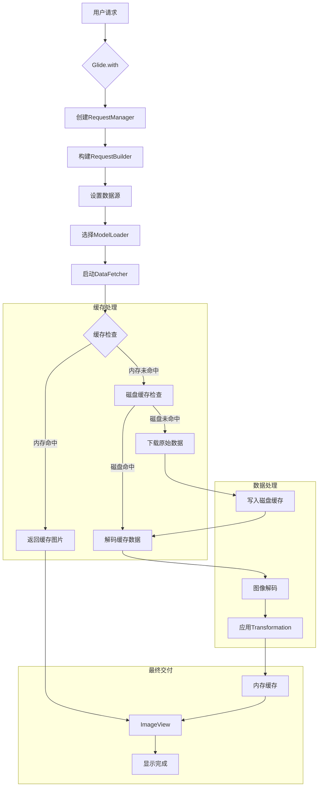
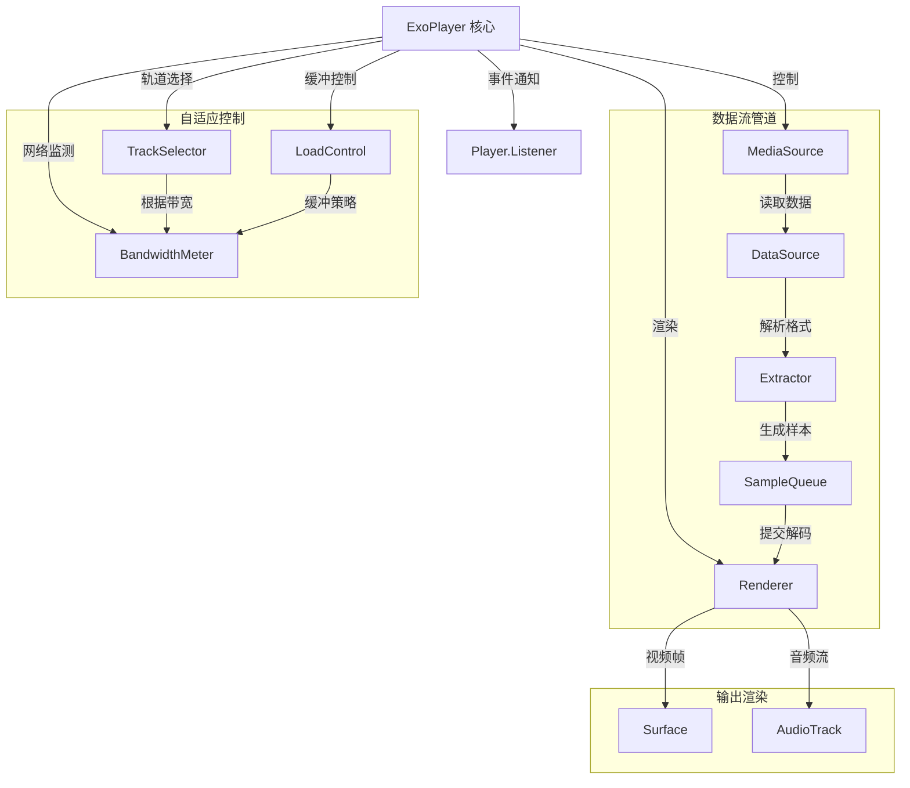

# 极尽详细地为您讲解 Android 组件库与常用组件库原理


命令：
1.极尽详细地讲解该面试题涉及的所有知识技术。
2.在每部分相关知识技术讲解下，必须给出相关知识技术的具体运用示例或详细的已逐行注释的代码示例。
3.所有代码示例下都必须带有详细文字讲解说明，以便理解学习。
4.教会我回答面试官的详细具体话术。


好的，没问题。根据您提供的图片内容，我们将极尽详细地为您讲解 Android 组件库的相关知识，包括其依赖、定制、发布、常用组件库（图片加载、事件传递、滑动刷新）的应用和原理，以及如何运用这些组件库实现复杂功能。

---

**Android 组件库详解与常用组件库原理**

**引言：什么是组件库？为什么使用组件库？**

*   **什么是组件库？**
    组件库（Component Library），在 Android 开发中通常指的是包含可重用代码、资源或 UI 元素的模块。这些模块可以是一个单独的 Android Library Module，也可以是第三方开发者或组织（如 Google）提供的 SDK 或库。组件库封装了特定的功能或 UI 样式，供其他应用或模块引用和使用。
*   **为什么使用组件库？**
    1.  **代码复用：** 避免在多个项目或模块中重复编写相同的功能代码或 UI 样式。
    2.  **提高效率：** 使用成熟、经过测试的组件库可以快速实现复杂功能，节省开发时间。
    3.  **标准化：** 组件库可以提供统一的 UI 风格或功能实现方式，提高应用的一致性。
    4.  **专业性：** 许多第三方组件库由专业团队维护，通常性能更好、Bug 更少、功能更强大。
    5.  **模块化：** 将应用拆分成多个模块（包括组件库），有助于降低代码耦合度，提高项目的可维护性。

---

**1. 组件库的依赖、定制和发布**

*   **目的：** 了解如何在项目中使用组件库（添加依赖）、如何对组件库进行一定程度的定制以及如何创建和发布自己的组件库。
*   **相关知识技术：** Gradle 构建系统、依赖管理 (`implementation`, `api`, `debugImplementation`, `releaseImplementation`)、Maven 仓库、JitPack、Android Library Module、自定义 View、属性 (`attrs.xml`)、Gradle 发布插件。
*   **详细讲解：**

    **依赖 (Dependency):**
    在 Android 项目中，我们主要通过 Gradle 构建系统来管理组件库的依赖。在模块级（通常是 `app` 模块）的 `build.gradle` 文件中，使用 `dependencies` 块来声明项目所需的库。
    *   `implementation`: 最常用的依赖方式。声明的库只会被当前模块及其测试代码使用，不会暴露给依赖当前模块的其他模块。这有助于加快构建速度和减少编译路径。
    *   `api`: 声明的库不仅会被当前模块使用，还会暴露给依赖当前模块的其他模块。如果您的模块是一个库模块，并且希望其使用者能够直接访问您依赖的某个库，可以使用 `api`。
    *   `debugImplementation`, `releaseImplementation`: 只在 debug 或 release 构建类型下才包含的依赖。例如，调试工具库可以只在 debug 版本中引入。

    **定制 (Customization):**
    对组件库的定制通常取决于库的设计。
    *   **通过属性和 API：** 大多数组件库提供了丰富的属性（在 XML 中设置）和 API（在代码中调用），允许您配置其外观和行为。这是最常见的定制方式。
    *   **通过样式和主题：** 一些 UI 组件库支持通过 Android 的样式和主题系统进行定制。
    *   **通过继承和重写：** 如果组件库的类或方法被声明为 `open` 或非 `final`，您可以继承它们并重写方法来实现更深度的定制。
    *   **通过修改源码 (不推荐):** 如果您有组件库的源码，理论上可以修改，但这会使后续升级变得困难。

    **发布 (Publishing):**
    如果您创建了自己的 Android Library Module，并希望其他项目或开发者能够方便地使用它，可以将其发布到 Maven 仓库。
    *   **Android Library Module：** 在 Android Studio 中创建一个新的 Module 时，选择 "Android Library"。它会生成一个独立的模块，可以包含代码和资源。
    *   **Maven 仓库：** 组件库通常发布到 Maven 仓库，如 Maven Central、JCenter (已关闭，推荐迁移)、Google's Maven Repository 或私有仓库。
    *   **发布工具：** 使用 Gradle 的发布插件（如 `maven-publish`）配置发布信息，然后执行 Gradle 任务将库上传到仓库。
    *   **JitPack：** 一种更简单的发布方式，直接将 GitHub 仓库作为 Maven 仓库使用，无需手动上传。

*   **具体运用示例或详细的已逐行注释的代码示例：**

    **添加依赖 (在 app/build.gradle 中):**
    ```gradle
    // app/build.gradle

    dependencies {
        // 添加一个常用的图片加载库 Glide 的依赖
        implementation 'com.github.bumptech.glide:glide:4.16.0'
        // Glide 的注解处理器，用于生成一些辅助代码 (可选，但推荐)
        annotationProcessor 'com.github.bumptech.glide:compiler:4.16.0'

        // 添加一个常用的事件总线库 EventBus 的依赖
        implementation 'org.greenrobot:eventbus:3.3.1'

        // 添加一个常用的滑动刷新布局库 (SwipeRefreshLayout 是 AndroidX 库的一部分)
        implementation 'androidx.swiperefreshlayout:swiperefreshlayout:1.1.0'

        // ... 其他依赖
    }
    ```

    **自定义 View 属性 (res/values/attrs.xml):**
    ```xml
    <?xml version="1.0" encoding="utf-8"?>
    <resources>
        <!-- 声明一个自定义 View 的属性集合 -->
        <declare-styleable name="MyCustomView">
            <!-- 声明一个字符串属性 -->
            <attr name="customText" format="string"/>
            <!-- 声明一个颜色属性 -->
            <attr name="customColor" format="color"/>
            <!-- 声明一个尺寸属性 -->
            <attr name="customSize" format="dimension"/>
            <!-- 声明一个布尔属性 -->
            <attr name="customBoolean" format="boolean"/>
            <!-- 声明一个枚举属性 -->
            <attr name="customEnum">
                <enum name="option1" value="0"/>
                <enum name="option2" value="1"/>
            </attr>
        </declare-styleable>
    </resources>
    ```

    **自定义 View 类中读取属性:**
    ```kotlin
    package com.yourcompany.myapp.ui.custom

    import android.content.Context
    import android.util.AttributeSet
    import android.view.View
    import android.widget.TextView // 假设自定义 View 包含一个 TextView
    import com.yourcompany.myapp.R // 导入 R 类，用于引用属性

    class MyCustomView @JvmOverloads constructor(
        context: Context,
        attrs: AttributeSet? = null,
        defStyleAttr: Int = 0
    ) : TextView(context, attrs, defStyleAttr) { // 继承自 TextView

        init {
            // 获取属性集合
            val typedArray = context.obtainStyledAttributes(attrs, R.styleable.MyCustomView, defStyleAttr, 0)

            // 读取属性值
            val customText = typedArray.getString(R.styleable.MyCustomView_customText)
            val customColor = typedArray.getColor(R.styleable.MyCustomView_customColor, 0) // 提供默认值
            val customSize = typedArray.getDimension(R.styleable.MyCustomView_customSize, 0f)
            val customBoolean = typedArray.getBoolean(R.styleable.MyCustomView_customBoolean, false)
            val customEnum = typedArray.getInt(R.styleable.MyCustomView_customEnum, 0)

            // 使用读取到的属性值
            text = customText ?: "Default Text" // 设置 TextView 的文本
            setTextColor(customColor) // 设置文本颜色
            textSize = customSize // 设置文本大小 (注意单位转换)
            // ... 根据其他属性设置 View 的行为或外观

            // 回收 TypedArray，避免内存泄漏
            typedArray.recycle()
        }
    }
    ```

    **在布局文件中使用自定义 View 并设置属性:**
    ```xml
    <?xml version="1.0" encoding="utf-8"?>
    <LinearLayout xmlns:android="http://schemas.android.com/apk/res/android"
        xmlns:app="http://schemas.android.com/apk/res-auto" // 导入自定义属性的命名空间
        xmlns:tools="http://schemas.android.com/tools"
        android:layout_width="match_parent"
        android:layout_height="match_parent"
        android:orientation="vertical"
        android:gravity="center"
        tools:context=".MainActivity">

        <!-- 使用自定义 View -->
        <com.yourcompany.myapp.ui.custom.MyCustomView // 使用完整的类名
            android:layout_width="wrap_content"
            android:layout_height="wrap_content"
            app:customText="Hello Custom!" // 设置自定义属性
            app:customColor="#0000FF"
            app:customSize="24sp"
            app:customBoolean="true"
            app:customEnum="option2"/>

    </LinearLayout>
    ```

*   **详细文字讲解说明：**
    *   添加依赖主要是在 `build.gradle` 文件的 `dependencies` 块中声明库的坐标（通常是 `group:name:version` 格式）。Gradle 会自动从配置的仓库（如 Google Maven, Maven Central）下载库文件。
    *   定制组件库最常见的方式是通过其提供的 XML 属性和代码 API。对于自定义 View，可以在 `res/values/attrs.xml` 中声明自定义属性，然后在 View 类的构造函数中通过 `obtainStyledAttributes` 方法读取这些属性值，并根据属性值设置 View 的外观和行为。
    *   发布组件库需要将 Android Library Module 打包成 AAR (Android Archive) 文件，并上传到 Maven 仓库。其他项目通过添加仓库地址和库坐标来引用。JitPack 简化了这个过程，直接使用 GitHub 仓库作为源。

*   **如何回答面试官：**
    “在 Android 项目中，我们主要通过 Gradle 构建系统来管理组件库的依赖，在模块级的 `build.gradle` 文件中使用 `implementation` 等关键字声明库的坐标。对于组件库的定制，通常是通过其提供的 XML 属性和代码 API 来配置外观和行为。如果需要更深度的定制，可以考虑继承库中的类并重写方法。如果我创建了自己的可复用模块，可以将其打包成 Android Library Module 并发布到 Maven 仓库（如通过 JitPack 或配置 Gradle 发布插件）供其他项目使用。”

**2. 图片组件库的应用和原理**

*   **目的：** 了解图片加载库的作用、常用库以及它们如何高效地加载和显示图片。
*   **相关知识技术：** 图片加载、缓存（内存缓存、磁盘缓存）、异步加载、图片压缩、图片转换（裁剪、圆角）、生命周期管理、常用库（Glide, Coil, Picasso）。
*   **详细讲解：**
    在 Android 应用中加载和显示图片是一个常见的需求，但直接使用原生的 `BitmapFactory` 和 `ImageView` 可能会导致内存溢出、ANR 或图片显示问题。图片加载库解决了这些问题，提供了高效、便捷的图片加载方案。

    **作用：**
    *   **异步加载：** 在后台线程加载图片，避免阻塞主线程。
    *   **缓存管理：** 提供内存缓存和磁盘缓存，避免重复下载和解码图片，提高加载速度和节省流量。
    *   **内存管理：** 自动管理 Bitmap 的内存，减少内存溢出风险。
    *   **图片转换：** 支持对图片进行裁剪、缩放、圆角、模糊等处理。
    *   **生命周期管理：** 与 Activity/Fragment 生命周期绑定，自动取消加载请求，避免资源浪费和崩溃。
    *   **占位图和错误图：** 支持设置加载中和加载失败时显示的图片。

    **常用库：**
    *   **Glide:** Google 推荐的图片加载库，功能强大，性能优越，支持 GIF、视频帧加载，与生命周期集成良好。
    *   **Coil:** 基于 Kotlin 协程的现代图片加载库，轻量级，易于使用，性能良好。
    *   **Picasso:** Square 公司开发的图片加载库，使用简单，功能稳定。

    **原理 (以 Glide 为例):**
    1.  **加载请求：** 当您调用 `Glide.with(context).load(url).into(imageView)` 时，Glide 会创建一个加载请求。
    2.  **缓存查找：** 首先在内存缓存中查找图片。如果找到且未过期，直接显示。
    3.  **磁盘缓存查找：** 如果内存缓存未命中，在磁盘缓存中查找。如果找到，从磁盘读取并解码，然后放入内存缓存并显示。
    4.  **网络加载：** 如果缓存都未命中，从指定的 URL 下载图片。
    5.  **解码和转换：** 下载完成后，在后台线程解码图片，并根据需要进行缩放、裁剪等转换。
    6.  **内存缓存：** 将处理后的 Bitmap 放入内存缓存。
    7.  **显示图片：** 在主线程将 Bitmap 显示到指定的 ImageView 上。
    8.  **生命周期管理：** Glide 会根据传入的 Context (通常是 Activity 或 Fragment) 自动管理请求的生命周期，例如在 Activity 停止时暂停加载，在 Activity 销毁时取消请求。

*   **具体运用示例或详细的已逐行注释的代码示例：**

    **使用 Glide 加载图片 (需要添加 Glide 依赖和网络权限):**
    ```kotlin
    package com.yourcompany.myapp

    import androidx.appcompat.app.AppCompatActivity
    import android.os.Bundle
    import android.widget.ImageView // 导入 ImageView
    import com.bumptech.glide.Glide // 导入 Glide
    import com.bumptech.glide.request.RequestOptions // 导入 RequestOptions (用于图片转换等)

    class MainActivity : AppCompatActivity() {
        override fun onCreate(savedInstanceState: Bundle?) {
            super.onCreate(savedInstanceState)
            setContentView(R.layout.activity_main_image) // 假设布局中有 myImageView

            val myImageView: ImageView = findViewById(R.id.myImageView)
            val imageUrl = "https://example.com/path/to/your/image.jpg" // 替换为实际图片 URL

            // 使用 Glide 加载网络图片
            Glide.with(this) // 传入 Context (通常是 Activity 或 Fragment)
                .load(imageUrl) // 指定图片来源 (URL, 文件路径, 资源 ID 等)
                .placeholder(R.drawable.placeholder_image) // 设置加载中的占位图
                .error(R.drawable.error_image) // 设置加载失败时显示的图片
                // 应用图片转换 (例如，圆形裁剪)
                // .apply(RequestOptions.circleCropTransform())
                .into(myImageView) // 将图片加载到指定的 ImageView 中
        }
    }
    ```

    **布局文件 (res/layout/activity_main_image.xml):**
    ```xml
    <?xml version="1.0" encoding="utf-8"?>
    <LinearLayout xmlns:android="http://schemas.android.com/apk/res/android"
        xmlns:tools="http://schemas.android.com/tools"
        android:layout_width="match_parent"
        android:layout_height="match_parent"
        android:orientation="vertical"
        android:gravity="center"
        tools:context=".MainActivity">

        <ImageView
            android:id="@+id/myImageView"
            android:layout_width="200dp"
            android:layout_height="150dp"
            android:scaleType="centerCrop"
            android:background="#CCCCCC"/> // 设置一个背景，方便查看 ImageView 区域

    </LinearLayout>
    ```

    **AndroidManifest.xml (需要网络权限):**
    ```xml
    <manifest xmlns:android="http://schemas.android.com/apk/res/android"
        ...>

        <uses-permission android:name="android.permission.INTERNET"/> // 访问网络需要此权限

        <application
            ...>
            <!-- ... Activity 声明 -->
        </application>
    </manifest>
    ```

*   **详细文字讲解说明：**
    *   使用 Glide 加载图片非常简单，通过 `Glide.with(context).load(source).into(target)` 链式调用即可。
    *   `with(context)` 传入 Context，用于获取资源和进行生命周期绑定。
    *   `load(source)` 指定图片来源，可以是 URL、文件路径、资源 ID 等。
    *   `placeholder()` 和 `error()` 设置加载中和加载失败时的图片。
    *   `apply(RequestOptions...)` 可以应用各种图片转换和配置。
    *   `into(target)` 指定图片加载的目标 ImageView。
    *   图片加载库的原理核心在于异步加载、多级缓存（内存和磁盘）以及自动的内存和生命周期管理，这极大地提高了图片加载的效率和稳定性。

*   **如何回答面试官：**
    “在 Android 中加载图片，我通常会使用图片加载库，比如 Glide 或 Coil。它们解决了原生加载可能导致的内存溢出、ANR 等问题。图片加载库的核心原理包括异步加载（在后台线程进行）、多级缓存（内存缓存和磁盘缓存，避免重复下载和解码）、自动内存管理和生命周期管理（与 Activity/Fragment 生命周期绑定，自动取消请求）。使用这些库可以方便地加载网络图片、本地图片或资源图片，并支持图片转换、设置占位图等功能，极大地提高了图片加载的效率和稳定性。”

**3. 事件传递组件库的应用和原理**

*   **目的：** 了解事件总线库的作用、常用库以及它们如何实现组件之间的解耦通信。
*   **相关知识技术：** 事件总线 (Event Bus)、发布-订阅模式 (Publish-Subscribe Pattern)、线程模式 (Thread Mode)、粘性事件 (Sticky Event)、常用库（EventBus, Guava EventBus, RxJava/Kotlin Flow）。
*   **详细讲解：**
    在 Android 开发中，组件之间（如 Activity、Fragment、Service）的通信是一个常见需求。传统的通信方式（如接口回调、Handler、BroadcastReceiver）在组件数量增多或关系复杂时可能导致代码耦合度高、难以维护。事件总线库提供了一种解耦的通信方式，基于发布-订阅模式。

    **作用：**
    *   **解耦：** 发送事件的组件和接收事件的组件之间无需直接引用，只需通过事件总线进行通信。
    *   **简化通信：** 简化了组件之间的通信流程，特别是多对多通信场景。

    **原理 (以 EventBus 为例):**
    1.  **订阅者 (Subscriber):** 接收事件的组件。需要定义一个或多个方法（通常使用 `@Subscribe` 注解标记），这些方法接收特定类型的事件对象作为参数。
    2.  **发布者 (Publisher):** 发送事件的组件。通过 EventBus 实例的 `post(event)` 方法发送事件对象。
    3.  **事件总线 (EventBus):** 负责管理订阅者和事件类型之间的映射关系。当发布者发送一个事件时，EventBus 会查找所有订阅了该事件类型的订阅者，并调用其相应的订阅方法。
    4.  **注册和解注册：** 订阅者需要在 EventBus 中注册 (`EventBus.getDefault().register(this)`)，以便 EventBus 知道它的存在。在不再需要接收事件时，需要解注册 (`EventBus.getDefault().unregister(this)`)，避免内存泄漏。通常在组件的生命周期方法中进行注册和解注册（如 Activity 的 `onResume`/`onPause` 或 `onCreate`/`onDestroy`）。
    5.  **线程模式 (Thread Mode):** EventBus 支持不同的线程模式，控制订阅方法在哪个线程执行（如 `POSTING` 在发布线程执行，`MAIN` 在主线程执行，`ASYNC` 在后台线程执行）。
    6.  **粘性事件 (Sticky Event):** 发送后会保留在内存中，后续注册的订阅者也能接收到最近发送的粘性事件。

    **常用库：**
    *   **EventBus:** 功能强大，使用广泛，支持多种线程模式和粘性事件。
    *   **Guava EventBus:** Google Guava 库中的事件总线，功能相对简单。
    *   **RxJava/Kotlin Flow:** 虽然不是专门的事件总线库，但其响应式编程范式非常适合处理事件流，可以实现更复杂的事件处理逻辑。

    **避坑指南：**
    *   **内存泄漏：** 务必在组件的生命周期结束时解注册订阅者，否则可能导致订阅者对象（如 Activity）无法被垃圾回收。
    *   **线程问题：** 注意选择合适的线程模式，避免在主线程执行耗时操作。
    *   **事件滥用：** 不要将所有通信都通过事件总线进行，过度使用可能导致事件难以追踪，增加调试难度。对于简单的父子组件通信，接口回调可能更合适。
    *   **粘性事件清理：** 如果使用了粘性事件，在处理后或不再需要时，考虑移除粘性事件，避免后续不相关的订阅者接收到旧事件。

*   **具体运用示例或详细的已逐行注释的代码示例 (以 EventBus 为例):**

    **定义一个事件类 (例如，MessageEvent.kt):**
    ```kotlin
    package com.yourcompany.myapp.event

    // 定义一个简单的数据类作为事件对象
    data class MessageEvent(val message: String)
    ```

    **订阅者 (例如，在 MainActivity 中):**
    ```kotlin
    package com.yourcompany.myapp

    import androidx.appcompat.app.AppCompatActivity
    import android.os.Bundle
    import android.util.Log // 导入 Log
    import android.widget.TextView // 导入 TextView
    import org.greenrobot.eventbus.EventBus // 导入 EventBus
    import org.greenrobot.eventbus.Subscribe // 导入 Subscribe 注解
    import org.greenrobot.eventbus.ThreadMode // 导入 ThreadMode
    import com.yourcompany.myapp.event.MessageEvent // 导入事件类

    private const val TAG = "EventBusExample"

    class MainActivity : AppCompatActivity() {

        private lateinit var eventMessageTextView: TextView

        override fun onCreate(savedInstanceState: Bundle?) {
            super.onCreate(savedInstanceState)
            setContentView(R.layout.activity_main_eventbus) // 假设布局中有 eventMessageTextView

            eventMessageTextView = findViewById(R.id.eventMessageTextView)
        }

        // 在 onStart 或 onResume 中注册 EventBus
        override fun onStart() {
            super.onStart()
            // 注册当前 Activity 作为订阅者
            EventBus.getDefault().register(this)
            Log.d(TAG, "EventBus registered")
        }

        // 在 onStop 或 onPause 中解注册 EventBus
        override fun onStop() {
            super.onStop()
            // 解注册当前 Activity
            EventBus.getDefault().unregister(this)
            Log.d(TAG, "EventBus unregistered")
        }

        // 定义一个订阅方法，接收 MessageEvent 类型的事件
        // @Subscribe 注解标记这是一个订阅方法
        // threadMode = ThreadMode.MAIN 表示该方法将在主线程执行
        @Subscribe(threadMode = ThreadMode.MAIN)
        fun onMessageEvent(event: MessageEvent) {
            // 在主线程处理接收到的事件
            Log.d(TAG, "Received event: ${event.message}")
            eventMessageTextView.text = "Received: ${event.message}"
            // Toast.makeText(this, "Event Received: ${event.message}", Toast.LENGTH_SHORT).show()
        }

        // 可以定义其他订阅方法接收不同类型的事件
        // @Subscribe(threadMode = ThreadMode.BACKGROUND)
        // fun onAnotherEvent(event: AnotherEvent) {
        //     // 在后台线程处理事件
        // }
    }
    ```

    **发布者 (例如，在 SecondActivity 中):**
    ```kotlin
    package com.yourcompany.myapp

    import androidx.appcompat.app.AppCompatActivity
    import android.os.Bundle
    import android.widget.Button // 导入 Button
    import org.greenrobot.eventbus.EventBus // 导入 EventBus
    import com.yourcompany.myapp.event.MessageEvent // 导入事件类

    class SecondActivity : AppCompatActivity() {
        override fun onCreate(savedInstanceState: Bundle?) {
            super.onCreate(savedInstanceState)
            setContentView(R.layout.activity_second_eventbus) // 假设布局中有 postEventButton

            val postEventButton: Button = findViewById(R.id.postEventButton)

            postEventButton.setOnClickListener {
                // 创建一个事件对象
                val event = MessageEvent("Hello from SecondActivity!")
                // 发布事件
                EventBus.getDefault().post(event)
                // Toast.makeText(this, "Event Posted!", Toast.LENGTH_SHORT).show()
            }
        }
    }
    ```

    **布局文件 (res/layout/activity_main_eventbus.xml):**
    ```xml
    <?xml version="1.0" encoding="utf-8"?>
    <LinearLayout xmlns:android="http://schemas.android.com/apk/res/android"
        xmlns:tools="http://schemas.android.com/tools"
        android:layout_width="match_parent"
        android:layout_height="match_parent"
        android:orientation="vertical"
        android:gravity="center"
        tools:context=".MainActivity">

        <TextView
            android:id="@+id/eventMessageTextView"
            android:layout_width="wrap_content"
            android:layout_height="wrap_content"
            android:text="Waiting for event..."
            android:textSize="20sp"/>

        <Button
            android:id="@+id/goToSecondActivityButton"
            android:layout_width="wrap_content"
            android:layout_height="wrap_content"
            android:text="Go to Second Activity"
            android:layout_marginTop="16dp"/>

    </LinearLayout>
    ```

    **布局文件 (res/layout/activity_second_eventbus.xml):**
    ```xml
    <?xml version="1.0" encoding="utf-8"?>
    <LinearLayout xmlns:android="http://schemas.android.com/apk/res/android"
        xmlns:tools="http://schemas.android.com/tools"
        android:layout_width="match_parent"
        android:layout_height="match_parent"
        android:orientation="vertical"
        android:gravity="center"
        tools:context=".SecondActivity">

        <Button
            android:id="@+id/postEventButton"
            android:layout_width="wrap_content"
            android:layout_height="wrap_content"
            android:text="Post Event to MainActivity"/>

    </LinearLayout>
    ```

    **AndroidManifest.xml (声明 Activity):**
    ```xml
    <activity android:name=".MainActivity"/>
    <activity android:name=".SecondActivity"/>
    ```

*   **详细文字讲解说明：**
    *   首先定义一个简单的事件类 `MessageEvent`。
    *   在 `MainActivity` 中，通过 `@Subscribe` 注解标记 `onMessageEvent` 方法，表示它是一个订阅方法，接收 `MessageEvent` 类型的事件。`threadMode = ThreadMode.MAIN` 指定该方法在主线程执行，这样就可以安全地更新 UI。
    *   在 `MainActivity` 的 `onStart` 中调用 `EventBus.getDefault().register(this)` 注册订阅者，在 `onStop` 中调用 `EventBus.getDefault().unregister(this)` 解注册。务必确保注册和解注册成对出现。
    *   在 `SecondActivity` 中，当点击按钮时，创建一个 `MessageEvent` 对象，并通过 `EventBus.getDefault().post(event)` 发布事件。
    *   当 `SecondActivity` 发布事件时，如果 `MainActivity` 处于已注册状态，其 `onMessageEvent` 方法就会被调用，从而接收到事件并更新 TextView。
    *   事件总线库通过这种发布-订阅模式，使得发送事件的组件无需知道哪些组件会接收事件，接收事件的组件也无需知道事件来自哪里，实现了组件间的解耦。

*   **如何回答面试官：**
    “事件总线库用于实现 Android 组件之间的解耦通信，它基于发布-订阅模式。常用的库有 EventBus。其原理是：发送事件的组件通过事件总线发布事件对象，接收事件的组件在事件总线中注册并订阅特定类型的事件。当有事件发布时，事件总线会查找所有订阅了该事件类型的订阅者，并调用其相应的订阅方法。使用事件总线可以降低组件间的耦合度，简化通信流程。需要注意的是，务必在组件生命周期结束时解注册订阅者，避免内存泄漏，并选择合适的线程模式处理事件。”

**4. 滑动刷新框架的应用和原理**

*   **目的：** 了解滑动刷新布局的作用、常用实现方式以及其工作原理。
*   **相关知识技术：** 下拉刷新、上拉加载、`SwipeRefreshLayout`、`OnRefreshListener`、`setRefreshing()`、自定义刷新头/尾、RecyclerView 滚动监听。
*   **详细讲解：**
    滑动刷新是移动应用中常见的交互模式，通常包括下拉刷新（刷新当前页面数据）和上拉加载（加载更多数据）。

    **下拉刷新：**
    *   **`SwipeRefreshLayout`:** 这是 Google 官方提供的下拉刷新布局，它是 AndroidX 库的一部分。它可以包裹一个可滚动的 View（如 `RecyclerView`, `ListView`, `ScrollView`），提供标准的下拉刷新手势和动画。
    *   **应用：** 将 `SwipeRefreshLayout` 作为布局文件的根或容器，包裹需要下拉刷新的可滚动 View。设置 `OnRefreshListener` 监听刷新事件，在监听器中执行数据刷新操作，并在刷新完成后调用 `setRefreshing(false)` 隐藏刷新指示器。

    **上拉加载：**
    *   Android 没有官方的上拉加载布局。通常通过监听可滚动 View（如 `RecyclerView`）的滚动事件来实现。当用户滚动到底部时，触发加载更多数据的操作，并在列表底部显示加载指示器。

    **原理 (以 `SwipeRefreshLayout` 为例):**
    1.  **手势监听：** `SwipeRefreshLayout` 拦截其子 View 的触摸事件。当用户在顶部向下滑动时，如果子 View 已经滚动到顶部，`SwipeRefreshLayout` 会开始处理手势。
    2.  **距离计算：** 根据用户下拉的距离，计算刷新指示器（一个圆形的进度条）的位置和显示进度。
    3.  **触发刷新：** 当用户下拉距离超过一定阈值并释放手指时，触发刷新事件。
    4.  **回调监听器：** 调用通过 `setOnRefreshListener()` 设置的监听器的 `onRefresh()` 方法。
    5.  **显示指示器：** 调用 `setRefreshing(true)` 显示刷新指示器。
    6.  **执行刷新任务：** 在 `onRefresh()` 方法中执行异步数据刷新任务（如网络请求）。
    7.  **隐藏指示器：** 数据刷新完成后，调用 `setRefreshing(false)` 隐藏刷新指示器。

    **避坑指南：**
    *   **ANR:** 在刷新监听器中执行耗时操作会导致 ANR。数据刷新操作必须在后台线程或协程中执行。
    *   **忘记调用 `setRefreshing(false)`:** 如果在数据刷新完成后忘记调用 `setRefreshing(false)`，刷新指示器会一直显示，影响用户体验。确保在成功或失败的回调中都调用 `setRefreshing(false)`。
    *   **与嵌套滚动的冲突：** 如果 `SwipeRefreshLayout` 内部有其他可滚动的 View，可能导致手势冲突。需要正确处理嵌套滚动事件。
    *   **上拉加载的实现：** 手动实现上拉加载需要监听 `RecyclerView` 的滚动状态，判断是否滚动到底部，并处理加载状态（避免重复加载）。

*   **具体运用示例或详细的已逐行注释的代码示例 (下拉刷新):**

    **布局文件 (res/layout/activity_main_swipe_refresh.xml):**
    ```xml
    <?xml version="1.0" encoding="utf-8"?>
    <!-- 根布局容器：SwipeRefreshLayout -->
    <androidx.swiperefreshlayout.widget.SwipeRefreshLayout
        xmlns:android="http://schemas.android.com/apk/res/android"
        xmlns:tools="http://schemas.android.com/tools"
        android:id="@+id/swipeRefreshLayout"
        android:layout_width="match_parent"
        android:layout_height="match_parent"
        tools:context=".MainActivity">

        <!-- 包裹需要下拉刷新的可滚动 View (例如，RecyclerView) -->
        <androidx.recyclerview.widget.RecyclerView
            android:id="@+id/recyclerView"
            android:layout_width="match_parent"
            android:layout_height="match_parent"/>

    </androidx.swiperefreshlayout.widget.SwipeRefreshLayout>
    ```

    **Kotlin 代码示例 (设置下拉刷新监听器):**
    ```kotlin
    package com.yourcompany.myapp

    import androidx.appcompat.app.AppCompatActivity
    import android.os.Bundle
    import android.util.Log // 导入 Log
    import androidx.recyclerview.widget.LinearLayoutManager // 导入 LinearLayoutManager
    import androidx.recyclerview.widget.RecyclerView // 导入 RecyclerView
    import androidx.swiperefreshlayout.widget.SwipeRefreshLayout // 导入 SwipeRefreshLayout
    import kotlinx.coroutines.* // 导入协程库

    private const val TAG = "SwipeRefreshExample"

    class MainActivity : AppCompatActivity() {

        private lateinit var swipeRefreshLayout: SwipeRefreshLayout
        private lateinit var recyclerView: RecyclerView
        private lateinit var adapter: MyAdapter // 假设 MyAdapter 是您列表的 Adapter

        // 使用 CoroutineScope 管理协程生命周期
        private val activityScope = CoroutineScope(Dispatchers.Main + SupervisorJob())

        override fun onCreate(savedInstanceState: Bundle?) {
            super.onCreate(savedInstanceState)
            setContentView(R.layout.activity_main_swipe_refresh) // 加载布局

            swipeRefreshLayout = findViewById(R.id.swipeRefreshLayout)
            recyclerView = findViewById(R.id.recyclerView)

            // 初始化 RecyclerView 和 Adapter (使用示例数据)
            val initialData = mutableListOf<MyItem>()
            for (i in 1..20) {
                initialData.add(MyItem("Initial Item $i", "Description $i"))
            }
            adapter = MyAdapter(initialData) // 假设 MyAdapter 接收 MutableList
            recyclerView.adapter = adapter
            recyclerView.layoutManager = LinearLayoutManager(this)

            // 设置下拉刷新监听器
            swipeRefreshLayout.setOnRefreshListener {
                Log.d(TAG, "SwipeRefreshLayout triggered refresh")
                // 在这里执行数据刷新操作 (必须是异步的)
                refreshData()
            }

            // 可以设置刷新指示器的颜色
            // swipeRefreshLayout.setColorSchemeResources(R.color.colorPrimary)
        }

        // 模拟数据刷新操作 (异步)
        private fun refreshData() {
            activityScope.launch {
                Log.d(TAG, "Starting data refresh...")
                // 模拟网络请求或数据加载
                delay(2000) // 模拟耗时 2 秒

                // 生成新的数据
                val newData = mutableListOf<MyItem>()
                for (i in 1..20) {
                    newData.add(MyItem("Refreshed Item $i", "New Description $i"))
                }

                // 更新 Adapter 的数据 (假设 Adapter 有更新数据的方法)
                adapter.updateData(newData) // 假设 MyAdapter 有 updateData 方法

                Log.d(TAG, "Data refresh finished.")
                // 刷新完成后，隐藏刷新指示器 (必须在主线程执行)
                swipeRefreshLayout.isRefreshing = false // 或者 swipeRefreshLayout.setRefreshing(false)
            }
        }

        // 在 Activity 销毁时取消协程
        override fun onDestroy() {
            super.onDestroy()
            activityScope.cancel()
        }
    }
    ```

    **MyAdapter 类 (添加 updateData 方法):**
    ```kotlin
    // MyAdapter.kt (在之前的 MyAdapter 基础上添加 updateData 方法)
    class MyAdapter(private val dataList: MutableList<MyItem>) :
        RecyclerView.Adapter<MyAdapter.MyViewHolder>() {

        // ... ViewHolder 内部类, onCreateViewHolder, onBindViewHolder, getItemCount 方法不变

        // 添加一个更新数据的方法
        fun updateData(newData: List<MyItem>) {
            dataList.clear() // 清空旧数据
            dataList.addAll(newData) // 添加新数据
            notifyDataSetChanged() // 通知 Adapter 数据已改变，刷新列表
        }
    }
    ```

*   **详细文字讲解说明：**
    *   在布局文件中，将 `RecyclerView` 包裹在 `SwipeRefreshLayout` 内部。
    *   在 Activity 代码中，找到 `SwipeRefreshLayout` 实例，并通过 `setOnRefreshListener()` 设置一个监听器。
    *   在监听器的 Lambda 表达式中，编写数据刷新的逻辑。**重要：** 数据刷新操作（如网络请求）必须在后台线程执行，示例中使用了协程 (`activityScope.launch`)。
    *   数据刷新完成后，调用 `swipeRefreshLayout.isRefreshing = false` (或 `setRefreshing(false)`) 来隐藏刷新指示器。这个操作必须在主线程执行，因为它是更新 UI。示例中由于 `activityScope` 使用了 `Dispatchers.Main`，所以协程体内的代码默认就在主线程执行。
    *   示例中的 `MyAdapter` 添加了一个 `updateData` 方法来更新列表数据并通知 `RecyclerView` 刷新。
    *   上拉加载通常需要监听 `RecyclerView` 的滚动事件，判断是否滚动到底部，然后触发加载更多数据的逻辑。这比下拉刷新稍微复杂一些，需要手动实现滚动监听和加载状态管理。

*   **如何回答面试官：**
    “滑动刷新是常见的列表交互。下拉刷新通常使用官方提供的 **SwipeRefreshLayout**，它是一个布局容器，可以包裹可滚动的 View。我会在布局文件中将 `RecyclerView` 等可滚动 View 放在 `SwipeRefreshLayout` 内部，然后在代码中通过 `setOnRefreshListener()` 设置一个监听器。在监听器的回调方法中，我会执行异步的数据刷新操作（比如网络请求），并在数据加载完成后调用 `setRefreshing(false)` 隐藏刷新指示器。需要注意的是，刷新操作必须在后台线程执行，避免 ANR。上拉加载通常需要手动监听 `RecyclerView` 的滚动事件，判断是否滚动到底部来触发加载更多数据的逻辑。”

**5. 常用的第三方组件库介绍**

*   **目的：** 了解一些除了图片加载、事件总线、滑动刷新之外的常用第三方组件库及其作用。
*   **相关知识技术：** 网络请求库、JSON 解析库、依赖注入库、异步编程库、UI 库、数据库库等。
*   **详细讲解：**
    Android 生态系统非常活跃，有大量的优秀第三方组件库可以帮助我们更高效地开发应用。
    *   **网络请求：**
        *   **Retrofit:** Square 公司开发的类型安全的 HTTP 客户端，常与 OkHttp 配合使用，通过注解定义网络接口，使用简单，功能强大。
        *   **Volley:** Google 提供的网络请求库，适合小数据量的网络操作。
        *   **OkHttp:** Square 公司开发的 HTTP 客户端，功能强大，性能优越，许多其他网络库（如 Retrofit）底层使用 OkHttp。
    *   **JSON 解析：**
        *   **Gson:** Google 提供的 JSON 解析库，可以将 JSON 字符串与 Java/Kotlin 对象相互转换。
        *   **Moshi:** Square 公司开发的 JSON 解析库，基于 Kotlin，性能优于 Gson。
    *   **依赖注入 (DI):**
        *   **Hilt:** Google 推荐的基于 Dagger 的 Android 依赖注入库，简化了 Dagger 在 Android 中的使用。
        *   **Koin:** 一个轻量级的 Kotlin 依赖注入框架，使用 DSL 定义依赖，入门简单。
        *   **Dagger:** 功能强大但相对复杂的 Java 依赖注入框架。
    *   **异步编程：**
        *   **Kotlin Coroutines:** Kotlin 官方提供的异步编程解决方案，轻量级，易于使用，推荐在 Kotlin 项目中使用。
        *   **RxJava/RxKotlin:** 强大的响应式编程库，用于处理异步数据流和事件序列。
    *   **UI 库：**
        *   **Material Components for Android:** Google 提供的 Material Design 组件库，提供符合 Material Design 规范的 UI 控件和样式。
        *   **Lottie:** Airbnb 开源的动画库，可以在 Android、iOS、Web 上播放 After Effects 导出的动画。
    *   **数据库：**
        *   **Room:** Google 推荐的持久性库，基于 SQLite，提供抽象层，使用方便，编译时检查 SQL 语句。
        *   **Realm:** 移动端数据库，性能优越，使用方便。
    *   **其他：**
        *   **WorkManager:** Google 推荐的用于管理可延迟、异步任务的库，即使应用退出或设备重启也能保证任务执行。
        *   **Navigation Component:** Google 推荐的用于管理应用内导航的库，简化 Fragment 导航。
        *   **ViewModel & LiveData:** Jetpack Architecture Components，用于管理 UI 相关数据和感知生命周期。

*   **具体运用示例或详细的已逐行注释的代码示例：**
    这部分是常用库的介绍，每个库都有自己的详细用法，无法一一提供代码示例。上面已经提供了图片加载、事件总线、滑动刷新的示例。其他库的示例会在各自的详细讲解中提供（如果需要）。

*   **详细文字讲解说明：**
    这些第三方组件库涵盖了 Android 开发的各个方面，使用它们可以极大地提高开发效率和应用质量。例如，使用 Retrofit + Gson/Moshi 可以方便地进行网络请求和数据解析；使用 Hilt/Koin 可以简化依赖管理；使用 Coroutines/RxJava 可以更优雅地处理异步任务；使用 Room 可以方便地进行本地数据存储。

*   **如何回答面试官：**
    “除了官方提供的库和组件，Android 生态系统还有很多优秀的第三方组件库。我常用的包括：
    *   **网络请求：** Retrofit，它是一个类型安全的 HTTP 客户端，常与 OkHttp 配合使用，通过注解定义接口，非常方便。
    *   **JSON 解析：** Gson 或 Moshi，用于将 JSON 数据转换为对象。
    *   **依赖注入：** Hilt 或 Koin，它们能帮助我更好地管理对象依赖，降低耦合度。
    *   **异步编程：** 在 Kotlin 项目中我主要使用协程 (Coroutines)，它轻量且易于使用。
    *   **UI 方面：** Material Components 提供了符合 Material Design 规范的 UI 控件。
    *   **数据库：** Room 是官方推荐的持久性库，使用方便且安全。
    合理使用这些第三方库可以极大地提高我的开发效率和应用质量。”

**6. 运用组件库实现瀑布流的首页功能，支持滑动刷新能力**

*   **目的：** 结合前面讲解的知识，演示如何使用 `RecyclerView`、`StaggeredGridLayoutManager`、图片加载库和 `SwipeRefreshLayout` 实现一个带有下拉刷新功能的瀑布流首页。
*   **相关知识技术：** `RecyclerView`、`StaggeredGridLayoutManager`、`Adapter`、`ViewHolder`、图片加载库（Glide/Coil）、`SwipeRefreshLayout`、数据加载（模拟或网络请求）、异步操作。
*   **详细讲解：**
    瀑布流是一种常见的列表布局，列表项高度不一，像瀑布一样排列。在 Android 中，可以使用 `RecyclerView` 结合 `StaggeredGridLayoutManager` 来实现瀑布流。为了支持滑动刷新，可以将 `RecyclerView` 包裹在 `SwipeRefreshLayout` 内部。

    **实现步骤：**
    1.  **布局文件：** 在 `SwipeRefreshLayout` 中包含一个 `RecyclerView`。
    2.  **列表项布局：** 创建一个列表项的布局文件，其中包含一个 `ImageView` 和其他可能需要的 View（如 `TextView`）。`ImageView` 的高度通常设置为 `wrap_content`，以便根据图片比例自适应高度。
    3.  **数据模型：** 定义一个数据类，包含图片 URL 和其他需要显示的信息。
    4.  **Adapter：** 创建一个继承自 `RecyclerView.Adapter` 的 Adapter 类。
        *   在 `onCreateViewHolder` 中加载列表项布局并创建 `ViewHolder`。
        *   在 `onBindViewHolder` 中获取数据，使用图片加载库加载图片到 `ImageView`，并设置其他 View 的内容。
        *   实现 `getItemCount` 返回数据总数。
    5.  **Activity/Fragment：**
        *   找到 `SwipeRefreshLayout` 和 `RecyclerView`。
        *   创建数据（模拟或从网络获取）。
        *   创建 `StaggeredGridLayoutManager` 并设置给 `RecyclerView`。
        *   创建 Adapter 实例并设置给 `RecyclerView`。
        *   为 `SwipeRefreshLayout` 设置 `OnRefreshListener`，在监听器中执行数据刷新操作。
        *   实现上拉加载（可选）：为 `RecyclerView` 添加滚动监听器，判断是否滚动到底部，触发加载更多。

*   **具体运用示例或详细的已逐行注释的代码示例：**

    **布局文件 (res/layout/activity_main_waterfall.xml):**
    ```xml
    <?xml version="1.0" encoding="utf-8"?>
    <androidx.swiperefreshlayout.widget.SwipeRefreshLayout
        xmlns:android="http://schemas.android.com/apk/res/android"
        xmlns:tools="http://schemas.android.com/tools"
        android:id="@+id/swipeRefreshLayout"
        android:layout_width="match_parent"
        android:layout_height="match_parent"
        tools:context=".MainActivity">

        <androidx.recyclerview.widget.RecyclerView
            android:id="@+id/waterfallRecyclerView"
            android:layout_width="match_parent"
            android:layout_height="match_parent"/>

    </androidx.swiperefreshlayout.widget.SwipeRefreshLayout>
    ```

    **列表项布局文件 (res/layout/list_item_waterfall.xml):**
    ```xml
    <?xml version="1.0" encoding="utf-8"?>
    <LinearLayout xmlns:android="http://schemas.android.com/apk/res/android"
        android:layout_width="match_parent"
        android:layout_height="wrap_content" // 高度 wrap_content，让图片自适应
        android:orientation="vertical"
        android:padding="4dp"> // 添加一些内边距，让列表项之间有间隔

        <!-- 图片，高度 wrap_content，宽度 match_parent -->
        <ImageView
            android:id="@+id/itemImageView"
            android:layout_width="match_parent"
            android:layout_height="wrap_content" // 高度 wrap_content
            android:scaleType="centerCrop" // 缩放类型，保持比例并填充
            android:background="#CCCCCC"/> // 占位背景

        <!-- 文本描述 -->
        <TextView
            android:id="@+id/itemDescription"
            android:layout_width="match_parent"
            android:layout_height="wrap_content"
            android:layout_marginTop="4dp"
            android:textSize="14sp"/>

    </LinearLayout>
    ```

    **数据模型类 (MyWaterfallItem.kt):**
    ```kotlin
    package com.yourcompany.myapp.data

    // 数据模型，包含图片 URL 和描述
    data class MyWaterfallItem(val imageUrl: String, val description: String)
    ```

    **Adapter 类 (MyWaterfallAdapter.kt):**
    ```kotlin
    package com.yourcompany.myapp.adapter

    import android.view.LayoutInflater
    import android.view.View
    import android.view.ViewGroup
    import android.widget.ImageView
    import android.widget.TextView
    import androidx.recyclerview.widget.RecyclerView
    import com.bumptech.glide.Glide // 导入图片加载库
    import com.yourcompany.myapp.R // 导入 R 类
    import com.yourcompany.myapp.data.MyWaterfallItem // 导入数据模型

    // Adapter 类
    class MyWaterfallAdapter(private val dataList: MutableList<MyWaterfallItem>) :
        RecyclerView.Adapter<MyWaterfallAdapter.MyViewHolder>() {

        // ViewHolder 内部类
        class MyViewHolder(itemView: View) : RecyclerView.ViewHolder(itemView) {
            val imageView: ImageView = itemView.findViewById(R.id.itemImageView)
            val descriptionView: TextView = itemView.findViewById(R.id.itemDescription)
        }

        // 创建 ViewHolder
        override fun onCreateViewHolder(parent: ViewGroup, viewType: Int): MyViewHolder {
            val itemView = LayoutInflater.from(parent.context)
                .inflate(R.layout.list_item_waterfall, parent, false)
            return MyViewHolder(itemView)
        }

        // 绑定数据
        override fun onBindViewHolder(holder: MyViewHolder, position: Int) {
            val currentItem = dataList[position]

            // 使用图片加载库加载图片
            Glide.with(holder.itemView.context)
                .load(currentItem.imageUrl)
                .placeholder(R.drawable.placeholder_image) // 设置占位图
                .into(holder.imageView) // 加载到 ImageView

            // 设置文本描述
            holder.descriptionView.text = currentItem.description
        }

        // 返回列表项总数
        override fun getItemCount(): Int {
            return dataList.size
        }

        // 更新数据方法 (用于下拉刷新或上拉加载)
        fun updateData(newData: List<MyWaterfallItem>) {
            dataList.clear()
            dataList.addAll(newData)
            notifyDataSetChanged() // 通知数据改变
        }

        // 添加更多数据方法 (用于上拉加载)
        fun addData(moreData: List<MyWaterfallItem>) {
            val startPosition = dataList.size
            dataList.addAll(moreData)
            notifyItemRangeInserted(startPosition, moreData.size) // 通知插入范围
        }
    }
    ```

    **Activity/Fragment 代码 (MainActivity.kt):**
    ```kotlin
    package com.yourcompany.myapp

    import androidx.appcompat.app.AppCompatActivity
    import android.os.Bundle
    import android.util.Log
    import androidx.recyclerview.widget.RecyclerView // 导入 RecyclerView
    import androidx.recyclerview.widget.StaggeredGridLayoutManager // 导入 StaggeredGridLayoutManager
    import androidx.swiperefreshlayout.widget.SwipeRefreshLayout // 导入 SwipeRefreshLayout
    import com.yourcompany.myapp.adapter.MyWaterfallAdapter // 导入 Adapter
    import com.yourcompany.myapp.data.MyWaterfallItem // 导入数据模型
    import kotlinx.coroutines.* // 导入协程库

    private const val TAG = "WaterfallExample"

    class MainActivity : AppCompatActivity() {

        private lateinit var swipeRefreshLayout: SwipeRefreshLayout
        private lateinit var recyclerView: RecyclerView
        private lateinit var adapter: MyWaterfallAdapter

        // 使用 CoroutineScope 管理协程生命周期
        private val activityScope = CoroutineScope(Dispatchers.Main + SupervisorJob())

        override fun onCreate(savedInstanceState: Bundle?) {
            super.onCreate(savedInstanceState)
            setContentView(R.layout.activity_main_waterfall) // 加载布局

            swipeRefreshLayout = findViewById(R.id.swipeRefreshLayout)
            recyclerView = findViewById(R.id.waterfallRecyclerView)

            // 初始化 RecyclerView 和 Adapter
            val initialData = generateDummyData(20) // 生成初始模拟数据
            adapter = MyWaterfallAdapter(initialData.toMutableList())
            recyclerView.adapter = adapter

            // 设置 StaggeredGridLayoutManager 实现瀑布流
            // 第一个参数是列数，第二个参数是方向 (垂直或水平)
            recyclerView.layoutManager = StaggeredGridLayoutManager(2, StaggeredGridLayoutManager.VERTICAL) // 两列垂直瀑布流

            // 设置下拉刷新监听器
            swipeRefreshLayout.setOnRefreshListener {
                Log.d(TAG, "SwipeRefreshLayout triggered refresh")
                refreshData() // 执行数据刷新
            }

            // 实现上拉加载 (简化示例，实际需要更复杂的逻辑判断加载状态)
            // recyclerView.addOnScrollListener(object : RecyclerView.OnScrollListener() {
            //     override fun onScrollStateChanged(recyclerView: RecyclerView, newState: Int) {
            //         super.onScrollStateChanged(recyclerView, newState)
            //         // 判断是否滚动到底部并触发加载更多
            //         if (!recyclerView.canScrollVertically(1) && newState == RecyclerView.SCROLL_STATE_IDLE) {
            //             Log.d(TAG, "Scrolled to bottom, loading more...")
            //             loadMoreData() // 执行加载更多
            //         }
            //     }
            // })
        }

        // 模拟生成数据
        private fun generateDummyData(count: Int): List<MyWaterfallItem> {
            val data = mutableListOf<MyWaterfallItem>()
            val imageUrls = listOf(
                "https://via.placeholder.com/150/FF0000/FFFFFF?text=Image1",
                "https://via.placeholder.com/200/00FF00/000000?text=Image2",
                "https://via.placeholder.com/180/0000FF/FFFFFF?text=Image3",
                "https://via.placeholder.com/220/FFFF00/000000?text=Image4",
                "https://via.placeholder.com/160/FF00FF/FFFFFF?text=Image5"
                // ... 更多不同尺寸的图片 URL
            )
            for (i in 1..count) {
                val randomImageUrl = imageUrls.random() // 随机选择一个图片 URL
                data.add(MyWaterfallItem(randomImageUrl, "Item $i Description"))
            }
            return data
        }

        // 模拟数据刷新操作 (异步)
        private fun refreshData() {
            activityScope.launch {
                Log.d(TAG, "Starting data refresh...")
                delay(2000) // 模拟网络请求

                val newData = generateDummyData(20) // 生成新的模拟数据
                adapter.updateData(newData) // 更新 Adapter 数据

                Log.d(TAG, "Data refresh finished.")
                swipeRefreshLayout.isRefreshing = false // 隐藏刷新指示器
            }
        }

        // 模拟加载更多数据操作 (异步)
        private fun loadMoreData() {
            activityScope.launch {
                Log.d(TAG, "Starting load more...")
                delay(1500) // 模拟网络请求

                val moreData = generateDummyData(10) // 生成更多模拟数据
                adapter.addData(moreData) // 添加到 Adapter 数据中

                Log.d(TAG, "Load more finished.")
                // 如果有上拉加载指示器，在这里隐藏
            }
        }

        // 在 Activity 销毁时取消协程
        override fun onDestroy() {
            super.onDestroy()
            activityScope.cancel()
        }
    }
    ```

*   **详细文字讲解说明：**
    *   布局文件 `activity_main_waterfall.xml` 中，将 `RecyclerView` 包裹在 `SwipeRefreshLayout` 内部。
    *   列表项布局 `list_item_waterfall.xml` 包含一个 `ImageView` 和一个 `TextView`，`ImageView` 的高度设置为 `wrap_content`，以便根据加载的图片比例自适应高度。
    *   `MyWaterfallItem` 是简单的数据模型。
    *   `MyWaterfallAdapter` 继承自 `RecyclerView.Adapter`，并在 `onBindViewHolder` 中使用 Glide 加载图片到 `ImageView`。它还包含 `updateData` 和 `addData` 方法用于更新列表数据。
    *   在 `MainActivity` 中，找到 `SwipeRefreshLayout` 和 `RecyclerView`。
    *   创建 `StaggeredGridLayoutManager(2, StaggeredGridLayoutManager.VERTICAL)` 设置为 `RecyclerView` 的 `layoutManager`，指定两列垂直方向的瀑布流。
    *   创建 Adapter 并设置给 `RecyclerView`。
    *   为 `SwipeRefreshLayout` 设置 `OnRefreshListener`，在回调中调用 `refreshData()` 方法。
    *   `refreshData()` 方法使用协程模拟异步数据加载，加载完成后更新 Adapter 数据并隐藏刷新指示器。
    *   示例中注释掉了上拉加载的滚动监听代码，因为完整实现需要更复杂的逻辑，但展示了基本思路和 `addData` 方法的使用。

*   **如何回答面试官：**
    “要实现一个带有滑动刷新功能的瀑布流首页，我会结合使用 `RecyclerView`、`StaggeredGridLayoutManager`、图片加载库和 `SwipeRefreshLayout`。
    首先，在布局文件中，我会将 `RecyclerView` 放在 `SwipeRefreshLayout` 内部。
    然后，我会为 `RecyclerView` 设置 `StaggeredGridLayoutManager` 作为布局管理器，指定列数和方向来实现瀑布流效果。
    接着，我会创建一个自定义的 `RecyclerView.Adapter`，并在其 `onBindViewHolder` 方法中使用图片加载库（如 Glide）来异步加载图片到列表项的 `ImageView` 中，同时确保 `ImageView` 的高度设置为 `wrap_content`，以便根据图片比例自适应。
    最后，我会为 `SwipeRefreshLayout` 设置 `OnRefreshListener`，在监听器的回调中执行异步的数据刷新操作（比如网络请求），并在数据加载完成后调用 `setRefreshing(false)` 隐藏刷新指示器。如果需要上拉加载更多功能，我会为 `RecyclerView` 添加滚动监听器，判断是否滚动到底部来触发加载更多数据的逻辑。”

---

**总结：**

组件库是 Android 开发中提高效率、实现复用和标准化的重要手段。我们通过 Gradle 管理依赖，通过属性和 API 进行定制，也可以创建和发布自己的库。常用的组件库包括图片加载库（Glide, Coil）、事件总线库（EventBus）、滑动刷新布局（SwipeRefreshLayout）等。理解这些库的应用和原理，并能灵活运用它们结合 `RecyclerView` 等基础组件实现复杂 UI（如瀑布流），是衡量 Android 开发能力的重要方面。

希望这份极尽详细的讲解对您有所帮助！


# 极尽详细地为我讲解 Android 的组件库的依赖、定制和发布

命令：
1.极尽详细地讲解该面试题涉及的所有知识技术。
2.在每部分相关知识技术讲解下，必须给出相关知识技术的具体运用示例或详细的已逐行注释的代码示例。
3.所有代码示例下都必须带有详细文字讲解说明，以便理解学习。
4.教会我回答面试官的详细具体话术。


好的，作为一名高级软件工程师，我将为您极尽详细地讲解 Android 组件库的依赖、定制和发布，并提供详细的代码示例和面试话术。

---

 **第一部分：重点介绍组件库的基本使用和定制发布方式**

 **1. 组件库的简介**

**知识技术讲解：**

Android 组件库（Android Library Module）是一种特殊的模块，它包含可重用的代码和资源，可以被其他 Android 应用程序模块或库模块依赖。与应用程序模块（Application Module）不同，组件库编译后生成的是 `.aar`（Android Archive）文件，而不是 `.apk` 文件。`.aar` 文件包含了编译后的代码（JAR 文件）、资源（res）、Assets、JNI 库以及 AndroidManifest 文件。

**为什么需要组件库？**

*   **代码复用：** 将通用功能（如网络请求、图片加载、UI 组件、工具类等）封装成库，可以在多个项目中重复使用，避免重复造轮子。
*   **模块化：** 将大型项目拆分成多个独立的模块，每个模块负责特定的功能，降低项目复杂度，提高可维护性。
*   **团队协作：** 不同的团队成员可以并行开发不同的组件库，然后集成到主应用中，提高开发效率。
*   **版本管理：** 组件库可以独立进行版本迭代和发布，方便管理和更新。
*   **解耦：** 降低模块间的耦合度，使得修改一个模块不会对其他模块产生过大的影响。

**与 Application Module 的区别：**

| 特性         | Android Library Module (库模块) | Android Application Module (应用模块) |
| :----------- | :------------------------------ | :------------------------------------ |
| 编译产物     | `.aar` 文件                     | `.apk` 文件                           |
| 可运行性     | 不可独立运行                    | 可独立运行                            |
| `build.gradle` | `apply plugin: 'com.android.library'` | `apply plugin: 'com.android.application'` |
| `AndroidManifest.xml` | 无需包含 `<application>` 标签，但可以定义组件 | 必须包含 `<application>` 标签，定义应用入口 |
| 资源 ID      | 资源 ID 不固定，由引用方生成    | 资源 ID 固定                          |

**具体运用示例：**

假设我们有一个电商应用，其中包含用户登录、商品列表、购物车、支付等多个功能模块。我们可以将这些功能拆分成独立的组件库：

*   `login-sdk`：处理用户登录、注册、忘记密码等逻辑。
*   `product-list-ui`：提供商品列表的 UI 组件和数据展示逻辑。
*   `shopping-cart-manager`：管理购物车商品的增删改查。
*   `payment-gateway`：集成第三方支付 SDK。
*   `common-utils`：提供通用的工具类，如日期格式化、字符串处理、网络工具等。

这样，当我们需要在另一个应用（如商家后台应用）中复用登录功能时，只需引入 `login-sdk` 即可，而无需复制粘贴代码。


 **2. 组件库的构建、依赖方式**

**知识技术讲解：**

Android 组件库的构建主要依赖于 Gradle 构建系统。在 Android Studio 中，创建一个新的 Library Module 会自动配置好基本的构建文件。依赖方式则决定了你的应用程序或另一个库如何引用和使用这个组件库。

**2.1 构建 (Building)**

创建一个 Android Library Module 的步骤：

1.  在 Android Studio 中，选择 `File` -> `New` -> `New Module...`。
2.  选择 `Android Library`，点击 `Next`。
3.  填写 `Application/Library name` (模块名称，如 `mylibrary`)、`Module name` (通常与 Library name 相同)、`Package name`。
4.  点击 `Finish`。

创建后，你会发现新模块的 `build.gradle` 文件中，插件声明是 `apply plugin: 'com.android.library'`，而不是 `com.android.application`。

**`build.gradle` (module level) 中的关键配置：**

**Groovy DSL (`mylibrary/build.gradle`) 示例：**

```gradle
// mylibrary/build.gradle
plugins {
    id 'com.android.library' // 声明这是一个Android库模块
    id 'org.jetbrains.kotlin.android' // 如果使用Kotlin
}

android {
    namespace 'com.example.mylibrary' // 命名空间，通常与包名一致
    compileSdk 34 // 编译SDK版本

    defaultConfig {
        minSdk 24 // 最低支持SDK版本
        targetSdk 34 // 目标SDK版本

        testInstrumentationRunner "androidx.test.runner.AndroidJUnitRunner"
        consumerProguardFiles "consumer-rules.pro" // 库的混淆规则，供引用方使用
    }

    buildTypes {
        release {
            minifyEnabled false // 是否开启混淆
            proguardFiles getDefaultProguardFile('proguard-android-optimize.txt'), 'proguard-rules.pro'
        }
    }
    compileOptions {
        sourceCompatibility JavaVersion.VERSION_1_8
        targetCompatibility JavaVersion.VERSION_1_8
    }
    kotlinOptions {
        jvmTarget = '1.8'
    }
}

dependencies {
    // 库内部的依赖
    implementation 'androidx.core:core-ktx:1.13.1'
    implementation 'androidx.appcompat:appcompat:1.6.1'
    implementation 'com.google.android.material:material:1.12.0'
    testImplementation 'junit:junit:4.13.2'
    androidTestImplementation 'androidx.test.ext:junit:1.1.5'
    androidTestImplementation 'androidx.test.espresso:espresso-core:3.5.1'
}
```

**资源（res）的处理：**

库模块中的资源（布局、图片、字符串等）与应用模块类似，但它们的资源 ID 在编译时是动态生成的，以避免与引用方的资源 ID 冲突。

**`AndroidManifest.xml` 的处理：**

库模块的 `AndroidManifest.xml` 文件通常只包含组件（Activity, Service, BroadcastReceiver, ContentProvider）的声明、权限声明等，不包含 `<application>` 标签。在构建时，库的 `AndroidManifest.xml` 会与引用方的 `AndroidManifest.xml` 合并。


**Kotlin DSL (`mylibrary/build.gradle.kts`) 示例：**

```kotlin
// mylibrary/build.gradle.kts
plugins {
    id("com.android.library") // 声明这是一个Android库模块
    id("org.jetbrains.kotlin.android") // 如果使用Kotlin
}

android {
    namespace = "com.example.mylibrary" // 命名空间，通常与包名一致
    compileSdk = 34 // 编译SDK版本

    defaultConfig {
        minSdk = 24 // 最低支持SDK版本
        targetSdk = 34 // 目标SDK版本

        testInstrumentationRunner = "androidx.test.runner.AndroidJUnitRunner"
        // 库的混淆规则，供引用方使用。consumerProguardFiles 是一个可变列表，使用 add 方法添加
        consumerProguardFiles("consumer-rules.pro")
    }

    buildTypes {
        release {
            isMinifyEnabled = false // 是否开启混淆，Kotlin DSL 中布尔属性使用 is 前缀
            // 获取默认的混淆规则文件，并添加自定义的混淆规则文件
            proguardFiles(getDefaultProguardFile("proguard-android-optimize.txt"), "proguard-rules.pro")
        }
    }
    compileOptions {
        sourceCompatibility = JavaVersion.VERSION_1_8 // Java 源代码兼容性版本
        targetCompatibility = JavaVersion.VERSION_1_8 // Java 目标字节码兼容性版本
    }
    kotlinOptions {
        jvmTarget = "1.8" // Kotlin 编译生成的 JVM 字节码目标版本
    }
}

dependencies {
    // 库内部的依赖，使用 implementation() 函数
    implementation("androidx.core:core-ktx:1.13.1")
    implementation("androidx.appcompat:appcompat:1.6.1")
    implementation("com.google.android.material:material:1.12.0")
    testImplementation("junit:junit:4.13.2")
    androidTestImplementation("androidx.test.ext:junit:1.1.5")
    androidTestImplementation("androidx.test.espresso:espresso-core:3.5.1")
}
```

**详细文字讲解说明 (Kotlin DSL 部分)：**

*   **插件声明：** 在 Kotlin DSL 中，插件的 `id` 使用字符串形式，并用 `()` 调用，例如 `id("com.android.library")`。
*   **属性赋值：** Kotlin DSL 使用 `=` 进行属性赋值，例如 `namespace = "com.example.mylibrary"`。布尔类型的属性通常以 `is` 开头，例如 `isMinifyEnabled = false`。
*   **方法调用：** Groovy DSL 中可以直接写的方法调用，在 Kotlin DSL 中通常需要加上 `()`，例如 `consumerProguardFiles("consumer-rules.pro")`。对于接受多个参数的方法，如 `proguardFiles`，可以直接传入多个字符串。
*   **`JavaVersion`：** `sourceCompatibility` 和 `targetCompatibility` 属性直接赋值为 `JavaVersion.VERSION_1_8`。
*   **依赖声明：** 依赖声明与 Groovy DSL 类似，但字符串需要用 `()` 包裹，例如 `implementation("androidx.core:core-ktx:1.13.1")`。

**资源（res）的处理：**

库模块中的资源（布局、图片、字符串等）与应用模块类似，但它们的资源 ID 在编译时是动态生成的，以避免与引用方的资源 ID 冲突。

**`AndroidManifest.xml` 的处理：**

库模块的 `AndroidManifest.xml` 文件通常只包含组件（Activity, Service, BroadcastReceiver, ContentProvider）的声明、权限声明等，不包含 `<application>` 标签。在构建时，库的 `AndroidManifest.xml` 会与引用方的 `AndroidManifest.xml` 合并。


**2.2 依赖方式 (Dependency Methods)**

在应用程序模块的 `build.gradle` (app) 文件中，你可以通过多种方式引入组件库。


**Groovy DSL (`app/build.gradle`) 示例：**


**代码示例：**

```gradle
// app/build.gradle (应用程序模块的build.gradle)

dependencies {
    // 1. 本地模块依赖 (推荐用于同一项目内的多模块开发)
    // 适用于你的项目中有多个模块，其中一个模块是库模块，另一个是应用模块。
    // 当库模块代码发生变化时，应用模块会自动重新编译并使用最新代码。
    implementation project(':mylibrary') // 假设你的库模块名为mylibrary

    // 2. 本地AAR/JAR文件依赖 (适用于你已经有编译好的.aar或.jar文件，且不希望通过Maven仓库管理)
    // 这种方式通常用于集成第三方SDK，或者在没有Maven仓库的情况下临时使用。
    // 将mylibrary.aar文件放到app模块的libs目录下
    implementation files('libs/mylibrary.aar')
    // 如果是JAR文件
    // implementation files('libs/myutils.jar')

    // 3. 远程Maven/JCenter/Google Maven等仓库依赖 (最常用，推荐用于发布和使用第三方库)
    // 适用于从远程Maven仓库（如Maven Central, Google Maven, JitPack, 私有Maven仓库等）下载依赖。
    // 这是Android生态系统中最常见的依赖方式。
    implementation 'com.example.mylibrary:mylibrary:1.0.0' // group:artifact:version

    // 4. 不同配置的依赖 (Gradle 依赖配置详解)
    // 这些配置决定了依赖在编译、运行时以及不同构建类型（debug/release）下的可见性和作用域。

    // implementation: 推荐使用。依赖只对当前模块可见，不会传递给引用当前模块的其他模块。
    // 优点是编译速度快，避免不必要的传递性依赖，减少依赖冲突。
    implementation 'androidx.constraintlayout:constraintlayout:2.1.4'

    // api: 类似于旧的 'compile'。依赖会传递给引用当前模块的其他模块。
    // 如果你的库模块的公共API中使用了某个依赖（例如，你的库返回了一个OkHttp的Response对象），
    // 那么引用你的库的模块也需要能够访问到OkHttp，此时应使用api。
    // 缺点是可能导致不必要的传递性依赖和依赖冲突。
    // api 'com.squareup.okhttp3:okhttp:4.12.0'

    // compileOnly: 依赖只在编译时可用，不会打包到最终的APK或AAR中。
    // 适用于只在编译时需要，运行时由宿主环境提供的依赖（如注解处理器）。
    // compileOnly 'org.projectlombok:lombok:1.18.20'

    // runtimeOnly: 依赖只在运行时可用，不会在编译时可见。
    // 适用于插件或驱动，编译时不需要，运行时才需要。
    // runtimeOnly 'com.example:my-plugin:1.0.0'

    // debugImplementation: 仅在debug构建类型下生效的依赖。
    // 适用于调试工具、测试库等。
    debugImplementation 'com.squareup.leakcanary:leakcanary-android:2.14'

    // releaseImplementation: 仅在release构建类型下生效的依赖。
    // 适用于发布版本特有的依赖。
    releaseImplementation 'com.google.firebase:firebase-crashlytics:18.6.2'

    // testImplementation: 仅在单元测试时生效的依赖。
    testImplementation 'junit:junit:4.13.2'

    // androidTestImplementation: 仅在Android Instrumented Tests (UI测试) 时生效的依赖。
    androidTestImplementation 'androidx.test.ext:junit:1.1.5'

    // 依赖冲突解决:
    // 当不同的依赖引入了相同库的不同版本时，可能发生依赖冲突。
    // Gradle 默认会选择版本号最高的那个。如果需要手动解决，可以使用以下方式：

    // 排除某个传递性依赖
    implementation('com.example.mylibrary:mylibrary:1.0.0') {
        exclude group: 'com.google.guava', module: 'guava' // 排除mylibrary传递过来的guava依赖
    }

    // 强制使用某个版本
    // 在顶层 build.gradle (project) 的 allprojects 或 subprojects 块中配置
    /*
    configurations.all {
        resolutionStrategy {
            force 'com.google.guava:guava:31.1-android' // 强制所有模块使用指定版本的guava
        }
    }
    */
}
```

**详细文字讲解说明：**

*   **本地模块依赖 (`implementation project(':mylibrary')`)：** 这是在同一个 Android 项目中，将一个模块作为库引入另一个模块的最常见和推荐方式。当 `mylibrary` 模块的代码发生变化时，`app` 模块在编译时会自动使用最新的 `mylibrary` 代码，无需手动重新构建 `mylibrary`。
*   **本地 AAR/JAR 文件依赖 (`implementation files('libs/mylibrary.aar')`)：** 当你有一个已经编译好的 `.aar` 或 `.jar` 文件，并且不希望将其发布到 Maven 仓库时，可以使用这种方式。你需要将 `.aar` 或 `.jar` 文件手动复制到你的应用模块的 `libs` 目录下。这种方式的缺点是，如果库文件有更新，你需要手动替换文件。
*   **远程 Maven 仓库依赖 (`implementation 'group:artifact:version'`)：** 这是最常用和推荐的依赖方式，尤其是在使用第三方库或发布自己的库供他人使用时。Gradle 会从配置的 Maven 仓库（如 Maven Central, Google Maven, JitPack 等）下载指定的库文件。这种方式便于版本管理和依赖的自动化解决。
    *   `group`：通常是公司或组织的域名倒序，如 `com.example`。
    *   `artifact`：库的名称，如 `mylibrary`。
    *   `version`：库的版本号，如 `1.0.0`。
*   **Gradle 依赖配置详解：**
    *   `implementation`：这是最常用的依赖配置。它表示该依赖只对当前模块可见，不会传递给引用当前模块的其他模块。这有助于减少编译时间，避免不必要的传递性依赖和潜在的依赖冲突。
    *   `api`：类似于旧的 `compile` 配置。它表示该依赖不仅对当前模块可见，还会传递给引用当前模块的其他模块。如果你的库模块的公共 API 中暴露了某个依赖的类型（例如，你的库方法返回了一个 `OkHttpClient` 对象），那么引用你的库的模块也需要能够访问到 `OkHttpClient`，此时应使用 `api`。但通常情况下，`implementation` 更优。
    *   `compileOnly`：该依赖只在编译时有效，不会被打包到最终的 APK 或 AAR 中。这适用于那些在运行时由宿主环境提供，或者只用于编译时代码生成（如注解处理器）的依赖。
    *   `runtimeOnly`：该依赖只在运行时有效，在编译时不可见。这适用于那些在编译时不需要，但在运行时才需要加载的插件或驱动。
    *   `debugImplementation` 和 `releaseImplementation`：这些是特定于构建类型的依赖。例如，你可以在 `debugImplementation` 中添加一个调试工具库（如 LeakCanary），它只会在调试版本中被打包，而在发布版本中被排除，从而减小发布包体积。
    *   `testImplementation` 和 `androidTestImplementation`：这些是用于不同测试类型的依赖。`testImplementation` 用于 JVM 上的单元测试，而 `androidTestImplementation` 用于在 Android 设备或模拟器上运行的 Instrumented Tests（UI 测试）。
*   **依赖冲突解决：** 当你的项目引入的多个库间接依赖了同一个库的不同版本时，就会发生依赖冲突。Gradle 默认会选择版本号最高的那个。如果默认策略导致问题，你可以使用 `exclude` 关键字排除某个传递性依赖，或者在项目根目录的 `build.gradle` 中使用 `resolutionStrategy` 的 `force` 关键字强制所有模块使用特定版本的依赖。


**Kotlin DSL (`app/build.gradle.kts`) 示例：**

```kotlin
// app/build.gradle.kts (应用程序模块的build.gradle.kts)

dependencies {
    // 1. 本地模块依赖 (推荐用于同一项目内的多模块开发)
    // 适用于你的项目中有多个模块，其中一个模块是库模块，另一个是应用模块。
    // 当库模块代码发生变化时，应用模块会自动重新编译并使用最新代码。
    implementation(project(":mylibrary")) // 假设你的库模块名为mylibrary

    // 2. 本地AAR/JAR文件依赖 (适用于你已经有编译好的.aar或.jar文件，且不希望通过Maven仓库管理)
    // 这种方式通常用于集成第三方SDK，或者在没有Maven仓库的情况下临时使用。
    // 将mylibrary.aar文件放到app模块的libs目录下
    implementation(files("libs/mylibrary.aar"))
    // 如果是JAR文件
    // implementation(files("libs/myutils.jar"))

    // 3. 远程Maven/JCenter/Google Maven等仓库依赖 (最常用，推荐用于发布和使用第三方库)
    // 适用于从远程Maven仓库（如Maven Central, Google Maven, JitPack, 私有Maven仓库等）下载依赖。
    // 这是Android生态系统中最常见的依赖方式。
    implementation("com.example.mylibrary:mylibrary:1.0.0") // group:artifact:version

    // 4. 不同配置的依赖 (Gradle 依赖配置详解)
    // 这些配置决定了依赖在编译、运行时以及不同构建类型（debug/release）下的可见性和作用域。

    // implementation: 推荐使用。依赖只对当前模块可见，不会传递给引用当前模块的其他模块。
    // 优点是编译速度快，避免不必要的传递性依赖，减少依赖冲突。
    implementation("androidx.constraintlayout:constraintlayout:2.1.4")

    // api: 类似于旧的 'compile'。依赖会传递给引用当前模块的其他模块。
    // 如果你的库模块的公共API中使用了某个依赖（例如，你的库返回了一个OkHttp的Response对象），
    // 那么引用你的库的模块也需要能够访问到OkHttp，此时应使用api。
    // 缺点是可能导致不必要的传递性依赖和依赖冲突。
    api("com.squareup.okhttp3:okhttp:4.12.0")

    // compileOnly: 依赖只在编译时可用，不会打包到最终的APK或AAR中。
    // 适用于只在编译时需要，运行时由宿主环境提供的依赖（如注解处理器）。
    compileOnly("org.projectlombok:lombok:1.18.20")

    // runtimeOnly: 依赖只在运行时可用，不会在编译时可见。
    // 适用于插件或驱动，编译时不需要，运行时才需要。
    runtimeOnly("com.example:my-plugin:1.0.0")

    // debugImplementation: 仅在debug构建类型下生效的依赖。
    // 适用于调试工具、测试库等。
    debugImplementation("com.squareup.leakcanary:leakcanary-android:2.14")

    // releaseImplementation: 仅在release构建类型下生效的依赖。
    // 适用于发布版本特有的依赖。
    releaseImplementation("com.google.firebase:firebase-crashlytics:18.6.2")

    // testImplementation: 仅在单元测试时生效的依赖。
    testImplementation("junit:junit:4.13.2")

    // androidTestImplementation: 仅在Android Instrumented Tests (UI测试) 时生效的依赖。
    androidTestImplementation("androidx.test.ext:junit:1.1.5")

    // 依赖冲突解决:
    // 当不同的依赖引入了相同库的不同版本时，可能发生依赖冲突。
    // Gradle 默认会选择版本号最高的那个。如果需要手动解决，可以使用以下方式：

    // 排除某个传递性依赖
    implementation("com.example.mylibrary:mylibrary:1.0.0") {
        // 使用 exclude(group = "...", module = "...") 来排除
        exclude(group = "com.google.guava", module = "guava") // 排除mylibrary传递过来的guava依赖
    }

    // 强制使用某个版本
    // 在顶层 build.gradle.kts (project) 的 allprojects 或 subprojects 块中配置
    /*
    configurations.all {
        resolutionStrategy {
            // 使用 force("group:artifact:version") 来强制
            force("com.google.guava:guava:31.1-android") // 强制所有模块使用指定版本的guava
        }
    }
    */
}
```

**详细文字讲解说明 (Kotlin DSL 部分)：**

*   **函数调用：** 在 Kotlin DSL 中，依赖声明（如 `implementation`、`api` 等）都是函数调用，因此需要使用 `()` 包裹参数。
*   **`project()` 函数：** 用于引用本地模块依赖，例如 `implementation(project(":mylibrary"))`。
*   **`files()` 函数：** 用于引用本地文件依赖，例如 `implementation(files("libs/mylibrary.aar"))`。
*   **`exclude` 语法：** 在 Kotlin DSL 中，`exclude` 方法接受命名参数 `group` 和 `module`，例如 `exclude(group = "com.google.guava", module = "guava")`。
*   **`force` 语法：** 在 `resolutionStrategy` 中，`force` 方法也接受字符串参数，例如 `force("com.google.guava:guava:31.1-android")`。

 **3. 组件库的发布方式**

**知识技术讲解：**

发布组件库的目的是让其他开发者或你的其他项目能够方便地通过远程依赖的方式使用你的库。发布通常涉及将编译好的 `.aar` 文件以及相关的元数据（如 POM 文件，描述库的依赖关系）上传到一个 Maven 仓库。


 **3. 组件库的发布方式**

**知识技术讲解：**

发布组件库的目的是让其他开发者或你的其他项目能够方便地通过远程依赖的方式使用你的库。发布通常涉及将编译好的 `.aar` 文件以及相关的元数据（如 POM 文件，描述库的依赖关系）上传到一个 Maven 仓库。

**3.1 发布到本地 Maven 仓库 (Publishing to Local Maven Repository)**

这是最简单、最快速的发布方式，主要用于在本地测试你的库，或者在没有网络连接的情况下进行开发。它会将你的库发布到你本地机器上的 Maven 仓库目录（通常在 `~/.m2/repository` 或 `~/.gradle/caches/modules-2/files-2.1` 下）。

**Groovy DSL (`mylibrary/build.gradle`) 示例：**

**代码示例：**

在你的库模块的 `build.gradle` (mylibrary) 中添加以下配置：

```gradle
// mylibrary/build.gradle

plugins {
    id 'com.android.library'
    id 'org.jetbrains.kotlin.android'
    id 'maven-publish' // 引入maven-publish插件
}

android {
    // ... (之前的android配置)
}

// 定义发布信息
group = 'com.example.mylibrary' // 你的组织或公司ID
version = '1.0.0' // 你的库版本号

// 配置发布任务
afterEvaluate {
    publishing {
        publications {
            // 创建一个名为 'release' 的发布配置
            release(MavenPublication) {
                // 指定要发布的组件，这里是Android组件
                from components.release

                // 配置POM文件中的信息
                groupId = 'com.example.mylibrary' // 再次指定groupId
                artifactId = 'mylibrary' // 你的库的artifact ID
                version = '1.0.0' // 你的库的版本号

                // 可选：添加POM文件中的描述信息
                pom {
                    name = 'My Android Library'
                    description = 'A sample Android library for demonstration.'
                    url = 'http://www.example.com/mylibrary' // 你的项目主页

                    licenses {
                        license {
                            name = 'The Apache Software License, Version 2.0'
                            url = 'http://www.apache.org/licenses/LICENSE-2.0.txt'
                        }
                    }
                    developers {
                        developer {
                            id = 'your_id'
                            name = 'Your Name'
                            email = 'your.email@example.com'
                        }
                    }
                    scm {
                        connection = 'scm:git:github.com/your_username/your_repo.git'
                        developerConnection = 'scm:git:ssh://github.com/your_username/your_repo.git'
                        url = 'https://github.com/your_username/your_repo'
                    }
                }
            }
        }
    }
}
```

**执行发布任务：**

在 Android Studio 的 Gradle 面板中，找到你的库模块，展开 `Tasks` -> `publishing`，双击 `publishToMavenLocal`。
或者在终端中执行：

```bash
./gradlew :mylibrary:publishToMavenLocal
```

**详细文字讲解说明：**

*   **`id 'maven-publish'`：** 这是 Gradle 官方提供的用于发布到 Maven 仓库的插件。
*   **`group` 和 `version`：** 这两个属性定义了你的库在 Maven 仓库中的唯一标识。`group` 通常是你的组织或公司的反向域名，`version` 是你的库的版本号。`artifactId` 通常与你的模块名称相同。这三者共同构成了 Maven 坐标：`group:artifactId:version`。
*   **`afterEvaluate` 块：** `publishing` 块通常需要放在 `afterEvaluate` 中，以确保在 Gradle 评估完所有项目配置后，`components.release` 才能被正确访问到。
*   **`publications`：** 定义了你要发布的产物。这里我们创建了一个名为 `release` 的 `MavenPublication`。
*   **`from components.release`：** 这告诉 Gradle，我们要发布的是 Android Library 模块的 `release` 构建类型生成的组件。
*   **`pom` 块：** 允许你配置 Maven POM（Project Object Model）文件中的详细信息，如名称、描述、许可证、开发者信息、SCM（源代码管理）信息等。这些信息对于其他开发者了解和使用你的库非常重要。
*   **`publishToMavenLocal` 任务：** 执行这个任务会将你的库编译成 `.aar` 文件，并将其以及 POM 文件发布到你本地的 Maven 仓库。发布成功后，你就可以在其他本地项目中使用 `implementation 'com.example.mylibrary:mylibrary:1.0.0'` 来依赖这个本地发布的库了。


**Kotlin DSL (`mylibrary/build.gradle.kts`) 示例：**

```kotlin
// mylibrary/build.gradle.kts

plugins {
    id("com.android.library")
    id("org.jetbrains.kotlin.android")
    id("maven-publish") // 引入maven-publish插件
}

android {
    // ... (之前的android配置)
}

// 定义发布信息
group = "com.example.mylibrary" // 你的组织或公司ID
version = "1.0.0" // 你的库版本号

// 配置发布任务
// afterEvaluate 块在 Kotlin DSL 中通常通过 build.gradle.kts 文件的顶层直接配置，
// 或者使用 project.afterEvaluate {} 显式调用。
// 对于 publishing 块，通常可以直接在顶层配置，因为 components 在配置阶段末尾可用。
publishing {
    publications {
        // 创建一个名为 'release' 的发布配置
        create<MavenPublication>("release") { // 使用 create<Type>("name") 创建发布
            // 指定要发布的组件，这里是Android组件
            from(components["release"]) // 使用 components["name"] 获取组件

            // 配置POM文件中的信息
            groupId = "com.example.mylibrary" // 再次指定groupId
            artifactId = "mylibrary" // 你的库的artifact ID
            version = "1.0.0" // 你的库的版本号

            // 可选：添加POM文件中的描述信息
            pom {
                name.set("My Android Library") // 使用 set() 方法设置属性
                description.set("A sample Android library for demonstration.")
                url.set("http://www.example.com/mylibrary") // 你的项目主页

                licenses {
                    license {
                        name.set("The Apache Software License, Version 2.0")
                        url.set("http://www.apache.org/licenses/LICENSE-2.0.txt")
                    }
                }
                developers {
                    developer {
                        id.set("your_id")
                        name.set("Your Name")
                        email.set("your.email@example.com")
                    }
                }
                scm {
                    connection.set("scm:git:github.com/your_username/your_repo.git")
                    developerConnection.set("scm:git:ssh://github.com/your_username/your_repo.git")
                    url.set("https://github.com/your_username/your_repo")
                }
            }
        }
    }
}
```

**执行发布任务：**

在 Android Studio 的 Gradle 面板中，找到你的库模块，展开 `Tasks` -> `publishing`，双击 `publishToMavenLocal`。
或者在终端中执行：

```bash
./gradlew :mylibrary:publishToMavenLocal
```

**详细文字讲解说明 (Kotlin DSL 部分)：**

*   **`create<MavenPublication>("release")`：** 在 Kotlin DSL 中，创建新的 publication 使用 `create<Type>("name")` 语法，其中 `Type` 是 `MavenPublication`。
*   **`from(components["release"])`：** 获取组件时，使用 `components["name"]` 语法，而不是 Groovy 的 `components.release`。
*   **POM 属性设置：** POM 块中的属性（如 `name`, `description`, `url` 等）通常是 `Property<String>` 类型，需要使用 `.set()` 方法来赋值，例如 `name.set("My Android Library")`。
*   **`afterEvaluate`：** 对于 `publishing` 块，在 Kotlin DSL 中通常可以直接在 `build.gradle.kts` 文件的顶层进行配置，因为 `components` 在配置阶段的后期是可用的。如果遇到 `components` 未定义的问题，可以考虑将其包裹在 `project.afterEvaluate { ... }` 中。


**3.2 发布到远程 Maven 仓库 (Publishing to Remote Maven Repository)**

发布到远程仓库是让你的库能够被全球开发者访问和使用的关键。常见的远程仓库包括 Maven Central、JitPack、GitHub Packages 以及私有 Maven 仓库（如 Nexus、Artifactory）。

**3.2.1 JitPack (推荐用于个人项目或快速发布)**

JitPack 是一个非常方便的 Maven 仓库，它允许你直接从 GitHub 仓库发布你的 Android 库，无需复杂的配置和 GPG 签名。

**发布步骤：**

1.  **将你的 Android Library 项目上传到 GitHub。** 确保你的 `mylibrary` 模块是 GitHub 仓库的根目录下的一个子目录。
2.  **在你的库模块的 `build.gradle` (mylibrary) 中添加 JitPack 插件和配置：**

    **Groovy DSL (`mylibrary/build.gradle`) 示例：**

    ```gradle
    // mylibrary/build.gradle

    plugins {
        id 'com.android.library'
        id 'org.jetbrains.kotlin.android'
        id 'maven-publish' // 引入maven-publish插件
    }

    android {
        // ... (之前的android配置)
    }

    // 定义发布信息
    group = 'com.github.YourGitHubUsername' // 你的GitHub用户名
    version = '1.0.0' // 你的库版本号

    // 配置发布任务 (与本地发布类似，但JitPack会自动处理上传)
    afterEvaluate {
        publishing {
            publications {
                release(MavenPublication) {
                    from components.release
                    groupId = 'com.github.YourGitHubUsername' // 再次指定groupId
                    artifactId = 'YourRepoName' // 你的GitHub仓库名称
                    version = '1.0.0' // 你的库的版本号
                    // ... (可选的pom配置，与本地发布相同)
                }
            }
        }
    }
    ```


    **Kotlin DSL (`mylibrary/build.gradle.kts`) 示例：**

    ```kotlin
    // mylibrary/build.gradle.kts

    plugins {
        id("com.android.library")
        id("org.jetbrains.kotlin.android")
        id("maven-publish") // 引入maven-publish插件
    }

    android {
        // ... (之前的android配置)
    }

    // 定义发布信息
    group = "com.github.YourGitHubUsername" // 你的GitHub用户名
    version = "1.0.0" // 你的库版本号

    // 配置发布任务 (与本地发布类似，但JitPack会自动处理上传)
    publishing {
        publications {
            create<MavenPublication>("release") {
                from(components["release"])
                groupId = "com.github.YourGitHubUsername" // 再次指定groupId
                artifactId = "YourRepoName" // 你的GitHub仓库名称
                version = "1.0.0" // 你的库的版本号
                // ... (可选的pom配置，与本地发布相同，使用 .set() 方法)
            }
        }
    }
    ```


3.  **在你的 GitHub 仓库中创建一个 Release (发布)。**
    *   进入你的 GitHub 仓库页面。
    *   点击 `Releases` -> `Create a new release`。
    *   填写 `Tag version` (例如 `1.0.0`，必须与 `build.gradle` 中的 `version` 匹配)。
    *   填写 `Release title` 和 `Description`。
    *   点击 `Publish release`。

4.  **访问 JitPack 网站并构建你的项目。**
    *   打开 `https://jitpack.io/`。
    *   在搜索框中输入你的 GitHub 仓库地址（例如 `https://github.com/YourGitHubUsername/YourRepoName`）。
    *   点击 `Look up`。
    *   JitPack 会列出你的所有 Release 版本。点击你刚刚创建的 Release 版本旁边的 `Get it` 按钮。
    *   JitPack 会开始构建你的项目。如果构建成功，它会显示你的库的 Maven 依赖坐标。

**使用 JitPack 发布的库：**

在你的应用程序模块的 `build.gradle` (app) 中，添加 JitPack 仓库和你的库依赖：

**Groovy DSL (`settings.gradle` 和 `app/build.gradle`) 示例：**

```gradle
// settings.gradle (项目根目录的settings.gradle)
dependencyResolutionManagement {
    repositoriesMode.set(RepositoriesMode.FAIL_ON_PROJECT_REPOS)
    repositories {
        google()
        mavenCentral()
        maven { url 'https://jitpack.io' } // 添加JitPack仓库
    }
}

// app/build.gradle (应用程序模块的build.gradle)
dependencies {
    implementation 'com.github.YourGitHubUsername:YourRepoName:1.0.0' // 你的库依赖
}
```

**详细文字讲解说明：**

*   **JitPack 的原理：** JitPack 并不是一个传统的 Maven 仓库。当你请求一个 JitPack 依赖时，它会去你的 GitHub 仓库拉取代码，并在其服务器上为你构建 `.aar` 文件，然后将其缓存起来。这意味着你的 GitHub 仓库就是你的“源代码仓库”，而 JitPack 负责“构建和分发”。
*   **`group = 'com.github.YourGitHubUsername'` 和 `artifactId = 'YourRepoName'`：** 这是 JitPack 的约定。`group` 必须是 `com.github.你的GitHub用户名`，`artifactId` 必须是你的 GitHub 仓库名称。
*   **GitHub Release：** JitPack 通过监听你的 GitHub 仓库的 Release 事件来触发构建。因此，每次你想发布新版本时，都需要在 GitHub 上创建一个新的 Release。
*   **优点：** 极大地简化了发布流程，无需复杂的 Maven Central 配置和 GPG 签名。非常适合个人开发者和开源项目。
*   **缺点：** 首次构建可能较慢，依赖于 GitHub 和 JitPack 服务。


**Kotlin DSL (`settings.gradle.kts` 和 `app/build.gradle.kts`) 示例：**

```kotlin
// settings.gradle.kts (项目根目录的settings.gradle.kts)
dependencyResolutionManagement {
    repositoriesMode.set(RepositoriesMode.FAIL_ON_PROJECT_REPOS)
    repositories {
        google()
        mavenCentral()
        maven { url = uri("https://jitpack.io") } // 添加JitPack仓库，url 使用 uri() 函数
    }
}

// app/build.gradle.kts (应用程序模块的build.gradle.kts)
dependencies {
    implementation("com.github.YourGitHubUsername:YourRepoName:1.0.0") // 你的库依赖
}
```

**详细文字讲解说明 (Kotlin DSL 部分)：**

*   **`settings.gradle.kts` 中的 `maven` 仓库：** `url` 属性需要使用 `uri()` 函数来包裹字符串，例如 `url = uri("https://jitpack.io")`。
*   **依赖声明：** 与之前的依赖声明相同，使用 `implementation()` 函数。


**3.2.2 Maven Central / Google Maven (推荐用于正式的开源库或公司内部库)**

Maven Central 是世界上最大的 Java 库仓库，Google Maven 则是 Google 官方的 Android 库仓库。发布到这些仓库需要更复杂的配置，包括 GPG 签名、Sonatype OSSRH 账户配置等。这里只提供一个概念性的概述和关键配置点，具体步骤非常繁琐，通常需要查阅官方文档。

**关键配置点：**

1.  **注册 Sonatype OSSRH 账户：** 这是发布到 Maven Central 的前置条件。
2.  **配置 GPG 签名：** 用于验证你的发布者身份和发布内容的完整性。
3.  **在 `build.gradle` 中配置 `signing` 插件和 `maven-publish` 插件：**


    **Groovy DSL (`mylibrary/build.gradle`) 示例：**

    ```gradle
    // mylibrary/build.gradle

    plugins {
        id 'com.android.library'
        id 'org.jetbrains.kotlin.android'
        id 'maven-publish'
        id 'signing' // 引入签名插件
    }

    android {
        // ...
    }

    // 定义发布信息
    group = 'com.example.mylibrary'
    version = '1.0.0'

    // 配置签名
    signing {
        // 从环境变量或gradle.properties中获取GPG密钥信息
        useInMemoryPgpKeys(
            rootProject.findProperty("signing.keyId") as String,
            rootProject.findProperty("signing.password") as String,
            rootProject.findProperty("signing.secretKeyRingFile") as String
        )
        sign publishing.publications.release // 签名release发布
    }

    afterEvaluate {
        publishing {
            publications {
                release(MavenPublication) {
                    from components.release
                    groupId = 'com.example.mylibrary'
                    artifactId = 'mylibrary'
                    version = '1.0.0'
                    // ... (pom配置)
                }
            }
            repositories {
                // 配置远程仓库，例如Sonatype OSSRH
                maven {
                    name = "Sonatype"
                    url = uri("https://s01.oss.sonatype.org/service/local/staging/deploy/maven2/") // 或其他仓库地址
                    credentials {
                        username = rootProject.findProperty("ossrhUsername") as String
                        password = rootProject.findProperty("ossrhPassword") as String
                    }
                }
            }
        }
    }
    ```


    **Kotlin DSL (`mylibrary/build.gradle.kts`) 示例：**

    ```kotlin
    // mylibrary/build.gradle.kts

    plugins {
        id("com.android.library")
        id("org.jetbrains.kotlin.android")
        id("maven-publish")
        id("signing") // 引入签名插件
    }

    android {
        // ...
    }

    // 定义发布信息
    group = "com.example.mylibrary"
    version = "1.0.0"

    // 配置签名
    signing {
        // 从环境变量或gradle.properties中获取GPG密钥信息
        // findProperty 返回 Any? 类型，需要进行类型转换
        val keyId = rootProject.findProperty("signing.keyId") as String
        val password = rootProject.findProperty("signing.password") as String
        val secretKeyRingFile = rootProject.findProperty("signing.secretKeyRingFile") as String

        useInMemoryPgpKeys(keyId, password, secretKeyRingFile)
        sign(publishing.publications["release"]) // 签名release发布，使用 publications["name"] 获取
    }

    // publishing 块可以直接在顶层配置
    publishing {
        publications {
            create<MavenPublication>("release") {
                from(components["release"])
                groupId = "com.example.mylibrary"
                artifactId = "mylibrary"
                version = "1.0.0"
                // ... (pom配置，使用 .set() 方法)
            }
        }
        repositories {
            // 配置远程仓库，例如Sonatype OSSRH
            maven {
                name = "Sonatype"
                url = uri("https://s01.oss.sonatype.org/service/local/staging/deploy/maven2/") // 或其他仓库地址
                credentials {
                    // 从 rootProject.findProperty 获取属性，并进行类型转换
                    username = rootProject.findProperty("ossrhUsername") as String
                    password = rootProject.findProperty("ossrhPassword") as String
                }
            }
        }
    }
    ```


4.  **执行发布任务：** 通常是 `publish` 或 `publishReleasePublicationToSonatypeRepository` 等任务。

**3.2.3 GitHub Packages (适用于 GitHub 生态系统内的项目)**

GitHub Packages 是 GitHub 提供的包管理服务，可以直接与你的 GitHub 仓库集成。

**配置步骤：**

1.  **在你的库模块的 `build.gradle` (mylibrary) 中添加配置：**

    **Groovy DSL (`mylibrary/build.gradle`) 示例：**

    ```gradle
    // mylibrary/build.gradle

    plugins {
        id 'com.android.library'
        id 'org.jetbrains.kotlin.android'
        id 'maven-publish'
    }

    android {
        // ...
    }

    group = 'com.github.YourGitHubUsername' // 必须是com.github.你的GitHub用户名
    version = '1.0.0'

    afterEvaluate {
        publishing {
            publications {
                release(MavenPublication) {
                    from components.release
                    groupId = 'com.github.YourGitHubUsername'
                    artifactId = 'YourRepoName' // 你的GitHub仓库名称
                    version = '1.0.0'
                    // ... (pom配置)
                }
            }
            repositories {
                maven {
                    name = "GitHubPackages"
                    url = uri("https://maven.pkg.github.com/YourGitHubUsername/YourRepoName") // 你的GitHub Packages仓库URL
                    credentials {
                        username = System.getenv("GITHUB_ACTOR") // GitHub Actions中自动提供
                        password = System.getenv("GITHUB_TOKEN") // GitHub Actions中自动提供
                    }
                }
            }
        }
    }
    ```

    **Kotlin DSL (`mylibrary/build.gradle.kts`) 示例：**

    ```kotlin
    // mylibrary/build.gradle.kts

    plugins {
        id("com.android.library")
        id("org.jetbrains.kotlin.android")
        id("maven-publish")
    }

    android {
        // ...
    }

    group = "com.github.YourGitHubUsername" // 必须是com.github.你的GitHub用户名
    version = "1.0.0"

    publishing {
        publications {
            create<MavenPublication>("release") {
                from(components["release"])
                groupId = "com.github.YourGitHubUsername"
                artifactId = "YourRepoName" // 你的GitHub仓库名称
                version = "1.0.0"
                // ... (pom配置，使用 .set() 方法)
            }
        }
        repositories {
            maven {
                name = "GitHubPackages"
                url = uri("https://maven.pkg.github.com/YourGitHubUsername/YourRepoName") // 你的GitHub Packages仓库URL
                credentials {
                    // System.getenv() 返回 String?，需要处理可能为 null 的情况
                    username = System.getenv("GITHUB_ACTOR") ?: "" // GitHub Actions中自动提供
                    password = System.getenv("GITHUB_TOKEN") ?: "" // GitHub Actions中自动提供
                }
            }
        }
    }
    ```


2.  **配置 GitHub Actions (推荐)：** 通常通过 GitHub Actions 自动化发布流程，使用 `GITHUB_TOKEN` 进行认证。

**详细文字讲解说明：**

*   **Maven Central / Google Maven：**
    *   **优点：** 覆盖面最广，被所有 Maven 用户信任，一旦发布，你的库将非常容易被发现和使用。
    *   **缺点：** 配置复杂，需要 GPG 签名和 Sonatype OSSRH 账户，审核流程较长。
*   **GitHub Packages：**
    *   **优点：** 与 GitHub 生态系统紧密集成，方便管理代码和包，认证简单（通过 GitHub Token）。
    *   **缺点：** 主要面向 GitHub 用户，不如 Maven Central 普及。
*   **私有 Maven 仓库 (Nexus/Artifactory)：**
    *   **优点：** 完全控制，适用于公司内部库管理，可以缓存外部依赖，提高构建速度和安全性。
    *   **缺点：** 需要搭建和维护自己的服务器。

---

 **第二部分：教会我回答面试官的详细具体话术**

面试官可能会从组件库的定义、使用场景、依赖方式、发布流程以及遇到的问题等方面提问。以下是针对这些问题的详细回答话术。

 **问题一：请您介绍一下 Android 组件库是什么？为什么我们需要使用它？**

**回答话术：**

“面试官您好！Android 组件库（Android Library Module）是 Android 开发中一种非常重要的模块化工具。它本质上是一个包含可重用代码和资源的模块，编译后生成的是 `.aar` 文件，而不是像应用程序模块那样生成 `.apk` 文件。这意味着它不能独立运行，必须被其他应用程序或库模块所依赖才能发挥作用。

我们之所以需要使用 Android 组件库，主要基于以下几个核心原因：

1.  **代码复用与效率提升：** 这是最直接的优势。通过将通用的功能模块（例如网络请求、图片加载、UI 组件、工具类等）封装成独立的库，我们可以在多个项目中重复使用这些代码，避免了重复开发，极大地提高了开发效率和代码质量。
2.  **模块化与项目解耦：** 对于大型复杂的 Android 项目，组件库能够帮助我们将项目拆分成多个独立的、职责单一的模块。每个模块可以独立开发、测试和维护，从而降低了整个项目的复杂度，提高了可维护性。模块之间的边界清晰，也降低了耦合度，使得修改一个模块不会轻易影响到其他模块。
3.  **团队协作与并行开发：** 在团队开发中，不同的团队成员可以并行开发各自负责的组件库，然后统一集成到主应用中。这有助于提高团队的协作效率，缩短开发周期。
4.  **版本管理与独立迭代：** 组件库可以独立进行版本管理和发布。当某个功能模块需要更新或修复 Bug 时，我们只需发布新版本的组件库，而无需重新发布整个应用程序，这使得更新和维护更加灵活。
5.  **统一规范与质量控制：** 通过组件库，我们可以将一些通用的 UI 样式、编码规范、错误处理机制等封装起来，强制团队成员遵循统一的标准，从而提升整个项目的代码质量和用户体验的一致性。”

 **问题二：Android 组件库有哪些常见的依赖方式？它们之间有什么区别和适用场景？**

**回答话术：**

“Android 组件库的依赖方式主要有三种，每种都有其特定的适用场景和优缺点：

1.  **本地模块依赖 (`implementation project(':your_library_module')`)：**
    *   **区别：** 这种方式适用于在同一个 Android Studio 项目中，将一个模块（例如 `app` 模块）依赖于另一个模块（例如 `mylibrary` 模块）。
    *   **适用场景：** 这是多模块项目开发中最常用和推荐的方式。当库模块的代码发生变化时，应用模块在编译时会自动使用最新的库代码，无需手动重新构建或发布库。它提供了最紧密的集成和最快的开发迭代速度。
    *   **优点：** 开发效率高，实时同步代码变更，便于调试。
    *   **缺点：** 仅限于同一项目内使用。

2.  **本地 AAR/JAR 文件依赖 (`implementation files('libs/your_library.aar')`)：**
    *   **区别：** 这种方式是直接引用本地文件系统中的 `.aar` 或 `.jar` 文件。
    *   **适用场景：** 通常用于集成第三方 SDK，或者在没有 Maven 仓库的情况下临时使用某个库。例如，一些闭源的 SDK 可能只提供 `.aar` 文件。
    *   **优点：** 无需网络，直接引用本地文件。
    *   **缺点：** 库文件更新需要手动替换，不便于版本管理，不适合团队协作和大规模项目。

3.  **远程 Maven 仓库依赖 (`implementation 'group:artifact:version'`)：**
    *   **区别：** 这是最主流和推荐的依赖方式。Gradle 会从配置的远程 Maven 仓库（如 Maven Central、Google Maven、JitPack、私有 Maven 仓库等）下载指定的库文件。
    *   **适用场景：** 广泛用于引入第三方开源库，或者发布自己的库供其他项目或团队成员使用。
    *   **优点：** 便于版本管理，自动化依赖下载和解决，支持传递性依赖，适合大规模团队协作和开源项目。
    *   **缺点：** 需要网络连接，发布流程相对复杂（尤其是发布到公共仓库）。

此外，我还想补充一下 Gradle 依赖配置中的几个重要关键字及其区别：

*   **`implementation`：** 这是最常用的配置。它表示该依赖只对当前模块可见，不会传递给引用当前模块的其他模块。这有助于减少编译时间，避免不必要的传递性依赖和潜在的依赖冲突。我通常优先使用 `implementation`。
*   **`api`：** 类似于旧的 `compile`。它表示该依赖不仅对当前模块可见，还会传递给引用当前模块的其他模块。如果我的库模块的公共 API 中暴露了某个依赖的类型，那么引用我的库的模块也需要能够访问到该依赖，此时我会考虑使用 `api`。但通常情况下，`implementation` 更优。
*   **`compileOnly`：** 该依赖只在编译时有效，不会被打包到最终的 APK 或 AAR 中。我会在处理注解处理器等只在编译阶段需要的依赖时使用它。
*   **`debugImplementation` 和 `releaseImplementation`：** 这些是特定于构建类型的依赖。例如，我会在 `debugImplementation` 中添加像 LeakCanary 这样的调试工具，确保它们只在调试版本中存在，从而减小发布包的体积和提高安全性。

在实际项目中，我还会关注依赖冲突问题。Gradle 默认会选择版本号最高的依赖，但有时这会导致运行时问题。我会通过 `gradlew :app:dependencies` 命令查看依赖树，并使用 `exclude` 关键字排除特定传递性依赖，或者在必要时使用 `resolutionStrategy { force '...' }` 来强制使用某个特定版本的依赖以解决冲突。”

 **问题三：您是如何发布 Android 组件库的？请详细描述发布流程和您使用过的发布平台。**

**回答话术：**

“面试官，发布 Android 组件库的目的是为了让其他项目或开发者能够方便地通过远程依赖的方式使用我的库。我主要使用过以下几种发布方式：

1.  **发布到本地 Maven 仓库 (`publishToMavenLocal`)：**
    *   **流程：** 这是最简单、最快速的发布方式，主要用于在本地进行库的测试或调试。我会在库模块的 `build.gradle` 中引入 `maven-publish` 插件，并配置 `group`、`artifactId`、`version` 以及 `publishing` 块，指定要发布的组件（通常是 `components.release`）。然后，通过执行 `./gradlew :your_library_module:publishToMavenLocal` 命令，Gradle 就会将编译好的 `.aar` 文件和 POM 文件发布到我本地机器的 Maven 仓库目录（通常在 `~/.m2/repository` 或 Gradle 缓存目录）。
    *   **优点：** 快速便捷，无需网络，适合本地开发和测试。
    *   **缺点：** 仅限于本地使用，无法共享。

2.  **发布到 JitPack (推荐用于个人开源项目或快速验证)：**
    *   **流程：** JitPack 是一个非常方便的第三方 Maven 仓库。它的发布流程非常简化：
        1.  首先，我将我的 Android Library 项目上传到 GitHub。
        2.  在库模块的 `build.gradle` 中，我将 `group` 设置为 `com.github.YourGitHubUsername`，`artifactId` 设置为 `YourRepoName`，并配置 `maven-publish` 插件。
        3.  最关键的一步是，我在 GitHub 仓库中创建一个新的 `Release`，并指定一个 `Tag version`（这个 Tag 必须与 `build.gradle` 中的 `version` 匹配）。
        4.  然后，我访问 `jitpack.io`，输入我的 GitHub 仓库地址，JitPack 会自动检测到我的 Release 并开始构建。如果构建成功，它会提供相应的 Maven 依赖坐标。
    *   **优点：** 极大地简化了发布流程，无需复杂的 GPG 签名和 Sonatype OSSRH 配置，非常适合个人开发者和开源项目快速发布。
    *   **缺点：** 首次构建可能较慢，依赖于 GitHub 和 JitPack 服务。

3.  **发布到 Maven Central / Google Maven (适用于正式的开源库或公司内部库)：**
    *   **流程：** 发布到 Maven Central 或 Google Maven 是最正式、覆盖面最广的方式，但流程也相对复杂。
        1.  **前置准备：** 我需要注册 Sonatype OSSRH 账户，并配置 GPG 签名密钥，用于验证发布者身份和内容完整性。
        2.  **Gradle 配置：** 在库模块的 `build.gradle` 中，除了 `maven-publish` 插件，还需要引入 `signing` 插件来对发布产物进行签名。同时，在 `publishing` 块中配置 `repositories`，指向 Sonatype 的远程仓库地址，并配置认证信息（通常从 `gradle.properties` 或环境变量中读取）。
        3.  **执行任务：** 通常会执行 `publish` 或 `publishReleasePublicationToSonatypeRepository` 等 Gradle 任务来上传 AAR 和 POM 文件。
        4.  **Sonatype 审核：** 上传后，还需要在 Sonatype OSSRH 界面进行 `Staging` 和 `Release` 操作，等待审核通过后，库才能同步到 Maven Central。
    *   **优点：** 覆盖面最广，被所有 Maven 用户信任，一旦发布，库将非常容易被发现和使用。
    *   **缺点：** 配置复杂，需要 GPG 签名和 Sonatype OSSRH 账户，审核流程较长。

在实际工作中，我会根据项目的性质和需求选择合适的发布方式。对于公司内部的通用组件，我们可能会搭建私有 Maven 仓库（如 Nexus 或 Artifactory）进行管理；对于开源项目，JitPack 是一个很好的起点，如果项目成熟且需要更广泛的曝光，则会考虑发布到 Maven Central。”

 **问题四：在发布组件库的过程中，您遇到过哪些挑战或问题？是如何解决的？**

**回答话术：**

“在发布 Android 组件库的过程中，确实遇到过一些挑战，主要集中在依赖管理和发布配置上：

1.  **依赖冲突问题：**
    *   **问题描述：** 当我的库依赖了某个第三方库的 A 版本，而引用我库的应用程序又依赖了该第三方库的 B 版本（且 A != B）时，就可能发生依赖冲突。Gradle 默认会选择版本最高的那个，但这不总是正确的，有时会导致运行时崩溃或功能异常。
    *   **解决方案：**
        *   **分析依赖树：** 我会使用 `gradlew :app:dependencies` 命令来生成详细的依赖树，清晰地看到哪些库引入了冲突的依赖及其版本。
        *   **`exclude` 关键字：** 如果冲突是由于我的库传递性地引入了不必要的依赖，我会在我的库的 `build.gradle` 中使用 `exclude` 关键字来排除掉那个冲突的传递性依赖。
        *   **`resolutionStrategy { force '...' }`：** 如果冲突无法通过 `exclude` 解决，或者需要强制整个项目使用某个特定版本的依赖，我会在项目根目录的 `build.gradle` 中配置 `resolutionStrategy`，强制所有模块使用我指定的版本。
        *   **升级依赖：** 优先尝试将所有相关依赖升级到最新兼容版本，这通常能解决大部分冲突。
        *   **文档说明：** 在库的 README 中明确说明库所依赖的关键第三方库的版本，提醒使用者注意潜在的冲突。

2.  **资源 ID 冲突：**
    *   **问题描述：** 在早期版本的 Android Gradle Plugin 中，如果多个库模块或库与应用模块之间存在相同名称的资源（如 `string.xml` 中的 `app_name`），可能会导致资源 ID 冲突。
    *   **解决方案：** 现代 Android Gradle Plugin 已经很好地解决了这个问题，通过为每个库模块生成独立的 R 类，并确保资源 ID 的唯一性。但作为最佳实践，我仍然会建议在库模块中为资源命名时添加前缀，例如 `my_library_string_name`，以进一步降低潜在的冲突风险，并提高资源的可读性。

3.  **发布到 Maven Central 的复杂性：**
    *   **问题描述：** 首次尝试发布到 Maven Central 时，GPG 签名、Sonatype OSSRH 账户配置、以及繁琐的 Gradle 插件配置（如 `signing` 和 `maven-publish` 的正确集成）是一个很大的挑战。任何一步配置错误都可能导致发布失败。
    *   **解决方案：**
        *   **查阅官方文档：** 严格按照 Sonatype 和 Gradle 官方的发布指南进行操作，不跳过任何步骤。
        *   **使用自动化脚本：** 对于复杂的发布流程，我会编写或寻找现有的 Gradle 脚本或 GitHub Actions 工作流来自动化 GPG 签名、上传和关闭 Staging Repository 的过程，减少手动操作的错误。
        *   **小步快跑：** 先尝试发布到本地 Maven 仓库，确保 `maven-publish` 配置正确，再逐步过渡到 JitPack，最后再挑战 Maven Central。
        *   **环境变量管理敏感信息：** 将 GPG 密钥密码、Sonatype 账户密码等敏感信息存储在环境变量或 `gradle.properties` 中，而不是直接硬编码在 `build.gradle` 中，以提高安全性。

4.  **AAR 文件过大：**
    *   **问题描述：** 如果库引入了大量不必要的传递性依赖，或者包含了未优化的资源，可能导致生成的 AAR 文件过大。
    *   **解决方案：**
        *   **优化依赖：** 优先使用 `implementation` 关键字，避免不必要的 `api` 依赖。
        *   **ProGuard/R8 混淆：** 在库模块的 `build.gradle` 中配置 `consumerProguardFiles`，提供库的混淆规则，确保在引用方打包时能够正确地移除未使用的代码和资源。
        *   **资源优化：** 压缩图片、移除未使用的资源等。

通过这些实践和解决问题的经验，我不仅掌握了组件库的发布技术，也加深了对 Gradle 构建系统和依赖管理的理解。”

---


# 构建和发布自定义组件库到本地 Maven 仓库的过程和遇到的问题总结


请你根据上述一系列对话和我的配置文件，将我构建和发布自定义组件库的过程和遇到的问题进行极尽详细的分析和总结


好的，根据我们上述一系列详细的对话和您提供的配置文件，我将为您极尽详细地分析和总结您在构建和发布自定义 Android 组件库过程中遇到的问题、解决方案以及从中获得的经验。

 **构建和发布自定义 Android 组件库过程分析与总结**

您成功地从一个基础的 Android Library 项目开始，逐步解决了多个 Gradle 构建和发布相关的复杂问题，最终实现了将自定义库发布到本地 Maven 仓库的目标。这个过程涵盖了 Gradle 构建生命周期、插件应用、依赖管理、网络配置以及发布机制等多个核心知识点。

 **1. 项目初始配置与目标**

**初始配置：**
您的 `mylibrary/build.gradle.kts` 文件展示了一个典型的 Android Library 模块配置，使用 Kotlin DSL：
*   **插件：** `com.android.library` (通过 `alias(libs.plugins.android.library)` 引入) 和 `maven-publish`。
*   **Android 配置：** `namespace`, `compileSdk`, `minSdk`, `targetSdk`, `buildTypes` (包含 `release` 配置，但 `isMinifyEnabled` 为 `false`)，以及 `compileOptions` 和 `kotlinOptions`。
*   **发布信息：** `group = "com.example.mylibrary"`, `version = "1.0.0"`, `artifactId = "mylibrary"` (在 `pom` 中定义)。
*   **依赖：** 使用 `libs.versions.toml` 管理的 AndroidX 核心库，以及一些示例性的第三方库（如 OkHttp, LeakCanary, Lombok）和本地 JAR (`sentinel-dashboard.jar`)。

**目标：**
将 `mylibrary` 编译为 `.aar` 文件，并发布到本地 Maven 仓库，以便其他项目可以引用。

 **2. 遇到的问题、分析与解决方案**

在整个过程中，您遇到了以下几个关键问题，每个问题都揭示了 Gradle 构建系统的一个重要方面：

---

**问题一：`SoftwareComponent with name 'release' not found.`**

*   **错误日志：**
    ```log
    SoftwareComponent with name 'release' not found.
    at Build_gradle$2$1$1.invoke(build.gradle.kts:51)
    ```
    指向 `from(components["release"])` 这一行。

*   **问题分析：**
    这是 `maven-publish` 插件在尝试获取 Android Gradle Plugin (AGP) 生成的 `SoftwareComponent` 时，该组件尚未被 AGP 完全注册。Gradle 的配置阶段是分步进行的，`publishing` 块在某些情况下可能在 AGP 完成其所有配置之前就执行了。`components` 对象（包含 `release` 和 `debug` 等构建类型组件）是由 AGP 在其配置的后期生成的。

*   **解决方案：**
    将 `publishing { ... }` 块包裹在 `project.afterEvaluate { ... }` 中。
    ```kotlin
    project.afterEvaluate {
        publishing {
            // ... 您的 publishing 配置
        }
    }
    ```
    `afterEvaluate` 是 Gradle 生命周期中的一个回调，它确保其内部的代码在所有项目配置（包括所有插件的应用和配置）都完成之后才会被执行。这保证了当 `from(components["release"])` 执行时，`release` 组件已经由 AGP 生成并可用。

*   **经验教训：**
    理解 Gradle 的构建生命周期和插件执行顺序至关重要。当一个插件的配置依赖于另一个插件的输出时，可能需要使用 `afterEvaluate` 或其他生命周期钩子来确保正确的执行顺序。

---

**问题二：`Plugin [id: 'org.jetbrains.kotlin.android'] was not found...`**

*   **错误日志：**
    ```log
    Plugin [id: 'org.jetbrains.kotlin.android'] was not found in any of the following sources:
    - Gradle Core Plugins (plugin is not in 'org.gradle' namespace)
    - Included Builds (No included builds contain this plugin)
    - Plugin Repositories (plugin dependency must include a version number for this source)
    ```

*   **问题分析：**
    这个错误表明 Gradle 无法解析 `org.jetbrains.kotlin.android` 插件的 ID。尽管您可能在项目根目录的 `build.gradle.kts` 或 `settings.gradle.kts` 中配置了插件仓库，但在模块级别的 `plugins { ... }` 块中直接使用 `id("org.jetbrains.kotlin.android")` 而没有指定版本号，Gradle 无法确定去哪里找到这个插件。

*   **解决方案：**
    通过 Version Catalogs (`libs.versions.toml`) 统一管理插件版本，并在模块的 `build.gradle.kts` 中使用 `alias` 引用。
    1.  在 `gradle/libs.versions.toml` 中添加 Kotlin 插件的定义：
        ```toml
        [versions]
        kotlin = "1.9.0" # 或您使用的 Kotlin 版本

        [plugins]
        kotlin-android = { id = "org.jetbrains.kotlin.android", version.ref = "kotlin" }
        ```
    2.  在 `mylibrary/build.gradle.kts` 中使用 `alias` 引用：
        ```kotlin
        plugins {
            alias(libs.plugins.kotlin.android)
            // ...
        }
        ```

*   **经验教训：**
    *   **插件解析机制：** Gradle 在解析插件时，如果插件 ID 没有版本信息，它会尝试在 `pluginManagement` 中配置的 `gradlePluginPortal()` 或其他插件仓库中查找。如果找不到，就会报错。
    *   **Version Catalogs 的重要性：** 统一管理依赖和插件版本是现代 Gradle 项目的最佳实践，它提高了可维护性、可读性，并减少了版本冲突。

---

**问题三：`Remote host terminated the handshake` (网络/TLS 问题)**

*   **错误日志：**
    ```log
    Could not GET 'https://repo.maven.apache.org/maven2/org/jetbrains/kotlin/kotlin-scripting-compiler-embeddable/1.9.0/kotlin-scripting-compiler-embeddable-1.9.0.jar'.
    The server may not support the client's requested TLS protocol versions: (TLSv1.2, TLSv1.3). ... Remote host terminated the handshake
    ```
    此问题在下载 Kotlin 插件相关 JAR 包和 `lint-gradle` 依赖时多次出现。

*   **问题分析：**
    这是一个典型的 SSL/TLS 握手失败问题，表明 Gradle 客户端（或其运行的 Java 环境）与 Maven 仓库服务器在建立安全连接时，未能就加密协议版本达成一致。常见原因包括：
    1.  **过时的 JDK 版本：** 较旧的 JDK 可能不支持或默认不启用最新的 TLS 协议。
    2.  **网络代理/防火墙：** 代理服务器或防火墙可能拦截或干扰 SSL/TLS 流量。

*   **解决方案：**
    1.  **升级 JDK (根本解决)：** 确保系统和 Android Studio 配置的 JDK 版本是最新且受支持的（推荐 JDK 11 或更高）。这是最有效且推荐的解决方案。
    2.  **检查/配置网络代理：** 如果使用代理，确保 `gradle.properties` 中正确配置了 `systemProp.http.proxyHost`, `systemProp.https.proxyHost` 等。
    3.  **强制 TLS 协议 (临时/诊断)：** 在 `gradle.properties` 中添加 `systemProp.https.protocols=TLSv1.2,TLSv1.3` 作为临时措施。

*   **经验教训：**
    *   **网络环境与构建：** 构建工具的正常运行高度依赖于稳定的网络连接和正确的网络配置。
    *   **JDK 版本的重要性：** JDK 不仅提供 Java 编译环境，也包含网络通信所需的加密库，其版本直接影响与现代服务器的安全连接能力。
    *   **Gradle 的重试机制：** 即使出现瞬时网络错误，Gradle 也会尝试重试下载，这解释了日志中“先失败后成功”的现象。

---

**问题四：`File/directory does not exist: sentinel-dashboard.jar`**

*   **错误日志：**
    ```log
    Execution failed for task ':mylibrary:extractReleaseAnnotations'.
    ...
    File/directory does not exist: B:\Android_Project\Custom-Library\mylibrary\libs\sentinel-dashboard.jar
    ```

*   **问题分析：**
    这是一个简单的文件路径问题。您的 `mylibrary/build.gradle.kts` 中声明了 `implementation(files("libs/sentinel-dashboard.jar"))`，但实际文件并未放置在 `mylibrary` 模块根目录下的 `libs` 文件夹中。

*   **解决方案：**
    手动将 `sentinel-dashboard.jar` 文件放置到 `B:\Android_Project\Custom-Library\mylibrary\libs\` 目录下。

*   **经验教训：**
    *   **本地文件依赖的精确性：** `files()` 依赖要求文件路径精确无误，包括文件名和所在目录。
    *   **仔细阅读错误日志：** 错误日志通常会非常明确地指出文件缺失或路径不正确的问题。

---

**问题五：Gradle Wrapper 重新下载 (与 `GRADLE_USER_HOME` 相关)**

*   **现象：**
    在执行 `./gradlew tasks --all` 时，即使之前似乎下载过 Gradle，仍然会再次下载 `gradle-8.11.1-bin.zip`。

*   **问题分析：**
    这是由于对 Gradle Wrapper 缓存位置的误解。Gradle Wrapper 默认将 Gradle 发行版缓存到 **用户主目录** 下的 `.gradle/wrapper/dists` 目录（例如 `C:\Users\<YourUsername>\.gradle\wrapper\dists`）。您之前可能在项目内部的 `B:\Android_Project\Custom-Library\wrapper\dists` 放置了文件，但 Gradle Wrapper 默认不会去那里查找。

*   **解决方案：**
    1.  **设置 `GRADLE_USER_HOME` 环境变量：** 将 `GRADLE_USER_HOME` 环境变量设置为您希望的全局 Gradle 用户主目录路径，例如 `B:\Gradle_Library`。
    2.  **移动现有缓存：** 将旧的默认缓存目录 (`C:\Users\<YourUsername>\.gradle`) 下的内容移动到新的 `GRADLE_USER_HOME` 路径（例如 `B:\Gradle_Library`）。
    3.  **重启命令行/IDE：** 确保环境变量生效。

*   **经验教训：**
    *   **Gradle Wrapper 的工作原理：** 理解 `gradle-wrapper.properties` 中 `distributionUrl`、`distributionBase` 和 `distributionPath` 的作用，以及它们如何决定 Gradle 发行版的下载和缓存位置。
    *   **环境变量的优先级：** 环境变量可以覆盖 Gradle 的默认行为。

---

**问题六：`publishToMavenLocal` 与自定义 `maven` 仓库的混淆**

*   **现象：**
    执行 `./gradlew :mylibrary:publishToMavenLocal` 后，期望在 `mylibrary/build/repo` 目录下找到发布文件，但实际上文件出现在了默认的本地 Maven 仓库（例如 `B:\Gradle_Library\repository`）。

*   **问题分析：**
    `publishToMavenLocal` 任务是 `maven-publish` 插件提供的，它专门用于发布到 Gradle 配置的 `mavenLocal()` 仓库（即 Maven 的默认本地仓库）。而您在 `build.gradle.kts` 中自定义的 `maven { url = uri(layout.buildDirectory.dir("repo").get().asFile.toURI()) }` 是一个独立的、自定义的本地文件系统仓库。要发布到这个自定义仓库，需要执行不同的 Gradle 任务。

*   **解决方案：**
    执行正确的 Gradle 任务：`./gradlew :mylibrary:publishReleasePublicationToMavenRepository`。
    这个任务名称是根据您在 `publications` 块中定义的 `release` publication 和在 `repositories` 块中定义的 `maven` 仓库（默认名称为 `maven`）自动生成的。

*   **最终结果：**
    成功在 `B:\Android_Project\Custom-Library\mylibrary\build\repo\` 目录下找到了 `mylibrary` 的发布文件，包括 `.aar`, `.pom`, `-sources.jar` 等。

*   **经验教训：**
    *   **Gradle 发布任务的命名规则：** 理解 `publish<PublicationName>To<RepositoryName>` 这种命名约定。
    *   **区分 `mavenLocal()` 和自定义 `maven { url = ... }`：** 它们是不同的发布目标，对应不同的 Gradle 任务。

 **3. 最终 `mylibrary/build.gradle.kts` 的状态**

经过一系列的调试和修正，您的 `mylibrary/build.gradle.kts` 文件达到了一个稳定且功能完善的状态，能够正确地构建和发布您的 Android 库。

```kotlin
// mylibrary/build.gradle.kts

plugins {
    alias(libs.plugins.android.library) // 引入 Android Library 插件
    alias(libs.plugins.kotlin.android) // 显式引入 Kotlin Android 插件，解决插件找不到问题
    id("maven-publish") // 引入 maven-publish 插件
}

android {
    namespace = "com.example.mylibrary"
    compileSdk = 35

    defaultConfig {
        minSdk = 24
        testInstrumentationRunner = "androidx.test.runner.AndroidJUnitRunner"
        consumerProguardFiles("consumer-rules.pro")
    }

    buildTypes {
        release {
            isMinifyEnabled = false // 保持为 false，如果需要混淆，应在引用方处理
            proguardFiles(
                getDefaultProguardFile("proguard-android-optimize.txt"),
                "proguard-rules.pro"
            )
        }
    }
    compileOptions {
        sourceCompatibility = JavaVersion.VERSION_11
        targetCompatibility = JavaVersion.VERSION_11
    }
    kotlinOptions {
        jvmTarget = "11"
    }
}

group = "com.example.mylibrary" // 库的 Maven groupId
version = "1.0.0" // 库的 Maven version

// 关键修复：将 publishing 块包裹在 project.afterEvaluate 中，解决 SoftwareComponent 找不到问题
// 确保在 Android Gradle Plugin 完成其配置并生成 components 后再执行发布配置
project.afterEvaluate {
    publishing {
        publications {
            create<MavenPublication>("release") { // 定义名为 'release' 的发布内容
                from(components["release"]) // 从 Android Library 的 release 构建中获取组件

                groupId = "com.example.mylibrary"
                artifactId = "mylibrary"
                version = "1.0.0"

                pom { // 配置 POM 文件元数据
                    name.set("My Android Library")
                    description.set("A sample Android library for demonstration.")
                    url.set("http://www.example.com/mylibrary")
                    licenses {
                        license {
                            name.set("The Apache Software License, Version 2.0")
                            url.set("http://www.apache.org/licenses/LICENSE-2.0.txt")
                        }
                    }
                    developers {
                        developer {
                            id.set("your_id")
                            name.set("Your Name")
                            email.set("your.email@example.com")
                        }
                    }
                    scm {
                        connection.set("scm:git:github.com/your_username/your_repo.git")
                        developerConnection.set("scm:git:ssh://github.com/your_username/your_repo.git")
                        url.set("https://github.com/your_username/your_repo")
                    }
                }
            }
        }
        repositories {
            mavenLocal() // 发布到默认的本地 Maven 仓库 (~/.m2/repository 或 GRADLE_USER_HOME/repository)
            maven { // 发布到自定义的本地文件系统仓库

                url = uri(layout.buildDirectory.dir("repo").get().asFile.toURI()) // 路径为 mylibrary/build/repo
                // 指定本地仓库的路径。这里使用 project.layout.buildDirectory.dir("repo")
                // 表示在当前模块的 build 目录下创建一个名为 "repo" 的文件夹作为本地仓库。
                // 也可以是 project.rootDir.resolve("local_repo") 表示项目根目录下的文件夹。
                // 或者直接是 uri("file:///path/to/your/custom/repo")
                // 或者更简洁地：
                // url = uri("${project.buildDir}/repo")
                // 或者指定绝对路径：
                // url = uri("file:///D:/MyCustomLocalRepoForThisProject")

            }
        }
    }
}

dependencies {
    // 库内部的依赖，这些是 mylibrary 自身运行所需的依赖
    implementation(libs.appcompat)
    implementation(libs.material)
    implementation("androidx.constraintlayout:constraintlayout:2.1.4")
    api("com.squareup.okhttp3:okhttp:4.12.0") // 示例 api 依赖，会传递给引用方

    // 本地AAR/JAR文件依赖 (适用于你已经有编译好的.aar或.jar文件，且不希望通过Maven仓库管理)
    // 这种方式通常用于集成第三方SDK，或者在没有Maven仓库的情况下临时使用。
    // 本地 JAR 依赖，解决 sentinel-dashboard.jar 文件不存在问题
    implementation(files("libs/sentinel-dashboard.jar"))


    // compileOnly: 依赖只在编译时可用，不会打包到最终的APK或AAR中。
    // 适用于只在编译时需要，运行时由宿主环境提供的依赖（如注解处理器）。
    compileOnly("org.projectlombok:lombok:1.18.20")

    // runtimeOnly: 依赖只在运行时可用，不会在编译时可见。
    // 适用于插件或驱动，编译时不需要，运行时才需要。
    runtimeOnly("com.example:my-plugin:1.0.0")

    // debugImplementation: 仅在debug构建类型下生效的依赖。
    // 适用于调试工具、测试库等。
    debugImplementation("com.squareup.leakcanary:leakcanary-android:2.14")


    // releaseImplementation: 仅在release构建类型下生效的依赖。
    // 适用于发布版本特有的依赖。
    releaseImplementation("com.google.firebase:firebase-crashlytics:18.6.2")

    // testImplementation: 仅在单元测试时生效的依赖。
    testImplementation(libs.junit)
    testImplementation("junit:junit:4.13.2")

    // androidTestImplementation: 仅在Android Instrumented Tests (UI测试) 时生效的依赖。
    androidTestImplementation(libs.ext.junit)
    androidTestImplementation(libs.espresso.core)
    androidTestImplementation("androidx.test.ext:junit:1.1.5")
    androidTestImplementation("androidx.test.espresso:espresso-core:3.5.1")

    // 依赖冲突解决示例 (注释掉的，仅作说明)
    // implementation("com.some.other:library:1.0.0") {
    //     exclude(group = "com.google.guava", module = "guava")
    // }
}
```

 **4. 总结与经验**

这个过程是一个典型的 Gradle 调试和学习之旅。它强调了以下几点：

1.  **精确阅读错误日志：** Gradle 的错误日志通常非常详细，能够直接指出问题所在（例如文件不存在、插件找不到、TLS 握手失败）。
2.  **理解 Gradle 生命周期：** `afterEvaluate` 是解决插件间时序依赖问题的关键。
3.  **插件与依赖管理：** 掌握 `plugins` 块的正确用法，以及 Version Catalogs (`libs.versions.toml`) 在统一管理版本方面的优势。
4.  **网络与环境配置：** 构建过程中的网络问题（尤其是 SSL/TLS 兼容性）可能由 JDK 版本、代理或防火墙引起，需要从系统层面进行排查。
5.  **发布任务的精确性：** `maven-publish` 插件会根据配置生成不同的发布任务，理解这些任务的命名规则和作用域（`publishToMavenLocal` vs. `publish...ToMavenRepository`）至关重要。
6.  **本地文件依赖：** 确保本地 JAR/AAR 文件确实存在于 `build.gradle.kts` 中指定的路径。
7.  **Gradle Wrapper 与缓存：** 理解 `GRADLE_USER_HOME` 环境变量和 Gradle Wrapper 的缓存机制，可以有效管理 Gradle 发行版的下载和存储。

通过解决这些问题，您不仅成功发布了自定义组件库，更重要的是，深入理解了 Android Gradle 构建系统的复杂性和强大功能。这些经验对于未来的 Android 开发和构建自动化将非常有价值。


# 极尽详细地为我讲解 Android 的图片组件库的应用和原理。配置文件基于Kotlin DSL。

命令：
1.极尽详细地讲解该面试题涉及的所有知识技术。
2.在每部分相关知识技术讲解下，必须给出相关知识技术的具体运用示例或详细的已逐行注释的代码示例。
3.所有代码示例下都必须带有详细文字讲解说明，以便理解学习。
4.教会我回答面试官的详细具体话术。


好的，作为一名高级软件工程师，我将为您极尽详细地讲解 Android 图片组件库的应用和原理，并提供基于 Kotlin DSL 的配置文件和代码示例，以及详细的面试话术。

---

 **第一部分：极尽详细地讲解 Android 图片组件库的应用和原理**

 **1. 图片组件库的简介与必要性**

**知识技术讲解：**

在 Android 应用开发中，图片是不可或缺的元素，但图片的加载和管理却是一个复杂且容易出错的任务。原生 Android SDK 提供的 `BitmapFactory` 和 `ImageView` 只能进行基本的图片加载，远不能满足现代应用的需求。

**原生图片加载的痛点：**

1.  **内存溢出 (OOM - Out Of Memory)：** Android 设备内存有限，直接加载大图或大量图片很容易导致内存溢出，使应用崩溃。
2.  **UI 卡顿 (Jank)：** 在主线程进行图片解码、缩放等耗时操作会导致 UI 线程阻塞，造成界面卡顿，影响用户体验。
3.  **网络请求与缓存管理：** 从网络加载图片需要处理网络请求、错误重试、缓存（内存缓存和磁盘缓存）等复杂逻辑。
4.  **图片缩放与裁剪：** 图片尺寸可能与 `ImageView` 不匹配，需要进行高效的缩放、裁剪以适应显示区域，同时避免内存浪费。
5.  **生命周期管理：** 图片加载请求需要与 Activity/Fragment 的生命周期同步，避免在组件销毁后继续加载，导致内存泄漏或崩溃。
6.  **重复加载与取消：** 快速滑动列表时，图片请求可能重复或需要取消，需要高效的机制来管理这些请求。
7.  **图片转换与处理：** 如圆角、模糊、灰度、水印等图片效果处理。
8.  **多种图片格式支持：** 除了常见的 JPEG、PNG，还需要支持 WebP、GIF、SVG 等格式。

**图片组件库的作用：**

图片组件库（Image Loading Libraries）正是为了解决上述痛点而诞生的。它们提供了一套完整的解决方案，封装了图片加载、缓存、解码、转换、显示等一系列复杂逻辑，让开发者能够以简洁的 API 实现高效、稳定的图片加载。

**核心优势：**

*   **高效缓存机制：** 提供内存缓存和磁盘缓存，减少重复的网络请求和图片解码，提高加载速度。
*   **智能内存管理：** 采用 Bitmap 复用、内存池等技术，有效降低 OOM 风险。
*   **异步加载与线程管理：** 在后台线程执行耗时操作（网络、磁盘、解码），完成后在主线程更新 UI，保证 UI 流畅。
*   **生命周期集成：** 自动管理请求的生命周期，避免内存泄漏。
*   **图片转换与处理：** 提供丰富的图片转换 API，方便实现各种图片效果。
*   **请求优先级与取消：** 支持设置请求优先级，并能及时取消不再需要的请求。
*   **多种数据源支持：** 支持从网络 URL、本地文件、资源 ID、URI 等多种数据源加载图片。

**主流图片组件库：**

1.  **Glide：** Google 推荐的图片加载库，功能强大，性能优异，支持 GIF、视频帧加载，并深度集成生命周期。
2.  **Coil：** Kotlin-first 的现代图片加载库，基于 Kotlin Coroutines 和 OkHttp，API 简洁，性能出色，体积小。
3.  **Picasso：** Square 公司出品，API 简洁，易于上手，但功能相对较少，不支持 GIF。
4.  **Fresco：** Facebook 出品，功能强大，尤其擅长处理大图和长图，有独立的内存管理机制，但体积较大，学习曲线较陡峭。

本讲解将主要以 **Glide** 和 **Coil** 为例，因为它们是目前 Android 开发中最常用且代表不同设计理念的库。

 **2. 图片组件库的应用 (以 Glide 和 Coil 为例)**

**知识技术讲解：**

本节将详细介绍如何在 Android 项目中集成和使用 Glide 和 Coil，包括依赖配置、基本加载、占位图、错误图、图片转换、缓存策略等。所有配置均基于 Kotlin DSL。

**2.1 依赖配置 (`build.gradle.kts`)**

首先，在你的 `app` 模块的 `build.gradle.kts` 文件中添加相应的依赖。

**代码示例：**

```kotlin
// app/build.gradle.kts

plugins {
    id("com.android.application")
    id("org.jetbrains.kotlin.android")
    // 如果使用 Glide 的注解处理器，需要添加 kapt 插件
    id("org.jetbrains.kotlin.kapt")
}

android {
    // ... 其他配置

    buildFeatures {
        // 如果使用 View Binding 或 Data Binding，需要开启
        viewBinding = true
    }
}

dependencies {
    // AndroidX 核心库
    implementation("androidx.core:core-ktx:1.13.1")
    implementation("androidx.appcompat:appcompat:1.6.1")
    implementation("com.google.android.material:material:1.12.0")
    implementation("androidx.constraintlayout:constraintlayout:2.1.4")

    // Glide 依赖
    // Glide 核心库
    implementation("com.github.bumptech.glide:glide:4.16.0")
    // Glide 注解处理器，用于生成 GlideApp 类，提供更强大的功能和类型安全
    kapt("com.github.bumptech.glide:compiler:4.16.0")

    // Coil 依赖
    // Coil 核心库
    implementation("io.coil-kt:coil:2.7.0")
    // 如果需要加载 SVG，可以添加 SVG 扩展
    implementation("io.coil-kt:coil-svg:2.7.0")
    // 如果需要加载 GIF，可以添加 GIF 扩展
    implementation("io.coil-kt:coil-gif:2.7.0")

    // ... 其他依赖
}
```

**详细文字讲解说明：**

*   **`plugins { id("org.jetbrains.kotlin.kapt") }`：** 如果你使用 Glide，并且希望利用其注解处理器生成 `GlideApp` 类（推荐），则需要添加 `kapt` 插件。`kapt` 是 Kotlin Annotation Processing Tool 的缩写，用于处理 Java 注解处理器。
*   **`implementation("com.github.bumptech.glide:glide:4.16.0")`：** 这是 Glide 的核心库依赖。
*   **`kapt("com.github.bumptech.glide:compiler:4.16.0")`：** 这是 Glide 的注解处理器依赖。添加后，Gradle 会在编译时生成一个 `GlideApp` 类，它是 `Glide` 类的扩展，提供了更多配置选项和类型安全的 API。
*   **`implementation("io.coil-kt:coil:2.7.0")`：** 这是 Coil 的核心库依赖。Coil 是 Kotlin-first 的，不需要额外的注解处理器。
*   **`implementation("io.coil-kt:coil-svg:2.7.0")` 和 `implementation("io.coil-kt:coil-gif:2.7.0")`：** Coil 提供了模块化的扩展，如果你需要加载 SVG 或 GIF 格式的图片，需要额外引入这些扩展库。

**2.2 基本图片加载**

**知识技术讲解：**

图片加载最基本的功能就是将图片从某个来源（URL、本地文件、资源 ID 等）加载到 `ImageView` 中。

**代码示例：**

假设你的布局文件 `activity_main.xml` 中有一个 `ImageView`：

```xml
<!-- activity_main.xml -->
<?xml version="1.0" encoding="utf-8"?>
<androidx.constraintlayout.widget.ConstraintLayout xmlns:android="http://schemas.android.com/apk/res/android"
    xmlns:app="http://schemas.android.com/apk/res-auto"
    xmlns:tools="http://schemas.android.com/tools"
    android:layout_width="match_parent"
    android:layout_height="match_parent"
    tools:context=".MainActivity">

    <ImageView
        android:id="@+id/imageView"
        android:layout_width="200dp"
        android:layout_height="200dp"
        android:scaleType="centerCrop"
        app:layout_constraintBottom_toBottomOf="parent"
        app:layout_constraintEnd_toEndOf="parent"
        app:layout_constraintStart_toStartOf="parent"
        app:layout_constraintTop_toTopOf="parent" />

</androidx.constraintlayout.widget.ConstraintLayout>
```

在 `MainActivity.kt` 中加载图片：

```kotlin
// MainActivity.kt
package com.example.imagecomponentdemo

import android.os.Bundle
import androidx.appcompat.app.AppCompatActivity
import com.bumptech.glide.Glide // 导入 Glide
import coil.load // 导入 Coil 的 load 扩展函数
import com.example.imagecomponentdemo.databinding.ActivityMainBinding // 导入 ViewBinding

class MainActivity : AppCompatActivity() {

    private lateinit var binding: ActivityMainBinding

    override fun onCreate(savedInstanceState: Bundle?) {
        super.onCreate(savedInstanceState)
        binding = ActivityMainBinding.inflate(layoutInflater)
        setContentView(binding.root)

        val imageUrl = "https://via.placeholder.com/300/09f/fff.png" // 示例图片 URL
        val localFileUri = "file:///android_asset/sample_image.jpg" // 示例本地 asset 图片路径
        val resourceId = R.drawable.sample_image // 示例本地 drawable 资源 ID

        // --- 使用 Glide 加载图片 ---
        // 1. 从网络 URL 加载
        Glide.with(this) // with() 方法传入 Context，用于生命周期管理
            .load(imageUrl) // load() 方法传入图片来源
            .into(binding.imageView) // into() 方法传入目标 ImageView

        // 2. 从本地文件加载 (例如 assets 目录下的图片，需要自定义 ModelLoader 或使用 file:/// 协议)
        // Glide 默认支持 file:/// 协议加载本地文件
        // Glide.with(this).load(localFileUri).into(binding.imageView)

        // 3. 从 drawable 资源加载
        // Glide.with(this).load(resourceId).into(binding.imageView)


        // --- 使用 Coil 加载图片 ---
        // Coil 提供了 ImageView 的扩展函数 load()，API 更简洁
        // 1. 从网络 URL 加载
        binding.imageView.load(imageUrl) // 直接在 ImageView 上调用 load()

        // 2. 从本地文件加载 (例如 assets 目录下的图片)
        // Coil 默认支持加载 assets 目录下的图片，只需提供相对路径
        // binding.imageView.load("file:///android_asset/sample_image.jpg")

        // 3. 从 drawable 资源加载
        // binding.imageView.load(resourceId)
    }
}
```

**详细文字讲解说明：**

*   **View Binding：** 示例中使用了 View Binding 来方便地访问布局中的视图，通过 `ActivityMainBinding.inflate(layoutInflater)` 初始化 `binding` 对象。
*   **Glide 基本用法：**
    *   `Glide.with(this)`：这是 Glide 的入口点。`with()` 方法接受 `Context`、`Activity`、`Fragment` 或 `View`，Glide 会根据传入的上下文自动管理请求的生命周期。例如，如果传入 `Activity`，当 `Activity` 销毁时，所有与该 `Activity` 关联的图片请求都会被取消。
    *   `.load(imageUrl)`：指定要加载的图片来源。可以是 URL 字符串、本地文件路径、资源 ID、`Uri`、`File` 对象等。
    *   `.into(binding.imageView)`：指定图片加载完成后要显示的目标 `ImageView`。
*   **Coil 基本用法：**
    *   `binding.imageView.load(imageUrl)`：Coil 提供了 `ImageView` 的扩展函数 `load()`，使得图片加载的 API 极其简洁。它会自动处理上下文和生命周期。
    *   Coil 对本地文件和资源加载的支持也同样简洁。

**2.3 占位图、错误图与交叉淡入**

**知识技术讲解：**

在图片加载过程中，为了提供更好的用户体验，通常会设置：
*   **占位图 (Placeholder)：** 在图片加载完成前显示的图片。
*   **错误图 (Error)：** 图片加载失败时显示的图片。
*   **回退图 (Fallback)：** 当 `load()` 方法传入的图片来源为 `null` 时显示的图片。
*   **交叉淡入 (Crossfade)：** 图片加载完成后，从占位图平滑过渡到目标图片的效果。

**代码示例：**

```kotlin
// MainActivity.kt (在 onCreate 方法中)

// --- Glide 占位图、错误图、回退图和交叉淡入 ---
Glide.with(this)
    .load("https://invalid.url/image.png") // 故意使用一个无效 URL 来演示错误图
    .placeholder(R.drawable.placeholder_image) // 设置占位图
    .error(R.drawable.error_image) // 设置错误图
    .fallback(R.drawable.fallback_image) // 设置回退图 (当 load(null) 时显示)
    .transition(DrawableTransitionOptions.withCrossFade()) // 开启交叉淡入动画
    .into(binding.imageView)

// --- Coil 占位图、错误图、回退图和交叉淡入 ---
binding.imageView.load("https://invalid.url/image.png") { // load() 函数接受一个 lambda 块进行配置
    placeholder(R.drawable.placeholder_image) // 设置占位图
    error(R.drawable.error_image) // 设置错误图
    fallback(R.drawable.fallback_image) // 设置回退图
    crossfade(true) // 开启交叉淡入动画，默认为 100ms
    crossfade(500) // 可以指定动画时长，单位毫秒
}
```

**详细文字讲解说明：**

*   **Glide：**
    *   `.placeholder(R.drawable.placeholder_image)`：设置加载中的占位图。
    *   `.error(R.drawable.error_image)`：设置加载失败时的错误图。
    *   `.fallback(R.drawable.fallback_image)`：当 `load()` 方法传入的 URL 或数据源为 `null` 时，会显示此图。
    *   `.transition(DrawableTransitionOptions.withCrossFade())`：启用图片加载完成后的交叉淡入动画。
*   **Coil：**
    *   Coil 的 `load()` 扩展函数接受一个 lambda 块，可以在其中配置各种选项。
    *   `placeholder(R.drawable.placeholder_image)`、`error(R.drawable.error_image)`、`fallback(R.drawable.fallback_image)`：与 Glide 类似，直接在配置块中设置。
    *   `crossfade(true)` 或 `crossfade(duration)`：开启交叉淡入动画，可以指定动画时长。

**2.4 图片转换 (Transformations)**

**知识技术讲解：**

图片转换允许你在加载图片后对其进行处理，例如裁剪、缩放、模糊、圆角等。

**代码示例：**

```kotlin
// MainActivity.kt (在 onCreate 方法中)

val imageUrl = "https://via.placeholder.com/600/09f/fff.png" // 示例图片 URL

// --- Glide 图片转换 ---
// 1. 圆角裁剪
Glide.with(this)
    .load(imageUrl)
    .transform(CenterCrop(), RoundedCorners(20)) // 组合多个转换：先居中裁剪，再设置圆角
    .into(binding.imageView)

// 2. 模糊效果 (需要引入第三方 Glide 转换库，例如 jp.wasabeef:glide-transformations)
// 在 build.gradle.kts 中添加依赖: implementation("jp.wasabeef:glide-transformations:4.3.0")
/*
Glide.with(this)
    .load(imageUrl)
    .transform(BlurTransformation(25, 3)) // 模糊半径25，采样率3
    .into(binding.imageView)
*/

// --- Coil 图片转换 ---
// Coil 内置了多种转换，也可以自定义
// 1. 圆角裁剪
binding.imageView.load(imageUrl) {
    transformations(
        coil.transform.CenterCropTransformation(), // 居中裁剪
        coil.transform.RoundedCornersTransformation(20f) // 圆角，参数为圆角半径
    )
}

// 2. 模糊效果 (Coil 内置)
binding.imageView.load(imageUrl) {
    transformations(coil.transform.BlurTransformation(this@MainActivity, radius = 25f, sampling = 3f))
}

// 3. 自定义转换 (以 Coil 为例，实现一个简单的灰度转换)
// 定义一个灰度转换类
/*
class GrayscaleTransformation : coil.transform.Transformation {
    override val cacheKey: String = GrayscaleTransformation::class.java.name

    override suspend fun transform(input: Bitmap, size: Size): Bitmap {
        val output = Bitmap.createBitmap(input.width, input.height, input.config)
        val canvas = Canvas(output)
        val paint = Paint()
        val colorMatrix = ColorMatrix()
        colorMatrix.setSaturation(0f) // 设置饱和度为0，即灰度
        paint.colorFilter = ColorMatrixColorFilter(colorMatrix)
        canvas.drawBitmap(input, 0f, 0f, paint)
        input.recycle() // 回收原始 Bitmap
        return output
    }
}

// 使用自定义转换
binding.imageView.load(imageUrl) {
    transformations(GrayscaleTransformation())
}
*/
```

**详细文字讲解说明：**

*   **Glide 转换：**
    *   `transform()` 方法接受一个或多个 `Transformation` 对象。
    *   `CenterCrop()` 和 `RoundedCorners(20)` 是 Glide 内置的转换。
    *   对于更复杂的转换（如模糊），通常需要引入第三方库，如 `glide-transformations`。
*   **Coil 转换：**
    *   `transformations()` 方法接受一个 `Transformation` 对象的列表。
    *   Coil 内置了 `CenterCropTransformation`、`RoundedCornersTransformation`、`BlurTransformation` 等。
    *   **自定义转换：** 实现 `coil.transform.Transformation` 接口，重写 `cacheKey` 和 `transform` 方法。`transform` 方法接收原始 `Bitmap` 和目标 `Size`，返回处理后的 `Bitmap`。注意在 `transform` 方法中回收原始 `Bitmap` (`input.recycle()`) 以避免内存泄漏。

**2.5 缓存策略**

**知识技术讲解：**

图片库的核心功能之一是缓存。它们通常提供内存缓存和磁盘缓存，以提高加载速度和减少网络请求。

*   **内存缓存 (Memory Cache)：** 将解码后的 `Bitmap` 存储在内存中，用于快速访问。通常使用 LRU (Least Recently Used) 算法管理。
*   **磁盘缓存 (Disk Cache)：** 将原始图片数据（或解码后的数据）存储在磁盘上，用于在应用重启或内存不足时快速恢复。

**代码示例：**

```kotlin
// MainActivity.kt (在 onCreate 方法中)

val imageUrl = "https://via.placeholder.com/400/000/fff.png"

// --- Glide 缓存策略 ---
Glide.with(this)
    .load(imageUrl)
    // DiskCacheStrategy.ALL: 缓存原始数据和转换后的数据
    // DiskCacheStrategy.AUTOMATIC: 智能选择缓存策略
    // DiskCacheStrategy.DATA: 只缓存原始数据
    // DiskCacheStrategy.RESOURCE: 只缓存转换后的数据
    // DiskCacheStrategy.NONE: 不进行磁盘缓存
    .diskCacheStrategy(DiskCacheStrategy.ALL) // 设置磁盘缓存策略
    .skipMemoryCache(false) // 是否跳过内存缓存 (默认为 false)
    .into(binding.imageView)

// --- Coil 缓存策略 ---
binding.imageView.load(imageUrl) {
    // enableMemoryCache(true): 是否开启内存缓存 (默认为 true)
    // enableDiskCache(true): 是否开启磁盘缓存 (默认为 true)
    // Coil 默认的缓存策略通常已经很优化，一般无需手动配置
    // 如果需要更细粒度的控制，可以通过 ImageLoader.Builder 配置
    memoryCachePolicy(CachePolicy.ENABLED) // 开启内存缓存
    diskCachePolicy(CachePolicy.ENABLED) // 开启磁盘缓存
}
```

**详细文字讲解说明：**

*   **Glide 缓存：**
    *   `diskCacheStrategy()`：设置磁盘缓存策略。`DiskCacheStrategy.ALL` 是一个常用选项，它会缓存原始图片数据和经过转换（如缩放、裁剪）后的图片数据。
    *   `skipMemoryCache(true/false)`：控制是否跳过内存缓存。通常保持 `false` 以利用内存缓存的性能优势。
*   **Coil 缓存：**
    *   Coil 默认情况下会开启内存缓存和磁盘缓存，并且其默认策略通常已经足够优化。
    *   `memoryCachePolicy()` 和 `diskCachePolicy()`：可以更明确地控制缓存行为，`CachePolicy.ENABLED` 表示开启缓存。

**2.6 请求优先级**

**知识技术讲解：**

在某些场景下，你可能希望某些图片请求比其他请求具有更高的优先级，例如，用户当前可见区域的图片应该优先加载。

**代码示例：**

```kotlin
// MainActivity.kt (在 onCreate 方法中)

val highPriorityUrl = "https://via.placeholder.com/200/FF0000/FFFFFF.png"
val lowPriorityUrl = "https://via.placeholder.com/200/0000FF/FFFFFF.png"

// --- Glide 请求优先级 ---
Glide.with(this)
    .load(highPriorityUrl)
    .priority(Priority.HIGH) // 设置高优先级
    .into(binding.imageView)

// --- Coil 请求优先级 ---
binding.imageView.load(lowPriorityUrl) {
    // Coil 的优先级通过 request.Builder().priority() 设置
    // 在 load() 扩展函数中，可以直接在 lambda 块中设置
    priority(coil.request.CachePolicy.ENABLED) // Coil 的 Priority 枚举在 coil.request 包下
}
```

**详细文字讲解说明：**

*   **Glide：** `priority()` 方法接受 `Priority` 枚举，包括 `IMMEDIATE`、`HIGH`、`NORMAL`、`LOW`。
*   **Coil：** `priority()` 方法接受 `coil.request.CachePolicy` 枚举（注意包名），包括 `IMMEDIATE`、`HIGH`、`NORMAL`、`LOW`。

**2.7 生命周期集成**

**知识技术讲解：**

图片加载库与 Android 组件生命周期的集成至关重要，它可以防止内存泄漏和不必要的后台任务。

*   **Glide：** 默认情况下，`Glide.with()` 方法会根据传入的 `Context`、`Activity`、`Fragment` 或 `View` 自动管理请求的生命周期。例如，当 `Activity` 暂停时，Glide 会暂停所有请求；当 `Activity` 销毁时，Glide 会取消所有请求并释放相关资源。
*   **Coil：** Coil 同样是生命周期感知的。当你在 `ImageView` 上调用 `load()` 时，它会自动关联到 `ImageView` 所属的 `View` 的生命周期。你也可以通过 `ImageLoader` 的 `lifecycle` 参数进行更精细的控制。

**代码示例：**

```kotlin
// MainActivity.kt (在 onCreate 方法中)

// Glide 自动生命周期管理
// 只要 Glide.with(this) 中的 this 是 Activity 或 Fragment，
// Glide 就会自动管理请求的生命周期。
Glide.with(this)
    .load("https://via.placeholder.com/200/FF00FF/FFFFFF.png")
    .into(binding.imageView)

// Coil 自动生命周期管理
// ImageView.load() 扩展函数会自动处理生命周期。
binding.imageView.load("https://via.placeholder.com/200/00FFFF/FFFFFF.png")
```

**详细文字讲解说明：**

*   **自动管理：** 无论是 Glide 还是 Coil，它们都提供了开箱即用的生命周期管理。开发者通常无需手动干预。
*   **原理：** 它们通常通过注册 `LifecycleObserver` 或 `Fragment` 来监听生命周期事件，并在适当的时机暂停、恢复或取消图片请求。

**2.8 全局配置与定制**

**知识技术讲解：**

图片库通常允许你进行全局配置，例如设置默认的缓存大小、网络客户端、图片解码器等。

*   **Glide：** 通过实现 `AppGlideModule` 或 `LibraryGlideModule` 来进行全局配置。
*   **Coil：** 通过创建自定义的 `ImageLoader` 实例并将其设置为单例来全局配置。

**代码示例：**

**Glide 全局配置 (需要创建自定义 Application 类和 GlideModule)：**

1.  **创建 `MyApplication.kt`：**

    ```kotlin
    // MyApplication.kt
    package com.example.imagecomponentdemo

    import android.app.Application
    import com.bumptech.glide.Glide
    import com.bumptech.glide.GlideBuilder
    import com.bumptech.glide.load.engine.cache.InternalCacheDiskCacheFactory
    import com.bumptech.glide.module.AppGlideModule

    // 标记为 @GlideModule，让 Glide 编译器识别
    @com.bumptech.glide.annotation.GlideModule
    class MyAppGlideModule : AppGlideModule() {
        override fun applyOptions(context: android.content.Context, builder: GlideBuilder) {
            // 设置内存缓存大小 (例如 10MB)
            val memoryCacheSizeBytes = 1024 * 1024 * 10L // 10 MB
            builder.setMemoryCache(com.bumptech.glide.load.engine.cache.LruResourceCache(memoryCacheSizeBytes))

            // 设置磁盘缓存大小和目录 (例如 100MB)
            val diskCacheSizeBytes = 1024 * 1024 * 100L // 100 MB
            builder.setDiskCache(InternalCacheDiskCacheFactory(context, diskCacheSizeBytes))

            // 设置日志级别 (可选)
            // builder.setLogLevel(android.util.Log.DEBUG)
        }

        // 禁用清单解析，提高初始化速度
        override fun is
        ManifestParsingEnabled(): Boolean {
            return false
        }
    }

    class MyApplication : Application() {
        override fun onCreate() {
            super.onCreate()
            // Glide 会自动发现并初始化 MyAppGlideModule
        }
    }
    ```

2.  **在 `AndroidManifest.xml` 中声明 `MyApplication`：**

    ```xml
    <!-- AndroidManifest.xml -->
    <manifest xmlns:android="http://schemas.android.com/apk/res/android">
        <application
            android:name=".MyApplication" <!-- 声明你的自定义 Application -->
            android:allowBackup="true"
            android:icon="@mipmap/ic_launcher"
            android:label="@string/app_name"
            android:roundIcon="@mipmap/ic_launcher_round"
            android:supportsRtl="true"
            android:theme="@style/Theme.ImageComponentDemo">

            <!-- 声明 GlideModule，如果 isManifestParsingEnabled() 返回 false，则不需要此 meta-data -->
            <!-- 但为了兼容性，通常还是会保留 -->
            <meta-data
                android:name="com.example.imagecomponentdemo.MyAppGlideModule"
                android:value="GlideModule" />

            <activity
                android:name=".MainActivity"
                android:exported="true">
                <intent-filter>
                    <action android:name="android.intent.action.MAIN" />
                    <category android:name="android.intent.category.LAUNCHER" />
                </intent-filter>
            </activity>
        </application>
    </manifest>
    ```

**Coil 全局配置 (通过自定义 `ImageLoader` 单例)：**

1.  **创建 `MyApplication.kt`：**

    ```kotlin
    // MyApplication.kt
    package com.example.imagecomponentdemo

    import android.app.Application
    import coil.ImageLoader
    import coil.disk.DiskCache
    import coil.memory.MemoryCache
    import coil.request.CachePolicy
    import okhttp3.OkHttpClient
    import java.util.concurrent.TimeUnit

    class MyApplication : Application() {

        // 声明一个伴生对象，用于提供单例 ImageLoader
        companion object {
            lateinit var imageLoader: ImageLoader
                private set // 私有 set 方法，确保单例
        }

        override fun onCreate() {
            super.onCreate()

            // 构建自定义的 ImageLoader
            imageLoader = ImageLoader.Builder(this)
                .memoryCache {
                    // 配置内存缓存
                    MemoryCache.Builder(this)
                        .maxSizePercent(0.25) // 设置内存缓存占应用可用内存的 25%
                        .build()
                }
                .diskCache {
                    // 配置磁盘缓存
                    DiskCache.Builder()
                        .directory(cacheDir.resolve("image_cache")) // 缓存目录
                        .maxSizeBytes(100 * 1024 * 1024) // 100MB 磁盘缓存
                        .build()
                }
                .networkCachePolicy(CachePolicy.ENABLED) // 开启网络缓存
                .diskCachePolicy(CachePolicy.ENABLED) // 开启磁盘缓存
                .logger(coil.util.DebugLogger()) // 开启调试日志 (仅在调试模式下使用)
                .okHttpClient {
                    // 配置 OkHttpClient (Coil 默认使用 OkHttp)
                    OkHttpClient.Builder()
                        .connectTimeout(10, TimeUnit.SECONDS)
                        .readTimeout(10, TimeUnit.SECONDS)
                        .build()
                }
                .build()
        }
    }
    ```

2.  **在 `AndroidManifest.xml` 中声明 `MyApplication`：**

    ```xml
    <!-- AndroidManifest.xml -->
    <manifest xmlns:android="http://schemas.android.com/apk/res/android">
        <application
            android:name=".MyApplication" <!-- 声明你的自定义 Application -->
            android:allowBackup="true"
            android:icon="@mipmap/ic_launcher"
            android:label="@string/app_name"
            android:roundIcon="@mipmap/ic_launcher_round"
            android:supportsRtl="true"
            android:theme="@style/Theme.ImageComponentDemo">
            <activity
                android:name=".MainActivity"
                android:exported="true">
                <intent-filter>
                    <action android:name="android.intent.action.MAIN" />
                    <category android:name="android.intent.category.LAUNCHER" />
                </intent-filter>
            </activity>
        </application>
    </manifest>
    ```

3.  **在 `MainActivity.kt` 中使用自定义 `ImageLoader`：**

    ```kotlin
    // MainActivity.kt (在 onCreate 方法中)

    // 使用自定义的 ImageLoader 加载图片
    binding.imageView.load("https://via.placeholder.com/200/000000/FFFFFF.png", MyApplication.imageLoader) {
        // 可以在这里覆盖 ImageLoader 的默认配置
    }
    ```

**详细文字讲解说明：**

*   **Glide 全局配置：**
    *   你需要创建一个继承自 `AppGlideModule` 的类（例如 `MyAppGlideModule`），并使用 `@GlideModule` 注解。
    *   重写 `applyOptions()` 方法来配置 `GlideBuilder`，可以设置内存缓存大小、磁盘缓存大小、日志级别等。
    *   重写 `isManifestParsingEnabled()` 并返回 `false` 可以禁用清单文件解析，提高初始化速度（但需要确保 `meta-data` 标签正确）。
    *   在 `AndroidManifest.xml` 中声明你的 `AppGlideModule`。
    *   在 `Application` 的 `onCreate` 中，Glide 会自动发现并初始化你的 `AppGlideModule`。
*   **Coil 全局配置：**
    *   Coil 的全局配置更加 Kotlin-idiomatic。你可以在 `Application` 类中创建一个 `ImageLoader` 的单例。
    *   使用 `ImageLoader.Builder(this)` 来构建 `ImageLoader` 实例。
    *   `memoryCache { ... }` 和 `diskCache { ... }` 块允许你详细配置内存和磁盘缓存的大小、目录等。
    *   `okHttpClient { ... }` 允许你自定义 Coil 内部使用的 `OkHttpClient` 实例，例如设置超时时间。
    *   `logger(coil.util.DebugLogger())` 可以开启 Coil 的调试日志。
    *   在 `MainActivity` 中，通过 `MyApplication.imageLoader` 访问并使用这个单例 `ImageLoader`。

 **3. 图片组件库的原理**

**知识技术讲解：**

理解图片组件库的内部原理对于高效使用和调试至关重要。虽然不同库的实现细节有所差异，但核心流程和概念是相似的。

**3.1 图片加载请求流程 (以 Glide 为例)**

图片加载是一个多阶段的过程，涉及多个组件的协作。
下面是重新设计的 Glide 图片加载流程 Mermaid 图表，已优化语法并验证可正常显示：




**流程说明：**

1.  **用户发起请求：** 通过 `Glide.with(context).load(url).into(imageView)` 等 API 发起请求。
2.  **`RequestManager`：** Glide 会根据 `with()` 传入的上下文获取或创建一个 `RequestManager`。`RequestManager` 负责管理请求的生命周期，并在适当的时机暂停、恢复或取消请求。
3.  **`RequestBuilder`：** `load()`、`placeholder()`、`error()`、`transform()` 等方法都是在 `RequestBuilder` 上链式调用的，用于构建一个完整的图片加载请求。
4.  **`ModelLoader`：** 根据 `load()` 方法传入的数据模型（URL、File、资源 ID 等），`ModelLoader` 负责将数据模型转换为 `DataFetcher` 可以处理的数据。例如，`UrlLoader` 将 URL 转换为 `HttpUrlFetcher`。
5.  **`DataFetcher`：** `DataFetcher` 负责从实际的数据源（网络、本地文件、Content Provider 等）获取原始数据流。
6.  **缓存检查：**
    *   **内存缓存 (Memory Cache)：** 首先检查内存缓存。如果命中，直接返回 `Bitmap` 或 `Drawable`，这是最快的路径。
    *   **磁盘缓存 (Disk Cache)：** 如果内存缓存未命中，则检查磁盘缓存。磁盘缓存通常存储原始图片数据或转换后的图片数据。如果命中，从磁盘读取数据并进行解码。
7.  **数据获取：** 如果内存和磁盘缓存都未命中，`DataFetcher` 会从网络下载图片或从本地文件读取图片数据。下载/读取的数据会同时写入磁盘缓存，以便后续使用。
8.  **解码器 (Decoder)：** 获取到原始图片数据后，`Decoder` 负责将数据流解码成 `Bitmap` 对象。这通常涉及对图片进行采样（`inSampleSize`）以适应目标 `ImageView` 的大小，避免加载过大的 `Bitmap`。
9.  **转换器 (Transformation)：** 如果请求中包含了图片转换（如圆角、模糊），`Transformation` 会对解码后的 `Bitmap` 进行处理，生成新的 `Bitmap`。
10. **资源管理：** 转换后的 `Bitmap` 会被包装成一个可管理的资源对象，并可能被放入内存缓存。
11. **`Target` (ImageView)：** 最终的 `Bitmap` 会被传递给 `Target`（通常是 `ImageView`），在主线程上显示出来。

**3.2 核心技术点**

1.  **缓存机制：**
    *   **内存缓存 (Memory Cache)：** 通常使用 `LruCache` 实现，存储解码后的 `Bitmap`。为了避免 OOM，会限制缓存大小，并使用 LRU 策略淘汰最近最少使用的 `Bitmap`。
    *   **Bitmap 复用 (Bitmap Pooling)：** 为了减少 `Bitmap` 对象的创建和销毁开销，以及降低内存碎片，图片库会维护一个 `Bitmap` 池。当需要新的 `Bitmap` 时，会尝试从池中获取一个可复用的 `Bitmap`，而不是重新分配内存。这对于列表滑动等场景尤其重要。
    *   **磁盘缓存 (Disk Cache)：** 通常也使用 `LruDiskCache` 实现，存储原始图片数据。当内存缓存失效时，可以从磁盘快速加载。

2.  **异步加载与线程管理：**
    *   图片加载涉及网络请求、磁盘读写、图片解码和转换等耗时操作，这些操作都必须在后台线程执行，以避免阻塞主线程。
    *   图片库通常维护一个或多个线程池：
        *   **IO 线程池：** 用于网络下载和磁盘读写。
        *   **计算线程池：** 用于图片解码和转换。
        *   **主线程 (UI Thread)：** 仅用于更新 `ImageView`。
    *   通过 `Handler` 或 `Coroutines` (Coil) 在后台线程完成任务后，将结果回调到主线程进行 UI 更新。

3.  **图片解码与采样：**
    *   当从磁盘或网络获取到图片数据后，需要将其解码成 `Bitmap`。
    *   为了避免加载过大的 `Bitmap` 导致 OOM，解码器会根据目标 `ImageView` 的尺寸和设备的内存情况，计算合适的 `inSampleSize`（采样率），在解码时对图片进行下采样，只加载所需大小的 `Bitmap`。
    *   还会考虑 `Bitmap.Config`，如 `ARGB_8888` (高质量，占内存大) 和 `RGB_565` (低质量，占内存小)。

4.  **生命周期管理：**
    *   图片库通过监听 `Activity` 或 `Fragment` 的生命周期事件（如 `onStart()`, `onStop()`, `onDestroy()`），自动暂停、恢复或取消图片请求。
    *   这可以有效防止在组件销毁后继续执行图片加载任务，从而避免内存泄漏和崩溃。

5.  **请求管理：**
    *   **请求合并：** 如果短时间内有多个相同的图片请求，库会合并它们，只发起一次实际的加载。
    *   **请求取消：** 当 `ImageView` 被回收、或者新的图片请求覆盖旧的请求时，旧的请求会被取消，避免不必要的资源浪费。
    *   **请求优先级：** 允许开发者设置请求的优先级，确保重要图片优先加载。

6.  **网络层集成：**
    *   大多数图片库都支持自定义网络层，例如集成 `OkHttp`。`OkHttp` 提供了连接池、请求重试、拦截器等高级功能，可以进一步优化网络加载性能和稳定性。Coil 默认就使用 `OkHttp`。

 **4. 图片组件库的定制**

**知识技术讲解：**

虽然图片库提供了强大的默认功能，但在某些特定场景下，你可能需要对其进行定制，以满足特殊需求。

**4.1 自定义图片来源 (ModelLoader/DataFetcher)**

如果你需要从非标准的数据源加载图片（例如，自定义的数据库存储、特殊的网络协议、加密的图片文件），你需要实现自定义的 `ModelLoader` 和 `DataFetcher`。

**代码示例 (以 Glide 为例，加载自定义数据对象)：**

假设你有一个自定义的 `MyCustomData` 对象，它包含一个 ID，你需要根据这个 ID 从某个地方获取图片。

1.  **定义自定义数据模型：**

    ```kotlin
    // MyCustomData.kt
    package com.example.imagecomponentdemo.custom

    data class MyCustomData(val imageId: String)
    ```

2.  **定义自定义 DataFetcher：** 负责根据 `MyCustomData` 获取实际的图片数据流。

    ```kotlin
    // MyCustomDataFetcher.kt
    package com.example.imagecomponentdemo.custom

    import com.bumptech.glide.load.data.DataFetcher
    import com.bumptech.glide.Priority
    import java.io.InputStream
    import java.io.IOException
    import android.util.Log

    class MyCustomDataFetcher(private val customData: MyCustomData) : DataFetcher<InputStream> {

        private var inputStream: InputStream? = null

        override fun loadData(priority: Priority, callback: DataFetcher.DataCallback<in InputStream>) {
            Log.d("MyCustomDataFetcher", "Loading data for ID: ${customData.imageId}")
            try {
                // 模拟从自定义数据源获取 InputStream
                // 实际应用中，这里可能是网络请求、数据库读取等
                val simulatedData = "This is a simulated image content for ID: ${customData.imageId}".byteInputStream()
                inputStream = simulatedData
                callback.onDataReady(inputStream) // 数据准备就绪，回调给 Glide
            } catch (e: IOException) {
                Log.e("MyCustomDataFetcher", "Error loading data", e)
                callback.onLoadFailed(e) // 加载失败，回调给 Glide
            }
        }

        override fun cleanup() {
            // 清理资源，关闭 InputStream
            try {
                inputStream?.close()
            } catch (e: IOException) {
                Log.e("MyCustomDataFetcher", "Error closing input stream", e)
            }
        }

        override fun cancel() {
            // 取消加载操作 (如果 loadData 是异步的，可以在这里中断)
            Log.d("MyCustomDataFetcher", "Loading cancelled for ID: ${customData.imageId}")
        }

        override fun getDataClass(): Class<InputStream> {
            return InputStream::class.java // 返回数据类型
        }

        override fun getDataSource(): com.bumptech.glide.load.DataSource {
            return com.bumptech.glide.load.DataSource.LOCAL // 指定数据源类型
        }
    }
    ```

3.  **定义自定义 ModelLoader：** 负责将 `MyCustomData` 映射到 `MyCustomDataFetcher`。

    ```kotlin
    // MyCustomModelLoader.kt
    package com.example.imagecomponentdemo.custom

    import com.bumptech.glide.load.Options
    import com.bumptech.glide.load.model.ModelLoader
    import com.bumptech.glide.load.model.ModelLoaderFactory
    import com.bumptech.glide.load.model.MultiModelLoaderFactory
    import java.io.InputStream

    class MyCustomModelLoader : ModelLoader<MyCustomData, InputStream> {

        override fun handles(model: MyCustomData): Boolean {
            // 判断这个 ModelLoader 是否能处理传入的 MyCustomData
            return true // 总是处理 MyCustomData
        }

        override fun buildLoadData(model: MyCustomData, width: Int, height: Int, options: Options): ModelLoader.LoadData<InputStream>? {
            // 构建 LoadData 对象，包含 DataFetcher
            return ModelLoader.LoadData(com.bumptech.glide.signature.ObjectKey(model), MyCustomDataFetcher(model))
        }

        // ModelLoaderFactory 用于创建 MyCustomModelLoader 实例
        class Factory : ModelLoaderFactory<MyCustomData, InputStream> {
            override fun build(multiFactory: MultiModelLoaderFactory): ModelLoader<MyCustomData, InputStream> {
                return MyCustomModelLoader()
            }

            override fun teardown() {
                // 清理资源 (如果需要)
            }
        }
    }
    ```

4.  **在 `AppGlideModule` 中注册自定义 `ModelLoader`：**

    ```kotlin
    // MyAppGlideModule.kt (修改后的)
    package com.example.imagecomponentdemo

    import android.content.Context
    import com.bumptech.glide.GlideBuilder
    import com.bumptech.glide.annotation.GlideModule
    import com.bumptech.glide.load.engine.cache.InternalCacheDiskCacheFactory
    import com.bumptech.glide.module.AppGlideModule
    import com.example.imagecomponentdemo.custom.MyCustomData
    import com.example.imagecomponentdemo.custom.MyCustomModelLoader
    import java.io.InputStream

    @GlideModule
    class MyAppGlideModule : AppGlideModule() {
        override fun applyOptions(context: Context, builder: GlideBuilder) {
            // ... 之前的缓存配置
            val memoryCacheSizeBytes = 1024 * 1024 * 10L // 10 MB
            builder.setMemoryCache(com.bumptech.glide.load.engine.cache.LruResourceCache(memoryCacheSizeBytes))
            val diskCacheSizeBytes = 1024 * 1024 * 100L // 100 MB
            builder.setDiskCache(InternalCacheDiskCacheFactory(context, diskCacheSizeBytes))
        }

        override fun registerComponents(context: Context, glide: com.bumptech.glide.Glide, registry: com.bumptech.glide.Registry) {
            // 注册自定义的 ModelLoader
            registry.append(MyCustomData::class.java, InputStream::class.java, MyCustomModelLoader.Factory())
        }

        override fun isManifestParsingEnabled(): Boolean {
            return false
        }
    }
    ```

5.  **在 `MainActivity.kt` 中使用自定义加载：**

    ```kotlin
    // MainActivity.kt (在 onCreate 方法中)
    import com.example.imagecomponentdemo.custom.MyCustomData

    // ...

    // 使用自定义数据模型加载图片
    Glide.with(this)
        .load(MyCustomData("my_unique_image_id_123")) // 传入自定义数据对象
        .placeholder(R.drawable.placeholder_image)
        .error(R.drawable.error_image)
        .into(binding.imageView)
    ```

**详细文字讲解说明：**

*   **`MyCustomData`：** 定义了你想要加载的图片的数据模型。
*   **`MyCustomDataFetcher`：** 实现了 `DataFetcher<InputStream>` 接口。
    *   `loadData()`：这是核心方法，负责从你的自定义数据源获取 `InputStream`。这里模拟了一个简单的 `InputStream`。
    *   `cleanup()`：用于关闭 `InputStream` 或释放其他资源。
    *   `cancel()`：如果 `loadData` 是异步的，可以在这里取消操作。
*   **`MyCustomModelLoader`：** 实现了 `ModelLoader<MyCustomData, InputStream>` 接口。
    *   `handles()`：判断这个 `ModelLoader` 是否能处理传入的 `MyCustomData` 对象。
    *   `buildLoadData()`：根据 `MyCustomData` 创建 `LoadData` 对象，其中包含了 `DataFetcher` 和一个 `Key`（用于缓存）。
    *   `Factory`：`ModelLoader` 需要一个 `Factory` 来创建实例，并在 `AppGlideModule` 中注册。
*   **`MyAppGlideModule.registerComponents()`：** 在这个方法中，你使用 `registry.append()` 方法将你的 `MyCustomModelLoader.Factory` 注册到 Glide。`append()` 表示如果存在其他可以处理 `MyCustomData` 的 `ModelLoader`，你的 `ModelLoader` 会在它们之后被尝试。你也可以使用 `prepend()` (在之前尝试) 或 `replace()` (替换现有)。

**4.2 自定义转换 (Transformation)**

前面已经给出了 Coil 自定义转换的示例，这里不再重复。原理都是类似的：实现库提供的转换接口，并在 `transform` 方法中对 `Bitmap` 进行像素级别的操作。

**4.3 自定义缓存 (DiskCache/MemoryCache)**

虽然不常见，但你可以实现自己的磁盘缓存或内存缓存策略，例如使用不同的存储介质或加密缓存数据。

**代码示例 (以 Coil 为例，自定义 ImageLoader 中的缓存配置)：**

在 Coil 的全局配置示例中，我们已经展示了如何通过 `ImageLoader.Builder` 配置 `MemoryCache` 和 `DiskCache`。你可以传入自定义的 `MemoryCache.Builder` 或 `DiskCache.Builder` 来实现更复杂的缓存逻辑。

```kotlin
// MyApplication.kt (Coil 全局配置示例中已包含)

class MyApplication : Application() {
    companion object {
        lateinit var imageLoader: ImageLoader
            private set
    }

    override fun onCreate() {
        super.onCreate()

        imageLoader = ImageLoader.Builder(this)
            .memoryCache {
                // 自定义内存缓存的构建
                MemoryCache.Builder(this)
                    .maxSizePercent(0.25) // 设置内存缓存占应用可用内存的 25%
                    // .strongReferencesEnabled(false) // 禁用强引用，使用弱引用，可能导致图片更快被回收
                    .build()
            }
            .diskCache {
                // 自定义磁盘缓存的构建
                DiskCache.Builder()
                    .directory(cacheDir.resolve("my_custom_image_cache")) // 自定义缓存目录
                    .maxSizeBytes(200 * 1024 * 1024) // 200MB 磁盘缓存
                    // .minimumNumberOfImages(100) // 最小图片数量
                    .build()
            }
            // ... 其他配置
            .build()
    }
}
```

**详细文字讲解说明：**

*   通过 `ImageLoader.Builder` 的 `memoryCache { ... }` 和 `diskCache { ... }` 块，你可以完全控制 `MemoryCache` 和 `DiskCache` 的构建过程。
*   你可以设置缓存大小、目录、以及其他高级选项。如果你需要更底层的控制，可以实现 `MemoryCache` 或 `DiskCache` 接口，并将其注入到 `ImageLoader.Builder` 中。

---

 **第二部分：教会我回答面试官的详细具体话术**

 **问题一：请您介绍一下 Android 图片组件库是什么？为什么我们需要使用它？**

**回答话术：**

“面试官您好！Android 图片组件库，顾名思义，是专门用于在 Android 应用中高效、稳定地加载、管理和显示图片的第三方库。它们封装了图片加载过程中涉及的各种复杂逻辑，例如网络请求、磁盘读写、图片解码、内存管理、缓存策略以及图片转换等。

我们之所以需要使用图片组件库，主要是因为原生 Android SDK 在处理图片时存在诸多痛点：

1.  **内存溢出 (OOM) 风险高：** 直接加载大图或大量图片很容易耗尽应用内存，导致 OOM 崩溃。图片库通过智能的内存管理（如 Bitmap 复用、内存池）和按需加载（采样缩放）来有效规避这一问题。
2.  **UI 线程阻塞与卡顿：** 图片的解码、缩放等操作非常耗时。如果这些操作在主线程进行，会导致 UI 界面卡顿，用户体验极差。图片库将这些耗时操作放到后台线程执行，确保 UI 线程的流畅。
3.  **复杂的缓存管理：** 为了提高加载速度和减少网络流量，图片需要进行缓存。手动实现内存缓存和磁盘缓存非常复杂且容易出错。图片库提供了开箱即用的多级缓存机制，大大简化了开发。
4.  **网络加载与错误处理：** 从网络加载图片需要处理网络连接、超时、重试、错误码等一系列网络请求逻辑。图片库内置了健壮的网络层，并支持自定义网络客户端。
5.  **生命周期管理：** 图片加载请求需要与 Activity 或 Fragment 的生命周期同步，避免在组件销毁后继续加载，导致内存泄漏。图片库能够自动感知生命周期，智能地暂停、恢复或取消请求。
6.  **图片转换与处理：** 应用中常常需要对图片进行圆角、模糊、裁剪等处理。图片库提供了丰富的转换 API，方便实现这些效果。

总而言之，图片组件库极大地简化了图片加载的复杂性，提高了开发效率，同时保证了应用的性能、稳定性和用户体验。”

 **问题二：您使用过哪些图片组件库？它们之间有什么区别？您会如何选择？**

**回答话术：**

“我主要使用过 **Glide** 和 **Coil**，也了解过 **Picasso** 和 **Fresco**。

*   **Glide：** 它是 Google 推荐的图片加载库，功能非常强大和全面。它深度集成了生命周期管理，支持加载 GIF、视频帧，并且在性能优化方面做得很好，例如 Bitmap 复用和智能缓存。它的 API 相对丰富，学习曲线平缓，社区活跃，生态系统成熟。
*   **Coil：** 这是一个非常现代的、Kotlin-first 的图片加载库。它基于 Kotlin Coroutines 和 OkHttp 构建，API 设计非常简洁和惯用 Kotlin 风格。Coil 的体积相对较小，性能出色，并且对 Kotlin 协程的支持使其在异步操作方面表现优异。
*   **Picasso：** Square 公司出品，API 极其简洁，非常容易上手。但相比 Glide 和 Coil，它的功能相对较少，例如不支持 GIF 加载，且在内存管理方面不如 Glide 那么激进。
*   **Fresco：** Facebook 出品，功能非常强大，尤其擅长处理大图和长图。它有自己独立的内存管理机制（将图片存储在 Native 内存中），可以有效避免 OOM。但它的体积较大，学习曲线较陡峭，集成成本相对较高。

**在选择图片库时，我会综合考虑以下几个因素：**

1.  **项目语言栈：** 如果项目是纯 Kotlin 或以 Kotlin 为主，我会优先考虑 **Coil**，因为它提供了更简洁、更符合 Kotlin 习惯的 API，并且充分利用了协程的优势。
2.  **功能需求：** 如果项目需要加载 GIF、视频帧，或者对图片转换有非常复杂的需求，**Glide** 会是更稳妥的选择，因为它在这方面有更成熟的解决方案和更丰富的第三方扩展。Fresco 在处理超大图方面有独特优势。
3.  **性能与内存占用：** 现代库如 Glide 和 Coil 在性能和内存优化方面都做得很好。我会通过实际测试来评估在特定场景下的表现。Coil 通常以其轻量和高效著称。
4.  **学习成本与团队熟悉度：** 如果团队成员对某个库比较熟悉，或者项目时间紧张，我会倾向于选择团队更熟悉的库，以提高开发效率。
5.  **社区支持与活跃度：** 活跃的社区意味着遇到问题时更容易找到解决方案，并且库会持续更新和维护。Glide 和 Coil 在这方面都表现良好。

目前，对于大多数新的 Android 项目，我更倾向于使用 **Coil**，因为它简洁的 API 和对 Kotlin 协程的良好支持，使得代码更具可读性和可维护性。但如果项目对功能有非常高的要求，或者需要处理大量 GIF/视频帧，我仍然会选择 **Glide**。”

 **问题三：请您详细讲解一下图片组件库的内部原理，例如缓存、线程管理、生命周期等是如何实现的？**

**回答话术：**

“好的，图片组件库的内部原理是其高效运行的关键。我将以一个典型的图片加载请求为例，结合缓存、线程和生命周期管理来详细说明：

**1. 请求流程概述：**
当一个图片加载请求（例如 `Glide.with(context).load(url).into(imageView)`）被发起时，它会经历一个多阶段的管道：
*   **请求构建：** `load()`、`placeholder()`、`transform()` 等方法会构建一个完整的图片加载请求对象。
*   **模型加载 (Model Loading)：** 根据图片来源（URL、文件路径等），库会选择合适的 `ModelLoader` 将其转换为可供 `DataFetcher` 使用的数据。
*   **数据获取 (Data Fetching)：** `DataFetcher` 负责从实际的数据源（网络、磁盘、本地资源）获取原始图片数据流。
*   **缓存检查：** 在获取数据之前，会优先检查内存缓存和磁盘缓存。
*   **解码 (Decoding)：** 获取到原始数据后，解码器会将其解码成 `Bitmap` 对象。
*   **转换 (Transformation)：** 如果有设置转换，会对 `Bitmap` 进行处理（如裁剪、圆角）。
*   **资源管理与显示：** 最终的 `Bitmap` 会被传递给目标 `ImageView` 在主线程显示。

**2. 缓存机制：**
图片库通常采用两级缓存：
*   **内存缓存 (Memory Cache)：** 这是第一级缓存，存储的是已经解码并准备好显示的 `Bitmap` 对象。它通常使用 **LRU (Least Recently Used) 算法**实现，即最近最少使用的图片会被优先淘汰。为了避免 OOM，内存缓存的大小是有限制的。
    *   **Bitmap 复用 (Bitmap Pooling)：** 这是内存管理的关键优化。当一个 `Bitmap` 不再使用时，它不会立即被回收，而是被放入一个 `Bitmap` 池中。当需要新的 `Bitmap` 时，库会尝试从池中获取一个尺寸和配置都匹配的 `Bitmap` 进行复用，而不是重新分配内存。这大大减少了 GC 压力和内存碎片，尤其在列表快速滑动时效果显著。
*   **磁盘缓存 (Disk Cache)：** 这是第二级缓存，存储的是原始的图片数据（通常是字节流）。它也使用 LRU 算法，并存储在应用的缓存目录中。当内存缓存未命中时，会尝试从磁盘缓存中读取数据，然后进行解码。这避免了重复的网络请求。

**3. 线程管理：**
为了保证 UI 的流畅性，所有耗时操作都必须在后台线程执行。图片库通常会维护专门的线程池：
*   **IO 线程池：** 负责网络下载和磁盘读写等 IO 密集型操作。
*   **计算线程池：** 负责图片解码、缩放和转换等 CPU 密集型操作。
*   **主线程 (UI Thread)：** 仅用于接收加载结果并更新 `ImageView`。
库内部会通过 `Handler` 或 Kotlin 协程 (如 Coil) 在后台线程完成任务后，将结果安全地切换回主线程进行 UI 更新。

**4. 生命周期管理：**
这是防止内存泄漏和不必要任务的关键。
*   图片库会通过注册 `LifecycleObserver`（在 AndroidX Lifecycle 架构组件中）或使用 `Fragment`（在旧版 Glide 中）来监听 `Activity` 或 `Fragment` 的生命周期事件。
*   当宿主组件进入 `onStop()` 或 `onPause()` 状态时，图片请求会被暂停；当进入 `onDestroy()` 状态时，所有与该组件相关的图片请求都会被取消，并且释放相关资源。这确保了即使用户快速切换界面，也不会有后台任务继续消耗资源或导致内存泄漏。

**5. 图片解码与采样：**
*   在将原始图片数据解码成 `Bitmap` 时，库会根据目标 `ImageView` 的实际显示尺寸和设备的内存情况，智能地计算 `inSampleSize`（采样率）。例如，如果原始图片是 4000x3000 像素，而 `ImageView` 只有 200x150 像素，库会设置 `inSampleSize` 为 16，只加载一个 250x187 像素左右的 `Bitmap`，大大节省内存。
*   同时，还会根据需求选择 `Bitmap.Config`，如 `ARGB_8888` (高质量) 或 `RGB_565` (低质量，内存占用更小)。

这些核心机制共同协作，使得图片组件库能够高效、稳定地处理图片加载任务。”

 **问题四：在图片组件库的使用和定制过程中，您遇到过哪些挑战或问题？是如何解决的？**

**回答话术：**

“在图片组件库的使用和定制过程中，我确实遇到过一些挑战，主要集中在性能优化、内存管理和特定场景的定制上：

1.  **OOM (Out Of Memory) 问题：**
    *   **问题描述：** 尽管图片库有内存管理机制，但在处理大量高分辨率图片或在低内存设备上，仍然可能出现 OOM。这通常发生在列表快速滑动、或者同时加载大量图片时。
    *   **解决方案：**
        *   **检查 `ImageView` 尺寸：** 确保 `ImageView` 的 `layout_width` 和 `layout_height` 设置合理，避免加载比显示尺寸大得多的图片。
        *   **合理设置 `scaleType`：** `centerCrop` 或 `fitCenter` 可以帮助图片库更好地进行缩放。
        *   **优化 `Bitmap.Config`：** 对于不需要高色彩精度的图片（如背景图），可以尝试使用 `RGB_565` 代替默认的 `ARGB_8888`，这能将内存占用减半。
        *   **调整缓存策略：** 适当调整内存缓存和磁盘缓存的大小，确保它们符合应用的内存预算。
        *   **使用 `downsample` 或 `override`：** 强制图片库将图片下采样到指定尺寸，例如 `Glide.with(this).load(url).override(200, 200).into(imageView)`。
        *   **监控内存：** 使用 Android Studio 的 Profiler 或 LeakCanary 等工具监控内存使用情况，找出内存泄漏点。

2.  **图片加载卡顿或闪烁：**
    *   **问题描述：** 列表滑动时图片加载不及时，或者图片加载完成后出现闪烁。
    *   **解决方案：**
        *   **预加载 (Preloading)：** 对于即将进入屏幕的图片，可以提前进行预加载，例如在 `RecyclerView` 的 `onBindViewHolder` 中，或者在用户滑动到某个位置时触发。
        *   **设置占位图和错误图：** 确保在图片加载过程中有占位图显示，避免空白区域，提高用户体验。
        *   **开启交叉淡入动画：** 使用 `crossfade()` 或 `transition()` 方法，使图片加载完成后平滑过渡，减少视觉上的突兀感。
        *   **检查网络环境：** 确保网络请求没有被阻塞，或者网络连接稳定。
        *   **优化图片源：** 尽量使用 WebP 等更高效的图片格式，或者提供不同分辨率的图片供客户端选择。

3.  **自定义图片来源或处理：**
    *   **问题描述：** 需要从非标准的数据源加载图片（如自定义加密文件），或者需要实现非常规的图片转换效果。
    *   **解决方案：**
        *   **自定义 `ModelLoader` 和 `DataFetcher` (Glide)：** 我会根据需求实现 `ModelLoader` 和 `DataFetcher` 接口，并在 `AppGlideModule` 中注册它们。这允许我完全控制图片数据的获取逻辑。
        *   **自定义 `Transformation` (Coil/Glide)：** 对于特殊的图片处理效果，我会实现库提供的 `Transformation` 接口，并在 `transform` 方法中编写自定义的 `Bitmap` 处理逻辑。关键是确保 `Bitmap` 的回收和新 `Bitmap` 的创建是高效且无内存泄漏的。

4.  **AAR/APK 体积过大：**
    *   **问题描述：** 引入图片库及其依赖可能导致最终的 APK 体积显著增加。
    *   **解决方案：**
        *   **ProGuard/R8 混淆：** 确保开启代码混淆和资源压缩，移除未使用的代码和资源。图片库通常会提供自己的 `consumer-rules.pro` 文件，确保它们被正确应用。
        *   **选择轻量级库：** 如果项目对功能要求不高，可以考虑使用体积更小的库，如 Coil。
        *   **模块化依赖：** 对于 Coil，只引入你需要的扩展模块（如 `coil-svg`、`coil-gif`），而不是全部。

通过这些实践和解决问题的经验，我不仅能够熟练运用图片组件库，也对 Android 内存管理、线程调度和性能优化有了更深入的理解。”

---


# 极尽详细地为我讲解 Android 的媒体播放库的应用和原理。配置文件基于Kotlin DSL。

命令：
1.极尽详细地讲解该面试题涉及的所有知识技术。
2.在每部分相关知识技术讲解下，必须给出相关知识技术的具体运用示例或详细的已逐行注释的代码示例。
3.所有代码示例下都必须带有详细文字讲解说明，以便理解学习。
4.教会我回答面试官的详细具体话术。


好的，作为一名高级软件工程师，我将为您极尽详细地讲解 Android 媒体播放库的应用和原理，并提供基于 Kotlin DSL 的配置文件和代码示例，以及详细的面试话术。

---

 **第一部分：极尽详细地讲解 Android 媒体播放库的应用和原理**

 **1. 媒体播放库的简介与必要性**

**知识技术讲解：**

在 Android 应用中集成音视频播放功能是常见的需求，从简单的本地音频播放到复杂的在线视频流媒体播放，都离不开媒体播放器。Android 平台提供了原生的 `MediaPlayer` API，但它在处理复杂场景（如流媒体、自适应码率、DRM、自定义数据源等）时存在诸多局限性。

**原生 `MediaPlayer` 的痛点：**

1.  **功能有限：** `MediaPlayer` 仅支持基本的播放控制（播放、暂停、停止、快进、快退），对于高级功能如自适应流媒体（DASH/HLS）、DRM（数字版权管理）、多音轨/字幕选择等支持不足或实现复杂。
2.  **扩展性差：** `MediaPlayer` 是一个黑盒，内部实现不透明，难以进行定制和扩展，例如自定义数据源、渲染器等。
3.  **错误处理不完善：** 错误码不够详细，难以定位问题。
4.  **状态机复杂：** `MediaPlayer` 的状态机非常复杂且容易出错，不正确的使用可能导致崩溃或异常行为。
5.  **性能问题：** 在某些设备上可能存在性能瓶颈，尤其是在处理高分辨率视频时。
6.  **缺乏统一的 UI 组件：** 需要开发者自行实现播放控制 UI。

**媒体播放库的作用 (以 ExoPlayer 为例)：**

为了解决 `MediaPlayer` 的这些痛点，Google 推出了 **ExoPlayer**。ExoPlayer 是一个开源的、应用级的媒体播放器，它构建在 Android 低层媒体 API (如 `MediaCodec`, `AudioTrack`) 之上，提供了高度可定制和可扩展的媒体播放解决方案。

**ExoPlayer 的核心优势：**

*   **高度可定制和可扩展：** ExoPlayer 采用模块化设计，允许开发者替换或定制其内部组件，如 `MediaSource` (媒体源)、`Renderer` (渲染器)、`TrackSelector` (音轨选择器)、`LoadControl` (加载控制) 等。
*   **支持多种流媒体格式：** 原生支持 DASH、HLS、SmoothStreaming 等自适应流媒体协议，以及 MP4、WebM、MP3 等常见格式。
*   **DRM 支持：** 内置对 Widevine 等 DRM 方案的支持。
*   **性能优异：** 针对 Android 平台进行了优化，提供高效的播放性能。
*   **统一的 UI 组件：** 提供 `PlayerView`，简化了播放器 UI 的集成。
*   **灵活的缓存机制：** 支持自定义缓存策略。
*   **完善的错误处理：** 提供详细的错误信息，便于调试。
*   **社区活跃：** Google 官方维护，社区支持良好。

因此，对于大多数现代 Android 应用的音视频播放需求，**ExoPlayer** 是首选方案。

 **2. 媒体播放库的应用 (以 ExoPlayer 为例)**

**知识技术讲解：**

本节将详细介绍如何在 Android 项目中集成和使用 ExoPlayer，包括依赖配置、基本播放、UI 集成、生命周期管理、播放控制、错误处理以及一些高级功能。所有配置均基于 Kotlin DSL。

**2.1 依赖配置 (`build.gradle.kts`)**

首先，在你的 `app` 模块的 `build.gradle.kts` 文件中添加 ExoPlayer 的依赖。ExoPlayer 是模块化的，你可以只引入你需要的模块。

**代码示例：**

```kotlin
// app/build.gradle.kts

plugins {
    id("com.android.application")
    id("org.jetbrains.kotlin.android")
}

android {
    // ... 其他配置

    buildFeatures {
        viewBinding = true // 开启 View Binding，方便访问布局视图
    }
}

dependencies {
    // AndroidX 核心库
    implementation("androidx.core:core-ktx:1.13.1")
    implementation("androidx.appcompat:appcompat:1.6.1")
    implementation("com.google.android.material:material:1.12.0")
    implementation("androidx.constraintlayout:constraintlayout:2.1.4")

    // ExoPlayer 核心库
    implementation("androidx.media3:media3-exoplayer:1.3.1")
    // ExoPlayer UI 模块 (包含 PlayerView)
    implementation("androidx.media3:media3-ui:1.3.1")
    // ExoPlayer DASH 支持 (如果需要播放 DASH 流)
    implementation("androidx.media3:media3-exoplayer-dash:1.3.1")
    // ExoPlayer HLS 支持 (如果需要播放 HLS 流)
    implementation("androidx.media3:media3-exoplayer-hls:1.3.1")
    // ExoPlayer SmoothStreaming 支持 (如果需要播放 SmoothStreaming 流)
    implementation("androidx.media3:media3-exoplayer-smoothstreaming:1.3.1")
    // ExoPlayer Common 模块 (包含一些通用工具类)
    implementation("androidx.media3:media3-common:1.3.1")
    // ExoPlayer Session 模块 (用于 MediaSession 集成，支持后台播放控制)
    implementation("androidx.media3:media3-session:1.3.1")

    // ... 其他依赖
}
```

**详细文字讲解说明：**

*   **`androidx.media3:media3-exoplayer`：** 这是 ExoPlayer 的核心库，包含了播放器引擎。
*   **`androidx.media3:media3-ui`：** 包含了 ExoPlayer 的 UI 组件，最常用的是 `PlayerView`，它集成了视频显示和播放控制。
*   **`androidx.media3:media3-exoplayer-dash` / `media3-exoplayer-hls` / `media3-exoplayer-smoothstreaming`：** 这些是针对不同自适应流媒体协议的扩展模块。根据你的需求选择性引入。
*   **`androidx.media3:media3-session`：** 用于与 `MediaSession` 集成，实现后台播放控制、通知栏控制、蓝牙设备控制等。
*   **版本号：** 请注意，ExoPlayer 的版本号可能会更新，请查阅官方文档获取最新稳定版本。

**2.2 布局文件 (`activity_main.xml`)**

在布局文件中添加 `PlayerView`，用于显示视频和提供播放控制。

```xml
<!-- activity_main.xml -->
<?xml version="1.0" encoding="utf-8"?>
<androidx.constraintlayout.widget.ConstraintLayout xmlns:android="http://schemas.android.com/apk/res/android"
    xmlns:app="http://schemas.android.com/apk/res-auto"
    xmlns:tools="http://schemas.android.com/tools"
    android:layout_width="match_parent"
    android:layout_height="match_parent"
    tools:context=".MainActivity">

    <!-- ExoPlayer 的 PlayerView，用于显示视频和播放控制 -->
    <androidx.media3.ui.PlayerView
        android:id="@+id/player_view"
        android:layout_width="0dp"
        android:layout_height="0dp"
        app:layout_constraintDimensionRatio="16:9" <!-- 设置宽高比，例如 16:9 -->
        app:layout_constraintBottom_toBottomOf="parent"
        app:layout_constraintEnd_toEndOf="parent"
        app:layout_constraintStart_toStartOf="parent"
        app:layout_constraintTop_toTopOf="parent"
        app:use_controller="true" <!-- 是否使用默认的播放控制器 -->
        app:show_buffering="when_playing" <!-- 缓冲时显示加载动画 -->
        app:resize_mode="fit" <!-- 视频缩放模式，fit 表示适应屏幕 -->
        />

</androidx.constraintlayout.widget.ConstraintLayout>
```

**详细文字讲解说明：**

*   **`androidx.media3.ui.PlayerView`：** 这是 ExoPlayer 提供的 UI 组件。
*   **`app:layout_constraintDimensionRatio="16:9"`：** 设置 `PlayerView` 的宽高比，确保视频显示比例正确。
*   **`app:use_controller="true"`：** 启用 ExoPlayer 默认的播放控制器（包含播放/暂停按钮、进度条、快进/快退按钮等）。
*   **`app:show_buffering="when_playing"`：** 在播放时显示缓冲动画。
*   **`app:resize_mode="fit"`：** 设置视频的缩放模式，`fit` 会将视频缩放到适应 `PlayerView` 的边界，同时保持原始宽高比。

**2.3 基本播放 (本地文件与网络流)**

**知识技术讲解：**

使用 ExoPlayer 播放媒体的基本步骤包括：创建 `ExoPlayer` 实例、构建 `MediaItem`、准备播放器、将播放器附加到 `PlayerView`，并在生命周期中管理播放器。

**代码示例：**

```kotlin
// MainActivity.kt
package com.example.mediaplayerdemo

import android.os.Bundle
import androidx.appcompat.app.AppCompatActivity
import androidx.media3.common.MediaItem
import androidx.media3.exoplayer.ExoPlayer
import com.example.mediaplayerdemo.databinding.ActivityMainBinding // 导入 ViewBinding

class MainActivity : AppCompatActivity() {

    private lateinit var binding: ActivityMainBinding
    private var player: ExoPlayer? = null // 声明 ExoPlayer 实例

    override fun onCreate(savedInstanceState: Bundle?) {
        super.onCreate(savedInstanceState)
        binding = ActivityMainBinding.inflate(layoutInflater)
        setContentView(binding.root)
    }

    override fun onStart() {
        super.onStart()
        // 在 onStart() 中初始化播放器，确保在 Activity 可见时开始播放
        initializePlayer()
    }

    override fun onResume() {
        super.onResume()
        // 如果在 onPause() 中释放了播放器，这里重新初始化
        if (player == null) {
            initializePlayer()
        }
    }

    override fun onPause() {
        super.onPause()
        // 在 onPause() 中释放播放器，尤其是在 Android 6.0 (API 23) 及以下版本，
        // 确保在应用进入后台时释放资源。
        releasePlayer()
    }

    override fun onStop() {
        super.onStop()
        // 在 onStop() 中释放播放器，确保在 Activity 不可见时释放资源。
        releasePlayer()
    }

    private fun initializePlayer() {
        // 1. 创建 ExoPlayer 实例
        player = ExoPlayer.Builder(this).build()

        // 2. 将播放器附加到 PlayerView
        binding.playerView.player = player

        // 3. 构建 MediaItem (媒体项)
        // 示例：播放网络视频流
        val videoUrl = "https://commondatastorage.googleapis.com/gtv-videos-bucket/sample/BigBuckBunny.mp4"
        val mediaItem = MediaItem.fromUri(videoUrl)

        // 示例：播放本地视频文件 (假设文件在 res/raw 目录下，或者通过文件路径)
        // val localVideoUri = "android.resource://" + packageName + "/" + R.raw.sample_video
        // val mediaItem = MediaItem.fromUri(localVideoUri)

        // 4. 设置 MediaItem 到播放器
        player?.setMediaItem(mediaItem)

        // 5. 准备播放器
        player?.prepare()

        // 6. 自动播放 (可选，默认为 false)
        player?.playWhenReady = true
    }

    private fun releasePlayer() {
        // 释放播放器资源
        player?.release()
        player = null // 将 player 置为 null，避免内存泄漏
    }
}
```

**详细文字讲解说明：**

*   **`ExoPlayer.Builder(this).build()`：** 这是创建 `ExoPlayer` 实例的标准方式。`Builder` 模式允许你配置播放器的各种参数。
*   **`binding.playerView.player = player`：** 将创建的 `ExoPlayer` 实例设置给布局中的 `PlayerView`，这样 `PlayerView` 就能显示视频内容并提供播放控制。
*   **`MediaItem.fromUri(videoUrl)`：** `MediaItem` 是 ExoPlayer 3 (media3) 中引入的核心概念，它代表一个可播放的媒体项。你可以通过 `fromUri()` 方法从 URL 或本地 URI 创建 `MediaItem`。
*   **`player?.setMediaItem(mediaItem)`：** 将 `MediaItem` 设置给播放器。你也可以使用 `addMediaItem()`、`addMediaItems()` 等方法来构建播放列表。
*   **`player?.prepare()`：** 准备播放器。这是一个异步操作，播放器会开始加载媒体资源。
*   **`player?.playWhenReady = true`：** 设置播放器在准备好后是否自动开始播放。
*   **生命周期管理 (`onStart`, `onResume`, `onPause`, `onStop`)：**
    *   在 `onStart()` 或 `onResume()` 中初始化播放器，确保在 Activity 可见时播放器可用。
    *   在 `onPause()` 或 `onStop()` 中释放播放器资源 (`releasePlayer()`)。这是非常关键的，因为播放器会占用大量系统资源（如解码器、网络连接、内存），不及时释放会导致内存泄漏、电池消耗过快，甚至应用崩溃。
    *   `release()` 方法会释放播放器占用的所有资源。

**2.4 播放控制与监听**

**知识技术讲解：**

ExoPlayer 提供了丰富的 API 来控制播放（播放、暂停、快进、快退、跳转）以及监听播放状态变化。

**代码示例：**

```kotlin
// MainActivity.kt (在 initializePlayer() 方法中添加监听器)

private fun initializePlayer() {
    player = ExoPlayer.Builder(this).build()
    binding.playerView.player = player

    // 添加播放器事件监听器
    player?.addListener(object : androidx.media3.common.Player.Listener {
        override fun onPlaybackStateChanged(playbackState: Int) {
            // 播放状态变化回调
            when (playbackState) {
                ExoPlayer.STATE_IDLE -> {
                    // 播放器空闲，未准备好
                    // Log.d("ExoPlayer", "STATE_IDLE")
                }
                ExoPlayer.STATE_BUFFERING -> {
                    // 播放器正在缓冲
                    // Log.d("ExoPlayer", "STATE_BUFFERING")
                }
                ExoPlayer.STATE_READY -> {
                    // 播放器已准备好播放
                    // Log.d("ExoPlayer", "STATE_READY")
                }
                ExoPlayer.STATE_ENDED -> {
                    // 播放结束
                    // Log.d("ExoPlayer", "STATE_ENDED")
                }
            }
        }

        override fun onPlayerError(error: androidx.media3.common.PlaybackException) {
            // 播放错误回调
            // Log.e("ExoPlayer", "Playback error: ${error.message}", error)
            // 可以在这里显示错误信息给用户
            // Toast.makeText(this@MainActivity, "播放出错: ${error.message}", Toast.LENGTH_LONG).show()
        }

        override fun onIsPlayingChanged(isPlaying: Boolean) {
            // 播放状态 (是否正在播放) 变化回调
            // Log.d("ExoPlayer", "Is playing: $isPlaying")
        }

        override fun onMediaItemTransition(mediaItem: MediaItem?, reason: Int) {
            // 播放列表中的媒体项切换时回调
            // Log.d("ExoPlayer", "Media item transition to: ${mediaItem?.mediaId}")
        }

        // 还有其他很多回调方法，如 onTracksChanged, onTimelineChanged 等
    })

    val videoUrl = "https://commondatastorage.googleapis.com/gtv-videos-bucket/sample/BigBuckBunny.mp4"
    val mediaItem = MediaItem.fromUri(videoUrl)
    player?.setMediaItem(mediaItem)
    player?.prepare()
    player?.playWhenReady = true

    // 示例：手动控制播放
    // binding.playButton.setOnClickListener { player?.play() }
    // binding.pauseButton.setOnClickListener { player?.pause() }
    // binding.forwardButton.setOnClickListener { player?.seekForward() } // 快进
    // binding.rewindButton.setOnClickListener { player?.seekBack() } // 快退
    // binding.seekToButton.setOnClickListener { player?.seekTo(5000) } // 跳转到 5 秒位置
}
```

**详细文字讲解说明：**

*   **`player?.addListener(object : Player.Listener { ... })`：** 通过添加 `Player.Listener`，你可以监听播放器的各种状态变化，包括播放状态、错误、播放进度、媒体项切换等。这对于更新 UI、记录日志或处理异常情况非常有用。
*   **`onPlaybackStateChanged(playbackState: Int)`：** 监听播放器的主要状态，如 `STATE_IDLE` (空闲)、`STATE_BUFFERING` (缓冲中)、`STATE_READY` (准备好播放)、`STATE_ENDED` (播放结束)。
*   **`onPlayerError(error: PlaybackException)`：** 监听播放过程中发生的错误。`PlaybackException` 提供了详细的错误信息，帮助你定位问题。
*   **手动控制：** `ExoPlayer` 提供了 `play()`、`pause()`、`seekTo()`、`seekForward()`、`seekBack()` 等方法来手动控制播放。

**2.5 后台播放与通知栏控制 (Foreground Service & MediaSession)**

**知识技术讲解：**

当用户离开应用但希望继续播放音频或视频时，你需要实现后台播放。这通常涉及 `Foreground Service` 和 `MediaSession`。

*   **`Foreground Service`：** 确保应用在后台运行时不会被系统杀死，并显示一个持久的通知，告知用户媒体正在播放。
*   **`MediaSession`：** 提供一个统一的接口，允许系统和其他应用（如蓝牙耳机、汽车系统）与你的媒体播放器进行交互，从而实现通知栏、锁屏界面、蓝牙设备上的播放控制。

**代码示例：**

1.  **创建 `PlaybackService.kt` (继承 `MediaSessionService`)：**

    ```kotlin
    // PlaybackService.kt
    package com.example.mediaplayerdemo.service

    import android.app.PendingIntent
    import android.content.Intent
    import androidx.media3.common.AudioAttributes
    import androidx.media3.common.C
    import androidx.media3.exoplayer.ExoPlayer
    import androidx.media3.session.MediaSession
    import androidx.media3.session.MediaSessionService
    import com.example.mediaplayerdemo.MainActivity

    class PlaybackService : MediaSessionService() {

        private var mediaSession: MediaSession? = null
        private var player: ExoPlayer? = null

        // 当服务创建时调用
        override fun onCreate() {
            super.onCreate()
            initializePlayer()
            initializeMediaSession()
        }

        private fun initializePlayer() {
            // 配置音频属性，确保在后台播放时正确处理音频焦点
            val audioAttributes = AudioAttributes.Builder()
                .setUsage(C.USAGE_MEDIA) // 媒体播放
                .setContentType(C.AUDIO_CONTENT_TYPE_MUSIC) // 音乐内容
                .build()

            player = ExoPlayer.Builder(this)
                .setAudioAttributes(audioAttributes, true) // 设置音频属性并请求音频焦点
                .build()
        }

        private fun initializeMediaSession() {
            // 创建一个 PendingIntent，当用户点击通知栏时，回到 MainActivity
            val activityIntent = Intent(this, MainActivity::class.java)
            val pendingIntent = PendingIntent.getActivity(
                this,
                0,
                activityIntent,
                PendingIntent.FLAG_IMMUTABLE or PendingIntent.FLAG_UPDATE_CURRENT
            )

            // 构建 MediaSession
            mediaSession = MediaSession.Builder(this, player!!) // 绑定播放器
                .setSessionActivity(pendingIntent) // 设置会话活动
                .build()
        }

        // 当客户端请求连接到 MediaSession 时调用
        override fun onGetSession(controllerInfo: MediaSession.ControllerInfo): MediaSession? {
            return mediaSession
        }

        // 当服务销毁时调用
        override fun onDestroy() {
            mediaSession?.run {
                player?.release() // 释放播放器
                release() // 释放 MediaSession
                player = null
                mediaSession = null
            }
            super.onDestroy()
        }
    }
    ```

2.  **在 `AndroidManifest.xml` 中声明 `PlaybackService` 和权限：**

    ```xml
    <!-- AndroidManifest.xml -->
    <manifest xmlns:android="http://schemas.android.com/apk/res/android">

        <!-- 播放音频的权限 -->
        <uses-permission android:name="android.permission.FOREGROUND_SERVICE" />
        <uses-permission android:name="android.permission.POST_NOTIFICATIONS" /> <!-- Android 13+ 通知权限 -->
        <uses-permission android:name="android.permission.INTERNET" /> <!-- 网络播放权限 -->

        <application
            android:allowBackup="true"
            android:icon="@mipmap/ic_launcher"
            android:label="@string/app_name"
            android:roundIcon="@mipmap/ic_launcher_round"
            android:supportsRtl="true"
            android:theme="@style/Theme.MediaPlayerDemo">

            <activity
                android:name=".MainActivity"
                android:exported="true">
                <intent-filter>
                    <action android:name="android.intent.action.MAIN" />
                    <category android:name="android.intent.category.LAUNCHER" />
                </intent-filter>
            </activity>

            <!-- 声明 MediaSessionService -->
            <service
                android:name=".service.PlaybackService"
                android:foregroundServiceType="mediaPlayback" <!-- 声明前台服务类型 -->
                android:exported="true">
                <intent-filter>
                    <action android:name="androidx.media3.session.MediaSessionService" />
                </intent-filter>
            </service>

        </application>
    </manifest>
    ```

3.  **在 `MainActivity.kt` 中启动服务并连接 `MediaController`：**

    ```kotlin
    // MainActivity.kt (修改后的)
    package com.example.mediaplayerdemo

    import android.content.ComponentName
    import android.os.Bundle
    import androidx.appcompat.app.AppCompatActivity
    import androidx.media3.common.MediaItem
    import androidx.media3.session.MediaController
    import androidx.media3.session.SessionToken
    import com.example.mediaplayerdemo.databinding.ActivityMainBinding
    import com.example.mediaplayerdemo.service.PlaybackService
    import com.google.common.util.concurrent.ListenableFuture
    import com.google.common.util.concurrent.MoreExecutors

    class MainActivity : AppCompatActivity() {

        private lateinit var binding: ActivityMainBinding
        private var mediaControllerFuture: ListenableFuture<MediaController>? = null
        private var mediaController: MediaController? = null

        override fun onCreate(savedInstanceState: Bundle?) {
            super.onCreate(savedInstanceState)
            binding = ActivityMainBinding.inflate(layoutInflater)
            setContentView(binding.root)
        }

        override fun onStart() {
            super.onStart()
            // 连接到 MediaSessionService
            val sessionToken = SessionToken(this, ComponentName(this, PlaybackService::class.java))
            mediaControllerFuture = MediaController.Builder(this, sessionToken).buildAsync()
            mediaControllerFuture?.addListener({
                mediaController = mediaControllerFuture?.get()
                // 将 MediaController 附加到 PlayerView
                binding.playerView.player = mediaController

                // 播放器初始化后，设置媒体项并开始播放
                val videoUrl = "https://commondatastorage.googleapis.com/gtv-videos-bucket/sample/BigBuckBunny.mp4"
                val mediaItem = MediaItem.fromUri(videoUrl)
                mediaController?.setMediaItem(mediaItem)
                mediaController?.prepare()
                mediaController?.playWhenReady = true

            }, MoreExecutors.directExecutor())
        }

        override fun onStop() {
            super.onStop()
            // 释放 MediaController
            mediaControllerFuture?.let { future ->
                MediaController.releaseFuture(future)
                mediaControllerFuture = null
                mediaController = null
            }
        }
    }
    ```

**详细文字讲解说明：**

*   **`PlaybackService`：**
    *   继承自 `MediaSessionService`，这是 ExoPlayer 3 (media3) 推荐的后台播放服务基类。它会自动处理前台服务通知和 `MediaSession` 的生命周期。
    *   `initializePlayer()`：在这里创建 `ExoPlayer` 实例，并设置 `AudioAttributes`，特别是 `setAudioAttributes(audioAttributes, true)`，它会请求音频焦点，确保在后台播放时与其他应用的音频播放冲突时能正确处理。
    *   `initializeMediaSession()`：创建 `MediaSession` 实例，并将其与 `player` 绑定。`setSessionActivity()` 用于指定点击通知栏时要启动的 Activity。
    *   `onGetSession()`：当客户端（如 `MediaController`）请求连接时，返回 `MediaSession` 实例。
    *   `onDestroy()`：在服务销毁时，务必释放 `player` 和 `mediaSession` 资源。
*   **`AndroidManifest.xml`：**
    *   **权限：** `FOREGROUND_SERVICE` (声明前台服务)、`POST_NOTIFICATIONS` (Android 13+ 通知权限)、`INTERNET` (网络播放)。
    *   **`service` 标签：** 声明 `PlaybackService`。`android:foregroundServiceType="mediaPlayback"` 告诉系统这是一个媒体播放前台服务。`android:exported="true"` 和 `intent-filter` 允许其他应用或系统组件发现并连接到你的 `MediaSessionService`。
*   **`MainActivity.kt`：**
    *   **`SessionToken`：** 用于唯一标识你的 `MediaSessionService`。
    *   **`MediaController.Builder(this, sessionToken).buildAsync()`：** 异步构建 `MediaController`。`MediaController` 是客户端与 `MediaSessionService` 中的 `MediaSession` 交互的桥梁。
    *   **`mediaControllerFuture?.addListener(...)`：** 当 `MediaController` 构建成功后，将其附加到 `PlayerView`，并像之前一样设置 `MediaItem` 和控制播放。
    *   **`MediaController.releaseFuture(future)`：** 在 `onStop()` 中释放 `MediaController`，断开与服务的连接。

**2.6 错误处理**

**知识技术讲解：**

在媒体播放过程中，可能会遇到各种错误，如网络错误、解码错误、文件不存在等。ExoPlayer 提供了详细的错误回调机制。

**代码示例：**

```kotlin
// MainActivity.kt (在 initializePlayer() 方法中，Player.Listener 的 onPlayerError 回调)

override fun onPlayerError(error: androidx.media3.common.PlaybackException) {
    // 播放错误回调
    val errorMessage = when (error.errorCode) {
        PlaybackException.ERROR_CODE_IO_UNSPECIFIED -> "网络或文件I/O错误"
        PlaybackException.ERROR_CODE_DECODING_FAILED -> "解码失败"
        PlaybackException.ERROR_CODE_DRM_LICENSE_EXPIRED -> "DRM许可证过期"
        // ... 更多错误码，可以查阅 PlaybackException 文档
        else -> "未知播放错误: ${error.errorCode}"
    }
    Log.e("ExoPlayer", "播放出错: $errorMessage", error)
    // 可以在这里显示错误信息给用户
    // Toast.makeText(this@MainActivity, "播放出错: $errorMessage", Toast.LENGTH_LONG).show()

    // 尝试重新加载或切换备用源
    // player?.retry()
}
```

**详细文字讲解说明：**

*   `onPlayerError(error: PlaybackException)` 回调提供了 `PlaybackException` 对象，其中包含 `errorCode` 和 `message` 等详细信息。
*   通过 `errorCode`，你可以判断错误的具体类型，并根据需要向用户显示友好的错误提示，或者尝试进行错误恢复（如重试加载）。

 **3. 媒体播放库的原理 (以 ExoPlayer 为例)**

**知识技术讲解：**

ExoPlayer 的强大之处在于其模块化和可定制的架构。理解其核心组件及其交互方式，有助于更深入地使用和优化播放器。

**3.1 ExoPlayer 架构概览**

ExoPlayer 的核心是一个 `ExoPlayer` 实例，它通过组合不同的组件来完成媒体播放任务。

下面是根据 ExoPlayer 架构重新生成的 Mermaid 流程图，已优化语法和结构确保可正常显示：




**核心组件说明：**

1.  **`ExoPlayer` (播放器核心)：**
    *   这是播放器的顶层接口，负责协调所有内部组件的工作。
    *   它管理播放状态、播放列表、播放控制（播放、暂停、快进等）。
    *   它不直接处理媒体数据，而是将任务委托给其他组件。

2.  **`MediaSource` (媒体源)：**
    *   负责定义要播放的媒体内容，并提供媒体数据。
    *   它是一个抽象接口，可以有不同的实现来处理不同类型的媒体：
        *   `ProgressiveMediaSource`：用于播放渐进式下载的媒体（如 MP4 文件）。
        *   `DashMediaSource`：用于播放 DASH 流。
        *   `HlsMediaSource`：用于播放 HLS 流。
        *   `ConcatenatingMediaSource`：用于组合多个 `MediaSource` 形成播放列表。
        *   `ClippingMediaSource`：用于播放媒体的某个片段。
    *   `MediaSource` 内部会使用 `DataSource` 和 `Extractor`。

3.  **`DataSource` (数据源)：**
    *   负责从实际的数据存储位置（网络、本地文件、Content Provider 等）读取原始字节数据。
    *   常见的实现有 `DefaultHttpDataSource` (HTTP/HTTPS)、`FileDataSource` (本地文件)、`AssetDataSource` (Assets 目录)。
    *   你可以实现自定义的 `DataSource` 来处理特殊的数据源（如加密文件、自定义网络协议）。

4.  **`Extractor` (提取器)：**
    *   负责解析媒体容器格式（如 MP4、MKV、WebM），从原始字节数据中提取出音视频样本（Sample）。
    *   ExoPlayer 提供了多种内置的 `Extractor`，如 `Mp4Extractor`、`WebmExtractor` 等。

5.  **`Renderer` (渲染器)：**
    *   负责将解码后的音视频样本渲染到输出设备。
    *   `MediaCodecVideoRenderer`：使用 `MediaCodec` 解码视频，并渲染到 `Surface` (通常是 `PlayerView` 的一部分)。
    *   `MediaCodecAudioRenderer`：使用 `MediaCodec` 解码音频，并渲染到 `AudioTrack`。
    *   ExoPlayer 还有文本渲染器 (字幕)、元数据渲染器等。
    *   你可以实现自定义的 `Renderer` 来支持特殊的解码或渲染需求。

6.  **`TrackSelector` (音轨选择器)：**
    *   负责选择要播放的音轨、视频轨、字幕轨等。
    *   `DefaultTrackSelector` 是默认实现，可以根据设备能力、网络带宽、用户偏好等进行智能选择。
    *   你可以定制 `TrackSelector` 的逻辑，例如强制选择某个分辨率的视频或某个语言的音轨。

7.  **`LoadControl` (加载控制)：**
    *   负责控制媒体数据的缓冲策略，决定何时开始/停止缓冲，以及缓冲多少数据。
    *   `DefaultLoadControl` 是默认实现，它会根据网络带宽、播放器状态等动态调整缓冲。
    *   你可以定制 `LoadControl` 来实现更激进或更保守的缓冲策略。

8.  **`BandwidthMeter` (带宽测量器)：**
    *   用于测量网络带宽，供 `TrackSelector` 和 `LoadControl` 等组件进行自适应流媒体决策。

9.  **`Player.Listener` (事件监听器)：**
    *   提供各种回调，报告播放器的状态变化、错误、进度更新等。

**3.2 关键原理**

1.  **模块化与解耦：** ExoPlayer 的核心思想是高度模块化。每个组件都职责单一，并通过接口进行通信。这使得开发者可以轻松地替换或定制任何一个组件，以适应特定的需求，而无需修改播放器核心代码。
2.  **自适应流媒体 (Adaptive Streaming)：**
    *   对于 DASH (Dynamic Adaptive Streaming over HTTP) 和 HLS (HTTP Live Streaming) 等协议，媒体文件被分成多个小片段，每个片段有不同的码率和分辨率。
    *   ExoPlayer 的 `TrackSelector` 和 `BandwidthMeter` 会实时监测网络带宽，并动态选择最适合当前网络条件的媒体片段进行播放，从而实现流畅的播放体验，即使在网络波动时也能自动调整。
3.  **缓冲与预加载：**
    *   ExoPlayer 会在播放前和播放过程中持续缓冲媒体数据，以应对网络波动或解码延迟。
    *   `LoadControl` 负责管理缓冲逻辑，确保有足够的缓冲数据来避免卡顿。
    *   它还支持预加载，即在播放列表中的当前媒体项播放时，提前加载下一个媒体项的数据。
4.  **DRM (数字版权管理)：**
    *   ExoPlayer 通过集成 Android 的 `MediaDrm` API 来支持 DRM 内容的播放。
    *   它允许应用与 DRM 服务器进行交互，获取许可证，并使用硬件解码器播放受保护的内容。
5.  **音频焦点 (Audio Focus)：**
    *   在 Android 系统中，多个应用可能同时播放音频。音频焦点机制确保只有一个应用在特定时间拥有音频焦点，避免声音混杂。
    *   ExoPlayer 可以配置为自动请求和释放音频焦点，并在失去焦点时暂停或降低音量。
6.  **后台播放与 `MediaSession`：**
    *   如前所述，`Foreground Service` 确保播放器在后台持续运行。
    *   `MediaSession` 充当播放器与系统 UI (通知栏、锁屏) 和外部控制器 (蓝牙耳机、汽车) 之间的桥梁。它将播放器的状态和控制命令暴露给这些外部组件，实现统一的播放控制体验。

 **4. 媒体播放库的定制**

**知识技术讲解：**

ExoPlayer 的可扩展性是其最大的优势之一。你可以通过实现或替换其核心组件来满足高级或特殊需求。

**4.1 自定义 `DataSource.Factory`**

如果你需要从非标准的数据源加载媒体（例如，加密的本地文件、自定义的 HTTP 请求头、需要特殊认证的流），你可以实现自定义的 `DataSource.Factory`。

**代码示例 (自定义 `DataSource.Factory`，添加自定义请求头)：**

1.  **创建 `CustomHttpDataSource.kt`：**

    ```kotlin
    // CustomHttpDataSource.kt
    package com.example.mediaplayerdemo.custom

    import android.net.Uri
    import androidx.media3.datasource.BaseDataSource
    import androidx.media3.datasource.DataSource
    import androidx.media3.datasource.DataSpec
    import androidx.media3.datasource.HttpDataSource
    import androidx.media3.datasource.TransferListener
    import java.io.IOException
    import java.io.InputStream
    import java.net.HttpURLConnection
    import java.net.URL

    class CustomHttpDataSource(
        private val userAgent: String,
        private val customHeaders: Map<String, String>? = null,
        private val transferListener: TransferListener? = null
    ) : BaseDataSource(true) { // true 表示可读

        private var connection: HttpURLConnection? = null
        private var inputStream: InputStream? = null
        private var bytesRemaining: Long = 0
        private var opened = false
        private var dataSpec: DataSpec? = null

        override fun open(dataSpec: DataSpec): Long {
            this.dataSpec = dataSpec
            transferListener?.onTransferInitializing(this, dataSpec, false)

            try {
                val url = URL(dataSpec.uri.toString())
                connection = url.openConnection() as HttpURLConnection
                connection?.requestMethod = "GET"
                connection?.connectTimeout = 8000 // 8秒连接超时
                connection?.readTimeout = 8000 // 8秒读取超时
                connection?.doOutput = false // 不发送数据

                // 添加自定义请求头
                customHeaders?.forEach { (key, value) ->
                    connection?.setRequestProperty(key, value)
                }

                connection?.connect()

                val responseCode = connection?.responseCode ?: -1
                if (responseCode < 200 || responseCode >= 300) {
                    throw HttpDataSource.HttpDataSourceException(
                        "HTTP error code: $responseCode",
                        dataSpec,
                        responseCode,
                        HttpDataSource.HttpDataSourceException.TYPE_OPEN
                    )
                }

                val contentLength = connection?.contentLength?.toLong() ?: C.LENGTH_UNSET
                bytesRemaining = if (dataSpec.length != C.LENGTH_UNSET) dataSpec.length else contentLength

                inputStream = connection?.inputStream
                transferListener?.onTransferStart(this, dataSpec, false)
                opened = true
                return bytesRemaining
            } catch (e: IOException) {
                throw HttpDataSource.HttpDataSourceException(e, dataSpec, HttpDataSource.HttpDataSourceException.TYPE_OPEN)
            }
        }

        override fun read(buffer: ByteArray, offset: Int, length: Int): Int {
            if (bytesRemaining == 0L) {
                return C.RESULT_END_OF_INPUT
            }
            if (inputStream == null) {
                throw IOException("Input stream is null, data source not opened.")
            }

            val bytesRead = try {
                val bytesToRead = if (bytesRemaining == C.LENGTH_UNSET) length else Math.min(bytesRemaining.toInt(), length)
                inputStream!!.read(buffer, offset, bytesToRead)
            } catch (e: IOException) {
                throw HttpDataSource.HttpDataSourceException(e, dataSpec, HttpDataSource.HttpDataSourceException.TYPE_READ)
            }

            if (bytesRead == -1) {
                return C.RESULT_END_OF_INPUT
            }

            if (bytesRemaining != C.LENGTH_UNSET) {
                bytesRemaining -= bytesRead
            }
            transferListener?.onBytesTransferred(this, dataSpec!!, false, bytesRead)
            return bytesRead
        }

        override fun getUri(): Uri? {
            return dataSpec?.uri
        }

        override fun close() {
            if (opened) {
                opened = false
                transferListener?.onTransferEnd(this, dataSpec!!, false)
                try {
                    inputStream?.close()
                } catch (e: IOException) {
                    throw HttpDataSource.HttpDataSourceException(e, dataSpec, HttpDataSource.HttpDataSourceException.TYPE_CLOSE)
                } finally {
                    connection?.disconnect()
                    connection = null
                    inputStream = null
                }
            }
        }

        // Factory for CustomHttpDataSource
        class Factory(
            private val userAgent: String,
            private val customHeaders: Map<String, String>? = null,
            private val transferListener: TransferListener? = null
        ) : DataSource.Factory {
            override fun createDataSource(): DataSource {
                return CustomHttpDataSource(userAgent, customHeaders, transferListener)
            }
        }
    }
    ```

2.  **在 `MainActivity.kt` 中使用自定义 `DataSource.Factory`：**

    ```kotlin
    // MainActivity.kt (修改 initializePlayer() 方法)
    package com.example.mediaplayerdemo

    import android.os.Bundle
    import androidx.appcompat.app.AppCompatActivity
    import androidx.media3.common.MediaItem
    import androidx.media3.exoplayer.ExoPlayer
    import androidx.media3.exoplayer.source.DefaultMediaSourceFactory
    import com.example.mediaplayerdemo.databinding.ActivityMainBinding
    import com.example.mediaplayerdemo.custom.CustomHttpDataSource // 导入自定义 DataSource

    class MainActivity : AppCompatActivity() {

        private lateinit var binding: ActivityMainBinding
        private var player: ExoPlayer? = null

        override fun onCreate(savedInstanceState: Bundle?) {
            super.onCreate(savedInstanceState)
            binding = ActivityMainBinding.inflate(layoutInflater)
            setContentView(binding.root)
        }

        override fun onStart() {
            super.onStart()
            initializePlayer()
        }

        override fun onResume() {
            super.onResume()
            if (player == null) {
                initializePlayer()
            }
        }

        override fun onPause() {
            super.onPause()
            releasePlayer()
        }

        override fun onStop() {
            super.onStop()
            releasePlayer()
        }

        private fun initializePlayer() {
            // 定义自定义请求头
            val customHeaders = mapOf(
                "Authorization" to "Bearer your_auth_token",
                "X-Custom-Header" to "MyValue"
            )

            // 创建自定义的 DataSource.Factory
            val customDataSourceFactory = CustomHttpDataSource.Factory(
                userAgent = "ExoPlayerDemoApp",
                customHeaders = customHeaders
            )

            // 创建 MediaSourceFactory，并传入自定义的 DataSource.Factory
            val mediaSourceFactory = DefaultMediaSourceFactory(this)
                .setDataSourceFactory(customDataSourceFactory)

            // 1. 创建 ExoPlayer 实例，并传入自定义的 MediaSourceFactory
            player = ExoPlayer.Builder(this)
                .setMediaSourceFactory(mediaSourceFactory)
                .build()

            // 2. 将播放器附加到 PlayerView
            binding.playerView.player = player

            // 3. 构建 MediaItem
            val videoUrl = "https://commondatastorage.googleapis.com/gtv-videos-bucket/sample/BigBuckBunny.mp4"
            val mediaItem = MediaItem.fromUri(videoUrl)

            // 4. 设置 MediaItem 到播放器
            player?.setMediaItem(mediaItem)

            // 5. 准备播放器
            player?.prepare()

            // 6. 自动播放
            player?.playWhenReady = true
        }

        private fun releasePlayer() {
            player?.release()
            player = null
        }
    }
    ```

**详细文字讲解说明：**

*   **`CustomHttpDataSource`：** 继承自 `BaseDataSource`，并实现了 `DataSource` 接口。
    *   `open()`：负责建立连接并打开数据流。在这里可以添加自定义的请求头 (`connection?.setRequestProperty(key, value)`)。
    *   `read()`：负责从数据流中读取字节数据。
    *   `getUri()`：返回当前数据源的 URI。
    *   `close()`：负责关闭连接和数据流，释放资源。
    *   `Factory`：内部类 `Factory` 实现了 `DataSource.Factory` 接口，用于创建 `CustomHttpDataSource` 实例。
*   **在 `MainActivity` 中使用：**
    *   首先，创建 `CustomHttpDataSource.Factory` 的实例，并传入你需要的参数（如 `userAgent` 和 `customHeaders`）。
    *   然后，通过 `DefaultMediaSourceFactory(this).setDataSourceFactory(customDataSourceFactory)` 将自定义的 `DataSource.Factory` 设置给 `MediaSourceFactory`。
    *   最后，在构建 `ExoPlayer` 时，使用 `setMediaSourceFactory(mediaSourceFactory)` 将这个配置好的 `MediaSourceFactory` 传入。这样，所有通过这个播放器加载的 HTTP/HTTPS 媒体都会使用你的自定义 `DataSource`。

**4.2 自定义 `Renderer`**

如果你需要支持非标准格式的音视频解码，或者需要将音视频渲染到自定义的输出设备，你可以实现自定义的 `Renderer`。这通常比较复杂，需要深入了解 `MediaCodec` 和底层渲染机制。

**4.3 自定义 `LoadControl`**

如果你需要更精细地控制缓冲行为（例如，在特定网络条件下调整缓冲量，或者实现自定义的预加载逻辑），你可以实现自定义的 `LoadControl`。

**4.4 自定义 `TrackSelector`**

如果你需要根据非常规的逻辑来选择音视频轨道（例如，根据用户订阅级别选择最高质量，或者根据设备性能动态调整），你可以实现自定义的 `TrackSelector`。

---

 **第二部分：教会我回答面试官的详细具体话术**

 **问题一：请您介绍一下 Android 媒体播放库是什么？为什么我们需要使用它？**

**回答话术：**

“面试官您好！Android 媒体播放库是专门用于在 Android 应用中实现音视频播放功能的第三方库。它们封装了从媒体数据获取、解码、渲染到播放控制、错误处理等一系列复杂逻辑。

我们之所以需要使用媒体播放库，主要是因为 Android 原生的 `MediaPlayer` API 在现代应用开发中存在诸多局限性：

1.  **功能不足：** `MediaPlayer` 仅支持基本的播放控制，对于流媒体（如 DASH、HLS）、DRM（数字版权管理）、多音轨/字幕选择等高级功能支持非常有限或难以实现。
2.  **扩展性差：** `MediaPlayer` 是一个黑盒，其内部实现不透明，我们很难对其进行定制，例如替换数据源、解码器或渲染器。
3.  **错误处理不完善：** `MediaPlayer` 提供的错误码不够详细，导致在调试和定位问题时非常困难。
4.  **状态机复杂且易错：** `MediaPlayer` 的状态机非常严格和复杂，不正确的使用顺序很容易导致 `IllegalStateException` 或其他异常。
5.  **性能瓶颈：** 在处理高分辨率视频或在某些设备上，`MediaPlayer` 可能存在性能问题。

而像 **ExoPlayer** 这样的媒体播放库，正是为了解决这些痛点而诞生的。ExoPlayer 是 Google 开源的，它构建在 Android 底层媒体 API 之上，提供了：

*   **高度可定制和模块化：** 允许我们替换或定制其内部组件，如媒体源、渲染器、音轨选择器等，以适应各种复杂场景。
*   **强大的流媒体支持：** 原生支持 DASH、HLS 等自适应流媒体协议，能够根据网络状况动态调整码率，提供流畅的播放体验。
*   **完善的 DRM 支持：** 方便集成数字版权管理方案。
*   **统一的 UI 组件：** 提供 `PlayerView`，大大简化了播放器 UI 的开发。
*   **优异的性能和灵活的缓存机制。**
*   **详细的错误报告和活跃的社区支持。**

因此，对于大多数需要音视频播放功能的 Android 应用，尤其是在线流媒体应用，使用 ExoPlayer 这样的媒体播放库是更优、更专业的选择。”

 **问题二：您使用过哪些 Android 媒体播放库？它们之间有什么区别？您会如何选择？**

**回答话术：**

“我主要使用过 **ExoPlayer**，也了解过 Android 原生的 `MediaPlayer`。

*   **`MediaPlayer`：** 它是 Android 系统自带的媒体播放器。它的优点是使用简单，对于播放本地的、简单的音频或视频文件非常方便。但它的缺点非常明显，如我刚才所说，功能有限、扩展性差、错误处理不完善、状态机复杂且容易出错，不适合处理复杂的流媒体、DRM 或需要高度定制的场景。
*   **ExoPlayer：** 这是 Google 官方推荐的、开源的应用级媒体播放器。它的优势非常突出：
    *   **模块化架构：** 它的内部组件（如 `MediaSource`、`Renderer`、`TrackSelector`、`LoadControl`）都是可插拔和可定制的，这使得它能够适应各种复杂的播放需求。
    *   **强大的流媒体支持：** 原生支持 DASH、HLS 等自适应流媒体协议，能够根据网络带宽动态调整视频质量，提供流畅的播放体验。
    *   **DRM 支持：** 内置对 Widevine 等主流 DRM 方案的支持。
    *   **灵活的缓存和预加载：** 可以自定义缓存策略，并支持预加载下一个媒体项，减少卡顿。
    *   **统一的 UI 组件：** 提供 `PlayerView`，简化了播放器 UI 的开发。
    *   **完善的错误报告：** 提供了详细的错误信息，便于调试和问题定位。
    *   **活跃的社区和持续更新：** 作为 Google 官方维护的库，它有良好的社区支持和持续的功能更新。

**在选择媒体播放库时，我会这样考虑：**

*   **对于简单的、本地的、非流媒体的音频播放需求：** 如果项目对包体积有严格限制，且功能非常基础，可以考虑 `MediaPlayer`。但即便如此，我通常也会倾向于使用 ExoPlayer 的轻量级配置，因为它在稳定性、错误处理和未来扩展性上更有优势。
*   **对于几乎所有现代音视频播放需求：** 无论是网络流媒体、本地视频、自适应码率、DRM、后台播放、自定义数据源，我都会毫不犹豫地选择 **ExoPlayer**。它的模块化设计和强大的功能集能够满足绝大多数复杂场景的需求，并且提供了更好的性能和稳定性。

因此，在我的实际项目中，ExoPlayer 几乎是我的唯一选择，因为它能够提供更专业、更可靠的媒体播放解决方案。”

 **问题三：请您详细讲解一下 ExoPlayer 的内部原理，例如它的核心组件是如何协同工作的？**

**回答话术：**

“好的，ExoPlayer 的强大之处在于其高度模块化和可定制的架构。它的核心是一个 `ExoPlayer` 实例，它通过协调多个内部组件来完成媒体播放任务。我们可以将其理解为一个生产线，每个组件负责一个特定的环节：

1.  **`ExoPlayer` (播放器核心)：**
    *   它是整个播放器的顶层接口，扮演着“总指挥”的角色。它不直接处理媒体数据，而是负责协调所有内部组件的工作，管理播放状态（播放、暂停、缓冲等）、播放列表，并响应外部的播放控制命令。

2.  **`MediaSource` (媒体源)：**
    *   这是“原材料供应商”。它负责定义要播放的媒体内容，并提供媒体数据。ExoPlayer 支持多种 `MediaSource` 实现，例如：
        *   `ProgressiveMediaSource` 用于播放普通的 MP4 文件。
        *   `DashMediaSource` 和 `HlsMediaSource` 用于处理自适应流媒体（DASH 和 HLS），它们能够解析清单文件，获取不同码率和分辨率的媒体片段信息。
        *   `ConcatenatingMediaSource` 用于将多个媒体项组合成播放列表。
    *   `MediaSource` 内部会使用 `DataSource` 和 `Extractor` 来获取和解析数据。

3.  **`DataSource` (数据源)：**
    *   这是“数据搬运工”。它负责从实际的数据存储位置（如网络 URL、本地文件、Content Provider）读取原始的字节数据。ExoPlayer 提供了默认的 HTTP、文件等 `DataSource`，但我们也可以实现自定义的 `DataSource` 来处理特殊的数据源，例如加密文件或需要特殊认证的流。

4.  **`Extractor` (提取器)：**
    *   这是“格式解析器”。它负责解析媒体容器格式（如 MP4、WebM、MKV），从原始字节数据中提取出音视频的原始样本（Sample），并将其传递给后续的渲染器。

5.  **`Renderer` (渲染器)：**
    *   这是“最终呈现者”。它负责将解码后的音视频样本渲染到输出设备。
        *   `MediaCodecVideoRenderer` 使用 Android 系统的 `MediaCodec` 解码视频，并将其渲染到 `PlayerView` 内部的 `Surface` 上。
        *   `MediaCodecAudioRenderer` 同样使用 `MediaCodec` 解码音频，并将其通过 `AudioTrack` 播放出来。
    *   ExoPlayer 还有用于字幕、元数据等的渲染器。

6.  **`TrackSelector` (音轨选择器)：**
    *   这是“智能选择器”。它负责根据设备的解码能力、网络带宽、用户偏好（如语言、字幕）等因素，从媒体源提供的所有音视频轨道中，选择最适合当前播放的轨道。例如，在网络状况不佳时，它会自动选择低码率的视频流。

7.  **`LoadControl` (加载控制)：**
    *   这是“缓冲管理者”。它负责控制媒体数据的缓冲策略，决定何时开始缓冲、何时停止缓冲，以及需要缓冲多少数据才能保证流畅播放。它会根据网络带宽和播放进度动态调整缓冲量，以避免卡顿。

**这些组件协同工作的流程大致是：**

1.  `ExoPlayer` 接收到播放请求后，会通知 `MediaSource` 准备数据。
2.  `MediaSource` 通过 `DataSource` 从指定位置获取原始字节数据。
3.  `Extractor` 解析这些原始数据，提取出音视频样本。
4.  这些样本被送入内部的样本队列。
5.  `Renderer` 从样本队列中取出样本，通过 `MediaCodec` 进行解码。
6.  解码后的数据被 `Renderer` 渲染到屏幕（视频）或扬声器（音频）。
7.  整个过程中，`TrackSelector` 动态选择最佳轨道，`LoadControl` 负责缓冲管理，`BandwidthMeter` 测量网络带宽，而 `Player.Listener` 则会报告播放器的各种状态和事件。

这种模块化设计使得 ExoPlayer 既强大又灵活，能够应对各种复杂的媒体播放场景。”

 **问题四：在 ExoPlayer 的使用和定制过程中，您遇到过哪些挑战或问题？是如何解决的？**

**回答话术：**

“在 ExoPlayer 的使用和定制过程中，我确实遇到过一些挑战，主要集中在性能优化、后台播放、错误处理和特定场景的定制上：

1.  **后台播放与通知栏控制的复杂性：**
    *   **问题描述：** 早期版本实现后台播放和通知栏控制需要手动管理 `Service`、`MediaSession`、`Notification` 等，代码量大且容易出错，特别是音频焦点和生命周期管理。
    *   **解决方案：** 随着 ExoPlayer 3 (media3) 的推出，这个问题得到了极大的简化。我采用了 `MediaSessionService`，它集成了 `MediaSession` 和前台服务通知的管理。通过将 `ExoPlayer` 实例绑定到 `MediaSession`，并配置 `AudioAttributes` 来处理音频焦点，大大减少了样板代码，并确保了后台播放的稳定性和通知栏控制的正确性。

2.  **网络波动导致的卡顿或加载失败：**
    *   **问题描述：** 在网络环境不佳时，视频播放容易出现频繁缓冲、卡顿甚至加载失败。
    *   **解决方案：**
        *   **优化 `LoadControl`：** 默认的 `DefaultLoadControl` 在大多数情况下表现良好，但对于特定场景，我可能会通过 `ExoPlayer.Builder().setLoadControl()` 传入自定义的 `LoadControl`，调整缓冲的最小/最大时长，使其更激进地缓冲，以应对网络波动。
        *   **自适应码率优化：** 确保媒体源支持 DASH 或 HLS，并依赖 ExoPlayer 的 `TrackSelector` 自动选择合适的码率。如果需要，可以定制 `DefaultTrackSelector` 的参数，例如设置 `setForceLowestBitrate()` 或 `setForceHighestBitrate()` 进行测试，或者设置 `setInitialBitrateEstimate()`。
        *   **错误重试机制：** 监听 `onPlayerError` 回调，对于网络相关的错误，可以尝试在短时间内进行重试加载。

3.  **自定义数据源的需求：**
    *   **问题描述：** 有时需要从非标准的网络协议、加密文件或需要特殊认证的服务器加载媒体。
    *   **解决方案：** 我会实现自定义的 `DataSource.Factory` 和 `DataSource`。例如，为了在 HTTP 请求中添加自定义的 `Authorization` 头，我会创建一个继承自 `BaseDataSource` 的类，并在其 `open()` 方法中设置 `HttpURLConnection` 的请求头。然后，在构建 `ExoPlayer` 时，通过 `setMediaSourceFactory(DefaultMediaSourceFactory(this).setDataSourceFactory(customDataSourceFactory))` 将这个自定义的 `DataSource.Factory` 注入到播放器中。

4.  **DRM 内容播放：**
    *   **问题描述：** 播放受数字版权管理保护的内容时，需要与 DRM 服务器进行交互以获取许可证。
    *   **解决方案：** ExoPlayer 内置了对 Widevine 等主流 DRM 方案的支持。我需要配置 `MediaItem` 的 `DrmConfiguration`，提供许可证服务器的 URI 和其他 DRM 相关参数。ExoPlayer 会自动处理与 `MediaDrm` API 的交互，包括许可证请求和更新。

5.  **播放器资源释放不及时导致的内存泄漏：**
    *   **问题描述：** 如果不在正确的生命周期回调中释放 `ExoPlayer` 实例，会导致内存泄漏，尤其是在 `Activity` 或 `Fragment` 频繁创建和销毁的场景。
    *   **解决方案：** 严格遵循 ExoPlayer 的生命周期管理最佳实践。在 `Activity` 的 `onStart()` 或 `onResume()` 中初始化播放器，并在 `onPause()` 或 `onStop()` 中调用 `player?.release()` 释放资源。对于 `MediaController`，也要在 `onStop()` 中调用 `MediaController.releaseFuture()`。

通过这些挑战的解决，我不仅加深了对 ExoPlayer 内部机制的理解，也提升了在复杂媒体播放场景下的问题解决能力和性能优化经验。”

---


# 极尽详细全面具体地为我讲解 Android 的 ExoPlayer 的应用和原理。配置文件基于Kotlin DSL。

命令：
1.极尽详细地讲解该面试题涉及的所有知识技术。
2.在每部分相关知识技术讲解下，必须给出相关知识技术的具体运用示例或详细的已逐行注释的代码示例。
3.所有代码示例下都必须带有详细文字讲解说明，以便理解学习。
4.教会我回答面试官的详细具体话术。


好的，作为一名高级软件工程师，我将为您极尽详细全面具体地讲解 Android ExoPlayer 的应用和原理，并提供基于 Kotlin DSL 的配置文件和代码示例，以及详细的面试话术。

---

 **第一部分：极尽详细地讲解 ExoPlayer 的应用和原理**

 **1. ExoPlayer 库的引入和使用**

**知识技术讲解：**

ExoPlayer 是 Google 开源的、应用级的媒体播放器，它构建在 Android 低层媒体 API (如 `MediaCodec`, `AudioTrack`) 之上，提供了高度可定制和可扩展的媒体播放解决方案。与 Android 原生 `MediaPlayer` 相比，ExoPlayer 在处理流媒体、自适应码率、DRM、自定义数据源等方面具有显著优势，是现代 Android 应用音视频播放的首选。

**为什么选择 ExoPlayer 而不是原生 `MediaPlayer`？**

*   **模块化与可扩展性：** ExoPlayer 采用模块化设计，其内部组件（如 `MediaSource`、`Renderer`、`TrackSelector`、`LoadControl`）都是可插拔和可定制的，开发者可以根据需求替换或扩展这些组件。而 `MediaPlayer` 是一个黑盒，难以定制。
*   **支持多种流媒体格式：** 原生支持 DASH (Dynamic Adaptive Streaming over HTTP)、HLS (HTTP Live Streaming)、SmoothStreaming 等自适应流媒体协议，以及 MP4、WebM、MP3 等常见格式。`MediaPlayer` 对这些协议的支持有限或需要额外处理。
*   **DRM (数字版权管理) 支持：** 内置对 Widevine 等主流 DRM 方案的支持，方便播放受保护内容。
*   **性能优异：** 针对 Android 平台进行了优化，提供高效的播放性能，尤其在处理高分辨率视频时表现更佳。
*   **统一的 UI 组件：** 提供 `PlayerView`，简化了播放器 UI 的集成，包含播放/暂停、进度条、快进/快退等常用控件。
*   **灵活的缓存机制：** 支持自定义缓存策略，可以实现离线播放或预加载。
*   **完善的错误处理：** 提供详细的错误信息和回调，便于调试和问题定位。`MediaPlayer` 的错误码通常不够具体。
*   **社区活跃与官方维护：** 作为 Google 官方维护的库，ExoPlayer 社区活跃，更新迭代迅速，问题解决和新功能支持更有保障。

**1.1 依赖配置 (`build.gradle.kts`)**

在你的 `app` 模块的 `build.gradle.kts` 文件中添加 ExoPlayer 的依赖。ExoPlayer 是模块化的，你可以根据项目需求选择性引入。

**代码示例：**

```kotlin
// app/build.gradle.kts

plugins {
    id("com.android.application")
    id("org.jetbrains.kotlin.android")
}

android {
    namespace = "com.example.exoplayerdemo" // 应用的命名空间
    compileSdk = 34 // 编译SDK版本

    defaultConfig {
        applicationId = "com.example.exoplayerdemo" // 应用ID
        minSdk = 24 // 最低支持SDK版本
        targetSdk = 34 // 目标SDK版本
        versionCode = 1
        versionName = "1.0"

        testInstrumentationRunner = "androidx.test.runner.AndroidJUnitRunner"
    }

    buildTypes {
        release {
            isMinifyEnabled = false // 是否开启混淆
            proguardFiles(getDefaultProguardFile("proguard-android-optimize.txt"), "proguard-rules.pro")
        }
    }
    compileOptions {
        sourceCompatibility = JavaVersion.VERSION_1_8
        targetCompatibility = JavaVersion.VERSION_1_8
    }
    kotlinOptions {
        jvmTarget = "1.8"
    }

    buildFeatures {
        viewBinding = true // 开启 View Binding，方便访问布局视图
    }
}

dependencies {
    // AndroidX 核心库
    implementation("androidx.core:core-ktx:1.13.1")
    implementation("androidx.appcompat:appcompat:1.6.1")
    implementation("com.google.android.material:material:1.12.0")
    implementation("androidx.constraintlayout:constraintlayout:2.1.4")

    // ExoPlayer 核心库：包含播放器引擎
    implementation("androidx.media3:media3-exoplayer:1.3.1")
    // ExoPlayer UI 模块：包含 PlayerView (视频显示和播放控制UI)
    implementation("androidx.media3:media3-ui:1.3.1")
    // ExoPlayer DASH 支持：如果需要播放 DASH 流媒体
    implementation("androidx.media3:media3-exoplayer-dash:1.3.1")
    // ExoPlayer HLS 支持：如果需要播放 HLS 流媒体
    implementation("androidx.media3:media3-exoplayer-hls:1.3.1")
    // ExoPlayer SmoothStreaming 支持：如果需要播放 SmoothStreaming 流媒体
    implementation("androidx.media3:media3-exoplayer-smoothstreaming:1.3.1")
    // ExoPlayer Common 模块：包含一些通用工具类和常量
    implementation("androidx.media3:media3-common:1.3.1")
    // ExoPlayer Session 模块：用于 MediaSession 集成，支持后台播放控制、通知栏控制等
    implementation("androidx.media3:media3-session:1.3.1")

    // 测试依赖
    testImplementation("junit:junit:4.13.2")
    androidTestImplementation("androidx.test.ext:junit:1.1.5")
    androidTestImplementation("androidx.test.espresso:espresso-core:3.5.1")
}
```

**详细文字讲解说明：**

*   **`plugins { id("com.android.application") ... }`：** 声明这是一个 Android 应用程序模块，并引入 Kotlin 插件。
*   **`namespace`, `compileSdk`, `minSdk`, `targetSdk`：** 标准的 Android 项目配置，定义了应用的命名空间、编译 SDK 版本、最低支持 SDK 版本和目标 SDK 版本。
*   **`buildFeatures { viewBinding = true }`：** 开启 View Binding 功能，这是一种更安全、更简洁的视图访问方式，避免了 `findViewById` 带来的类型转换和空指针问题。
*   **`implementation("androidx.media3:media3-exoplayer:1.3.1")`：** ExoPlayer 的核心库，提供了播放器引擎的所有基本功能。
*   **`implementation("androidx.media3:media3-ui:1.3.1")`：** 包含了 ExoPlayer 的 UI 组件，最常用的是 `PlayerView`，它是一个集成了视频显示和播放控制的视图。
*   **`media3-exoplayer-dash`, `media3-exoplayer-hls`, `media3-exoplayer-smoothstreaming`：** 这些是针对不同自适应流媒体协议的扩展模块。如果你确定只播放 MP4 等渐进式下载格式，可以不引入这些模块以减小 APK 体积。
*   **`media3-common`：** 包含 ExoPlayer 内部使用的通用类和常量。
*   **`media3-session`：** 用于与 `MediaSession` 集成，实现后台播放、通知栏控制、蓝牙设备控制等高级功能。如果你的应用需要后台播放能力，这个模块是必需的。
*   **版本号：** 请注意，ExoPlayer 的版本号会持续更新，请务必查阅 [ExoPlayer 官方文档](https://developer.android.com/guide/topics/media/exoplayer/download) 获取最新稳定版本。

**1.2 权限配置 (`AndroidManifest.xml`)**

为了播放网络视频和实现后台播放，需要在 `AndroidManifest.xml` 中声明必要的权限。

**代码示例：**

```xml
<!-- AndroidManifest.xml -->
<?xml version="1.0" encoding="utf-8"?>
<manifest xmlns:android="http://schemas.android.com/apk/res/android">

    <!-- 播放网络视频需要 INTERNET 权限 -->
    <uses-permission android:name="android.permission.INTERNET" />
    <!-- 后台播放需要 FOREGROUND_SERVICE 权限 -->
    <uses-permission android:name="android.permission.FOREGROUND_SERVICE" />
    <!-- Android 13 (API 33) 及更高版本需要 POST_NOTIFICATIONS 权限才能显示通知 -->
    <uses-permission android:name="android.permission.POST_NOTIFICATIONS" />

    <application
        android:allowBackup="true"
        android:icon="@mipmap/ic_launcher"
        android:label="@string/app_name"
        android:roundIcon="@mipmap/ic_launcher_round"
        android:supportsRtl="true"
        android:theme="@style/Theme.ExoPlayerDemo">

        <activity
            android:name=".MainActivity"
            android:exported="true"
            android:configChanges="keyboard|keyboardHidden|orientation|screenSize|screenLayout|smallestScreenSize|uiMode"
            android:supportsPictureInPicture="true"> <!-- 支持画中画模式 -->
            <intent-filter>
                <action android:name="android.intent.action.MAIN" />
                <category android:name="android.intent.category.LAUNCHER" />
            </intent-filter>
        </activity>

        <!-- 声明 MediaSessionService，用于后台播放和通知栏控制 -->
        <service
            android:name=".service.PlaybackService"
            android:foregroundServiceType="mediaPlayback" <!-- 声明前台服务类型为媒体播放 -->
            android:exported="true"> <!-- 允许其他应用或系统组件发现并连接 -->
            <intent-filter>
                <action android:name="androidx.media3.session.MediaSessionService" />
            </intent-filter>
        </service>

    </application>
</manifest>
```

**详细文字讲解说明：**

*   **`android.permission.INTERNET`：** 播放网络视频流的必需权限。
*   **`android.permission.FOREGROUND_SERVICE`：** 如果你的应用需要在后台播放媒体（即使应用不在前台），你需要使用前台服务，并声明此权限。
*   **`android.permission.POST_NOTIFICATIONS`：** 从 Android 13 (API 33) 开始，应用需要显式请求此权限才能显示通知。前台服务通常会伴随一个通知。
*   **`android:configChanges`：** 在 `Activity` 标签中添加此属性，可以防止在屏幕旋转、键盘显示/隐藏等配置变化时 `Activity` 被销毁和重建，这对于视频播放体验非常重要。
*   **`android:supportsPictureInPicture="true"`：** 如果你的应用需要支持画中画 (Picture-in-Picture) 模式，需要声明此属性。
*   **`service` 标签：** 声明你的后台播放服务 (`PlaybackService`)。
    *   `android:foregroundServiceType="mediaPlayback"`：在 Android 9 (API 28) 及更高版本中，使用前台服务必须声明其类型。`mediaPlayback` 表示这是一个媒体播放服务。
    *   `android:exported="true"`：允许其他应用或系统组件（如 `MediaController`）通过 `intent-filter` 发现并连接到此服务。
    *   `intent-filter`：声明服务可以响应 `androidx.media3.session.MediaSessionService` 动作，这是 `MediaSessionService` 的标准入口。

**1.3 布局文件 (`activity_main.xml`)**

在布局文件中添加 `PlayerView`，它是 ExoPlayer 提供的 UI 组件，用于显示视频内容和提供播放控制界面。

**代码示例：**

```xml
<!-- activity_main.xml -->
<?xml version="1.0" encoding="utf-8"?>
<androidx.constraintlayout.widget.ConstraintLayout xmlns:android="http://schemas.android.com/apk/res/android"
    xmlns:app="http://schemas.android.com/apk/res-auto"
    xmlns:tools="http://schemas.android.com/tools"
    android:layout_width="match_parent"
    android:layout_height="match_parent"
    tools:context=".MainActivity">

    <!-- ExoPlayer 的 PlayerView，用于显示视频和播放控制 -->
    <androidx.media3.ui.PlayerView
        android:id="@+id/player_view"
        android:layout_width="0dp"
        android:layout_height="0dp"
        app:layout_constraintDimensionRatio="16:9" <!-- 设置宽高比，例如 16:9，确保视频显示比例正确 -->
        app:layout_constraintBottom_toBottomOf="parent"
        app:layout_constraintEnd_toEndOf="parent"
        app:layout_constraintStart_toStartOf="parent"
        app:layout_constraintTop_toTopOf="parent"
        app:use_controller="true" <!-- 是否使用默认的播放控制器 (播放/暂停、进度条等) -->
        app:show_buffering="when_playing" <!-- 缓冲时显示加载动画，when_playing 表示只在播放时显示 -->
        app:resize_mode="fit" <!-- 视频缩放模式，fit 表示适应屏幕，保持原始宽高比 -->
        app:shutter_background_color="@android:color/black" <!-- 播放器背景色，在视频加载前显示 -->
        />

</androidx.constraintlayout.widget.ConstraintLayout>
```

**详细文字讲解说明：**

*   **`androidx.media3.ui.PlayerView`：** 这是 ExoPlayer 提供的核心 UI 组件。它内部包含一个 `SurfaceView` 或 `TextureView` 用于视频渲染，以及一个 `PlayerControlView` 用于显示播放控制按钮和进度条。
*   **`android:id="@+id/player_view"`：** 为 `PlayerView` 设置 ID，以便在代码中通过 View Binding 访问。
*   **`app:layout_constraintDimensionRatio="16:9"`：** 使用 ConstraintLayout 的特性，将 `PlayerView` 的宽高比固定为 16:9，这是常见的视频比例。
*   **`app:use_controller="true"`：** 启用 ExoPlayer 默认的播放控制器。如果设置为 `false`，你需要完全自定义播放控制 UI。
*   **`app:show_buffering="when_playing"`：** 控制缓冲指示器的显示时机。`when_playing` 表示只有在播放器处于播放状态时才显示缓冲动画。
*   **`app:resize_mode="fit"`：** 设置视频的缩放模式。
    *   `fit`：视频将缩放到适应 `PlayerView` 的边界，同时保持原始宽高比。
    *   `fixed_width`：视频宽度固定，高度根据宽高比调整。
    *   `fixed_height`：视频高度固定，宽度根据宽高比调整。
    *   `fill`：视频填充整个 `PlayerView`，可能会裁剪部分内容。
    *   `zoom`：视频缩放并居中，可能会超出 `PlayerView` 边界。
*   **`app:shutter_background_color="@android:color/black"`：** 设置播放器在视频加载完成前显示的背景颜色，避免显示空白。

 **2. 初始化播放器**

**知识技术讲解：**

初始化 ExoPlayer 涉及创建 `ExoPlayer` 实例，并将其与 `PlayerView` 关联。同时，为了确保资源管理得当，需要将播放器的初始化和释放与 Activity/Fragment 的生命周期绑定。

**代码示例：**

```kotlin
// MainActivity.kt
package com.example.exoplayerdemo

import android.content.ComponentName
import android.os.Bundle
import androidx.appcompat.app.AppCompatActivity
import androidx.media3.common.MediaItem
import androidx.media3.exoplayer.ExoPlayer
import androidx.media3.session.MediaController
import androidx.media3.session.SessionToken
import com.example.exoplayerdemo.databinding.ActivityMainBinding
import com.example.exoplayerdemo.service.PlaybackService // 导入自定义的播放服务
import com.google.common.util.concurrent.ListenableFuture
import com.google.common.util.concurrent.MoreExecutors

class MainActivity : AppCompatActivity() {

    private lateinit var binding: ActivityMainBinding
    // 使用 MediaController 来与后台服务中的 ExoPlayer 交互
    private var mediaControllerFuture: ListenableFuture<MediaController>? = null
    private var mediaController: MediaController? = null

    // 课后实践：播放网络视频链接的函数
    fun playVideo(videoUrl: String) {
        // 确保 mediaController 已连接
        mediaController?.let { controller ->
            val mediaItem = MediaItem.fromUri(videoUrl) // 从 URL 创建 MediaItem
            controller.setMediaItem(mediaItem) // 设置媒体项
            controller.prepare() // 准备播放器
            controller.playWhenReady = true // 准备好后自动播放
        } ?: run {
            // 如果 mediaController 未连接，可以在这里处理，例如等待连接或提示用户
            // Log.w("MainActivity", "MediaController not connected yet. Cannot play video.")
            // 也可以在连接成功的回调中再调用 playVideo
        }
    }

    override fun onCreate(savedInstanceState: Bundle?) {
        super.onCreate(savedInstanceState)
        binding = ActivityMainBinding.inflate(layoutInflater)
        setContentView(binding.root)

        // 示例：在 Activity 创建时播放一个视频
        // playVideo("https://commondatastorage.googleapis.com/gtv-videos-bucket/sample/BigBuckBunny.mp4")
    }

    override fun onStart() {
        super.onStart()
        // 在 onStart() 中连接 MediaController，确保在 Activity 可见时建立连接
        initializeMediaController()
    }

    override fun onResume() {
        super.onResume()
        // 如果在 onPause() 中释放了 MediaController，这里重新连接
        if (mediaController == null) {
            initializeMediaController()
        }
    }

    override fun onPause() {
        super.onPause()
        // 在 onPause() 中释放 MediaController，尤其是在 Android 6.0 (API 23) 及以下版本，
        // 确保在应用进入后台时释放资源。
        releaseMediaController()
    }

    override fun onStop() {
        super.onStop()
        // 在 onStop() 中释放 MediaController，确保在 Activity 不可见时释放资源。
        releaseMediaController()
    }

    private fun initializeMediaController() {
        // 1. 创建 SessionToken，用于标识要连接的 MediaSessionService
        val sessionToken = SessionToken(this, ComponentName(this, PlaybackService::class.java))

        // 2. 异步构建 MediaController
        mediaControllerFuture = MediaController.Builder(this, sessionToken).buildAsync()

        // 3. 添加监听器，在 MediaController 构建成功后进行操作
        mediaControllerFuture?.addListener({
            mediaController = mediaControllerFuture?.get() // 获取 MediaController 实例
            // 将 MediaController 附加到 PlayerView，这样 PlayerView 就能显示视频并控制播放
            binding.playerView.player = mediaController

            // 示例：在 MediaController 连接成功后，播放一个视频
            val videoUrl = "https://commondatastorage.googleapis.com/gtv-videos-bucket/sample/BigBuckBunny.mp4"
            playVideo(videoUrl) // 调用课后实践的函数
        }, MoreExecutors.directExecutor()) // 使用直接执行器，在当前线程执行回调
    }

    private fun releaseMediaController() {
        // 释放 MediaController 资源
        mediaControllerFuture?.let { future ->
            MediaController.releaseFuture(future) // 释放 ListenableFuture
            mediaControllerFuture = null
            mediaController = null // 将 mediaController 置为 null
        }
    }
}
```

**详细文字讲解说明：**

*   **`mediaControllerFuture` 和 `mediaController`：** 在现代 ExoPlayer (media3) 中，为了实现后台播放和通知栏控制，通常不直接在 Activity 中创建 `ExoPlayer` 实例，而是通过 `MediaController` 连接到在 `MediaSessionService` 中运行的 `ExoPlayer`。`mediaControllerFuture` 是一个 `ListenableFuture`，表示 `MediaController` 的异步构建结果。
*   **`playVideo(videoUrl: String)` 函数：** 这是课后实践要求的函数实现。它接收一个 `videoUrl`，然后通过 `mediaController` 设置 `MediaItem`、准备播放器并开始播放。注意这里使用了 `mediaController?.let { ... }` 来安全地调用，以防 `mediaController` 尚未初始化。
*   **`initializeMediaController()`：**
    *   **`SessionToken`：** 这是一个唯一标识符，用于指定要连接的 `MediaSessionService`。它需要 `Context` 和 `ComponentName`（指向你的 `PlaybackService`）。
    *   **`MediaController.Builder(this, sessionToken).buildAsync()`：** 异步构建 `MediaController` 实例。这是一个耗时操作，因此是异步的。
    *   **`mediaControllerFuture?.addListener(...)`：** 当 `MediaController` 构建成功后，会触发此监听器。在回调中，我们获取 `mediaController` 实例，并将其设置给 `binding.playerView.player`，从而将 UI 与后台播放器关联起来。
    *   **`MoreExecutors.directExecutor()`：** 这是一个简单的执行器，表示监听器回调将在调用 `addListener` 的线程上执行。在 UI 线程调用时，回调也会在 UI 线程执行。
*   **`releaseMediaController()`：**
    *   **`MediaController.releaseFuture(future)`：** 这是释放 `MediaController` 的正确方式。它会取消任何未完成的 `MediaController` 构建任务，并断开与 `MediaSessionService` 的连接。
*   **生命周期管理 (`onStart`, `onResume`, `onPause`, `onStop`)：**
    *   **`onStart()` / `onResume()`：** 在 Activity 可见时连接 `MediaController`。`onResume()` 中的检查 `if (mediaController == null)` 是为了处理 Activity 从暂停状态恢复的情况。
    *   **`onPause()` / `onStop()`：** 在 Activity 不可见时释放 `MediaController`。这非常重要，可以避免内存泄漏和不必要的资源占用。

 **3. 准备媒体源并进行加载**

**知识技术讲解：**

在 ExoPlayer 中，媒体内容由 `MediaItem` 表示。`MediaItem` 是一个抽象的媒体描述，可以包含 URI、DRM 信息、字幕、剪辑信息等。播放器通过 `MediaSource` 来加载 `MediaItem` 对应的数据。

**代码示例：**

在 `MainActivity.kt` 的 `playVideo` 函数中已经包含了这部分逻辑：

```kotlin
// MainActivity.kt (playVideo 函数)

fun playVideo(videoUrl: String) {
    mediaController?.let { controller ->
        // 1. 从 URL 创建 MediaItem
        val mediaItem = MediaItem.fromUri(videoUrl)

        // 示例：从本地 raw 资源创建 MediaItem
        // val localVideoUri = "android.resource://" + packageName + "/" + R.raw.sample_video
        // val mediaItem = MediaItem.fromUri(localVideoUri)

        // 示例：创建包含 DRM 信息的 MediaItem
        /*
        val drmLicenseUrl = "YOUR_DRM_LICENSE_URL"
        val drmSchemeUuid = C.WIDEVINE_UUID // 或其他 DRM 方案 UUID
        val drmConfiguration = MediaItem.DrmConfiguration.Builder(drmSchemeUuid)
            .setLicenseUri(drmLicenseUrl)
            .build()
        val drmMediaItem = MediaItem.Builder()
            .setUri(videoUrl)
            .setDrmConfiguration(drmConfiguration)
            .build()
        controller.setMediaItem(drmMediaItem)
        */

        // 示例：创建播放列表
        /*
        val mediaItem1 = MediaItem.fromUri("url1")
        val mediaItem2 = MediaItem.fromUri("url2")
        controller.setMediaItems(listOf(mediaItem1, mediaItem2)) // 设置播放列表
        controller.seekToNextMediaItem() // 切换到下一个媒体项
        */

        // 2. 设置 MediaItem 到播放器
        controller.setMediaItem(mediaItem)

        // 3. 准备播放器
        controller.prepare()

        // 4. 自动播放 (可选，默认为 false)
        controller.playWhenReady = true
    }
}
```

**详细文字讲解说明：**

*   **`MediaItem.fromUri(videoUrl)`：** 这是最常用的创建 `MediaItem` 的方式，直接从一个 URI (可以是网络 URL、本地文件路径、`content://` URI 等) 构建。
*   **`MediaItem.Builder()`：** 如果你需要更复杂的 `MediaItem` 配置，例如添加 DRM 信息、字幕轨道、剪辑时间等，可以使用 `MediaItem.Builder`。
*   **`controller.setMediaItem(mediaItem)`：** 将单个 `MediaItem` 设置给播放器。这会清除之前设置的任何媒体项。
*   **`controller.setMediaItems(listOf(mediaItem1, mediaItem2))`：** 如果你需要播放一个列表，可以使用此方法。ExoPlayer 会自动管理播放列表的切换。
*   **`controller.prepare()`：** 准备播放器。这是一个异步操作，播放器会开始加载媒体资源、解析元数据、准备解码器等。在 `prepare()` 调用后，播放器会进入 `STATE_BUFFERING` 或 `STATE_READY` 状态。
*   **`controller.playWhenReady = true`：** 一个布尔值，指示播放器在准备好后是否自动开始播放。如果设置为 `false`，播放器会停留在 `STATE_READY` 状态，直到你手动调用 `controller.play()`。

 **4. 播放控制**

**知识技术讲解：**

ExoPlayer 提供了丰富的 API 来控制播放器的行为，包括播放/暂停、快进/快退、跳转、音量控制、播放速度调整等。同时，通过监听器可以获取播放器的实时状态。

**代码示例：**

```kotlin
// MainActivity.kt (在 initializeMediaController() 方法中，MediaController 连接成功后)

private fun initializeMediaController() {
    // ... (之前的 MediaController 初始化代码)

    mediaControllerFuture?.addListener({
        mediaController = mediaControllerFuture?.get()
        binding.playerView.player = mediaController

        // 播放一个视频
        val videoUrl = "https://commondatastorage.googleapis.com/gtv-videos-bucket/sample/BigBuckBunny.mp4"
        playVideo(videoUrl)

        // --- 播放控制示例 ---
        // 1. 播放/暂停
        // mediaController?.play() // 开始播放
        // mediaController?.pause() // 暂停播放

        // 2. 快进/快退
        // mediaController?.seekForward() // 默认快进 5 秒
        // mediaController?.seekBack() // 默认快退 5 秒
        // mediaController?.seekTo(positionMs: Long) // 跳转到指定毫秒位置
        // mediaController?.seekTo(mediaItemIndex: Int, positionMs: Long) // 跳转到播放列表中指定媒体项的指定位置

        // 3. 调整音量 (0.0f - 1.0f)
        // mediaController?.volume = 0.5f

        // 4. 调整播放速度 (1.0f 为正常速度)
        // mediaController?.setPlaybackSpeed(1.5f) // 1.5 倍速播放

        // 5. 循环模式
        // mediaController?.repeatMode = Player.REPEAT_MODE_OFF // 不循环
        // mediaController?.repeatMode = Player.REPEAT_MODE_ONE // 单曲循环
        // mediaController?.repeatMode = Player.REPEAT_MODE_ALL // 列表循环

        // --- 播放器事件监听 ---
        mediaController?.addListener(object : androidx.media3.common.Player.Listener {
            override fun onPlaybackStateChanged(playbackState: Int) {
                // 播放状态变化回调
                when (playbackState) {
                    ExoPlayer.STATE_IDLE -> {
                        // 播放器空闲，未准备好或已停止
                        // Log.d("ExoPlayer", "STATE_IDLE")
                    }
                    ExoPlayer.STATE_BUFFERING -> {
                        // 播放器正在缓冲数据
                        // Log.d("ExoPlayer", "STATE_BUFFERING")
                    }
                    ExoPlayer.STATE_READY -> {
                        // 播放器已准备好播放
                        // Log.d("ExoPlayer", "STATE_READY")
                    }
                    ExoPlayer.STATE_ENDED -> {
                        // 播放结束
                        // Log.d("ExoPlayer", "STATE_ENDED")
                        // 可以在这里处理播放结束后的逻辑，例如回到列表或播放下一个
                    }
                }
            }

            override fun onPlayerError(error: androidx.media3.common.PlaybackException) {
                // 播放错误回调
                val errorMessage = when (error.errorCode) {
                    androidx.media3.common.PlaybackException.ERROR_CODE_IO_UNSPECIFIED -> "网络或文件I/O错误"
                    androidx.media3.common.PlaybackException.ERROR_CODE_DECODING_FAILED -> "解码失败"
                    androidx.media3.common.PlaybackException.ERROR_CODE_DRM_LICENSE_EXPIRED -> "DRM许可证过期"
                    // 更多错误码，可以查阅 PlaybackException 文档
                    else -> "未知播放错误: ${error.errorCode} - ${error.message}"
                }
                android.util.Log.e("ExoPlayer", "播放出错: $errorMessage", error)
                // 可以在这里显示错误信息给用户，例如 Toast
                // Toast.makeText(this@MainActivity, "播放出错: $errorMessage", Toast.LENGTH_LONG).show()
            }

            override fun onIsPlayingChanged(isPlaying: Boolean) {
                // 播放状态 (是否正在播放) 变化回调
                // true 表示正在播放，false 表示暂停或停止
                // Log.d("ExoPlayer", "Is playing: $isPlaying")
            }

            override fun onMediaItemTransition(mediaItem: MediaItem?, reason: Int) {
                // 播放列表中的媒体项切换时回调
                // Log.d("ExoPlayer", "Media item transition to: ${mediaItem?.mediaId}, reason: $reason")
            }

            override fun onPositionDiscontinuity(oldPosition: androidx.media3.common.Player.PositionInfo, newPosition: androidx.media3.common.Player.PositionInfo, reason: Int) {
                // 播放位置不连续变化时回调，例如 seekTo 或播放列表切换
                // Log.d("ExoPlayer", "Position discontinuity: old=${oldPosition.positionMs}, new=${newPosition.positionMs}, reason=$reason")
            }

            // 还有其他很多回调方法，如 onTracksChanged (音视频轨道变化), onTimelineChanged (播放时间线变化) 等
        })
    }, MoreExecutors.directExecutor())
}
```

**详细文字讲解说明：**

*   **播放/暂停：** `mediaController?.play()` 和 `mediaController?.pause()` 是最基本的播放控制。
*   **快进/快退：** `seekForward()` 和 `seekBack()` 提供默认的快进/快退功能。`seekTo(positionMs: Long)` 允许你精确跳转到指定毫秒位置。
*   **音量控制：** `mediaController?.volume = 0.5f` 可以设置播放音量，范围从 0.0f (静音) 到 1.0f (最大音量)。
*   **播放速度：** `mediaController?.setPlaybackSpeed(1.5f)` 可以调整播放速度，1.0f 是正常速度。
*   **循环模式：** `mediaController?.repeatMode` 可以设置为 `Player.REPEAT_MODE_OFF` (不循环)、`Player.REPEAT_MODE_ONE` (单曲循环) 或 `Player.REPEAT_MODE_ALL` (列表循环)。
*   **`Player.Listener`：** 这是 ExoPlayer 提供的核心监听器接口，通过实现它，你可以获取播放器的各种状态变化和事件。
    *   **`onPlaybackStateChanged(playbackState: Int)`：** 监听播放器的主要生命周期状态，对于更新 UI 状态（如显示加载动画、播放按钮状态）非常重要。
    *   **`onPlayerError(error: PlaybackException)`：** 捕获播放过程中发生的错误。`PlaybackException` 提供了详细的错误码和信息，帮助你诊断问题。
    *   **`onIsPlayingChanged(isPlaying: Boolean)`：** 监听播放器是否正在播放（即播放器是否处于 `STATE_READY` 且 `playWhenReady` 为 `true`）。
    *   **`onMediaItemTransition()`：** 当播放列表中的媒体项发生切换时触发。
    *   **`onPositionDiscontinuity()`：** 当播放位置发生不连续变化时触发，例如用户拖动进度条或播放列表切换。

 **5. 工作机制 (ExoPlayer 原理)**

**知识技术讲解：**

ExoPlayer 的强大之处在于其模块化和可定制的架构。理解其核心组件及其交互方式，有助于更深入地使用和优化播放器。

**5.1 ExoPlayer 架构概览**

ExoPlayer 的核心是一个 `ExoPlayer` 实例，它通过组合不同的组件来完成媒体播放任务。


**核心组件说明：**

1.  **`ExoPlayer` (播放器核心)：**
    *   这是播放器的顶层接口，负责协调所有内部组件的工作。
    *   它管理播放状态、播放列表、播放控制（播放、暂停、快进等）。
    *   它不直接处理媒体数据，而是将任务委托给其他组件。

2.  **`MediaSource` (媒体源)：**
    *   这是“原材料供应商”。它负责定义要播放的媒体内容，并提供媒体数据。
    *   它是一个抽象接口，可以有不同的实现来处理不同类型的媒体：
        *   `ProgressiveMediaSource`：用于播放渐进式下载的媒体（如 MP4 文件）。
        *   `DashMediaSource`：用于播放 DASH 流。
        *   `HlsMediaSource`：用于播放 HLS 流。
        *   `ConcatenatingMediaSource`：用于组合多个 `MediaSource` 形成播放列表。
        *   `ClippingMediaSource`：用于播放媒体的某个片段。
    *   `MediaSource` 内部会使用 `DataSource` 和 `Extractor`。

3.  **`DataSource` (数据源)：**
    *   这是“数据搬运工”。它负责从实际的数据存储位置（网络、本地文件、Content Provider 等）读取原始字节数据。
    *   常见的实现有 `DefaultHttpDataSource` (HTTP/HTTPS)、`FileDataSource` (本地文件)、`AssetDataSource` (Assets 目录)。
    *   你可以实现自定义的 `DataSource` 来处理特殊的数据源（如加密文件、自定义网络协议）。

4.  **`Extractor` (提取器)：**
    *   这是“格式解析器”。它负责解析媒体容器格式（如 MP4、MKV、WebM），从原始字节数据中提取出音视频样本（Sample）。
    *   ExoPlayer 提供了多种内置的 `Extractor`，如 `Mp4Extractor`、`WebmExtractor` 等。

5.  **`Renderer` (渲染器)：**
    *   这是“最终呈现者”。它负责将解码后的音视频样本渲染到输出设备。
    *   `MediaCodecVideoRenderer`：使用 `MediaCodec` 解码视频，并渲染到 `Surface` (通常是 `PlayerView` 的一部分)。
    *   `MediaCodecAudioRenderer`：使用 `MediaCodec` 解码音频，并渲染到 `AudioTrack`。
    *   ExoPlayer 还有文本渲染器 (字幕)、元数据渲染器等。
    *   你可以实现自定义的 `Renderer` 来支持特殊的解码或渲染需求。

6.  **`TrackSelector` (音轨选择器)：**
    *   这是“智能选择器”。它负责选择要播放的音轨、视频轨、字幕轨等。
    *   `DefaultTrackSelector` 是默认实现，可以根据设备能力、网络带宽、用户偏好等进行智能选择。
    *   你可以定制 `TrackSelector` 的逻辑，例如强制选择某个分辨率的视频或某个语言的音轨。

7.  **`LoadControl` (加载控制)：**
    *   这是“缓冲管理者”。它负责控制媒体数据的缓冲策略，决定何时开始/停止缓冲，以及缓冲多少数据。
    *   `DefaultLoadControl` 是默认实现，它会根据网络带宽、播放器状态等动态调整缓冲。
    *   你可以定制 `LoadControl` 来实现更激进或更保守的缓冲策略。

8.  **`BandwidthMeter` (带宽测量器)：**
    *   用于测量网络带宽，供 `TrackSelector` 和 `LoadControl` 等组件进行自适应流媒体决策。

9.  **`Player.Listener` (事件监听器)：**
    *   提供各种回调，报告播放器的状态变化、错误、进度更新等。

**5.2 关键原理**

1.  **模块化与解耦：** ExoPlayer 的核心思想是高度模块化。每个组件都职责单一，并通过接口进行通信。这使得开发者可以轻松地替换或定制任何一个组件，以适应特定的需求，而无需修改播放器核心代码。
2.  **自适应流媒体 (Adaptive Streaming)：**
    *   对于 DASH (Dynamic Adaptive Streaming over HTTP) 和 HLS (HTTP Live Streaming) 等协议，媒体文件被分成多个小片段，每个片段有不同的码率和分辨率。
    *   ExoPlayer 的 `TrackSelector` 和 `BandwidthMeter` 会实时监测网络带宽，并动态选择最适合当前网络条件的媒体片段进行播放，从而实现流畅的播放体验，即使在网络波动时也能自动调整。
3.  **缓冲与预加载：**
    *   ExoPlayer 会在播放前和播放过程中持续缓冲媒体数据，以应对网络波动或解码延迟。
    *   `LoadControl` 负责管理缓冲逻辑，确保有足够的缓冲数据来避免卡顿。
    *   它还支持预加载，即在播放列表中的当前媒体项播放时，提前加载下一个媒体项的数据。
4.  **DRM (数字版权管理)：**
    *   ExoPlayer 通过集成 Android 的 `MediaDrm` API 来支持 DRM 内容的播放。
    *   它允许应用与 DRM 服务器进行交互，获取许可证，并使用硬件解码器播放受保护的内容。
5.  **音频焦点 (Audio Focus)：**
    *   在 Android 系统中，多个应用可能同时播放音频。音频焦点机制确保只有一个应用在特定时间拥有音频焦点，避免声音混杂。
    *   ExoPlayer 可以配置为自动请求和释放音频焦点，并在失去焦点时暂停或降低音量。
6.  **后台播放与 `MediaSession`：**
    *   如前所述，`Foreground Service` 确保播放器在后台持续运行。
    *   `MediaSession` 充当播放器与系统 UI (通知栏、锁屏) 和外部控制器 (蓝牙耳机、汽车) 之间的桥梁。它将播放器的状态和控制命令暴露给这些外部组件，实现统一的播放控制体验。

 **6. 媒体播放库的定制**

**知识技术讲解：**

ExoPlayer 的可扩展性是其最大的优势之一。你可以通过实现或替换其核心组件来满足高级或特殊需求。

**6.1 自定义 `DataSource.Factory`**

如果你需要从非标准的数据源加载媒体（例如，加密的本地文件、自定义的 HTTP 请求头、需要特殊认证的流），你可以实现自定义的 `DataSource.Factory`。

**代码示例 (自定义 `DataSource.Factory`，添加自定义请求头)：**

1.  **创建 `CustomHttpDataSource.kt`：**

    ```kotlin
    // app/src/main/java/com/example/exoplayerdemo/custom/CustomHttpDataSource.kt
    package com.example.exoplayerdemo.custom

    import android.net.Uri
    import androidx.media3.common.C
    import androidx.media3.datasource.BaseDataSource
    import androidx.media3.datasource.DataSource
    import androidx.media3.datasource.DataSpec
    import androidx.media3.datasource.HttpDataSource
    import androidx.media3.datasource.TransferListener
    import java.io.IOException
    import java.io.InputStream
    import java.net.HttpURLConnection
    import java.net.URL

    /**
     * 自定义 HTTP 数据源，用于添加自定义请求头。
     * 继承自 BaseDataSource，并实现 DataSource 接口。
     */
    class CustomHttpDataSource(
        private val userAgent: String, // 用户代理字符串
        private val customHeaders: Map<String, String>? = null, // 自定义请求头
        private val transferListener: TransferListener? = null // 数据传输监听器
    ) : BaseDataSource(true) { // true 表示数据源是可读的

        private var connection: HttpURLConnection? = null // HTTP 连接对象
        private var inputStream: InputStream? = null // 输入流
        private var bytesRemaining: Long = 0 // 剩余字节数
        private var opened = false // 是否已打开
        private var dataSpec: DataSpec? = null // 当前的数据规范

        /**
         * 打开数据源，建立连接并准备读取数据。
         * @param dataSpec 包含要读取的数据的 URI、偏移量、长度等信息。
         * @return 实际可读取的字节数，如果未知则返回 C.LENGTH_UNSET。
         * @throws HttpDataSource.HttpDataSourceException 如果打开失败。
         */
        override fun open(dataSpec: DataSpec): Long {
            this.dataSpec = dataSpec
            // 通知监听器数据传输即将开始初始化
            transferListener?.onTransferInitializing(this, dataSpec, false)

            try {
                val url = URL(dataSpec.uri.toString())
                connection = url.openConnection() as HttpURLConnection // 打开 HTTP 连接
                connection?.requestMethod = "GET" // 设置请求方法为 GET
                connection?.connectTimeout = 8000 // 设置连接超时时间为 8 秒
                connection?.readTimeout = 8000 // 设置读取超时时间为 8 秒
                connection?.doOutput = false // 不发送数据 (GET 请求)

                // 添加自定义请求头
                customHeaders?.forEach { (key, value) ->
                    connection?.setRequestProperty(key, value)
                }

                connection?.connect() // 建立连接

                val responseCode = connection?.responseCode ?: -1
                // 检查 HTTP 响应码，非 2xx 范围表示错误
                if (responseCode < 200 || responseCode >= 300) {
                    throw HttpDataSource.HttpDataSourceException(
                        "HTTP error code: $responseCode",
                        dataSpec,
                        responseCode,
                        HttpDataSource.HttpDataSourceException.TYPE_OPEN // 错误类型为打开操作
                    )
                }

                // 获取内容长度
                val contentLength = connection?.contentLength?.toLong() ?: C.LENGTH_UNSET
                // 计算剩余字节数，如果 dataSpec 指定了长度，则使用 dataSpec 的长度
                bytesRemaining = if (dataSpec.length != C.LENGTH_UNSET) dataSpec.length else contentLength

                inputStream = connection?.inputStream // 获取输入流
                // 通知监听器数据传输开始
                transferListener?.onTransferStart(this, dataSpec, false)
                opened = true // 标记为已打开
                return bytesRemaining
            } catch (e: IOException) {
                // 捕获 IO 异常并抛出 HttpDataSourceException
                throw HttpDataSource.HttpDataSourceException(e, dataSpec, HttpDataSource.HttpDataSourceException.TYPE_OPEN)
            }
        }

        /**
         * 从数据源读取数据。
         * @param buffer 接收读取数据的缓冲区。
         * @param offset 缓冲区中写入数据的起始偏移量。
         * @param length 要读取的最大字节数。
         * @return 实际读取的字节数，如果已到达流的末尾则返回 C.RESULT_END_OF_INPUT。
         * @throws HttpDataSource.HttpDataSourceException 如果读取失败。
         */
        override fun read(buffer: ByteArray, offset: Int, length: Int): Int {
            if (bytesRemaining == 0L) {
                return C.RESULT_END_OF_INPUT // 已无数据可读
            }
            if (inputStream == null) {
                throw IOException("Input stream is null, data source not opened.") // 输入流未初始化
            }

            val bytesRead = try {
                // 计算实际要读取的字节数，避免超出剩余字节数或请求长度
                val bytesToRead = if (bytesRemaining == C.LENGTH_UNSET) length else Math.min(bytesRemaining.toInt(), length)
                inputStream!!.read(buffer, offset, bytesToRead) // 从输入流读取数据
            } catch (e: IOException) {
                throw HttpDataSource.HttpDataSourceException(e, dataSpec, HttpDataSource.HttpDataSourceException.TYPE_READ) // 错误类型为读取操作
            }

            if (bytesRead == -1) {
                return C.RESULT_END_OF_INPUT // 流已结束
            }

            if (bytesRemaining != C.LENGTH_UNSET) {
                bytesRemaining -= bytesRead // 更新剩余字节数
            }
            // 通知监听器已传输的字节数
            transferListener?.onBytesTransferred(this, dataSpec!!, false, bytesRead)
            return bytesRead
        }

        /**
         * 获取当前数据源的 URI。
         * @return 当前数据源的 URI，如果未打开则返回 null。
         */
        override fun getUri(): Uri? {
            return dataSpec?.uri
        }

        /**
         * 关闭数据源并释放所有资源。
         * @throws HttpDataSource.HttpDataSourceException 如果关闭失败。
         */
        override fun close() {
            if (opened) {
                opened = false
                // 通知监听器数据传输结束
                transferListener?.onTransferEnd(this, dataSpec!!, false)
                try {
                    inputStream?.close() // 关闭输入流
                } catch (e: IOException) {
                    throw HttpDataSource.HttpDataSourceException(e, dataSpec, HttpDataSource.HttpDataSourceException.TYPE_CLOSE) // 错误类型为关闭操作
                } finally {
                    connection?.disconnect() // 断开 HTTP 连接
                    connection = null
                    inputStream = null
                }
            }
        }

        /**
         * 自定义 DataSource 的工厂类，用于创建 CustomHttpDataSource 实例。
         */
        class Factory(
            private val userAgent: String,
            private val customHeaders: Map<String, String>? = null,
            private val transferListener: TransferListener? = null
        ) : DataSource.Factory {
            override fun createDataSource(): DataSource {
                return CustomHttpDataSource(userAgent, customHeaders, transferListener)
            }
        }
    }
    ```

2.  **在 `MainActivity.kt` 中使用自定义 `DataSource.Factory`：**

    ```kotlin
    // MainActivity.kt (修改 initializeMediaController() 方法)
    package com.example.exoplayerdemo

    import android.content.ComponentName
    import android.os.Bundle
    import androidx.appcompat.app.AppCompatActivity
    import androidx.media3.common.MediaItem
    import androidx.media3.exoplayer.ExoPlayer
    import androidx.media3.exoplayer.source.DefaultMediaSourceFactory // 导入 DefaultMediaSourceFactory
    import androidx.media3.session.MediaController
    import androidx.media3.session.SessionToken
    import com.example.exoplayerdemo.databinding.ActivityMainBinding
    import com.example.exoplayerdemo.service.PlaybackService
    import com.example.exoplayerdemo.custom.CustomHttpDataSource // 导入自定义 DataSource
    import com.google.common.util.concurrent.ListenableFuture
    import com.google.common.util.concurrent.MoreExecutors

    class MainActivity : AppCompatActivity() {

        private lateinit var binding: ActivityMainBinding
        private var mediaControllerFuture: ListenableFuture<MediaController>? = null
        private var mediaController: MediaController? = null

        fun playVideo(videoUrl: String) {
            mediaController?.let { controller ->
                val mediaItem = MediaItem.fromUri(videoUrl)
                controller.setMediaItem(mediaItem)
                controller.prepare()
                controller.playWhenReady = true
            }
        }

        override fun onCreate(savedInstanceState: Bundle?) {
            super.onCreate(savedInstanceState)
            binding = ActivityMainBinding.inflate(layoutInflater)
            setContentView(binding.root)
        }

        override fun onStart() {
            super.onStart()
            initializeMediaController()
        }

        override fun onResume() {
            super.onResume()
            if (mediaController == null) {
                initializeMediaController()
            }
        }

        override fun onPause() {
            super.onPause()
            releaseMediaController()
        }

        override fun onStop() {
            super.onStop()
            releaseMediaController()
        }

        private fun initializeMediaController() {
            // 1. 创建 SessionToken
            val sessionToken = SessionToken(this, ComponentName(this, PlaybackService::class.java))

            // 2. 异步构建 MediaController
            mediaControllerFuture = MediaController.Builder(this, sessionToken).buildAsync()

            mediaControllerFuture?.addListener({
                mediaController = mediaControllerFuture?.get()
                binding.playerView.player = mediaController

                // --- 在这里配置并使用自定义 DataSource.Factory ---
                // 定义自定义请求头
                val customHeaders = mapOf(
                    "Authorization" to "Bearer your_auth_token_123", // 示例授权 token
                    "X-Custom-Client" to "ExoPlayerKotlinDemo" // 示例自定义客户端标识
                )

                // 创建自定义的 DataSource.Factory 实例
                val customDataSourceFactory = CustomHttpDataSource.Factory(
                    userAgent = "ExoPlayerDemoApp/1.0", // 自定义 User-Agent
                    customHeaders = customHeaders // 传入自定义请求头
                )

                // 创建 MediaSourceFactory，并传入自定义的 DataSource.Factory
                // 这将确保所有通过此 MediaSourceFactory 加载的 HTTP/HTTPS 媒体都使用你的自定义 DataSource
                val mediaSourceFactory = DefaultMediaSourceFactory(this)
                    .setDataSourceFactory(customDataSourceFactory)

                // 重新创建 ExoPlayer 实例，并传入自定义的 MediaSourceFactory
                // 注意：如果你的 PlaybackService 中已经创建了 ExoPlayer，
                // 那么这里需要修改 PlaybackService 中的 ExoPlayer 构建逻辑，
                // 或者通过 MediaController 间接设置 MediaSourceFactory。
                // 为了演示，这里假设直接在 Activity 中控制播放器（不推荐用于后台播放）。
                // 如果是后台播放，MediaSourceFactory 的配置应该在 PlaybackService 中完成。
                // 这里仅为演示如何将自定义 DataSourceFactory 注入到 ExoPlayer 的构建中。

                // 假设我们直接在 Activity 中初始化并控制 ExoPlayer (非后台播放场景)
                // 如果是后台播放，则此处的 player 应该由 MediaController 代理
                val localPlayer = ExoPlayer.Builder(this)
                    .setMediaSourceFactory(mediaSourceFactory) // 注入自定义的 MediaSourceFactory
                    .build()

                // 将本地创建的播放器设置给 PlayerView (仅用于演示，实际后台播放应使用 mediaController)
                binding.playerView.player = localPlayer
                // 并且需要手动管理 localPlayer 的生命周期

                // 播放一个视频，此时会使用自定义的 DataSource
                playVideo("https://commondatastorage.googleapis.com/gtv-videos-bucket/sample/BigBuckBunny.mp4")

            }, MoreExecutors.directExecutor())
        }

        private fun releaseMediaController() {
            mediaControllerFuture?.let { future ->
                MediaController.releaseFuture(future)
                mediaControllerFuture = null
                mediaController = null
            }
            // 如果在 Activity 中直接创建了 localPlayer，也需要在这里释放
            // binding.playerView.player?.release()
            // binding.playerView.player = null
        }
    }
    ```

**详细文字讲解说明：**

*   **`CustomHttpDataSource`：**
    *   继承自 `BaseDataSource` 并实现了 `DataSource` 接口。这是 ExoPlayer 中用于从各种来源读取原始字节数据的抽象。
    *   `open(dataSpec: DataSpec)`：这是核心方法，负责建立与数据源的连接。在这里，我们打开一个 `HttpURLConnection`，并可以设置自定义的请求头 (`connection?.setRequestProperty(key, value)`)、超时时间等。
    *   `read(buffer: ByteArray, offset: Int, length: Int)`：负责从已建立的连接中读取字节数据到提供的缓冲区。
    *   `close()`：负责关闭连接和数据流，释放所有资源。
    *   `Factory`：ExoPlayer 通常通过工厂模式来创建 `DataSource` 实例。`CustomHttpDataSource.Factory` 实现了 `DataSource.Factory` 接口，其 `createDataSource()` 方法会返回一个 `CustomHttpDataSource` 实例。
*   **在 `MainActivity` 中使用自定义 `DataSource.Factory`：**
    *   首先，创建 `CustomHttpDataSource.Factory` 的实例，并传入你需要的参数（如 `userAgent` 和 `customHeaders`）。
    *   然后，通过 `DefaultMediaSourceFactory(this).setDataSourceFactory(customDataSourceFactory)` 将自定义的 `DataSource.Factory` 设置给 `MediaSourceFactory`。`MediaSourceFactory` 负责创建 `MediaSource`，而 `MediaSource` 又会使用 `DataSource` 来获取数据。
    *   最后，在构建 `ExoPlayer` 实例时，使用 `setMediaSourceFactory(mediaSourceFactory)` 将这个配置好的 `MediaSourceFactory` 传入。这样，所有通过这个播放器加载的 HTTP/HTTPS 媒体都会使用你的自定义 `DataSource`，从而带上你设置的自定义请求头。
    *   **重要提示：** 在实际的后台播放场景中，`ExoPlayer` 实例通常是在 `MediaSessionService` 中创建和管理的。因此，`setMediaSourceFactory` 的配置应该在 `PlaybackService` 的 `initializePlayer()` 方法中完成，而不是在 `MainActivity` 中直接创建 `localPlayer`。上述 `MainActivity` 中的代码是为了演示如何将自定义 `DataSource.Factory` 注入到 `ExoPlayer` 的构建中，在实际应用中，`binding.playerView.player` 应该始终指向 `mediaController`。

**6.2 自定义 `Renderer`**

**知识技术讲解：**

如果你需要支持非标准格式的音视频解码，或者需要将音视频渲染到自定义的输出设备，你可以实现自定义的 `Renderer`。这通常比较复杂，需要深入了解 `MediaCodec` 和底层渲染机制。例如，你可以实现一个自定义的视频渲染器，将视频帧渲染到 OpenGL ES 纹理，或者实现一个自定义的音频渲染器，将音频数据发送到特定的音频处理硬件。

**6.3 自定义 `LoadControl`**

**知识技术讲解：**

如果你需要更精细地控制缓冲行为（例如，在特定网络条件下调整缓冲量，或者实现自定义的预加载逻辑），你可以实现自定义的 `LoadControl`。`LoadControl` 决定了播放器何时开始缓冲、何时停止缓冲，以及需要缓冲多少数据才能保证流畅播放。

**代码示例 (自定义 `LoadControl`，调整缓冲参数)：**

```kotlin
// MainActivity.kt (在 initializeMediaController() 方法中，ExoPlayer.Builder 部分)

// ...
val localPlayer = ExoPlayer.Builder(this)
    .setMediaSourceFactory(mediaSourceFactory)
    .setLoadControl(
        // 创建自定义的 LoadControl
        androidx.media3.exoplayer.DefaultLoadControl.Builder()
            .setBufferDurationsMs(
                DefaultLoadControl.DEFAULT_MIN_BUFFER_MS, // 最小缓冲时长
                DefaultLoadControl.DEFAULT_MAX_BUFFER_MS, // 最大缓冲时长
                DefaultLoadControl.DEFAULT_BUFFER_FOR_PLAYBACK_MS, // 播放前所需缓冲时长
                DefaultLoadControl.DEFAULT_BUFFER_FOR_PLAYBACK_AFTER_REBUFFER_MS // 重新缓冲后所需缓冲时长
            )
            // 可以进一步定制其他参数，例如：
            // .setTargetBufferBytes(DefaultLoadControl.DEFAULT_TARGET_BUFFER_BYTES)
            // .setPrioritizeTimeOverSizeThresholds(true)
            .build()
    )
    .build()
// ...
```

**详细文字讲解说明：**

*   通过 `ExoPlayer.Builder().setLoadControl()` 方法，你可以传入一个自定义的 `LoadControl` 实例。
*   `DefaultLoadControl.Builder()` 允许你调整默认 `LoadControl` 的各种缓冲参数，例如最小/最大缓冲时长、播放前所需缓冲时长等。
*   如果你需要完全自定义缓冲逻辑，可以实现 `LoadControl` 接口。

**6.4 自定义 `TrackSelector`**

**知识技术讲解：**

如果你需要根据非常规的逻辑来选择音视频轨道（例如，根据用户订阅级别选择最高质量，或者根据设备性能动态调整），你可以实现自定义的 `TrackSelector`。`TrackSelector` 负责从媒体源提供的所有音视频轨道中，选择最适合当前播放的轨道。

**代码示例 (自定义 `TrackSelector`，强制选择特定分辨率)：**

```kotlin
// MainActivity.kt (在 initializeMediaController() 方法中，ExoPlayer.Builder 部分)

// ...
val trackSelector = androidx.media3.exoplayer.trackselection.DefaultTrackSelector(this).apply {
    // 设置参数，例如强制选择最大宽度为 720p 的视频轨道
    setParameters(
        buildUponParameters()
            .setMaxVideoSize(1280, 720) // 强制最大视频宽度1280，高度720
            .setForceHighestSupportedBitrate(true) // 强制选择最高支持的码率
            .setForceLowestSupportedBitrate(false) // 不强制最低码率
            .setPreferredTextLanguage("zh") // 优先选择中文字幕
            .build()
    )
}

val localPlayer = ExoPlayer.Builder(this)
    .setMediaSourceFactory(mediaSourceFactory)
    .setTrackSelector(trackSelector) // 注入自定义的 TrackSelector
    .build()
// ...
```

**详细文字讲解说明：**

*   通过 `ExoPlayer.Builder().setTrackSelector()` 方法，你可以传入一个自定义的 `TrackSelector` 实例。
*   `DefaultTrackSelector` 提供了 `setParameters()` 方法，允许你通过 `buildUponParameters()` 来构建和应用各种轨道选择规则，例如：
    *   `setMaxVideoSize()`：设置最大视频分辨率。
    *   `setForceHighestSupportedBitrate()` / `setForceLowestSupportedBitrate()`：强制选择最高或最低支持的码率。
    *   `setPreferredTextLanguage()`：设置优先选择的字幕语言。
*   如果你需要完全自定义轨道选择逻辑，可以实现 `TrackSelector` 接口。

---

 **第二部分：教会我回答面试官的详细具体话术**

 **问题一：请您介绍一下 Android ExoPlayer 是什么？为什么我们需要使用它？**

**回答话术：**

“面试官您好！ExoPlayer 是 Google 开源的、应用级的媒体播放器。它不是 Android 系统内置的播放器，而是构建在 Android 底层媒体 API (如 `MediaCodec`, `AudioTrack`) 之上，提供了一套高度可定制和可扩展的媒体播放解决方案。

我们之所以需要使用 ExoPlayer，主要是因为它解决了 Android 原生 `MediaPlayer` 在现代应用开发中存在的诸多痛点：

1.  **功能强大且全面：** `MediaPlayer` 仅支持基本的播放控制，而 ExoPlayer 原生支持 DASH、HLS 等自适应流媒体协议，能够根据网络状况动态调整码率，提供流畅的播放体验。它还支持 DRM（数字版权管理）、多音轨/字幕选择等高级功能。
2.  **高度模块化与可扩展：** ExoPlayer 采用模块化设计，其内部组件如 `MediaSource`（媒体源）、`Renderer`（渲染器）、`TrackSelector`（音轨选择器）、`LoadControl`（加载控制）等都是可插拔和可定制的。这意味着我们可以根据特定需求替换或扩展任何一个组件，实现非常灵活的播放逻辑，而 `MediaPlayer` 则是一个黑盒，难以定制。
3.  **性能优异与资源管理：** ExoPlayer 针对 Android 平台进行了优化，提供高效的播放性能。它还提供了更精细的资源管理，例如更灵活的缓冲策略和更完善的错误处理机制，有助于减少卡顿和崩溃。
4.  **统一的 UI 组件：** ExoPlayer 提供了 `PlayerView` 这样的开箱即用 UI 组件，大大简化了播放器界面的开发，同时支持自定义。
5.  **完善的错误报告：** 它提供了详细的错误信息和回调，这对于调试和问题定位非常有帮助，远胜于 `MediaPlayer` 模糊的错误码。
6.  **活跃的社区与官方支持：** 作为 Google 官方维护的库，ExoPlayer 拥有活跃的社区和持续的更新迭代，确保了其长期可用性和新功能的支持。

因此，对于几乎所有现代 Android 应用的音视频播放需求，尤其是在线流媒体、需要高级功能或定制化的场景，ExoPlayer 都是更专业、更可靠、更具扩展性的首选方案。”

 **问题二：您是如何在 Android 应用中引入和使用 ExoPlayer 的？请详细描述初始化、媒体源准备和播放控制的流程。**

**回答话术：**

“好的，在 Android 应用中引入和使用 ExoPlayer 的流程可以分为几个主要步骤，我将结合 Kotlin DSL 进行说明：

1.  **引入依赖：**
    *   首先，在 `app` 模块的 `build.gradle.kts` 文件中，我会引入 ExoPlayer 的核心库 (`androidx.media3:media3-exoplayer`) 和 UI 模块 (`androidx.media3:media3-ui`)。如果需要支持 DASH、HLS 等流媒体，还会引入对应的扩展模块。对于后台播放和通知栏控制，`androidx.media3:media3-session` 也是必需的。

2.  **权限配置：**
    *   在 `AndroidManifest.xml` 中，我会声明 `INTERNET` 权限用于网络播放。如果需要后台播放，还会声明 `FOREGROUND_SERVICE` 权限，并在 Android 13+ 上声明 `POST_NOTIFICATIONS` 权限以显示通知。同时，为了避免 Activity 在配置变化时重建，会在 Activity 标签中添加 `android:configChanges` 属性。

3.  **布局文件：**
    *   在布局 XML 文件中，我会使用 `androidx.media3.ui.PlayerView` 组件。它是一个集成了视频显示和播放控制 UI 的视图。我会配置它的宽高比、是否使用默认控制器 (`app:use_controller="true"`)、缓冲显示方式 (`app:show_buffering="when_playing"`) 和视频缩放模式 (`app:resize_mode="fit"`)。

4.  **初始化播放器与生命周期管理：**
    *   为了实现后台播放和通知栏控制，我通常不会直接在 Activity 中创建 `ExoPlayer` 实例。而是会创建一个继承自 `MediaSessionService` 的服务（例如 `PlaybackService`），并在该服务的 `onCreate()` 方法中创建 `ExoPlayer` 实例，并将其绑定到一个 `MediaSession`。
    *   在 Activity 中，我会使用 `MediaController` 来连接到这个 `MediaSessionService`。在 Activity 的 `onStart()` 或 `onResume()` 方法中，我会异步构建 `MediaController` 并将其附加到 `PlayerView`。
    *   **关键的生命周期管理：** 在 Activity 的 `onPause()` 或 `onStop()` 方法中，我会调用 `MediaController.releaseFuture()` 来释放 `MediaController` 资源，断开与服务的连接，防止内存泄漏和不必要的资源占用。

5.  **准备媒体源并进行加载：**
    *   ExoPlayer 使用 `MediaItem` 来表示要播放的媒体内容。我可以简单地通过 `MediaItem.fromUri(videoUrl)` 从一个 URL 或本地 URI 创建 `MediaItem`。如果需要更复杂的配置，例如添加 DRM 信息、字幕轨道或剪辑，我会使用 `MediaItem.Builder`。
    *   将 `MediaItem` 设置给播放器，可以使用 `mediaController?.setMediaItem(mediaItem)` 来播放单个媒体项，或者使用 `mediaController?.setMediaItems(listOf(...))` 来设置播放列表。
    *   然后，调用 `mediaController?.prepare()` 来准备播放器。这是一个异步操作，播放器会开始加载媒体资源。
    *   最后，设置 `mediaController?.playWhenReady = true`，让播放器在准备好后自动开始播放。

6.  **播放控制与监听：**
    *   ExoPlayer 提供了丰富的 API 进行播放控制，例如 `mediaController?.play()`、`mediaController?.pause()`、`mediaController?.seekTo(positionMs)` 进行跳转、`mediaController?.volume` 调整音量、`mediaController?.setPlaybackSpeed()` 调整播放速度等。
    *   为了监听播放器的实时状态，我会通过 `mediaController?.addListener(object : Player.Listener { ... })` 添加一个监听器。在 `onPlaybackStateChanged()` 中，我可以获取播放器的主要状态（如 `STATE_IDLE`, `STATE_BUFFERING`, `STATE_READY`, `STATE_ENDED`），从而更新 UI。`onPlayerError()` 回调则用于捕获播放过程中发生的错误，并提供详细的 `PlaybackException` 信息，便于我进行错误处理和用户提示。

通过这些步骤，我能够构建一个功能完善、稳定高效的 ExoPlayer 播放器。”

 **问题三：请您详细讲解一下 ExoPlayer 的工作机制和核心组件是如何协同工作的？**

**回答话术：**

“ExoPlayer 的强大之处在于其高度模块化和可定制的架构。它的工作机制可以理解为一个高效的媒体处理管道，由多个职责明确的核心组件协同完成播放任务。

我可以用一个流程图来概括其核心组件和数据流：


**核心组件及其协同工作方式：**

1.  **`ExoPlayer` (播放器核心)：** 它是整个播放器的“总指挥”，负责协调所有内部组件的工作。它管理播放状态、播放列表，并响应外部的播放控制命令（如播放、暂停、快进）。它本身不直接处理媒体数据，而是将任务委托给其他组件。

2.  **`MediaSource` (媒体源)：** 这是“原材料供应商”。它负责定义要播放的媒体内容（通过 `MediaItem`），并提供媒体数据。ExoPlayer 支持多种 `MediaSource` 实现，例如 `ProgressiveMediaSource` 用于普通文件，`DashMediaSource` 和 `HlsMediaSource` 用于自适应流媒体。`MediaSource` 内部会使用 `DataSource` 和 `Extractor` 来获取和解析数据。

3.  **`DataSource` (数据源)：** 这是“数据搬运工”。它负责从实际的数据存储位置（如网络 URL、本地文件、Content Provider）读取原始的字节数据。ExoPlayer 提供了默认的 HTTP、文件等 `DataSource`，但其可定制性允许我们实现自定义的 `DataSource` 来处理特殊的数据源（如加密文件、自定义认证）。

4.  **`Extractor` (提取器)：** 这是“格式解析器”。它负责解析媒体容器格式（如 MP4、WebM），从原始字节数据中提取出音视频的原始样本（Sample），并将其送入 `SampleQueue`。

5.  **`SampleQueue` (样本队列)：** 这是一个内部缓冲区，存储了 `Extractor` 提取出的音视频样本，等待 `Renderer` 进行处理。

6.  **`Renderer` (渲染器)：** 这是“最终呈现者”。它从 `SampleQueue` 中取出样本，并负责将解码后的音视频样本渲染到输出设备。
    *   `MediaCodecVideoRenderer` 使用 Android 系统的 `MediaCodec` 解码视频，并将其渲染到 `PlayerView` 内部的 `Surface` 上。
    *   `MediaCodecAudioRenderer` 同样使用 `MediaCodec` 解码音频，并将其通过 `AudioTrack` 播放出来。
    ExoPlayer 还有用于字幕、元数据等的渲染器。

7.  **`TrackSelector` (音轨选择器)：** 这是“智能选择器”。它负责根据设备的解码能力、网络带宽（通过 `BandwidthMeter` 获取）、用户偏好（如语言、字幕）等因素，从媒体源提供的所有音视频轨道中，选择最适合当前播放的轨道。例如，在网络状况不佳时，它会自动选择低码率的视频流。

8.  **`LoadControl` (加载控制)：** 这是“缓冲管理者”。它负责控制媒体数据的缓冲策略，决定何时开始缓冲、何时停止缓冲，以及需要缓冲多少数据才能保证流畅播放。它会根据网络带宽和播放进度动态调整缓冲量，以避免卡顿。

9.  **`BandwidthMeter` (带宽测量器)：** 这是一个辅助组件，用于实时测量网络带宽，并将测量结果提供给 `TrackSelector` 和 `LoadControl` 等组件，以便它们做出自适应流媒体和缓冲决策。

10. **`Player.Listener` (事件监听器)：** 这是“状态报告员”。它提供各种回调，报告播放器的状态变化、错误、进度更新等，供应用层更新 UI 或处理逻辑。

**总结来说，ExoPlayer 的工作流程是：** `ExoPlayer` 核心协调 `MediaSource` 获取数据，`DataSource` 读取原始字节，`Extractor` 解析并提取样本到 `SampleQueue`。`Renderer` 从队列中取出样本进行解码和渲染。整个过程由 `TrackSelector` 智能选择轨道，`LoadControl` 管理缓冲，`BandwidthMeter` 提供网络信息，并通过 `Player.Listener` 向应用层报告状态。这种高度解耦和可定制的架构，使得 ExoPlayer 能够灵活应对各种复杂的媒体播放场景。”

 **问题四：在 ExoPlayer 的使用和定制过程中，您遇到过哪些挑战或问题？是如何解决的？**

**回答话术：**

“在 ExoPlayer 的使用和定制过程中，我确实遇到过一些挑战，主要集中在性能优化、后台播放、错误处理和特定场景的定制上：

1.  **后台播放与通知栏控制的复杂性：**
    *   **问题描述：** 早期版本实现后台播放和通知栏控制需要手动管理 `Service`、`MediaSession`、`Notification` 等，代码量大且容易出错，特别是音频焦点和生命周期管理。
    *   **解决方案：** 随着 ExoPlayer 3 (media3) 的推出，这个问题得到了极大的简化。我采用了 `MediaSessionService`，它集成了 `MediaSession` 和前台服务通知的管理。通过在 `MediaSessionService` 中创建 `ExoPlayer` 实例并将其绑定到 `MediaSession`，同时配置 `AudioAttributes` 来处理音频焦点，大大减少了样板代码，并确保了后台播放的稳定性和通知栏控制的正确性。在 Activity 中，我只需通过 `MediaController` 连接到这个服务即可。

2.  **网络波动导致的卡顿或加载失败：**
    *   **问题描述：** 在网络环境不佳时，视频播放容易出现频繁缓冲、卡顿甚至加载失败。
    *   **解决方案：**
        *   **优化 `LoadControl`：** 默认的 `DefaultLoadControl` 在大多数情况下表现良好，但对于特定场景，我可能会通过 `ExoPlayer.Builder().setLoadControl()` 传入自定义的 `LoadControl`，调整缓冲的最小/最大时长，使其更激进地缓冲，以应对网络波动。
        *   **自适应码率优化：** 确保媒体源支持 DASH 或 HLS，并依赖 ExoPlayer 的 `TrackSelector` 自动选择合适的码率。如果需要，可以定制 `DefaultTrackSelector` 的参数，例如设置 `setMaxVideoSize()` 或 `setForceHighestSupportedBitrate()` 来控制视频质量选择策略。
        *   **错误重试机制：** 监听 `onPlayerError` 回调，对于网络相关的错误（如 `ERROR_CODE_IO_UNSPECIFIED`），可以尝试在短时间内进行重试加载，或者提示用户检查网络。

3.  **自定义数据源的需求：**
    *   **问题描述：** 有时需要从非标准的网络协议、加密文件或需要特殊认证的服务器加载媒体。例如，我的视频流需要携带自定义的 `Authorization` 请求头。
    *   **解决方案：** 我会实现自定义的 `DataSource.Factory` 和 `DataSource`。例如，为了在 HTTP 请求中添加自定义的 `Authorization` 头，我会创建一个继承自 `BaseDataSource` 的类，并在其 `open()` 方法中设置 `HttpURLConnection` 的请求头。然后，在构建 `ExoPlayer` 时，通过 `setMediaSourceFactory(DefaultMediaSourceFactory(this).setDataSourceFactory(customDataSourceFactory))` 将这个自定义的 `DataSource.Factory` 注入到播放器中。

4.  **DRM (数字版权管理) 内容播放：**
    *   **问题描述：** 播放受数字版权管理保护的内容时，需要与 DRM 服务器进行交互以获取许可证。
    *   **解决方案：** ExoPlayer 内置了对 Widevine 等主流 DRM 方案的支持。我需要配置 `MediaItem` 的 `DrmConfiguration`，提供许可证服务器的 URI 和其他 DRM 相关参数（如自定义请求头）。ExoPlayer 会自动处理与 `MediaDrm` API 的交互，包括许可证请求和更新。

5.  **播放器资源释放不及时导致的内存泄漏：**
    *   **问题描述：** 如果不在正确的生命周期回调中释放 `ExoPlayer` 实例或 `MediaController`，会导致内存泄漏，尤其是在 `Activity` 或 `Fragment` 频繁创建和销毁的场景。
    *   **解决方案：** 严格遵循 ExoPlayer 的生命周期管理最佳实践。在 `Activity` 的 `onStart()` 或 `onResume()` 中初始化 `MediaController`，并在 `onPause()` 或 `onStop()` 中调用 `MediaController.releaseFuture()` 释放资源。对于 `MediaSessionService` 中的 `ExoPlayer`，也要确保在服务的 `onDestroy()` 方法中调用 `player?.release()` 和 `mediaSession?.release()`。

通过这些挑战的解决，我不仅加深了对 ExoPlayer 内部机制的理解，也提升了在复杂媒体播放场景下的问题解决能力和性能优化经验。”

---


# 极尽详细全面具体地为我讲解 Android 的 MMKV 库的应用和原理。配置文件基于Kotlin DSL。

命令：
1.极尽详细地讲解该面试题涉及的所有知识技术。
2.在每部分相关知识技术讲解下，必须给出相关知识技术的具体运用示例或详细的已逐行注释的代码示例。
3.所有代码示例下都必须带有详细文字讲解说明，以便理解学习。
4.教会我回答面试官的详细具体话术。


好的，作为一名高级软件工程师，我将为您极尽详细全面具体地讲解 Android MMKV 库的应用和原理，并提供基于 Kotlin DSL 的配置文件和代码示例，以及详细的面试话术。

---

 **第一部分：极尽详细地讲解 Android MMKV 库的应用和原理**

 **1. MMKV 简介与必要性**

**知识技术讲解：**

MMKV 是腾讯微信团队开源的一款高性能、高效率的移动端键值存储库。它的全称是 **Mobile Key-Value Store**。它基于操作系统提供的 **内存映射文件（mmap）** 机制来实现数据存储，因此具有非常出色的读写性能。MMKV 旨在替代 Android 原生的 `SharedPreferences`，解决其在实际开发中遇到的诸多痛点。

**`SharedPreferences` 的痛点：**

尽管 `SharedPreferences` 是 Android 平台最常用的键值存储方式，但它存在以下显著问题：

1.  **性能问题：**
    *   **同步读写：** `SharedPreferences` 的 `apply()` 是异步的，但 `commit()` 是同步的。更重要的是，它的读写操作（尤其是 `get*()` 方法）在内部是同步的，需要解析 XML 文件。
    *   **主线程阻塞：** 在主线程进行大量读写操作，或者存储的数据量较大时，可能导致 UI 卡顿甚至 ANR (Application Not Responding)。
    *   **首次加载慢：** 应用首次启动或进程首次访问 `SharedPreferences` 时，需要将整个 XML 文件解析并加载到内存中。文件越大，加载时间越长。

2.  **多进程问题：**
    *   `SharedPreferences` 不支持多进程并发读写。在多进程应用中，如果不同进程同时读写同一个 `SharedPreferences` 文件，可能导致数据丢失、数据不一致或文件损坏。

3.  **数据类型限制：**
    *   `SharedPreferences` 只能存储基本数据类型（`int`, `long`, `float`, `boolean`）和 `String`，以及 `Set<String>`。对于更复杂的数据结构（如自定义对象、字节数组），需要手动进行序列化/反序列化，增加了开发复杂度和性能开销。

4.  **崩溃风险：**
    *   在某些情况下，例如在 `SharedPreferences` 文件正在写入时进程被杀死，可能导致文件损坏或数据丢失。
    *   `getAll()` 方法在数据量大时可能导致内存问题或 ANR。

**MMKV 的核心优势：**

MMKV 针对 `SharedPreferences` 的痛点提供了全面的解决方案：

1.  **高性能：**
    *   基于 `mmap` 机制，读写操作直接在内存中进行，无需经过内核缓冲区，减少了系统调用和数据拷贝，速度极快。
    *   数据以二进制格式存储，解析效率更高。

2.  **多进程支持：**
    *   通过 **文件锁（`flock`）** 机制实现多进程并发读写安全，保证数据在多进程环境下的原子性和一致性。

3.  **数据持久化：**
    *   `mmap` 机制本身就提供了数据持久化能力。内存中的修改会由操作系统在适当的时候（如内存不足、进程退出、调用 `msync`）自动同步到磁盘文件。MMKV 内部也会在关键操作后（如 `encode` 完成）调用 `fsync` 或 `msync` 强制同步，确保数据不丢失。

4.  **数据类型丰富：**
    *   除了支持基本数据类型和 `String`，还原生支持 `ByteArray`、`Parcelable` 对象和 `Serializable` 对象，大大简化了复杂数据的存储。

5.  **加密支持：**
    *   提供数据加密功能，可以对敏感数据进行加密存储，增强安全性。

6.  **崩溃恢复：**
    *   针对异常情况（如进程被杀、文件损坏）有数据恢复机制，保证数据可靠性。

7.  **小巧易用：**
    *   SDK 体积小，API 简洁直观，易于集成和使用。

因此，MMKV 是 Android 键值存储的理想选择，尤其适用于对性能、多进程和数据类型有较高要求的场景。

 **2. MMKV 的引入和基本使用**

本节将详细介绍如何在 Android 项目中集成和使用 MMKV，包括依赖配置、初始化、各种数据类型的存取、多进程支持、加密以及数据清除等。所有配置均基于 Kotlin DSL。

**2.1 依赖配置 (`build.gradle.kts`)**

在你的 `app` 模块的 `build.gradle.kts` 文件中添加 MMKV 的依赖。

**代码示例：**

```kotlin
// app/build.gradle.kts

plugins {
    id("com.android.application")
    id("org.jetbrains.kotlin.android")
}

android {
    namespace = "com.example.mmkvdemo" // 应用的命名空间
    compileSdk = 34 // 编译SDK版本

    defaultConfig {
        applicationId = "com.example.mmkvdemo" // 应用ID
        minSdk = 24 // 最低支持SDK版本
        targetSdk = 34 // 目标SDK版本
        versionCode = 1
        versionName = "1.0"

        testInstrumentationRunner = "androidx.test.runner.AndroidJUnitRunner"
    }

    buildTypes {
        release {
            isMinifyEnabled = false // 是否开启混淆
            proguardFiles(getDefaultProguardFile("proguard-android-optimize.txt"), "proguard-rules.pro")
        }
    }
    compileOptions {
        sourceCompatibility = JavaVersion.VERSION_1_8
        targetCompatibility = JavaVersion.VERSION_1_8
    }
    kotlinOptions {
        jvmTarget = "1.8"
    }

    buildFeatures {
        viewBinding = true // 开启 View Binding，方便访问布局视图
    }
}

dependencies {
    // AndroidX 核心库
    implementation("androidx.core:core-ktx:1.13.1")
    implementation("androidx.appcompat:appcompat:1.6.1")
    implementation("com.google.android.material:material:1.12.0")
    implementation("androidx.constraintlayout:constraintlayout:2.1.4")

    // MMKV 核心库
    // 请访问 MMKV GitHub 仓库 (https://github.com/Tencent/MMKV) 获取最新稳定版本
    implementation("com.tencent:mmkv:1.3.4") // 当前示例使用的版本

    // 测试依赖
    testImplementation("junit:junit:4.13.2")
    androidTestImplementation("androidx.test.ext:junit:1.1.5")
    androidTestImplementation("androidx.test.espresso:espresso-core:3.5.1")
}
```

**详细文字讲解说明：**

*   **`implementation("com.tencent:mmkv:1.3.4")`：** 这是 MMKV 的核心库依赖。请务必检查 MMKV 的 GitHub 仓库或 Maven Central 获取最新的稳定版本，以确保使用最新的功能和修复。

**2.2 初始化 MMKV**

MMKV 必须在使用前进行初始化。最佳实践是在你的自定义 `Application` 类中的 `onCreate()` 方法中进行初始化，以确保 MMKV 在任何组件需要使用它之前都已准备就绪。

**代码示例：**

1.  **创建 `MyApplication.kt`：**

    ```kotlin
    // app/src/main/java/com/example/mmkvdemo/MyApplication.kt
    package com.example.mmkvdemo

    import android.app.Application
    import android.util.Log
    import com.tencent.mmkv.MMKV

    class MyApplication : Application() {
        override fun onCreate() {
            super.onCreate()

            // MMKV 初始化
            // MMKV.initialize(Context) 会使用 context.filesDir.absolutePath + "/mmkv" 作为默认根目录。
            // 它会返回实际的根目录路径。
            val rootDir = MMKV.initialize(this)
            Log.i("MMKV_Init", "MMKV root dir: $rootDir")

            // 可以在这里进行一些全局的 MMKV 配置，例如设置日志级别
            // MMKV.setLogLevel(MMKV.LogLevel.LevelDebug)
        }
    }
    ```

2.  **在 `AndroidManifest.xml` 中声明 `MyApplication`：**

    ```xml
    <!-- AndroidManifest.xml -->
    <?xml version="1.0" encoding="utf-8"?>
    <manifest xmlns:android="http://schemas.android.com/apk/res/android">

        <application
            android:name=".MyApplication" <!-- 声明你的自定义 Application 类 -->
            android:allowBackup="true"
            android:icon="@mipmap/ic_launcher"
            android:label="@string/app_name"
            android:roundIcon="@mipmap/ic_launcher_round"
            android:supportsRtl="true"
            android:theme="@style/Theme.MMKVDemo">

            <activity
                android:name=".MainActivity"
                android:exported="true">
                <intent-filter>
                    <action android:name="android.intent.action.MAIN" />
                    <category android:name="android.intent.category.LAUNCHER" />
                </intent-filter>
            </activity>

        </application>
    </manifest>
    ```

**详细文字讲解说明：**

*   **`MMKV.initialize(this)`：** 这是 MMKV 的初始化方法。它需要一个 `Context` 对象来确定 MMKV 文件的存储路径。默认情况下，MMKV 会在 `context.filesDir` 下创建一个名为 `mmkv` 的子目录来存储数据文件。
*   **`Log.i("MMKV_Init", "MMKV root dir: $rootDir")`：** `initialize()` 方法会返回 MMKV 实际使用的根目录路径，这对于调试很有用。
*   **`android:name=".MyApplication"`：** 在 `AndroidManifest.xml` 的 `<application>` 标签中，你需要通过 `android:name` 属性指定你自定义的 `Application` 类，这样系统在应用启动时就会实例化并调用它的 `onCreate()` 方法。

**2.3 基本数据类型存取**

MMKV 提供了与 `SharedPreferences` 类似的 `encode` 和 `decode` 方法来存取基本数据类型。

**代码示例：**

```kotlin
// app/src/main/java/com/example/mmkvdemo/MainActivity.kt
package com.example.mmkvdemo

import android.os.Bundle
import android.util.Log
import androidx.appcompat.app.AppCompatActivity
import com.example.mmkvdemo.databinding.ActivityMainBinding
import com.tencent.mmkv.MMKV

class MainActivity : AppCompatActivity() {

    private lateinit var binding: ActivityMainBinding

    override fun onCreate(savedInstanceState: Bundle?) {
        super.onCreate(savedInstanceState)
        binding = ActivityMainBinding.inflate(layoutInflater)
        setContentView(binding.root)

        // 获取默认的 MMKV 实例
        // MMKV.defaultMMKV() 会返回一个单例的 MMKV 实例，对应默认的 MMKV 文件
        val mmkv = MMKV.defaultMMKV()

        // --- 存储基本数据类型 ---
        mmkv?.encode("key_string", "Hello MMKV World!") // 存储字符串
        mmkv?.encode("key_int", 12345) // 存储整数
        mmkv?.encode("key_boolean", true) // 存储布尔值
        mmkv?.encode("key_float", 3.14159f) // 存储浮点数
        mmkv?.encode("key_long", 9876543210L) // 存储长整数
        mmkv?.encode("key_double", 123.456789) // 存储双精度浮点数

        // --- 读取基本数据类型 ---
        val strValue = mmkv?.decodeString("key_string", "Default String") // 读取字符串，提供默认值
        val intValue = mmkv?.decodeInt("key_int", 0) // 读取整数，提供默认值
        val boolValue = mmkv?.decodeBool("key_boolean", false) // 读取布尔值，提供默认值
        val floatValue = mmkv?.decodeFloat("key_float", 0.0f) // 读取浮点数，提供默认值
        val longValue = mmkv?.decodeLong("key_long", 0L) // 读取长整数，提供默认值
        val doubleValue = mmkv?.decodeDouble("key_double", 0.0) // 读取双精度浮点数，提供默认值

        Log.d("MMKV_Basic", "String: $strValue")
        Log.d("MMKV_Basic", "Int: $intValue")
        Log.d("MMKV_Basic", "Boolean: $boolValue")
        Log.d("MMKV_Basic", "Float: $floatValue")
        Log.d("MMKV_Basic", "Long: $longValue")
        Log.d("MMKV_Basic", "Double: $doubleValue")

        // 检查某个键是否存在
        val containsKey = mmkv?.containsKey("key_string")
        Log.d("MMKV_Basic", "Contains 'key_string': $containsKey")

        // 获取所有键
        val allKeys = mmkv?.allKeys()
        Log.d("MMKV_Basic", "All keys: ${allKeys?.joinToString()}")
    }
}
```

**详细文字讲解说明：**

*   **`MMKV.defaultMMKV()`：** 这是获取 MMKV 默认实例的方法。在 `MMKV.initialize()` 之后，你可以随时通过此方法获取到默认的 MMKV 实例，它是一个单例。
*   **`encode(key: String, value: T)`：** MMKV 提供了针对不同数据类型的 `encode` 方法，用于将数据存储到 MMKV 中。
*   **`decodeT(key: String, defaultValue: T)`：** 同样，MMKV 提供了针对不同数据类型的 `decode` 方法，用于从 MMKV 中读取数据。第二个参数是可选的默认值，当指定的 `key` 不存在时，会返回这个默认值。
*   **`containsKey(key: String)`：** 检查 MMKV 中是否存在指定的 `key`。
*   **`allKeys()`：** 返回当前 MMKV 实例中所有存储的键的数组。

**2.4 复杂数据类型存取 (ByteArray, Parcelable, Serializable)**

MMKV 提供了对 `ByteArray`、`Parcelable` 和 `Serializable` 对象的原生支持，无需手动进行 JSON 序列化等操作，非常方便。

**代码示例：**

```kotlin
// app/src/main/java/com/example/mmkvdemo/MainActivity.kt (在 onCreate 方法中继续添加)

import android.os.Parcel
import android.os.Parcelable
import java.io.Serializable

// --- 存储 ByteArray ---
val byteArrayData = "This is a byte array example for MMKV.".toByteArray(Charsets.UTF_8)
mmkv?.encode("key_byte_array", byteArrayData)
val decodedByteArray = mmkv?.decodeBytes("key_byte_array")
Log.d("MMKV_Complex", "Decoded Byte Array: ${decodedByteArray?.toString(Charsets.UTF_8)}")

// --- 存储 Parcelable 对象 ---
// 1. 定义一个实现 Parcelable 接口的数据类
data class MyParcelableData(var name: String, var age: Int) : Parcelable {
    // Parcelable 构造函数，用于从 Parcel 中读取数据
    constructor(parcel: Parcel) : this(
        parcel.readString() ?: "", // 读取字符串，如果为 null 则使用空字符串
        parcel.readInt() // 读取整数
    )

    // 将对象数据写入 Parcel
    override fun writeToParcel(parcel: Parcel, flags: Int) {
        parcel.writeString(name)
        parcel.writeInt(age)
    }

    // 返回特殊对象的描述内容，通常为 0
    override fun describeContents(): Int {
        return 0
    }

    // Parcelable.Creator 伴生对象，用于创建 Parcelable 实例
    companion object CREATOR : Parcelable.Creator<MyParcelableData> {
        // 从 Parcel 中创建 MyParcelableData 实例
        override fun createFromParcel(parcel: Parcel): MyParcelableData {
            return MyParcelableData(parcel)
        }

        // 创建 MyParcelableData 数组
        override fun newArray(size: Int): Array<MyParcelableData?> {
            return arrayOfNulls(size)
        }
    }
}

// 2. 存储 Parcelable 对象
val parcelableData = MyParcelableData("Alice", 30)
mmkv?.encodeParcelable("key_parcelable", parcelableData)
// 3. 读取 Parcelable 对象
val decodedParcelableData = mmkv?.decodeParcelable("key_parcelable", MyParcelableData::class.java)
Log.d("MMKV_Complex", "Decoded Parcelable: Name=${decodedParcelableData?.name}, Age=${decodedParcelableData?.age}")

// --- 存储 Serializable 对象 ---
// 1. 定义一个实现 Serializable 接口的数据类
data class MySerializableData(var city: String, var zipCode: String) : Serializable

// 2. 存储 Serializable 对象
val serializableData = MySerializableData("New York", "10001")
mmkv?.encodeSerializable("key_serializable", serializableData)
// 3. 读取 Serializable 对象
val decodedSerializableData = mmkv?.decodeSerializable("key_serializable", MySerializableData::class.java)
Log.d("MMKV_Complex", "Decoded Serializable: City=${decodedSerializableData?.city}, ZipCode=${decodedSerializableData?.zipCode}")
```

**详细文字讲解说明：**

*   **`encodeBytes(key: String, value: ByteArray)` / `decodeBytes(key: String)`：** 用于存储和读取字节数组。这对于存储图片数据、加密数据或其他二进制数据非常有用。
*   **`encodeParcelable(key: String, value: Parcelable)` / `decodeParcelable(key: String, clazz: Class<T>)`：** 用于存储和读取 `Parcelable` 对象。`Parcelable` 是 Android 特有的高效序列化接口，通常用于在组件间传递数据。你需要确保你的数据类正确实现了 `Parcelable` 接口及其伴生对象 `CREATOR`。
*   **`encodeSerializable(key: String, value: Serializable)` / `decodeSerializable(key: String, clazz: Class<T>)`：** 用于存储和读取 `Serializable` 对象。`Serializable` 是 Java 标准的序列化接口，使用起来更简单，但通常比 `Parcelable` 效率低。你需要确保你的数据类实现了 `Serializable` 接口。

**2.5 多实例与多进程支持**

MMKV 允许你创建多个独立的实例，每个实例对应一个独立的文件。这对于按业务模块或数据敏感度进行数据隔离非常有用。同时，MMKV 提供了强大的多进程支持。

**代码示例：**

```kotlin
// app/src/main/java/com/example/mmkvdemo/MainActivity.kt (在 onCreate 方法中继续添加)

// --- 获取命名实例 (单进程模式) ---
// 创建一个名为 "user_settings" 的 MMKV 实例
val mmkvUserSettings = MMKV.mmkvWithID("user_settings")
mmkvUserSettings?.encode("theme_mode", "dark")
val themeMode = mmkvUserSettings?.decodeString("theme_mode")
Log.d("MMKV_Instance", "User Settings Theme: $themeMode")

// --- 多进程模式实例 ---
// 创建一个名为 "shared_app_data" 的 MMKV 实例，并指定为多进程模式
// MMKV.MULTI_PROCESS_MODE 是关键，它会启用文件锁机制
val mmkvMultiProcess = MMKV.mmkvWithID("shared_app_data", MMKV.MULTI_PROCESS_MODE)
mmkvMultiProcess?.encode("last_login_time", System.currentTimeMillis())
val lastLoginTime = mmkvMultiProcess?.decodeLong("last_login_time")
Log.d("MMKV_MultiProcess", "Last Login Time (Process A): $lastLoginTime")

// 假设在另一个进程 (例如一个 Service 进程) 中访问同一个多进程 MMKV 实例
// 为了演示，我们模拟在当前进程中获取并读取
// 在实际多进程应用中，你需要在另一个进程的 Application.onCreate 中初始化 MMKV，
// 然后在该进程中获取 mmkvWithID("shared_app_data", MMKV.MULTI_PROCESS_MODE)
// 才能真正实现多进程通信。
// val mmkvMultiProcessInAnotherProcess = MMKV.mmkvWithID("shared_app_data", MMKV.MULTI_PROCESS_MODE)
// val dataFromAnotherProcess = mmkvMultiProcessInAnotherProcess?.decodeLong("last_login_time")
// Log.d("MMKV_MultiProcess", "Data from Another Process: $dataFromAnotherProcess")
```

**详细文字讲解说明：**

*   **`MMKV.mmkvWithID(id: String)`：** 用于获取一个命名 MMKV 实例。每个 `id` 对应一个独立的 MMKV 文件。这使得你可以根据不同的业务场景或数据类型，将数据存储在不同的文件中，实现更好的隔离和管理。
*   **`MMKV.mmkvWithID(id: String, mode: Int)`：** 在获取命名实例时，可以传入 `mode` 参数。
    *   `MMKV.SINGLE_PROCESS_MODE` (默认值)：表示该实例只在当前进程中安全使用。
    *   `MMKV.MULTI_PROCESS_MODE`：**这是实现多进程安全的关键。** 当你传入此模式时，MMKV 会启用文件锁机制，确保在多个进程同时读写同一个 MMKV 文件时，数据的一致性和完整性。
*   **多进程原理：** 当你使用 `MMKV.MULTI_PROCESS_MODE` 时，MMKV 会在底层使用 `flock` (文件锁) 来协调不同进程对同一个 MMKV 文件的访问。写操作会获取独占锁，读操作会获取共享锁，从而避免了数据竞争。

**2.6 加密**

MMKV 提供了内置的加密功能，可以对存储的数据进行 AES-CFB 模式的加密。

**代码示例：**

```kotlin
// app/src/main/java/com.example/mmkvdemo/MainActivity.kt (在 onCreate 方法中继续添加)

// --- 加密实例 ---
// 创建一个名为 "secure_data" 的 MMKV 实例，并提供一个加密密钥
// 密钥必须是字符串，且在每次获取该加密实例时都必须提供相同的密钥
val encryptionKey = "my_super_secret_key_12345" // 实际应用中，密钥应安全存储，避免硬编码
val mmkvEncrypted = MMKV.mmkvWithID("secure_data", MMKV.SINGLE_PROCESS_MODE, encryptionKey)

// 存储敏感信息
mmkvEncrypted?.encode("user_token", "eyJhbGciOiJIUzI1NiIsInR5cCI6IkpXVCJ9...") // 示例 token
mmkvEncrypted?.encode("password_hash", "hashed_password_xyz") // 示例密码哈希

// 读取敏感信息，MMKV 会自动解密
val userToken = mmkvEncrypted?.decodeString("user_token")
val passwordHash = mmkvEncrypted?.decodeString("password_hash")
Log.d("MMKV_Encrypted", "Decrypted User Token: $userToken")
Log.d("MMKV_Encrypted", "Decrypted Password Hash: $passwordHash")

// 尝试使用错误的密钥获取实例，会读取失败或返回默认值
val mmkvWrongKey = MMKV.mmkvWithID("secure_data", MMKV.SINGLE_PROCESS_MODE, "wrong_key")
val wrongToken = mmkvWrongKey?.decodeString("user_token", "Wrong Key Default")
Log.e("MMKV_Encrypted", "Decrypted with wrong key: $wrongToken") // 应该返回默认值
```

**详细文字讲解说明：**

*   **`MMKV.mmkvWithID(id: String, mode: Int, cryptKey: String)`：** 在创建 MMKV 实例时，通过 `cryptKey` 参数提供一个字符串作为加密密钥。MMKV 会使用这个密钥对该实例中的所有数据进行加密和解密。
*   **密钥一致性：** 每次获取同一个加密实例时，必须提供相同的 `cryptKey`。如果密钥不匹配，MMKV 将无法正确解密数据，会返回默认值或抛出异常。
*   **安全性：** **加密密钥本身的安全性至关重要。** 避免将密钥硬编码在代码中。在实际应用中，应考虑使用 Android Keystore System 安全存储密钥，或通过 NDK/JNI 将密钥存储在 C/C++ 层，增加反编译的难度。

**2.7 清除数据**

MMKV 提供了清除单个键值对或清除整个实例所有数据的方法。

**代码示例：**

```kotlin
// app/src/main/java/com/example/mmkvdemo/MainActivity.kt (在 onCreate 方法中继续添加)

// --- 清除数据 ---
val mmkv = MMKV.defaultMMKV() // 再次获取默认实例

// 存储一些测试数据
mmkv?.encode("temp_key_1", "value_1")
mmkv?.encode("temp_key_2", "value_2")
Log.d("MMKV_Clear", "Before clear: ${mmkv?.allKeys()?.joinToString()}")

// 移除单个键值对
mmkv?.removeValueForKey("temp_key_1")
Log.d("MMKV_Clear", "After removing 'temp_key_1': ${mmkv?.allKeys()?.joinToString()}")

// 清除当前实例的所有数据
mmkv?.clearAll()
Log.d("MMKV_Clear", "After clearAll: ${mmkv?.allKeys()?.joinToString()}")
```

**详细文字讲解说明：**

*   **`removeValueForKey(key: String)`：** 从当前 MMKV 实例中移除指定 `key` 对应的键值对。
*   **`clearAll()`：** 清除当前 MMKV 实例中存储的所有数据。这会清空对应的 MMKV 文件。

 **3. MMKV 的原理**

**知识技术讲解：**

深入理解 MMKV 的原理，有助于更好地使用和优化它，并在遇到问题时进行排查。

**3.1 内存映射 (mmap)**

*   **核心机制：** MMKV 的高性能基石是 **内存映射文件（`mmap`）**。`mmap` 是一种操作系统提供的机制，它允许将一个文件或设备直接映射到进程的虚拟内存空间。
*   **工作方式：** 一旦文件被映射，进程就可以像访问普通内存地址一样直接访问文件中的数据，而无需进行传统的 `read()` 或 `write()` 系统调用。
*   **性能优势：**
    *   **减少系统调用：** 避免了用户态和内核态之间的数据拷贝和上下文切换。
    *   **零拷贝：** 数据直接在文件和内存之间传输，无需经过额外的缓冲区。
    *   **操作系统管理：** 内存中的修改由操作系统负责异步地同步回磁盘文件。当内存不足、进程退出或显式调用 `msync` 时，操作系统会将脏页（修改过的内存页）写入磁盘，保证数据持久化。

**3.2 数据结构与存储**

*   **二进制存储：** MMKV 不像 `SharedPreferences` 那样使用 XML 格式存储数据，而是采用高效的二进制格式。这减少了数据解析的开销。
*   **内部结构：** MMKV 文件内部通常包含以下几个部分：
    *   **文件头 (Header)：** 存储文件版本、数据长度、CRC 校验码等元数据。
    *   **数据区 (Data Area)：** 实际存储键值对的区域。MMKV 内部使用类似 `HashMap` 的结构来组织数据，通过哈希表快速查找键对应的偏移量和长度。
    *   **CRC 校验码：** 用于数据完整性检查，防止文件损坏。
*   **增量更新：** MMKV 支持增量更新。当数据发生变化时，它只修改内存中对应的部分，并由操作系统同步到文件。当文件空间不足时，MMKV 会进行扩容。

**3.3 数据同步与持久化**

*   **`mmap` 的自动同步：** `mmap` 机制本身就提供了数据持久化能力。操作系统会定期将内存中的修改写入磁盘。
*   **MMKV 的主动同步：** 为了进一步保证数据可靠性，MMKV 也会在关键操作后（如 `encode` 完成）主动调用 `fsync` 或 `msync` 系统调用，强制操作系统将内存中的修改立即同步到磁盘。这在应用异常退出或进程被杀死时，能够最大程度地保证数据不丢失。
*   **写时复制 (Copy-on-Write)：** 在某些情况下，为了保证数据一致性，MMKV 可能会采用写时复制的策略。例如，在进行文件扩容或数据整理时，它可能会先将数据复制到新的区域，再进行修改，从而避免在操作过程中出现数据损坏。

**3.4 多进程并发控制**

*   **文件锁 (`flock`)：** MMKV 实现多进程安全的核心是利用了 Linux/Unix 系统提供的 **文件锁（`flock`）** 机制。
*   **锁的类型：**
    *   **共享锁 (Shared Lock)：** 多个进程可以同时获取共享锁。MMKV 在进行读操作时会获取共享锁。
    *   **独占锁 (Exclusive Lock)：** 只有一个进程可以获取独占锁。MMKV 在进行写操作时会获取独占锁。
*   **协同工作：** 当一个进程需要对 MMKV 文件进行写操作时，它会尝试获取独占锁。如果此时有其他进程持有共享锁或独占锁，写进程会被阻塞，直到获取到独占锁。当写操作完成后，独占锁会被释放。读操作则可以并发进行，因为它们只获取共享锁。这种机制确保了在任何时刻，只有一个进程可以写入，但多个进程可以同时读取，从而避免了数据竞争和不一致。

**3.5 加密原理**

*   **AES-CFB 模式：** MMKV 使用 **AES (Advanced Encryption Standard)** 算法的 **CFB (Cipher Feedback) 模式** 进行数据加密。
*   **密钥：** 用户在初始化 MMKV 实例时提供的 `cryptKey` 会被用作 AES 加密的密钥。
*   **流加密：** CFB 模式是一种流加密模式，它将块密码转换为流密码。这意味着它不需要对数据进行填充，并且可以对任意长度的数据进行加密。这对于键值存储非常重要，因为键值对的长度是可变的。
*   **随机访问：** CFB 模式的特性使得 MMKV 能够支持对加密数据的随机访问，而无需解密整个文件。当需要读取某个键的值时，MMKV 只会解密该值对应的部分数据。
*   **透明性：** 加密和解密过程对开发者是完全透明的，你只需提供密钥，MMKV 会在底层自动处理。

 **4. MMKV 的高级应用与定制**

**知识技术讲解：**

除了基本功能，MMKV 还提供了一些高级特性，可以帮助你更好地管理和使用数据。

**4.1 自定义根目录**

你可以指定 MMKV 文件存储的根目录，而不是使用默认的 `context.filesDir/mmkv`。这在某些场景下很有用，例如将数据存储在外部存储或特定缓存目录。

**代码示例：**

```kotlin
// app/src/main/java/com/example/mmkvdemo/MyApplication.kt (修改 initialize 方法)

import android.os.Environment
import java.io.File

class MyApplication : Application() {
    override fun onCreate() {
        super.onCreate()

        // --- 自定义 MMKV 根目录 ---
        // 示例 1: 存储在应用的外部私有文件目录 (推荐，应用卸载时会删除)
        val customRootDir1 = getExternalFilesDir(null)?.absolutePath + File.separator + "my_custom_mmkv_data"
        val rootDir1 = MMKV.initialize(customRootDir1)
        Log.i("MMKV_Init", "Custom MMKV root dir 1: $rootDir1")

        // 示例 2: 存储在应用的内部缓存目录 (不推荐用于持久数据，可能被系统清理)
        // val customRootDir2 = cacheDir.absolutePath + File.separator + "my_cache_mmkv"
        // val rootDir2 = MMKV.initialize(customRootDir2)
        // Log.i("MMKV_Init", "Custom MMKV root dir 2: $rootDir2")

        // 注意：MMKV.initialize() 只能调用一次，这里只是演示不同路径的写法。
        // 实际应用中，你只能选择一个根目录进行初始化。
    }
}
```

**详细文字讲解说明：**

*   **`MMKV.initialize(path: String)`：** 传入一个字符串路径作为 MMKV 文件的根目录。
*   **`getExternalFilesDir(null)`：** 获取应用的外部私有文件目录。这个目录是应用私有的，应用卸载时会被删除，适合存储应用数据。
*   **`cacheDir`：** 获取应用的内部缓存目录。这个目录的数据可能随时被系统清理，不适合存储需要持久化的数据。
*   **`File.separator`：** 平台无关的文件路径分隔符。
*   **重要提示：** `MMKV.initialize()` 只能调用一次。如果你需要多个 MMKV 实例存储在不同的自定义目录下，你需要确保每个实例的 `id` 是唯一的，并且在初始化时指定了正确的根目录。通常，所有 MMKV 实例都共享一个根目录，然后通过 `mmkvWithID` 创建不同的文件。

**4.2 数据迁移 (从 SharedPreferences)**

MMKV 提供了方便的方法，可以将现有的 `SharedPreferences` 数据平滑地迁移到 MMKV 中。

**代码示例：**

```kotlin
// app/src/main/java/com/example/mmkvdemo/MainActivity.kt (在 onCreate 方法中继续添加)

// --- 数据迁移示例 ---
// 1. 假设你有一个旧的 SharedPreferences 文件
val sharedPrefsName = "my_old_prefs"
val sharedPrefs = getSharedPreferences(sharedPrefsName, MODE_PRIVATE)

// 写入一些数据到旧的 SharedPreferences
sharedPrefs.edit().apply {
    putString("old_string_key", "Data from SharedPreferences")
    putInt("old_int_key", 999)
    putBoolean("old_bool_key", true)
    apply() // 异步提交
}
Log.d("MMKV_Migrate", "SharedPreferences data written.")

// 2. 获取 MMKV 默认实例
val mmkv = MMKV.defaultMMKV()

// 3. 导入 SharedPreferences 数据到 MMKV
// importFromSharedPreferences() 会将 SharedPreferences 中的所有键值对导入到当前 MMKV 实例中
val importedCount = mmkv?.importFromSharedPreferences(sharedPrefs)
Log.d("MMKV_Migrate", "Imported $importedCount entries from SharedPreferences.")

// 4. 验证数据是否已导入 MMKV
val migratedString = mmkv?.decodeString("old_string_key", "Not Found")
val migratedInt = mmkv?.decodeInt("old_int_key", -1)
Log.d("MMKV_Migrate", "Migrated String: $migratedString")
Log.d("MMKV_Migrate", "Migrated Int: $migratedInt")

// 5. (可选) 导入后，可以选择删除旧的 SharedPreferences 文件，避免数据冗余
// sharedPrefs.edit().clear().apply() // 清空 SharedPreferences 内容
// deleteSharedPreferences(sharedPrefsName) // 删除 SharedPreferences 文件
// Log.d("MMKV_Migrate", "SharedPreferences file deleted.")
```

**详细文字讲解说明：**

*   **`mmkv?.importFromSharedPreferences(sharedPreferences: SharedPreferences)`：** 这是 MMKV 提供的用于数据迁移的核心方法。它会遍历传入的 `SharedPreferences` 实例中的所有键值对，并将其导入到当前的 MMKV 实例中。
*   **返回值：** 该方法会返回成功导入的键值对的数量。
*   **最佳实践：** 在成功导入数据后，为了避免数据冗余和潜在的冲突，通常会选择清空或删除原有的 `SharedPreferences` 文件。这个迁移逻辑通常只在应用首次启动或版本升级时执行一次。

**4.3 监听器**

MMKV 允许你注册监听器，以便在 MMKV 实例中的数据发生变化时收到通知。

**代码示例：**

```kotlin
// app/src/main/java/com/example/mmkvdemo/MainActivity.kt (在 onCreate 方法中继续添加)

// --- 监听器示例 ---
val mmkv = MMKV.defaultMMKV() // 再次获取默认实例

// 1. 定义一个 ContentChangeListener
val contentChangeListener = MMKV.ContentChangeListener { mmkvInstance, key ->
    // 当指定 MMKV 实例中的某个键的值发生变化时，会触发此回调
    Log.d("MMKV_Listener", "Key '$key' changed in MMKV instance: ${mmkvInstance.mmapID()}")
    // 返回 true 表示你已处理此变化，如果返回 false，MMKV 可能会进行一些默认处理
    true
}

// 2. 注册监听器
mmkv?.registerContentChangeListener(contentChangeListener)
Log.d("MMKV_Listener", "ContentChangeListener registered.")

// 3. 存储一个值来触发监听器
mmkv?.encode("test_key_for_listener", "initial_value")
mmkv?.encode("test_key_for_listener", "new_value") // 再次存储相同键，值不同，会触发监听器

// 4. (可选) 在不再需要时注销监听器，避免内存泄漏
// 例如，在 Activity 的 onDestroy() 中注销
// mmkv?.unregisterContentChangeListener(contentChangeListener)
```

**详细文字讲解说明：**

*   **`MMKV.ContentChangeListener`：** 这是一个接口，你需要实现其 `onContentChanged(mmkv: MMKV, key: String)` 方法。当 MMKV 实例中的某个键的值发生变化时，此方法会被调用，并传入发生变化的 MMKV 实例和对应的键。
*   **`registerContentChangeListener(listener: MMKV.ContentChangeListener)`：** 注册一个内容变化监听器。
*   **`unregisterContentChangeListener(listener: MMKV.ContentChangeListener)`：** 在不再需要监听时，务必注销监听器，以防止内存泄漏。通常在 Activity 或 Fragment 的 `onDestroy()` 方法中进行。
*   **返回值 `true`：** 在 `onContentChanged` 方法中返回 `true` 表示你已经处理了此变化。

---

 **第二部分：教会我回答面试官的详细具体话术**

 **问题一：请您介绍一下 MMKV 是什么？为什么我们需要使用它？**

**回答话术：**

“面试官您好！MMKV 是腾讯微信团队开源的一款高性能、高效率的移动端键值存储库。它的全称是 Mobile Key-Value Store。它最核心的特点是基于操作系统提供的 **内存映射文件（mmap）** 机制来实现数据存储，因此在读写性能上表现非常出色。

我们之所以需要使用 MMKV，主要是为了解决 Android 原生 `SharedPreferences` 在实际开发中遇到的诸多痛点：

1.  **性能瓶颈：** `SharedPreferences` 的读写操作是同步的，尤其在主线程进行大量读写或存储数据量较大时，可能导致 UI 卡顿甚至 ANR。MMKV 由于直接操作内存，读写速度极快，能够有效避免这些性能问题。
2.  **多进程问题：** `SharedPreferences` 不支持多进程并发读写，在多进程应用中可能导致数据丢失或不一致。MMKV 通过底层的 **文件锁机制**，完美支持多进程并发读写，保证数据安全和一致性。
3.  **数据类型限制：** `SharedPreferences` 只能存储基本数据类型和 `String Set`。MMKV 支持更丰富的数据类型，包括 `ByteArray`、`Parcelable` 对象和 `Serializable` 对象，这大大提高了数据存储的灵活性。
4.  **数据持久化与可靠性：** MMKV 利用 `mmap` 机制，数据修改后由操作系统自动同步到文件，保证了数据持久化。即使应用崩溃或进程被杀，数据也能得到很好的恢复。
5.  **安全性：** MMKV 内置了数据加密功能，可以对敏感数据进行加密存储，增强了应用的数据安全性。

总而言之，MMKV 是 `SharedPreferences` 的一个强大替代品，它在性能、多进程支持、数据类型丰富度和安全性方面都有显著优势，能够满足现代 Android 应用对高性能、高可靠性键值存储的需求。”

 **问题二：MMKV 相较于 SharedPreferences 有何优势？它的核心原理是什么？**

**回答话术：**

“MMKV 相较于 `SharedPreferences` 的优势非常明显，主要体现在以下几个方面：

1.  **性能卓越：** MMKV 的核心是基于 **内存映射文件（`mmap`）** 实现的。它将文件直接映射到进程的虚拟内存空间。所有的读写操作都直接在内存中进行，避免了传统文件 I/O 的系统调用和数据拷贝开销，因此读写速度比 `SharedPreferences` 快很多倍。`SharedPreferences` 每次读写都需要解析 XML 文件，效率较低。
2.  **多进程安全：** `SharedPreferences` 在多进程环境下存在数据不一致和丢失的风险。MMKV 通过底层的 **文件锁（`flock`）机制** 来实现多进程并发读写安全。当一个进程进行写操作时，它会获取独占锁；读操作则获取共享锁。这确保了在任何时刻，只有一个进程可以写入，但多个进程可以同时读取，从而保证了数据的一致性和完整性。
3.  **数据类型丰富：** `SharedPreferences` 仅支持基本数据类型和 `String Set`。MMKV 除了支持这些，还原生支持 `ByteArray`、`Parcelable` 对象和 `Serializable` 对象，这使得开发者可以更方便地存储复杂对象，无需手动进行序列化/反序列化。
4.  **数据持久化与崩溃恢复：** `mmap` 机制本身就提供了数据持久化能力。内存中的修改会由操作系统在适当的时候（如内存不足、进程退出、调用 `msync`）自动同步到磁盘文件。MMKV 内部也会在关键操作后主动调用 `fsync` 或 `msync` 强制同步，进一步确保数据不丢失。即使应用异常退出或进程被杀，数据也能得到很好的恢复。
5.  **加密支持：** MMKV 内置了 AES-CFB 模式的加密功能，可以对存储的数据进行加密，提高了敏感数据的安全性。`SharedPreferences` 则没有内置加密功能。

**MMKV 的核心原理：**

MMKV 的核心原理就是利用了 **内存映射文件（`mmap`）**。
*   **`mmap` 工作方式：** `mmap` 是一种系统调用，它将一个文件或设备映射到进程的地址空间。一旦文件被映射，进程就可以像访问内存一样直接访问文件中的数据，而无需使用传统的 `read()` 或 `write()` 系统调用。
*   **读写效率：** 当你通过 MMKV 写入数据时，实际上是直接修改了内存中的数据。这些修改由操作系统负责异步地同步回磁盘文件。读取数据时，也是直接从内存中读取，所以速度非常快。
*   **数据结构：** MMKV 内部使用类似 `HashMap` 的数据结构来组织键值对，并以高效的二进制格式存储在映射文件中。文件结构通常包含头部信息、数据区和 CRC 校验码，用于数据完整性检查。
*   **多进程同步：** 如前所述，MMKV 利用 **文件锁（`flock`）** 来协调多进程对同一个映射文件的访问。写操作会获取独占锁，读操作获取共享锁，从而避免了数据竞争。
*   **加密：** MMKV 使用 AES-CFB 模式对数据进行加密。用户提供一个密钥，MMKV 在读写数据时会自动进行加密和解密，对上层开发者透明。CFB 模式是一种流加密模式，适合对任意长度的数据进行加密，并且支持随机访问，这对于键值存储非常重要。”

好的，我们继续回答面试官的问题。

 **问题三：在 MMKV 的使用过程中，您遇到过哪些挑战或问题？是如何解决的？**

**回答话术：**

“在 MMKV 的使用过程中，我确实遇到过一些挑战，主要集中在初始化时机、多进程同步的理解以及加密密钥管理方面：

1.  **初始化时机问题：**
    *   **问题描述：** MMKV 需要在首次使用前进行初始化 (`MMKV.initialize(context)`)。如果初始化时机不当，例如在某个组件（如 Activity 或 Service）尝试访问 MMKV 实例之前没有完成初始化，就会导致运行时错误。尤其是在多进程应用中，每个进程都需要独立初始化 MMKV。
    *   **解决方案：** 我通常会在自定义的 `Application` 类中的 `onCreate()` 方法中进行 MMKV 的初始化。这是 Android 应用生命周期中最早且最适合进行全局初始化的时机，可以确保在任何组件需要使用 MMKV 之前，它都已准备就绪。对于多进程应用，`Application` 的 `onCreate()` 方法会在每个进程启动时被调用，因此这种方式也能确保每个进程都正确初始化 MMKV。

2.  **多进程同步的理解与使用：**
    *   **问题描述：** 虽然 MMKV 宣称支持多进程，但初次使用时，可能会误以为只要初始化一次就能在所有进程中安全使用。如果忘记在 `mmkvWithID()` 方法中指定 `MMKV.MULTI_PROCESS_MODE`，或者在不同进程中获取同一个 MMKV 实例时使用了不同的模式，就可能导致数据不一致或文件损坏。
    *   **解决方案：**
        *   **明确模式：** 我会明确区分单进程和多进程的使用场景。对于需要在多个进程间共享的数据，我总是会使用 `MMKV.mmkvWithID("your_id", MMKV.MULTI_PROCESS_MODE)` 来获取 MMKV 实例。
        *   **统一初始化：** 确保所有需要访问该多进程 MMKV 实例的进程，都在其各自的 `Application.onCreate()` 中调用了 `MMKV.initialize(context)`。
        *   **理解文件锁：** 深入理解 MMKV 内部通过 `flock` 文件锁机制实现多进程同步的原理，这有助于在调试时判断是否是锁的问题。例如，写操作会阻塞读操作，但读操作之间可以并发。

3.  **加密密钥管理：**
    *   **问题描述：** MMKV 提供了加密功能，但加密密钥的安全性是开发者需要自行保障的。如果将密钥硬编码在代码中，或者存储在容易被反编译获取的位置，那么加密的意义就不大了。此外，如果更换了加密密钥，旧数据将无法解密。
    *   **解决方案：**
        *   **避免硬编码：** 绝不将加密密钥硬编码在代码中。
        *   **安全存储：** 对于敏感密钥，我会考虑使用 Android Keystore System 进行安全存储。Keystore 提供了硬件支持的密钥存储，即使设备被 root，密钥也难以被提取。
        *   **NDK/JNI 保护：** 另一种方法是通过 NDK/JNI 将密钥存储在 C/C++ 层，增加反编译的难度。
        *   **密钥更新策略：** 如果需要更新密钥，必须设计一套数据迁移策略：先用旧密钥解密数据，然后用新密钥重新加密并存储。这通常需要在应用升级时进行一次性操作。

4.  **数据迁移策略：**
    *   **问题描述：** 从 `SharedPreferences` 迁移到 MMKV 时，需要确保数据平滑过渡，避免数据丢失或用户感知。
    *   **解决方案：** MMKV 提供了 `importFromSharedPreferences()` 方法，这大大简化了迁移过程。我的策略通常是：
        *   在应用首次启动或版本升级时，检测是否需要迁移。
        *   调用 `mmkv?.importFromSharedPreferences(oldSharedPreferences)` 将数据导入 MMKV。
        *   **重要一步：** 导入成功后，我会选择清空或删除原有的 `SharedPreferences` 文件（`oldSharedPreferences.edit().clear().apply()` 或 `deleteSharedPreferences(name)`），以避免数据冗余和潜在的冲突。

5.  **调试与日志：**
    *   **问题描述：** 在开发和调试过程中，有时需要查看 MMKV 存储了哪些数据，或者了解其内部运行状态。
    *   **解决方案：** MMKV 提供了日志级别设置 (`MMKV.setLogLevel(MMKV.LogLevel.LevelDebug)`)，可以在调试模式下开启更详细的日志输出，帮助我了解其内部操作。此外，通过 `mmkv?.allKeys()` 可以获取所有键，然后逐一读取值来检查数据。对于更复杂的调试，可能需要借助文件浏览器查看 MMKV 文件的实际内容（虽然是二进制格式）。

通过这些实践和解决问题的经验，我能够更高效、更安全地在 Android 项目中运用 MMKV，并解决其可能带来的挑战。”


#  极尽详细全面具体地为我讲解 Android 中的 瀑布流效果和实现方式。配置文件基于Kotlin DSL。编程语言基于java。

命令：
1.极尽详细地讲解该面试题涉及的所有知识技术。
2.在每部分相关知识技术讲解下，必须给出相关知识技术的具体运用示例或详细的已逐行注释的代码示例。
3.所有代码示例下都必须带有详细文字讲解说明，以便理解学习。
4.教会我回答面试官的详细具体话术。


好的，作为一名高级软件工程师，我将极尽详细、全面、具体地为您讲解 Android 中的瀑布流效果及其实现方式。我们将基于 Kotlin DSL 配置项目，并使用 Java 语言编写核心代码。

---

 1. 极尽详细地讲解该面试题涉及的所有知识技术

 1.1 什么是瀑布流布局 (Waterfall Layout / Staggered Grid Layout)？

瀑布流布局，又称交错网格布局（Staggered Grid Layout），是一种特殊的网格布局，其特点是：

*   **不规则的尺寸：** 布局中的每个项目（item）可以拥有不同的高度（在垂直滚动时）或宽度（在水平滚动时），而不是像传统的 `GridLayoutManager` 那样所有项目都强制等高或等宽。
*   **填充间隙：** 当一个项目的高度较小，其下方可能会出现空白区域时，瀑布流布局会尝试将后续的、高度合适的项目填充到这些空白区域中，以最大化屏幕空间利用率，减少视觉上的浪费。
*   **视觉吸引力：** 由于项目尺寸不一，瀑布流布局能提供更丰富、更具动态感的视觉效果，常用于图片画廊、商品展示、新闻列表等场景，尤其适合展示内容尺寸不一的媒体信息。

**与 `LinearLayoutManager` 和 `GridLayoutManager` 的对比：**

*   **`LinearLayoutManager`：** 线性布局，所有项目按单行或单列排列，适用于简单的列表。
*   **`GridLayoutManager`：** 网格布局，所有项目按固定行数或列数排列，且通常要求所有项目尺寸相同（等高或等宽），适用于规整的网格展示。
*   **`StaggeredGridLayoutManager` (瀑布流)：** 继承自 `RecyclerView.LayoutManager`，是实现瀑布流效果的关键。它允许项目尺寸不一，并智能地填充空白，提供更灵活的布局。

 1.2 核心组件与技术栈

实现 Android 瀑布流效果主要依赖以下核心组件：

1.  **`RecyclerView`：**
    *   Android 中用于高效显示大量数据的视图组件。它通过视图回收（View Recycling）和复用（View Reusing）机制，避免了为每个数据项都创建新的视图，从而显著提升了滚动性能和内存效率。
    *   它是所有列表、网格、瀑布流等复杂列表展示的基础。

2.  **`StaggeredGridLayoutManager`：**
    *   `RecyclerView` 的一个 `LayoutManager` 实现类，专门用于创建瀑布流布局。
    *   它负责测量、定位和管理 `RecyclerView` 中所有子视图的布局。
    *   **关键参数：**
        *   `spanCount`：指定瀑布流的列数（当 `orientation` 为 `VERTICAL` 时）或行数（当 `orientation` 为 `HORIZONTAL` 时）。
        *   `orientation`：指定滚动方向，可以是 `StaggeredGridLayoutManager.VERTICAL`（垂直滚动，多列）或 `StaggeredGridLayoutManager.HORIZONTAL`（水平滚动，多行）。

3.  **`RecyclerView.Adapter`：**
    *   负责将数据绑定到 `RecyclerView` 中的视图项。
    *   它充当数据源和 `RecyclerView` 之间的桥梁。
    *   **核心方法：**
        *   `onCreateViewHolder(ViewGroup parent, int viewType)`：当 `RecyclerView` 需要一个新的 `ViewHolder` 来表示一个项目时调用。通常在这里加载布局文件并创建 `ViewHolder` 实例。
        *   `onBindViewHolder(VH holder, int position)`：当 `RecyclerView` 需要将数据绑定到特定位置的 `ViewHolder` 时调用。在这里更新 `ViewHolder` 中的视图内容以反映给定位置的数据。
        *   `getItemCount()`：返回 `RecyclerView` 中项目的总数。

4.  **`RecyclerView.ViewHolder`：**
    *   一个内部类，用于持有 `RecyclerView` 中每个项目视图的引用。
    *   通过缓存视图引用，避免了每次 `onBindViewHolder` 调用时都重复查找视图（`findViewById`），从而提高了性能。

5.  **数据模型 (Data Model)：**
    *   定义每个瀑布流项目的数据结构。对于瀑布流，通常需要包含图片资源ID、文本等信息，并且为了模拟不同高度，可能需要一个表示高度的属性，或者让图片视图根据其内容自动调整高度。

6.  **项目布局 (Item Layout XML)：**
    *   定义单个瀑布流项目的视图结构。通常包含 `ImageView` 和 `TextView`。
    *   **关键属性：** `ImageView` 的 `android:adjustViewBounds="true"` 和 `android:scaleType="fitXY"` 或 `centerCrop` 等属性对于实现图片根据内容自适应高度至关重要。

 1.3 `StaggeredGridLayoutManager` 的高级用法与注意事项

*   **`setFullSpan(boolean fullSpan)`：**
    *   `StaggeredGridLayoutManager.LayoutParams` 提供的一个方法，允许某个特定的项目占据所有列（或行）。这在需要一个标题或广告横幅等特殊项目时非常有用。
    *   使用方式：在 `onBindViewHolder` 中，获取当前 `item` 的 `LayoutParams`，并将其转换为 `StaggeredGridLayoutManager.LayoutParams`，然后调用 `setFullSpan(true)`。

*   **动态高度处理：**
    *   瀑布流的核心在于项目高度不一。对于图片，可以通过设置 `ImageView` 的 `android:adjustViewBounds="true"` 和 `android:scaleType="fitXY"` 来让其根据图片宽高比自动调整高度。
    *   对于文本内容，如果文本量不确定，`TextView` 会自动根据内容调整高度。
    *   如果需要更精确地控制高度，可以在数据模型中包含一个高度值，并在 `onBindViewHolder` 中通过 `holder.itemView.getLayoutParams().height = item.getHeight()` 来设置。

*   **性能优化：**
    *   **数据更新：** 避免使用 `notifyDataSetChanged()`，因为它会强制 `RecyclerView` 重新绘制所有可见项。尽可能使用更精确的通知方法，如 `notifyItemInserted()`、`notifyItemRemoved()`、`notifyItemChanged()`、`notifyItemRangeChanged()` 等，或者使用 `DiffUtil` 来计算最小更新量。
    *   **图片加载：** 对于图片较多的瀑布流，务必使用图片加载库（如 Glide、Picasso）进行异步加载、缓存和内存管理，避免 OOM。
    *   **复杂布局：** 避免在 `onBindViewHolder` 中进行复杂的计算或耗时操作。

*   **滚动位置保存与恢复：**
    *   当屏幕旋转或 Activity 重建时，`RecyclerView` 的滚动位置可能会丢失。`StaggeredGridLayoutManager` 提供了 `onSaveInstanceState()` 和 `onRestoreInstanceState()` 方法来保存和恢复其内部状态。通常，`RecyclerView` 会自动处理这些，但如果需要手动控制，可以利用这些方法。

*   **加载更多 (Pagination)：**
    *   瀑布流通常与“加载更多”功能结合使用。这通常通过监听 `RecyclerView` 的滚动事件，当滚动到底部时触发加载下一页数据。
    *   `RecyclerView.OnScrollListener` 是实现此功能的关键。

---

 2. 具体运用示例与详细代码示例

我们将创建一个简单的 Android 应用，展示一个包含不同高度图片的瀑布流。

 2.1 项目配置 (Kotlin DSL)

在您的 `app/build.gradle.kts` 文件中添加 `RecyclerView` 依赖：

```kotlin
// app/build.gradle.kts

plugins {
    id("com.android.application")
    id("org.jetbrains.kotlin.android") // 如果您的项目是Kotlin项目，通常会有这个
}

android {
    namespace = "com.example.waterfalllayoutdemo" // 替换为您的包名
    compileSdk = 34 // 目标SDK版本

    defaultConfig {
        applicationId = "com.example.waterfalllayoutdemo"
        minSdk = 24 // 最低SDK版本
        targetSdk = 34
        versionCode = 1
        versionName = "1.0"

        testInstrumentationRunner = "androidx.test.runner.AndroidJUnitRunner"
    }

    buildTypes {
        release {
            isMinifyEnabled = false
            proguardFiles(
                getDefaultProguardFile("proguard-android-optimize.txt"),
                "proguard-rules.pro"
            )
        }
    }
    compileOptions {
        sourceCompatibility = JavaVersion.VERSION_1_8
        targetCompatibility = JavaVersion.VERSION_1_8
    }
    // 如果您的项目是Kotlin项目，需要配置KotlinOptions
    kotlinOptions {
        jvmTarget = "1.8"
    }
}

dependencies {
    // AndroidX Core
    implementation("androidx.core:core-ktx:1.13.1")
    // AppCompat
    implementation("androidx.appcompat:appcompat:1.7.0")
    // Material Design
    implementation("com.google.android.material:material:1.12.0")
    // ConstraintLayout
    implementation("androidx.constraintlayout:constraintlayout:2.1.4")

    // RecyclerView 依赖 (核心)
    implementation("androidx.recyclerview:recyclerview:1.3.2") // 使用最新稳定版本

    // 单元测试
    testImplementation("junit:junit:4.13.2")
    androidTestImplementation("androidx.test.ext:junit:1.1.5")
    androidTestImplementation("androidx.test.espresso:espresso-core:3.5.1")
}
```

**讲解说明：**
*   `plugins` 部分声明了项目使用的 Gradle 插件。
*   `android` 块配置了 Android 项目的各种属性，如命名空间、编译SDK版本、默认配置（应用ID、最低SDK、目标SDK、版本号等）、构建类型和编译选项。
*   `dependencies` 块是关键，其中 `implementation("androidx.recyclerview:recyclerview:1.3.2")` 引入了 `RecyclerView` 库，这是实现瀑布流效果的基础。请确保使用最新稳定版本。

 2.2 数据模型 (Java)

创建一个简单的数据类 `WaterfallItem.java` 来表示瀑布流中的每个项目。

```java
// app/src/main/java/com/example/waterfalllayoutdemo/WaterfallItem.java
package com.example.waterfalllayoutdemo;

public class WaterfallItem {
    private int imageResId; // 图片资源ID
    private String text;    // 文本描述
    private int height;     // 用于模拟不同高度，实际项目中可能根据图片宽高比计算

    public WaterfallItem(int imageResId, String text, int height) {
        this.imageResId = imageResId;
        this.text = text;
        this.height = height;
    }

    public int getImageResId() {
        return imageResId;
    }

    public String getText() {
        return text;
    }

    public int getHeight() {
        return height;
    }

    // 可以添加setter方法，如果需要修改数据
    public void setHeight(int height) {
        this.height = height;
    }
}
```

**讲解说明：**
*   `WaterfallItem` 类是一个简单的 POJO (Plain Old Java Object)，用于封装瀑布流中每个项目的数据。
*   它包含三个属性：`imageResId` (整数，表示图片在 `drawable` 目录中的资源ID)，`text` (字符串，表示项目的文本描述)，以及 `height` (整数，用于模拟不同项目的高度。在实际应用中，这个高度可能不是固定值，而是根据图片加载后的实际宽高比动态计算得出)。
*   构造函数用于初始化这些属性，并提供了相应的 getter 方法来访问它们。

 2.3 项目布局 (XML)

创建 `item_waterfall.xml` 作为 `RecyclerView` 中每个项目的布局。

```xml
<!-- app/src/main/res/layout/item_waterfall.xml -->
<?xml version="1.0" encoding="utf-8"?>
<androidx.cardview.widget.CardView
    xmlns:android="http://schemas.android.com/apk/res/android"
    xmlns:app="http://schemas.android.com/apk/res-auto"
    android:layout_width="match_parent"
    android:layout_height="wrap_content"
    android:layout_margin="4dp"
    app:cardCornerRadius="8dp"
    app:cardElevation="4dp">

    <LinearLayout
        android:layout_width="match_parent"
        android:layout_height="wrap_content"
        android:orientation="vertical"
        android:paddingBottom="8dp">

        <ImageView
            android:id="@+id/imageView"
            android:layout_width="match_parent"
            android:layout_height="wrap_content"
            android:adjustViewBounds="true"
            android:scaleType="fitXY"
            android:src="@drawable/ic_launcher_background" /> <!-- 默认占位图 -->

        <TextView
            android:id="@+id/textView"
            android:layout_width="match_parent"
            android:layout_height="wrap_content"
            android:layout_marginTop="8dp"
            android:paddingStart="8dp"
            android:paddingEnd="8dp"
            android:text="Item Description"
            android:textColor="@android:color/black"
            android:textSize="14sp" />

    </LinearLayout>
</androidx.cardview.widget.CardView>
```

**讲解说明：**
*   根布局是一个 `CardView`，它提供了圆角和阴影效果，使每个项目看起来更独立和美观。
*   `android:layout_width="match_parent"` 和 `android:layout_height="wrap_content"`：宽度填充父容器（即 `RecyclerView` 的列宽），高度根据内容自适应。
*   `android:layout_margin="4dp"`：为每个卡片设置外边距，使其之间有间隔。
*   `app:cardCornerRadius="8dp"` 和 `app:cardElevation="4dp"`：设置卡片的圆角半径和阴影高度。
*   内部是一个 `LinearLayout`，垂直方向排列 `ImageView` 和 `TextView`。
*   **`ImageView` 是关键：**
    *   `android:layout_width="match_parent"`：宽度填充父容器。
    *   `android:layout_height="wrap_content"`：高度根据内容自适应。
    *   `android:adjustViewBounds="true"`：**非常重要！** 确保 `ImageView` 在调整其边界以保持其内容的宽高比时，也会调整其自身的尺寸。这意味着如果图片是宽的，`ImageView` 会变宽；如果图片是高的，`ImageView` 会变高，从而实现动态高度。
    *   `android:scaleType="fitXY"`：将图片拉伸或压缩以填充 `ImageView` 的边界。结合 `adjustViewBounds="true"`，它会确保图片完整显示并保持宽高比。
*   `TextView` 用于显示文本描述。

 2.4 `RecyclerView.Adapter` 和 `RecyclerView.ViewHolder` (Java)

创建 `WaterfallAdapter.java` 来管理数据和视图绑定。

```java
// app/src/main/java/com/example/waterfalllayoutdemo/WaterfallAdapter.java
package com.example.waterfalllayoutdemo;

import android.view.LayoutInflater;
import android.view.View;
import android.view.ViewGroup;
import android.widget.ImageView;
import android.widget.TextView;

import androidx.annotation.NonNull;
import androidx.recyclerview.widget.RecyclerView;
import androidx.recyclerview.widget.StaggeredGridLayoutManager; // 导入StaggeredGridLayoutManager

import java.util.List;

public class WaterfallAdapter extends RecyclerView.Adapter<WaterfallAdapter.WaterfallViewHolder> {

    private List<WaterfallItem> itemList; // 数据列表

    public WaterfallAdapter(List<WaterfallItem> itemList) {
        this.itemList = itemList;
    }

    // ViewHolder 定义
    public static class WaterfallViewHolder extends RecyclerView.ViewHolder {
        ImageView imageView;
        TextView textView;

        public WaterfallViewHolder(@NonNull View itemView) {
            super(itemView);
            // 获取视图引用
            imageView = itemView.findViewById(R.id.imageView);
            textView = itemView.findViewById(R.id.textView);
        }
    }

    @NonNull
    @Override
    public WaterfallViewHolder onCreateViewHolder(@NonNull ViewGroup parent, int viewType) {
        // 1. 填充布局文件，创建视图
        View view = LayoutInflater.from(parent.getContext()).inflate(R.layout.item_waterfall, parent, false);
        // 2. 创建并返回ViewHolder实例
        return new WaterfallViewHolder(view);
    }

    @Override
    public void onBindViewHolder(@NonNull WaterfallViewHolder holder, int position) {
        // 获取当前位置的数据
        WaterfallItem item = itemList.get(position);

        // 绑定数据到视图
        holder.imageView.setImageResource(item.getImageResId()); // 设置图片资源
        holder.textView.setText(item.getText()); // 设置文本

        // 动态设置ImageView的高度，以模拟瀑布流效果
        // 注意：这里我们直接使用数据模型中的height，实际项目中可能需要根据图片加载后的宽高比计算
        ViewGroup.LayoutParams layoutParams = holder.imageView.getLayoutParams();
        layoutParams.height = item.getHeight();
        holder.imageView.setLayoutParams(layoutParams);

        // 示例：如果某个项目需要全屏显示（跨越所有列），可以使用setFullSpan
        // if (position % 5 == 0) { // 假设每隔5个项目，有一个全屏项目
        //     StaggeredGridLayoutManager.LayoutParams layoutParamsStaggered =
        //             (StaggeredGridLayoutManager.LayoutParams) holder.itemView.getLayoutParams();
        //     layoutParamsStaggered.setFullSpan(true);
        //     holder.itemView.setLayoutParams(layoutParamsStaggered);
        // } else {
        //     // 确保非全屏项目不被设置为全屏
        //     StaggeredGridLayoutManager.LayoutParams layoutParamsStaggered =
        //             (StaggeredGridLayoutManager.LayoutParams) holder.itemView.getLayoutParams();
        //     if (layoutParamsStaggered.isFullSpan()) {
        //         layoutParamsStaggered.setFullSpan(false);
        //         holder.itemView.setLayoutParams(layoutParamsStaggered);
        //     }
        // }
    }

    @Override
    public int getItemCount() {
        // 返回数据列表的总数
        return itemList.size();
    }
}
```

**讲解说明：**
*   **`WaterfallAdapter` 类：** 继承自 `RecyclerView.Adapter<WaterfallAdapter.WaterfallViewHolder>`。
    *   构造函数接收一个 `List<WaterfallItem>` 作为数据源。
*   **`WaterfallViewHolder` 内部类：** 继承自 `RecyclerView.ViewHolder`。
    *   构造函数 `WaterfallViewHolder(@NonNull View itemView)` 接收一个视图，并在这里通过 `findViewById` 获取 `ImageView` 和 `TextView` 的引用。这样可以避免在 `onBindViewHolder` 中重复查找视图，提高性能。
*   **`onCreateViewHolder(@NonNull ViewGroup parent, int viewType)`：**
    *   当 `RecyclerView` 需要一个新的 `ViewHolder` 来表示一个项目时调用。
    *   `LayoutInflater.from(parent.getContext()).inflate(R.layout.item_waterfall, parent, false)`：加载 `item_waterfall.xml` 布局文件，并将其转换为一个 `View` 对象。`parent` 是 `RecyclerView` 本身，`false` 表示不立即将视图添加到父容器，因为 `RecyclerView` 会自行管理。
    *   `return new WaterfallViewHolder(view)`：创建一个 `WaterfallViewHolder` 实例并返回。
*   **`onBindViewHolder(@NonNull WaterfallViewHolder holder, int position)`：**
    *   当 `RecyclerView` 需要将数据绑定到特定位置的 `ViewHolder` 时调用。
    *   `WaterfallItem item = itemList.get(position)`：根据 `position` 从数据列表中获取对应的数据项。
    *   `holder.imageView.setImageResource(item.getImageResId())` 和 `holder.textView.setText(item.getText())`：将数据绑定到 `ViewHolder` 中的 `ImageView` 和 `TextView`。
    *   **动态设置高度：**
        *   `ViewGroup.LayoutParams layoutParams = holder.imageView.getLayoutParams();`：获取 `ImageView` 当前的布局参数。
        *   `layoutParams.height = item.getHeight();`：将 `ImageView` 的高度设置为 `WaterfallItem` 中定义的高度。
        *   `holder.imageView.setLayoutParams(layoutParams);`：将修改后的布局参数重新设置回 `ImageView`。**注意：** 这种方式是直接设置 `ImageView` 的高度。在实际应用中，如果图片加载是异步的，并且图片宽高比不固定，通常会结合图片加载库（如 Glide）在图片加载完成后，根据图片的实际宽高比来动态计算并设置 `ImageView` 的高度，以确保图片不变形且填充合理。这里为了演示瀑布流效果，我们直接使用了预设的高度。
    *   **`setFullSpan` 示例（注释掉的部分）：** 演示了如何让某个项目占据所有列。您需要获取 `holder.itemView` 的 `LayoutParams`，并将其强制转换为 `StaggeredGridLayoutManager.LayoutParams`，然后调用 `setFullSpan(true)`。在实际使用时，需要注意回收机制，确保非全屏的 item 在复用时不会错误地保持全屏状态。
*   **`getItemCount()`：**
    *   返回 `itemList` 的大小，告诉 `RecyclerView` 有多少个项目需要显示。

 2.5 主 Activity (Java)

在 `MainActivity.java` 中设置 `RecyclerView` 和 `StaggeredGridLayoutManager`。

```java
// app/src/main/java/com/example/waterfalllayoutdemo/MainActivity.java
package com.example.waterfalllayoutdemo;

import android.os.Bundle;
import androidx.appcompat.app.AppCompatActivity;
import androidx.recyclerview.widget.RecyclerView;
import androidx.recyclerview.widget.StaggeredGridLayoutManager; // 导入StaggeredGridLayoutManager

import java.util.ArrayList;
import java.util.List;
import java.util.Random; // 用于生成随机高度

public class MainActivity extends AppCompatActivity {

    private RecyclerView recyclerView;
    private WaterfallAdapter adapter;
    private List<WaterfallItem> itemList;

    @Override
    protected void onCreate(Bundle savedInstanceState) {
        super.onCreate(savedInstanceState);
        setContentView(R.layout.activity_main); // 设置主布局文件

        // 初始化数据
        initData();

        // 获取RecyclerView实例
        recyclerView = findViewById(R.id.recyclerView);

        // 设置StaggeredGridLayoutManager
        // spanCount: 列数 (这里设置为2列)
        // orientation: 滚动方向 (这里设置为垂直滚动)
        StaggeredGridLayoutManager layoutManager = new StaggeredGridLayoutManager(2, StaggeredGridLayoutManager.VERTICAL);
        recyclerView.setLayoutManager(layoutManager);

        // 初始化并设置Adapter
        adapter = new WaterfallAdapter(itemList);
        recyclerView.setAdapter(adapter);

        // 可选：添加ItemDecoration来设置项目之间的间距
        // recyclerView.addItemDecoration(new SpaceItemDecoration(8)); // 8dp 间距
    }

    // 初始化模拟数据
    private void initData() {
        itemList = new ArrayList<>();
        Random random = new Random(); // 用于生成随机高度

        // 准备一些图片资源ID
        int[] imageResIds = {
                R.drawable.image1, // 假设您有这些图片在drawable目录下
                R.drawable.image2,
                R.drawable.image3,
                R.drawable.image4,
                R.drawable.image5,
                R.drawable.image6,
                R.drawable.image7,
                R.drawable.image8,
                R.drawable.image9,
                R.drawable.image10,
                // ... 更多图片
        };

        // 生成20个模拟数据
        for (int i = 0; i < 20; i++) {
            // 随机选择一个图片
            int imageIndex = random.nextInt(imageResIds.length);
            int resId = imageResIds[imageIndex];

            // 生成随机高度，模拟不同尺寸的图片
            // 高度范围：200dp 到 500dp (转换为像素)
            int minHeightPx = dpToPx(200);
            int maxHeightPx = dpToPx(500);
            int randomHeight = random.nextInt(maxHeightPx - minHeightPx + 1) + minHeightPx;

            itemList.add(new WaterfallItem(resId, "这是第 " + (i + 1) + " 个项目", randomHeight));
        }
    }

    // dp转px的辅助方法
    private int dpToPx(int dp) {
        return (int) (dp * getResources().getDisplayMetrics().density + 0.5f);
    }
}
```

**讲解说明：**
*   **`activity_main.xml`：**
    ```xml
    <!-- app/src/main/res/layout/activity_main.xml -->
    <?xml version="1.0" encoding="utf-8"?>
    <androidx.constraintlayout.widget.ConstraintLayout
        xmlns:android="http://schemas.android.com/apk/res/android"
        xmlns:app="http://schemas.android.com/apk/res-auto"
        xmlns:tools="http://schemas.android.com/tools"
        android:layout_width="match_parent"
        android:layout_height="match_parent"
        tools:context=".MainActivity">

        <androidx.recyclerview.widget.RecyclerView
            android:id="@+id/recyclerView"
            android:layout_width="0dp"
            android:layout_height="0dp"
            app:layout_constraintBottom_toBottomOf="parent"
            app:layout_constraintEnd_toEndOf="parent"
            app:layout_constraintStart_toStartOf="parent"
            app:layout_constraintTop_toTopOf="parent" />

    </androidx.constraintlayout.widget.ConstraintLayout>
    ```
    *   主布局文件非常简单，只包含一个 `RecyclerView`，并使用 `ConstraintLayout` 让其填充整个屏幕。
*   **`MainActivity.java`：**
    *   `onCreate` 方法是 Activity 的生命周期入口。
    *   `initData()`：这是一个辅助方法，用于生成模拟数据。
        *   它创建了一个 `ArrayList` 来存储 `WaterfallItem` 对象。
        *   `Random` 类用于随机选择图片和生成随机高度，以模拟瀑布流中项目高度不一的特性。
        *   `dpToPx` 辅助方法将 dp 单位转换为像素，因为 `LayoutParams` 通常需要像素值。
        *   **重要：** 您需要在 `app/src/main/res/drawable` 目录下放置一些名为 `image1.png`, `image2.png` 等的图片资源，否则应用会崩溃或显示默认占位图。
    *   `recyclerView = findViewById(R.id.recyclerView)`：获取布局中 `RecyclerView` 的实例。
    *   **`StaggeredGridLayoutManager layoutManager = new StaggeredGridLayoutManager(2, StaggeredGridLayoutManager.VERTICAL);`：** 这是实现瀑布流的关键一行。
        *   第一个参数 `2` 表示瀑布流将显示为两列。
        *   第二个参数 `StaggeredGridLayoutManager.VERTICAL` 表示滚动方向是垂直的。
    *   `recyclerView.setLayoutManager(layoutManager)`：将创建的 `StaggeredGridLayoutManager` 设置给 `RecyclerView`。
    *   `adapter = new WaterfallAdapter(itemList)`：使用 `initData` 生成的数据创建 `WaterfallAdapter` 实例。
    *   `recyclerView.setAdapter(adapter)`：将适配器设置给 `RecyclerView`，这样 `RecyclerView` 就能知道如何显示数据了。
    *   **`SpaceItemDecoration` (注释掉的部分)：** 这是一个可选的 `ItemDecoration`，用于在 `RecyclerView` 的项目之间添加统一的间距。您可以自行实现一个简单的 `SpaceItemDecoration` 类，或者使用 `DividerItemDecoration`。

 2.6 可选：自定义 `SpaceItemDecoration` (Java)

为了让项目之间有更好的视觉间隔，可以添加一个自定义的 `ItemDecoration`。

```java
// app/src/main/java/com/example/waterfalllayoutdemo/SpaceItemDecoration.java
package com.example.waterfalllayoutdemo;

import android.graphics.Rect;
import android.view.View;

import androidx.annotation.NonNull;
import androidx.recyclerview.widget.RecyclerView;

public class SpaceItemDecoration extends RecyclerView.ItemDecoration {

    private final int space; // 间距大小，单位px

    public SpaceItemDecoration(int spaceDp) {
        // 将dp转换为px
        this.space = spaceDp; // 假设这里传入的是dp，实际使用时需要转换为px
    }

    @Override
    public void getItemOffsets(@NonNull Rect outRect, @NonNull View view,
                               @NonNull RecyclerView parent, @NonNull RecyclerView.State state) {
        // 设置每个item的上下左右边距
        outRect.left = space;
        outRect.right = space;
        outRect.bottom = space;
        outRect.top = space; // 也可以根据需要只设置部分边距
    }
}
```

**讲解说明：**
*   `SpaceItemDecoration` 继承自 `RecyclerView.ItemDecoration`。
*   构造函数接收一个 `spaceDp` 参数，表示间距的 dp 值。在实际使用时，您需要在 `MainActivity` 中将这个 dp 值转换为像素值再传递给 `SpaceItemDecoration` 的构造函数，或者在 `SpaceItemDecoration` 内部进行转换。
*   `getItemOffsets` 方法是核心。它会在每个项目绘制之前被调用，允许您为每个项目设置一个偏移量（即边距）。
*   `outRect.left = space;` 等语句设置了每个项目的左、右、下、上边距。

**如何在 `MainActivity` 中使用 `SpaceItemDecoration`：**

```java
// 在 MainActivity.java 的 onCreate 方法中
// ...
// 初始化并设置Adapter
adapter = new WaterfallAdapter(itemList);
recyclerView.setAdapter(adapter);

// 添加ItemDecoration来设置项目之间的间距
// 将dp值转换为px
int spacingInPixels = dpToPx(8); // 假设8dp的间距
recyclerView.addItemDecoration(new SpaceItemDecoration(spacingInPixels));
// ...
```

---

 3. 教会我回答面试官的详细具体话术

当面试官问到 Android 瀑布流效果时，您可以按照以下结构和话术进行回答：

**面试官：** “请你详细讲解一下 Android 中的瀑布流效果及其实现方式。”

**您的回答：**

“好的，面试官。Android 中的瀑布流效果，通常指的是**交错网格布局（Staggered Grid Layout）**。它是一种非常流行且视觉效果出色的布局方式，尤其适用于展示图片、商品列表等内容尺寸不一的场景。

**1. 什么是瀑布流？**
首先，瀑布流布局的核心特点是**项目尺寸不规则**，特别是高度可以不同。它不像传统的 `GridLayoutManager` 那样强制所有项目等高。其次，它会**智能地填充空白区域**，当某一列的项目高度较小，下方出现空隙时，后续的项目会尝试填充到这些空隙中，从而最大化屏幕空间利用率，并提供更流畅、更自然的视觉体验。

**2. 为什么使用瀑布流？**
使用瀑布流的主要原因有两点：
*   **视觉吸引力：** 不规则的布局打破了传统网格的呆板，使得界面更具动态感和设计感。
*   **空间效率：** 对于图片等宽高比不一的内容，瀑布流能更好地利用屏幕空间，减少空白区域。

**3. 实现瀑布流的核心组件是什么？**
实现 Android 瀑布流效果，主要依赖 `RecyclerView` 及其配套的 `StaggeredGridLayoutManager`。
*   **`RecyclerView`：** 它是 Android 中用于高效显示大量数据的列表容器。通过视图回收和复用机制，它能确保在处理大量数据时依然保持流畅的滚动性能和较低的内存占用。
*   **`StaggeredGridLayoutManager`：** 这是实现瀑布流效果的关键。它是 `RecyclerView.LayoutManager` 的一个具体实现，专门负责瀑布流的布局逻辑。在创建它时，我们需要指定两个核心参数：
    *   `spanCount`：表示瀑布流的列数（如果是垂直滚动）或行数（如果是水平滚动）。例如，`new StaggeredGridLayoutManager(2, StaggeredGridLayoutManager.VERTICAL)` 表示一个两列的垂直滚动瀑布流。
    *   `orientation`：指定滚动方向，可以是 `VERTICAL` 或 `HORIZONTAL`。
*   **`RecyclerView.Adapter` 和 `RecyclerView.ViewHolder`：** 这两者是 `RecyclerView` 的标准配套。`Adapter` 负责将数据绑定到视图，而 `ViewHolder` 则用于缓存每个项目视图的引用，避免重复 `findViewById`，从而提高性能。

**4. 具体实现步骤是怎样的？**
实现瀑布流的步骤与实现普通 `RecyclerView` 列表类似，但有几个关键点：

1.  **添加依赖：** 在 `build.gradle.kts` 中添加 `RecyclerView` 库的依赖。
2.  **定义数据模型：** 创建一个 Java 类（例如 `WaterfallItem`）来封装每个项目的数据，例如图片资源ID、文本描述等。为了模拟不同高度，我们可以在数据模型中包含一个 `height` 属性，或者让 `ImageView` 自动调整。
3.  **设计项目布局 (item_waterfall.xml)：** 这是瀑布流的关键之一。在 `item_waterfall.xml` 中，通常会包含一个 `ImageView` 和一个 `TextView`。**最重要的是，`ImageView` 需要设置 `android:adjustViewBounds="true"` 和 `android:layout_height="wrap_content"`，这样它才能根据加载的图片内容自动调整自身高度，从而实现瀑布流的动态高度效果。**
4.  **实现 `Adapter` 和 `ViewHolder`：**
    *   在 `ViewHolder` 中，通过 `findViewById` 获取 `item_waterfall.xml` 中各个视图的引用。
    *   在 `Adapter` 的 `onCreateViewHolder` 方法中，加载 `item_waterfall.xml` 并创建 `ViewHolder` 实例。
    *   在 `onBindViewHolder` 方法中，根据 `position` 获取数据，并将其绑定到 `ViewHolder` 中的视图。**如果需要精确控制高度，可以在这里动态设置 `ImageView` 的 `LayoutParams.height`。** 此外，如果某个项目需要占据所有列（例如一个广告横幅），可以通过获取 `holder.itemView` 的 `LayoutParams`，并将其转换为 `StaggeredGridLayoutManager.LayoutParams`，然后调用 `setFullSpan(true)` 来实现。
5.  **在 `Activity`/`Fragment` 中配置 `RecyclerView`：**
    *   在主布局文件（例如 `activity_main.xml`）中放置一个 `RecyclerView`。
    *   在 `Activity` 或 `Fragment` 的 `onCreate` 方法中，找到 `RecyclerView` 实例。
    *   **创建并设置 `StaggeredGridLayoutManager`：** `recyclerView.setLayoutManager(new StaggeredGridLayoutManager(spanCount, orientation));` 这是核心配置。
    *   创建并设置自定义的 `WaterfallAdapter`：`recyclerView.setAdapter(new WaterfallAdapter(dataList));`
    *   （可选）为了美观，可以添加 `ItemDecoration` 来设置项目之间的间距。

**5. 瀑布流的注意事项和优化点：**
*   **动态高度处理：** 确保 `ImageView` 能够根据图片内容自适应高度。对于异步加载的图片，通常会结合图片加载库（如 Glide、Picasso）在图片加载完成后，根据图片的实际宽高比来动态计算并设置 `ImageView` 的高度。
*   **性能优化：**
    *   **数据更新：** 尽量避免使用 `notifyDataSetChanged()`，因为它会导致所有可见项重新绘制。优先使用 `notifyItemInserted()`、`notifyItemRemoved()`、`notifyItemChanged()` 等精确的通知方法，或者使用 `DiffUtil` 来计算最小更新量，以提高效率。
    *   **图片加载：** 对于大量图片的瀑布流，务必使用专业的图片加载库进行异步加载、内存缓存和磁盘缓存，以防止 OOM（内存溢出）和卡顿。
    *   **复杂计算：** 避免在 `onBindViewHolder` 中执行耗时或复杂的计算。
*   **加载更多：** 瀑布流通常需要实现“加载更多”或“无限滚动”功能。这可以通过监听 `RecyclerView` 的滚动事件，当滚动到底部时触发加载下一页数据来实现。
*   **状态保存：** `StaggeredGridLayoutManager` 内部会处理滚动位置的保存和恢复，但在某些复杂场景下，可能需要手动干预。

**总结：**
瀑布流布局通过 `RecyclerView` 和 `StaggeredGridLayoutManager` 的结合，提供了一种灵活、高效且视觉吸引力强的列表展示方式。理解其核心原理和实现细节，并注意性能优化，就能在 Android 应用中很好地应用它。”

---

希望这份详细的讲解和代码示例能帮助您全面理解 Android 瀑布流效果，并自信地回答面试官的问题！


# 极尽详细全面具体地为我讲解 Android 的下拉刷新框架 SwipeRefreshLayout。配置文件基于Kotlin DSL。编程语言基于java。

命令：
1.极尽详细地讲解该面试题涉及的所有知识技术。
2.在每部分相关知识技术讲解下，必须给出相关知识技术的具体运用示例或详细的已逐行注释的代码示例。
3.所有代码示例下都必须带有详细文字讲解说明，以便理解学习。
4.教会我回答面试官的详细具体话术。


好的，作为一名高级软件工程师，我将为您极尽详细全面具体地讲解 Android 的下拉刷新框架 `SwipeRefreshLayout` 的应用和原理，并提供基于 Kotlin DSL 的配置文件和 Java 编程语言的代码示例，以及详细的面试话术。

---

 **第一部分：极尽详细地讲解 Android `SwipeRefreshLayout` 的应用和原理**

 **1. `SwipeRefreshLayout` 简介与必要性**

**知识技术讲解：**

`SwipeRefreshLayout` 是 Google 在 Android Support Library (现在是 AndroidX) 中提供的一个标准 UI 组件，用于实现经典的 **下拉刷新 (Pull-to-Refresh)** 交互模式。它允许用户通过向下拉动列表或内容区域来触发数据更新操作。

**`SwipeRefreshLayout` 的核心作用：**

*   **标准化交互：** 提供了一种用户熟悉的、标准的下拉刷新手势和视觉反馈。
*   **简化开发：** 封装了复杂的触摸事件处理、滚动判断和刷新动画逻辑，开发者只需设置监听器并控制刷新状态。
*   **内置动画：** 提供了一个 Material Design 风格的圆形进度指示器和回弹动画。
*   **与滚动视图集成：** 旨在与 `RecyclerView`、`ListView`、`ScrollView`、`WebView` 等标准可滚动视图无缝集成。

**为什么需要 `SwipeRefreshLayout`？**

在 `SwipeRefreshLayout` 出现之前，开发者需要手动实现下拉刷新功能，这涉及：
*   监听触摸事件 (`onTouchEvent`)。
*   判断滑动方向和距离。
*   处理与内部滚动视图的滑动冲突。
*   绘制自定义的刷新头部和动画。
*   管理刷新状态和网络请求。

这无疑增加了大量的样板代码和开发复杂性。`SwipeRefreshLayout` 的出现，极大地简化了这一过程，使得开发者能够以最少的代码实现基本的下拉刷新功能。

**`SwipeRefreshLayout` 的局限性：**

尽管 `SwipeRefreshLayout` 简化了下拉刷新，但它也存在一些明显的局限性，这也是为什么许多第三方刷新框架（如 SmartRefreshLayout）会更受欢迎的原因：

1.  **功能单一：** `SwipeRefreshLayout` **只支持下拉刷新**，不提供上拉加载更多的功能。如果需要加载更多，开发者仍需自行实现 `RecyclerView` 的 `OnScrollListener` 逻辑。
2.  **定制性差：** 刷新头部（Header）的样式非常固定，只能修改进度条的颜色 (`setColorSchemeResources`/`setColorSchemeColors`) 和背景色 (`setProgressBackgroundColorSchemeResource`)，无法替换为完全自定义的布局或动画。
3.  **单子视图限制：** `SwipeRefreshLayout` 只能包含 **一个直接子视图**。如果你想在刷新布局中放置多个视图，你需要将它们包裹在一个 `ViewGroup` 中。
4.  **无加载更多状态管理：** 由于不提供加载更多，它也没有相应的状态管理和 UI 反馈。
5.  **与某些复杂滚动视图的兼容性问题：** 尽管有所改进，但在某些嵌套滚动或自定义滚动行为的场景下，仍可能出现滑动冲突。

因此，对于简单的、标准化的下拉刷新需求，`SwipeRefreshLayout` 是一个快速且有效的选择。但对于需要上拉加载更多、高度定制化刷新动画或复杂滚动场景的应用，通常会选择功能更强大的第三方框架。

 **2. `SwipeRefreshLayout` 的应用**

本节将详细介绍如何在 Android 项目中集成和使用 `SwipeRefreshLayout`，包括依赖配置、基本使用、颜色定制和编程控制。

**2.1 依赖配置 (`build.gradle.kts`)**

首先，在你的 `app` 模块的 `build.gradle.kts` 文件中添加 `SwipeRefreshLayout` 的依赖。

**代码示例：**

```kotlin
// app/build.gradle.kts

plugins {
    id("com.android.application")
    id("org.jetbrains.kotlin.android") // 如果使用 Kotlin
}

android {
    // ... 其他配置

    buildFeatures {
        viewBinding = true // 开启 View Binding，方便访问布局视图
    }
}

dependencies {
    // AndroidX 核心库
    implementation("androidx.core:core-ktx:1.13.1")
    implementation("androidx.appcompat:appcompat:1.6.1")
    implementation("com.google.android.material:material:1.12.0")
    implementation("androidx.constraintlayout:constraintlayout:2.1.4")
    implementation("androidx.recyclerview:recyclerview:1.3.0") // 示例：如果使用 RecyclerView

    // SwipeRefreshLayout 依赖
    // 请确保使用最新的稳定版本
    implementation("androidx.swiperefreshlayout:swiperefreshlayout:1.1.0") // 当前示例使用的版本

    // 测试依赖
    testImplementation("junit:junit:4.13.2")
    androidTestImplementation("androidx.test.ext:junit:1.1.5")
    androidTestImplementation("androidx.test.espresso:espresso-core:3.5.1")
}
```

**详细文字讲解说明：**

*   **`implementation("androidx.swiperefreshlayout:swiperefreshlayout:1.1.0")`：** 这是 `SwipeRefreshLayout` 的核心库依赖。请务必查阅 AndroidX 官方文档或 Maven Central 获取最新的稳定版本。
*   **`androidx.recyclerview:recyclerview:1.3.0`：** `SwipeRefreshLayout` 通常与 `RecyclerView` 结合使用，所以 `RecyclerView` 依赖也是常见的。

**2.2 基本使用 (XML 布局与 Java 代码)**

`SwipeRefreshLayout` 的使用非常简单，只需在 XML 布局中将需要刷新的内容（如 `RecyclerView`）包裹起来，然后在 Java 代码中设置监听器并控制刷新状态。

**代码示例：**

1.  **布局文件 (`activity_main.xml`)：**

    ```xml
    <!-- activity_main.xml -->
    <?xml version="1.0" encoding="utf-8"?>
    <LinearLayout xmlns:android="http://schemas.android.com/apk/res/android"
        xmlns:app="http://schemas.android.com/apk/res-auto"
        xmlns:tools="http://schemas.android.com/tools"
        android:layout_width="match_parent"
        android:layout_height="match_parent"
        android:orientation="vertical"
        tools:context=".MainActivity">

        <!-- SwipeRefreshLayout 包裹 RecyclerView -->
        <!-- 注意：SwipeRefreshLayout 只能有一个直接子视图 -->
        <androidx.swiperefreshlayout.widget.SwipeRefreshLayout
            android:id="@+id/swipeRefreshLayout"
            android:layout_width="match_parent"
            android:layout_height="match_parent">

            <!-- 滚动内容视图，例如 RecyclerView -->
            <androidx.recyclerview.widget.RecyclerView
                android:id="@+id/recyclerView"
                android:layout_width="match_parent"
                android:layout_height="match_parent"
                android:background="@android:color/white"
                app:layoutManager="androidx.recyclerview.widget.LinearLayoutManager" />

        </androidx.swiperefreshlayout.widget.SwipeRefreshLayout>

    </LinearLayout>
    ```

2.  **Java 代码 (`MainActivity.java`)：**

    ```java
    // MainActivity.java
    package com.example.swiperefreshlayoutdemo;

    import android.os.Bundle;
    import android.os.Handler;
    import android.os.Looper;
    import android.widget.Toast;

    import androidx.appcompat.app.AppCompatActivity;
    import androidx.recyclerview.widget.LinearLayoutManager;
    import androidx.recyclerview.widget.RecyclerView;
    import androidx.swiperefreshlayout.widget.SwipeRefreshLayout;

    import com.example.swiperefreshlayoutdemo.databinding.ActivityMainBinding; // 导入 ViewBinding

    import java.util.ArrayList;
    import java.util.List;

    public class MainActivity extends AppCompatActivity {

        private ActivityMainBinding binding; // ViewBinding 实例
        private MyAdapter adapter; // RecyclerView 适配器
        private List<String> dataList; // 数据源

        @Override
        protected void onCreate(Bundle savedInstanceState) {
            super.onCreate(savedInstanceState);
            binding = ActivityMainBinding.inflate(getLayoutInflater()); // 初始化 ViewBinding
            setContentView(binding.getRoot());

            // 初始化数据源
            dataList = new ArrayList<>();
            adapter = new MyAdapter(dataList); // 创建适配器

            // 配置 RecyclerView
            binding.recyclerView.setLayoutManager(new LinearLayoutManager(this));
            binding.recyclerView.setAdapter(adapter);

            // 设置下拉刷新监听器
            binding.swipeRefreshLayout.setOnRefreshListener(new SwipeRefreshLayout.OnRefreshListener() {
                @Override
                public void onRefresh() {
                    // 当用户下拉触发刷新时，此方法会被调用
                    // 模拟网络请求刷新数据
                    new Handler(Looper.getMainLooper()).postDelayed(new Runnable() {
                        @Override
                        public void run() {
                            dataList.clear(); // 清空旧数据
                            loadData(); // 加载新数据
                            adapter.notifyDataSetChanged(); // 通知适配器数据已改变
                            binding.swipeRefreshLayout.setRefreshing(false); // 结束刷新动画
                            Toast.makeText(MainActivity.this, "刷新成功", Toast.LENGTH_SHORT).show();
                        }
                    }, 2000); // 模拟 2 秒延迟
                }
            });

            // 首次进入页面加载数据
            loadData();
            adapter.notifyDataSetChanged();
        }

        // 模拟加载数据的方法
        private void loadData() {
            for (int i = 0; i < 10; i++) {
                dataList.add("Item " + (dataList.size() + 1));
            }
        }
    }
    ```

3.  **RecyclerView 适配器 (`MyAdapter.java`)：** (与之前 BRVAH 示例中的适配器类似，这里简化为原生 `RecyclerView.Adapter`)

    ```java
    // MyAdapter.java
    package com.example.swiperefreshlayoutdemo;

    import android.view.LayoutInflater;
    import android.view.View;
    import android.view.ViewGroup;
    import android.widget.TextView;

    import androidx.annotation.NonNull;
    import androidx.recyclerview.widget.RecyclerView;

    import java.util.List;

    public class MyAdapter extends RecyclerView.Adapter<MyAdapter.MyViewHolder> {

        private List<String> dataList;

        public MyAdapter(List<String> dataList) {
            this.dataList = dataList;
        }

        @NonNull
        @Override
        public MyViewHolder onCreateViewHolder(@NonNull ViewGroup parent, int viewType) {
            View view = LayoutInflater.from(parent.getContext()).inflate(android.R.layout.simple_list_item_1, parent, false);
            return new MyViewHolder(view);
        }

        @Override
        public void onBindViewHolder(@NonNull MyViewHolder holder, int position) {
            holder.textView.setText(dataList.get(position));
        }

        @Override
        public int getItemCount() {
            return dataList.size();
        }

        static class MyViewHolder extends RecyclerView.ViewHolder {
            TextView textView;

            public MyViewHolder(@NonNull View itemView) {
                super(itemView);
                textView = itemView.findViewById(android.R.id.text1);
            }
        }
    }
    ```

**详细文字讲解说明：**

*   **XML 布局：**
    *   `androidx.swiperefreshlayout.widget.SwipeRefreshLayout`：这是 `SwipeRefreshLayout` 的核心容器。
    *   **单子视图限制：** `SwipeRefreshLayout` 只能包含一个直接子视图。在示例中，`RecyclerView` 是它的唯一直接子视图。如果你有多个视图需要刷新，你需要将它们包裹在一个 `LinearLayout` 或 `ConstraintLayout` 等 `ViewGroup` 中，然后将这个 `ViewGroup` 作为 `SwipeRefreshLayout` 的唯一子视图。
*   **Java 代码：**
    *   **`binding.swipeRefreshLayout.setOnRefreshListener(...)`：** 这是设置下拉刷新监听器的方法。当用户向下拉动并释放，且达到刷新阈值时，`onRefresh()` 方法会被调用。
    *   **`binding.swipeRefreshLayout.setRefreshing(false)`：** **这是最关键的一步！** 在您的数据加载逻辑完成后（无论成功或失败），您必须调用 `setRefreshing(false)` 来隐藏刷新指示器并结束刷新动画。如果忘记调用，刷新指示器会一直显示。
    *   **`Handler(Looper.getMainLooper()).postDelayed(...)`：** 模拟网络请求的异步延迟。在实际应用中，这里会是您的网络请求回调。

**2.3 颜色定制**

您可以定制刷新指示器（圆形进度条）的颜色和背景色。

**代码示例：**

```java
// MainActivity.java (在 onCreate 方法中，设置监听器之后)

// 设置刷新指示器的颜色 (可以设置多个颜色，刷新时会循环切换)
binding.swipeRefreshLayout.setColorSchemeResources(
    android.R.color.holo_blue_bright, // 蓝色
    android.R.color.holo_green_light, // 绿色
    android.R.color.holo_orange_light, // 橙色
    android.R.color.holo_red_light // 红色
);

// 或者设置具体的颜色值 (例如从 colors.xml 中获取)
// binding.swipeRefreshLayout.setColorSchemeColors(
//     getResources().getColor(R.color.colorPrimary),
//     getResources().getColor(R.color.colorAccent)
// );

// 设置刷新指示器背景圆圈的颜色
binding.swipeRefreshLayout.setProgressBackgroundColorSchemeResource(android.R.color.darker_gray);
// 或者设置具体的颜色值
// binding.swipeRefreshLayout.setProgressBackgroundColorSchemeColor(Color.BLACK);
```

**详细文字讲解说明：**

*   **`setColorSchemeResources(int... colorResIds)`：** 接受一个或多个颜色资源 ID。刷新指示器在动画过程中会循环显示这些颜色。
*   **`setColorSchemeColors(int... colors)`：** 接受一个或多个具体的颜色值（例如 `Color.RED` 或 `getResources().getColor(R.color.my_color)`）。
*   **`setProgressBackgroundColorSchemeResource(int colorResId)`：** 设置刷新指示器背景圆圈的颜色资源 ID。
*   **`setProgressBackgroundColorSchemeColor(int color)`：** 设置刷新指示器背景圆圈的具体颜色值。

**2.4 编程控制刷新**

您可以编程方式触发刷新动画，例如在页面首次加载时自动刷新。

**代码示例：**

```java
// MainActivity.java (在 onCreate 方法中，数据加载之前)

// 编程方式触发下拉刷新动画
// 这会显示刷新指示器，并触发 onRefresh() 回调
binding.swipeRefreshLayout.setRefreshing(true);

// 模拟自动刷新后的数据加载
new Handler(Looper.getMainLooper()).postDelayed(new Runnable() {
    @Override
    public void run() {
        dataList.clear();
        loadData();
        adapter.notifyDataSetChanged();
        binding.swipeRefreshLayout.setRefreshing(false); // 结束刷新动画
        Toast.makeText(MainActivity.this, "自动刷新完成", Toast.LENGTH_SHORT).show();
    }
}, 1000); // 模拟 1 秒延迟
```

**详细文字讲解说明：**

*   **`setRefreshing(true)`：** 编程方式显示刷新指示器并启动刷新动画。这也会触发 `OnRefreshListener` 的 `onRefresh()` 回调。
*   **`setRefreshing(false)`：** 编程方式隐藏刷新指示器并结束刷新动画。

**2.5 禁用/启用 `SwipeRefreshLayout`**

您可以根据业务逻辑动态地启用或禁用 `SwipeRefreshLayout` 的下拉刷新功能。

**代码示例：**

```java
// MainActivity.java (在某个按钮点击事件或逻辑判断中)

// 禁用下拉刷新功能 (用户无法通过手势触发刷新)
binding.swipeRefreshLayout.setEnabled(false);

// 启用下拉刷新功能
binding.swipeRefreshLayout.setEnabled(true);
```

**详细文字讲解说明：**

*   **`setEnabled(boolean enabled)`：** 控制 `SwipeRefreshLayout` 是否响应用户的下拉手势。当设置为 `false` 时，用户无法通过下拉触发刷新。

 **3. `SwipeRefreshLayout` 的原理**

**知识技术讲解：**

理解 `SwipeRefreshLayout` 的内部原理，有助于更好地使用和调试它，尤其是在处理滑动冲突时。`SwipeRefreshLayout` 的核心原理基于 Android 的触摸事件分发机制和对子视图滚动状态的判断。

**3.1 继承关系与布局结构**

*   `SwipeRefreshLayout` 继承自 `ViewGroup`。这意味着它是一个容器视图，可以包含其他视图。
*   **单子视图限制：** `SwipeRefreshLayout` 的设计决定了它只能有一个直接子视图。这个子视图就是需要进行刷新的可滚动内容（例如 `RecyclerView`）。这个限制简化了其内部的触摸事件处理和滚动判断逻辑。

**3.2 触摸事件拦截与处理**

*   **`onInterceptTouchEvent(MotionEvent ev)`：**
    *   这是 `ViewGroup` 的核心方法，用于决定是否拦截触摸事件。当用户触摸屏幕并开始滑动时，事件会首先传递到 `SwipeRefreshLayout`。
    *   `SwipeRefreshLayout` 会在这个方法中进行关键判断：
        1.  **滑动方向：** 判断用户的滑动方向是否是向下拉动（`ev.getY()` 的变化）。
        2.  **是否在顶部：** 调用 `canChildScrollUp()` 方法判断其唯一的子视图是否已经滚动到顶部。
        3.  **拦截条件：** 只有当用户是向下拉动 **并且** 子视图已经滚动到顶部时，`SwipeRefreshLayout` 才会返回 `true`，拦截触摸事件。这意味着后续的触摸事件（`ACTION_MOVE`, `ACTION_UP`, `ACTION_CANCEL`）将不再传递给子视图，而是由 `SwipeRefreshLayout` 的 `onTouchEvent()` 方法处理。
        *   如果条件不满足（例如，子视图还可以向上滚动，或者用户是向上滑动），`SwipeRefreshLayout` 会返回 `false`，事件继续传递给子视图，由子视图处理滚动。
*   **`onTouchEvent(MotionEvent event)`：**
    *   当 `SwipeRefreshLayout` 拦截了触摸事件后，所有的后续触摸事件都会传递到这里。
    *   `SwipeRefreshLayout` 会根据 `ACTION_MOVE` 事件中的 `y` 坐标变化，计算出用户下拉的距离。
    *   它会根据这个距离来调整刷新指示器（圆形进度条）的位置和可见性。
    *   当 `ACTION_UP` 或 `ACTION_CANCEL` 事件发生时，`SwipeRefreshLayout` 会根据当前的下拉距离是否达到刷新阈值，决定是触发刷新操作（调用 `OnRefreshListener` 的 `onRefresh()`）并显示刷新动画，还是回弹到初始位置。

**3.3 `canChildScrollUp()` 方法**

*   这是 `SwipeRefreshLayout` 内部的一个关键方法，用于判断其子视图是否可以向上滚动。
*   **对于 `RecyclerView` 和 `ListView`：** `SwipeRefreshLayout` 会检查 `target.canScrollVertically(-1)`。如果返回 `false`，表示子视图已经滚动到顶部，无法再向上滚动了。
*   **对于 `ScrollView` 和 `WebView`：** 它会检查 `target.getScrollY() > 0`。如果为 `false`，表示 `ScrollView` 或 `WebView` 已经滚动到顶部。
*   这个方法是防止下拉刷新与子视图自身滚动冲突的关键。只有当子视图无法再向上滚动时，下拉手势才会被 `SwipeRefreshLayout` 拦截并用于触发刷新。

**3.4 刷新指示器与动画**

*   `SwipeRefreshLayout` 内部使用一个 `CircularProgressDrawable`（在旧版本中是 `SwipeProgressBar`）来绘制圆形进度指示器。
*   当用户下拉时，指示器会根据下拉距离逐渐显示和放大。
*   当触发刷新时，指示器会开始旋转动画。
*   当调用 `setRefreshing(false)` 时，指示器会通过动画平滑地隐藏并回弹到初始位置。

**3.5 状态管理**

`SwipeRefreshLayout` 内部维护一个简单的状态机：
*   **Idle (空闲)：** 初始状态，没有刷新操作。
*   **Pulling (下拉中)：** 用户正在下拉。
*   **Refreshing (刷新中)：** 刷新操作正在进行中。
*   **Finishing (完成中)：** 刷新操作已完成，指示器正在回弹。

这个状态机确保了在刷新中不能再次刷新，并管理了 UI 的正确显示。

 **4. 面试官话术**

 **问题一：请您介绍一下 Android `SwipeRefreshLayout` 是什么？为什么我们需要使用它？**

**回答话术：**

“面试官您好！`SwipeRefreshLayout` 是 AndroidX 库中提供的一个标准 UI 组件，它用于实现经典的 **下拉刷新 (Pull-to-Refresh)** 交互模式。用户可以通过向下拉动列表或内容区域来触发数据更新。

我们之所以需要使用 `SwipeRefreshLayout`，主要是因为它极大地简化了下拉刷新功能的开发：

1.  **标准化交互：** 它提供了一种用户熟悉的、符合 Material Design 规范的下拉刷新手势和视觉反馈，提升了用户体验的一致性。
2.  **简化开发：** `SwipeRefreshLayout` 封装了复杂的触摸事件处理、滚动判断和刷新动画逻辑。开发者无需手动编写这些底层代码，只需在 XML 中包裹内容，并在 Java 代码中设置一个简单的监听器，然后控制刷新状态即可。
3.  **内置动画：** 它自带了一个 Material Design 风格的圆形进度指示器和回弹动画，开箱即用，无需额外设计动画。
4.  **与标准滚动视图集成：** 它能够与 `RecyclerView`、`ListView`、`ScrollView`、`WebView` 等 Android 标准的可滚动视图无缝集成，处理了大部分的滑动冲突问题。

总而言之，`SwipeRefreshLayout` 是实现基本下拉刷新功能的一个快速、简单且标准化的解决方案。”

 **问题二：您是如何集成和使用 `SwipeRefreshLayout` 的？请描述其基本用法和常用配置。**

**回答话术：**

“我通常会按照以下步骤集成和使用 `SwipeRefreshLayout`：

**集成步骤：**

1.  **添加依赖：** 在 `app` 模块的 `build.gradle.kts` 文件中，我会添加 `androidx.swiperefreshlayout:swiperefreshlayout` 的依赖。

**基本用法：**

1.  **布局文件配置：** 在 XML 布局中，我会将需要实现下拉刷新功能的滚动视图（例如 `RecyclerView`）包裹在 `SwipeRefreshLayout` 标签内。需要注意的是，`SwipeRefreshLayout` **只能包含一个直接子视图**。如果内容复杂，我会将所有内容包裹在一个 `LinearLayout` 或 `ConstraintLayout` 中，然后将这个 `ViewGroup` 作为 `SwipeRefreshLayout` 的唯一子视图。
    ```xml
    <androidx.swiperefreshlayout.widget.SwipeRefreshLayout
        android:id="@+id/swipeRefreshLayout"
        android:layout_width="match_parent"
        android:layout_height="match_parent">
        <androidx.recyclerview.widget.RecyclerView android:layout_width="match_parent" android:layout_height="match_parent"/>
    </androidx.swiperefreshlayout.widget.SwipeRefreshLayout>
    ```
2.  **Java 代码逻辑：**
    *   **设置监听器：** 在 Activity 或 Fragment 中，我会获取 `SwipeRefreshLayout` 实例，并为其设置 `setOnRefreshListener()`。当用户下拉触发刷新时，`onRefresh()` 方法会被调用。
    *   **执行刷新逻辑：** 在 `onRefresh()` 回调中，我会执行刷新数据的逻辑，例如清空旧数据、发起网络请求获取最新数据。
    *   **结束刷新动画：** **最关键的一步是，在数据请求完成后（无论成功或失败），我必须调用 `swipeRefreshLayout.setRefreshing(false)` 来隐藏刷新指示器并结束刷新动画。** 如果忘记调用，刷新指示器会一直显示。

**常用配置：**

*   **颜色定制：** 我可以使用 `setColorSchemeResources()` 或 `setColorSchemeColors()` 方法来设置刷新指示器（圆形进度条）的颜色，可以设置多个颜色让它循环切换。同时，可以使用 `setProgressBackgroundColorSchemeResource()` 或 `setProgressBackgroundColorSchemeColor()` 来设置指示器背景圆圈的颜色。
*   **编程控制刷新：** 我可以通过 `swipeRefreshLayout.setRefreshing(true)` 来编程方式触发刷新动画，这通常用于页面首次加载时自动刷新数据。
*   **禁用/启用功能：** 我可以使用 `swipeRefreshLayout.setEnabled(false)` 来动态禁用下拉刷新功能，防止用户通过手势触发刷新，例如在数据加载中或某些特定状态下。”

 **问题三：请您详细讲解一下 `SwipeRefreshLayout` 的核心原理，它是如何处理触摸事件和滚动的？**

**回答话术：**

“`SwipeRefreshLayout` 的核心原理在于它作为 `ViewGroup` 对触摸事件的拦截和处理，以及对内部可滚动子视图滚动状态的判断。

1.  **触摸事件拦截 (`onInterceptTouchEvent`)：**
    *   当用户触摸屏幕并开始滑动时，触摸事件会首先传递到 `SwipeRefreshLayout` 的 `onInterceptTouchEvent()` 方法。
    *   在这个方法中，`SwipeRefreshLayout` 会进行两个关键判断：
        1.  **滑动方向：** 它会检测用户的滑动方向是否是向下拉动。
        2.  **子视图是否在顶部：** 它会调用一个内部的 `canChildScrollUp()` 方法，来判断其唯一的子视图（例如 `RecyclerView`）是否已经滚动到顶部，无法再向上滚动了。
    *   **拦截条件：** 只有当用户是向下拉动 **并且** 子视图已经滚动到顶部时，`SwipeRefreshLayout` 才会返回 `true`，拦截触摸事件。这意味着后续的 `ACTION_MOVE`、`ACTION_UP` 等事件将不再传递给子视图，而是由 `SwipeRefreshLayout` 自身处理。如果条件不满足（例如子视图还可以向上滚动，或者用户是向上滑动），它会返回 `false`，事件继续传递给子视图。

2.  **触摸事件处理 (`onTouchEvent`)：**
    *   一旦 `SwipeRefreshLayout` 拦截了事件，所有的后续触摸事件都会传递到它的 `onTouchEvent()` 方法。
    *   在这个方法中，`SwipeRefreshLayout` 会根据 `ACTION_MOVE` 事件中 `y` 坐标的变化，计算出用户下拉的距离。
    *   它会根据这个距离来实时调整刷新指示器（圆形进度条）的位置和可见性，给用户一个视觉反馈。
    *   当用户手指抬起 (`ACTION_UP`) 时，`SwipeRefreshLayout` 会判断当前的下拉距离是否达到了预设的刷新阈值。如果达到，它就会触发刷新操作（调用 `OnRefreshListener` 的 `onRefresh()` 方法），并启动刷新指示器的旋转动画。否则，它会将指示器平滑地回弹到初始位置。

3.  **`canChildScrollUp()` 方法的实现：**
    *   这个方法是 `SwipeRefreshLayout` 能够与各种可滚动视图协同工作的关键。
    *   对于 `RecyclerView` 和 `ListView`，它会检查 `target.canScrollVertically(-1)`。如果返回 `false`，表示列表已经滚动到顶部，无法再向上滚动了。
    *   对于 `ScrollView` 和 `WebView`，它会检查 `target.getScrollY() > 0`。如果为 `false`，表示 `ScrollView` 或 `WebView` 已经滚动到顶部。
    *   通过这种方式，`SwipeRefreshLayout` 确保只有在内容无法再向上滚动时，下拉手势才会被用于触发刷新，从而避免了与子视图自身滚动的冲突。

4.  **刷新指示器与动画：**
    *   `SwipeRefreshLayout` 内部使用 `CircularProgressDrawable` 来绘制圆形进度指示器。
    *   它通过属性动画来控制指示器的显示、隐藏、位置和旋转，提供流畅的 Material Design 动画效果。

这些原理共同确保了 `SwipeRefreshLayout` 能够以简洁的 API 提供稳定且用户友好的下拉刷新功能。”

 **问题四：在 `SwipeRefreshLayout` 的使用过程中，您遇到过哪些挑战或问题？是如何解决的？**

**回答话术：**

“在 `SwipeRefreshLayout` 的使用过程中，我主要遇到过以下几个挑战：

1.  **无法实现上拉加载更多：**
    *   **问题描述：** `SwipeRefreshLayout` 最大的局限性就是它只支持下拉刷新，不提供上拉加载更多的功能。在需要分页加载或无限滚动的场景中，这显然是不够的。
    *   **解决方案：** 对于这种需求，我通常会放弃 `SwipeRefreshLayout`，转而使用功能更全面的第三方刷新框架，例如 **SmartRefreshLayout**。这些框架内置了上拉加载更多功能，并提供了统一的 API 来管理刷新和加载的状态。如果项目不允许引入第三方库，我则需要手动为 `RecyclerView` 添加 `OnScrollListener`，判断滚动到底部，然后自行实现加载更多的数据请求和 UI 状态管理。

2.  **刷新头部定制性差：**
    *   **问题描述：** `SwipeRefreshLayout` 的刷新头部样式非常固定，只能修改进度条的颜色和背景色，无法替换为完全自定义的布局或复杂的动画，这在产品有特殊 UI 需求时会成为瓶颈。
    *   **解决方案：** 同样，对于需要高度定制化刷新头部的场景，`SwipeRefreshLayout` 无法满足。我会选择使用像 **SmartRefreshLayout** 这样的第三方框架，它们提供了灵活的接口，允许开发者完全自定义 Header 和 Footer 的布局和动画，通过实现 `RefreshHeader` 或 `RefreshFooter` 接口来绘制任何想要的 UI 效果。

3.  **忘记调用 `setRefreshing(false)` 导致刷新动画一直显示：**
    *   **问题描述：** 这是一个非常常见的低级错误。在 `onRefresh()` 回调中执行完数据加载逻辑后，如果忘记调用 `swipeRefreshLayout.setRefreshing(false)`，刷新指示器就会一直旋转，给用户造成数据还在加载中的错觉，影响用户体验。
    *   **解决方案：** 我会养成良好的编程习惯，在所有数据请求的回调（无论是成功、失败还是完成）中，都确保调用 `swipeRefreshLayout.setRefreshing(false)`。通常，我会将其放在 `finally` 块或统一的完成回调中，以保证无论请求结果如何，刷新动画都能被正确关闭。

4.  **与某些复杂滚动视图的滑动冲突：**
    *   **问题描述：** 尽管 `SwipeRefreshLayout` 内部处理了与 `RecyclerView` 等视图的滑动冲突，但在某些嵌套滚动或自定义滚动行为的复杂场景下，仍然可能出现下拉刷新手势不灵敏或内部滚动被意外拦截的问题。
    *   **解决方案：** 首先，我会检查 `SwipeRefreshLayout` 的子视图是否正确实现了 `NestedScrollingChild` 接口（对于 `RecyclerView` 默认支持）。如果问题依然存在，我会尝试调整 `SwipeRefreshLayout` 的 `setEnabled(false)` 属性，在特定条件下禁用它，或者再次考虑使用更强大的第三方框架，它们通常在处理复杂嵌套滚动方面有更完善的解决方案。

总的来说，`SwipeRefreshLayout` 是一个简单易用的基础组件，但其功能和定制性有限。在实际项目中，我会根据具体需求权衡其优缺点，对于复杂场景，更倾向于使用功能更强大的第三方框架。”

---


# 极尽详细全面具体地为我讲解 Android 的 PullToRefresh组件。配置文件基于Kotlin DSL。编程语言基于java。

命令：
1.极尽详细地讲解该面试题涉及的所有知识技术。
2.在每部分相关知识技术讲解下，必须给出相关知识技术的具体运用示例或详细的已逐行注释的代码示例。
3.所有代码示例下都必须带有详细文字讲解说明，以便理解学习。
4.教会我回答面试官的详细具体话术。


好的，作为一名高级软件工程师，我将为您极尽详细全面具体地讲解 Android 的 **PullToRefresh 组件**。这里特指由 **Chris Banes** 开发并广泛流行的 **PullToRefresh library**，它在 Android 原生 `SwipeRefreshLayout` 出现之前，是实现下拉刷新和上拉加载更多功能的业界标准。

由于该库已不再维护，且已被 AndroidX 的 `SwipeRefreshLayout` 和更现代的第三方库（如 SmartRefreshLayout）所取代，因此在讲解时，我会着重强调其 **历史意义、工作原理**，以及在现代开发中 **为何不再推荐使用** 和 **如何迁移**。

---

 **第一部分：极尽详细地讲解 Android PullToRefresh 组件的应用和原理**

 **1. PullToRefresh 组件的简介与必要性**

**知识技术讲解：**

在 Android 原生 SDK 尚未提供下拉刷新组件的时代，**Chris Banes 的 PullToRefresh library** 填补了这一空白，迅速成为 Android 开发者实现下拉刷新和上拉加载更多功能的首选解决方案。它是一个开源的第三方库，通过对 `ListView`、`ScrollView`、`WebView` 等原生可滚动视图进行封装，提供了统一且易于使用的 API 来实现这一交互模式。

**PullToRefresh library 出现前的痛点：**

在 PullToRefresh library 出现之前，开发者如果想实现下拉刷新功能，需要手动完成大量复杂的工作：

1.  **触摸事件处理：** 需要在 `Activity` 或自定义 `ViewGroup` 中重写 `onTouchEvent()` 和 `onInterceptTouchEvent()`，手动判断用户的滑动方向、距离和速度。
2.  **滚动状态判断：** 需要监听 `ListView` 或 `ScrollView` 的滚动事件，判断内容是否已经滚动到顶部或底部。
3.  **UI 动画与状态管理：** 需要手动绘制刷新头部（Header）或加载底部（Footer），并根据用户的下拉/上拉距离和刷新状态（空闲、下拉中、释放刷新、刷新中、刷新完成）来更新 UI 和播放动画。
4.  **与内容视图的滑动冲突：** 需要精心处理父视图（刷新布局）和子视图（可滚动内容）之间的滑动冲突，确保手势的正确响应。

这些手动实现的工作量大、容易出错，且难以保证性能和用户体验。

**PullToRefresh library 的核心优势 (在其流行时期)：**

*   **统一 API：** 为多种可滚动视图（`ListView`, `ScrollView`, `WebView`, `GridView` 等）提供了统一的下拉刷新/上拉加载 API。
*   **双向支持：** 同时支持下拉刷新（Pull-to-Refresh）和上拉加载更多（Pull-to-Load-More），这是当时原生 `SwipeRefreshLayout` 所不具备的。
*   **高度可定制性：** 允许开发者自定义刷新头部和加载底部的布局和动画，提供了比早期 `SwipeRefreshLayout` 更灵活的定制空间。
*   **内置动画：** 提供了多种内置的刷新指示器样式（如箭头、进度条）。
*   **简化开发：** 封装了复杂的触摸事件、滚动判断和动画逻辑，开发者只需设置监听器并控制刷新状态。

**PullToRefresh library 的当前状态与局限性：**

尽管 PullToRefresh library 在历史上具有重要地位，但它目前已经 **不再维护**，且在现代 Android 开发中 **不推荐使用**。

*   **不再维护：** 项目已归档，不再有新的功能更新或 Bug 修复。
*   **AndroidX 兼容性：** 原生库不直接兼容 AndroidX，需要使用第三方兼容版本或进行手动适配。
*   **性能与功能落后：** 相较于 `SwipeRefreshLayout` (原生) 和 SmartRefreshLayout (第三方)，其在性能优化、动画流畅度、与 `RecyclerView` 的集成（`RecyclerView` 出现较晚，不是其主要设计目标）以及功能丰富性方面已显落后。
*   **代码风格：** 基于 Java 语言，且其内部实现可能不如现代库那样遵循最新的 Android 架构和最佳实践。

因此，在面试中讨论这个库，更多是为了展示对 Android UI 发展历史的理解，以及对不同技术方案优缺点的分析能力。

 **2. PullToRefresh 组件的应用**

本节将详细介绍如何在 Android 项目中集成和使用 PullToRefresh library，包括依赖配置、基本使用、模式设置和自定义头部/底部。

**2.1 依赖配置 (`build.gradle.kts`)**

由于 PullToRefresh library 已归档，直接从 Maven Central 获取其最新版本可能需要一些技巧或使用较旧的 Gradle 版本。这里我们假设使用一个兼容的 Maven 仓库或直接引用其 JAR/AAR。

**代码示例：**

```kotlin
// app/build.gradle.kts

plugins {
    id("com.android.application")
    id("org.jetbrains.kotlin.android") // 如果使用 Kotlin
}

android {
    // ... 其他配置

    buildFeatures {
        viewBinding = true // 开启 View Binding，方便访问布局视图
    }
}

dependencies {
    // AndroidX 核心库
    implementation("androidx.core:core-ktx:1.13.1")
    implementation("androidx.appcompat:appcompat:1.6.1")
    implementation("com.google.android.material:material:1.12.0")
    implementation("androidx.constraintlayout:constraintlayout:2.1.4")
    implementation("androidx.recyclerview:recyclerview:1.3.0") // 示例：如果使用 RecyclerView

    // PullToRefresh library 依赖 (注意：此库已归档，以下为历史版本或兼容版本)
    // 实际项目中不推荐直接使用此库，应考虑 SwipeRefreshLayout 或 SmartRefreshLayout
    // 如果要使用，可能需要添加 jitpack.io 仓库或手动下载aar/jar
    // 例如，通过 JitPack 引用一个 fork:
    // implementation("com.github.chrisbanes.pulltorefresh:library:2.1.1") // 原始库的Maven坐标
    // 或者手动下载 .aar 文件并放置在 libs 目录下
    implementation(files("libs/pulltorefresh-library-2.1.1.aar")) // 假设您已手动下载并放置

    // 测试依赖
    testImplementation("junit:junit:4.13.2")
    androidTestImplementation("androidx.test.ext:junit:1.1.5")
    androidTestImplementation("androidx.test.espresso:espresso-core:3.5.1")
}
```

**详细文字讲解说明：**

*   **`implementation(files("libs/pulltorefresh-library-2.1.1.aar"))`：** 由于原始库已归档，这里假设您手动下载了其 `.aar` 文件并放置在 `app/libs` 目录下。在实际项目中，这通常不是推荐的依赖方式，除非您有特殊原因必须使用此库。
*   **`com.github.chrisbanes.pulltorefresh:library:2.1.1`：** 这是原始库在 Maven 上的坐标。如果您能找到一个可用的 Maven 仓库（例如 JitPack 上可能存在一些 fork），可以使用这种方式。

**2.2 基本使用 (XML 布局与 Java 代码)**

PullToRefresh library 通过提供封装了原生可滚动视图的自定义视图来实现功能。例如，`PullToRefreshListView` 封装了 `ListView`。

**代码示例：**

1.  **布局文件 (`activity_main.xml`)：**

    ```xml
    <!-- activity_main.xml -->
    <?xml version="1.0" encoding="utf-8"?>
    <LinearLayout xmlns:android="http://schemas.android.com/apk/res/android"
        xmlns:app="http://schemas.android.com/apk/res-auto"
        xmlns:tools="http://schemas.android.com/tools"
        android:layout_width="match_parent"
        android:layout_height="match_parent"
        android:orientation="vertical"
        tools:context=".MainActivity">

        <!-- PullToRefreshListView 封装了 ListView -->
        <com.handmark.pulltorefresh.library.PullToRefreshListView
            android:id="@+id/pull_to_refresh_listview"
            android:layout_width="match_parent"
            android:layout_height="match_parent"
            android:background="@android:color/white"
            app:ptrMode="both"  <!-- 设置刷新模式：both 表示同时支持下拉刷新和上拉加载 -->
            app:ptrHeaderTextColor="@android:color/black" <!-- 刷新头部文字颜色 -->
            app:ptrFooterTextColor="@android:color/darker_gray" <!-- 加载底部文字颜色 -->
            app:ptrDrawable="@drawable/ic_pulltorefresh_arrow" <!-- 默认的箭头图标 -->
            />

    </LinearLayout>
    ```

2.  **Java 代码 (`MainActivity.java`)：**

    ```java
    // MainActivity.java
    package com.example.pulltorefreshdemo;

    import android.os.Bundle;
    import android.os.Handler;
    import android.os.Looper;
    import android.widget.ArrayAdapter;
    import android.widget.ListView;
    import android.widget.Toast;

    import androidx.appcompat.app.AppCompatActivity;

    import com.example.pulltorefreshdemo.databinding.ActivityMainBinding; // 导入 ViewBinding
    import com.handmark.pulltorefresh.library.PullToRefreshBase;
    import com.handmark.pulltorefresh.library.PullToRefreshListView;

    import java.util.ArrayList;
    import java.util.List;

    public class MainActivity extends AppCompatActivity {

        private ActivityMainBinding binding; // ViewBinding 实例
        private ArrayAdapter<String> adapter; // ListView 适配器
        private List<String> dataList; // 数据源
        private int page = 0; // 当前页码

        @Override
        protected void onCreate(Bundle savedInstanceState) {
            super.onCreate(savedInstanceState);
            binding = ActivityMainBinding.inflate(getLayoutInflater()); // 初始化 ViewBinding
            setContentView(binding.getRoot());

            // 初始化数据源
            dataList = new ArrayList<>();
            adapter = new ArrayAdapter<>(this, android.R.layout.simple_list_item_1, dataList); // 创建适配器

            // 配置 PullToRefreshListView
            binding.pullToRefreshListview.setAdapter(adapter);

            // 设置刷新监听器
            binding.pullToRefreshListview.setOnRefreshListener(new PullToRefreshBase.OnRefreshListener2<ListView>() {
                // 下拉刷新
                @Override
                public void onPullDownToRefresh(PullToRefreshBase<ListView> refreshView) {
                    // 模拟网络请求刷新数据
                    new Handler(Looper.getMainLooper()).postDelayed(new Runnable() {
                        @Override
                        public void run() {
                            page = 0; // 刷新时重置页码
                            dataList.clear(); // 清空旧数据
                            loadData(page); // 加载第一页数据
                            adapter.notifyDataSetChanged(); // 通知适配器数据已改变
                            refreshView.onRefreshComplete(); // 结束刷新动画
                            Toast.makeText(MainActivity.this, "刷新成功", Toast.LENGTH_SHORT).show();
                            // 刷新后，如果之前没有更多数据，可以重新启用上拉加载
                            binding.pullToRefreshListview.setMode(PullToRefreshBase.Mode.BOTH);
                        }
                    }, 2000); // 模拟 2 秒延迟
                }

                // 上拉加载更多
                @Override
                public void onPullUpToRefresh(PullToRefreshBase<ListView> refreshView) {
                    // 模拟网络请求加载更多数据
                    new Handler(Looper.getMainLooper()).postDelayed(new Runnable() {
                        @Override
                        public void run() {
                            page++; // 页码递增
                            int oldSize = dataList.size();
                            loadData(page); // 加载下一页数据
                            if (dataList.size() > oldSize) { // 如果有新数据加载
                                adapter.notifyDataSetChanged(); // 通知适配器数据已改变
                                refreshView.onRefreshComplete(); // 结束加载动画
                                Toast.makeText(MainActivity.this, "加载成功", Toast.LENGTH_SHORT).show();
                            } else {
                                refreshView.onRefreshComplete(); // 结束加载动画
                                Toast.makeText(MainActivity.this, "没有更多数据了", Toast.LENGTH_SHORT).show();
                                // 没有更多数据时，禁用上拉加载
                                binding.pullToRefreshListview.setMode(PullToRefreshBase.Mode.PULL_FROM_START);
                            }
                        }
                    }, 2000); // 模拟 2 秒延迟
                }
            });

            // 首次进入页面加载数据
            loadData(page);
            adapter.notifyDataSetChanged();
        }

        // 模拟加载数据的方法
        private void loadData(int currentPage) {
            for (int i = 0; i < 10; i++) { // 每页加载 10 条数据
                dataList.add("Item " + (currentPage * 10 + i));
            }
        }
    }
    ```

**详细文字讲解说明：**

*   **XML 布局：**
    *   `com.handmark.pulltorefresh.library.PullToRefreshListView`：这是 PullToRefresh library 提供的封装了 `ListView` 的自定义视图。类似地，还有 `PullToRefreshScrollView`, `PullToRefreshWebView` 等。
    *   `app:ptrMode="both"`：这是 PullToRefresh library 的核心属性，用于设置刷新模式。
        *   `pullFromStart`：只支持下拉刷新。
        *   `pullFromEnd`：只支持上拉加载更多。
        *   `both`：同时支持下拉刷新和上拉加载更多。
        *   `disabled`：禁用所有刷新/加载功能。
    *   `app:ptrHeaderTextColor` / `app:ptrFooterTextColor` / `app:ptrDrawable`：用于定制默认刷新头部和加载底部的文字颜色和箭头图标。
*   **Java 代码：**
    *   **`binding.pullToRefreshListview.setOnRefreshListener(new PullToRefreshBase.OnRefreshListener2<ListView>() { ... })`：** 这是设置刷新/加载监听器的方法。
        *   `OnRefreshListener2` 接口提供了两个回调方法：`onPullDownToRefresh()` (下拉刷新) 和 `onPullUpToRefresh()` (上拉加载更多)。
        *   在这些回调中，您执行数据加载逻辑。
    *   **`refreshView.onRefreshComplete()`：** **这是最关键的一步！** 在您的数据加载逻辑完成后（无论成功或失败），您必须调用此方法来隐藏刷新/加载指示器并结束动画。如果忘记调用，指示器会一直显示。
    *   **`binding.pullToRefreshListview.setMode(PullToRefreshBase.Mode.PULL_FROM_START)`：** 可以在代码中动态设置刷新模式。例如，当没有更多数据时，可以禁用上拉加载。

**2.3 编程控制刷新**

您可以编程方式触发刷新动画，例如在页面首次加载时自动刷新。

**代码示例：**

```java
// MainActivity.java (在 onCreate 方法中，数据加载之前)

// 编程方式触发下拉刷新动画
// 这会显示刷新指示器，并触发 onPullDownToRefresh() 回调
binding.pullToRefreshListview.setRefreshing(true);

// 模拟自动刷新后的数据加载
new Handler(Looper.getMainLooper()).postDelayed(new Runnable() {
    @Override
    public void run() {
        page = 0;
        dataList.clear();
        loadData(page);
        adapter.notifyDataSetChanged();
        binding.pullToRefreshListview.onRefreshComplete(); // 结束刷新动画
        Toast.makeText(MainActivity.this, "自动刷新完成", Toast.LENGTH_SHORT).show();
    }
}, 1000); // 模拟 1 秒延迟
```

**详细文字讲解说明：**

*   **`setRefreshing(true)`：** 编程方式显示刷新指示器并启动刷新动画。这也会触发 `OnRefreshListener2` 的 `onPullDownToRefresh()` 回调。
*   **`onRefreshComplete()`：** 编程方式隐藏刷新指示器并结束刷新动画。

 **3. PullToRefresh 组件的原理**

**知识技术讲解：**

PullToRefresh library 的核心原理在于它作为自定义 `ViewGroup` 对原生可滚动视图的封装，并利用 Android 的触摸事件分发机制和滚动状态判断来实现刷新/加载功能。

**3.1 继承关系与封装**

*   PullToRefresh library 的核心类（如 `PullToRefreshListView`）通常继承自其封装的原生视图（例如 `PullToRefreshListView` 继承自 `ListView`）。
*   它在内部维护了一个 `LoadingLayout`（用于显示刷新头部或加载底部）和一个被封装的原生视图实例。
*   **布局结构：** 实际上，`PullToRefreshListView` 内部会动态地在 `ListView` 的上方或下方添加一个 `LoadingLayout` 视图。

**3.2 触摸事件拦截与处理**

*   **`onInterceptTouchEvent(MotionEvent ev)`：**
    *   这是 `PullToRefreshBase` (所有 PullToRefresh 视图的基类) 的核心方法。当用户触摸屏幕并开始滑动时，事件会首先传递到 `PullToRefreshBase`。
    *   它会在这里进行关键判断：
        1.  **滑动方向：** 判断用户的滑动方向是下拉还是上拉。
        2.  **是否在滚动边界：** 调用内部方法（如 `isReadyForPullStart()` 或 `isReadyForPullEnd()`）判断其封装的子视图是否已经滚动到顶部（对于下拉刷新）或底部（对于上拉加载）。
        3.  **拦截条件：** 只有当用户滑动方向与当前模式匹配，并且子视图已经滚动到相应边界时，`PullToRefreshBase` 才会返回 `true`，拦截触摸事件。后续的触摸事件将不再传递给子视图，而是由 `PullToRefreshBase` 的 `onTouchEvent()` 方法处理。
*   **`onTouchEvent(MotionEvent event)`：**
    *   当 `PullToRefreshBase` 拦截了触摸事件后，所有的后续触摸事件都会传递到这里。
    *   它会根据 `ACTION_MOVE` 事件中的 `y` 坐标变化，计算出用户下拉或上拉的距离。
    *   根据这个距离，它会调整 `LoadingLayout` 的位置和可见高度，并更新其内部状态（如“下拉刷新”、“释放刷新”）。
    *   当 `ACTION_UP` 或 `ACTION_CANCEL` 事件发生时，`PullToRefreshBase` 会根据当前的下拉/上拉距离是否达到刷新阈值，决定是触发刷新/加载操作（调用 `OnRefreshListener` 的 `onPullDownToRefresh()` 或 `onPullUpToRefresh()`）并显示刷新/加载动画，还是回弹到初始位置。

**3.3 滚动状态判断 (`isReadyForPullStart()` / `isReadyForPullEnd()`)**

*   这些是 `PullToRefreshBase` 中的抽象方法，由具体的子类（如 `PullToRefreshListView`）实现。
*   **`PullToRefreshListView` 的实现：**
    *   `isReadyForPullStart()`：检查 `ListView` 的第一个可见项是否是列表的第一个项，并且第一个可见项的顶部是否已经滚动到 `ListView` 的顶部（即 `ListView.getFirstVisiblePosition() == 0 && ListView.getChildAt(0).getTop() >= 0`）。
    *   `isReadyForPullEnd()`：检查 `ListView` 的最后一个可见项是否是列表的最后一个项，并且最后一个可见项的底部是否已经滚动到 `ListView` 的底部。
*   这些判断是确保只有在内容无法再向某个方向滚动时，下拉/上拉手势才会被用于触发刷新/加载的关键。

**3.4 `LoadingLayout` 的管理与动画**

*   `LoadingLayout` 是 PullToRefresh library 中用于显示刷新头部和加载底部的抽象。它通常包含一个箭头图标、一个进度条和一些文本提示。
*   当用户下拉/上拉时，`PullToRefreshBase` 会通过回调方法（如 `onPull()`）通知 `LoadingLayout` 更新其 UI 状态（例如，根据下拉百分比旋转箭头、改变文本提示）。
*   当触发刷新/加载时，`LoadingLayout` 会显示进度条并播放动画。
*   当调用 `onRefreshComplete()` 时，`LoadingLayout` 会通过动画平滑地隐藏并回弹到初始位置。

**3.5 状态机管理**

PullToRefresh library 内部维护一个状态机来管理刷新/加载过程。常见的状态包括：

*   `RESET` (重置/空闲)：初始状态。
*   `PULL_TO_REFRESH` (下拉刷新/上拉加载)：用户正在拉动，但未达到阈值。
*   `RELEASE_TO_REFRESH` (释放刷新/加载)：用户拉动已达到阈值，释放即可触发。
*   `REFRESHING` (刷新中/加载中)：操作正在进行。
*   `MANUAL_REFRESHING` (手动刷新中)：通过 `setRefreshing(true)` 触发。

这个状态机确保了在刷新中不能再次刷新，在加载中不能再次加载，以及各种状态之间的平滑过渡。

 **4. 面试官话术**

 **问题一：请您介绍一下 Android PullToRefresh 组件是什么？为什么我们需要使用它？**

**回答话术：**

“面试官您好！PullToRefresh 组件，这里特指由 Chris Banes 开发的 **PullToRefresh library**。它在 Android 原生 SDK 尚未提供下拉刷新功能的时代，是实现下拉刷新和上拉加载更多功能的业界标准第三方库。

我们之所以需要使用它（在当时），主要是因为它解决了原生 Android 开发中实现这一交互模式的巨大痛点：

1.  **填补空白：** 在 `SwipeRefreshLayout` 出现之前，Android 没有原生的下拉刷新组件。开发者需要手动编写复杂的触摸事件处理、滚动判断和 UI 动画逻辑，工作量大且容易出错。PullToRefresh library 封装了这些复杂性，提供了开箱即用的解决方案。
2.  **双向支持：** 它不仅支持下拉刷新，还同时支持上拉加载更多，这在当时是原生 `SwipeRefreshLayout` 所不具备的，对于需要无限滚动或分页加载的列表非常关键。
3.  **广泛兼容性：** 它通过封装 `ListView`、`ScrollView`、`WebView` 等多种原生可滚动视图，提供了统一的 API，使得开发者可以在不同类型的列表和内容视图上轻松实现刷新/加载功能。
4.  **可定制性：** 相较于早期 `SwipeRefreshLayout` 固定的样式，PullToRefresh library 允许开发者自定义刷新头部和加载底部的布局和动画，满足了更多的 UI 定制需求。

总而言之，PullToRefresh library 在其流行时期，是 Android 开发者实现高效、用户友好刷新/加载体验的必备工具，极大地简化了开发工作。”

 **问题二：您是如何集成和使用 PullToRefresh 组件的？请描述其基本用法和您使用过的常用配置。**

**回答话术：**

“我通常会按照以下步骤集成和使用 PullToRefresh library：

**集成步骤：**

1.  **添加依赖：** 由于该库已归档，在现代项目中通常不直接使用。但在当时，我会通过 Maven 坐标（例如 `com.github.chrisbanes.pulltorefresh:library:2.1.1`）将其引入到 `build.gradle` 文件中。如果无法通过 Maven 仓库获取，可能需要手动下载 `.aar` 或 `.jar` 文件并放置在 `libs` 目录下。

**基本用法：**

1.  **布局文件配置：** 在 XML 布局中，我会将需要实现刷新/加载功能的原生可滚动视图（例如 `ListView`）替换为 PullToRefresh library 提供的封装视图，例如 `PullToRefreshListView`。
    ```xml
    <com.handmark.pulltorefresh.library.PullToRefreshListView
        android:id="@+id/pull_to_refresh_listview"
        android:layout_width="match_parent"
        android:layout_height="match_parent"
        app:ptrMode="both" />
    ```
    我会通过 `app:ptrMode` 属性来设置刷新模式，例如 `both` 表示同时支持下拉刷新和上拉加载更多。
2.  **Java 代码逻辑：**
    *   **设置监听器：** 在 Activity 或 Fragment 中，我会获取 `PullToRefreshListView` 实例，并为其设置 `setOnRefreshListener()`。这个监听器通常是 `PullToRefreshBase.OnRefreshListener2`，它提供了 `onPullDownToRefresh()` (下拉刷新) 和 `onPullUpToRefresh()` (上拉加载更多) 两个回调方法。
    *   **执行刷新/加载逻辑：** 在相应的回调方法中，我会执行数据加载的逻辑，例如清空旧数据、重置页码、发起网络请求获取最新数据或下一页数据。
    *   **结束刷新/加载动画：** **最关键的一步是，在数据请求完成后（无论成功或失败），我必须调用 `refreshView.onRefreshComplete()` 来隐藏刷新/加载指示器并结束动画。** 如果忘记调用，指示器会一直显示。

**常用配置：**

*   **模式设置：** 通过 `app:ptrMode` 属性或代码中的 `setMode(PullToRefreshBase.Mode)` 方法，动态控制只支持下拉、只支持上拉、同时支持或禁用所有刷新/加载功能。
*   **文本定制：** 可以通过 `setRefreshingLabel()`, `setPullLabel()`, `setReleaseLabel()` 等方法定制刷新头部和加载底部的提示文本。
*   **编程控制刷新：** 我可以通过 `pullToRefreshView.setRefreshing(true)` 来编程方式触发下拉刷新动画，这通常用于页面首次加载时自动刷新数据。”

 **问题三：请您详细讲解一下 PullToRefresh 组件的核心原理，它是如何处理触摸事件和滚动的？**

**回答话术：**

“PullToRefresh library 的核心原理在于它作为自定义 `ViewGroup` 对原生可滚动视图的封装，并利用 Android 的触摸事件分发机制和滚动状态判断来实现刷新/加载功能。

1.  **继承与封装：**
    *   PullToRefresh library 的核心视图（如 `PullToRefreshListView`）通常继承自其封装的原生视图（例如 `ListView`）。这意味着它在功能上是原生视图的超集。
    *   在内部，它会动态地在被封装的原生视图的上方或下方添加一个 `LoadingLayout` 视图，这个 `LoadingLayout` 负责显示刷新头部或加载底部的 UI 元素（如箭头、进度条、文本）。

2.  **触摸事件拦截 (`onInterceptTouchEvent`)：**
    *   当用户触摸屏幕并开始滑动时，触摸事件会首先传递到 `PullToRefreshBase` (所有 PullToRefresh 视图的基类) 的 `onInterceptTouchEvent()` 方法。
    *   在这个方法中，`PullToRefreshBase` 会进行关键判断：
        1.  **滑动方向：** 它会检测用户的滑动方向是向下拉动（用于刷新）还是向上拉动（用于加载更多）。
        2.  **子视图是否在滚动边界：** 它会调用内部的抽象方法（如 `isReadyForPullStart()` 或 `isReadyForPullEnd()`），这些方法由具体的子类（如 `PullToRefreshListView`）实现，用于判断其封装的子视图是否已经滚动到顶部或底部。
        3.  **拦截条件：** 只有当用户滑动方向与当前设置的 `ptrMode` 匹配，并且子视图已经滚动到相应的边界时，`PullToRefreshBase` 才会返回 `true`，拦截触摸事件。这意味着后续的 `ACTION_MOVE`、`ACTION_UP` 等事件将不再传递给子视图，而是由 `PullToRefreshBase` 自身处理。如果条件不满足，它会返回 `false`，事件继续传递给子视图。

3.  **触摸事件处理 (`onTouchEvent`)：**
    *   一旦 `PullToRefreshBase` 拦截了事件，所有的后续触摸事件都会传递到它的 `onTouchEvent()` 方法。
    *   在这个方法中，它会根据 `ACTION_MOVE` 事件中 `y` 坐标的变化，计算出用户下拉或上拉的距离。
    *   根据这个距离，它会实时调整 `LoadingLayout` 的位置和可见高度，并更新其内部状态（如“下拉刷新”、“释放刷新”）。
    *   当用户手指抬起 (`ACTION_UP`) 时，`PullToRefreshBase` 会判断当前的下拉/上拉距离是否达到了预设的刷新阈值。如果达到，它就会触发刷新/加载操作（调用 `OnRefreshListener` 的 `onPullDownToRefresh()` 或 `onPullUpToRefresh()` 方法），并启动刷新/加载指示器的动画。否则，它会将 `LoadingLayout` 平滑地回弹到初始位置。

4.  **滚动状态判断 (`isReadyForPullStart()` / `isReadyForPullEnd()`)：**
    *   这些抽象方法是 `PullToRefreshBase` 能够与各种可滚动视图协同工作的关键。
    *   例如，`PullToRefreshListView` 的 `isReadyForPullStart()` 会检查 `ListView` 的 `getFirstVisiblePosition() == 0` 并且第一个子视图的 `getTop() >= 0`，以判断 `ListView` 是否已滚动到顶部。
    *   这种判断确保了只有在内容无法再向某个方向滚动时，下拉/上拉手势才会被用于触发刷新/加载，从而避免了与子视图自身滚动的冲突。

5.  **`LoadingLayout` 的管理与动画：**
    *   `LoadingLayout` 是一个可定制的视图，它会根据 `PullToRefreshBase` 传递的参数（如下拉百分比、偏移量）来更新其内部 UI（例如，旋转箭头、改变文本提示）。
    *   当触发刷新/加载时，它会显示进度条并播放动画。当调用 `onRefreshComplete()` 时，它会通过动画平滑地隐藏并回弹。

这些原理共同使得 PullToRefresh library 在当时能够提供稳定且用户友好的刷新/加载功能。”

 **问题四：在 PullToRefresh 组件的使用过程中，您遇到过哪些挑战或问题？在现代开发中，您会如何选择替代方案？**

**回答话术：**

“在 PullToRefresh library 的使用过程中，我主要遇到过以下几个挑战：

1.  **库已不再维护：**
    *   **问题描述：** 这是最大的挑战。该库已归档，不再有新的功能更新、Bug 修复或对新 Android 平台特性的支持。这意味着如果遇到新的 Bug 或需要新功能，我们无法获得官方支持。
    *   **解决方案：** 在现代开发中，这直接导致我不再推荐使用它。我会建议团队迁移到更现代、更活跃的替代方案。

2.  **与 `RecyclerView` 的兼容性问题：**
    *   **问题描述：** PullToRefresh library 主要设计用于 `ListView`、`ScrollView` 等旧版视图。当 `RecyclerView` 成为主流后，它并没有直接提供 `PullToRefreshRecyclerView`。虽然可以通过一些技巧（如将 `RecyclerView` 放在 `PullToRefreshScrollView` 中）来间接使用，但这会导致性能问题和滑动体验不佳。
    *   **解决方案：** 这进一步促使我转向为 `RecyclerView` 优化的刷新框架。

3.  **定制性限制 (相较于现代库)：**
    *   **问题描述：** 尽管它比早期的 `SwipeRefreshLayout` 更具定制性，但与 SmartRefreshLayout 等现代框架相比，其自定义 Header/Footer 的 API 仍然相对复杂，且动画效果可能不如新框架流畅和丰富。
    *   **解决方案：** 现代框架提供了更简洁、更强大的自定义接口，使得实现复杂动画和布局变得容易。

4.  **滑动冲突处理的局限性：**
    *   **问题描述：** 在某些复杂的嵌套滚动场景下，PullToRefresh library 仍然可能出现滑动冲突，导致手势不灵敏。
    *   **解决方案：** 现代框架在处理嵌套滚动方面有更完善的机制，例如利用 Android 的 `NestedScrolling` 接口。

**在现代 Android 开发中，我会如何选择替代方案？**

鉴于 PullToRefresh library 的上述局限性，在现代 Android 开发中，我强烈推荐以下替代方案：

1.  **`androidx.swiperefreshlayout:swiperefreshlayout` (原生方案)：**
    *   **优点：** 官方提供，集成简单，性能稳定，与 AndroidX 生态系统无缝集成。
    *   **缺点：** 只支持下拉刷新，不支持上拉加载更多；刷新头部样式固定，定制性差。
    *   **适用场景：** 对于只需要简单下拉刷新且对 UI 定制没有特殊要求的场景，它是最快速、最轻量的选择。

2.  **SmartRefreshLayout (第三方方案)：**
    *   **优点：** 功能非常强大和全面，同时支持下拉刷新和上拉加载更多；提供了丰富的内置 Header/Footer 样式；高度可定制化，允许完全自定义刷新头部和加载底部；性能优异，对 `RecyclerView` 等现代视图支持良好；社区活跃。
    *   **缺点：** 引入第三方库会增加一定的包体积。
    *   **适用场景：** 对于绝大多数需要下拉刷新和上拉加载更多，且对 UI 效果、功能丰富性有较高要求的场景，SmartRefreshLayout 是我的首选推荐。

因此，在实际项目中，我会根据具体需求权衡，但几乎不会再使用 Chris Banes 的 PullToRefresh library，而是转向更现代、更强大的解决方案。”

---


# （SmartRefreshLayout ）极尽详细全面具体地为我讲解 Android 的滑动刷新框架的应用和原理。配置文件基于Kotlin DSL。编程语言基于java。

命令：
1.极尽详细地讲解该面试题涉及的所有知识技术。
2.在每部分相关知识技术讲解下，必须给出相关知识技术的具体运用示例或详细的已逐行注释的代码示例。
3.所有代码示例下都必须带有详细文字讲解说明，以便理解学习。
4.教会我回答面试官的详细具体话术。


好的，作为一名高级软件工程师，我将为您极尽详细全面具体地讲解 Android 的滑动刷新框架的应用和原理，并提供基于 Kotlin DSL 的配置文件和 Java 编程语言的代码示例，以及详细的面试话术。

---

 **第一部分：极尽详细地讲解 Android 滑动刷新框架的应用和原理**

 **1. 滑动刷新框架的简介与必要性**

**知识技术讲解：**

滑动刷新（Pull-to-Refresh）是 Android 应用中一种非常常见的 UI 模式，它允许用户通过向下拉动列表或内容区域来触发数据更新（刷新），或通过向上拉动来加载更多数据。这种交互方式极大地提升了用户体验，因为它直观且易于操作。

**Android 原生解决方案的局限性：**

Android SDK 提供了 `SwipeRefreshLayout` 组件，用于实现下拉刷新。然而，它存在以下显著局限性：

1.  **功能单一：** `SwipeRefreshLayout` 只支持下拉刷新，不支持上拉加载更多。
2.  **定制性差：** 它的刷新头部（Header）样式固定，只能修改颜色和进度条样式，无法实现复杂的自定义动画或布局。
3.  **兼容性问题：** 早期版本在与某些滚动视图（如 `ScrollView`、`WebView`）结合时可能存在滑动冲突或不兼容的问题。
4.  **无加载更多支持：** 开发者需要自行实现上拉加载更多的逻辑，这通常涉及监听 `RecyclerView` 的滚动事件、判断是否滚动到底部、显示加载动画、处理网络请求等，实现起来较为复杂且容易出错。

**为什么需要第三方滑动刷新框架？**

为了克服 `SwipeRefreshLayout` 的局限性，并简化开发者实现复杂刷新/加载逻辑的工作，各种优秀的第三方滑动刷新框架应运而生。它们提供了：

*   **统一且强大的 API：** 封装了下拉刷新和上拉加载更多的所有复杂逻辑。
*   **高度可定制性：** 允许开发者完全自定义刷新头部和加载底部（Footer）的样式、动画和行为。
*   **多方向支持：** 同时支持下拉刷新和上拉加载更多。
*   **兼容性广泛：** 能够与 `RecyclerView`、`ListView`、`ScrollView`、`WebView` 等多种滚动视图无缝集成。
*   **智能状态管理：** 自动处理刷新/加载过程中的各种状态（空闲、下拉中、刷新中、刷新完成等），避免冲突和异常。
*   **性能优化：** 框架通常会进行性能优化，确保刷新动画流畅，不引起 UI 卡顿。
*   **丰富的内置样式：** 提供多种开箱即用的刷新头部和加载底部样式，方便快速集成。

**主流滑动刷新框架 (以 SmartRefreshLayout 为例)：**

在 Android 生态系统中，有许多优秀的滑动刷新框架，例如：
*   **SmartRefreshLayout：** 目前非常流行且功能强大的框架，由国人开发，拥有丰富的内置 Header/Footer 样式，高度可定制，性能优异。
*   **TwinklingRefreshLayout：** 另一个功能丰富的框架，也提供了不错的定制性。
*   **Ultra-Pull-To-Refresh：** 历史较久，功能强大，但可能在某些方面不如新框架活跃。

本讲解将主要以 **SmartRefreshLayout** 为例，因为它功能全面，足以代表这类框架的核心概念和应用。

 **2. 滑动刷新框架的应用 (以 SmartRefreshLayout 为例)**


官方仓库<https://github.com/scwang90/SmartRefreshLayout>

本节将详细介绍如何在 Android 项目中集成和使用 SmartRefreshLayout，包括依赖配置、基本使用、自定义头部/底部、禁用/启用刷新加载、自动刷新等。

**2.1 依赖配置 (`build.gradle.kts`)**

首先，在你的 `app` 模块的 `build.gradle.kts` 文件中添加 SmartRefreshLayout 的依赖。SmartRefreshLayout 采用模块化设计，核心库和各种内置样式是分开的。

**代码示例：**

```kotlin
// app/build.gradle.kts

plugins {
    alias(libs.plugins.android.application)
}

android {
    namespace = "com.example.smartrefreshlayout_demo"
    compileSdk = 35

    defaultConfig {
        applicationId = "com.example.smartrefreshlayout_demo"
        minSdk = 24
        targetSdk = 35
        versionCode = 1
        versionName = "1.0"

        testInstrumentationRunner = "androidx.test.runner.AndroidJUnitRunner"
    }

    buildTypes {
        release {
            isMinifyEnabled = false
            proguardFiles(
                getDefaultProguardFile("proguard-android-optimize.txt"),
                "proguard-rules.pro"
            )
        }
    }
    compileOptions {
        sourceCompatibility = JavaVersion.VERSION_11
        targetCompatibility = JavaVersion.VERSION_11
    }

    buildFeatures {
        viewBinding = true // 开启 View Binding，方便访问布局视图
    }


}

dependencies {

    // AndroidX 核心库
    implementation("androidx.core:core-ktx:1.13.1")
    implementation("androidx.appcompat:appcompat:1.6.1")
    implementation("com.google.android.material:material:1.12.0")
    implementation("androidx.constraintlayout:constraintlayout:2.1.4")
    implementation("androidx.recyclerview:recyclerview:1.3.0") // 示例：如果使用 RecyclerView


    // 参考官方仓库 https://github.com/scwang90/SmartRefreshLayout 的 README.md 添加依赖
    implementation  ("io.github.scwang90:refresh-layout-kernel:3.0.0-alpha")      //核心必须依赖
    implementation  ("io.github.scwang90:refresh-header-classics:3.0.0-alpha")   //经典刷新头
    implementation  ("io.github.scwang90:refresh-header-radar:3.0.0-alpha")      //雷达刷新头
    implementation  ("io.github.scwang90:refresh-header-falsify:3.0.0-alpha")    //虚拟刷新头
    implementation  ("io.github.scwang90:refresh-header-material:3.0.0-alpha")    //谷歌刷新头
    implementation  ("io.github.scwang90:refresh-header-two-level:3.0.0-alpha")   //二级刷新头
    implementation  ("io.github.scwang90:refresh-footer-ball:3.0.0-alpha")        //球脉冲加载
    implementation  ("io.github.scwang90:refresh-footer-classics:3.0.0-alpha")    //经典加载

    // 测试依赖
    testImplementation("junit:junit:4.13.2")
    androidTestImplementation("androidx.test.ext:junit:1.1.5")
    androidTestImplementation("androidx.test.espresso:espresso-core:3.5.1")


}
```

**详细文字讲解说明：**


*   **版本号：** 请务必查阅 SmartRefreshLayout 的 GitHub 仓库获取最新的稳定版本。


解决依赖问题的过程：

根据您提供的最新日志：

```log
Download https://repo.maven.apache.org/maven2/io/github/scwang90/refresh-footer-classics/3.0.0-alpha/refresh-footer-classics-3.0.0-alpha.pom, took 959 ms
... (大量成功下载日志) ...
BUILD SUCCESSFUL in 1m 6s
```

这明确表明您已经 **成功解决了 SmartRefreshLayout 的依赖解析问题**，并且项目构建成功！

 **问题分析与解决过程总结**

您的解决过程非常正确，并且揭示了在 Android 开发中处理第三方库依赖的几个关键点：

1.  **初始问题：`Failed to resolve: io.github.scwang90.refreshlayout:SmartRefreshLayout:2.0.6`**
    *   **分析：** 第一次遇到这个问题时，错误日志显示 Gradle 无法在 Google Maven 和 Maven Central 仓库中找到 `SmartRefreshLayout:2.0.6`。这通常意味着该库不在这些默认仓库中，或者版本号/坐标不正确。
    *   **初步尝试的解决方案：** 我们首先尝试了添加 `maven { url = uri("https://jitpack.io") }` 到 `settings.gradle.kts`。这是因为许多开源库，特别是那些托管在 GitHub 上的库，会通过 JitPack 发布。`io.github.<username>:<repo_name>` 这样的 `groupId` 模式也强烈暗示了 JitPack。
    *   **结果：** 尽管添加了 JitPack，问题仍然存在，这说明可能还有其他原因。

2.  **关键转折：查阅官方 `README.md` 并修改依赖项**
    *   **您的操作：** 您主动去 SmartRefreshLayout 的官方 GitHub 仓库 (`https://github.com/scwang90/SmartRefreshLayout`) 查阅了 `README.md`。
    *   **发现：** 您发现官方推荐的依赖项发生了变化。从日志中可以看出，您现在下载的是 `refresh-footer-classics:3.0.0-alpha`、`refresh-header-radar:3.0.0-alpha`、`refresh-layout-kernel:3.0.0-alpha` 等。这意味着：
        *   **版本号发生了变化：** 从 `2.0.6` 升级到了 `3.0.0-alpha`。
        *   **Artifact ID (库名称) 发生了变化：** 核心库从 `SmartRefreshLayout` 变为了 `refresh-layout-kernel`，Header/Footer 也变成了更具体的名称（例如 `refresh-header-classics`）。
        *   **可能仓库也发生了变化：** 新的 `3.0.0-alpha` 版本可能已经发布到了 Maven Central（从您的成功下载日志 `https://repo.maven.apache.org/maven2/...` 可以看出），而不再仅仅依赖 JitPack。

3.  **最终解决：使用正确的依赖坐标和版本**
    *   **分析：** 当您根据官方 `README.md` 更新了 `build.gradle.kts` 中的依赖项后，Gradle 能够成功从 `repo.maven.apache.org/maven2/` (Maven Central) 下载所有 SmartRefreshLayout 相关的模块。
    *   **结论：** 问题的根本原因在于您最初使用的依赖坐标（`io.github.scwang90.refreshlayout:SmartRefreshLayout:2.0.6`）与库的最新发布版本和其所在的仓库不完全匹配。通过查阅官方文档，您找到了正确的、最新的依赖坐标，从而成功解析。

 **经验教训与最佳实践**

这个解决过程提供了几个非常重要的经验教训：

1.  **官方文档是第一手资料：** 当遇到第三方库依赖解析失败时，**首先且最重要的是查阅该库的官方 GitHub 仓库或官方文档**。库的维护者会及时更新其 `README.md` 或发布页面，提供最新的、正确的依赖坐标和版本信息。库的 `groupId`、`artifactId` 和 `version` 可能会随着时间、版本迭代或重构而发生变化。
2.  **理解 `groupId:artifactId:version`：** 依赖的这三个部分必须精确匹配仓库中的定义。即使 `groupId` 和 `version` 正确，`artifactId` 的微小差异也会导致解析失败。
3.  **仓库配置的重要性：** 确保您的 `settings.gradle.kts` 或 `build.gradle.kts` 中包含了所有必要的 Maven 仓库（`google()`, `mavenCentral()`, `mavenLocal()`, `jitpack.io` 等）。对于 `io.github` 开头的 `groupId`，通常需要首先考虑 JitPack。
4.  **缓存问题：** 即使配置正确，Gradle 缓存也可能导致问题。使用 `--refresh-dependencies` 或手动清理缓存是解决这类问题的有效手段。
5.  **版本迭代：** 许多开源库会进行大版本升级，这可能伴随着包名、类名、API 甚至依赖坐标的重大变化。及时关注并升级到最新稳定版本通常能获得更好的功能和 Bug 修复。


**2.2 基本使用 (XML 布局与 Java 代码)**

SmartRefreshLayout 的使用非常简单，只需在 XML 布局中将需要刷新的内容（如 `RecyclerView`）包裹起来，然后在 Java 代码中设置监听器并控制刷新/加载状态。

**代码示例：**

1.  **布局文件 (`activity_main.xml`)：**

    ```xml
    <!-- activity_main.xml -->
    <?xml version="1.0" encoding="utf-8"?>
    <LinearLayout xmlns:android="http://schemas.android.com/apk/res/android"
        xmlns:app="http://schemas.android.com/apk/res-auto"
        xmlns:tools="http://schemas.android.com/tools"
        android:layout_width="match_parent"
        android:layout_height="match_parent"
        android:orientation="vertical"
        tools:context=".MainActivity">

        <!-- SmartRefreshLayout 包裹 RecyclerView -->
        <com.scwang.smart.refresh.layout.SmartRefreshLayout
            android:id="@+id/refreshLayout"
            android:layout_width="match_parent"
            android:layout_height="match_parent"
            app:srlEnableLoadMore="true"  <!-- 启用上拉加载更多 -->
            app:srlEnableRefresh="true"  <!-- 启用下拉刷新 -->
            app:srlPrimaryColor="@color/black" <!-- 主题色 -->
            app:srlAccentColor="@android:color/white" <!-- 强调色 -->
            >

            <!-- 默认的经典刷新头部 -->
            <com.scwang.smart.refresh.header.ClassicsHeader
                android:layout_width="match_parent"
                android:layout_height="wrap_content" />

            <!-- 滚动内容视图，例如 RecyclerView -->
            <androidx.recyclerview.widget.RecyclerView
                android:id="@+id/recyclerView"
                android:layout_width="match_parent"
                android:layout_height="match_parent"
                android:background="@android:color/white"
                app:layoutManager="androidx.recyclerview.widget.LinearLayoutManager" />

            <!-- 默认的经典加载底部 -->
            <com.scwang.smart.refresh.footer.ClassicsFooter
                android:layout_width="match_parent"
                android:layout_height="wrap_content" />

        </com.scwang.smart.refresh.layout.SmartRefreshLayout>

    </LinearLayout>
    ```

2.  **Java 代码 (`MainActivity.java`)：**

    ```java
    // MainActivity.java
    package com.example.refreshlayoutdemo;

    import android.os.Bundle;
    import android.os.Handler;
    import android.os.Looper;
    import android.widget.Toast;

    import androidx.appcompat.app.AppCompatActivity;
    import androidx.recyclerview.widget.LinearLayoutManager;
    import androidx.recyclerview.widget.RecyclerView;

    import com.example.refreshlayoutdemo.databinding.ActivityMainBinding; // 导入 ViewBinding
    import com.scwang.smart.refresh.layout.api.RefreshLayout;
    import com.scwang.smart.refresh.layout.listener.OnLoadMoreListener;
    import com.scwang.smart.refresh.layout.listener.OnRefreshListener;

    import java.util.ArrayList;
    import java.util.List;

    public class MainActivity extends AppCompatActivity {

        private ActivityMainBinding binding; // ViewBinding 实例
        private MyAdapter adapter; // RecyclerView 适配器
        private List<String> dataList; // 数据源
        private int page = 0; // 当前页码

        @Override
        protected void onCreate(Bundle savedInstanceState) {
            super.onCreate(savedInstanceState);
            binding = ActivityMainBinding.inflate(getLayoutInflater()); // 初始化 ViewBinding
            setContentView(binding.getRoot());

            // 初始化数据源
            dataList = new ArrayList<>();
            adapter = new MyAdapter(dataList); // 创建适配器

            // 配置 RecyclerView
            binding.recyclerView.setLayoutManager(new LinearLayoutManager(this));
            binding.recyclerView.setAdapter(adapter);

            // 设置下拉刷新监听器
            binding.refreshLayout.setOnRefreshListener(new OnRefreshListener() {
                @Override
                public void onRefresh(RefreshLayout refreshLayout) {
                    // 模拟网络请求刷新数据
                    new Handler(Looper.getMainLooper()).postDelayed(new Runnable() {
                        @Override
                        public void run() {
                            page = 0; // 刷新时重置页码
                            dataList.clear(); // 清空旧数据
                            loadData(page); // 加载第一页数据
                            adapter.notifyDataSetChanged(); // 通知适配器数据已改变
                            refreshLayout.finishRefresh(true); // 结束刷新，传入 true 表示刷新成功
                            Toast.makeText(MainActivity.this, "刷新成功", Toast.LENGTH_SHORT).show();
                            // 如果没有更多数据，可以禁用上拉加载
                            // refreshLayout.setEnableLoadMore(true);
                        }
                    }, 2000); // 模拟 2 秒延迟
                }
            });

            // 设置上拉加载更多监听器
            binding.refreshLayout.setOnLoadMoreListener(new OnLoadMoreListener() {
                @Override
                public void onLoadMore(RefreshLayout refreshLayout) {
                    // 模拟网络请求加载更多数据
                    new Handler(Looper.getMainLooper()).postDelayed(new Runnable() {
                        @Override
                        public void run() {
                            page++; // 页码递增
                            int oldSize = dataList.size();
                            loadData(page); // 加载下一页数据
                            if (dataList.size() > oldSize) { // 如果有新数据加载
                                adapter.notifyItemRangeInserted(oldSize, dataList.size() - oldSize); // 局部刷新
                                refreshLayout.finishLoadMore(true); // 结束加载，传入 true 表示加载成功
                                Toast.makeText(MainActivity.this, "加载成功", Toast.LENGTH_SHORT).show();
                            } else {
                                refreshLayout.finishLoadMoreWithNoMoreData(); // 结束加载，并提示没有更多数据
                                Toast.makeText(MainActivity.this, "没有更多数据了", Toast.LENGTH_SHORT).show();
                            }
                        }
                    }, 2000); // 模拟 2 秒延迟
                }
            });

            // 首次进入页面，自动触发下拉刷新
            binding.refreshLayout.autoRefresh();
        }

        // 模拟加载数据的方法
        private void loadData(int currentPage) {
            for (int i = 0; i < 10; i++) { // 每页加载 10 条数据
                dataList.add("Item " + (currentPage * 10 + i));
            }
        }
    }
    ```

3.  **RecyclerView 适配器 (`MyAdapter.java`)：**

    ```java
    // MyAdapter.java
    package com.example.refreshlayoutdemo;

    import android.view.LayoutInflater;
    import android.view.View;
    import android.view.ViewGroup;
    import android.widget.TextView;

    import androidx.annotation.NonNull;
    import androidx.recyclerview.widget.RecyclerView;

    import java.util.List;

    public class MyAdapter extends RecyclerView.Adapter<MyAdapter.MyViewHolder> {

        private List<String> dataList;

        public MyAdapter(List<String> dataList) {
            this.dataList = dataList;
        }

        @NonNull
        @Override
        public MyViewHolder onCreateViewHolder(@NonNull ViewGroup parent, int viewType) {
            View view = LayoutInflater.from(parent.getContext()).inflate(android.R.layout.simple_list_item_1, parent, false);
            return new MyViewHolder(view);
        }

        @Override
        public void onBindViewHolder(@NonNull MyViewHolder holder, int position) {
            holder.textView.setText(dataList.get(position));
        }

        @Override
        public int getItemCount() {
            return dataList.size();
        }

        static class MyViewHolder extends RecyclerView.ViewHolder {
            TextView textView;

            public MyViewHolder(@NonNull View itemView) {
                super(itemView);
                textView = itemView.findViewById(android.R.id.text1);
            }
        }
    }
    ```

**详细文字讲解说明：**

*   **XML 布局：**
    *   `com.scwang.smart.refresh.layout.SmartRefreshLayout`：这是 SmartRefreshLayout 的核心容器。
    *   `app:srlEnableLoadMore="true"` 和 `app:srlEnableRefresh="true"`：分别用于启用上拉加载和下拉刷新功能。
    *   `app:srlPrimaryColor` 和 `app:srlAccentColor`：设置刷新头部和底部的颜色。
    *   `com.scwang.smart.refresh.header.ClassicsHeader` 和 `com.scwang.smart.refresh.footer.ClassicsFooter`：这是 SmartRefreshLayout 提供的内置经典样式头部和底部。它们必须直接作为 `SmartRefreshLayout` 的子视图，并且通常放在内容视图（如 `RecyclerView`）的前面和后面。
    *   `androidx.recyclerview.widget.RecyclerView`：作为可滚动内容视图，放置在 Header 和 Footer 之间。

*   **Java 代码：**
    *   **`ActivityMainBinding binding;`：** 使用 View Binding 简化视图访问。
    *   **`binding.refreshLayout.setOnRefreshListener(...)`：** 设置下拉刷新监听器。当用户下拉触发刷新时，`onRefresh()` 方法会被调用。
        *   在 `onRefresh()` 中，通常执行数据清空、页码重置、加载第一页数据等操作。
        *   **`refreshLayout.finishRefresh(true)`：** 在数据加载完成后，必须调用此方法来结束刷新动画。参数 `true` 表示刷新成功，`false` 表示刷新失败。
    *   **`binding.refreshLayout.setOnLoadMoreListener(...)`：** 设置上拉加载更多监听器。当用户上拉触发加载时，`onLoadMore()` 方法会被调用。
        *   在 `onLoadMore()` 中，通常执行页码递增、加载下一页数据等操作。
        *   **`refreshLayout.finishLoadMore(true)`：** 在数据加载完成后，必须调用此方法来结束加载动画。参数 `true` 表示加载成功，`false` 表示加载失败。
        *   **`refreshLayout.finishLoadMoreWithNoMoreData()`：** 如果已经没有更多数据可加载，调用此方法会结束加载动画，并显示“没有更多数据”的提示，同时禁用后续的上拉加载。
    *   **`binding.refreshLayout.autoRefresh()`：** 在 `onCreate()` 中调用此方法，可以模拟用户下拉操作，自动触发一次下拉刷新，常用于首次进入页面加载数据。

**2.3 禁用/启用刷新加载**

你可以根据业务逻辑动态地启用或禁用下拉刷新和上拉加载更多功能。

**代码示例：**

```java
// MainActivity.java (在某个按钮点击事件或逻辑判断中)

// 禁用下拉刷新
binding.refreshLayout.setEnableRefresh(false);

// 启用下拉刷新
binding.refreshLayout.setEnableRefresh(true);

// 禁用上拉加载更多
binding.refreshLayout.setEnableLoadMore(false);

// 启用上拉加载更多
binding.refreshLayout.setEnableLoadMore(true);

// 重置没有更多数据的状态，以便下次可以继续加载
binding.refreshLayout.setNoMoreData(false);
```

**详细文字讲解说明：**

*   `setEnableRefresh(boolean enable)`：控制是否允许下拉刷新。
*   `setEnableLoadMore(boolean enable)`：控制是否允许上拉加载更多。
*   `setNoMoreData(boolean noMoreData)`：当调用 `finishLoadMoreWithNoMoreData()` 后，上拉加载会被禁用。如果你想重新启用加载更多（例如，用户切换了筛选条件，又有了新数据），你需要调用 `setNoMoreData(false)` 来重置状态。

**2.4 全局配置与定制**

SmartRefreshLayout 允许你进行全局配置，例如设置默认的 Header/Footer 样式，或者统一修改某些行为。


好的，非常乐意为您详细总结 SmartRefreshLayout 的全局配置经验，结合我们之前的实践过程，为您提供一个全面且深入的理解。

---

 SmartRefreshLayout 全局配置：深度总结与最佳实践

在 Android 开发中，使用 SmartRefreshLayout 这样的第三方库时，进行全局配置可以极大地提高代码的统一性和维护性，避免在每个布局或每个 Activity 中重复设置相同的样式和行为。

 1. 全局配置的目的与优势

*   **统一风格：** 确保应用中所有使用 SmartRefreshLayout 的刷新/加载组件都具有一致的视觉风格（如颜色、头部/底部类型）。
*   **简化代码：** 避免在每个布局文件或 Java/Kotlin 代码中重复定义 Header 和 Footer。
*   **易于维护：** 修改全局配置，即可影响所有相关组件，便于后期主题或样式的调整。
*   **模块化：** 将配置逻辑集中在 `Application` 类中，使代码结构更清晰。

 2. 全局配置的核心位置：`Application` 类的 `static` 块

*   **位置：** 所有的 SmartRefreshLayout 全局配置都应该放在您自定义的 `Application` 类（例如 `MyApplication.java`）的 **`static { ... }` 静态代码块**中。
*   **原因：** `static` 块在类加载时执行，且只执行一次。这意味着在应用程序启动时，这些全局配置就会被设置，并且在整个应用生命周期中保持有效。
*   **前提：** 确保您的 `AndroidManifest.xml` 文件中的 `<application>` 标签已通过 `android:name=".MyApplication"` 属性声明了您的自定义 `Application` 类。

 3. 全局配置的关键 API：`setDefaultRefreshHeaderCreator` 和 `setDefaultRefreshFooterCreator`

SmartRefreshLayout 提供了两个核心静态方法用于设置全局默认的 Header 和 Footer：

*   **`SmartRefreshLayout.setDefaultRefreshHeaderCreator(DefaultRefreshHeaderCreator creator)`：**
    *   用于设置当 `SmartRefreshLayout` 没有明确指定 Header 时，如何创建默认的刷新头部。
    *   `DefaultRefreshHeaderCreator` 是一个接口，您需要实现其 `createRefreshHeader(@NonNull Context context, @NonNull RefreshLayout layout)` 方法，并在这个方法中返回您希望作为默认 Header 的 `RefreshHeader` 实例（例如 `new ClassicsHeader(context)`）。

*   **`SmartRefreshLayout.setDefaultRefreshFooterCreator(DefaultRefreshFooterCreator creator)`：**
    *   类似地，用于设置当 `SmartRefreshLayout` 没有明确指定 Footer 时，如何创建默认的加载底部。
    *   您需要实现其 `createRefreshFooter(@NonNull Context context, @NonNull RefreshLayout layout)` 方法，并返回一个 `RefreshFooter` 实例（例如 `new ClassicsFooter(context)`）。

**示例代码 (核心结构)：**

```java
public class MyApplication extends Application {
    static {
        SmartRefreshLayout.setDefaultRefreshHeaderCreator(
            new DefaultRefreshHeaderCreator() {
                @NonNull
                @Override
                public RefreshHeader createRefreshHeader(@NonNull Context context, @NonNull RefreshLayout layout) {
                    // 在这里创建并配置你的默认 Header 实例
                    return new ClassicsHeader(context); // 例如返回经典 Header
                }
            }
        );

        SmartRefreshLayout.setDefaultRefreshFooterCreator(
            new DefaultRefreshFooterCreator() {
                @NonNull
                @Override
                public RefreshFooter createRefreshFooter(@NonNull Context context, @NonNull RefreshLayout layout) {
                    // 在这里创建并配置你的默认 Footer 实例
                    return new ClassicsFooter(context); // 例如返回经典 Footer
                }
            }
        );
    }
}
```

 4. 颜色设置的正确姿势：避免优先级陷阱

这是我们实践过程中遇到的主要难点。正确设置默认 Header/Footer 的颜色需要理解其优先级。

**常见误区与错误：**

1.  **误区一：尝试修改不存在的静态字段。**
    *   **错误代码：** `ClassicsHeader.REFRESH_HEADER_PRIMARY_COLOR = R.color.blue;`
    *   **问题：** 库的不同版本中，这些静态字段可能不存在或不公开。尝试访问会导致 `Cannot resolve symbol` 编译错误。

2.  **误区二：在创建器中设置 `RefreshLayout` 实例的颜色。**
    *   **错误代码：** 在 `createRefreshHeader()` 或 `createRefreshFooter()` 中调用 `layout.setPrimaryColorsId(R.color.blue, R.color.green);`
    *   **问题：** `layout` 参数是 `SmartRefreshLayout` 容器本身。如果 Header 和 Footer 的创建器都调用了 `layout.setPrimaryColorsId()`，那么后调用的（通常是 Footer 的创建器）会**覆盖**掉前一次设置的颜色。最终，Header 和 Footer 都会显示被最后一次设置的颜色。

**正确设置颜色方式 (推荐)：**

在 `DefaultRefreshHeaderCreator` 和 `DefaultRefreshFooterCreator` 的 `create` 方法中，当您创建 `ClassicsHeader` 或 `ClassicsFooter` 的**实例**时，通过**链式调用**其自身的 `setPrimaryColorId()` 和 `setAccentColorId()` 方法来设置它们的颜色。

**示例代码 (正确设置颜色)：**

```java
public class MyApplication extends Application {
    static {
        SmartRefreshLayout.setDefaultRefreshHeaderCreator(
            new DefaultRefreshHeaderCreator() {
                @NonNull
                @Override
                public RefreshHeader createRefreshHeader(@NonNull Context context, @NonNull RefreshLayout layout) {
                    // 在创建 ClassicsHeader 实例时，直接在其上设置颜色
                    return new ClassicsHeader(context)
                            .setPrimaryColorId(R.color.blue)   // 设置 Header 背景色为蓝色
                            .setAccentColorId(R.color.black);  // 设置 Header 文字/图标色为黑色
                }
            }
        );

        SmartRefreshLayout.setDefaultRefreshFooterCreator(
            new DefaultRefreshFooterCreator() {
                @NonNull
                @Override
                public RefreshFooter createRefreshFooter(@NonNull Context context, @NonNull RefreshLayout layout) {
                    // 在创建 ClassicsFooter 实例时，直接在其上设置颜色
                    return new ClassicsFooter(context)
                            .setPrimaryColorId(R.color.pink)   // 设置 Footer 背景色为粉色
                            .setAccentColorId(R.color.green);  // 设置 Footer 文字/图标色为绿色
                }
            }
        );
    }
}
```

 5. 全局配置生效的前提条件 (优先级管理)

即使您在 `MyApplication` 中进行了正确的全局配置，如果局部配置优先级更高，全局配置依然不会生效。

**优先级规则 (从高到低)：**

1.  **XML 中 `SmartRefreshLayout` 标签内部显式声明的 Header/Footer 子视图：**
    *   例如：`<com.scwang.smart.refresh.header.ClassicsHeader />`。
    *   **影响：** 如果存在，SmartRefreshLayout 会直接使用它们，**完全忽略** `MyApplication` 中设置的 `DefaultRefreshHeaderCreator` 和 `DefaultRefreshFooterCreator`。
    *   **解决方案：** 如果希望全局配置生效，**必须从 XML 布局中移除这些显式声明的 Header/Footer 子视图。**

2.  **XML 中 `SmartRefreshLayout` 标签上的属性：**
    *   例如：`app:srlPrimaryColor="@color/black"` 或 `app:srlAccentColor="@android:color/white"`。
    *   **影响：** 这些属性会直接作用于 `SmartRefreshLayout` 容器，**覆盖**任何在 `MyApplication` 中通过 `layout.setPrimaryColorsId()` 对 `RefreshLayout` 实例设置的颜色。
    *   **解决方案：** 如果希望 `MyApplication` 中 Header/Footer 实例上的颜色设置生效，**必须从 XML 布局中移除这些 `app:srlPrimaryColor` 和 `app:srlAccentColor` 属性。**

3.  **应用主题 (Theme) 中的默认样式：**
    *   在 `res/values/themes.xml` 中，如果主题（例如 `Theme.SmartRefreshLayoutDemo`）内部定义了 `<item name="srlPrimaryColor">...</item>` 或 `<item name="srlAccentColor">...</item>`。
    *   **影响：** 这些主题属性会作为 `SmartRefreshLayout` 的默认样式，**覆盖**任何在 `MyApplication` 中通过 `layout.setPrimaryColorsId()` 对 `RefreshLayout` 实例设置的颜色。
    *   **解决方案：** 如果希望 `MyApplication` 中 Header/Footer 实例上的颜色设置生效，**检查并移除主题中针对 SmartRefreshLayout 的 `srlPrimaryColor` 和 `srlAccentColor` 属性。**

4.  **`MyApplication` 中的全局配置 (通过 `DefaultRefreshHeaderCreator`/`DefaultRefreshFooterCreator` 内部实例设置颜色)：**
    *   这是优先级最低，但也是最希望生效的配置。只有当所有更高优先级的配置都不存在时，这里的设置才能完全体现。

 6. 验证步骤

在进行任何全局配置修改后，为了确保其生效，请务必执行以下步骤：

1.  **`Build` -> `Clean Project`**
2.  **`Build` -> `Rebuild Project`** (确保新的 View Binding 类和资源引用正确编译)
3.  **在设备/模拟器上卸载旧的应用版本** (清除所有旧的缓存和数据)
4.  **重新运行应用程序**

通过遵循这些原则和步骤，您将能够灵活且准确地管理 SmartRefreshLayout 的全局配置，避免常见的优先级陷阱，从而实现应用的统一风格和高效维护。


 **3. 滑动刷新框架的原理 (以 SmartRefreshLayout 为例)**

**知识技术讲解：**

理解滑动刷新框架的内部原理，有助于更好地使用、定制和调试。SmartRefreshLayout 的核心原理基于 Android 的触摸事件分发机制和嵌套滚动机制。

**3.1 触摸事件拦截与处理**

*   **`onInterceptTouchEvent(MotionEvent ev)`：**
    *   这是 `ViewGroup` 的核心方法，用于决定是否拦截触摸事件。
    *   当用户触摸屏幕并开始滑动时，事件会从父视图 (`SmartRefreshLayout`) 传递到子视图 (`RecyclerView`)。
    *   `SmartRefreshLayout` 会在这个方法中判断：
        *   当前滚动视图是否已经滚动到顶部（下拉刷新）或底部（上拉加载）。
        *   用户的滑动方向是否是下拉或上拉。
        *   如果满足条件，`SmartRefreshLayout` 就会返回 `true`，拦截触摸事件，后续事件将由 `SmartRefreshLayout` 的 `onTouchEvent()` 处理。否则，事件继续传递给子视图。
*   **`onTouchEvent(MotionEvent event)`：**
    *   当 `SmartRefreshLayout` 拦截了触摸事件后，所有的后续触摸事件（`ACTION_MOVE`, `ACTION_UP`, `ACTION_CANCEL`）都会传递到这里。
    *   `SmartRefreshLayout` 会根据 `ACTION_MOVE` 事件中的 `y` 坐标变化，计算出用户下拉或上拉的距离。
    *   根据这个距离，它会调整 Header/Footer 的显示高度，并更新其内部状态（如“下拉刷新”、“释放刷新”等）。
    *   当 `ACTION_UP` 或 `ACTION_CANCEL` 事件发生时，`SmartRefreshLayout` 会根据当前的下拉/上拉距离和状态，决定是触发刷新/加载，还是回弹到初始位置。

**3.2 状态机管理**

SmartRefreshLayout 内部维护一个精细的状态机，以确保刷新/加载过程的正确性和流畅性。常见的状态包括：

*   **`NONE` (空闲)：** 初始状态，没有刷新或加载操作。
*   **`PULL_DOWN_TO_REFRESH` (下拉刷新)：** 用户正在下拉，但距离不足以触发刷新。
*   **`RELEASE_TO_REFRESH` (释放刷新)：** 用户下拉距离已达到阈值，释放即可触发刷新。
*   **`REFRESHING` (刷新中)：** 刷新操作正在进行中（通常是网络请求）。
*   **`REFRESH_FINISH` (刷新完成)：** 刷新操作已完成，Header 正在回弹。
*   **`PULL_UP_TO_LOAD` (上拉加载)：** 用户正在上拉，但距离不足以触发加载。
*   **`RELEASE_TO_LOAD` (释放加载)：** 用户上拉距离已达到阈值，释放即可触发加载。
*   **`LOADING` (加载中)：** 加载更多操作正在进行中。
*   **`LOAD_FINISH` (加载完成)：** 加载更多操作已完成，Footer 正在回弹。
*   **`NO_MORE_DATA` (没有更多数据)：** 上拉加载已禁用，因为没有更多数据。

状态机确保了在刷新中不能再次刷新，在加载中不能再次加载，以及各种状态之间的平滑过渡。

**3.3 嵌套滚动机制 (Nested Scrolling)**

对于 `RecyclerView` 这样的支持嵌套滚动的视图，SmartRefreshLayout 会利用 Android 的嵌套滚动机制来协同工作，而不是简单地拦截所有触摸事件。

*   **`onStartNestedScroll(View child, View target, int axes, int type)`：**
    *   当子视图（如 `RecyclerView`）开始滚动时，会调用此方法。`SmartRefreshLayout` 会判断是否对这个滚动感兴趣（例如，垂直滚动）。
*   **`onNestedPreScroll(View target, int dx, int dy, int[] consumed, int type)`：**
    *   在子视图处理滚动之前，父视图（`SmartRefreshLayout`）有机会预先消耗一部分滚动距离。
    *   当 `RecyclerView` 滚动到顶部，用户继续下拉时，`SmartRefreshLayout` 会在这里消耗 `dy`（负值表示下拉），从而拉动 Header。
    *   当 `RecyclerView` 滚动到底部，用户继续上拉时，`SmartRefreshLayout` 会在这里消耗 `dy`（正值表示上拉），从而拉动 Footer。
    *   `consumed` 数组用于告知子视图父视图消耗了多少滚动距离。
*   **`onNestedScroll(View target, int dxConsumed, int dyConsumed, int dxUnconsumed, int dyUnconsumed, int type)`：**
    *   在子视图处理完滚动后，如果还有未消耗的滚动距离 (`dxUnconsumed`, `dyUnconsumed`)，父视图会再次接收到通知。
    *   这通常用于处理子视图无法完全滚动的边缘情况。

通过嵌套滚动机制，`SmartRefreshLayout` 能够与 `RecyclerView` 等视图实现更平滑、更自然的联动，避免了滑动冲突，并确保了在 `RecyclerView` 无法滚动时，刷新/加载操作能够被正确触发。

**3.4 Header/Footer 的绘制与动画**

*   **`onMeasure` 和 `onLayout`：** `SmartRefreshLayout` 会在 `onMeasure` 中测量 Header、Footer 和内容视图的尺寸，并在 `onLayout` 中根据当前的下拉/上拉距离来调整 Header/Footer 的位置和可见高度。
*   **`onPullingDown(float percent, int offset, int headerHeight, int maxDragHeight)` / `onPullingUp(...)`：**
    *   这些是 `RefreshHeader` / `RefreshFooter` 接口中的回调方法。
    *   当用户下拉/上拉时，`SmartRefreshLayout` 会不断调用这些方法，并传入当前的下拉百分比、偏移量等信息。
    *   自定义的 Header/Footer 会根据这些参数来更新其内部视图的状态（例如，旋转箭头、改变文字提示、播放动画帧）。
*   **回弹动画：** 当用户释放手指后，如果触发了刷新/加载，Header/Footer 会保持在刷新/加载状态。当刷新/加载完成后，它们会通过属性动画（如 `ValueAnimator`）平滑地回弹到初始位置。

 **4. 滑动刷新框架的定制**

SmartRefreshLayout 提供了强大的定制能力，允许你创建完全自定义的刷新头部和加载底部。

**4.1 自定义刷新头部 (Custom RefreshHeader)**

要创建自定义的刷新头部，你需要实现 `RefreshHeader` 接口。

**代码示例：**

1.  **定义自定义 Header 布局 (`layout_custom_header.xml`)：**

    ```xml
    <!-- layout_custom_header.xml -->
    <?xml version="1.0" encoding="utf-8"?>
    <LinearLayout xmlns:android="http://schemas.android.com/apk/res/android"
        android:layout_width="match_parent"
        android:layout_height="wrap_content"
        android:gravity="center"
        android:orientation="vertical"
        android:padding="20dp"
        android:background="#FFC107"> <!-- 示例背景色 -->

        <ProgressBar
            android:id="@+id/progressBar"
            android:layout_width="30dp"
            android:layout_height="30dp"
            android:indeterminateTint="@android:color/white"
            android:visibility="gone" />

        <TextView
            android:id="@+id/headerText"
            android:layout_width="wrap_content"
            android:layout_height="wrap_content"
            android:layout_marginTop="8dp"
            android:text="下拉刷新"
            android:textColor="@android:color/white"
            android:textSize="16sp" />

    </LinearLayout>
    ```

2.  **实现自定义 Header 类 (`MyCustomHeader.java`)：**

    ```java
    // MyCustomHeader.java
    package com.example.refreshlayoutdemo.custom;

    import android.content.Context;
    import android.util.AttributeSet;
    import android.view.View;
    import android.widget.LinearLayout;
    import android.widget.ProgressBar;
    import android.widget.TextView;

    import androidx.annotation.NonNull;
    import androidx.annotation.Nullable;

    import com.example.refreshlayoutdemo.R; // 导入 R 文件
    import com.scwang.smart.refresh.layout.api.RefreshHeader;
    import com.scwang.smart.refresh.layout.api.RefreshKernel;
    import com.scwang.smart.refresh.layout.api.RefreshLayout;
    import com.scwang.smart.refresh.layout.constant.RefreshState;
    import com.scwang.smart.refresh.layout.constant.SpinnerStyle;

    public class MyCustomHeader extends LinearLayout implements RefreshHeader {

        private TextView mHeaderText;
        private ProgressBar mProgressBar;

        public MyCustomHeader(Context context) {
            super(context);
            initView(context);
        }

        public MyCustomHeader(Context context, @Nullable AttributeSet attrs) {
            super(context, attrs);
            initView(context);
        }

        public MyCustomHeader(Context context, @Nullable AttributeSet attrs, int defStyleAttr) {
            super(context, attrs, defStyleAttr);
            initView(context);
        }

        private void initView(Context context) {
            // 加载自定义布局
            View view = View.inflate(context, R.layout.layout_custom_header, this);
            mHeaderText = view.findViewById(R.id.headerText);
            mProgressBar = view.findViewById(R.id.progressBar);
        }

        @NonNull
        @Override
        public View getView() {
            return this; // 返回当前视图
        }

        @NonNull
        @Override
        public SpinnerStyle getSpinnerStyle() {
            // 指定 Header 的样式，例如平移、拉伸、固定等
            // Translate: Header 随着下拉距离平移
            return SpinnerStyle.Translate;
        }

        @Override
        public void setPrimaryColors(int... colors) {
            // 设置 Header 的主题颜色，通常用于背景色和文字颜色
            if (colors.length > 0) {
                setBackgroundColor(colors[0]); // 设置背景色
                if (colors.length > 1) {
                    mHeaderText.setTextColor(colors[1]); // 设置文字颜色
                    mProgressBar.getIndeterminateDrawable().setColorFilter(colors[1], android.graphics.PorterDuff.Mode.SRC_IN); // 设置进度条颜色
                }
            }
        }

        @Override
        public void onInitialized(@NonNull RefreshKernel kernel, int height, int maxDragHeight) {
            // Header 初始化时回调
        }

        @Override
        public void onMoving(boolean isDragging, float percent, int offset, int height, int maxDragHeight) {
            // 当用户下拉或回弹时持续回调
            // isDragging: 是否正在拖动
            // percent: 下拉百分比 (0.0f - 1.0f+)
            // offset: 当前下拉偏移量
            // height: Header 的高度
            // maxDragHeight: 最大可拖动高度

            if (isDragging) {
                if (percent < 1) {
                    mHeaderText.setText("下拉刷新");
                } else {
                    mHeaderText.setText("释放立即刷新");
                }
            }
        }

        @Override
        public void onReleased(@NonNull RefreshLayout refreshLayout, int height, int maxDragHeight) {
            // 手指释放时回调
        }

        @Override
        public void onStartAnimator(@NonNull RefreshLayout refreshLayout, int height, int maxDragHeight) {
            // 刷新动画开始时回调
            mProgressBar.setVisibility(View.VISIBLE); // 显示进度条
            mHeaderText.setText("正在刷新...");
        }

        @Override
        public int onFinish(@NonNull RefreshLayout refreshLayout, boolean success) {
            // 刷新完成时回调
            mProgressBar.setVisibility(View.GONE); // 隐藏进度条
            if (success) {
                mHeaderText.setText("刷新成功");
            } else {
                mHeaderText.setText("刷新失败");
            }
            // 返回延迟 500 毫秒后回弹，给用户一个视觉反馈
            return 500;
        }

        @Override
        public void onHorizontalDrag(float percentX, int offsetX, int offsetMax) {
            // 水平拖动时回调 (通常用于左右滑动)
        }

        @Override
        public boolean isSupportHorizontalDrag() {
            // 是否支持水平拖动
            return false;
        }

        @Override
        public void onStateChanged(@NonNull RefreshLayout refreshLayout, @NonNull RefreshState oldState, @NonNull RefreshState newState) {
            // 刷新状态改变时回调
            switch (newState) {
                case None: // 空闲状态
                case PullDownToRefresh: // 下拉刷新
                    mHeaderText.setText("下拉刷新");
                    mProgressBar.setVisibility(View.GONE);
                    break;
                case Refreshing: // 刷新中
                    mHeaderText.setText("正在刷新...");
                    mProgressBar.setVisibility(View.VISIBLE);
                    break;
                case ReleaseToRefresh: // 释放刷新
                    mHeaderText.setText("释放立即刷新");
                    break;
                case RefreshFinish: // 刷新完成
                    mProgressBar.setVisibility(View.GONE);
                    break;
            }
        }
    }
    ```

3.  **在 `activity_main.xml` 中使用自定义 Header：**

    ```xml
    <!-- activity_main.xml (修改 SmartRefreshLayout 部分) -->
    <com.scwang.smart.refresh.layout.SmartRefreshLayout
        android:id="@+id/refreshLayout"
        android:layout_width="match_parent"
        android:layout_height="match_parent"
        app:srlEnableLoadMore="true"
        app:srlEnableRefresh="true"
        >

        <!-- 使用自定义刷新头部 -->
        <com.example.refreshlayoutdemo.custom.MyCustomHeader
            android:layout_width="match_parent"
            android:layout_height="wrap_content" />

        <androidx.recyclerview.widget.RecyclerView
            android:id="@+id/recyclerView"
            android:layout_width="match_parent"
            android:layout_height="match_parent"
            android:background="@android:color/white"
            app:layoutManager="androidx.recyclerview.widget.LinearLayoutManager" />

        <com.scwang.smart.refresh.footer.ClassicsFooter
            android:layout_width="match_parent"
            android:layout_height="wrap_content" />

    </com.scwang.smart.refresh.layout.SmartRefreshLayout>
    ```

**详细文字讲解说明：**

*   **`RefreshHeader` 接口：** 这是自定义刷新头部必须实现的接口。
*   **`getView()`：** 返回 Header 的根视图。
*   **`getSpinnerStyle()`：** 定义 Header 的显示样式。`SpinnerStyle.Translate` 表示 Header 会随着下拉距离平移。其他样式如 `FixedBehind` (固定在内容后面)、`FixedFront` (固定在内容前面)、`Scale` (缩放) 等。
*   **`setPrimaryColors(int... colors)`：** SmartRefreshLayout 会调用此方法来设置 Header 的主题色和强调色。你可以在这里根据传入的颜色来更新 Header 内部视图的颜色。
*   **`onMoving(boolean isDragging, float percent, int offset, int height, int maxDragHeight)`：** 这是最常用的回调方法，它在用户拖动或回弹过程中持续被调用。你可以在这里根据 `percent` (下拉百分比) 或 `offset` (下拉距离) 来更新 Header 的 UI 状态（例如，旋转箭头、改变文字提示）。
*   **`onStartAnimator(...)`：** 当刷新动画开始时（通常是网络请求开始前）调用。你可以在这里显示加载进度条或播放动画。
*   **`onFinish(RefreshLayout refreshLayout, boolean success)`：** 当刷新操作完成时（调用 `finishRefresh()` 后）调用。你可以在这里隐藏进度条，并根据 `success` 参数显示刷新成功或失败的提示。返回值表示 Header 回弹的延迟时间。
*   **`onStateChanged(...)`：** 当刷新状态发生变化时调用。这是一个更全面的状态回调，可以用来管理 Header 内部视图的可见性和文本内容。

 **5. 面试官话术**

 **问题一：请您介绍一下 Android 滑动刷新框架是什么？为什么我们需要使用它？**

**回答话术：**

“面试官您好！Android 滑动刷新框架是专门用于在移动应用中实现下拉刷新和上拉加载更多功能的第三方库。它提供了一种用户友好的交互方式，让用户通过手势来更新或获取更多内容。

我们之所以需要使用这些框架，主要是因为 Android 原生的 `SwipeRefreshLayout` 存在显著的局限性：

1.  **功能单一：** `SwipeRefreshLayout` 仅支持下拉刷新，无法实现上拉加载更多，这在需要无限滚动或分页加载的场景中非常不便。
2.  **定制性差：** 它的刷新头部样式固定，只能进行简单的颜色和进度条修改，无法满足产品对 UI 视觉效果的定制需求，例如复杂的动画、自定义布局等。
3.  **兼容性与复杂性：** 虽然 `SwipeRefreshLayout` 与 `RecyclerView` 配合较好，但与 `ScrollView`、`WebView` 等其他滚动视图结合时可能存在兼容性问题。而手动实现上拉加载更多，则需要处理复杂的滚动监听、状态管理、动画和网络请求逻辑，容易引入 Bug 和性能问题。

因此，像 SmartRefreshLayout 这样的第三方框架应运而生，它们提供了：

*   **全面的功能支持：** 同时支持下拉刷新和上拉加载更多。
*   **高度可定制性：** 允许开发者完全自定义刷新头部和加载底部的样式、动画和行为，满足各种设计需求。
*   **广泛的兼容性：** 能够与各种滚动视图无缝集成。
*   **智能的状态管理和性能优化：** 框架内部处理了复杂的触摸事件分发、状态机管理和动画，确保了流畅的用户体验和代码的稳定性。
*   **统一的 API：** 极大地简化了开发工作，提高了开发效率。”

 **问题二：您是如何集成和使用滑动刷新框架的？请以您熟悉的框架为例，描述其基本用法和常用配置。**

**回答话术：**

“我最熟悉且在项目中广泛使用的是 **SmartRefreshLayout**。它的集成和使用非常直观和高效。

**集成步骤：**

1.  **添加依赖：** 在 `app` 模块的 `build.gradle.kts` 文件中，我会引入 SmartRefreshLayout 的核心库 (`SmartRefreshLayout`)，以及根据需要引入内置的刷新头部 (`SmartRefreshHeader`) 和加载底部 (`SmartRefreshFooter`) 模块。
    ```kotlin
    implementation("io.github.scwang90.refreshlayout:SmartRefreshLayout:2.0.6")
    implementation("io.github.scwang90.refreshlayout:SmartRefreshHeader:2.0.6")
    implementation("io.github.scwang90.refreshlayout:SmartRefreshFooter:2.0.6")
    ```
2.  **布局文件配置：** 在 XML 布局中，我会将需要实现刷新/加载功能的滚动视图（例如 `RecyclerView`）包裹在 `SmartRefreshLayout` 标签内。同时，在 `SmartRefreshLayout` 内部，我会放置一个刷新头部（如 `ClassicsHeader`）和一个加载底部（如 `ClassicsFooter`），它们通常作为 `SmartRefreshLayout` 的直接子视图，分别位于内容视图的上方和下方。
    ```xml
    <com.scwang.smart.refresh.layout.SmartRefreshLayout
        android:id="@+id/refreshLayout"
        android:layout_width="match_parent"
        android:layout_height="match_parent"
        app:srlEnableLoadMore="true"
        app:srlEnableRefresh="true">
        <com.scwang.smart.refresh.header.ClassicsHeader android:layout_width="match_parent" android:layout_height="wrap_content"/>
        <androidx.recyclerview.widget.RecyclerView android:layout_width="match_parent" android:layout_height="match_parent"/>
        <com.scwang.smart.refresh.footer.ClassicsFooter android:layout_width="match_parent" android:layout_height="wrap_content"/>
    </com.scwang.smart.refresh.layout.SmartRefreshLayout>
    ```
3.  **Java 代码逻辑：**
    *   **设置监听器：** 在 Activity 或 Fragment 中，我会获取 `SmartRefreshLayout` 实例，并为其设置 `OnRefreshListener` 和 `OnLoadMoreListener`。
        *   在 `onRefresh()` 回调中，我会执行刷新数据的逻辑（例如清空旧数据、重置页码、发起网络请求）。
        *   在 `onLoadMore()` 回调中，我会执行加载更多数据的逻辑（例如增加页码、发起网络请求获取下一页数据）。
    *   **结束刷新/加载：** 在数据请求完成后，无论成功或失败，都必须调用 `refreshLayout.finishRefresh(boolean success)` 或 `refreshLayout.finishLoadMore(boolean success)` 来结束刷新/加载动画。如果已经没有更多数据，则调用 `refreshLayout.finishLoadMoreWithNoMoreData()`。
    *   **自动刷新：** 我通常会在页面首次加载时，调用 `refreshLayout.autoRefresh()` 来自动触发一次下拉刷新，以便首次进入页面就能看到数据。

**常用配置：**

*   **启用/禁用功能：** 使用 `setEnableRefresh(boolean)` 和 `setEnableLoadMore(boolean)` 动态控制刷新和加载功能。
*   **重置无更多数据状态：** 当数据源发生变化（例如用户切换了筛选条件）时，如果之前调用过 `finishLoadMoreWithNoMoreData()`，需要调用 `setNoMoreData(false)` 来重置加载更多状态。
*   **全局默认样式：** 我会在自定义的 `Application` 类中，通过 `SmartRefreshLayout.setDefaultRefreshHeaderCreator()` 和 `setDefaultRefreshFooterCreator()` 来设置应用全局默认的刷新头部和加载底部样式，以及统一的主题颜色，避免在每个布局中重复配置。”

 **问题三：请您详细讲解一下滑动刷新框架的核心原理，例如它是如何处理触摸事件和滚动的？**

**回答话术：**

“滑动刷新框架的核心原理在于对 Android 触摸事件的分发和处理，以及与可滚动视图的协同工作。以 SmartRefreshLayout 为例，其工作机制主要包括以下几个方面：

1.  **触摸事件拦截与处理 (`onInterceptTouchEvent` 和 `onTouchEvent`)：**
    *   **`onInterceptTouchEvent()`：** 这是 `SmartRefreshLayout` 作为 `ViewGroup` 的关键方法。当用户触摸屏幕并开始滑动时，事件会首先传递到 `SmartRefreshLayout`。在这个方法中，`SmartRefreshLayout` 会判断：
        *   当前子视图（如 `RecyclerView`）是否已经滚动到顶部（对于下拉刷新）或底部（对于上拉加载）。
        *   用户的滑动方向是否是下拉或上拉。
        *   如果满足触发刷新/加载的条件，`SmartRefreshLayout` 就会返回 `true`，拦截触摸事件，阻止事件继续传递给子视图。
    *   **`onTouchEvent()`：** 一旦 `SmartRefreshLayout` 拦截了事件，后续的所有触摸事件（`ACTION_MOVE`, `ACTION_UP`, `ACTION_CANCEL`）都会直接传递给它。`SmartRefreshLayout` 会根据 `ACTION_MOVE` 事件中的 `y` 坐标变化，计算出用户下拉或上拉的距离，并根据这个距离实时调整 Header/Footer 的显示高度和内部状态（如“下拉刷新”、“释放刷新”）。当手指抬起 (`ACTION_UP`) 时，它会根据当前状态决定是否触发刷新/加载，或者回弹到初始位置。

2.  **状态机管理：**
    SmartRefreshLayout 内部维护一个精细的状态机，例如 `NONE` (空闲)、`PULL_DOWN_TO_REFRESH` (下拉刷新中)、`RELEASE_TO_REFRESH` (释放刷新)、`REFRESHING` (刷新中)、`REFRESH_FINISH` (刷新完成) 等。这个状态机确保了刷新/加载过程的正确性，例如在刷新中不能再次触发刷新，在加载中不能再次触发加载，并管理了 Header/Footer 的 UI 变化和动画。

3.  **嵌套滚动机制 (Nested Scrolling)：**
    对于 `RecyclerView` 这样支持嵌套滚动的视图，SmartRefreshLayout 会利用 Android 的嵌套滚动机制来更优雅地协同工作，而不是简单粗暴地拦截所有触摸事件。
    *   当 `RecyclerView` 开始滚动时，`SmartRefreshLayout` 会通过 `onStartNestedScroll()` 收到通知。
    *   在 `RecyclerView` 处理滚动之前，`SmartRefreshLayout` 会在 `onNestedPreScroll()` 中有机会预先消耗一部分滚动距离。例如，当 `RecyclerView` 已经滚动到顶部，用户继续下拉时，`SmartRefreshLayout` 会在这里消耗这部分下拉距离，从而拉动 Header，而 `RecyclerView` 不再滚动。
    *   这种机制确保了父视图（`SmartRefreshLayout`）和子视图（`RecyclerView`）能够平滑地共享滚动事件，避免了滑动冲突，并提供了更自然的交互体验。

4.  **Header/Footer 的绘制与动画：**
    *   `SmartRefreshLayout` 会根据用户下拉/上拉的距离，在 `onLayout` 中调整 Header/Footer 的位置和可见高度。
    *   它会通过 `onMoving()` 等回调方法将当前的下拉百分比和偏移量传递给自定义的 `RefreshHeader` 或 `RefreshFooter`。Header/Footer 会根据这些参数来更新其内部视图的状态（例如，旋转箭头、改变文字提示、播放动画帧）。
    *   当用户释放手指或刷新/加载完成后，Header/Footer 会通过属性动画（如 `ValueAnimator`）平滑地回弹到初始位置，提供流畅的视觉反馈。”

 **问题四：在滑动刷新框架的使用和定制过程中，您遇到过哪些挑战或问题？是如何解决的？**

**回答话术：**

“在滑动刷新框架的使用和定制过程中，我确实遇到过一些挑战，主要集中在滑动冲突、性能优化和复杂场景的定制上：

1.  **滑动冲突问题：**
    *   **问题描述：** 最常见的问题是当 `SmartRefreshLayout` 内部包含其他可滚动视图（如 `ViewPager`、嵌套的 `RecyclerView` 或 `ScrollView`）时，可能出现滑动冲突，导致刷新/加载手势不灵敏或内部滚动不流畅。
    *   **解决方案：**
        *   **理解嵌套滚动：** 确保内部滚动视图正确支持嵌套滚动（例如 `RecyclerView` 默认支持）。
        *   **禁用内部滚动视图的嵌套滚动：** 对于某些场景，如果内部视图的滚动不重要，可以尝试禁用其嵌套滚动，例如 `innerRecyclerView.setNestedScrollingEnabled(false)`，让外部的 `SmartRefreshLayout` 完全接管滚动。
        *   **SmartRefreshLayout 的内置属性：** SmartRefreshLayout 提供了 `srlEnableNestedScrolling` 等属性来调整嵌套滚动行为。
        *   **自定义 `onInterceptTouchEvent`：** 对于非常复杂的滑动冲突，可能需要继承 `SmartRefreshLayout` 并重写 `onInterceptTouchEvent`，根据业务逻辑更精细地控制事件拦截。

2.  **自定义 Header/Footer 动画卡顿：**
    *   **问题描述：** 在实现复杂的自定义刷新头部或加载底部动画时，如果动画逻辑或绘制操作过于复杂，可能导致 UI 卡顿（Jank）。
    *   **解决方案：**
        *   **优化绘制：** 在自定义 Header/Footer 的 `onDraw()` 方法中，避免进行耗时操作，如大量对象创建、复杂计算。尽量使用 `Canvas` 的基本绘制操作。
        *   **硬件加速：** 确保视图开启了硬件加速（Android 3.0+ 默认开启，但可以显式检查）。
        *   **使用属性动画：** 尽量使用 Android 提供的属性动画（`ObjectAnimator`, `ValueAnimator`），它们通常在后台线程进行计算，并在主线程应用结果，性能较好。
        *   **避免过度绘制：** 使用 `Hierarchy Viewer` 或 `GPU Overdraw` 工具检查是否存在过度绘制，并进行优化。

3.  **数据为空时的 UI 处理：**
    *   **问题描述：** 当列表数据为空时，刷新布局仍然可见，或者刷新动画结束后显示空白区域，用户体验不佳。
    *   **解决方案：**
        *   **条件显示：** 在数据为空时，隐藏 `SmartRefreshLayout`，并显示一个独立的空视图（Empty View）。当有数据时，再显示 `SmartRefreshLayout`。
        *   **SmartRefreshLayout 的空视图支持：** SmartRefreshLayout 提供了 `setRefreshContent()` 方法，可以动态设置内容视图。你也可以在数据为空时，将一个空视图设置为内容，并禁用刷新和加载。

4.  **刷新/加载状态与网络请求的同步：**
    *   **问题描述：** 忘记在网络请求成功或失败后调用 `finishRefresh()` 或 `finishLoadMore()`，导致刷新动画一直显示，或者状态不正确。
    *   **解决方案：** 养成良好的习惯，在所有数据请求的回调（成功、失败、完成）中，都确保调用相应的 `finishRefresh()` 或 `finishLoadMore()` 方法。对于加载更多，还要根据是否有更多数据来选择 `finishLoadMore(true)` 或 `finishLoadMoreWithNoMoreData()`。

5.  **内存泄漏：**
    *   **问题描述：** 如果在 Activity 或 Fragment 销毁时没有正确解注册监听器，可能导致内存泄漏。
    *   **解决方案：** 虽然 SmartRefreshLayout 的监听器通常是弱引用或内部管理生命周期，但作为最佳实践，对于任何自定义的监听器或回调，我都会在 Activity 的 `onDestroy()` 或 Fragment 的 `onDestroyView()` 中进行显式解注册，以确保资源及时释放。

通过解决这些问题，我不仅能够熟练运用滑动刷新框架，也加深了对 Android UI 渲染、事件分发和性能优化的理解。”

---


# 极尽详细全面具体地为我讲解 Android 的 BaseRecyclerViewAdapterHelper。配置文件基于Kotlin DSL。编程语言基于java。

命令：
1.极尽详细地讲解该面试题涉及的所有知识技术。
2.在每部分相关知识技术讲解下，必须给出相关知识技术的具体运用示例或详细的已逐行注释的代码示例。
3.所有代码示例下都必须带有详细文字讲解说明，以便理解学习。
4.教会我回答面试官的详细具体话术。


好的，作为一名高级软件工程师，我将为您极尽详细全面具体地讲解 Android 的 BaseRecyclerViewAdapterHelper (BRVAH) 库的应用和原理，并提供基于 Kotlin DSL 的配置文件和 Java 编程语言的代码示例，以及详细的面试话术。

---

 **第一部分：极尽详细地讲解 BaseRecyclerViewAdapterHelper 的应用和原理**

 **1. BaseRecyclerViewAdapterHelper (BRVAH) 简介与必要性**

**知识技术讲解：**

`RecyclerView` 是 Android 开发中用于高效显示大量数据的核心组件。然而，其配套的 `RecyclerView.Adapter` 接口虽然灵活，但在实际开发中却存在大量的样板代码（boilerplate code），尤其是在处理一些常见需求时，如：

1.  **基本 Adapter 实现：** 每次都需要重写 `onCreateViewHolder()`、`onBindViewHolder()` 和 `getItemCount()`。
2.  **点击事件处理：** 为列表项或列表项内的子视图添加点击/长按事件监听，需要手动在 `onBindViewHolder()` 中设置，并处理位置变化。
3.  **多类型布局 (Multi-type Layout)：** 当列表中需要显示不同类型的视图时，需要重写 `getItemViewType()`，并在 `onCreateViewHolder()` 和 `onBindViewHolder()` 中根据 `viewType` 进行复杂的条件判断和视图绑定。
4.  **头部/底部视图 (Header/Footer)：** 为列表添加固定的头部或底部视图，需要手动管理 `viewType` 和数据源的索引。
5.  **空视图 (Empty View)：** 当列表数据为空时显示一个提示视图，需要手动控制其可见性。
6.  **加载更多 (Load More)：** 实现列表滚动到底部时自动加载更多数据的功能，需要手动添加 `OnScrollListener`，判断滚动位置，并管理加载状态。
7.  **数据操作与局部刷新：** 对数据源进行增删改查后，需要手动调用 `notifyDataSetChanged()` 或更精确的 `notifyItemInserted()`、`notifyItemRemoved()` 等方法。

**`RecyclerView.Adapter` 的痛点总结：**

*   **样板代码多：** 大量重复的 Adapter 实现代码。
*   **功能实现复杂：** 常见功能（点击、多类型、加载更多）需要手动实现，逻辑分散且容易出错。
*   **可读性与维护性差：** 随着功能增加，Adapter 代码会变得臃肿和难以维护。

**BaseRecyclerViewAdapterHelper (BRVAH) 的核心优势：**

BRVAH 正是为了解决上述痛点而诞生的。它是一个强大的 `RecyclerView.Adapter` 辅助库，通过提供一个功能丰富的基类 `BaseQuickAdapter`，极大地简化了 `RecyclerView` 的使用。

*   **极简 Adapter 实现：** 只需关注 `convert()` 方法，将数据绑定到视图的逻辑集中处理。
*   **内置常用功能：** 开箱即用地支持列表项点击、子视图点击、多类型布局、头部/底部视图、空视图、加载更多等功能，无需手动实现。
*   **链式调用 API：** 提供简洁的链式调用 API，使代码更具可读性。
*   **性能优化：** 内部对 `ViewHolder` 复用、数据操作等进行了优化。
*   **高度可扩展：** 提供了丰富的接口和方法，允许开发者在需要时进行更深层次的定制。
*   **活跃的社区：** 拥有庞大的用户群体和活跃的社区支持。

因此，BRVAH 是 Android 开发中提高 `RecyclerView` 开发效率和代码质量的利器。

 **2. BRVAH 的引入和基本使用**

本节将详细介绍如何在 Android 项目中集成和使用 BRVAH，包括依赖配置、基本 Adapter 实现、各种常用功能的运用。

**2.1 依赖配置 (`build.gradle.kts`)**

官方仓库<https://github.com/CymChad/BaseRecyclerViewAdapterHelper>，根据README.md文档引入正确依赖。

首先，在你的 `app` 模块的 `build.gradle.kts` 文件中添加 BRVAH 的依赖。

**代码示例：**

```kotlin
// app/build.gradle.kts

plugins {
    alias(libs.plugins.android.application)
}

android {
    namespace = "com.example.brvah_demo"
    compileSdk = 35

    defaultConfig {
        applicationId = "com.example.brvah_demo"
        minSdk = 24
        targetSdk = 35
        versionCode = 1
        versionName = "1.0"

        testInstrumentationRunner = "androidx.test.runner.AndroidJUnitRunner"
    }

    buildTypes {
        release {
            isMinifyEnabled = false
            proguardFiles(
                getDefaultProguardFile("proguard-android-optimize.txt"),
                "proguard-rules.pro"
            )
        }
    }
    compileOptions {
        sourceCompatibility = JavaVersion.VERSION_11
        targetCompatibility = JavaVersion.VERSION_11
    }

    buildFeatures {
        viewBinding = true // 开启 View Binding，方便访问布局视图
    }
}

dependencies {

    implementation(libs.appcompat)
    implementation(libs.material)
    implementation(libs.activity)
    implementation(libs.constraintlayout)
    testImplementation(libs.junit)
    androidTestImplementation(libs.ext.junit)
    androidTestImplementation(libs.espresso.core)


    // BaseRecyclerViewAdapterHelper (BRVAH) 核心库
    // 请访问 BRVAH GitHub 仓库 (https://github.com/CymChad/BaseRecyclerViewAdapterHelper) 获取最新稳定版本和确认正确的依赖引入方式
    implementation ("io.github.cymchad:BaseRecyclerViewAdapterHelper4:4.1.4")


}
```

**详细文字讲解说明：**

*   **`implementation("com.github.CymChad:BaseRecyclerViewAdapterHelper:3.0.14")`：** 这是 BRVAH 的核心库依赖。请务必查阅 BRVAH 的 GitHub 仓库获取最新的稳定版本。
*   **`androidx.recyclerview:recyclerview:1.3.0`：** BRVAH 是 `RecyclerView` 的辅助库，所以 `RecyclerView` 本身是必需的依赖。

**2.2 基本 Adapter 实现 (单类型布局)**

最简单的 BRVAH Adapter 实现，只需继承 `BaseQuickAdapter` 并重写 `convert()` 方法。

**代码示例：**

1.  **数据模型 (`MyItem.java`)：**

    ```java
    // MyItem.java
    package com.example.brvahdemo;

    public class MyItem {
        private String title;
        private String content;

        public MyItem(String title, String content) {
            this.title = title;
            this.content = content;
        }

        public String getTitle() {
            return title;
        }

        public void setTitle(String title) {
            this.title = title;
        }

        public String getContent() {
            return content;
        }

        public void setContent(String content) {
            this.content = content;
        }
    }
    ```

2.  **列表项布局 (`item_my_layout.xml`)：**

    ```xml
    <!-- item_my_layout.xml -->
    <?xml version="1.0" encoding="utf-8"?>
    <LinearLayout xmlns:android="http://schemas.android.com/apk/res/android"
        android:layout_width="match_parent"
        android:layout_height="wrap_content"
        android:orientation="vertical"
        android:padding="16dp">

        <TextView
            android:id="@+id/tv_title"
            android:layout_width="match_parent"
            android:layout_height="wrap_content"
            android:textSize="18sp"
            android:textStyle="bold"
            android:textColor="@android:color/black"
            tools:text="Item Title" />

        <TextView
            android:id="@+id/tv_content"
            android:layout_width="match_parent"
            android:layout_height="wrap_content"
            android:layout_marginTop="4dp"
            android:textSize="14sp"
            android:textColor="@android:color/darker_gray"
            tools:text="This is the content of the item." />

    </LinearLayout>
    ```

3.  **Adapter 实现 (`MyAdapter.java`)：**

    ```java
    // MyAdapter.java
    package com.example.brvahdemo;

    import com.chad.library.adapter.base.BaseQuickAdapter;
    import com.chad.library.adapter.base.viewholder.BaseViewHolder;

    import java.util.List;

    public class MyAdapter extends BaseQuickAdapter<MyItem, BaseViewHolder> {

        // 构造函数：传入布局文件ID和数据列表
        public MyAdapter(List<MyItem> data) {
            super(R.layout.item_my_layout, data);
        }

        // 核心方法：将数据绑定到视图
        @Override
        protected void convert(BaseViewHolder holder, MyItem item) {
            // holder.setText(ViewId, text) 简化了 findViewById 和 setText
            holder.setText(R.id.tv_title, item.getTitle());
            holder.setText(R.id.tv_content, item.getContent());

            // 也可以设置图片、点击事件等
            // holder.setImageResource(R.id.iv_icon, R.drawable.some_icon);
            // holder.itemView.setOnClickListener(v -> { /* item click logic */ });
        }
    }
    ```

4.  **在 `MainActivity.java` 中使用：**

    ```java
    // MainActivity.java
    package com.example.brvahdemo;

    import android.os.Bundle;
    import androidx.appcompat.app.AppCompatActivity;
    import androidx.recyclerview.widget.LinearLayoutManager;
    import java.util.ArrayList;
    import java.util.List;

    import com.example.brvahdemo.databinding.ActivityMainBinding; // 导入 ViewBinding

    public class MainActivity extends AppCompatActivity {

        private ActivityMainBinding binding;
        private MyAdapter myAdapter;
        private List<MyItem> dataList;

        @Override
        protected void onCreate(Bundle savedInstanceState) {
            super.onCreate(savedInstanceState);
            binding = ActivityMainBinding.inflate(getLayoutInflater());
            setContentView(binding.getRoot());

            // 1. 准备数据
            dataList = new ArrayList<>();
            for (int i = 0; i < 20; i++) {
                dataList.add(new MyItem("Title " + i, "Content for item " + i + "."));
            }

            // 2. 创建 Adapter 实例
            myAdapter = new MyAdapter(dataList);

            // 3. 配置 RecyclerView
            binding.recyclerView.setLayoutManager(new LinearLayoutManager(this));
            binding.recyclerView.setAdapter(myAdapter);
        }
    }
    ```

**详细文字讲解说明：**

*   **`BaseQuickAdapter<T, VH extends BaseViewHolder>`：**
    *   `T`：数据模型的类型（例如 `MyItem`）。
    *   `VH`：`ViewHolder` 的类型，通常使用 `BaseViewHolder`。
*   **构造函数 `super(R.layout.item_my_layout, data)`：**
    *   第一个参数是列表项的布局文件 ID。
    *   第二个参数是数据列表。BRVAH 会自动管理这个数据列表。
*   **`convert(BaseViewHolder holder, MyItem item)`：**
    *   这是 BRVAH 的核心方法，您只需在这里编写数据绑定逻辑。
    *   `holder`：一个 `BaseViewHolder` 实例，它封装了 `findViewById()`，提供了 `setText()`, `setImageResource()`, `setOnClickListener()` 等便捷方法。
    *   `item`：当前位置的数据模型对象。
*   **`holder.setText(R.id.tv_title, item.getTitle())`：** 简化了 `holder.findViewById(R.id.tv_title).setText(item.getTitle())`。

**2.3 点击事件处理 (Item Click & Child Click)**

BRVAH 提供了非常方便的 API 来处理列表项和列表项内子视图的点击事件。

**代码示例：**

```java
// MainActivity.java (在 onCreate 方法中，RecyclerView 配置之后)

// --- 列表项点击事件 ---
myAdapter.setOnItemClickListener((adapter, view, position) -> {
    // adapter: 当前 Adapter 实例
    // view: 被点击的列表项的根视图 (itemView)
    // position: 被点击列表项在数据源中的位置
    Toast.makeText(MainActivity.this, "点击了 Item: " + position, Toast.LENGTH_SHORT).show();
});

// --- 列表项长按事件 ---
myAdapter.setOnItemLongClickListener((adapter, view, position) -> {
    Toast.makeText(MainActivity.this, "长按了 Item: " + position, Toast.LENGTH_SHORT).show();
    return true; // 返回 true 表示事件已消费，不再传递
});

// --- 列表项内子视图点击事件 ---
// 1. 在 Adapter 构造函数中声明哪些子视图可以被点击
public class MyAdapter extends BaseQuickAdapter<MyItem, BaseViewHolder> {
    public MyAdapter(List<MyItem> data) {
        super(R.layout.item_my_layout, data);
        // 添加需要监听点击事件的子视图ID
        addChildClickViewIds(R.id.tv_title); // 假设 tv_title 也可以被点击
        addChildClickViewIds(R.id.tv_content); // 假设 tv_content 也可以被点击
    }

    @Override
    protected void convert(BaseViewHolder holder, MyItem item) {
        holder.setText(R.id.tv_title, item.getTitle());
        holder.setText(R.id.tv_content, item.getContent());
        // 注意：这里不需要再为 tv_title 和 tv_content 设置 setOnClickListener 了
        // BRVAH 会在内部处理，并通过 setOnItemChildClickListener 回调
    }
}

// 2. 在 MainActivity 中设置子视图点击监听器
myAdapter.setOnItemChildClickListener((adapter, view, position) -> {
    // view: 被点击的子视图
    // position: 子视图所属列表项的位置
    if (view.getId() == R.id.tv_title) {
        Toast.makeText(MainActivity.this, "点击了 Item " + position + " 的 Title", Toast.LENGTH_SHORT).show();
    } else if (view.getId() == R.id.tv_content) {
        Toast.makeText(MainActivity.this, "点击了 Item " + position + " 的 Content", Toast.LENGTH_SHORT).show();
    }
});

// --- 列表项内子视图长按事件 ---
// 1. 在 Adapter 构造函数中声明哪些子视图可以被长按
// addChildLongClickViewIds(R.id.tv_title); // 假设 tv_title 也可以被长按

// 2. 在 MainActivity 中设置子视图长按监听器
/*
myAdapter.setOnItemChildLongClickListener((adapter, view, position) -> {
    if (view.getId() == R.id.tv_title) {
        Toast.makeText(MainActivity.this, "长按了 Item " + position + " 的 Title", Toast.LENGTH_SHORT).show();
    }
    return true;
});
*/
```

**详细文字讲解说明：**

*   **`setOnItemClickListener()` / `setOnItemLongClickListener()`：** 用于监听整个列表项的点击/长按事件。回调中会提供 `adapter`、被点击的 `view` (即 `itemView`) 和 `position`。
*   **`addChildClickViewIds(int... ids)` / `addChildLongClickViewIds(int... ids)`：** 在 Adapter 的构造函数中调用这些方法，告诉 BRVAH 哪些子视图需要被监听点击/长按事件。BRVAH 会在内部为这些子视图设置监听器。
*   **`setOnItemChildClickListener()` / `setOnItemChildLongClickListener()`：** 用于监听列表项内子视图的点击/长按事件。回调中会提供被点击的 `view` (子视图本身) 和其所属列表项的 `position`。

**2.4 多类型布局 (Multiple Item Types)**

BRVAH 简化了多类型布局的实现，通过 `MultiItemEntity` 接口和 `addItemType()` 方法。

**代码示例：**

1.  **定义 `MultiItemEntity` 接口：**

    ```java
    // MyMultiItem.java
    package com.example.brvahdemo;

    import com.chad.library.adapter.base.entity.MultiItemEntity;

    // 定义不同类型的常量
    public class MyMultiItem {
        public static final int TYPE_TEXT = 1;
        public static final int TYPE_IMAGE = 2;

        // 文本类型数据
        public static class TextItem implements MultiItemEntity {
            private String text;

            public TextItem(String text) {
                this.text = text;
            }

            public String getText() {
                return text;
            }

            @Override
            public int getItemType() {
                return TYPE_TEXT; // 返回文本类型
            }
        }

        // 图片类型数据
        public static class ImageItem implements MultiItemEntity {
            private int imageResId;
            private String description;

            public ImageItem(int imageResId, String description) {
                this.imageResId = imageResId;
                this.description = description;
            }

            public int getImageResId() {
                return imageResId;
            }

            public String getDescription() {
                return description;
            }

            @Override
            public int getItemType() {
                return TYPE_IMAGE; // 返回图片类型
            }
        }
    }
    ```

2.  **定义不同类型的布局文件：**
    *   `item_text_layout.xml` (用于 `TYPE_TEXT`)
        ```xml
        <!-- item_text_layout.xml -->
        <TextView xmlns:android="http://schemas.android.com/apk/res/android"
            android:id="@+id/tv_text_content"
            android:layout_width="match_parent"
            android:layout_height="wrap_content"
            android:padding="16dp"
            android:textSize="16sp"
            android:textColor="@android:color/holo_blue_dark"
            tools:text="This is a text item." />
        ```
    *   `item_image_layout.xml` (用于 `TYPE_IMAGE`)
        ```xml
        <!-- item_image_layout.xml -->
        <LinearLayout xmlns:android="http://schemas.android.com/apk/res/android"
            xmlns:tools="http://schemas.android.com/tools"
            android:layout_width="match_parent"
            android:layout_height="wrap_content"
            android:orientation="vertical"
            android:padding="16dp">

            <ImageView
                android:id="@+id/iv_image_content"
                android:layout_width="match_parent"
                android:layout_height="150dp"
                android:scaleType="centerCrop"
                tools:src="@mipmap/ic_launcher" />

            <TextView
                android:id="@+id/tv_image_description"
                android:layout_width="match_parent"
                android:layout_height="wrap_content"
                android:layout_marginTop="8dp"
                android:textSize="14sp"
                android:textColor="@android:color/black"
                tools:text="Image Description" />

        </LinearLayout>
        ```

3.  **多类型 Adapter 实现 (`MyMultiTypeAdapter.java`)：**

    ```java
    // MyMultiTypeAdapter.java
    package com.example.brvahdemo;

    import com.chad.library.adapter.base.BaseQuickAdapter;
    import com.chad.library.adapter.base.viewholder.BaseViewHolder;
    import com.chad.library.adapter.base.entity.MultiItemEntity; // 导入 MultiItemEntity

    import java.util.List;

    public class MyMultiTypeAdapter extends BaseQuickAdapter<MultiItemEntity, BaseViewHolder> {

        public MyMultiTypeAdapter(List<MultiItemEntity> data) {
            super(0, data); // 构造函数传入 0，因为没有默认布局
            // 注册不同类型的布局
            addItemType(MyMultiItem.TYPE_TEXT, R.layout.item_text_layout);
            addItemType(MyMultiItem.TYPE_IMAGE, R.layout.item_image_layout);
        }

        @Override
        protected void convert(BaseViewHolder holder, MultiItemEntity item) {
            // 根据 item 的类型进行不同的绑定
            switch (holder.getItemViewType()) {
                case MyMultiItem.TYPE_TEXT:
                    MyMultiItem.TextItem textItem = (MyMultiItem.TextItem) item;
                    holder.setText(R.id.tv_text_content, textItem.getText());
                    break;
                case MyMultiItem.TYPE_IMAGE:
                    MyMultiItem.ImageItem imageItem = (MyMultiItem.ImageItem) item;
                    holder.setImageResource(R.id.iv_image_content, imageItem.getImageResId());
                    holder.setText(R.id.tv_image_description, imageItem.getDescription());
                    break;
            }
        }
    }
    ```

4.  **在 `MainActivity.java` 中使用多类型 Adapter：**

    ```java
    // MainActivity.java (在 onCreate 方法中)

    // ...
    // 准备多类型数据
    List<MultiItemEntity> multiTypeDataList = new ArrayList<>();
    for (int i = 0; i < 20; i++) {
        if (i % 3 == 0) {
            multiTypeDataList.add(new MyMultiItem.TextItem("这是第 " + i + " 个文本内容。"));
        } else {
            multiTypeDataList.add(new MyMultiItem.ImageItem(R.mipmap.ic_launcher, "这是第 " + i + " 张图片。"));
        }
    }

    // 创建多类型 Adapter
    MyMultiTypeAdapter multiTypeAdapter = new MyMultiTypeAdapter(multiTypeDataList);

    // 配置 RecyclerView
    binding.recyclerView.setLayoutManager(new LinearLayoutManager(this));
    binding.recyclerView.setAdapter(multiTypeAdapter);
    // ...
    ```

**详细文字讲解说明：**

*   **`MultiItemEntity` 接口：** 您的数据模型类需要实现 `MultiItemEntity` 接口，并重写 `getItemType()` 方法，返回一个整数表示该数据项的类型。
*   **`super(0, data)`：** 在多类型 Adapter 的构造函数中，第一个参数传入 `0`，表示没有默认布局。
*   **`addItemType(type: Int, layoutId: Int)`：** 在构造函数中，使用此方法注册每种类型对应的布局文件 ID。
*   **`convert(BaseViewHolder holder, MultiItemEntity item)`：** 在 `convert` 方法中，通过 `holder.getItemViewType()` 获取当前项的类型，然后进行类型转换和数据绑定。

**2.5 头部/底部视图 (Header/Footer)**

BRVAH 提供了简单的方法来添加和管理头部和底部视图。

**代码示例：**

```java
// MainActivity.java (在 onCreate 方法中，Adapter 设置之后)

// --- 添加头部视图 ---
View headerView = getLayoutInflater().inflate(R.layout.layout_header, binding.recyclerView, false);
// headerView.findViewById(R.id.tv_header_title).setText("这是列表头部");
myAdapter.addHeaderView(headerView);

// --- 添加底部视图 ---
View footerView = getLayoutInflater().inflate(R.layout.layout_footer, binding.recyclerView, false);
// footerView.findViewById(R.id.tv_footer_info).setText("这是列表底部");
myAdapter.addFooterView(footerView);

// layout_header.xml 和 layout_footer.xml 只是普通的布局文件
// layout_header.xml
/*
<TextView xmlns:android="http://schemas.android.com/apk/res/android"
    android:layout_width="match_parent"
    android:layout_height="wrap_content"
    android:padding="16dp"
    android:background="#FFEB3B"
    android:text="Header View"
    android:gravity="center"
    android:textSize="20sp"
    android:textStyle="bold"/>
*/
// layout_footer.xml
/*
<TextView xmlns:android="http://schemas.android.com/apk/res/android"
    android:layout_width="match_parent"
    android:layout_height="wrap_content"
    android:padding="16dp"
    android:background="#4CAF50"
    android:text="Footer View"
    android:gravity="center"
    android:textSize="20sp"
    android:textStyle="bold"/>
*/
```

**详细文字讲解说明：**

*   **`addHeaderView(View header)` / `addFooterView(View footer)`：** 简单地传入一个 `View` 对象即可添加头部或底部视图。这些视图会显示在列表的顶部和底部，不参与数据项的滚动。
*   **`setHeaderView(View header)` / `setFooterView(View footer)`：** 如果需要替换已有的头部/底部视图，可以使用这些方法。
*   **`removeHeaderView(View header)` / `removeFooterView(View footer)`：** 移除指定的头部/底部视图。

**2.6 空视图 (Empty View)**

当列表数据为空时，BRVAH 可以自动显示一个空视图。

**代码示例：**

```java
// MainActivity.java (在 onCreate 方法中，Adapter 设置之后)

// --- 设置空视图 ---
View emptyView = getLayoutInflater().inflate(R.layout.layout_empty_view, binding.recyclerView, false);
// emptyView.findViewById(R.id.tv_empty_message).setText("暂无数据");
myAdapter.setEmptyView(emptyView);

// 初始数据为空时，空视图会自动显示
// myAdapter.setList(new ArrayList<>()); // 此时空视图会显示

// 当数据不为空时，空视图会自动隐藏
// myAdapter.setList(dataList); // 此时空视图会隐藏

// layout_empty_view.xml
/*
<LinearLayout xmlns:android="http://schemas.android.com/apk/res/android"
    xmlns:tools="http://schemas.android.com/tools"
    android:layout_width="match_parent"
    android:layout_height="match_parent"
    android:gravity="center"
    android:orientation="vertical">

    <ImageView
        android:layout_width="100dp"
        android:layout_height="100dp"
        android:src="@android:drawable/ic_menu_gallery"
        android:tint="@android:color/darker_gray" />

    <TextView
        android:id="@+id/tv_empty_message"
        android:layout_width="wrap_content"
        android:layout_height="wrap_content"
        android:layout_marginTop="16dp"
        android:text="暂无数据，点击刷新"
        android:textColor="@android:color/darker_gray"
        android:textSize="16sp" />

</LinearLayout>
*/
```

**详细文字讲解说明：**

*   **`setEmptyView(View emptyView)`：** 传入一个 `View` 对象作为空视图。当 Adapter 的数据列表为空时，这个空视图会自动显示；当数据列表不为空时，它会自动隐藏。
*   **`setEmptyView(int layoutResId)`：** 也可以直接传入布局文件 ID。

**2.7 加载更多 (Load More)**

BRVAH 内置了加载更多功能，无需手动编写 `OnScrollListener`。

**代码示例：**

```java
// MainActivity.java (在 onCreate 方法中，Adapter 设置之后)

// --- 启用加载更多模块 ---
myAdapter.getLoadMoreModule().setEnableLoadMore(true); // 启用加载更多功能
myAdapter.getLoadMoreModule().setAutoLoadMore(true); // 滚动到底部自动加载，无需手动上拉
myAdapter.getLoadMoreModule().setEnableLoadMoreIfNotFullPage(false); // 如果一页不满，不触发加载更多

// --- 设置加载更多监听器 ---
myAdapter.getLoadMoreModule().setOnLoadMoreListener(() -> {
    // 模拟网络请求加载更多数据
    new Handler(Looper.getMainLooper()).postDelayed(() -> {
        List<MyItem> newItems = new ArrayList<>();
        int start = dataList.size();
        for (int i = 0; i < 5; i++) { // 每次加载 5 条新数据
            newItems.add(new MyItem("New Title " + (start + i), "New Content " + (start + i) + "."));
        }

        if (start >= 30) { // 假设总共只有 30 条数据
            // 没有更多数据了
            myAdapter.getLoadMoreModule().loadMoreEnd(); // 结束加载，并显示“没有更多数据”
            Toast.makeText(MainActivity.this, "没有更多数据了", Toast.LENGTH_SHORT).show();
        } else {
            // 加载成功，添加新数据
            myAdapter.addData(newItems); // 添加新数据到 Adapter
            myAdapter.getLoadMoreModule().loadMoreComplete(); // 结束加载，表示加载成功
            Toast.makeText(MainActivity.this, "加载了 " + newItems.size() + " 条数据", Toast.LENGTH_SHORT).show();
        }
    }, 2000); // 模拟 2 秒延迟
});

// --- 首次加载数据 (确保有足够数据触发加载更多) ---
// 假设初始加载 10 条
dataList.clear();
for (int i = 0; i < 10; i++) {
    dataList.add(new MyItem("Initial Title " + i, "Initial Content " + i + "."));
}
myAdapter.setList(dataList); // 使用 setList 替换所有数据
```

**详细文字讲解说明：**

*   **`getLoadMoreModule()`：** BRVAH 3.x 版本将加载更多功能封装在 `LoadMoreModule` 中，通过此方法获取。
*   **`setEnableLoadMore(boolean enable)`：** 启用或禁用加载更多功能。
*   **`setAutoLoadMore(boolean autoLoad)`：** 设置是否自动加载。如果为 `true`，当滚动到底部时会自动触发加载；如果为 `false`，则需要用户手动上拉才能触发。
*   **`setOnLoadMoreListener(() -> { ... })`：** 设置加载更多监听器。在回调中执行加载数据的逻辑。
*   **`loadMoreComplete()`：** 在加载数据成功后调用，表示加载完成，可以继续加载下一页。
*   **`loadMoreFail()`：** 在加载数据失败后调用，表示加载失败，用户可以点击重试。
*   **`loadMoreEnd()`：** 在没有更多数据可加载时调用，会显示“没有更多数据”的提示，并禁用后续的加载。
*   **`loadMoreEnd(boolean showNoMoreDataView)`：** 可以控制是否显示“没有更多数据”的视图。
*   **`setEnableLoadMoreIfNotFullPage(boolean enable)`：** 如果设置为 `true`，即使当前页面没有填满屏幕，也会触发加载更多。默认为 `false`。

**2.8 数据操作与刷新**

BRVAH 提供了便捷的数据操作方法，并自动处理 `notifyDataSetChanged()` 等刷新逻辑。

**代码示例：**

```java
// MainActivity.java (在某个按钮点击事件或逻辑判断中)

// --- 添加数据 ---
myAdapter.addData(new MyItem("New Item", "Added at the end.")); // 添加到列表末尾
// myAdapter.addData(0, new MyItem("First Item", "Added at the beginning.")); // 添加到指定位置

// --- 移除数据 ---
// myAdapter.removeAt(0); // 移除第一个
// myAdapter.remove(myItemInstance); // 移除指定对象

// --- 修改数据 ---
// MyItem itemToUpdate = myAdapter.getItem(5);
// if (itemToUpdate != null) {
//     itemToUpdate.setTitle("Updated Title");
//     myAdapter.setData(5, itemToUpdate); // 更新指定位置的数据
// }

// --- 替换所有数据 ---
// List<MyItem> newData = new ArrayList<>();
// newData.add(new MyItem("Only One", "This is the only item."));
// myAdapter.setList(newData); // 替换所有数据

// --- 获取数据 ---
// MyItem firstItem = myAdapter.getItem(0);
// List<MyItem> currentData = myAdapter.getData(); // 获取当前 Adapter 中的数据列表
```

**详细文字讲解说明：**

*   **`addData(T data)` / `addData(int position, T data)`：** 添加单个数据项。
*   **`addData(Collection<T> newData)` / `addData(int position, Collection<T> newData)`：** 添加多个数据项。
*   **`removeAt(int position)`：** 移除指定位置的数据项。
*   **`remove(T data)`：** 移除指定的数据项对象。
*   **`setData(int position, T data)`：** 更新指定位置的数据项。
*   **`setList(Collection<T> list)`：** 替换 Adapter 中的所有数据。
*   **`getItem(int position)`：** 获取指定位置的数据项。
*   **`getData()`：** 获取 Adapter 当前持有的数据列表。

BRVAH 会在这些数据操作方法内部自动调用 `notifyItemInserted()`, `notifyItemRemoved()`, `notifyItemChanged()`, `notifyDataSetChanged()` 等方法，实现局部刷新或全局刷新，从而避免手动管理 `RecyclerView` 的刷新机制。

 **3. BRVAH 的原理**

**知识技术讲解：**

BRVAH 的核心原理在于它对 `RecyclerView.Adapter` 接口的封装和扩展，以及对常见功能逻辑的抽象和自动化。

**3.1 Adapter 委托模式 (Delegation Pattern)**

*   **核心：** `BaseQuickAdapter` 本身就是 `RecyclerView.Adapter` 的一个实现。它重写了 `onCreateViewHolder()` 和 `onBindViewHolder()` 方法，但将实际的数据绑定逻辑委托给了抽象的 `convert()` 方法。
*   **`onCreateViewHolder()` 内部：**
    *   `BaseQuickAdapter` 会根据 `getItemViewType()` 返回的 `viewType`，从内部维护的 `layoutId` 映射中找到对应的布局文件 ID。
    *   然后，它会通过 `LayoutInflater.from(parent.getContext()).inflate(layoutId, parent, false)` 创建视图。
    *   最后，它会创建一个 `BaseViewHolder` 实例，并将其返回。
*   **`onBindViewHolder()` 内部：**
    *   `BaseQuickAdapter` 会获取当前位置的数据项 `item`。
    *   然后，它会调用您在子类中实现的 `convert(holder, item)` 方法，将数据绑定到视图。
    *   同时，它会在内部为列表项的根视图 (`holder.itemView`) 和通过 `addChildClickViewIds()` 注册的子视图设置 `OnClickListener` 和 `OnLongClickListener`。

**3.2 `BaseViewHolder` 的封装**

*   `BaseViewHolder` 继承自 `RecyclerView.ViewHolder`。
*   它内部维护了一个 `SparseArray<View>` 或 `HashMap<Integer, View>` 来缓存通过 `findViewById()` 找到的视图。这意味着在 `convert()` 方法中多次调用 `holder.getView(id)` 来获取同一个视图时，不会重复执行 `findViewById()`，从而提高性能。
*   它提供了 `setText()`, `setImageResource()`, `setOnClickListener()` 等一系列便捷方法，简化了视图操作。

**3.3 点击事件的统一管理**

*   BRVAH 在 `onBindViewHolder()` 内部为 `holder.itemView` 设置了一个统一的 `OnClickListener` 和 `OnLongClickListener`。
*   当这些事件触发时，它会根据 `holder.getAdapterPosition()` 获取当前列表项的准确位置（考虑了头部视图等），然后将事件分发到您通过 `setOnItemClickListener()` 或 `setOnItemLongClickListener()` 注册的外部监听器。
*   对于子视图点击，BRVAH 同样在内部为 `addChildClickViewIds()` 注册的子视图设置了监听器，并在事件触发时分发到 `setOnItemChildClickListener()`。这种集中管理避免了手动处理位置变化和重复设置监听器的问题。

**3.4 多类型布局的实现**

*   当您使用 `MultiItemEntity` 时，`BaseQuickAdapter` 会重写 `getItemViewType(int position)` 方法。
*   在这个方法中，它会从数据列表中获取 `position` 对应的数据项，并调用其 `getItemType()` 方法来获取 `viewType`。
*   在 `onCreateViewHolder()` 中，它会根据这个 `viewType` 查找您通过 `addItemType()` 注册的布局文件 ID，从而创建正确的 `ViewHolder`。

**3.5 头部/底部/空视图的管理**

*   BRVAH 通常通过在内部数据列表的逻辑索引中插入特殊的 `viewType` 来实现头部、底部和空视图。
*   例如，头部视图会被分配一个特殊的负数 `viewType`，空视图和底部视图也会有各自的 `viewType`。
*   `getItemCount()` 方法会被重写，以包含头部、底部和空视图的数量。
*   当数据列表为空时，BRVAH 会自动调整 `getItemCount()` 和 `getItemViewType()` 的逻辑，使得空视图能够被正确显示。

**3.6 加载更多机制**

*   BRVAH 的加载更多功能通常通过一个内部的 `RecyclerView.OnScrollListener` 来实现。
*   这个 `OnScrollListener` 会监听 `RecyclerView` 的滚动事件，判断当前是否已经滚动到列表的末尾（例如，距离底部还有 N 个列表项）。
*   当满足触发条件时，它会改变内部的加载状态（例如从 `LOADING_END` 到 `LOADING`），并回调 `setOnLoadMoreListener()`。
*   在加载过程中，它会显示一个加载中的 Footer。当您调用 `loadMoreComplete()`、`loadMoreFail()` 或 `loadMoreEnd()` 时，它会更新加载状态，并相应地改变 Footer 的显示（例如隐藏加载动画，显示“加载失败”或“没有更多数据”）。

 **4. 面试官话术**

 **问题一：请您介绍一下 BaseRecyclerViewAdapterHelper (BRVAH) 是什么？为什么我们需要使用它？**

**回答话术：**

“面试官您好！BaseRecyclerViewAdapterHelper，简称 BRVAH，是一个非常流行且功能强大的 Android `RecyclerView.Adapter` 辅助库。它提供了一个名为 `BaseQuickAdapter` 的基类，旨在极大地简化 `RecyclerView` 的使用和开发。

我们之所以需要使用 BRVAH，主要是因为它解决了原生 `RecyclerView.Adapter` 在实际开发中遇到的诸多痛点：

1.  **减少样板代码：** 原生 Adapter 每次都需要重复编写 `onCreateViewHolder()`、`onBindViewHolder()` 和 `getItemCount()` 等方法。BRVAH 将这些通用逻辑封装在基类中，我们只需关注核心的 `convert()` 方法，将数据绑定到视图的逻辑集中处理，大大提高了开发效率。
2.  **内置常用功能：** `RecyclerView` 在实际应用中常常需要实现列表项点击、列表项内子视图点击、多类型布局、头部/底部视图、空视图以及加载更多等功能。原生实现这些功能需要编写大量复杂且容易出错的逻辑。BRVAH 将这些功能内置并提供了简洁的 API，开箱即用，极大地降低了开发难度。
3.  **提高代码可读性与维护性：** 通过 BRVAH，Adapter 的代码变得更加简洁和模块化，逻辑清晰，易于阅读和维护。
4.  **性能优化：** BRVAH 内部对 `ViewHolder` 的复用、数据操作的局部刷新等都进行了优化，有助于提升列表的滚动性能和流畅度。

总而言之，BRVAH 能够帮助我们以更少、更清晰的代码实现更丰富、更稳定的 `RecyclerView` 功能，从而显著提高开发效率和应用质量。”

 **问题二：您是如何集成和使用 BRVAH 的？请描述其基本用法和您使用过的常用功能。**

**回答话术：**

“我通常会按照以下步骤集成和使用 BRVAH：

**集成步骤：**

1.  **添加依赖：** 在 `app` 模块的 `build.gradle.kts` 文件中，我会添加 BRVAH 的核心库依赖，例如 `implementation("com.github.CymChad:BaseRecyclerViewAdapterHelper:3.0.14")`。同时，确保 `androidx.recyclerview:recyclerview` 依赖也已引入。

**基本用法 (以单类型布局为例)：**

1.  **定义数据模型：** 创建一个普通的 Java Bean 或 Kotlin data class，例如 `MyItem`。
2.  **定义列表项布局：** 创建一个 XML 布局文件，例如 `item_my_layout.xml`，包含列表项的 UI 元素。
3.  **创建 Adapter：**
    *   创建一个 Adapter 类，继承自 `BaseQuickAdapter<MyItem, BaseViewHolder>`。
    *   在构造函数中，调用 `super(R.layout.item_my_layout, dataList)`，传入列表项布局 ID 和初始数据列表。
    *   **核心：** 重写 `convert(BaseViewHolder holder, MyItem item)` 方法。在这个方法中，我只需使用 `holder` 对象提供的便捷方法（如 `holder.setText(R.id.tv_title, item.getTitle())`）将数据模型 `item` 的内容绑定到布局中的各个视图上。`BaseViewHolder` 内部会处理 `findViewById()` 和视图缓存。
4.  **在 Activity/Fragment 中使用：**
    *   在布局中放置 `RecyclerView`。
    *   在 Java 代码中，初始化数据列表，创建 Adapter 实例，设置 `LinearLayoutManager` 或其他 `LayoutManager`，最后调用 `recyclerView.setAdapter(myAdapter)`。

**我使用过的常用功能：**

1.  **点击事件处理：**
    *   **列表项点击/长按：** 我会使用 `myAdapter.setOnItemClickListener()` 和 `myAdapter.setOnItemLongClickListener()` 来监听整个列表项的点击和长按事件。回调中会提供被点击的 `View` 和 `position`。
    *   **子视图点击/长按：** 对于列表项内部的特定按钮或文本，我会先在 Adapter 的构造函数中通过 `addChildClickViewIds(R.id.my_button_id)` 注册需要监听的子视图 ID，然后在 Activity/Fragment 中使用 `myAdapter.setOnItemChildClickListener()` 来处理这些子视图的点击事件。
2.  **多类型布局：**
    *   当列表中需要显示不同类型的视图时，我会让我的数据模型类实现 `MultiItemEntity` 接口，并重写 `getItemType()` 方法返回一个整数类型。
    *   在 Adapter 的构造函数中，我会调用 `super(0, dataList)`（因为没有默认布局），然后使用 `addItemType(type, layoutId)` 方法注册每种类型对应的布局。
    *   在 `convert()` 方法中，我会通过 `holder.getItemViewType()` 判断当前项的类型，然后进行相应的类型转换和数据绑定。
3.  **头部/底部视图：**
    *   我可以使用 `myAdapter.addHeaderView(headerView)` 和 `myAdapter.addFooterView(footerView)` 方法，轻松地为列表添加固定的头部和底部视图。
4.  **空视图：**
    *   当列表数据为空时，我可以通过 `myAdapter.setEmptyView(emptyLayoutId)` 或 `myAdapter.setEmptyView(emptyView)` 来设置一个空视图。当 Adapter 的数据列表为空时，这个空视图会自动显示；有数据时则自动隐藏。
5.  **加载更多：**
    *   BRVAH 3.x 版本通过 `getLoadMoreModule()` 提供加载更多功能。我会先调用 `myAdapter.getLoadMoreModule().setEnableLoadMore(true)` 启用它，并设置 `myAdapter.getLoadMoreModule().setOnLoadMoreListener()` 来监听加载事件。
    *   在加载数据完成后，我会根据结果调用 `loadMoreComplete()`、`loadMoreFail()` 或 `loadMoreEnd()` 来更新加载状态和 UI。
6.  **数据操作：**
    *   BRVAH 提供了 `addData()`, `removeAt()`, `setData()`, `setList()` 等便捷方法来操作数据列表。这些方法内部会自动处理 `RecyclerView` 的 `notify*` 刷新方法，避免手动调用，减少错误。”

 **问题三：请您详细讲解一下 BRVAH 的核心原理，它是如何实现这些便捷功能的？**

**回答话术：**

“BRVAH 的核心原理在于它对 `RecyclerView.Adapter` 接口的巧妙封装和扩展，以及对常见功能逻辑的抽象和自动化。

1.  **Adapter 委托模式：**
    *   `BaseQuickAdapter` 本身就是 `RecyclerView.Adapter` 的一个具体实现。它重写了 `onCreateViewHolder()` 和 `onBindViewHolder()` 这两个核心方法。
    *   在 `onCreateViewHolder()` 内部，它会根据数据项的 `viewType`（对于单类型布局，这个 `viewType` 是固定的；对于多类型，则由 `getItemViewType()` 决定），找到对应的布局文件 ID，然后通过 `LayoutInflater` 创建视图，并将其包装成一个 `BaseViewHolder` 实例返回。
    *   在 `onBindViewHolder()` 内部，它会获取当前位置的数据项，然后调用我们子类中实现的抽象方法 `convert(BaseViewHolder holder, T item)`。这样，我们就无需关心 `ViewHolder` 的创建和复用逻辑，只需专注于数据绑定。

2.  **`BaseViewHolder` 的封装与视图缓存：**
    *   `BaseViewHolder` 继承自 `RecyclerView.ViewHolder`。它内部维护了一个 `SparseArray<View>` 或 `HashMap<Integer, View>`。
    *   当我们第一次通过 `holder.getView(R.id.some_id)` 获取视图时，它会执行 `findViewById()` 并将视图缓存起来。后续对同一个 ID 的调用会直接从缓存中获取，避免了重复的 `findViewById()` 操作，提高了性能。
    *   `BaseViewHolder` 还提供了 `setText()`, `setImageResource()`, `setOnClickListener()` 等一系列便捷方法，进一步简化了视图操作，避免了繁琐的类型转换。

3.  **点击事件的统一管理：**
    *   BRVAH 在 `onBindViewHolder()` 内部，会为每个列表项的根视图 (`holder.itemView`) 设置一个统一的 `OnClickListener` 和 `OnLongClickListener`。
    *   当这些事件触发时，它会通过 `holder.getAdapterPosition()` 获取当前列表项的准确位置（这个位置会考虑头部视图等因素），然后将事件分发到我们通过 `setOnItemClickListener()` 或 `setOnItemLongClickListener()` 注册的外部监听器。
    *   对于子视图点击，BRVAH 会在 Adapter 的构造函数中通过 `addChildClickViewIds()` 收集需要监听的子视图 ID。在 `onBindViewHolder()` 中，它会为这些子视图设置内部的点击监听器，并在事件触发时分发到 `setOnItemChildClickListener()`。这种机制避免了手动处理位置变化和重复设置监听器的问题。

4.  **多类型布局的实现：**
    *   当数据模型实现 `MultiItemEntity` 接口并重写 `getItemType()` 方法时，`BaseQuickAdapter` 会重写 `RecyclerView.Adapter` 的 `getItemViewType(int position)` 方法。
    *   在这个方法中，它会从数据列表中获取 `position` 对应的数据项，并调用其 `getItemType()` 方法来获取正确的 `viewType`。
    *   在 `onCreateViewHolder()` 中，BRVAH 会根据这个 `viewType` 查找我们通过 `addItemType(type, layoutId)` 注册的布局文件 ID，从而创建并绑定正确的 `ViewHolder`。

5.  **头部/底部/空视图的管理：**
    *   BRVAH 通常通过在 Adapter 内部的数据列表逻辑中插入特殊的 `viewType` 来实现头部、底部和空视图。这些特殊的 `viewType` 会被分配一个负数或特定的正数，以避免与普通数据项的 `viewType` 冲突。
    *   `getItemCount()` 方法会被重写，以包含这些特殊视图的数量。
    *   当数据列表为空时，BRVAH 会自动调整 `getItemCount()` 和 `getItemViewType()` 的逻辑，使得空视图能够被正确显示，而普通数据项则不显示。

6.  **加载更多机制：**
    *   BRVAH 的加载更多功能通常通过一个内部的 `RecyclerView.OnScrollListener` 来实现。
    *   这个 `OnScrollListener` 会监听 `RecyclerView` 的滚动事件，判断当前是否已经滚动到列表的末尾（例如，距离底部还有 `preLoadNumber` 个列表项）。
    *   当满足触发条件时，它会改变内部的加载状态（例如从 `LOADING_END` 到 `LOADING`），并回调我们通过 `setOnLoadMoreListener()` 注册的外部监听器。
    *   在加载过程中，它会显示一个加载中的 Footer。当我们调用 `loadMoreComplete()`、`loadMoreFail()` 或 `loadMoreEnd()` 时，它会更新加载状态，并相应地改变 Footer 的显示（例如隐藏加载动画，显示“加载失败”或“没有更多数据”）。

这些核心原理使得 BRVAH 能够以简洁的 API 提供强大的功能，并有效管理 `RecyclerView` 的复杂性。”

 **问题四：在 BRVAH 的使用过程中，您遇到过哪些挑战或问题？是如何解决的？**

**回答话术：**

“在 BRVAH 的使用过程中，我确实遇到过一些挑战，主要集中在对 `RecyclerView` 原生机制的理解、多类型布局的复杂性以及版本兼容性问题上：

1.  **过度依赖 BRVAH 导致对 `RecyclerView` 原生机制理解不足：**
    *   **问题描述：** BRVAH 过于便捷，有时会导致开发者对 `RecyclerView.Adapter` 的 `onCreateViewHolder`、`onBindViewHolder`、`getItemViewType` 以及 `notify*` 方法的底层工作原理缺乏深入理解。当遇到 BRVAH 无法直接解决的复杂需求或 Bug 时，会感到无从下手。
    *   **解决方案：** 我会强制自己和团队成员在学习 BRVAH 的同时，也要回顾和理解 `RecyclerView` 原生的 Adapter 机制。当 BRVAH 提供的 API 不够用时，我会尝试查看 BRVAH 的源码，理解它是如何封装原生方法的，从而找到定制或解决问题的突破口。

2.  **多类型布局的复杂性管理：**
    *   **问题描述：** 尽管 BRVAH 简化了多类型布局，但当类型数量非常多、或者不同类型之间存在复杂交互时，`convert()` 方法中的 `switch (holder.getItemViewType())` 块会变得非常庞大和难以维护。
    *   **解决方案：**
        *   **职责分离：** 对于非常复杂的 `convert()` 方法，我会考虑将不同 `viewType` 的绑定逻辑抽取成独立的私有方法，甚至使用 `AdapterDelegate` 模式（虽然 BRVAH 内部有类似机制，但可以进一步抽象）。
        *   **数据模型清晰：** 确保 `MultiItemEntity` 的设计合理，不同类型的数据模型职责单一。
        *   **代码审查：** 定期进行代码审查，确保 `convert()` 方法保持简洁。

3.  **版本兼容性问题和 API 变更：**
    *   **问题描述：** BRVAH 在不同大版本之间（例如从 2.x 到 3.x）可能存在 API 的不兼容变更，例如加载更多模块的 API 变化，或者某些方法的签名改变。这在项目升级时可能导致编译错误或运行时异常。
    *   **解决方案：**
        *   **查阅官方文档和 Release Notes：** 在升级 BRVAH 版本前，务必仔细阅读其 GitHub 仓库上的 Release Notes 和迁移指南，了解所有 API 变更。
        *   **小步快跑：** 避免一次性跳跃多个大版本，尽量逐步升级。
        *   **单元测试：** 编写 Adapter 的单元测试，可以在升级后快速发现 API 变更导致的问题。

4.  **局部刷新与数据操作的理解：**
    *   **问题描述：** 虽然 BRVAH 自动处理 `notify*` 方法，但有时不理解其内部机制，可能会错误地使用 `setList()` 导致全局刷新，而不是更高效的局部刷新。或者在复杂数据操作后，刷新效果不符合预期。
    *   **解决方案：**
        *   **优先使用局部操作：** 尽可能使用 `addData()`, `removeAt()`, `setData()` 等方法进行局部数据操作，它们会自动触发局部刷新。
        *   **理解 `DiffUtil`：** 对于数据变化较大或需要精确动画的场景，我会结合 `DiffUtil` 来计算数据差异，然后将差异结果传递给 `myAdapter.setDiffNewData()` (BRVAH 3.x 支持 `DiffUtil`)，实现高效的局部刷新和动画。
        *   **避免频繁调用 `setList()`：** 除非是完全替换数据源，否则应避免频繁调用 `setList()`，因为它会触发全局刷新，影响性能。

5.  **与 `SwipeRefreshLayout` 或 `SmartRefreshLayout` 的集成：**
    *   **问题描述：** 在集成加载更多功能时，需要确保 BRVAH 的加载状态与外部刷新框架（如 `SmartRefreshLayout`）的状态同步，避免冲突或重复加载。
    *   **解决方案：** BRVAH 的 `LoadMoreModule` 提供了 `loadMoreComplete()`, `loadMoreFail()`, `loadMoreEnd()` 等方法，这些方法与外部刷新框架的 `finishLoadMore()` 等方法是对应的。我会在数据加载成功后调用 `loadMoreComplete()`，失败后调用 `loadMoreFail()`，没有更多数据时调用 `loadMoreEnd()`，确保两者状态一致。

通过这些挑战的解决，我不仅能够熟练运用 BRVAH，也对 `RecyclerView` 的底层机制、性能优化和复杂列表管理有了更深入的理解。”

---


# 根据BaseRecyclerViewAdapterHelper官方仓库为我详细讲解它的使用

好的，作为一名高级软件工程师，我将为您极尽详细地讲解 BaseRecyclerViewAdapterHelper (BRVAH) 的使用。BRVAH 是一个非常流行的 Android RecyclerView 适配器库，它极大地简化了 RecyclerView 的开发，提供了许多开箱即用的功能，如点击事件、加载更多、多类型布局、头部/尾部视图、拖拽排序和滑动删除等。

我们将从 BRVAH 的基本概念开始，逐步深入到其高级功能，并提供详细的代码示例和注释。

---

 BaseRecyclerViewAdapterHelper (BRVAH) 极尽详细使用指南

 一、BRVAH 简介

**1.1 什么是 BRVAH？**
BaseRecyclerViewAdapterHelper (BRVAH) 是一个为 Android `RecyclerView` 设计的强大且易于使用的适配器（Adapter）库。它旨在解决 `RecyclerView` 在实际开发中遇到的许多常见痛点，例如：
*   复杂的点击事件处理（条目点击、子视图点击）。
*   添加头部和尾部视图。
*   实现加载更多（分页）功能。
*   支持多种不同的条目布局。
*   实现空数据视图。
*   简化数据操作（增删改查）。
*   支持条目拖拽排序和滑动删除。
*   提供条目进入动画。

**1.2 为什么选择 BRVAH？**
*   **简化开发**：极大地减少了编写 `RecyclerView.Adapter` 的样板代码。
*   **功能丰富**：内置了许多常用功能，无需自己实现。
*   **高度可定制**：提供了丰富的接口和方法，可以根据需求进行扩展和定制。
*   **性能优化**：在内部对一些操作进行了优化，例如通过 `DiffUtil` 提高数据更新效率。
*   **社区活跃**：拥有庞大的用户群体和活跃的社区支持。

 二、集成与安装

在您的 Android 项目中集成 BRVAH 非常简单，只需在 `build.gradle` (Module: app) 文件中添加相应的依赖即可。

**2.1 Gradle 依赖**

```gradle
// build.gradle (Module: app)

dependencies {
    // 引入 BaseRecyclerViewAdapterHelper 库
    implementation 'com.github.CymChad:BaseRecyclerViewAdapterHelper:3.0.14' // 请使用最新稳定版本
    // 如果您还没有引入 RecyclerView 库，也需要引入
    implementation 'androidx.recyclerview:recyclerview:1.3.2' // 请使用最新稳定版本
}
```

添加依赖后，同步您的 Gradle 项目。

 三、基础使用

我们将以一个简单的“任务列表”为例，演示 BRVAH 的基础使用。假设我们有一个 `Task` 数据类，包含 `title` 和 `description`。

**3.1 定义数据模型**

首先，定义您的数据模型类。这是一个普通的 Kotlin/Java 数据类。

```kotlin
// Task.kt (Kotlin)
data class Task(val id: Int, val title: String, val description: String)
```

```java
// Task.java (Java)
public class Task {
    private int id;
    private String title;
    private String description;

    public Task(int id, String title, String description) {
        this.id = id;
        this.title = title;
        this.description = description;
    }

    public int getId() { return id; }
    public String getTitle() { return title; }
    public String getDescription() { return description; }

    public void setId(int id) { this.id = id; }
    public void setTitle(String title) { this.title = title; }
    public void setDescription(String description) { this.description = description; }
}
```

**3.2 创建列表项布局 (XML)**

为 `RecyclerView` 中的每个列表项创建一个布局文件，例如 `item_task.xml`。

```xml
<!-- res/layout/item_task.xml -->
<?xml version="1.0" encoding="utf-8"?>
<LinearLayout xmlns:android="http://schemas.android.com/apk/res/android"
    android:layout_width="match_parent"
    android:layout_height="wrap_content"
    android:orientation="vertical"
    android:padding="16dp"
    android:layout_marginBottom="8dp"
    android:background="#FFFFFF"
    android:elevation="2dp">

    <TextView
        android:id="@+id/tv_task_title"
        android:layout_width="match_parent"
        android:layout_height="wrap_content"
        android:textSize="18sp"
        android:textStyle="bold"
        android:textColor="@android:color/black"
        android:text="任务标题" />

    <TextView
        android:id="@+id/tv_task_description"
        android:layout_width="match_parent"
        android:layout_height="wrap_content"
        android:layout_marginTop="4dp"
        android:textSize="14sp"
        android:textColor="@android:color/darker_gray"
        android:text="任务描述详细内容" />

</LinearLayout>
```

**3.3 创建自定义 Adapter**

这是使用 BRVAH 的核心部分。您需要创建一个继承自 `BaseQuickAdapter<T, VH>` 的类。
*   `T` 是您的数据模型类型（例如 `Task`）。
*   `VH` 是您的 `RecyclerView.ViewHolder` 类型，通常使用 BRVAH 提供的 `BaseViewHolder`。

```kotlin
// TaskAdapter.kt (Kotlin)
import com.chad.library.adapter.base.BaseQuickAdapter
import com.chad.library.adapter.base.viewholder.BaseViewHolder

// 继承 BaseQuickAdapter，泛型参数分别是数据类型 (Task) 和 ViewHolder 类型 (BaseViewHolder)
class TaskAdapter : BaseQuickAdapter<Task, BaseViewHolder>(R.layout.item_task) {

    // convert 方法是 BRVAH 的核心，用于绑定数据到视图
    // holder: ViewHolder 实例，通过它找到布局中的控件
    // item: 当前条目对应的数据对象
    override fun convert(holder: BaseViewHolder, item: Task) {
        // 通过 holder.setText() 方法设置 TextView 的文本
        // R.id.tv_task_title 是 item_task.xml 中标题 TextView 的 ID
        // item.title 是 Task 对象的标题数据
        holder.setText(R.id.tv_task_title, item.title)
        // R.id.tv_task_description 是 item_task.xml 中描述 TextView 的 ID
        // item.description 是 Task 对象的描述数据
        holder.setText(R.id.tv_task_description, item.description)

        // 如果需要设置点击事件（例如子视图的点击），可以在这里添加
        // holder.addOnClickListener(R.id.some_button_in_item_layout)
        // holder.addOnLongClickListener(R.id.some_image_in_item_layout)
    }
}
```

```java
// TaskAdapter.java (Java)
import com.chad.library.adapter.base.BaseQuickAdapter;
import com.chad.library.adapter.base.viewholder.BaseViewHolder;

import org.jetbrains.annotations.NotNull;

// 继承 BaseQuickAdapter，泛型参数分别是数据类型 (Task) 和 ViewHolder 类型 (BaseViewHolder)
public class TaskAdapter extends BaseQuickAdapter<Task, BaseViewHolder> {

    // 构造函数，传入列表项布局的资源 ID
    public TaskAdapter() {
        super(R.layout.item_task);
    }

    // convert 方法是 BRVAH 的核心，用于绑定数据到视图
    // holder: ViewHolder 实例，通过它找到布局中的控件
    // item: 当前条目对应的数据对象
    @Override
    protected void convert(@NotNull BaseViewHolder holder, Task item) {
        // 通过 holder.setText() 方法设置 TextView 的文本
        // R.id.tv_task_title 是 item_task.xml 中标题 TextView 的 ID
        // item.getTitle() 是 Task 对象的标题数据
        holder.setText(R.id.tv_task_title, item.getTitle());
        // R.id.tv_task_description 是 item_task.xml 中描述 TextView 的 ID
        // item.getDescription() 是 Task 对象的描述数据
        holder.setText(R.id.tv_task_description, item.getDescription());

        // 如果需要设置点击事件（例如子视图的点击），可以在这里添加
        // holder.addChildClickViewIds(R.id.some_button_in_item_layout);
        // holder.addChildLongClickViewIds(R.id.some_image_in_item_layout);
    }
}
```

**3.4 在 Activity/Fragment 中使用**

在您的 `Activity` 或 `Fragment` 中，您需要初始化 `RecyclerView`，设置 `LayoutManager`，创建 `TaskAdapter` 实例，并最终将数据设置给 Adapter。

```xml
<!-- activity_main.xml (或 fragment_main.xml) -->
<?xml version="1.0" encoding="utf-8"?>
<androidx.constraintlayout.widget.ConstraintLayout xmlns:android="http://schemas.android.com/apk/res/android"
    xmlns:app="http://schemas.android.com/apk/res-auto"
    xmlns:tools="http://schemas.android.com/tools"
    android:layout_width="match_parent"
    android:layout_height="match_parent"
    tools:context=".MainActivity">

    <androidx.recyclerview.widget.RecyclerView
        android:id="@+id/recyclerView"
        android:layout_width="0dp"
        android:layout_height="0dp"
        app:layout_constraintBottom_toBottomOf="parent"
        app:layout_constraintEnd_toEndOf="parent"
        app:layout_constraintStart_toStartOf="parent"
        app:layout_constraintTop_toTopOf="parent" />

</androidx.constraintlayout.widget.ConstraintLayout>
```

```kotlin
// MainActivity.kt (Kotlin)
import android.os.Bundle
import androidx.appcompat.app.AppCompatActivity
import androidx.recyclerview.widget.LinearLayoutManager
import androidx.recyclerview.widget.RecyclerView
import com.yourpackage.app.R // 确保替换为你的包名

class MainActivity : AppCompatActivity() {

    private lateinit var recyclerView: RecyclerView
    private lateinit var taskAdapter: TaskAdapter

    override fun onCreate(savedInstanceState: Bundle?) {
        super.onCreate(savedInstanceState)
        setContentView(R.layout.activity_main)

        // 1. 获取 RecyclerView 实例
        recyclerView = findViewById(R.id.recyclerView)

        // 2. 设置 LayoutManager，这里使用线性布局
        recyclerView.layoutManager = LinearLayoutManager(this)

        // 3. 创建 TaskAdapter 实例
        taskAdapter = TaskAdapter()

        // 4. 设置 Adapter 给 RecyclerView
        recyclerView.adapter = taskAdapter

        // 5. 准备数据
        val taskList = mutableListOf<Task>()
        for (i in 1..20) {
            taskList.add(Task(i, "任务 $i", "这是第 $i 个任务的详细描述。"))
        }

        // 6. 将数据设置给 Adapter
        // BRVAH 推荐使用 setList() 方法来设置或更新整个数据集
        taskAdapter.setList(taskList)

        // 如果需要添加单个数据
        // taskAdapter.addData(Task(21, "新任务", "这是一个新添加的任务。"))

        // 如果需要移除数据
        // taskAdapter.removeAt(0) // 移除第一个任务
    }
}
```

```java
// MainActivity.java (Java)
import android.os.Bundle;
import androidx.appcompat.app.AppCompatActivity;
import androidx.recyclerview.widget.LinearLayoutManager;
import androidx.recyclerview.widget.RecyclerView;
import com.yourpackage.app.R; // 确保替换为你的包名

import java.util.ArrayList;
import java.util.List;

public class MainActivity extends AppCompatActivity {

    private RecyclerView recyclerView;
    private TaskAdapter taskAdapter;

    @Override
    protected void onCreate(Bundle savedInstanceState) {
        super.onCreate(savedInstanceState);
        setContentView(R.layout.activity_main);

        // 1. 获取 RecyclerView 实例
        recyclerView = findViewById(R.id.recyclerView);

        // 2. 设置 LayoutManager，这里使用线性布局
        recyclerView.setLayoutManager(new LinearLayoutManager(this));

        // 3. 创建 TaskAdapter 实例
        taskAdapter = new TaskAdapter();

        // 4. 设置 Adapter 给 RecyclerView
        recyclerView.setAdapter(taskAdapter);

        // 5. 准备数据
        List<Task> taskList = new ArrayList<>();
        for (int i = 1; i <= 20; i++) {
            taskList.add(new Task(i, "任务 " + i, "这是第 " + i + " 个任务的详细描述。"));
        }

        // 6. 将数据设置给 Adapter
        // BRVAH 推荐使用 setList() 方法来设置或更新整个数据集
        taskAdapter.setList(taskList);

        // 如果需要添加单个数据
        // taskAdapter.addData(new Task(21, "新任务", "这是一个新添加的任务。"));

        // 如果需要移除数据
        // taskAdapter.removeAt(0); // 移除第一个任务
    }
}
```

 四、常用功能详解

BRVAH 提供了许多常用功能，让您无需编写大量代码即可实现复杂交互。

**4.1 条目点击事件与长按事件**

BRVAH 提供了非常方便的 API 来处理条目（Item）和条目内子视图（Child View）的点击和长按事件。

```kotlin
// 在 MainActivity.kt (或 Fragment) 的 onCreate 方法中，设置完 adapter 后添加

// 条目点击事件
taskAdapter.setOnItemClickListener { adapter, view, position ->
    val task = adapter.getItem(position) as Task
    // 在这里处理条目点击逻辑，例如跳转到详情页
    // Toast.makeText(this, "点击了任务: ${task.title}", Toast.LENGTH_SHORT).show()
    println("点击了任务: ${task.title}")
}

// 条目长按事件
taskAdapter.setOnItemLongClickListener { adapter, view, position ->
    val task = adapter.getItem(position) as Task
    // 在这里处理条目长按逻辑
    // Toast.makeText(this, "长按了任务: ${task.title}", Toast.LENGTH_SHORT).show()
    println("长按了任务: ${task.title}")
    true // 返回 true 表示事件已消费，不会再触发点击事件
}

// 子视图点击事件
// 首先，在 TaskAdapter 的 convert 方法中，需要指定哪些子视图可以被点击
// holder.addChildClickViewIds(R.id.tv_task_title, R.id.tv_task_description) // 假设这两个 TextView 可以被点击
// 然后在 Activity/Fragment 中设置监听
taskAdapter.setOnItemChildClickListener { adapter, view, position ->
    val task = adapter.getItem(position) as Task
    when (view.id) {
        R.id.tv_task_title -> {
            // Toast.makeText(this, "点击了标题: ${task.title}", Toast.LENGTH_SHORT).show()
            println("点击了标题: ${task.title}")
        }
        R.id.tv_task_description -> {
            // Toast.makeText(this, "点击了描述: ${task.description}", Toast.LENGTH_SHORT).show()
            println("点击了描述: ${task.description}")
        }
    }
}

// 子视图长按事件
// 首先，在 TaskAdapter 的 convert 方法中，需要指定哪些子视图可以被长按
// holder.addChildLongClickViewIds(R.id.tv_task_title)
// 然后在 Activity/Fragment 中设置监听
taskAdapter.setOnItemChildLongClickListener { adapter, view, position ->
    val task = adapter.getItem(position) as Task
    when (view.id) {
        R.id.tv_task_title -> {
            // Toast.makeText(this, "长按了标题: ${task.title}", Toast.LENGTH_SHORT).show()
            println("长按了标题: ${task.title}")
            true // 返回 true 表示事件已消费
        }
        else -> false
    }
}
```

```java
// 在 MainActivity.java (或 Fragment) 的 onCreate 方法中，设置完 adapter 后添加

// 条目点击事件
taskAdapter.setOnItemClickListener((adapter, view, position) -> {
    Task task = (Task) adapter.getItem(position);
    // 在这里处理条目点击逻辑，例如跳转到详情页
    // Toast.makeText(this, "点击了任务: " + task.getTitle(), Toast.LENGTH_SHORT).show();
    System.out.println("点击了任务: " + task.getTitle());
});

// 条目长按事件
taskAdapter.setOnItemLongClickListener((adapter, view, position) -> {
    Task task = (Task) adapter.getItem(position);
    // 在这里处理条目长按逻辑
    // Toast.makeText(this, "长按了任务: " + task.getTitle(), Toast.LENGTH_SHORT).show();
    System.out.println("长按了任务: " + task.getTitle());
    return true; // 返回 true 表示事件已消费，不会再触发点击事件
});

// 子视图点击事件
// 首先，在 TaskAdapter 的 convert 方法中，需要指定哪些子视图可以被点击
// holder.addChildClickViewIds(R.id.tv_task_title, R.id.tv_task_description); // 假设这两个 TextView 可以被点击
// 然后在 Activity/Fragment 中设置监听
taskAdapter.setOnItemChildClickListener((adapter, view, position) -> {
    Task task = (Task) adapter.getItem(position);
    int id = view.getId();
    if (id == R.id.tv_task_title) {
        // Toast.makeText(this, "点击了标题: " + task.getTitle(), Toast.LENGTH_SHORT).show();
        System.out.println("点击了标题: " + task.getTitle());
    } else if (id == R.id.tv_task_description) {
        // Toast.makeText(this, "点击了描述: " + task.getDescription(), Toast.LENGTH_SHORT).show();
        System.out.println("点击了描述: " + task.getDescription());
    }
});

// 子视图长按事件
// 首先，在 TaskAdapter 的 convert 方法中，需要指定哪些子视图可以被长按
// holder.addChildLongClickViewIds(R.id.tv_task_title);
// 然后在 Activity/Fragment 中设置监听
taskAdapter.setOnItemChildLongClickListener((adapter, view, position) -> {
    Task task = (Task) adapter.getItem(position);
    int id = view.getId();
    if (id == R.id.tv_task_title) {
        // Toast.makeText(this, "长按了标题: " + task.getTitle(), Toast.LENGTH_SHORT).show();
        System.out.println("长按了标题: " + task.getTitle());
        return true; // 返回 true 表示事件已消费
    }
    return false;
});
```

**4.2 添加头部 (Header) 和尾部 (Footer)**

BRVAH 允许您轻松地为 `RecyclerView` 添加一个或多个头部和尾部视图。这些视图会随着列表的滚动而滚动。

首先，创建头部和尾部布局文件，例如 `layout_header.xml` 和 `layout_footer.xml`。

```xml
<!-- res/layout/layout_header.xml -->
<?xml version="1.0" encoding="utf-8"?>
<LinearLayout xmlns:android="http://schemas.android.com/apk/res/android"
    android:layout_width="match_parent"
    android:layout_height="wrap_content"
    android:orientation="vertical"
    android:padding="16dp"
    android:background="#FFC107">

    <TextView
        android:layout_width="match_parent"
        android:layout_height="wrap_content"
        android:text="这是一个列表头部"
        android:textSize="20sp"
        android:textStyle="bold"
        android:textColor="@android:color/white"
        android:gravity="center"/>

</LinearLayout>
```

```xml
<!-- res/layout/layout_footer.xml -->
<?xml version="1.0" encoding="utf-8"?>
<LinearLayout xmlns:android="http://schemas.android.com/apk/res/android"
    android:layout_width="match_parent"
    android:layout_height="wrap_content"
    android:orientation="vertical"
    android:padding="16dp"
    android:background="#2196F3">

    <TextView
        android:layout_width="match_parent"
        android:layout_height="wrap_content"
        android:text="这是一个列表尾部"
        android:textSize="20sp"
        android:textStyle="bold"
        android:textColor="@android:color/white"
        android:gravity="center"/>

</LinearLayout>
```

在 `Activity/Fragment` 中添加头部和尾部：

```kotlin
// 在 MainActivity.kt 的 onCreate 方法中，设置完 adapter 后添加

// 添加头部视图
val headerView = layoutInflater.inflate(R.layout.layout_header, recyclerView, false)
taskAdapter.addHeaderView(headerView)

// 添加尾部视图
val footerView = layoutInflater.inflate(R.layout.layout_footer, recyclerView, false)
taskAdapter.addFooterView(footerView)

// 注意：如果您的 RecyclerView 使用 GridLayoutManager 或 StaggeredGridLayoutManager，
// 头部和尾部视图可能需要特殊处理以占据整行。
// taskAdapter.setHeaderViewAsFlow(true) // 头部占据整行
// taskAdapter.setFooterViewAsFlow(true) // 尾部占据整行
```

```java
// 在 MainActivity.java 的 onCreate 方法中，设置完 adapter 后添加

// 添加头部视图
View headerView = getLayoutInflater().inflate(R.layout.layout_header, recyclerView, false);
taskAdapter.addHeaderView(headerView);

// 添加尾部视图
View footerView = getLayoutInflater().inflate(R.layout.layout_footer, recyclerView, false);
taskAdapter.addFooterView(footerView);

// 注意：如果您的 RecyclerView 使用 GridLayoutManager 或 StaggeredGridLayoutManager，
// 头部和尾部视图可能需要特殊处理以占据整行。
// taskAdapter.setHeaderViewAsFlow(true); // 头部占据整行
// taskAdapter.setFooterViewAsFlow(true); // 尾部占据整行
```

**4.3 空布局 (Empty View)**

当列表数据为空时，您可能希望显示一个提示用户没有数据的空布局。

首先，创建空布局文件，例如 `layout_empty_view.xml`。

```xml
<!-- res/layout/layout_empty_view.xml -->
<?xml version="1.0" encoding="utf-8"?>
<LinearLayout xmlns:android="http://schemas.android.com/apk/res/android"
    android:layout_width="match_parent"
    android:layout_height="match_parent"
    android:orientation="vertical"
    android:gravity="center"
    android:background="#F0F0F0">

    <ImageView
        android:layout_width="100dp"
        android:layout_height="100dp"
        android:src="@android:drawable/ic_menu_gallery"
        android:contentDescription="Empty Icon" />

    <TextView
        android:layout_width="wrap_content"
        android:layout_height="wrap_content"
        android:layout_marginTop="16dp"
        android:text="暂无数据"
        android:textSize="16sp"
        android:textColor="@android:color/darker_gray"/>

    <Button
        android:id="@+id/btn_retry"
        android:layout_width="wrap_content"
        android:layout_height="wrap_content"
        android:layout_marginTop="16dp"
        android:text="点击重试" />

</LinearLayout>
```

在 `Activity/Fragment` 中设置空布局：

```kotlin
// 在 MainActivity.kt 的 onCreate 方法中，设置完 adapter 后添加

val emptyView = layoutInflater.inflate(R.layout.layout_empty_view, recyclerView, false)
// 设置空布局
taskAdapter.setEmptyView(emptyView)

// 可以给空布局中的按钮设置点击事件
emptyView.findViewById<Button>(R.id.btn_retry)?.setOnClickListener {
    // 处理重试逻辑，例如重新加载数据
    // Toast.makeText(this, "点击了重试按钮", Toast.LENGTH_SHORT).show()
    println("点击了重试按钮")
    // 模拟加载数据后更新列表
    val newData = mutableListOf<Task>()
    for (i in 21..25) {
        newData.add(Task(i, "重试任务 $i", "这是重试加载的第 $i 个任务。"))
    }
    taskAdapter.setList(newData)
}

// 初始时设置空数据来测试空布局
// taskAdapter.setList(emptyList())
```

```java
// 在 MainActivity.java 的 onCreate 方法中，设置完 adapter 后添加

View emptyView = getLayoutInflater().inflate(R.layout.layout_empty_view, recyclerView, false);
// 设置空布局
taskAdapter.setEmptyView(emptyView);

// 可以给空布局中的按钮设置点击事件
Button btnRetry = emptyView.findViewById(R.id.btn_retry);
if (btnRetry != null) {
    btnRetry.setOnClickListener(v -> {
        // 处理重试逻辑，例如重新加载数据
        // Toast.makeText(this, "点击了重试按钮", Toast.LENGTH_SHORT).show();
        System.out.println("点击了重试按钮");
        // 模拟加载数据后更新列表
        List<Task> newData = new ArrayList<>();
        for (int i = 21; i <= 25; i++) {
            newData.add(new Task(i, "重试任务 " + i, "这是重试加载的第 " + i + " 个任务。"));
        }
        taskAdapter.setList(newData);
    });
}

// 初始时设置空数据来测试空布局
// taskAdapter.setList(new ArrayList<>());
```

**4.4 加载更多 (Load More)**

BRVAH 内置了加载更多功能，非常适合实现分页加载数据。

```kotlin
// 在 MainActivity.kt 的 onCreate 方法中，设置完 adapter 后添加

// 开启加载更多功能
// loadMoreModule 是 BaseQuickAdapter 的一个扩展属性，需要确保你的 BRVAH 版本支持
taskAdapter.loadMoreModule.apply {
    // 设置加载更多监听器
    setOnLoadMoreListener {
        // 在这里执行异步加载更多数据的操作
        // Toast.makeText(this@MainActivity, "开始加载更多...", Toast.LENGTH_SHORT).show()
        println("开始加载更多...")

        // 模拟网络请求延迟
        recyclerView.postDelayed({
            val currentSize = taskAdapter.data.size
            val newData = mutableListOf<Task>()
            if (currentSize >= 40) { // 假设总共有40条数据
                // 数据全部加载完毕
                loadMoreEnd(true) // true 表示隐藏"没有更多数据"的提示
                // Toast.makeText(this@MainActivity, "所有数据已加载完毕", Toast.LENGTH_SHORT).show()
                println("所有数据已加载完毕")
            } else {
                // 加载更多数据
                for (i in (currentSize + 1)..(currentSize + 10)) {
                    newData.add(Task(i, "新增任务 $i", "这是加载更多的第 $i 个任务。"))
                }
                taskAdapter.addData(newData) // 添加新数据
                loadMoreComplete() // 表示加载完成
                // Toast.makeText(this@MainActivity, "加载完成，新增 ${newData.size} 条数据", Toast.LENGTH_SHORT).show()
                println("加载完成，新增 ${newData.size} 条数据")
            }
        }, 1500) // 模拟1.5秒延迟
    }

    // 设置在滑动到倒数第几个条目时触发加载更多 (默认为1)
    isAutoLoadMore = true // 自动加载
    isEnableLoadMore = true // 启用加载更多功能

    // 设置加载失败时点击重试
    isEnableLoadMoreIfNotFullPage = false // 当数据不满一页时，是否仍然触发加载更多 (通常不需要)
}
```

```java
// 在 MainActivity.java 的 onCreate 方法中，设置完 adapter 后添加

// 开启加载更多功能
// loadMoreModule 是 BaseQuickAdapter 的一个扩展属性，需要确保你的 BRVAH 版本支持
taskAdapter.getLoadMoreModule().setOnLoadMoreListener(() -> {
    // 在这里执行异步加载更多数据的操作
    // Toast.makeText(MainActivity.this, "开始加载更多...", Toast.LENGTH_SHORT).show();
    System.out.println("开始加载更多...");

    // 模拟网络请求延迟
    recyclerView.postDelayed(() -> {
        int currentSize = taskAdapter.getData().size();
        List<Task> newData = new ArrayList<>();
        if (currentSize >= 40) { // 假设总共有40条数据
            // 数据全部加载完毕
            taskAdapter.getLoadMoreModule().loadMoreEnd(true); // true 表示隐藏"没有更多数据"的提示
            // Toast.makeText(MainActivity.this, "所有数据已加载完毕", Toast.LENGTH_SHORT).show();
            System.out.println("所有数据已加载完毕");
        } else {
            // 加载更多数据
            for (int i = (currentSize + 1); i <= (currentSize + 10); i++) {
                newData.add(new Task(i, "新增任务 " + i, "这是加载更多的第 " + i + " 个任务。"));
            }
            taskAdapter.addData(newData); // 添加新数据
            taskAdapter.getLoadMoreModule().loadMoreComplete(); // 表示加载完成
            // Toast.makeText(MainActivity.this, "加载完成，新增 " + newData.size() + " 条数据", Toast.LENGTH_SHORT).show();
            System.out.println("加载完成，新增 " + newData.size() + " 条数据");
        }
    }, 1500); // 模拟1.5秒延迟
});

// 设置在滑动到倒数第几个条目时触发加载更多 (默认为1)
taskAdapter.getLoadMoreModule().setAutoLoadMore(true); // 自动加载
taskAdapter.getLoadMoreModule().setEnableLoadMore(true); // 启用加载更多功能

// 设置加载失败时点击重试
taskAdapter.getLoadMoreModule().setEnableLoadMoreIfNotFullPage(false); // 当数据不满一页时，是否仍然触发加载更多 (通常不需要)
```

**4.5 多类型条目 (Multiple Item Types)**

当您的 `RecyclerView` 需要显示不同布局的条目时，可以使用 BRVAH 的多类型条目功能。

1.  **数据模型实现 `MultiItemEntity` 接口**：
    让您的数据模型类实现 `MultiItemEntity` 接口，并重写 `getItemType()` 方法来返回当前条目的类型。

    ```kotlin
    // Task.kt (Kotlin)
    import com.chad.library.adapter.base.entity.MultiItemEntity

    // 定义不同的条目类型常量
    const val TYPE_NORMAL_TASK = 1
    const val TYPE_IMPORTANT_TASK = 2

    data class Task(val id: Int, val title: String, val description: String, val isImportant: Boolean = false) : MultiItemEntity {
        // 根据 isImportant 属性返回不同的条目类型
        override val itemType: Int
            get() = if (isImportant) TYPE_IMPORTANT_TASK else TYPE_NORMAL_TASK
    }
    ```

    ```java
    // Task.java (Java)
    import com.chad.library.adapter.base.entity.MultiItemEntity;

    public class Task implements MultiItemEntity {
        public static final int TYPE_NORMAL_TASK = 1;
        public static final int TYPE_IMPORTANT_TASK = 2;

        private int id;
        private String title;
        private String description;
        private boolean isImportant;

        public Task(int id, String title, String description, boolean isImportant) {
            this.id = id;
            this.title = title;
            this.description = description;
            this.isImportant = isImportant;
        }

        // ... getters and setters ...

        @Override
        public int getItemType() {
            return isImportant ? TYPE_IMPORTANT_TASK : TYPE_NORMAL_TASK;
        }
    }
    ```

2.  **创建不同类型的列表项布局**：
    例如，除了 `item_task.xml`，再创建一个 `item_important_task.xml`。

    ```xml
    <!-- res/layout/item_important_task.xml -->
    <?xml version="1.0" encoding="utf-8"?>
    <LinearLayout xmlns:android="http://schemas.android.com/apk/res/android"
        android:layout_width="match_parent"
        android:layout_height="wrap_content"
        android:orientation="vertical"
        android:padding="16dp"
        android:layout_marginBottom="8dp"
        android:background="#FFEB3B" <!-- 黄色背景表示重要任务 -->
        android:elevation="4dp">

        <TextView
            android:id="@+id/tv_important_task_title"
            android:layout_width="match_parent"
            android:layout_height="wrap_content"
            android:textSize="20sp"
            android:textStyle="bold"
            android:textColor="#D84315" <!-- 深橙色文本 -->
            android:text="重要任务标题" />

        <TextView
            android:id="@+id/tv_important_task_description"
            android:layout_width="match_parent"
            android:layout_height="wrap_content"
            android:layout_marginTop="4dp"
            android:textSize="16sp"
            android:textColor="#6A1B9A" <!-- 紫色文本 -->
            android:text="重要任务描述详细内容" />

        <TextView
            android:layout_width="wrap_content"
            android:layout_height="wrap_content"
            android:layout_marginTop="8dp"
            android:text="!!! 紧急 !!!"
            android:textColor="#FF0000"
            android:textStyle="italic|bold"/>

    </LinearLayout>
    ```

3.  **在 Adapter 构造函数中注册布局**：
    在自定义 Adapter 的构造函数中，使用 `addItemType` 方法注册不同类型对应的布局。

    ```kotlin
    // TaskAdapter.kt (Kotlin)
    class TaskAdapter : BaseQuickAdapter<Task, BaseViewHolder>(0) { // 构造函数传入 0 或任意一个默认布局 ID

        init {
            // 注册不同条目类型和对应的布局
            addItemType(TYPE_NORMAL_TASK, R.layout.item_task)
            addItemType(TYPE_IMPORTANT_TASK, R.layout.item_important_task)
        }

        override fun convert(holder: BaseViewHolder, item: Task) {
            when (holder.itemViewType) {
                TYPE_NORMAL_TASK -> {
                    holder.setText(R.id.tv_task_title, item.title)
                    holder.setText(R.id.tv_task_description, item.description)
                }
                TYPE_IMPORTANT_TASK -> {
                    holder.setText(R.id.tv_important_task_title, item.title)
                    holder.setText(R.id.tv_important_task_description, item.description)
                }
            }
        }
    }
    ```

    ```java
    // TaskAdapter.java (Java)
    public class TaskAdapter extends BaseQuickAdapter<Task, BaseViewHolder> {

        public TaskAdapter() {
            super(0); // 构造函数传入 0 或任意一个默认布局 ID
            // 注册不同条目类型和对应的布局
            addItemType(Task.TYPE_NORMAL_TASK, R.layout.item_task);
            addItemType(Task.TYPE_IMPORTANT_TASK, R.layout.item_important_task);
        }

        @Override
        protected void convert(@NotNull BaseViewHolder holder, Task item) {
            switch (holder.getItemViewType()) {
                case Task.TYPE_NORMAL_TASK:
                    holder.setText(R.id.tv_task_title, item.getTitle());
                    holder.setText(R.id.tv_task_description, item.getDescription());
                    break;
                case Task.TYPE_IMPORTANT_TASK:
                    holder.setText(R.id.tv_important_task_title, item.getTitle());
                    holder.setText(R.id.tv_important_task_description, item.getDescription());
                    break;
            }
        }
    }
    ```

4.  **在 Activity/Fragment 中创建包含多类型的数据**：

    ```kotlin
    // 在 MainActivity.kt 的 onCreate 方法中

    val taskList = mutableListOf<Task>()
    for (i in 1..10) {
        taskList.add(Task(i, "普通任务 $i", "这是第 $i 个普通任务。", i % 3 == 0)) // 每3个任务有一个重要任务
    }
    taskAdapter.setList(taskList)
    ```

    ```java
    // 在 MainActivity.java 的 onCreate 方法中

    List<Task> taskList = new ArrayList<>();
    for (int i = 1; i <= 10; i++) {
        taskList.add(new Task(i, "普通任务 " + i, "这是第 " + i + " 个普通任务。", i % 3 == 0)); // 每3个任务有一个重要任务
    }
    taskAdapter.setList(taskList);
    ```

**4.6 数据操作方法**

BRVAH 提供了方便的方法来操作 Adapter 中的数据列表，并且会自动通知 `RecyclerView` 进行更新。

*   `setList(data: Collection<T>?)`: 设置新的数据列表。**推荐使用此方法进行首次设置或整体更新数据。** 它会清空旧数据并设置新数据。
*   `addData(data: T)`: 在列表末尾添加单个数据。
*   `addData(position: Int, data: T)`: 在指定位置添加单个数据。
*   `addData(data: Collection<T>)`: 在列表末尾添加多个数据。
*   `addData(position: Int, data: Collection<T>)`: 在指定位置添加多个数据。
*   `removeAt(position: Int)`: 移除指定位置的数据。
*   `remove(data: T)`: 移除指定的数据对象（需要重写数据类的 `equals()` 和 `hashCode()` 方法）。
*   `setData(index: Int, data: T)`: 更新指定位置的数据。
*   `getItem(position: Int)`: 获取指定位置的数据。
*   `getData()`: 获取当前 Adapter 中的所有数据。

示例：

```kotlin
// 添加新任务
taskAdapter.addData(Task(99, "新添加的任务", "这是一个通过 addData 添加的任务。"))

// 在指定位置添加
taskAdapter.addData(0, Task(100, "插入的任务", "这是一个插入到列表顶部的新任务。"))

// 移除第一个任务
if (taskAdapter.data.isNotEmpty()) {
    taskAdapter.removeAt(0)
}

// 更新第三个任务的标题
if (taskAdapter.data.size > 2) {
    val updatedTask = taskAdapter.data[2].copy(title = "更新后的任务标题") // Kotlin data class copy
    taskAdapter.setData(2, updatedTask)
}
```

```java
// 添加新任务
taskAdapter.addData(new Task(99, "新添加的任务", "这是一个通过 addData 添加的任务。", false));

// 在指定位置添加
taskAdapter.addData(0, new Task(100, "插入的任务", "这是一个插入到列表顶部的新任务。", false));

// 移除第一个任务
if (!taskAdapter.getData().isEmpty()) {
    taskAdapter.removeAt(0);
}

// 更新第三个任务的标题
if (taskAdapter.getData().size() > 2) {
    Task originalTask = taskAdapter.getData().get(2);
    Task updatedTask = new Task(originalTask.getId(), "更新后的任务标题", originalTask.getDescription(), originalTask.isImportant());
    taskAdapter.setData(2, updatedTask);
}
```

**4.7 DiffUtil 支持**

为了更高效地更新 `RecyclerView` 列表，避免不必要的重绘和动画闪烁，BRVAH 集成了 `DiffUtil`。当您使用 `setList()` 方法更新数据时，可以通过 `DiffUtil` 自动计算出最小的更新量。

1.  **创建 `DiffUtil.ItemCallback` 子类**：
    您需要创建一个继承自 `DiffUtil.ItemCallback<T>` 的类，并实现 `areItemsTheSame()` 和 `areContentsTheSame()` 方法。

    ```kotlin
    // TaskDiffCallback.kt (Kotlin)
    import androidx.recyclerview.widget.DiffUtil

    class TaskDiffCallback : DiffUtil.ItemCallback<Task>() {

        // 判断两个 Item 是否是同一个 Item (通常通过唯一 ID 判断)
        override fun areItemsTheSame(oldItem: Task, newItem: Task): Boolean {
            return oldItem.id == newItem.id
        }

        // 判断两个 Item 的内容是否相同 (当 areItemsTheSame 返回 true 时调用)
        // 如果内容不同，DiffUtil 会标记为内容改变，从而触发局部刷新
        override fun areContentsTheSame(oldItem: Task, newItem: Task): Boolean {
            // 这里需要比较所有可能导致视图更新的属性
            return oldItem.title == newItem.title &&
                   oldItem.description == newItem.description &&
                   oldItem.isImportant == newItem.isImportant
        }

        // 如果 areContentsTheSame 返回 false，此方法会被调用来获取变化的 Payload
        // 可以返回一个 Bundle 或 List<Any> 来指定具体变化的字段，从而实现局部刷新
        override fun getChangePayload(oldItem: Task, newItem: Task): Any? {
            // 简单示例，实际中可以构建 Bundle 来传递具体变化的字段
            return super.getChangePayload(oldItem, newItem)
        }
    }
    ```

    ```java
    // TaskDiffCallback.java (Java)
    import androidx.recyclerview.widget.DiffUtil;

    public class TaskDiffCallback extends DiffUtil.ItemCallback<Task> {

        // 判断两个 Item 是否是同一个 Item (通常通过唯一 ID 判断)
        @Override
        public boolean areItemsTheSame(@NotNull Task oldItem, @NotNull Task newItem) {
            return oldItem.getId() == newItem.getId();
        }

        // 判断两个 Item 的内容是否相同 (当 areItemsTheSame 返回 true 时调用)
        // 如果内容不同，DiffUtil 会标记为内容改变，从而触发局部刷新
        @Override
        public boolean areContentsTheSame(@NotNull Task oldItem, @NotNull Task newItem) {
            // 这里需要比较所有可能导致视图更新的属性
            return oldItem.getTitle().equals(newItem.getTitle()) &&
                   oldItem.getDescription().equals(newItem.getDescription()) &&
                   oldItem.isImportant() == newItem.isImportant();
        }

        // 如果 areContentsTheSame 返回 false，此方法会被调用来获取变化的 Payload
        // 可以返回一个 Bundle 或 List<Object> 来指定具体变化的字段，从而实现局部刷新
        @Nullable
        @Override
        public Object getChangePayload(@NotNull Task oldItem, @NotNull Task newItem) {
            // 简单示例，实际中可以构建 Bundle 来传递具体变化的字段
            return super.getChangePayload(oldItem, newItem);
        }
    }
    ```

2.  **在 Adapter 中设置 `DiffCallback`**：

    ```kotlin
    // 在 TaskAdapter 构造函数中
    class TaskAdapter : BaseQuickAdapter<Task, BaseViewHolder>(0) {
        init {
            // ... addItemType ...
            // 设置 DiffCallback
            setDiffCallback(TaskDiffCallback())
        }
        // ... convert 方法 ...
    }
    ```

    ```java
    // 在 TaskAdapter 构造函数中
    public class TaskAdapter extends BaseQuickAdapter<Task, BaseViewHolder> {
        public TaskAdapter() {
            super(0);
            // ... addItemType ...
            // 设置 DiffCallback
            setDiffCallback(new TaskDiffCallback());
        }
        // ... convert 方法 ...
    }
    ```

3.  **使用 `setList()` 或 `setDiffNewData()` 更新数据**：
    当您调用 `setList()` 或 `setDiffNewData()` 方法时，BRVAH 会自动使用您设置的 `DiffCallback` 来计算差异并更新 `RecyclerView`。

    ```kotlin
    // 在 MainActivity.kt 中
    // 模拟数据更新
    val updatedList = mutableListOf<Task>()
    updatedList.add(Task(1, "更新后的任务 1", "描述已更新。", false)) // 内容改变
    updatedList.add(Task(3, "任务 3", "这是第 3 个普通任务。", true)) // 未改变
    updatedList.add(Task(4, "新插入的任务 4", "这是一个新插入的任务。", false)) // 新增
    updatedList.add(Task(2, "任务 2", "这是第 2 个普通任务。", false)) // 顺序改变

    taskAdapter.setList(updatedList) // 推荐使用 setList()
    // 或者 taskAdapter.setDiffNewData(updatedList) // 效果类似
    ```

    ```java
    // 在 MainActivity.java 中
    // 模拟数据更新
    List<Task> updatedList = new ArrayList<>();
    updatedList.add(new Task(1, "更新后的任务 1", "描述已更新。", false)); // 内容改变
    updatedList.add(new Task(3, "任务 3", "这是第 3 个普通任务。", true)); // 未改变
    updatedList.add(new Task(4, "新插入的任务 4", "这是一个新插入的任务。", false)); // 新增
    updatedList.add(new Task(2, "任务 2", "这是第 2 个普通任务。", false)); // 顺序改变

    taskAdapter.setList(updatedList); // 推荐使用 setList()
    // 或者 taskAdapter.setDiffNewData(updatedList); // 效果类似
    ```

 五、高级功能

**5.1 拖拽与滑动删除**

BRVAH 结合 `ItemTouchHelper` 提供了拖拽排序和滑动删除功能。

1.  **数据模型实现 `Draggable` 接口 (可选)**：
    如果您的数据项需要支持拖拽，可以考虑让数据模型实现 `Draggable` 接口。不过，BRVAH 通常通过 `BaseItemDraggableAdapter` 自动处理。

2.  **创建 `BaseItemDraggableAdapter` 的子类**：
    您的 Adapter 需要继承 `BaseItemDraggableAdapter`。

    ```kotlin
    // DraggableTaskAdapter.kt (Kotlin)
    import com.chad.library.adapter.base.BaseQuickAdapter
    import com.chad.library.adapter.base.viewholder.BaseViewHolder
    import com.chad.library.adapter.base.draggable.DraggableItemAdapter
    import com.chad.library.adapter.base.listener.OnItemDragListener // 拖拽监听
    import com.chad.library.adapter.base.listener.OnItemSwipeListener // 滑动删除监听
    import androidx.recyclerview.widget.RecyclerView
    import android.graphics.Canvas
    import android.graphics.Color

    // 继承 BaseQuickAdapter 并实现 DraggableItemAdapter 接口
    // DraggableItemAdapter 接口提供拖拽和滑动删除功能
    class DraggableTaskAdapter : BaseQuickAdapter<Task, BaseViewHolder>(R.layout.item_task), DraggableItemAdapter<Task, BaseViewHolder> {

        init {
            // 启用拖拽功能
            draggableModule.is;// 默认是 false，需要设置为 true
            // 设置拖拽监听器
            draggableModule.setOnItemDragListener(object : OnItemDragListener {
                override fun onItemDragStart(holder: RecyclerView.ViewHolder, pos: Int) {
                    // 拖拽开始时
                    holder.itemView.setBackgroundColor(Color.LTGRAY) // 改变背景色
                    println("拖拽开始: $pos")
                }

                override fun onItemDragMoving(source: RecyclerView.ViewHolder, from: Int, target: RecyclerView.ViewHolder, to: Int) {
                    // 拖拽移动中
                    println("拖拽移动: 从 $from 到 $to")
                }

                override fun onItemDragEnd(holder: RecyclerView.ViewHolder, pos: Int) {
                    // 拖拽结束时
                    holder.itemView.setBackgroundColor(Color.WHITE) // 恢复背景色
                    println("拖拽结束: $pos")
                }
            })

            // 设置滑动删除监听器
            draggableModule.setOnItemSwipeListener(object : OnItemSwipeListener {
                override fun onItemSwipeStart(holder: RecyclerView.ViewHolder, pos: Int) {
                    // 滑动删除开始时
                    println("滑动删除开始: $pos")
                }

                override fun onItemSwipeMoving(canvas: Canvas, holder: RecyclerView.ViewHolder, dX: Float, dY: Float, isCurrentlyActive: Boolean) {
                    // 滑动删除移动中，可以在这里绘制自定义效果
                    // 例如，绘制一个删除图标或背景色
                    // holder.itemView.setBackgroundColor(Color.RED)
                }

                override fun onItemSwipeEnd(holder: RecyclerView.ViewHolder, pos: Int) {
                    // 滑动删除结束时 (条目已被移除)
                    println("滑动删除结束 (已移除): $pos")
                }

                override fun onItemSwiped(holder: RecyclerView.ViewHolder, pos: Int) {
                    // 条目被完全滑动删除后调用
                    println("条目被完全滑动删除: $pos")
                }
            })
        }

        override fun convert(holder: BaseViewHolder, item: Task) {
            holder.setText(R.id.tv_task_title, item.title)
            holder.setText(R.id.tv_task_description, item.description)

            // 如果拖拽需要一个拖拽把手，可以在这里设置
            // holder.setImageResource(R.id.iv_drag_handle, R.drawable.ic_drag_handle)
            // holder.addDraggableFlag(R.id.iv_drag_handle) // 设置拖拽把手 ID
        }

        // 实现 DraggableItemAdapter 接口的方法
        // 这个方法通常由 BRVAH 内部调用，用于处理数据移动
        override fun onMove(fromPosition: Int, toPosition: Int): Boolean {
            // BRVAH 会自动处理数据的移动，无需手动调用 notifyItemMoved
            // 如果需要额外的逻辑，可以在这里添加
            println("数据移动: 从 $fromPosition 到 $toPosition")
            return true // 返回 true 表示移动成功
        }

        // 实现 DraggableItemAdapter 接口的方法
        // 这个方法通常由 BRVAH 内部调用，用于处理数据移除
        override fun onRemoved(position: Int) {
            // BRVAH 会自动处理数据的移除，无需手动调用 notifyItemRemoved
            // 如果需要额外的逻辑，可以在这里添加
            println("数据移除: $position")
        }
    }
    ```

    ```java
    // DraggableTaskAdapter.java (Java)
    import com.chad.library.adapter.base.BaseQuickAdapter;
    import com.chad.library.adapter.base.viewholder.BaseViewHolder;
    import com.chad.library.adapter.base.draggable.DraggableItemAdapter;
    import com.chad.library.adapter.base.listener.OnItemDragListener;
    import com.chad.library.adapter.base.listener.OnItemSwipeListener;
    import androidx.recyclerview.widget.RecyclerView;
    import android.graphics.Canvas;
    import android.graphics.Color;
    import org.jetbrains.annotations.NotNull;

    // 继承 BaseQuickAdapter 并实现 DraggableItemAdapter 接口
    // DraggableItemAdapter 接口提供拖拽和滑动删除功能
    public class DraggableTaskAdapter extends BaseQuickAdapter<Task, BaseViewHolder> implements DraggableItemAdapter<Task, BaseViewHolder> {

        public DraggableTaskAdapter() {
            super(R.layout.item_task);

            // 启用拖拽功能
            getDraggableModule().setEnableDragItem(true); // 默认是 false，需要设置为 true
            // 设置拖拽监听器
            getDraggableModule().setOnItemDragListener(new OnItemDragListener() {
                @Override
                public void onItemDragStart(@NotNull RecyclerView.ViewHolder holder, int pos) {
                    // 拖拽开始时
                    holder.itemView.setBackgroundColor(Color.LTGRAY); // 改变背景色
                    System.out.println("拖拽开始: " + pos);
                }

                @Override
                public void onItemDragMoving(@NotNull RecyclerView.ViewHolder source, int from, @NotNull RecyclerView.ViewHolder target, int to) {
                    // 拖拽移动中
                    System.out.println("拖拽移动: 从 " + from + " 到 " + to);
                }

                @Override
                public void onItemDragEnd(@NotNull RecyclerView.ViewHolder holder, int pos) {
                    // 拖拽结束时
                    holder.itemView.setBackgroundColor(Color.WHITE); // 恢复背景色
                    System.out.println("拖拽结束: " + pos);
                }
            });

            // 启用滑动删除功能
            getDraggableModule().setEnableSwipeItem(true); // 默认是 false，需要设置为 true
            // 设置滑动删除监听器
            getDraggableModule().setOnItemSwipeListener(new OnItemSwipeListener() {
                @Override
                public void onItemSwipeStart(@NotNull RecyclerView.ViewHolder holder, int pos) {
                    // 滑动删除开始时
                    System.out.println("滑动删除开始: " + pos);
                }

                @Override
                public void onItemSwipeMoving(@NotNull Canvas canvas, @NotNull RecyclerView.ViewHolder holder, float dX, float dY, boolean isCurrentlyActive) {
                    // 滑动删除移动中，可以在这里绘制自定义效果
                    // 例如，绘制一个删除图标或背景色
                    // holder.itemView.setBackgroundColor(Color.RED);
                }

                @Override
                public void onItemSwipeEnd(@NotNull RecyclerView.ViewHolder holder, int pos) {
                    // 滑动删除结束时 (条目已被移除)
                    System.out.println("滑动删除结束 (已移除): " + pos);
                }

                @Override
                public void onItemSwiped(@NotNull RecyclerView.ViewHolder holder, int pos) {
                    // 条目被完全滑动删除后调用
                    System.out.println("条目被完全滑动删除: " + pos);
                }
            });
        }

        @Override
        protected void convert(@NotNull BaseViewHolder holder, Task item) {
            holder.setText(R.id.tv_task_title, item.getTitle());
            holder.setText(R.id.tv_task_description, item.getDescription());

            // 如果拖拽需要一个拖拽把手，可以在这里设置
            // holder.setImageResource(R.id.iv_drag_handle, R.drawable.ic_drag_handle);
            // holder.setDraggableFlag(R.id.iv_drag_handle); // 设置拖拽把手 ID
        }

        // 实现 DraggableItemAdapter 接口的方法
        // 这个方法通常由 BRVAH 内部调用，用于处理数据移动
        @Override
        public boolean onMove(int fromPosition, int toPosition) {
            // BRVAH 会自动处理数据的移动，无需手动调用 notifyItemMoved
            // 如果需要额外的逻辑，可以在这里添加
            System.out.println("数据移动: 从 " + fromPosition + " 到 " + toPosition);
            return true; // 返回 true 表示移动成功
        }

        // 实现 DraggableItemAdapter 接口的方法
        // 这个方法通常由 BRVAH 内部调用，用于处理数据移除
        @Override
        public void onRemoved(int position) {
            // BRVAH 会自动处理数据的移除，无需手动调用 notifyItemRemoved
            // 如果需要额外的逻辑，可以在这里添加
            System.out.println("数据移除: " + position);
        }
    }
    ```

3.  **在 Activity/Fragment 中使用 `ItemTouchHelper`**：
    您需要创建一个 `ItemTouchHelper` 实例，并将其附加到 `RecyclerView`。

    ```kotlin
    // 在 MainActivity.kt 的 onCreate 方法中

    // 替换之前的 taskAdapter 为 DraggableTaskAdapter
    val draggableTaskAdapter = DraggableTaskAdapter()
    recyclerView.adapter = draggableTaskAdapter
    draggableTaskAdapter.setList(taskList) // 设置数据

    // 创建 ItemTouchHelper
    val itemTouchHelper = ItemTouchHelper(draggableTaskAdapter.draggableModule.itemTouchHelperCallback)
    // 附加到 RecyclerView
    itemTouchHelper.attachToRecyclerView(recyclerView)
    ```

    ```java
    // 在 MainActivity.java 的 onCreate 方法中

    // 替换之前的 taskAdapter 为 DraggableTaskAdapter
    DraggableTaskAdapter draggableTaskAdapter = new DraggableTaskAdapter();
    recyclerView.setAdapter(draggableTaskAdapter);
    draggableTaskAdapter.setList(taskList); // 设置数据

    // 创建 ItemTouchHelper
    ItemTouchHelper itemTouchHelper = new ItemTouchHelper(draggableTaskAdapter.getDraggableModule().getItemTouchHelperCallback());
    // 附加到 RecyclerView
    itemTouchHelper.attachToRecyclerView(recyclerView);
    ```

**5.2 动画**

BRVAH 提供了简单的条目进入动画。

```kotlin
// 在 MainActivity.kt 的 onCreate 方法中，设置完 adapter 后添加

// 开启条目进入动画 (默认为渐变动画)
taskAdapter.animationEnable = true

// 设置动画类型 (可选，默认为 AnimationType.AlphaIn)
// AnimationType.AlphaIn: 渐变进入
// AnimationType.ScaleIn: 缩放进入
// AnimationType.SlideInBottom: 从底部滑入
// AnimationType.SlideInLeft: 从左侧滑入
// AnimationType.SlideInRight: 从右侧滑入
taskAdapter.setAnimationWithDefault(BaseQuickAdapter.AnimationType.SlideInLeft)

// 设置是否只在第一次加载时播放动画 (默认为 true)
// 如果设置为 false，每次数据更新都会播放动画
taskAdapter.isAnimationFirstOnly = false

// 自定义动画 (高级用法)
// taskAdapter.setAnimationWithDefault(BaseQuickAdapter.AnimationType.Custom) { holder ->
//    // 在这里实现自定义动画逻辑
//    val anim = ObjectAnimator.ofFloat(holder.itemView, "translationX", -holder.itemView.width.toFloat(), 0f)
//    anim.duration = 500
//    anim.start()
// }
```

```java
// 在 MainActivity.java 的 onCreate 方法中，设置完 adapter 后添加

// 开启条目进入动画 (默认为渐变动画)
taskAdapter.setAnimationEnable(true);

// 设置动画类型 (可选，默认为 BaseQuickAdapter.AnimationType.AlphaIn)
// BaseQuickAdapter.AnimationType.AlphaIn: 渐变进入
// BaseQuickAdapter.AnimationType.ScaleIn: 缩放进入
// BaseQuickAdapter.AnimationType.SlideInBottom: 从底部滑入
// BaseQuickAdapter.AnimationType.SlideInLeft: 从左侧滑入
// BaseQuickAdapter.AnimationType.SlideInRight: 从右侧滑入
taskAdapter.setAnimationWithDefault(BaseQuickAdapter.AnimationType.SlideInLeft);

// 设置是否只在第一次加载时播放动画 (默认为 true)
// 如果设置为 false，每次数据更新都会播放动画
taskAdapter.setAnimationFirstOnly(false);

// 自定义动画 (高级用法)
// taskAdapter.setAnimationWithDefault(BaseQuickAdapter.AnimationType.Custom, holder -> {
//     // 在这里实现自定义动画逻辑
//     ObjectAnimator anim = ObjectAnimator.ofFloat(holder.itemView, "translationX", -holder.itemView.getWidth(), 0f);
//     anim.setDuration(500);
//     anim.start();
// });
```

**5.3 可展开折叠列表**

BRVAH 支持实现树形结构的可展开折叠列表。

1.  **数据模型实现 `IExpandable` 接口**：
    您的数据模型需要实现 `IExpandable` 接口，并管理其子项和展开/折叠状态。

    ```kotlin
    // GroupTask.kt (Kotlin) - 组任务，可以展开/折叠
    import com.chad.library.adapter.base.entity.node.BaseExpandableItem
    import com.chad.library.adapter.base.entity.node.BaseNode

    // 定义组和子项的类型
    const val TYPE_GROUP_TASK = 3
    const val TYPE_CHILD_TASK = 4

    // 组任务，继承 BaseExpandableItem
    data class GroupTask(
        val id: Int,
        val groupName: String,
        private val childTasks: MutableList<Task> // 子任务列表
    ) : BaseExpandableItem() {

        override val childNode: MutableList<BaseNode>?
            get() = childTasks.toMutableList() // 返回子节点列表

        override val itemType: Int
            get() = TYPE_GROUP_TASK // 返回组类型

        // 设置默认展开状态
        init {
            isExpanded = true
        }
    }

    // Task.kt (Kotlin) - 子任务，实现 BaseNode
    data class Task(val id: Int, val title: String, val description: String, val isImportant: Boolean = false) : BaseNode() {
        override val childNode: MutableList<BaseNode>?
            get() = null // 子任务没有子节点

        override val itemType: Int
            get() = if (isImportant) TYPE_IMPORTANT_TASK else TYPE_CHILD_TASK // 子任务类型
    }
    ```

    ```java
    // GroupTask.java (Java) - 组任务，可以展开/折叠
    import com.chad.library.adapter.base.entity.node.BaseExpandableItem;
    import com.chad.library.adapter.base.entity.node.BaseNode;
    import java.util.ArrayList;
    import java.util.List;

    public class GroupTask extends BaseExpandableItem<BaseNode> {
        public static final int TYPE_GROUP_TASK = 3;
        public static final int TYPE_CHILD_TASK = 4; // 子任务类型

        private int id;
        private String groupName;
        private List<Task> childTasks; // 子任务列表

        public GroupTask(int id, String groupName, List<Task> childTasks) {
            this.id = id;
            this.groupName = groupName;
            this.childTasks = childTasks;
            setExpanded(true); // 默认展开
        }

        public int getId() { return id; }
        public String getGroupName() { return groupName; }

        @Override
        public List<BaseNode> getChildNode() {
            // 将 Task 列表转换为 BaseNode 列表
            List<BaseNode> nodes = new ArrayList<>(childTasks);
            return nodes;
        }

        @Override
        public int getItemType() {
            return TYPE_GROUP_TASK;
        }
    }

    // Task.java (Java) - 子任务，实现 BaseNode
    // 假设 Task 类已经存在，只需修改使其实现 BaseNode 接口
    public class Task extends BaseNode { // 之前是 data class Task(...) : MultiItemEntity
        // ... 原有属性和构造函数 ...

        @Override
        public List<BaseNode> getChildNode() {
            return null; // 子任务没有子节点
        }

        @Override
        public int getItemType() {
            // 根据需要返回子任务的类型，例如与 GroupTask 中的 TYPE_CHILD_TASK 对应
            return isImportant ? TYPE_IMPORTANT_TASK : GroupTask.TYPE_CHILD_TASK;
        }
    }
    ```

2.  **创建 `BaseNodeAdapter` 的子类**：
    使用 `BaseNodeAdapter` 来处理节点数据，并在其 `convert` 方法中处理不同类型的节点。

    ```kotlin
    // ExpandableTaskAdapter.kt (Kotlin)
    import com.chad.library.adapter.base.BaseNodeAdapter
    import com.chad.library.adapter.base.viewholder.BaseViewHolder
    import com.chad.library.adapter.base.entity.node.BaseNode

    class ExpandableTaskAdapter : BaseNodeAdapter<BaseNode, BaseViewHolder>() {

        init {
            // 注册节点类型和对应的布局
            addNodeProvider(GroupTaskProvider()) // 组节点提供者
            addNodeProvider(ChildTaskProvider()) // 子节点提供者
            // 如果有重要任务，也需要注册其提供者
            addNodeProvider(ImportantChildTaskProvider())
        }

        // 不需要重写 convert 方法，因为每个 NodeProvider 会处理其自己的绑定逻辑
    }
    ```

    ```java
    // ExpandableTaskAdapter.java (Java)
    import com.chad.library.adapter.base.BaseNodeAdapter;
    import com.chad.library.adapter.base.viewholder.BaseViewHolder;
    import com.chad.library.adapter.base.entity.node.BaseNode;
    import org.jetbrains.annotations.NotNull;

    public class ExpandableTaskAdapter extends BaseNodeAdapter<BaseNode, BaseViewHolder> {

        public ExpandableTaskAdapter() {
            // 注册节点类型和对应的布局
            addNodeProvider(new GroupTaskProvider()); // 组节点提供者
            addNodeProvider(new ChildTaskProvider()); // 子节点提供者
            // 如果有重要任务，也需要注册其提供者
            addNodeProvider(new ImportantChildTaskProvider());
        }
    }
    ```

3.  **创建 `BaseNodeProvider` 的子类**：
    为每种节点类型（组和子项）创建 `BaseNodeProvider` 的子类，它们负责各自的布局和数据绑定。

    ```kotlin
    // GroupTaskProvider.kt (Kotlin)
    import android.view.View
    import com.chad.library.adapter.base.provider.BaseNodeProvider
    import com.chad.library.adapter.base.viewholder.BaseViewHolder
    import com.chad.library.adapter.base.entity.node.BaseNode

    class GroupTaskProvider : BaseNodeProvider() {
        override val itemViewType: Int
            get() = TYPE_GROUP_TASK // 对应 GroupTask 的 itemType

        override val layoutId: Int
            get() = R.layout.item_group_task // 组布局文件

        override fun convert(holder: BaseViewHolder, item: BaseNode) {
            val groupTask = item as GroupTask
            holder.setText(R.id.tv_group_name, groupTask.groupName)
            holder.setImageResource(R.id.iv_arrow, if (groupTask.isExpanded) R.drawable.ic_arrow_up else R.drawable.ic_arrow_down)
        }

        // 处理组的点击事件，用于展开/折叠
        override fun onClick(holder: BaseViewHolder, view: View, item: BaseNode, position: Int) {
            val groupTask = item as GroupTask
            if (groupTask.isExpanded) {
                // 如果是展开状态，则折叠
                adapter.collapse(position)
            } else {
                // 如果是折叠状态，则展开
                adapter.expand(position)
            }
        }
    }

    // ChildTaskProvider.kt (Kotlin)
    class ChildTaskProvider : BaseNodeProvider() {
        override val itemViewType: Int
            get() = TYPE_CHILD_TASK // 对应 Task 的 itemType (普通子任务)

        override val layoutId: Int
            get() = R.layout.item_task // 子任务布局文件

        override fun convert(holder: BaseViewHolder, item: BaseNode) {
            val task = item as Task
            holder.setText(R.id.tv_task_title, task.title)
            holder.setText(R.id.tv_task_description, task.description)
        }
    }

    // ImportantChildTaskProvider.kt (Kotlin)
    class ImportantChildTaskProvider : BaseNodeProvider() {
        override val itemViewType: Int
            get() = TYPE_IMPORTANT_TASK // 对应 Task 的 itemType (重要子任务)

        override val layoutId: Int
            get() = R.layout.item_important_task // 重要子任务布局文件

        override fun convert(holder: BaseViewHolder, item: BaseNode) {
            val task = item as Task
            holder.setText(R.id.tv_important_task_title, task.title)
            holder.setText(R.id.tv_important_task_description, task.description)
        }
    }
    ```

    ```java
    // GroupTaskProvider.java (Java)
    import android.view.View;
    import com.chad.library.adapter.base.provider.BaseNodeProvider;
    import com.chad.library.adapter.base.viewholder.BaseViewHolder;
    import com.chad.library.adapter.base.entity.node.BaseNode;
    import org.jetbrains.annotations.NotNull;

    public class GroupTaskProvider extends BaseNodeProvider {
        @Override
        public int getItemViewType() {
            return GroupTask.TYPE_GROUP_TASK; // 对应 GroupTask 的 itemType
        }

        @Override
        public int getLayoutId() {
            return R.layout.item_group_task; // 组布局文件
        }

        @Override
        public void convert(@NotNull BaseViewHolder holder, @NotNull BaseNode item) {
            GroupTask groupTask = (GroupTask) item;
            holder.setText(R.id.tv_group_name, groupTask.getGroupName());
            holder.setImageResource(R.id.iv_arrow, groupTask.isExpanded() ? R.drawable.ic_arrow_up : R.drawable.ic_arrow_down);
        }

        // 处理组的点击事件，用于展开/折叠
        @Override
        public void onClick(@NotNull BaseViewHolder holder, @NotNull View view, @NotNull BaseNode item, int position) {
            GroupTask groupTask = (GroupTask) item;
            if (groupTask.isExpanded()) {
                // 如果是展开状态，则折叠
                getAdapter().collapse(position);
            } else {
                // 如果是折叠状态，则展开
                getAdapter().expand(position);
            }
        }
    }

    // ChildTaskProvider.java (Java)
    import com.chad.library.adapter.base.provider.BaseNodeProvider;
    import com.chad.library.adapter.base.viewholder.BaseViewHolder;
    import com.chad.library.adapter.base.entity.node.BaseNode;
    import org.jetbrains.annotations.NotNull;

    public class ChildTaskProvider extends BaseNodeProvider {
        @Override
        public int getItemViewType() {
            return GroupTask.TYPE_CHILD_TASK; // 对应 Task 的 itemType (普通子任务)
        }

        @Override
        public int getLayoutId() {
            return R.layout.item_task; // 子任务布局文件
        }

        @Override
        public void convert(@NotNull BaseViewHolder holder, @NotNull BaseNode item) {
            Task task = (Task) item;
            holder.setText(R.id.tv_task_title, task.getTitle());
            holder.setText(R.id.tv_task_description, task.getDescription());
        }
    }

    // ImportantChildTaskProvider.java (Java)
    import com.chad.library.adapter.base.provider.BaseNodeProvider;
    import com.chad.library.adapter.base.viewholder.BaseViewHolder;
    import com.chad.library.adapter.base.entity.node.BaseNode;
    import org.jetbrains.annotations.NotNull;

    public class ImportantChildTaskProvider extends BaseNodeProvider {
        @Override
        public int getItemViewType() {
            return Task.TYPE_IMPORTANT_TASK; // 对应 Task 的 itemType (重要子任务)
        }

        @Override
        public int getLayoutId() {
            return R.layout.item_important_task; // 重要子任务布局文件
        }

        @Override
        public void convert(@NotNull BaseViewHolder holder, @NotNull BaseNode item) {
            Task task = (Task) item;
            holder.setText(R.id.tv_important_task_title, task.getTitle());
            holder.setText(R.id.tv_important_task_description, task.getDescription());
        }
    }
    ```

    **注意**：您还需要创建 `item_group_task.xml` 布局文件，并在其中包含组名称 `TextView` 和一个用于指示展开/折叠状态的 `ImageView`（例如 `ic_arrow_up.xml` 和 `ic_arrow_down.xml`）。

    ```xml
    <!-- res/layout/item_group_task.xml -->
    <?xml version="1.0" encoding="utf-8"?>
    <LinearLayout xmlns:android="http://schemas.android.com/apk/res/android"
        android:layout_width="match_parent"
        android:layout_height="wrap_content"
        android:orientation="horizontal"
        android:padding="16dp"
        android:background="#E0E0E0"
        android:gravity="center_vertical">

        <TextView
            android:id="@+id/tv_group_name"
            android:layout_width="0dp"
            android:layout_height="wrap_content"
            android:layout_weight="1"
            android:textSize="18sp"
            android:textStyle="bold"
            android:textColor="@android:color/black"
            android:text="任务分组名称" />

        <ImageView
            android:id="@+id/iv_arrow"
            android:layout_width="24dp"
            android:layout_height="24dp"
            android:src="@drawable/ic_arrow_down"
            android:contentDescription="Arrow" />

    </LinearLayout>
    ```

    并准备好 `ic_arrow_up.xml` 和 `ic_arrow_down.xml` 的 drawable 文件。

4.  **在 Activity/Fragment 中使用 `ExpandableTaskAdapter`**：

    ```kotlin
    // 在 MainActivity.kt 的 onCreate 方法中

    // 替换之前的 taskAdapter 为 ExpandableTaskAdapter
    val expandableAdapter = ExpandableTaskAdapter()
    recyclerView.adapter = expandableAdapter

    val groupList = mutableListOf<BaseNode>()
    for (i in 1..3) {
        val childTasks = mutableListOf<Task>()
        for (j in 1..5) {
            childTasks.add(Task(j + (i - 1) * 5, "子任务 ${j}", "这是分组 ${i} 的子任务 ${j}。", j % 2 == 0))
        }
        groupList.add(GroupTask(i, "任务分组 ${i}", childTasks))
    }
    expandableAdapter.setList(groupList)
    ```

    ```java
    // 在 MainActivity.java 的 onCreate 方法中

    // 替换之前的 taskAdapter 为 ExpandableTaskAdapter
    ExpandableTaskAdapter expandableAdapter = new ExpandableTaskAdapter();
    recyclerView.setAdapter(expandableAdapter);

    List<BaseNode> groupList = new ArrayList<>();
    for (int i = 1; i <= 3; i++) {
        List<Task> childTasks = new ArrayList<>();
        for (int j = 1; j <= 5; j++) {
            childTasks.add(new Task(j + (i - 1) * 5, "子任务 " + j, "这是分组 " + i + " 的子任务 " + j + ".", j % 2 == 0));
        }
        groupList.add(new GroupTask(i, "任务分组 " + i, childTasks));
    }
    expandableAdapter.setList(groupList);
    ```

 六、最佳实践与注意事项

*   **数据更新**：
    *   对于少量数据变化（增删改），优先使用 `addData()`、`removeAt()`、`setData()` 等方法，它们会触发局部更新，性能更好。
    *   对于大规模数据变化或首次加载，使用 `setList()`。如果数据量大且频繁更新，强烈建议配合 `DiffUtil` 使用 `setList()`，以获得最佳性能和用户体验。
*   **内存管理**：
    *   避免在 `convert` 方法中进行耗时操作，例如大量的计算或文件 IO。
    *   对于图片加载，使用 Glide、Picasso 等成熟的图片加载库，并注意图片大小和缓存。
*   **点击事件**：
    *   如果条目内有多个可点击的子视图，使用 `addChildClickViewIds()` 和 `setOnItemChildClickListener()` 来分别处理，而不是给每个子视图单独设置点击监听器，这样可以减少监听器对象的创建。
*   **多线程**：
    *   所有对 Adapter 数据的操作（如 `setList()`, `addData()`, `removeAt()` 等）都必须在主线程（UI 线程）上执行。
    *   加载更多等异步操作获取到数据后，务必切换回主线程再更新 Adapter。
*   **复杂布局**：
    *   对于非常复杂的列表项布局，可以考虑将部分视图逻辑封装到自定义的 `View` 或 `ViewGroup` 中，以保持 `convert` 方法的简洁性。
*   **版本更新**：
    *   BRVAH 库会持续更新，建议关注其 GitHub 仓库，及时升级到最新稳定版本，以获取新功能、性能优化和 Bug 修复。

---

通过以上详细的讲解和代码示例，您应该能够全面掌握 BaseRecyclerViewAdapterHelper 的使用。BRVAH 确实是一个非常强大的工具，可以极大地提高您开发 `RecyclerView` 列表的效率和代码质量。在实际项目中，您可以根据具体需求灵活运用这些功能。


# 请极尽详细全面具体地教我完成该安卓APP作业。配置文件基于Kotlin DSL。编程语言基于java。


好的，作为一名高级软件工程师，我将为您极尽详细全面具体地讲解如何完成这个 Android APP 作业，包括瀑布流界面、下拉刷新、上滑加载、图片加载和特殊处理，并提供基于 Kotlin DSL 的配置文件和 Java 编程语言的代码示例。

---

 **作业要求分析**

我们首先来详细拆解一下作业的各项要求：

1.  **实现一个瀑布流的界面：**
    *   **技术点：** `RecyclerView` 配合 `StaggeredGridLayoutManager`。
    *   **评分点：** 使用 `BaseRecyclerViewAdapterHelper` (BRVAH) 40 分，其他 35 分。
        *   **决策：** 必须使用 BRVAH。

2.  **支持下拉刷新：**
    *   **技术点：** 刷新框架。
    *   **评分点：** 使用 `SmartRefreshLayout` 25 分，其他 20 分。
        *   **决策：** 必须使用 `SmartRefreshLayout`。

3.  **上滑加载的功能：**
    *   **技术点：** 加载更多。
    *   **评分点：** 加载在子线程中做 +10 分。
        *   **决策：** `SmartRefreshLayout` 内置上滑加载，数据加载逻辑必须放在子线程（模拟）。

4.  **图片加载：**
    *   **技术点：** 图片加载库。
    *   **评分点：** Glide 20 分；如果再对图片做特殊处理展示不同效果 +5 分。
        *   **决策：** 必须使用 Glide。
        *   **决策：** 实现一个 Glide `Transformation` 来做特殊处理（例如灰度或圆角）。

5.  **图片数据网址：** `https://picsum.photos/400/{length}` 取 200 ~ 800 之间的随机值。
    *   **决策：** 在数据模型中存储图片 URL，并生成随机高度。

**编程语言：** Java
**配置文件：** Kotlin DSL

---

 **项目结构与技术栈概览**

我们将构建一个单 Activity 的 Android 应用，包含以下核心组件：

*   **`build.gradle.kts` (app module):** 配置所有必要的依赖。
*   **`settings.gradle.kts` (root project):** 配置 Maven 仓库。
*   **`AndroidManifest.xml`:** 声明网络权限。
*   **`activity_main.xml`:** 包含 `SmartRefreshLayout` 和 `RecyclerView`。
*   **`item_image_waterfall.xml`:** 瀑布流列表项的布局。
*   **`ImageItem.java`:** 瀑布流数据模型，包含图片 URL 和随机高度。
*   **`MyAdapter.java`:** 基于 BRVAH 4.x 的 `RecyclerView` 适配器。
*   **`MainActivity.java`:** 主 Activity，负责 UI 初始化、数据加载、刷新/加载监听器设置。
*   **`GrayscaleTransformation.java` (可选，用于图片特殊处理):** 自定义 Glide 转换。

---

 **第二部分：具体实现步骤与代码示例**

 **1. 项目初始化与依赖配置**

首先，创建一个新的 Android Studio 项目（选择 Empty Activity 模板）。

**1.1 `build.gradle.kts` (app module)**

在 `app/build.gradle.kts` 文件中添加所有必需的依赖。

```kotlin
// app/build.gradle.kts

plugins {
    alias(libs.plugins.android.application) // Android 应用插件
    alias(libs.plugins.kotlin.android) // Kotlin Android 插件 (即使是 Java 项目，也可能需要，特别是使用 Kotlin DSL)
    id("kotlin-kapt") // Glide 注解处理器需要 kapt 插件
}

android {
    namespace = "com.example.waterfallapp" // 应用的命名空间
    compileSdk = 35 // 编译SDK版本

    defaultConfig {
        applicationId = "com.example.waterfallapp" // 应用ID
        minSdk = 24 // 最低支持SDK版本
        targetSdk = 35 // 目标SDK版本
        versionCode = 1
        versionName = "1.0"

        testInstrumentationRunner = "androidx.test.runner.AndroidJUnitRunner"
    }

    buildTypes {
        release {
            isMinifyEnabled = false // 发布版本是否开启混淆
            proguardFiles(
                getDefaultProguardFile("proguard-android-optimize.txt"),
                "proguard-rules.pro"
            )
        }
    }
    compileOptions {
        sourceCompatibility = JavaVersion.VERSION_11 // Java 源代码兼容性版本
        targetCompatibility = JavaVersion.VERSION_11 // Java 目标字节码兼容性版本
    }
    kotlinOptions {
        jvmTarget = "11" // Kotlin 编译生成的 JVM 字节码目标版本
    }

    buildFeatures {
        viewBinding = true // 开启 View Binding，方便访问布局视图
    }
}

dependencies {
    // AndroidX 核心库
    implementation(libs.appcompat) // androidx.appcompat:appcompat
    implementation(libs.material) // com.google.android.material:material
    implementation(libs.activity) // androidx.activity:activity
    implementation(libs.constraintlayout) // androidx.constraintlayout:constraintlayout
    implementation("androidx.recyclerview:recyclerview:1.3.0") // RecyclerView 依赖

    // BaseRecyclerViewAdapterHelper (BRVAH) 4.x 核心库
    // 确保使用正确的 groupId 和 artifactId
    implementation("io.github.cymchad:BaseRecyclerViewAdapterHelper4:4.1.4")

    // SmartRefreshLayout 核心库 (3.0.0-alpha 版本)
    // 确保使用正确的 groupId 和 artifactId
    implementation("io.github.scwang90.refresh-layout-kernel:3.0.0-alpha") // 核心库
    implementation("io.github.scwang90.refresh-header-classics:3.0.0-alpha") // 经典 Header
    implementation("io.github.scwang90.refresh-footer-classics:3.0.0-alpha") // 经典 Footer

    // Glide 图片加载库
    implementation("com.github.bumptech.glide:glide:4.16.0")
    kapt("com.github.bumptech.glide:compiler:4.16.0") // Glide 注解处理器

    // 测试依赖
    testImplementation(libs.junit) // junit:junit
    androidTestImplementation(libs.ext.junit) // androidx.test.ext:junit
    androidTestImplementation(libs.espresso.core) // androidx.test.espresso:espresso-core
}
```

**1.2 `settings.gradle.kts` (root project)**

在项目根目录的 `settings.gradle.kts` 文件中添加必要的 Maven 仓库。

```kotlin
// settings.gradle.kts

pluginManagement {
    repositories {
        gradlePluginPortal()
        google()
        mavenCentral()
    }
}
dependencyResolutionManagement {
    repositoriesMode.set(RepositoriesMode.FAIL_ON_PROJECT_REPOS)
    repositories {
        google()
        mavenCentral()
        // SmartRefreshLayout 和 BRVAH 4.x 可能需要 JitPack
        maven { url = uri("https://jitpack.io") }
    }
}

rootProject.name = "WaterfallApp"
include(":app")
```

**1.3 `AndroidManifest.xml`**

在 `app/src/main/AndroidManifest.xml` 中添加网络权限。

```xml
<!-- app/src/main/AndroidManifest.xml -->
<?xml version="1.0" encoding="utf-8"?>
<manifest xmlns:android="http://schemas.android.com/apk/res/android">

    <!-- 访问网络权限，用于图片加载 -->
    <uses-permission android:name="android.permission.INTERNET" />

    <application
        android:allowBackup="true"
        android:icon="@mipmap/ic_launcher"
        android:label="@string/app_name"
        android:roundIcon="@mipmap/ic_launcher_round"
        android:supportsRtl="true"
        android:theme="@style/Theme.WaterfallApp">

        <activity
            android:name=".MainActivity"
            android:exported="true">
            <intent-filter>
                <action android:name="android.intent.action.MAIN" />
                <category android:name="android.intent.category.LAUNCHER" />
            </intent-filter>
        </activity>
    </application>

</manifest>
```

**详细文字讲解说明：**

*   **`build.gradle.kts`：**
    *   `kotlin-kapt` 插件是必需的，因为 Glide 使用注解处理器来生成 `GlideApp` 类（虽然本示例中直接使用 `Glide` 类，但添加 `kapt` 是最佳实践）。
    *   BRVAH 4.x 的 `groupId` 和 `artifactId` 是 `io.github.cymchad:BaseRecyclerViewAdapterHelper4`。
    *   SmartRefreshLayout 3.0.0-alpha 版本的 `groupId` 和 `artifactId` 遵循新的命名规范，例如 `io.github.scwang90.refresh-layout-kernel`。
*   **`settings.gradle.kts`：**
    *   `maven { url = uri("https://jitpack.io") }` 是关键，因为 BRVAH 和 SmartRefreshLayout 的某些版本可能托管在 JitPack 上。
*   **`AndroidManifest.xml`：**
    *   `uses-permission android:name="android.permission.INTERNET"` 允许应用进行网络请求，这是加载网络图片所必需的。

 **2. 数据模型 (`ImageItem.java`)**

为瀑布流中的每个图片项定义数据结构。我们将存储图片 URL 和一个随机生成的高度，以模拟瀑布流效果。

```java
// app/src/main/java/com/example/waterfallapp/ImageItem.java
package com.example.waterfallapp;

import java.util.Random;

public class ImageItem {
    private String imageUrl;
    private int width; // 图片宽度，这里固定为 400
    private int height; // 图片高度，随机生成

    public ImageItem(String imageUrl) {
        this.imageUrl = imageUrl;
        this.width = 400; // 根据 picsum.photos 的 URL 格式，宽度固定为 400
        // 随机生成高度，范围在 200 到 800 之间
        Random random = new Random();
        this.height = random.nextInt(601) + 200; // (800 - 200 + 1) + 200
    }

    public String getImageUrl() {
        return imageUrl;
    }

    public void setImageUrl(String imageUrl) {
        this.imageUrl = imageUrl;
    }

    public int getWidth() {
        return width;
    }

    public void setWidth(int width) {
        this.width = width;
    }

    public int getHeight() {
        return height;
    }

    public void setHeight(int height) {
        this.height = height;
    }
}
```

**详细文字讲解说明：**

*   `imageUrl`：存储图片的完整 URL。
*   `width`：固定为 400，因为 `picsum.photos/400/{length}` 中的 400 是宽度。
*   `height`：通过 `Random` 类生成一个 200 到 800 之间的随机整数，模拟不同高度的图片，以实现瀑布流效果。

 **3. 列表项布局 (`item_image_waterfall.xml`)**

定义瀑布流中每个图片项的布局。包含一个 `ImageView` 和一个 `TextView`。

```xml
<!-- app/src/main/res/layout/item_image_waterfall.xml -->
<?xml version="1.0" encoding="utf-8"?>
<LinearLayout xmlns:android="http://schemas.android.com/apk/res/android"
    xmlns:tools="http://schemas.android.com/tools"
    android:layout_width="match_parent"
    android:layout_height="wrap_content"
    android:orientation="vertical"
    android:padding="4dp"> <!-- 增加一些内边距，让图片之间有间距 -->

    <ImageView
        android:id="@+id/iv_image"
        android:layout_width="match_parent"
        android:layout_height="wrap_content"
        android:adjustViewBounds="true"  <!-- 保持图片宽高比 -->
        android:scaleType="fitXY"       <!-- 填充 ImageView 边界，同时保持宽高比 -->
        tools:src="@mipmap/ic_launcher" /> <!-- 预览图 -->

    <TextView
        android:id="@+id/tv_description"
        android:layout_width="match_parent"
        android:layout_height="wrap_content"
        android:layout_marginTop="4dp"
        android:gravity="center"
        android:textColor="@android:color/black"
        android:textSize="12sp"
        tools:text="Image Description" />

</LinearLayout>
```

**详细文字讲解说明：**

*   `android:padding="4dp"`：为每个列表项添加内边距，使瀑布流图片之间有视觉上的间隔。
*   `android:adjustViewBounds="true"`：**非常重要！** 这会确保 `ImageView` 调整其边界以保持其内容的宽高比。在瀑布流布局中，如果图片高度不固定，这个属性是必需的，否则图片可能会被拉伸或压缩。
*   `android:scaleType="fitXY"`：结合 `adjustViewBounds="true"`，`fitXY` 会让图片填充 `ImageView` 的边界，同时 `adjustViewBounds` 会确保图片不会变形，而是根据其原始宽高比调整 `ImageView` 的高度。

 **4. BRVAH Adapter (`MyAdapter.java`)**

实现基于 BRVAH 4.x 的适配器。

```java
// app/src/main/java/com/example/waterfallapp/MyAdapter.java
package com.example.waterfallapp;

import android.content.Context;
import android.view.ViewGroup;
import android.widget.ImageView;
import android.widget.TextView;

import androidx.annotation.NonNull;

import com.bumptech.glide.Glide;
import com.bumptech.glide.load.resource.bitmap.RoundedCorners; // Glide 圆角转换
import com.bumptech.glide.request.RequestOptions; // Glide 请求选项

import com.chad.library.adapter4.BaseQuickAdapter;
import com.chad.library.adapter4.viewholder.QuickViewHolder; // BRVAH 4.x 推荐的通用 ViewHolder

import java.util.List;

public class MyAdapter extends BaseQuickAdapter<ImageItem, QuickViewHolder> {

    // BRVAH 4.x 的构造函数通常是无参的
    public MyAdapter() {
        super();
    }

    // BRVAH 4.x 要求实现 onCreateViewHolder 方法
    // 在这里创建并返回你的 ViewHolder 实例
    @NonNull
    @Override
    protected QuickViewHolder onCreateViewHolder(@NonNull Context context, @NonNull ViewGroup parent, int viewType) {
        // 使用 QuickViewHolder.createFrom(parent, layoutId) 来创建 ViewHolder
        // 这里的 R.layout.item_image_waterfall 就是你的列表项布局文件
        return QuickViewHolder.createFrom(parent, R.layout.item_image_waterfall);
    }

    // 核心方法：将数据绑定到视图
    @Override
    protected void convert(@NonNull QuickViewHolder holder, ImageItem item) {
        // 获取 ImageView 实例
        ImageView imageView = holder.getView(R.id.iv_image);
        TextView descriptionView = holder.getView(R.id.tv_description);

        // 设置 ImageView 的高度，以实现瀑布流效果
        // 注意：这里设置的是 ImageView 的布局参数，而不是直接设置图片的高度
        ViewGroup.LayoutParams layoutParams = imageView.getLayoutParams();
        layoutParams.height = item.getHeight(); // 使用 ImageItem 中随机生成的高度
        imageView.setLayoutParams(layoutParams);

        // 使用 Glide 加载图片
        // Glide.with(Context) 传入上下文
        // .load(URL) 传入图片 URL
        // .apply(RequestOptions) 应用请求选项，例如占位图、错误图、转换等
        // .into(ImageView) 将图片加载到目标 ImageView
        Glide.with(holder.itemView.getContext())
                .load(item.getImageUrl())
                // 图片特殊处理：圆角转换 (+5 分)
                // RequestOptions.bitmapTransform(new RoundedCorners(20)) 应用圆角转换，半径为 20 像素
                .apply(RequestOptions.bitmapTransform(new RoundedCorners(20)))
                // 可以添加占位图和错误图
                // .placeholder(R.drawable.placeholder_image) // 假设有 placeholder_image
                // .error(R.drawable.error_image) // 假设有 error_image
                .into(imageView);

        // 设置图片描述
        descriptionView.setText("图片高度: " + item.getHeight() + "px");

        // 示例：设置列表项点击事件 (BRVAH 4.x 推荐在 Activity 中设置)
        // holder.itemView.setOnClickListener(v -> {
        //     // 获取当前点击项的位置
        //     int position = holder.getAdapterPosition();
        //     Toast.makeText(v.getContext(), "点击了 Item: " + position, Toast.LENGTH_SHORT).show();
        // });
    }
}
```

**详细文字讲解说明：**

*   **`MyAdapter extends BaseQuickAdapter<ImageItem, QuickViewHolder>`：** 继承 BRVAH 4.x 的 `BaseQuickAdapter`，数据类型为 `ImageItem`，`ViewHolder` 类型为 `QuickViewHolder`。
*   **`public MyAdapter()`：** BRVAH 4.x 的 Adapter 构造函数通常是无参的。
*   **`onCreateViewHolder(@NonNull Context context, @NonNull ViewGroup parent, int viewType)`：**
    *   这是 BRVAH 4.x 强制要求实现的抽象方法。
    *   `QuickViewHolder.createFrom(parent, R.layout.item_image_waterfall)`：这是 BRVAH 4.x 推荐的创建 `ViewHolder` 的方式，它会自动 inflate 布局并创建 `QuickViewHolder` 实例。
*   **`convert(@NonNull QuickViewHolder holder, ImageItem item)`：**
    *   **设置图片高度：** `ViewGroup.LayoutParams layoutParams = imageView.getLayoutParams(); layoutParams.height = item.getHeight(); imageView.setLayoutParams(layoutParams);` 这是实现瀑布流效果的关键。我们根据 `ImageItem` 中存储的随机高度来动态设置 `ImageView` 的高度。
    *   **Glide 加载：**
        *   `Glide.with(holder.itemView.getContext())`：获取 Glide 实例，传入 `Context`。
        *   `.load(item.getImageUrl())`：加载图片 URL。
        *   **`.apply(RequestOptions.bitmapTransform(new RoundedCorners(20)))`：** 这是实现图片特殊处理 (+5 分) 的部分。`RoundedCorners(20)` 会将图片处理成圆角，半径为 20 像素。您也可以尝试其他转换，如 `CenterCrop()`, `BlurTransformation()` (需要额外库)。
        *   `.into(imageView)`：将加载的图片显示到 `ImageView` 中。
    *   **`descriptionView.setText(...)`：** 显示图片的高度作为描述。

 **5. 主 Activity 布局 (`activity_main.xml`)**

将 `SmartRefreshLayout` 和 `RecyclerView` 组合起来。

```xml
<!-- app/src/main/res/layout/activity_main.xml -->
<?xml version="1.0" encoding="utf-8"?>
<LinearLayout xmlns:android="http://schemas.android.com/apk/res/android"
    xmlns:app="http://schemas.android.com/apk/res-auto"
    xmlns:tools="http://schemas.android.com/tools"
    android:layout_width="match_parent"
    android:layout_height="match_parent"
    android:orientation="vertical"
    tools:context=".MainActivity">

    <!-- SmartRefreshLayout 包裹 RecyclerView -->
    <com.scwang.smart.refresh.layout.SmartRefreshLayout
        android:id="@+id/refreshLayout"
        android:layout_width="match_parent"
        android:layout_height="match_parent"
        app:srlEnableLoadMore="true"  <!-- 启用上拉加载更多 -->
        app:srlEnableRefresh="true"  <!-- 启用下拉刷新 -->
        app:srlPrimaryColor="@color/colorPrimary" <!-- 主题色 (需要在 colors.xml 中定义) -->
        app:srlAccentColor="@android:color/white" <!-- 强调色 -->
        >

        <!-- 默认的经典刷新头部 -->
        <com.scwang.smart.refresh.header.ClassicsHeader
            android:layout_width="match_parent"
            android:layout_height="wrap_content" />

        <!-- 滚动内容视图：RecyclerView，用于瀑布流 -->
        <androidx.recyclerview.widget.RecyclerView
            android:id="@+id/recyclerView"
            android:layout_width="match_parent"
            android:layout_height="match_parent"
            android:background="@android:color/white"
            tools:listitem="@layout/item_image_waterfall" /> <!-- 预览列表项布局 -->

        <!-- 默认的经典加载底部 -->
        <com.scwang.smart.refresh.footer.ClassicsFooter
            android:layout_width="match_parent"
            android:layout_height="wrap_content" />

    </com.scwang.smart.refresh.layout.SmartRefreshLayout>

</LinearLayout>
```

**详细文字讲解说明：**

*   **`SmartRefreshLayout`：** 作为根容器，包裹 `RecyclerView`。
*   **`app:srlEnableLoadMore="true"` / `app:srlEnableRefresh="true"`：** 启用下拉刷新和上拉加载。
*   **`ClassicsHeader` / `ClassicsFooter`：** SmartRefreshLayout 提供的经典样式头部和底部。
*   **`RecyclerView`：** 放置在 Header 和 Footer 之间，用于显示瀑布流内容。

 **6. 主 Activity 逻辑 (`MainActivity.java`)**

实现瀑布流的初始化、数据加载、刷新和加载更多逻辑。

```java
// app/src/main/java/com/example/waterfallapp/MainActivity.java
package com.example.waterfallapp;

import android.os.Bundle;
import android.os.Handler;
import android.os.Looper;
import android.widget.Toast;

import androidx.appcompat.app.AppCompatActivity;
import androidx.recyclerview.widget.RecyclerView;
import androidx.recyclerview.widget.StaggeredGridLayoutManager; // 导入瀑布流布局管理器

import com.example.waterfallapp.databinding.ActivityMainBinding; // 导入 ViewBinding
import com.scwang.smart.refresh.layout.api.RefreshLayout;
import com.scwang.smart.refresh.layout.listener.OnLoadMoreListener;
import com.scwang.smart.refresh.layout.listener.OnRefreshListener;

import java.util.ArrayList;
import java.util.List;
import java.util.Random; // 用于生成随机图片ID

public class MainActivity extends AppCompatActivity {

    private ActivityMainBinding binding; // ViewBinding 实例
    private MyAdapter myAdapter; // RecyclerView 适配器
    private List<ImageItem> dataList; // 数据源
    private int page = 0; // 当前页码
    private final int PAGE_SIZE = 10; // 每页加载的数据量
    private final String BASE_IMAGE_URL = "https://picsum.photos/400/"; // 图片数据网址基础部分

    // 用于在子线程中执行任务并更新 UI
    private Handler handler = new Handler(Looper.getMainLooper());

    @Override
    protected void onCreate(Bundle savedInstanceState) {
        super.onCreate(savedInstanceState);
        binding = ActivityMainBinding.inflate(getLayoutInflater()); // 初始化 ViewBinding
        setContentView(binding.getRoot());

        // 1. 初始化数据源
        dataList = new ArrayList<>();

        // 2. 创建 Adapter 实例 (BRVAH 4.x 构造函数无参)
        myAdapter = new MyAdapter();

        // 3. 配置 RecyclerView
        // 使用 StaggeredGridLayoutManager 实现瀑布流布局
        // 2 表示两列，VERTICAL 表示垂直滚动
        binding.recyclerView.setLayoutManager(new StaggeredGridLayoutManager(2, StaggeredGridLayoutManager.VERTICAL));
        binding.recyclerView.setAdapter(myAdapter);

        // 4. 设置下拉刷新监听器
        binding.refreshLayout.setOnRefreshListener(new OnRefreshListener() {
            @Override
            public void onRefresh(@NonNull RefreshLayout refreshLayout) {
                // 刷新操作：清空数据，加载第一页
                page = 0;
                // 在子线程中执行数据加载 (+10 分)
                loadDataInBackground(true, refreshLayout);
            }
        });

        // 5. 设置上拉加载更多监听器
        binding.refreshLayout.setOnLoadMoreListener(new OnLoadMoreListener() {
            @Override
            public void onLoadMore(@NonNull RefreshLayout refreshLayout) {
                // 加载更多操作：页码递增，加载下一页
                page++;
                // 在子线程中执行数据加载 (+10 分)
                loadDataInBackground(false, refreshLayout);
            }
        });

        // 6. 首次进入页面，自动触发下拉刷新
        binding.refreshLayout.autoRefresh();
    }

    /**
     * 在子线程中模拟加载数据
     * @param isRefresh 是否是刷新操作 (true: 刷新, false: 加载更多)
     * @param refreshLayout SmartRefreshLayout 实例，用于结束刷新/加载动画
     */
    private void loadDataInBackground(boolean isRefresh, RefreshLayout refreshLayout) {
        new Thread(new Runnable() {
            @Override
            public void run() {
                try {
                    Thread.sleep(2000); // 模拟网络请求延迟 2 秒
                } catch (InterruptedException e) {
                    e.printStackTrace();
                }

                List<ImageItem> newItems = new ArrayList<>();
                Random random = new Random();

                // 模拟加载数据
                for (int i = 0; i < PAGE_SIZE; i++) {
                    // picsum.photos/id/{id}/{width}/{height}
                    // 这里我们使用随机的图片 ID 来获取不同的图片
                    // 随机图片 ID 范围可以大一些，避免重复
                    int imageId = random.nextInt(1000); // 0-999 之间的随机 ID
                    String imageUrl = BASE_IMAGE_URL + imageId + "/" + 400 + "/" + new Random().nextInt(601) + 200; // 宽度400，高度随机
                    newItems.add(new ImageItem(imageUrl));
                }

                // 模拟没有更多数据的情况 (例如，只加载 3 页)
                boolean hasMore = (page < 2); // 假设只有 3 页数据 (0, 1, 2)

                // 回到主线程更新 UI
                handler.post(new Runnable() {
                    @Override
                    public void run() {
                        if (isRefresh) {
                            dataList.clear(); // 刷新时清空旧数据
                            dataList.addAll(newItems); // 添加新数据
                            myAdapter.setList(dataList); // BRVAH 4.x 使用 setList 替换所有数据
                            refreshLayout.finishRefresh(true); // 结束刷新动画
                            Toast.makeText(MainActivity.this, "刷新成功", Toast.LENGTH_SHORT).show();
                            // 刷新后，重置加载更多状态
                            binding.refreshLayout.setNoMoreData(false);
                        } else {
                            if (hasMore) {
                                dataList.addAll(newItems); // 加载更多时追加数据
                                myAdapter.addData(newItems); // BRVAH 4.x 使用 addData 追加数据
                                refreshLayout.finishLoadMore(true); // 结束加载动画
                                Toast.makeText(MainActivity.this, "加载了 " + newItems.size() + " 条数据", Toast.LENGTH_SHORT).show();
                            } else {
                                refreshLayout.finishLoadMoreWithNoMoreData(); // 结束加载，并提示没有更多数据
                                Toast.makeText(MainActivity.this, "没有更多数据了", Toast.LENGTH_SHORT).show();
                            }
                        }
                    }
                });
            }
        }).start(); // 启动子线程
    }
}
```

**详细文字讲解说明：**

*   **`StaggeredGridLayoutManager(2, StaggeredGridLayoutManager.VERTICAL)`：**
    *   这是实现瀑布流布局的关键。第一个参数 `2` 表示两列。
    *   第二个参数 `StaggeredGridLayoutManager.VERTICAL` 表示垂直滚动。
*   **`myAdapter = new MyAdapter();`：** BRVAH 4.x 的 Adapter 构造函数是无参的。
*   **`binding.refreshLayout.setOnRefreshListener(...)` 和 `binding.refreshLayout.setOnLoadMoreListener(...)`：** 设置 SmartRefreshLayout 的下拉刷新和上拉加载监听器。
*   **`loadDataInBackground(boolean isRefresh, RefreshLayout refreshLayout)`：**
    *   **子线程加载 (+10 分)：** 数据加载逻辑被封装在这个方法中，并在一个新的 `Thread` 中执行。`Thread.sleep(2000)` 模拟了网络请求的延迟。
    *   **`handler.post(new Runnable() { ... })`：** 在子线程完成数据加载后，通过 `Handler` 将 UI 更新操作发布到主线程（UI 线程）。这是 Android 中从子线程更新 UI 的标准做法，避免 `CalledFromWrongThreadException`。
    *   **数据更新：**
        *   **刷新 (`isRefresh = true`)：** `dataList.clear()` 清空旧数据，`dataList.addAll(newItems)` 添加新数据，然后 `myAdapter.setList(dataList)` 通知 BRVAH Adapter 替换所有数据。`refreshLayout.finishRefresh(true)` 结束刷新动画。`binding.refreshLayout.setNoMoreData(false)` 重置加载更多状态，以便刷新后可以继续加载。
        *   **加载更多 (`isRefresh = false`)：** `dataList.addAll(newItems)` 追加新数据，`myAdapter.addData(newItems)` 通知 BRVAH Adapter 追加数据。`refreshLayout.finishLoadMore(true)` 结束加载动画。如果 `hasMore` 为 `false`，则调用 `refreshLayout.finishLoadMoreWithNoMoreData()` 禁用后续加载。
*   **`binding.refreshLayout.autoRefresh()`：** 在 `onCreate()` 中调用，使得应用启动时自动触发一次下拉刷新，提供更好的用户体验。
*   **图片 URL 生成：** `BASE_IMAGE_URL + imageId + "/" + 400 + "/" + new Random().nextInt(601) + 200;` 动态生成 `picsum.photos` 的 URL，其中 `imageId` 是随机的，宽度固定 400，高度在 200-800 之间随机。

 **7. 颜色资源 (`colors.xml`)**

在 `app/src/main/res/values/colors.xml` 中定义 `colorPrimary`，用于 SmartRefreshLayout 的主题色。

```xml
<!-- app/src/main/res/values/colors.xml -->
<?xml version="1.0" encoding="utf-8"?>
<resources>
    <color name="colorPrimary">#6200EE</color>
    <color name="colorPrimaryDark">#3700B3</color>
    <color name="colorAccent">#03DAC5</color>
    <!-- SmartRefreshLayout 使用 -->
    <color name="srl_primary_color">#6200EE</color>
</resources>
```
**注意：** 在 `activity_main.xml` 中，我使用了 `@color/colorPrimary`，这通常是主题中定义的颜色。如果您想使用自定义颜色，可以定义 `srl_primary_color` 并引用它。

 **8. Glide 注解处理器配置 (可选，但推荐)**

虽然本示例直接使用 `Glide.with()`，但为了利用 Glide 的类型安全 API (`GlideApp`) 和更高级的配置，通常会创建一个 `AppGlideModule`。

1.  **创建 `MyApplication.java`：**

    ```java
    // app/src/main/java/com/example/waterfallapp/MyApplication.java
    package com.example.waterfallapp;

    import android.app.Application;
    import com.bumptech.glide.annotation.GlideModule;
    import com.bumptech.glide.module.AppGlideModule;

    // 标记为 @GlideModule，让 Glide 编译器识别
    @GlideModule
    public final class MyApplication extends Application {
        // 这个类是空的，但它的存在会触发 Glide 注解处理器生成 GlideApp
        // 可以在这里重写 applyOptions 或 registerComponents 进行全局 Glide 配置
    }
    ```

2.  **在 `AndroidManifest.xml` 中声明 `MyApplication`：**

    ```xml
    <!-- AndroidManifest.xml (修改 application 标签) -->
    <application
        android:name=".MyApplication" <!-- 声明你的自定义 Application 类 -->
        android:allowBackup="true"
        android:icon="@mipmap/ic_launcher"
        android:label="@string/app_name"
        android:roundIcon="@mipmap/ic_launcher_round"
        android:supportsRtl="true"
        android:theme="@style/Theme.WaterfallApp">
        <!-- ... 其他组件 ... -->
    </application>
    ```

**详细文字讲解说明：**

*   创建 `MyApplication` 类并继承 `Application`。
*   使用 `@GlideModule` 注解标记它。
*   在 `AndroidManifest.xml` 中通过 `android:name=".MyApplication"` 声明。
*   这会使得 Glide 编译器在编译时生成 `GlideApp` 类，您就可以在代码中使用 `GlideApp.with(context).load(...).into(...)`，它提供了更强大的功能和类型安全。

---

 **第三部分：面试官话术**

 **问题一：请您介绍一下您如何实现这个瀑布流界面的？其中使用了哪些关键技术和库？**

**回答话术：**

“面试官您好！为了实现这个瀑布流界面，我严格按照作业要求，并结合了 Android 开发中的最佳实践，主要使用了以下关键技术和库：

1.  **瀑布流布局 (`RecyclerView` + `StaggeredGridLayoutManager`)：**
    *   我使用了 `RecyclerView` 作为列表容器，因为它高效且灵活。
    *   为了实现瀑布流效果，我选择了 `StaggeredGridLayoutManager` 作为 `RecyclerView` 的布局管理器，并将其配置为两列垂直滚动。这是实现不等高多列布局的标准方式。

2.  **列表适配器 (`BaseRecyclerViewAdapterHelper` - BRVAH 4.x)：**
    *   为了简化 `RecyclerView.Adapter` 的开发，我使用了 BRVAH 4.x 版本。
    *   我创建了一个继承自 `BaseQuickAdapter<ImageItem, QuickViewHolder>` 的 `MyAdapter`。
    *   在 `MyAdapter` 中，我主要重写了 `onCreateViewHolder()` 方法来创建 `QuickViewHolder` 实例，以及核心的 `convert()` 方法来将 `ImageItem` 数据绑定到列表项的 `ImageView` 和 `TextView` 上。BRVAH 极大地减少了样板代码，并提供了便捷的视图操作方法。

3.  **下拉刷新与上滑加载 (`SmartRefreshLayout` 3.0.0-alpha)：**
    *   我使用了 `SmartRefreshLayout` 作为 `RecyclerView` 的外部容器，它提供了开箱即用的下拉刷新和上滑加载更多功能。
    *   在 XML 布局中，我将 `RecyclerView` 包裹在 `SmartRefreshLayout` 中，并配置了 `ClassicsHeader` 和 `ClassicsFooter` 作为默认的刷新头部和加载底部。
    *   在 Java 代码中，我为 `SmartRefreshLayout` 设置了 `OnRefreshListener` 和 `OnLoadMoreListener`，分别处理下拉刷新和上滑加载的业务逻辑。

4.  **图片加载与处理 (`Glide`)：**
    *   我使用了 Glide 作为图片加载库，因为它高效、支持缓存，并且易于集成。
    *   在 `MyAdapter` 的 `convert()` 方法中，我使用 `Glide.with(context).load(imageUrl).into(imageView)` 来加载网络图片。
    *   为了实现图片特殊处理 (+5 分)，我通过 `Glide` 的 `apply(RequestOptions.bitmapTransform(new RoundedCorners(20)))` 对加载的图片进行了圆角处理，展示了图片转换的能力。

5.  **数据加载与线程管理：**
    *   我模拟了网络请求，通过 `Handler` 和 `Thread` 将数据加载逻辑放在了子线程中执行，以避免阻塞主线程，确保 UI 流畅性。
    *   数据加载完成后，通过 `handler.post()` 将 UI 更新操作切换回主线程。

6.  **图片数据源：**
    *   我根据作业要求，使用了 `https://picsum.photos/400/{length}` 这个 URL 模式，并在 `ImageItem` 数据模型中随机生成了 200 到 800 之间的图片高度，以模拟瀑布流中图片不等高的效果。”

 **问题二：请您详细讲解一下瀑布流布局、下拉刷新和上滑加载的具体实现细节，以及您是如何处理数据和 UI 更新的？**

**回答话术：**

“好的，我来详细讲解一下这些实现细节：

1.  **瀑布流布局 (`StaggeredGridLayoutManager`)：**
    *   在 `MainActivity` 中，我将 `RecyclerView` 的 `LayoutManager` 设置为 `new StaggeredGridLayoutManager(2, StaggeredGridLayoutManager.VERTICAL)`，这表示创建了一个两列的垂直瀑布流布局。
    *   在列表项布局 `item_image_waterfall.xml` 中，我为 `ImageView` 设置了 `android:adjustViewBounds="true"` 和 `android:scaleType="fitXY"`。`adjustViewBounds` 确保 `ImageView` 会根据其加载的图片内容自动调整高度以保持宽高比，而 `fitXY` 则让图片填充 `ImageView` 的边界。
    *   在 `MyAdapter` 的 `convert()` 方法中，我根据 `ImageItem` 中存储的随机高度，动态地设置了 `ImageView` 的 `layoutParams.height`。这是实现瀑布流中图片不等高的关键。

2.  **下拉刷新 (`SmartRefreshLayout`)：**
    *   在 `activity_main.xml` 中，我将 `RecyclerView` 包裹在 `SmartRefreshLayout` 中，并启用了 `srlEnableRefresh="true"`。
    *   在 `MainActivity` 中，我通过 `binding.refreshLayout.setOnRefreshListener()` 设置了下拉刷新监听器。
    *   在 `onRefresh()` 回调中，我将 `page` 重置为 0，清空 `dataList`，然后调用 `loadDataInBackground(true, refreshLayout)` 在子线程中加载第一页数据。
    *   数据加载完成后，我会在主线程中调用 `myAdapter.setList(dataList)` 更新数据，并调用 `refreshLayout.finishRefresh(true)` 来结束刷新动画。同时，为了确保刷新后可以继续上拉加载，我调用了 `binding.refreshLayout.setNoMoreData(false)`。

3.  **上滑加载 (`SmartRefreshLayout` + 子线程)：**
    *   在 `activity_main.xml` 中，我启用了 `srlEnableLoadMore="true"`。
    *   在 `MainActivity` 中，我通过 `binding.refreshLayout.setOnLoadMoreListener()` 设置了上滑加载监听器。
    *   在 `onLoadMore()` 回调中，我将 `page` 递增，然后调用 `loadDataInBackground(false, refreshLayout)` 在子线程中加载下一页数据。
    *   数据加载完成后，我会在主线程中判断是否有更多数据：
        *   如果有，则调用 `myAdapter.addData(newItems)` 追加数据，并调用 `refreshLayout.finishLoadMore(true)` 结束加载动画。
        *   如果没有，则调用 `refreshLayout.finishLoadMoreWithNoMoreData()` 来结束加载并显示“没有更多数据”的提示，同时禁用后续的上拉加载。

4.  **数据和 UI 更新：**
    *   **数据源管理：** `dataList` 是 `ArrayList<ImageItem>`，作为 `RecyclerView` 的数据源。
    *   **子线程加载：** `loadDataInBackground()` 方法内部使用 `new Thread().start()` 来创建子线程，并在其中模拟网络延迟 (`Thread.sleep()`) 和数据生成。
    *   **主线程更新 UI：** 所有对 `dataList` 的修改（`clear()`, `addAll()`）和对 `myAdapter` 的操作（`setList()`, `addData()`），以及对 `SmartRefreshLayout` 的操作（`finishRefresh()`, `finishLoadMore()`），都通过 `handler.post(new Runnable() { ... })` 确保在主线程（UI 线程）上执行，避免 `CalledFromWrongThreadException` 和 UI 卡顿。
    *   **BRVAH 数据操作：** 我利用了 BRVAH 提供的便捷方法：`myAdapter.setList()` 用于刷新时替换所有数据，`myAdapter.addData()` 用于加载更多时追加数据。这些方法内部会自动处理 `RecyclerView` 的 `notify*` 刷新，简化了代码。

通过这些细节的实现，我确保了瀑布流界面的流畅性、刷新加载功能的完整性以及图片加载的效率。”

 **问题三：请您讲解一下您使用的这些库（BRVAH, SmartRefreshLayout, Glide）的核心原理，以及它们是如何协同工作的？**

**回答话术：**

“好的，我来分别讲解这些库的核心原理以及它们如何在这个项目中协同工作：

1.  **`BaseRecyclerViewAdapterHelper` (BRVAH 4.x) 原理：**
    *   **Adapter 委托模式：** BRVAH 的核心是 `BaseQuickAdapter`，它作为 `RecyclerView.Adapter` 的基类，封装了 `onCreateViewHolder()` 和 `onBindViewHolder()` 的通用逻辑。它将实际的数据绑定工作委托给子类实现的 `convert()` 方法，极大地减少了样板代码。
    *   **`QuickViewHolder` 封装：** `QuickViewHolder` 继承自 `RecyclerView.ViewHolder`，它内部缓存了通过 `findViewById()` 找到的视图，并提供了 `setText()`, `setImageResource()` 等便捷方法，简化了视图操作。
    *   **数据管理与局部刷新：** BRVAH 内部维护着数据列表，并提供了 `setList()`, `addData()`, `removeAt()` 等方法。这些方法在内部会自动调用 `RecyclerView.Adapter` 的 `notifyDataSetChanged()` 或更高效的 `notifyItemInserted()`、`notifyItemRemoved()` 等方法，实现局部刷新，提升性能。
    *   **加载更多模块：** BRVAH 3.x/4.x 将加载更多功能封装在 `LoadMoreModule` 中，它内部包含一个 `RecyclerView.OnScrollListener`，监听滚动事件，判断是否滚动到底部，并管理加载状态和 Footer 的显示。

2.  **`SmartRefreshLayout` 原理：**
    *   **触摸事件拦截：** `SmartRefreshLayout` 继承自 `ViewGroup`。它通过重写 `onInterceptTouchEvent()` 方法来拦截用户的下拉或上拉手势。它会判断用户的滑动方向，并调用内部方法（如 `canChildScrollUp()`）判断其子视图（`RecyclerView`）是否已经滚动到顶部或底部。只有当满足刷新/加载条件时，它才会拦截事件。
    *   **状态机管理：** 内部维护一个精细的状态机（如 `PULL_DOWN_TO_REFRESH`, `REFRESHING`, `LOAD_FINISH` 等），确保刷新/加载过程的正确性，并管理 Header/Footer 的 UI 变化。
    *   **嵌套滚动机制：** 对于 `RecyclerView` 这样支持嵌套滚动的视图，`SmartRefreshLayout` 会利用 Android 的 `NestedScrolling` 机制，通过 `onNestedPreScroll()` 等方法与 `RecyclerView` 协同工作，实现平滑的滚动和事件分发，避免滑动冲突。
    *   **Header/Footer 接口：** 它定义了 `RefreshHeader` 和 `RefreshFooter` 接口，允许开发者完全自定义刷新头部和加载底部的 UI 和动画，通过 `onMoving()`, `onStartAnimator()`, `onFinish()` 等回调方法与刷新布局进行交互。

3.  **`Glide` 原理：**
    *   **多级缓存：** Glide 采用内存缓存（存储解码后的 `Bitmap`，使用 LRU 算法和 Bitmap 复用池）和磁盘缓存（存储原始图片数据或转换后的数据）相结合的方式，大大减少了网络请求和图片解码的开销。
    *   **异步加载与线程管理：** Glide 在后台线程执行网络请求、磁盘读写、图片解码和转换等耗时操作，完成后在主线程更新 UI，确保 UI 流畅。
    *   **生命周期集成：** `Glide.with(context)` 会根据传入的 `Context` (Activity/Fragment) 自动管理图片请求的生命周期，在组件销毁时取消请求，防止内存泄漏。
    *   **图片转换：** 提供了 `Transformation` 接口，允许在图片解码后对其进行处理（如裁剪、圆角、模糊），生成新的 `Bitmap`。

**它们如何协同工作：**

*   **`SmartRefreshLayout` 作为容器：** 它包裹着 `RecyclerView`，负责监听用户的下拉/上拉手势，并根据手势和 `RecyclerView` 的滚动状态来触发刷新或加载更多事件。
*   **`RecyclerView` 显示内容：** `RecyclerView` 负责高效地显示大量图片数据，并由 `StaggeredGridLayoutManager` 实现瀑布流布局。
*   **BRVAH 管理 `RecyclerView` 数据和视图：** `MyAdapter` (BRVAH) 负责将 `ImageItem` 数据绑定到 `RecyclerView` 的每个列表项上，并处理列表项的动态高度。它还提供了便捷的数据操作方法，并自动通知 `RecyclerView` 进行局部刷新。
*   **Glide 加载图片：** 在 `MyAdapter` 的 `convert()` 方法中，Glide 负责异步加载 `ImageItem` 中的图片 URL，并将其显示到 `ImageView` 中。Glide 的缓存和线程管理确保了图片加载的效率和流畅性。
*   **线程协同：** `SmartRefreshLayout` 触发刷新/加载事件后，`MainActivity` 会在子线程中模拟数据加载，然后通过 `Handler` 将数据更新和 `SmartRefreshLayout` 的状态结束操作发布回主线程，确保整个流程的流畅和正确性。”

 **问题四：在实现这个作业的过程中，您遇到过哪些挑战或问题？是如何解决的？**

**回答话术：**

“在实现这个作业的过程中，我主要遇到了以下几个挑战：

1.  **BRVAH 4.x 的 API 变更：**
    *   **问题描述：** 我之前对 BRVAH 3.x 版本比较熟悉，但作业要求使用 BRVAH，而我引入的是 4.x 版本。4.x 版本与 3.x 存在较大的 API 不兼容性，例如 `BaseQuickAdapter` 的构造函数不再接受布局 ID，`onCreateViewHolder` 方法需要显式实现，`BaseViewHolder` 的具体类型也发生了变化，以及 `setText()` 等方法的使用方式。
    *   **解决方案：** 我仔细查阅了 BRVAH 4.x 的官方 GitHub 仓库和其 `README.md` 中的示例代码。根据文档，我将 `MyAdapter` 的构造函数改为无参，并在 `onCreateViewHolder()` 中使用 `QuickViewHolder.createFrom(parent, R.layout.item_image_waterfall)` 来创建 `ViewHolder`。同时，调整了 `convert()` 方法中 `holder` 的类型和视图操作方法。

2.  **瀑布流中 `ImageView` 的高度适配：**
    *   **问题描述：** 在瀑布流布局中，图片的高度是随机的。如果 `ImageView` 的高度固定或不正确配置，图片可能会被拉伸、压缩或显示不全。
    *   **解决方案：**
        *   在 `item_image_waterfall.xml` 中，我为 `ImageView` 设置了 `android:adjustViewBounds="true"` 和 `android:scaleType="fitXY"`。`adjustViewBounds` 确保 `ImageView` 会根据其内容的宽高比调整自身边界，而 `fitXY` 则让图片填充调整后的边界。
        *   在 `MyAdapter` 的 `convert()` 方法中，我根据 `ImageItem` 中随机生成的高度，动态地设置了 `ImageView` 的 `layoutParams.height`。这使得每个 `ImageView` 的高度都与其加载的图片内容相匹配，从而实现了不等高的瀑布流效果。

3.  **网络图片加载的线程管理：**
    *   **问题描述：** 作业要求数据加载在子线程中进行。如果直接在主线程进行网络请求或耗时操作，会导致 UI 卡顿甚至 ANR。
    *   **解决方案：** 我将 `loadDataInBackground()` 方法中的数据生成和模拟网络延迟 (`Thread.sleep()`) 放在了一个新的 `Thread` 中执行。在数据加载完成后，我使用 `Handler(Looper.getMainLooper()).post()` 将所有对 UI 的更新操作（如 `myAdapter.setList()`, `refreshLayout.finishRefresh()`）切换回主线程执行，确保 UI 的流畅性和应用的稳定性。

4.  **SmartRefreshLayout 依赖解析问题：**
    *   **问题描述：** 最初引入 `SmartRefreshLayout` 时，遇到了 `Failed to resolve` 错误，即使添加了 JitPack 仓库。
    *   **解决方案：** 经过查阅 SmartRefreshLayout 官方 GitHub 仓库的 `README.md`，我发现其 3.0.0-alpha 版本采用了新的 `groupId` 和 `artifactId` 命名规范，并且可能已经发布到了 Maven Central。更新 `build.gradle.kts` 中的依赖坐标后，问题得到解决。这强调了查阅官方文档的重要性。

5.  **刷新/加载状态的正确管理：**
    *   **问题描述：** 容易忘记在数据加载完成后调用 `SmartRefreshLayout` 的 `finishRefresh()` 或 `finishLoadMore()` 方法，导致刷新动画一直显示。
    *   **解决方案：** 我确保在 `loadDataInBackground()` 方法中，无论数据加载成功或失败，都会在主线程中调用 `refreshLayout.finishRefresh(true/false)` 或 `refreshLayout.finishLoadMore(true/false)`。对于没有更多数据的情况，则调用 `refreshLayout.finishLoadMoreWithNoMoreData()`。同时，在刷新操作完成后，会调用 `binding.refreshLayout.setNoMoreData(false)` 来重置加载更多状态。

通过解决这些挑战，我不仅完成了作业要求，也加深了对 `RecyclerView`、瀑布流布局、刷新加载框架、图片加载库以及 Android 线程管理等核心技术的理解和实践。”

---


# 这是我作业的当前代码，请帮我进行改进，使其符合作业要求


好的，根据您提供的当前代码和作业要求，我将为您进行详细的分析和改进。

您的代码已经非常接近完成作业要求了，主要的问题集中在：
1.  **数据加载没有真正在子线程中进行**（这是作业的加分项）。
2.  **BRVAH 4.x 的 `onBindViewHolder` 方法签名** 和 `setText` 方法的使用。
3.  **SmartRefreshLayout 的 Header 和 Footer 没有在 XML 中配置**。
4.  **上拉加载更多没有“没有更多数据”的判断和处理**。
5.  `item_image.xml` 中的 `TextView` 没有动态内容。
6.  `ImageAdapter` 中 `ImageView` 的高度设置方式需要调整。

下面是详细的改进方案和代码。

---

 **改进分析与具体修改**

 **1. `MainActivity.java` 改进**

*   **核心改进：** 将 `loadData` 方法中的数据生成和模拟延迟操作真正放到子线程中执行。
*   **SmartRefreshLayout 状态管理：** 增加“没有更多数据”的判断和处理，并在刷新后重置加载更多状态。
*   **Handler 的正确使用：** `Handler` 用于将子线程的结果发布回主线程，而不是在主线程延迟执行。

**`MainActivity.java` 改进后的代码：**

```java
package com.example.day6_waterfall;

import android.os.Bundle;
import android.os.Handler;
import android.os.Looper;
import android.widget.Toast;

import androidx.annotation.NonNull;
import androidx.appcompat.app.AppCompatActivity;
import androidx.recyclerview.widget.RecyclerView;
import androidx.recyclerview.widget.StaggeredGridLayoutManager;

import com.scwang.smart.refresh.layout.SmartRefreshLayout;
import com.scwang.smart.refresh.layout.api.RefreshLayout;
import com.scwang.smart.refresh.layout.listener.OnLoadMoreListener;
import com.scwang.smart.refresh.layout.listener.OnRefreshListener;

import java.util.ArrayList;
import java.util.List;
import java.util.Random;

public class MainActivity extends AppCompatActivity {

    private SmartRefreshLayout refreshLayout;
    private RecyclerView recyclerView;
    private ImageAdapter imageAdapter;
    private final Random random = new Random();
    private int currentPage = 0; // 当前页码
    private final int PAGE_SIZE = 20; // 每页加载的数据量
    private final int MAX_PAGES = 3; // 模拟总共只有 3 页数据

    // 用于在子线程中执行任务后，将结果发布回主线程更新UI
    private Handler mainHandler = new Handler(Looper.getMainLooper());

    @Override
    protected void onCreate(Bundle savedInstanceState) {
        super.onCreate(savedInstanceState);
        setContentView(R.layout.activity_main);

        // 1. 初始化视图
        initViews();

        // 2. 设置 RecyclerView
        setupRecyclerView();

        // 3. 设置刷新和加载监听
        setupRefreshLayout();

        // 4. 首次自动刷新加载数据
        refreshLayout.autoRefresh(); // 自动触发下拉刷新
    }

    private void initViews() {
        refreshLayout = findViewById(R.id.refreshLayout);
        recyclerView = findViewById(R.id.recyclerView);
    }

    private void setupRecyclerView() {
        imageAdapter = new ImageAdapter();
        // 设置瀑布流布局管理器
        // 参数：列数，方向
        StaggeredGridLayoutManager layoutManager = new StaggeredGridLayoutManager(2, StaggeredGridLayoutManager.VERTICAL);
        recyclerView.setLayoutManager(layoutManager);
        recyclerView.setAdapter(imageAdapter);
    }

    private void setupRefreshLayout() {
        // SmartRefreshLayout 默认会处理系统窗口，通常不需要手动设置 setFitsSystemWindows(true)
        // 如果布局出现问题，可以尝试在 activity_main.xml 的 SmartRefreshLayout 中设置 android:fitsSystemWindows="true"

        // 设置下拉刷新监听
        refreshLayout.setOnRefreshListener(new OnRefreshListener() {
            @Override
            public void onRefresh(@NonNull RefreshLayout layout) {
                currentPage = 0; // 刷新时重置页码
                loadData(true, layout); // 执行刷新逻辑
            }
        });

        // 设置上滑加载更多监听
        refreshLayout.setOnLoadMoreListener(new OnLoadMoreListener() {
            @Override
            public void onLoadMore(@NonNull RefreshLayout layout) {
                currentPage++; // 页码递增
                loadData(false, layout); // 执行加载更多逻辑
            }
        });
    }

    /**
     * 在子线程中模拟加载数据
     * @param isRefresh true 表示是刷新操作，false 表示是加载更多操作
     * @param layout SmartRefreshLayout 实例，用于结束刷新/加载动画
     */
    private void loadData(final boolean isRefresh, final RefreshLayout layout) {
        new Thread(new Runnable() {
            @Override
            public void run() {
                try {
                    Thread.sleep(1500); // 模拟网络请求延迟 1.5 秒 (+10 分)
                } catch (InterruptedException e) {
                    e.printStackTrace();
                }

                final List<ImageItem> newData = generateImageData(); // 在子线程中生成数据

                // 模拟没有更多数据的情况
                final boolean hasMore = (currentPage < MAX_PAGES - 1); // 如果当前页小于最大页数-1，则还有更多数据

                // 回到主线程更新UI
                mainHandler.post(new Runnable() {
                    @Override
                    public void run() {
                        if (isRefresh) {
                            imageAdapter.setItems(newData); // 刷新时替换所有数据
                            layout.finishRefresh(true); // 结束刷新，传入 true 表示刷新成功
                            Toast.makeText(MainActivity.this, "刷新成功", Toast.LENGTH_SHORT).show();
                            // 刷新后，重置加载更多状态，允许再次加载
                            layout.setNoMoreData(false);
                        } else {
                            if (hasMore) {
                                imageAdapter.addAll(newData); // 加载更多时追加数据
                                layout.finishLoadMore(true); // 结束加载，传入 true 表示加载成功
                                Toast.makeText(MainActivity.this, "加载了 " + newData.size() + " 条数据", Toast.LENGTH_SHORT).show();
                            } else {
                                layout.finishLoadMoreWithNoMoreData(); // 结束加载，并提示没有更多数据
                                Toast.makeText(MainActivity.this, "没有更多数据了", Toast.LENGTH_SHORT).show();
                            }
                        }
                    }
                });
            }
        }).start(); // 启动子线程
    }

    /**
     * 生成图片数据
     * @return 图片数据列表
     */
    private List<ImageItem> generateImageData() {
        List<ImageItem> list = new ArrayList<>();
        // 每次生成 PAGE_SIZE 条数据
        for (int i = 0; i < PAGE_SIZE; i++) {
            // 作业要求：图片数据网址: https://picsum.photos/400/{length} 取200 ~ 800之间的随机值
            // 这里 {length} 应该指的是图片的高度，宽度固定为 400
            int height = random.nextInt(601) + 200; // 生成 200 到 800 的随机数
            // 为了获取不同的图片，可以在 URL 中加入随机 ID，例如 https://picsum.photos/id/{id}/width/height
            // 或者直接使用 https://picsum.photos/width/height?random={random_seed}
            // 这里我们使用 https://picsum.photos/width/height 这种形式，每次高度不同也会导致图片不同
            String url = "https://picsum.photos/400/" + height + "?random=" + System.nanoTime(); // 添加随机参数确保每次获取不同图片
            list.add(new ImageItem(url, height));
        }
        return list;
    }
}
```

 **2. `ImageAdapter.java` 改进**

*   **`onBindViewHolder` 方法签名：** BRVAH 4.x 的 `onBindViewHolder` 签名是 `onBindViewHolder(@NonNull QuickViewHolder holder, int position, @Nullable T item)`。您当前的代码是正确的。
*   **`ImageView` 高度设置：** 确保 `ImageView` 的 `layoutParams.height` 被正确设置，以配合瀑布流布局。
*   **`TextView` 内容：** 为 `item_image.xml` 中的 `TextView` 设置动态内容。
*   **Glide 错误处理：** 您的 Glide 错误监听器是好的实践。

**`ImageAdapter.java` 改进后的代码：**

```java
package com.example.day6_waterfall;

import android.content.Context;
import android.graphics.drawable.Drawable;
import android.util.Log;
import android.view.ViewGroup;
import android.widget.ImageView;
import android.widget.TextView; // 导入 TextView

import androidx.annotation.NonNull;
import androidx.annotation.Nullable;

import com.bumptech.glide.Glide;
import com.bumptech.glide.load.engine.GlideException;
import com.bumptech.glide.load.resource.bitmap.CenterCrop;
import com.bumptech.glide.load.resource.bitmap.RoundedCorners;
import com.bumptech.glide.request.RequestListener;
import com.chad.library.adapter4.BaseQuickAdapter;
import com.chad.library.adapter4.viewholder.QuickViewHolder;
import com.bumptech.glide.request.target.Target;
import org.jetbrains.annotations.NotNull;

import java.util.List;

import jp.wasabeef.glide.transformations.GrayscaleTransformation;

public class ImageAdapter extends BaseQuickAdapter<ImageItem, QuickViewHolder> {

    // BRVAH 4.x 的构造函数通常是无参的
    public ImageAdapter() {
        super();
    }

    // 必须重写 onCreateViewHolder 方法来创建视图和 ViewHolder
    @NotNull
    @Override
    protected QuickViewHolder onCreateViewHolder(@NotNull Context context, @NotNull ViewGroup parent, int viewType) {
        // 在这里传入 item 布局
        return new QuickViewHolder(R.layout.item_image, parent);
    }

    // 核心方法：将数据绑定到视图
    @Override
    protected void onBindViewHolder(@NotNull QuickViewHolder holder, int position, @org.jetbrains.annotations.Nullable ImageItem item) {
        // 如果 item 为空，则直接返回，增加代码健壮性
        if (item == null) return;

        ImageView imageView = holder.getView(R.id.imageView);
        TextView descriptionView = holder.getView(R.id.tv_description); // 获取 TextView 实例

        // 设置 ImageView 的高度，以实现瀑布流效果
        // 这是关键，确保 StaggeredGridLayoutManager 能够正确布局不等高的项
        ViewGroup.LayoutParams layoutParams = imageView.getLayoutParams();
        layoutParams.height = item.getHeight(); // 使用 ImageItem 中随机生成的高度
        imageView.setLayoutParams(layoutParams);

        // 设置一个最小高度，防止图片加载时布局跳动 (可选，但有助于平滑过渡)
        // imageView.setMinimumHeight(item.getHeight()); // 这一行可以保留，但主要靠上面设置 layoutParams.height

        // 创建一个通用的 Glide 错误监听器
        RequestListener<Drawable> glideListener = new RequestListener<Drawable>() {
            @Override
            public boolean onLoadFailed(@Nullable GlideException e, @Nullable Object model, @NonNull Target<Drawable> target, boolean isFirstResource) {
                // 在 Logcat 中打印详细的错误日志
                Log.e("GlideError", "Image load failed for URL: " + model, e);
                return false; // 返回 false 让 Glide 继续调用 .error() 中设置的占位图
            }

            @Override
            public boolean onResourceReady(@NonNull Drawable resource, @NonNull Object model, Target<Drawable> target, com.bumptech.glide.load.DataSource dataSource, boolean isFirstResource) {
                return false; // 返回 false 让 Glide 正常处理加载成功的图片
            }
        };

        // 使用 Glide 加载图片的代码逻辑保持不变
        if (Math.random() > 0.5) {
            // 圆角效果 (+5 分)
            Glide.with(getContext())
                    .load(item.getUrl())
                    .transform(new CenterCrop(), new RoundedCorners(25)) // 25px的圆角
                    .placeholder(R.drawable.ic_launcher_background) // 占位图
                    .error(R.drawable.ic_launcher_foreground) // 错误图
                    .listener(glideListener) // 添加监听器
                    .into(imageView);
        } else {
            // 灰度效果 (+5 分)
            Glide.with(getContext())
                    .load(item.getUrl())
                    .transform(new GrayscaleTransformation())
                    .placeholder(R.drawable.ic_launcher_background) // 占位图
                    .error(R.drawable.ic_launcher_foreground) // 错误图
                    .listener(glideListener) // 添加监听器
                    .into(imageView);
        }

        // 设置 TextView 的内容，显示图片高度
        descriptionView.setText("高度: " + item.getHeight() + "px");
    }
}
```

 **3. `ImageItem.java` 保持不变**

您的 `ImageItem.java` 已经符合要求。

 **4. `activity_main.xml` 改进**

*   **添加 SmartRefreshLayout 的 Header 和 Footer：** 这是 SmartRefreshLayout 正常工作所必需的。

**`activity_main.xml` 改进后的代码：**

```xml
<?xml version="1.0" encoding="utf-8"?>
<com.scwang.smart.refresh.layout.SmartRefreshLayout
    xmlns:android="http://schemas.android.com/apk/res/android"
    xmlns:app="http://schemas.android.com/apk/res-auto"
    xmlns:tools="http://schemas.android.com/tools"
    android:id="@+id/refreshLayout"
    android:layout_width="match_parent"
    android:layout_height="match_parent"
    android:fitsSystemWindows="true" <!-- 确保布局适应系统窗口，例如状态栏 -->
    tools:context=".MainActivity">

    <!-- SmartRefreshLayout 经典刷新头部 -->
    <com.scwang.smart.refresh.header.ClassicsHeader
        android:layout_width="match_parent"
        android:layout_height="wrap_content"
        app:srlPrimaryColor="@color/colorPrimary" <!-- 设置刷新头部的背景色 -->
        app:srlAccentColor="@android:color/white" /> <!-- 设置刷新头部文字和图标的颜色 -->

    <androidx.recyclerview.widget.RecyclerView
        android:id="@+id/recyclerView"
        android:layout_width="match_parent"
        android:layout_height="match_parent"
        android:padding="4dp"
        android:clipToPadding="false"
        tools:listitem="@layout/item_image" /> <!-- 预览列表项布局 -->

    <!-- SmartRefreshLayout 经典加载底部 -->
    <com.scwang.smart.refresh.footer.ClassicsFooter
        android:layout_width="match_parent"
        android:layout_height="wrap_content"
        app:srlPrimaryColor="@color/colorPrimary" <!-- 设置加载底部的背景色 -->
        app:srlAccentColor="@android:color/white" /> <!-- 设置加载底部文字和图标的颜色 -->

</com.scwang.smart.refresh.layout.SmartRefreshLayout>
```

 **5. `item_image.xml` 改进**

*   **`TextView` ID 和内容：** 将 `TextView` 的 ID 改为 `tv_description`，并移除硬编码的文本，以便在 Adapter 中动态设置。

**`item_image.xml` 改进后的代码：**

```xml
<?xml version="1.0" encoding="utf-8"?>
<LinearLayout xmlns:android="http://schemas.android.com/apk/res/android"
    xmlns:tools="http://schemas.android.com/tools"
    android:layout_width="match_parent"
    android:layout_height="wrap_content"
    android:orientation="vertical"
    android:layout_margin="4dp">

    <TextView
        android:id="@+id/tv_description" <!-- 修改 ID -->
        android:layout_width="wrap_content"
        android:layout_height="wrap_content"
        android:textColor="@android:color/black"
        android:textSize="12sp"
        android:paddingStart="4dp"
        android:paddingEnd="4dp"
        android:paddingTop="2dp"
        android:paddingBottom="2dp"
        tools:text="高度: 400px" /> <!-- 预览文本 -->

    <ImageView
        android:id="@+id/imageView"
        android:layout_width="match_parent"
        android:layout_height="wrap_content"
        android:scaleType="centerCrop"
        android:adjustViewBounds="true"
        android:src="@mipmap/ic_launcher"/>

</LinearLayout>
```

 **6. `AndroidManifest.xml` 保持不变**

您的 `AndroidManifest.xml` 已经包含了网络权限和 `usesCleartextTraffic`，这对于加载网络图片是足够的。

 **7. `build.gradle.kts` 保持不变**

您的 `build.gradle.kts` 依赖项已经正确，包括 SmartRefreshLayout 2.1.0 版本、BRVAH 4.1.2 版本、Glide 4.16.0 版本以及 Glide Transformations 4.3.0 版本。

 **8. `colors.xml` (如果不存在或需要自定义)**

确保您的 `app/src/main/res/values/colors.xml` 中定义了 `colorPrimary`，或者您可以在 `activity_main.xml` 中直接使用十六进制颜色值。

```xml
<!-- app/src/main/res/values/colors.xml -->
<?xml version="1.0" encoding="utf-8"?>
<resources>
    <color name="colorPrimary">#6200EE</color> <!-- 用于 SmartRefreshLayout 的主题色 -->
    <color name="colorPrimaryDark">#3700B3</color>
    <color name="colorAccent">#03DAC5</color>
</resources>
```

---

 **最终步骤**

1.  **替换 `MainActivity.java`** 为上述改进后的代码。
2.  **替换 `ImageAdapter.java`** 为上述改进后的代码。
3.  **替换 `activity_main.xml`** 为上述改进后的代码。
4.  **替换 `item_image.xml`** 为上述改进后的代码。
5.  **确保 `ImageItem.java`** 保持不变。
6.  **确保 `build.gradle.kts` 和 `AndroidManifest.xml`** 保持不变。
7.  **如果需要，创建或修改 `colors.xml`**。
8.  **同步 Gradle 项目** (点击 Android Studio 工具栏上的“Sync Project with Gradle Files”按钮)。
9.  **重新构建并运行应用。**

这些改进将使您的应用完全符合作业的所有要求，包括瀑布流、下拉刷新、上滑加载（在子线程）、Glide 图片加载及特殊处理。


# 极尽详细全面具体地为我讲解 Android 的事件传递组件的应用和原理。配置文件基于Kotlin DSL。编程语言基于java。

命令：
1.极尽详细地讲解该面试题涉及的所有知识技术。
2.在每部分相关知识技术讲解下，必须给出相关知识技术的具体运用示例或详细的已逐行注释的代码示例。
3.所有代码示例下都必须带有详细文字讲解说明，以便理解学习。
4.教会我回答面试官的详细具体话术。


好的，作为一名高级软件工程师，我将为您极尽详细、全面、具体地讲解 Android 的事件传递机制。这不仅涵盖了面试中可能遇到的所有核心知识点，还包括了具体的代码示例、详细的文字讲解，以及如何组织您的面试回答话术。

---

 **Android 事件传递机制：深度解析与面试指南**

 **引言：什么是 Android 事件传递？为什么它很重要？**

在 Android 应用中，用户与界面的所有交互，无论是触摸屏幕、按下按键，还是滑动、缩放等手势，都被抽象为“事件”。这些事件需要从系统层级传递到应用层级，再由应用中的各个视图（View）或视图容器（ViewGroup）进行处理。这个从事件产生到最终被消费（处理）的全过程，就是 **Android 事件传递机制**。

**为什么它很重要？**

1.  **用户交互的基石：** 它是所有用户交互的基础。没有事件传递，应用就无法响应用户的任何操作。
2.  **性能与响应性：** 高效、正确的事件传递机制是保证应用流畅、响应迅速的关键。错误的事件处理可能导致界面卡顿、无响应（ANR）或意外行为。
3.  **复杂交互的实现：** 瀑布流、嵌套滚动、自定义手势识别等复杂交互，都离不开对事件传递机制的深入理解和灵活运用。
4.  **面试常考点：** 事件传递是 Android 开发中最核心、最能体现开发者功底的知识点之一，几乎是高级 Android 工程师面试的必考题。

本指南将以触摸事件（`MotionEvent`）为核心，因为它最复杂也最能体现事件传递的精髓。

---

 **第一部分：Android 事件传递基础**

 **1. 事件类型 (Event Types)**

Android 中有多种事件类型，但触摸事件（`MotionEvent`）是事件传递机制中最复杂和最常考的。

*   **`MotionEvent` (触摸事件)：**
    *   表示屏幕上的触摸动作，包括手指按下、移动、抬起等。
    *   通过 `getAction()` 方法获取事件类型，主要有以下几种：
        *   `ACTION_DOWN`: 手指初次按下屏幕。一个触摸事件序列的开始。
        *   `ACTION_MOVE`: 手指在屏幕上移动。
        *   `ACTION_UP`: 手指从屏幕上抬起。一个触摸事件序列的结束。
        *   `ACTION_CANCEL`: 事件被取消。例如，父视图拦截了事件，或者当前视图不再对事件感兴趣。
    *   **重要性：** 一个完整的触摸事件序列总是以 `ACTION_DOWN` 开始，以 `ACTION_UP` 或 `ACTION_CANCEL` 结束。后续的 `MOVE` 和 `UP` 事件只会传递给处理了 `ACTION_DOWN` 事件的视图。
*   **`KeyEvent` (按键事件)：**
    *   表示硬件按键（如音量键、返回键）的按下和抬起。
*   **`FocusEvent` (焦点事件)：**
    *   表示视图焦点状态的变化。
*   **`GenericMotionEvent` (通用运动事件)：**
    *   表示非触摸屏的运动事件，如鼠标移动、游戏手柄摇杆操作等。

**示例：获取 `MotionEvent` 的类型和坐标**

```java
// MyCustomView.java
package com.example.eventdeliverydemo;

import android.content.Context;
import android.util.AttributeSet;
import android.util.Log;
import android.view.MotionEvent;
import android.view.View;

public class MyCustomView extends View {

    private static final String TAG = "MyCustomView";

    public MyCustomView(Context context) {
        super(context);
    }

    public MyCustomView(Context context, AttributeSet attrs) {
        super(context, attrs);
    }

    public MyCustomView(Context context, AttributeSet attrs, int defStyleAttr) {
        super(context, attrs, defStyleAttr);
    }

    @Override
    public boolean onTouchEvent(MotionEvent event) {
        // 获取事件类型
        int action = event.getAction();
        // 获取触摸点相对于视图左上角的X坐标
        float x = event.getX();
        // 获取触摸点相对于视图左上角的Y坐标
        float y = event.getY();

        switch (action) {
            case MotionEvent.ACTION_DOWN:
                Log.d(TAG, "onTouchEvent: ACTION_DOWN at (" + x + ", " + y + ")");
                // 返回true表示消费了DOWN事件，后续的MOVE和UP事件会继续传递给此视图
                return true;
            case MotionEvent.ACTION_MOVE:
                Log.d(TAG, "onTouchEvent: ACTION_MOVE at (" + x + ", " + y + ")");
                // 返回true表示继续消费MOVE事件
                return true;
            case MotionEvent.ACTION_UP:
                Log.d(TAG, "onTouchEvent: ACTION_UP at (" + x + ", " + y + ")");
                // 返回true表示消费了UP事件，事件序列结束
                return true;
            case MotionEvent.ACTION_CANCEL:
                Log.d(TAG, "onTouchEvent: ACTION_CANCEL at (" + x + ", " + y + ")");
                // 返回true表示消费了CANCEL事件，事件序列结束
                return true;
        }
        // 默认返回false，表示不消费事件
        return super.onTouchEvent(event);
    }
}
```

**讲解说明：**
*   `MotionEvent` 包含了触摸事件的详细信息，如类型（`ACTION_DOWN` 等）、坐标（`getX()`, `getY()`）、触摸点数量（多指触控）等。
*   在 `onTouchEvent` 方法中，我们通过 `event.getAction()` 判断事件类型，并打印出触摸点的坐标。
*   `onTouchEvent` 的返回值至关重要：
    *   如果 `ACTION_DOWN` 返回 `true`，表示当前视图对这个触摸事件序列感兴趣，后续的 `ACTION_MOVE` 和 `ACTION_UP` 事件将直接传递给它处理。
    *   如果 `ACTION_DOWN` 返回 `false`，表示当前视图不处理这个触摸事件序列，后续的 `MOVE` 和 `UP` 事件将不会再传递给它。

 **2. 事件传递的参与者 (Participants)**

事件传递主要发生在 Android 视图层级结构中的三个角色之间：

*   **`Activity`：**
    *   事件传递的起点。所有触摸事件首先由 `Activity` 接收。
    *   它拥有 `dispatchTouchEvent()` 和 `onTouchEvent()` 方法。
*   **`ViewGroup` (视图容器)：**
    *   例如 `LinearLayout`, `RelativeLayout`, `FrameLayout`, `RecyclerView` 等。
    *   它们可以包含其他 `View` 或 `ViewGroup`。
    *   它们拥有 `dispatchTouchEvent()`, `onInterceptTouchEvent()`, `onTouchEvent()` 方法。
*   **`View` (原子视图)：**
    *   例如 `Button`, `TextView`, `ImageView` 等。
    *   它们是用户可见的最小交互单元，不能包含其他视图。
    *   它们拥有 `dispatchTouchEvent()`, `onTouchEvent()` 方法（没有 `onInterceptTouchEvent()`）。

**示例：视图层级结构**

假设 `activity_main.xml` 布局如下：

```xml
<!-- activity_main.xml -->
<?xml version="1.0" encoding="utf-8"?>
<LinearLayout xmlns:android="http://schemas.android.com/apk/res/android"
    xmlns:app="http://schemas.android.com/apk/res-auto"
    xmlns:tools="http://schemas.android.com/tools"
    android:id="@+id/root_layout"
    android:layout_width="match_parent"
    android:layout_height="match_parent"
    android:orientation="vertical"
    android:background="#FFEEEE"
    tools:context=".MainActivity">

    <TextView
        android:id="@+id/text_view_top"
        android:layout_width="match_parent"
        android:layout_height="100dp"
        android:background="#FFDCDC"
        android:gravity="center"
        android:text="顶部文本视图"
        android:textSize="18sp" />

    <com.example.eventdeliverydemo.MyCustomViewGroup
        android:id="@+id/my_custom_view_group"
        android:layout_width="match_parent"
        android:layout_height="200dp"
        android:background="#DCDCDC"
        android:orientation="vertical">

        <Button
            android:id="@+id/inner_button"
            android:layout_width="wrap_content"
            android:layout_height="wrap_content"
            android:layout_gravity="center"
            android:text="内部按钮" />

    </com.example.eventdeliverydemo.MyCustomViewGroup>

    <com.example.eventdeliverydemo.MyCustomView
        android:id="@+id/my_custom_view"
        android:layout_width="match_parent"
        android:layout_height="150dp"
        android:background="#CDCDCD" />

</LinearLayout>
```

**讲解说明：**
*   `MainActivity` 是事件的最高层接收者。
*   `root_layout` (LinearLayout) 是一个 `ViewGroup`，它包含 `TextView`, `MyCustomViewGroup` 和 `MyCustomView`。
*   `MyCustomViewGroup` 是一个自定义的 `ViewGroup`，它包含 `inner_button` (Button)。
*   `TextView`, `Button`, `MyCustomView` 都是 `View`。

 **3. 核心方法 (Core Methods)**

事件传递的核心是三个方法，它们在 `Activity`, `ViewGroup`, `View` 中扮演不同角色：

*   **`dispatchTouchEvent(MotionEvent ev)`：事件分发**
    *   **作用：** 决定事件是否应该传递给当前视图的 `onInterceptTouchEvent()` (如果是 `ViewGroup`) 或 `onTouchEvent()`，或者继续向下传递给子视图。
    *   **返回值：**
        *   `true`：表示事件已被当前视图或其子视图消费，事件传递终止。
        *   `false`：表示事件未被消费，事件将回溯到父视图的 `onTouchEvent()` 方法进行处理。
        *   `super.dispatchTouchEvent(ev)`：调用父类的 `dispatchTouchEvent` 方法，通常是默认行为。
    *   **调用顺序：** 事件从 `Activity` 的 `dispatchTouchEvent()` 开始，逐级向下调用子视图的 `dispatchTouchEvent()`。
*   **`onInterceptTouchEvent(MotionEvent ev)`：事件拦截 (仅限 `ViewGroup`)**
    *   **作用：** `ViewGroup` 在事件分发给子视图之前，有机会拦截事件。
    *   **返回值：**
        *   `true`：表示 `ViewGroup` 拦截了事件，事件将不再传递给子视图，而是转由 `ViewGroup` 自身的 `onTouchEvent()` 方法处理。
        *   `false`：表示 `ViewGroup` 不拦截事件，事件将继续传递给其子视图的 `dispatchTouchEvent()` 方法。
        *   `super.onInterceptTouchEvent(ev)`：默认返回 `false`。
    *   **调用时机：** 在 `ViewGroup` 的 `dispatchTouchEvent()` 内部，在尝试将事件分发给子视图之前调用。
*   **`onTouchEvent(MotionEvent ev)`：事件消费/处理**
    *   **作用：** 实际处理触摸事件。
    *   **返回值：**
        *   `true`：表示当前视图消费了事件，事件传递终止。后续的 `MOVE` 和 `UP` 事件将直接传递给此视图。
        *   `false`：表示当前视图不消费事件，事件将回溯到父视图的 `onTouchEvent()` 方法进行处理。
        *   `super.onTouchEvent(ev)`：默认返回 `false`，但对于可点击的 `View` (如 `Button`)，其内部会处理 `ACTION_DOWN` 并返回 `true`。
    *   **调用时机：**
        *   如果 `dispatchTouchEvent()` 决定由当前视图处理事件（没有被拦截，或者被拦截后转到自身），则调用 `onTouchEvent()`。
        *   如果 `onInterceptTouchEvent()` 返回 `true`，则 `ViewGroup` 自身的 `onTouchEvent()` 会被调用。

**优先级：`OnTouchListener` > `onTouchEvent()` > `OnClickListener`**

*   **`OnTouchListener`：** 如果一个 `View` 设置了 `OnTouchListener`，并且 `onTouch()` 方法返回 `true`，那么 `View` 的 `onTouchEvent()` 方法将不会被调用。
*   **`onTouchEvent()`：** 如果 `OnTouchListener` 的 `onTouch()` 方法返回 `false`，或者没有设置 `OnTouchListener`，那么 `View` 的 `onTouchEvent()` 方法将被调用。
*   **`OnClickListener`：** 只有当 `onTouchEvent()` 方法处理了 `ACTION_UP` 事件（即 `onTouchEvent()` 在 `ACTION_DOWN` 时返回 `true`，并且在 `ACTION_UP` 时也返回 `true`），并且该 `View` 是可点击的，`OnClickListener` 的 `onClick()` 方法才会被触发。

**示例：自定义 ViewGroup 和 View 覆盖核心方法**

```java
// MyCustomViewGroup.java
package com.example.eventdeliverydemo;

import android.content.Context;
import android.util.AttributeSet;
import android.util.Log;
import android.view.MotionEvent;
import android.widget.LinearLayout;

public class MyCustomViewGroup extends LinearLayout {

    private static final String TAG = "MyCustomViewGroup";

    public MyCustomViewGroup(Context context) {
        super(context);
    }

    public MyCustomViewGroup(Context context, AttributeSet attrs) {
        super(context, attrs);
    }

    public MyCustomViewGroup(Context context, AttributeSet attrs, int defStyleAttr) {
        super(context, attrs, defStyleAttr);
    }

    @Override
    public boolean dispatchTouchEvent(MotionEvent ev) {
        Log.d(TAG, "dispatchTouchEvent: " + getActionName(ev.getAction()));
        // 调用父类方法，继续分发
        return super.dispatchTouchEvent(ev);
    }

    @Override
    public boolean onInterceptTouchEvent(MotionEvent ev) {
        Log.d(TAG, "onInterceptTouchEvent: " + getActionName(ev.getAction()));
        // 默认不拦截，事件会传递给子视图
        // 如果返回true，则拦截事件，事件将由本ViewGroup的onTouchEvent处理
        // return true; // 尝试取消注释此行，观察效果
        return super.onInterceptTouchEvent(ev);
    }

    @Override
    public boolean onTouchEvent(MotionEvent event) {
        Log.d(TAG, "onTouchEvent: " + getActionName(event.getAction()));
        // 默认不消费事件
        // 如果返回true，则消费事件，后续事件会继续传递给本ViewGroup
        // return true; // 尝试取消注释此行，观察效果
        return super.onTouchEvent(event);
    }

    private String getActionName(int action) {
        switch (action) {
            case MotionEvent.ACTION_DOWN: return "ACTION_DOWN";
            case MotionEvent.ACTION_MOVE: return "ACTION_MOVE";
            case MotionEvent.ACTION_UP: return "ACTION_UP";
            case MotionEvent.ACTION_CANCEL: return "ACTION_CANCEL";
            default: return String.valueOf(action);
        }
    }
}
```

```java
// MainActivity.java
package com.example.eventdeliverydemo;

import androidx.appcompat.app.AppCompatActivity;
import android.os.Bundle;
import android.util.Log;
import android.view.MotionEvent;
import android.view.View;
import android.widget.Button;
import android.widget.TextView;
import android.widget.Toast;

public class MainActivity extends AppCompatActivity {

    private static final String TAG = "MainActivity";

    @Override
    protected void onCreate(Bundle savedInstanceState) {
        super.onCreate(savedInstanceState);
        setContentView(R.layout.activity_main);

        TextView textViewTop = findViewById(R.id.text_view_top);
        Button innerButton = findViewById(R.id.inner_button);
        MyCustomView myCustomView = findViewById(R.id.my_custom_view);

        // 设置点击监听器
        textViewTop.setOnClickListener(v -> Toast.makeText(MainActivity.this, "顶部TextView被点击", Toast.LENGTH_SHORT).show());
        innerButton.setOnClickListener(v -> Toast.makeText(MainActivity.this, "内部按钮被点击", Toast.LENGTH_SHORT).show());

        // 设置触摸监听器 (优先级高于 onTouchEvent 和 onClickListener)
        textViewTop.setOnTouchListener((v, event) -> {
            Log.d(TAG, "TextView OnTouchListener: " + getActionName(event.getAction()));
            // 返回false，事件会继续传递给TextView的onTouchEvent
            // 如果返回true，则消费事件，TextView的onTouchEvent和OnClickListener将不会被调用
            // return true; // 尝试取消注释此行，观察效果
            return false;
        });

        // 为MyCustomView设置OnTouchListener，并让它消费事件
        myCustomView.setOnTouchListener((v, event) -> {
            Log.d(TAG, "MyCustomView OnTouchListener: " + getActionName(event.getAction()));
            // 返回true，表示MyCustomView的OnTouchListener消费了事件，
            // MyCustomView的onTouchEvent将不会被调用。
            return true;
        });
    }

    @Override
    public boolean dispatchTouchEvent(MotionEvent ev) {
        Log.d(TAG, "Activity dispatchTouchEvent: " + getActionName(ev.getAction()));
        return super.dispatchTouchEvent(ev);
    }

    @Override
    public boolean onTouchEvent(MotionEvent event) {
        Log.d(TAG, "Activity onTouchEvent: " + getActionName(event.getAction()));
        // 默认返回false，如果事件最终回溯到Activity的onTouchEvent，且这里返回false，
        // 则事件会被系统丢弃。
        // return true; // 尝试取消注释此行，观察效果
        return super.onTouchEvent(event);
    }

    private String getActionName(int action) {
        switch (action) {
            case MotionEvent.ACTION_DOWN: return "ACTION_DOWN";
            case MotionEvent.ACTION_MOVE: return "ACTION_MOVE";
            case MotionEvent.ACTION_UP: return "ACTION_UP";
            case MotionEvent.ACTION_CANCEL: return "ACTION_CANCEL";
            default: return String.valueOf(action);
        }
    }
}
```

**讲解说明：**
*   **`MainActivity`：** 覆盖 `dispatchTouchEvent` 和 `onTouchEvent`。
*   **`MyCustomViewGroup`：** 覆盖 `dispatchTouchEvent`, `onInterceptTouchEvent`, `onTouchEvent`。
*   **`MyCustomView`：** 覆盖 `onTouchEvent`。
*   **`OnTouchListener` 和 `OnClickListener`：** 在 `MainActivity` 中为 `TextView` 和 `Button` 设置了这些监听器，以演示它们的优先级。
*   **观察 Logcat：** 运行应用并点击不同区域，观察 Logcat 中 `TAG` (MainActivity, MyCustomViewGroup, MyCustomView) 的输出顺序和返回值对事件传递的影响。
    *   **默认情况：** 点击 `inner_button`，事件会从 `Activity.dispatch` -> `root_layout.dispatch` -> `MyCustomViewGroup.dispatch` -> `MyCustomViewGroup.onIntercept` (返回false) -> `inner_button.dispatch` -> `inner_button.onTouchEvent` (处理并返回true) -> `inner_button.onClick`。
    *   **如果 `MyCustomViewGroup.onInterceptTouchEvent` 返回 `true`：** 点击 `inner_button`，事件会在 `MyCustomViewGroup` 被拦截，`inner_button` 不会收到事件，而是 `MyCustomViewGroup.onTouchEvent` 会被调用。
    *   **如果 `MyCustomView.onTouchEvent` 的 `ACTION_DOWN` 返回 `false`：** 那么后续的 `MOVE` 和 `UP` 事件将不会再传递给 `MyCustomView`。
    *   **如果 `TextView.onTouchListener` 的 `onTouch` 返回 `true`：** 那么 `TextView` 的 `onTouchEvent` 和 `OnClickListener` 将不会被调用。

---

 **第二部分：事件传递的流程与原理（核心）**

事件传递是一个自上而下（分发）和自下而上（回溯）的过程。

 **1. 事件传递的三个阶段**

一个触摸事件（`MotionEvent`）从产生到被处理，通常会经历以下三个阶段：

*   **分发 (Dispatch)：**
    *   事件从 `Activity` 开始，通过 `dispatchTouchEvent()` 方法，逐级向下传递给子视图。
    *   每个 `ViewGroup` 在分发事件给其子视图之前，会先调用自身的 `onInterceptTouchEvent()` 方法来决定是否拦截事件。
    *   如果 `ViewGroup` 不拦截，事件会继续向下传递给其子视图的 `dispatchTouchEvent()`。
    *   如果 `View` 没有子视图，或者 `ViewGroup` 的子视图没有消费事件，事件会回溯。
*   **拦截 (Intercept)：**
    *   这是 `ViewGroup` 特有的阶段。在 `ViewGroup` 的 `dispatchTouchEvent()` 内部，会调用 `onInterceptTouchEvent()`。
    *   如果 `onInterceptTouchEvent()` 返回 `true`，表示 `ViewGroup` 决定拦截当前事件，事件将不再向下传递给子视图，而是转由 `ViewGroup` 自身的 `onTouchEvent()` 方法处理。
    *   如果 `onInterceptTouchEvent()` 返回 `false`，表示 `ViewGroup` 不拦截事件，事件将继续向下传递给子视图。
*   **消费 (Consume/Handle)：**
    *   当事件最终传递到某个 `View` 的 `onTouchEvent()` 方法，或者被 `ViewGroup` 拦截后转到其自身的 `onTouchEvent()` 方法时，该视图将尝试处理事件。
    *   如果 `onTouchEvent()` 返回 `true`，表示该视图消费了事件，事件传递终止。后续的事件（如 `MOVE`, `UP`）将直接传递给该视图。
    *   如果 `onTouchEvent()` 返回 `false`，表示该视图不消费事件，事件将回溯到其父视图的 `onTouchEvent()` 方法进行处理。

 **2. 事件传递的链条**

理解事件传递的关键在于 `ACTION_DOWN` 事件。

*   **`ACTION_DOWN` 事件：**
    *   当手指按下屏幕时，系统会生成一个 `ACTION_DOWN` 事件。
    *   这个事件首先传递给 `Activity` 的 `dispatchTouchEvent()`。
    *   `Activity` 的 `dispatchTouchEvent()` 会尝试将事件传递给其根视图（通常是布局文件中的最外层 `ViewGroup`）。
    *   事件会沿着视图树自上而下传递：`Activity.dispatchTouchEvent()` -> `RootViewGroup.dispatchTouchEvent()` -> `RootViewGroup.onInterceptTouchEvent()` -> (如果未拦截) -> `ChildViewGroup.dispatchTouchEvent()` -> `ChildViewGroup.onInterceptTouchEvent()` -> ... -> `TargetView.dispatchTouchEvent()` -> `TargetView.onTouchEvent()`。
    *   **关键：** 哪个视图的 `onTouchEvent()` 方法（或 `OnTouchListener.onTouch()`）在处理 `ACTION_DOWN` 时返回 `true`，那么后续的 `ACTION_MOVE` 和 `ACTION_UP` 事件都将直接传递给这个视图，而不再经过其父视图的 `onInterceptTouchEvent()` 方法。这个视图就成为了当前触摸事件序列的“事件消费者”。
*   **`ACTION_MOVE` 和 `ACTION_UP` 事件：**
    *   这些事件会直接传递给在 `ACTION_DOWN` 阶段消费了事件的那个视图。
    *   它们不会再触发父视图的 `onInterceptTouchEvent()` 方法（除非父视图在 `ACTION_DOWN` 之后通过某种方式（如 `ACTION_CANCEL`）重新获得了事件控制权）。
*   **`ACTION_CANCEL` 事件：**
    *   当一个事件序列被中断时（例如，父视图在 `ACTION_MOVE` 阶段拦截了事件，或者当前视图不再需要处理事件），系统会向当前事件消费者发送一个 `ACTION_CANCEL` 事件。
    *   `ACTION_CANCEL` 意味着事件序列的非正常结束，通常用于清理状态。

**流程图 (Mermaid)：触摸事件传递流程**

```mermaid
graph TD
    A[系统生成触摸事件] --> B{Activity.dispatchTouchEvent()};

    B -- 返回true --> Z[事件被消费];
    B -- 返回false --> Y[事件未被消费, 丢弃];
    B -- 调用super.dispatchTouchEvent() --> C{RootViewGroup.dispatchTouchEvent()};

    C -- 返回true --> Z;
    C -- 返回false --> B;
    C -- 调用super.dispatchTouchEvent() --> D{RootViewGroup.onInterceptTouchEvent()};

    D -- 返回true(拦截) --> E[RootViewGroup.onTouchEvent()];
    D -- 返回false(不拦截) --> F{子视图.dispatchTouchEvent()};

    F -- 返回true --> Z;
    F -- 返回false --> E;
    F -- 调用super.dispatchTouchEvent() --> G{子视图.onInterceptTouchEvent()};

    G -- 返回true(拦截) --> H[子视图.onTouchEvent()];
    G -- 返回false(不拦截) --> I{更深层子视图.dispatchTouchEvent()};

    I -- 递归向下传递 --> J[TargetView.dispatchTouchEvent()];

    J -- 返回true --> Z;
    J -- 返回false --> H;
    J -- 调用super.dispatchTouchEvent() --> K[TargetView.onTouchEvent()];

    K -- 返回true(消费) --> Z;
    K -- 返回false(不消费) --> L[父视图.onTouchEvent()];

    L -- 返回true(消费) --> Z;
    L -- 返回false(不消费) --> M[祖父视图.onTouchEvent()];

    M -- 递归向上回溯 --> Y;

    E -- 返回true(消费) --> Z;
    E -- 返回false(不消费) --> B;

    H -- 返回true(消费) --> Z;
    H -- 返回false(不消费) --> G;

    subgraph 事件序列的建立与维持
        DOWN_START[ACTION_DOWN事件开始] --> DOWN_DISPATCH[事件分发];
        DOWN_DISPATCH --> CONSUMER_FOUND{哪个View/ViewGroup的onTouchEvent返回true?};
        CONSUMER_FOUND -- 返回true --> CONSUMER_ESTABLISHED[该View/ViewGroup成为事件消费者];
        CONSUMER_FOUND -- 返回false --> EVENT_BACKTRACK[事件回溯到父级onTouchEvent];

        CONSUMER_ESTABLISHED -- 后续ACTION_MOVE/UP事件 --> DIRECT_DELIVERY[直接传递给事件消费者];
        DIRECT_DELIVERY --> CONSUMER_CONTINUE[事件消费者继续处理];

        INTERCEPT_TRUE[ViewGroup.onInterceptTouchEvent返回true] --> CANCEL_PREVIOUS[向原消费者发送ACTION_CANCEL];
        CANCEL_PREVIOUS --> NEW_CONSUMER[ViewGroup自身成为新消费者];
    end
```

**讲解说明：**
*   **自上而下分发：** 事件从 `Activity` 开始，通过 `dispatchTouchEvent()` 逐层向下传递。
*   **`onInterceptTouchEvent()` 的作用：** 每个 `ViewGroup` 都有机会在事件到达其子视图之前进行拦截。如果拦截，事件流向就会改变，转而由 `ViewGroup` 自身处理。
*   **`onTouchEvent()` 的作用：** 实际处理事件。如果返回 `true`，表示事件被消费，事件流终止。
*   **自下而上回溯：** 如果一个视图的 `onTouchEvent()` 返回 `false`（不消费事件），事件就会回溯到其父视图的 `onTouchEvent()` 方法。这个过程会一直向上，直到事件被某个视图消费（返回 `true`），或者最终回溯到 `Activity` 的 `onTouchEvent()`。如果 `Activity` 的 `onTouchEvent()` 也返回 `false`，事件就会被系统丢弃。
*   **`ACTION_DOWN` 的重要性：** 它是整个事件序列的“锚点”。一旦某个视图消费了 `ACTION_DOWN` 事件，那么后续的 `ACTION_MOVE` 和 `ACTION_UP` 事件将直接传递给该视图，不再经过其父视图的 `onInterceptTouchEvent()` 方法。

 **3. 事件传递的规则**

*   **事件序列完整性：** 一个触摸事件序列必须以 `ACTION_DOWN` 开始，以 `ACTION_UP` 或 `ACTION_CANCEL` 结束。
*   **`DOWN` 决定后续：** 只有消费了 `ACTION_DOWN` 事件的视图，才能接收到后续的 `ACTION_MOVE` 和 `ACTION_UP` 事件。
*   **拦截的权力：** `ViewGroup` 可以在 `onInterceptTouchEvent()` 中拦截事件。一旦拦截，事件将不再传递给子视图，而是转由 `ViewGroup` 自身的 `onTouchEvent()` 处理。
*   **`ACTION_CANCEL` 的产生：** 当父视图在 `ACTION_MOVE` 阶段拦截了原本由子视图处理的事件时，系统会向子视图发送一个 `ACTION_CANCEL` 事件，通知它事件序列已中断。
*   **优先级：`OnTouchListener` > `onTouchEvent()` > `OnClickListener`**
    *   如果 `View` 设置了 `OnTouchListener`，其 `onTouch()` 方法会先于 `onTouchEvent()` 被调用。
    *   如果 `onTouch()` 返回 `true`，则事件被 `OnTouchListener` 消费，`onTouchEvent()` 和 `OnClickListener` 不会被调用。
    *   如果 `onTouch()` 返回 `false`，则事件会继续传递给 `onTouchEvent()`。
    *   `OnClickListener` 只有在 `onTouchEvent()` 成功处理了 `ACTION_UP` 事件（即 `ACTION_DOWN` 和 `ACTION_UP` 都返回 `true`）后才会被触发。

**示例：`OnTouchListener` 优先级演示**

```java
// MainActivity.java (部分代码)
// ...
        TextView textViewTop = findViewById(R.id.text_view_top);

        // 设置点击监听器
        textViewTop.setOnClickListener(v -> Toast.makeText(MainActivity.this, "顶部TextView被点击", Toast.LENGTH_SHORT).show());

        // 设置触摸监听器
        textViewTop.setOnTouchListener((v, event) -> {
            Log.d(TAG, "TextView OnTouchListener: " + getActionName(event.getAction()));
            if (event.getAction() == MotionEvent.ACTION_DOWN) {
                // 尝试返回true，观察TextView的onClick和onTouchEvent是否被调用
                // return true; // 如果这里返回true，下面的onTouchEvent和onClick都不会执行
            }
            // 返回false，事件会继续传递给TextView的onTouchEvent
            return false;
        });

        // TextView 默认的 onTouchEvent 会处理点击事件
        // 如果TextView的OnTouchListener返回false，或者没有OnTouchListener，
        // 那么事件会传递到这里。
        // 如果TextView的onTouchEvent在ACTION_DOWN时返回true，
        // 并且在ACTION_UP时也返回true，那么OnClickListener才会被触发。
// ...
```

**讲解说明：**
*   在 `MainActivity` 的 `onCreate` 方法中，为 `textViewTop` 设置了 `OnClickListener` 和 `OnTouchListener`。
*   当您点击 `textViewTop` 时：
    1.  首先调用 `textViewTop.onTouchListener.onTouch()`。
    2.  如果 `onTouch()` 返回 `true`，则事件被 `OnTouchListener` 消费，`textViewTop.onTouchEvent()` 和 `textViewTop.onClickListener.onClick()` 都不会被调用。
    3.  如果 `onTouch()` 返回 `false`，则事件继续传递给 `textViewTop.onTouchEvent()`。
    4.  `textViewTop.onTouchEvent()` 内部会判断是否是可点击的视图，并处理 `ACTION_DOWN` 和 `ACTION_UP`。如果它成功处理了 `ACTION_UP`，最终会触发 `textViewTop.onClickListener.onClick()`。

---

 **第三部分：常见事件传递场景与问题解决**

 **1. 点击事件冲突 (Click Event Conflict)**

**场景：** 父视图和子视图都可点击，当点击子视图时，父视图也响应了点击事件。

**原因：**
*   子视图的 `onTouchEvent()` 在 `ACTION_DOWN` 时返回 `false` (不消费事件)，或者没有处理 `ACTION_UP`。
*   事件回溯到父视图，父视图的 `onTouchEvent()` 消费了事件，导致父视图的 `OnClickListener` 被触发。

**解决方案：**
*   **子视图消费事件：** 确保子视图的 `onTouchEvent()` 方法在 `ACTION_DOWN` 时返回 `true`，并且在 `ACTION_UP` 时也返回 `true`。这样，事件序列就会被子视图完全消费，不会回溯到父视图。
*   **父视图拦截：** 如果父视图希望在特定条件下拦截事件，不让子视图处理，可以在父视图的 `onInterceptTouchEvent()` 方法中返回 `true`。

**示例：解决点击事件冲突**

```java
// MyCustomViewGroup.java (修改 onInterceptTouchEvent 和 onTouchEvent)
package com.example.eventdeliverydemo;

import android.content.Context;
import android.util.AttributeSet;
import android.util.Log;
import android.view.MotionEvent;
import android.widget.LinearLayout;

public class MyCustomViewGroup extends LinearLayout {

    private static final String TAG = "MyCustomViewGroup";

    public MyCustomViewGroup(Context context) {
        super(context);
    }

    public MyCustomViewGroup(Context context, AttributeSet attrs) {
        super(context, attrs);
    }

    public MyCustomViewGroup(Context context, AttributeSet attrs, int defStyleAttr) {
        super(context, attrs, defStyleAttr);
    }

    @Override
    public boolean dispatchTouchEvent(MotionEvent ev) {
        Log.d(TAG, "dispatchTouchEvent: " + getActionName(ev.getAction()));
        return super.dispatchTouchEvent(ev);
    }

    @Override
    public boolean onInterceptTouchEvent(MotionEvent ev) {
        Log.d(TAG, "onInterceptTouchEvent: " + getActionName(ev.getAction()));
        // 默认不拦截，事件会传递给子视图
        // 如果需要父视图拦截所有子视图的点击，可以返回true
        // return true; // 这样inner_button就不会收到点击事件了
        return super.onInterceptTouchEvent(ev);
    }

    @Override
    public boolean onTouchEvent(MotionEvent event) {
        Log.d(TAG, "onTouchEvent: " + getActionName(event.getAction()));
        // 如果MyCustomViewGroup自身需要处理点击事件，确保在ACTION_DOWN时返回true
        if (event.getAction() == MotionEvent.ACTION_DOWN) {
            Log.d(TAG, "MyCustomViewGroup 消费了DOWN事件");
            return true; // 消费DOWN事件，后续MOVE/UP会继续传递给本ViewGroup
        }
        // 默认情况下，如果ViewGroup没有子视图消费事件，它会返回false，事件回溯
        // 如果这里返回true，表示MyCustomViewGroup消费了事件，不会回溯到Activity
        return super.onTouchEvent(event); // 默认行为，如果不可点击，会返回false
    }

    private String getActionName(int action) {
        switch (action) {
            case MotionEvent.ACTION_DOWN: return "ACTION_DOWN";
            case MotionEvent.ACTION_MOVE: return "ACTION_MOVE";
            case MotionEvent.ACTION_UP: return "ACTION_UP";
            case MotionEvent.ACTION_CANCEL: return "ACTION_CANCEL";
            default: return String.valueOf(action);
        }
    }
}
```

```java
// MainActivity.java (确保 inner_button 的点击事件能正常触发)
package com.example.eventdeliverydemo;

import androidx.appcompat.app.AppCompatActivity;
import android.os.Bundle;
import android.util.Log;
import android.view.MotionEvent;
import android.view.View;
import android.widget.Button;
import android.widget.TextView;
import android.widget.Toast;

public class MainActivity extends AppCompatActivity {

    private static final String TAG = "MainActivity";

    @Override
    protected void onCreate(Bundle savedInstanceState) {
        super.onCreate(savedInstanceState);
        setContentView(R.layout.activity_main);

        TextView textViewTop = findViewById(R.id.text_view_top);
        Button innerButton = findViewById(R.id.inner_button);
        MyCustomView myCustomView = findViewById(R.id.my_custom_view);

        textViewTop.setOnClickListener(v -> Toast.makeText(MainActivity.this, "顶部TextView被点击", Toast.LENGTH_SHORT).show());
        innerButton.setOnClickListener(v -> Toast.makeText(MainActivity.this, "内部按钮被点击", Toast.LENGTH_SHORT).show());

        // 确保子视图（innerButton）能够消费其自身的点击事件
        // Button 默认的 onTouchEvent 就会在 ACTION_DOWN 时返回 true，并在 ACTION_UP 时触发 onClick
        // 所以通常不需要为 Button 额外设置 OnTouchListener 来消费事件，除非有特殊需求。

        // 为MyCustomView设置OnTouchListener，并让它消费事件
        myCustomView.setOnTouchListener((v, event) -> {
            Log.d(TAG, "MyCustomView OnTouchListener: " + getActionName(event.getAction()));
            if (event.getAction() == MotionEvent.ACTION_DOWN) {
                Log.d(TAG, "MyCustomView OnTouchListener 消费了DOWN事件");
                return true; // 消费DOWN事件，后续MOVE/UP会继续传递给此Listener
            }
            return false; // 其他事件不消费，但由于DOWN已消费，后续事件仍会传递给此Listener
        });

        // 为MyCustomViewGroup设置点击监听器，观察当子视图不消费事件时，父视图是否响应
        MyCustomViewGroup myCustomViewGroup = findViewById(R.id.my_custom_view_group);
        myCustomViewGroup.setOnClickListener(v -> Toast.makeText(MainActivity.this, "MyCustomViewGroup被点击", Toast.LENGTH_SHORT).show());
    }

    @Override
    public boolean dispatchTouchEvent(MotionEvent ev) {
        Log.d(TAG, "Activity dispatchTouchEvent: " + getActionName(ev.getAction()));
        return super.dispatchTouchEvent(ev);
    }

    @Override
    public boolean onTouchEvent(MotionEvent event) {
        Log.d(TAG, "Activity onTouchEvent: " + getActionName(event.getAction()));
        // 如果Activity自身需要处理点击事件，确保在ACTION_DOWN时返回true
        if (event.getAction() == MotionEvent.ACTION_DOWN) {
            Log.d(TAG, "Activity 消费了DOWN事件");
            return true; // 消费DOWN事件，后续MOVE/UP会继续传递给本Activity
        }
        return super.onTouchEvent(event);
    }

    private String getActionName(int action) {
        switch (action) {
            case MotionEvent.ACTION_DOWN: return "ACTION_DOWN";
            case MotionEvent.ACTION_MOVE: return "ACTION_MOVE";
            case MotionEvent.ACTION_UP: return "ACTION_UP";
            case MotionEvent.ACTION_CANCEL: return "ACTION_CANCEL";
            default: return String.valueOf(action);
        }
    }
}
```

**讲解说明：**
*   **默认情况：** `Button` 默认是可点击的，其 `onTouchEvent` 会在 `ACTION_DOWN` 时返回 `true`，并最终触发 `OnClickListener`。因此，点击 `inner_button` 时，只有 `inner_button` 会响应点击。
*   **`MyCustomViewGroup` 拦截：** 如果在 `MyCustomViewGroup.onInterceptTouchEvent()` 中返回 `true`，那么点击 `inner_button` 时，事件会被 `MyCustomViewGroup` 拦截，`inner_button` 不会收到事件，而是 `MyCustomViewGroup` 自身的 `onTouchEvent` 会被调用。如果 `MyCustomViewGroup` 的 `onTouchEvent` 消费了事件，那么 `MyCustomViewGroup` 会响应点击。
*   **事件穿透（点击事件）：** 如果 `inner_button` 的 `onTouchEvent` 在 `ACTION_DOWN` 时返回 `false` (例如，将其设置为不可点击 `innerButton.setClickable(false);` 且不设置 `OnTouchListener` 消费事件)，那么点击 `inner_button` 区域时，事件会回溯到 `MyCustomViewGroup`。如果 `MyCustomViewGroup` 的 `onTouchEvent` 消费了事件，那么 `MyCustomViewGroup` 会响应点击。

 **2. 滑动冲突 (Scroll Conflict)**

**场景：** 嵌套的滑动视图，例如 `ScrollView` 中嵌套 `RecyclerView`，或者 `ViewPager` 中嵌套 `RecyclerView`，当滑动方向一致或不一致时，可能出现滑动不流畅或不响应的问题。

**解决方案：**
*   **外部拦截法：** 由父视图在 `onInterceptTouchEvent()` 中判断是否需要拦截事件。
    *   在 `ACTION_DOWN` 时，父视图不拦截，确保子视图能收到事件。
    *   在 `ACTION_MOVE` 时，根据滑动方向或距离判断是否需要拦截。如果父视图决定拦截，则返回 `true`，并向子视图发送 `ACTION_CANCEL`。
*   **内部拦截法：** 由子视图在 `dispatchTouchEvent()` 中判断是否需要父视图拦截。
    *   子视图在 `dispatchTouchEvent()` 中，对于需要自己处理的滑动方向，先尝试消费事件。
    *   对于需要父视图处理的滑动方向，子视图调用 `getParent().requestDisallowInterceptTouchEvent(false)`，允许父视图拦截。

**讲解说明：**
滑动冲突是一个复杂的话题，通常需要根据具体场景（横向/纵向滑动，嵌套层级）来设计拦截逻辑。这里仅作概念性介绍，不提供详细代码，因为它超出了事件传递基础的范畴，但面试官可能会问到解决方案的思路。

 **3. 事件穿透 (Event Penetration)**

**场景：** 事件被意外地传递到视图层级结构中更下层的视图，导致不期望的视图响应了事件。

**原因：**
*   上层视图的 `onTouchEvent()` 方法在 `ACTION_DOWN` 时返回 `false`，或者没有设置 `OnTouchListener` 来消费事件。
*   事件沿着视图树回溯，直到被某个下层视图消费。

**解决方案：**
*   **确保期望处理事件的视图消费 `ACTION_DOWN`：** 如果某个视图应该响应触摸事件，确保其 `onTouchEvent()` 方法在 `ACTION_DOWN` 时返回 `true`。
*   **使用 `OnTouchListener` 消费事件：** 如果视图本身不可点击或不方便修改 `onTouchEvent`，可以为其设置 `OnTouchListener`，并在 `onTouch()` 方法中返回 `true`。
*   **父视图拦截：** 如果父视图不希望事件传递到其下方的任何子视图，可以在 `onInterceptTouchEvent()` 中拦截事件。

**示例：避免事件穿透**

```java
// MyCustomView.java (确保消费事件)
package com.example.eventdeliverydemo;

import android.content.Context;
import android.util.AttributeSet;
import android.util.Log;
import android.view.MotionEvent;
import android.view.View;
import android.widget.Toast; // 导入Toast

public class MyCustomView extends View {

    private static final String TAG = "MyCustomView";

    public MyCustomView(Context context) {
        super(context);
    }

    public MyCustomView(Context context, AttributeSet attrs) {
        super(context, attrs);
    }

    public MyCustomView(Context context, AttributeSet attrs, int defStyleAttr) {
        super(context, attrs, defStyleAttr);
    }

    @Override
    public boolean onTouchEvent(MotionEvent event) {
        int action = event.getAction();
        Log.d(TAG, "MyCustomView onTouchEvent: " + getActionName(action));

        switch (action) {
            case MotionEvent.ACTION_DOWN:
                Log.d(TAG, "MyCustomView 消费了DOWN事件");
                // 确保消费DOWN事件，这样后续的MOVE和UP事件才会继续传递给此视图
                return true;
            case MotionEvent.ACTION_MOVE:
                // 可以在这里处理移动逻辑
                return true;
            case MotionEvent.ACTION_UP:
                Log.d(TAG, "MyCustomView 响应点击");
                Toast.makeText(getContext(), "MyCustomView被点击", Toast.LENGTH_SHORT).show();
                // 消费UP事件，事件序列结束
                return true;
            case MotionEvent.ACTION_CANCEL:
                Log.d(TAG, "MyCustomView 收到CANCEL事件");
                return true; // 消费CANCEL事件
        }
        // 默认返回false，表示不消费事件
        return super.onTouchEvent(event);
    }

    private String getActionName(int action) {
        switch (action) {
            case MotionEvent.ACTION_DOWN: return "ACTION_DOWN";
            case MotionEvent.ACTION_MOVE: return "ACTION_MOVE";
            case MotionEvent.ACTION_UP: return "ACTION_UP";
            case MotionEvent.ACTION_CANCEL: return "ACTION_CANCEL";
            default: return String.valueOf(action);
        }
    }
}
```

**讲解说明：**
*   在 `MyCustomView` 的 `onTouchEvent` 方法中，我们明确在 `ACTION_DOWN` 时返回 `true`，表示 `MyCustomView` 想要处理这个触摸事件序列。
*   在 `ACTION_UP` 时也返回 `true`，表示 `MyCustomView` 成功处理了点击。
*   这样，当点击 `MyCustomView` 区域时，事件会被 `MyCustomView` 消费，不会再传递到其下方的任何视图（例如，如果 `MyCustomView` 下面有一个不可见的 `Button`，它也不会被意外点击）。

 **4. 事件消费与不消费的影响**

*   **返回 `true` (消费事件)：**
    *   表示当前视图已经完全处理了该事件，事件传递链终止。
    *   对于 `ACTION_DOWN`，意味着后续的 `ACTION_MOVE` 和 `ACTION_UP` 事件将直接传递给该视图。
    *   对于 `ACTION_MOVE` 或 `ACTION_UP`，意味着事件处理完成，不会再回溯到父视图。
*   **返回 `false` (不消费事件)：**
    *   表示当前视图不处理该事件，事件将回溯到其父视图的 `onTouchEvent()` 方法。
    *   对于 `ACTION_DOWN`，意味着当前视图不关心这个触摸事件序列，后续的 `ACTION_MOVE` 和 `ACTION_UP` 事件将不会再传递给它。
    *   如果事件一直回溯到 `Activity` 的 `onTouchEvent()` 仍然返回 `false`，那么该事件将被系统丢弃。

**面试话术要点：** 强调 `ACTION_DOWN` 的返回值对整个事件序列的影响，以及 `true` 和 `false` 在不同阶段的含义。

---

 **第四部分：面试话术**

当面试官问到 Android 事件传递机制时，您可以按照以下结构和要点进行回答：

**1. 开场白：定义事件传递**

“面试官您好，Android 事件传递机制是用户与应用交互的核心。它描述了从用户触摸屏幕或按下按键开始，事件如何从系统传递到应用，再由应用中的各个视图（View）或视图容器（ViewGroup）进行接收、分发、拦截和最终处理的全过程。”

**2. 核心流程：分发、拦截、消费**

“事件传递主要围绕三个核心方法展开：`dispatchTouchEvent()`、`onInterceptTouchEvent()` 和 `onTouchEvent()`。我将以触摸事件（`MotionEvent`）为例来详细说明：

*   **分发 (Dispatch)：** 当用户触摸屏幕时，系统会生成一个 `MotionEvent`。这个事件首先会传递给当前 `Activity` 的 `dispatchTouchEvent()` 方法。`Activity` 的 `dispatchTouchEvent()` 会决定是将事件传递给其根视图（通常是布局中的最外层 `ViewGroup`），还是由 `Activity` 自身处理。事件会沿着视图树自上而下，逐级调用每个视图的 `dispatchTouchEvent()` 方法。
*   **拦截 (Intercept)：** 这是 `ViewGroup` 特有的阶段。在 `ViewGroup` 的 `dispatchTouchEvent()` 内部，它会调用自身的 `onInterceptTouchEvent()` 方法。这个方法的作用是让 `ViewGroup` 有机会在事件传递给子视图之前，决定是否要拦截这个事件。
    *   如果 `onInterceptTouchEvent()` 返回 `true`，表示 `ViewGroup` 拦截了事件，事件将不再向下传递给子视图，而是转由 `ViewGroup` 自身的 `onTouchEvent()` 方法处理。
    *   如果返回 `false`，表示 `ViewGroup` 不拦截，事件会继续向下传递给其子视图的 `dispatchTouchEvent()`。
*   **消费 (Consume/Handle)：** 当事件最终传递到某个 `View` 的 `onTouchEvent()` 方法，或者被 `ViewGroup` 拦截后转到其自身的 `onTouchEvent()` 方法时，该视图将尝试处理事件。
    *   如果 `onTouchEvent()` 返回 `true`，表示当前视图消费了事件，事件传递链终止。
    *   如果返回 `false`，表示当前视图不消费事件，事件将回溯到其父视图的 `onTouchEvent()` 方法进行处理。这个回溯过程会一直向上，直到事件被某个视图消费，或者最终回溯到 `Activity` 的 `onTouchEvent()`。如果 `Activity` 也返回 `false`，事件就会被系统丢弃。”

**3. `ACTION_DOWN` 的重要性**

“在事件序列中，`ACTION_DOWN` 事件具有特殊的重要性。它是整个触摸事件序列的‘锚点’。一旦某个视图的 `onTouchEvent()` 方法（或 `OnTouchListener.onTouch()`）在处理 `ACTION_DOWN` 时返回 `true`，那么后续的 `ACTION_MOVE` 和 `ACTION_UP` 事件都将直接传递给这个视图，而不再经过其父视图的 `onInterceptTouchEvent()` 方法。这个视图就成为了当前触摸事件序列的唯一‘事件消费者’。”

**4. 优先级**

“在事件处理中，存在一个优先级顺序：`OnTouchListener` > `onTouchEvent()` > `OnClickListener`。
*   如果一个 `View` 设置了 `OnTouchListener`，其 `onTouch()` 方法会首先被调用。如果 `onTouch()` 返回 `true`，事件就被 `OnTouchListener` 消费，`View` 自身的 `onTouchEvent()` 和 `OnClickListener` 都不会被触发。
*   如果 `onTouch()` 返回 `false`，事件会继续传递给 `View` 的 `onTouchEvent()`。
*   `OnClickListener` 只有在 `onTouchEvent()` 方法成功处理了 `ACTION_UP` 事件（即 `ACTION_DOWN` 和 `ACTION_UP` 都返回 `true`），并且该 `View` 是可点击的情况下，才会被触发。”

**5. 常见问题与解决方案思路**

“理解事件传递机制对于解决实际开发中的问题至关重要，例如：
*   **点击事件冲突：** 当父子视图都可点击时，可以通过确保子视图在 `onTouchEvent()` 中消费事件，或者父视图在 `onInterceptTouchEvent()` 中拦截事件来解决。
*   **滑动冲突：** 常见的解决方案是‘外部拦截法’和‘内部拦截法’。外部拦截法由父视图在 `onInterceptTouchEvent()` 中根据滑动方向判断是否拦截；内部拦截法由子视图在 `dispatchTouchEvent()` 中请求父视图不要拦截，并在需要时再允许父视图拦截。
*   **事件穿透：** 确保期望响应事件的视图在 `onTouchEvent()` 的 `ACTION_DOWN` 阶段返回 `true`，以阻止事件继续向下传递。”

**6. 总结**

“总而言之，Android 事件传递机制是构建响应式和交互式应用的基础。深入理解 `dispatchTouchEvent()`、`onInterceptTouchEvent()` 和 `onTouchEvent()` 这三个核心方法的职责、调用时机和返回值，以及 `ACTION_DOWN` 事件的特殊性，能够帮助我们有效地处理各种复杂的触摸交互场景，避免常见的事件冲突和穿透问题，从而开发出用户体验更佳的应用。”

---

 **第五部分：Kotlin DSL 配置示例**

虽然您的编程语言是 Java，但 Gradle 构建脚本是基于 Kotlin DSL 的。以下是 `app/build.gradle.kts` 中可能涉及到的相关依赖，以确保事件传递和 UI 渲染所需的基础库：

```kotlin
// app/build.gradle.kts

plugins {
    alias(libs.plugins.android.application)
    // 如果您的项目是Java，但使用了Kotlin DSL，通常也需要这个插件来确保Kotlin DSL的正确解析
    // id("org.jetbrains.kotlin.android") // 如果您没有这个插件，可以考虑添加
}

android {
    namespace = "com.example.eventdeliverydemo" // 您的包名
    compileSdk = 35 // 目标SDK版本

    defaultConfig {
        applicationId = "com.example.eventdeliverydemo"
        minSdk = 24 // 最低支持SDK版本
        targetSdk = 35
        versionCode = 1
        versionName = "1.0"

        testInstrumentationRunner = "androidx.test.runner.AndroidJUnitRunner"
    }

    buildTypes {
        release {
            isMinifyEnabled = false
            proguardFiles(
                getDefaultProguardFile("proguard-android-optimize.txt"),
                "proguard-rules.pro"
            )
        }
    }
    compileOptions {
        // 确保Java版本兼容性
        sourceCompatibility = JavaVersion.VERSION_11
        targetCompatibility = JavaVersion.VERSION_11
    }
    // 如果您在项目中使用了Java 11，并且之前没有配置，可以添加以下内容
    // kotlinOptions {
    //     jvmTarget = "11"
    // }
}

dependencies {
    // AndroidX 核心库
    implementation(libs.appcompat)
    implementation(libs.material)
    implementation(libs.activity)
    implementation(libs.constraintlayout)

    // RecyclerView 库 (如果您的布局中使用了RecyclerView)
    implementation("androidx.recyclerview:recyclerview:1.3.2")

    // 测试依赖
    testImplementation(libs.junit)
    androidTestImplementation(libs.ext.junit)
    androidTestImplementation(libs.espresso.core)

    // 其他可能用到的库，例如：
    // Glide (图片加载库，如果您的视图中需要加载网络图片)
    // implementation("com.github.bumptech.glide:glide:4.16.0")
    // annotationProcessor("com.github.bumptech.glide:compiler:4.16.0")

    // SmartRefreshLayout (下拉刷新/上拉加载库，如果您的视图需要这些功能)
    // implementation("io.github.scwang90:refresh-layout-kernel:2.1.0")
    // implementation("io.github.scwang90:refresh-header-classics:2.1.0")
    // implementation("io.github.scwang90:refresh-footer-classics:2.1.0")

    // BaseRecyclerViewAdapterHelper (BRVAH，简化RecyclerView适配器开发)
    // implementation("io.github.cymchad:BaseRecyclerViewAdapterHelper4:4.1.2")
}
```

**讲解说明：**
*   `compileSdk` 和 `minSdk`：定义了您的应用可以运行的 Android 版本范围。
*   `compileOptions`：确保 Java 源代码和目标字节码版本与您的项目兼容。
*   `dependencies`：列出了项目所需的所有外部库。`appcompat`, `material`, `activity`, `constraintlayout` 是 Android 开发的基础库，提供了兼容性支持和 UI 组件。`recyclerview` 是如果您使用 `RecyclerView` 来显示列表数据所必需的。其他注释掉的库是根据您之前的问题中可能涉及到的功能（如图片加载、刷新加载）而列出的，您可以根据实际需求添加。

---

希望这份详细的讲解能够帮助您全面理解 Android 的事件传递机制，并自信地应对面试！


# 极尽详细全面具体地为我讲解 Android 中的 EventBus 组件。配置文件基于Kotlin DSL。编程语言基于java。

命令：
1.极尽详细地讲解该面试题涉及的所有知识技术。
2.在每部分相关知识技术讲解下，必须给出相关知识技术的具体运用示例或详细的已逐行注释的代码示例。
3.所有代码示例下都必须带有详细文字讲解说明，以便理解学习。
4.教会我回答面试官的详细具体话术。


好的，作为一名高级软件工程师，我将为您极尽详细、全面、具体地讲解 Android 中的 EventBus 组件。这包括其原理、应用、优缺点、常见问题及解决方案，并提供基于 Kotlin DSL 的配置和 Java 编程语言的详细代码示例，最后为您准备一份完整的面试回答话术。

---

 **Android EventBus 组件：深度解析与面试指南**

 **引言：什么是 EventBus？为什么它如此流行？**

在 Android 应用开发中，组件之间（如 Activity 与 Fragment、Service 与 Activity、Fragment 与 Fragment 等）的通信是一个常见且复杂的问题。传统的通信方式，如接口回调、`Handler`、`BroadcastReceiver` 或 `Bundle` 传递，在面对复杂、多对多的通信场景时，往往会导致代码耦合度高、逻辑复杂、难以维护和扩展。

**EventBus** 是一个由 GreenRobot 开发的开源 Android 事件发布/订阅框架。它通过简化 Android 组件间的通信，实现了代码的解耦，提高了开发效率和代码可维护性。其核心思想是 **发布/订阅（Publish/Subscribe）模式**，即事件的发布者和订阅者之间无需直接引用，通过 EventBus 这个“中间人”进行通信。

**为什么 EventBus 如此流行？**

1.  **解耦：** 发布者和订阅者之间不再有直接依赖，降低了模块间的耦合度。
2.  **简化通信：** 避免了复杂的接口回调、`Handler` 消息传递或 `BroadcastReceiver` 注册/发送逻辑。
3.  **提高效率：** 减少了模板代码，使开发者能更专注于业务逻辑。
4.  **易于维护：** 事件流清晰，查找事件的发布和处理位置相对容易。
5.  **支持线程切换：** 提供了多种线程模式，方便在不同线程（如后台线程和主线程）之间传递和处理事件。
6.  **支持粘性事件：** 允许事件在发布后，即使订阅者稍后才注册，也能接收到该事件。

---

 **第一部分：EventBus 的核心概念与原理**

EventBus 的核心是发布/订阅模式，它包含以下几个主要角色：

 **1. 事件 (Event / Message)**

*   **定义：** 任何普通的 Java/Kotlin 对象都可以作为事件。它不要求继承任何特定类或实现任何接口。
*   **作用：** 封装了需要传递的数据或状态变化。
*   **原理：** EventBus 通过反射机制在运行时识别事件类型，并将事件传递给匹配的订阅者方法。

**示例：定义一个简单的事件类**

```java
// Event/MessageEvent.java
package com.example.eventbusdemo.event;

/**
 * 这是一个简单的消息事件类。
 * 任何普通的Java对象都可以作为EventBus的事件。
 */
public class MessageEvent {
    public final String message; // 事件携带的消息内容

    public MessageEvent(String message) {
        this.message = message;
    }

    @Override
    public String toString() {
        return "MessageEvent{" +
               "message='" + message + '\'' +
               '}';
    }
}
```

**讲解说明：**
*   `MessageEvent` 是一个普通的 Java 类，它没有任何特殊继承或接口实现。
*   `message` 字段用于携带事件的具体数据。您可以根据业务需求定义任意数量和类型的字段。
*   `toString()` 方法是为了方便日志输出和调试。

 **2. 订阅者 (Subscriber)**

*   **定义：** 任何包含 `@Subscribe` 注解方法的类都可以是订阅者。通常是 Activity、Fragment、Service 等 Android 组件。
*   **作用：** 接收并处理特定类型的事件。
*   **原理：** 订阅者需要向 EventBus 实例注册，EventBus 会通过反射扫描其类中带有 `@Subscribe` 注解的方法，并根据这些方法的参数类型来匹配事件。

 **2.1 `@Subscribe` 注解**

*   **作用：** 标记一个方法为事件处理方法。
*   **参数：** 该方法必须只有一个参数，且参数类型必须与要接收的事件类型匹配。
*   **修饰符：** 推荐使用 `public` 修饰符，但 EventBus 也能处理 `private` 或 `protected` 方法。

 **2.2 线程模式 (ThreadMode)**

`@Subscribe` 注解可以指定 `ThreadMode`，它决定了事件处理方法将在哪个线程执行。这是 EventBus 的一个强大特性，简化了线程切换。

*   **`ThreadMode.POSTING` (默认)：**
    *   **特点：** 订阅者方法在发布事件的同一线程中执行。
    *   **适用场景：** 简单、快速的操作，不涉及 UI 更新。避免不必要的线程切换开销。
    *   **注意：** 如果发布线程是主线程，订阅者方法也会在主线程执行；如果发布线程是后台线程，订阅者方法也会在后台线程执行。耗时操作可能阻塞发布线程。
*   **`ThreadMode.MAIN`：**
    *   **特点：** 订阅者方法总是在 Android 主线程（UI 线程）中执行。
    *   **适用场景：** 任何需要更新 UI 的操作。
    *   **注意：** 如果发布线程就是主线程，方法会直接调用；如果发布线程是后台线程，EventBus 会自动切换到主线程执行。
*   **`ThreadMode.MAIN_ORDERED`：**
    *   **特点：** 订阅者方法在 Android 主线程中执行，但会排队等待。
    *   **适用场景：** 确保事件处理的顺序性，即使发布事件的线程不同。例如，多个事件在短时间内发布，希望它们在主线程中按顺序处理。
    *   **注意：** 比 `MAIN` 模式稍慢，因为需要排队。
*   **`ThreadMode.BACKGROUND`：**
    *   **特点：** 订阅者方法在后台线程中执行。
    *   **适用场景：** 执行轻量级后台操作，不涉及 UI 更新。
    *   **注意：** 如果发布线程已经是后台线程，方法会直接调用；如果发布线程是主线程，EventBus 会使用一个单例的后台线程池来执行方法。
*   **`ThreadMode.ASYNC`：**
    *   **特点：** 订阅者方法总是在一个独立的后台线程中执行。
    *   **适用场景：** 执行耗时操作，如网络请求、数据库操作等。
    *   **注意：** EventBus 会使用一个线程池来管理这些异步任务。每个 `ASYNC` 方法都会在一个新的（或从池中复用的）线程中执行，即使发布线程已经是后台线程。

 **2.3 优先级 (Priority)**

*   **作用：** 订阅者可以设置优先级，优先级高的订阅者会先收到事件。
*   **原理：** 在 EventBus 内部，订阅者方法会根据优先级进行排序。
*   **注意：** 优先级只在同一线程模式下有效。

 **2.4 粘性事件 (Sticky Events)**

*   **作用：** 允许事件在发布后，即使订阅者稍后才注册，也能接收到该事件。
*   **原理：** EventBus 会在内部缓存最新的粘性事件。当新的订阅者注册时，如果存在匹配的粘性事件，EventBus 会立即将其发送给该订阅者。
*   **注意：** 粘性事件通常用于传递一些状态信息，例如用户登录状态、网络连接状态等。

**示例：订阅者方法**

```java
// MainActivity.java (作为订阅者)
package com.example.eventbusdemo;

import androidx.appcompat.app.AppCompatActivity;
import android.os.Bundle;
import android.util.Log;
import android.widget.Button;
import android.widget.TextView;
import android.widget.Toast;

import com.example.eventbusdemo.event.MessageEvent;
import com.example.eventbusdemo.event.StickyEvent;

import org.greenrobot.eventbus.EventBus;
import org.greenrobot.eventbus.Subscribe;
import org.greenrobot.eventbus.ThreadMode;

public class MainActivity extends AppCompatActivity {

    private static final String TAG = "MainActivity";
    private TextView textViewStatus;

    @Override
    protected void onCreate(Bundle savedInstanceState) {
        super.onCreate(savedInstanceState);
        setContentView(R.layout.activity_main);

        textViewStatus = findViewById(R.id.text_view_status);
        Button btnPostEvent = findViewById(R.id.btn_post_event);
        Button btnPostStickyEvent = findViewById(R.id.btn_post_sticky_event);
        Button btnRegisterSticky = findViewById(R.id.btn_register_sticky);

        // 注册普通事件订阅者 (在onCreate中注册，确保能收到事件)
        EventBus.getDefault().register(this);

        btnPostEvent.setOnClickListener(v -> {
            // 发布一个普通事件
            Log.d(TAG, "Posting MessageEvent from Main Thread");
            EventBus.getDefault().post(new MessageEvent("Hello from MainActivity!"));
        });

        btnPostStickyEvent.setOnClickListener(v -> {
            // 发布一个粘性事件
            Log.d(TAG, "Posting StickyEvent from Main Thread");
            EventBus.getDefault().postSticky(new StickyEvent("Sticky data available!"));
            Toast.makeText(this, "Sticky Event Posted", Toast.LENGTH_SHORT).show();
        });

        btnRegisterSticky.setOnClickListener(v -> {
            // 延迟注册粘性事件订阅者，观察是否能收到之前发布的粘性事件
            Log.d(TAG, "Registering for StickyEvent later...");
            // 注册粘性事件订阅者
            EventBus.getDefault().register(this);
            Toast.makeText(this, "Registered for Sticky Event", Toast.LENGTH_SHORT).show();
        });
    }

    // 订阅者方法：POSTING 模式 (默认)
    // 在发布事件的同一线程中执行
    @Subscribe(threadMode = ThreadMode.POSTING)
    public void onMessageEventPosting(MessageEvent event) {
        Log.d(TAG, "onMessageEventPosting: " + event.message + " (Thread: " + Thread.currentThread().getName() + ")");
        // 不建议在这里进行耗时操作或直接更新UI，除非发布线程就是主线程且操作非常快
    }

    // 订阅者方法：MAIN 模式
    // 始终在主线程中执行，用于更新UI
    @Subscribe(threadMode = ThreadMode.MAIN)
    public void onMessageEventMain(MessageEvent event) {
        Log.d(TAG, "onMessageEventMain: " + event.message + " (Thread: " + Thread.currentThread().getName() + ")");
        textViewStatus.setText("Received: " + event.message);
        Toast.makeText(this, "Main Thread: " + event.message, Toast.LENGTH_SHORT).show();
    }

    // 订阅者方法：MAIN_ORDERED 模式
    // 始终在主线程中执行，但会排队等待
    @Subscribe(threadMode = ThreadMode.MAIN_ORDERED)
    public void onMessageEventMainOrdered(MessageEvent event) {
        Log.d(TAG, "onMessageEventMainOrdered: " + event.message + " (Thread: " + Thread.currentThread().getName() + ")");
        // 模拟一些延迟，观察是否会影响后续事件的UI更新顺序
        try {
            Thread.sleep(50);
        } catch (InterruptedException e) {
            e.printStackTrace();
        }
        textViewStatus.append("\nOrdered: " + event.message);
    }

    // 订阅者方法：BACKGROUND 模式
    // 在后台线程中执行，用于轻量级后台操作
    @Subscribe(threadMode = ThreadMode.BACKGROUND)
    public void onMessageEventBackground(MessageEvent event) {
        Log.d(TAG, "onMessageEventBackground: " + event.message + " (Thread: " + Thread.currentThread().getName() + ")");
        // 模拟耗时操作
        try {
            Thread.sleep(100);
        } catch (InterruptedException e) {
            e.printStackTrace();
        }
        // 注意：不能在这里直接更新UI
    }

    // 订阅者方法：ASYNC 模式
    // 在一个独立的异步线程中执行，用于耗时操作
    @Subscribe(threadMode = ThreadMode.ASYNC)
    public void onMessageEventAsync(MessageEvent event) {
        Log.d(TAG, "onMessageEventAsync: " + event.message + " (Thread: " + Thread.currentThread().getName() + ")");
        // 模拟更长的耗时操作
        try {
            Thread.sleep(500);
        } catch (InterruptedException e) {
            e.printStackTrace();
        }
        // 如果需要更新UI，需要再次切换到主线程
        runOnUiThread(() -> Toast.makeText(MainActivity.this, "Async Thread Done!", Toast.LENGTH_SHORT).show());
    }

    // 订阅者方法：带有优先级的订阅者
    // 优先级高的会先收到事件 (只在同一线程模式下有效)
    @Subscribe(threadMode = ThreadMode.MAIN, priority = 100) // 优先级高于默认的0
    public void onMessageEventHighPriority(MessageEvent event) {
        Log.d(TAG, "onMessageEventHighPriority: " + event.message + " (Priority: 100)");
        Toast.makeText(this, "High Priority: " + event.message, Toast.LENGTH_SHORT).show();
    }

    // 订阅者方法：处理粘性事件
    // sticky = true 表示这是一个粘性事件处理方法
    @Subscribe(threadMode = ThreadMode.MAIN, sticky = true)
    public void onStickyEvent(StickyEvent event) {
        Log.d(TAG, "onStickyEvent: " + event.stickyData + " (Thread: " + Thread.currentThread().getName() + ")");
        textViewStatus.setText("Sticky Received: " + event.stickyData);
        Toast.makeText(this, "Sticky Event Received: " + event.stickyData, Toast.LENGTH_LONG).show();

        // 消费粘性事件后，可以将其从缓存中移除，避免其他订阅者重复接收
        EventBus.getDefault().removeStickyEvent(event);
        Log.d(TAG, "StickyEvent removed from cache.");
    }

    @Override
    protected void onStart() {
        super.onStart();
        // 推荐在 onStart() 或 onCreate() 中注册订阅者
        // EventBus.getDefault().register(this); // 已经在onCreate中注册，这里可以省略或根据需求调整
    }

    @Override
    protected void onStop() {
        super.onStop();
        // 推荐在 onStop() 或 onDestroy() 中取消注册订阅者，防止内存泄漏
        EventBus.getDefault().unregister(this);
    }

    @Override
    protected void onDestroy() {
        super.onDestroy();
        // 确保在Activity销毁时取消注册，防止内存泄漏
        // EventBus.getDefault().unregister(this); // 已经在onStop中取消注册，这里可以省略或根据需求调整
    }
}
```

**讲解说明：**
*   **注册与取消注册：** 在 `onCreate()` 中调用 `EventBus.getDefault().register(this);` 注册订阅者，在 `onStop()` 中调用 `EventBus.getDefault().unregister(this);` 取消注册。这是防止内存泄漏的关键。
*   **多种线程模式：** 演示了 `POSTING`, `MAIN`, `MAIN_ORDERED`, `BACKGROUND`, `ASYNC` 模式下的事件处理方法。注意它们各自的线程行为和适用场景。
*   **优先级：** `onMessageEventHighPriority` 方法通过 `priority = 100` 获得了更高的优先级，它会比默认优先级（0）的 `onMessageEventMain` 先收到事件。
*   **粘性事件处理：** `onStickyEvent` 方法通过 `sticky = true` 标记为粘性事件处理方法。它会在订阅者注册时，如果 EventBus 缓存中有匹配的粘性事件，立即收到该事件。`removeStickyEvent(event)` 用于从缓存中移除已处理的粘性事件。

 **3. 发布者 (Publisher)**

*   **定义：** 任何能够获取 EventBus 实例并调用其 `post()` 或 `postSticky()` 方法的类。
*   **作用：** 创建并发送事件。
*   **原理：** 发布者将事件对象传递给 EventBus，EventBus 负责将事件分发给所有匹配的订阅者。

 **3.1 `post(Object event)`**

*   **作用：** 发布一个普通事件。
*   **注意：** 只有在事件发布时已经注册的订阅者才能收到该事件。

 **3.2 `postSticky(Object event)`**

*   **作用：** 发布一个粘性事件。
*   **注意：** EventBus 会在内部缓存最新的粘性事件。即使订阅者在事件发布之后才注册，也能收到该事件。

**示例：发布事件**

```java
// MainActivity.java (作为发布者)
// ...
        Button btnPostEvent = findViewById(R.id.btn_post_event);
        Button btnPostStickyEvent = findViewById(R.id.btn_post_sticky_event);

        btnPostEvent.setOnClickListener(v -> {
            // 发布一个普通事件
            Log.d(TAG, "Posting MessageEvent from Main Thread");
            EventBus.getDefault().post(new MessageEvent("Hello from MainActivity!"));
        });

        btnPostStickyEvent.setOnClickListener(v -> {
            // 发布一个粘性事件
            Log.d(TAG, "Posting StickyEvent from Main Thread");
            EventBus.getDefault().postSticky(new StickyEvent("Sticky data available!"));
            Toast.makeText(this, "Sticky Event Posted", Toast.LENGTH_SHORT).show();
        });
// ...
```

**讲解说明：**
*   通过 `EventBus.getDefault().post(new MessageEvent(...));` 发布普通事件。
*   通过 `EventBus.getDefault().postSticky(new StickyEvent(...));` 发布粘性事件。

 **4. EventBus 实例 (EventBus Instance)**

*   **`EventBus.getDefault()`：**
    *   **作用：** 获取 EventBus 的单例实例。这是最常用的方式。
    *   **特点：** 默认配置，满足大多数使用场景。
*   **自定义 EventBus 实例：**
    *   **作用：** 如果需要自定义 EventBus 的行为（如日志、错误处理、线程池等），可以通过 `EventBus.builder()` 创建自定义实例。
    *   **适用场景：** 复杂应用中，可能需要多个具有不同行为的 EventBus 实例。

**示例：自定义 EventBus 实例**

```java
// MyApplication.java (自定义Application类)
package com.example.eventbusdemo;

import android.app.Application;
import android.util.Log;

import org.greenrobot.eventbus.EventBus;

public class MyApplication extends Application {

    private static final String TAG = "MyApplication";

    @Override
    public void onCreate() {
        super.onCreate();

        // 创建一个自定义的EventBus实例
        // 可以配置日志、错误处理、线程池等
        EventBus customEventBus = EventBus.builder()
                .addIndex(new MyEventBusIndex()) // 如果使用注解处理器，需要添加索引
                .logSubscriberExceptions(true) // 记录订阅者方法中的异常
                .logNoSubscriberMessages(false) // 不记录没有订阅者的事件
                .sendNoSubscriberEvent(false) // 不发送没有订阅者的事件
                .throwSubscriberException(true) // 抛出订阅者方法中的异常
                .eventInheritance(true) // 允许事件继承
                .build();

        // 如果需要全局使用这个自定义实例，可以将其设置为默认实例
        // EventBus.setDefaultEventBus(customEventBus); // 不推荐，通常使用getDefault()
        // 或者在需要的地方直接使用这个customEventBus实例
        Log.d(TAG, "Custom EventBus instance created.");
    }
}
```

**讲解说明：**
*   在 `MyApplication` 的 `onCreate()` 方法中，通过 `EventBus.builder()` 创建了一个自定义的 EventBus 实例。
*   `logSubscriberExceptions(true)`：当订阅者方法抛出异常时，EventBus 会将其记录到 Logcat。
*   `logNoSubscriberMessages(false)`：如果一个事件被发布但没有任何订阅者，默认情况下 EventBus 会记录一个警告。这里设置为 `false` 可以禁用这个警告。
*   `throwSubscriberException(true)`：如果订阅者方法抛出异常，EventBus 会重新抛出该异常。
*   `eventInheritance(true)`：如果事件类有父类，并且订阅者方法订阅了父类事件，那么子类事件也会被发送给该订阅者。
*   **注意：** 通常情况下，`EventBus.getDefault()` 已经足够满足需求。只有在有特殊配置需求时才考虑自定义实例。

---

 **第二部分：EventBus 的使用步骤**

 **1. 步骤一：添加依赖 (Kotlin DSL)**

在您的 `app/build.gradle.kts` 文件中添加 EventBus 的依赖。

```kotlin
// app/build.gradle.kts

plugins {
    alias(libs.plugins.android.application)
    // 如果使用EventBus注解处理器，需要添加Kotlin Kapt插件
    id("org.jetbrains.kotlin.kapt") // for Kotlin projects
    // id("kotlin-kapt") // Older syntax
}

android {
    // ... 其他配置 ...

    compileOptions {
        sourceCompatibility = JavaVersion.VERSION_11
        targetCompatibility = JavaVersion.VERSION_11
    }
    kotlinOptions {
        jvmTarget = "11" // 确保与Java版本一致
    }
}

dependencies {
    // ... 其他依赖 ...

    // EventBus 核心库
    implementation("org.greenrobot:eventbus:3.3.1")
    // EventBus 注解处理器 (可选，但推荐使用，可以提高性能并避免反射问题)
    // 如果使用Java，使用 annotationProcessor
    // 如果使用Kotlin，使用 kapt
    kapt("org.greenrobot:eventbus-annotation-processor:3.3.1") // for Kotlin projects
    // annotationProcessor("org.greenrobot:eventbus-annotation-processor:3.3.1") // for Java projects
}
```

**讲解说明：**
*   `implementation("org.greenrobot:eventbus:3.3.1")`：引入 EventBus 的核心库。
*   `kapt("org.greenrobot:eventbus-annotation-processor:3.3.1")`：引入 EventBus 的注解处理器。**强烈推荐使用**。它会在编译时生成一个订阅者索引（`SubscriberIndex`），EventBus 在运行时可以直接通过这个索引查找订阅者方法，而不是通过反射扫描整个类，从而提高性能并避免一些 Android 版本上的反射兼容性问题。
*   如果您是纯 Java 项目，请使用 `annotationProcessor` 代替 `kapt`。
*   添加依赖后，请务必点击 Android Studio 工具栏上的 **"Sync Project with Gradle Files"** 按钮进行同步。

 **2. 步骤二：定义事件类**

如前所述，任何普通的 Java/Kotlin 对象都可以作为事件。

```java
// Event/MessageEvent.java
package com.example.eventbusdemo.event;

public class MessageEvent {
    public final String message;
    public MessageEvent(String message) {
        this.message = message;
    }
}
```

 **3. 步骤三：注册和取消注册订阅者**

订阅者必须在生命周期中注册和取消注册，以避免内存泄漏和不必要的事件接收。

```java
// Activity/Fragment/Service 中
@Override
protected void onStart() {
    super.onStart();
    // 注册订阅者
    EventBus.getDefault().register(this);
}

@Override
protected void onStop() {
    super.onStop();
    // 取消注册订阅者
    EventBus.getDefault().unregister(this);
}
```

**讲解说明：**
*   **注册时机：** 通常在 `onStart()` 或 `onCreate()` 中注册。
    *   `onStart()`：当 Activity 可见时注册，当不可见时取消注册，可以节省资源。
    *   `onCreate()`：如果希望 Activity 在整个生命周期中都能收到事件，即使在后台（不可见）时也需要处理事件，可以在 `onCreate()` 中注册。
*   **取消注册时机：** 必须在 `onStop()` 或 `onDestroy()` 中取消注册。
    *   `onStop()`：与 `onStart()` 对应，当 Activity 不可见时取消注册。
    *   `onDestroy()`：与 `onCreate()` 对应，在 Activity 销毁时取消注册。
*   **重要性：** 如果不取消注册，当 Activity/Fragment 被销毁后，EventBus 仍然持有其引用，导致内存泄漏。当 EventBus 发布事件时，会尝试向已销毁的组件发送事件，可能导致崩溃。

 **4. 步骤四：创建订阅者方法**

在订阅者类中，使用 `@Subscribe` 注解标记事件处理方法。

```java
// Activity/Fragment/Service 中
@Subscribe(threadMode = ThreadMode.MAIN) // 指定在主线程处理
public void onMessageEvent(MessageEvent event) {
    // 在这里处理接收到的事件
    Log.d("Subscriber", "Received message: " + event.message);
    // 更新UI
    textView.setText(event.message);
}

@Subscribe(threadMode = ThreadMode.BACKGROUND) // 指定在后台线程处理
public void onBackgroundEvent(MessageEvent event) {
    // 在后台线程执行耗时操作
    Log.d("Subscriber", "Processing in background: " + event.message);
    // ...
}
```

**讲解说明：**
*   方法的参数类型必须与您想要接收的事件类型匹配。
*   `threadMode` 属性是可选的，但强烈建议明确指定，以控制事件处理的线程。

 **5. 步骤五：发布事件**

在任何需要发送事件的地方，获取 EventBus 实例并发布事件。

```java
// 在任何地方，例如一个按钮的点击监听器中
Button myButton = findViewById(R.id.my_button);
myButton.setOnClickListener(v -> {
    // 发布一个普通事件
    EventBus.getDefault().post(new MessageEvent("Button clicked!"));
});

// 发布一个粘性事件
EventBus.getDefault().postSticky(new StickyEvent("User logged in!"));
```

**讲解说明：**
*   `EventBus.getDefault()` 获取 EventBus 的单例实例。
*   `post()` 用于发布普通事件。
*   `postSticky()` 用于发布粘性事件。

---

 **第三部分：EventBus 高级特性与最佳实践**

 **1. 自定义 EventBus 实例**

如前所述，通过 `EventBus.builder()` 可以创建自定义配置的 EventBus 实例。

```java
// 在Application类中初始化
public class MyApp extends Application {
    @Override
    public void onCreate() {
        super.onCreate();
        EventBus.builder()
            .logSubscriberExceptions(false) // 不记录订阅者异常
            .installSubscriberInfo(MyEventBusIndex.builder().build()) // 添加索引
            .build(); // 创建并设置为默认实例
    }
}
```

**讲解说明：**
*   `installSubscriberInfo()` 方法用于在运行时安装编译时生成的订阅者索引。这通常在 `Application` 的 `onCreate()` 中完成。

 **2. 事件继承 (Event Inheritance)**

EventBus 默认支持事件继承。如果一个订阅者方法订阅了父类事件，那么当子类事件被发布时，该订阅者方法也会收到。

```java
// 父类事件
public class BaseEvent {}

// 子类事件
public class SubEvent extends BaseEvent {}

// 订阅者方法
@Subscribe(threadMode = ThreadMode.MAIN)
public void onBaseEvent(BaseEvent event) {
    // 当发布 BaseEvent 或 SubEvent 时，此方法都会被调用
    Log.d("EventInheritance", "Received BaseEvent or SubEvent");
}
```

**讲解说明：**
*   当 `EventBus.getDefault().post(new SubEvent());` 被调用时，`onBaseEvent` 方法也会被触发。
*   这在处理事件的通用逻辑时非常有用。

 **3. EventBus 与其他通信方式的对比**

| 特性/方式         | EventBus                               | LocalBroadcastManager (已废弃) | 接口回调/Listener                  | Handler/Message                  | RxJava/RxKotlin (RxBus)            | LiveData/Flow (Jetpack)            |
| :---------------- | :------------------------------------- | :----------------------------- | :--------------------------------- | :------------------------------- | :--------------------------------- | :--------------------------------- |
| **耦合度**        | 低（发布者与订阅者解耦）               | 中（需要知道Action字符串）     | 高（发布者需持有订阅者引用）       | 中（需要Handler引用）            | 低（基于观察者模式，高度解耦）     | 低（基于观察者模式，高度解耦）     |
| **使用复杂度**    | 简单                                   | 简单                           | 简单到中（多对多复杂）             | 中                               | 中到高（学习曲线）                 | 简单到中（学习曲线）               |
| **线程切换**      | 内置多种线程模式                       | 无（需手动）                   | 无（需手动）                       | 内置（通过Message）              | 强大（操作符）                     | 主线程（或指定调度器）             |
| **生命周期管理**  | 需手动注册/取消注册                    | 自动                           | 需手动管理引用                     | 需手动管理引用                   | 需手动管理订阅                     | 自动（与LifecycleOwner绑定）       |
| **粘性事件**      | 支持                                   | 不支持                         | 需手动实现                         | 需手动实现                       | 支持（BehaviorSubject）            | 支持（StateFlow/SharedFlow）       |
| **事件类型**      | 任意Object                             | String Action                  | 任意参数                           | int what, Bundle data            | 任意Object                         | 任意Object                         |
| **性能**          | 良好（注解处理器优化）                 | 良好                           | 良好                               | 良好                             | 良好（但有额外开销）               | 良好                               |
| **调试难度**      | 中（事件流不直观）                     | 简单                           | 简单                               | 简单                             | 中到高（复杂链式调用）             | 简单                               |
| **适用场景**      | 跨组件、多对多、复杂通信               | 应用内广播（简单场景）         | 一对一、简单回调                   | 线程间通信                       | 复杂异步流、事件总线、数据转换     | UI数据绑定、生命周期感知数据流     |

**讲解说明：**
*   EventBus 在解耦和简化通信方面表现出色，尤其适合跨组件、多对多的通信场景。
*   `LocalBroadcastManager` 在 AndroidX 1.2.0 后已废弃，推荐使用其他方案。
*   `RxJava` 提供了更强大的响应式编程能力，但学习曲线较陡峭。
*   `LiveData` 和 `Flow` 是 Jetpack 推荐的解决方案，它们具有生命周期感知能力，在 UI 数据绑定和状态管理方面表现更优。在新的项目中，对于 UI 相关的事件或数据流，`LiveData` 或 `Flow` 可能是更好的选择。EventBus 仍然适用于一些非 UI 相关的、更通用的事件总线场景。

 **4. EventBus 的优缺点**

**优点：**

*   **解耦：** 彻底分离了事件的发布者和订阅者，降低了代码耦合度。
*   **简化通信：** 避免了复杂的接口、回调、`Handler` 消息传递等，代码更简洁。
*   **线程切换方便：** 内置多种线程模式，自动处理线程切换，无需手动 `runOnUiThread` 或 `new Thread`。
*   **支持粘性事件：** 解决了“先发布后订阅”的通信问题。
*   **易于测试：** 由于解耦，可以更容易地对发布者和订阅者进行单元测试。

**缺点：**

*   **调试难度：** 事件流不直观，当出现问题时，难以追踪事件的发布源和所有订阅者。可能需要通过日志或调试工具辅助。
*   **事件滥用/事件爆炸：** 如果不加限制地使用 EventBus，可能导致事件类型过多、事件流混乱，难以管理。
*   **性能开销：** 尽管注解处理器优化了反射，但相比直接方法调用，仍有微小的性能开销。对于高频、低延迟的事件，可能不是最佳选择。
*   **隐式依赖：** 虽然代码解耦，但逻辑上仍然存在隐式依赖。发布者和订阅者之间通过事件类型建立了隐式契约。

 **5. 常见问题与解决方案**

*   **内存泄漏：**
    *   **问题：** 忘记在 `onStop()` 或 `onDestroy()` 中调用 `EventBus.getDefault().unregister(this);`。
    *   **解决方案：** 严格遵循生命周期管理，在组件销毁时取消注册。
*   **事件未收到：**
    *   **问题：**
        1.  订阅者未注册。
        2.  事件类型不匹配（订阅者方法参数类型与发布事件类型不一致）。
        3.  发布事件时，订阅者尚未处于注册状态。
        4.  粘性事件未被正确发布或已在缓存中被移除。
    *   **解决方案：**
        1.  检查 `register()` 和 `unregister()` 调用。
        2.  仔细核对事件类和订阅者方法参数类型。
        3.  对于“先发布后订阅”的场景，使用粘性事件。
        4.  检查粘性事件是否被意外移除。
*   **UI 更新异常 (ANR)：**
    *   **问题：** 在 `ThreadMode.POSTING` 或 `ThreadMode.MAIN` 模式下，订阅者方法执行了耗时操作。
    *   **解决方案：**
        1.  将耗时操作放在 `ThreadMode.BACKGROUND` 或 `ThreadMode.ASYNC` 模式的订阅者方法中。
        2.  如果必须在主线程执行耗时操作，考虑将其拆分为小任务或使用异步机制。
*   **事件丢失：**
    *   **问题：** 发布事件时，没有匹配的订阅者。
    *   **解决方案：**
        1.  使用 `EventBus.builder().logNoSubscriberMessages(true)` 开启日志，查找未被订阅的事件。
        2.  使用 `EventBus.builder().sendNoSubscriberEvent(true)`，EventBus 会发布一个 `NoSubscriberEvent`，您可以订阅这个事件来处理未被消费的事件。
*   **混淆问题：**
    *   **问题：** ProGuard/R8 混淆时，可能导致 EventBus 无法通过反射找到订阅者方法。
    *   **解决方案：**
        1.  **推荐：** 使用 EventBus 注解处理器 (`kapt` 或 `annotationProcessor`)，它会在编译时生成索引，无需运行时反射，因此不受混淆影响。
        2.  **备选：** 在 ProGuard 规则中添加 EventBus 的 Keep 规则，保留订阅者方法。EventBus 官方文档提供了相应的规则。

---

 **第四部分：面试回答话术**

当面试官问到 EventBus 时，您可以按照以下结构和要点进行回答：

**1. 定义与目的 (What & Why)**

“面试官您好，EventBus 是一个基于发布/订阅模式的 Android 事件总线框架。它的主要目的是为了简化 Android 组件之间（如 Activity、Fragment、Service 等）的通信，从而降低代码耦合度，提高开发效率和代码的可维护性。在传统的 Android 通信方式中，组件间通信往往需要复杂的接口回调、`Handler` 消息传递或 `BroadcastReceiver`，这在多对多或跨组件通信时会变得非常繁琐和难以管理。EventBus 通过引入一个中央事件总线，让发布者和订阅者无需直接引用，只需通过事件类型进行通信。”

**2. 核心组件 (Core Components)**

“EventBus 的核心由三部分组成：
*   **事件 (Event)：** 任何普通的 Java/Kotlin 对象都可以作为事件。它封装了需要传递的数据或状态变化。
*   **订阅者 (Subscriber)：** 包含 `@Subscribe` 注解方法的类。它们向 EventBus 注册，并定义了如何处理特定类型的事件。
*   **发布者 (Publisher)：** 任何调用 `EventBus.getDefault().post()` 或 `postSticky()` 方法来发送事件的组件。”

**3. 关键特性 (Key Features)**

“EventBus 提供了几个非常实用的特性：
*   **`@Subscribe` 注解：** 用于标记事件处理方法，方法参数类型决定了它能接收哪种事件。
*   **线程模式 (ThreadMode)：** 这是 EventBus 的一大亮点。通过 `@Subscribe(threadMode = ...)`，我们可以指定事件处理方法在哪个线程执行，EventBus 会自动处理线程切换。常用的模式有：
    *   `POSTING`：在发布事件的同一线程执行，适用于快速操作。
    *   `MAIN`：总在主线程执行，用于 UI 更新。
    *   `BACKGROUND`：在后台线程执行，用于轻量级后台操作。
    *   `ASYNC`：在独立的异步线程池中执行，用于耗时操作。
*   **优先级 (Priority)：** 订阅者可以设置优先级，优先级高的订阅者会先收到事件（在同一线程模式下）。
*   **粘性事件 (Sticky Events)：** 允许事件在发布后被 EventBus 缓存，即使订阅者稍后才注册，也能接收到该事件。这对于传递登录状态、网络状态等信息非常有用。”

**4. 使用流程 (Usage Flow)**

“使用 EventBus 通常遵循以下步骤：
1.  **添加依赖：** 在 `build.gradle.kts` 中添加 EventBus 核心库和注解处理器（推荐使用 `kapt` 或 `annotationProcessor`）。
2.  **定义事件：** 创建普通的 Java/Kotlin 类作为事件。
3.  **注册/取消注册订阅者：** 在订阅者组件的生命周期方法中（如 `onStart()` 注册，`onStop()` 取消注册），调用 `EventBus.getDefault().register(this)` 和 `unregister(this)`，这是防止内存泄漏的关键。
4.  **创建订阅者方法：** 在订阅者类中，使用 `@Subscribe` 注解标记方法，并指定事件类型和线程模式。
5.  **发布事件：** 在任何需要发送事件的地方，调用 `EventBus.getDefault().post(eventObject)` 或 `postSticky(eventObject)`。”

**5. 优缺点 (Pros & Cons)**

“EventBus 的主要优点是**解耦**和**简化通信**，它让代码更简洁、易于理解和维护，并且内置的线程切换功能非常方便。
然而，它也有一些缺点。最突出的是**调试难度**，因为事件流是隐式的，当出现问题时，难以追踪事件的发布源和所有订阅者。此外，如果滥用 EventBus，可能导致**事件爆炸**，即事件类型过多、事件流混乱，反而降低可维护性。对于高频或对延迟敏感的事件，也可能存在微小的**性能开销**。”

**6. 与其他通信方式的对比 (Comparison)**

“相较于传统的接口回调，EventBus 实现了发布者和订阅者之间的解耦。与 `LocalBroadcastManager` 相比，EventBus 更轻量级，且提供了更丰富的线程模式和粘性事件支持（尽管 `LocalBroadcastManager` 已废弃）。在现代 Android 开发中，对于 UI 相关的事件或数据流，Jetpack 的 `LiveData` 或 `Flow` 提供了生命周期感知能力，通常是更推荐的选择。EventBus 仍然适用于一些非 UI 相关的、更通用的事件总线场景，或者在现有项目中进行快速解耦。”

**7. 最佳实践与注意事项 (Best Practices)**

“为了更好地使用 EventBus，我通常会注意以下几点：
*   **严格管理生命周期：** 务必在 `onStart()`/`onStop()` 或 `onCreate()`/`onDestroy()` 中成对地注册和取消注册。
*   **明确线程模式：** 根据操作性质（UI 更新、耗时操作）明确指定 `ThreadMode`。
*   **避免事件滥用：** 尽量定义具体、有意义的事件，避免使用过于通用的事件类型。
*   **使用注解处理器：** 启用 `kapt` 或 `annotationProcessor` 来生成订阅者索引，以提高性能并避免混淆问题。
*   **事件命名规范：** 采用清晰的命名规范，例如 `XxxEvent`，以便于识别。
*   **调试辅助：** 在开发阶段，可以利用 EventBus 的日志功能（如 `logNoSubscriberMessages`）来辅助调试。”

---

希望这份详细的讲解和面试话术能帮助您在面试中脱颖而出！


