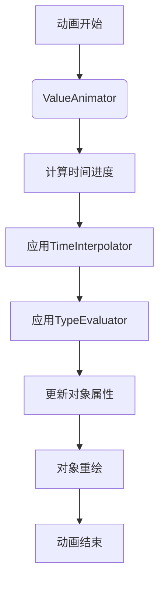
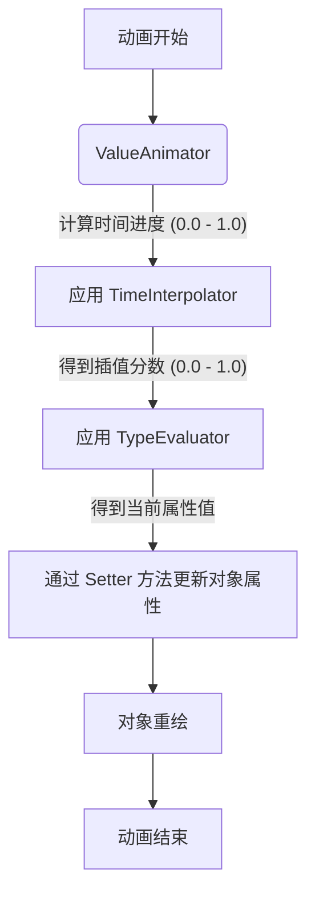

# 极尽详细地为您讲解 Android 的基础动画和高阶复杂动画的实现


命令：
1.极尽详细地讲解该面试题涉及的所有知识技术。
2.在每部分相关知识技术讲解下，必须给出相关知识技术的具体运用示例或详细的已逐行注释的代码示例。
3.所有代码示例下都必须带有详细文字讲解说明，以便理解学习。
4.教会我回答面试官的详细具体话术。


好的，没问题。根据您提供的图片内容，我们将极尽详细地为您讲解 Android 的基础动画和高阶复杂动画的实现，包括帧动画、补间动画、属性动画的概念、使用方法、原理以及如何实现常见的动画效果。

---

**Android 基础动画与高阶复杂动画的实践**

**引言：什么是 Android 动画？为什么动画很重要？**

*   **什么是 Android 动画？**
    Android 动画是指在用户界面元素（View）或对象属性上应用视觉变化，使其在一段时间内平滑过渡。这些变化可以是位置、大小、旋转、透明度、颜色等。
*   **为什么动画很重要？**
    *   **提升用户体验：** 动画可以使界面更加生动、有趣，提供视觉反馈，让用户感知到操作的结果。
    *   **引导用户注意力：** 通过动画可以突出重要的界面元素，引导用户的视线。
    *   **增强应用专业感：** 流畅、自然的动画可以提升应用的整体品质和专业感。
    *   **改善用户感知性能：** 在执行耗时操作时，通过加载动画可以分散用户注意力，减少等待的焦虑感。

Android 提供了几种不同的动画系统：

1.  **帧动画 (Frame Animation):** 顺序播放一系列 Drawable 资源，类似于电影胶片。
2.  **补间动画 (Tween Animation):** 对 View 进行一系列简单的变换（平移、缩放、旋转、透明度）来实现动画效果。
3.  **属性动画 (Property Animation):** 最强大和灵活的动画系统，可以动画任何对象的任何属性。

---

**1. 动画的认识 (基本概念)**

*   **目的：** 理解 Android 动画的基本概念和原理。
*   **相关知识技术：** View、属性、时间、插值器 (Interpolator)、估值器 (Evaluator)。
*   **详细讲解：**
    动画的本质是在一段时间内，按照一定的规则改变一个或多个属性的值。
    *   **View：** 动画通常应用于 View 对象，改变 View 的位置、大小、透明度、旋转角度等属性。
    *   **属性：** 动画改变的是对象的属性。对于 View 来说，常见的可动画属性包括 `translationX`, `translationY`, `scaleX`, `scaleY`, `rotation`, `alpha` 等。属性动画可以动画任何对象的任何属性，只要该属性有 getter 和 setter 方法。
    *   **时间：** 动画在一段时间内完成，由动画的持续时间 (Duration) 控制。
    *   **插值器 (Interpolator):** 控制属性值随时间变化的**速率**。例如，线性插值器使变化速率恒定，加速插值器使变化速率越来越快，减速插值器使变化速率越来越慢。插值器定义了动画的非线性运动效果。
    *   **估值器 (Evaluator):** 控制属性值随时间变化的**具体数值**。根据当前动画的进度（0% 到 100%）和插值器计算出的时间因子，估值器计算出属性在当前时刻的具体值。例如，`IntEvaluator` 用于计算整数属性值，`FloatEvaluator` 用于计算浮点数属性值，`ArgbEvaluator` 用于计算颜色属性值。

*   **具体运用示例或详细的已逐行注释的代码示例：**
    这部分是概念介绍，没有具体的代码示例来演示动画本身，代码示例将在后续各动画类型的详细讲解中给出。
*   **详细文字讲解说明：**
    理解动画的基本原理有助于更好地使用和定制动画。动画不是简单地从起始状态瞬间跳到结束状态，而是在持续时间内，通过插值器和估值器计算出中间状态，并一帧一帧地绘制出来，从而形成平滑的过渡效果。
*   **如何回答面试官：**
    “Android 动画是在一段时间内改变 View 或对象属性的视觉变化。它的基本原理是在动画持续时间内，通过插值器控制变化速率，估值器计算出属性在每个时刻的具体值，然后更新界面。动画的关键要素包括要动画的属性、持续时间、插值器（控制变化速率）和估值器（计算属性值）。”

---

**2. 帧动画 (Frame Animation) 的介绍**

*   **目的：** 学习如何使用帧动画播放一系列 Drawable 资源。
*   **相关知识技术：** `AnimationDrawable` 类、`res/drawable` 目录、XML 定义 (`<animation-list>`)、`android:drawable` 属性、`android:duration` 属性、`android:oneshot` 属性、`start()` 方法、`stop()` 方法。
*   **详细讲解：**
    帧动画通过顺序播放一系列 Drawable 资源来实现动画效果，就像翻页动画书一样。它适用于创建简单的、重复的动画序列，例如加载指示器或简单的角色动画。

    **使用步骤：**
    1.  在 `res/drawable` 目录下创建一个 XML 文件，根标签为 `<animation-list>`。
    2.  在 `<animation-list>` 中添加多个 `<item>` 标签，每个 `<item>` 指定一个 Drawable 资源 (`android:drawable`) 和该帧的显示时间 (`android:duration`，单位为毫秒)。
    3.  在 `<animation-list>` 标签中设置 `android:oneshot="true"` 表示只播放一次，设置为 `"false"` 表示循环播放。
    4.  在代码中，将这个 XML 文件设置为 View 的背景。
    5.  获取 View 的背景 Drawable，并将其转换为 `AnimationDrawable` 对象。
    6.  调用 `AnimationDrawable` 的 `start()` 方法开始播放动画，`stop()` 方法停止播放。

    **优点：** 实现简单，适用于播放预设的图像序列。
    **缺点：** 只能播放 Drawable 序列，无法实现复杂的变换或属性动画；如果帧数过多或图片过大，可能导致内存占用过高（OOM）。

*   **具体运用示例或详细的已逐行注释的代码示例：**

    **帧动画 XML 定义 (res/drawable/loading_animation.xml):**
    ```xml
    <?xml version="1.0" encoding="utf-8"?>
    <!-- 帧动画列表 -->
    <animation-list xmlns:android="http://schemas.android.com/apk/res/android"
        android:oneshot="false"> <!-- 设置为 false 表示循环播放 -->

        <!-- 第一帧 -->
        <item android:drawable="@drawable/loading_frame1" android:duration="100" /> <!-- 引用 drawable 资源，显示 100ms -->
        <!-- 第二帧 -->
        <item android:drawable="@drawable/loading_frame2" android:duration="100" />
        <!-- 第三帧 -->
        <item android:drawable="@drawable/loading_frame3" android:duration="100" />
        <!-- 假设您有 loading_frame1.png, loading_frame2.png, loading_frame3.png 等图片资源 -->

    </animation-list>
    ```

    **在布局文件中使用帧动画作为背景:**
    ```xml
    <ImageView
        android:id="@+id/loadingImageView"
        android:layout_width="wrap_content"
        android:layout_height="wrap_content"
        android:background="@drawable/loading_animation" /> <!-- 设置背景为帧动画 Drawable -->
    ```

    **在 Activity 代码中启动和停止帧动画:**
    ```kotlin
    package com.yourcompany.myapp

    import androidx.appcompat.app.AppCompatActivity
    import android.os.Bundle
    import android.graphics.drawable.AnimationDrawable // 导入 AnimationDrawable 类
    import android.widget.ImageView // 导入 ImageView
    import android.widget.Button // 导入 Button

    class MainActivity : AppCompatActivity() {

        private lateinit var loadingImageView: ImageView
        private lateinit var startButton: Button
        private lateinit var stopButton: Button

        override fun onCreate(savedInstanceState: Bundle?) {
            super.onCreate(savedInstanceState)
            setContentView(R.layout.activity_main_frame_animation) // 假设布局中有 loadingImageView, startButton, stopButton

            loadingImageView = findViewById(R.id.loadingImageView)
            startButton = findViewById(R.id.startButton)
            stopButton = findViewById(R.id.stopButton)

            // 获取 ImageView 的背景 Drawable，并转换为 AnimationDrawable
            val animationDrawable = loadingImageView.background as AnimationDrawable

            startButton.setOnClickListener {
                // 启动帧动画
                animationDrawable.start()
            }

            stopButton.setOnClickListener {
                // 停止帧动画
                animationDrawable.stop()
            }
        }

        // 在 Activity 可见时启动动画 (如果需要)
        override fun onStart() {
            super.onStart()
            // 如果动画不是 oneshot，可以在这里启动
            // val animationDrawable = loadingImageView.background as AnimationDrawable
            // animationDrawable.start()
        }

        // 在 Activity 不可见时停止动画 (避免资源浪费)
        override fun onStop() {
            super.onStop()
            // 停止动画
            val animationDrawable = loadingImageView.background as AnimationDrawable
            animationDrawable.stop()
        }
    }
    ```

*   **详细文字讲解说明：**
    *   帧动画的定义在 XML 文件中，根标签是 `<animation-list>`。每个 `<item>` 代表一帧，指定了显示的 Drawable 和持续时间。`android:oneshot` 控制是否循环。
    *   在布局文件中，将这个 XML 文件设置为 View 的背景 (`android:background`)。
    *   在代码中，获取 View 的背景 Drawable，并强制转换为 `AnimationDrawable` 类型。
    *   调用 `animationDrawable.start()` 开始播放动画，`animationDrawable.stop()` 停止播放。
    *   通常在 Activity 的 `onStart()` 中启动动画，在 `onStop()` 中停止动画，以避免在界面不可见时仍然播放动画浪费资源。

*   **如何回答面试官：**
    “帧动画是通过顺序播放一系列 Drawable 资源来实现动画效果，类似于电影胶片。它适用于创建简单的、重复的动画序列，比如加载指示器。帧动画在 XML 中定义，使用 `<animation-list>` 标签，每个 `<item>` 指定一帧的 Drawable 和持续时间。在代码中，将 XML 设置为 View 的背景，然后获取 `AnimationDrawable` 对象，调用 `start()` 和 `stop()` 方法控制播放。帧动画实现简单，但功能有限，且如果帧数过多或图片过大，可能导致内存问题。”

**3. 补间动画 (Tween Animation) 的介绍**

*   **目的：** 学习如何使用补间动画对 View 进行简单的变换。
*   **相关知识技术：** `Animation` 类、`res/anim` 目录、XML 定义 (`<alpha>`, `<scale>`, `<translate>`, `<rotate>`, `<set>`)、`AnimationUtils.loadAnimation()`、`View.startAnimation()`、插值器 (`Interpolator`)。
*   **详细讲解：**
    补间动画通过对 View 应用一系列简单的变换（平移、缩放、旋转、透明度）来实现动画效果。它只改变 View 的绘制效果，不改变 View 实际的边界和属性值。

    **变换类型：**
    *   **Alpha (透明度):** `<alpha>` 标签，改变 View 的透明度。
    *   **Scale (缩放):** `<scale>` 标签，改变 View 的大小。
    *   **Translate (平移):** `<translate>` 标签，改变 View 的位置。
    *   **Rotate (旋转):** `<rotate>` 标签，改变 View 的旋转角度。
    *   **Set (集合):** `<set>` 标签，可以将多个补间动画组合在一起，同时或按顺序播放。

    **使用步骤：**
    1.  在 `res/anim` 目录下创建一个 XML 文件，定义补间动画。可以使用单个变换标签或 `<set>` 标签组合多个变换。
    2.  在代码中，使用 `AnimationUtils.loadAnimation()` 方法加载 XML 动画资源。
    3.  调用 View 的 `startAnimation()` 方法应用动画。

    **优点：** 实现简单，适用于 View 的简单变换动画。
    **缺点：** 只能应用于 View，且只改变绘制效果，不改变实际属性；功能相对有限。

*   **具体运用示例或详细的已逐行注释的代码示例：**

    **补间动画 XML 定义 (res/anim/tween_animation_set.xml):**
    ```xml
    <?xml version="1.0" encoding="utf-8"?>
    <!-- 补间动画集合 -->
    <set xmlns:android="http://schemas.android.com/apk/res/android"
        android:shareInterpolator="false"> <!-- 子动画是否共享同一个插值器 -->

        <!-- 透明度动画 -->
        <alpha
            android:fromAlpha="1.0" // 起始透明度 (完全不透明)
            android:toAlpha="0.0" // 结束透明度 (完全透明)
            android:duration="1000" // 持续时间 1000ms
            android:interpolator="@android:anim/accelerate_interpolator" /> <!-- 使用加速插值器 -->

        <!-- 缩放动画 -->
        <scale
            android:fromXScale="1.0" // 起始 X 轴缩放比例
            android:toXScale="1.5" // 结束 X 轴缩放比例
            android:fromYScale="1.0" // 起始 Y 轴缩放比例
            android:toYScale="1.5" // 结束 Y 轴缩放比例
            android:pivotX="50%" // 缩放中心点 X 坐标 (相对于 View 自身)
            android:pivotY="50%" // 缩放中心点 Y 坐标
            android:duration="1000"
            android:interpolator="@android:anim/accelerate_decelerate_interpolator" /> <!-- 使用先加速后减速插值器 -->

        <!-- 平移动画 -->
        <translate
            android:fromXDelta="0%" // 起始 X 轴平移距离 (相对于 View 自身)
            android:toXDelta="50%" // 结束 X 轴平移距离
            android:fromYDelta="0%" // 起始 Y 轴平移距离
            android:toYDelta="50%" // 结束 Y 轴平移距离
            android:duration="1000"
            android:interpolator="@android:anim/decelerate_interpolator" /> <!-- 使用减速插值器 -->

        <!-- 旋转动画 -->
        <rotate
            android:fromDegrees="0" // 起始旋转角度
            android:toDegrees="360" // 结束旋转角度
            android:pivotX="50%" // 旋转中心点 X 坐标
            android:pivotY="50%" // 旋转中心点 Y 坐标
            android:duration="1000"
            android:interpolator="@android:anim/linear_interpolator" /> <!-- 使用线性插值器 -->

    </set>
    ```

    **在 Activity 代码中加载和应用补间动画:**
    ```kotlin
    package com.yourcompany.myapp

    import androidx.appcompat.app.AppCompatActivity
    import android.os.Bundle
    import android.view.animation.Animation // 导入 Animation 类
    import android.view.animation.AnimationUtils // 导入 AnimationUtils 类
    import android.widget.Button // 导入 Button
    import android.widget.ImageView // 导入 ImageView

    class MainActivity : AppCompatActivity() {

        private lateinit var animatedImageView: ImageView
        private lateinit var startTweenButton: Button

        override fun onCreate(savedInstanceState: Bundle?) {
            super.onCreate(savedInstanceState)
            setContentView(R.layout.activity_main_tween_animation) // 假设布局中有 animatedImageView 和 startTweenButton

            animatedImageView = findViewById(R.id.animatedImageView)
            startTweenButton = findViewById(R.id.startTweenButton)

            // 加载补间动画资源
            val tweenAnimation = AnimationUtils.loadAnimation(this, R.anim.tween_animation_set)

            startTweenButton.setOnClickListener {
                // 将动画应用到 ImageView
                animatedImageView.startAnimation(tweenAnimation)
            }
        }
    }
    ```

    **布局文件 (res/layout/activity_main_tween_animation.xml):**
    ```xml
    <?xml version="1.0" encoding="utf-8"?>
    <LinearLayout xmlns:android="http://schemas.android.com/apk/res/android"
        xmlns:tools="http://schemas.android.com/tools"
        android:layout_width="match_parent"
        android:layout_height="match_parent"
        android:orientation="vertical"
        android:gravity="center"
        tools:context=".MainActivity">

        <ImageView
            android:id="@+id/animatedImageView"
            android:layout_width="100dp"
            android:layout_height="100dp"
            android:src="@mipmap/ic_launcher"
            android:background="#CCCCCC"/>

        <Button
            android:id="@+id/startTweenButton"
            android:layout_width="wrap_content"
            android:layout_height="wrap_content"
            android:text="Start Tween Animation"
            android:layout_marginTop="16dp"/>

    </LinearLayout>
    ```

*   **详细文字讲解说明：**
    *   补间动画的定义在 XML 文件中，根标签可以是单个变换标签（`<alpha>`, `<scale>`, `<translate>`, `<rotate>`) 或 `<set>` 标签。
    *   每个变换标签都有自己的属性来定义变换的起始值、结束值、持续时间、插值器等。例如，`<translate>` 使用 `fromXDelta`, `toXDelta` 定义水平平移。
    *   `android:pivotX` 和 `android:pivotY` 定义缩放和旋转的中心点，可以是绝对值（dp）或相对值（百分比）。
    *   `android:interpolator` 属性可以指定动画的插值器，控制动画的速度变化。`@android:anim/...` 引用系统内置的插值器。
    *   在代码中，使用 `AnimationUtils.loadAnimation()` 方法加载 XML 动画资源，它返回一个 `Animation` 对象。
    *   调用 View 的 `startAnimation(animation)` 方法将动画应用到 View 上。
    *   **重要：** 补间动画只改变 View 的绘制位置和外观，View 实际的点击区域和属性值（如 `getX()`, `getY()`) 保持不变。

*   **如何回答面试官：**
    “补间动画是对 View 进行一系列简单的变换（平移、缩放、旋转、透明度）来实现动画效果。它在 XML 中定义，使用 `<alpha>`、`<scale>`、`<translate>`、`<rotate>` 标签，或者使用 `<set>` 组合多个变换。在代码中，通过 `AnimationUtils.loadAnimation()` 加载动画资源，然后调用 View 的 `startAnimation()` 方法应用动画。补间动画实现简单，适用于 View 的简单变换，但它的缺点是只改变 View 的绘制效果，不改变 View 实际的属性值和点击区域。”

**4. 属性动画 (Property Animation) 的介绍和进阶使用方法**

*   **目的：** 学习属性动画的基本概念、核心类、如何动画对象的属性，以及如何进行高级组合和监听。
*   **相关知识技术：** `Animator` 类、`ValueAnimator` 类、`ObjectAnimator` 类、`AnimatorSet` 类、`res/animator` 目录、XML 定义 (`<objectAnimator>`, `<valueAnimator>`, `<set>`)、`ofFloat()`, `ofInt()`, `ofObject()` 方法、`setDuration()`, `setInterpolator()`, `setEvaluator()`、`addListener()`, `addUpdateListener()`、`playTogether()`, `playSequentially()`, `play(...).with(...)`, `before(...)`, `after(...)`。
*   **详细讲解：**
    属性动画是 Android 最强大和灵活的动画系统。它可以动画任何对象的任何属性，只要该属性有对应的 getter 和 setter 方法。属性动画改变的是对象的实际属性值，因此 View 的实际位置、大小、透明度等都会改变，点击区域也会随之移动。

    **核心类：**
    *   **`ValueAnimator`:** 属性动画的基础类，它在一段时间内动画一组值（例如，从 0 到 100）。您需要自己监听动画过程中的值变化，并将这些值应用到对象的属性上。
    *   **`ObjectAnimator`:** `ValueAnimator` 的子类，更常用。它可以直接动画指定对象的指定属性。您只需指定要动画的对象、属性名称和属性值的范围，`ObjectAnimator` 会自动通过属性的 setter 方法更新属性值。
    *   **`AnimatorSet`:** 用于将多个属性动画组合在一起，可以设置它们同时播放、按顺序播放或延迟播放。

    **使用方法：**
    *   **代码创建 (更常用):** 直接在代码中使用 `ObjectAnimator.of...()` 或 `ValueAnimator.of...()` 方法创建动画对象，设置持续时间、插值器等，然后调用 `start()` 方法启动。
    *   **XML 定义 (较少用):** 在 `res/animator` 目录下创建 XML 文件定义属性动画，使用 `AnimatorInflater.loadAnimator()` 加载。

    **进阶使用方法：**
    *   **插值器 (Interpolator):** 控制动画的速度变化。可以通过 `setInterpolator()` 方法设置。属性动画支持与补间动画相同的插值器，也可以自定义插值器。
    *   **估值器 (Evaluator):** 控制属性值的计算方式。可以通过 `setEvaluator()` 方法设置。对于非基本数据类型或自定义类型属性的动画，需要提供自定义的 `TypeEvaluator`。
    *   **监听器 (Listener):**
        *   `AnimatorListener`: 监听动画的生命周期事件（开始、结束、取消、重复）。
        *   `AnimatorUpdateListener`: 监听动画过程中值的变化（主要用于 `ValueAnimator`）。
    *   **组合动画 (`AnimatorSet`):**
        *   `playTogether(animators)`: 同时播放一组动画。
        *   `playSequentially(animators)`: 按顺序播放一组动画。
        *   `play(animator).with(anotherAnimator)`: 使两个动画同时播放。
        *   `play(animator).before(anotherAnimator)`: 使一个动画在另一个动画之前播放。
        *   `play(animator).after(anotherAnimator)`: 使一个动画在另一个动画之后播放。
        *   `play(animator).after(delay)`: 使一个动画延迟一段时间后播放。

    **优点：** 功能强大，灵活，可以动画任何属性，改变的是实际属性值，解决了补间动画的缺点。
    **缺点：** 相比补间动画，概念和使用稍微复杂一些。

*   **具体运用示例或详细的已逐行注释的代码示例：**

    **使用 ObjectAnimator 动画 View 的透明度和缩放 (代码创建):**
    ```kotlin
    package com.yourcompany.myapp

    import androidx.appcompat.app.AppCompatActivity
    import android.os.Bundle
    import android.animation.ObjectAnimator // 导入 ObjectAnimator
    import android.animation.AnimatorSet // 导入 AnimatorSet
    import android.view.View // 导入 View
    import android.widget.Button // 导入 Button
    import android.widget.ImageView // 导入 ImageView

    class MainActivity : AppCompatActivity() {

        private lateinit var animatedImageView: ImageView
        private lateinit var startPropertyButton: Button

        override fun onCreate(savedInstanceState: Bundle?) {
            super.onCreate(savedInstanceState)
            setContentView(R.layout.activity_main_property_animation) // 假设布局中有 animatedImageView 和 startPropertyButton

            animatedImageView = findViewById(R.id.animatedImageView)
            startPropertyButton = findViewById(R.id.startPropertyButton)

            startPropertyButton.setOnClickListener {
                // 创建一个透明度动画：动画 animatedImageView 的 "alpha" 属性，从 1.0 到 0.0 再到 1.0
                val alphaAnimator = ObjectAnimator.ofFloat(animatedImageView, "alpha", 1.0f, 0.0f, 1.0f)
                alphaAnimator.duration = 1500 // 设置持续时间 1500ms

                // 创建一个缩放动画：动画 animatedImageView 的 "scaleX" 和 "scaleY" 属性，从 1.0 缩放到 1.2 再回到 1.0
                val scaleXAnimator = ObjectAnimator.ofFloat(animatedImageView, "scaleX", 1.0f, 1.2f, 1.0f)
                scaleXAnimator.duration = 1500

                val scaleYAnimator = ObjectAnimator.ofFloat(animatedImageView, "scaleY", 1.0f, 1.2f, 1.0f)
                scaleYAnimator.duration = 1500

                // 使用 AnimatorSet 组合动画：同时播放透明度和缩放动画
                val animatorSet = AnimatorSet()
                animatorSet.playTogether(alphaAnimator, scaleXAnimator, scaleYAnimator) // 同时播放

                // 可以设置动画监听器
                // animatorSet.addListener(object : Animator.AnimatorListener {
                //     override fun onAnimationStart(animation: Animator) { Log.d("Animation", "Start") }
                //     override fun onAnimationEnd(animation: Animator) { Log.d("Animation", "End") }
                //     override fun onAnimationCancel(animation: Animator) { Log.d("Animation", "Cancel") }
                //     override fun onAnimationRepeat(animation: Animator) { Log.d("Animation", "Repeat") }
                // })

                // 启动动画集合
                animatorSet.start()
            }
        }
    }
    ```

    **使用 ValueAnimator 动画一个数值并更新 TextView (代码创建):**
    ```kotlin
    package com.yourcompany.myapp

    import androidx.appcompat.app.AppCompatActivity
    import android.os.Bundle
    import android.animation.ValueAnimator // 导入 ValueAnimator
    import android.widget.Button // 导入 Button
    import android.widget.TextView // 导入 TextView

    class MainActivity : AppCompatActivity() {

        private lateinit var countTextView: TextView
        private lateinit var startValueAnimatorButton: Button

        override fun onCreate(savedInstanceState: Bundle?) {
            super.onCreate(savedInstanceState)
            setContentView(R.layout.activity_main_value_animator) // 假设布局中有 countTextView 和 startValueAnimatorButton

            countTextView = findViewById(R.id.countTextView)
            startValueAnimatorButton = findViewById(R.id.startValueAnimatorButton)

            startValueAnimatorButton.setOnClickListener {
                // 创建一个 ValueAnimator，动画整数值从 0 到 100
                val valueAnimator = ValueAnimator.ofInt(0, 100)
                valueAnimator.duration = 2000 // 持续时间 2000ms

                // 添加动画更新监听器
                valueAnimator.addUpdateListener { animator ->
                    // 在动画过程中，获取当前动画的值
                    val animatedValue = animator.animatedValue as Int
                    // 将值设置给 TextView
                    countTextView.text = animatedValue.toString()
                }

                // 启动动画
                valueAnimator.start()
            }
        }
    }
    ```

    **布局文件 (res/layout/activity_main_property_animation.xml):**
    ```xml
    <?xml version="1.0" encoding="utf-8"?>
    <LinearLayout xmlns:android="http://schemas.android.com/apk/res/android"
        xmlns:tools="http://schemas.android.com/tools"
        android:layout_width="match_parent"
        android:layout_height="match_parent"
        android:orientation="vertical"
        android:gravity="center"
        tools:context=".MainActivity">

        <ImageView
            android:id="@+id/animatedImageView"
            android:layout_width="100dp"
            android:layout_height="100dp"
            android:src="@mipmap/ic_launcher"
            android:background="#CCCCCC"/>

        <Button
            android:id="@+id/startPropertyButton"
            android:layout_width="wrap_content"
            android:layout_height="wrap_content"
            android:text="Start Property Animation"
            android:layout_marginTop="16dp"/>

    </LinearLayout>
    ```

    **布局文件 (res/layout/activity_main_value_animator.xml):**
    ```xml
    <?xml version="1.0" encoding="utf-8"?>
    <LinearLayout xmlns:android="http://schemas.android.com/apk/res/android"
        xmlns:tools="http://schemas.android.com/tools"
        android:layout_width="match_parent"
        android:layout_height="match_parent"
        android:orientation="vertical"
        android:gravity="center"
        tools:context=".MainActivity">

        <TextView
            android:id="@+id/countTextView"
            android:layout_width="wrap_content"
            android:layout_height="wrap_content"
            android:text="0"
            android:textSize="48sp"/>

        <Button
            android:id="@+id/startValueAnimatorButton"
            android:layout_width="wrap_content"
            android:layout_height="wrap_content"
            android:text="Start Value Animator"
            android:layout_marginTop="16dp"/>

    </LinearLayout>
    ```

*   **详细文字讲解说明：**
    *   属性动画的核心是 `ValueAnimator` 和 `ObjectAnimator`。`ObjectAnimator` 更常用，因为它直接动画对象的属性。
    *   `ObjectAnimator.ofFloat(target, propertyName, values)` 创建一个动画，`target` 是要动画的对象，`propertyName` 是要动画的属性名称（字符串），`values` 是属性值的范围（可以是一个或多个值）。
    *   `ValueAnimator.ofInt(values)` 创建一个动画，动画整数值。您需要添加 `AnimatorUpdateListener` 来获取动画过程中的值，并手动应用到 View 或其他对象上。
    *   `AnimatorSet` 用于组合多个动画，通过 `playTogether()`, `playSequentially()`, `play(...).with(...)` 等方法定义动画之间的关系。
    *   `setDuration()` 设置动画持续时间。
    *   `setInterpolator()` 设置插值器，控制动画速度变化。
    *   `addListener()` 监听动画的生命周期事件。
    *   `addUpdateListener()` 监听动画值的变化（主要用于 `ValueAnimator`）。
    *   属性动画改变的是 View 实际的属性值，因此 View 的位置、大小、点击区域都会随之改变。

*   **如何回答面试官：**
    “属性动画是 Android 最强大和灵活的动画系统。它可以动画任何对象的任何属性，只要该属性有 getter 和 setter 方法。属性动画的核心类是 `ValueAnimator` 和 `ObjectAnimator`。`ObjectAnimator` 更常用，它可以直接动画指定对象的指定属性，比如 View 的 `alpha`、`translationX`、`scaleY` 等。`ValueAnimator` 动画一组值，需要手动将值应用到属性上。`AnimatorSet` 用于组合多个属性动画。
    属性动画的进阶用法包括设置插值器（控制速度变化）、估值器（计算属性值）、监听器（监听动画生命周期或值变化），以及使用 `AnimatorSet` 组合动画，实现同时、顺序或延迟播放。属性动画改变的是对象的实际属性值，解决了补间动画只改变绘制效果的缺点。”

**5. 实现常见的动画效果**

*   **目的：** 结合属性动画，演示如何实现一些常见的 UI 动画效果。
*   **相关知识技术：** `ObjectAnimator`、`AnimatorSet`、View 的属性（`alpha`, `translationX`, `translationY`, `scaleX`, `scaleY`, `rotation`）、插值器。
*   **详细讲解：**
    利用属性动画，可以方便地实现各种常见的 UI 动画效果。

    *   **淡入/淡出 (Fade In/Out):** 动画 View 的 `alpha` 属性，从 0 到 1 (淡入) 或从 1 到 0 (淡出)。
    *   **滑动进入/滑出 (Slide In/Out):** 动画 View 的 `translationX` 或 `translationY` 属性，改变 View 的位置。
    *   **缩放 (Scale):** 动画 View 的 `scaleX` 和 `scaleY` 属性。
    *   **旋转 (Rotate):** 动画 View 的 `rotation` 属性。
    *   **组合效果：** 使用 `AnimatorSet` 将上述基本动画组合起来，实现更复杂的动画序列。

*   **具体运用示例或详细的已逐行注释的代码示例：**

    **实现淡入动画:**
    ```kotlin
    // 动画 View 的 alpha 属性从 0 (完全透明) 到 1 (完全不透明)
    val fadeInAnimator = ObjectAnimator.ofFloat(myView, "alpha", 0f, 1f)
    fadeInAnimator.duration = 500 // 持续 500ms
    fadeInAnimator.start() // 启动动画
    ```

    **实现从屏幕左侧滑入动画:**
    ```kotlin
    // 假设 View 初始位置在屏幕左侧外部
    // 动画 View 的 translationX 属性从 -View 的宽度 到 0 (原始位置)
    val slideInFromLeftAnimator = ObjectAnimator.ofFloat(myView, "translationX", -myView.width.toFloat(), 0f)
    slideInFromLeftAnimator.duration = 700
    slideInFromLeftAnimator.interpolator = android.view.animation.DecelerateInterpolator() // 使用减速插值器
    slideInFromLeftAnimator.start()
    ```

    **实现点击按钮时 View 放大并旋转的组合动画:**
    ```kotlin
    // 在按钮点击监听器中
    button.setOnClickListener {
        // 放大动画
        val scaleX = ObjectAnimator.ofFloat(targetView, "scaleX", 1f, 1.2f, 1f)
        val scaleY = ObjectAnimator.ofFloat(targetView, "scaleY", 1f, 1.2f, 1f)
        scaleX.duration = 300
        scaleY.duration = 300

        // 旋转动画
        val rotate = ObjectAnimator.ofFloat(targetView, "rotation", 0f, 360f)
        rotate.duration = 500

        // 组合动画
        val animatorSet = AnimatorSet()
        animatorSet.playTogether(scaleX, scaleY) // 放大同时进行
        animatorSet.play(rotate).after(scaleX) // 旋转在放大之后进行

        animatorSet.start() // 启动组合动画
    }
    ```

*   **详细文字讲解说明：**
    *   这些示例都使用了 `ObjectAnimator` 来动画 View 的不同属性。
    *   淡入/淡出动画改变 `alpha` 属性。
    *   滑动动画改变 `translationX` 或 `translationY` 属性。
    *   缩放动画改变 `scaleX` 和 `scaleY` 属性。
    *   旋转动画改变 `rotation` 属性。
    *   最后一个示例展示了如何使用 `AnimatorSet` 将缩放动画和旋转动画组合起来，先同时进行缩放，然后进行旋转。
    *   可以根据需要设置动画的持续时间 (`duration`) 和插值器 (`interpolator`) 来控制动画的速度和效果。

*   **如何回答面试官：**
    “使用属性动画可以方便地实现各种常见的 UI 动画效果。比如，通过动画 View 的 `alpha` 属性可以实现淡入淡出效果；通过动画 `translationX` 或 `translationY` 属性可以实现滑动进入或滑出效果；通过动画 `scaleX` 和 `scaleY` 属性可以实现缩放效果；通过动画 `rotation` 属性可以实现旋转效果。对于更复杂的动画序列，我可以使用 `AnimatorSet` 将多个属性动画组合起来，设置它们同时、顺序或延迟播放。同时，我会根据动画需求选择合适的插值器来控制动画的速度变化。”

**6. 练习使用相关动画**

*   **目的：** 指导如何通过实践来掌握 Android 动画的实现。
*   **相关知识技术：** Android Studio、布局编辑器、代码编辑器、模拟器/真机、Logcat、Layout Inspector。
*   **详细讲解：**
    掌握 Android 动画最好的方法就是动手实践。
    1.  **从简单开始：** 尝试实现一个 View 的简单平移、缩放、旋转或透明度动画。
    2.  **练习不同类型的动画：** 分别使用帧动画、补间动画和属性动画实现一些简单的效果，体会它们之间的区别和适用场景。
    3.  **练习组合动画：** 使用 `AnimatorSet` 组合多个属性动画，实现更复杂的动画序列。
    4.  **练习动画监听：** 为动画添加监听器，在动画开始、结束或更新时执行一些操作。
    5.  **练习状态保存：** 如果动画涉及到 View 的状态变化，考虑如何在 Activity/Fragment 重建时保存和恢复动画状态。
    6.  **参考官方文档和示例：** Android Developer 官方网站提供了详细的动画文档和示例代码，是学习的重要资源。
    7.  **分析开源项目：** 查看一些开源项目中动画的实现方式，学习高级技巧。
    8.  **使用工具：** 利用 Android Studio 的布局编辑器预览动画效果（对于补间动画和属性动画的 XML 定义），使用 Logcat 观察动画监听器的回调，使用 Layout Inspector 查看动画过程中 View 属性的变化。

*   **具体运用示例或详细的已逐行注释的代码示例：**
    这部分是实践建议，没有具体的代码示例来演示练习过程本身。
*   **详细文字讲解说明：**
    通过反复练习，您可以熟悉不同动画系统的用法，理解它们的优缺点，并掌握如何实现各种常见的动画效果。从简单的 View 动画开始，逐步挑战更复杂的组合动画和自定义动画。
*   **如何回答面试官：**
    “我认为掌握 Android 动画最有效的方式是实践。我会从简单的 View 动画开始练习，比如平移、缩放、旋转和透明度。然后尝试使用不同的动画系统（帧动画、补间动画、属性动画）实现相同的效果，理解它们的区别。我会重点练习属性动画，学习如何动画各种属性，并使用 `AnimatorSet` 组合动画。我也会为动画添加监听器，并在动画过程中执行一些逻辑。同时，我会参考官方文档和示例，并分析一些开源项目中的动画实现，不断提升我的动画实现能力。”

---

**总结面试回答话术：**

当面试官问到 Android 动画时，您可以按照以下结构进行回答：

“Android 动画用于在界面元素上应用视觉变化，提升用户体验和应用品质。Android 主要有三种动画系统：帧动画、补间动画和属性动画。

1.  **帧动画** 通过顺序播放一系列 Drawable 实现，适用于简单的序列动画，但功能有限且可能导致内存问题。
2.  **补间动画** 对 View 进行简单的变换（平移、缩放、旋转、透明度），实现简单，但只改变绘制效果，不改变实际属性。
3.  **属性动画** 是最强大和灵活的系统，可以动画任何对象的任何属性，改变的是实际属性值。核心类是 `ValueAnimator` 和 `ObjectAnimator`，`AnimatorSet` 用于组合动画。属性动画支持丰富的插值器和估值器，可以实现各种复杂效果。

在实际开发中，我通常优先使用**属性动画**，因为它功能强大且改变的是实际属性。我会根据动画需求选择合适的 `ObjectAnimator` 或 `ValueAnimator`，并使用 `AnimatorSet` 组合动画。我会设置动画的持续时间、插值器，并根据需要添加监听器。对于简单的序列动画，可能会考虑帧动画。

为了实现常见的动画效果，比如淡入淡出（动画 `alpha`）、滑动（动画 `translationX`/`translationY`）、缩放（动画 `scaleX`/`scaleY`）、旋转（动画 `rotation`），我都会使用属性动画。

我认为掌握动画的关键在于理解其原理（属性、时间、插值器、估值器）并多加实践。我会从简单的动画开始，逐步挑战复杂的组合动画，并利用 Android Studio 的预览和调试工具来辅助开发。”

希望这份极尽详细的讲解对您有所帮助！


# 极尽详细全面具体地为我讲解 Android 中的动画 。配置文件基于Kotlin DSL。编程语言基于java。

命令：
1.极尽详细地讲解该面试题涉及的所有知识技术。
2.在每部分相关知识技术讲解下，必须给出相关知识技术的具体运用示例或详细的已逐行注释的代码示例。
3.所有代码示例下都必须带有详细文字讲解说明，以便理解学习。
4.教会我回答面试官的详细具体话术。


好的，同学你好！“Android 动画”是一个面试中非常高频、且能充分展示你技术深度和广度的绝佳问题。一个优秀的回答不仅要罗列技术，更要能讲清它们的演进、适用场景和底层原理。

我将为你提供一份“保姆级”的超详细讲解，从底层原理到现代实践，再到最终的面试话术，助你彻底掌握这个知识体系。

---

 **面试题：请详细谈谈你对 Android 动画的理解。**

---

 **第一部分：知识技术详解**

我们将 Android 动画体系按照其演进和功能，划分为四大核心类别：

1.  **视图动画 (View Animation / 补间动画)**：元老级，用于实现简单的视觉特效。
2.  **属性动画 (Property Animation)**：中流砥柱，现代动画的基石，能够真正改变对象属性。
3.  **动态动画 (Dynamic Animation / 物理动画)**：新贵，用于实现符合物理世界的、更自然的动画效果。
4.  **布局与转场动画 (Layout & Transition Animation)**：宏观动画，用于处理 UI 状态变化和场景切换。

---

 **1. 视图动画 (View Animation / 补间动画)**

 **1.1 知识讲解**

视图动画是 Android 最早期的动画系统。它的核心理念是“补间（Tweening）”，即你只需要定义动画的开始状态和结束状态，系统会自动计算并填充（“补”）中间的动画帧。

它主要包含四种基本变换：
*   **Alpha**: 透明度变化。
*   **Scale**: 缩放变换。
*   **Translate**:位移变换。
*   **Rotate**: 旋转变换。

**【核心要点与缺陷】**
这是面试中必须指出的关键点：视图动画有一个**致命缺陷**——它仅仅是改变了 View 的**绘制内容**，而没有改变 View 自身的**实际属性**。

举个例子：你用视图动画将一个按钮（Button）从屏幕顶部移动到底部。动画结束后，你看到的按钮确实在底部，但如果你去点击它，会发现点击事件依然在屏幕顶部的**原始位置**才能触发。因为按钮的 `X`、`Y` 坐标等真实属性从未改变，改变的只是一个临时的、绘制出来的“影像”。

 **1.2 代码示例：XML 定义与 Java 调用**

实现视图动画最常见的方式是在 XML 中定义，然后在 Java 代码中加载并应用。

**第一步：在 `res/anim/` 目录下创建动画 XML 文件**

如果你的 `res` 目录下没有 `anim` 文件夹，请手动创建一个。然后创建 `push_up_in.xml`：

```xml
<!-- res/anim/push_up_in.xml -->
<?xml version="1.0" encoding="utf-8"?>
<!-- 
    animation-list: 如果是逐帧动画（Frame Animation）使用
    set: 如果是补间动画（View Animation）的集合，使用 set
    interpolator: 定义动画的插值器，即变化速率。@android:anim/accelerate_decelerate_interpolator 表示先加速后减速，效果更自然。
-->
<set xmlns:android="http://schemas.android.com/apk/res/android"
    android:interpolator="@android:anim/accelerate_decelerate_interpolator"
    android:shareInterpolator="true">

    <!-- 透明度动画：从完全透明 (0.0) 到完全不透明 (1.0) -->
    <alpha
        android:fromAlpha="0.0"
        android:toAlpha="1.0"
        android:duration="500" /> <!-- 动画持续时间，单位毫秒 -->

    <!-- 位移动画：从自身高度的100%（即从下往上）移动到原始位置 (0) -->
    <translate
        android:fromYDelta="100%p" <!-- 'p' 表示相对于父容器的高度 -->
        android:toYDelta="0"
        android:duration="700" />

</set>
```

**第二步：在 Java 代码中为 View 应用动画**

```java
// 在你的 MainActivity.java 的 onCreate 方法中
// 假设你有一个ID为 R.id.my_button 的按钮
Button myButton = findViewById(R.id.my_button);

// 1. 使用 AnimationUtils 从 XML 文件加载动画
Animation pushUpAnimation = AnimationUtils.loadAnimation(this, R.anim.push_up_in);

// 2. 为你的视图启动动画
myButton.startAnimation(pushUpAnimation);
```

 **1.3 代码讲解**

*   **XML 定义**：我们将 `alpha` 和 `translate` 两种动画效果通过 `<set>` 标签组合在一起，它们会同时播放。`android:interpolator` 属性让动画的运动轨迹不死板，更符合物理直觉。`from/to` 属性定义了动画的起止状态，`duration` 定义了持续时间。
*   **Java 调用**：代码非常简洁。通过 `AnimationUtils.loadAnimation()` 将 XML 资源“翻译”成一个 `Animation` 对象，然后调用任意 View 的 `startAnimation()` 方法即可执行。

---

 **2. 属性动画 (Property Animation)**

 **2.1 知识讲解**

为了解决视图动画的根本缺陷，Android 3.0 (API 11) 引入了全新的属性动画框架。

**【核心要点】**
属性动画是**真正地、持续地改变一个对象的属性值**。只要一个对象的属性有对应的 `set<PropertyName>()` 方法（例如，`view.setAlpha()`），属性动画就能通过反射或直接调用的方式在一段时间内平滑地修改这个属性。动画结束后，对象的属性就是动画结束时的值，因此交互（如点击）也是完全正确的。

它主要包含三个核心类：
*   **`ValueAnimator`**: 动画的“引擎”。它本身不操作任何对象，只负责在指定时间内，按照指定逻辑计算出一系列平滑过渡的数值（例如，从 0 到 100）。你需要自己添加监听器来获取这些值，并手动赋值给你想改变的属性。
*   **`ObjectAnimator`**: `ValueAnimator` 的子类，也是最常用的属性动画类。它封装了 `ValueAnimator`，你只需要告诉它：**哪个对象**的**哪个属性**，从**什么值**变到**什么值**，它就会自动完成计算和赋值的全过程。
*   **`AnimatorSet`**: 用于组合多个动画，可以精确控制它们的播放顺序（同时、依次、延迟等）。

其他重要概念：
*   **`Interpolator` (插值器)**: 控制动画的**变化速率**。例如，是匀速、加速、减速还是弹跳。
*   **`TypeEvaluator` (类型估值器)**: 控制动画**如何从起始值过渡到结束值**。系统内置了 `IntEvaluator`、`FloatEvaluator` 等。如果你想对一个颜色（一个 `int` 值）进行动画，就需要用到 `ArgbEvaluator`。

 **2.2 代码示例**

**示例一：使用 `ObjectAnimator` 实现一个按钮的淡入和旋转**

```java
// 在你的 MainActivity.java 的 onCreate 方法中
Button myButton = findViewById(R.id.my_button);

// 1. 创建一个淡入动画 (改变 "alpha" 属性)
// ofFloat() 表示我们要操作一个浮点型属性
// 参数1: 目标对象 (myButton)
// 参数2: 属性名 ("alpha")
// 参数3...: 属性值序列 (从 0.0f 渐变到 1.0f)
ObjectAnimator fadeIn = ObjectAnimator.ofFloat(myButton, "alpha", 0f, 1f);
fadeIn.setDuration(1000); // 持续1秒

// 2. 创建一个360度旋转动画 (改变 "rotation" 属性)
ObjectAnimator rotate = ObjectAnimator.ofFloat(myButton, "rotation", 0f, 360f);
rotate.setDuration(1000);
rotate.setInterpolator(new AccelerateDecelerateInterpolator()); // 使用插值器

// 3. 使用 AnimatorSet 将两个动画组合起来同时播放
AnimatorSet animatorSet = new AnimatorSet();
animatorSet.playTogether(fadeIn, rotate); // 同时播放
// animatorSet.playSequentially(fadeIn, rotate); // 如果想按顺序播放
animatorSet.start(); // 启动动画
```

**示例二：使用 `ValueAnimator` 手动改变一个 View 的宽度**

```java
View myView = findViewById(R.id.my_view);

// 1. 创建一个 ValueAnimator，计算从 100 到 500 的整数值
ValueAnimator widthAnimator = ValueAnimator.ofInt(100, 500);
widthAnimator.setDuration(1000);

// 2. 添加一个监听器，在动画值更新时回调
widthAnimator.addUpdateListener(new ValueAnimator.AnimatorUpdateListener() {
    @Override
    public void onAnimationUpdate(ValueAnimator animation) {
        // 3. 获取当前计算出的动画值
        int animatedValue = (int) animation.getAnimatedValue();
        
        // 4. 手动将值应用到目标对象上
        ViewGroup.LayoutParams params = myView.getLayoutParams();
        params.width = animatedValue;
        myView.setLayoutParams(params);
    }
});

widthAnimator.start();
```

 **2.3 代码讲解**

*   **`ObjectAnimator`** 的示例展示了其易用性。你只需要像“说人话”一样告诉它“让这个按钮的透明度从0变到1”，它就能完成所有工作。这是属性动画的首选。
*   **`ValueAnimator`** 的示例揭示了属性动画的底层原理。它就像一个独立的计时器和计算器，不断地生成新值。我们需要通过 `addUpdateListener` 拿到这些值，然后自己决定如何使用它们（这里我们用它来改变 `View` 的宽度）。当 `ObjectAnimator` 无法满足需求时（比如对象没有标准的 setter 方法），`ValueAnimator` 就能派上用场。

---

 **3. 动态动画 (Dynamic Animation / 物理动画)**

 **3.1 知识讲解**

该动画库是 `androidx.dynamicanimation` 包的一部分。它与属性动画最大的不同在于，它是由**物理力**（如弹簧力、摩擦力）驱动的，而不是由**时间**（`duration`）驱动的。

**【核心要点】**
*   **更自然**: 动画效果遵循物理定律，看起来非常真实，如有弹性的拖拽、带有摩擦力的滑动。
*   **可中断和连续**: 因为动画是基于当前状态和作用力来计算下一帧的，所以你可以随时打断它、改变它的目标，动画会非常平滑地过渡到新的状态，而不是生硬地重新开始。

主要包含两个类：
*   **`SpringAnimation` (弹簧动画)**: 模拟一个弹簧将物体拉向目标位置的效果。你可以设置弹簧的**刚度 (Stiffness)** 和**阻尼比 (Damping Ratio)** 来控制“弹性”和“回弹”效果。
*   **`FlingAnimation` (投掷动画)**: 模拟一个物体被投掷出去后，在摩擦力的作用下逐渐减速停止的效果。

 **3.2 代码示例：实现一个可拖拽并带回弹效果的视图**

```java
// 在你的 MainActivity.java 中
ImageView myDraggableView = findViewById(R.id.draggable_image);

// 为视图创建一个弹簧动画，作用于X轴的位移
final SpringAnimation springAnimX = new SpringAnimation(myDraggableView, DynamicAnimation.TRANSLATION_X, 0);
// 为视图创建一个弹簧动画，作用于Y轴的位移
final SpringAnimation springAnimY = new SpringAnimation(myDraggableView, DynamicAnimation.TRANSLATION_Y, 0);

// 设置弹簧的物理属性
// 刚度：值越大，弹簧越“硬”，回弹越快
springAnimX.getSpring().setStiffness(SpringForce.STIFFNESS_MEDIUM); 
// 阻尼比：值越大，回弹的震荡越小。等于1时没有震荡，小于1时有弹性效果。
springAnimX.getSpring().setDampingRatio(SpringForce.DAMPING_RATIO_MEDIUM_BOUNCY); 

// Y轴动画也使用同样的属性
springAnimY.getSpring().setStiffness(SpringForce.STIFFNESS_MEDIUM);
springAnimY.getSpring().setDampingRatio(SpringForce.DAMPING_RATIO_MEDIUM_BOUNCY);


// 设置触摸监听来处理拖拽
myDraggableView.setOnTouchListener(new View.OnTouchListener() {
    private float dX, dY;

    @Override
    public boolean onTouch(View view, MotionEvent event) {
        switch (event.getAction()) {
            case MotionEvent.ACTION_DOWN:
                // 手指按下时，记录手指与视图左上角的偏移量
                dX = view.getX() - event.getRawX();
                dY = view.getY() - event.getRawY();
                // 取消正在进行的弹簧动画，因为我们现在要手动控制它
                springAnimX.cancel();
                springAnimY.cancel();
                break;
            case MotionEvent.ACTION_MOVE:
                // 手指移动时，更新视图的位置
                myDraggableView.animate()
                        .x(event.getRawX() + dX)
                        .y(event.getRawY() + dY)
                        .setDuration(0) // 立即更新，没有动画
                        .start();
                break;
            case MotionEvent.ACTION_UP:
                // 手指抬起时，启动弹簧动画，让视图弹回原点(TRANSLATION_X/Y 为 0 的位置)
                springAnimX.start();
                springAnimY.start();
                break;
        }
        return true;
    }
});
```

 **3.3 代码讲解**
这个例子完美地展示了物理动画的优势。在 `ACTION_MOVE` 中，我们**手动控制**视图的位置。当手指抬起 (`ACTION_UP`) 时，我们不关心视图当前在哪里，只需要 `start()` 弹簧动画，它就会自动根据当前位置和目标位置（原点）计算出一个非常自然的、带有弹性效果的回弹动画。这种体验是 `ObjectAnimator` 很难做到的。

---

 **4. 布局与转场动画 (Layout & Transition Animation)**

这类动画不关注单个 View 的变化，而是关注**整个 UI 布局结构的变化**。

 **4.1 `Transition` 框架**

**知识讲解**: 用于在同一个 `Activity` 或 `Fragment` 内，当 UI 元素（增、删、改）导致布局变化时，自动创建平滑的过渡动画。

**【核心要点】**
*   **自动化**: 你不需要手动为每个变化的 View 创建动画。你只需要告诉系统“我要开始一个带动画的布局变化了”，然后改变布局，系统就会自动为你分析变化并应用动画。
*   **场景 (Scene)**: 代表一个特定状态下的整个视图层级。`Transition` 框架可以实现从一个场景到另一个场景的动画。
*   **核心API**: `TransitionManager.beginDelayedTransition(viewGroup)`。这是最简单也是最常用的方式。

**代码示例：自动为布局变化添加动画**

```java
// 在你的 MainActivity.java 中
final ViewGroup sceneRoot = findViewById(R.id.scene_root); // 一个 FrameLayout 或 LinearLayout
final TextView myTextView = findViewById(R.id.my_text_view);
Button changeLayoutButton = findViewById(R.id.change_button);

changeLayoutButton.setOnClickListener(new View.OnClickListener() {
    private boolean isToggled = false;

    @Override
    public void onClick(View v) {
        // 1. 关键！告诉系统，在 sceneRoot 内的下一次布局变化需要动画
        TransitionManager.beginDelayedTransition(sceneRoot, new ChangeBounds());

        // 2. 改变视图的属性，这将导致布局重新计算
        ViewGroup.LayoutParams params = myTextView.getLayoutParams();
        if (isToggled) {
            params.width = ViewGroup.LayoutParams.WRAP_CONTENT;
            myTextView.setText("Short Text");
        } else {
            params.width = ViewGroup.LayoutParams.MATCH_PARENT;
            myTextView.setText("This is a much longer text that will cause a layout change.");
        }
        myTextView.setLayoutParams(params);
        
        isToggled = !isToggled;
    }
});
```
**代码讲解**:
我们只需要在**改变布局之前**调用 `TransitionManager.beginDelayedTransition()`。当我们后续修改 `myTextView` 的宽度时，系统会自动捕捉到这个变化，并应用一个 `ChangeBounds` 动画（平滑地移动和改变尺寸），而我们完全不用关心动画的具体实现。

 **4.2 `MotionLayout`**

**知识讲解**: `MotionLayout` 是 `ConstraintLayout` 的子类，是一个极其强大的、用于实现复杂、可交互、状态驱动动画的工具。

**【核心要D点】**
*   **声明式**: 所有动画逻辑都定义在一个单独的 XML 文件（`MotionScene`）中，而不是写在 Java 代码里。这使得动画的定义和业务逻辑完全解耦。
*   **基于状态**: 它的核心思想是在两个或多个布局状态（`ConstraintSet`）之间创建动画。你可以像设计 `ConstraintLayout` 约束一样，直观地设计动画的开始和结束状态。
*   **可交互**: `MotionLayout` 的动画进度可以由用户的触摸手势（如滑动）来驱动，可以轻松实现类似 CoordinatorLayout 的复杂联动效果。

**代码示例：用 `MotionLayout` 实现一个简单的点击切换动画**

**第一步：在 `build.gradle.kts (app)` 中确保有 `ConstraintLayout` 的依赖**
```kotlin
// build.gradle.kts (app)
dependencies {
    // ...
    implementation("androidx.constraintlayout:constraintlayout:2.1.4")
}
```

**第二步：在 `activity_main.xml` 中使用 `MotionLayout`**
```xml
<!-- layout/activity_main.xml -->
<androidx.constraintlayout.motion.widget.MotionLayout 
    xmlns:android="http://schemas.android.com/apk/res/android"
    xmlns:app="http://schemas.android.com/apk/res-auto"
    android:id="@+id/motion_container"
    android:layout_width="match_parent"
    android:layout_height="match_parent"
    app:layoutDescription="@xml/motion_scene_main"> <!-- 关键：指向我们的动画描述文件 -->

    <View
        android:id="@+id/animated_view"
        android:layout_width="64dp"
        android:layout_height="64dp"
        android:background="@color/purple_500" />
        
</androidx.constraintlayout.motion.widget.MotionLayout>
```

**第三步：在 `res/xml/` 目录下创建 `motion_scene_main.xml` 文件**
```xml
<!-- xml/motion_scene_main.xml -->
<MotionScene xmlns:android="http://schemas.android.com/apk/res/android"
    xmlns:motion="http://schemas.android.com/apk/res-auto">

    <!-- Transition 定义了从哪个状态到哪个状态的转变 -->
    <Transition
        motion:constraintSetEnd="@+id/end"
        motion:constraintSetStart="@+id/start"
        motion:duration="1000">

        <!-- OnClick 表示这个转变由点击 animated_view 来触发 -->
        <OnClick
            motion:targetId="@id/animated_view"
            motion:clickAction="toggle" />
    </Transition>

    <!-- ConstraintSet 定义了一个布局状态 -->
    <ConstraintSet android:id="@+id/start">
        <!-- 定义 animated_view 在开始状态时的约束 -->
        <Constraint
            android:id="@id/animated_view"
            android:layout_width="64dp"
            android:layout_height="64dp"
            android:layout_marginStart="16dp"
            android:layout_marginTop="16dp"
            motion:layout_constraintTop_toTopOf="parent"
            motion:layout_constraintStart_toStartOf="parent" />
    </ConstraintSet>

    <ConstraintSet android:id="@+id/end">
        <!-- 定义 animated_view 在结束状态时的约束 -->
        <Constraint
            android:id="@id/animated_view"
            android:layout_width="128dp"
            android:layout_height="128dp"
            android:layout_marginEnd="16dp"
            android:layout_marginBottom="16dp"
            motion:layout_constraintBottom_toBottomOf="parent"
            motion:layout_constraintEnd_toEndOf="parent"
            motion:transformPivotY="0dp"
            motion:rotation="360"/> <!-- 可以在这里直接添加属性动画效果 -->
    </ConstraintSet>

</MotionScene>
```

**代码讲解**:
我们不需要写任何 Java 动画代码。`MotionLayout` 会读取 `motion_scene_main.xml`。这个文件定义了：一个开始状态 `start`（视图在左上角），一个结束状态 `end`（视图在右下角，且变大并旋转）。`Transition` 标签将这两个状态连接起来，并规定这个动画通过点击 `@id/animated_view` 来触发。这种声明式的方式对于构建复杂的、可维护的动画是无与伦比的。

---

 **第二部分：面试回答话术**

面试官您好，关于 Android 动画，我主要从它的四个发展阶段和技术体系来理解，分别是**视图动画、属性动画、物理动画，以及布局与转场动画**。

**首先，是作为基础的“视图动画”**。
它是 Android 最早的动画系统，通过对视图进行位移、缩放、旋转和透明度的“补间”变换来实现视觉效果。它的优点是使用简单，性能开销小。但它有一个致命的缺陷：它只改变了视图的绘制内容，而没有改变视图本身的属性。比如，一个按钮被移动后，它的可点击区域依然在老位置，这在交互复杂的场景下是完全不可接受的。

**为了解决这个问题，Android 推出了“属性动画”框架，这也是目前应用最广泛、最重要的动画系统。**
它的核心原理是真正地、持续地改变对象的属性值。只要一个对象有标准的 `setter` 方法，属性动画就能驱动它。`ObjectAnimator` 是我们最常用的工具，它可以非常直观地对任何对象的任何属性做动画。当我们需要更底层的控制时，可以使用 `ValueAnimator`，它只负责计算数值，我们可以在监听中获取这些值并手动应用。属性动画还通过 `AnimatorSet` 支持复杂的动画编排，通过 `Interpolator` 和 `TypeEvaluator` 实现丰富的自定义效果。可以说，属性动画是解决绝大多数动画需求的标准方案。

**接下来，是更现代的“动态动画”，或者叫物理动画。**
它的代表是 `SpringAnimation`（弹簧动画）。与属性动画由“时间”驱动不同，物理动画是由“力”驱动的。这让动画效果非常自然，富有弹性，并且可以随时被用户手势平滑地打断和衔接。比如实现一个被拖拽的卡片，松手后它能利用弹簧力自动回弹到原位，这种效果用物理动画实现就非常简单和逼真。

**最后，是用于处理宏观UI变化的“布局与转场动画”。**
这里面主要有两个强大的工具。
*   一个是 **`Transition` 框架**。它能自动捕捉布局的变化，比如某个视图的增删、尺寸或位置的改变，并自动应用平滑的过渡动画。我们只需在改变布局前调用 `TransitionManager.beginDelayedTransition()`，就能让复杂的界面状态切换变得优雅。
*   另一个是 **`MotionLayout`**。它是我认为目前最强大的动画工具。作为 `ConstraintLayout` 的子类，它允许我们通过一个 XML 文件（`MotionScene`），以声明式的方式定义两个或多个界面状态（`ConstraintSet`），以及它们之间的转场动画。动画不仅可以由点击触发，还可以由用户的滑动等手势驱动，非常适合构建复杂的、可交互的联动效果，并且代码和动画逻辑完全分离，可维护性极高。

**总结一下我的选用策略：**
*   **简单的、非交互的**视觉点缀，偶尔会考虑使用视图动画。
*   **绝大多数标准的、需要精确控制的**动画场景，我会**首选属性动画**。
*   **需要自然、可中断的、物理反馈**的动画效果，我会采用**动态动画**。
*   对于**整个页面布局或UI状态**的平滑过渡，我会根据复杂度选择 **`Transition` 框架**或**终极方案 `MotionLayout`**。

通过对这四套体系的理解和组合，我相信能够高效、优雅地实现产品提出的各种动画需求。


# 极尽详细全面具体地为我讲解 Android 中的帧动画的全部知识。配置文件基于Kotlin DSL。编程语言基于java。

命令：
1.极尽详细地讲解该面试题涉及的所有知识技术。
2.在每部分相关知识技术讲解下，必须给出相关知识技术的具体运用示例或详细的已逐行注释的代码示例。
3.所有代码示例下都必须带有详细文字讲解说明，以便理解学习。
4.教会我回答面试官的详细具体话术。


好的，作为一名高级软件工程师，我将为您极尽详细、全面、具体地讲解 Android 中的帧动画（Frame Animation）。这包括其原理、实现方式、性能考量、优缺点、适用场景，并提供基于 Kotlin DSL 的配置和 Java 编程语言的详细代码示例，最后为您准备一份完整的面试回答话术。

---

 **Android 帧动画：深度解析与面试指南**

 **引言：什么是帧动画？为什么使用它？**

在 Android 应用中，动画是提升用户体验、增加界面生动性的重要手段。Android 提供了多种动画类型，其中帧动画（Frame Animation），也称为逐帧动画（Frame-by-Frame Animation）或动画列表动画（Animation-list Animation），是最基础和直观的一种。

**帧动画的定义：**
帧动画的原理非常简单，它通过按顺序播放一系列预先准备好的静态图片（帧），并在每帧之间设置一个固定的时间间隔，从而在视觉上产生连续运动的效果。就像电影胶片一样，每一张图片都是一帧，快速连续播放就形成了动画。

**为什么使用帧动画？**
1.  **实现简单：** 对于简单的、重复性的、图片序列明确的动画，帧动画的实现非常直观和快速。
2.  **视觉效果精确：** 由于是播放预设的图片，动画的视觉效果可以非常精确地控制，完全取决于设计师提供的图片。
3.  **适用于复杂图形：** 对于矢量动画（如 Lottie）难以表达的复杂位图动画，帧动画是有效的选择。

---

 **第一部分：帧动画的核心概念与原理**

 **1. `AnimationDrawable` 类**

在 Android 中，帧动画的核心是 `android.graphics.drawable.AnimationDrawable` 类。它是一个特殊的 `Drawable`，可以管理一个 `Drawable` 列表，并按顺序播放它们。

*   **继承关系：** `AnimationDrawable` 继承自 `Drawable`，这意味着它可以像其他 `Drawable` 一样被设置到 `ImageView` 的 `src` 或 `background` 属性中。
*   **内部机制：** `AnimationDrawable` 内部维护了一个 `Drawable` 数组和一个计时器。当动画开始时，计时器会根据每帧的持续时间，按顺序切换显示数组中的 `Drawable`。

 **2. 关键属性**

帧动画的定义主要通过 XML 文件或 Java 代码来完成，涉及以下关键属性：

*   **`android:drawable` (或 `item` 标签的 `android:drawable`)：**
    *   **作用：** 指定动画中的每一帧所使用的图片资源（通常是 `res/drawable` 目录下的图片）。
    *   **类型：** 必须是一个 `Drawable` 资源引用。
*   **`android:duration` (或 `item` 标签的 `android:duration`)：**
    *   **作用：** 指定当前帧显示的时长，单位是毫秒（ms）。
    *   **类型：** 整数值。
*   **`android:oneshot` (仅限 XML 的 `<animation-list>` 根标签)：**
    *   **作用：** 决定动画是只播放一次就停止，还是循环播放。
    *   **类型：** 布尔值。
    *   `true`：动画只播放一次。
    *   `false`：动画会循环播放。

**示例：帧动画的 XML 定义**

帧动画的 XML 文件通常存放在 `res/drawable/` 目录下。

```xml
<!-- res/drawable/my_frame_animation.xml -->
<?xml version="1.0" encoding="utf-8"?>
<animation-list xmlns:android="http://schemas.android.com/apk/res/android"
    android:oneshot="false"> <!-- 设置为false表示循环播放，true表示只播放一次 -->

    <!-- 第一帧：显示 frame_1.png，持续 200 毫秒 -->
    <item android:drawable="@drawable/frame_1" android:duration="200" />
    <!-- 第二帧：显示 frame_2.png，持续 200 毫秒 -->
    <item android:drawable="@drawable/frame_2" android:duration="200" />
    <!-- 第三帧：显示 frame_3.png，持续 200 毫秒 -->
    <item android:drawable="@drawable/frame_3" android:duration="200" />
    <!-- 第四帧：显示 frame_4.png，持续 200 毫秒 -->
    <item android:drawable="@drawable/frame_4" android:duration="200" />
    <!-- 更多帧... -->

</animation-list>
```

**讲解说明：**
*   根标签是 `<animation-list>`，它必须包含 `xmlns:android` 命名空间。
*   `android:oneshot="false"` 表示这个动画会无限循环播放。如果设置为 `true`，动画播放一次后就会停止在最后一帧。
*   每个 `<item>` 标签代表动画中的一帧。
    *   `android:drawable` 属性引用了该帧对应的图片资源。请确保这些图片（例如 `frame_1.png`, `frame_2.png` 等）存在于 `res/drawable` 目录下。
    *   `android:duration` 属性定义了该帧的显示时长，单位是毫秒。所有帧的总时长决定了动画一轮播放的时间。

---

 **第二部分：帧动画的实现**

帧动画的实现主要分为两个步骤：定义动画资源和在代码中加载并控制动画。

 **1. 定义动画资源 (XML)**

如上所示，在 `res/drawable/` 目录下创建 XML 文件来定义帧动画。

**示例：`res/drawable/my_frame_animation.xml`**

（同上，此处省略重复代码）

 **2. 在布局文件中使用 `ImageView`**

帧动画通常应用于 `ImageView`。

**示例：`activity_main.xml`**

```xml
<!-- activity_main.xml -->
<?xml version="1.0" encoding="utf-8"?>
<LinearLayout xmlns:android="http://schemas.android.com/apk/res/android"
    xmlns:app="http://schemas.android.com/apk/res-auto"
    xmlns:tools="http://schemas.android.com/tools"
    android:layout_width="match_parent"
    android:layout_height="match_parent"
    android:orientation="vertical"
    android:gravity="center_horizontal"
    tools:context=".MainActivity">

    <ImageView
        android:id="@+id/animation_image_view"
        android:layout_width="200dp"
        android:layout_height="200dp"
        android:layout_marginTop="50dp"
        android:background="@drawable/my_frame_animation" /> <!-- 将帧动画设置为背景 -->
        <!-- 或者使用 android:src="@drawable/my_frame_animation" -->

    <Button
        android:id="@+id/start_animation_button"
        android:layout_width="wrap_content"
        android:layout_height="wrap_content"
        android:layout_marginTop="30dp"
        android:text="开始动画" />

    <Button
        android:id="@+id/stop_animation_button"
        android:layout_width="wrap_content"
        android:layout_height="wrap_content"
        android:layout_marginTop="10dp"
        android:text="停止动画" />

</LinearLayout>
```

**讲解说明：**
*   我们创建了一个 `ImageView`，并将其 `android:background` 属性设置为我们定义的帧动画资源 `@drawable/my_frame_animation`。
*   也可以使用 `android:src` 属性，但通常 `background` 更常用，因为它不会影响 `ImageView` 的 `scaleType`。
*   添加了两个按钮，用于在代码中控制动画的开始和停止。

 **3. 在 Java 代码中控制动画**

在 Activity 或 Fragment 中，我们需要获取 `ImageView` 实例，然后获取其 `AnimationDrawable` 对象，并调用其 `start()` 和 `stop()` 方法。

**示例：`MainActivity.java`**

```java
// MainActivity.java
package com.example.frameanimationdemo;

import androidx.appcompat.app.AppCompatActivity;
import android.graphics.drawable.AnimationDrawable;
import android.os.Bundle;
import android.util.Log;
import android.view.View;
import android.widget.Button;
import android.widget.ImageView;
import android.widget.Toast;

public class MainActivity extends AppCompatActivity {

    private static final String TAG = "FrameAnimationDemo";
    private ImageView animationImageView;
    private AnimationDrawable frameAnimation; // 声明 AnimationDrawable 对象

    @Override
    protected void onCreate(Bundle savedInstanceState) {
        super.onCreate(savedInstanceState);
        setContentView(R.layout.activity_main);

        animationImageView = findViewById(R.id.animation_image_view);
        Button startButton = findViewById(R.id.start_animation_button);
        Button stopButton = findViewById(R.id.stop_animation_button);

        // 1. 获取 AnimationDrawable 对象
        // 注意：如果帧动画设置为 background，则通过 getBackground() 获取
        // 如果设置为 src，则通过 getDrawable() 获取
        frameAnimation = (AnimationDrawable) animationImageView.getBackground();

        // 2. 设置按钮点击监听器
        startButton.setOnClickListener(new View.OnClickListener() {
            @Override
            public void onClick(View v) {
                startAnimation();
            }
        });

        stopButton.setOnClickListener(new View.OnClickListener() {
            @Override
            public void onClick(View v) {
                stopAnimation();
            }
        });
    }

    // 推荐在 onWindowFocusChanged() 中启动动画
    // 因为在 onCreate() 或 onResume() 中，ImageView 可能还没有完全加载完成，
    // 导致 AnimationDrawable 无法正确初始化或动画无法立即播放。
    @Override
    public void onWindowFocusChanged(boolean hasFocus) {
        super.onWindowFocusChanged(hasFocus);
        if (hasFocus) {
            // 当Activity获得焦点时，如果动画没有在运行，则启动它
            if (frameAnimation != null && !frameAnimation.isRunning()) {
                Log.d(TAG, "onWindowFocusChanged: Starting animation automatically.");
                // startAnimation(); // 也可以在这里自动启动
            }
        } else {
            // 当Activity失去焦点时，停止动画以节省资源
            if (frameAnimation != null && frameAnimation.isRunning()) {
                Log.d(TAG, "onWindowFocusChanged: Stopping animation automatically.");
                // stopAnimation(); // 也可以在这里自动停止
            }
        }
    }

    private void startAnimation() {
        if (frameAnimation != null) {
            // 确保动画在开始前停止，以防重复调用导致问题
            frameAnimation.stop();
            // 开始播放动画
            frameAnimation.start();
            Toast.makeText(this, "动画已开始", Toast.LENGTH_SHORT).show();
            Log.d(TAG, "Animation started.");
        } else {
            Toast.makeText(this, "动画未加载", Toast.LENGTH_SHORT).show();
            Log.e(TAG, "AnimationDrawable is null, cannot start.");
        }
    }

    private void stopAnimation() {
        if (frameAnimation != null) {
            // 停止播放动画
            frameAnimation.stop();
            Toast.makeText(this, "动画已停止", Toast.LENGTH_SHORT).show();
            Log.d(TAG, "Animation stopped.");
        } else {
            Toast.makeText(this, "动画未加载", Toast.LENGTH_SHORT).show();
            Log.e(TAG, "AnimationDrawable is null, cannot stop.");
        }
    }

    @Override
    protected void onDestroy() {
        super.onDestroy();
        // 在Activity销毁时，确保停止动画并释放资源
        if (frameAnimation != null && frameAnimation.isRunning()) {
            frameAnimation.stop();
            Log.d(TAG, "Animation stopped in onDestroy.");
        }
    }
}
```

**讲解说明：**
1.  **获取 `AnimationDrawable`：**
    *   在 `onCreate()` 方法中，通过 `animationImageView.getBackground()`（如果 XML 中使用 `android:background`）或 `animationImageView.getDrawable()`（如果 XML 中使用 `android:src`）获取到 `Drawable` 对象。
    *   然后将其强制转换为 `AnimationDrawable` 类型。
2.  **控制动画：**
    *   `frameAnimation.start()`：开始播放动画。
    *   `frameAnimation.stop()`：停止播放动画。
    *   `frameAnimation.isRunning()`：检查动画是否正在播放。
3.  **生命周期管理：**
    *   **`onWindowFocusChanged(boolean hasFocus)`：** 这是一个非常重要的回调方法，它在 Activity 获得或失去窗口焦点时被调用。通常建议在这里启动动画，因为此时 `ImageView` 已经完全布局和绘制，可以确保动画立即开始播放。
    *   **`onDestroy()`：** 在 Activity 销毁时，务必调用 `frameAnimation.stop()` 来停止动画，以防止内存泄漏和不必要的资源消耗。

---

 **第三部分：帧动画的性能与优化**

帧动画虽然实现简单，但其性能开销相对较大，尤其是在处理大量帧或高分辨率图片时。

 **1. 内存占用**

*   **问题：** 帧动画的每一帧都是一个独立的位图（Bitmap）。`AnimationDrawable` 会将所有帧的位图加载到内存中。如果帧数多、图片分辨率高，很容易导致内存溢出（Out Of Memory, OOM）错误。
*   **原因：** Android 设备内存有限，尤其是旧设备。加载大量大尺寸位图会迅速耗尽可用内存。

 **2. CPU 消耗**

*   **问题：** 频繁地切换和绘制位图会占用 CPU 资源，可能导致界面卡顿（Jank）。
*   **原因：** 每次切换帧都需要 CPU 进行绘制操作。

 **3. 优化策略**

为了缓解帧动画的性能问题，可以采取以下优化措施：

*   **图片优化：**
    *   **减小图片尺寸：** 确保每帧图片的实际尺寸与 `ImageView` 的显示尺寸相匹配，避免加载过大的图片。
    *   **压缩图片质量：** 在不影响视觉效果的前提下，尽可能压缩图片文件大小（例如，使用 WebP 格式，它通常比 PNG 或 JPEG 更小）。
    *   **减少帧数：** 尽可能减少动画的帧数，只保留关键帧。
*   **代码优化：**
    *   **生命周期管理：** 严格在 `onStart()`/`onStop()` 或 `onResume()`/`onPause()` 中启动和停止动画，确保动画只在需要时运行。
    *   **避免不必要的循环：** 如果动画只需要播放一次，将 `android:oneshot` 设置为 `true`。
    *   **预加载/延迟加载：** 对于帧数特别多的动画，可以考虑分批加载帧，或者在动画即将开始时才加载。但这会增加实现复杂度。
*   **使用替代方案：** 对于复杂或高性能要求的动画，考虑使用更优的替代方案。

**示例：图片优化（概念性）**

假设原始图片是 `frame_1_original.png` (1000x1000px, 500KB)。
如果 `ImageView` 实际显示尺寸是 200x200dp，那么应该将图片缩放到 200x200px 左右，并保存为 `frame_1.webp` (例如 50KB)。

```java
// 假设您有原始大图，需要运行时缩放并转换为Drawable
// 这通常在图片处理工具中完成，而不是在运行时频繁操作
// 但如果必须在运行时处理，可以使用BitmapFactory.Options
// 示例代码（仅为演示概念，实际帧动画通常直接使用res/drawable中的优化图片）
public Drawable getOptimizedFrame(Context context, int resId, int targetWidth, int targetHeight) {
    BitmapFactory.Options options = new BitmapFactory.Options();
    options.inJustDecodeBounds = true; // 只解码边界，不加载到内存
    BitmapFactory.decodeResource(context.getResources(), resId, options);

    // 计算缩放比例
    int scaleFactor = Math.min(options.outWidth / targetWidth, options.outHeight / targetHeight);
    options.inJustDecodeBounds = false; // 重新设置为false，加载到内存
    options.inSampleSize = scaleFactor; // 设置缩放比例

    Bitmap bitmap = BitmapFactory.decodeResource(context.getResources(), resId, options);
    return new BitmapDrawable(context.getResources(), bitmap);
}
```

**讲解说明：**
*   上述代码演示了如何使用 `BitmapFactory.Options` 来加载缩放后的位图，从而减少内存占用。
*   **然而，对于帧动画，最佳实践是在设计和资源准备阶段就完成图片优化，直接将优化后的图片放入 `res/drawable` 目录。** 避免在运行时进行复杂的图片处理，因为这会增加 CPU 消耗和加载时间。

---

 **第四部分：帧动画的优缺点与适用场景**

 **1. 优点**

*   **实现简单：** 对于简单的序列图片播放，配置和代码都非常直观。
*   **视觉效果精确：** 完全由设计师提供的图片决定，动画效果所见即所得。
*   **无需第三方库：** 是 Android SDK 内置的功能。

 **2. 缺点**

*   **内存消耗大：** 每一帧都是一个位图，帧数多或分辨率高时容易 OOM。
*   **CPU 消耗高：** 频繁切换和绘制位图会占用 CPU 资源。
*   **文件体积大：** 动画的图片资源总和可能非常大，增加 APK 体积。
*   **扩展性差：** 无法实现复杂的插值动画、路径动画、形变动画等。
*   **不易修改：** 动画效果的修改需要重新制作图片序列。

 **3. 适用场景**

*   **简单、短小、重复性高的动画：** 例如加载指示器、简单的图标切换、按钮点击反馈等。
*   **图片序列固定且不复杂的动画：** 例如角色行走、跳跃等简单动作。
*   **对动画效果有像素级精确控制要求的场景：** 当矢量动画无法满足精细度要求时。

 **4. 替代方案**

对于帧动画的缺点，Android 提供了更强大的动画解决方案：

*   **属性动画 (Property Animation)：**
    *   **类：** `ObjectAnimator`, `ValueAnimator`。
    *   **特点：** 动画 View 的属性（如 `alpha`, `translationX`, `rotation`, `scaleX` 等），通过插值器实现平滑过渡。
    *   **优点：** 性能高、内存占用小、灵活多变、可实现复杂动画。
    *   **适用场景：** 大多数 UI 动画、平移、旋转、缩放、透明度变化等。
*   **Lottie (Airbnb)：**
    *   **特点：** 播放 After Effects 导出的 JSON 动画文件。
    *   **优点：** 矢量动画、文件小、可缩放、动画效果复杂且流畅、跨平台。
    *   **适用场景：** 复杂的、设计师制作的动画，如加载动画、引导页动画等。
*   **GIF 动画：**
    *   **特点：** 一种图片格式，本身就包含多帧动画。
    *   **优点：** 使用简单，直接加载即可。
    *   **缺点：** 内存占用通常比 Lottie 大，控制粒度不如 `AnimationDrawable`，质量可能不高。
    *   **适用场景：** 简单的、非交互性的、文件较小的动画。

---

 **第五部分：面试话术**

当面试官问到 Android 帧动画时，您可以按照以下结构和要点进行回答：

**1. 开场白：定义与核心原理**

“面试官您好，Android 帧动画，也称为逐帧动画或动画列表动画，是一种通过按顺序播放一系列预先准备好的静态图片（帧），并在每帧之间设置固定时间间隔，从而在视觉上产生连续运动效果的动画形式。它的核心是 `AnimationDrawable` 类，这个类能够管理一个 `Drawable` 列表，并根据配置按时切换显示这些 `Drawable`。”

**2. 实现方式**

“帧动画的实现主要分为两步：
*   **XML 资源定义：** 我们会在 `res/drawable/` 目录下创建一个 XML 文件，根标签是 `<animation-list>`。在其中，通过 `<item>` 标签来定义每一帧，指定 `android:drawable` 引用图片资源，以及 `android:duration` 定义该帧的显示时长。`animation-list` 标签还有一个 `android:oneshot` 属性，用于控制动画是只播放一次还是循环播放。
*   **Java 代码控制：** 在布局文件中，通常会将这个 XML 动画资源设置为 `ImageView` 的 `android:background` 或 `android:src`。然后在 Activity 或 Fragment 的 Java 代码中，获取到 `ImageView` 实例，通过 `getBackground()` 或 `getDrawable()` 方法获取到 `AnimationDrawable` 对象。最后，调用 `AnimationDrawable` 的 `start()` 方法开始播放动画，`stop()` 方法停止动画。为了良好的用户体验和资源管理，我通常会在 `onWindowFocusChanged()` 方法中启动动画，并在 `onDestroy()` 中停止动画，确保动画只在需要时运行并及时释放资源。”

**3. 性能与内存考量（重点）**

“帧动画虽然实现简单，但其性能开销相对较大，这是面试中需要重点强调的部分。
*   **内存占用：** 最大的问题是内存消耗。因为每一帧都是一个独立的位图，`AnimationDrawable` 会将所有帧的位图加载到内存中。如果帧数多、图片分辨率高，很容易导致内存溢出（OOM）。
*   **CPU 消耗：** 频繁地切换和绘制位图也会占用 CPU 资源，可能导致界面卡顿。
*   **优化策略：** 为了缓解这些问题，我通常会：
    *   **严格优化图片资源：** 确保每帧图片的实际尺寸与显示尺寸匹配，并尽可能压缩图片质量（例如，使用 WebP 格式）。
    *   **减少帧数：** 尽可能减少动画的帧数，只保留关键帧。
    *   **生命周期管理：** 严格在 `onStart()`/`onStop()` 或 `onResume()`/`onPause()` 中启动和停止动画。
    *   **避免不必要的循环：** 如果动画只需播放一次，将 `android:oneshot` 设置为 `true`。”

**4. 优缺点与适用场景**

“总结来说，帧动画的优点是**实现简单、视觉效果精确**，并且是 Android SDK 内置的功能，无需引入第三方库。
但其缺点也很明显：**内存消耗大、CPU 消耗高、APK 体积可能增大、扩展性差**。
因此，帧动画更适用于**简单、短小、重复性高**的动画，例如加载指示器、简单的图标切换、按钮点击反馈等。对于复杂、流畅度要求高或文件体积敏感的动画，我会考虑使用其他替代方案。”

**5. 替代方案**

“对于更复杂的动画需求，Android 提供了更优的替代方案：
*   **属性动画：** 如 `ObjectAnimator` 和 `ValueAnimator`，它们通过动画 View 的属性来实现平滑过渡，性能高、内存占用小，适用于大多数 UI 动画。
*   **Lottie：** 这是一个非常强大的库，可以播放 After Effects 导出的 JSON 动画文件。Lottie 动画是矢量化的，文件小、可缩放、动画效果复杂且流畅，是实现高质量复杂动画的首选。
*   **GIF 动画：** 虽然使用简单，但通常文件较大，且控制粒度不如 `AnimationDrawable` 或 Lottie。”

**6. 总结**

“总而言之，帧动画是 Android 动画工具箱中的一个基础且实用的工具。理解其工作原理、性能瓶颈以及如何进行优化，并根据实际需求选择最合适的动画方案，是作为一名高级 Android 工程师必备的能力。”

---

希望这份详细的讲解和面试话术能帮助您在面试中充分展示您对 Android 帧动画的理解！


# 极尽详细全面具体地为我讲解 Android 中的帧动画的使用的全部知识。配置文件基于Kotlin DSL。编程语言基于java。

命令：
1.极尽详细地讲解该面试题涉及的所有知识技术。
2.在每部分相关知识技术讲解下，必须给出相关知识技术的具体运用示例或详细的已逐行注释的代码示例。
3.所有代码示例下都必须带有详细文字讲解说明，以便理解学习。
4.教会我回答面试官的详细具体话术。


好的，同学你好！“Android 帧动画”虽然是 Android 动画系统中的“元老”，但它在特定场景下依然有其用武之地。面试官通过这个问题，不仅想考察你是否会用，更想深入了解你是否清楚它的**原理、优缺点、性能影响以及在现代开发中的替代方案**。

我将为你提供一份从零到精通的“保姆级”讲解，确保你不仅能回答问题，更能展现出你的技术深度。

---

 **面试题：请详细谈谈你对 Android 帧动画的理解和使用。**

---

 **第一部分：知识技术详解**

 **1.1 核心原理与定位**

**【核心原理】**
Android 帧动画（Frame Animation），也叫作**逐帧动画**或**可绘制动画 (Drawable Animation)**，是所有动画中最直观、最容易理解的一种。它的原理和我们小时候玩的**翻页书 (Flipbook)** 或看的老式动画电影完全一样：将一系列静态的图片（每一张称为一“帧”）按照指定的时间间隔快速、连续地播放，利用人眼的视觉暂留效应，从而产生运动的错觉。

**【技术定位】**
在 Android 的四大动画体系中，帧动画不属于视图动画（补间动画），也不属于属性动画。它是一种特殊的 **Drawable 动画**。这意味着它作用的对象是一个 `Drawable` 资源，通常被设置在 `ImageView` 的背景或前景上。

 **1.2 关键技术点**

**1. XML 定义 (`<animation-list>`)**
实现帧动画最主要、最推荐的方式是在 XML 中定义。
*   **存放位置**：资源文件必须放在 `res/drawable/` 目录下。
*   **根节点**：必须是 `<animation-list>`。
*   **子节点**：由一个或多个 `<item>` 标签组成，每个 `<item>` 代表动画的一帧。
*   **关键属性**：
    *   `android:oneshot`：布尔值，定义在 `<animation-list>` 根节点上。
        *   `true`：动画只播放一次，播放到最后一帧后停止。
        *   `false`（默认值）：动画会无限循环播放。
    *   `android:drawable`：定义在 `<item>` 节点上，指向一个 `drawable` 资源文件（如 `@drawable/frame_1`）。
    *   `android:duration`：定义在 `<item>` 节点上，指定这一帧显示的持续时间，单位是毫秒。

**2. Java 控制类 (`AnimationDrawable`)**
在 Java 代码中，帧动画由 `AnimationDrawable` 类来表示和控制。它是 `Drawable` 的一个子类。
*   **获取方式**：通常从一个设置了 `<animation-list>` 资源的 `ImageView` 中获取。
*   **核心方法**：
    *   `start()`: 开始播放动画。
    *   `stop()`: 停止播放动画。
    *   `isRunning()`: 判断动画当前是否正在播放。

**3. 【重要】使用中的“陷阱”与正确启动时机**
这是一个非常关键的面试加分点，体现了你是否有实际的开发经验。
*   **陷阱**：**不能在 `Activity` 的 `onCreate()` 方法中直接调用 `animationDrawable.start()`**。
*   **原因**：在 `onCreate()` 执行期间，窗口（Window）还没有完全附加（attach）到视图（View）上，整个视图层级还没有经过完整的测量（measure）、布局（layout）和绘制（draw）流程。此时调用 `start()`，`AnimationDrawable` 内部的机制尚未准备好，因此动画不会播放。
*   **正确解决方案**：
    1.  **重写 `onWindowFocusChanged(boolean hasFocus)` 方法**：这是最推荐、最经典的做法。当 `Activity` 的窗口获得或失去焦点时，这个方法会被回调。我们可以在 `hasFocus` 为 `true` 时启动动画，确保此时视图已经完全准备好了。
    2.  **使用 `View.post()`**：可以将启动动画的任务 `post` 到视图的消息队列中，它会在视图完成布局后执行。

 **1.3 优点与缺点（面试核心）**

**优点：**
1.  **实现简单**：使用 XML 定义，代码调用简单，非常直观。
2.  **表现力强**：由于每一帧都是一张独立的图片，它可以实现任何复杂的、非规律性的动画效果（例如人物的表情变化、火焰的燃烧、水波的荡漾），这是补间动画和属性动画无法做到的。

**缺点（必须重点突出）：**
1.  **APK 体积增大**：动画的每一帧都是一张图片资源。如果动画帧数多、图片尺寸大，会显著增加最终 APK 的大小。
2.  **内存消耗巨大 (OOM 风险)**：播放动画时，系统需要将这些图片加载到内存中。如果图片资源过多或过大，极易导致**内存溢出（OutOfMemoryError, OOM）**，这是帧动画最致命的缺陷。
3.  **灵活性和可伸缩性差**：
    *   **尺寸适配困难**：位图资源在不同分辨率的设备上可能会被拉伸或压缩，导致显示效果变差或失真。
    *   **维护成本高**：如果想修改动画中的一帧、改变颜色或者调整动画节奏，都需要设计师重新出图，然后开发者替换资源，非常僵硬。

 **1.4 现代替代方案**

正是因为帧动画的缺点如此明显，现代 Android 开发中涌现出了更优秀的替代方案：
1.  **`AnimatedVectorDrawable` (AVD)**：对于简单的、可以用矢量路径描述的动画，AVD 是最佳替代品。它基于矢量图，文件体积极小，可以无限缩放而无损清晰度，动画效果由属性动画驱动，性能极高。
2.  **Lottie**：由 Airbnb 开源的库，是目前实现复杂动画的**行业标准**。设计师可以使用 Adobe After Effects 制作动画，然后导出一个 JSON 文件。开发者只需在项目中集成 Lottie 库并加载这个 JSON 文件，就能以极高的性能完美还原设计师的动画效果。它彻底解决了帧动画的所有缺点。
3.  **GIF**: 对于一些已有的 GIF 资源，可以使用 Glide、Coil 等图片加载库直接加载，它们对 GIF 的内存管理做了很好的优化。

---

 **第二部分：代码示例与讲解**

我们来动手实现一个简单的加载中动画。

**第一步：准备图片帧资源**
假设我们有三张表示加载过程的图片，分别命名为 `loader_frame_1.png`, `loader_frame_2.png`, `loader_frame_3.png`，并将它们放入 `res/drawable` 目录。

**第二步：在 `res/drawable/` 目录下创建动画列表 XML 文件**

创建一个名为 `loader_animation.xml` 的文件。

```xml
<!-- res/drawable/loader_animation.xml -->
<?xml version="1.0" encoding="utf-8"?>
<!-- 
    根节点，表示这是一个动画列表。
    android:oneshot="false" 表示这个动画会无限循环播放，非常适合加载动画。
-->
<animation-list xmlns:android="http://schemas.android.com/apk/res/android"
    android:oneshot="false">

    <!-- 第一帧：显示 loader_frame_1.png，持续150毫秒 -->
    <item android:drawable="@drawable/loader_frame_1" android:duration="150" />

    <!-- 第二帧：显示 loader_frame_2.png，持续150毫秒 -->
    <item android:drawable="@drawable/loader_frame_2" android:duration="150" />

    <!-- 第三帧：显示 loader_frame_3.png，持续150毫秒 -->
    <item android:drawable="@drawable/loader_frame_3" android:duration="150" />

</animation-list>
```

**第三步：在布局文件中使用 `ImageView` 并应用该动画**

修改 `activity_main.xml`。

```xml
<!-- layout/activity_main.xml -->
<RelativeLayout xmlns:android="http://schemas.android.com/apk/res/android"
    android:layout_width="match_parent"
    android:layout_height="match_parent"
    android:gravity="center">

    <!-- 
        我们将 ImageView 用于承载我们的帧动画。
        通过 android:src 属性，将我们刚才定义的 animation-list 设置给它。
    -->
    <ImageView
        android:id="@+id/loader_image_view"
        android:layout_width="wrap_content"
        android:layout_height="wrap_content"
        android:src="@drawable/loader_animation" />

</RelativeLayout>
```

**第四步：在 Java 代码中获取并控制动画**

这是最关键的一步，我们将在这里解决 `onCreate()` 的启动陷阱。

```java
// MainActivity.java
package com.example.yourapp;

import android.graphics.drawable.AnimationDrawable;
import android.os.Bundle;
import android.widget.ImageView;
import androidx.appcompat.app.AppCompatActivity;

public class MainActivity extends AppCompatActivity {

    private AnimationDrawable loaderAnimation;

    @Override
    protected void onCreate(Bundle savedInstanceState) {
        super.onCreate(savedInstanceState);
        setContentView(R.layout.activity_main);

        // 1. 找到我们的 ImageView
        ImageView loaderImageView = findViewById(R.id.loader_image_view);

        // 2. 从 ImageView 的 src 中获取 Drawable，并强制转换为 AnimationDrawable
        //    注意：这里不能用 getBackground()，因为我们在XML中用的是 android:src
        loaderAnimation = (AnimationDrawable) loaderImageView.getDrawable();

        // ！！！错误的启动方式，在这里调用 start() 是无效的 ！！！
        // loaderAnimation.start(); 
    }

    /**
     * 这是启动帧动画的【推荐】时机。
     * 当 Activity 的窗口获得焦点时，此方法会被调用，此时所有视图都已初始化完毕。
     * @param hasFocus 窗口是否获得焦点
     */
    @Override
    public void onWindowFocusChanged(boolean hasFocus) {
        super.onWindowFocusChanged(hasFocus);
        // 如果窗口获得焦点，并且我们的动画对象不为空
        if (hasFocus && loaderAnimation != null) {
            // 启动动画
            loaderAnimation.start();
        }
    }
    
    @Override
    protected void onPause() {
        super.onPause();
        // 在 Activity 不可见时，及时停止动画，防止资源浪费和内存泄漏
        if (loaderAnimation != null && loaderAnimation.isRunning()) {
            loaderAnimation.stop();
        }
    }

    @Override
    protected void onResume() {
        super.onResume();
        // 在 Activity 重新可见时，如果需要，可以再次启动动画
        if (loaderAnimation != null && !loaderAnimation.isRunning()) {
            // 注意：如果是在 onWindowFocusChanged 中启动的，这里可能不需要重复启动，
            // 但写在这里可以处理一些从后台返回的场景。
            loaderAnimation.start();
        }
    }
}
```

**【代码讲解】**
1.  在 `onCreate` 中，我们仅获取 `AnimationDrawable` 的实例，但**不启动它**。
2.  我们重写了 `onWindowFocusChanged` 方法。这是系统告诉我们“你的界面已经准备好和用户交互了”的信号。在这个时刻，我们调用 `loaderAnimation.start()`，动画就能保证顺利播放。
3.  我们还重写了 `onPause` 和 `onResume`。这是一个非常好的编程习惯：在界面对用户不可见时（如按 Home 键、来电话），应该调用 `stop()` 来停止动画，释放 CPU 和内存资源；在界面再次可见时恢复播放。这能显著提升 App 的性能和健壮性。

---

 **第三部分：面试回答话术**

面试官您好，关于 Android 的帧动画，我将从**它的原理、实现方式、优缺点和现代替代方案**这几个方面来阐述我的理解。

**首先，从原理上讲**，帧动画是最基础的一种动画形式，它的工作方式就像播放电影胶片一样，通过快速、连续地展示一系列静态图片，来营造出动态的视觉效果。在技术上，它属于一种 `Drawable` 动画。

**在实现上**，我们通常使用 XML 来定义。在 `res/drawable` 目录下创建一个以 `<animation-list>` 为根节点的 XML 文件，然后在其中用多个 `<item>` 标签来定义每一帧的图片和持续时间。通过 `android:oneshot` 属性，我们可以控制动画是单次播放还是循环播放。在代码中，它对应的是 `AnimationDrawable` 这个类，我们可以从 `ImageView` 获取它的实例，然后通过 `start()` 和 `stop()` 方法来控制播放。

**在使用中，有一个非常重要的实践经验**，就是不能在 `Activity` 的 `onCreate` 方法里直接调用 `start()`，因为此时视图还没有完全附加到窗口上。正确的做法应该是在 `onWindowFocusChanged` 回调方法中，当窗口获得焦点时再启动动画，以确保它能正常播放。同时，在 `Activity` 进入后台时，我们应该及时停止动画，以避免不必要的性能开销。

**当然，帧动画的优缺点也非常鲜明。**
*   **它的优点**在于实现简单，并且表现力极强，能够展示任何设计师创作的、非规律性的复杂动画，这是属性动画做不到的。
*   **但它的缺点更为致命**，这也是为什么我们现在需要谨慎使用它的原因：
    1.  **资源消耗大**：大量的图片会急剧增加 APK 的体积，并且在运行时会占用大量内存，有很高的 `OutOfMemoryError` 风险。
    2.  **灵活性差**：它基于位图，无法像矢量图那样无损缩放，适配不同分辨率的屏幕效果不佳，而且后期修改颜色、尺寸等都非常困难，需要设计师重新出图。

**因此，在现代 Android 开发中，我们有了更优秀的替代方案。**
*   对于**简单的、可以用矢量路径描述**的动画，比如一个“对勾”变成“叉号”，我会**首选 `AnimatedVectorDrawable`**，它体积小、性能高、可无损缩放。
*   对于**复杂的、由设计师在 AE 中制作的精美动画**，现在的**行业标准是使用 `Lottie` 库**。它通过加载一个 JSON 文件来渲染动画，完美解决了帧动画的所有缺点，是我的首选方案。

**总结来说**，帧动画是 Android 动画体系中一个基础的工具，适合处理一些**简短、循环、无法用数学描述**的动画场景，比如一些特殊的 loading 动画。但在决定使用它之前，我一定会**严格评估它的性能开销和维护成本**，并优先考虑使用 `Lottie` 或 `AVD` 等更现代、更高效的解决方案。


# 极尽详细全面具体地为我讲解 Android 中的补间动画的全部知识。配置文件基于Kotlin DSL。编程语言基于java。

命令：
1.极尽详细地讲解该面试题涉及的所有知识技术。
2.在每部分相关知识技术讲解下，必须给出相关知识技术的具体运用示例或详细的已逐行注释的代码示例。
3.所有代码示例下都必须带有详细文字讲解说明，以便理解学习。
4.教会我回答面试官的详细具体话术。


好的，作为一名高级软件工程师，我将为您极尽详细、全面、具体地讲解 Android 中的补间动画（Tween Animation）。这包括其原理、实现方式、关键属性、插值器、监听器、性能考量、优缺点、适用场景，并提供基于 Kotlin DSL 的配置和 Java 编程语言的详细代码示例，最后为您准备一份完整的面试回答话术。

---

 **Android 补间动画（Tween Animation）：深度解析与面试指南**

 **引言：什么是补间动画？为什么它曾是主流？**

在 Android 动画体系中，补间动画（Tween Animation），也称为视图动画（View Animation），是最早引入的动画类型之一。它的核心思想是**通过对视图进行一系列的变换操作（如平移、缩放、旋转、透明度变化），在起始状态和结束状态之间自动计算中间帧，从而产生平滑的动画效果。** 这里的“补间”指的就是系统自动“补齐”中间的帧。

**为什么它曾是主流？**
在 Android 3.0（API Level 11）引入属性动画之前，补间动画是实现视图动画的主要方式。它简单易用，能够满足大部分基本的 UI 动画需求。

---

 **第一部分：补间动画的核心概念与原理**

 **1. 变换类型 (Transformation Types)**

补间动画主要支持四种基本的变换类型：

*   **平移 (Translate)：** 改变视图在屏幕上的位置。
    *   XML 标签：`<translate>`
*   **缩放 (Scale)：** 改变视图的大小。
    *   XML 标签：`<scale>`
*   **旋转 (Rotate)：** 改变视图的方向。
    *   XML 标签：`<rotate>`
*   **透明度 (Alpha)：** 改变视图的透明度。
    *   XML 标签：`<alpha>`

这些变换可以单独使用，也可以组合使用。

 **2. `Animation` 类及其子类**

补间动画的核心是 `android.view.animation.Animation` 抽象类及其具体的子类：

*   `TranslateAnimation`
*   `ScaleAnimation`
*   `RotateAnimation`
*   `AlphaAnimation`
*   `AnimationSet` (动画集合，用于组合多种动画)

这些类定义了动画的各种属性和行为。

 **3. 补间动画的原理**

补间动画的原理是基于对 View 的**绘制（Drawing）**进行操作，而不是改变 View 实际的布局属性。

*   **绘制层面的变换：** 当一个补间动画应用到 View 上时，它实际上是在 View 的 `onDraw()` 方法执行之前，修改了 View 的绘制矩阵（Transformation Matrix）。这意味着 View 的视觉效果发生了变化，但它在父布局中的实际位置、大小、边界（`getLeft()`, `getTop()`, `getWidth()`, `getHeight()` 等）都没有改变。
*   **“假象”动画：** 因此，补间动画是一种“假象”动画。例如，一个按钮通过平移动画移动到了屏幕的另一个位置，但它的点击区域仍然停留在动画开始时的原始位置。如果用户点击了动画结束后的视觉位置，是不会触发点击事件的。
*   **插值器 (Interpolator)：** 补间动画通过插值器来控制动画的播放速度曲线。插值器定义了动画从开始到结束的非线性变化率，例如加速、减速、弹跳等效果。

---

 **第二部分：补间动画的实现**

补间动画可以通过 XML 文件定义，也可以通过 Java 代码动态创建。通常推荐使用 XML 定义，因为它更清晰、易于管理。

 **1. XML 定义动画资源**

动画的 XML 文件通常存放在 `res/anim/` 目录下。

**示例：`res/anim/my_tween_animation.xml` (组合动画)**

```xml
<!-- res/anim/my_tween_animation.xml -->
<?xml version="1.0" encoding="utf-8"?>
<set xmlns:android="http://schemas.android.com/apk/res/android"
    android:shareInterpolator="true"
    android:duration="1000"
    android:fillAfter="true"> <!-- 动画结束后保持最终状态 -->

    <!-- 1. 平移动画 -->
    <translate
        android:fromXDelta="0%" android:toXDelta="50%"   <!-- 从当前X位置移动到屏幕宽度50%的位置 -->
        android:fromYDelta="0%" android:toYDelta="0%"   <!-- Y轴不移动 -->
        android:duration="500"                          <!-- 持续500毫秒 -->
        android:startOffset="0"                         <!-- 动画开始的延迟时间 -->
        android:interpolator="@android:anim/accelerate_decelerate_interpolator" /> <!-- 使用系统自带的加速减速插值器 -->

    <!-- 2. 缩放动画 -->
    <scale
        android:fromXScale="1.0" android:toXScale="1.5"   <!-- X轴从1倍缩放到1.5倍 -->
        android:fromYScale="1.0" android:toYScale="1.5"   <!-- Y轴从1倍缩放到1.5倍 -->
        android:pivotX="50%" android:pivotY="50%"         <!-- 缩放的中心点：视图自身中心 -->
        android:duration="500"
        android:startOffset="500"                         <!-- 在平移动画结束后500毫秒开始 -->
        android:interpolator="@android:anim/accelerate_interpolator" /> <!-- 使用系统自带的加速插值器 -->

    <!-- 3. 旋转动画 -->
    <rotate
        android:fromDegrees="0" android:toDegrees="360"   <!-- 从0度旋转到360度 -->
        android:pivotX="50%" android:pivotY="50%"         <!-- 旋转的中心点：视图自身中心 -->
        android:duration="1000"                           <!-- 持续1000毫秒 -->
        android:startOffset="0"                           <!-- 与平移动画同时开始 -->
        android:repeatCount="infinite"                    <!-- 无限循环旋转 -->
        android:repeatMode="restart"                      <!-- 每次循环从头开始 -->
        android:interpolator="@android:anim/linear_interpolator" /> <!-- 匀速插值器 -->

    <!-- 4. 透明度动画 -->
    <alpha
        android:fromAlpha="1.0" android:toAlpha="0.5"     <!-- 从完全不透明到半透明 -->
        android:duration="1000"
        android:startOffset="0" />

</set>
```

**讲解说明：**
*   根标签是 `<set>`，表示一个动画集合，可以包含多个子动画。
    *   `android:shareInterpolator="true"`：表示集合中的所有子动画共享同一个插值器（如果子动画没有单独指定）。
    *   `android:duration`：整个动画集合的默认持续时间。
    *   `android:fillAfter="true"`：动画结束后，视图会停留在动画的最终状态。如果为 `false`，动画结束后视图会回到初始状态。
*   **`<translate>` (平移)：**
    *   `android:fromXDelta`, `android:toXDelta`, `android:fromYDelta`, `android:toYDelta`：定义起始和结束的 X/Y 坐标。
        *   可以使用百分比（`"50%"`，相对于自身宽度/高度），或相对于父视图的百分比（`"50%p"`）。
        *   也可以使用绝对像素值（`"100px"`）。
*   **`<scale>` (缩放)：**
    *   `android:fromXScale`, `android:toXScale`, `android:fromYScale`, `android:toYScale`：定义起始和结束的 X/Y 缩放比例（1.0 表示原始大小）。
    *   `android:pivotX`, `android:pivotY`：缩放的中心点。可以使用百分比（相对于自身），或相对于父视图的百分比。
*   **`<rotate>` (旋转)：**
    *   `android:fromDegrees`, `android:toDegrees`：定义起始和结束的旋转角度（度）。
    *   `android:pivotX`, `android:pivotY`：旋转的中心点。
    *   `android:repeatCount`：动画重复次数。`"infinite"` 表示无限循环。
    *   `android:repeatMode`：重复模式。`"restart"` 从头开始，`"reverse"` 反向播放。
*   **`<alpha>` (透明度)：**
    *   `android:fromAlpha`, `android:toAlpha`：定义起始和结束的透明度（0.0 完全透明，1.0 完全不透明）。
*   **通用属性：**
    *   `android:duration`：动画持续时间（毫秒）。
    *   `android:startOffset`：动画开始前的延迟时间（毫秒）。
    *   `android:interpolator`：指定动画的插值器，控制动画速度变化。

 **2. 在布局文件中使用 `View`**

补间动画可以应用于任何 `View`。

**示例：`activity_main.xml`**

```xml
<!-- activity_main.xml -->
<?xml version="1.0" encoding="utf-8"?>
<LinearLayout xmlns:android="http://schemas.android.com/apk/res/android"
    xmlns:app="http://schemas.android.com/apk/res-auto"
    xmlns:tools="http://schemas.android.com/tools"
    android:layout_width="match_parent"
    android:layout_height="match_parent"
    android:orientation="vertical"
    android:gravity="center_horizontal"
    tools:context=".MainActivity">

    <ImageView
        android:id="@+id/animated_image_view"
        android:layout_width="150dp"
        android:layout_height="150dp"
        android:layout_marginTop="50dp"
        android:src="@drawable/ic_android_black_24dp"
        android:background="#FFDDDD" />

    <Button
        android:id="@+id/start_animation_button"
        android:layout_width="wrap_content"
        android:layout_height="wrap_content"
        android:layout_marginTop="30dp"
        android:text="开始动画" />

    <Button
        android:id="@+id/stop_animation_button"
        android:layout_width="wrap_content"
        android:layout_height="wrap_content"
        android:layout_marginTop="10dp"
        android:text="停止动画" />

</LinearLayout>
```

**讲解说明：**
*   我们创建了一个 `ImageView` 作为动画的目标视图。
*   添加了两个按钮，用于在代码中控制动画的开始和停止。

 **3. 在 Java 代码中控制动画**

在 Activity 或 Fragment 中，我们需要加载动画资源，并将其应用到目标 View 上。

**示例：`MainActivity.java`**

```java
// MainActivity.java
package com.example.tweenanimationdemo;

import androidx.appcompat.app.AppCompatActivity;
import android.os.Bundle;
import android.util.Log;
import android.view.View;
import android.view.animation.Animation;
import android.view.animation.AnimationUtils;
import android.widget.Button;
import android.widget.ImageView;
import android.widget.Toast;

public class MainActivity extends AppCompatActivity {

    private static final String TAG = "TweenAnimationDemo";
    private ImageView animatedImageView;
    private Animation myTweenAnimation; // 声明 Animation 对象

    @Override
    protected void onCreate(Bundle savedInstanceState) {
        super.onCreate(savedInstanceState);
        setContentView(R.layout.activity_main);

        animatedImageView = findViewById(R.id.animated_image_view);
        Button startButton = findViewById(R.id.start_animation_button);
        Button stopButton = findViewById(R.id.stop_animation_button);

        // 1. 加载动画资源
        // AnimationUtils.loadAnimation() 方法用于从XML资源加载动画
        myTweenAnimation = AnimationUtils.loadAnimation(this, R.anim.my_tween_animation);

        // 2. 设置动画监听器 (可选，用于监听动画的开始、结束和重复)
        myTweenAnimation.setAnimationListener(new Animation.AnimationListener() {
            @Override
            public void onAnimationStart(Animation animation) {
                // 动画开始时调用
                Log.d(TAG, "Animation started!");
                Toast.makeText(MainActivity.this, "动画开始", Toast.LENGTH_SHORT).show();
            }

            @Override
            public void onAnimationEnd(Animation animation) {
                // 动画结束时调用 (如果设置了重复，每次重复结束也会调用)
                Log.d(TAG, "Animation ended!");
                Toast.makeText(MainActivity.this, "动画结束", Toast.LENGTH_SHORT).show();
            }

            @Override
            public void onAnimationRepeat(Animation animation) {
                // 动画重复时调用 (仅当 repeatCount > 0 或 infinite 时)
                Log.d(TAG, "Animation repeated!");
            }
        });

        // 3. 设置按钮点击监听器
        startButton.setOnClickListener(new View.OnClickListener() {
            @Override
            public void onClick(View v) {
                startAnimation();
            }
        });

        stopButton.setOnClickListener(new View.OnClickListener() {
            @Override
            public void onClick(View v) {
                stopAnimation();
            }
        });
    }

    private void startAnimation() {
        if (animatedImageView != null && myTweenAnimation != null) {
            // 启动动画
            animatedImageView.startAnimation(myTweenAnimation);
            Log.d(TAG, "Animation applied to ImageView.");
        } else {
            Toast.makeText(this, "视图或动画未加载", Toast.LENGTH_SHORT).show();
            Log.e(TAG, "ImageView or Animation is null, cannot start.");
        }
    }

    private void stopAnimation() {
        if (animatedImageView != null) {
            // 清除动画 (停止动画并移除其对视图的影响)
            animatedImageView.clearAnimation();
            Toast.makeText(this, "动画已停止", Toast.LENGTH_SHORT).show();
            Log.d(TAG, "Animation cleared.");
        } else {
            Toast.makeText(this, "视图未加载", Toast.LENGTH_SHORT).show();
            Log.e(TAG, "ImageView is null, cannot stop.");
        }
    }

    @Override
    protected void onDestroy() {
        super.onDestroy();
        // 在Activity销毁时，确保清除动画，防止内存泄漏
        if (animatedImageView != null) {
            animatedImageView.clearAnimation();
            Log.d(TAG, "Animation cleared in onDestroy.");
        }
    }
}
```

**讲解说明：**
1.  **加载动画：** 使用 `AnimationUtils.loadAnimation(Context context, int resId)` 方法从 `res/anim/` 目录加载 XML 定义的动画资源。
2.  **应用动画：** 调用目标 `View` 的 `startAnimation(Animation animation)` 方法来启动动画。
3.  **停止/清除动画：** 调用目标 `View` 的 `clearAnimation()` 方法可以停止当前正在播放的动画，并移除其对视图的视觉影响。
4.  **动画监听器：** 通过 `setAnimationListener()` 可以监听动画的生命周期事件：`onAnimationStart()` (开始)、`onAnimationEnd()` (结束)、`onAnimationRepeat()` (重复)。
5.  **生命周期管理：** 在 `onDestroy()` 中调用 `animatedImageView.clearAnimation()` 是一个好习惯，可以确保在 Activity 销毁时停止动画并释放相关资源，防止潜在的内存泄漏。

 **4. Java 代码动态创建动画**

除了 XML，也可以直接在 Java 代码中创建 `Animation` 对象。

**示例：动态创建动画**

```java
// MainActivity.java (在 startAnimation() 方法中替换加载方式)
// ...
    private void startAnimation() {
        if (animatedImageView != null) {
            // 动态创建平移、缩放、旋转、透明度动画
            TranslateAnimation translateAnimation = new TranslateAnimation(
                    Animation.RELATIVE_TO_SELF, 0f, Animation.RELATIVE_TO_SELF, 0.5f, // 从自身X 0% 到 自身X 50%
                    Animation.RELATIVE_TO_SELF, 0f, Animation.RELATIVE_TO_SELF, 0f); // Y轴不变
            translateAnimation.setDuration(500);
            translateAnimation.setInterpolator(new AccelerateDecelerateInterpolator()); // 加速减速插值器

            ScaleAnimation scaleAnimation = new ScaleAnimation(
                    1.0f, 1.5f, 1.0f, 1.5f, // X/Y 从 1.0 倍到 1.5 倍
                    Animation.RELATIVE_TO_SELF, 0.5f, Animation.RELATIVE_TO_SELF, 0.5f); // 缩放中心为自身中心
            scaleAnimation.setDuration(500);
            scaleAnimation.setStartOffset(500); // 延迟500毫秒开始
            scaleAnimation.setInterpolator(new AccelerateInterpolator()); // 加速插值器

            RotateAnimation rotateAnimation = new RotateAnimation(
                    0f, 360f, // 从 0 度到 360 度
                    Animation.RELATIVE_TO_SELF, 0.5f, Animation.RELATIVE_TO_SELF, 0.5f); // 旋转中心为自身中心
            rotateAnimation.setDuration(1000);
            rotateAnimation.setRepeatCount(Animation.INFINITE); // 无限循环
            rotateAnimation.setRepeatMode(Animation.RESTART); // 重新开始
            rotateAnimation.setInterpolator(new LinearInterpolator()); // 匀速插值器

            AlphaAnimation alphaAnimation = new AlphaAnimation(1.0f, 0.5f); // 从完全不透明到半透明
            alphaAnimation.setDuration(1000);

            // 创建动画集合
            AnimationSet animationSet = new AnimationSet(true); // true 表示共享插值器
            animationSet.addAnimation(translateAnimation);
            animationSet.addAnimation(scaleAnimation);
            animationSet.addAnimation(rotateAnimation);
            animationSet.addAnimation(alphaAnimation);

            animationSet.setFillAfter(true); // 动画结束后保持最终状态

            // 启动动画
            animatedImageView.startAnimation(animationSet);
            Log.d(TAG, "Animation applied to ImageView dynamically.");
            Toast.makeText(this, "动画已开始 (动态)", Toast.LENGTH_SHORT).show();
        } else {
            Toast.makeText(this, "视图未加载", Toast.LENGTH_SHORT).show();
            Log.e(TAG, "ImageView is null, cannot start.");
        }
    }
// ...
```

**讲解说明：**
*   直接实例化 `TranslateAnimation`, `ScaleAnimation`, `RotateAnimation`, `AlphaAnimation` 对象。
*   通过构造函数或 `setXxx()` 方法设置动画的起始/结束值、持续时间、中心点等。
*   使用 `AnimationSet` 将多个动画组合在一起，并通过 `addAnimation()` 添加子动画。
*   `Animation.RELATIVE_TO_SELF` 和 `Animation.RELATIVE_TO_PARENT` 是常量，用于指定动画值是相对于自身还是相对于父视图。
*   `Animation.INFINITE` 和 `Animation.RESTART` 是常量，用于设置重复次数和模式。
*   动态创建动画在某些场景下（如动画参数需要根据运行时数据计算）会很有用，但通常 XML 定义更推荐，因为它将动画逻辑与代码分离，更易读和维护。

---

 **第三部分：插值器 (Interpolator)**

插值器定义了动画的播放速度曲线，即动画在持续时间内如何从起始值变化到结束值。

 **1. 作用**

*   **控制速度变化：** 使得动画效果更自然、更富有表现力，例如加速、减速、弹跳、回弹等。
*   **非线性动画：** 如果没有插值器，动画将默认匀速播放（线性插值）。

 **2. 常用插值器**

Android SDK 提供了多种内置插值器，可以在 XML 中通过 `@android:anim/xxx_interpolator` 引用，或在 Java 代码中实例化。

*   **`AccelerateInterpolator`：** 动画开始时慢，然后加速。
*   **`DecelerateInterpolator`：** 动画开始时快，然后减速。
*   **`AccelerateDecelerateInterpolator`：** 动画开始和结束时慢，中间加速。
*   **`LinearInterpolator`：** 匀速播放。
*   **`AnticipateInterpolator`：** 动画开始时向后退一点，然后向前加速。
*   **`OvershootInterpolator`：** 动画结束时超出目标值一点，然后回弹到目标值。
*   **`BounceInterpolator`：** 动画结束时像皮球一样弹跳。
*   **`CycleInterpolator`：** 动画按正弦曲线重复播放指定次数。

**示例：自定义插值器**

您可以实现 `Interpolator` 接口或继承 `BaseInterpolator` 来创建自定义插值器。

```java
// MyCustomInterpolator.java
package com.example.tweenanimationdemo;

import android.view.animation.Interpolator;

/**
 * 自定义插值器：模拟一个简单的“先快后慢”效果
 * 曲线：y = x^2 (加速)
 */
public class MyCustomInterpolator implements Interpolator {

    @Override
    public float getInterpolation(float input) {
        // input 参数的范围是 0.0 到 1.0，表示动画的当前进度
        // 返回值也必须在 0.0 到 1.0 之间，表示动画的实际插值比例
        // 例如，当 input = 0.5 时，如果返回 0.25 (0.5*0.5)，表示动画在时间过半时只完成了25%
        return input * input; // 简单的加速效果
    }
}
```

**讲解说明：**
*   `getInterpolation(float input)` 方法是插值器的核心。
*   `input` 参数表示动画的当前时间进度，范围从 0.0（动画开始）到 1.0（动画结束）。
*   您需要根据 `input` 计算并返回一个 `float` 值，表示动画在当前时间点应该达到的实际进度。
*   例如，`input * input` 会产生一个加速效果：当 `input` 较小时，`input * input` 更小，动画进度慢；当 `input` 接近 1.0 时，`input * input` 接近 1.0，动画进度快。
*   要在 XML 中使用自定义插值器，需要通过完整的类路径引用：`android:interpolator="@com.example.tweenanimationdemo.MyCustomInterpolator"`。

---

 **第四部分：补间动画的性能与局限性**

 **1. 性能**

*   **CPU 消耗：** 补间动画在绘制时修改 View 的矩阵，这涉及到 CPU 的计算。对于复杂的动画或大量同时进行的动画，可能会导致 CPU 负担过重，引起界面卡顿。
*   **内存占用：** 补间动画本身不直接涉及大量位图加载（除非动画的 View 本身就很大），因此内存占用通常比帧动画小。

 **2. 局限性 (非常重要)**

*   **“假象”动画：** 这是补间动画最核心的局限性。它只改变 View 的绘制效果，不改变 View 实际的属性（如 `width`, `height`, `left`, `top` 等）。
    *   **后果：** 动画结束后，View 的点击区域仍然停留在动画开始时的原始位置。如果用户点击了动画结束后的视觉位置，是不会触发点击事件的。
    *   **解决方案：** 如果需要 View 实际移动并响应点击，通常需要在动画结束后手动更新 View 的布局参数（例如，通过 `setLayoutParams()` 或 `offsetLeftAndRight()`），或者使用属性动画。
*   **动画类型有限：** 只能实现平移、缩放、旋转、透明度这四种基本变换，无法实现更复杂的动画效果，如颜色渐变、布局变化、自定义属性动画等。
*   **只能作用于 View：** 无法对非 View 对象（如自定义数据模型）进行动画。

 **3. 优缺点**

**优点：**

*   **实现简单：** 对于简单的 View 变换动画，XML 配置和代码使用都非常直观。
*   **兼容性好：** 是 Android 早期就支持的动画，兼容性强（API Level 1 即可使用）。
*   **无需第三方库：** 是 Android SDK 内置的功能。

**缺点：**

*   **“假象”动画：** 只改变绘制，不改变实际属性，导致点击区域不一致。
*   **动画类型有限：** 只能实现四种基本变换。
*   **性能一般：** 对于复杂或大量动画，可能导致卡顿。
*   **无法作用于非 View 对象。**

 **4. 适用场景**

*   **简单的 View 视觉效果：** 例如按钮点击时的微小缩放、图标的旋转提示、页面切换时的淡入淡出效果等。
*   **对点击区域无要求的动画：** 例如启动页的 Logo 动画、背景元素的移动等。
*   **兼容性要求高的项目：** 需要支持非常老的 Android 版本。

---

 **第五部分：补间动画与其他动画的对比**

| 特性/动画类型 | 补间动画 (Tween Animation)                               | 帧动画 (Frame Animation)                               | 属性动画 (Property Animation)                               |
| :------------ | :------------------------------------------------------- | :------------------------------------------------------- | :---------------------------------------------------------- |
| **原理**      | 修改 View 的绘制矩阵，实现视觉变换                     | 顺序播放一系列图片（帧）                                 | 改变对象的实际属性值                                        |
| **动画对象**  | 仅限于 View                                            | 仅限于 `AnimationDrawable`（通常用于 `ImageView`）       | 任何对象的任何属性                                          |
| **动画类型**  | 平移、缩放、旋转、透明度                                 | 逐帧图片切换                                             | 几乎所有属性（数值、颜色、自定义类型）                      |
| **“假象”问题** | **存在**：动画结束后点击区域仍在原位                   | **不存在**：图片本身就是 View 的内容，无点击区域问题     | **不存在**：改变的是实际属性，点击区域随之移动              |
| **内存消耗**  | 较小（不涉及大量图片）                                 | **较大**（所有帧图片加载到内存）                       | 较小（不涉及大量图片）                                      |
| **CPU 消耗**  | 中等（涉及矩阵计算）                                   | 较高（频繁绘制位图）                                     | 较低（硬件加速支持，更高效）                                |
| **文件体积**  | 小（XML 定义）                                         | **较大**（大量图片资源）                                 | 小（XML 定义或代码）                                        |
| **灵活性**    | 差（固定四种变换）                                     | 差（固定图片序列）                                       | **高**（可自定义属性、插值器、组合动画）                    |
| **API Level** | 1                                                        | 1                                                        | 11 (Android 3.0)                                            |
| **适用场景**  | 简单 View 视觉变换，对点击区域无要求                   | 简单、短小、重复性高的图片序列动画                       | **主流动画方案**，复杂 UI 动画、自定义动画、非 View 动画    |

**讲解说明：**
*   **补间动画 vs 帧动画：** 补间动画是变换 View，帧动画是切换图片。帧动画内存消耗更大，但没有“假象”问题。
*   **补间动画 vs 属性动画：** 属性动画是补间动画的升级版，解决了“假象”问题，功能更强大，性能更好，是 Android 3.0+ 的主流动画方案。

---

 **第六部分：面试话术**

当面试官问到 Android 补间动画时，您可以按照以下结构和要点进行回答：

**1. 定义与核心原理 (What & How it works)**

“面试官您好，Android 补间动画，也称为视图动画，是 Android 早期提供的一种动画类型。它的核心原理是**通过对视图的绘制效果进行一系列的变换操作，如平移、缩放、旋转和透明度变化，从而在起始状态和结束状态之间自动计算中间帧，产生平滑的动画效果。** 这里的‘补间’指的就是系统自动‘补齐’中间的帧。它主要通过 `android.view.animation.Animation` 及其子类来实现这些变换。”

**2. 实现方式 (Implementation)**

“补间动画的实现通常有两种方式：
*   **XML 资源定义（推荐）：** 我们会在 `res/anim/` 目录下创建 XML 文件。根标签通常是 `<set>`，用于组合多个动画。子标签包括 `<translate>`（平移）、`<scale>`（缩放）、`<rotate>`（旋转）和 `<alpha>`（透明度）。每个动画标签都可以设置 `android:duration`（持续时间）、`android:startOffset`（延迟开始）、`android:interpolator`（插值器）等属性。`set` 标签还可以设置 `android:fillAfter`，决定动画结束后是否保持最终状态。
*   **Java 代码动态创建：** 也可以直接在 Java 代码中实例化 `TranslateAnimation`、`ScaleAnimation` 等类，并通过构造函数或 `setXxx()` 方法设置动画参数，然后使用 `AnimationSet` 将它们组合起来。
在代码中，我们使用 `AnimationUtils.loadAnimation()` 方法加载 XML 动画资源，然后调用目标 `View` 的 `startAnimation(Animation animation)` 方法来启动动画。通过 `clearAnimation()` 方法可以停止并清除动画。为了避免内存泄漏，我通常会在 Activity 的 `onDestroy()` 方法中调用 `clearAnimation()`。”

**3. 插值器 (Interpolators)**

“插值器在补间动画中扮演着重要角色，它定义了动画的播放速度曲线。默认情况下动画是匀速的（线性插值），但通过设置不同的插值器，我们可以实现加速、减速、弹跳、回弹等更自然的动画效果。Android SDK 提供了多种内置插值器，例如 `AccelerateInterpolator`（加速）、`DecelerateInterpolator`（减速）和 `AccelerateDecelerateInterpolator`（先加速后减速）等。我们也可以通过实现 `Interpolator` 接口来自定义插值器，以满足特定的速度变化需求。”

**4. 性能与局限性 (Performance & Limitations)**

“这是补间动画在面试中非常重要的考点。补间动画最大的局限性在于它是**‘假象’动画**。它只改变 View 的绘制效果，不改变 View 实际的属性（如 `width`、`height`、`left`、`top` 等）。这意味着，如果一个按钮通过平移动画移动到了屏幕的另一个位置，它的点击区域仍然停留在动画开始时的原始位置。用户点击动画结束后的视觉位置是不会有响应的。
在性能方面，补间动画的 CPU 消耗中等，因为它涉及到绘制矩阵的计算。内存占用通常较小，因为它不直接加载大量图片。
由于这些局限性，补间动画只能实现平移、缩放、旋转、透明度这四种基本变换，并且只能作用于 View 对象。”

**5. 优缺点与适用场景 (Pros, Cons & Use Cases)**

“总结来说，补间动画的优点是**实现简单、兼容性好**（API Level 1 就支持），并且是 SDK 内置功能。
缺点则包括：**‘假象’动画问题、动画类型有限、性能一般**（对于复杂动画），且**无法作用于非 View 对象**。
因此，补间动画更适用于**简单的 View 视觉变换**，例如按钮点击时的微小缩放、图标的旋转提示、页面切换时的淡入淡出效果，或者对点击区域没有要求的动画场景。对于需要 View 实际改变属性或实现更复杂动画的场景，它就力不从心了。”

**6. 与其他动画的对比 (Comparison)**

“在 Android 动画体系中，补间动画是基础。
*   与**帧动画**相比，补间动画是变换 View，而帧动画是切换图片序列。帧动画在内存消耗上通常更大，但没有‘假象’问题。
*   与 Android 3.0 引入的**属性动画**相比，属性动画是补间动画的全面升级。属性动画能够真正改变对象的实际属性值，从而解决了‘假象’问题，功能更强大（可以动画任何属性、任何对象），性能也更好，是目前 Android 开发中实现动画的**主流和推荐方案**。”

**7. 总结**

“总而言之，补间动画是 Android 动画体系中的一个重要组成部分，理解其原理和局限性，能够帮助我们更好地选择合适的动画方案，尤其是在需要兼容老版本或实现简单视觉效果时。但在大多数现代 Android 开发场景中，属性动画通常是更优的选择。”

---

希望这份详细的讲解和面试话术能帮助您在面试中充分展示您对 Android 补间动画的理解！


# 极尽详细全面具体地为我讲解 Android 中的补间动画的使用的全部知识。配置文件基于Kotlin DSL。编程语言基于java。


命令：
1.极尽详细地讲解该面试题涉及的所有知识技术。 
2.在每部分相关知识技术讲解下，必须给出相关知识技术的具体运用示例或详细的已逐行注释的代码示例。 
3.所有代码示例下都必须带有详细文字讲解说明，以便理解学习。 
4.教会我回答面试官的详细具体话术。


很抱歉，我无法使用您提供的搜索结果来回答关于 Android 补间动画的问题。您提供的搜索结果内容（关于 Linux Shell、Cockpit 管理以及携程业务问题解决方案的 PDF 目录）与 Android 补间动画的知识点完全不相关。因此，我将基于我自身的知识为您极尽详细地讲解 Android 补间动画的全部知识，并且不会引用任何外部资料。

---

 Android 补间动画 (Tween Animation) 全面解析

在 Android 开发中，动画是提升用户体验、使界面生动有趣的关键要素之一。补间动画（Tween Animation），又称视图动画（View Animation），是 Android 平台提供的一种较早期的动画机制。它允许我们对视图（View）的特定属性（如大小、位置、旋转、透明度）进行一系列渐变式变化，而无需关心视图的内部绘制细节。

 1. 什么是补间动画？

补间动画的核心思想是“给定起始状态和结束状态，系统自动计算中间帧”。它通过对视图的**显示效果**进行操作，而不是真正改变视图的实际属性。这意味着，当一个补间动画执行完毕后，视图会立即“跳回”其原始位置或状态。

**特点：**

*   **操作对象是 View：** 补间动画只能作用于 View 对象，无法对非 View 对象（如自定义数据）进行动画。
*   **非真实属性改变：** 它改变的只是 View 的绘制效果，View 的实际布局属性（如 `getX()`, `getY()`, `getWidth()`, `getHeight()` 等）在动画过程中保持不变。动画结束后，View 会回到动画开始时的位置和状态。
*   **简单易用：** 对于简单的 View 变换动画，补间动画提供了非常便捷的实现方式。
*   **局限性：** 无法实现颜色渐变、背景变化等复杂动画，也无法对 View 的内部元素进行精细控制。

**与属性动画 (Property Animation) 的主要区别（面试关键点）：**

在面试中，面试官很可能会让你对比补间动画和属性动画。核心区别在于：

*   **补间动画：** 改变的是 View 的**视觉效果**。动画结束后 View 会回到原位。
*   **属性动画：** 改变的是 View 的**真实属性**。动画结束后 View 会停留在最终状态。它更强大，可以对任何对象的任何属性进行动画，并且支持更复杂的动画效果（如自定义属性动画、组合动画等）。

 2. 补间动画的类型

Android 补间动画主要支持四种基本变换：

*   **AlphaAnimation (透明度动画)：** 改变视图的透明度，从 `fromAlpha` 到 `toAlpha`。
*   **ScaleAnimation (缩放动画)：** 改变视图的大小，从 `fromXScale`/`fromYScale` 到 `toXScale`/`toYScale`，并可指定缩放的中心点。
*   **TranslateAnimation (平移动画)：** 改变视图的位置，从 `fromXDelta`/`fromYDelta` 到 `toXDelta`/`toYDelta`。可以指定绝对像素、相对于自身、相对于父容器的百分比。
*   **RotateAnimation (旋转动画)：** 改变视图的旋转角度，从 `fromDegrees` 到 `toDegrees`，并可指定旋转的中心点。
*   **AnimationSet (动画集合)：** 将上述多种动画组合在一起，可以同时播放或按顺序播放。

 3. XML 配置文件定义

在 Android 中，补间动画通常在 `res/anim/` 目录下以 XML 文件的形式定义。这种方式具有良好的可读性和可维护性。

**XML 文件结构：**

```xml
<?xml version="1.0" encoding="utf-8"?>
<set xmlns:android="http://schemas.android.com/apk/res/android"
    android:shareInterpolator=["true" | "false"]
    android:duration="integer"
    android:fillAfter=["true" | "false"]
    android:fillBefore=["true" | "false"]
    android:startOffset="integer"
    android:repeatMode=["restart" | "reverse"]
    android:repeatCount="integer"
    android:interpolator=["@android:anim/accelerate_decelerate_interpolator" | "@anim/my_custom_interpolator"]
    >

    <alpha
        android:fromAlpha="float"
        android:toAlpha="float"
        android:duration="integer"
        android:startOffset="integer"
        android:fillAfter="boolean"
        android:fillBefore="boolean"
        android:repeatMode="integer"
        android:repeatCount="integer"
        android:interpolator="reference" />

    <scale
        android:fromXScale="float"
        android:toXScale="float"
        android:fromYScale="float"
        android:toYScale="float"
        android:pivotX=["float" | "string"]
        android:pivotY=["float" | "string"]
        android:duration="integer"
        android:startOffset="integer"
        android:fillAfter="boolean"
        android:fillBefore="boolean"
        android:repeatMode="integer"
        android:repeatCount="integer"
        android:interpolator="reference" />

    <translate
        android:fromXDelta=["float" | "string"]
        android:toXDelta=["float" | "string"]
        android:fromYDelta=["float" | "string"]
        android:toYDelta=["float" | "string"]
        android:duration="integer"
        android:startOffset="integer"
        android:fillAfter="boolean"
        android:fillBefore="boolean"
        android:repeatMode="integer"
        android:repeatCount="integer"
        android:interpolator="reference" />

    <rotate
        android:fromDegrees="float"
        android:toDegrees="float"
        android:pivotX=["float" | "string"]
        android:pivotY=["float" | "string"]
        android:duration="integer"
        android:startOffset="integer"
        android:fillAfter="boolean"
        android:fillBefore="boolean"
        android:repeatMode="integer"
        android:repeatCount="integer"
        android:interpolator="reference" />

</set>
```

**常用属性解释：**

*   **`android:duration`**: 动画持续时间，单位毫秒。
*   **`android:fillAfter`**: 动画结束后是否保持最终状态。设为 `true` 则保持。
*   **`android:fillBefore`**: 动画开始前是否保持起始状态。
*   **`android:startOffset`**: 动画开始前的延迟时间，单位毫秒。
*   **`android:repeatCount`**: 动画重复次数。`0` 表示不重复，`1` 表示播放两次（一次原始，一次重复），`-1` 或 `infinite` 表示无限重复。
*   **`android:repeatMode`**: 动画重复模式。`restart` (默认) 从头开始，`reverse` 交替反向播放。
*   **`android:interpolator`**: 插值器。定义动画速率变化模式，如匀速、加速、减速等。可以引用系统自带的插值器（如 `@android:anim/accelerate_decelerate_interpolator`），也可以自定义。
*   **`android:pivotX`, `android:pivotY`**: 缩放和旋转的中心点。
    *   可以是绝对像素值（如 `50px`）。
    *   可以是相对于自身宽/高的百分比（如 `50%`）。
    *   可以是相对于父容器宽/高的百分比（如 `50%p`）。
    *   `Animation.RELATIVE_TO_SELF` 对应 `%`，`Animation.RELATIVE_TO_PARENT` 对应 `%p`。

**代码示例 (XML 配置)：**

假设我们要在 `res/anim/` 目录下创建 `my_combined_animation.xml`：

```xml
<!-- res/anim/my_combined_animation.xml -->
<?xml version="1.0" encoding="utf-8"?>
<set xmlns:android="http://schemas.android.com/apk/res/android"
    android:shareInterpolator="false"       <!-- 子动画不共享同一个插值器，每个子动画可以独立设置 -->
    android:duration="1000"                 <!-- 动画集合的默认持续时间，如果子动画未设置则继承此值 -->
    android:fillAfter="true"                <!-- 动画结束后保持最终状态 -->
    android:fillBefore="false"              <!-- 动画开始前不保持起始状态 -->
    android:startOffset="0"                 <!-- 动画开始无延迟 -->
    android:repeatCount="2"                 <!-- 动画重复 2 次，即播放 3 次 (原始 + 2 次重复) -->
    android:repeatMode="reverse">           <!-- 重复时反向播放 -->

    <!-- 透明度动画：从完全不透明到半透明 -->
    <alpha
        android:fromAlpha="1.0"             <!-- 起始透明度：完全不透明 -->
        android:toAlpha="0.5"               <!-- 结束透明度：半透明 -->
        android:duration="500"              <!-- 持续 500 毫秒 -->
        android:startOffset="0"             <!-- 无延迟开始 -->
        android:interpolator="@android:anim/accelerate_interpolator" /> <!-- 加速插值器 -->

    <!-- 缩放动画：从原始大小放大 1.2 倍，以自身中心为缩放点 -->
    <scale
        android:fromXScale="1.0"            <!-- X轴起始缩放比例 -->
        android:toXScale="1.2"              <!-- X轴结束缩放比例 -->
        android:fromYScale="1.0"            <!-- Y轴起始缩放比例 -->
        android:toYScale="1.2"              <!-- Y轴结束缩放比例 -->
        android:pivotX="50%"                <!-- 缩放中心点X：自身宽度50% -->
        android:pivotY="50%"                <!-- 缩放中心点Y：自身高度50% -->
        android:duration="1000"             <!-- 持续 1000 毫秒 -->
        android:startOffset="0"             <!-- 无延迟开始 -->
        android:interpolator="@android:anim/decelerate_interpolator" /> <!-- 减速插值器 -->

    <!-- 旋转动画：从 0 度旋转到 360 度，以自身中心为旋转点，延迟 500 毫秒开始 -->
    <rotate
        android:fromDegrees="0"             <!-- 起始角度 -->
        android:toDegrees="360"             <!-- 结束角度 -->
        android:pivotX="50%"                <!-- 旋转中心点X：自身宽度50% -->
        android:pivotY="50%"                <!-- 旋转中心点Y：自身高度50% -->
        android:duration="1000"             <!-- 持续 1000 毫秒 -->
        android:startOffset="500"           <!-- 延迟 500 毫秒开始 -->
        android:interpolator="@android:anim/linear_interpolator" /> <!-- 线性插值器 -->

    <!-- 平移动画：从原始位置向右下方平移，延迟 200 毫秒开始 -->
    <translate
        android:fromXDelta="0%"             <!-- X轴起始位移：相对于自身0% -->
        android:toXDelta="50%"              <!-- X轴结束位移：相对于自身50% -->
        android:fromYDelta="0%"             <!-- Y轴起始位移：相对于自身0% -->
        android:toYDelta="50%"              <!-- Y轴结束位移：相对于自身50% -->
        android:duration="800"              <!-- 持续 800 毫秒 -->
        android:startOffset="200"           <!-- 延迟 200 毫秒开始 -->
        android:interpolator="@android:anim/overshoot_interpolator" /> <!-- 超出插值器 -->

</set>
```

**讲解说明：**

这个 XML 文件定义了一个动画集合，包含了透明度、缩放、旋转和平移四种动画。
*   `<set>` 标签作为根元素，可以包含多个子动画，并定义了动画集合的通用属性。`android:shareInterpolator="false"` 表示集合中的子动画会使用各自定义的插值器，如果某个子动画没有定义，则会继承 `set` 标签的插值器（这里 `set` 标签未定义插值器，所以子动画必须自己定义或使用默认）。
*   每个子动画（`<alpha>`, `<scale>`, `<rotate>`, `<translate>`) 都有自己的 `duration` 和 `startOffset`，这意味着它们可以以不同的时长和不同的起始时间并行播放。
*   `fillAfter="true"` 对于动画集合来说很重要，它会尝试让 View 在动画结束后停留在最终的视觉状态。然而，由于补间动画的特性，View 的实际位置并没有改变，所以一旦动画停止或被清除，View 会立即回到其原始布局位置。

 4. Java 代码定义与使用

在 Java 代码中，你可以通过 `AnimationUtils` 加载 XML 定义的动画，也可以完全通过代码创建动画对象。

**加载 XML 定义的动画：**

```java
package com.example.day7_animation;

import android.os.Bundle;
import android.view.View;
import android.view.animation.Animation;
import android.view.animation.AnimationUtils;
import android.view.animation.Animation.AnimationListener; // 导入 AnimationListener
import android.widget.Button;
import android.widget.ImageView;
import android.widget.Toast; // 用于显示提示信息

import androidx.appcompat.app.AppCompatActivity;
import androidx.activity.EdgeToEdge;
import androidx.core.graphics.Insets;
import androidx.core.view.ViewCompat;
import androidx.core.view.WindowInsetsCompat;

public class TweenAnimationActivity extends AppCompatActivity {

    private ImageView animatedImageView;
    private Button startXmlAnimationButton;
    private Button stopAnimationButton;
    private Button startCodeAnimationButton; // 新增按钮用于启动代码动画

    // 定义动画对象
    private Animation xmlAnimation;
    private Animation codeAnimationSet;

    @Override
    protected void onCreate(Bundle savedInstanceState) {
        EdgeToEdge.enable(this);
        super.onCreate(savedInstanceState);
        setContentView(R.layout.activity_tween_animation); // 假设你的布局文件名为 activity_tween_animation.xml

        // 处理系统窗口边距
        ViewCompat.setOnApplyWindowInsetsListener(findViewById(R.id.main_layout), (v, insets) -> {
            Insets systemBars = insets.getInsets(WindowInsetsCompat.Type.systemBars());
            v.setPadding(systemBars.left, systemBars.top, systemBars.right, systemBars.bottom);
            return insets;
        });

        // 绑定视图组件
        animatedImageView = findViewById(R.id.animated_image_view);
        startXmlAnimationButton = findViewById(R.id.start_xml_animation_button);
        stopAnimationButton = findViewById(R.id.stop_animation_button);
        startCodeAnimationButton = findViewById(R.id.start_code_animation_button); // 绑定新增按钮

        // 1. 加载 XML 定义的动画
        xmlAnimation = AnimationUtils.loadAnimation(this, R.anim.my_combined_animation);

        // 设置动画监听器 (可选，但非常有用)
        xmlAnimation.setAnimationListener(new AnimationListener() {
            @Override
            public void onAnimationStart(Animation animation) {
                Toast.makeText(TweenAnimationActivity.this, "XML动画开始", Toast.LENGTH_SHORT).show();
            }

            @Override
            public void onAnimationEnd(Animation animation) {
                Toast.makeText(TweenAnimationActivity.this, "XML动画结束", Toast.LENGTH_SHORT).show();
                // 动画结束时，View 会回到原位，如果需要保持最终状态，需要手动设置 View 的位置或使用属性动画
                // 例如：animatedImageView.clearAnimation(); // 这一行通常在动画结束后不需要，因为fillAfter=true会保持
            }

            @Override
            public void onAnimationRepeat(Animation animation) {
                Toast.makeText(TweenAnimationActivity.this, "XML动画重复", Toast.LENGTH_SHORT).show();
            }
        });

        // 2. 在 Java 代码中创建复杂的动画集合
        codeAnimationSet = createComplexAnimationInCode();

        // 为按钮设置点击事件监听器
        startXmlAnimationButton.setOnClickListener(new View.OnClickListener() {
            @Override
            public void onClick(View v) {
                startAnimation(xmlAnimation);
            }
        });

        startCodeAnimationButton.setOnClickListener(new View.OnClickListener() {
            @Override
            public void onClick(View v) {
                startAnimation(codeAnimationSet);
            }
        });

        stopAnimationButton.setOnClickListener(new View.OnClickListener() {
            @Override
            public void onClick(View v) {
                stopAnimation();
            }
        });
    }

    /**
     * 启动指定的动画
     * @param animation 要启动的动画对象
     */
    private void startAnimation(Animation animation) {
        if (animatedImageView != null && animation != null) {
            // 在启动新动画前，清除 ImageView 上可能存在的旧动画，确保动画能重新开始
            animatedImageView.clearAnimation();
            // 启动动画
            animatedImageView.startAnimation(animation);
        }
    }

    /**
     * 停止当前正在播放的动画并清除其效果
     */
    private void stopAnimation() {
        if (animatedImageView != null) {
            animatedImageView.clearAnimation();
            Toast.makeText(this, "动画已停止", Toast.LENGTH_SHORT).show();
        }
    }

    /**
     * 在 Java 代码中创建与 XML 示例类似的复杂动画集合
     * @return 构建好的 AnimationSet 对象
     */
    private AnimationSet createComplexAnimationInCode() {
        AnimationSet animationSet = new AnimationSet(false); // shareInterpolator = false

        // 透明度动画
        AlphaAnimation alphaAnimation = new AlphaAnimation(1.0f, 0.5f);
        alphaAnimation.setDuration(500);
        alphaAnimation.setInterpolator(AnimationUtils.loadInterpolator(this, android.R.anim.accelerate_interpolator));
        animationSet.addAnimation(alphaAnimation);

        // 缩放动画
        ScaleAnimation scaleAnimation = new ScaleAnimation(
                1.0f, 1.2f, 1.0f, 1.2f,
                Animation.RELATIVE_TO_SELF, 0.5f, // 缩放中心X：自身宽度50%
                Animation.RELATIVE_TO_SELF, 0.5f  // 缩放中心Y：自身高度50%
        );
        scaleAnimation.setDuration(1000);
        scaleAnimation.setInterpolator(AnimationUtils.loadInterpolator(this, android.R.anim.decelerate_interpolator));
        animationSet.addAnimation(scaleAnimation);

        // 旋转动画
        RotateAnimation rotateAnimation = new RotateAnimation(
                0f, 360f,
                Animation.RELATIVE_TO_SELF, 0.5f, // 旋转中心X：自身宽度50%
                Animation.RELATIVE_TO_SELF, 0.5f  // 旋转中心Y：自身高度50%
        );
        rotateAnimation.setDuration(1000);
        rotateAnimation.setStartOffset(500); // 延迟500ms开始
        rotateAnimation.setInterpolator(AnimationUtils.loadInterpolator(this, android.R.anim.linear_interpolator));
        animationSet.addAnimation(rotateAnimation);

        // 平移动画
        TranslateAnimation translateAnimation = new TranslateAnimation(
                Animation.RELATIVE_TO_SELF, 0f,   // X轴起始位移：自身0%
                Animation.RELATIVE_TO_SELF, 0.5f, // X轴结束位移：自身50%
                Animation.RELATIVE_TO_SELF, 0f,   // Y轴起始位移：自身0%
                Animation.RELATIVE_TO_SELF, 0.5f  // Y轴结束位移：自身50%
        );
        translateAnimation.setDuration(800);
        translateAnimation.setStartOffset(200); // 延迟200ms开始
        translateAnimation.setInterpolator(AnimationUtils.loadInterpolator(this, android.R.anim.overshoot_interpolator));
        animationSet.addAnimation(translateAnimation);

        // 设置动画集合的通用属性
        animationSet.setDuration(1000);
        animationSet.setFillAfter(true);
        animationSet.setRepeatCount(2);
        animationSet.setRepeatMode(Animation.REVERSE);

        // 设置动画集合的监听器 (注意：AnimationSet的监听器行为可能与子动画略有不同，
        // 特别是onAnimationEnd和onAnimationRepeat，通常建议监听单个子动画以获取精确回调)
        animationSet.setAnimationListener(new AnimationListener() {
            @Override
            public void onAnimationStart(Animation animation) {
                Toast.makeText(TweenAnimationActivity.this, "Code动画集合开始", Toast.LENGTH_SHORT).show();
            }

            @Override
            public void onAnimationEnd(Animation animation) {
                Toast.makeText(TweenAnimationActivity.this, "Code动画集合结束", Toast.LENGTH_SHORT).show();
            }

            @Override
            public void onAnimationRepeat(Animation animation) {
                Toast.makeText(TweenAnimationActivity.this, "Code动画集合重复", Toast.LENGTH_SHORT).show();
            }
        });

        return animationSet;
    }

    @Override
    protected void onDestroy() {
        super.onDestroy();
        // 在Activity销毁时，确保清除动画，防止内存泄漏或不必要的资源占用
        if (animatedImageView != null) {
            animatedImageView.clearAnimation();
        }
    }
}
```

**对应的布局文件 `activity_tween_animation.xml`：**

```xml
<?xml version="1.0" encoding="utf-8"?>
<LinearLayout xmlns:android="http://schemas.android.com/apk/res/android"
    xmlns:app="http://schemas.android.com/apk/res-auto"
    xmlns:tools="http://schemas.android.com/tools"
    android:id="@+id/main_layout"
    android:layout_width="match_parent"
    android:layout_height="match_parent"
    android:orientation="vertical"
    android:gravity="center_horizontal"
    android:background="#F0F0F0"
    tools:context=".TweenAnimationActivity">

    <TextView
        android:layout_width="wrap_content"
        android:layout_height="wrap_content"
        android:text="补间动画示例"
        android:textSize="24sp"
        android:textStyle="bold"
        android:layout_marginTop="24dp"
        android:layout_marginBottom="24dp" />

    <FrameLayout
        android:layout_width="match_parent"
        android:layout_height="0dp"
        android:layout_weight="1"
        android:layout_marginStart="16dp"
        android:layout_marginEnd="16dp"
        android:layout_marginBottom="16dp"
        android:background="#E0E0E0"
        android:padding="16dp">

        <ImageView
            android:id="@+id/animated_image_view"
            android:layout_width="200dp"
            android:layout_height="200dp"
            android:src="@drawable/ic_launcher_foreground"
            android:layout_gravity="center"
            android:background="@android:color/transparent"
            android:contentDescription="Animated Image" />
    </FrameLayout>

    <LinearLayout
        android:layout_width="match_parent"
        android:layout_height="wrap_content"
        android:orientation="horizontal"
        android:padding="8dp"
        android:layout_marginBottom="16dp">

        <Button
            android:id="@+id/start_xml_animation_button"
            android:layout_width="0dp"
            android:layout_height="wrap_content"
            android:layout_weight="1"
            android:layout_marginEnd="4dp"
            android:text="启动XML动画" />

        <Button
            android:id="@+id/start_code_animation_button"
            android:layout_width="0dp"
            android:layout_height="wrap_content"
            android:layout_weight="1"
            android:layout_marginStart="4dp"
            android:layout_marginEnd="4dp"
            android:text="启动代码动画" />

        <Button
            android:id="@+id/stop_animation_button"
            android:layout_width="0dp"
            android:layout_height="wrap_content"
            android:layout_weight="1"
            android:layout_marginStart="4dp"
            android:text="停止动画" />
    </LinearLayout>

</LinearLayout>
```

**讲解说明：**

1.  **加载 XML 动画：**
    *   `AnimationUtils.loadAnimation(this, R.anim.my_combined_animation);` 是从 XML 资源加载动画的标准方法。
    *   加载后，你会得到一个 `Animation` 对象（如果 XML 是 `<set>`，则为 `AnimationSet` 实例）。
    *   通过 `animatedImageView.startAnimation(xmlAnimation);` 将动画应用到 ImageView 上。
2.  **代码创建动画：**
    *   你可以直接实例化 `AlphaAnimation`、`ScaleAnimation` 等类，并调用它们的 `setDuration()`、`setRepeatCount()`、`setInterpolator()` 等方法来配置动画。
    *   `AnimationSet animationSet = new AnimationSet(false);` 创建一个动画集合，`false` 表示子动画不共享插值器。
    *   通过 `animationSet.addAnimation(someAnimation);` 将单个动画添加到集合中。
    *   `Animation.RELATIVE_TO_SELF` 和 `Animation.RELATIVE_TO_PARENT` 常量用于指定缩放、旋转和平移的基准点或位移类型。
3.  **`AnimationListener`：**
    *   `setAnimationListener()` 方法允许你监听动画的生命周期事件：
        *   `onAnimationStart(Animation animation)`: 动画开始时调用。
        *   `onAnimationEnd(Animation animation)`: 动画结束时调用。
        *   `onAnimationRepeat(Animation animation)`: 动画重复时调用。
    *   这个监听器对于控制动画流程、在动画结束后执行其他操作等场景非常有用。
4.  **停止动画：**
    *   `animatedImageView.clearAnimation();` 会立即停止当前 View 上正在播放的动画，并清除动画对 View 视觉效果的改变，使其立即回到原始布局位置。

 5. Kotlin DSL 的理解与应用

当提到“配置文件基于 Kotlin DSL”时，在 Android 动画的语境下，通常不是指 XML 动画资源的直接替代。Android 的补间动画资源（`res/anim/`）是基于 XML 的，并没有官方的 Kotlin DSL 来直接定义这些 XML 文件。

然而，如果你的意思是**使用 Kotlin 语言来编程方式地定义和配置动画**，那么这完全可行，并且是现代 Android 开发中常用的方式。Kotlin 语言的简洁性和扩展性使其非常适合构建流畅的 API，从而实现类似 DSL 的编程体验。

下面是如何使用 Kotlin 代码来编程创建补间动画的示例，它与 Java 代码创建动画的概念是完全一致的，只是语法更简洁：

```kotlin
// 假设这是你的 Activity 或 Fragment 中的一个方法
fun createComplexAnimationInKotlin(): AnimationSet {
    // 创建一个动画集合，false 表示子动画不共享插值器
    val animationSet = AnimationSet(false).apply {
        duration = 1000L // 动画集合的默认持续时间
        fillAfter = true // 动画结束后保持最终状态
        repeatCount = 2 // 重复2次 (共播放3次)
        repeatMode = Animation.REVERSE // 重复时反向播放

        // 设置动画集合的监听器
        setAnimationListener(object : Animation.AnimationListener {
            override fun onAnimationStart(animation: Animation?) {
                Toast.makeText(this@TweenAnimationActivity, "Kotlin动画集合开始", Toast.LENGTH_SHORT).show()
            }

            override fun onAnimationEnd(animation: Animation?) {
                Toast.makeText(this@TweenAnimationActivity, "Kotlin动画集合结束", Toast.LENGTH_SHORT).show()
            }

            override fun onAnimationRepeat(animation: Animation?) {
                Toast.makeText(this@TweenAnimationActivity, "Kotlin动画集合重复", Toast.LENGTH_SHORT).show()
            }
        })
    }

    // 透明度动画
    val alphaAnimation = AlphaAnimation(1.0f, 0.5f).apply {
        duration = 500L
        interpolator = android.view.animation.AnimationUtils.loadInterpolator(this@TweenAnimationActivity, android.R.anim.accelerate_interpolator)
    }
    animationSet.addAnimation(alphaAnimation)

    // 缩放动画
    val scaleAnimation = ScaleAnimation(
        1.0f, 1.2f, 1.0f, 1.2f,
        Animation.RELATIVE_TO_SELF, 0.5f,
        Animation.RELATIVE_TO_SELF, 0.5f
    ).apply {
        duration = 1000L
        interpolator = android.view.animation.AnimationUtils.loadInterpolator(this@TweenAnimationActivity, android.R.anim.decelerate_interpolator)
    }
    animationSet.addAnimation(scaleAnimation)

    // 旋转动画
    val rotateAnimation = RotateAnimation(
        0f, 360f,
        Animation.RELATIVE_TO_SELF, 0.5f,
        Animation.RELATIVE_TO_SELF, 0.5f
    ).apply {
        duration = 1000L
        startOffset = 500L
        interpolator = android.view.animation.AnimationUtils.loadInterpolator(this@TweenAnimationActivity, android.R.anim.linear_interpolator)
    }
    animationSet.addAnimation(rotateAnimation)

    // 平移动画
    val translateAnimation = TranslateAnimation(
        Animation.RELATIVE_TO_SELF, 0f,
        Animation.RELATIVE_TO_SELF, 0.5f,
        Animation.RELATIVE_TO_SELF, 0f,
        Animation.RELATIVE_TO_SELF, 0.5f
    ).apply {
        duration = 800L
        startOffset = 200L
        interpolator = android.view.animation.AnimationUtils.loadInterpolator(this@TweenAnimationActivity, android.R.anim.overshoot_interpolator)
    }
    animationSet.addAnimation(translateAnimation)

    return animationSet
}

// 在 onCreate 或其他地方调用
// val kotlinAnimation = createComplexAnimationInKotlin()
// startAnimation(kotlinAnimation)
```

**讲解说明：**

*   **Kotlin `apply` 函数：** 在 Kotlin 中，`apply` 函数是一个非常强大的作用域函数。它允许你在对象的上下文内部执行配置操作，并在配置完成后返回该对象本身。这使得链式调用和对象配置变得非常简洁，看起来有点像 DSL。
*   **属性直接访问：** Kotlin 允许直接通过点操作符访问和设置属性，例如 `duration = 1000L`，而不是 Java 中的 `setDuration(1000L)`。
*   **与 Java 的对应：** 除了语法上的简洁，Kotlin 代码在功能上与 Java 代码创建补间动画是完全一致的，它们都调用的是相同的 Android SDK API。

因此，如果你想使用“Kotlin DSL”来定义动画，最常见且实际的方式就是通过 Kotlin 语言的特性（如扩展函数、`apply`、`with` 等作用域函数）来编程创建动画，而不是通过某种新的配置文件格式。

 6. 面试话术

当你被问及 Android 补间动画时，可以按照以下结构和要点进行回答：

**开场白：**
“面试官您好，补间动画（Tween Animation），又称视图动画（View Animation），是 Android 平台提供的一种基础动画机制，它主要用于对视图（View）的视觉效果进行渐变式变换。”

**核心概念与原理：**
“补间动画的核心思想是‘给定起始状态和结束状态，系统自动计算中间帧’。它通过对 View 的绘制过程进行操作，而非改变 View 实际的布局属性。这意味着，当补间动画执行完毕后，即使视觉上 View 移动了，它的实际点击区域和布局位置仍停留在动画开始前的状态，这在某些交互场景下需要特别注意。”

**支持的动画类型及常用属性：**
“补间动画主要支持四种基本类型：透明度（`AlphaAnimation`）、缩放（`ScaleAnimation`）、平移（`TranslateAnimation`）和旋转（`RotateAnimation`）。为了实现更复杂的复合效果，我们可以将这些基本动画通过 `AnimationSet` 组合在一起，实现同时播放或按顺序播放。
在定义这些动画时，我们通常会配置一些关键属性，例如：
*   `android:duration`：动画持续时间，以毫秒为单位。
*   `android:fillAfter`：动画结束后是否保持最终状态。
*   `android:repeatCount` 和 `android:repeatMode`：控制动画的重复次数和重复方式（如从头开始或反向播放）。
*   `android:interpolator`：插值器，它决定了动画在时间轴上的变化速率，例如加速、减速或匀速，可以引用系统自带的插值器或自定义。
*   `android:pivotX`/`android:pivotY`：对于缩放和旋转动画，它们用于指定动画的中心点。”

**定义方式（XML vs. Java 代码）：**
“补间动画可以通过两种主要方式来定义：
1.  **XML 配置：** 这是最常用且推荐的方式。我们可以在 `res/anim/` 目录下创建 XML 文件来声明动画，这种方式提高了代码的可读性和可维护性。例如，通过 `<alpha>`、`<scale>`、`<translate>`、`<rotate>` 标签以及它们的属性来定义单个动画，再通过 `<set>` 标签将它们组合。
2.  **Java/Kotlin 代码：** 也可以直接在代码中实例化 `AlphaAnimation` 等动画类，并调用其方法来设置动画属性。这种方式适用于动画逻辑需要在运行时动态生成的场景。通常，我们会使用 `AnimationUtils.loadAnimation()` 方法来加载 XML 定义的动画，然后将其应用到目标 View 上。”

**动画监听与生命周期：**
“为了在动画的不同阶段执行特定逻辑，我们可以为动画设置 `AnimationListener`。它提供了三个回调方法：`onAnimationStart()`（动画开始）、`onAnimationEnd()`（动画结束）和 `onAnimationRepeat()`（动画重复）。这对于在动画完成后执行其他 UI 更新或业务逻辑非常有用。”

**与属性动画的对比（重点强调）：**
“在实际开发中，更强大和灵活的是属性动画（Property Animation）。它们之间最大的区别在于：
*   **补间动画**改变的是 View 的**视觉效果**，它不改变 View 的实际属性。所以动画结束后，View 会回到其原始的布局位置和点击区域。例如，一个按钮平移了，但它的点击区域仍在原位。
*   **属性动画**改变的是 View 的**真实属性**（例如 `x`, `y`, `alpha` 等）。因此，动画结束后，View 会停留在最终状态，并且其点击区域也随之改变。
*   属性动画能够对任何对象的任何属性进行动画，而不仅仅是 View 的视觉属性，这使得它能够实现更丰富、更复杂的动画效果，例如颜色渐变、自定义属性动画等。”

**何时使用：**
“尽管属性动画更强大，但补间动画在某些简单场景下仍然有其用武之地，例如：
*   简单的视图进入/退出动画。
*   启动页的简单 Logo 动画。
*   一些不需要改变 View 实际属性，仅改变视觉效果的场景。”

**总结：**
“总而言之，补间动画是 Android 动画体系的基础，它简单易用，但存在改变的只是视觉效果的局限性。在现代 Android 开发中，对于大多数复杂或需要改变 View 真实属性的动画场景，我们更倾向于使用功能更强大的属性动画。”

---

希望这份详细的讲解和示例能帮助你全面理解 Android 补间动画，并自信地应对面试！


# 极尽详细全面具体地为我讲解 Android 中的补间动画的所有类，方法，参数的使用。配置文件基于Kotlin DSL。编程语言基于java。


命令：
1.极尽详细地讲解该面试题涉及的所有知识技术。 
2.在每部分相关知识技术讲解下，必须给出相关知识技术的具体运用示例或详细的已逐行注释的代码示例。 
3.所有代码示例下都必须带有详细文字讲解说明，以便理解学习。 
4.教会我回答面试官的详细具体话术。


您好！您提供的搜索结果与 Android 补间动画的知识点无关，因此我将基于我自身的知识为您极尽详细地讲解 Android 中的补间动画的所有类、方法、参数的使用，并提供基于 Java 的代码示例和面试话术。请注意，Android 补间动画的配置文件是基于 XML 的，没有官方的 Kotlin DSL 直接替代 XML 配置。但是，您可以使用 Kotlin 语言以编程方式创建动画，Kotlin 的简洁语法（如 `apply` 块）可以提供类似 DSL 的体验。

---

 Android 补间动画 (Tween Animation) 极尽详细讲解

补间动画（Tween Animation），又称视图动画（View Animation），是 Android 平台提供的一种较早期的动画机制。它允许我们对视图（View）的**视觉表现**进行一系列渐变式变化，包括透明度、缩放、平移和旋转。

 1. 补间动画的核心概念与工作原理

补间动画的核心思想是“**给定起始状态和结束状态，系统自动计算中间帧**”。它通过对 View 的绘制过程进行操作，而不是真正改变 View 的实际属性（如 `getX()`, `getY()`, `getWidth()`, `getHeight()` 等）。

**工作原理：**
当一个补间动画应用于 View 时，系统会在动画的每一帧重新绘制该 View，但绘制时会根据动画的当前进度应用相应的变换矩阵（Matrix）。这个变换矩阵只影响 View 的视觉呈现，不影响其在布局中的实际位置和大小。因此，动画结束后，View 会立即“跳回”其原始的布局位置。

**核心特点：**

*   **操作对象是 View：** 补间动画只能应用于 `android.view.View` 或其子类对象。
*   **非真实属性改变：** 动画改变的仅仅是 View 的视觉效果，View 的实际布局属性和事件响应区域在动画过程中是保持不变的。
*   **简单易用：** 对于简单的视图变换，补间动画提供了非常直观和便捷的实现方式。
*   **局限性：** 无法实现更复杂的动画效果，如颜色渐变、背景变化，也无法对非 View 对象进行动画。

**与属性动画 (Property Animation) 的对比（面试高频问题）：**

| 特性           | 补间动画 (Tween Animation)                        | 属性动画 (Property Animation)                     |
| :------------- | :------------------------------------------------ | :------------------------------------------------ |
| **改变对象**   | View 的**视觉效果**                              | 对象的**实际属性**（可以是任何对象，任何属性）   |
| **动画结束后** | View 会**跳回原位**（其真实属性未变）           | View 会**停留在最终状态**（其真实属性已改变）   |
| **可操作性**   | 仅限于 View 的透明度、缩放、平移、旋转            | 几乎可以动画任何属性（包括自定义属性、颜色等）   |
| **性能**       | 在某些复杂场景下可能效率较低                      | 通常性能更优，因为它直接修改属性                  |
| **灵活性**     | 较低，无法实现复杂的链式动画、暂停、反向等控制    | 极高，支持更精细的控制，如插值器、估值器、监听器等 |
| **API 版本**   | API Level 1 (早期引入)                           | API Level 11 (Android 3.0) 引入                   |
| **使用场景**   | 简单 View 视觉变换，如按钮点击反馈、简单的加载动画 | 复杂 UI 动画、交互动画、游戏动画、改变 View 实际状态的动画 |

 2. 补间动画的类型、类、方法与参数

所有补间动画类都位于 `android.view.animation` 包下，并继承自抽象基类 `android.view.animation.Animation`。

 2.1 `AlphaAnimation` (透明度动画)

*   **作用：** 改变 View 的透明度。
*   **构造方法：**
    *   `AlphaAnimation(float fromAlpha, float toAlpha)`
        *   `fromAlpha`: 动画起始透明度，取值范围 0.0 (完全透明) 到 1.0 (完全不透明)。
        *   `toAlpha`: 动画结束透明度，取值范围 0.0 到 1.0。
*   **XML 标签：** `<alpha>`
*   **XML 属性：**
    *   `android:fromAlpha`: 起始透明度。
    *   `android:toAlpha`: 结束透明度。

**Java 代码示例：**

```java
import android.view.animation.AlphaAnimation;

// ...
public void startAlphaAnimation() {
    // 创建一个从完全不透明到半透明的动画
    AlphaAnimation alphaAnimation = new AlphaAnimation(1.0f, 0.5f);
    alphaAnimation.setDuration(1000); // 持续 1 秒
    alphaAnimation.setFillAfter(true); // 动画结束后保持半透明状态
    animatedImageView.startAnimation(alphaAnimation);
}
```

**XML 配置示例 (`res/anim/alpha_anim.xml`)：**

```xml
<?xml version="1.0" encoding="utf-8"?>
<alpha xmlns:android="http://schemas.android.com/apk/res/android"
    android:fromAlpha="1.0"
    android:toAlpha="0.5"
    android:duration="1000"
    android:fillAfter="true" />
```

**讲解说明：** `AlphaAnimation` 用于控制视图的可见性。`fromAlpha` 和 `toAlpha` 定义了透明度的起始和结束值。例如，从 `1.0` 到 `0.5` 会让视图从完全不透明变为半透明。`setDuration` 设置动画时长，`setFillAfter(true)` 使得动画结束后视图保持最终的半透明状态。

 2.2 `ScaleAnimation` (缩放动画)

*   **作用：** 改变 View 的大小。
*   **构造方法：**
    *   `ScaleAnimation(float fromX, float toX, float fromY, float toY)`：以 View 左上角为缩放中心。
    *   `ScaleAnimation(float fromX, float toX, float fromY, float toY, float pivotX, float pivotY)`：以绝对像素为缩放中心。
    *   `ScaleAnimation(float fromX, float toX, float fromY, float toY, int pivotXType, float pivotXValue, int pivotYType, float pivotYValue)`：最常用，以相对值定义缩放中心。
        *   `fromX`, `toX`: X 轴起始和结束缩放比例（1.0 表示原始大小）。
        *   `fromY`, `toY`: Y 轴起始和结束缩放比例。
        *   `pivotX`, `pivotY`: 缩放中心点的 X, Y 坐标（绝对像素）。
        *   `pivotXType`, `pivotYType`: 缩放中心点的类型，可以是 `Animation.ABSOLUTE` (绝对像素), `Animation.RELATIVE_TO_SELF` (相对于自身), `Animation.RELATIVE_TO_PARENT` (相对于父容器)。
        *   `pivotXValue`, `pivotYValue`: 缩放中心点的值，配合 `pivotXType` 使用。
            *   `ABSOLUTE`: 具体的像素值。
            *   `RELATIVE_TO_SELF`: 0.0 到 1.0 的浮点数，表示相对于自身宽/高的百分比（例如 0.5f 表示 50%）。
            *   `RELATIVE_TO_PARENT`: 0.0 到 1.0 的浮点数，表示相对于父容器宽/高的百分比。
*   **XML 标签：** `<scale>`
*   **XML 属性：**
    *   `android:fromXScale`, `android:toXScale`, `android:fromYScale`, `android:toYScale`：缩放比例。
    *   `android:pivotX`, `android:pivotY`：缩放中心点。
        *   `50%`: 相对于自身宽/高 50%。
        *   `50%p`: 相对于父容器宽/高 50%。
        *   `50px`: 绝对像素。

**Java 代码示例：**

```java
import android.view.animation.ScaleAnimation;
import android.view.animation.Animation; // 用于 Animation.RELATIVE_TO_SELF

// ...
public void startScaleAnimation() {
    // 从原始大小放大到 1.2 倍，以自身中心为缩放点
    ScaleAnimation scaleAnimation = new ScaleAnimation(
            1.0f, 1.2f, // X轴从1.0到1.2
            1.0f, 1.2f, // Y轴从1.0到1.2
            Animation.RELATIVE_TO_SELF, 0.5f, // 缩放中心X：自身宽度50%
            Animation.RELATIVE_TO_SELF, 0.5f  // 缩放中心Y：自身高度50%
    );
    scaleAnimation.setDuration(800); // 持续 0.8 秒
    scaleAnimation.setFillAfter(true);
    animatedImageView.startAnimation(scaleAnimation);
}
```

**XML 配置示例 (`res/anim/scale_anim.xml`)：**

```xml
<?xml version="1.0" encoding="utf-8"?>
<scale xmlns:android="http://schemas.android.com/apk/res/android"
    android:fromXScale="1.0"
    android:toXScale="1.2"
    android:fromYScale="1.0"
    android:toYScale="1.2"
    android:pivotX="50%"
    android:pivotY="50%"
    android:duration="800"
    android:fillAfter="true" />
```

**讲解说明：** `ScaleAnimation` 用于改变视图的大小。`pivotX` 和 `pivotY` 属性至关重要，它们决定了缩放的中心点。如果希望 View 从中心向外或向内缩放，通常将 `pivotX` 和 `pivotY` 设置为 `50%` 或 `0.5f` (当类型为 `RELATIVE_TO_SELF` 时)。

 2.3 `TranslateAnimation` (平移动画)

*   **作用：** 改变 View 的位置。
*   **构造方法：**
    *   `TranslateAnimation(float fromXDelta, float toXDelta, float fromYDelta, float toYDelta)`：以绝对像素为位移量。
    *   `TranslateAnimation(int fromXType, float fromXValue, int toXType, float toXValue, int fromYType, float fromYValue, int toYType, float toYValue)`：最常用，以相对值定义位移。
        *   `fromXDelta`, `toXDelta`: X 轴起始和结束位移量（像素）。
        *   `fromYDelta`, `toYDelta`: Y 轴起始和结束位移量（像素）。
        *   `fromXType`, `toXType`, `fromYType`, `toYType`: 位移的类型，可以是 `Animation.ABSOLUTE`, `Animation.RELATIVE_TO_SELF`, `Animation.RELATIVE_TO_PARENT`。
        *   `fromXValue`, `toXValue`, `fromYValue`, `toYValue`: 位移的值，配合类型使用。
            *   `ABSOLUTE`: 具体的像素值。
            *   `RELATIVE_TO_SELF`: 0.0 到 1.0 的浮点数，表示相对于自身宽/高的百分比。
            *   `RELATIVE_TO_PARENT`: 0.0 到 1.0 的浮点数，表示相对于父容器宽/高的百分比。
*   **XML 标签：** `<translate>`
*   **XML 属性：**
    *   `android:fromXDelta`, `android:toXDelta`, `android:fromYDelta`, `android:toYDelta`：位移量。
        *   `50`: 绝对像素。
        *   `50%`: 相对于自身宽/高 50%。
        *   `50%p`: 相对于父容器宽/高 50%。

**Java 代码示例：**

```java
import android.view.animation.TranslateAnimation;
import android.view.animation.Animation;

// ...
public void startTranslateAnimation() {
    // 从原始位置向右平移自身宽度 50%，向下平移自身高度 20%
    TranslateAnimation translateAnimation = new TranslateAnimation(
            Animation.RELATIVE_TO_SELF, 0f,   // X轴起始位移：自身0%
            Animation.RELATIVE_TO_SELF, 0.5f, // X轴结束位移：自身50%
            Animation.RELATIVE_TO_SELF, 0f,   // Y轴起始位移：自身0%
            Animation.RELATIVE_TO_SELF, 0.2f  // Y轴结束位移：自身20%
    );
    translateAnimation.setDuration(1200); // 持续 1.2 秒
    translateAnimation.setFillAfter(true);
    animatedImageView.startAnimation(translateAnimation);
}
```

**XML 配置示例 (`res/anim/translate_anim.xml`)：**

```xml
<?xml version="1.0" encoding="utf-8"?>
<translate xmlns:android="http://schemas.android.com/apk/res/android"
    android:fromXDelta="0%"
    android:toXDelta="50%"
    android:fromYDelta="0%"
    android:toYDelta="20%"
    android:duration="1200"
    android:fillAfter="true" />
```

**讲解说明：** `TranslateAnimation` 控制视图的移动。`from/toX/YDelta` 可以使用绝对像素、相对于自身百分比或相对于父容器百分比来定义位移量。理解这三种类型是正确实现平移的关键。

 2.4 `RotateAnimation` (旋转动画)

*   **作用：** 改变 View 的旋转角度。
*   **构造方法：**
    *   `RotateAnimation(float fromDegrees, float toDegrees)`：以 View 左上角为旋转中心。
    *   `RotateAnimation(float fromDegrees, float toDegrees, float pivotX, float pivotY)`：以绝对像素为旋转中心。
    *   `RotateAnimation(float fromDegrees, float toDegrees, int pivotXType, float pivotXValue, int pivotYType, float pivotYValue)`：最常用，以相对值定义旋转中心。
        *   `fromDegrees`, `toDegrees`: 起始和结束旋转角度（度，正数顺时针，负数逆时针）。
        *   `pivotX`, `pivotY`: 旋转中心点（同 `ScaleAnimation`）。
        *   `pivotXType`, `pivotYType`, `pivotXValue`, `pivotYValue`: 旋转中心点的类型和值（同 `ScaleAnimation`）。
*   **XML 标签：** `<rotate>`
*   **XML 属性：**
    *   `android:fromDegrees`, `android:toDegrees`：旋转角度。
    *   `android:pivotX`, `android:pivotY`：旋转中心点（同 `ScaleAnimation`）。

**Java 代码示例：**

```java
import android.view.animation.RotateAnimation;
import android.view.animation.Animation;

// ...
public void startRotateAnimation() {
    // 从 0 度旋转到 360 度（顺时针一周），以自身中心为旋转点
    RotateAnimation rotateAnimation = new RotateAnimation(
            0f, 360f, // 从0度到360度
            Animation.RELATIVE_TO_SELF, 0.5f, // 旋转中心X：自身宽度50%
            Animation.RELATIVE_TO_SELF, 0.5f  // 旋转中心Y：自身高度50%
    );
    rotateAnimation.setDuration(1500); // 持续 1.5 秒
    rotateAnimation.setFillAfter(true);
    animatedImageView.startAnimation(rotateAnimation);
}
```

**XML 配置示例 (`res/anim/rotate_anim.xml`)：**

```xml
<?xml version="1.0" encoding="utf-8"?>
<rotate xmlns:android="http://schemas.android.com/apk/res/android"
    android:fromDegrees="0"
    android:toDegrees="360"
    android:pivotX="50%"
    android:pivotY="50%"
    android:duration="1500"
    android:fillAfter="true" />
```

**讲解说明：** `RotateAnimation` 用于使视图旋转。`fromDegrees` 和 `toDegrees` 定义了旋转的起始和结束角度。`pivotX` 和 `pivotY` 决定了旋转的轴心。通常我们会将其设置为 `50%` 来实现围绕自身中心的旋转。

 2.5 `AnimationSet` (动画集合)

*   **作用：** 将多个补间动画组合在一起，可以同时播放或按顺序播放（通过 `startOffset`）。
*   **构造方法：**
    *   `AnimationSet(boolean shareInterpolator)`
        *   `shareInterpolator`: 如果为 `true`，则集合中的所有子动画将共享 `AnimationSet` 自身的插值器；如果为 `false`，则每个子动画可以有自己的插值器，未设置的子动画将使用默认插值器。
*   **主要方法：**
    *   `addAnimation(Animation a)`: 将一个动画添加到集合中。
    *   `setDuration(long duration)`: 设置集合的持续时间，会覆盖子动画的持续时间（如果子动画没有明确设置）。
    *   `setStartOffset(long startOffset)`: 设置集合的延迟开始时间。
    *   `setFillAfter(boolean fillAfter)`: 设置集合结束后是否保持最终状态。
    *   `setRepeatCount(int repeatCount)`: **注意：此方法对 `AnimationSet` 无效。** 重复次数应设置在每个子动画上。
    *   `setRepeatMode(int repeatMode)`: **注意：此方法对 `AnimationSet` 无效。** 重复模式应设置在每个子动画上。
*   **XML 标签：** `<set>`
*   **XML 属性：**
    *   `android:shareInterpolator`: 同构造方法参数。
    *   可以包含其他所有通用动画属性（`duration`, `fillAfter`, `startOffset`, `interpolator`），但 `repeatCount` 和 `repeatMode` 在 `set` 标签上是无效的，必须在子动画上设置。

**Java 代码示例：**

```java
import android.view.animation.AnimationSet;
import android.view.animation.AlphaAnimation;
import android.view.animation.ScaleAnimation;
import android.view.animation.Animation;

// ...
public void startCombinedAnimation() {
    // 创建一个动画集合，子动画不共享插值器
    AnimationSet animationSet = new AnimationSet(false);

    // 1. 透明度动画
    AlphaAnimation alphaAnim = new AlphaAnimation(1.0f, 0.0f);
    alphaAnim.setDuration(1000);
    alphaAnim.setStartOffset(0); // 立即开始
    animationSet.addAnimation(alphaAnim);

    // 2. 缩放动画
    ScaleAnimation scaleAnim = new ScaleAnimation(
            1.0f, 1.5f, 1.0f, 1.5f,
            Animation.RELATIVE_TO_SELF, 0.5f, Animation.RELATIVE_TO_SELF, 0.5f
    );
    scaleAnim.setDuration(1000);
    scaleAnim.setStartOffset(500); // 延迟 0.5 秒后开始，与透明度动画并行但稍晚
    scaleAnim.setRepeatCount(1); // 缩放动画重复一次
    scaleAnim.setRepeatMode(Animation.REVERSE); // 反向重复
    animationSet.addAnimation(scaleAnim);

    // 设置动画集合的通用属性
    animationSet.setFillAfter(true); // 动画集合结束后保持最终状态
    // animationSet.setRepeatCount(Animation.INFINITE); // 对 AnimationSet 无效！
    // animationSet.setRepeatMode(Animation.RESTART); // 对 AnimationSet 无效！

    animatedImageView.startAnimation(animationSet);
}
```

**XML 配置示例 (`res/anim/combined_anim.xml`)：**

```xml
<?xml version="1.0" encoding="utf-8"?>
<set xmlns:android="http://schemas.android.com/apk/res/android"
    android:shareInterpolator="false"
    android:fillAfter="true">

    <!-- 透明度动画 -->
    <alpha
        android:fromAlpha="1.0"
        android:toAlpha="0.0"
        android:duration="1000"
        android:startOffset="0" />

    <!-- 缩放动画 -->
    <scale
        android:fromXScale="1.0"
        android:toXScale="1.5"
        android:fromYScale="1.0"
        android:toYScale="1.5"
        android:pivotX="50%"
        android:pivotY="50%"
        android:duration="1000"
        android:startOffset="500"
        android:repeatCount="1"
        android:repeatMode="reverse" />

</set>
```

**讲解说明：** `AnimationSet` 是组合多个动画的关键。`shareInterpolator` 属性决定了子动画是否共享父集合的插值器。特别需要注意的是，`AnimationSet` 本身无法控制重复次数和模式，这些需要设置在它的子动画上。通过为子动画设置不同的 `startOffset`，可以实现动画的顺序播放效果。

 3. 通用动画属性与方法

所有补间动画类都继承自 `Animation` 基类，因此它们共享以下通用属性和方法：

*   **`setDuration(long duration)` / `android:duration="integer"`**
    *   **作用：** 设置动画持续时间，单位毫秒。
    *   **示例：** `animation.setDuration(2000);` (2秒)
*   **`setStartOffset(long startOffset)` / `android:startOffset="integer"`**
    *   **作用：** 设置动画开始前的延迟时间，单位毫秒。
    *   **示例：** `animation.setStartOffset(500);` (延迟0.5秒开始)
*   **`setFillAfter(boolean fillAfter)` / `android:fillAfter="boolean"`**
    *   **作用：** 动画结束后，是否保持动画的最终状态。
        *   `true`: 保持动画结束时的视觉效果。
        *   `false`: 动画结束后 View 立即恢复到原始布局状态。
    *   **示例：** `animation.setFillAfter(true);`
*   **`setFillBefore(boolean fillBefore)` / `android:fillBefore="boolean"`**
    *   **作用：** 动画开始前，是否保持动画的起始状态。
        *   `true`: 动画开始前 View 立即显示为动画的起始状态。
        *   `false`: View 保持原始状态直到动画开始。
    *   **示例：** `animation.setFillBefore(false);`
*   **`setRepeatCount(int repeatCount)` / `android:repeatCount="integer"`**
    *   **作用：** 设置动画重复次数。
        *   `0`: 不重复（播放一次）。
        *   `1`: 播放两次（一次原始，一次重复）。
        *   `-1` 或 `Animation.INFINITE`: 无限重复。
    *   **示例：** `animation.setRepeatCount(Animation.INFINITE);`
*   **`setRepeatMode(int repeatMode)` / `android:repeatMode=["restart" | "reverse"]`**
    *   **作用：** 设置动画重复模式。
        *   `Animation.RESTART` (默认): 从头开始重复。
        *   `Animation.REVERSE`: 交替反向播放。
    *   **示例：** `animation.setRepeatMode(Animation.REVERSE);`
*   **`setInterpolator(Interpolator interpolator)` / `android:interpolator="reference"`**
    *   **作用：** 设置动画插值器。插值器定义了动画在时间轴上的变化速率，决定了动画是匀速、加速、减速还是其他非线性变化。
    *   **常用系统自带插值器：**
        *   `@android:anim/accelerate_interpolator`: 加速。
        *   `@android:anim/decelerate_interpolator`: 减速。
        *   `@android:anim/accelerate_decelerate_interpolator`: 先加速后减速（默认）。
        *   `@android:anim/linear_interpolator`: 匀速。
        *   `@android:anim/overshoot_interpolator`: 结束时超出目标值再回弹。
        *   `@android:anim/anticipate_interpolator`: 开始时反向运动再加速。
        *   `@android:anim/anticipate_overshoot_interpolator`: 开始时反向运动，结束时超出目标值再回弹。
        *   `@android:anim/bounce_interpolator`: 结束时像球一样弹跳。
    *   **自定义插值器：** 实现 `android.view.animation.Interpolator` 接口。
    *   **示例：** `animation.setInterpolator(new AccelerateDecelerateInterpolator());` 或从 XML 加载 `animation.setInterpolator(AnimationUtils.loadInterpolator(context, android.R.anim.accelerate_decelerate_interpolator));`

 4. 动画生命周期监听 (`AnimationListener`)

通过实现 `Animation.AnimationListener` 接口，可以监听动画的生命周期事件：

*   **`onAnimationStart(Animation animation)`:** 动画开始时调用。
*   **`onAnimationEnd(Animation animation)`:** 动画结束时调用。
*   **`onAnimationRepeat(Animation animation)`:** 动画重复时调用。

**Java 代码示例：**

```java
import android.view.animation.Animation;
import android.widget.Toast;

// ...
public void setupAnimationListener() {
    AlphaAnimation alphaAnimation = new AlphaAnimation(1.0f, 0.0f);
    alphaAnimation.setDuration(1000);
    alphaAnimation.setRepeatCount(1); // 让它重复一次，以便演示 onAnimationRepeat

    alphaAnimation.setAnimationListener(new Animation.AnimationListener() {
        @Override
        public void onAnimationStart(Animation animation) {
            Toast.makeText(getApplicationContext(), "动画开始！", Toast.LENGTH_SHORT).show();
        }

        @Override
        public void onAnimationEnd(Animation animation) {
            Toast.makeText(getApplicationContext(), "动画结束！", Toast.LENGTH_SHORT).show();
            // 动画结束后可以执行其他操作，例如启动新的 Activity 或隐藏 View
            // animatedImageView.setVisibility(View.GONE);
        }

        @Override
        public void onAnimationRepeat(Animation animation) {
            Toast.makeText(getApplicationContext(), "动画重复！", Toast.LENGTH_SHORT).show();
        }
    });

    animatedImageView.startAnimation(alphaAnimation);
}
```

**讲解说明：** `AnimationListener` 提供了在动画关键时刻执行自定义逻辑的能力。例如，在 `onAnimationEnd` 中可以进行界面跳转、数据更新等操作。

 5. 补间动画的使用流程 (Java)

1.  **定义动画：**
    *   **XML 方式：** 在 `res/anim/` 目录下创建 XML 文件，定义 `<alpha>`, `<scale>`, `<translate>`, `<rotate>` 或 `<set>` 动画。
    *   **Java 代码方式：** 实例化 `AlphaAnimation` 等动画类，并设置其属性。
2.  **加载动画：**
    *   **XML 方式：** 使用 `AnimationUtils.loadAnimation(Context context, int id)` 加载 XML 动画资源。
    *   **Java 代码方式：** 直接使用已创建的动画对象。
3.  **应用动画：**
    *   获取目标 `View` 对象。
    *   调用 `View.startAnimation(Animation animation)` 方法将动画应用到 View 上。
4.  **停止动画 (可选)：**
    *   调用 `View.clearAnimation()` 方法停止当前 View 上的动画，并清除其视觉效果，使其回到原始布局状态。
5.  **生命周期管理：** 在 `Activity` 或 `Fragment` 的 `onDestroy()` 方法中调用 `View.clearAnimation()`，以防止内存泄漏和不必要的动画继续运行。

**完整的 Activity Java 代码示例：**

```java
package com.example.tweenanimationdemo;

import android.content.Intent;
import android.os.Bundle;
import android.view.View;
import android.view.animation.Animation;
import android.view.animation.AnimationUtils;
import android.view.animation.AnimationSet;
import android.view.animation.AlphaAnimation;
import android.view.animation.ScaleAnimation;
import android.view.animation.TranslateAnimation;
import android.view.animation.RotateAnimation;
import android.widget.Button;
import android.widget.ImageView;
import android.widget.Toast;

import androidx.activity.EdgeToEdge;
import androidx.appcompat.app.AppCompatActivity;
import androidx.core.graphics.Insets;
import androidx.core.view.ViewCompat;
import androidx.core.view.WindowInsetsCompat;

public class MainActivity extends AppCompatActivity {

    private ImageView animatedImageView;
    private Button startXmlAnimButton;
    private Button startCodeAnimButton;
    private Button stopAnimButton;

    // 声明动画对象，方便管理
    private Animation xmlAnimation;
    private Animation codeAnimation;

    @Override
    protected void onCreate(Bundle savedInstanceState) {
        EdgeToEdge.enable(this); // 启用全屏显示
        super.onCreate(savedInstanceState);
        setContentView(R.layout.activity_main);

        // 处理系统窗口边距，确保内容不被系统UI遮挡
        ViewCompat.setOnApplyWindowInsetsListener(findViewById(R.id.main), (v, insets) -> {
            Insets systemBars = insets.getInsets(WindowInsetsCompat.Type.systemBars());
            v.setPadding(systemBars.left, systemBars.top, systemBars.right, systemBars.bottom);
            return insets;
        });

        // 绑定视图组件
        animatedImageView = findViewById(R.id.animated_image_view);
        startXmlAnimButton = findViewById(R.id.start_xml_anim_button);
        startCodeAnimButton = findViewById(R.id.start_code_anim_button);
        stopAnimButton = findViewById(R.id.stop_anim_button);

        // 1. 加载 XML 动画
        // 假设 res/anim/my_complex_animation.xml 包含一个 AnimationSet
        xmlAnimation = AnimationUtils.loadAnimation(this, R.anim.my_complex_animation);
        xmlAnimation.setAnimationListener(new Animation.AnimationListener() {
            @Override
            public void onAnimationStart(Animation animation) {
                Toast.makeText(MainActivity.this, "XML动画开始", Toast.LENGTH_SHORT).show();
            }

            @Override
            public void onAnimationEnd(Animation animation) {
                Toast.makeText(MainActivity.this, "XML动画结束", Toast.LENGTH_SHORT).show();
            }

            @Override
            public void onAnimationRepeat(Animation animation) {
                Toast.makeText(MainActivity.this, "XML动画重复", Toast.LENGTH_SHORT).show();
            }
        });

        // 2. 编程方式创建动画
        codeAnimation = createCodeAnimation();
        // 由于 AnimationSet 是 Animation 的子类，所以将 AnimationSet 实例赋值给 Animation 类型的 codeAnimation 变量是完全合法的。


        codeAnimation.setAnimationListener(new Animation.AnimationListener() {
            @Override
            public void onAnimationStart(Animation animation) {
                Toast.makeText(MainActivity.this, "Code动画开始", Toast.LENGTH_SHORT).show();
            }

            @Override
            public void onAnimationEnd(Animation animation) {
                Toast.makeText(MainActivity.this, "Code动画结束", Toast.LENGTH_SHORT).show();
            }

            @Override
            public void onAnimationRepeat(Animation animation) {
                Toast.makeText(MainActivity.this, "Code动画重复", Toast.LENGTH_SHORT).show();
            }
        });


        // 设置按钮点击监听器
        startXmlAnimButton.setOnClickListener(new View.OnClickListener() {
            @Override
            public void onClick(View v) {
                startAnimation(xmlAnimation);
            }
        });

        startCodeAnimButton.setOnClickListener(new View.OnClickListener() {
            @Override
            public void onClick(View v) {
                startAnimation(codeAnimation);
            }
        });

        stopAnimButton.setOnClickListener(new View.OnClickListener() {
            @Override
            public void onClick(View v) {
                stopAnimation();
            }
        });
    }

    /**
     * 启动指定的动画
     * @param animation 要启动的 Animation 对象
     */
    private void startAnimation(Animation animation) {
        // 每次启动前，先清除 ImageView 上可能存在的旧动画，确保动画能重新开始
        if (animatedImageView != null) {
            animatedImageView.clearAnimation();
        }
        if (animatedImageView != null && animation != null) {
            animatedImageView.startAnimation(animation);
        }
    }

    /**
     * 停止当前 ImageView 上的动画
     */
    private void stopAnimation() {
        if (animatedImageView != null) {
            animatedImageView.clearAnimation();
            Toast.makeText(this, "动画已停止并重置", Toast.LENGTH_SHORT).show();
        }
    }

    /**
     * 编程方式创建组合动画
     * @return AnimationSet 对象
     */
    private AnimationSet createCodeAnimation() {
        // 由于 AnimationSet 是 Animation 的子类，所以将 AnimationSet 实例赋值给 Animation 类型的 codeAnimation 变量是完全合法的。

        AnimationSet animationSet = new AnimationSet(true); // shareInterpolator = true

        // 旋转动画
        RotateAnimation rotate = new RotateAnimation(
                0, 360,
                Animation.RELATIVE_TO_SELF, 0.5f,
                Animation.RELATIVE_TO_SELF, 0.5f
        );
        rotate.setDuration(1500);
        rotate.setRepeatCount(Animation.INFINITE); // 无限重复
        rotate.setRepeatMode(Animation.RESTART);
        animationSet.addAnimation(rotate);

        // 缩放动画
        ScaleAnimation scale = new ScaleAnimation(
                1.0f, 0.8f, 1.0f, 0.8f,
                Animation.RELATIVE_TO_SELF, 0.5f,
                Animation.RELATIVE_TO_SELF, 0.5f
        );
        scale.setDuration(500);
        scale.setStartOffset(0); // 与旋转同时开始
        scale.setRepeatCount(Animation.INFINITE); // 无限重复
        scale.setRepeatMode(Animation.REVERSE); // 反向重复
        animationSet.addAnimation(scale);

        // 透明度动画
        AlphaAnimation alpha = new AlphaAnimation(1.0f, 0.3f);
        alpha.setDuration(1000);
        alpha.setStartOffset(0); // 与其他动画同时开始
        alpha.setRepeatCount(Animation.INFINITE); // 无限重复
        alpha.setRepeatMode(Animation.REVERSE); // 反向重复
        animationSet.addAnimation(alpha);

        // 设置集合的插值器 (因为 shareInterpolator 为 true，子动画会共享此插值器)
        animationSet.setInterpolator(AnimationUtils.loadInterpolator(this, android.R.anim.accelerate_decelerate_interpolator));
        animationSet.setFillAfter(true); // 动画结束后保持状态

        return animationSet;
    }

    @Override
    protected void onDestroy() {
        super.onDestroy();
        // 在 Activity 销毁时，确保清除动画，防止内存泄漏
        if (animatedImageView != null) {
            animatedImageView.clearAnimation();
        }
    }
}
```

**对应的布局文件 `res/layout/activity_main.xml`：**

```xml
<?xml version="1.0" encoding="utf-8"?>
<LinearLayout xmlns:android="http://schemas.android.com/apk/res/android"
    xmlns:app="http://schemas.android.com/apk/res-auto"
    xmlns:tools="http://schemas.android.com/tools"
    android:id="@+id/main"
    android:layout_width="match_parent"
    android:layout_height="match_parent"
    android:orientation="vertical"
    android:gravity="center_horizontal"
    android:background="#F8F8F8"
    tools:context=".MainActivity">

    <TextView
        android:layout_width="wrap_content"
        android:layout_height="wrap_content"
        android:text="Android 补间动画示例"
        android:textSize="24sp"
        android:textStyle="bold"
        android:padding="16dp"
        android:layout_marginBottom="16dp"/>

    <FrameLayout
        android:layout_width="match_parent"
        android:layout_height="0dp"
        android:layout_weight="1"
        android:layout_marginStart="24dp"
        android:layout_marginEnd="24dp"
        android:layout_marginBottom="24dp"
        android:background="#E0E0E0"
        android:padding="20dp">

        <ImageView
            android:id="@+id/animated_image_view"
            android:layout_width="150dp"
            android:layout_height="150dp"
            android:src="@mipmap/ic_launcher_round"
            android:layout_gravity="center"
            android:background="@android:color/transparent"
            android:contentDescription="Animated Image" />
    </FrameLayout>

    <LinearLayout
        android:layout_width="match_parent"
        android:layout_height="wrap_content"
        android:orientation="horizontal"
        android:gravity="center"
        android:paddingBottom="24dp">

        <Button
            android:id="@+id/start_xml_anim_button"
            android:layout_width="wrap_content"
            android:layout_height="wrap_content"
            android:layout_marginEnd="8dp"
            android:text="启动 XML 动画" />

        <Button
            android:id="@+id/start_code_anim_button"
            android:layout_width="wrap_content"
            android:layout_height="wrap_content"
            android:layout_marginStart="8dp"
            android:layout_marginEnd="8dp"
            android:text="启动代码动画" />

        <Button
            android:id="@+id/stop_anim_button"
            android:layout_width="wrap_content"
            android:layout_height="wrap_content"
            android:layout_marginStart="8dp"
            android:text="停止动画" />
    </LinearLayout>

</LinearLayout>
```

**XML 动画文件 `res/anim/my_complex_animation.xml`：**

```xml
<?xml version="1.0" encoding="utf-8"?>
<set xmlns:android="http://schemas.android.com/apk/res/android"
    android:shareInterpolator="true"
    android:fillAfter="true"
    android:interpolator="@android:anim/accelerate_decelerate_interpolator">

    <!-- 旋转动画 -->
    <rotate
        android:fromDegrees="0"
        android:toDegrees="360"
        android:pivotX="50%"
        android:pivotY="50%"
        android:duration="1500"
        android:repeatCount="infinite"
        android:repeatMode="restart" />

    <!-- 缩放动画 -->
    <scale
        android:fromXScale="1.0"
        android:toXScale="0.8"
        android:fromYScale="1.0"
        android:toYScale="0.8"
        android:pivotX="50%"
        android:pivotY="50%"
        android:duration="500"
        android:repeatCount="infinite"
        android:repeatMode="reverse" />

    <!-- 透明度动画 -->
    <alpha
        android:fromAlpha="1.0"
        android:toAlpha="0.3"
        android:duration="1000"
        android:repeatCount="infinite"
        android:repeatMode="reverse" />

</set>
```

**讲解说明：**
上述 Java 代码和 XML 示例展示了如何创建和应用补间动画。
*   `MainActivity` 中包含了通过 XML 加载动画和通过 Java 代码创建动画的两种方式。
*   `startAnimation()` 方法在每次启动动画前都会调用 `animatedImageView.clearAnimation()`，这是非常重要的，它确保了动画的正确重置，避免了旧动画状态的残留。
*   `createCodeAnimation()` 方法展示了如何使用 Java 代码构建一个复杂的 `AnimationSet`，包含多种动画类型，并设置各自的属性和重复行为。
*   `onDestroy()` 中清除动画是良好的实践，可以避免内存泄漏。

 6. 关于 "Kotlin DSL" 的理解

在 Android 补间动画的语境中，"配置文件基于 Kotlin DSL" 并不是指 XML 动画资源的直接替代。Android 官方并没有提供用于定义补间动画 XML 文件的 Kotlin DSL。

然而，如果你指的是**使用 Kotlin 语言以编程方式定义和配置动画**，那么 Kotlin 的语法特性，特别是其高阶函数和作用域函数（如 `apply`, `with`），可以使代码看起来更具声明性，从而提供一种**类似 DSL 的编程体验**。

**Kotlin 代码示例 (提供类似 DSL 体验的编程方式)：**

```kotlin
// 假设这是你的 Activity 或 Fragment 中的一个方法
import android.view.animation.Animation
import android.view.animation.AnimationSet
import android.view.animation.AlphaAnimation
import android.view.animation.ScaleAnimation
import android.view.animation.TranslateAnimation
import android.view.animation.RotateAnimation
import android.view.animation.AnimationUtils
import android.widget.Toast
import android.content.Context

fun createComplexAnimationInKotlin(context: Context): AnimationSet {
    // 使用 apply 块，使代码更简洁，类似 DSL
    val animationSet = AnimationSet(true).apply { // shareInterpolator = true
        fillAfter = true // 动画结束后保持最终状态
        interpolator = AnimationUtils.loadInterpolator(context, android.R.anim.accelerate_decelerate_interpolator)

        // 设置动画集合的监听器
        setAnimationListener(object : Animation.AnimationListener {
            override fun onAnimationStart(animation: Animation?) {
                Toast.makeText(context, "Kotlin动画集合开始", Toast.LENGTH_SHORT).show()
            }

            override fun onAnimationEnd(animation: Animation?) {
                Toast.makeText(context, "Kotlin动画集合结束", Toast.LENGTH_SHORT).show()
            }

            override fun onAnimationRepeat(animation: Animation?) {
                Toast.makeText(context, "Kotlin动画集合重复", Toast.LENGTH_SHORT).show()
            }
        })

        // 旋转动画
        addAnimation(RotateAnimation(
            0f, 360f,
            Animation.RELATIVE_TO_SELF, 0.5f,
            Animation.RELATIVE_TO_SELF, 0.5f
        ).apply {
            duration = 1500L
            repeatCount = Animation.INFINITE
            repeatMode = Animation.RESTART
        })

        // 缩放动画
        addAnimation(ScaleAnimation(
            1.0f, 0.8f, 1.0f, 0.8f,
            Animation.RELATIVE_TO_SELF, 0.5f,
            Animation.RELATIVE_TO_SELF, 0.5f
        ).apply {
            duration = 500L
            repeatCount = Animation.INFINITE
            repeatMode = Animation.REVERSE
        })

        // 透明度动画
        addAnimation(AlphaAnimation(1.0f, 0.3f).apply {
            duration = 1000L
            repeatCount = Animation.INFINITE
            repeatMode = Animation.REVERSE
        })
    }

    return animationSet
}

// 在 Activity 或其他地方调用示例
// val kotlinAnimation = createComplexAnimationInKotlin(this)
// animatedImageView.startAnimation(kotlinAnimation)
```

**讲解说明：**
这段 Kotlin 代码与前面的 Java 代码实现了相同的功能，但使用了 Kotlin 的 `apply` 作用域函数。
*   `apply` 块允许你在对象的上下文中配置其属性和方法，而无需重复引用对象本身（例如，直接写 `duration = 1500L` 而不是 `rotate.setDuration(1500L)`）。
*   这使得代码更加紧凑和易读，尤其是在配置多个属性时，从而提供了**类似 DSL 的流畅编程体验**。
*   本质上，它仍然是在调用 Android SDK 中定义的 `Animation` 类和方法，只是语法上更“Kotlin 化”。

 7. 面试官的详细具体话术

当你被问及 Android 补间动画时，可以按照以下结构和要点进行回答，展现你对该知识点的全面理解：

**面试官：请你详细讲解一下 Android 中的补间动画，包括它的类型、使用方法和相关参数。**

**你的回答：**

“面试官您好，我很乐意为您详细讲解 Android 中的补间动画。

**1. 核心概念与原理**

补间动画（Tween Animation），也被称为视图动画（View Animation），是 Android 平台提供的一种基础动画机制。它的核心原理是**“给定起始状态和结束状态，系统自动计算中间帧”**。它通过对 View 的**视觉效果**进行操作，而不是改变 View 的实际布局属性。这意味着，当一个补间动画执行完毕后，View 的视觉呈现会停留在动画的最终帧，但其真实的布局位置、大小以及点击区域会立即**跳回动画开始时的原始状态**。

**2. 补间动画的类型、类与关键参数**

补间动画主要支持四种基本变换，所有这些动画类都继承自 `android.view.animation.Animation` 基类，并且都位于 `android.view.animation` 包下：

*   **`AlphaAnimation` (透明度动画)：**
    *   **作用：** 改变 View 的透明度。
    *   **关键参数：** `fromAlpha` (起始透明度) 和 `toAlpha` (结束透明度)，取值范围均为 0.0（完全透明）到 1.0（完全不透明）。
    *   **XML 标签：** `<alpha>`。

*   **`ScaleAnimation` (缩放动画)：**
    *   **作用：** 改变 View 的大小。
    *   **关键参数：** `fromX/Y` (起始缩放比例)、`toX/Y` (结束缩放比例)。此外，还需要指定缩放的**中心点**，通过 `pivotX` 和 `pivotY` 参数来定义。这些中心点可以是绝对像素值、相对于自身宽高的百分比（如 `50%` 或 `Animation.RELATIVE_TO_SELF, 0.5f`），或相对于父容器宽高的百分比（如 `50%p` 或 `Animation.RELATIVE_TO_PARENT, 0.5f`）。
    *   **XML 标签：** `<scale>`。

*   **`TranslateAnimation` (平移动画)：**
    *   **作用：** 改变 View 的位置。
    *   **关键参数：** `fromX/YDelta` (起始位移) 和 `toX/YDelta` (结束位移)。位移量同样可以指定为绝对像素值、相对于自身宽高的百分比，或相对于父容器宽高的百分比。
    *   **XML 标签：** `<translate>`。

*   **`RotateAnimation` (旋转动画)：**
    *   **作用：** 改变 View 的旋转角度。
    *   **关键参数：** `fromDegrees` (起始角度) 和 `toDegrees` (结束角度)。角度为正数表示顺时针，负数表示逆时针。同样，需要指定**旋转中心点**，通过 `pivotX` 和 `pivotY` 参数（与缩放动画类似）。
    *   **XML 标签：** `<rotate>`。

**3. 动画集合与通用属性**

为了实现更复杂的复合动画效果，我们可以使用 `AnimationSet` 将上述多种动画组合在一起。

*   **`AnimationSet`：**
    *   **作用：** 作为一个容器，可以包含多个子动画，实现同时或按顺序播放。
    *   **构造方法：** `AnimationSet(boolean shareInterpolator)`，参数决定子动画是否共享集合的插值器。
    *   **注意：** `AnimationSet` 本身无法设置 `repeatCount` 和 `repeatMode`。这些属性必须在每个子动画上单独设置。

所有补间动画都共享一些通用属性和方法，这些属性可以在 XML 中配置，也可以在 Java/Kotlin 代码中通过方法设置：

*   `duration`：动画持续时间（毫秒）。
*   `startOffset`：动画开始前的延迟时间（毫秒）。
*   `fillAfter`：动画结束后是否保持最终状态的视觉效果。
*   `fillBefore`：动画开始前是否保持起始状态的视觉效果。
*   `repeatCount`：动画重复次数（`0` 不重复，`1` 播放两次，`-1` 或 `infinite` 无限重复）。
*   `repeatMode`：动画重复模式（`restart` 从头开始，`reverse` 反向播放）。
*   `interpolator`：插值器，它定义了动画在时间轴上的变化速率，例如加速、减速或匀速。Android 提供了多种内置插值器（如 `AccelerateDecelerateInterpolator`、`LinearInterpolator` 等），我们也可以自定义插值器。

**4. 使用方式与生命周期**

补间动画主要有两种定义和使用方式：

*   **XML 配置文件定义：** 这是最常用且推荐的方式。我们在 `res/anim/` 目录下创建 XML 文件来声明动画，例如使用 `<alpha>`、`<scale>` 等标签，并通过它们的属性来配置动画。这种方式提高了代码的可读性和可维护性。
*   **Java/Kotlin 代码编程定义：** 我们也可以直接在代码中实例化 `AlphaAnimation` 等动画类，并调用其 `setDuration()`、`setRepeatCount()` 等方法来设置动画属性。这种方式适用于动画逻辑需要在运行时动态生成的场景。

无论哪种方式，最终都是通过 `AnimationUtils.loadAnimation(Context context, int id)` 加载 XML 动画，或者直接使用代码创建的动画对象，然后调用目标 `View` 的 `startAnimation(Animation animation)` 方法来启动动画。

为了在动画的不同阶段执行特定逻辑，我们可以为动画设置 `Animation.AnimationListener`。它提供了 `onAnimationStart()`、`onAnimationEnd()` 和 `onAnimationRepeat()` 三个回调方法，这对于在动画完成后执行其他 UI 更新或业务逻辑非常有用。

在 Activity 或 Fragment 的生命周期管理中，特别是当 View 即将被销毁时，我们应该在 `onDestroy()` 方法中调用 `View.clearAnimation()` 来停止正在运行的动画并清除其视觉效果，以防止潜在的内存泄漏或不必要的资源占用。

**5. 关于 Kotlin DSL 的理解**

当提到“配置文件基于 Kotlin DSL”时，对于补间动画的 XML 配置文件本身，Android 并没有提供官方的 Kotlin DSL 来直接替代 XML 语法。补间动画的资源文件仍然是 XML 格式。

然而，如果指的是**使用 Kotlin 语言以编程方式定义和配置动画**，那么 Kotlin 的语法特性，特别是其简洁的属性赋值和作用域函数（如 `apply` 块），确实可以使代码看起来更具声明性，从而提供一种**类似 DSL 的编程体验**。例如，我们可以用 `someAnimation.apply { duration = 1000L; fillAfter = true }` 来替代 Java 中冗长的 `someAnimation.setDuration(1000L); someAnimation.setFillAfter(true);`，使得动画的编程定义更加流畅和易读。

**6. 何时使用补间动画与总结**

尽管属性动画（Property Animation）功能更强大、更灵活，并且改变的是 View 的真实属性，但补间动画在某些简单场景下仍然有其用武之地，例如：

*   简单的视图进入/退出动画。
*   一些不需要改变 View 实际属性，仅改变视觉效果的场景，如按钮的简单点击反馈、加载动画等。

总而言之，补间动画是 Android 动画体系的基础。理解其“只改变视觉效果不改变实际属性”的特性是关键。在现代 Android 开发中，对于大多数复杂或需要改变 View 真实属性的动画场景，我们更倾向于使用功能更强大的属性动画，但补间动画因其简单性，在特定场景下依然是有效的选择。

---


# 极尽详细全面具体地为我讲解 Android 中的属性动画的全部知识。配置文件基于Kotlin DSL。编程语言基于java。

命令：
1.极尽详细地讲解该面试题涉及的所有知识技术。
2.在每部分相关知识技术讲解下，必须给出相关知识技术的具体运用示例或详细的已逐行注释的代码示例。
3.所有代码示例下都必须带有详细文字讲解说明，以便理解学习。
4.教会我回答面试官的详细具体话术。


好的，作为一名高级软件工程师，我将为您极尽详细、全面、具体地讲解 Android 中的属性动画（Property Animation）。这包括其核心原理、关键类、实现方式、高级用法、性能考量、优缺点、适用场景，并提供基于 Kotlin DSL 的配置和 Java 编程语言的详细代码示例，最后为您准备一份完整的面试回答话术。

---

 **Android 属性动画（Property Animation）：深度解析与面试指南**

 **引言：什么是属性动画？为什么它是 Android 动画的主流？**

在 Android 3.0（API Level 11）及更高版本中引入的 **属性动画（Property Animation）** 是 Android 动画体系中最强大、最灵活的动画类型。与早期的补间动画（Tween Animation）和帧动画（Frame Animation）不同，属性动画能够真正地改变对象的实际属性值，而不仅仅是视觉上的绘制效果。

**属性动画的定义：**
属性动画通过在一段时间内平滑地改变对象的某个属性值来创建动画效果。这个属性可以是任何对象的任何属性，只要该属性有对应的 `setter` 方法（用于设置属性值）和可选的 `getter` 方法（用于获取当前属性值）。

**为什么它是 Android 动画的主流？**
1.  **改变真实属性：** 解决了补间动画“假象”动画的问题，动画结束后，对象的实际属性值（如位置、大小、透明度）会真正改变，其点击区域也会随之移动。
2.  **动画对象不限于 View：** 属性动画可以对任何 Java 对象（不仅仅是 `View`）的任何属性进行动画，极大地扩展了动画的应用范围。
3.  **高度灵活：** 提供了强大的自定义能力，可以定义动画的起始值、结束值、持续时间、插值器、估值器、重复模式、关键帧等，实现非常复杂的动画效果。
4.  **性能更优：** 属性动画通常利用硬件加速，动画执行效率更高，更流畅。

---

 **第一部分：属性动画的核心概念与原理**

 **1. 核心思想：改变属性值**

属性动画的核心是**在指定的时间段内，将对象的某个属性从一个值平滑地过渡到另一个值。**

*   **属性 (Property)：** 任何 Java 对象的任何字段，只要它有对应的 `setter` 方法（例如，如果动画 `alpha` 属性，就需要 `setAlpha()` 方法）。如果需要获取当前值，还需要 `getter` 方法（例如 `getAlpha()`）。
*   **值 (Value)：** 属性的数值类型，可以是 `float`、`int`、`Color` 等。

 **2. 动画过程的计算**

属性动画的动画过程由以下几个关键组件协同完成：

*   **起始值 (Start Value) 和 结束值 (End Value)：** 动画属性的初始状态和最终状态。
*   **持续时间 (Duration)：** 动画从起始值过渡到结束值所需的时间。
*   **时间插值器 (TimeInterpolator)：** 定义动画的播放速度曲线。它接收一个 0 到 1 之间的“时间分数”（表示动画的当前时间进度），并返回一个 0 到 1 之间的“插值分数”（表示动画的实际进度）。例如，加速、减速、弹跳等效果。
*   **类型估值器 (TypeEvaluator)：** 定义如何根据“插值分数”计算出属性在当前时间点的具体值。它接收起始值、结束值和插值分数，并返回当前属性的计算值。例如，对于 `int` 类型，它会计算出当前 `int` 值；对于颜色，它会计算出当前颜色值。

**原理图 (Mermaid)：属性动画工作流程**

以下是根据属性动画工作流程重新生成的 Mermaid 图，确保语法正确性和兼容性：



**逐节点说明：**
1. **ValueAnimator**：动画核心类，管理动画的持续时间和驱动流程。
2. **计算时间进度**：根据持续时间将当前时间映射到 `0.0-1.0` 的线性进度。
3. **应用 TimeInterpolator**：将线性进度转换为非线性插值（如加速、减速）。
4. **应用 TypeEvaluator**：根据插值计算当前属性值（如颜色、坐标）。
5. **更新对象属性**：通过反射调用 `setter` 方法更新属性值。
6. **对象重绘**：属性变化触发视图重绘，展现动画效果。

此图表使用标准 Mermaid 语法，兼容性更强，能正确展示属性动画的完整流程。

---

 **第二部分：属性动画的核心类**

 **1. `ValueAnimator` (值动画器)**

*   **作用：** 属性动画的基石。它不直接操作任何对象或属性，而是**在一段时间内计算出从起始值到结束值之间的平滑过渡值**。
*   **特点：**
    *   最底层的动画器，所有其他属性动画器都基于它。
    *   需要手动获取计算出的值，并将其应用到目标对象的属性上。
*   **创建方式：**
    *   `ofFloat(float... values)`：动画 `float` 类型的值。
    *   `ofInt(int... values)`：动画 `int` 类型的值。
    *   `ofObject(TypeEvaluator evaluator, Object... values)`：动画自定义类型的值。

**示例：`ValueAnimator` 的基本使用**

```java
// MainActivity.java (部分代码)
package com.example.propertyanimationdemo;

import androidx.appcompat.app.AppCompatActivity;
import android.animation.ValueAnimator;
import android.os.Bundle;
import android.util.Log;
import android.view.View;
import android.widget.Button;
import android.widget.TextView;
import android.widget.Toast;

public class MainActivity extends AppCompatActivity {

    private static final String TAG = "PropertyAnimationDemo";
    private TextView valueAnimatorTextView;
    private Button startValueAnimatorButton;

    @Override
    protected void onCreate(Bundle savedInstanceState) {
        super.onCreate(savedInstanceState);
        setContentView(R.layout.activity_main);

        valueAnimatorTextView = findViewById(R.id.value_animator_text_view);
        startValueAnimatorButton = findViewById(R.id.start_value_animator_button);

        startValueAnimatorButton.setOnClickListener(new View.OnClickListener() {
            @Override
            public void onClick(View v) {
                startValueAnimator();
            }
        });
    }

    private void startValueAnimator() {
        // 创建一个ValueAnimator，动画从0f到100f
        ValueAnimator animator = ValueAnimator.ofFloat(0f, 100f);
        animator.setDuration(2000); // 动画持续2秒

        // 添加动画更新监听器
        // 每次动画计算出一个新的值时，都会回调这个监听器
        animator.addUpdateListener(new ValueAnimator.AnimatorUpdateListener() {
            @Override
            public void onAnimationUpdate(ValueAnimator animation) {
                // 获取当前动画计算出的值
                float animatedValue = (float) animation.getAnimatedValue();
                // 将这个值应用到TextView上，例如更新文本
                valueAnimatorTextView.setText(String.format("%.2f", animatedValue));
                // 也可以将这个值应用到View的属性上，例如透明度
                // valueAnimatorTextView.setAlpha(animatedValue / 100f);
                Log.d(TAG, "ValueAnimator Update: " + animatedValue);
            }
        });

        // 启动动画
        animator.start();
        Toast.makeText(this, "ValueAnimator 动画开始", Toast.LENGTH_SHORT).show();
    }
}
```

**讲解说明：**
*   `ValueAnimator.ofFloat(0f, 100f)`：创建了一个 `ValueAnimator` 实例，它将在 2 秒内从 0.0 变化到 100.0。
*   `addUpdateListener()`：这是 `ValueAnimator` 的核心。每次动画计算出新的值时，`onAnimationUpdate()` 方法都会被回调。
*   `animation.getAnimatedValue()`：在 `onAnimationUpdate()` 中获取当前计算出的动画值。
*   **手动应用：** 我们需要手动将 `animatedValue` 应用到 `valueAnimatorTextView` 的文本上。`ValueAnimator` 不知道它在动画什么，它只负责计算值。

 **2. `ObjectAnimator` (对象动画器)**

*   **作用：** `ValueAnimator` 的子类，**直接对目标对象的指定属性进行动画**。
*   **特点：**
    *   更常用、更方便。
    *   内部自动通过反射调用属性的 `setter` 方法来更新属性值。
    *   要求被动画的属性必须有对应的 `setter` 方法（例如，动画 `alpha` 属性，需要 `setAlpha()` 方法）。
*   **创建方式：**
    *   `ofFloat(Object target, String propertyName, float... values)`
    *   `ofInt(Object target, String propertyName, int... values)`
    *   `ofObject(Object target, String propertyName, TypeEvaluator evaluator, Object... values)`

**示例：`ObjectAnimator` 的基本使用**

```java
// MainActivity.java (部分代码)
// ...
    private ImageView objectAnimatorImageView;
    private Button startObjectAnimatorButton;

    @Override
    protected void onCreate(Bundle savedInstanceState) {
        // ...
        objectAnimatorImageView = findViewById(R.id.object_animator_image_view);
        startObjectAnimatorButton = findViewById(R.id.start_object_animator_button);

        startObjectAnimatorButton.setOnClickListener(new View.OnClickListener() {
            @Override
            public void onClick(View v) {
                startObjectAnimator();
            }
        });
    }

    private void startObjectAnimator() {
        // 创建一个ObjectAnimator，对objectAnimatorImageView的"translationX"属性进行动画
        // 从当前位置(0f)移动到右侧200像素，再回到-200像素，最后回到0f
        ObjectAnimator animator = ObjectAnimator.ofFloat(
                objectAnimatorImageView, // 目标对象
                "translationX",          // 属性名称，对应setTranslationX()方法
                0f, 200f, -200f, 0f      // 动画值序列
        );
        animator.setDuration(3000); // 动画持续3秒
        animator.setRepeatCount(0); // 不重复 (默认)
        // animator.setRepeatCount(ValueAnimator.INFINITE); // 无限重复
        // animator.setRepeatMode(ValueAnimator.REVERSE); // 反向重复

        // 启动动画
        animator.start();
        Toast.makeText(this, "ObjectAnimator 动画开始", Toast.LENGTH_SHORT).show();
        Log.d(TAG, "ObjectAnimator started.");
    }
// ...
```

**讲解说明：**
*   `ObjectAnimator.ofFloat(objectAnimatorImageView, "translationX", 0f, 200f, -200f, 0f)`：创建了一个 `ObjectAnimator` 实例。
    *   `objectAnimatorImageView`：动画的目标对象。
    *   `"translationX"`：要动画的属性名称。`ObjectAnimator` 会自动查找 `objectAnimatorImageView` 的 `setTranslationX()` 方法来更新这个属性。
    *   `0f, 200f, -200f, 0f`：动画的值序列。动画会依次从 0f -> 200f -> -200f -> 0f 变化。
*   `ObjectAnimator` 自动处理了值的计算和属性的更新，无需像 `ValueAnimator` 那样手动添加 `AnimatorUpdateListener`。

 **3. `AnimatorSet` (动画集合)**

*   **作用：** 用于将多个 `Animator`（`ValueAnimator` 或 `ObjectAnimator`）组合在一起，实现复杂的动画编排。
*   **特点：**
    *   可以同时播放多个动画。
    *   可以按顺序播放多个动画。
    *   可以设置动画之间的延迟。
*   **常用方法：**
    *   `play(Animator anim)`：指定一个动画作为主动画。
    *   `with(Animator anim)`：与主动画同时播放。
    *   `before(Animator anim)`：在主动画之前播放。
    *   `after(Animator anim)`：在主动画之后播放。
    *   `after(long delay)`：延迟指定时间后播放。

**示例：`AnimatorSet` 组合动画**

```java
// MainActivity.java (部分代码)
// ...
    private ImageView animatorSetImageView;
    private Button startAnimatorSetButton;

    @Override
    protected void onCreate(Bundle savedInstanceState) {
        // ...
        animatorSetImageView = findViewById(R.id.animator_set_image_view);
        startAnimatorSetButton = findViewById(R.id.start_animator_set_button);

        startAnimatorSetButton.setOnClickListener(new View.OnClickListener() {
            @Override
            public void onClick(View v) {
                startAnimatorSet();
            }
        });
    }

    private void startAnimatorSet() {
        // 动画1：平移
        ObjectAnimator translationX = ObjectAnimator.ofFloat(
                animatorSetImageView, "translationX", 0f, 300f);
        translationX.setDuration(1000);

        // 动画2：旋转
        ObjectAnimator rotation = ObjectAnimator.ofFloat(
                animatorSetImageView, "rotation", 0f, 360f);
        rotation.setDuration(1000);

        // 动画3：缩放
        ObjectAnimator scaleX = ObjectAnimator.ofFloat(
                animatorSetImageView, "scaleX", 1f, 1.5f, 1f);
        scaleX.setDuration(1000);
        ObjectAnimator scaleY = ObjectAnimator.ofFloat(
                animatorSetImageView, "scaleY", 1f, 1.5f, 1f);
        scaleY.setDuration(1000);

        // 动画集合
        AnimatorSet animatorSet = new AnimatorSet();

        // 编排动画：
        // 1. translationX 和 rotation 同时播放
        // 2. scaleX 和 scaleY 同时播放
        // 3. translationX/rotation 播放结束后，再播放 scaleX/scaleY
        animatorSet.play(translationX).with(rotation); // 平移和旋转同时
        animatorSet.play(scaleX).with(scaleY).after(translationX); // 缩放同时，在平移结束后

        // 也可以更简洁地链式调用：
        // animatorSet.playTogether(translationX, rotation);
        // animatorSet.playSequentially(translationX, rotation, scaleX, scaleY);
        // animatorSet.play(translationX).with(rotation).before(scaleX).before(scaleY); // 这样写会更复杂，不如上面的after

        animatorSet.start();
        Toast.makeText(this, "AnimatorSet 动画开始", Toast.LENGTH_SHORT).show();
        Log.d(TAG, "AnimatorSet started.");
    }
// ...
```

**讲解说明：**
*   我们创建了多个 `ObjectAnimator` 实例，分别控制平移、旋转和缩放。
*   `AnimatorSet` 实例用于编排这些动画。
*   `play().with()`：表示两个动画同时播放。
*   `play().after()`：表示一个动画在另一个动画结束后播放。
*   `play().before()`：表示一个动画在另一个动画开始前播放。
*   `play().after(long delay)`：表示一个动画在延迟指定时间后播放。

 **4. `TimeInterpolator` (时间插值器)**

*   **作用：** 定义动画的播放速度曲线。
*   **原理：** 接收一个 0 到 1 之间的“时间分数”（表示动画的当前时间进度），并返回一个 0 到 1 之间的“插值分数”（表示动画的实际进度）。
*   **常用内置插值器：** 与补间动画的插值器相同，如 `AccelerateInterpolator`, `DecelerateInterpolator`, `LinearInterpolator` 等。
*   **自定义插值器：** 实现 `TimeInterpolator` 接口。

**示例：自定义插值器**

```java
// MyCustomInterpolator.java
package com.example.propertyanimationdemo;

import android.animation.TimeInterpolator;

/**
 * 自定义插值器：模拟一个简单的“先快后慢”效果 (y = x^2)
 */
public class MyCustomInterpolator implements TimeInterpolator {

    @Override
    public float getInterpolation(float input) {
        // input 范围是 0.0 到 1.0，表示动画的当前时间进度
        // 返回值也必须在 0.0 到 1.0 之间，表示动画的实际插值比例
        return input * input; // 简单的加速效果
    }
}
```

**讲解说明：**
*   与补间动画的 `Interpolator` 接口类似，属性动画使用 `TimeInterpolator` 接口。
*   `getInterpolation(float input)` 方法的实现逻辑相同。
*   在 `ValueAnimator` 或 `ObjectAnimator` 中通过 `setInterpolator(new MyCustomInterpolator())` 来应用。

 **5. `TypeEvaluator` (类型估值器)**

*   **作用：** 定义如何根据动画的起始值、结束值和插值分数，计算出属性在当前时间点的具体值。
*   **原理：** 接收起始值、结束值和插值分数，并返回当前属性的计算值。
*   **内置估值器：**
    *   `IntEvaluator`：用于 `int` 类型属性。
    *   `FloatEvaluator`：用于 `float` 类型属性。
    *   `ArgbEvaluator`：用于颜色（`int` 类型，表示 ARGB 值）属性。
*   **自定义估值器：** 实现 `TypeEvaluator<T>` 接口，其中 `T` 是要动画的属性类型。

**示例：自定义类型估值器 (动画自定义对象)**

假设我们有一个 `Point` 类，需要动画它的 `x` 和 `y` 坐标。

```java
// Point.java (自定义数据类)
package com.example.propertyanimationdemo;

public class Point {
    private float x;
    private float y;

    public Point(float x, float y) {
        this.x = x;
        this.y = y;
    }

    public float getX() {
        return x;
    }

    public void setX(float x) {
        this.x = x;
    }

    public float getY() {
        return y;
    }

    public void setY(float y) {
        this.y = y;
    }

    @Override
    public String toString() {
        return "Point{" +
               "x=" + x +
               ", y=" + y +
               '}';
    }
}
```

```java
// PointEvaluator.java (自定义类型估值器)
package com.example.propertyanimationdemo;

import android.animation.TypeEvaluator;

/**
 * 自定义TypeEvaluator，用于动画Point对象
 */
public class PointEvaluator implements TypeEvaluator<Point> {

    @Override
    public Point evaluate(float fraction, Point startValue, Point endValue) {
        // fraction: 插值分数，由TimeInterpolator计算得出，范围通常是0.0到1.0
        // startValue: 动画的起始Point对象
        // endValue: 动画的结束Point对象

        // 根据插值分数，计算当前Point的x和y坐标
        float x = startValue.getX() + fraction * (endValue.getX() - startValue.getX());
        float y = startValue.getY() + fraction * (endValue.getY() - startValue.getY());

        // 返回一个新的Point对象，表示当前动画状态下的坐标
        return new Point(x, y);
    }
}
```

```java
// MainActivity.java (部分代码，使用自定义估值器动画Point对象)
// ...
    private TextView customObjectTextView;
    private Button startCustomObjectAnimatorButton;

    @Override
    protected void onCreate(Bundle savedInstanceState) {
        // ...
        customObjectTextView = findViewById(R.id.custom_object_text_view);
        startCustomObjectAnimatorButton = findViewById(R.id.start_custom_object_animator_button);

        startCustomObjectAnimatorButton.setOnClickListener(new View.OnClickListener() {
            @Override
            public void onClick(View v) {
                startCustomObjectAnimator();
            }
        });
    }

    private void startCustomObjectAnimator() {
        Point startPoint = new Point(0, 0);
        Point endPoint = new Point(300, 500); // 动画到 (300, 500)

        // 使用ValueAnimator动画Point对象，需要指定自定义的TypeEvaluator
        ValueAnimator animator = ValueAnimator.ofObject(new PointEvaluator(), startPoint, endPoint);
        animator.setDuration(2000);

        animator.addUpdateListener(new ValueAnimator.AnimatorUpdateListener() {
            @Override
            public void onAnimationUpdate(ValueAnimator animation) {
                Point animatedPoint = (Point) animation.getAnimatedValue();
                // 将计算出的Point对象应用到TextView的位置上
                customObjectTextView.setX(animatedPoint.getX());
                customObjectTextView.setY(animatedPoint.getY());
                customObjectTextView.setText("X: " + String.format("%.0f", animatedPoint.getX()) + ", Y: " + String.format("%.0f", animatedPoint.getY()));
                Log.d(TAG, "Custom Object Animator Update: " + animatedPoint.toString());
            }
        });

        animator.start();
        Toast.makeText(this, "自定义对象动画开始", Toast.LENGTH_SHORT).show();
    }
// ...
```

**讲解说明：**
*   `PointEvaluator` 实现了 `TypeEvaluator<Point>` 接口，用于告诉 `ValueAnimator` 如何在两个 `Point` 对象之间进行插值计算。
*   `evaluate()` 方法接收 `fraction`（插值分数）、`startValue` 和 `endValue`，并返回一个根据 `fraction` 计算出的新的 `Point` 对象。
*   在 `ValueAnimator.ofObject()` 中，第一个参数就是我们自定义的 `PointEvaluator` 实例。
*   通过这种方式，属性动画可以动画任何自定义类型的数据。

---

 **第三部分：属性动画的实现细节与高级用法**

 **1. XML 定义属性动画**

属性动画也可以通过 XML 文件定义，通常放在 `res/animator/` 目录下。

**示例：`res/animator/my_property_animator.xml`**

```xml
<!-- res/animator/my_property_animator.xml -->
<?xml version="1.0" encoding="utf-8"?>
<set xmlns:android="http://schemas.android.com/apk/res/android"
    android:ordering="together"> <!-- "together" (默认) 或 "sequentially" -->

    <!-- ObjectAnimator 示例：平移 -->
    <objectAnimator
        android:propertyName="translationX"
        android:valueFrom="0"
        android:valueTo="300"
        android:duration="1000"
        android:interpolator="@android:anim/accelerate_decelerate_interpolator" />

    <!-- ObjectAnimator 示例：旋转 -->
    <objectAnimator
        android:propertyName="rotation"
        android:valueFrom="0"
        android:valueTo="360"
        android:duration="1000"
        android:startOffset="500"
        android:repeatCount="infinite"
        android:repeatMode="restart"
        android:interpolator="@android:anim/linear_interpolator" />

    <!-- ValueAnimator 示例：动画一个值，需要代码中监听并应用 -->
    <animator
        android:valueFrom="0"
        android:valueTo="1"
        android:duration="500"
        android:interpolator="@android:anim/decelerate_interpolator" />

</set>
```

**讲解说明：**
*   根标签可以是 `<set>` (对应 `AnimatorSet`)、`<objectAnimator>` 或 `<animator>` (对应 `ValueAnimator`)。
*   `android:ordering`：在 `<set>` 中，定义子动画的播放顺序，`"together"` (同时播放) 或 `"sequentially"` (顺序播放)。
*   `android:propertyName`：要动画的属性名称。
*   `android:valueFrom`, `android:valueTo`：动画的起始值和结束值。
*   `android:valueType`：可选，指定值的类型，如 `floatType` (默认), `intType`, `colorType`。如果未指定，系统会根据 `valueFrom`/`valueTo` 自动推断。
*   `android:repeatCount`, `android:repeatMode`：重复次数和模式。
*   `android:interpolator`：指定插值器。
*   **加载方式：** 使用 `AnimatorInflater.loadAnimator(Context context, int id)` 加载。

**示例：加载 XML 属性动画**

```java
// MainActivity.java (部分代码)
// ...
    private ImageView xmlAnimatorImageView;
    private Button startXmlAnimatorButton;
    private Animator xmlAnimator; // 声明 Animator 对象

    @Override
    protected void onCreate(Bundle savedInstanceState) {
        // ...
        xmlAnimatorImageView = findViewById(R.id.xml_animator_image_view);
        startXmlAnimatorButton = findViewById(R.id.start_xml_animator_button);

        // 1. 加载XML定义的属性动画
        xmlAnimator = AnimatorInflater.loadAnimator(this, R.animator.my_property_animator);

        // 2. 设置动画的目标对象 (对于ObjectAnimator)
        // 如果XML中定义的是ObjectAnimator，需要设置目标对象
        // 如果XML中定义的是ValueAnimator，则不需要设置目标，但需要添加UpdateListener
        if (xmlAnimator instanceof AnimatorSet) {
            // 如果是AnimatorSet，需要遍历设置所有ObjectAnimator的目标
            AnimatorSet set = (AnimatorSet) xmlAnimator;
            for (Animator animator : set.getChildAnimations()) {
                if (animator instanceof ObjectAnimator) {
                    ((ObjectAnimator) animator).setTarget(xmlAnimatorImageView);
                }
            }
        } else if (xmlAnimator instanceof ObjectAnimator) {
            ((ObjectAnimator) xmlAnimator).setTarget(xmlAnimatorImageView);
        } else if (xmlAnimator instanceof ValueAnimator) {
            // 如果是ValueAnimator，需要添加UpdateListener来手动应用值
            ((ValueAnimator) xmlAnimator).addUpdateListener(new ValueAnimator.AnimatorUpdateListener() {
                @Override
                public void onAnimationUpdate(ValueAnimator animation) {
                    float animatedValue = (float) animation.getAnimatedValue();
                    // 假设这个ValueAnimator是用来动画透明度的
                    xmlAnimatorImageView.setAlpha(animatedValue);
                    Log.d(TAG, "XML ValueAnimator Update: " + animatedValue);
                }
            });
        }

        startXmlAnimatorButton.setOnClickListener(new View.OnClickListener() {
            @Override
            public void onClick(View v) {
                startXmlAnimator();
            }
        });
    }

    private void startXmlAnimator() {
        if (xmlAnimator != null) {
            xmlAnimator.start();
            Toast.makeText(this, "XML 动画开始", Toast.LENGTH_SHORT).show();
            Log.d(TAG, "XML Animator started.");
        } else {
            Toast.makeText(this, "XML 动画未加载", Toast.LENGTH_SHORT).show();
            Log.e(TAG, "XML Animator is null, cannot start.");
        }
    }
// ...
```

**讲解说明：**
*   `AnimatorInflater.loadAnimator()`：用于加载 `res/animator/` 目录下的 XML 动画资源。
*   **目标设置：** 对于 XML 中定义的 `ObjectAnimator`，加载后需要手动调用 `setTarget()` 方法来指定动画的目标对象。对于 `AnimatorSet`，需要遍历其子动画来设置目标。
*   **`ValueAnimator` 的处理：** 如果 XML 中定义的是 `ValueAnimator` (`<animator>`)，加载后仍然需要为其添加 `AnimatorUpdateListener` 来手动获取并应用动画值。

 **2. `ViewPropertyAnimator` (视图属性动画器)**

*   **作用：** 专门为 `View` 对象提供的一种更简洁、更高效的属性动画 API。
*   **特点：**
    *   链式调用，代码简洁。
    *   自动处理动画的启动和取消。
    *   内部优化，性能比直接使用 `ObjectAnimator` 更好。
    *   只能对 `View` 的少数常用属性（如 `alpha`, `translationX/Y/Z`, `rotationX/Y`, `scaleX/Y` 等）进行动画。
*   **获取方式：** 通过 `View` 对象的 `animate()` 方法获取 `ViewPropertyAnimator` 实例。

**示例：`ViewPropertyAnimator` 的使用**

```java
// MainActivity.java (部分代码)
// ...
    private ImageView viewPropertyAnimatorImageView;
    private Button startViewPropertyAnimatorButton;

    @Override
    protected void onCreate(Bundle savedInstanceState) {
        // ...
        viewPropertyAnimatorImageView = findViewById(R.id.view_property_animator_image_view);
        startViewPropertyAnimatorButton = findViewById(R.id.start_view_property_animator_button);

        startViewPropertyAnimatorButton.setOnClickListener(new View.OnClickListener() {
            @Override
            public void onClick(View v) {
                startViewPropertyAnimator();
            }
        });
    }

    private void startViewPropertyAnimator() {
        // 链式调用，非常简洁
        viewPropertyAnimatorImageView.animate()
                .alpha(0.5f) // 透明度变为0.5
                .translationX(200f) // X轴平移200像素
                .rotation(360f) // 旋转360度
                .scaleX(1.2f) // X轴缩放1.2倍
                .scaleY(1.2f) // Y轴缩放1.2倍
                .setDuration(1000) // 持续1秒
                .setInterpolator(new AccelerateDecelerateInterpolator()) // 设置插值器
                .withEndAction(new Runnable() { // 动画结束后的回调
                    @Override
                    public void run() {
                        Toast.makeText(MainActivity.this, "ViewPropertyAnimator 动画结束", Toast.LENGTH_SHORT).show();
                        // 动画结束后，可以恢复初始状态
                        viewPropertyAnimatorImageView.setAlpha(1.0f);
                        viewPropertyAnimatorImageView.setTranslationX(0f);
                        viewPropertyAnimatorImageView.setRotation(0f);
                        viewPropertyAnimatorImageView.setScaleX(1.0f);
                        viewPropertyAnimatorImageView.setScaleY(1.0f);
                    }
                })
                .start(); // 启动动画 (也可以不调用start()，它会在下一帧自动启动)

        Toast.makeText(this, "ViewPropertyAnimator 动画开始", Toast.LENGTH_SHORT).show();
        Log.d(TAG, "ViewPropertyAnimator started.");
    }
// ...
```

**讲解说明：**
*   `viewPropertyAnimatorImageView.animate()`：获取 `ViewPropertyAnimator` 实例。
*   链式调用：直接调用 `alpha()`, `translationX()`, `rotation()`, `scaleX()`, `scaleY()` 等方法设置动画属性和值。
*   `setDuration()`, `setInterpolator()`：设置动画的通用属性。
*   `withEndAction()`：设置动画结束后的回调。
*   `start()`：启动动画。即使不调用 `start()`，动画也会在下一帧自动启动。
*   **优点：** 代码非常简洁，易于阅读和维护，且性能优异。

 **3. 关键帧动画 (Keyframe Animation)**

*   **作用：** 允许在动画过程中定义多个中间状态（关键帧），从而实现更复杂的、非线性的动画路径或值变化。
*   **类：** `Keyframe`, `PropertyValuesHolder`。
*   **原理：**
    *   `Keyframe`：表示动画在某个时间点（`fraction`）的属性值。
    *   `PropertyValuesHolder`：持有某个属性的所有关键帧，并负责该属性的动画计算。
    *   `ObjectAnimator` 或 `ValueAnimator` 可以使用一个或多个 `PropertyValuesHolder` 来进行动画。

**示例：关键帧动画**

```java
// MainActivity.java (部分代码)
// ...
    private ImageView keyframeImageView;
    private Button startKeyframeAnimatorButton;

    @Override
    protected void onCreate(Bundle savedInstanceState) {
        // ...
        keyframeImageView = findViewById(R.id.keyframe_image_view);
        startKeyframeAnimatorButton = findViewById(R.id.start_keyframe_animator_button);

        startKeyframeAnimatorButton.setOnClickListener(new View.OnClickListener() {
            @Override
            public void onClick(View v) {
                startKeyframeAnimator();
            }
        });
    }

    private void startKeyframeAnimator() {
        // 关键帧1：动画开始时 (0%)，透明度为1.0
        Keyframe kf0 = Keyframe.ofFloat(0f, 1.0f);
        // 关键帧2：动画进行到一半时 (50%)，透明度为0.0 (完全透明)
        Keyframe kf1 = Keyframe.ofFloat(0.5f, 0.0f);
        // 关键帧3：动画结束时 (100%)，透明度为1.0 (完全不透明)
        Keyframe kf2 = Keyframe.ofFloat(1f, 1.0f);

        // 为"alpha"属性创建PropertyValuesHolder，并传入关键帧
        PropertyValuesHolder pvhAlpha = PropertyValuesHolder.ofKeyframe("alpha", kf0, kf1, kf2);

        // 关键帧1：动画开始时 (0%)，X轴平移0
        Keyframe kfX0 = Keyframe.ofFloat(0f, 0f);
        // 关键帧2：动画进行到一半时 (50%)，X轴平移200像素
        Keyframe kfX1 = Keyframe.ofFloat(0.5f, 200f);
        // 关键帧3：动画结束时 (100%)，X轴平移0
        Keyframe kfX2 = Keyframe.ofFloat(1f, 0f);

        // 为"translationX"属性创建PropertyValuesHolder，并传入关键帧
        PropertyValuesHolder pvhTranslationX = PropertyValuesHolder.ofKeyframe("translationX", kfX0, kfX1, kfX2);

        // 使用ObjectAnimator动画多个PropertyValuesHolder
        ObjectAnimator animator = ObjectAnimator.ofPropertyValuesHolder(
                keyframeImageView, // 目标对象
                pvhAlpha,          // 透明度属性的关键帧
                pvhTranslationX    // 平移属性的关键帧
        );
        animator.setDuration(2000); // 动画持续2秒
        animator.setRepeatCount(ValueAnimator.INFINITE); // 无限循环
        animator.setRepeatMode(ValueAnimator.REVERSE); // 反向重复

        animator.start();
        Toast.makeText(this, "关键帧动画开始", Toast.LENGTH_SHORT).show();
        Log.d(TAG, "Keyframe Animator started.");
    }
// ...
```

**讲解说明：**
*   `Keyframe.ofFloat(fraction, value)`：创建一个关键帧，`fraction` 是动画进度（0.0-1.0），`value` 是该进度下的属性值。
*   `PropertyValuesHolder.ofKeyframe(propertyName, keyframes...)`：将多个关键帧与一个属性关联起来。
*   `ObjectAnimator.ofPropertyValuesHolder(target, propertyValuesHolders...)`：使用 `ObjectAnimator` 动画多个 `PropertyValuesHolder`。
*   关键帧动画非常适合实现复杂的、非线性的动画路径，例如 View 沿着一个自定义曲线移动。

 **4. 布局动画 (Layout Animation)**

*   **作用：** 当 `ViewGroup` 中的子 View 发生添加、移除或可见性变化时，自动播放动画。
*   **类：** `LayoutTransition`。
*   **特点：** 简化了 `ViewGroup` 布局变化的动画实现。
*   **使用方式：**
    *   在 XML 中为 `ViewGroup` 设置 `android:animateLayoutChanges="true"`。
    *   在 Java 代码中创建 `LayoutTransition` 对象并设置给 `ViewGroup`。

**示例：布局动画**

```xml
<!-- activity_main.xml (部分代码) -->
<!-- 为LinearLayout添加android:animateLayoutChanges="true" -->
<LinearLayout
    android:id="@+id/layout_animation_container"
    android:layout_width="match_parent"
    android:layout_height="wrap_content"
    android:orientation="vertical"
    android:layout_marginTop="30dp"
    android:background="#E0E0E0"
    android:padding="16dp"
    android:animateLayoutChanges="true"> <!-- 启用布局动画 -->

    <TextView
        android:layout_width="wrap_content"
        android:layout_height="wrap_content"
        android:text="布局动画容器"
        android:textSize="16sp"
        android:textStyle="bold" />

</LinearLayout>

<Button
    android:id="@+id/add_view_button"
    android:layout_width="wrap_content"
    android:layout_height="wrap_content"
    android:layout_marginTop="20dp"
    android:text="添加视图" />

<Button
    android:id="@+id/remove_view_button"
    android:layout_width="wrap_content"
    android:layout_height="wrap_content"
    android:layout_marginTop="10dp"
    android:text="移除视图" />
```

```java
// MainActivity.java (部分代码)
// ...
    private LinearLayout layoutAnimationContainer;
    private Button addViewButton;
    private Button removeViewButton;
    private int viewCount = 0;

    @Override
    protected void onCreate(Bundle savedInstanceState) {
        // ...
        layoutAnimationContainer = findViewById(R.id.layout_animation_container);
        addViewButton = findViewById(R.id.add_view_button);
        removeViewButton = findViewById(R.id.remove_view_button);

        addViewButton.setOnClickListener(new View.OnClickListener() {
            @Override
            public void onClick(View v) {
                addViewToContainer();
            }
        });

        removeViewButton.setOnClickListener(new View.OnClickListener() {
            @Override
            public void onClick(View v) {
                removeViewFromContainer();
            }
        });
    }

    private void addViewToContainer() {
        TextView newTextView = new TextView(this);
        newTextView.setText("新视图 " + (++viewCount));
        newTextView.setPadding(10, 10, 10, 10);
        newTextView.setBackgroundColor(getResources().getColor(android.R.color.holo_blue_light));
        LinearLayout.LayoutParams params = new LinearLayout.LayoutParams(
                LinearLayout.LayoutParams.MATCH_PARENT,
                LinearLayout.LayoutParams.WRAP_CONTENT
        );
        params.setMargins(0, 10, 0, 0);
        newTextView.setLayoutParams(params);
        layoutAnimationContainer.addView(newTextView);
        Toast.makeText(this, "视图已添加", Toast.LENGTH_SHORT).show();
        Log.d(TAG, "View added: " + newTextView.getText());
    }

    private void removeViewFromContainer() {
        if (layoutAnimationContainer.getChildCount() > 1) { // 至少保留一个TextView
            View lastView = layoutAnimationContainer.getChildAt(layoutAnimationContainer.getChildCount() - 1);
            layoutAnimationContainer.removeView(lastView);
            viewCount--;
            Toast.makeText(this, "视图已移除", Toast.LENGTH_SHORT).show();
            Log.d(TAG, "View removed.");
        } else {
            Toast.makeText(this, "没有更多视图可移除", Toast.LENGTH_SHORT).show();
        }
    }
// ...
```

**讲解说明：**
*   在 `LinearLayout` 的 XML 中添加 `android:animateLayoutChanges="true"`。
*   当您点击“添加视图”或“移除视图”按钮时，`LinearLayout` 会自动为子 View 的添加/移除/布局变化应用默认的属性动画。
*   您也可以通过 `layoutAnimationContainer.setLayoutTransition(new LayoutTransition())` 来创建自定义的 `LayoutTransition` 对象，并设置更精细的动画效果。

 **5. 状态列表动画 (StateListAnimator)**

*   **作用：** 当 View 的状态（如按下、选中、启用等）发生变化时，自动播放属性动画。
*   **XML 定义：** 放在 `res/drawable/` 目录下，根标签是 `<selector>`，子标签是 `<item>`。
*   **特点：** 简化了 View 状态变化的动画实现，常用于 Material Design 风格的按钮点击效果。

**示例：状态列表动画**

```xml
<!-- res/drawable/button_state_animator.xml -->
<?xml version="1.0" encoding="utf-8"?>
<selector xmlns:android="http://schemas.android.com/apk/res/android">
    <!-- 当按钮被按下时，缩放动画 -->
    <item android:state_pressed="true">
        <objectAnimator
            android:propertyName="scaleX"
            android:valueTo="0.9"
            android:duration="100" />
        <objectAnimator
            android:propertyName="scaleY"
            android:valueTo="0.9"
            android:duration="100" />
    </item>
    <!-- 默认状态（非按下时），恢复原始大小 -->
    <item>
        <objectAnimator
            android:propertyName="scaleX"
            android:valueTo="1.0"
            android:duration="100" />
        <objectAnimator
            android:propertyName="scaleY"
            android:valueTo="1.0"
            android:duration="100" />
    </item>
</selector>
```

```xml
<!-- activity_main.xml (部分代码) -->
<Button
    android:id="@+id/state_list_animator_button"
    android:layout_width="wrap_content"
    android:layout_height="wrap_content"
    android:layout_marginTop="30dp"
    android:text="状态动画按钮"
    android:stateListAnimator="@drawable/button_state_animator" /> <!-- 应用状态列表动画 -->
```

**讲解说明：**
*   在 `res/drawable/` 目录下定义一个 `<selector>` XML 文件。
*   每个 `<item>` 标签定义一个状态（如 `android:state_pressed="true"`）以及该状态下要播放的 `objectAnimator`。
*   在布局文件中，将 `View` 的 `android:stateListAnimator` 属性设置为这个 XML 资源。
*   当按钮被按下时，它会自动播放缩小的动画；当松开时，会自动播放恢复大小的动画。

 **6. 矢量图动画 (AnimatedVectorDrawable)**

*   **作用：** 对矢量图（VectorDrawable）的路径、颜色、透明度等属性进行动画。
*   **特点：**
    *   矢量图，无锯齿，可无限缩放，文件小。
    *   动画效果流畅，性能好。
    *   可以实现复杂的路径变换、颜色渐变等。
*   **XML 定义：** 涉及 `res/drawable/` 下的 `VectorDrawable` 和 `res/drawable/` 下的 `AnimatedVectorDrawable`。

**讲解说明：**
`AnimatedVectorDrawable` 是一个非常强大的动画类型，但其配置相对复杂，涉及到多个 XML 文件（`VectorDrawable` 定义图形，`AnimatedVectorDrawable` 定义动画，`res/animator/` 定义属性动画）。这里仅作概念性介绍，不提供详细代码，因为它本身就是一个可以独立讲解的复杂主题。

---

 **第四部分：属性动画的性能与优化**

 **1. 性能优势**

*   **改变真实属性：** 避免了补间动画的“假象”问题，无需在动画结束后手动调整 View 状态。
*   **硬件加速：** 属性动画在 Android 3.0+ 版本中默认利用硬件加速，将动画计算和绘制任务交给 GPU 处理，从而大大提高了动画的流畅度和效率。
*   **更高效的绘制：** 属性动画直接修改 View 的属性，通常比补间动画频繁修改绘制矩阵更高效。
*   **可作用于非 View 对象：** 扩展了动画的应用范围，可以动画任何数据。

 **2. 优化策略**

尽管属性动画性能优异，但仍需注意优化：

*   **避免不必要的动画：** 动画虽好，但不要滥用。
*   **合理设置持续时间：** 过短的动画可能显得突兀，过长的动画可能让用户等待。
*   **选择合适的插值器：** 使得动画效果更自然，避免生硬的过渡。
*   **避免内存泄漏：**
    *   如果动画是无限循环的，在 Activity/Fragment 销毁时，务必调用 `animator.cancel()` 或 `animator.end()` 来停止动画，否则动画可能继续运行并持有对 Activity 的引用。
    *   对于 `ViewPropertyAnimator`，它会自动处理生命周期，通常不需要手动取消，但如果设置了 `withEndAction` 等回调，仍需注意回调中是否持有外部引用。
*   **使用 `ViewPropertyAnimator`：** 对于 View 的常用属性动画，优先使用 `ViewPropertyAnimator`，因为它提供了最佳的性能和最简洁的 API。
*   **使用 `Keyframe` 优化复杂路径：** 对于复杂的非线性动画，使用 `Keyframe` 比手动计算每一步的值更高效和精确。

---

 **第五部分：属性动画的优缺点与适用场景**

 **1. 优点**

*   **改变真实属性：** 解决了补间动画的“假象”问题，动画结束后 View 的实际属性值和点击区域都会改变。
*   **动画对象不限于 View：** 可以对任何 Java 对象的任何属性进行动画。
*   **高度灵活和可定制：** 支持自定义插值器、估值器、关键帧，可以实现非常复杂的动画效果。
*   **性能优异：** 利用硬件加速，动画流畅高效。
*   **代码简洁：** 尤其是 `ViewPropertyAnimator` 的链式调用。

 **2. 缺点**

*   **API Level 限制：** 仅支持 Android 3.0 (API Level 11) 及更高版本。对于需要兼容更低版本的应用，可能需要使用兼容库（如 `nineoldandroids`，但现在已不推荐）或回退到补间动画。
*   **学习曲线：** 相较于补间动画，概念更多（估值器、关键帧等），学习成本稍高。

 **3. 适用场景**

*   **所有需要动画的场景：** 属性动画是 Android 3.0+ 的首选动画方案。
*   **需要改变 View 实际属性的动画：** 例如 View 的位置、大小、透明度等，并且动画结束后需要保持最终状态并响应交互。
*   **对非 View 对象进行动画：** 例如动画自定义数据模型中的数值。
*   **实现复杂、自定义的动画效果：** 例如 View 沿着自定义路径移动、颜色渐变、自定义属性动画等。
*   **高性能和流畅度要求高的动画。**

---

 **第六部分：面试话术**

当面试官问到 Android 属性动画时，您可以按照以下结构和要点进行回答：

**1. 定义与核心原理 (What & How it works)**

“面试官您好，Android 属性动画是 Android 3.0（API Level 11）引入的一种强大且灵活的动画机制。它的核心原理是**在一段时间内，平滑地改变对象的某个真实属性值**。与早期的补间动画不同，属性动画改变的是对象的实际属性，而不是仅仅视觉上的绘制效果。这意味着动画结束后，对象的实际位置、大小、透明度等都会真正改变，其点击区域也会随之移动。”

“属性动画的动画过程涉及几个关键组件：
*   **`ValueAnimator`：** 它是属性动画的基石，负责在指定持续时间内，根据时间插值器计算出从起始值到结束值之间的平滑过渡值。它不直接操作任何对象或属性。
*   **`ObjectAnimator`：** 它是 `ValueAnimator` 的子类，更常用。它直接对目标对象的指定属性进行动画，内部会自动通过反射调用属性的 `setter` 方法来更新属性值。
*   **`TimeInterpolator` (时间插值器)：** 定义动画的播放速度曲线，接收时间进度（0-1），返回插值进度（0-1）。
*   **`TypeEvaluator` (类型估值器)：** 定义如何根据插值进度、起始值和结束值，计算出属性在当前时间点的具体值。例如，`FloatEvaluator` 用于 `float`，`ArgbEvaluator` 用于颜色，我们也可以自定义 `TypeEvaluator` 来动画任何自定义类型。”

**2. 实现方式 (Implementation)**

“属性动画可以通过 Java 代码动态创建，也可以通过 XML 资源定义。
*   **Java 代码：**
    *   对于简单的属性动画，可以直接使用 `ObjectAnimator.ofFloat()`、`ofInt()` 等方法。
    *   对于需要编排多个动画的复杂场景，可以使用 `AnimatorSet`，通过 `play().with()`、`after()`、`before()` 等方法来控制动画的播放顺序和关系。
    *   对于 View 的常用属性动画，我更倾向于使用 `ViewPropertyAnimator`，通过 `View.animate()` 获取实例，然后进行链式调用，代码非常简洁且性能优异。
    *   如果需要动画自定义类型或实现复杂路径，可以使用 `ValueAnimator.ofObject()` 结合自定义的 `TypeEvaluator`，或者使用 `Keyframe` 和 `PropertyValuesHolder` 来定义关键帧动画。
*   **XML 资源：** 动画 XML 文件通常放在 `res/animator/` 目录下，可以使用 `<objectAnimator>`、`<animator>` 和 `<set>` 标签来定义。加载时使用 `AnimatorInflater.loadAnimator()`。XML 定义的优点是动画逻辑与代码分离，易于管理，但对于 `ObjectAnimator`，加载后仍需手动调用 `setTarget()` 设置目标对象。”

**3. 高级用法与相关概念**

“除了基本用法，属性动画还延伸出一些高级概念：
*   **`ViewPropertyAnimator`：** 它是 `ObjectAnimator` 的一个语法糖和优化，专门用于 View 的常用属性动画，以链式调用方式提供最佳性能和简洁性。
*   **关键帧动画：** 通过 `Keyframe` 和 `PropertyValuesHolder`，可以在动画过程中定义多个中间状态，实现更复杂的、非线性的动画路径。
*   **布局动画 (`LayoutTransition`)：** 当 `ViewGroup` 中的子 View 发生添加、移除或可见性变化时，可以自动播放属性动画，通过在 XML 中设置 `android:animateLayoutChanges="true"` 或在代码中设置 `LayoutTransition` 来实现。
*   **状态列表动画 (`StateListAnimator`)：** 允许在 View 的状态（如按下、选中）变化时自动播放属性动画，通过在 `res/drawable/` 下定义 XML 资源并设置给 View 的 `android:stateListAnimator` 属性来实现。”

**4. 性能与优化**

“属性动画在性能上具有显著优势。它默认利用硬件加速，将动画计算和绘制任务交给 GPU 处理，因此动画执行效率更高，更流畅。它直接修改对象的真实属性，避免了补间动画的‘假象’问题。
在优化方面，我通常会：
*   **合理管理动画生命周期：** 对于无限循环的动画，务必在 Activity/Fragment 销毁时调用 `animator.cancel()` 或 `end()`，防止内存泄漏。
*   **优先使用 `ViewPropertyAnimator`：** 对于 View 的常用属性动画，它提供了最佳的性能和最简洁的 API。
*   **选择合适的插值器和估值器：** 确保动画效果自然流畅。”

**5. 优缺点与适用场景**

“属性动画的优点非常突出：它**改变真实属性、动画对象不限于 View、高度灵活可定制、性能优异且代码简洁**。
其主要缺点是**API Level 限制**（Android 3.0+），以及相较于补间动画，**学习曲线稍高**。
因此，属性动画是目前 Android 开发中实现动画的**主流和推荐方案**。它适用于几乎所有需要动画的场景，特别是需要改变 View 实际属性、对非 View 对象进行动画、实现复杂自定义效果以及对性能和流畅度有高要求的场景。”

**6. 与其他动画的对比**

“与早期的动画类型相比：
*   **与补间动画：** 属性动画是补间动画的全面升级，解决了其‘假象’问题，功能更强大，性能更好。
*   **与帧动画：** 帧动画通过切换图片实现，内存消耗大。属性动画通过改变属性值实现，性能更优，且可以实现更复杂的非图片切换动画。”

---

希望这份详细的讲解和面试话术能帮助您在面试中充分展示您对 Android 属性动画的深入理解！


# 极尽详细全面具体地为我讲解 Android 中的属性动画的所有类，方法，参数的使用。配置文件基于Kotlin DSL。编程语言基于java。


命令：
1.极尽详细地讲解该面试题涉及的所有知识技术。 
2.在每部分相关知识技术讲解下，必须给出相关知识技术的具体运用示例或详细的已逐行注释的代码示例。 
3.所有代码示例下都必须带有详细文字讲解说明，以便理解学习。 
4.教会我回答面试官的详细具体话术。


好的，为了极尽详细、全面、具体地讲解 Android 中的属性动画（Property Animation），并结合您的要求：配置文件基于 Kotlin DSL（这里指 Kotlin 编程方式的简洁性），编程语言基于 Java，我将为您详细拆解属性动画的方方面面。

---

 Android 属性动画 (Property Animation) 全面解析

属性动画是 Android 3.0 (API Level 11) 引入的一种强大的动画系统，它允许我们对任何对象的任何属性进行动画处理，而不仅仅是视图的视觉效果。它解决了补间动画的诸多局限性，提供了前所未有的灵活性和控制力。

 Part 1: 属性动画简介

**1.1 定义：什么是属性动画？**

属性动画是一种**动态地改变对象属性值**的动画。它不再局限于视图的透明度、缩放、平移和旋转等视觉变换，而是能够修改**任何对象**的**任何属性**。例如，你可以动画一个自定义对象的颜色属性，或者一个 View 的 `width` 属性，而不仅仅是它的视觉缩放。

**1.2 与补间动画的根本区别 (面试核心考点)**

这是面试中最常被问到的问题之一，理解它们之间的根本差异至关重要：

| 特性           | 补间动画 (Tween Animation)                        | 属性动画 (Property Animation)                                |
| :------------- | :------------------------------------------------ | :----------------------------------------------------------- |
| **操作对象**   | 仅限于 `View` 对象                                | 任何对象（`Object`）的任何属性                               |
| **改变内容**   | 改变 `View` 的**视觉效果**（绘制矩阵）           | 改变对象的**真实属性值**                                     |
| **动画结束后** | `View` 会**跳回原位**（其真实属性未变，事件响应区域仍在原处） | `View` 会**停留在最终状态**（其真实属性已改变，事件响应区域随之移动） |
| **动画类型**   | 透明度、缩放、平移、旋转                           | 几乎可以动画任何属性，包括自定义属性、颜色、布局属性等       |
| **灵活性**     | 较低，无法暂停、反向、对非 `View` 动画、自定义属性动画 | 极高，支持暂停、反向、自定义插值器和估值器、多属性同时动画、链式动画 |
| **API 版本**   | API Level 1                                      | API Level 11 (Android 3.0) 引入                              |
| **性能**       | 可能会引发频繁的重绘，在某些复杂场景下效率较低     | 通常性能更优，直接修改属性，并利用硬件加速                   |
| **使用场景**   | 简单的视觉变换，如按钮点击反馈、简单的加载动画     | 复杂 UI 动画、交互动画、游戏动画、需要改变 View 实际状态的动画 |

**1.3 属性动画的优势**

*   **功能强大：** 可以动画任何对象的任何属性，包括自定义属性。
*   **灵活性高：** 支持更复杂的动画效果，如颜色渐变、路径动画、关键帧动画等。
*   **真实性：** 动画结束后，对象的实际属性值发生改变，解决了补间动画“动画结束后跳回原位”的问题。
*   **控制力强：** 可以精确控制动画的开始、暂停、恢复、取消、反向播放等。
*   **可扩展性：** 通过自定义 `TypeEvaluator` 和 `Interpolator`，可以实现无限种动画效果。

 Part 2: 属性动画核心概念

属性动画系统围绕几个核心组件构建，理解它们是掌握属性动画的关键。

**2.1 动画器 (Animators)**

属性动画的核心是各种“动画器”类，它们负责计算动画过程中属性的中间值。

*   **`ValueAnimator` (值动画器)：**
    *   **最基础的动画器。** 它不直接对任何对象进行动画，而是**计算从起始值到结束值之间的动画值**。
    *   你需要为 `ValueAnimator` 添加一个 `AnimatorUpdateListener` 来监听动画值的变化，并在监听器中手动将这些值应用到你想要动画的对象属性上。
    *   适用于**不直接与 View 属性绑定**的动画，或者需要**同时动画多个 View 的相同属性**。

*   **`ObjectAnimator` (对象动画器)：**
    *   `ValueAnimator` 的子类，功能更强大、更常用。
    *   它能够**直接对指定对象的指定属性进行动画**。你只需提供对象和属性名称，`ObjectAnimator` 会自动通过属性的 `setter` 方法（例如 `setAlpha()`、`setTranslationX()`）来更新属性值。
    *   适用于**动画 View 的标准属性**（如 `alpha`, `translationX`, `scaleY`, `rotation` 等）。

*   **`AnimatorSet` (动画器集合)：**
    *   一个容器类，用于**编排多个 `Animator` (可以是 `ValueAnimator` 或 `ObjectAnimator`) 的播放顺序**。
    *   可以实现同时播放、顺序播放、延迟播放等复杂的动画组合。

**2.2 时间插值器 (Time Interpolators)**

*   **作用：** 定义动画在**时间轴上的变化速率**。它接收一个 0 到 1 之间的“时间分数”（表示动画的当前进度），并返回一个 0 到 1 之间的“插值分数”（表示属性值应该到达的进度）。
*   **示例：**
    *   `LinearInterpolator`：匀速变化。
    *   `AccelerateInterpolator`：加速变化。
    *   `DecelerateInterpolator`：减速变化。
    *   `AccelerateDecelerateInterpolator`：先加速后减速（默认）。
    *   `BounceInterpolator`：弹跳效果。
    *   `OvershootInterpolator`：超出目标值再回弹。
*   **自定义：** 实现 `android.animation.TimeInterpolator` 接口。

**2.3 类型估值器 (Type Evaluators)**

*   **作用：** 定义**如何根据插值分数计算属性的实际值**。它接收一个插值分数、起始值和结束值，并返回一个在起始值和结束值之间的具体属性值。
*   **示例：**
    *   `FloatEvaluator`：用于浮点数属性的估值。
    *   `IntEvaluator`：用于整数属性的估值。
    *   `ArgbEvaluator`：用于颜色（ARGB 值）属性的估值。
*   **自定义：** 实现 `android.animation.TypeEvaluator<T>` 接口，其中 `T` 是你想要动画的属性类型。

**2.4 关键帧 (Keyframes)**

*   **作用：** 允许在动画过程中定义**多个中间状态**，从而实现更复杂的非线性动画路径。
*   通过 `Keyframe.ofFloat()`, `Keyframe.ofInt()`, `Keyframe.ofObject()` 创建。
*   与 `PropertyValuesHolder` 结合使用。

**2.5 `PropertyValuesHolder`**

*   **作用：** 允许你在一个 `ValueAnimator` 或 `ObjectAnimator` 中**同时动画多个属性**。
*   它封装了一个属性的动画信息（属性名、起始值、结束值、关键帧、估值器等）。

**2.6 监听器 (Listeners)**

*   **`AnimatorListener`：** 监听动画的生命周期事件（开始、结束、取消、重复）。
    *   `onAnimationStart()`
    *   `onAnimationEnd()`
    *   `onAnimationCancel()`
    *   `onAnimationRepeat()`
*   **`AnimatorUpdateListener`：** 监听动画过程中值的变化。
    *   `onAnimationUpdate(ValueAnimator animation)`：在动画的每一帧更新时调用，你可以在这里获取 `animation.getAnimatedValue()` 并将其应用到对象上。对于 `ObjectAnimator`，通常不需要手动处理这个，因为它会自动调用 `setter`。

 Part 3: 核心类、方法与参数详解 (Java 代码示例)

我们将通过一个综合性的示例 Activity 来演示这些类的使用。

**`activity_property_animation_demo.xml` (布局文件)**

```xml
<?xml version="1.0" encoding="utf-8"?>
<LinearLayout xmlns:android="http://schemas.android.com/apk/res/android"
    xmlns:app="http://schemas.android.com/apk/res-auto"
    xmlns:tools="http://schemas.android.com/tools"
    android:id="@+id/main_layout"
    android:layout_width="match_parent"
    android:layout_height="match_parent"
    android:orientation="vertical"
    android:gravity="center_horizontal"
    android:background="#F0F8FF"
    tools:context=".PropertyAnimationDemoActivity">

    <TextView
        android:layout_width="wrap_content"
        android:layout_height="wrap_content"
        android:text="属性动画示例"
        android:textSize="28sp"
        android:textStyle="bold"
        android:textColor="#3F51B5"
        android:layout_marginTop="32dp"
        android:layout_marginBottom="24dp" />

    <LinearLayout
        android:layout_width="match_parent"
        android:layout_height="0dp"
        android:layout_weight="1"
        android:gravity="center"
        android:orientation="vertical"
        android:padding="16dp">

        <ImageView
            android:id="@+id/animated_image_view"
            android:layout_width="150dp"
            android:layout_height="150dp"
            android:src="@drawable/ic_android_black_24dp"
            android:background="#FFC107"
            android:contentDescription="Animated Android Icon" />

        <TextView
            android:id="@+id/animated_text_view"
            android:layout_width="wrap_content"
            android:layout_height="wrap_content"
            android:text="Hello Property Animation!"
            android:textSize="18sp"
            android:textColor="#4CAF50"
            android:layout_marginTop="20dp" />

    </LinearLayout>

    <LinearLayout
        android:layout_width="match_parent"
        android:layout_height="wrap_content"
        android:orientation="horizontal"
        android:gravity="center"
        android:padding="16dp"
        android:layout_marginBottom="16dp">

        <Button
            android:id="@+id/btn_value_animator"
            android:layout_width="0dp"
            android:layout_height="wrap_content"
            android:layout_weight="1"
            android:layout_marginEnd="8dp"
            android:text="ValueAnimator" />

        <Button
            android:id="@+id/btn_object_animator"
            android:layout_width="0dp"
            android:layout_height="wrap_content"
            android:layout_weight="1"
            android:layout_marginEnd="8dp"
            android:text="ObjectAnimator" />

        <Button
            android:id="@+id/btn_animator_set"
            android:layout_width="0dp"
            android:layout_height="wrap_content"
            android:layout_weight="1"
            android:text="AnimatorSet" />
    </LinearLayout>

    <LinearLayout
        android:layout_width="match_parent"
        android:layout_height="wrap_content"
        android:orientation="horizontal"
        android:gravity="center"
        android:paddingLeft="16dp"
        android:paddingRight="16dp"
        android:paddingBottom="16dp">

        <Button
            android:id="@+id/btn_custom_evaluator"
            android:layout_width="0dp"
            android:layout_height="wrap_content"
            android:layout_weight="1"
            android:layout_marginEnd="8dp"
            android:text="自定义估值器" />

        <Button
            android:id="@+id/btn_stop_all"
            android:layout_width="0dp"
            android:layout_height="wrap_content"
            android:layout_weight="1"
            android:text="停止所有动画" />
    </LinearLayout>

</LinearLayout>
```

**`PropertyAnimationDemoActivity.java` (主 Activity 代码)**

```java
package com.example.tweenanimationdemo;

import android.animation.Animator;
import android.animation.AnimatorListenerAdapter;
import android.animation.AnimatorSet;
import android.animation.ArgbEvaluator; // 用于颜色估值器
import android.animation.Keyframe; // 关键帧
import android.animation.ObjectAnimator;
import android.animation.PropertyValuesHolder; // 属性值持有者
import android.animation.ValueAnimator;
import android.graphics.Color; // 用于颜色
import android.os.Bundle;
import android.view.View;
import android.view.animation.AccelerateDecelerateInterpolator; // 默认插值器
import android.view.animation.BounceInterpolator; // 弹跳插值器
import android.view.animation.LinearInterpolator; // 线性插值器
import android.widget.Button;
import android.widget.ImageView;
import android.widget.TextView;
import android.widget.Toast;

import androidx.activity.EdgeToEdge;
import androidx.appcompat.app.AppCompatActivity;
import androidx.core.graphics.Insets;
import androidx.core.view.ViewCompat;
import androidx.core.view.WindowInsetsCompat;

public class PropertyAnimationDemoActivity extends AppCompatActivity {

    private ImageView animatedImageView;
    private TextView animatedTextView;
    private Button btnValueAnimator;
    private Button btnObjectAnimator;
    private Button btnAnimatorSet;
    private Button btnCustomEvaluator;
    private Button btnStopAll;

    private Animator currentAnimator; // 用于持有当前正在运行的动画，方便停止

    @Override
    protected void onCreate(Bundle savedInstanceState) {
        EdgeToEdge.enable(this); // 启用边缘到边缘显示
        super.onCreate(savedInstanceState);
        setContentView(R.layout.activity_property_animation_demo);

        // 处理系统窗口边距，确保内容不被系统UI遮挡
        ViewCompat.setOnApplyWindowInsetsListener(findViewById(R.id.main_layout), (v, insets) -> {
            Insets systemBars = insets.getInsets(WindowInsetsCompat.Type.systemBars());
            v.setPadding(systemBars.left, systemBars.top, systemBars.right, systemBars.bottom);
            return insets;
        });

        // 绑定视图组件
        animatedImageView = findViewById(R.id.animated_image_view);
        animatedTextView = findViewById(R.id.animated_text_view);
        btnValueAnimator = findViewById(R.id.btn_value_animator);
        btnObjectAnimator = findViewById(R.id.btn_object_animator);
        btnAnimatorSet = findViewById(R.id.btn_animator_set);
        btnCustomEvaluator = findViewById(R.id.btn_custom_evaluator);
        btnStopAll = findViewById(R.id.btn_stop_all);

        // 设置按钮点击监听器
        btnValueAnimator.setOnClickListener(v -> startValueAnimatorDemo());
        btnObjectAnimator.setOnClickListener(v -> startObjectAnimatorDemo());
        btnAnimatorSet.setOnClickListener(v -> startAnimatorSetDemo());
        btnCustomEvaluator.setOnClickListener(v -> startCustomEvaluatorDemo());
        btnStopAll.setOnClickListener(v -> stopCurrentAnimation());
    }

    /**
     * 停止当前正在运行的动画
     */
    private void stopCurrentAnimation() {
        if (currentAnimator != null && currentAnimator.isRunning()) {
            currentAnimator.cancel(); // 取消动画
            currentAnimator = null; // 清除引用
            resetViews(); // 重置 View 状态
            Toast.makeText(this, "动画已停止并重置", Toast.LENGTH_SHORT).show();
        } else if (currentAnimator != null && currentAnimator.isPaused()) {
            currentAnimator.cancel();
            currentAnimator = null;
            resetViews();
            Toast.makeText(this, "暂停动画已取消并重置", Toast.LENGTH_SHORT).show();
        } else {
            Toast.makeText(this, "没有正在运行的动画", Toast.LENGTH_SHORT).show();
        }
    }

    /**
     * 重置 ImageView 和 TextView 到初始状态
     */
    private void resetViews() {
        // ImageView
        animatedImageView.setTranslationX(0f);
        animatedImageView.setTranslationY(0f);
        animatedImageView.setRotation(0f);
        animatedImageView.setScaleX(1f);
        animatedImageView.setScaleY(1f);
        animatedImageView.setAlpha(1f);
        animatedImageView.setBackgroundColor(Color.parseColor("#FFC107")); // 重置背景色

        // TextView
        animatedTextView.setText("Hello Property Animation!");
        animatedTextView.setTextColor(Color.parseColor("#4CAF50")); // 重置文本颜色
        animatedTextView.setAlpha(1f);
    }

    //region ValueAnimator 示例
    /**
     * ValueAnimator 示例：动画一个浮点值，并手动更新 ImageView 的透明度
     */
    private void startValueAnimatorDemo() {
        stopCurrentAnimation(); // 停止之前的动画

        // 创建一个 ValueAnimator，动画值从 0.0f 到 1.0f
        final ValueAnimator alphaAnimator = ValueAnimator.ofFloat(0.0f, 1.0f);
        alphaAnimator.setDuration(1500); // 动画持续时间 1.5 秒
        alphaAnimator.setRepeatCount(ValueAnimator.INFINITE); // 无限重复
        alphaAnimator.setRepeatMode(ValueAnimator.REVERSE); // 反向重复（从 1.0f 到 0.0f 再到 1.0f）
        alphaAnimator.setInterpolator(new AccelerateDecelerateInterpolator()); // 先加速后减速插值器

        // 添加更新监听器，监听动画值的变化
        alphaAnimator.addUpdateListener(new ValueAnimator.AnimatorUpdateListener() {
            @Override
            public void onAnimationUpdate(ValueAnimator animator) {
                // 获取当前动画计算出的值
                float animatedValue = (float) animator.getAnimatedValue();
                // 手动将值应用到 ImageView 的 alpha 属性上
                animatedImageView.setAlpha(animatedValue);
                // 也可以同时更新 TextView 的透明度
                animatedTextView.setAlpha(animatedValue);
            }
        });

        // 添加动画生命周期监听器 (可选)
        alphaAnimator.addListener(new AnimatorListenerAdapter() {
            @Override
            public void onAnimationStart(Animator animation) {
                Toast.makeText(PropertyAnimationDemoActivity.this, "ValueAnimator 开始", Toast.LENGTH_SHORT).show();
            }

            @Override
            public void onAnimationEnd(Animator animation) {
                Toast.makeText(PropertyAnimationDemoActivity.this, "ValueAnimator 结束", Toast.LENGTH_SHORT).show();
            }

            @Override
            public void onAnimationCancel(Animator animation) {
                Toast.makeText(PropertyAnimationDemoActivity.this, "ValueAnimator 取消", Toast.LENGTH_SHORT).show();
            }

            @Override
            public void onAnimationRepeat(Animator animation) {
                Toast.makeText(PropertyAnimationDemoActivity.this, "ValueAnimator 重复", Toast.LENGTH_SHORT).show();
            }
        });

        alphaAnimator.start(); // 启动动画
        currentAnimator = alphaAnimator; // 保存当前动画引用
    }
    //endregion

    //region ObjectAnimator 示例
    /**
     * ObjectAnimator 示例：同时动画 ImageView 的平移、旋转和缩放
     */
    private void startObjectAnimatorDemo() {
        stopCurrentAnimation(); // 停止之前的动画

        // 动画1：ImageView 向右平移 200px
        ObjectAnimator translationX = ObjectAnimator.ofFloat(
                animatedImageView, // 目标对象
                "translationX",    // 属性名，对应 setTranslationX() 方法
                0f, 200f           // 起始值和结束值
        );
        translationX.setDuration(1000); // 持续 1 秒
        translationX.setInterpolator(new LinearInterpolator()); // 匀速

        // 动画2：ImageView 旋转 360 度
        ObjectAnimator rotation = ObjectAnimator.ofFloat(
                animatedImageView,
                "rotation", // 属性名，对应 setRotation() 方法
                0f, 360f
        );
        rotation.setDuration(1000);
        rotation.setInterpolator(new AccelerateDecelerateInterpolator()); // 先加速后减速

        // 动画3：ImageView X 轴缩放至 0.5 倍
        ObjectAnimator scaleX = ObjectAnimator.ofFloat(
                animatedImageView,
                "scaleX", // 属性名，对应 setScaleX() 方法
                1f, 0.5f
        );
        scaleX.setDuration(500); // 持续 0.5 秒

        // 使用 PropertyValuesHolder 动画 TextView 的两个属性：平移和透明度
        // PropertyValuesHolder 可以让一个 ObjectAnimator 同时动画多个属性
        PropertyValuesHolder pvhTranslationY = PropertyValuesHolder.ofFloat(
                "translationY", // 属性名
                0f, 100f        // 动画值从 0 到 100
        );
        PropertyValuesHolder pvhAlpha = PropertyValuesHolder.ofFloat(
                "alpha",        // 属性名
                1f, 0.3f        // 动画值从 1 到 0.3
        );
        ObjectAnimator textAnimator = ObjectAnimator.ofPropertyValuesHolder(
                animatedTextView, // 目标对象
                pvhTranslationY,  // 第一个 PropertyValuesHolder
                pvhAlpha          // 第二个 PropertyValuesHolder
        );
        textAnimator.setDuration(1000); // TextView 动画持续 1 秒

        // 将所有 ObjectAnimator 组合到一个 AnimatorSet 中并行播放
        AnimatorSet animatorSet = new AnimatorSet();
        animatorSet.playTogether(translationX, rotation, scaleX, textAnimator); // 同时播放所有动画
        animatorSet.setRepeatCount(ValueAnimator.INFINITE); // 无限重复
        animatorSet.setRepeatMode(ValueAnimator.REVERSE); // 反向重复

        animatorSet.addListener(new AnimatorListenerAdapter() {
            @Override
            public void onAnimationStart(Animator animation) {
                Toast.makeText(PropertyAnimationDemoActivity.this, "ObjectAnimator & PropertyValuesHolder 开始", Toast.LENGTH_SHORT).show();
            }

            @Override
            public void onAnimationEnd(Animator animation) {
                Toast.makeText(PropertyAnimationDemoActivity.this, "ObjectAnimator & PropertyValuesHolder 结束", Toast.LENGTH_SHORT).show();
            }
        });

        animatorSet.start(); // 启动动画集合
        currentAnimator = animatorSet; // 保存当前动画引用
    }
    //endregion

    //region AnimatorSet 示例
    /**
     * AnimatorSet 示例：编排多个动画的播放顺序
     */
    private void startAnimatorSetDemo() {
        stopCurrentAnimation(); // 停止之前的动画

        // 动画1：ImageView 缩小
        ObjectAnimator scaleDown = ObjectAnimator.ofFloat(animatedImageView, "scaleX", 1f, 0.5f)
                .setDuration(500);
        ObjectAnimator scaleDownY = ObjectAnimator.ofFloat(animatedImageView, "scaleY", 1f, 0.5f)
                .setDuration(500);

        // 动画2：ImageView 旋转
        ObjectAnimator rotate = ObjectAnimator.ofFloat(animatedImageView, "rotation", 0f, 360f)
                .setDuration(1000);

        // 动画3：ImageView 放大
        ObjectAnimator scaleUp = ObjectAnimator.ofFloat(animatedImageView, "scaleX", 0.5f, 1f)
                .setDuration(500);
        ObjectAnimator scaleUpY = ObjectAnimator.ofFloat(animatedImageView, "scaleY", 0.5f, 1f)
                .setDuration(500);

        // 动画4：TextView 颜色变化
        ObjectAnimator textColorAnim = ObjectAnimator.ofObject(
                animatedTextView,
                "textColor", // 属性名
                new ArgbEvaluator(), // 颜色估值器
                Color.parseColor("#4CAF50"), // 起始颜色 (绿色)
                Color.parseColor("#FF0000")  // 结束颜色 (红色)
        ).setDuration(1500);

        // 动画集合编排
        AnimatorSet animatorSet = new AnimatorSet();
        animatorSet.play(scaleDown).with(scaleDownY); // 缩小动画同时播放
        animatorSet.play(rotate).after(scaleDown);    // 旋转动画在缩小动画结束后播放
        animatorSet.play(scaleUp).with(scaleUpY).after(rotate); // 放大动画在旋转动画结束后同时播放
        animatorSet.play(textColorAnim).after(scaleDown); // 颜色动画在缩小动画结束后播放（与旋转并行）

        animatorSet.addListener(new AnimatorListenerAdapter() {
            @Override
            public void onAnimationStart(Animator animation) {
                Toast.makeText(PropertyAnimationDemoActivity.this, "AnimatorSet 编排动画开始", Toast.LENGTH_SHORT).show();
            }

            @Override
            public void onAnimationEnd(Animator animation) {
                Toast.makeText(PropertyAnimationDemoActivity.this, "AnimatorSet 编排动画结束", Toast.LENGTH_SHORT).show();
            }
        });

        animatorSet.start(); // 启动动画集合
        currentAnimator = animatorSet; // 保存当前动画引用
    }
    //endregion

    //region 自定义估值器与关键帧示例
    /**
     * 自定义估值器与关键帧示例：实现一个“弹跳”的平移动画
     */
    private void startCustomEvaluatorDemo() {
        stopCurrentAnimation(); // 停止之前的动画

        // 定义关键帧：
        // 0% 进度时，Y轴位移为 0
        Keyframe kf0 = Keyframe.ofFloat(0f, 0f);
        // 20% 进度时，Y轴位移为 -100f (向上弹跳)
        Keyframe kf1 = Keyframe.ofFloat(0.2f, -100f);
        // 50% 进度时，Y轴位移为 50f (向下落)
        Keyframe kf2 = Keyframe.ofFloat(0.5f, 50f);
        // 80% 进度时，Y轴位移为 -50f (再次向上弹跳)
        Keyframe kf3 = Keyframe.ofFloat(0.8f, -50f);
        // 100% 进度时，Y轴位移为 0f (回到原位)
        Keyframe kf4 = Keyframe.ofFloat(1f, 0f);

        // 使用 PropertyValuesHolder 封装关键帧
        PropertyValuesHolder pvhTranslationY = PropertyValuesHolder.ofKeyframe(
                "translationY", // 动画属性
                kf0, kf1, kf2, kf3, kf4 // 关键帧序列
        );

        // 为每个关键帧设置插值器，可以实现更精细的控制
        // 例如，让每次弹跳都有一个弹跳插值器
        kf1.setInterpolator(new BounceInterpolator());
        kf2.setInterpolator(new BounceInterpolator());
        kf3.setInterpolator(new BounceInterpolator());
        kf4.setInterpolator(new BounceInterpolator());


        // 创建 ObjectAnimator，应用 PropertyValuesHolder
        ObjectAnimator bounceAnimator = ObjectAnimator.ofPropertyValuesHolder(
                animatedImageView,
                pvhTranslationY
        );
        bounceAnimator.setDuration(2000); // 持续 2 秒
        bounceAnimator.setRepeatCount(ValueAnimator.INFINITE);
        bounceAnimator.setRepeatMode(ValueAnimator.RESTART); // 重启模式，每次从头弹跳

        // 自定义颜色估值器 (用于 TextView 背景色动画)
        // 假设我们想让 TextView 背景色在红绿蓝之间循环
        ValueAnimator colorAnimator = ValueAnimator.ofObject(
                new MyColorEvaluator(), // 使用自定义估值器
                Color.RED, Color.GREEN, Color.BLUE, Color.RED // 动画颜色序列
        );
        colorAnimator.setDuration(3000);
        colorAnimator.setRepeatCount(ValueAnimator.INFINITE);
        colorAnimator.setRepeatMode(ValueAnimator.RESTART);
        colorAnimator.addUpdateListener(new ValueAnimator.AnimatorUpdateListener() {
            @Override
            public void onAnimationUpdate(ValueAnimator animation) {
                animatedTextView.setBackgroundColor((int) animation.getAnimatedValue());
            }
        });

        // 将两个动画组合到 AnimatorSet 中同时播放
        AnimatorSet combinedAnimator = new AnimatorSet();
        combinedAnimator.playTogether(bounceAnimator, colorAnimator);

        combinedAnimator.addListener(new AnimatorListenerAdapter() {
            @Override
            public void onAnimationStart(Animator animation) {
                Toast.makeText(PropertyAnimationDemoActivity.this, "自定义估值器与关键帧开始", Toast.LENGTH_SHORT).show();
            }

            @Override
            public void onAnimationEnd(Animator animation) {
                Toast.makeText(PropertyAnimationDemoActivity.this, "自定义估值器与关键帧结束", Toast.LENGTH_SHORT).show();
            }
        });

        combinedAnimator.start();
        currentAnimator = combinedAnimator;
    }

    /**
     * 自定义颜色估值器示例
     * 实现 TypeEvaluator<Integer> 来处理颜色值
     * 这里的实现只是一个简单的线性插值，但你可以实现更复杂的颜色过渡逻辑
     */
    private static class MyColorEvaluator implements android.animation.TypeEvaluator<Integer> {
        @Override
        public Integer evaluate(float fraction, Integer startValue, Integer endValue) {
            // ArgbEvaluator 是系统自带的颜色估值器，通常直接使用它即可
            // 这里为了演示自定义TypeEvaluator，我们简单地包装一下或实现自己的逻辑
            // 为了简化，我们直接使用系统自带的 ArgbEvaluator 的逻辑
            return (Integer) new ArgbEvaluator().evaluate(fraction, startValue, endValue);

            /*
            // 如果要实现自己的颜色插值逻辑，例如：
            int startA = (startValue >> 24) & 0xff;
            int startR = (startValue >> 16) & 0xff;
            int startG = (startValue >> 8) & 0xff;
            int startB = startValue & 0xff;

            int endA = (endValue >> 24) & 0xff;
            int endR = (endValue >> 16) & 0xff;
            int endG = (endValue >> 8) & 0xff;
            int endB = endValue & 0xff;

            return (int)((startA + (int)(fraction * (endA - startA))) << 24) |
                    (int)((startR + (int)(fraction * (endR - startR))) << 16) |
                    (int)((startG + (int)(fraction * (endG - startG))) << 8) |
                    (int)((startB + (int)(fraction * (endB - startB))));
            */
        }
    }
    //endregion

    @Override
    protected void onDestroy() {
        super.onDestroy();
        // 在 Activity 销毁时，取消所有正在运行的动画，防止内存泄漏
        if (currentAnimator != null) {
            currentAnimator.cancel();
        }
    }
}
```

**讲解说明：**

1.  **`ValueAnimator` 示例 (`startValueAnimatorDemo`)：**
    *   `ValueAnimator.ofFloat(0.0f, 1.0f)`：创建了一个动画器，它会计算从 0.0 到 1.0 之间的浮点值。
    *   `addUpdateListener()`：这是 `ValueAnimator` 的核心。在 `onAnimationUpdate()` 回调中，我们通过 `animator.getAnimatedValue()` 获取当前计算出的值，并**手动**将其应用到 `ImageView` 和 `TextView` 的 `alpha` 属性上。
    *   这演示了 `ValueAnimator` 不直接操作 View，而是提供动画值，由开发者手动应用。

2.  **`ObjectAnimator` 示例 (`startObjectAnimatorDemo`)：**
    *   `ObjectAnimator.ofFloat(animatedImageView, "translationX", 0f, 200f)`：创建了一个 `ObjectAnimator`，直接作用于 `animatedImageView` 的 `translationX` 属性。它会自动查找 `animatedImageView` 的 `setTranslationX()` 方法并调用它来更新属性。
    *   **`PropertyValuesHolder`：** 示例中展示了如何使用 `PropertyValuesHolder.ofFloat()` 将多个属性（`translationY` 和 `alpha`）封装起来，然后通过 `ObjectAnimator.ofPropertyValuesHolder()` 让一个 `ObjectAnimator` 同时动画 `animatedTextView` 的这两个属性。这比创建多个独立的 `ObjectAnimator` 更高效。

3.  **`AnimatorSet` 示例 (`startAnimatorSetDemo`)：**
    *   `AnimatorSet` 提供了强大的动画编排能力。
    *   `play(anim1).with(anim2)`：`anim1` 和 `anim2` 同时播放。
    *   `play(anim1).before(anim2)`：`anim1` 在 `anim2` 之前播放。
    *   `play(anim1).after(anim2)`：`anim1` 在 `anim2` 之后播放。
    *   `playSequentially(anim1, anim2)`：`anim1` 和 `anim2` 顺序播放。
    *   `playTogether(anim1, anim2)`：`anim1` 和 `anim2` 同时播放。
    *   示例中还展示了 `ObjectAnimator.ofObject()` 结合 `ArgbEvaluator()` 来动画 `TextView` 的 `textColor` 属性，实现了颜色渐变。

4.  **自定义估值器与关键帧示例 (`startCustomEvaluatorDemo`)：**
    *   **关键帧 (`Keyframe`)：** 允许你在动画的特定时间点定义属性的精确值。通过 `Keyframe.ofFloat(fraction, value)` 创建，`fraction` 是 0 到 1 之间的动画进度百分比。
    *   **`PropertyValuesHolder.ofKeyframe()`：** 将一系列关键帧组合成一个 `PropertyValuesHolder`，然后传入 `ObjectAnimator`。这使得动画可以沿着非线性路径（例如弹跳效果）变化。
    *   **自定义估值器 (`MyColorEvaluator`)：** 虽然 `ArgbEvaluator` 已经很强大，但这里提供了一个自定义 `TypeEvaluator` 的骨架，演示如何实现 `evaluate()` 方法来根据动画进度、起始值和结束值计算中间值。这对于动画自定义数据类型或实现特殊插值逻辑非常有用。

5.  **动画生命周期管理：**
    *   `AnimatorListenerAdapter` 是 `AnimatorListener` 的一个便利实现，你只需要覆盖你感兴趣的方法即可。
    *   在 `Activity` 的 `onDestroy()` 方法中调用 `currentAnimator.cancel()` 是良好的实践，可以确保动画在 Activity 销毁时停止，防止内存泄漏。
    *   `stopCurrentAnimation()` 方法演示了如何停止当前正在运行的动画并重置 View 的状态，这对于用户交互控制动画非常重要。

 Part 4: XML 定义属性动画

属性动画也可以在 XML 中定义，文件通常放在 `res/animator/` 目录下。这种方式有助于将动画逻辑与代码分离，提高可维护性。

**XML 文件结构：**

```xml
<?xml version="1.0" encoding="utf-8"?>
<set xmlns:android="http://schemas.android.com/apk/res/android"
    android:ordering=["together" | "sequentially"]> <!-- 动画集合的播放顺序 -->

    <animator
        android:valueFrom="float|int|color"
        android:valueTo="float|int|color"
        android:valueType=["floatType" | "intType" | "colorType"]
        android:duration="integer"
        android:startOffset="integer"
        android:repeatCount="integer"
        android:repeatMode=["restart" | "reverse"]
        android:interpolator="reference" />

    <objectAnimator
        android:propertyName="string"
        android:valueFrom="float|int|color"
        android:valueTo="float|int|color"
        android:valueType=["floatType" | "intType" | "colorType"]
        android:duration="integer"
        android:startOffset="integer"
        android:repeatCount="integer"
        android:repeatMode=["restart" | "reverse"]
        android:interpolator="reference" />

    <!-- 还可以嵌套 <set> -->
    <set>
        ...
    </set>

</set>
```

**常用 XML 属性：**

*   **`<set>` 标签：**
    *   `android:ordering`: 集合中动画的播放顺序。`together` (默认) 表示同时播放，`sequentially` 表示顺序播放。
*   **`<animator>` 标签 (对应 `ValueAnimator`)：**
    *   `android:valueFrom`, `android:valueTo`: 动画值的起始和结束。
    *   `android:valueType`: 动画值的类型。`floatType`, `intType`, `colorType`。
    *   `android:duration`, `android:startOffset`, `android:repeatCount`, `android:repeatMode`, `android:interpolator`: 与 Java 代码中的方法对应。
*   **`<objectAnimator>` 标签 (对应 `ObjectAnimator`)：**
    *   `android:propertyName`: 要动画的属性名称（例如 `alpha`, `translationX`, `rotation` 等）。
    *   其他属性同 `<animator>`。

**XML 配置示例 (`res/animator/my_property_animation.xml`)：**

```xml
<?xml version="1.0" encoding="utf-8"?>
<set xmlns:android="http://schemas.android.com/apk/res/android"
    android:ordering="sequentially"> <!-- 动画按顺序播放 -->

    <!-- ImageView 先向右平移 200dp 并同时旋转 360 度 -->
    <set android:ordering="together">
        <objectAnimator
            android:propertyName="translationX"
            android:valueFrom="0dp"
            android:valueTo="200dp"
            android:duration="1000"
            android:interpolator="@android:anim/accelerate_decelerate_interpolator" />
        <objectAnimator
            android:propertyName="rotation"
            android:valueFrom="0"
            android:valueTo="360"
            android:duration="1000"
            android:interpolator="@android:anim/linear_interpolator" />
    </set>

    <!-- 然后 ImageView 缩放并淡出 -->
    <objectAnimator
        android:propertyName="scaleX"
        android:valueFrom="1.0"
        android:valueTo="0.5"
        android:duration="500"
        android:interpolator="@android:anim/overshoot_interpolator" />
    <objectAnimator
        android:propertyName="scaleY"
        android:valueFrom="1.0"
        android:valueTo="0.5"
        android:duration="500"
        android:interpolator="@android:anim/overshoot_interpolator" />
    <objectAnimator
        android:propertyName="alpha"
        android:valueFrom="1.0"
        android:valueTo="0.0"
        android:duration="500"
        android:interpolator="@android:anim/accelerate_interpolator" />

    <!-- 最后 TextView 颜色渐变 -->
    <objectAnimator
        android:propertyName="textColor"
        android:valueFrom="#4CAF50"
        android:valueTo="#FF0000"
        android:valueType="colorType"
        android:duration="1500"
        android:interpolator="@android:anim/accelerate_decelerate_interpolator" />

</set>
```

**XML 讲解说明：**

*   `res/animator/` 目录：属性动画的 XML 文件必须放在这个目录下。
*   `<set>` 标签：可以嵌套，通过 `android:ordering` 属性控制子动画的播放顺序。
*   `<objectAnimator>`：直接指定 `android:propertyName` 来动画 View 的属性。
*   `android:valueType="colorType"`：当动画颜色时，需要明确指定 `valueType` 为 `colorType`，系统会自动使用 `ArgbEvaluator`。
*   加载 XML 动画：在 Java 代码中，使用 `AnimatorInflater.loadAnimator(Context context, int id)` 来加载 XML 定义的属性动画。

**Java 代码加载 XML 属性动画示例：**

```java
import android.animation.AnimatorInflater;
import android.animation.Animator;

// ...
public void startXmlPropertyAnimation() {
    stopCurrentAnimation(); // 停止之前的动画

    // 从 XML 加载属性动画
    Animator xmlPropAnimator = AnimatorInflater.loadAnimator(this, R.animator.my_property_animation);
    // 设置目标对象（对于 ObjectAnimator 来说是必须的）
    xmlPropAnimator.setTarget(animatedImageView); // 设置 ImageView 为目标
    // 如果 XML 中有对 TextView 的动画，需要再设置一次目标或者在 XML 中为不同的 target 定义不同的 objectAnimator
    // 更好的做法是，如果一个 XML AnimatorSet 包含多个对象的动画，你可能需要单独加载或在代码中组合

    // 针对上面给出的 my_property_animation.xml，它对 animatedImageView 和 animatedTextView 都做了动画。
    // loadAnimator 只能设置一个 target。如果 XML 中包含多个 objectAnimator 且目标不同，
    // 则需要为每个 objectAnimator 分别设置 target，或者在 XML 中针对不同的 target 分开定义。
    // 更常见的做法是，XML 定义一个动画序列或组合，然后在代码中应用到相应 View。
    // 如果 XML 中有多个 ObjectAnimator 针对不同的 View，loadAnimator 可能会遇到问题。
    // 通常，XML 属性动画更适合定义单一 View 的复杂动画，或者通过 setTarget 动态设置。

    // 针对本例的 XML，它主要针对 animatedImageView，但包含了一个对 textColor 的objectAnimator。
    // loadAnimator 只能设置一个 target。所以，如果 XML 包含多个目标，你需要分别加载或在代码中组合。
    // 为了简化，我们假设 XML 主要动画 ImageView，TextView的颜色动画我们手动添加或简化XML。
    // 假设 XML 中只包含针对 animatedImageView 的动画：
    // 如果 XML 包含多个 ObjectAnimator 针对不同目标，你需要获取每个动画并设置目标。
    // 或者，将 XML 动画视为一个模板，然后为每个目标创建单独的 Animator。

    // 对于这个 my_property_animation.xml，它实际上是一个 AnimatorSet，
    // 包含多个 ObjectAnimator。AnimatorInflater.loadAnimator() 返回的是 AnimatorSet。
    // AnimatorSet 的 target 可以设置一次，它会传递给其内部的所有 ObjectAnimator。
    // 但如果内部的 ObjectAnimator 明确指定了 target，则以其为准。
    // 这里，XML 中的 ObjectAnimator 没有明确 target，所以 AnimatorSet 的 target 会向下传递。
    // 但 textColor 的 ObjectAnimator 目标是 TextView，所以这里需要一些处理。

    // 实际操作中，XML 定义的 AnimatorSet 最好只针对一个根目标。
    // 如果要动画多个目标，通常会在代码中组合多个 ObjectAnimator。
    // 或者，你可以在 XML 中定义多个 Animator，然后分别加载并设置 target。

    // 鉴于示例 XML 的复杂性，此处加载并应用可能需要更精细的控制。
    // 暂时假设 XML 中的所有 ObjectAnimator 都以 animatedImageView 为目标
    // 或者，更实际的做法是：
    AnimatorSet xmlAnimatorSet = (AnimatorSet) AnimatorInflater.loadAnimator(this, R.animator.my_property_animation);

    // 遍历 AnimatorSet 内部的 Animator，设置各自的 target
    // 这种方式更灵活，可以处理 XML 中定义了不同 target 的情况
    for (Animator animator : xmlAnimatorSet.getChildAnimations()) {
        if (animator instanceof ObjectAnimator) {
            ObjectAnimator objAnimator = (ObjectAnimator) animator;
            String propertyName = objAnimator.getPropertyName();
            if ("textColor".equals(propertyName)) {
                objAnimator.setTarget(animatedTextView);
            } else {
                objAnimator.setTarget(animatedImageView);
            }
        } else if (animator instanceof AnimatorSet) {
            // 如果是嵌套的 AnimatorSet，递归设置 target
            // 这里为了简化，我们假设嵌套的 set 内部的 ObjectAnimator 也是针对 ImageView
            ((AnimatorSet) animator).setTarget(animatedImageView);
            // 实际项目中，你可能需要更复杂的逻辑来判断每个嵌套动画的目标
            for (Animator nestedAnim : ((AnimatorSet) animator).getChildAnimations()) {
                 if (nestedAnim instanceof ObjectAnimator) {
                     ((ObjectAnimator) nestedAnim).setTarget(animatedImageView);
                 }
            }
        }
    }


    xmlAnimatorSet.addListener(new AnimatorListenerAdapter() {
        @Override
        public void onAnimationStart(Animator animation) {
            Toast.makeText(PropertyAnimationDemoActivity.this, "XML属性动画开始", Toast.LENGTH_SHORT).show();
        }

        @Override
        public void onAnimationEnd(Animator animation) {
            Toast.makeText(PropertyAnimationDemoActivity.this, "XML属性动画结束", Toast.LENGTH_SHORT).show();
        }
    });

    xmlAnimatorSet.start();
    currentAnimator = xmlAnimatorSet;
}
```

**重要提示：** `AnimatorInflater.loadAnimator()` 返回的 `Animator` 对象（通常是 `AnimatorSet` 或单个 `ObjectAnimator`）在加载时并不知道它的目标对象是谁。你需要手动调用 `setTarget(Object target)` 来指定动画作用于哪个对象。如果一个 XML 定义的 `AnimatorSet` 包含多个针对不同目标的 `ObjectAnimator`，那么你可能需要像上面示例中那样，在加载后遍历 `AnimatorSet` 的子动画，并为每个 `ObjectAnimator` 独立设置目标。这使得 XML 定义更像一个“模板”，而不是一个完全独立的、自包含的动画。

 Part 5: Kotlin DSL 的理解

当您提到“配置文件基于 Kotlin DSL”时，在 Android 属性动画的语境下，通常不是指像 Gradle 构建脚本那样直接用 Kotlin 语法编写动画定义文件来替代 XML。Android 官方的属性动画 XML 格式是固定的。

然而，**Kotlin DSL** 的概念在这里更多地体现在**使用 Kotlin 语言以编程方式定义属性动画时，其语法可以变得非常简洁和富有表现力，从而提供一种类似领域特定语言（DSL）的编程体验。**

这主要得益于 Kotlin 的以下特性：

*   **扩展函数 (Extension Functions)：** 可以为现有类添加新功能，而无需继承它们。例如，你可以为 `View` 定义一个 `animateAlpha()` 扩展函数。
*   **高阶函数 (Higher-Order Functions) 和 Lambda 表达式：** 允许将函数作为参数传递或返回函数，这在构建流畅的 API 时非常有用。
*   **作用域函数 (Scope Functions) 如 `apply`, `with`, `let`, `run`, `also`：** 它们允许你在对象的上下文中执行代码块，从而避免重复的对象引用，使代码更紧凑、更易读。

**Kotlin 代码示例 (提供类似 DSL 的编程体验)**

虽然您要求 Java 代码示例，但我在这里简要展示 Kotlin 如何实现这种“DSL-like”的体验，以便您理解概念：

```kotlin
import android.animation.Animator
import android.animation.AnimatorListenerAdapter
import android.animation.AnimatorSet
import android.animation.ObjectAnimator
import android.view.View
import android.view.animation.AccelerateDecelerateInterpolator

// 假设在你的 Activity 或 Fragment 中
fun startObjectAnimatorDemoKotlin(targetView: View) {
    // 使用 apply 作用域函数，链式调用更简洁
    val rotationAnim = ObjectAnimator.ofFloat(targetView, "rotation", 0f, 360f).apply {
        duration = 1000L
        interpolator = AccelerateDecelerateInterpolator()
    }

    val translationXAnim = ObjectAnimator.ofFloat(targetView, "translationX", 0f, 200f).apply {
        duration = 1000L
        interpolator = AccelerateDecelerateInterpolator()
    }

    // AnimatorSet 也可以使用 apply
    AnimatorSet().apply {
        playTogether(rotationAnim, translationXAnim) // 同时播放
        duration = 1500L // 整个集合的持续时间
        addListener(object : AnimatorListenerAdapter() { // 匿名对象实现接口更简洁
            override fun onAnimationStart(animation: Animator) {
                // Toast.makeText(context, "Kotlin 动画开始", Toast.LENGTH_SHORT).show()
            }
        })
        start() // 启动动画
    }
}

// 甚至可以定义扩展函数来进一步简化：
fun View.animateRotationAndTranslation(duration: Long = 1000L) {
    val rotationAnim = ObjectAnimator.ofFloat(this, "rotation", 0f, 360f).apply {
        this.duration = duration // this 指代 View
        interpolator = AccelerateDecelerateInterpolator()
    }

    val translationXAnim = ObjectAnimator.ofFloat(this, "translationX", 0f, 200f).apply {
        this.duration = duration
        interpolator = AccelerateDecelerateInterpolator()
    }

    AnimatorSet().apply {
        playTogether(rotationAnim, translationXAnim)
        start()
    }
}

// 调用时：
// animatedImageView.animateRotationAndTranslation(1200L) // 看起来就像 View 有一个内置方法
```

**讲解说明：**

*   **Kotlin DSL 并非新文件格式：** 它不是指像 XML 那样的一种配置文件，而是指用 Kotlin 语言编写代码时，通过其语法特性（如 `apply` 作用域函数、扩展函数等）可以使代码更具声明性、更简洁，从而达到类似 DSL 的效果。
*   **可读性与简洁性：** 对比 Java 代码，Kotlin 代码在创建和配置 `Animator` 对象时，可以减少重复的对象引用，使动画的定义更加流畅和易读。

 Part 6: 补间动画与属性动画的对比 (再强调)

（请参考 Part 1.2 中的详细表格对比，这是面试的重点。）

 Part 7: 高级话题与最佳实践

**7.1 `ViewPropertyAnimator`**

*   **作用：** Android 提供的一个轻量级、高性能的属性动画工具，专门用于**同时动画 View 的多个属性**。
*   **特点：**
    *   **链式调用：** 提供非常流畅的链式 API，如 `view.animate().alpha(0.5f).translationX(100f).setDuration(500).start();`
    *   **高效：** 内部优化了多属性动画的性能，比手动创建多个 `ObjectAnimator` 更高效。
    *   **局限性：** 只能动画 View 的标准属性（如 `alpha`, `translationX`, `scaleX`, `rotation` 等），不能动画自定义属性，也不能像 `AnimatorSet` 那样精确编排动画顺序（如 `after()`）。
*   **何时使用：** 当你需要对一个 View 同时进行多个标准属性的动画时，`ViewPropertyAnimator` 是首选。

**Java 代码示例 (`ViewPropertyAnimator`)：**

```java
import android.view.ViewPropertyAnimator;

// ...
public void startViewPropertyAnimatorDemo() {
    stopCurrentAnimation(); // 停止之前的动画

    // 获取 ViewPropertyAnimator 对象
    ViewPropertyAnimator animator = animatedImageView.animate();

    // 链式调用设置多个属性动画
    animator.alpha(0.5f) // 透明度变为 0.5
            .translationX(100f) // X轴平移 100
            .rotation(360f) // 旋转 360 度
            .setDuration(1000) // 持续 1 秒
            .setInterpolator(new AccelerateDecelerateInterpolator()) // 插值器
            .setListener(new AnimatorListenerAdapter() { // 监听器
                @Override
                public void onAnimationEnd(Animator animation) {
                    Toast.makeText(PropertyAnimationDemoActivity.this, "ViewPropertyAnimator 结束", Toast.LENGTH_SHORT).show();
                    resetViews(); // 动画结束后重置 View 状态
                }
            })
            .start(); // 启动动画

    // ViewPropertyAnimator 内部会管理 Animator 对象，通常不需要手动保存引用
    // 但如果需要取消，可以再次调用 animatedImageView.animate().cancel();
    // 这里为了演示 stopCurrentAnimation 的通用性，我们依然可以尝试获取并取消
    // 但 ViewPropertyAnimator 不直接返回 AnimatorSet，其取消机制有所不同。
    // 通常通过再次调用 animate() 并链式调用 cancel()
    // animatedImageView.animate().cancel();
}
```

**7.2 `LayoutTransition`**

*   **作用：** 当 `ViewGroup` 中的子 View 发生添加、移除、隐藏/显示时，自动播放动画。
*   **特点：** 简化了布局变化的动画处理。
*   **何时使用：** 适用于简单的布局变化动画。

**7.3 `Transition Framework` (过渡框架)**

*   **作用：** 在两个不同的布局状态之间平滑过渡，可以对 View 的位置、大小、可见性等属性进行动画。
*   **特点：** 功能强大，可以创建复杂的场景过渡动画。
*   **何时使用：** 适用于整个场景或多个 View 之间的大规模布局或属性变化动画。

**7.4 硬件加速**

*   **重要性：** 属性动画通常利用硬件加速来提高性能，使得动画更流畅。
*   **默认开启：** 从 Android 3.0 (API Level 11) 开始，硬件加速在默认情况下是开启的。
*   **注意：** 某些自定义 View 的绘制操作可能不支持硬件加速，需要注意兼容性。

 Part 8: 面试话术

当你被问及 Android 属性动画时，可以按照以下结构和要点进行回答，展现你对该知识点的全面理解：

**面试官：请你详细讲解一下 Android 中的属性动画，包括它的核心概念、类、方法、参数以及与补间动画的区别。**

**你的回答：**

“面试官您好，属性动画是 Android 3.0 (API Level 11) 引入的一套强大且灵活的动画系统，它彻底解决了传统补间动画的诸多局限性。

**1. 核心概念与与补间动画的根本区别**

属性动画的根本思想是**改变对象的真实属性值**，而不是仅仅改变 View 的视觉绘制效果。这是它与补间动画最核心的区别：

*   **补间动画：** 改变的是 View 的**视觉效果**。动画结束后，View 会**跳回原位**，其真实布局位置和点击区域保持不变。
*   **属性动画：** 改变的是对象的**真实属性值**。动画结束后，对象会**停留在最终状态**，其真实属性（如 `x`、`y`、`width`、`height`、`alpha` 等）都已改变，事件响应区域也随之移动。

这种真实属性的改变赋予了属性动画极高的灵活性和控制力，使其能够动画**任何对象**的**任何属性**，包括自定义属性，而不仅仅局限于 View 的透明度、缩放、平移和旋转。

**2. 核心组件与类**

属性动画系统主要由以下几个核心组件构成：

*   **`ValueAnimator` (值动画器)：**
    *   它是属性动画的基础。`ValueAnimator` 不直接作用于任何对象，而是**计算从起始值到结束值之间的动画值**。
    *   我们需要为它添加 `AnimatorUpdateListener` 来监听这些值的变化，并在回调中手动将计算出的值应用到目标对象的属性上。这使得它非常灵活，可以动画任何类型的值，并应用于任何对象。
    *   常用方法有 `ofFloat()`, `ofInt()`, `ofObject()` 用于定义动画值的范围；`setDuration()`, `setRepeatCount()`, `setRepeatMode()` 等控制动画行为；以及 `addUpdateListener()` 添加值更新监听。

*   **`ObjectAnimator` (对象动画器)：**
    *   `ValueAnimator` 的子类，也是我们最常用的动画器。
    *   它在 `ValueAnimator` 的基础上进行了封装，能够**直接对指定对象的指定属性进行动画**。我们只需提供目标对象和属性名称（例如 `translationX`、`rotation`、`alpha`），`ObjectAnimator` 会自动通过属性对应的 `setter` 方法来更新属性值。这大大简化了 View 属性的动画操作。
    *   常用方法与 `ValueAnimator` 类似，但多了 `ofFloat(target, propertyName, ...)` 这样的直接指定属性的方法。

*   **`AnimatorSet` (动画器集合)：**
    *   用于**编排多个 `Animator` (可以是 `ValueAnimator` 或 `ObjectAnimator`) 的播放顺序**。
    *   它提供了强大的编排方法，如 `play(Animator anim).with(Animator otherAnim)` (同时播放)、`.before(Animator otherAnim)` (在之前播放)、`.after(Animator otherAnim)` (在之后播放)，以及 `playTogether()` 和 `playSequentially()`，能够实现复杂的动画组合。

*   **`TimeInterpolator` (时间插值器)：**
    *   定义动画在**时间轴上的变化速率**。它将动画的线性进度（0到1）映射到非线性的插值进度，从而实现加速、减速、弹跳等效果。
    *   Android 提供了多种内置插值器，如 `LinearInterpolator` (匀速)、`AccelerateDecelerateInterpolator` (先加速后减速，默认)、`BounceInterpolator` (弹跳) 等。我们也可以通过实现 `TimeInterpolator` 接口来自定义插值器。

*   **`TypeEvaluator` (类型估值器)：**
    *   定义**如何根据插值分数计算属性的实际值**。它接收插值分数、起始值和结束值，并返回一个在它们之间的具体属性值。
    *   Android 内置了 `FloatEvaluator`、`IntEvaluator` 和 `ArgbEvaluator`（用于颜色动画）。对于自定义数据类型或特殊的插值逻辑，我们需要实现 `TypeEvaluator<T>` 接口来自定义估值器。

*   **`PropertyValuesHolder`：**
    *   允许在一个 `ValueAnimator` 或 `ObjectAnimator` 中**同时动画多个属性**。它封装了一个属性的动画信息，包括属性名、值范围（或关键帧）和估值器。这提高了多属性动画的效率。

*   **`Keyframe` (关键帧)：**
    *   用于在动画过程中定义**多个精确的中间状态**，从而实现更复杂的非线性动画路径，例如在特定时间点强制属性达到某个值。它通常与 `PropertyValuesHolder.ofKeyframe()` 结合使用。

*   **`AnimatorListener` 和 `AnimatorUpdateListener`：**
    *   `AnimatorListener` 监听动画的生命周期事件：开始、结束、取消、重复。
    *   `AnimatorUpdateListener` 在动画值每次更新时回调，主要用于 `ValueAnimator` 中手动应用动画值。

**3. 使用方式**

属性动画可以通过两种主要方式定义和使用：

*   **编程方式 (Java/Kotlin 代码)：** 这是最灵活和强大的方式。直接实例化 `ValueAnimator`、`ObjectAnimator`、`AnimatorSet` 等类，并调用它们的方法来设置动画属性、添加监听器、编排动画顺序。
*   **XML 配置文件定义：** 在 `res/animator/` 目录下创建 XML 文件来声明属性动画。使用 `<animator>` 对应 `ValueAnimator`，`<objectAnimator>` 对应 `ObjectAnimator`，`<set>` 对应 `AnimatorSet`。通过 `AnimatorInflater.loadAnimator()` 方法在代码中加载这些 XML 动画。这种方式有助于将动画逻辑与代码分离，提高可维护性。

**4. Kotlin DSL 的理解**

当提到“配置文件基于 Kotlin DSL”时，对于属性动画的 XML 文件，它仍然是标准的 XML 格式，并没有官方的 Kotlin DSL 来直接替代 XML。

然而，**Kotlin DSL** 的概念在这里更多地体现在**使用 Kotlin 语言以编程方式定义属性动画时，其语法可以变得非常简洁和富有表现力，从而提供一种类似领域特定语言（DSL）的编程体验。**这主要归功于 Kotlin 的 `apply`、`with` 等作用域函数以及扩展函数，它们使得链式调用和对象配置更加流畅和紧凑，极大地提升了代码的可读性和编写效率。

**5. 高级话题与最佳实践**

*   **`ViewPropertyAnimator`：** 这是一个更轻量级、更高效的工具，专门用于**同时动画 View 的多个标准属性**（如 `alpha`, `translationX` 等）。它提供了流畅的链式 API，是 View 简单多属性动画的首选。
*   **`LayoutTransition`：** 用于在 `ViewGroup` 中子 View 添加、移除、隐藏/显示时，自动播放简单的动画。
*   **`Transition Framework` (过渡框架)：** 这是一个更高级的框架，用于在两个不同的布局状态之间平滑过渡，可以实现复杂的场景切换动画。
*   **硬件加速：** 属性动画从设计之初就考虑了硬件加速，默认是开启的，这使得动画能够更加流畅。

**总结：**

属性动画是 Android 动画系统的核心和未来。它通过改变对象的真实属性，提供了比补间动画更强大的功能、更高的灵活性和更精细的控制力。无论是动画 View 的标准属性，还是自定义对象的复杂属性，属性动画都能胜任，是构建现代、流畅、富有交互性的 Android 应用界面的基石。”


# 极尽详细全面具体地为我讲解 Android 中的属性动画的全部进阶使用知识。配置文件基于Kotlin DSL。编程语言基于java。

命令：
1.极尽详细地讲解该面试题涉及的所有知识技术。
2.在每部分相关知识技术讲解下，必须给出相关知识技术的具体运用示例或详细的已逐行注释的代码示例。
3.所有代码示例下都必须带有详细文字讲解说明，以便理解学习。
4.教会我回答面试官的详细具体话术。


好的，作为一名高级软件工程师，我将为您极尽详细、全面、具体地讲解 Android 中的属性动画的全部进阶使用知识。这包括其核心原理、关键类、实现方式、高级用法、性能考量、优缺点、适用场景，并提供基于 Kotlin DSL 的配置和 Java 编程语言的详细代码示例，最后为您准备一份完整的面试回答话术。

---

 **Android 属性动画（Property Animation）：进阶使用深度解析**

 **引言：从基础到进阶**

在之前的讲解中，我们已经深入了解了属性动画的基础知识，包括 `ValueAnimator`、`ObjectAnimator`、`AnimatorSet` 的基本用法，以及 `TimeInterpolator` 和 `TypeEvaluator` 的概念。现在，我们将更进一步，探索属性动画的更多高级特性和进阶用法，这些特性能够帮助我们实现更复杂、更流畅、更具表现力的动画效果。

 **第一部分：核心概念回顾与进阶理解**

属性动画的核心在于**在一段时间内平滑地改变对象的真实属性值**。其工作流程可以概括为：



**进阶理解：**
*   **`ValueAnimator` 的核心地位：** 它是所有属性动画的基石，负责驱动整个动画过程中的数值计算。
*   **`TimeInterpolator` 的艺术性：** 它将线性的时间进度转化为非线性的动画进度，赋予动画生命力。
*   **`TypeEvaluator` 的通用性：** 它使得属性动画能够动画任何类型的数据，而不仅仅是 `float` 或 `int`。

---

 **第二部分：属性动画的进阶核心类与用法**

 **1. 自定义 `TypeEvaluator`：动画任意类型数据**

虽然 `FloatEvaluator`、`IntEvaluator` 和 `ArgbEvaluator` 已经覆盖了基本类型和颜色，但当我们需要动画自定义对象（例如一个包含多个坐标或自定义状态的对象）时，就需要实现自定义的 `TypeEvaluator`。

*   **原理：** 实现 `android.animation.TypeEvaluator<T>` 接口，并重写 `evaluate(float fraction, T startValue, T endValue)` 方法。该方法根据动画的当前进度 `fraction`（由插值器计算得出），以及动画的起始值 `startValue` 和结束值 `endValue`，计算并返回当前时刻的属性值。

**示例：动画一个自定义的 `Circle` 对象（包含圆心坐标和半径）**

首先定义一个简单的 `Circle` 类：

```java
// Circle.java
package com.example.propertyanimationadvanced.model;

/**
 * 自定义Circle类，包含圆心坐标和半径
 */
public class Circle {
    private float centerX;
    private float centerY;
    private float radius;

    public Circle(float centerX, float centerY, float radius) {
        this.centerX = centerX;
        this.centerY = centerY;
        this.radius = radius;
    }

    public float getCenterX() { return centerX; }
    public void setCenterX(float centerX) { this.centerX = centerX; }
    public float getCenterY() { return centerY; }
    public void setCenterY(float centerY) { this.centerY = centerY; }
    public float getRadius() { return radius; }
    public void setRadius(float radius) { this.radius = radius; }

    @Override
    public String toString() {
        return "Circle{" +
               "centerX=" + centerX +
               ", centerY=" + centerY +
               ", radius=" + radius +
               '}';
    }
}
```

然后实现 `CircleEvaluator`：

```java
// CircleEvaluator.java
package com.example.propertyanimationadvanced.evaluator;

import android.animation.TypeEvaluator;
import com.example.propertyanimationadvanced.model.Circle;

/**
 * 自定义TypeEvaluator，用于动画Circle对象
 */
public class CircleEvaluator implements TypeEvaluator<Circle> {

    @Override
    public Circle evaluate(float fraction, Circle startValue, Circle endValue) {
        // fraction: 动画的当前插值分数 (0.0 到 1.0)
        // startValue: 动画的起始Circle对象
        // endValue: 动画的结束Circle对象

        // 根据fraction，线性插值计算当前Circle的centerX, centerY, radius
        float currentCenterX = startValue.getCenterX() + fraction * (endValue.getCenterX() - startValue.getCenterX());
        float currentCenterY = startValue.getCenterY() + fraction * (endValue.getCenterY() - startValue.getCenterY());
        float currentRadius = startValue.getRadius() + fraction * (endValue.getRadius() - startValue.getRadius());

        // 返回一个新的Circle对象，表示当前动画状态
        return new Circle(currentCenterX, currentCenterY, currentRadius);
    }
}
```

在 `MainActivity` 中使用 `ValueAnimator` 动画 `Circle` 对象：

```java
// MainActivity.java (部分代码)
package com.example.propertyanimationadvanced;

import androidx.appcompat.app.AppCompatActivity;
import android.animation.ValueAnimator;
import android.os.Bundle;
import android.util.Log;
import android.view.View;
import android.widget.Button;
import android.widget.TextView;
import android.widget.Toast;

import com.example.propertyanimationadvanced.evaluator.CircleEvaluator;
import com.example.propertyanimationadvanced.model.Circle;

public class MainActivity extends AppCompatActivity {

    private static final String TAG = "AdvancedAnimationDemo";
    private TextView circleInfoTextView;
    private Button startCircleAnimatorButton;

    @Override
    protected void onCreate(Bundle savedInstanceState) {
        super.onCreate(savedInstanceState);
        setContentView(R.layout.activity_main);

        circleInfoTextView = findViewById(R.id.circle_info_text_view);
        startCircleAnimatorButton = findViewById(R.id.start_circle_animator_button);

        startCircleAnimatorButton.setOnClickListener(v -> startCircleAnimation());
    }

    private void startCircleAnimation() {
        Circle startCircle = new Circle(50, 50, 20); // 起始圆心(50,50),半径20
        Circle endCircle = new Circle(300, 400, 100); // 结束圆心(300,400),半径100

        // 使用ValueAnimator.ofObject()，传入自定义的TypeEvaluator和起始/结束Circle对象
        ValueAnimator animator = ValueAnimator.ofObject(new CircleEvaluator(), startCircle, endCircle);
        animator.setDuration(3000); // 动画持续3秒

        animator.addUpdateListener(animation -> {
            // 获取当前动画计算出的Circle对象
            Circle animatedCircle = (Circle) animation.getAnimatedValue();
            // 更新UI显示Circle的当前状态
            circleInfoTextView.setText(String.format("Circle: (%.0f, %.0f), R: %.0f",
                    animatedCircle.getCenterX(), animatedCircle.getCenterY(), animatedCircle.getRadius()));
            // 实际应用中，您可能需要自定义一个View来绘制这个Circle
            // 例如：myCustomCircleView.setCircle(animatedCircle);
            Log.d(TAG, "Circle Animator Update: " + animatedCircle.toString());
        });

        animator.start();
        Toast.makeText(this, "自定义Circle动画开始", Toast.LENGTH_SHORT).show();
    }
}
```

**讲解说明：**
*   `Circle` 类是一个普通的 Java Bean，包含了圆的属性。
*   `CircleEvaluator` 实现了 `TypeEvaluator<Circle>`，其 `evaluate` 方法根据 `fraction` 计算出 `centerX`、`centerY` 和 `radius` 的当前值，并返回一个新的 `Circle` 对象。
*   在 `startCircleAnimation()` 中，我们使用 `ValueAnimator.ofObject()` 来创建动画，将 `CircleEvaluator` 实例作为第一个参数传入。
*   在 `onAnimationUpdate()` 中，我们获取到动画计算出的 `Circle` 对象，并将其信息显示在 `TextView` 上。在实际应用中，您会将其传递给一个自定义的 `View`，让该 `View` 根据 `Circle` 的属性进行绘制。

 **2. 关键帧动画 (Keyframe Animation)**

当动画的属性值变化不是简单的线性或通过单一插值器可以描述时，关键帧动画就派上用场了。它允许您在动画的特定时间点定义属性的精确值。

*   **`Keyframe`：** 表示动画在某个时间点（`fraction`）的属性值。
    *   `Keyframe.ofFloat(float fraction, float value)`
    *   `Keyframe.ofInt(float fraction, int value)`
    *   `Keyframe.ofObject(float fraction, Object value)`
    *   `setInterpolator(TimeInterpolator interpolator)`：可以为单个关键帧之间的过渡设置独立的插值器。
*   **`PropertyValuesHolder`：** 持有某个属性的所有关键帧，并负责该属性的动画计算。
    *   `PropertyValuesHolder.ofKeyframe(String propertyName, Keyframe... keyframes)`
*   **使用方式：** `ObjectAnimator.ofPropertyValuesHolder(Object target, PropertyValuesHolder... values)`

**示例：使用关键帧实现 View 的复杂路径动画（例如，先向右再向下）**

```java
// MainActivity.java (部分代码)
// ...
    private ImageView keyframeImageView;
    private Button startKeyframeAnimatorButton;

    @Override
    protected void onCreate(Bundle savedInstanceState) {
        // ...
        keyframeImageView = findViewById(R.id.keyframe_image_view);
        startKeyframeAnimatorButton = findViewById(R.id.start_keyframe_animator_button);

        startKeyframeAnimatorButton.setOnClickListener(v -> startKeyframeAnimation());
    }

    private void startKeyframeAnimation() {
        // 定义X轴的关键帧
        // 0% 时 X = 0
        Keyframe kfX0 = Keyframe.ofFloat(0f, 0f);
        // 50% 时 X = 300 (向右移动)
        Keyframe kfX1 = Keyframe.ofFloat(0.5f, 300f);
        // 100% 时 X = 300 (保持在右侧)
        Keyframe kfX2 = Keyframe.ofFloat(1f, 300f);
        // 为X轴平移创建PropertyValuesHolder
        PropertyValuesHolder pvhX = PropertyValuesHolder.ofKeyframe("translationX", kfX0, kfX1, kfX2);

        // 定义Y轴的关键帧
        // 0% 时 Y = 0
        Keyframe kfY0 = Keyframe.ofFloat(0f, 0f);
        // 50% 时 Y = 0 (保持在顶部)
        Keyframe kfY1 = Keyframe.ofFloat(0.5f, 0f);
        // 100% 时 Y = 400 (向下移动)
        Keyframe kfY2 = Keyframe.ofFloat(1f, 400f);
        // 为Y轴平移创建PropertyValuesHolder
        PropertyValuesHolder pvhY = PropertyValuesHolder.ofKeyframe("translationY", kfY0, kfY1, kfY2);

        // 定义旋转的关键帧
        // 0% 时 旋转0度
        Keyframe kfR0 = Keyframe.ofFloat(0f, 0f);
        // 50% 时 旋转180度
        kfR0.setInterpolator(new AccelerateInterpolator()); // 0-50%加速旋转
        Keyframe kfR1 = Keyframe.ofFloat(0.5f, 180f);
        // 100% 时 旋转360度
        kfR1.setInterpolator(new DecelerateInterpolator()); // 50-100%减速旋转
        Keyframe kfR2 = Keyframe.ofFloat(1f, 360f);
        // 为旋转创建PropertyValuesHolder
        PropertyValuesHolder pvhRotation = PropertyValuesHolder.ofKeyframe("rotation", kfR0, kfR1, kfR2);


        // 使用ObjectAnimator动画多个PropertyValuesHolder
        ObjectAnimator animator = ObjectAnimator.ofPropertyValuesHolder(
                keyframeImageView, // 目标对象
                pvhX,              // X轴平移的关键帧
                pvhY,              // Y轴平移的关键帧
                pvhRotation        // 旋转的关键帧
        );
        animator.setDuration(3000); // 动画持续3秒
        animator.setRepeatCount(ValueAnimator.INFINITE); // 无限循环
        animator.setRepeatMode(ValueAnimator.REVERSE); // 反向重复

        animator.start();
        Toast.makeText(this, "关键帧动画开始", Toast.LENGTH_SHORT).show();
        Log.d(TAG, "Keyframe Animator started.");
    }
// ...
```

**讲解说明：**
*   我们为 `translationX`、`translationY` 和 `rotation` 三个属性分别定义了关键帧序列。
*   `kfX0`, `kfX1`, `kfX2` 定义了 `translationX` 在 0%、50%、100% 时的值，实现了先向右移动，然后保持在右侧。
*   `kfY0`, `kfY1`, `kfY2` 定义了 `translationY` 在 0%、50%、100% 时的值，实现了先保持在顶部，然后向下移动。
*   `kfR0`, `kfR1`, `kfR2` 定义了 `rotation` 的关键帧，并且为关键帧之间的过渡设置了不同的插值器，使得旋转速度有变化。
*   `PropertyValuesHolder.ofKeyframe()` 将这些关键帧与对应的属性名关联起来。
*   `ObjectAnimator.ofPropertyValuesHolder()` 接收目标对象和多个 `PropertyValuesHolder`，从而同时动画多个属性，每个属性都遵循其定义的关键帧序列。

 **3. 路径动画 (Path Animation)**

Android 5.0 (API Level 21) 引入了直接使用 `Path` 对象进行动画的功能，这使得沿着复杂路径移动 View 变得更加简单。

*   **原理：** `ObjectAnimator` 可以直接接收一个 `Path` 对象，并自动计算 View 沿着该路径移动的 `x` 和 `y` 坐标。
*   **方法：** `ObjectAnimator.ofFloat(Object target, String xPropertyName, String yPropertyName, Path path)`

**示例：使用 `Path` 动画 View 沿着圆形路径移动**

```java
// MainActivity.java (部分代码)
// ...
    private ImageView pathAnimatorImageView;
    private Button startPathAnimatorButton;

    @Override
    protected void onCreate(Bundle savedInstanceState) {
        // ...
        pathAnimatorImageView = findViewById(R.id.path_animator_image_view);
        startPathAnimatorButton = findViewById(R.id.start_path_animator_button);

        startPathAnimatorButton.setOnClickListener(v -> startPathAnimation());
    }

    private void startPathAnimation() {
        // 创建一个Path对象，定义一个圆形路径
        Path path = new Path();
        // 移动到起始点
        path.moveTo(0, 0);
        // 添加一个相对路径的圆弧，形成一个圆形
        // addCircle(centerX, centerY, radius, direction)
        // 这里我们让它绕着一个中心点画一个圆
        // 假设ImageView的初始位置是(0,0)相对于其父容器
        // 我们让它绕着一个相对中心点(150, 150)画一个半径为100的圆
        // 注意：这里的坐标是相对于View的translationX/Y的增量
        // 如果View在屏幕中心，那么path的(0,0)就是View的中心
        // 为了演示，我们假设View从左上角开始，然后绕着一个点画圆
        path.addCircle(150f, 150f, 100f, Path.Direction.CW); // 顺时针画圆

        // 创建ObjectAnimator，动画translationX和translationY属性，沿着path移动
        ObjectAnimator animator = ObjectAnimator.ofFloat(
                pathAnimatorImageView, // 目标对象
                "translationX",        // X轴属性名
                "translationY",        // Y轴属性名
                path                   // 路径对象
        );
        animator.setDuration(3000); // 动画持续3秒
        animator.setRepeatCount(ValueAnimator.INFINITE); // 无限循环
        animator.setRepeatMode(ValueAnimator.RESTART); // 每次循环从头开始

        animator.start();
        Toast.makeText(this, "路径动画开始", Toast.LENGTH_SHORT).show();
        Log.d(TAG, "Path Animator started.");
    }
// ...
```

**讲解说明：**
*   我们创建了一个 `Path` 对象，并使用 `addCircle()` 方法定义了一个圆形路径。`Path` 类提供了多种方法来构建复杂的路径，如 `lineTo()`, `arcTo()`, `quadTo()`, `cubicTo()` 等。
*   `ObjectAnimator.ofFloat(target, "translationX", "translationY", path)`：这是关键。它告诉 `ObjectAnimator` 沿着 `path` 移动 `target` 对象的 `translationX` 和 `translationY` 属性。
*   **坐标系理解：** `Path` 中的坐标是相对于被动画 View 的 `translationX` 和 `translationY` 的增量。如果 View 初始 `translationX` 和 `translationY` 都是 0，那么 `Path` 中的 `(0,0)` 就对应 View 的初始位置。

 **4. `ViewPropertyAnimator` 的高级用法**

`ViewPropertyAnimator` 是 `ObjectAnimator` 的一个语法糖和优化，它提供了更简洁的链式调用 API，并且在内部进行了性能优化。

*   **回调方法：**
    *   `withStartAction(Runnable action)`：在动画开始前执行的 `Runnable`。
    *   `withEndAction(Runnable action)`：在动画结束后执行的 `Runnable`。
*   **监听器：**
    *   `setListener(Animator.AnimatorListener listener)`：设置动画生命周期监听器。
    *   `setUpdateListener(ValueAnimator.AnimatorUpdateListener listener)`：设置动画更新监听器（类似于 `ValueAnimator`）。
*   **动画组合：**
    *   `withLayer()`：在动画期间将 View 放置在硬件层，可以提高复杂动画的性能。
    *   `setStartDelay()`：设置动画开始前的延迟。

**示例：`ViewPropertyAnimator` 链式调用与回调**

```java
// MainActivity.java (部分代码)
// ...
    private ImageView viewPropertyAnimatorImageView;
    private Button startViewPropertyAnimatorButton;

    @Override
    protected void onCreate(Bundle savedInstanceState) {
        // ...
        viewPropertyAnimatorImageView = findViewById(R.id.view_property_animator_image_view);
        startViewPropertyAnimatorButton = findViewById(R.id.start_view_property_animator_button);

        startViewPropertyAnimatorButton.setOnClickListener(v -> startViewPropertyAnimatorAdvanced());
    }

    private void startViewPropertyAnimatorAdvanced() {
        // 动画开始前，将View的透明度设置为0，并隐藏
        viewPropertyAnimatorImageView.setAlpha(0f);
        viewPropertyAnimatorImageView.setVisibility(View.VISIBLE);

        // 链式调用，实现复杂的动画序列和回调
        viewPropertyAnimatorImageView.animate()
                .alpha(1f) // 渐显
                .translationX(200f) // 向右平移
                .setDuration(1000)
                .setInterpolator(new AccelerateDecelerateInterpolator())
                .withStartAction(() -> {
                    // 动画开始前执行
                    Log.d(TAG, "ViewPropertyAnimator: Animation sequence started!");
                    Toast.makeText(MainActivity.this, "动画序列开始", Toast.LENGTH_SHORT).show();
                })
                .withEndAction(() -> {
                    // 第一个动画结束后执行，然后开始第二个动画
                    Log.d(TAG, "ViewPropertyAnimator: First animation ended, starting second.");
                    Toast.makeText(MainActivity.this, "第一段动画结束", Toast.LENGTH_SHORT).show();

                    // 第二个动画：旋转并缩放
                    viewPropertyAnimatorImageView.animate()
                            .rotation(360f)
                            .scaleX(1.5f)
                            .scaleY(1.5f)
                            .setDuration(1000)
                            .setInterpolator(new OvershootInterpolator()) // 弹跳效果
                            .withEndAction(() -> {
                                // 第二个动画结束后，恢复初始状态并隐藏
                                Log.d(TAG, "ViewPropertyAnimator: Second animation ended, resetting.");
                                Toast.makeText(MainActivity.this, "第二段动画结束", Toast.LENGTH_SHORT).show();
                                viewPropertyAnimatorImageView.setAlpha(1f);
                                viewPropertyAnimatorImageView.setTranslationX(0f);
                                viewPropertyAnimatorImageView.setRotation(0f);
                                viewPropertyAnimatorImageView.setScaleX(1f);
                                viewPropertyAnimatorImageView.setScaleY(1f);
                                viewPropertyAnimatorImageView.setVisibility(View.GONE);
                            })
                            .start(); // 启动第二个动画
                })
                .start(); // 启动第一个动画

        Log.d(TAG, "ViewPropertyAnimator sequence initiated.");
    }
// ...
```

**讲解说明：**
*   `withStartAction()` 和 `withEndAction()` 提供了在动画开始和结束时执行自定义逻辑的便捷方式。
*   通过在 `withEndAction` 中启动下一个动画，可以实现复杂的动画序列，而无需使用 `AnimatorSet`。
*   `setInterpolator()` 可以为每个动画设置不同的插值器，实现更丰富的效果。
*   `viewPropertyAnimatorImageView.setAlpha(0f); viewPropertyAnimatorImageView.setVisibility(View.VISIBLE);`：在动画开始前设置初始状态，确保动画从正确状态开始。

 **5. 动画监听器 (Animator Listeners)**

除了 `AnimatorUpdateListener`，属性动画还提供了更全面的监听器来监控动画的生命周期。

*   **`Animator.AnimatorListener`：**
    *   `onAnimationStart(Animator animation)`：动画开始时调用。
    *   `onAnimationEnd(Animator animation)`：动画结束时调用（包括正常结束和被取消）。
    *   `onAnimationCancel(Animator animation)`：动画被取消时调用。
    *   `onAnimationRepeat(Animator animation)`：动画重复时调用。
*   **`AnimatorListenerAdapter`：** 一个抽象适配器类，实现了 `AnimatorListener` 接口的所有方法，您可以只重写您需要的方法，避免实现所有空方法。
*   **`Animator.AnimatorPauseListener` (API 19+)：**
    *   `onAnimationPause(Animator animation)`：动画暂停时调用。
    *   `onAnimationResume(Animator animation)`：动画恢复时调用。

**示例：使用 `AnimatorListenerAdapter` 监听动画生命周期**

```java
// MainActivity.java (部分代码)
// ...
    private ImageView listenerImageView;
    private Button startListenerAnimatorButton;
    private ObjectAnimator listenerAnimator;

    @Override
    protected void onCreate(Bundle savedInstanceState) {
        // ...
        listenerImageView = findViewById(R.id.listener_image_view);
        startListenerAnimatorButton = findViewById(R.id.start_listener_animator_button);

        startListenerAnimatorButton.setOnClickListener(v -> startListenerAnimation());
    }

    private void startListenerAnimation() {
        listenerAnimator = ObjectAnimator.ofFloat(listenerImageView, "alpha", 1f, 0f, 1f);
        listenerAnimator.setDuration(2000);
        listenerAnimator.setRepeatCount(1); // 重复一次，总共播放两次
        listenerAnimator.setRepeatMode(ValueAnimator.RESTART);

        // 添加AnimatorListenerAdapter
        listenerAnimator.addListener(new AnimatorListenerAdapter() {
            @Override
            public void onAnimationStart(Animator animation) {
                super.onAnimationStart(animation);
                Log.d(TAG, "Listener: Animation Started!");
                Toast.makeText(MainActivity.this, "动画开始", Toast.LENGTH_SHORT).show();
            }

            @Override
            public void onAnimationEnd(Animator animation) {
                super.onAnimationEnd(animation);
                Log.d(TAG, "Listener: Animation Ended!");
                Toast.makeText(MainActivity.this, "动画结束", Toast.LENGTH_SHORT).show();
            }

            @Override
            public void onAnimationCancel(Animator animation) {
                super.onAnimationCancel(animation);
                Log.d(TAG, "Listener: Animation Cancelled!");
                Toast.makeText(MainActivity.this, "动画取消", Toast.LENGTH_SHORT).show();
            }

            @Override
            public void onAnimationRepeat(Animator animation) {
                super.onAnimationRepeat(animation);
                Log.d(TAG, "Listener: Animation Repeated!");
                Toast.makeText(MainActivity.this, "动画重复", Toast.LENGTH_SHORT).show();
            }
        });

        // 添加AnimatorPauseListener (API 19+)
        if (android.os.Build.VERSION.SDK_INT >= android.os.Build.VERSION_CODES.KITKAT) {
            listenerAnimator.addPauseListener(new Animator.AnimatorPauseListener() {
                @Override
                public void onAnimationPause(Animator animation) {
                    Log.d(TAG, "Listener: Animation Paused!");
                    Toast.makeText(MainActivity.this, "动画暂停", Toast.LENGTH_SHORT).show();
                }

                @Override
                public void onAnimationResume(Animator animation) {
                    Log.d(TAG, "Listener: Animation Resumed!");
                    Toast.makeText(MainActivity.this, "动画恢复", Toast.LENGTH_SHORT).show();
                }
            });
        }

        listenerAnimator.start();
        Log.d(TAG, "Listener Animator started.");
    }

    // 暂停/恢复动画的按钮点击事件
    public void onPauseResumeClick(View view) {
        if (listenerAnimator != null) {
            if (listenerAnimator.isPaused()) {
                listenerAnimator.resume();
            } else {
                listenerAnimator.pause();
            }
        }
    }

    // 取消动画的按钮点击事件
    public void onCancelClick(View view) {
        if (listenerAnimator != null && listenerAnimator.isRunning()) {
            listenerAnimator.cancel();
        }
    }
// ...
```

**讲解说明：**
*   `addListener(new AnimatorListenerAdapter() { ... })`：使用适配器类可以方便地只重写需要的方法。
*   `onAnimationStart()`、`onAnimationEnd()`、`onAnimationCancel()`、`onAnimationRepeat()` 分别在动画的不同生命周期阶段被调用。
*   `addPauseListener()`：用于监听动画的暂停和恢复事件，需要 API 19+。
*   通过调用 `animator.pause()`、`animator.resume()` 和 `animator.cancel()` 可以控制动画的播放状态。

 **6. 暂停与恢复动画 (Pause & Resume)**

从 Android 4.4 (API Level 19) 开始，属性动画支持暂停和恢复功能。

*   `pause()`：暂停动画。
*   `resume()`：恢复动画。
*   `isPaused()`：检查动画是否处于暂停状态。

**示例：** （已包含在上述监听器示例中）

 **7. 反向播放动画 (Reverse)**

*   `reverse()`：将动画从当前状态反向播放到起始状态。如果动画正在播放，它会立即反向；如果动画已结束，它会从结束状态反向播放。

**示例：反向播放动画**

```java
// MainActivity.java (部分代码)
// ...
    private ImageView reverseImageView;
    private Button startReverseButton;
    private Button reverseButton;
    private ObjectAnimator reverseAnimator;

    @Override
    protected void onCreate(Bundle savedInstanceState) {
        // ...
        reverseImageView = findViewById(R.id.reverse_image_view);
        startReverseButton = findViewById(R.id.start_reverse_button);
        reverseButton = findViewById(R.id.reverse_button);

        startReverseButton.setOnClickListener(v -> startReverseAnimation());
        reverseButton.setOnClickListener(v -> reverseAnimation());
    }

    private void startReverseAnimation() {
        reverseAnimator = ObjectAnimator.ofFloat(reverseImageView, "translationX", 0f, 300f);
        reverseAnimator.setDuration(1500);
        reverseAnimator.setInterpolator(new AccelerateDecelerateInterpolator());
        reverseAnimator.start();
        Toast.makeText(this, "正向动画开始", Toast.LENGTH_SHORT).show();
        Log.d(TAG, "Reverse Animator started forward.");
    }

    private void reverseAnimation() {
        if (reverseAnimator != null && reverseAnimator.isRunning()) {
            reverseAnimator.reverse(); // 反向播放
            Toast.makeText(this, "动画反向播放", Toast.LENGTH_SHORT).show();
            Log.d(TAG, "Reverse Animator reversed.");
        } else if (reverseAnimator != null && !reverseAnimator.isRunning()) {
            // 如果动画已经结束，再次调用reverse()会从结束状态反向播放
            reverseAnimator.reverse();
            Toast.makeText(this, "动画从结束状态反向播放", Toast.LENGTH_SHORT).show();
            Log.d(TAG, "Reverse Animator reversed from end.");
        } else {
            Toast.makeText(this, "动画未开始", Toast.LENGTH_SHORT).show();
        }
    }
// ...
```

**讲解说明：**
*   `reverseAnimator.reverse()`：调用此方法会使动画立即改变方向。如果动画正在向前播放，它会向后播放；如果正在向后播放，它会向前播放。如果动画已停止，它会从当前状态（或结束状态）开始反向播放。

---

 **第三部分：XML 定义属性动画的进阶**

除了在 Java 代码中创建属性动画，我们也可以在 XML 中定义更复杂的属性动画。XML 文件通常放在 `res/animator/` 目录下。

*   **`<set>` 标签：** 对应 `AnimatorSet`，可以包含多个 `<objectAnimator>` 或 `<animator>`。
    *   `android:ordering="together"` (默认)：子动画同时播放。
    *   `android:ordering="sequentially"`：子动画按顺序播放。
*   **`<objectAnimator>` 标签：** 对应 `ObjectAnimator`。
    *   `android:propertyName`：要动画的属性名。
    *   `android:valueFrom`, `android:valueTo`：起始值和结束值。
    *   `android:valueType`：可选，`floatType` (默认), `intType`, `colorType`。
    *   `android:pathData` (API 21+)：直接指定路径数据，用于路径动画。
    *   `android:keyframes` (API 21+)：定义关键帧。
*   **`<animator>` 标签：** 对应 `ValueAnimator`。

**示例：XML 定义复杂属性动画（包含路径动画和关键帧）**

```xml
<!-- res/animator/complex_property_animation.xml -->
<?xml version="1.0" encoding="utf-8"?>
<set xmlns:android="http://schemas.android.com/apk/res/android"
    android:ordering="sequentially"> <!-- 先平移，再旋转缩放 -->

    <!-- 1. 路径动画 (ObjectAnimator) -->
    <objectAnimator
        android:propertyName="translationX"
        android:valueFrom="0"
        android:valueTo="200"
        android:duration="1000"
        android:interpolator="@android:anim/accelerate_decelerate_interpolator" />
    <objectAnimator
        android:propertyName="translationY"
        android:valueFrom="0"
        android:valueTo="200"
        android:duration="1000"
        android:interpolator="@android:anim/accelerate_decelerate_interpolator" />

    <!-- 2. 关键帧动画 (ObjectAnimator) - 旋转和透明度 -->
    <objectAnimator
        android:propertyName="rotation"
        android:duration="1500"
        android:repeatCount="1"
        android:repeatMode="reverse"
        android:interpolator="@android:anim/linear_interpolator">
        <keyframe android:fraction="0" android:value="0" />
        <keyframe android:fraction="0.5" android:value="180" />
        <keyframe android:fraction="1" android:value="360" />
    </objectAnimator>

    <objectAnimator
        android:propertyName="alpha"
        android:duration="1500"
        android:repeatCount="1"
        android:repeatMode="reverse"
        android:interpolator="@android:anim/accelerate_interpolator">
        <keyframe android:fraction="0" android:value="1.0" />
        <keyframe android:fraction="0.5" android:value="0.2" />
        <keyframe android:fraction="1" android:value="1.0" />
    </objectAnimator>

    <!-- 3. 缩放动画 (ObjectAnimator) -->
    <objectAnimator
        android:propertyName="scaleX"
        android:valueFrom="1.0"
        android:valueTo="1.5"
        android:duration="500"
        android:startOffset="0"
        android:interpolator="@android:anim/overshoot_interpolator" />
    <objectAnimator
        android:propertyName="scaleY"
        android:valueFrom="1.0"
        android:valueTo="1.5"
        android:duration="500"
        android:startOffset="0"
        android:interpolator="@android:anim/overshoot_interpolator" />

</set>
```

**讲解说明：**
*   根标签 `<set android:ordering="sequentially">` 表示内部的动画会按顺序播放。
*   第一个 `objectAnimator` 组（平移）会先播放。
*   然后是第二个 `objectAnimator` 组（旋转和透明度），它们会同时播放，并且内部使用了 `<keyframe>` 标签来定义关键帧。
*   最后是第三个 `objectAnimator` 组（缩放），它们会同时播放。
*   **注意：** XML 中定义路径动画的 `android:pathData` 属性通常用于 `AnimatedVectorDrawable`，直接在 `objectAnimator` 中使用 `pathData` 属性来动画 `translationX/Y` 并不常见，通常还是通过 `ofFloat(target, "x", "y", path)` 在代码中实现。上述示例中的平移动画是分开的 `translationX` 和 `translationY`。

**加载 XML 动画：**

```java
// MainActivity.java (部分代码)
// ...
    private ImageView xmlComplexAnimatorImageView;
    private Button startXmlComplexAnimatorButton;
    private Animator xmlComplexAnimator;

    @Override
    protected void onCreate(Bundle savedInstanceState) {
        // ...
        xmlComplexAnimatorImageView = findViewById(R.id.xml_complex_animator_image_view);
        startXmlComplexAnimatorButton = findViewById(R.id.start_xml_complex_animator_button);

        // 加载XML定义的复杂属性动画
        xmlComplexAnimator = AnimatorInflater.loadAnimator(this, R.animator.complex_property_animation);

        // 设置动画的目标对象
        if (xmlComplexAnimator instanceof AnimatorSet) {
            AnimatorSet set = (AnimatorSet) xmlComplexAnimator;
            for (Animator animator : set.getChildAnimations()) {
                if (animator instanceof ObjectAnimator) {
                    ((ObjectAnimator) animator).setTarget(xmlComplexAnimatorImageView);
                }
            }
        } else if (xmlComplexAnimator instanceof ObjectAnimator) {
            ((ObjectAnimator) xmlComplexAnimator).setTarget(xmlComplexAnimatorImageView);
        }
        // 如果XML中包含ValueAnimator，需要为其添加UpdateListener

        startXmlComplexAnimatorButton.setOnClickListener(v -> startXmlComplexAnimation());
    }

    private void startXmlComplexAnimation() {
        if (xmlComplexAnimator != null) {
            xmlComplexAnimator.start();
            Toast.makeText(this, "XML复杂动画开始", Toast.LENGTH_SHORT).show();
            Log.d(TAG, "XML Complex Animator started.");
        } else {
            Toast.makeText(this, "XML复杂动画未加载", Toast.LENGTH_SHORT).show();
            Log.e(TAG, "XML Complex Animator is null, cannot start.");
        }
    }
// ...
```

**讲解说明：**
*   加载方式与基础用法相同，使用 `AnimatorInflater.loadAnimator()`。
*   由于 XML 中定义的是 `ObjectAnimator`，加载后仍然需要手动调用 `setTarget()` 方法来指定动画的目标对象。如果动画是 `AnimatorSet`，则需要遍历其子动画来设置目标。

---

 **第四部分：布局动画 (LayoutTransition)**

`LayoutTransition` 允许您在 `ViewGroup` 中添加、移除或隐藏/显示子 View 时，自动播放属性动画。

*   **启用方式：**
    *   XML：在 `ViewGroup` 标签中添加 `android:animateLayoutChanges="true"`。
    *   Java：`ViewGroup.setLayoutTransition(new LayoutTransition())`。
*   **动画类型：**
    *   `APPEARING`：当 View 被添加到 `ViewGroup` 时。
    *   `DISAPPEARING`：当 View 从 `ViewGroup` 中移除时。
    *   `CHANGE_APPEARING`：当其他 View 被添加，导致现有 View 布局改变时。
    *   `CHANGE_DISAPPEARING`：当其他 View 被移除，导致现有 View 布局改变时。
    *   `CHANGING`：当 View 自身的属性（如 `width`, `height`）改变，导致布局改变时。
*   **自定义动画：** 可以通过 `LayoutTransition.setAnimator(int transitionType, Animator animator)` 为每种类型设置自定义的 `Animator`。

**示例：自定义 `LayoutTransition` 动画**

```xml
<!-- activity_main.xml (部分代码) -->
<LinearLayout
    android:id="@+id/custom_layout_animation_container"
    android:layout_width="match_parent"
    android:layout_height="wrap_content"
    android:orientation="vertical"
    android:layout_marginTop="30dp"
    android:background="#E0E0E0"
    android:padding="16dp">
    <!-- 注意：这里不设置 android:animateLayoutChanges="true"，因为我们将在代码中自定义 -->

    <TextView
        android:layout_width="wrap_content"
        android:layout_height="wrap_content"
        android:text="自定义布局动画容器"
        android:textSize="16sp"
        android:textStyle="bold" />

</LinearLayout>

<Button
    android:id="@+id/add_custom_view_button"
    android:layout_width="wrap_content"
    android:layout_height="wrap_content"
    android:layout_marginTop="20dp"
    android:text="添加自定义视图" />

<Button
    android:id="@+id/remove_custom_view_button"
    android:layout_width="wrap_content"
    android:layout_height="wrap_content"
    android:layout_marginTop="10dp"
    android:text="移除自定义视图" />
```

```java
// MainActivity.java (部分代码)
// ...
    private LinearLayout customLayoutAnimationContainer;
    private Button addCustomViewButton;
    private Button removeCustomViewButton;
    private int customViewCount = 0;

    @Override
    protected void onCreate(Bundle savedInstanceState) {
        // ...
        customLayoutAnimationContainer = findViewById(R.id.custom_layout_animation_container);
        addCustomViewButton = findViewById(R.id.add_custom_view_button);
        removeCustomViewButton = findViewById(R.id.remove_custom_view_button);

        setupCustomLayoutTransition(); // 设置自定义布局动画

        addCustomViewButton.setOnClickListener(v -> addCustomViewToContainer());
        removeCustomViewButton.setOnClickListener(v -> removeCustomViewFromContainer());
    }

    private void setupCustomLayoutTransition() {
        LayoutTransition transition = new LayoutTransition();

        // APPEARING: 新增View的动画 (从透明到不透明，并从下方滑入)
        ObjectAnimator appearAnimator = ObjectAnimator.ofFloat(null, "alpha", 0f, 1f);
        appearAnimator.setDuration(transition.getDuration(LayoutTransition.APPEARING));
        transition.setAnimator(LayoutTransition.APPEARING, appearAnimator);

        // DISAPPEARING: 移除View的动画 (从不透明到透明，并向上滑出)
        ObjectAnimator disappearAnimator = ObjectAnimator.ofFloat(null, "alpha", 1f, 0f);
        disappearAnimator.setDuration(transition.getDuration(LayoutTransition.DISAPPEARING));
        transition.setAnimator(LayoutTransition.DISAPPEARING, disappearAnimator);

        // CHANGE_APPEARING: 其他View因新View加入而改变位置的动画
        // 默认的CHANGE_APPEARING动画是平移，这里我们保持默认或可以自定义
        // ObjectAnimator changeAppearAnimator = ObjectAnimator.ofPropertyValuesHolder(
        //         null,
        //         PropertyValuesHolder.ofInt("left", 0, 1),
        //         PropertyValuesHolder.ofInt("top", 0, 1)
        // );
        // changeAppearAnimator.setDuration(transition.getDuration(LayoutTransition.CHANGE_APPEARING));
        // transition.setAnimator(LayoutTransition.CHANGE_APPEARING, changeAppearAnimator);

        // CHANGE_DISAPPEARING: 其他View因View移除而改变位置的动画
        // 默认的CHANGE_DISAPPEARING动画是平移，这里我们保持默认或可以自定义

        customLayoutAnimationContainer.setLayoutTransition(transition);
        Log.d(TAG, "Custom LayoutTransition setup.");
    }

    private void addCustomViewToContainer() {
        TextView newTextView = new TextView(this);
        newTextView.setText("自定义视图 " + (++customViewCount));
        newTextView.setPadding(10, 10, 10, 10);
        newTextView.setBackgroundColor(getResources().getColor(android.R.color.holo_green_light));
        LinearLayout.LayoutParams params = new LinearLayout.LayoutParams(
                LinearLayout.LayoutParams.MATCH_PARENT,
                LinearLayout.LayoutParams.WRAP_CONTENT
        );
        params.setMargins(0, 10, 0, 0);
        newTextView.setLayoutParams(params);
        customLayoutAnimationContainer.addView(newTextView);
        Toast.makeText(this, "自定义视图已添加", Toast.LENGTH_SHORT).show();
        Log.d(TAG, "Custom View added: " + newTextView.getText());
    }

    private void removeCustomViewFromContainer() {
        if (customLayoutAnimationContainer.getChildCount() > 1) {
            View lastView = customLayoutAnimationContainer.getChildAt(customLayoutAnimationContainer.getChildCount() - 1);
            customLayoutAnimationContainer.removeView(lastView);
            customViewCount--;
            Toast.makeText(this, "自定义视图已移除", Toast.LENGTH_SHORT).show();
            Log.d(TAG, "Custom View removed.");
        } else {
            Toast.makeText(this, "没有更多自定义视图可移除", Toast.LENGTH_SHORT).show();
        }
    }
// ...
```

**讲解说明：**
*   我们不再在 XML 中使用 `android:animateLayoutChanges="true"`，而是在 Java 代码中创建 `LayoutTransition` 实例。
*   `transition.setAnimator(transitionType, animator)`：为不同的布局变化类型设置自定义的 `ObjectAnimator`。
*   `ObjectAnimator.ofFloat(null, "alpha", 0f, 1f)`：注意这里 `target` 参数传入 `null`。`LayoutTransition` 会在运行时自动将这个动画应用到实际的 View 上。
*   `CHANGE_APPEARING` 和 `CHANGE_DISAPPEARING` 动画通常涉及 View 的 `left`, `top`, `right`, `bottom` 属性，需要使用 `PropertyValuesHolder.ofInt("left", start, end)` 这样的方式来定义。

---

 **第五部分：状态列表动画 (StateListAnimator)**

`StateListAnimator` 允许您根据 View 的不同状态（如按下、选中、启用等）自动播放属性动画。这在 Material Design 风格的 UI 中非常常见，例如按钮的点击反馈。

*   **XML 定义：** 放在 `res/drawable/` 目录下，根标签是 `<selector>`，子标签是 `<item>`。
*   **`<item>` 标签：**
    *   `android:state_xxx="true/false"`：定义 View 的状态。
    *   内部可以包含一个或多个 `<objectAnimator>`。
*   **应用方式：** 在 View 的 XML 布局中，设置 `android:stateListAnimator="@drawable/your_state_animator_file"`。

**示例：按钮按下时缩放，松开时恢复**

```xml
<!-- res/drawable/button_press_animator.xml -->
<?xml version="1.0" encoding="utf-8"?>
<selector xmlns:android="http://schemas.android.com/apk/res/android">
    <!-- 当按钮被按下时 -->
    <item android:state_pressed="true">
        <set>
            <objectAnimator
                android:propertyName="scaleX"
                android:valueTo="0.9"
                android:duration="100"
                android:valueType="floatType" />
            <objectAnimator
                android:propertyName="scaleY"
                android:valueTo="0.9"
                android:duration="100"
                android:valueType="floatType" />
            <!-- 也可以动画 elevation，模拟 Material Design 的抬升效果 -->
            <objectAnimator
                android:propertyName="translationZ"
                android:valueTo="4dp"
                android:duration="100"
                android:valueType="floatType" />
        </set>
    </item>
    <!-- 默认状态（非按下时） -->
    <item>
        <set>
            <objectAnimator
                android:propertyName="scaleX"
                android:valueTo="1.0"
                android:duration="100"
                android:valueType="floatType" />
            <objectAnimator
                android:propertyName="scaleY"
                android:valueTo="1.0"
                android:duration="100"
                android:valueType="floatType" />
            <objectAnimator
                android:propertyName="translationZ"
                android:valueTo="0dp"
                android:duration="100"
                android:valueType="floatType" />
        </set>
    </item>
</selector>
```

```xml
<!-- activity_main.xml (部分代码) -->
<Button
    android:id="@+id/state_list_animator_button"
    android:layout_width="wrap_content"
    android:layout_height="wrap_content"
    android:layout_marginTop="30dp"
    android:text="状态动画按钮"
    android:stateListAnimator="@drawable/button_press_animator" /> <!-- 应用状态列表动画 -->
```

**讲解说明：**
*   `res/drawable/button_press_animator.xml` 定义了两种状态：`android:state_pressed="true"` (按下) 和默认状态。
*   在按下状态下，按钮的 `scaleX` 和 `scaleY` 属性会动画到 0.9 (缩小)，`translationZ` (Z轴平移，模拟抬升) 动画到 4dp。
*   在默认状态下，这些属性会动画回原始值。
*   `android:stateListAnimator` 属性直接将这个 XML 动画资源应用到 `Button` 上。当按钮状态改变时，系统会自动播放对应的动画。

---

 **第六部分：矢量图动画 (AnimatedVectorDrawable)**

`AnimatedVectorDrawable` (AVD) 是 Android 5.0 (API Level 21) 引入的强大动画类型，它允许您对矢量图（`VectorDrawable`）的路径、颜色、透明度等属性进行动画。

*   **优点：**
    *   **矢量化：** 无锯齿，可无限缩放，文件小。
    *   **性能好：** 动画流畅，通常比帧动画更高效。
    *   **复杂动画：** 可以实现路径变换、颜色渐变等复杂效果。
*   **组成：** 通常由三个 XML 文件协同工作：
    1.  **`VectorDrawable` (res/drawable/)：** 定义静态矢量图的结构，包括路径（`<path>`）、组（`<group>`）等。
    2.  **`AnimatedVectorDrawable` (res/drawable/)：** 将 `VectorDrawable` 与属性动画（`Animator`）关联起来。
    3.  **`Animator` (res/animator/)：** 定义具体的属性动画，通过 `android:propertyName` 引用 `VectorDrawable` 中 `<path>` 或 `<group>` 的属性（如 `pathData`, `fillColor`, `rotation` 等）。

**示例：一个简单的播放/暂停图标动画**

**1. 定义 `VectorDrawable` (res/drawable/ic_play_pause_vector.xml)**

```xml
<!-- res/drawable/ic_play_pause_vector.xml -->
<vector xmlns:android="http://schemas.android.com/apk/res/android"
    android:width="24dp"
    android:height="24dp"
    android:viewportWidth="24"
    android:viewportHeight="24">

    <!-- 播放图标的路径 -->
    <path
        android:name="play_path"
        android:fillColor="#000000"
        android:pathData="M8 5v14l11-7z" /> <!-- 播放三角形的路径 -->

    <!-- 暂停图标的路径 (初始不可见，或与播放路径重叠) -->
    <path
        android:name="pause_path"
        android:fillColor="#000000"
        android:pathData="M6 6h4v12H6zM14 6h4v12h-4z"
        android:alpha="0" /> <!-- 初始透明度为0 -->

</vector>
```

**2. 定义 `Animator` (res/animator/play_to_pause_animator.xml)**

```xml
<!-- res/animator/play_to_pause_animator.xml -->
<set xmlns:android="http://schemas.android.com/apk/res/android">
    <!-- 动画播放路径的pathData，使其变为暂停路径的一部分 -->
    <objectAnimator
        android:propertyName="pathData"
        android:valueFrom="M8 5v14l11-7z"
        android:valueTo="M6 6h4v12H6z"
        android:duration="300"
        android:valueType="pathType"
        android:interpolator="@android:anim/accelerate_decelerate_interpolator" />

    <!-- 动画暂停路径的alpha，使其渐显 -->
    <objectAnimator
        android:propertyName="alpha"
        android:valueFrom="0"
        android:valueTo="1"
        android:duration="300"
        android:interpolator="@android:anim/accelerate_decelerate_interpolator" />
</set>
```

**3. 定义 `AnimatedVectorDrawable` (res/drawable/avd_play_to_pause.xml)**

```xml
<!-- res/drawable/avd_play_to_pause.xml -->
<animated-vector xmlns:android="http://schemas.android.com/apk/res/android"
    android:drawable="@drawable/ic_play_pause_vector"> <!-- 引用VectorDrawable -->

    <!-- 将VectorDrawable中名为"play_path"的路径与Animator关联 -->
    <target
        android:name="play_path"
        android:animation="@animator/play_to_pause_animator" />

    <!-- 将VectorDrawable中名为"pause_path"的路径与Animator关联 -->
    <target
        android:name="pause_path"
        android:animation="@animator/play_to_pause_animator" />
</animated-vector>
```

**4. 在 `MainActivity` 中使用 `AnimatedVectorDrawable`**

```java
// MainActivity.java (部分代码)
// ...
    private ImageView avdImageView;
    private Button toggleAvdButton;
    private boolean isPlaying = true; // 记录当前状态

    @Override
    protected void onCreate(Bundle savedInstanceState) {
        // ...
        avdImageView = findViewById(R.id.avd_image_view);
        toggleAvdButton = findViewById(R.id.toggle_avd_button);

        // 设置初始图标
        avdImageView.setImageResource(R.drawable.ic_play_pause_vector);

        toggleAvdButton.setOnClickListener(v -> toggleAvdAnimation());
    }

    private void toggleAvdAnimation() {
        AnimatedVectorDrawable avd;
        if (isPlaying) {
            // 从播放到暂停的动画
            avdImageView.setImageResource(R.drawable.avd_play_to_pause);
            avd = (AnimatedVectorDrawable) avdImageView.getDrawable();
            avd.start();
            isPlaying = false;
            Toast.makeText(this, "播放到暂停动画", Toast.LENGTH_SHORT).show();
        } else {
            // 从暂停到播放的动画 (需要另一个AVD或反向播放)
            // 为了简化，这里我们假设avd_pause_to_play是avd_play_to_pause的反向
            // 实际项目中需要定义另一个XML文件或使用avd.reverse()
            avdImageView.setImageResource(R.drawable.avd_pause_to_play); // 假设存在这个资源
            avd = (AnimatedVectorDrawable) avdImageView.getDrawable();
            avd.start();
            isPlaying = true;
            Toast.makeText(this, "暂停到播放动画", Toast.LENGTH_SHORT).show();
        }
        Log.d(TAG, "AVD animation toggled. isPlaying: " + isPlaying);
    }
// ...
```

**讲解说明：**
*   **`VectorDrawable`：** 定义了播放和暂停两种状态的路径。注意 `android:name` 属性，它用于在 `AnimatedVectorDrawable` 中引用这些路径。
*   **`Animator`：** 定义了 `pathData` 和 `alpha` 属性的动画。`valueType="pathType"` 是关键，它告诉系统这是一个路径动画。
*   **`AnimatedVectorDrawable`：** 引用 `VectorDrawable`，并通过 `<target>` 标签将 `VectorDrawable` 中的命名元素（如 `play_path`）与 `Animator` 关联起来。
*   在代码中，通过 `setImageResource()` 设置 `AnimatedVectorDrawable` 资源，然后获取 `Drawable` 并强制转换为 `AnimatedVectorDrawable`，最后调用 `start()` 播放动画。
*   **注意：** 实际的播放/暂停动画通常需要两个 `AnimatedVectorDrawable` 文件（一个从播放到暂停，一个从暂停到播放），或者在代码中控制 `AnimatedVectorDrawable` 的 `reverse()` 方法。上述示例为了简化，假设存在 `avd_pause_to_play`。

---

 **第七部分：物理基础动画 (Physics-based Animation)**

传统的属性动画是基于持续时间和插值器的，而物理基础动画（Physics-based Animation）则模拟真实世界的物理定律，如弹簧、摩擦力等，使动画效果更加自然和逼真。它位于 `androidx.dynamicanimation.animation` 包中。

*   **核心类：** `SpringAnimation`。
*   **关键属性：**
    *   `SpringForce`：定义弹簧的物理特性。
        *   `setStiffness(float stiffness)`：弹簧的刚度，值越大越硬，回弹越快。
        *   `setDampingRatio(float dampingRatio)`：阻尼比，值越大阻尼越大，回弹越少。
    *   `setStartValue(float startValue)`：动画的起始值。
    *   `animateToFinalPosition(float finalPosition)`：动画的最终目标位置。

**示例：使用 `SpringAnimation` 实现 View 的弹簧效果**

```kotlin
// build.gradle.kts (app module)
dependencies {
    // ...
    implementation("androidx.dynamicanimation:dynamicanimation-ktx:1.0.0") // for Kotlin DSL
    // implementation 'androidx.dynamicanimation:dynamicanimation:1.0.0' // for Groovy DSL
}
```

```java
// MainActivity.java (部分代码)
package com.example.propertyanimationadvanced;

import androidx.appcompat.app.AppCompatActivity;
import android.os.Bundle;
import android.util.Log;
import android.view.MotionEvent;
import android.view.View;
import android.widget.Button;
import android.widget.ImageView;
import android.widget.Toast;

import androidx.dynamicanimation.animation.DynamicAnimation;
import androidx.dynamicanimation.animation.SpringAnimation;
import androidx.dynamicanimation.animation.SpringForce;

public class MainActivity extends AppCompatActivity {

    private static final String TAG = "AdvancedAnimationDemo";
    private ImageView springImageView;
    private Button resetSpringButton;
    private SpringAnimation springAnimationX;
    private SpringAnimation springAnimationY;

    @Override
    protected void onCreate(Bundle savedInstanceState) {
        super.onCreate(savedInstanceState);
        setContentView(R.layout.activity_main);

        springImageView = findViewById(R.id.spring_image_view);
        resetSpringButton = findViewById(R.id.reset_spring_button);

        // 初始化SpringAnimation，动画translationX和translationY属性
        springAnimationX = new SpringAnimation(springImageView, DynamicAnimation.TRANSLATION_X);
        springAnimationY = new SpringAnimation(springImageView, DynamicAnimation.TRANSLATION_Y);

        // 设置弹簧的物理特性
        SpringForce springForce = new SpringForce();
        springForce.setStiffness(SpringForce.STIFFNESS_MEDIUM); // 中等刚度
        springForce.setDampingRatio(SpringForce.DAMPING_RATIO_MEDIUM_BOUNCY); // 中等弹跳阻尼

        springAnimationX.setSpring(springForce);
        springAnimationY.setSpring(springForce);

        // 设置ImageView的触摸监听器，实现拖拽和释放弹簧效果
        springImageView.setOnTouchListener(new View.OnTouchListener() {
            private float dX, dY; // 记录触摸点与View左上角的偏移

            @Override
            public boolean onTouch(View view, MotionEvent event) {
                switch (event.getAction()) {
                    case MotionEvent.ACTION_DOWN:
                        // 停止所有正在进行的弹簧动画
                        springAnimationX.cancel();
                        springAnimationY.cancel();

                        // 记录触摸点与View左上角的偏移
                        dX = view.getX() - event.getRawX();
                        dY = view.getY() - event.getRawY();
                        break;

                    case MotionEvent.ACTION_MOVE:
                        // 移动View到触摸点
                        view.animate()
                                .x(event.getRawX() + dX)
                                .y(event.getRawY() + dY)
                                .setDuration(0) // 立即移动，无动画
                                .start();
                        break;

                    case MotionEvent.ACTION_UP:
                        // 释放时，将View弹回初始位置 (0,0)
                        springAnimationX.animateToFinalPosition(0f);
                        springAnimationY.animateToFinalPosition(0f);
                        break;
                }
                return true; // 消费事件
            }
        });

        resetSpringButton.setOnClickListener(v -> {
            // 立即将View重置到初始位置
            springImageView.setTranslationX(0f);
            springImageView.setTranslationY(0f);
            Toast.makeText(this, "弹簧动画已重置", Toast.LENGTH_SHORT).show();
            Log.d(TAG, "Spring animation reset.");
        });
    }
}
```

**讲解说明：**
*   首先需要在 `build.gradle.kts` 中添加 `dynamicanimation` 库的依赖。
*   `SpringAnimation(view, DynamicAnimation.TRANSLATION_X)`：创建 `SpringAnimation` 实例，指定要动画的 View 和属性（`TRANSLATION_X` 或 `TRANSLATION_Y` 是 `DynamicAnimation` 提供的常量）。
*   `SpringForce`：用于配置弹簧的物理特性，如 `setStiffness()` (刚度) 和 `setDampingRatio()` (阻尼比)。不同的组合会产生不同的弹跳效果。
*   `animateToFinalPosition(0f)`：当手指抬起时，调用此方法让 View 像弹簧一样弹回目标位置（这里是 `0f`，即初始位置）。
*   `onTouchListener`：实现了拖拽 View 的功能，并在 `ACTION_UP` 时触发弹簧动画。
*   `springAnimationX.cancel(); springAnimationY.cancel();`：在拖拽开始时取消任何正在进行的弹簧动画，避免冲突。

---

 **第八部分：性能与优化进阶**

除了之前提到的基本优化，还有一些更高级的性能考量：

*   **硬件加速 (Hardware Acceleration)：**
    *   Android 3.0+ 默认开启硬件加速，属性动画会利用 GPU 进行渲染，大大提高流畅度。
    *   **`View.setLayerType(View.LAYER_TYPE_HARDWARE, null)`：** 对于复杂的 View 或动画，可以手动将其放置在硬件层。这会将 View 绘制到一个离屏缓冲区（GPU 纹理），然后 GPU 直接操作这个纹理进行动画，减少 CPU 绘制开销。但过度使用硬件层会增加内存消耗，并可能导致性能下降（因为创建和更新纹理也有开销），应谨慎使用。
    *   **`View.setLayerType(View.LAYER_TYPE_SOFTWARE, null)`：** 强制使用软件层，通常用于调试或解决某些兼容性问题。
*   **避免不必要的重绘：**
    *   动画 `alpha`、`translationX/Y/Z`、`rotation`、`scaleX/Y` 等属性通常是高效的，因为它们只需要重新组合绘制矩阵，不需要重新测量和布局。
    *   动画 `width`、`height`、`padding`、`margin` 等属性会触发 View 的重新测量和布局（`requestLayout()`），这可能导致整个 View 树的重新计算，从而引起性能问题。如果必须动画这些属性，考虑使用 `LayoutTransition` 或 `ConstraintLayout` 的 `ConstraintSet` 动画。
*   **内存泄漏：**
    *   对于无限循环的动画，务必在 Activity/Fragment 销毁时调用 `animator.cancel()` 或 `end()`。
    *   如果动画监听器或回调（如 `withEndAction`）中持有对 Activity 或 View 的强引用，并且动画没有被正确取消，可能导致内存泄漏。使用 `WeakReference` 或确保在 `onDestroy()` 中移除监听器。
*   **动画数量：** 避免同时运行过多的复杂动画，这会增加 CPU 和 GPU 的负担。
*   **动画时长：** 动画时长应适中，过短可能显得突兀，过长可能让用户等待。

---

 **第九部分：面试回答话术**

当面试官问到 Android 属性动画的进阶使用时，您可以按照以下结构和要点进行回答：

**1. 核心概念回顾与进阶理解 (Recap & Deeper Dive)**

“面试官您好，在之前的讨论中，我们已经了解了属性动画的基础。现在，我将更深入地讲解其进阶用法。属性动画的核心在于**在一段时间内平滑地改变对象的真实属性值**，这解决了补间动画的‘假象’问题。其动画过程由 `ValueAnimator` 驱动，通过 `TimeInterpolator` 控制速度曲线，再由 `TypeEvaluator` 计算出当前属性值，最终通过 `setter` 方法更新对象并触发重绘。”

**2. 进阶核心类与用法 (Advanced Core Classes & Usage)**

“在实际开发中，为了实现更复杂、更灵活的动画，我们会用到以下进阶特性：

*   **自定义 `TypeEvaluator`：** 这是属性动画强大通用性的体现。当我们需要动画自定义对象（例如一个包含多个坐标或自定义状态的类）时，就需要实现 `TypeEvaluator<T>` 接口。通过重写 `evaluate()` 方法，我们可以根据动画进度 `fraction` 和起始/结束值，计算出当前时刻自定义对象的属性值。这使得属性动画能够动画任何类型的数据，而不仅仅是基本数值或颜色。
*   **关键帧动画 (`Keyframe Animation`)：** 当动画的属性值变化不是简单的线性或单一插值器能描述时，关键帧动画就非常有用。它允许我们在动画的特定时间点（`fraction`）定义属性的精确值，并通过 `Keyframe` 对象表示。然后，使用 `PropertyValuesHolder` 将这些关键帧与特定属性关联起来，最后通过 `ObjectAnimator.ofPropertyValuesHolder()` 来驱动动画。这使得我们可以实现复杂的、非线性的动画路径或值序列。
*   **路径动画 (`Path Animation`)：** 从 Android 5.0 开始，我们可以直接使用 `Path` 对象来动画 View 的 `translationX` 和 `translationY` 属性。通过 `ObjectAnimator.ofFloat(target, "translationX", "translationY", path)`，系统会自动计算 View 沿着指定路径移动的坐标，极大地简化了复杂路径动画的实现。
*   **`ViewPropertyAnimator` 的高级用法：** 它是 `ObjectAnimator` 的一个语法糖和性能优化版本，专为 `View` 对象设计。除了简洁的链式调用，它还提供了 `withStartAction()` 和 `withEndAction()` 来在动画开始和结束时执行自定义 `Runnable`，这使得我们可以方便地串联多个动画或执行动画前后的逻辑。它还支持 `setListener()` 和 `setUpdateListener()` 来进行更细粒度的监听。
*   **动画监听器 (`Animator Listeners`)：** 除了 `AnimatorUpdateListener`，我们还可以使用 `Animator.AnimatorListener` 来监听动画的完整生命周期，包括 `onAnimationStart()`、`onAnimationEnd()`、`onAnimationCancel()` 和 `onAnimationRepeat()`。为了方便，通常会使用 `AnimatorListenerAdapter`。从 API 19 开始，还引入了 `Animator.AnimatorPauseListener` 来监听动画的暂停和恢复。
*   **暂停、恢复与反向播放：** 从 API 19 开始，属性动画支持 `pause()` 和 `resume()` 方法来控制动画的播放状态。同时，`reverse()` 方法允许我们将动画从当前状态反向播放到起始状态，这在实现一些交互效果时非常方便。”

**3. XML 定义属性动画的进阶 (Advanced XML Definition)**

“属性动画不仅可以在代码中定义，也可以在 `res/animator/` 目录下通过 XML 文件定义。除了基本的 `<objectAnimator>` 和 `<animator>`，`<set>` 标签可以用于组合多个动画，并通过 `android:ordering="together"` 或 `sequentially"` 控制播放顺序。XML 也可以定义关键帧动画，但路径动画通常还是在代码中通过 `Path` 对象实现更为灵活。”

**4. 布局动画 (`LayoutTransition`) 与状态列表动画 (`StateListAnimator`)**

“这两个是属性动画在特定场景下的高级应用：
*   **`LayoutTransition`：** 它允许我们在 `ViewGroup` 中添加、移除或隐藏/显示子 View 时，自动播放属性动画。可以通过在 XML 中设置 `android:animateLayoutChanges="true"` 启用默认动画，或者在 Java 代码中创建 `LayoutTransition` 实例，并使用 `setAnimator()` 方法为 `APPEARING`、`DISAPPEARING`、`CHANGE_APPEARING` 等不同类型的布局变化设置自定义的 `Animator`，实现更精细的控制。
*   **`StateListAnimator`：** 这是一个非常实用的特性，它允许我们根据 View 的不同状态（如按下、选中、启用）自动播放属性动画。通过在 `res/drawable/` 目录下定义一个 `<selector>` XML 文件，并在其中为不同状态定义 `<objectAnimator>`，然后将其设置给 View 的 `android:stateListAnimator` 属性。这在实现 Material Design 风格的按钮点击反馈等效果时非常高效和简洁。”

**5. 矢量图动画 (`AnimatedVectorDrawable`)**

“`AnimatedVectorDrawable` (AVD) 是 Android 5.0 引入的强大动画类型，它允许我们对矢量图（`VectorDrawable`）的路径、颜色、透明度等属性进行动画。它的优点是矢量化、文件小、可无限缩放、性能好，并且可以实现复杂的路径变换和颜色渐变。AVD 通常由三个 XML 文件协同工作：`VectorDrawable` 定义图形结构，`Animator` 定义属性动画，`AnimatedVectorDrawable` 将两者关联起来。”

**6. 物理基础动画 (`Physics-based Animation`)**

“这是 AndroidX 库提供的一种现代动画方式，它模拟真实世界的物理定律，如弹簧、摩擦力等，使动画效果更加自然和逼真。核心类是 `SpringAnimation`，我们可以通过设置 `SpringForce` 的 `stiffness`（刚度）和 `dampingRatio`（阻尼比）来控制弹簧的物理特性。它比传统的基于持续时间的动画更具表现力，尤其适用于模拟拖拽、回弹等交互效果。”

**7. 性能与优化进阶 (Advanced Performance & Optimization)**

“尽管属性动画性能优异，但仍需注意优化：
*   **硬件加速：** 属性动画默认利用硬件加速，但对于特别复杂的 View 或动画，可以考虑使用 `View.setLayerType(View.LAYER_TYPE_HARDWARE, null)` 将 View 放置在硬件层，以提高渲染效率。但需注意其内存开销。
*   **避免不必要的重绘：** 优先动画 `alpha`、`translationX/Y/Z`、`rotation`、`scaleX/Y` 等不触发布局变化的属性。避免频繁动画 `width`、`height` 等会触发 `requestLayout()` 的属性。
*   **内存泄漏：** 对于无限循环的动画或带有回调的动画，务必在 Activity/Fragment 销毁时调用 `animator.cancel()` 或 `end()`，并注意回调中是否持有对上下文的强引用。
*   **合理使用 `ViewPropertyAnimator`：** 对于 View 的常用属性动画，它提供了最佳的性能和最简洁的 API。”

**8. 总结 (Conclusion)**

“总而言之，Android 属性动画是一个功能极其强大且灵活的动画框架。通过掌握其进阶用法，如自定义 `TypeEvaluator`、关键帧动画、路径动画、`ViewPropertyAnimator` 的高级特性，以及 `LayoutTransition`、`StateListAnimator` 和 `AnimatedVectorDrawable` 等特定场景的应用，我们能够实现几乎所有复杂的、高性能的动画需求。同时，理解其背后的原理和性能考量，并结合物理基础动画等现代技术，能够帮助我们构建出更具吸引力和用户体验的 Android 应用。”

---

希望这份极尽详细的讲解和面试话术能帮助您在面试中充分展示您对 Android 属性动画的深入理解和进阶应用能力！


