# 极尽详细全面具体地为我讲解 Android 中的 代码规范 的全部知识。配置文件基于Kotlin DSL。编程语言基于java。

命令： 
1.极尽详细地讲解该面试题涉及的所有知识技术。 
2.在每部分相关知识技术讲解下，必须给出相关知识技术的具体运用示例或详细的已逐行注释的代码示例。 
3.所有代码示例下都必须带有详细文字讲解说明，以便理解学习。 
4.教会我回答面试官的详细具体话术。


好的，我们将极尽详细、全面、具体地为您讲解 Android 中的代码规范（Code Style）的全部知识。遵循良好的代码规范是构建高质量、可维护、可测试和易于协作的 Android 应用的基石。

请注意，您提到“配置文件基于 Kotlin DSL”，这通常指的是 Gradle 构建脚本的配置方式。代码规范主要关注源代码的编写风格。不过，我会在讲解中强调原理的通用性，并在代码示例中使用 Java 语言，同时在“Kotlin DSL 的理解”部分解释 Kotlin 语言本身如何影响代码风格以及 Kotlin DSL 在构建配置中的作用。

---

### Android 代码规范全面解析

代码规范是一套关于如何编写代码的规则和约定。它涵盖了命名、格式、注释、结构、最佳实践等多个方面。

#### Part 1: 为什么代码规范如此重要？

1.  **提高可读性：** 统一的风格使得代码更容易被理解，无论是自己还是团队成员，都能快速熟悉代码逻辑。
2.  **提高可维护性：** 清晰、一致的代码结构减少了理解成本，使得 Bug 修复和功能迭代更加高效。
3.  **促进团队协作：** 统一的规范使得团队成员能够无缝地阅读和修改彼此的代码，减少了沟通成本和冲突。
4.  **减少 Bug：** 规范的代码往往意味着更清晰的逻辑，从而降低引入 Bug 的可能性。
5.  **提升代码质量：** 许多规范背后是软件工程的最佳实践，遵循它们有助于编写更健壮、更高效的代码。
6.  **专业形象：** 规范的代码是专业开发者素养的体现。

#### Part 2: 通用 Java 代码规范 (适用于所有 Java 项目)

Android 应用的大部分业务逻辑仍然使用 Java 或 Kotlin 编写，因此遵循通用的 Java 代码规范是基础。Google 提供了官方的 [Google Java Style Guide](https://google.github.io/styleguide/javaguide.html)，这是 Android 开发中广泛遵循的规范。

**2.1 命名约定 (Naming Conventions)**

命名是代码可读性的第一步。

*   **包 (Packages)：**
    *   全部小写，使用域名倒序。
    *   示例：`com.example.myapp.feature.home`
*   **类 (Classes) / 接口 (Interfaces) / 枚举 (Enums)：**
    *   **PascalCase (驼峰命名法，首字母大写)。** 每个单词的首字母大写。
    *   示例：`MyActivity`, `UserRepository`, `LoginCallback`, `UserRole`
*   **方法 (Methods)：**
    *   **camelCase (驼峰命名法，首字母小写)。** 第一个单词首字母小写，后续单词首字母大写。
    *   示例：`onCreate()`, `getUserData()`, `calculateTotal()`
*   **变量 (Variables)：**
    *   **非静态字段 (Non-static Fields) / 局部变量 (Local Variables)：** **camelCase**。
    *   示例：`username`, `passwordEditText`, `isLoading`
    *   **静态常量 (Static Final Constants)：** **SCREAMING_SNAKE_CASE (全部大写，单词之间用下划线分隔)**。
    *   示例：`TAG`, `DEFAULT_TIMEOUT_MS`, `MAX_RETRIES`
*   **枚举值 (Enum Values)：** **SCREAMING_SNAKE_CASE**。
    *   示例：`UserRole.ADMIN`, `UserRole.GUEST`
*   **泛型类型参数 (Generic Type Parameters)：** 单个大写字母。
    *   示例：`List<T>`, `Map<K, V>`

**Java 代码示例：命名约定**

```java
package com.example.myapp.feature.user.model; // 包名：全部小写，反域名

import java.util.List;

/**
 * 用户实体类 (PascalCase)
 */
public class UserEntity {

    // 静态常量 (SCREAMING_SNAKE_CASE)
    public static final String TAG = "UserEntity";
    public static final int DEFAULT_AGE = 18;

    // 非静态字段 (camelCase)
    private String userName;
    private int userAge;
    private List<String> userHobbies;

    // 构造方法 (camelCase)
    public UserEntity(String userName, int userAge) {
        this.userName = userName;
        this.userAge = userAge;
    }

    /**
     * 获取用户姓名的方法 (camelCase)
     */
    public String getUserName() {
        return userName;
    }

    /**
     * 设置用户年龄的方法 (camelCase)
     */
    public void setUserAge(int age) {
        // 局部变量 (camelCase)
        int validatedAge = Math.max(age, DEFAULT_AGE);
        this.userAge = validatedAge;
    }

    // 枚举示例
    public enum UserRole { // 枚举名：PascalCase
        ADMIN,          // 枚举值：SCREAMING_SNAKE_CASE
        MODERATOR,
        MEMBER,
        GUEST
    }

    // 泛型示例
    public <T> T getItem(List<T> items) { // 泛型参数：单个大写字母
        if (items != null && !items.isEmpty()) {
            return items.get(0);
        }
        return null;
    }
}
```

**2.2 格式化 (Formatting)**

一致的格式化使代码看起来整洁有序。

*   **缩进 (Indentation)：**
    
    *   统一使用 **4 个空格**进行缩进，而不是 Tab 键。这是 Android Studio 的默认设置，也是 Google 规范推荐的。
*   **大括号 (Braces)：**
    *   **K&R 风格 (K&R Style)：** 左大括号 (`{`) 放在同一行，右大括号 (`}`) 独占一行。
    *   示例：
        ```java
        public void myMethod() {
            // ...
        }
        ```
*   **行长度 (Line Length)：**
    
    *   建议每行代码长度不超过 **100 或 120 个字符**（软限制）。过长的行应进行换行。
*   **空行 (Blank Lines)：**
    
    *   在逻辑相关的代码块之间、方法之间、类成员之间使用空行进行分隔，提高可读性。
*   **空格 (Whitespace)：**
    *   **运算符两侧：** 运算符（`+`, `-`, `*`, `/`, `=`, `==`, `>` 等）两侧应有空格。
    *   **逗号后：** 逗号 (`,`) 后面应有空格。
    *   **方法参数：** 方法调用和声明时，参数之间应有空格。
    *   **括号内：** 括号内部不应有多余空格。
    *   示例：`if (condition == true) {`, `myMethod(param1, param2);`

**Java 代码示例：格式化**

```java
package com.example.myapp.utils;

import android.util.Log; // 导入语句

/**
 * 这是一个工具类，演示格式化规范。
 */
public class FormattingExample { // 类声明，大括号在同一行

    // 字段声明后通常有空行
    private static final String TAG = "FormattingExample"; // 静态常量

    private int valueA; // 实例字段
    private String nameB; // 实例字段

    // 构造方法后通常有空行
    public FormattingExample(int value, String name) { // 构造方法
        this.valueA = value; // 赋值运算符两侧有空格
        this.nameB = name;
    }

    // 方法之间有空行
    public void calculateAndLog(int inputC, int inputD) { // 方法声明，参数之间有空格
        // 逻辑块之间有空行
        if (inputC > 0 && inputD < 100) { // 运算符两侧有空格，括号内无多余空格
            int result = inputC * 2 + inputD / 3; // 运算符两侧有空格
            Log.d(TAG, "Calculation result: " + result); // 方法调用，参数之间有空格
        } else {
            Log.w(TAG, "Inputs are out of range: C=" + inputC + ", D=" + inputD); // 字符串拼接
        }

        // 另一段逻辑
        if (valueA < 10) {
            valueA++; // 递增运算符紧跟变量
        }
    }

    // 另一个方法
    public void printDetails() {
        // 避免过长行，此处示例性换行
        String details = "Value A is " + valueA + ", and name B is " + nameB +
                         ". This is a very long string that needs to be wrapped."; // 长字符串换行
        System.out.println(details);
    }
}
```

**2.3 注释 (Comments)**

注释应该解释**为什么 (Why)** 代码是这样写的，而不是**做什么 (What)**。

*   **Javadoc 注释：**
    *   用于类、接口、方法和公共字段。
    *   使用 `/** ... */` 格式。
    *   解释其目的、参数 (`@param`)、返回值 (`@return`)、可能抛出的异常 (`@throws`) 等。
*   **行内注释：**
    *   使用 `//` 格式。
    *   用于解释复杂或不明显的逻辑片段。
*   **块注释：**
    *   使用 `/* ... */` 格式。
    *   用于注释掉代码（通常不推荐在最终代码中保留大量注释掉的代码）或解释一段较大的逻辑块。
*   **避免冗余注释：** 代码本身应该尽可能清晰，注释是补充。

**Java 代码示例：注释**

```java
package com.example.myapp.data;

/**
 * 用户仓库接口。
 * 定义了访问和操作用户数据的契约。
 */
public interface UserRepository {

    /**
     * 根据用户ID获取用户信息。
     *
     * @param userId 用户的唯一标识符，不能为空。
     * @return 返回User对象，如果未找到则返回null。
     * @throws IllegalArgumentException 如果userId为空或无效。
     */
    User getUserById(String userId) throws IllegalArgumentException;

    /**
     * 保存或更新用户信息。
     *
     * @param user 要保存或更新的用户对象，不能为null。
     * @return true 如果保存成功，否则返回false。
     */
    boolean saveUser(User user);

    // 这是一个内部使用的辅助方法，不适合Javadocs
    /*
     * 这个方法用于清理旧的用户缓存数据，
     * 避免在下次应用启动时加载过期信息。
     */
    void cleanOldCache(); // 行内注释解释方法目的
}

// 模拟用户数据类 (User.java)
class User {
    String id;
    String name;

    // 构造方法
    public User(String id, String name) {
        this.id = id;
        this.name = name;
    }
}
```

**2.4 声明顺序与组织 (Declaration Order & Organization)**

一致的声明顺序有助于快速找到代码中的特定部分。

*   **类成员顺序：**
    1.  **常量：** `public static final` 常量。
    2.  **私有静态字段：** `private static` 字段。
    3.  **非静态字段：** `private` 或 `protected` 实例字段。
    4.  **构造函数：**
    5.  **公共方法 (Public Methods)：** 按功能分组，或按字母顺序。
    6.  **私有/保护方法 (Private/Protected Methods)：**
*   **导入语句 (Import Statements)：**
    *   避免使用通配符导入（`import com.example.myapp.*`），应明确导入每个类。
    *   分组导入：通常是 Android 框架包、第三方库包、项目内部包，并用空行分隔。

**Java 代码示例：声明顺序**

```java
package com.example.myapp.ui.login;

import android.os.Bundle; // Android 框架包
import android.view.View;
import android.widget.Button;
import android.widget.EditText;

import androidx.appcompat.app.AppCompatActivity; // AndroidX 库
import androidx.lifecycle.ViewModelProvider;

import com.example.myapp.R; // 项目内部包
import com.example.myapp.ui.login.viewmodel.LoginViewModel;

/**
 * 登录 Activity。
 */
public class LoginActivity extends AppCompatActivity {

    // 1. 常量 (public static final)
    private static final String TAG = "LoginActivity";
    public static final int MIN_PASSWORD_LENGTH = 6;

    // 2. 私有静态字段
    // private static LoginActivity sInstance;

    // 3. 非静态字段 (实例变量)
    private EditText usernameEditText;
    private EditText passwordEditText;
    private Button loginButton;
    private LoginViewModel loginViewModel;

    // 4. 构造函数 (Activity 通常没有公共构造函数)
    // protected LoginActivity() { super(); } // 示例

    // 5. 公共方法 (按生命周期或功能分组)
    @Override
    protected void onCreate(Bundle savedInstanceState) {
        super.onCreate(savedInstanceState);
        setContentView(R.layout.activity_login);
        initViews(); // 内部方法调用
        initViewModel();
        setupListeners();
    }

    @Override
    protected void onDestroy() {
        super.onDestroy();
        // 清理资源
    }

    // 6. 私有/保护方法 (通常按功能或调用顺序分组)
    private void initViews() {
        usernameEditText = findViewById(R.id.et_username);
        passwordEditText = findViewById(R.id.et_password);
        loginButton = findViewById(R.id.btn_login);
    }

    private void initViewModel() {
        loginViewModel = new ViewModelProvider(this).get(LoginViewModel.class);
        // 观察 LiveData
        loginViewModel.getLoginResult().observe(this, result -> {
            // 更新 UI
        });
    }

    private void setupListeners() {
        loginButton.setOnClickListener(new View.OnClickListener() {
            @Override
            public void onClick(View v) {
                // 触发登录逻辑
            }
        });
    }

    // 辅助方法
    private boolean isValidInput(String username, String password) {
        return username != null && !username.isEmpty() && password != null && password.length() >= MIN_PASSWORD_LENGTH;
    }
}
```

#### Part 3: Android 特有代码规范与最佳实践

除了通用的 Java 规范，Android 开发还有一些特有的规范和最佳实践。

**3.1 资源文件命名与组织 (Resources Naming & Organization)**

*   **布局文件 (Layouts)：** `activity_main.xml`, `fragment_home.xml`, `item_list.xml` (小写，下划线分隔)。
*   **Drawable (图片/形状)：** `ic_launcher_background.xml`, `btn_background_selector.xml`, `shape_rounded_corner.xml` (小写，下划线分隔，前缀表示类型)。
*   **字符串 (Strings)：** `app_name`, `hello_world`, `button_login` (小写，下划线分隔)。
*   **ID：** `text_view_username`, `button_submit` (小写，下划线分隔)。
*   **颜色 (Colors)：** `color_primary`, `text_color_dark`, `background_gray` (小写，下划线分隔)。
*   **尺寸 (Dimensions)：** `dimen_margin_default`, `text_size_large` (小写，下划线分隔)。
*   **样式 (Styles) / 主题 (Themes)：** `AppTheme`, `Widget.MyApp.Button` (PascalCase)。

**3.2 Activity / Fragment 规范**

*   **生命周期方法：** 按照它们被调用的顺序排列（`onCreate`, `onStart`, `onResume`, `onPause`, `onStop`, `onDestroy`）。
*   **避免在生命周期方法中执行耗时操作：** 特别是 `onCreate`, `onResume`。网络请求、数据库操作等应放在子线程。
*   **避免内存泄漏：**
    *   避免在 `Activity` 或 `Fragment` 中持有对 `Context` 的长生命周期引用。
    *   使用静态内部类和 `WeakReference` 来处理 `Handler` 或 `AsyncTask` 等可能导致内存泄漏的回调。
    *   及时注销广播接收器、监听器等。
*   **`Log` 使用：**
    *   为每个类定义一个 `TAG` 常量：`private static final String TAG = "MyActivity";`。
    *   在 Release 版本中，混淆工具（如 ProGuard/R8）通常会移除 `Log.d`, `Log.v`, `Log.i`，但 `Log.w`, `Log.e` 通常会保留。生产环境应避免输出敏感信息。

**Java 代码示例：`Log` 使用**

```java
package com.example.myapp.ui.settings;

import android.os.Bundle;
import android.util.Log;

import androidx.appcompat.app.AppCompatActivity;

public class SettingsActivity extends AppCompatActivity {

    private static final String TAG = "SettingsActivity"; // TAG 常量

    @Override
    protected void onCreate(Bundle savedInstanceState) {
        super.onCreate(savedInstanceState);
        // setContentView(R.layout.activity_settings);

        Log.d(TAG, "onCreate: SettingsActivity created."); // Debug 级别日志
        // Log.i(TAG, "User logged in: " + userId); // Info 级别日志
        // Log.w(TAG, "Warning: Network connectivity issues detected."); // Warning 级别日志
        // Log.e(TAG, "Error: Failed to load settings.", new Exception("Network error")); // Error 级别日志，带异常
    }

    @Override
    protected void onResume() {
        super.onResume();
        Log.v(TAG, "onResume: Activity resumed."); // Verbose 级别日志
    }
}
```

**3.3 XML 布局文件规范**

*   **属性顺序：** 保持一致的属性顺序，例如：
    1.  `android:id`
    2.  `android:layout_width`, `android:layout_height`
    3.  `android:layout_margin...`
    4.  `android:padding...`
    5.  `android:text`, `android:src`
    6.  `android:background`, `android:textColor`
    7.  其他属性（如 `inputType`, `gravity` 等）
*   **单位：** 尺寸使用 `dp`，文本使用 `sp`。
*   **字符串/颜色/尺寸引用：** 避免硬编码，所有文本、颜色、尺寸都应引用资源文件。
*   **扁平化布局：** 优先使用 `ConstraintLayout` 减少 View 层次嵌套，提高布局性能。
*   **`<include>` 和 `<merge>`：** 复用布局片段和优化 View 层次结构。

**XML 代码示例：布局规范**

```xml
<?xml version="1.0" encoding="utf-8"?>
<LinearLayout xmlns:android="http://schemas.android.com/apk/res/android"
    xmlns:app="http://schemas.android.com/apk/res-auto"
    android:id="@+id/main_layout"                           <!-- 1. id -->
    android:layout_width="match_parent"                     <!-- 2. 布局尺寸 -->
    android:layout_height="match_parent"
    android:layout_marginTop="@dimen/margin_default"        <!-- 3. 布局外边距 -->
    android:padding="@dimen/padding_large"                  <!-- 4. 内边距 -->
    android:orientation="vertical"                          <!-- 5. 其他布局属性 -->
    android:gravity="center_horizontal"
    android:background="@color/background_gray">            <!-- 6. 背景 -->

    <TextView
        android:id="@+id/text_view_title"
        android:layout_width="wrap_content"
        android:layout_height="wrap_content"
        android:text="@string/app_title"                    <!-- 7. 文本内容 -->
        android:textSize="@dimen/text_size_header"          <!-- 8. 文本尺寸 -->
        android:textColor="@color/text_color_primary"       <!-- 9. 文本颜色 -->
        android:textStyle="bold"
        android:layout_marginBottom="@dimen/margin_medium" />

    <Button
        android:id="@+id/button_submit"
        android:layout_width="match_parent"
        android:layout_height="wrap_content"
        android:layout_marginStart="@dimen/margin_horizontal"
        android:layout_marginEnd="@dimen/margin_horizontal"
        android:text="@string/button_submit_text"
        android:background="@drawable/button_background_selector"
        android:textColor="@color/white"
        android:onClick="onSubmitClicked" />

</LinearLayout>
```

**3.4 AndroidManifest.xml 规范**

*   **元素顺序：** 保持一致的元素顺序，例如：
    1.  `<uses-permission>`
    2.  `<application>`
    3.  `<activity>`
    4.  `<service>`
    5.  `<receiver>`
    6.  `<provider>`
*   **属性顺序：** 保持一致的属性顺序，例如 `android:name` 总是第一个。

#### Part 4: 代码质量工具与自动化

手动检查代码规范效率低下且容易出错，因此需要借助工具。

1.  **Android Studio Code Style Settings：**
    *   Android Studio 默认支持 Google Java Style。
    *   **设置路径：** `File -> Settings -> Editor -> Code Style -> Java`。选择 `Google [built-in]`。
    *   可以自定义规则，并导出 (`Export`) 与团队共享。
    *   **格式化代码：** `Ctrl + Alt + L` (Windows/Linux) 或 `Cmd + Option + L` (macOS)。
    *   **优化导入：** `Ctrl + Alt + O` (Windows/Linux) 或 `Cmd + Option + O` (macOS)。

2.  **Android Lint：**
    *   Android Studio 内置的静态代码分析工具。
    *   **作用：** 检查代码中的潜在 Bug、可用性问题、性能问题、安全漏洞以及**不符合规范**的代码。
    *   **运行：** `Analyze -> Inspect Code...` 或在构建时自动运行。
    *   **集成到 CI：** 可以将 Lint 检查集成到持续集成 (CI) 流程中。

3.  **Checkstyle / PMD / FindBugs (或 SpotBugs)：**
    *   **Checkstyle：** 强制执行编码规范，例如命名约定、注释规范、代码块格式等。
    *   **PMD：** 发现常见的编程错误、死代码、重复代码、复杂的表达式等。
    *   **FindBugs / SpotBugs：** 查找潜在的 Bug，例如空指针解引用、资源未关闭等。
    *   **集成：** 这些工具可以通过 Gradle 插件集成到项目中。

4.  **Ktlint / Detekt (针对 Kotlin)：**
    *   **Ktlint：** 针对 Kotlin 代码的格式化和风格检查工具。
    *   **Detekt：** 针对 Kotlin 代码的静态分析工具，可以检测代码异味、复杂度、潜在 Bug 等。

5.  **Git Hooks / Pre-commit Hooks：**
    *   在代码提交前自动运行格式化工具或 Lint 检查，确保提交的代码符合规范。

6.  **持续集成 (CI/CD)：**
    *   将代码规范检查（Lint、Checkstyle 等）集成到 CI 管道中。如果代码不符合规范，CI 流程会失败，阻止不规范的代码合并到主分支。

#### Part 5: Kotlin DSL 在代码规范中的角色

您提到“配置文件基于 Kotlin DSL”，这通常指的是 Gradle 构建脚本的配置方式（`build.gradle.kts`）。代码规范主要关注源代码的编写风格。

然而，**Kotlin DSL** 在代码规范中扮演的角色可以从两个层面来理解：

1.  **Kotlin 语言本身对代码风格的影响：**
    *   **简洁性：** Kotlin 语言本身就比 Java 更加简洁，例如数据类、属性的 getter/setter 语法糖、Lambda 表达式、作用域函数 (`apply`, `with`) 等，这些特性使得代码在自然状态下就更紧凑、更具表达力。
    *   **空安全：** Kotlin 的空安全特性强制开发者在编译时处理 `null`，减少了运行时空指针异常，这本身就是一种代码健壮性的规范。
    *   **函数式编程：** Kotlin 对函数式编程的支持（高阶函数、集合操作）鼓励编写更简洁、更易于测试的代码。

2.  **Kotlin DSL 在构建配置中的作用：**
    *   **类型安全与 IDE 支持：** `build.gradle.kts` 使用 Kotlin 语言，这意味着它具有类型安全和更好的 IDE 智能提示、自动补全、重构支持。这降低了配置错误的风险，提高了构建脚本的可读性和可维护性，这本身就是构建配置层面的一种“代码规范”和质量提升。
    *   **插件集成：** 在 `build.gradle.kts` 中集成上述代码质量工具（如 Lint、Ktlint、Detekt）的插件，可以更方便、更类型安全地配置这些工具，从而自动化地检查和强制执行 App 源代码的规范。

**Kotlin 语言代码风格示例 (对比 Java)**

```kotlin
// Kotlin 代码示例 (与 Java 2.1 命名示例对比)
package com.example.myapp.feature.user.model // 包名：小写

import java.util.List // 导入语句

/**
 * 用户实体类 (PascalCase)
 */
data class UserEntity( // data class 简化了 JavaBean
    // 非静态字段 (camelCase)
    val userName: String, // val 不可变
    var userAge: Int = DEFAULT_AGE // var 可变，有默认值
) {
    // 静态常量 (SCREAMING_SNAKE_CASE)
    companion object { // 伴生对象实现静态成员
        const val TAG = "UserEntity" // const val 编译期常量
        const val DEFAULT_AGE = 18 // const val
    }

    // 方法 (camelCase)
    fun updateAge(newAge: Int) { // fun 关键字
        // 局部变量 (camelCase)
        val validatedAge = newAge.coerceAtLeast(DEFAULT_AGE) // Kotlin 扩展函数
        userAge = validatedAge
    }

    // 枚举示例
    enum class UserRole { // 枚举名：PascalCase
        ADMIN,          // 枚举值：SCREAMING_SNAKE_CASE
        MODERATOR,
        MEMBER,
        GUEST
    }

    // 泛型示例
    fun <T> getItem(items: List<T>): T? { // 泛型参数：单个大写字母，可空类型
        return items.firstOrNull() // Kotlin 集合操作
    }
}
```

**讲解说明：**

*   Kotlin 语言本身通过其语法特性（如 `data class`、`val`/`var`、`fun`、`companion object`、扩展函数、空安全等）鼓励编写更简洁、更具表达力和更安全的代码，这天然地提升了代码的风格和质量。
*   `build.gradle.kts` 则是在构建配置层面，通过 Kotlin 语言的类型安全和 IDE 支持，提高了构建脚本本身的规范性和可维护性。

---

#### Part 6: 面试官的详细具体话术

当你被问及 Android 中的代码规范时，可以按照以下结构和要点进行回答，展现你对该知识点的全面理解：

**面试官：请你详细讲解一下 Android 中的代码规范，包括它为什么重要，以及你如何实践和管理它。**

**你的回答：**

“面试官您好，代码规范在 Android 开发中至关重要。它不仅仅是关于代码的‘好看’，更是确保项目**可读性、可维护性、可测试性**以及**团队协作效率**的关键。

**1. 代码规范的重要性**

*   **提高可读性与理解效率：** 统一的风格使得代码更容易被理解，无论是新加入的团队成员还是自己几个月后回顾代码，都能快速熟悉代码逻辑。
*   **降低维护成本：** 清晰、一致的代码结构减少了理解成本，使得 Bug 修复和功能迭代更加高效。
*   **促进团队协作：** 统一的规范使得团队成员能够无缝地阅读和修改彼此的代码，减少了沟通成本和代码合并冲突。
*   **减少 Bug：** 规范的代码往往意味着更清晰的逻辑和更少的歧义，从而降低引入潜在 Bug 的可能性。

**2. 通用 Java 代码规范实践**

作为 Android 开发的基础，我遵循 Google 官方的 [Google Java Style Guide](https://google.github.io/styleguide/javaguide.html)，主要体现在：

*   **命名约定：**
    *   **包名：** 全部小写，反域名形式（`com.example.app.feature.module`）。
    *   **类/接口/枚举：** `PascalCase`（如 `LoginActivity`, `UserRepository`）。
    *   **方法/非静态变量：** `camelCase`（如 `onCreate()`, `userName`）。
    *   **静态常量：** `SCREAMING_SNAKE_CASE`（如 `TAG`, `DEFAULT_TIMEOUT_MS`）。
*   **格式化：**
    *   统一使用 **4 个空格**进行缩进。
    *   大括号遵循 **K&R 风格**（左大括号与语句同行，右大括号独占一行）。
    *   限制行长度不超过 100-120 字符，过长则换行。
    *   合理使用空行分隔逻辑块和方法，运算符两侧及逗号后添加空格。
*   **注释：**
    *   主要解释**为什么**代码这样写，而不是**做什么**。
    *   公共 API 使用 **Javadocs** 详细说明其目的、参数、返回值和异常。
    *   复杂逻辑使用行内注释补充说明。
*   **声明顺序：** 类成员按照常量、静态字段、实例字段、构造函数、公共方法、私有/保护方法的顺序排列，保持一致性。避免使用通配符导入。

**3. Android 特有代码规范与最佳实践**

除了通用 Java 规范，我还会遵循 Android 平台的一些特有规范：

*   **资源文件命名：** 统一使用小写和下划线分隔，并根据类型添加前缀（如 `activity_main.xml`, `ic_launcher.png`, `string_app_name`）。
*   **XML 布局文件：** 保持一致的属性顺序（`id`、`layout_width/height`、`margin`、`padding`、`text/src`、`background` 等）。使用 `dp` 和 `sp` 作为单位，所有字符串、颜色、尺寸都引用资源。优先使用 `ConstraintLayout` 扁平化布局。
*   **Activity/Fragment：** 按照生命周期顺序排列方法。**避免内存泄漏**，特别是 `Handler` 和 `Context` 引用。使用 `TAG` 常量进行日志输出，并在 Release 版本中移除调试日志。
*   **AndroidManifest.xml：** 保持元素和属性的一致顺序。

**4. 代码质量工具与自动化**

手动检查效率低下，因此我会借助工具来实践和管理代码规范：

*   **Android Studio 内置功能：** 利用其代码风格设置（通常配置为 Google Java Style），并使用快捷键进行代码格式化 (`Ctrl+Alt+L`) 和优化导入 (`Ctrl+Alt+O`)。
*   **Android Lint：** Android Studio 内置的静态分析工具，用于检查潜在 Bug、性能问题、安全漏洞以及不符合规范的代码。
*   **外部静态分析工具：** 我会根据项目需要集成如 **Checkstyle** (强制执行编码规范) 或 **PMD** (发现潜在错误、死代码) 等工具，并通过 Gradle 插件将其集成到构建流程中。
*   **Git Hooks 或 CI/CD：** 在代码提交前（通过 Git Pre-commit Hook）或合并到主分支前（通过持续集成/部署管道），强制运行代码格式化和 Lint 检查，确保只有符合规范的代码才能进入代码库。

**5. 关于 Kotlin DSL 在代码规范中的角色**

虽然 Gradle 的 Kotlin DSL 主要用于构建配置，与 App 源代码的风格不是直接关联的，但它在某种程度上也提升了“代码规范”的层次：

*   **Kotlin 语言本身：** Kotlin 语言的简洁性、空安全、数据类、扩展函数和作用域函数（如 `apply`）等特性，鼓励开发者编写更紧凑、更安全、更具表达力的代码，这天然地提升了代码的风格和质量，减少了许多 Java 中的样板代码。
*   **构建配置的规范化：** Kotlin DSL 在 `build.gradle.kts` 中提供了类型安全和更好的 IDE 支持，降低了构建脚本本身的配置错误风险，提高了其可读性和可维护性，这本身就是构建配置层面的一种“代码规范”和质量提升。我们也可以更安全地在 `build.gradle.kts` 中配置 Lint、Ktlint 等代码质量插件。

通过这些实践和工具，我确保我的代码不仅功能完善，而且具备高可读性、高可维护性，能够很好地支持团队协作，共同构建高质量的 Android 应用。”


# 极尽详细全面具体地为我讲解 Android 中的 异常处理 的全部知识。配置文件基于Kotlin DSL。编程语言基于java。

命令： 
1.极尽详细地讲解该面试题涉及的所有知识技术。 
2.在每部分相关知识技术讲解下，必须给出相关知识技术的具体运用示例或详细的已逐行注释的代码示例。 
3.所有代码示例下都必须带有详细文字讲解说明，以便理解学习。 
4.教会我回答面试官的详细具体话术。


好的，我们将极尽详细、全面、具体地为您讲解 Android 中的异常处理的全部知识。在任何软件开发中，异常处理都是确保程序健壮性、稳定性和用户体验的关键环节。在 Android 平台，由于其复杂的组件生命周期、并发模型和设备碎片化，正确有效地处理异常尤为重要。

请注意，您提到“配置文件基于 Kotlin DSL”，这通常指的是 Gradle 构建脚本的配置方式，它与异常处理的 Java/Kotlin 代码本身没有直接关系。不过，我会在讲解中强调原理的通用性，并在代码示例中使用 Java 语言，同时在“Kotlin DSL 的理解”部分解释 Kotlin 语言在异常处理方面的简洁性。

---

### Android 异常处理全面解析

异常处理是程序在运行时遇到非预期情况（错误）时，能够优雅地捕获、响应和恢复的机制。它确保程序不会因为一个小的错误而崩溃，从而提高用户体验和系统稳定性。

#### Part 1: Java 异常体系基础

Android 应用主要使用 Java 语言（或 Kotlin），因此其异常处理基于 Java 的异常体系。

**1.1 异常的分类**

Java 中的所有异常都继承自 `java.lang.Throwable` 类，它有两个主要的子类：

1.  **`Error` (错误)：**
    *   表示 JVM 运行时发生的严重问题，通常是程序无法恢复的。
    *   例如：`OutOfMemoryError` (内存溢出)、`StackOverflowError` (栈溢出)。
    *   **特点：** 通常不需要捕获和处理，因为它们表示系统级故障。
2.  **`Exception` (异常)：**
    *   表示程序可以捕获和处理的非预期情况。
    *   `Exception` 又分为两种：
        *   **Checked Exception (受检异常)：**
            *   在编译时强制检查的异常。如果方法可能抛出这类异常，调用者**必须**捕获它 (`try-catch`) 或声明抛出它 (`throws`)。
            *   通常表示程序外部的、可预见但无法避免的问题（如文件不存在、网络中断）。
            *   示例：`IOException` (文件操作异常)、`SQLException` (数据库操作异常)、`ClassNotFoundException`。
        *   **Unchecked Exception (非受检异常) / RuntimeException：**
            *   在编译时**不强制检查**的异常。它们继承自 `java.lang.RuntimeException`。
            *   通常表示程序内部的逻辑错误，是开发者可以或应该避免的（如空指针、数组越界）。
            *   示例：`NullPointerException` (空指针)、`ArrayIndexOutOfBoundsException` (数组越界)、`IllegalArgumentException` (非法参数)。

**1.2 异常处理关键字**

*   **`try`：** 包含可能抛出异常的代码块。
*   **`catch`：** 紧跟在 `try` 块之后，用于捕获 `try` 块中抛出的特定类型的异常。
*   **`finally`：** 紧跟在 `try-catch` 块之后，无论是否发生异常，`finally` 块中的代码都**一定会**执行。通常用于释放资源（如关闭文件流、数据库连接）。
*   **`throw`：** 用于在代码中**手动抛出**一个异常对象。
*   **`throws`：** 用于在方法签名中声明该方法可能抛出的异常类型。

**Java 代码示例：Java 异常体系基础**

```java
package com.example.exceptiondemo.core;

import java.io.FileInputStream;
import java.io.FileNotFoundException;
import java.io.IOException;
import java.util.Arrays;
import java.util.List;

public class BasicExceptionHandling {

    /**
     * 演示受检异常 (Checked Exception) 的处理
     * @param filePath 要读取的文件路径
     */
    public void readFile(String filePath) {
        FileInputStream fis = null;
        try {
            // 可能抛出 FileNotFoundException (受检异常)
            fis = new FileInputStream(filePath);
            int data = fis.read(); // 可能抛出 IOException (受检异常)
            System.out.println("Read data: " + data);
        } catch (FileNotFoundException e) {
            // 捕获文件未找到异常
            System.err.println("Error: File not found at " + filePath + ". " + e.getMessage());
            // 记录日志
            LogUtil.e("FILE_ERROR", "File not found: " + filePath, e);
        } catch (IOException e) {
            // 捕获其他 IO 异常
            System.err.println("Error reading file: " + e.getMessage());
            LogUtil.e("IO_ERROR", "Error reading file: " + filePath, e);
        } finally {
            // 无论是否发生异常，都会执行这里，用于关闭资源
            if (fis != null) {
                try {
                    fis.close(); // close() 也可能抛出 IOException
                    System.out.println("File stream closed successfully.");
                } catch (IOException e) {
                    System.err.println("Error closing file stream: " + e.getMessage());
                    LogUtil.e("CLOSE_ERROR", "Error closing file stream", e);
                }
            }
        }
    }

    /**
     * 演示非受检异常 (Unchecked Exception)
     */
    public void demonstrateUncheckedExceptions() {
        // 1. NullPointerException
        String nullString = null;
        try {
            System.out.println("Length of null string: " + nullString.length()); // 抛出 NullPointerException
        } catch (NullPointerException e) {
            System.err.println("Error: NullPointerException occurred. " + e.getMessage());
            LogUtil.e("NPE", "Null string length access", e);
        }

        // 2. ArrayIndexOutOfBoundsException
        int[] numbers = {1, 2, 3};
        try {
            System.out.println("Accessing index 3: " + numbers[3]); // 抛出 ArrayIndexOutOfBoundsException
        } catch (ArrayIndexOutOfBoundsException e) {
            System.err.println("Error: ArrayIndexOutOfBoundsException occurred. " + e.getMessage());
            LogUtil.e("AIOOBE", "Array index out of bounds", e);
        }

        // 3. IllegalArgumentException (手动抛出)
        try {
            validateAge(-5); // 抛出 IllegalArgumentException
        } catch (IllegalArgumentException e) {
            System.err.println("Error: IllegalArgumentException occurred. " + e.getMessage());
            LogUtil.e("ILLEGAL_ARG", "Invalid age provided", e);
        }
    }

    /**
     * 演示方法声明抛出异常 (throws) 和手动抛出异常 (throw)
     * @param age 用户年龄
     * @throws IllegalArgumentException 如果年龄小于0或大于150
     */
    public void validateAge(int age) throws IllegalArgumentException {
        if (age < 0 || age > 150) {
            throw new IllegalArgumentException("Age must be between 0 and 150."); // 手动抛出异常
        }
        System.out.println("Age is valid: " + age);
    }

    // 辅助日志工具（简化版，实际应使用 Android 的 Log 类）
    static class LogUtil {
        public static void e(String tag, String message, Throwable tr) {
            System.err.println("[" + tag + "] " + message + (tr != null ? ": " + tr.getClass().getSimpleName() + " - " + tr.getMessage() : ""));
            if (tr != null) tr.printStackTrace();
        }
    }
}
```

**讲解说明：**

*   **`readFile()`：** 演示了 `try-catch-finally` 结构。它捕获了 `FileNotFoundException` 和 `IOException` 两种受检异常。`finally` 块确保 `FileInputStream` 无论如何都会被关闭，即使在 `try` 块中发生异常。在 `finally` 块中关闭资源时，也需要再次使用 `try-catch`，因为 `close()` 本身也可能抛出 `IOException`。
*   **`demonstrateUncheckedExceptions()`：** 演示了 `NullPointerException` 和 `ArrayIndexOutOfBoundsException` 两种常见的非受检异常。这些通常是编程错误，应该通过代码逻辑来避免，而不是依赖 `try-catch` 大面积捕获。
*   **`validateAge()`：** 演示了 `throws` 关键字在方法签名中声明可能抛出的异常，以及 `throw new IllegalArgumentException()` 手动抛出异常。这是一种在方法内部检测到不合法状态时，通知调用者的方式。

#### Part 2: Android 特有的异常处理考虑

在 Android 开发中，除了 Java 基础，还需要考虑以下特殊情况：

**2.1 UI 线程与子线程异常**

*   **问题：** Android UI 线程（主线程）是单线程模型。如果子线程中发生未捕获异常，通常会导致整个 App 崩溃（`UncaughtExceptionHandler` ）。如果主线程中发生未捕获异常，同样会导致 App 崩溃。
*   **最佳实践：**
    *   **所有耗时操作**（网络请求、数据库操作、复杂计算）**必须在子线程中执行**。
    *   **子线程中的异常必须捕获。** 否则，未捕获的异常会向上冒泡，最终可能导致 App 崩溃。
    *   **UI 更新必须在主线程。** 如果子线程处理完数据需要更新 UI，必须切换回主线程（使用 `Handler`, `AsyncTask`, `runOnUiThread`, `LiveData`, `Coroutines` 等）。

**2.2 全局异常捕获 (`UncaughtExceptionHandler`)**

*   **作用：** 捕获所有未被 `try-catch` 块处理的异常，包括主线程和子线程中的崩溃。
*   **使用场景：** 在 App 崩溃前执行一些操作，如：
    *   记录崩溃日志到本地文件或上传到服务器（如 Bugly, Firebase Crashlytics）。
    *   向用户显示友好的崩溃提示。
    *   重启 App 或返回主页。

**Java 代码示例：全局异常捕获**

```java
package com.example.exceptiondemo.global;

import android.app.Application;
import android.os.Looper;
import android.util.Log;
import android.widget.Toast;
import android.content.Intent; // 导入 Intent
import android.os.Process; // 导入 Process

import com.example.exceptiondemo.MainActivity; // 假设您的主页是 MainActivity

public class MyApplication extends Application {

    private static final String TAG = "MyApplication";

    @Override
    public void onCreate() {
        super.onCreate();
        setupUncaughtExceptionHandler();
    }

    private void setupUncaughtExceptionHandler() {
        // 获取默认的 UncaughtExceptionHandler
        final Thread.UncaughtExceptionHandler defaultExceptionHandler = Thread.getDefaultUncaughtExceptionHandler();

        // 设置自定义的 UncaughtExceptionHandler
        Thread.setDefaultUncaughtExceptionHandler(new Thread.UncaughtExceptionHandler() {
            @Override
            public void uncaughtException(Thread t, Throwable e) {
                // 打印崩溃日志到 Logcat
                Log.e(TAG, "Application crashed! Thread: " + t.getName(), e);

                // TODO: 将崩溃信息保存到本地文件或上传到崩溃收集平台
                // Crashlytics.logException(e);
                // MyCrashReporter.uploadCrashInfo(e);

                // 如果是主线程崩溃，可以尝试在主线程中显示Toast (需要Looper)
                if (t == Looper.getMainLooper().getThread()) {
                    new Handler(Looper.getMainLooper()).post(new Runnable() {
                        @Override
                        public void run() {
                            Toast.makeText(getApplicationContext(), "应用发生异常，即将重启。", Toast.LENGTH_LONG).show();
                        }
                    });
                }

                // 延迟一段时间，让Toast显示出来，或者让日志上传完成
                try {
                    Thread.sleep(2000); // 延迟2秒
                } catch (InterruptedException ex) {
                    Log.e(TAG, "Exception in sleep", ex);
                }

                // 尝试重启应用或执行默认处理
                // 方式一：重启应用到主页
                Intent intent = new Intent(getApplicationContext(), MainActivity.class);
                intent.addFlags(Intent.FLAG_ACTIVITY_NEW_TASK | Intent.FLAG_ACTIVITY_CLEAR_TASK);
                startActivity(intent);

                // 方式二：如果不想重启，可以调用默认的异常处理器，让系统显示崩溃对话框并退出
                if (defaultExceptionHandler != null) {
                    defaultExceptionHandler.uncaughtException(t, e);
                } else {
                    // 如果没有默认处理器，则手动杀死进程
                    Process.killProcess(Process.myPid());
                    System.exit(1);
                }
            }
        });
    }
}
```

**讲解说明：**

*   **`Application` 类：** 全局异常捕获通常在自定义的 `Application` 类的 `onCreate()` 方法中设置，确保在 App 启动时就生效。
*   **`Thread.setDefaultUncaughtExceptionHandler()`：** 设置全局的未捕获异常处理器。
*   **`uncaughtException(Thread t, Throwable e)`：** 当有未捕获异常发生时，这个方法会被调用。
    *   `t`：发生异常的线程。
    *   `e`：异常对象。
*   **日志记录：** 打印日志是首要任务，方便调试。
*   **崩溃收集平台：** 实际项目中，会集成 Bugly、Firebase Crashlytics 等 SDK，它们会自动收集和上传崩溃信息。
*   **UI 反馈：** 如果是主线程崩溃，可以在主线程中显示 `Toast` 提示用户。
*   **恢复策略：**
    *   **重启 App：** 通过 `Intent` 跳转到主页并清除任务栈，让 App 重新启动。
    *   **调用默认处理器：** 如果想让系统显示默认的“应用已停止运行”对话框，可以调用 `defaultExceptionHandler.uncaughtException(t, e)`。
    *   **杀死进程：** `Process.killProcess(Process.myPid())` 和 `System.exit(1)` 可以强制杀死当前进程。

**2.3 异常类型与场景**

| 异常类型                         | 常见场景                                  | 最佳处理方式                                          |
| :------------------------------- | :---------------------------------------- | :---------------------------------------------------- |
| `NullPointerException` (NPE)     | 空对象引用                                | **避免！** 使用空检查、Kotlin 的安全调用符 `?.`、`!!` |
| `ArrayIndexOutOfBoundsException` | 数组或列表越界                            | **避免！** 检查索引范围、使用集合的 `size()`          |
| `ClassCastException`             | 类型转换失败                              | **避免！** 使用 `instanceof` 判断类型                 |
| `IllegalArgumentException`       | 方法参数不合法                            | **避免！** 在方法入口处校验参数并抛出此异常           |
| `IllegalStateException`          | 对象状态不合法                            | **避免！** 检查对象状态后再执行操作                   |
| `IOException`                    | 文件读写、网络连接中断等 IO 操作          | **`try-catch` 捕获**，处理失败情况，释放资源          |
| `TimeoutException`               | 网络请求超时                              | **`try-catch` 捕获**，重试或提示用户                  |
| `NetworkOnMainThreadException`   | 在主线程执行网络请求 (API 11+)            | **避免！** 将网络请求放到子线程                       |
| `OutOfMemoryError` (OOM)         | 内存不足，通常是加载大图片、内存泄漏      | **优化内存使用！** 图片压缩、及时回收、避免泄漏       |
| `ActivityNotFoundException`      | `startActivity()` 时找不到对应的 Activity | **`try-catch` 捕获**，提示用户或禁用功能              |
| `SecurityException`              | 缺少权限                                  | **`try-catch` 捕获**，运行时权限申请或提示用户        |

**2.4 优雅降级与用户反馈**

*   **错误边界 (Error Boundaries)：** 在 React 等前端框架中常见，但在 Android 中没有直接等效的概念。通常通过在关键业务逻辑层（如 Repository、ViewModel）捕获并处理异常，然后向 View 暴露友好的错误信息。
*   **用户反馈：** 异常发生时，向用户显示清晰、友好的提示（Toast、Snackbar、对话框），而不是直接崩溃或显示无法理解的错误信息。
*   **重试机制：** 对于网络错误、超时等可恢复的异常，可以提供重试选项。
*   **日志记录：** 详细记录异常信息，包括堆栈跟踪、设备信息、用户行为路径，方便排查问题。

#### Part 3: Android 中的异步任务异常处理

Android 应用中大量使用异步任务（网络请求、数据库操作、后台计算），这些任务中的异常处理尤其重要。

**3.1 `AsyncTask` (已被弃用，但原理通用)**

`AsyncTask` 内部的异常通常在 `doInBackground()` 中发生。

*   **处理方式：** 在 `doInBackground()` 中使用 `try-catch` 捕获异常，并将异常信息通过 `return` 或传递给 `onPostExecute()`。

**Java 代码示例：`AsyncTask` 异常处理**

```java
package com.example.exceptiondemo.async;

import android.os.AsyncTask;
import android.util.Log;

public class MyAsyncTask extends AsyncTask<String, Void, String> {

    private static final String TAG = "MyAsyncTask";
    private Exception exception = null; // 用于存储捕获的异常

    @Override
    protected String doInBackground(String... params) {
        String input = params[0];
        try {
            // 模拟耗时操作，可能抛出异常
            if ("error".equals(input)) {
                throw new IllegalArgumentException("Simulated error in background task!");
            }
            Thread.sleep(2000); // 模拟网络延迟
            return "Processed: " + input;
        } catch (InterruptedException e) {
            Thread.currentThread().interrupt(); // 重新设置中断标志
            exception = e; // 捕获异常并保存
            Log.e(TAG, "Task interrupted", e);
            return null;
        } catch (Exception e) {
            exception = e; // 捕获其他异常并保存
            Log.e(TAG, "Error in doInBackground", e);
            return null;
        }
    }

    @Override
    protected void onPostExecute(String result) {
        // 在主线程执行
        if (exception != null) {
            // 处理异常
            Log.e(TAG, "Task failed with exception: " + exception.getMessage());
            // Toast.makeText(context, "任务失败: " + exception.getMessage(), Toast.LENGTH_LONG).show();
        } else if (result != null) {
            // 处理成功结果
            Log.d(TAG, "Task successful: " + result);
            // Toast.makeText(context, "任务成功: " + result, Toast.LENGTH_SHORT).show();
        } else {
            // 结果为 null 但没有异常，可能是中断等情况
            Log.w(TAG, "Task completed with null result and no explicit exception.");
        }
    }
}
```

**3.2 线程池/自定义线程**

*   **处理方式：** 每个 `Runnable` 或 `Callable` 内部都应该有 `try-catch` 块来捕获可能发生的异常。
*   **`Thread.UncaughtExceptionHandler`：** 可以为单个线程设置自己的未捕获异常处理器，但通常全局处理器足以。

**Java 代码示例：线程池异常处理**

```java
package com.example.exceptiondemo.async;

import android.util.Log;
import java.util.concurrent.ExecutorService;
import java.util.concurrent.Executors;

public class ThreadPoolExceptionHandling {

    private static final String TAG = "ThreadPool";
    private ExecutorService executorService = Executors.newFixedThreadPool(2); // 2个线程的线程池

    public void executeTask(final String taskName, final boolean shouldFail) {
        executorService.execute(new Runnable() {
            @Override
            public void run() {
                try {
                    Log.d(TAG, "Executing task: " + taskName + " on thread: " + Thread.currentThread().getName());
                    Thread.sleep(1000); // 模拟耗时
                    if (shouldFail) {
                        throw new RuntimeException("Simulated failure in task: " + taskName); // 模拟异常
                    }
                    Log.d(TAG, "Task " + taskName + " completed successfully.");
                } catch (InterruptedException e) {
                    Thread.currentThread().interrupt(); // 重新设置中断标志
                    Log.e(TAG, "Task " + taskName + " interrupted", e);
                } catch (Exception e) {
                    // 捕获任务内部的异常
                    Log.e(TAG, "Task " + taskName + " failed with error: " + e.getMessage(), e);
                    // TODO: 可以在这里向主线程发送消息，更新 UI 或记录日志
                }
            }
        });
    }

    public void shutdown() {
        executorService.shutdown();
        Log.d(TAG, "ThreadPool shutdown.");
    }
}
```

**3.3 `LiveData` / `ViewModel` 异常处理**

*   **处理方式：** 业务逻辑通常在 `ViewModel` 中，数据获取在 `Repository` 中。异常应该在 `Repository` 或 `ViewModel` 内部捕获，并通过 `LiveData` 向 View 报告错误状态。
*   **优点：** `LiveData` 具有生命周期感知能力，即使 View 不活跃，也不会导致崩溃。

**Java 代码示例：MVVM 异常处理 (参考之前登录页的例子)**

```java
// LoginRepository.java (Model 层处理异常并回调)
// ...
public void login(String username, String password, LoginCallback callback) {
    new Handler(Looper.getMainLooper()).postDelayed(() -> {
        try {
            if ("error".equals(username)) { // 模拟网络错误或服务器异常
                throw new IOException("Simulated network error!");
            }
            if ("test".equals(username) && "password".equals(password)) {
                callback.onSuccess(new User(username, password));
            } else {
                callback.onFailure("Invalid username or password");
            }
        } catch (IOException e) {
            callback.onFailure("Network error: " + e.getMessage()); // 将异常信息传递给回调
        } catch (Exception e) {
            callback.onFailure("Unknown error: " + e.getMessage()); // 捕获其他未知异常
        }
    }, 1500);
}

// LoginViewModel.java (ViewModel 接收异常并更新 LiveData)
// ...
public class LoginViewModel extends ViewModel {
    private MutableLiveData<LoginResult> loginResult = new MutableLiveData<>();
    // ...
    public void login(String username, String password) {
        isLoading.setValue(true);
        loginRepository.login(username, password, new LoginRepository.LoginCallback() {
            @Override
            public void onSuccess(User user) {
                isLoading.postValue(false);
                loginResult.postValue(new LoginResult(true, null));
            }
            @Override
            public void onFailure(String errorMessage) {
                isLoading.postValue(false);
                loginResult.postValue(new LoginResult(false, errorMessage)); // 将错误消息通过 LiveData 暴露给 View
            }
        });
    }
}

// LoginActivity.java (View 观察 LiveData 并显示错误)
// ...
loginViewModel.getLoginResult().observe(this, new Observer<LoginResult>() {
    @Override
    public void onChanged(LoginResult loginResult) {
        if (!loginResult.isSuccess()) {
            Toast.makeText(LoginActivity.this, "登录失败: " + loginResult.getErrorMessage(), Toast.LENGTH_LONG).show();
        }
    }
});
```

**3.4 `RxJava` / `Coroutines` 异常处理**

现代 Android 开发中常用的异步框架。

*   **RxJava：**
    *   `onError()` 回调：用于处理上游 Observable 抛出的异常。
    *   `onErrorResumeNext()` / `onErrorReturn()`：操作符用于错误恢复。
    *   `doOnError()`：用于副作用（如日志）。
    *   `subscribe()` 时的 `onError` 回调。
*   **Coroutines (协程)：**
    *   `try-catch`：在 `launch` 或 `async` 块内部可以直接使用 `try-catch`。
    *   `CoroutineExceptionHandler`：用于捕获未被 `try-catch` 捕获的协程异常。
    *   `SupervisorJob`：用于控制异常传播，使子协程异常不影响兄弟协程。

**Java 代码示例 (Coroutines 概念性，因为通常用 Kotlin 编写):**

```java
// 仅为概念性说明，协程通常在 Kotlin 中使用
/*
// 在 ViewModel 中使用协程 (Kotlin 伪代码)
class MyViewModel : ViewModel() {
    private val _data = MutableLiveData<String>()
    val data: LiveData<String> = _data

    fun fetchData() {
        // 定义一个协程异常处理器
        val exceptionHandler = CoroutineExceptionHandler { _, throwable ->
            _data.postValue("Error: ${throwable.message}")
            Log.e("Coroutine", "Coroutine failed: ${throwable.message}", throwable)
        }

        viewModelScope.launch(exceptionHandler) { // launch 启动协程，并附带异常处理器
            _data.postValue("Loading...")
            val result = withContext(Dispatchers.IO) { // 切换到 IO 线程
                // 模拟网络请求或耗时操作
                if (System.currentTimeMillis() % 2 == 0) {
                    throw IOException("Simulated network error from Coroutine") // 模拟异常
                }
                "Data from network"
            }
            _data.postValue(result) // 更新 LiveData (自动切换回主线程)
        }
    }
}
*/
```

#### Part 4: 代码质量与规范

*   **避免“吞噬”异常：** 不要只写空的 `catch` 块 (`catch (Exception e) {}`)。至少要打印日志 (`Log.e()`) 或向用户反馈，否则异常发生时，你将无法知道问题所在。
*   **捕获特定异常：** 尽量捕获更具体的异常类型，而不是宽泛的 `Exception`。这有助于更精确地处理错误。
*   **不要用异常控制流程：** 异常应该用于处理非预期情况，而不是作为正常的程序逻辑分支。例如，不应该用 `try-catch` 来判断文件是否存在，而应该用 `File.exists()`。
*   **资源管理：** 确保在 `finally` 块或 Java 7+ 的 `try-with-resources` 语句中关闭所有资源。
*   **单元测试：** 为异常场景编写单元测试，确保异常能被正确抛出和处理。

**Java 代码示例：`try-with-resources`**

```java
package com.example.exceptiondemo.core;

import java.io.BufferedReader;
import java.io.FileReader;
import java.io.IOException;

public class TryWithResourcesExample {

    /**
     * 演示 try-with-resources 语句，自动关闭资源
     * @param filePath 文件路径
     */
    public void readFileEfficiently(String filePath) {
        // try-with-resources 适用于实现了 AutoCloseable 接口的资源
        try (BufferedReader reader = new BufferedReader(new FileReader(filePath))) {
            String line;
            while ((line = reader.readLine()) != null) {
                System.out.println(line);
            }
        } catch (IOException e) {
            System.err.println("Error reading file using try-with-resources: " + e.getMessage());
            // LogUtil.e("FILE_READ", "Error reading file", e);
        } // 不需要 finally 块来手动关闭 reader
    }
}
```

**讲解说明：**

*   `try-with-resources` 语句 (Java 7+) 极大地简化了资源管理。它确保在 `try` 块结束时，所有在括号中声明的资源（必须实现 `AutoCloseable` 接口）都会被自动关闭，无论是否发生异常。这避免了在 `finally` 块中手动关闭资源时可能出现的嵌套 `try-catch`。

#### Part 5: Kotlin DSL 在异常处理中的角色

您提到“配置文件基于 Kotlin DSL”，这通常指的是 Gradle 构建脚本的配置方式。异常处理是代码逻辑的一部分。

然而，**Kotlin 语言本身对异常处理有显著的提升**，使得代码更简洁、更安全：

1.  **空安全 (Null Safety)：**
    *   **优点：** Kotlin 在编译时强制进行空检查。通过可空类型 (`String?`) 和非空类型 (`String`) 的区分，以及安全调用符 (`?.`) 和 Elvis 运算符 (`?:`)，极大地减少了 `NullPointerException` 的发生。
    *   **示例：**
        ```kotlin
        val name: String? = null
        // println(name.length) // 编译错误，不允许直接访问可能为空的属性
        println(name?.length) // 安全调用，如果 name 为 null，则返回 null
        val length = name?.length ?: 0 // Elvis 运算符，如果 name 为 null，则 length 为 0
        ```
2.  **`try-catch` 作为表达式：**
    *   **优点：** Kotlin 的 `try-catch` 块可以作为表达式，返回一个值。
    *   **示例：**
        ```kotlin
        val result: Int? = try {
            "abc".toInt() // 尝试转换
        } catch (e: NumberFormatException) {
            null // 失败时返回 null
        }
        ```
3.  **协程异常处理：**
    *   Kotlin 协程提供了结构化并发和强大的异常处理机制，如 `CoroutineExceptionHandler` 和 `SupervisorJob`，使得异步代码的异常管理更加清晰和可控。
    *   **`runCatching`：** Kotlin 标准库函数，提供了一种函数式的方式来处理可能抛出异常的代码块，返回 `Result` 类型。
    *   **示例：**
        ```kotlin
        val result: Result<String> = runCatching {
            if (System.currentTimeMillis() % 2 == 0) {
                throw IOException("Simulated network error")
            }
            "Success data"
        }

        result.onSuccess { data ->
            println("Success: $data")
        }.onFailure { exception ->
            println("Failure: ${exception.message}")
        }
        ```

**讲解说明：**

*   Kotlin 语言本身通过其语法特性，在编译时减少了许多常见的运行时异常（尤其是 `NPE`），并提供了更简洁、更函数式的异常处理方式。
*   `build.gradle.kts` 则是在构建配置层面，通过 Kotlin 语言的类型安全和 IDE 支持，提高了构建脚本本身的规范性和可维护性，间接支持了更可靠的 App 构建流程。

---

#### Part 6: 面试官的详细具体话术

当你被问及 Android 中的异常处理时，可以按照以下结构和要点进行回答，展现你对该知识点的全面理解：

**面试官：请你详细讲解一下 Android 中的异常处理，包括 Java 异常体系、Android 特有考虑以及你如何实践和管理它。**

**你的回答：**

“面试官您好，异常处理是确保 Android 应用健壮性、稳定性和用户体验的关键环节。它允许程序在运行时遇到非预期情况时，能够优雅地捕获、响应并从错误中恢复，而不是直接崩溃。

**1. Java 异常体系基础**

Android 应用的异常处理基于 Java 的异常体系，所有异常都继承自 `java.lang.Throwable`：

*   **`Error` (错误)：** 表示 JVM 发生的严重、通常不可恢复的问题（如 `OutOfMemoryError`）。我们通常不捕获它们。
*   **`Exception` (异常)：** 表示程序可以捕获和处理的问题。
    *   **受检异常 (Checked Exception)：** 编译时强制检查，必须 `try-catch` 或 `throws` 声明（如 `IOException`, `FileNotFoundException`）。通常是外部可预见但无法避免的问题。
    *   **非受检异常 (Unchecked Exception) / `RuntimeException`：** 编译时不强制检查，继承自 `RuntimeException`（如 `NullPointerException`, `ArrayIndexOutOfBoundsException`）。这些通常是程序内部的逻辑错误，是开发者应该通过代码避免的。
*   **关键字：** `try` 包含可能抛出异常的代码；`catch` 捕获特定异常；`finally` 无论如何都会执行，常用于释放资源；`throw` 手动抛出异常；`throws` 在方法签名中声明可能抛出的异常。

**2. Android 特有的异常处理考虑**

在 Android 平台，我还会特别关注以下几点：

*   **UI 线程与子线程异常：**
    *   **主线程**是单线程模型，任何耗时操作或未捕获异常都会导致 UI 阻塞或 App 崩溃。
    *   **子线程**中的未捕获异常同样会导致 App 崩溃。
    *   **最佳实践：** 所有耗时操作**必须**在子线程执行，子线程中的异常**必须捕获**。UI 更新**必须**切换回主线程。
*   **全局异常捕获 (`UncaughtExceptionHandler`)：**
    *   我会在自定义的 `Application` 类的 `onCreate()` 方法中设置一个全局的 `Thread.setDefaultUncaughtExceptionHandler()`。
    *   这个处理器能够捕获所有未被 `try-catch` 块处理的异常，包括主线程和子线程中的崩溃。
    *   **目的：** 在 App 崩溃前记录详细的崩溃日志（上传到 Bugly、Firebase Crashlytics 等崩溃收集平台），向用户显示友好的崩溃提示（如 Toast），甚至尝试重启 App 到主页，从而提升用户体验和数据保留。
*   **常见 Android 异常场景：**
    *   `NetworkOnMainThreadException`：在主线程进行网络操作（Android 11+ 严格禁止）。
    *   `ActivityNotFoundException`：`startActivity()` 时目标 Activity 不存在。
    *   `SecurityException`：缺少运行时权限。
    *   `OutOfMemoryError` (OOM)：内存泄漏或图片加载不当。
    *   我会针对这些特定场景进行有针对性的捕获和处理。

**3. 异步任务中的异常处理**

在 Android 中，大量业务逻辑在异步任务中执行，其异常处理尤为重要：

*   **`AsyncTask` (已弃用但原理通用)：** 在 `doInBackground()` 中使用 `try-catch` 捕获异常，并通过 `onPostExecute()` 传递异常信息进行处理。
*   **线程池/自定义线程：** 每个 `Runnable` 或 `Callable` 内部都应有 `try-catch` 块。
*   **MVVM 架构 (`LiveData`/`ViewModel`)：**
    *   异常通常在 **`Repository` (Model 层)** 内部捕获，并作为错误消息或错误状态通过回调传递给 **`ViewModel`**。
    *   **`ViewModel`** 接收到错误后，更新其内部的 **`LiveData`** 对象（例如 `MutableLiveData<ErrorState>`），从而通知 **`View`** 显示错误信息（如 Toast、Snackbar）。这种方式结合了生命周期感知，避免了 View 不活跃时的崩溃。
*   **`RxJava` / `Coroutines`：**
    *   **RxJava：** 通过 `onError()` 回调或 `onErrorResumeNext()`、`onErrorReturn()` 等操作符处理异常。
    *   **Coroutines (协程)：** 可以在 `launch` 或 `async` 块内部使用 `try-catch`。对于未捕获的协程异常，可以使用 `CoroutineExceptionHandler` 或 `SupervisorJob` 来控制异常传播。

**4. 代码质量与规范**

在实践中，我遵循以下原则：

*   **避免“吞噬”异常：** 绝不使用空的 `catch (Exception e) {}`。至少要打印日志 (`Log.e()`) 或向用户反馈。
*   **捕获特定异常：** 尽量捕获更具体的异常类型，以便进行精确处理。
*   **不要用异常控制流程：** 异常应用于处理非预期错误，而不是正常的业务逻辑分支。
*   **资源管理：** 确保在 `finally` 块或 Java 7+ 的 `try-with-resources` 语句中关闭所有资源，避免资源泄漏。
*   **单元测试：** 为异常场景编写单元测试，确保异常能被正确抛出和处理。

**5. 关于 Kotlin DSL 在异常处理中的角色**

虽然 Gradle 的 Kotlin DSL 主要用于构建配置，但 **Kotlin 语言本身对异常处理有显著的提升**：

*   **空安全：** Kotlin 在编译时强制进行空检查，通过可空类型 (`?`) 和安全调用符 (`?.`)，极大地减少了 `NullPointerException` 的发生，从根本上消除了这类常见的运行时异常。
*   **`try-catch` 作为表达式：** Kotlin 的 `try-catch` 块可以作为表达式，返回一个值，使代码更简洁。
*   **`runCatching` 函数：** 提供了一种函数式的方式来处理可能抛出异常的代码块，返回 `Result` 类型，使得成功和失败的处理更加清晰和链式化。

总而言之，Android 异常处理是一个多层次的系统工程，需要从 Java 基础、Android 特有机制、异步编程模式以及代码规范等多个维度进行综合考虑和实践，以构建稳定、健壮且用户体验良好的应用程序。”


# 极尽详细全面具体地为我讲解 Android 中的 MVC,MVP,MVVM  的全部知识。配置文件基于Kotlin DSL。编程语言基于java。

命令：
1.极尽详细地讲解该面试题涉及的所有知识技术。
2.在每部分相关知识技术讲解下，必须给出相关知识技术的具体运用示例或详细的已逐行注释的代码示例。
3.所有代码示例下都必须带有详细文字讲解说明，以便理解学习。
4.教会我回答面试官的详细具体话术。


好的，我们将极尽详细、全面、具体地为您讲解 Android 中的 MVC、MVP、MVVM 三种主流架构模式。理解这些模式对于构建可维护、可测试、可扩展的 Android 应用至关重要。

请注意，您提到“配置文件基于 Kotlin DSL”，这通常指的是 Gradle 构建脚本的配置方式，它与架构模式本身没有直接关系。架构模式是关于代码组织和职责划分的理念。不过，我会在讲解中强调原理的通用性，并在代码示例中使用 Java 语言，同时在“Kotlin DSL 的理解”部分解释 Kotlin 语言如何提供更简洁的编程体验。

---

### Android 架构模式：MVC, MVP, MVVM 全面解析

在 Android 开发中，随着应用复杂度的增加，如何有效组织代码、分离职责、提高可维护性和可测试性变得尤为重要。架构模式（Architecture Patterns）正是为了解决这些问题而生。

#### Part 1: MVC (Model-View-Controller)

MVC 是一种历史悠久且广泛应用于各种软件开发的架构模式，它将应用程序划分为三个核心组件：Model、View 和 Controller。

**1.1 核心概念**

*   **Model (模型)：**
    *   **职责：** 负责数据和业务逻辑。它封装了应用程序的数据结构、数据访问（数据库、网络、文件）、数据操作规则以及业务逻辑。
    *   **特点：** 独立于 UI，不关心数据如何被展示。当数据发生变化时，Model 会通知 Controller。
    *   **在 Android 中：** 数据库操作类、网络请求类、数据实体类（POJO/Bean）、业务逻辑处理类等。

*   **View (视图)：**
    *   **职责：** 负责 UI 的展示。它从 Model 获取数据并呈现给用户，同时将用户的交互（点击、输入）转发给 Controller。
    *   **特点：** “被动”组件，只负责显示和转发事件，不包含业务逻辑。
    *   **在 Android 中：** `Activity`、`Fragment`、XML 布局文件、`Custom View` 等。

*   **Controller (控制器)：**
    *   **职责：** 接收并处理用户的输入，协调 Model 和 View 之间的交互。它从 View 接收用户事件，根据事件更新 Model，然后从 Model 获取更新后的数据并指示 View 更新 UI。
    *   **特点：** 连接 Model 和 View 的桥梁，处理业务逻辑、响应用户输入、更新 View。
    *   **在 Android 中：** 通常是 `Activity` 或 `Fragment`。

**1.2 MVC 的工作流程**

1.  用户在 **View** 上进行操作（例如点击按钮）。
2.  **View** 接收到事件，并将事件转发给 **Controller**。
3.  **Controller** 接收到事件，处理业务逻辑（例如验证输入、发起网络请求）。
4.  **Controller** 根据业务逻辑更新 **Model**。
5.  **Model** 数据发生变化，通知 **Controller**。
6.  **Controller** 从 **Model** 获取更新后的数据。
7.  **Controller** 指示 **View** 更新 UI。

**1.3 Android 中的 MVC 实践与痛点**

在 Android 中，最常见的“MVC”实践是：

*   **View & Controller：** `Activity` 或 `Fragment` (它们同时承担了 View 和 Controller 的双重职责)。
*   **Model：** 独立的业务逻辑类、数据访问类。

**Java 代码示例：Android 中的“伪”MVC 登录页**

```java
// 1. Model (数据和业务逻辑)
// com.example.mvcdemo.model.User.java
package com.example.mvcdemo.model;

public class User {
    private String username;
    private String password; // 实际应用中密码不应直接存储或传递

    public User(String username, String password) {
        this.username = username;
        this.password = password;
    }

    public String getUsername() { return username; }
    public String getPassword() { return password; }
}

// com.example.mvcdemo.model.LoginModel.java
package com.example.mvcdemo.model;

import android.os.Handler;
import android.os.Looper;
import android.util.Log;

public class LoginModel {
    private static final String TAG = "LoginModel";

    public interface LoginCallback {
        void onSuccess(User user);
        void onFailure(String errorMessage);
    }

    public void login(String username, String password, LoginCallback callback) {
        Log.d(TAG, "LoginModel: Simulating login for " + username);
        // 模拟网络请求或数据库操作
        new Handler(Looper.getMainLooper()).postDelayed(() -> {
            if ("test".equals(username) && "password".equals(password)) {
                callback.onSuccess(new User(username, password));
            } else {
                callback.onFailure("Invalid username or password");
            }
        }, 1500); // 模拟延迟
    }
}


// 2. View & Controller (通常是 Activity)
// com.example.mvcdemo.view.LoginActivity.java
package com.example.mvcdemo.view;

import android.os.Bundle;
import android.text.TextUtils;
import android.view.View;
import android.widget.Button;
import android.widget.EditText;
import android.widget.ProgressBar;
import android.widget.Toast;

import androidx.appcompat.app.AppCompatActivity;

import com.example.mvcdemo.R; // 确保 R 文件可访问
import com.example.mvcdemo.model.LoginModel;
import com.example.mvcdemo.model.User;

public class LoginActivity extends AppCompatActivity {

    private EditText usernameEditText;
    private EditText passwordEditText;
    private Button loginButton;
    private ProgressBar progressBar;

    private LoginModel loginModel; // 持有 Model 引用

    @Override
    protected void onCreate(Bundle savedInstanceState) {
        super.onCreate(savedInstanceState);
        setContentView(R.layout.activity_login); // 布局文件

        // 初始化 View 组件
        usernameEditText = findViewById(R.id.et_username);
        passwordEditText = findViewById(R.id.et_password);
        loginButton = findViewById(R.id.btn_login);
        progressBar = findViewById(R.id.progress_bar);

        // 初始化 Model
        loginModel = new LoginModel();

        // 设置监听器 (Controller 逻辑)
        loginButton.setOnClickListener(new View.OnClickListener() {
            @Override
            public void onClick(View v) {
                String username = usernameEditText.getText().toString().trim();
                String password = passwordEditText.getText().toString().trim();

                // 客户端校验 (Controller 逻辑)
                if (TextUtils.isEmpty(username) || TextUtils.isEmpty(password)) {
                    Toast.makeText(LoginActivity.this, "Username and password cannot be empty", Toast.LENGTH_SHORT).show();
                    return;
                }

                progressBar.setVisibility(View.VISIBLE); // 显示进度条 (View 更新)
                loginButton.setEnabled(false); // 禁用按钮 (View 更新)

                // 调用 Model 进行登录 (Controller 逻辑)
                loginModel.login(username, password, new LoginModel.LoginCallback() {
                    @Override
                    public void onSuccess(User user) {
                        // 登录成功，更新 View (Controller 逻辑)
                        progressBar.setVisibility(View.GONE);
                        loginButton.setEnabled(true);
                        Toast.makeText(LoginActivity.this, "Login successful for " + user.getUsername(), Toast.LENGTH_SHORT).show();
                        // 可以在这里跳转到主页
                    }

                    @Override
                    public void onFailure(String errorMessage) {
                        // 登录失败，更新 View (Controller 逻辑)
                        progressBar.setVisibility(View.GONE);
                        loginButton.setEnabled(true);
                        Toast.makeText(LoginActivity.this, "Login failed: " + errorMessage, Toast.LENGTH_LONG).show();
                    }
                });
            }
        });
    }
}

// activity_login.xml (布局文件，与之前登录页的布局类似)
// 假设有 et_username, et_password, btn_login, progress_bar 等ID
```

**讲解说明：**

*   **Model (LoginModel, User)：** 负责模拟登录的业务逻辑和数据。它不直接与 `LoginActivity` 交互，而是通过回调接口 (`LoginCallback`) 报告结果。
*   **View & Controller (LoginActivity)：** 在 Android 的 MVC 实践中，`LoginActivity` 同时承担了 View (UI 组件的初始化、显示) 和 Controller (用户事件监听、输入校验、调用 Model、根据 Model 结果更新 View) 的职责。
*   **痛点：** 这种模式导致 `Activity` 或 `Fragment` 变得非常臃肿，包含了大量的 UI 逻辑、业务逻辑和数据处理逻辑，难以维护和测试，被称为“**巨型 Activity/Fragment**”。

#### Part 2: MVP (Model-View-Presenter)

MVP 模式是为了解决 MVC 在 Android 中的痛点而诞生的。它将 Controller 的职责完全分离出来，形成一个独立的 Presenter 层。

**2.1 核心概念**

*   **Model (模型)：**
    *   **职责：** 同 MVC，负责数据和业务逻辑。
    *   **特点：** 独立于 UI，不关心数据如何被展示。

*   **View (视图)：**
    *   **职责：** 负责 UI 的展示。它从 Presenter 获取数据并呈现给用户，同时将用户的交互转发给 Presenter。
    *   **特点：** **被动**组件，只负责显示和转发事件，**不包含业务逻辑**。它通过**接口**与 Presenter 交互。
    *   **在 Android 中：** `Activity`、`Fragment`。它们只实现 View 接口，将所有业务逻辑委托给 Presenter。

*   **Presenter (协调器/展示者)：**
    *   **职责：** 连接 Model 和 View，处理所有业务逻辑。它从 View 接收用户事件，根据事件更新 Model，从 Model 获取数据，然后通过 View 接口指示 View 更新 UI。
    *   **特点：** **不依赖于 Android API**（理论上），因此更易于进行单元测试。它持有 View 接口的引用。
    *   **在 Android 中：** 独立的 Java 类。

**2.2 MVP 的工作流程**

1.  用户在 **View** 上进行操作。
2.  **View** 接收到事件，并将事件转发给 **Presenter** (通过调用 Presenter 的方法)。
3.  **Presenter** 接收到事件，处理业务逻辑（例如验证输入、发起网络请求）。
4.  **Presenter** 调用 **Model** 的方法更新数据。
5.  **Model** 执行操作，并通过回调将结果通知 **Presenter**。
6.  **Presenter** 接收到 Model 的结果，然后通过 **View 接口**指示 **View** 更新 UI。

**2.3 Android 中的 MVP 实践**

MVP 模式通过引入 Presenter 层，将 `Activity`/`Fragment` 中的业务逻辑剥离出去，使其变得更“瘦”，更专注于 UI。

**Java 代码示例：Android 中的 MVP 登录页**

```java
// 1. Model (同 MVC 的 Model，这里不再重复定义 User 和 LoginModel)
// com.example.mvpdemo.model.LoginModel.java (同上)
// com.example.mvpdemo.model.User.java (同上)


// 2. View (接口)
// com.example.mvpdemo.view.ILoginView.java
package com.example.mvpdemo.view;

public interface ILoginView {
    String getUsername();
    String getPassword();
    void showLoading();
    void hideLoading();
    void showLoginSuccess(String message);
    void showLoginError(String errorMessage);
    void navigateToMainScreen(); // 登录成功后跳转
}


// 3. Presenter (独立类，连接 Model 和 View 接口)
// com.example.mvpdemo.presenter.LoginPresenter.java
package com.example.mvpdemo.presenter;

import com.example.mvpdemo.model.LoginModel;
import com.example.mvpdemo.model.User;
import com.example.mvpdemo.view.ILoginView;

public class LoginPresenter {

    private ILoginView iLoginView;
    private LoginModel loginModel;

    public LoginPresenter(ILoginView iLoginView) {
        this.iLoginView = iLoginView;
        this.loginModel = new LoginModel(); // Presenter 持有 Model 引用
    }

    // 处理登录按钮点击事件
    public void onLoginButtonClicked() {
        String username = iLoginView.getUsername();
        String password = iLoginView.getPassword();

        // 客户端校验 (Presenter 逻辑)
        if (username.isEmpty() || password.isEmpty()) {
            iLoginView.showLoginError("Username and password cannot be empty");
            return;
        }

        iLoginView.showLoading(); // 通知 View 显示加载状态

        // 调用 Model 进行登录
        loginModel.login(username, password, new LoginModel.LoginCallback() {
            @Override
            public void onSuccess(User user) {
                iLoginView.hideLoading(); // 通知 View 隐藏加载状态
                iLoginView.showLoginSuccess("Login successful for " + user.getUsername());
                iLoginView.navigateToMainScreen(); // 通知 View 进行跳转
            }

            @Override
            public void onFailure(String errorMessage) {
                iLoginView.hideLoading(); // 通知 View 隐藏加载状态
                iLoginView.showLoginError("Login failed: " + errorMessage);
            }
        });
    }

    // 在 View 销毁时解除引用，避免内存泄漏
    public void onDestroy() {
        this.iLoginView = null;
    }
}


// 4. View (Activity 实现 View 接口)
// com.example.mvpdemo.view.LoginActivity.java
package com.example.mvpdemo.view;

import android.content.Intent;
import android.os.Bundle;
import android.view.View;
import android.widget.Button;
import android.widget.EditText;
import android.widget.ProgressBar;
import android.widget.Toast;

import androidx.appcompat.app.AppCompatActivity;

import com.example.mvpdemo.MainActivity; // 假设主页是 MainActivity
import com.example.mvpdemo.R;
import com.example.mvpdemo.presenter.LoginPresenter;

public class LoginActivity extends AppCompatActivity implements ILoginView { // 实现 View 接口

    private EditText usernameEditText;
    private EditText passwordEditText;
    private Button loginButton;
    private ProgressBar progressBar;

    private LoginPresenter loginPresenter; // 持有 Presenter 引用

    @Override
    protected void onCreate(Bundle savedInstanceState) {
        super.onCreate(savedInstanceState);
        setContentView(R.layout.activity_login); // 布局文件同 MVC

        // 初始化 View 组件
        usernameEditText = findViewById(R.id.et_username);
        passwordEditText = findViewById(R.id.et_password);
        loginButton = findViewById(R.id.btn_login);
        progressBar = findViewById(R.id.progress_bar);

        // 初始化 Presenter，并传入当前 Activity 自身 (作为 ILoginView 的实现)
        loginPresenter = new LoginPresenter(this);

        // 设置监听器，将事件转发给 Presenter
        loginButton.setOnClickListener(new View.OnClickListener() {
            @Override
            public void onClick(View v) {
                loginPresenter.onLoginButtonClicked(); // 转发事件
            }
        });
    }

    // --- 实现 ILoginView 接口的方法 ---
    @Override
    public String getUsername() {
        return usernameEditText.getText().toString().trim();
    }

    @Override
    public String getPassword() {
        return passwordEditText.getText().toString().trim();
    }

    @Override
    public void showLoading() {
        progressBar.setVisibility(View.VISIBLE);
        loginButton.setEnabled(false);
    }

    @Override
    public void hideLoading() {
        progressBar.setVisibility(View.GONE);
        loginButton.setEnabled(true);
    }

    @Override
    public void showLoginSuccess(String message) {
        Toast.makeText(this, message, Toast.LENGTH_SHORT).show();
    }

    @Override
    public void showLoginError(String errorMessage) {
        Toast.makeText(this, errorMessage, Toast.LENGTH_LONG).show();
    }

    @Override
    public void navigateToMainScreen() {
        Intent intent = new Intent(LoginActivity.this, MainActivity.class);
        startActivity(intent);
        finish();
    }

    @Override
    protected void onDestroy() {
        super.onDestroy();
        // 在 View 销毁时，解除 Presenter 对 View 的引用，避免内存泄漏
        if (loginPresenter != null) {
            loginPresenter.onDestroy();
        }
    }
}
```

**讲解说明：**

*   **View (ILoginView 接口 & LoginActivity)：** `LoginActivity` 不再包含业务逻辑，它只负责实现 `ILoginView` 接口定义的方法 (如 `getUsername()`, `showLoading()`)，并将用户事件 (`onClick()`) 转发给 `LoginPresenter`。它变得非常“瘦”。
*   **Presenter (LoginPresenter)：** 这是一个独立的 Java 类，不直接依赖 Android API (除了 `Log` 和 `Handler`，但通常可以通过依赖注入或抽象来解决)。它持有 `ILoginView` 接口的引用，通过这个接口操作 View。所有业务逻辑、数据获取、数据回调处理都在 Presenter 中完成。
*   **Model (LoginModel)：** 同 MVC，为 Presenter 提供数据和业务操作。
*   **`onDestroy()`：** 在 `LoginActivity` 的 `onDestroy()` 中调用 `loginPresenter.onDestroy()` 是非常重要的，它用于解除 Presenter 对 View (Activity) 的引用，防止内存泄漏。

**MVP 优点：**

*   **职责分离清晰：** View 专注于 UI，Presenter 专注于业务逻辑，Model 专注于数据。
*   **可测试性强：** Presenter 不依赖 Android API，可以独立进行单元测试。View 也可以通过 Mock 对象进行测试。
*   **降低耦合度：** View 和 Presenter 之间通过接口交互，方便替换实现。

**MVP 缺点：**

*   **接口过多：** View 层和 Presenter 层之间通常需要定义大量的接口，增加了代码量和复杂性。
*   **Presenter 容易臃肿：** 如果业务逻辑非常复杂，Presenter 仍然可能变得非常庞大。
*   **内存泄漏风险：** Presenter 持有 View 的引用（即使是接口），如果 View 生命周期短于 Presenter，需要手动在 View 销毁时解除引用。

#### Part 3: MVVM (Model-View-ViewModel)

MVVM 模式结合了数据绑定技术，进一步降低了 View 和逻辑层之间的耦合，解决了 MVP 中 View 和 Presenter 之间双向引用带来的内存泄漏风险和接口爆炸问题。

**3.1 核心概念**

*   **Model (模型)：**
    *   **职责：** 同 MVP，负责数据和业务逻辑。
    *   **特点：** 独立于 UI，不关心数据如何被展示。

*   **View (视图)：**
    *   **职责：** 负责 UI 的展示。它观察 `ViewModel` 中暴露的数据（通常是 `LiveData` 或 `Flow`），并根据数据变化自动更新 UI。同时，它将用户的交互（点击、输入）转发给 `ViewModel`。
    *   **特点：** **被动**组件，只负责显示和转发事件，**不包含业务逻辑**。它**不直接持有 `ViewModel` 的引用**，而是通过数据绑定或观察者模式与 `ViewModel` 交互。
    *   **在 Android 中：** `Activity`、`Fragment`、XML 布局文件 (结合 Data Binding)。

*   **ViewModel (视图模型)：**
    *   **职责：** 连接 Model 和 View。它从 Model 获取数据，对数据进行加工和转换，然后通过可观察的数据（如 `LiveData`）暴露给 View。它处理 View 的用户事件，并调用 Model 更新数据。
    *   **特点：** **不持有 View 引用**，因此**没有内存泄漏风险**。它具有**生命周期感知能力**，在屏幕旋转等配置变化时不会被销毁，数据得以保留。
    *   **在 Android 中：** 继承自 `androidx.lifecycle.ViewModel` 的独立 Java 类。

**3.2 MVVM 的工作流程**

1.  用户在 **View** 上进行操作。
2.  **View** 接收到事件，并将事件转发给 **ViewModel** (通过调用 ViewModel 的方法)。
3.  **ViewModel** 接收到事件，处理业务逻辑。
4.  **ViewModel** 调用 **Model** 的方法更新数据。
5.  **Model** 执行操作，并通过回调将结果通知 **ViewModel**。
6.  **ViewModel** 接收到 Model 的结果，更新其内部暴露的**可观察数据**（如 `LiveData`）。
7.  **View** 观察到 `ViewModel` 中数据的变化，**自动**更新 UI。

**3.3 Android 中的 MVVM 实践**

MVVM 是 Google 官方推荐的架构模式，尤其结合 Android Jetpack 组件（`LiveData`, `ViewModel`, `Data Binding`）。

**Java 代码示例：Android 中的 MVVM 登录页**

```java
// 1. Model (同 MVP 的 Model，这里不再重复定义 User 和 LoginModel)
// com.example.mvvmdemo.model.LoginModel.java (同上)
// com.example.mvvmdemo.model.User.java (同上)


// 2. ViewModel (连接 Model，暴露 LiveData)
// com.example.mvvmdemo.viewmodel.LoginViewModel.java
package com.example.mvvmdemo.viewmodel;

import androidx.lifecycle.LiveData;
import androidx.lifecycle.MutableLiveData;
import androidx.lifecycle.ViewModel;

import com.example.mvvmdemo.model.LoginModel;
import com.example.mvvmdemo.model.User;

public class LoginViewModel extends ViewModel {

    private MutableLiveData<String> username = new MutableLiveData<>(); // 用户名输入 LiveData
    private MutableLiveData<String> password = new MutableLiveData<>(); // 密码输入 LiveData

    private MutableLiveData<Boolean> isLoading = new MutableLiveData<>(); // 加载状态
    private MutableLiveData<String> loginMessage = new MutableLiveData<>(); // 登录结果消息

    private LoginModel loginModel;

    public LoginViewModel() {
        loginModel = new LoginModel();
        isLoading.setValue(false); // 初始状态为不加载
    }

    // 暴露给 View 的 LiveData
    public MutableLiveData<String> getUsername() { return username; }
    public MutableLiveData<String> getPassword() { return password; }
    public LiveData<Boolean> getIsLoading() { return isLoading; }
    public LiveData<String> getLoginMessage() { return loginMessage; }

    // 处理登录逻辑
    public void login() {
        String user = username.getValue(); // 获取当前用户名
        String pass = password.getValue(); // 获取当前密码

        // 客户端校验 (ViewModel 逻辑)
        if (user == null || user.isEmpty() || pass == null || pass.isEmpty()) {
            loginMessage.setValue("Username and password cannot be empty");
            return;
        }

        isLoading.setValue(true); // 显示加载状态

        // 调用 Model 进行登录
        loginModel.login(user, pass, new LoginModel.LoginCallback() {
            @Override
            public void onSuccess(User loggedInUser) {
                isLoading.postValue(false); // 隐藏加载状态
                loginMessage.postValue("Login successful for " + loggedInUser.getUsername());
                // 可以在这里触发跳转事件或保存用户状态
            }

            @Override
            public void onFailure(String errorMessage) {
                isLoading.postValue(false); // 隐藏加载状态
                loginMessage.postValue("Login failed: " + errorMessage);
            }
        });
    }

    // ViewModel 生命周期结束时调用 (例如 Activity 被彻底销毁)
    @Override
    protected void onCleared() {
        super.onCleared();
        // 清理资源，例如取消网络请求
        // Log.d(TAG, "ViewModel onCleared");
    }
}


// 3. View (Activity，结合 Data Binding)
// com.example.mvvmdemo.view.LoginActivity.java
package com.example.mvvmdemo.view;

import android.os.Bundle;
import android.view.View;
import android.widget.Toast;

import androidx.annotation.Nullable;
import androidx.appcompat.app.AppCompatActivity;
import androidx.lifecycle.Observer;
import androidx.lifecycle.ViewModelProvider;
import androidx.databinding.DataBindingUtil; // 导入 DataBindingUtil

import com.example.mvvmdemo.R;
import com.example.mvvmdemo.databinding.ActivityLoginBinding; // 导入 Data Binding 生成的类
import com.example.mvvmdemo.viewmodel.LoginViewModel;

public class LoginActivity extends AppCompatActivity {

    private LoginViewModel loginViewModel;
    private ActivityLoginBinding binding; // Data Binding 实例

    @Override
    protected void onCreate(@Nullable Bundle savedInstanceState) {
        super.onCreate(savedInstanceState);
        // 使用 Data Binding 绑定布局
        binding = DataBindingUtil.setContentView(this, R.layout.activity_login);

        // 获取 ViewModel
        loginViewModel = new ViewModelProvider(this).get(LoginViewModel.class);
        // 将 ViewModel 绑定到布局，使得布局可以直接访问 ViewModel 的 LiveData
        binding.setViewModel(loginViewModel);
        // 设置生命周期所有者，确保 LiveData 在 View 活跃时才更新 UI
        binding.setLifecycleOwner(this);

        // 观察 ViewModel 中的登录消息 LiveData
        loginViewModel.getLoginMessage().observe(this, new Observer<String>() {
            @Override
            public void onChanged(String message) {
                if (message != null && !message.isEmpty()) {
                    Toast.makeText(LoginActivity.this, message, Toast.LENGTH_SHORT).show();
                    // 根据消息内容判断是否成功，并进行跳转
                    // if (message.startsWith("Login successful")) {
                    //     // Intent intent = new Intent(LoginActivity.this, MainActivity.class);
                    //     // startActivity(intent);
                    //     // finish();
                    // }
                }
            }
        });

        // 登录按钮的点击事件 (通过 ViewModel 触发)
        // 也可以在 XML 中使用 android:onClick="@{() -> viewModel.login()}"
        binding.btnLogin.setOnClickListener(new View.OnClickListener() {
            @Override
            public void onClick(View v) {
                loginViewModel.login(); // 调用 ViewModel 的登录方法
            }
        });
    }
}


// 4. XML 布局 (启用 Data Binding)
// activity_login.xml (需要包裹在 <layout> 标签中，并使用数据绑定表达式)
<?xml version="1.0" encoding="utf-8"?>
<layout xmlns:android="http://schemas.android.com/apk/res/android"
    xmlns:app="http://schemas.android.com/apk/res-auto"> <!-- 导入 app 命名空间 -->

    <data>
        <!-- 声明一个 ViewModel 变量，类型为你的 LoginViewModel -->
        <variable
            name="viewModel"
            type="com.example.mvvmdemo.viewmodel.LoginViewModel" />
    </data>

    <LinearLayout
        android:layout_width="match_parent"
        android:layout_height="match_parent"
        android:orientation="vertical"
        android:gravity="center"
        android:padding="32dp">

        <TextView
            android:layout_width="wrap_content"
            android:layout_height="wrap_content"
            android:text="用户登录 (MVVM)"
            android:textSize="32sp"
            android:textStyle="bold"
            android:layout_marginBottom="48dp"/>

        <EditText
            android:id="@+id/et_username"
            android:layout_width="match_parent"
            android:layout_height="wrap_content"
            android:hint="用户名"
            android:inputType="text"
            android:autofillHints="username"
            android:padding="12dp"
            android:background="@drawable/edittext_background"
            android:layout_marginBottom="16dp"
            android:text="@={viewModel.username}" /> <!-- 双向数据绑定 -->

        <EditText
            android:id="@+id/et_password"
            android:layout_width="match_parent"
            android:layout_height="wrap_content"
            android:hint="密码"
            android:inputType="textPassword"
            android:autofillHints="password"
            android:padding="12dp"
            android:background="@drawable/edittext_background"
            android:layout_marginBottom="24dp"
            android:text="@={viewModel.password}" /> <!-- 双向数据绑定 -->

        <Button
            android:id="@+id/btn_login"
            android:layout_width="match_parent"
            android:layout_height="wrap_content"
            android:text="登录"
            android:textSize="18sp"
            android:padding="12dp"
            android:background="@drawable/button_background"
            android:textColor="@android:color/white"
            android:layout_marginBottom="16dp"
            android:enabled="@{!viewModel.isLoading}"
            android:onClick="@{() -> viewModel.login()}" /> <!-- XML 中直接调用 ViewModel 方法 -->

        <TextView
            android:id="@+id/tv_register"
            android:layout_width="wrap_content"
            android:layout_height="wrap_content"
            android:text="没有账号？去注册"
            android:textColor="@color/design_default_color_primary"
            android:textSize="16sp"
            android:padding="8dp"/>

        <ProgressBar
            android:id="@+id/progress_bar"
            android:layout_width="wrap_content"
            android:layout_height="wrap_content"
            android:layout_marginTop="24dp"
            android:visibility="@{viewModel.isLoading ? View.VISIBLE : View.GONE}" /> <!-- 根据 LiveData 控制可见性 -->

    </LinearLayout>
</layout>
```

**启用 Data Binding (在 `app/build.gradle.kts` 中):**

```kotlin
// app/build.gradle.kts
android {
    // ...
    buildFeatures {
        dataBinding = true // 启用 Data Binding
    }
}
```

**讲解说明：**

*   **`ViewModel` (`LoginViewModel`)：**
    *   继承自 `androidx.lifecycle.ViewModel`。
    *   内部使用 `MutableLiveData` 封装可变数据（如 `username`, `password`, `isLoading`, `loginMessage`），并暴露为 `LiveData` 供 View 观察。
    *   **不持有 View 引用**，避免内存泄漏。
    *   `onCleared()` 方法在 ViewModel 生命周期结束时调用，可用于清理资源。
*   **`LiveData`：**
    *   生命周期感知型数据持有者。它只在 View 处于活跃生命周期状态时通知观察者，避免内存泄漏和空指针异常。
    *   `setValue()` (主线程更新) 和 `postValue()` (子线程更新) 方法。
*   **`ViewModelProvider`：**
    *   用于在 `Activity`/`Fragment` 中获取 `ViewModel` 实例。它确保 `ViewModel` 在屏幕旋转等配置变化时不会被销毁，并在 `Activity`/`Fragment` 生命周期结束时正确清除。
*   **`Data Binding`：**
    *   **启用：** 在 `build.gradle.kts` 中配置 `dataBinding = true`。
    *   **布局文件：** 根标签必须是 `<layout>`，并在 `<data>` 标签中声明 `ViewModel` 变量。
    *   **数据绑定表达式：** `android:text="@={viewModel.username}"` 实现双向数据绑定（`@={}`）；`android:visibility="@{viewModel.isLoading ? View.VISIBLE : View.GONE}"` 实现单向数据绑定；`android:onClick="@{() -> viewModel.login()}"` 实现事件绑定。
    *   **`ActivityLoginBinding`：** Data Binding 编译器会根据布局文件生成一个绑定类，例如 `ActivityLoginBinding`。
    *   **`binding.setViewModel(loginViewModel)`：** 将 `ViewModel` 实例设置给布局。
    *   **`binding.setLifecycleOwner(this)`：** **非常重要！** 设置生命周期所有者，确保 `LiveData` 在 View 活跃时才更新 UI。

**MVVM 优点：**

*   **职责分离清晰：** View 专注于 UI，ViewModel 专注于业务逻辑和数据准备，Model 专注于数据。
*   **可测试性强：** ViewModel 不依赖 Android API，可以独立进行单元测试。
*   **降低耦合度：** View 和 ViewModel 之间通过数据绑定和观察者模式交互，ViewModel 不持有 View 引用，彻底解决了内存泄漏问题。
*   **生命周期感知：** `ViewModel` 和 `LiveData` 自动处理生命周期问题，减少手动管理。
*   **减少样板代码：** Data Binding 减少了 `findViewById()` 和手动更新 UI 的代码。

**MVVM 缺点：**

*   **学习曲线：** 对于初学者，Data Binding 和 `LiveData` 等概念需要一些时间理解。
*   **调试复杂性：** 数据绑定有时可能增加调试的复杂性。
*   **XML 复杂性：** 布局文件可能会因为数据绑定表达式而变得复杂。

#### Part 4: 架构模式对比与选择

**Mermaid 图：MVC, MVP, MVVM 对比**

```mermaid
graph TD
    subgraph MVC
        U_MVC(用户) --> V_MVC[View];
        V_MVC --> C_MVC[Controller];
        C_MVC --> M_MVC[Model];
        M_MVC -- 数据变化 --> C_MVC;
        C_MVC --> V_MVC;
    end

    subgraph MVP
        U_MVP(用户) --> V_MVP[View];
        V_MVP --> P_MVP[Presenter];
        P_MVP --> M_MVP[Model];
        M_MVP -- 回调 --> P_MVP;
        P_MVP --> V_MVP;
    end

    subgraph MVVM
        U_MVVM(用户) --> V_MVVM[View];
        V_MVVM -- 命令/事件 --> VM_MVVM[ViewModel];
        VM_MVVM --> M_MVVM[Model];
        M_MVVM -- 回调 --> VM_MVVM;
        VM_MVVM -- 可观察数据(LiveData/Flow) --> V_MVVM;
    end

    style V_MVC fill:#f9f,stroke:#333,stroke-width:2px;
    style C_MVC fill:#9cf,stroke:#333,stroke-width:2px;
    style M_MVC fill:#ccf,stroke:#333,stroke-width:2px;

    style V_MVP fill:#f9f,stroke:#333,stroke-width:2px;
    style P_MVP fill:#9cf,stroke:#333,stroke-width:2px;
    style M_MVP fill:#ccf,stroke:#333,stroke-width:2px;

    style V_MVVM fill:#f9f,stroke:#333,stroke-width:2px;
    style VM_MVVM fill:#9cf,stroke:#333,stroke-width:2px;
    style M_MVVM fill:#ccf,stroke:#333,stroke-width:2px;
```



**总结对比：**

| 特性                               | MVC (Android 实践)                                  | MVP (Model-View-Presenter)                                   | MVVM (Model-View-ViewModel)                                  |
| :--------------------------------- | :-------------------------------------------------- | :----------------------------------------------------------- | :----------------------------------------------------------- |
| **View**                           | `Activity`/`Fragment` (臃肿，View+Controller)       | `Activity`/`Fragment` (被动，只更新 UI，通过接口与 P 交互)   | `Activity`/`Fragment` (被动，观察 VM 数据，通过数据绑定更新 UI) |
| **Model**                          | 业务逻辑与数据层                                    | 业务逻辑与数据层                                             | 业务逻辑与数据层                                             |
| **Controller/Presenter/ViewModel** | `Activity`/`Fragment` (Controller)                  | `Presenter` (独立类，持有 View 接口引用，处理所有业务逻辑)   | `ViewModel` (独立类，不持有 View 引用，暴露可观察数据)       |
| **View 更新**                      | Controller 直接操作 View                            | Presenter 通过 View 接口操作 View                            | View 观察 ViewModel 的可观察数据，**自动**更新 UI            |
| **双向绑定**                       | 无                                                  | 无                                                           | 有 (通过 Data Binding)                                       |
| **耦合度**                         | View 与 Model 耦合度高，View 与 Controller 紧密耦合 | View 与 Presenter 解耦 (通过接口)，但 Presenter 强依赖 View 接口 | View 与 ViewModel 松耦合 (通过观察者模式/数据绑定)           |
| **可测试性**                       | 差 (Activity 难以测试)                              | **Presenter 可独立测试** (不依赖 Android API)                | **ViewModel 可独立测试** (不依赖 Android API，结合 LiveData/Flow) |
| **内存泄漏**                       | 存在 (Activity 持有 Model 引用)                     | 存在 (Presenter 持有 View 引用，需手动解除)                  | **无 (ViewModel 不持有 View 引用)**                          |
| **样板代码**                       | 较少 (但 Activity 臃肿)                             | 较多 (大量 View 接口和实现)                                  | 较少 (Data Binding 减少 `findViewById`)，但需学习新概念      |
| **Android 推荐**                   | 否                                                  | 曾推荐，但现在被 MVVM 替代                                   | **是 (Google 官方推荐)**                                     |
| **适用场景**                       | 简单应用或快速原型                                  | 中大型应用，需要明确职责分离和单元测试                       | 现代 Android 应用，结合 Jetpack 组件，数据驱动 UI，响应式编程 |

#### Part 5: Kotlin DSL 的理解

您提到“配置文件基于 Kotlin DSL”，这通常指的是 Gradle 构建脚本的配置方式（`build.gradle.kts`）。架构模式是关于代码组织和职责划分的理念，与构建配置语言没有直接关系。

然而，**Kotlin DSL** 的概念在这里可以引申为：**使用 Kotlin 语言来编写 MVVM 模式的代码时，其语法可以变得非常简洁和富有表现力，从而提供一种类似领域特定语言（DSL）的编程体验。**

这主要得益于 Kotlin 的以下特性：

*   **数据类 (Data Classes)：** 简洁地定义 Model 层的数据实体。
*   **属性的 getter/setter 语法糖：** 直接访问属性，而不是冗长的 `get()`/`set()` 方法。
*   **Lambda 表达式和高阶函数：** 在设置监听器、回调或处理 `LiveData` 观察时，代码更加简洁。
*   **作用域函数 (`apply`, `with`, `let`, `run`, `also`)：** 使得对象初始化和配置更加紧凑和链式化。
*   **空安全：** 减少空指针异常的风险，提高代码健壮性。

**Kotlin 语言在 MVVM 中的优势示例 (与 Java 代码对比):**

**Java:**
```java
public class LoginViewModel extends ViewModel {
    private MutableLiveData<String> username = new MutableLiveData<>();
    // ...
    public LiveData<String> getUsername() { return username; }
    public void login() {
        String user = username.getValue();
        // ...
        isLoading.setValue(true);
    }
}
// Activity
loginViewModel.getUsername().observe(this, new Observer<String>() {
    @Override
    public void onChanged(String s) {
        // update UI
    }
});
```

**Kotlin (更简洁的 MVVM 实践):**
```kotlin
class LoginViewModel : ViewModel() {
    val username = MutableLiveData<String>() // 直接声明为 val，自动提供 getter
    // ...
    fun login() {
        val user = username.value // 直接访问 value 属性
        // ...
        isLoading.value = true // 直接赋值
    }
}
// Activity
loginViewModel.username.observe(this) { s -> // Lambda 表达式
    // update UI
}
```

**讲解说明：**

*   **Kotlin DSL 并非新文件格式：** 它不是指像 XML 那样的一种配置文件，而是指用 Kotlin 语言编写代码时，通过其语法特性可以使代码更具声明性、更简洁，从而达到类似 DSL 的效果。
*   **可读性与简洁性：** 对比 Java 代码，Kotlin 代码在定义 ViewModel、处理 LiveData 和设置监听器时，可以减少大量的样板代码，使架构模式的实现更加优雅。

---

#### Part 6: 面试官的详细具体话术

当你被问及 Android 中的 MVC, MVP, MVVM 架构模式时，可以按照以下结构和要点进行回答，展现你对这些知识点的全面理解：

**面试官：请你详细讲解一下 Android 中的 MVC, MVP, MVVM 这三种架构模式，并对比它们的优缺点，以及你倾向于使用哪种。**

**你的回答：**

“面试官您好，在 Android 开发中，为了有效组织代码、分离职责、提高可维护性和可测试性，我们通常会采用架构模式。主流的模式包括 MVC、MVP 和 MVVM。

**1. MVC (Model-View-Controller)**

*   **概念：** 这是最经典的架构模式。
    *   **Model：** 负责数据和业务逻辑，独立于 UI。
    *   **View：** 负责 UI 展示，将用户事件转发给 Controller。
    *   **Controller：** 接收用户事件，处理业务逻辑，更新 Model，并指示 View 更新 UI。
*   **Android 实践与痛点：** 在 Android 中，`Activity` 或 `Fragment` 常常同时承担了 View 和 Controller 的双重职责。这导致 `Activity`/`Fragment` 变得非常臃肿，包含了大量的 UI 逻辑、业务逻辑和数据处理逻辑，难以维护和进行单元测试，形成了所谓的“巨型 Activity/Fragment”问题。

**2. MVP (Model-View-Presenter)**

*   **概念：** MVP 是为了解决 Android 中 MVC 的痛点而演变出来的。
    *   **Model：** 同 MVC，负责数据和业务逻辑。
    *   **View：** 变得**被动**。它只负责 UI 展示，将所有用户事件转发给 Presenter，不包含任何业务逻辑。View 通过**接口**与 Presenter 交互。
    *   **Presenter：** 作为一个独立的类，它连接 Model 和 View。Presenter 接收 View 的事件，处理所有业务逻辑，从 Model 获取数据，然后通过 View 接口指示 View 更新 UI。Presenter **不依赖于 Android API**。
*   **优缺点：**
    *   **优点：** 职责分离清晰，Presenter 不依赖 Android API，因此**可测试性强**。View 和 Presenter 之间通过接口交互，降低了耦合度。
    *   **缺点：** 引入了大量的 View 接口和 Presenter 实现类，增加了代码量和复杂性，容易出现“接口爆炸”。Presenter 仍然可能变得臃肿。此外，Presenter 持有 View 接口的引用，存在**内存泄漏风险**，需要手动在 View 销毁时解除引用。

**3. MVVM (Model-View-ViewModel)**

*   **概念：** MVVM 是 Google 官方推荐的架构模式，尤其结合 Android Jetpack 组件（`LiveData`, `ViewModel`, `Data Binding`）。
    *   **Model：** 同 MVP，负责数据和业务逻辑。
    *   **View：** 变得更被动。它观察 `ViewModel` 中暴露的**可观察数据**（通常是 `LiveData`），并根据数据变化**自动**更新 UI（通过数据绑定）。它将用户事件转发给 `ViewModel`。**View 不直接持有 `ViewModel` 的引用。**
    *   **ViewModel：** 作为一个独立的类，它连接 Model 和 View。ViewModel 从 Model 获取数据，对数据进行加工和转换，然后通过 `LiveData` 等可观察对象暴露给 View。它处理 View 的用户事件，并调用 Model 更新数据。ViewModel **不持有 View 引用**，并且具有**生命周期感知能力**，在屏幕旋转等配置变化时不会被销毁。
*   **优缺点：**
    *   **优点：** 彻底解决了内存泄漏问题（ViewModel 不持有 View 引用）。View 和 ViewModel 之间通过数据绑定和观察者模式实现**松耦合**。ViewModel 不依赖 Android API，**可测试性极强**。`ViewModel` 和 `LiveData` 自动处理生命周期问题，减少手动管理。`Data Binding` 减少了 `findViewById()` 和手动更新 UI 的样板代码。
    *   **缺点：** 学习曲线相对较高（需要理解 Data Binding、LiveData 等新概念）。布局文件可能因数据绑定表达式而变得复杂。

**4. 总结与我的选择**

在实际项目中，我倾向于使用 **MVVM 模式**。原因如下：

*   **Google 官方推荐：** 与 Android Jetpack 组件的结合非常紧密和高效。
*   **彻底解决内存泄漏：** ViewModel 不持有 View 引用，这是 MVP 无法完全避免的痛点。
*   **更强的生命周期感知：** `ViewModel` 和 `LiveData` 的生命周期感知能力，使得数据在屏幕旋转等配置变化时得以保留，并避免了不必要的 UI 更新和潜在的崩溃。
*   **高度可测试：** ViewModel 独立于 Android UI 框架，可以轻松进行单元测试。
*   **减少样板代码：** 结合 Data Binding，可以显著减少 `findViewById()` 和手动更新 UI 的样板代码，提高开发效率。

虽然 MVVM 引入了一些新的概念和工具，但从长远来看，它提供了更清晰的职责分离、更强的可测试性、更低的耦合度和更高的开发效率，是构建高质量、可维护的现代 Android 应用的最佳选择。

**关于 Kotlin DSL 的理解：**
虽然架构模式与 Gradle 的 Kotlin DSL 配置没有直接关系，但使用 Kotlin 语言来编写 MVVM 代码时，其语法可以变得非常简洁和富有表现力。例如，Kotlin 的数据类、属性的直接访问、Lambda 表达式和作用域函数（如 `apply`）等特性，都能显著减少 MVVM 中的样板代码，使架构的实现更加优雅和高效。”


# 设计模式：<https://www.runoob.com/design-pattern/design-pattern-tutorial.html>


# 请极尽详细全面具体地指导我完成图中作业


好的，我们将极尽详细、全面、具体地指导您完成图中所示的“咖啡店订单系统”作业。这个作业是设计模式的经典实践，要求巧妙融合多种设计模式，并理解迪米特法则和双重锁单例。

为了满足您的要求，我们将：
1.  **极尽详细地讲解**每个设计模式的原理、优缺点和适用场景。
2.  提供**详细的 Java 代码示例**，并带有**逐行注释**，将设计模式融入到“咖啡店订单系统”的上下文。
3.  对所有代码示例提供**详细文字讲解说明**，以便理解学习。
4.  提供**面试话术**，帮助您在面试中清晰、专业地表达对这些设计模式的理解和实践。

请注意，您提到“配置文件基于 Kotlin DSL”，这通常指 Gradle 构建脚本的配置方式（`build.gradle.kts`）。在本次作业中，我们主要关注 Java 代码的设计模式实现。我会在项目设置部分简要提及 Gradle 配置。

---

### 作业任务分解与开发指南

根据您提供的图片，作业任务可以分解为以下几个核心部分：

1.  **理解迪米特法则**
2.  **实现带双重锁的懒汉式单例**
3.  **设计“咖啡店订单系统”并融合多种设计模式：**
    *   **工厂模式：`CoffeeFactory`**
    *   **装饰者模式：`CoffeeDecorator`**
    *   **观察者模式：`OrderObserver`**
    *   **单例模式：`OrderManager`**
    *   **策略模式：`PaymentStrategy`**

我们将一步步完成这些任务。

---

#### Part 1: 项目创建与基础架构

首先，我们创建一个基本的 Java Gradle 项目。

**1.1 项目创建 (工程创建)**

**知识技术讲解：**
在 Android 开发中，通常使用 Android Studio 创建项目。即使这个作业是纯 Java 项目，我们也可以利用 Android Studio 提供的 Gradle 构建系统来管理依赖和编译。对于纯 Java 项目，我们可以选择 "Java or Kotlin Library" 模板。

**具体运用示例 (操作步骤):**

1.  **打开 Android Studio。**
2.  点击 **"New Project"**。
3.  选择 **"Java or Kotlin Library"** 模板（不是 Android App）。点击 **"Next"**。
4.  **配置您的项目：**
    *   **Name:** `CoffeeOrderSystem` (您的项目名称)
    *   **Package name:** `com.example.coffeeordersystem` (您的包名)
    *   **Language:** `Java`
    *   **Minimum SDK:** 无需选择，因为是纯 Java Library。
    *   **Build configuration language:** `Kotlin DSL` (根据您的要求，这将影响 `build.gradle.kts` 文件的语法)
5.  点击 **"Finish"**。Android Studio 会自动配置并同步项目。

**项目结构概览：**

创建后，您的项目结构将类似这样：

```
CoffeeOrderSystem/
├── .gradle/
├── .idea/
├── app/                  # 默认会有一个 app 模块，可以忽略或删除
│   ├── build.gradle.kts
│   └── src/
├── build.gradle.kts      # 项目根目录的构建配置 (top-level build file)
├── gradle/
├── gradlew
├── gradlew.bat
├── settings.gradle.kts   # 项目模块配置
└── library/              # 您的 Java Library 模块 (默认可能叫 'lib' 或 'library')
    ├── build.gradle.kts  # library 模块的构建配置
    └── src/
        └── main/
            ├── java/
            │   └── com/example/coffeeordersystem/ # 您的 Java 代码将在这里
            └── resources/
```

为了方便，您可以将 `library` 模块重命名为更具描述性的名字，例如 `core` 或 `coffeeshop`。这里我们假设您的主要 Java 代码将放在 `library/src/main/java/com/example/coffeeordersystem/` 目录下。

**`library/build.gradle.kts` 示例 (Kotlin DSL):**

```kotlin
plugins {
    // 应用 Java Library 插件
    id("java-library")
}

java {
    // 设置 Java 版本
    sourceCompatibility = JavaVersion.VERSION_1_8
    targetCompatibility = JavaVersion.VERSION_1_8
}

repositories {
    // 仓库配置，通常是 Maven Central
    mavenCentral()
}

dependencies {
    // 依赖项，这里通常不需要太多，因为是纯Java
    // testImplementation("org.junit.jupiter:junit-jupiter-api:5.11.0-M1")
    // testRuntimeOnly("org.junit.jupiter:junit-jupiter-engine:5.11.0-M1")
}

// 可以在这里添加其他 Gradle 配置，例如打包Jar等
```

**详细文字讲解说明：**
*   **`java-library` 插件：** 这是一个 Gradle 插件，用于构建 Java Library。
*   **`sourceCompatibility` 和 `targetCompatibility`：** 设置 Java 编译和运行的版本，通常设置为 Java 8 (1.8) 是一个安全的通用选择。
*   **`repositories`：** 定义 Gradle 查找依赖的仓库，`mavenCentral()` 是最常用的公共 Maven 仓库。
*   **`dependencies`：** 定义项目所需的外部库依赖。对于纯 Java 项目，通常只包含测试库，除非您引入特定的工具库。

**面试话术：**
“为了开始这个项目，我会在 Android Studio 中创建一个新的 'Java or Kotlin Library' 项目。选择 Java 作为编程语言，并利用 Kotlin DSL 来配置 Gradle 构建脚本。这种设置提供了强大的 Gradle 构建系统来管理依赖和编译，同时保持了核心业务逻辑的纯 Java 实现。项目结构会有一个顶层 `build.gradle.kts` 和一个核心 `library` 模块，所有设计模式的实现都将集中在 `library` 模块的 `src/main/java` 目录下。”

---

#### Part 2: 迪米特法则 (Law of Demeter)

**2.1 知识技术讲解**

**迪米特法则 (Law of Demeter, LoD)**，又称**最少知识原则 (Principle of Least Knowledge)**，是软件设计中的一个指导原则。它的核心思想是：**一个对象应该对其他对象有尽可能少的了解。**

**具体来说：**
*   **只与你的直接朋友交谈。**
*   **不要与陌生人交谈。**
*   **不要与朋友的朋友交谈。**

**“直接朋友”的定义：**
对于一个对象 A，它的直接朋友包括：
1.  对象 A 本身。
2.  对象 A 的成员变量（实例变量）。
3.  对象 A 的方法参数。
4.  对象 A 内部创建的对象。

**LoD 的目标：**
*   **降低耦合度：** 对象之间的依赖关系减少，一个对象的改变对其他对象的影响降到最低。
*   **提高可维护性：** 当一个内部结构发生变化时，只有直接依赖它的“朋友”需要修改，而不是整个调用链。
*   **提高可复用性：** 模块的依赖性降低，使其更容易在不同环境中复用。

**LoD 的实践：**
*   避免在一个方法中通过多个“点”来调用方法（例如：`objectA.getB().getC().doSomething()`）。这违反了 LoD，因为 `objectA` 了解了 `B` 的内部结构以及 `B` 如何获取 `C`。
*   应该将这些中间操作封装到 `B` 的内部方法中，让 `A` 只与 `B` 直接交互（例如：`objectA.doSomethingWithC()`，而 `doSomethingWithC()` 内部调用 `getB().getC().doSomething()`）。

**2.2 具体运用示例**

在咖啡店订单系统中，我们以顾客点单为例来演示迪米特法则。

**反例 (违反迪米特法则)：**

假设顾客需要向咖啡师说“请给我一杯拿铁，并告诉咖啡机加奶和糖”。

```java
// 反例：违反迪米特法则
// com.example.coffeeordersystem.demeter.bad.CoffeeMachine.java
package com.example.coffeeordersystem.demeter.bad;

public class CoffeeMachine {
    public void addMilk() {
        System.out.println("Coffee machine: Adding milk.");
    }

    public void addSugar() {
        System.out.println("Coffee machine: Adding sugar.");
    }

    public void makeBaseCoffee() {
        System.out.println("Coffee machine: Making base coffee (e.g., Espresso).");
    }
}

// com.example.coffeeordersystem.demeter.bad.Barista.java
package com.example.coffeeordersystem.demeter.bad;

public class Barista {
    private CoffeeMachine coffeeMachine;

    public Barista(CoffeeMachine coffeeMachine) {
        this.coffeeMachine = coffeeMachine;
    }

    // 咖啡师直接操作咖啡机的内部细节，为咖啡加奶和糖
    public CoffeeMachine getCoffeeMachine() {
        return coffeeMachine;
    }

    public void prepareBaseCoffee() {
        coffeeMachine.makeBaseCoffee();
    }
}

// com.example.coffeeordersystem.demeter.bad.Customer.java
package com.example.coffeeordersystem.demeter.bad;

public class Customer {
    private Barista barista;

    public Customer(Barista barista) {
        this.barista = barista;
    }

    public void orderCoffee() {
        System.out.println("Customer: I want a Latte with milk and sugar.");
        barista.prepareBaseCoffee();
        // 顾客通过咖啡师获取咖啡机，然后直接指挥咖啡机加奶和糖
        // 违反了迪米特法则：顾客不应该知道咖啡师内部的咖啡机，也不应该直接操作咖啡机
        barista.getCoffeeMachine().addMilk();
        barista.getCoffeeMachine().addSugar();
        System.out.println("Customer: Order finished.");
    }
}

// Client (Main 方法)
// public class DemeterBadExample {
//     public static void main(String[] args) {
//         CoffeeMachine machine = new CoffeeMachine();
//         Barista barista = new Barista(machine);
//         Customer customer = new Customer(barista);
//         customer.orderCoffee();
//     }
// }
```

**讲解说明 (反例)：**
在这个反例中：
*   `Customer` 对象调用了 `barista.getCoffeeMachine().addMilk()`。
*   `Customer` 的直接朋友是 `Barista`。但是，`CoffeeMachine` 并不是 `Customer` 的直接朋友。`Customer` 通过 `Barista` 的 `getCoffeeMachine()` 方法获取了 `Barista` 的内部成员 `CoffeeMachine`，然后直接操作 `CoffeeMachine`。
*   这使得 `Customer` 对 `Barista` 的内部结构（它有一个 `CoffeeMachine`）以及 `CoffeeMachine` 的功能有了过多的了解。如果 `Barista` 内部不再使用 `CoffeeMachine`，或者 `CoffeeMachine` 的 `addMilk()` 方法名改变了，`Customer` 的代码也需要修改。这增加了耦合度。

**正例 (遵循迪米特法则)：**

顾客只告诉咖啡师“请给我一杯加奶加糖的拿铁”，咖啡师知道如何操作咖啡机。

```java
// 正例：遵循迪米特法则
// com.example.coffeeordersystem.demeter.good.CoffeeMachine.java
package com.example.coffeeordersystem.demeter.good;

public class CoffeeMachine {
    public void addMilk() {
        System.out.println("Coffee machine: Adding milk.");
    }

    public void addSugar() {
        System.out.println("Coffee machine: Adding sugar.");
    }

    public void makeBaseCoffee() {
        System.out.println("Coffee machine: Making base coffee (e.g., Espresso).");
    }
}

// com.example.coffeeordersystem.demeter.good.Barista.java
package com.example.coffeeordersystem.demeter.good;

public class Barista {
    private CoffeeMachine coffeeMachine;

    public Barista(CoffeeMachine coffeeMachine) {
        this.coffeeMachine = coffeeMachine;
    }

    // 咖啡师封装了制作咖啡的细节，包括操作咖啡机加配料
    // 顾客只需要告诉咖啡师要什么咖啡和配料，而不需要知道咖啡机如何工作
    public void prepareLatteWithIngredients(boolean withMilk, boolean withSugar) {
        System.out.println("Barista: Preparing latte...");
        coffeeMachine.makeBaseCoffee();
        if (withMilk) {
            coffeeMachine.addMilk();
        }
        if (withSugar) {
            coffeeMachine.addSugar();
        }
        System.out.println("Barista: Latte is ready!");
    }
}

// com.example.coffeeordersystem.demeter.good.Customer.java
package com.example.coffeeordersystem.demeter.good;

public class Customer {
    private Barista barista;

    public Customer(Barista barista) {
        this.barista = barista;
    }

    public void orderCoffee() {
        System.out.println("Customer: I want a Latte with milk and sugar.");
        // 顾客只与咖啡师交谈，告诉咖啡师自己的需求
        // 顾客不知道咖啡师内部的咖啡机，也不直接操作咖啡机
        barista.prepareLatteWithIngredients(true, true);
        System.out.println("Customer: Order finished.");
    }
}

// Client (Main 方法)
// public class DemeterGoodExample {
//     public static void main(String[] args) {
//         CoffeeMachine machine = new CoffeeMachine();
//         Barista barista = new Barista(machine);
//         Customer customer = new Customer(barista);
//         customer.orderCoffee();
//     }
// }
```

**讲解说明 (正例)：**
在这个正例中：
*   `Customer` 只调用了 `barista.prepareLatteWithIngredients(true, true)`。
*   `Customer` 的直接朋友是 `Barista`。`prepareLatteWithIngredients()` 是 `Barista` 的一个方法。`Customer` 仅仅通过 `Barista` 的方法来表达自己的需求，而不再深入了解 `Barista` 的内部成员 `CoffeeMachine`。
*   `Barista` 内部封装了操作 `CoffeeMachine` 的细节。如果 `CoffeeMachine` 的 `addMilk()` 方法名改变了，或者 `Barista` 内部换了另一种方式来加奶，`Customer` 的代码都不会受到影响。这降低了耦合度，提高了可维护性。

**2.3 面试话术**

“迪米特法则，也称为最少知识原则，其核心思想是：**一个对象应该对其他对象有尽可能少的了解，只与它的直接朋友交谈。** 这里的‘直接朋友’包括对象本身、它的成员变量、方法参数和它内部创建的对象。

**在实践中，这意味着我们应该避免在一个方法中通过多个‘点’来调用方法，例如 `objectA.getB().getC().doSomething()`。** 这种调用链表明 `objectA` 对 `B` 的内部结构和 `C` 的存在有了过多的了解。这违反了迪米特法则，因为它增加了对象之间的耦合度。

**正确的做法是，将这些中间操作或获取内部对象的逻辑封装到‘直接朋友’内部的方法中。** 例如，`objectA` 应该调用 `objectA.doSomethingWithC()`，而 `doSomethingWithC()` 内部才去调用 `getB().getC().doSomething()`。这样，`objectA` 只与其直接朋友 `B` 交互，而不需要了解 `B` 的内部实现细节。

**遵循迪米特法则的优点是显著的：**
*   它能显著**降低系统各模块之间的耦合度**。
*   当一个对象的内部实现发生变化时，只有直接依赖它的‘朋友’需要修改，而不会影响到整个调用链上的其他对象，从而**大大提高代码的可维护性**。
*   降低依赖性也使得模块更容易被**复用**。”

---

#### Part 3: 单例模式 (Singleton Pattern)

**3.1 知识技术讲解**

**单例模式**是一种创建型设计模式，它确保一个类**只有一个实例**，并提供一个全局访问点来获取这个实例。

**单例模式的用途：**
*   **控制资源访问：** 例如，数据库连接池、线程池、文件管理器等，确保只有一个实例来管理共享资源，避免资源冲突。
*   **配置管理器：** 应用程序的配置信息通常只需要一个实例来加载和提供。
*   **日志记录器：** 确保所有日志都通过同一个实例写入。
*   **全局唯一的服务：** 例如本作业中的 `OrderManager`，它需要统一管理所有订单的状态通知。

**单例模式的实现方式：**

常见的实现方式有：

1.  **饿汉式 (Eager Initialization)：** 在类加载时就创建实例。
    *   **优点：** 线程安全，实现简单。
    *   **缺点：** 无论是否使用，实例都会被创建，可能造成资源浪费。
2.  **懒汉式 (Lazy Initialization)：** 在第一次使用时才创建实例。
    *   **优点：** 延迟加载，节省资源。
    *   **缺点：** 默认实现是线程不安全的，在多线程环境下可能创建多个实例。
    *   **为了解决线程不安全问题，懒汉式通常需要进行优化：**
        *   **同步方法：** `public static synchronized Singleton getInstance()`
            *   **优点：** 线程安全。
            *   **缺点：** 每次调用方法都需要同步，性能开销大。
        *   **双重检查锁定 (Double-Checked Locking, DCL)：** 在同步块内部和外部都进行 `null` 检查。
            *   **优点：** 线程安全，性能较高（只有第一次创建实例时才进行同步）。
            *   **缺点：** 实现相对复杂，需要 `volatile` 关键字来保证内存可见性，防止指令重排。
        *   **静态内部类：** 利用 JVM 类加载机制保证线程安全和延迟加载。
            *   **优点：** 线程安全，延迟加载，实现简单。
            *   **缺点：** 无法传递参数给构造函数。
        *   **枚举：** 最简洁、最推荐的方式，天然线程安全，防止反射和序列化漏洞。
            *   **优点：** 线程安全，延迟加载，防止反射和序列化漏洞，实现简单。
            *   **缺点：** 无法延迟加载（在枚举类加载时就创建实例，类似于饿汉式，但实例本身是延迟创建的）。

**作业要求：实现一个带双重锁的懒汉式单例 (DCL)**

**3.2 具体运用示例：实现带双重锁的懒汉式单例 (`OrderManager`)**

我们将 `OrderManager` 设计为单例，确保系统中只有一个实例来管理所有订单的状态通知。

```java
// com.example.coffeeordersystem.singleton.OrderManager.java
package com.example.coffeeordersystem.singleton;

import android.util.Log; // 在纯Java项目中，可以替换为 System.out.println 或自定义日志工具

import java.util.ArrayList;
import java.util.List;

/**
 * 单例模式：OrderManager
 * 确保全局唯一的订单管理器，统一管理所有订单状态通知。
 * 采用双重检查锁定（Double-Checked Locking, DCL）实现懒汉式单例，保证线程安全和延迟加载。
 */
public class OrderManager {

    private static final String TAG = "OrderManager";

    // 1. 声明静态私有实例变量
    // 使用 volatile 关键字：
    // a. 保证内存可见性：当 instance 被修改时，所有线程都能立即看到最新值。
    // b. 防止指令重排：防止 JVM 对 instance = new OrderManager() 的操作进行指令重排，
    //    确保在赋值之前对象完全初始化。
    private static volatile OrderManager instance;

    // 2. 私有化构造方法
    // 阻止外部通过 new 关键字直接创建实例
    private OrderManager() {
        // 在这里进行单例对象的初始化工作
        Log.d(TAG, "OrderManager instance created."); // 模拟日志输出
        // System.out.println("OrderManager instance created."); // 纯Java项目使用
        // 初始化订单列表或观察者列表等
        this.orders = new ArrayList<>();
        this.observers = new ArrayList<>();
    }

    // 内部数据和方法 (示例)
    private List<String> orders;
    private List<OrderObserver> observers; // 观察者模式的观察者列表

    public void addOrder(String orderId) {
        orders.add(orderId);
        Log.d(TAG, "Order " + orderId + " added.");
        notifyObservers("Order " + orderId + " has been added.");
    }

    public List<String> getAllOrders() {
        return new ArrayList<>(orders); // 返回副本，防止外部修改内部列表
    }

    // 注册观察者
    public void registerObserver(OrderObserver observer) {
        observers.add(observer);
        Log.d(TAG, "Observer registered: " + observer.getClass().getSimpleName());
    }

    // 移除观察者
    public void removeObserver(OrderObserver observer) {
        observers.remove(observer);
        Log.d(TAG, "Observer removed: " + observer.getClass().getSimpleName());
    }

    // 通知所有观察者
    private void notifyObservers(String status) {
        for (OrderObserver observer : observers) {
            observer.update(status);
        }
        Log.d(TAG, "Notified " + observers.size() + " observers with status: " + status);
    }


    // 3. 提供全局访问点：获取单例实例的方法 (双重检查锁定)
    public static OrderManager getInstance() {
        // 第一次检查：如果实例已经存在，直接返回，避免进入同步块，提高性能
        if (instance == null) {
            // 同步块：只在实例为null时才进入，保证多线程环境下只有一个线程能创建实例
            synchronized (OrderManager.class) { // 以类对象作为锁
                // 第二次检查：在同步块内部再次检查，防止多线程环境下，
                // 第一个线程创建实例后，其他等待的线程进入同步块后再次创建实例。
                if (instance == null) {
                    instance = new OrderManager(); // 创建实例
                }
            }
        }
        return instance;
    }
}
```

**讲解说明：**

*   **`private static volatile OrderManager instance;`**
    *   `private static`：确保只有一个实例，并且通过类名访问。
    *   `volatile`：**这是 DCL 成功的关键！** 它有两层含义：
        1.  **内存可见性：** 确保当 `instance` 变量被一个线程修改后，其他线程能立即看到最新的值。
        2.  **防止指令重排：** `instance = new OrderManager()` 这个操作在 JVM 层面并非原子操作，它通常分为三步：
            *   a. 分配内存空间。
            *   b. 初始化对象。
            *   c. 将 `instance` 引用指向分配的内存空间。
            `volatile` 关键字防止 JVM 和 CPU 对 b 和 c 步骤进行重排。如果没有 `volatile`，线程 A 在执行完 a 和 c 后，`instance` 已经不为 `null` 但对象可能还没完全初始化。此时线程 B 进入，看到 `instance` 不为 `null` 就直接返回，但得到的可能是个未完全初始化的对象，导致错误。`volatile` 保证了指令的顺序性和内存可见性。

*   **`private OrderManager()`：**
    *   私有化构造方法是单例模式的基石，它阻止外部通过 `new` 关键字直接创建 `OrderManager` 的实例。

*   **`public static OrderManager getInstance()`：**
    *   **第一次 `if (instance == null)` 检查：** 这是为了性能优化。如果实例已经被创建，就直接返回，避免每次都进入昂贵的同步块。
    *   **`synchronized (OrderManager.class)`：**
        *   同步块确保在同一时间只有一个线程能够执行 `instance = new OrderManager()` 这段代码，从而保证线程安全。
        *   以 `OrderManager.class` (类对象) 作为锁，保证了所有线程在访问这个单例时都使用同一个锁。
    *   **第二次 `if (instance == null)` 检查：** 这是 DCL 的核心。在同步块内部再次检查 `instance` 是否为 `null`。这是为了防止在多线程环境下，当多个线程同时通过第一次 `null` 检查并等待进入同步块时，第一个线程创建完实例后，其他等待的线程进入同步块时不再重复创建实例。

**3.3 面试话术**

“单例模式是一种创建型设计模式，它确保一个类在整个应用程序生命周期中**只拥有一个实例**，并提供一个全局访问点来获取这个唯一的实例。

**我通常在以下场景使用单例模式：**
*   需要全局唯一资源管理器的场景，例如数据库连接池、线程池。
*   配置管理器。
*   日志记录器。
*   以及本作业中提到的 `OrderManager`，它需要全局唯一来统一管理所有订单的状态通知。

**作业要求我实现带双重检查锁定（DCL）的懒汉式单例。**
*   **懒汉式**的优点是**延迟加载**，即实例在第一次被使用时才创建，节省了资源。
*   **DCL 的实现步骤和关键点是：**
    1.  **私有化构造方法：** 阻止外部直接 `new` 创建实例。
    2.  **声明静态私有实例变量：** `private static volatile OrderManager instance;`
        *   **`volatile` 关键字是 DCL 成功的关键。** 它确保了**内存可见性**（一个线程修改后，其他线程立即可见最新值）和**防止指令重排**（保证 `instance = new OrderManager()` 的三步操作不会被打乱顺序，确保返回的对象是完全初始化的）。
    3.  **提供全局访问点 `getInstance()` 方法：**
        *   **第一次 `if (instance == null)` 检查：** 这是为了性能优化，如果实例已存在，直接返回，避免进入同步块。
        *   **`synchronized (OrderManager.class)`：** 使用类对象作为锁，保证在多线程环境下，同一时间只有一个线程能够进入同步块创建实例。
        *   **第二次 `if (instance == null)` 检查：** 这是为了防止多个线程同时通过第一次 `null` 检查并等待进入同步块时，第一个线程创建完实例后，其他等待的线程进入同步块后不再重复创建实例。

**DCL 兼顾了线程安全和性能**，因为它只在第一次创建实例时才进行同步，后续访问都是非同步的，效率较高。虽然在 Java 5 之后，`volatile` 结合 DCL 已经被证明是线程安全的，但实现相对复杂。在实际项目中，如果 Java 版本允许，使用**静态内部类**或**枚举**来实现单例通常更简洁和推荐，它们天然线程安全且能规避反射和序列化等问题。”

---

#### Part 4: 工厂模式 (Factory Method Pattern)

**4.1 知识技术讲解**

**工厂模式**是一种创建型设计模式，它提供了一种创建对象的最佳方式，而无需向客户端暴露创建逻辑。它将对象的创建与使用分离。

**工厂模式的分类：**

1.  **简单工厂模式 (Simple Factory Pattern)：**
    *   **特点：** 一个工厂类，包含一个静态方法，根据传入的参数创建并返回不同类型的产品对象。
    *   **优点：** 客户端代码与具体产品类的创建解耦。
    *   **缺点：** 工厂类职责过重，违反“开闭原则”（Open/Closed Principle），每增加一种新产品，都需要修改工厂类的代码。不属于 23 种经典设计模式。
2.  **工厂方法模式 (Factory Method Pattern)：** (本作业要求)
    *   **特点：** 定义一个用于创建对象的接口，但让子类决定实例化哪一个类。工厂方法让类的实例化延迟到子类。
    *   **优点：** 遵循“开闭原则”，增加新产品时，只需增加新的具体产品类和对应的具体工厂类，无需修改现有代码。
    *   **缺点：** 每增加一种产品，就需要增加一个具体工厂类，增加了类的数量。
3.  **抽象工厂模式 (Abstract Factory Pattern)：**
    *   **特点：** 提供一个接口，用于创建一系列相关或相互依赖对象的家族，而无需指定它们具体的类。
    *   **优点：** 隔离了具体类的实现，客户端与具体产品家族解耦。
    *   **缺点：** 增加新的产品家族时，需要修改抽象工厂接口及其所有实现，增加了复杂性。

**作业要求：工厂模式：`CoffeeFactory` 根据输入类型创建不同咖啡对象，隔离创建逻辑，方便扩展新咖啡类型。** 这通常指的是**工厂方法模式**。

**4.2 具体运用示例：`CoffeeFactory`**

我们将创建一个 `Coffee` 接口，以及具体的咖啡产品类（如 `Espresso`, `Latte`, ``Cappuccino`），然后定义一个抽象的 `CoffeeFactory`，以及具体的咖啡工厂类。

```java
// 1. 抽象产品 (Coffee 接口)
// com.example.coffeeordersystem.factory.Coffee.java
package com.example.coffeeordersystem.factory;

/**
 * 抽象产品：咖啡接口
 * 定义了所有咖啡产品共同的行为。
 */
public interface Coffee {
    String getName();
    void prepare();
}


// 2. 具体产品 (具体的咖啡类)
// com.example.coffeeordersystem.factory.Espresso.java
package com.example.coffeeordersystem.factory;

import android.util.Log;

public class Espresso implements Coffee {
    private static final String TAG = "Espresso";
    @Override
    public String getName() {
        return "Espresso";
    }

    @Override
    public void prepare() {
        Log.d(TAG, "Preparing Espresso: Grinding beans, pulling shot.");
        // System.out.println("Preparing Espresso: Grinding beans, pulling shot.");
    }
}

// com.example.coffeeordersystem.factory.Latte.java
package com.example.coffeeordersystem.factory;

import android.util.Log;

public class Latte implements Coffee {
    private static final String TAG = "Latte";
    @Override
    public String getName() {
        return "Latte";
    }

    @Override
    public void prepare() {
        Log.d(TAG, "Preparing Latte: Pulling espresso shot, steaming milk, pouring.");
        // System.out.println("Preparing Latte: Pulling espresso shot, steaming milk, pouring.");
    }
}

// com.example.coffeeordersystem.factory.Cappuccino.java
package com.example.coffeeordersystem.factory;

import android.util.Log;

public class Cappuccino implements Coffee {
    private static final String TAG = "Cappuccino";
    @Override
    public String getName() {
        return "Cappuccino";
    }

    @Override
    public void prepare() {
        Log.d(TAG, "Preparing Cappuccino: Pulling espresso shot, steaming milk, adding foam.");
        // System.out.println("Preparing Cappuccino: Pulling espresso shot, steaming milk, adding foam.");
    }
}


// 3. 抽象工厂 (CoffeeFactory 抽象类)
// com.example.coffeeordersystem.factory.CoffeeFactory.java
package com.example.coffeeordersystem.factory;

/**
 * 抽象工厂：咖啡工厂抽象类
 * 定义了创建咖啡产品的抽象工厂方法。
 */
public abstract class CoffeeFactory {
    // 抽象的工厂方法，由子类实现来创建具体的咖啡产品
    public abstract Coffee createCoffee();

    // 可以有其他与创建无关的公共方法，例如订单处理等
    public void orderCoffeeAndPrepare() {
        Coffee coffee = createCoffee(); // 调用工厂方法创建咖啡
        System.out.println("Ordering a " + coffee.getName() + "...");
        coffee.prepare();
        System.out.println(coffee.getName() + " is ready!");
    }
}


// 4. 具体工厂 (具体的咖啡工厂类)
// com.example.coffeeordersystem.factory.EspressoFactory.java
package com.example.coffeeordersystem.factory;

public class EspressoFactory extends CoffeeFactory {
    @Override
    public Coffee createCoffee() {
        return new Espresso(); // 创建 Espresso 实例
    }
}

// com.example.coffeeordersystem.factory.LatteFactory.java
package com.example.coffeeordersystem.factory;

public class LatteFactory extends CoffeeFactory {
    @Override
    public Coffee createCoffee() {
        return new Latte(); // 创建 Latte 实例
    }
}

// com.example.coffeeordersystem.factory.CappuccinoFactory.java
package com.example.coffeeordersystem.factory;

public class CappuccinoFactory extends CoffeeFactory {
    @Override
    public Coffee createCoffee() {
        return new Cappuccino(); // 创建 Cappuccino 实例
    }
}


// 5. 客户端代码 (使用工厂模式)
// com.example.coffeeordersystem.factory.Client.java
package com.example.coffeeordersystem.factory;

import android.util.Log;

public class Client {
    private static final String TAG = "FactoryClient";

    public static void main(String[] args) {
        Log.d(TAG, "Client ordering coffee using Factory Method Pattern:");
        // System.out.println("Client ordering coffee using Factory Method Pattern:");

        // 订购 Espresso
        CoffeeFactory espressoFactory = new EspressoFactory();
        Coffee espresso = espressoFactory.createCoffee();
        espresso.prepare();
        Log.d(TAG, "Ordered: " + espresso.getName());
        // System.out.println("Ordered: " + espresso.getName());

        Log.d(TAG, "--------------------");
        // System.out.println("--------------------");

        // 订购 Latte
        CoffeeFactory latteFactory = new LatteFactory();
        Coffee latte = latteFactory.createCoffee();
        latte.prepare();
        Log.d(TAG, "Ordered: " + latte.getName());
        // System.out.println("Ordered: " + latte.getName());

        Log.d(TAG, "--------------------");
        // System.out.println("--------------------");

        // 订购 Cappuccino
        CoffeeFactory cappuccinoFactory = new CappuccinoFactory();
        Coffee cappuccino = cappuccinoFactory.createCoffee();
        cappuccino.prepare();
        Log.d(TAG, "Ordered: " + cappuccino.getName());
        // System.out.println("Ordered: " + cappuccino.getName());

        Log.d(TAG, "--------------------");
        // System.out.println("--------------------");

        // 也可以通过抽象工厂的 orderCoffeeAndPrepare 方法订购
        espressoFactory.orderCoffeeAndPrepare();
    }
}
```

**讲解说明：**

*   **`Coffee` 接口 (抽象产品)：** 定义了所有咖啡的通用行为 (`prepare()`) 和属性 (`getName()`)。
*   **`Espresso`, `Latte`, `Cappuccino` (具体产品)：** 实现了 `Coffee` 接口，代表具体的咖啡种类。
*   **`CoffeeFactory` 抽象类 (抽象工厂)：** 定义了抽象的工厂方法 `createCoffee()`，它返回一个 `Coffee` 对象。这个方法没有具体的实现，而是留给子类去实现。它还可以包含其他公共方法（如 `orderCoffeeAndPrepare()`），这些方法使用工厂方法创建产品。
*   **`EspressoFactory`, `LatteFactory`, `CappuccinoFactory` (具体工厂)：** 每个具体工厂类实现 `CoffeeFactory` 抽象类，并重写 `createCoffee()` 方法来创建并返回对应的具体咖啡产品。

**工厂方法模式的优点在这个示例中体现为：**

*   **遵循开闭原则：** 当需要增加一种新的咖啡（例如 `Mocha`）时，我们只需要：
    1.  创建一个新的具体产品类 `Mocha` 实现 `Coffee` 接口。
    2.  创建一个新的具体工厂类 `MochaFactory` 继承 `CoffeeFactory` 并实现 `createCoffee()` 方法。
    
    *   **无需修改** `Coffee` 接口、`CoffeeFactory` 抽象类以及**任何已有的具体咖啡类或具体咖啡工厂类**。客户端代码也只需创建新的工厂实例即可。
*   **隔离创建逻辑：** 客户端代码不需要知道如何创建具体的咖啡对象（例如 `new Espresso()` 的细节），它只需要与抽象的 `CoffeeFactory` 交互，并调用 `createCoffee()` 方法。这使得创建逻辑与业务逻辑分离。

**4.3 面试话术**

“工厂模式是一种创建型设计模式，它提供了一种创建对象的最佳方式，而无需向客户端暴露创建逻辑。本作业要求实现的是**工厂方法模式**。

**工厂方法模式的核心思想是：定义一个用于创建对象的接口（或抽象类），但让子类决定实例化哪一个类。工厂方法将类的实例化延迟到子类。**

**在咖啡店订单系统中的应用：**
*   我首先定义了一个**抽象产品**接口 `Coffee`，它定义了所有咖啡产品共有的行为（例如 `prepare()`）。
*   然后，我实现了多个**具体产品**类，如 `Espresso`、`Latte`、`Cappuccino`，它们都实现了 `Coffee` 接口。
*   接着，我定义了一个**抽象工厂**类 `CoffeeFactory`，它包含一个抽象的工厂方法 `createCoffee()`，这个方法返回一个 `Coffee` 对象。
*   最后，我为每种具体咖啡实现了一个**具体工厂**类，例如 `EspressoFactory`、`LatteFactory`。每个具体工厂类都继承 `CoffeeFactory` 并重写 `createCoffee()` 方法，负责创建并返回对应的具体咖啡产品。

**这种模式的优点非常明显：**
*   **遵循“开闭原则” (Open/Closed Principle)：** 当我们需要增加一种新的咖啡类型时（例如 `Mocha`），我们只需要增加一个新的具体产品类 `Mocha` 和一个对应的具体工厂类 `MochaFactory`。**无需修改任何现有的代码**（包括 `Coffee` 接口、`CoffeeFactory` 抽象类以及其他已有的具体咖啡类和具体工厂类）。这使得系统非常容易扩展。
*   **隔离创建逻辑：** 客户端代码不再直接调用具体咖啡类的构造函数（例如 `new Espresso()`），而是通过抽象工厂来请求创建咖啡。这使得对象的创建逻辑与业务逻辑解耦，提高了代码的可维护性。”

---

#### Part 5: 装饰者模式 (Decorator Pattern)

**5.1 知识技术讲解**

**装饰者模式**是一种结构型设计模式，它允许在不改变原有对象结构的情况下，**动态地为对象添加新的职责或功能**。它通过将对象包装在一个装饰者对象中来实现，装饰者对象与被装饰者对象实现相同的接口。

**装饰者模式的用途：**
*   **动态地添加功能：** 例如，给咖啡动态添加牛奶、糖、奶油等配料。
*   **避免“类爆炸”：** 如果使用继承来添加功能，当功能组合非常多时，会导致类的数量呈指数级增长（例如 `LatteWithMilk`, `LatteWithSugar`, `LatteWithMilkAndSugar` 等）。装饰者模式可以避免这种问题。
*   **可撤销性：** 装饰者可以层层嵌套，也可以动态移除。

**装饰者模式的组成：**

1.  **抽象组件 (Component)：** 定义了客户端和装饰者都遵循的接口。这是被装饰者和装饰者共同的类型。
    *   在咖啡店中，可以是 `Beverage` 或 `Coffee` 接口。
2.  **具体组件 (Concrete Component)：** 实现了抽象组件接口，是被装饰的原始对象。
    *   在咖啡店中，可以是 `Espresso`, `Latte` 等具体咖啡。
3.  **抽象装饰者 (Decorator)：**
    *   实现了抽象组件接口，并包含一个对抽象组件的引用（通常是构造函数注入）。
    *   它可以选择性地增强或覆盖抽象组件的方法。
    *   **关键：** 装饰者也实现了抽象组件接口，使得装饰者和具体组件可以互换使用，并且可以层层嵌套。
    *   在咖啡店中，可以是 `CoffeeDecorator`。
4.  **具体装饰者 (Concrete Decorator)：**
    *   继承抽象装饰者，并实现具体的装饰功能。
    *   在咖啡店中，可以是 `MilkDecorator`, `SugarDecorator` 等。

**5.2 具体运用示例：`CoffeeDecorator`**

我们将为咖啡添加牛奶和糖。

```java
// 1. 抽象组件 (Coffee 接口) - 同工厂模式中的 Coffee 接口，这里不再重复定义
// com.example.coffeeordersystem.decorator.Coffee.java
package com.example.coffeeordersystem.decorator;

public interface Coffee {
    String getDescription(); // 获取咖啡的描述
    double getCost();        // 获取咖啡的成本
}


// 2. 具体组件 (具体的咖啡类)
// com.example.coffeeordersystem.decorator.Espresso.java
package com.example.coffeeordersystem.decorator;

import android.util.Log;

public class Espresso implements Coffee {
    private static final String TAG = "Espresso";
    public Espresso() {
        Log.d(TAG, "Creating Espresso.");
    }
    @Override
    public String getDescription() {
        return "Espresso";
    }

    @Override
    public double getCost() {
        return 2.00; // 基础咖啡成本
    }
}

// com.example.coffeeordersystem.decorator.Latte.java
package com.example.coffeeordersystem.decorator;

import android.util.Log;

public class Latte implements Coffee {
    private static final String TAG = "Latte";
    public Latte() {
        Log.d(TAG, "Creating Latte.");
    }
    @Override
    public String getDescription() {
        return "Latte";
    }

    @Override
    public double getCost() {
        return 3.50; // 基础咖啡成本
    }
}


// 3. 抽象装饰者 (CoffeeDecorator 抽象类)
// com.example.coffeeordersystem.decorator.CoffeeDecorator.java
package com.example.coffeeordersystem.decorator;

/**
 * 抽象装饰者：咖啡装饰者抽象类
 * 实现了 Coffee 接口，并持有一个 Coffee 对象的引用。
 * 它是所有具体装饰者的基类。
 */
public abstract class CoffeeDecorator implements Coffee {
    protected Coffee decoratedCoffee; // 被装饰的咖啡对象

    public CoffeeDecorator(Coffee decoratedCoffee) {
        this.decoratedCoffee = decoratedCoffee;
    }

    // 默认实现，将方法委托给被装饰的咖啡对象
    @Override
    public String getDescription() {
        return decoratedCoffee.getDescription();
    }

    @Override
    public double getCost() {
        return decoratedCoffee.getCost();
    }
}


// 4. 具体装饰者 (具体的配料装饰者)
// com.example.coffeeordersystem.decorator.MilkDecorator.java
package com.example.coffeeordersystem.decorator;

import android.util.Log;

public class MilkDecorator extends CoffeeDecorator {
    private static final String TAG = "MilkDecorator";
    public MilkDecorator(Coffee decoratedCoffee) {
        super(decoratedCoffee);
        Log.d(TAG, "Adding Milk to " + decoratedCoffee.getDescription());
    }

    @Override
    public String getDescription() {
        return decoratedCoffee.getDescription() + ", Milk";
    }

    @Override
    public double getCost() {
        return decoratedCoffee.getCost() + 0.50; // 加奶增加 0.50
    }
}

// com.example.coffeeordersystem.decorator.SugarDecorator.java
package com.example.coffeeordersystem.decorator;

import android.util.Log;

public class SugarDecorator extends CoffeeDecorator {
    private static final String TAG = "SugarDecorator";
    public SugarDecorator(Coffee decoratedCoffee) {
        super(decoratedCoffee);
        Log.d(TAG, "Adding Sugar to " + decoratedCoffee.getDescription());
    }

    @Override
    public String getDescription() {
        return decoratedCoffee.getDescription() + ", Sugar";
    }

    @Override
    public double getCost() {
        return decoratedCoffee.getCost() + 0.20; // 加糖增加 0.20
    }
}

// com.example.coffeeordersystem.decorator.WhipDecorator.java (示例：再加一个奶油)
package com.example.coffeeordersystem.decorator;

import android.util.Log;

public class WhipDecorator extends CoffeeDecorator {
    private static final String TAG = "WhipDecorator";
    public WhipDecorator(Coffee decoratedCoffee) {
        super(decoratedCoffee);
        Log.d(TAG, "Adding Whip to " + decoratedCoffee.getDescription());
    }

    @Override
    public String getDescription() {
        return decoratedCoffee.getDescription() + ", Whip";
    }

    @Override
    public double getCost() {
        return decoratedCoffee.getCost() + 0.70; // 加奶油增加 0.70
    }
}


// 5. 客户端代码 (使用装饰者模式)
// com.example.coffeeordersystem.decorator.Client.java
package com.example.coffeeordersystem.decorator;

import android.util.Log;

public class Client {
    private static final String TAG = "DecoratorClient";

    public static void main(String[] args) {
        Log.d(TAG, "Decorator Pattern Example:");
        // System.out.println("Decorator Pattern Example:");

        // 1. 简单一杯 Espresso
        Coffee espresso = new Espresso();
        Log.d(TAG, "Order 1: " + espresso.getDescription() + " Cost: $" + espresso.getCost());
        // System.out.println("Order 1: " + espresso.getDescription() + " Cost: $" + espresso.getCost());

        Log.d(TAG, "--------------------");
        // System.out.println("--------------------");

        // 2. 一杯加奶的 Latte
        Coffee latteWithMilk = new Latte();
        latteWithMilk = new MilkDecorator(latteWithMilk); // 用 MilkDecorator 包装 Latte
        Log.d(TAG, "Order 2: " + latteWithMilk.getDescription() + " Cost: $" + latteWithMilk.getCost());
        // System.out.println("Order 2: " + latteWithMilk.getDescription() + " Cost: $" + latteWithMilk.getCost());

        Log.d(TAG, "--------------------");
        // System.out.println("--------------------");

        // 3. 一杯加奶和糖的 Espresso
        Coffee espressoWithMilkAndSugar = new Espresso();
        espressoWithMilkAndSugar = new MilkDecorator(espressoWithMilkAndSugar);  // 第一次装饰：加奶
        espressoWithMilkAndSugar = new SugarDecorator(espressoWithMilkAndSugar); // 第二次装饰：再加糖
        Log.d(TAG, "Order 3: " + espressoWithMilkAndSugar.getDescription() + " Cost: $" + espressoWithMilkAndSugar.getCost());
        // System.out.println("Order 3: " + espressoWithMilkAndSugar.getDescription() + " Cost: $" + espressoWithMilkAndSugar.getCost());

        Log.d(TAG, "--------------------");
        // System.out.println("--------------------");

        // 4. 一杯加奶、糖和奶油的 Cappuccino
        Coffee cappuccino = new Cappuccino();
        cappuccino = new MilkDecorator(cappuccino);
        cappuccino = new SugarDecorator(cappuccino);
        cappuccino = new WhipDecorator(cappuccino);
        Log.d(TAG, "Order 4: " + cappuccino.getDescription() + " Cost: $" + cappuccino.getCost());
        // System.out.println("Order 4: " + cappuccino.getDescription() + " Cost: $" + cappuccino.getCost());
    }
}
```

**讲解说明：**

*   **`Coffee` 接口 (抽象组件)：** 定义了 `getDescription()` 和 `getCost()` 方法，这是所有咖啡和配料的共同接口。
*   **`Espresso`, `Latte` (具体组件)：** 实现了 `Coffee` 接口，代表基础咖啡。
*   **`CoffeeDecorator` 抽象类 (抽象装饰者)：**
    *   它也实现了 `Coffee` 接口，因此可以被当作 `Coffee` 来使用。
    *   它包含一个 `protected Coffee decoratedCoffee` 成员变量，通过构造函数注入被装饰的 `Coffee` 对象。
    *   它默认将 `getDescription()` 和 `getCost()` 方法委托给 `decoratedCoffee`。
*   **`MilkDecorator`, `SugarDecorator`, `WhipDecorator` (具体装饰者)：**
    *   它们继承自 `CoffeeDecorator`。
    *   在各自的 `getDescription()` 和 `getCost()` 方法中，它们调用 `super` 方法（即委托给 `decoratedCoffee`），然后**添加自己的额外功能**（在描述中加上配料名，在成本中加上配料费）。

**装饰者模式的优点在这个示例中体现为：**

*   **动态添加功能：** 可以在运行时动态地组合各种配料，例如 `new MilkDecorator(new SugarDecorator(new Espresso()))`。
*   **避免“类爆炸”：** 如果没有装饰者模式，为了实现所有咖啡和配料的组合，可能需要创建大量的子类，例如 `EspressoWithMilk`, `EspressoWithSugar`, `EspressoWithMilkAndSugar`, `LatteWithMilk`, `LatteWithSugar`, `LatteWithMilkAndSugar` 等等。如果有 N 种咖啡和 M 种配料，理论上可能需要 N * 2^M 个类。装饰者模式将类的数量降至 N + M。
*   **职责单一：** 每个具体装饰者只负责一种配料的添加逻辑。

**5.3 面试话术**

“装饰者模式是一种结构型设计模式，它允许在不改变原有对象结构的情况下，**动态地为对象添加新的职责或功能**。它通过将对象包装在一个装饰者对象中来实现，装饰者对象与被装饰者对象实现相同的接口。

**在咖啡店订单系统中的应用：**
*   我首先定义了一个**抽象组件**接口 `Coffee`，它包含了咖啡的基本行为（例如 `getDescription()` 和 `getCost()`）。
*   然后，我实现了**具体组件**，如 `Espresso` 和 `Latte`，它们是原始的咖啡对象。
*   接着，我创建了一个**抽象装饰者** `CoffeeDecorator`。这个抽象类也实现了 `Coffee` 接口，并且内部持有一个 `Coffee` 对象的引用。它是所有具体装饰者的基类，其默认行为是将方法调用委托给它所包装的 `Coffee` 对象。
*   最后，我实现了**具体装饰者**，如 `MilkDecorator` 和 `SugarDecorator`。这些类继承 `CoffeeDecorator`，并在重写 `getDescription()` 和 `getCost()` 方法时，在委托给被装饰对象的基础上，**添加了自己的额外功能**（例如，在描述中加上“Milk”，在成本中加上牛奶的费用）。

**这种模式的优点非常显著：**
*   **动态扩展功能：** 我们可以在运行时，以非常灵活的方式，将各种配料（装饰者）层层嵌套地添加到任何基础咖啡（具体组件）上，实现任意组合。
*   **避免“类爆炸”：** 这是装饰者模式解决的核心问题。如果使用继承来添加配料，当咖啡种类和配料种类增多时，会导致需要创建大量的子类来覆盖所有可能的组合（例如 `LatteWithMilkAndSugar`），使得类层次结构变得非常复杂和难以管理。装饰者模式将这种组合问题转化为运行时动态包装，极大地减少了类的数量。
*   **遵循开闭原则：** 增加新的配料时，只需新增一个具体装饰者类，无需修改现有代码。”

---

#### Part 6: 观察者模式 (Observer Pattern)

**6.1 知识技术讲解**

**观察者模式**是一种行为型设计模式，它定义了对象之间一对多的依赖关系，当一个对象的状态发生改变时，所有依赖于它的对象都会得到通知并自动更新。

**观察者模式的组成：**

1.  **抽象主题 (Subject / Observable)：**
    *   定义了注册、移除和通知观察者的方法。
    *   它知道所有依赖于它的观察者，并在状态发生改变时通知它们。
    *   在咖啡店中，可以是 `OrderManager` (它管理订单状态)。
2.  **具体主题 (Concrete Subject)：**
    *   实现了抽象主题接口，并维护一个观察者列表。
    *   当自身状态发生改变时，会调用观察者的 `update()` 方法通知它们。
    *   在咖啡店中，就是具体的 `OrderManager` 实例。
3.  **抽象观察者 (Observer)：**
    *   定义了一个接口，所有具体观察者都必须实现这个接口。
    *   包含一个 `update()` 方法，当主题状态改变时被调用。
    *   在咖啡店中，可以是 `OrderObserver` 接口。
4.  **具体观察者 (Concrete Observer)：**
    *   实现了抽象观察者接口，当接收到主题的通知时，执行特定的更新逻辑。
    *   在咖啡店中，可以是 `CustomerObserver`, `KitchenObserver` 等。

**6.2 具体运用示例：`OrderObserver`**

我们将 `OrderManager` 作为主题，顾客和厨房作为观察者，当订单状态更新时，它们自动接收通知。

```java
// 1. 抽象观察者 (OrderObserver 接口)
// com.example.coffeeordersystem.observer.OrderObserver.java
package com.example.coffeeordersystem.observer;

/**
 * 抽象观察者：订单观察者接口
 * 定义了当主题状态发生改变时，观察者需要执行的更新方法。
 */
public interface OrderObserver {
    void update(String status); // 接收状态更新
}


// 2. 具体观察者 (CustomerObserver, KitchenObserver)
// com.example.coffeeordersystem.observer.CustomerObserver.java
package com.example.coffeeordersystem.observer;

import android.util.Log;

/**
 * 具体观察者：顾客观察者
 * 当订单状态更新时，通知顾客。
 */
public class CustomerObserver implements OrderObserver {
    private static final String TAG = "CustomerObserver";
    private String customerName;

    public CustomerObserver(String customerName) {
        this.customerName = customerName;
    }

    @Override
    public void update(String status) {
        Log.d(TAG, "Customer " + customerName + " received update: " + status);
        // System.out.println("Customer " + customerName + " received update: " + status);
    }
}

// com.example.coffeeordersystem.observer.KitchenObserver.java
package com.example.coffeeordersystem.observer;

import android.util.Log;

/**
 * 具体观察者：厨房观察者
 * 当订单状态更新时，通知厨房。
 */
public class KitchenObserver implements OrderObserver {
    private static final String TAG = "KitchenObserver";
    @Override
    public void update(String status) {
        Log.d(TAG, "Kitchen received order update: " + status);
        // System.out.println("Kitchen received order update: " + status);
    }
}


// 3. 抽象主题 (OrderManager - 在单例模式中已实现，这里补充观察者相关方法)
// 请参考 Part 3 的 OrderManager.java，这里只显示观察者相关部分
// com.example.coffeeordersystem.singleton.OrderManager.java (已修改)
package com.example.coffeeordersystem.singleton;

// ... (OrderManager 的其他代码，包括单例实现)

// 内部数据和方法 (示例)
// private List<String> orders; // 已有
// private List<OrderObserver> observers; // 观察者模式的观察者列表

// public OrderManager() { // 构造方法中初始化 observers 列表
//     this.orders = new ArrayList<>();
//     this.observers = new ArrayList<>();
// }

// 注册观察者
// public void registerObserver(OrderObserver observer) {
//     observers.add(observer);
//     Log.d(TAG, "Observer registered: " + observer.getClass().getSimpleName());
// }

// 移除观察者
// public void removeObserver(OrderObserver observer) {
//     observers.remove(observer);
//     Log.d(TAG, "Observer removed: " + observer.getClass().getSimpleName());
// }

// 通知所有观察者
// private void notifyObservers(String status) {
//     for (OrderObserver observer : observers) {
//         observer.update(status);
//     }
//     Log.d(TAG, "Notified " + observers.size() + " observers with status: " + status);
// }

// ... 其他业务方法，例如更新订单状态后调用 notifyObservers
// public void updateOrderStatus(String orderId, String newStatus) {
//     // ... 更新内部订单状态逻辑
//     notifyObservers("Order " + orderId + " status updated to: " + newStatus);
// }


// 4. 客户端代码 (使用观察者模式)
// com.example.coffeeordersystem.observer.Client.java
package com.example.coffeeordersystem.observer;

import android.util.Log;
import com.example.coffeeordersystem.singleton.OrderManager; // 导入单例的 OrderManager

public class Client {
    private static final String TAG = "ObserverClient";

    public static void main(String[] args) {
        Log.d(TAG, "Observer Pattern Example:");
        // System.out.println("Observer Pattern Example:");

        // 获取单例的 OrderManager 实例 (主题)
        OrderManager orderManager = OrderManager.getInstance();

        // 创建具体观察者
        CustomerObserver customer1 = new CustomerObserver("Alice");
        CustomerObserver customer2 = new CustomerObserver("Bob");
        KitchenObserver kitchen = new KitchenObserver();

        // 注册观察者
        orderManager.registerObserver(customer1);
        orderManager.registerObserver(customer2);
        orderManager.registerObserver(kitchen);

        Log.d(TAG, "--------------------");
        // System.out.println("--------------------");

        // 模拟订单状态变化，OrderManager 会自动通知所有注册的观察者
        orderManager.addOrder("ORDER-001"); // OrderManager 内部会调用 notifyObservers
        orderManager.addOrder("ORDER-002");

        Log.d(TAG, "--------------------");
        // System.out.println("--------------------");

        // 移除一个观察者
        orderManager.removeObserver(customer2);

        Log.d(TAG, "--------------------");
        // System.out.println("--------------------");

        // 再次模拟订单状态变化，Bob 不会再收到通知
        orderManager.addOrder("ORDER-003");
    }
}
```

**讲解说明：**

*   **`OrderObserver` 接口 (抽象观察者)：** 定义了 `update(String status)` 方法，所有对订单状态感兴趣的类都必须实现这个接口。
*   **`CustomerObserver`, `KitchenObserver` (具体观察者)：** 实现了 `OrderObserver` 接口，代表了不同的观察者角色，它们在接收到通知时执行各自的逻辑（例如，顾客收到订单已完成通知，厨房收到新订单通知）。
*   **`OrderManager` (具体主题)：**
    *   它维护一个 `List<OrderObserver>` 来存储所有注册的观察者。
    *   提供了 `registerObserver()` 和 `removeObserver()` 方法来管理观察者的注册和移除。
    *   在自身状态发生改变时（例如 `addOrder()` 方法中），会调用 `notifyObservers()` 方法，遍历观察者列表，并调用每个观察者的 `update()` 方法。

**观察者模式的优点在这个示例中体现为：**

*   **解耦：** `OrderManager` (主题) 与具体的观察者（`CustomerObserver`, `KitchenObserver`）之间解耦。主题只知道它有一系列 `OrderObserver`，而不知道它们的具体类型，也不关心它们如何处理更新。
*   **灵活性：** 可以动态地添加或移除观察者，而无需修改主题的代码。
*   **一对多通知：** 当订单状态改变时，所有相关的观察者都能自动收到通知并更新，无需手动逐一通知。

**6.3 面试话术**

“观察者模式是一种行为型设计模式，它定义了对象之间**一对多的依赖关系**，当一个对象（称为**主题**或**可观察者**）的状态发生改变时，所有依赖于它的对象（称为**观察者**）都会得到通知并自动更新。

**在咖啡店订单系统中的应用：**
*   我将**单例模式**实现的 `OrderManager` 作为**主题**。它负责维护一个注册的观察者列表，并提供 `registerObserver()`、`removeObserver()` 方法来管理观察者。当订单状态发生变化时（例如新订单创建、订单状态更新），`OrderManager` 会调用其内部的 `notifyObservers()` 方法。
*   我定义了一个**抽象观察者**接口 `OrderObserver`，它包含一个 `update()` 方法，用于接收主题的通知。
*   然后，我实现了**具体观察者**，例如 `CustomerObserver` 和 `KitchenObserver`。它们都实现了 `OrderObserver` 接口。当 `OrderManager` 通知它们时，`CustomerObserver` 可能会向顾客发送消息，而 `KitchenObserver` 可能会在厨房显示新订单。

**这种模式的优点非常突出：**
*   **高度解耦：** 主题（`OrderManager`）与具体的观察者之间是高度解耦的。主题只知道它有一系列 `OrderObserver`，而不知道这些观察者的具体类型，也不关心它们如何处理更新。这使得主题的代码更加简洁和稳定。
*   **灵活性和可扩展性：** 我们可以非常灵活地在运行时动态添加或移除观察者，而无需修改主题的代码。当需要增加新的通知接收方时，只需创建新的具体观察者并注册即可。
*   **自动化通知：** 当核心业务状态（如订单状态）发生变化时，所有相关的依赖方都能自动收到通知并执行相应的逻辑，无需手动逐一通知，大大简化了代码逻辑。

它非常适合实现事件驱动的系统，例如 Android 中的 `OnClickListener`、`LiveData` (它是观察者模式的变种) 等底层机制。”

---

#### Part 7: 策略模式 (Strategy Pattern)

**7.1 知识技术讲解**

**策略模式**是一种行为型设计模式，它定义了一系列算法，将每个算法封装起来，并使它们可以相互替换。策略模式让算法独立于使用它的客户端而变化。

**策略模式的用途：**
*   **运行时动态切换算法：** 例如，根据用户的选择或业务规则，动态切换支付方式（支付宝、微信支付、信用卡支付）。
*   **消除条件语句：** 避免在代码中使用大量的 `if-else` 或 `switch-case` 语句来选择不同的算法。
*   **算法族封装：** 将一组相关的算法封装在独立的类中，使它们易于扩展和维护。

**策略模式的组成：**

1.  **抽象策略 (Strategy)：**
    *   定义了所有具体策略类都必须实现的接口。
    *   声明了客户端需要调用的公共方法。
    *   在咖啡店中，可以是 `PaymentStrategy` 接口。
2.  **具体策略 (Concrete Strategy)：**
    *   实现了抽象策略接口，封装了具体的算法或行为。
    *   在咖啡店中，可以是 `CreditCardPayment`, `CashPayment`, `AlipayPayment` 等。
3.  **上下文 (Context)：**
    *   持有对抽象策略接口的引用。
    *   负责客户端与具体策略之间的交互，将客户端的请求委托给它所持有的策略对象。
    *   客户端通常只与上下文交互，不直接接触具体策略。
    *   在咖啡店中，可以是 `Order` 类或 `PaymentProcessor` 类。

**7.2 具体运用示例：`PaymentStrategy`**

我们将为订单实现不同的支付方式，并在运行时动态切换。

```java
// 1. 抽象策略 (PaymentStrategy 接口)
// com.example.coffeeordersystem.strategy.PaymentStrategy.java
package com.example.coffeeordersystem.strategy;

/**
 * 抽象策略：支付策略接口
 * 定义了所有支付方式必须实现的公共支付方法。
 */
public interface PaymentStrategy {
    void pay(double amount); // 支付方法
}


// 2. 具体策略 (具体的支付方式)
// com.example.coffeeordersystem.strategy.CreditCardPayment.java
package com.example.coffeeordersystem.strategy;

import android.util.Log;

public class CreditCardPayment implements PaymentStrategy {
    private static final String TAG = "CreditCardPayment";
    private String cardNumber;
    private String cvv;

    public CreditCardPayment(String cardNumber, String cvv) {
        this.cardNumber = cardNumber;
        this.cvv = cvv;
    }

    @Override
    public void pay(double amount) {
        Log.d(TAG, "Paying $" + amount + " using Credit Card (Card No: " + cardNumber + ").");
        // System.out.println("Paying $" + amount + " using Credit Card (Card No: " + cardNumber + ").");
        // 模拟支付逻辑...
    }
}

// com.example.coffeeordersystem.strategy.CashPayment.java
package com.example.coffeeordersystem.strategy;

import android.util.Log;

public class CashPayment implements PaymentStrategy {
    private static final String TAG = "CashPayment";
    @Override
    public void pay(double amount) {
        Log.d(TAG, "Paying $" + amount + " using Cash.");
        // System.out.println("Paying $" + amount + " using Cash.");
        // 模拟支付逻辑...
    }
}

// com.example.coffeeordersystem.strategy.AlipayPayment.java (示例：再加一个支付宝支付)
package com.example.coffeeordersystem.strategy;

import android.util.Log;

public class AlipayPayment implements PaymentStrategy {
    private static final String TAG = "AlipayPayment";
    private String userId;

    public AlipayPayment(String userId) {
        this.userId = userId;
    }

    @Override
    public void pay(double amount) {
        Log.d(TAG, "Paying $" + amount + " using Alipay (User ID: " + userId + ").");
        // System.out.println("Paying $" + amount + " using Alipay (User ID: " + userId + ").");
        // 模拟支付逻辑...
    }
}


// 3. 上下文 (PaymentProcessor)
// com.example.coffeeordersystem.strategy.PaymentProcessor.java
package com.example.coffeeordersystem.strategy;

import android.util.Log;

/**
 * 上下文：支付处理器
 * 持有对 PaymentStrategy 接口的引用，将支付请求委托给当前设置的策略。
 */
public class PaymentProcessor {
    private static final String TAG = "PaymentProcessor";
    private PaymentStrategy paymentStrategy;

    public PaymentProcessor(PaymentStrategy paymentStrategy) {
        this.paymentStrategy = paymentStrategy;
    }

    // 允许运行时动态切换策略
    public void setPaymentStrategy(PaymentStrategy paymentStrategy) {
        this.paymentStrategy = paymentStrategy;
        Log.d(TAG, "Payment strategy set to: " + paymentStrategy.getClass().getSimpleName());
        // System.out.println("Payment strategy set to: " + paymentStrategy.getClass().getSimpleName());
    }

    // 执行支付操作，委托给当前策略
    public void processPayment(double amount) {
        if (paymentStrategy == null) {
            Log.e(TAG, "No payment strategy set!");
            // System.err.println("No payment strategy set!");
            return;
        }
        paymentStrategy.pay(amount);
    }
}


// 4. 客户端代码 (使用策略模式)
// com.example.coffeeordersystem.strategy.Client.java
package com.example.coffeeordersystem.strategy;

import android.util.Log;

public class Client {
    private static final String TAG = "StrategyClient";

    public static void main(String[] args) {
        Log.d(TAG, "Strategy Pattern Example:");
        // System.out.println("Strategy Pattern Example:");

        // 创建不同的支付策略
        PaymentStrategy creditCard = new CreditCardPayment("1234-5678-9012-3456", "123");
        PaymentStrategy cash = new CashPayment();
        PaymentStrategy alipay = new AlipayPayment("user_alipay_123");

        // 创建支付处理器，并设置初始策略
        PaymentProcessor processor = new PaymentProcessor(creditCard);

        // 场景1: 使用信用卡支付
        Log.d(TAG, "Scenario 1: Paying with Credit Card");
        // System.out.println("Scenario 1: Paying with Credit Card");
        processor.processPayment(15.50);

        Log.d(TAG, "--------------------");
        // System.out.println("--------------------");

        // 场景2: 动态切换为现金支付
        Log.d(TAG, "Scenario 2: Switching to Cash Payment");
        // System.out.println("Scenario 2: Switching to Cash Payment");
        processor.setPaymentStrategy(cash);
        processor.processPayment(8.20);

        Log.d(TAG, "--------------------");
        // System.out.println("--------------------");

        // 场景3: 动态切换为支付宝支付
        Log.d(TAG, "Scenario 3: Switching to Alipay Payment");
        // System.out.println("Scenario 3: Switching to Alipay Payment");
        processor.setPaymentStrategy(alipay);
        processor.processPayment(25.00);
    }
}
```

**讲解说明：**

*   **`PaymentStrategy` 接口 (抽象策略)：** 定义了所有支付方式的共同行为 `pay(double amount)`。
*   **`CreditCardPayment`, `CashPayment`, `AlipayPayment` (具体策略)：** 实现了 `PaymentStrategy` 接口，封装了不同的支付算法。
*   **`PaymentProcessor` (上下文)：**
    *   它持有一个 `PaymentStrategy` 类型的引用。
    *   提供了 `setPaymentStrategy()` 方法，允许客户端在运行时动态切换支付策略。
    *   `processPayment()` 方法将实际的支付请求委托给当前设置的 `paymentStrategy` 的 `pay()` 方法。

**策略模式的优点在这个示例中体现为：**

*   **运行时动态切换：** 客户端可以在运行时根据需要轻松切换支付方式，而无需修改 `PaymentProcessor` 的代码。
*   **消除条件语句：** `PaymentProcessor` 中不再需要 `if-else` 或 `switch-case` 来判断支付类型并执行不同的支付逻辑。
*   **遵循开闭原则：** 当需要增加一种新的支付方式（例如 `WeChatPay`）时，只需：
    1.  创建一个新的具体策略类 `WeChatPayPayment` 实现 `PaymentStrategy` 接口。
    
    *   **无需修改** `PaymentStrategy` 接口或 `PaymentProcessor` 类。

**7.3 面试话术**

“策略模式是一种行为型设计模式，它定义了一系列算法，将每个算法封装起来，并使它们可以相互替换。策略模式让算法独立于使用它的客户端而变化。

**在咖啡店订单系统中的应用：**
*   我首先定义了一个**抽象策略**接口 `PaymentStrategy`，它声明了所有支付方式必须实现的公共方法 `pay(double amount)`。
*   然后，我实现了多个**具体策略**类，如 `CreditCardPayment`、`CashPayment` 和 `AlipayPayment`。每个具体策略类都实现了 `PaymentStrategy` 接口，并封装了其特有的支付算法。
*   接着，我创建了一个**上下文**类 `PaymentProcessor`。这个类持有对 `PaymentStrategy` 接口的引用，并提供了一个 `setPaymentStrategy()` 方法，允许客户端在运行时动态地设置或切换支付策略。`PaymentProcessor` 的 `processPayment()` 方法则将实际的支付请求委托给当前设置的策略对象。

**这种模式的优点非常显著：**
*   **运行时动态切换行为：** 客户端可以在运行时根据需要（例如用户选择的支付方式）轻松切换不同的支付算法，而无需修改 `PaymentProcessor` 的代码。
*   **消除条件语句：** `PaymentProcessor` 类中不再需要大量的 `if-else` 或 `switch-case` 语句来判断支付类型并执行不同的支付逻辑，使得代码更加简洁和清晰。
*   **遵循“开闭原则”：** 当需要增加一种新的支付方式时（例如 `WeChatPay`），我们只需创建新的具体策略类实现 `PaymentStrategy` 接口即可，而无需修改 `PaymentStrategy` 接口或 `PaymentProcessor` 类，使得系统易于扩展。”

---

#### Part 8: 整合所有模式到“咖啡店订单系统”

现在，我们将以上实现的所有设计模式整合到一个更完整的“咖啡店订单系统”中，展示它们如何协同工作。

**8.1 核心流程**

1.  **启动系统：** `OrderManager` 作为单例被初始化。
2.  **顾客点单：**
    *   顾客选择基础咖啡（`Factory` 模式创建）。
    *   顾客选择配料（`Decorator` 模式动态添加）。
    *   订单添加到 `OrderManager`（`OrderManager` 通知观察者）。
3.  **支付：**
    *   选择支付方式（`Strategy` 模式动态切换）。
    *   使用 `PaymentProcessor` 完成支付。
4.  **订单状态更新：** `OrderManager` 通知顾客和厨房。

**8.2 整合代码**

我们将创建一个 `CoffeeShopApp` 类来模拟整个流程。

```java
// com.example.coffeeordersystem.CoffeeShopApp.java
package com.example.coffeeordersystem;

import android.util.Log;

import com.example.coffeeordersystem.decorator.Cappuccino;
import com.example.coffeeordersystem.decorator.Coffee;
import com.example.coffeeordersystem.decorator.Espresso;
import com.example.coffeeordersystem.decorator.Latte;
import com.example.coffeeordersystem.decorator.MilkDecorator;
import com.example.coffeeordersystem.decorator.SugarDecorator;
import com.example.coffeeordersystem.decorator.WhipDecorator;
import com.example.coffeeordersystem.factory.CoffeeFactory;
import com.example.coffeeordersystem.factory.EspressoFactory;
import com.example.coffeeordersystem.factory.LatteFactory;
import com.example.coffeeordersystem.observer.CustomerObserver;
import com.example.coffeeordersystem.observer.KitchenObserver;
import com.example.coffeeordersystem.singleton.OrderManager;
import com.example.coffeeordersystem.strategy.AlipayPayment;
import com.example.coffeeordersystem.strategy.CashPayment;
import com.example.coffeeordersystem.strategy.CreditCardPayment;
import com.example.coffeeordersystem.strategy.PaymentProcessor;
import com.example.coffeeordersystem.strategy.PaymentStrategy;

/**
 * 咖啡店订单系统主程序
 * 整合了多种设计模式：单例、工厂、装饰者、观察者、策略。
 */
public class CoffeeShopApp {

    private static final String TAG = "CoffeeShopApp";

    public static void main(String[] args) {
        Log.d(TAG, "--- 咖啡店订单系统启动 ---");
        // System.out.println("--- 咖啡店订单系统启动 ---");

        // 1. 获取单例订单管理器 (单例模式)
        OrderManager orderManager = OrderManager.getInstance();
        Log.d(TAG, "OrderManager is ready.");
        // System.out.println("OrderManager is ready.");

        // 2. 注册观察者 (观察者模式)
        CustomerObserver customerAlice = new CustomerObserver("Alice");
        KitchenObserver kitchen = new KitchenObserver();
        orderManager.registerObserver(customerAlice);
        orderManager.registerObserver(kitchen);
        Log.d(TAG, "Observers registered.");
        // System.out.println("Observers registered.");

        Log.d(TAG, "\n--- 顾客 Alice 点单 ---");
        // System.out.println("\n--- 顾客 Alice 点单 ---");

        // 3. 顾客点单 - 咖啡创建 (工厂模式) 和 配料添加 (装饰者模式)
        // 顾客点一杯拿铁
        CoffeeFactory latteFactory = new LatteFactory();
        Coffee baseLatte = latteFactory.createCoffee(); // 使用工厂创建基础拿铁

        // 顾客要求加奶和糖 (装饰者模式)
        Coffee latteWithMilkAndSugar = new MilkDecorator(baseLatte);
        latteWithMilkAndSugar = new SugarDecorator(latteWithMilkAndSugar);

        Log.d(TAG, "Alice ordered: " + latteWithMilkAndSugar.getDescription() + ", Total Cost: $" + latteWithMilkAndSugar.getCost());
        // System.out.println("Alice ordered: " + latteWithMilkAndSugar.getDescription() + ", Total Cost: $" + latteWithMilkAndSugar.getCost());

        // 模拟订单添加到管理器，并通知观察者
        String orderId1 = "ORDER-ALICE-001";
        orderManager.addOrder(orderId1); // OrderManager 内部会通知观察者

        Log.d(TAG, "\n--- 顾客 Alice 支付 ---");
        // System.out.println("\n--- 顾客 Alice 支付 ---");

        // 4. 顾客支付 (策略模式)
        // 顾客选择信用卡支付
        PaymentStrategy creditCardPayment = new CreditCardPayment("1234-5678-9012-3456", "123");
        PaymentProcessor paymentProcessor = new PaymentProcessor(creditCardPayment); // 设置信用卡策略

        paymentProcessor.processPayment(latteWithMilkAndSugar.getCost()); // 执行支付

        Log.d(TAG, "\n--- 顾客 Bob 点单 ---");
        // System.out.println("\n--- 顾客 Bob 点单 ---");

        // 顾客 Bob 点一杯加奶油的浓缩咖啡
        Coffee baseEspresso = new Espresso(); // 直接创建基础咖啡 (也可以用工厂)
        Coffee espressoWithWhip = new WhipDecorator(baseEspresso);

        Log.d(TAG, "Bob ordered: " + espressoWithWhip.getDescription() + ", Total Cost: $" + espressoWithWhip.getCost());
        // System.out.println("Bob ordered: " + espressoWithWhip.getDescription() + ", Total Cost: $" + espressoWithWhip.getCost());

        String orderId2 = "ORDER-BOB-002";
        orderManager.addOrder(orderId2);

        Log.d(TAG, "\n--- 顾客 Bob 支付 ---");
        // System.out.println("\n--- 顾客 Bob 支付 ---");

        // Bob 选择支付宝支付 (动态切换策略)
        PaymentStrategy alipayPayment = new AlipayPayment("bob_alipay_id");
        paymentProcessor.setPaymentStrategy(alipayPayment); // 切换为支付宝策略

        paymentProcessor.processPayment(espressoWithWhip.getCost());

        Log.d(TAG, "\n--- 订单状态更新 ---");
        // System.out.println("\n--- 订单状态更新 ---");

        // 模拟订单状态更新，OrderManager 会通知所有观察者
        orderManager.updateOrderStatus(orderId1, "Ready for Pickup");

        Log.d(TAG, "\n--- 咖啡店订单系统结束 ---");
        // System.out.println("\n--- 咖啡店订单系统结束 ---");
    }
}
```

**讲解说明：**

这个 `CoffeeShopApp` 类将之前实现的所有设计模式整合在一起，模拟了一个订单从创建到支付再到状态更新的完整流程。

*   **单例模式：** `OrderManager.getInstance()` 确保了全局唯一的订单管理器。
*   **观察者模式：** `OrderManager` 注册了 `CustomerObserver` 和 `KitchenObserver`，当新订单添加或订单状态更新时（通过 `orderManager.addOrder()` 和 `orderManager.updateOrderStatus()`），观察者会自动收到通知。
*   **工厂模式：** `new LatteFactory().createCoffee()` 用于创建基础咖啡对象，将咖啡的创建逻辑与客户端解耦。
*   **装饰者模式：** `new MilkDecorator(baseLatte)` 和 `new SugarDecorator(latteWithMilkAndSugar)` 等用于动态地为咖啡添加配料，避免了类爆炸，并灵活计算成本和描述。
*   **策略模式：** `PaymentProcessor` 通过 `setPaymentStrategy()` 动态切换支付方式（`CreditCardPayment`、`AlipayPayment`），在 `processPayment()` 时执行当前策略的支付算法，消除了条件判断。

**这个整合示例完美地展示了这些设计模式如何协同工作，共同构建一个灵活、可扩展、易维护的系统。**

---

#### Part 9: 最终回顾与面试话术总结

现在，让我们对整个作业进行最终回顾，并为您整理面试时可以使用的完整话术。

**9.1 最终回顾**

您已成功实现了一个“咖啡店订单系统”，并巧妙融合了多种设计模式：

*   **迪米特法则：** 通过封装对象之间的交互细节，确保对象只与“直接朋友”交谈，降低了模块间的耦合度。例如，顾客只与咖啡师交谈，不直接操作咖啡机。
*   **单例模式 (DCL)：** `OrderManager` 确保了全局唯一的订单管理实例，通过双重检查锁定保证了线程安全和延迟加载。
*   **工厂方法模式：** `CoffeeFactory` 及其子类负责创建不同类型的咖啡，将咖啡对象的创建与使用分离，遵循开闭原则，方便扩展新的咖啡类型。
*   **装饰者模式：** `CoffeeDecorator` 及其子类动态地为基础咖啡添加配料（如牛奶、糖、奶油），避免了大量组合类的“类爆炸”问题，同时灵活计算成本和描述。
*   **观察者模式：** `OrderManager` 作为主题，顾客和厨房作为观察者，当订单状态改变时，观察者能够自动接收通知并更新，实现了主题与观察者之间的解耦。
*   **策略模式：** `PaymentStrategy` 接口封装了不同的支付算法，`PaymentProcessor` 作为上下文，允许在运行时动态切换支付方式，消除了条件判断，使得支付逻辑易于扩展。

**这个系统展示了您对面向对象设计原则 (如开闭原则、单一职责原则) 和多种设计模式的深刻理解和实践能力。**

**9.2 面试话术总结**

当面试官问及这个作业时，您可以这样自信、详细地回答：

“面试官您好，我非常高兴能向您介绍我设计的‘咖啡店订单系统’。这个程序旨在巧妙融合多种设计模式，以体现面向对象设计原则，并解决实际业务问题。

**首先，我从设计原则入手，严格遵循了迪米特法则（最少知识原则）。**
*   这意味着**一个对象应该对其他对象有尽可能少的了解，只与它的‘直接朋友’交谈**。
*   例如，在系统中，顾客只与咖啡师（`Barista`）交互，告诉咖啡师自己想要什么咖啡和配料，而不需要了解咖啡师是如何操作咖啡机（`CoffeeMachine`）的。咖啡师内部封装了与咖啡机交互的细节。
*   这**显著降低了模块间的耦合度**，使得当内部实现发生变化时，影响范围最小，从而**提高了代码的可维护性**。

**接下来，我详细阐述了系统中融合的五种设计模式：**

1.  **单例模式 (Singleton Pattern)：`OrderManager`**
    *   **作用：** 我将 `OrderManager` 设计为单例模式，确保在整个咖啡店系统中，只有一个实例来统一管理所有订单的状态和通知。
    *   **实现：** 我采用了**双重检查锁定（DCL）**的方式来实现懒汉式单例。
        *   我私有化了构造方法，并通过 `public static volatile OrderManager instance;` 声明了 `volatile` 实例变量，以保证内存可见性和防止指令重排。
        *   `getInstance()` 方法中，我进行了两次 `null` 检查，并在同步块中使用类对象作为锁，从而兼顾了**线程安全**和**性能**，只在第一次创建实例时才进行同步。

2.  **工厂方法模式 (Factory Method Pattern)：`CoffeeFactory`**
    *   **作用：** 我使用工厂方法模式来创建不同类型的咖啡对象。
    *   **实现：** 我定义了一个抽象产品接口 `Coffee`，以及具体的咖啡产品类（如 `Espresso`, `Latte`）。然后，我创建了一个抽象工厂 `CoffeeFactory`，它包含一个抽象的工厂方法 `createCoffee()`。为每种具体咖啡，我都实现了一个对应的具体工厂类（如 `EspressoFactory`），它负责创建并返回特定的咖啡实例。
    *   **优点：** 这种模式**遵循“开闭原则”**。当需要增加一种新的咖啡类型时，我只需要增加一个新的具体咖啡产品类和对应的具体工厂类，而无需修改任何现有代码，使得系统非常容易扩展。它也**隔离了对象的创建逻辑**。

3.  **装饰者模式 (Decorator Pattern)：`CoffeeDecorator`**
    *   **作用：** 我使用装饰者模式来动态地为咖啡添加各种配料，如牛奶、糖、奶油等。
    *   **实现：** 我定义了一个 `Coffee` 接口作为抽象组件。然后，我创建了一个抽象装饰者 `CoffeeDecorator`，它也实现了 `Coffee` 接口，并持有一个被装饰的 `Coffee` 对象的引用。接着，我实现了具体的装饰者类，如 `MilkDecorator`、`SugarDecorator`，它们在委托给被装饰对象的基础上，添加了各自的额外功能（例如，在描述中增加配料名，在成本中增加配料费）。
    *   **优点：** 这种模式**避免了“类爆炸”问题**。如果使用继承来添加配料组合，会导致类数量呈指数级增长。装饰者模式允许我以灵活、动态的方式组合功能，而无需创建大量冗余的子类。

4.  **观察者模式 (Observer Pattern)：`OrderObserver`**
    *   **作用：** 我使用观察者模式来实现订单状态的自动通知机制。
    *   **实现：** 我将单例的 `OrderManager` 作为**主题**，它维护一个注册的观察者列表，并提供注册、移除和通知观察者的方法。我定义了一个 `OrderObserver` 接口作为抽象观察者，并实现了具体的观察者，例如 `CustomerObserver`（通知顾客订单状态）和 `KitchenObserver`（通知厨房新订单）。当 `OrderManager` 中的订单状态发生变化时，它会主动通知所有注册的观察者，观察者自动更新。
    *   **优点：** 这种模式实现了**主题与观察者之间的高度解耦**，使得系统更加灵活和可扩展。当订单状态变化时，所有相关方都能自动收到通知，无需手动逐一通知。

5.  **策略模式 (Strategy Pattern)：`PaymentStrategy`**
    *   **作用：** 我使用策略模式来封装不同的支付算法，并支持在运行时动态切换支付方式。
    *   **实现：** 我定义了一个 `PaymentStrategy` 接口作为抽象策略，它声明了公共的 `pay()` 方法。然后，我实现了具体的策略类，如 `CreditCardPayment`、`CashPayment` 和 `AlipayPayment`。我创建了一个 `PaymentProcessor` 作为**上下文**，它持有一个 `PaymentStrategy` 的引用，并提供 `setPaymentStrategy()` 方法来动态切换策略，然后将支付请求委托给当前设置的策略对象。
    *   **优点：** 这种模式**消除了代码中大量的 `if-else` 或 `switch-case` 语句**来判断支付类型，使得代码更加简洁、清晰。它也**遵循“开闭原则”**，增加新的支付方式时，只需增加新的具体策略类，无需修改现有代码。

**总而言之，这个“咖啡店订单系统”通过巧妙地融合迪米特法则和这五种设计模式，构建了一个高度解耦、易于扩展、可维护性强的系统。它不仅完成了作业要求，也展示了我对面向对象设计原则和模式的深入理解和实践能力。**”


# 极尽详细全面具体地为我讲解 Android 中的 响应手势操作 的全部知识。配置文件基于Kotlin DSL。编程语言基于java。

命令：
1.极尽详细地讲解该面试题涉及的所有知识技术。
2.在每部分相关知识技术讲解下，必须给出相关知识技术的具体运用示例或详细的已逐行注释的代码示例。
3.所有代码示例下都必须带有详细文字讲解说明，以便理解学习。
4.教会我回答面试官的详细具体话术。


